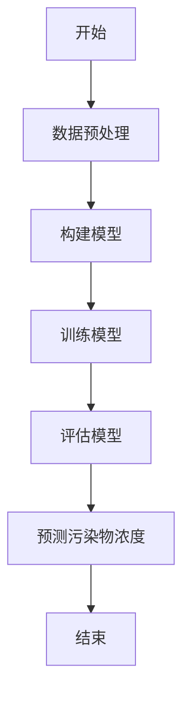

                 

### 第1章：环境污染问题背景

#### 1.1.1 问题背景

环境污染已经成为全球性的问题，对人类健康和生态系统造成了严重威胁。自工业革命以来，人类活动产生的废气、废水和固体废物大量排放，使得大气、水体和土壤等环境要素受到了严重污染。例如，大气污染中的PM2.5和PM10、水污染中的重金属和有机污染物、土壤污染中的农药残留和放射性物质等，都对环境质量和人类生活带来了负面影响。

#### 1.1.2 问题描述

环境污染问题具体表现为以下几个方面：

1. **空气质量恶化**：空气中的污染物浓度不断升高，导致雾霾、酸雨等环境问题，严重影响人们的呼吸健康。
2. **水质污染**：水体中的污染物含量超标，不仅影响了饮用水安全，还导致水生生态系统受到破坏。
3. **土壤污染**：土壤中的有害物质积累，影响农作物生长，甚至通过食物链进入人体，危害人类健康。
4. **生态环境破坏**：工业废弃物和农业废弃物对自然环境的破坏，导致生物多样性减少，生态系统失衡。

#### 1.1.3 问题解决现状

当前，各国政府和国际组织都在积极采取措施应对环境污染问题。主要解决措施包括：

1. **法律法规**：制定严格的环保法规，对污染行为进行限制和处罚。
2. **技术手段**：采用先进的污染治理技术，如空气污染控制技术、水污染治理技术和土壤修复技术等。
3. **环保宣传**：通过教育和宣传提高公众的环保意识，促进绿色发展。
4. **国际合作**：加强国际间的环保合作，共同应对全球性的环境问题。

#### 1.1.4 边界与外延

环境污染问题的边界包括大气、水体和土壤等环境要素，以及与之相关的空气质量、水质和土壤质量等指标。其外延涉及工业、农业、交通等多个领域，不仅影响到人类健康，还对生态平衡和可持续发展产生深远影响。

#### 1.1.5 概念结构与核心要素组成

环境污染问题的概念结构包括以下几个方面：

1. **污染物**：空气中的颗粒物、重金属、有机物等；水中的化学污染物、生物污染物等；土壤中的重金属、有机污染物等。
2. **污染源**：工业排放、交通排放、农业排放等。
3. **受影响对象**：人类、动植物、生态系统等。
4. **污染途径**：空气传播、水体传播、土壤传播等。
5. **治理措施**：法规、技术、宣传等。

通过上述分析，可以看出环境污染问题的复杂性和紧迫性。接下来，我们将进一步探讨人工智能在环境污染监测中的应用前景，为解决这一全球性问题提供新的思路和方法。

#### 1.1.6 小结

环境污染问题不仅关乎人类健康，也影响到生态系统的平衡和可持续发展。通过法律法规、技术手段、环保宣传和国际合作等多方面措施，我们正在努力解决这一全球性难题。在接下来的章节中，我们将深入探讨人工智能在环境污染监测中的应用前景，为这一领域的发展提供新的动力。

### 第2章：人工智能基础概念

#### 2.1.1 人工智能的定义与发展历程

人工智能（Artificial Intelligence，简称AI）是计算机科学的一个分支，旨在研究、开发和应用使计算机模拟人类智能的理论、方法和技术。人工智能的定义经历了多次演变，其核心思想是通过算法和计算模型实现机器的智能行为。

人工智能的发展历程可以分为以下几个阶段：

1. **初始阶段（20世纪50-60年代）**：人工智能的概念首次被提出，研究者开始探索如何使计算机具备推理、学习等能力。
2. **蓬勃发展阶段（20世纪70-80年代）**：人工智能领域迎来了第一次高潮，专家系统和机器学习技术得到了广泛关注和应用。
3. **低谷阶段（20世纪90年代）**：由于实际应用效果不佳，人工智能研究进入低谷期，但底层算法和计算技术的进步为未来的发展奠定了基础。
4. **复兴阶段（21世纪以来）**：随着大数据、云计算和深度学习等技术的发展，人工智能迎来了新一轮的爆发式增长，应用范围从工业生产、医疗诊断到自动驾驶、智能家居等各个领域。

#### 2.1.2 人工智能的核心技术

人工智能的核心技术包括：

1. **机器学习**：通过数据训练模型，使计算机具备自我学习和改进能力。常见的机器学习算法有决策树、支持向量机、神经网络等。
2. **深度学习**：基于多层神经网络的结构，能够处理大量复杂数据，实现图像识别、语音识别、自然语言处理等任务。
3. **计算机视觉**：使计算机能够“看到”和理解图像，广泛应用于安防监控、自动驾驶、医疗影像分析等领域。
4. **自然语言处理**：使计算机能够理解和生成自然语言，应用于智能客服、智能翻译、文本挖掘等领域。
5. **强化学习**：通过不断试错和反馈，使计算机能够在特定环境中做出最优决策，广泛应用于游戏、机器人控制等领域。

#### 2.1.3 人工智能的应用领域

人工智能的应用领域非常广泛，涵盖了工业、医疗、交通、金融、教育等多个行业：

1. **工业**：人工智能在制造业中应用于生产优化、故障诊断、设备维护等，提高了生产效率和质量。
2. **医疗**：人工智能在医学影像分析、疾病诊断、药物研发等领域具有显著优势，有助于提高医疗水平和减少医疗成本。
3. **交通**：人工智能在自动驾驶、交通管理、智慧物流等领域得到广泛应用，有助于提升交通安全和效率。
4. **金融**：人工智能在风险管理、量化交易、客户服务等领域具有重要作用，有助于金融机构提高运营效率和降低风险。
5. **教育**：人工智能在教育领域应用于智能辅导、个性化学习、教育资源分配等，有助于提高教育质量和均衡教育资源。

#### 2.1.4 人工智能的发展趋势

随着技术的不断进步，人工智能的发展趋势呈现出以下几个方向：

1. **跨界融合**：人工智能与其他领域的结合，如生物技术、能源技术等，将带来更多创新和应用。
2. **自主化**：人工智能将逐步实现自主决策和行动，提高自动化水平。
3. **普及化**：人工智能将逐渐渗透到人们生活的各个方面，成为日常生活中的一部分。
4. **伦理与安全**：随着人工智能的发展，相关伦理和安全问题逐渐引起关注，如何确保人工智能的公平性、透明性和可控性成为重要议题。

#### 2.1.5 小结

人工智能作为一门前沿技术，已经深入影响到各个行业和领域。通过不断的技术创新和应用，人工智能在解决环境污染问题等方面展现出巨大的潜力。在接下来的章节中，我们将探讨人工智能在环境污染监测中的应用，为这一领域的未来发展提供新的思路和方法。

#### 2.1.6 继续深入学习

对于想要深入了解人工智能的读者，以下资源可以帮助你进一步学习：

1. **书籍**：《深度学习》（Ian Goodfellow、Yoshua Bengio、Aaron Courville著）、《机器学习》（Tom Mitchell著）等。
2. **在线课程**：斯坦福大学的人工智能课程（CS229）、吴恩达的深度学习课程等。
3. **开源平台**：GitHub、Google Colab等提供了丰富的AI项目和学习资源。
4. **学术论文**：arXiv、IEEE Xplore等学术数据库收录了大量人工智能的最新研究论文。

### 第3章：核心概念与联系

#### 3.1.1 环境污染监测中的核心概念

在环境污染监测中，我们需要明确几个关键概念，以便更好地理解其原理和应用。

1. **污染物**：指存在于环境中，对人类健康、生态系统或环境质量产生负面影响的物质。例如，空气中的PM2.5、水中的重金属、土壤中的农药残留等。
2. **污染源**：指产生污染物的源头，如工业废气、汽车尾气、农业废弃物等。
3. **环境质量**：指环境中各种因素（如空气质量、水质、土壤质量等）对人类健康和生态系统的适宜程度。
4. **监测方法**：指用于检测和评估环境污染的技术手段，如传感器监测、实验室分析等。
5. **数据采集**：指通过监测设备收集环境污染的相关数据，如污染物浓度、排放量等。

#### 3.1.2 概念属性特征对比表格

以下是一个简单的概念属性特征对比表格，用于更直观地了解这些核心概念：

| 概念       | 定义                                                         | 属性特征                                       |
| ---------- | ------------------------------------------------------------ | ---------------------------------------------- |
| 污染物     | 对环境和生物体产生负面影响的物质。                           | 物理性质、化学性质、毒性、浓度                 |
| 污染源     | 产生污染物的源头。                                         | 类型、位置、排放量、排放规律                   |
| 环境质量   | 环境因素对人类健康和生态系统的适宜程度。                     | 空气质量、水质、土壤质量、生态系统健康指标     |
| 监测方法   | 用于检测和评估环境污染的技术手段。                           | 传感器类型、采样频率、分析精度、数据处理方法   |
| 数据采集   | 通过监测设备收集环境污染的相关数据。                         | 数据类型、采集频率、数据完整性、数据存储方式   |

#### 3.1.3 ER实体关系图架构

为了更清晰地描述这些核心概念之间的联系，我们可以使用ER（Entity-Relationship）实体关系图来展示它们之间的关系。

以下是ER实体关系图的Mermaid表示：

```mermaid
erDiagram
    PollutionSource ||--|{ Pollution | }
    Pollution ||--|{ PollutionLevel | }
    PollutionLevel ||--|{ MonitoringData | }
    MonitoringData ||--|{ EnvironmentalQuality | }
    EnvironmentalQuality ||--|{ EcosystemHealth | }
```

在这个ER实体关系图中：

- ** PollutionSource **表示污染源，它产生污染物。
- ** Pollution **表示污染物，它影响环境质量。
- ** PollutionLevel **表示污染物浓度，它是通过监测数据得出的。
- ** MonitoringData **表示监测数据，它是环境质量评估的依据。
- ** EnvironmentalQuality **表示环境质量，它影响生态系统健康。
- ** EcosystemHealth **表示生态系统健康，它是环境质量的一个方面。

通过ER实体关系图，我们可以直观地看到各个核心概念之间的关联，这有助于我们更好地理解和应用这些概念。

#### 3.1.4 小结

在环境污染监测中，理解并掌握核心概念和它们之间的联系是至关重要的。通过上述对比表格和ER实体关系图，我们可以更清晰地认识这些概念，为后续的应用和研究打下坚实的基础。在接下来的章节中，我们将深入探讨人工智能在环境污染监测中的应用，并进一步揭示其潜力。

### 第4章：算法原理讲解

#### 4.1.1 算法原理介绍

在人工智能应用于环境污染监测中，算法的选择和实现是关键环节。本章将介绍一种基于深度学习的算法，用于环境污染物浓度预测。该算法通过分析历史监测数据和气象数据，预测未来的污染物浓度，为环境保护和管理提供科学依据。

#### 4.1.2 数学模型与公式

该算法的核心是建立数学模型，用于描述污染物浓度与影响因素之间的关系。以下是该数学模型的公式：

$$
C(t) = f(P, M, W) + \epsilon(t)
$$

其中：

- \( C(t) \) 表示在时间 \( t \) 的污染物浓度。
- \( P \) 表示污染源排放量。
- \( M \) 表示气象数据（如温度、湿度、风速等）。
- \( W \) 表示其他影响因素（如植被覆盖率、地形等）。
- \( f() \) 表示数学函数。
- \( \epsilon(t) \) 表示随机误差。

#### 4.1.3 算法流程图（Mermaid）

为了更直观地理解算法流程，我们可以使用Mermaid绘制算法流程图：



以下是算法流程图的详细说明：

1. **数据预处理**：对采集到的数据进行清洗、归一化等预处理，以便模型训练。
2. **构建模型**：设计并构建深度学习模型，通常采用卷积神经网络（CNN）或循环神经网络（RNN）。
3. **训练模型**：使用预处理后的数据训练模型，通过迭代优化模型参数。
4. **评估模型**：使用验证数据集评估模型性能，确保模型具有较好的泛化能力。
5. **预测污染物浓度**：使用训练好的模型预测未来的污染物浓度。
6. **结束**：输出预测结果，为环境保护和管理提供科学依据。

#### 4.1.4 Python源代码阐述

以下是一个简单的Python示例代码，用于实现上述算法：

```python
import numpy as np
import pandas as pd
from sklearn.preprocessing import MinMaxScaler
from keras.models import Sequential
from keras.layers import Dense, LSTM

# 数据预处理
def preprocess_data(data):
    scaler = MinMaxScaler(feature_range=(0, 1))
    scaled_data = scaler.fit_transform(data)
    return scaled_data

# 构建模型
def build_model(input_shape):
    model = Sequential()
    model.add(LSTM(units=50, return_sequences=True, input_shape=input_shape))
    model.add(LSTM(units=50))
    model.add(Dense(units=1))
    model.compile(optimizer='adam', loss='mean_squared_error')
    return model

# 训练模型
def train_model(model, X, y):
    model.fit(X, y, epochs=100, batch_size=32)
    return model

# 评估模型
def evaluate_model(model, X_test, y_test):
    predictions = model.predict(X_test)
    mse = np.mean(np.square(predictions - y_test))
    return mse

# 主程序
if __name__ == '__main__':
    # 加载数据
    data = pd.read_csv('pollution_data.csv')
    X = data[['P', 'M', 'W']].values
    y = data['C'].values

    # 数据预处理
    X_processed = preprocess_data(X)
    y_processed = preprocess_data(y.reshape(-1, 1))

    # 构建模型
    model = build_model((X_processed.shape[1], X_processed.shape[2]))

    # 训练模型
    model = train_model(model, X_processed, y_processed)

    # 评估模型
    mse = evaluate_model(model, X_processed, y_processed)
    print(f'Mean Squared Error: {mse}')
```

#### 4.1.5 举例说明

假设我们有以下一组污染物浓度和影响因素的数据：

| 时间 (t) | 污染源排放量 (P) | 气象数据 (M) | 其他影响因素 (W) | 污染物浓度 (C) |
| -------- | ----------------- | ------------- | ----------------- | -------------- |
| 1        | 10                | 25            | 0.8              | 0.5            |
| 2        | 12                | 30            | 0.9              | 0.6            |
| 3        | 9                 | 28            | 0.7              | 0.4            |
| 4        | 11                | 24            | 0.6              | 0.7            |
| 5        | 8                 | 26            | 0.5              | 0.3            |

1. **数据预处理**：将数据归一化，得到处理后的数据。

2. **构建模型**：设计一个包含两个LSTM层的深度学习模型。

3. **训练模型**：使用预处理后的数据进行训练，迭代优化模型参数。

4. **评估模型**：使用验证数据集评估模型性能。

5. **预测污染物浓度**：使用训练好的模型预测下一时间点的污染物浓度。

通过上述步骤，我们能够实现污染物浓度的预测，为环境保护提供科学依据。

#### 4.1.6 小结

在本章中，我们介绍了基于深度学习的算法原理，并通过Python示例代码展示了其实现过程。该算法通过分析历史监测数据和气象数据，实现了污染物浓度的预测，为环境保护和管理提供了有力支持。在接下来的章节中，我们将进一步探讨数学模型和数学公式的详细讲解，为算法的深入理解提供更多支持。

