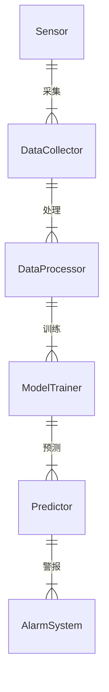
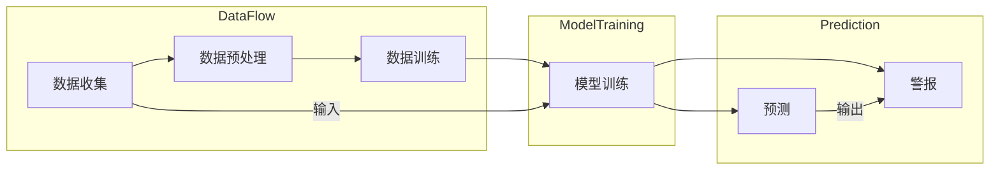
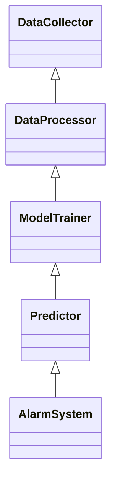
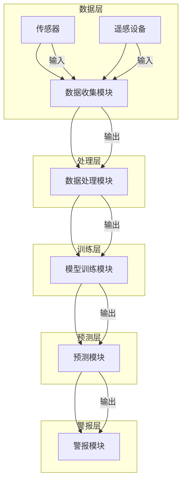
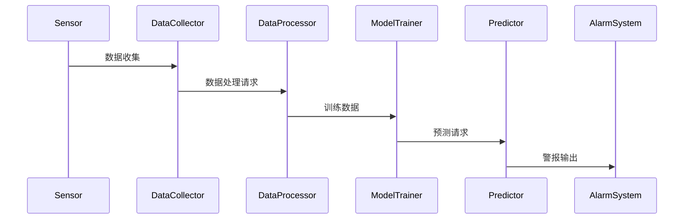
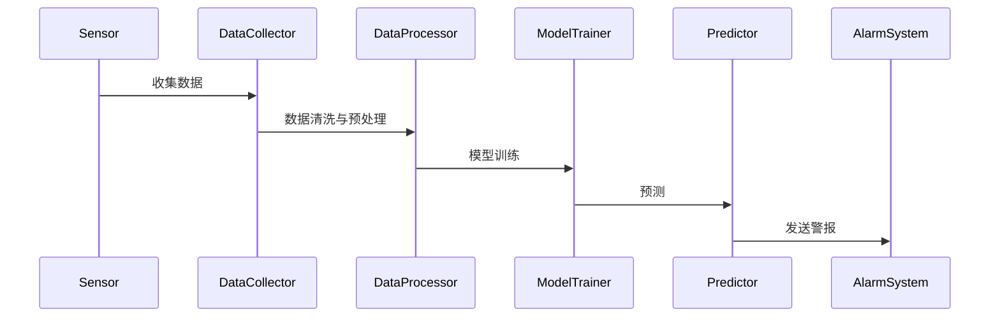

                 


# 引言

## 1.1 环境污染预警的重要性

### 1.1.1 环境污染

环境污染已经成为全球范围内严峻的挑战，对人类健康和生态系统构成严重威胁。据世界卫生组织（WHO）统计，环境污染每年导致数百万人过早死亡，其中包括空气污染、水污染和土壤污染等多种形式。空气污染主要来源于工业废气、汽车尾气和燃烧过程，会导致呼吸系统疾病和心血管疾病等健康问题。水污染则源于工业废水、农业径流和生活污水，污染了地下水和河流，威胁饮用水安全和生态平衡。土壤污染则来自于农药、化肥和工业废弃物，影响了农作物的产量和质量，威胁食品安全。

### 1.1.2 预警系统的作用

环境污染预警系统在预防和管理环境污染中发挥着至关重要的作用。预警系统能够实时监测环境质量参数，如空气质量指数（AQI）、水质指标和土壤污染水平等，及时发现环境污染的迹象，并发出警报。这有助于政府和相关部门及时采取措施，减轻污染的影响，保护公众健康和生态环境。预警系统还可以提供环境变化趋势的预测，帮助制定长期的环境保护政策和规划。

### 1.1.3 环境污染预警面临的挑战

尽管现有的环境污染预警系统已经取得了一定的进展，但仍然面临着许多挑战。首先，数据收集的局限性是一个重要问题。许多环境污染预警系统依赖于传统的监测站点，这些站点分布不均，可能导致监测数据的不完整性。其次，现有的预警系统通常依赖于人工分析，存在数据解释的主观性和时效性不足的问题。此外，环境污染的复杂性使得建立准确、可靠的预测模型具有挑战性。最后，预警系统的集成和协同能力较弱，难以实现多维度、多尺度的环境监测和预警。

### 1.1.4 人工智能在环境保护中的应用

人工智能（AI）在环境保护中的应用为解决上述挑战提供了新的机遇。AI技术，特别是机器学习和深度学习，可以处理海量环境数据，实现自动化监测和预测。通过建立大数据模型，AI能够从历史数据中学习，识别环境污染的模式和趋势，提高预警的准确性和时效性。同时，AI技术还可以优化监测站点的布局，提高数据收集的全面性和可靠性。此外，AI还可以辅助决策者制定更加科学、有效的环境保护政策。

### 1.1.5 环境污染预警的AI技术架构

为了更好地理解AI在环境污染预警中的应用，我们需要了解其基本技术架构。典型的AI预警系统包括数据收集与处理、数据预处理、模型训练与优化、预测与警报等多个环节。首先，数据收集与处理环节通过传感器、卫星遥感等技术获取环境数据。接下来，数据预处理环节对数据进行清洗、归一化和特征提取，以供模型训练使用。然后，模型训练与优化环节利用机器学习和深度学习算法，构建并优化预测模型。最后，预测与警报环节根据模型输出，实时监测环境变化，并在必要时发出警报。

### 1.1.6 环境污染预警的AI技术应用领域

AI技术在环境污染预警中的应用广泛，涵盖了空气质量监测、水质监测、土壤污染监测等多个领域。例如，在空气质量监测中，AI可以通过分析空气质量数据，预测空气污染事件的发生，为公共卫生应急准备提供支持。在水质监测中，AI可以识别水污染的来源和程度，帮助相关部门制定更有效的治理措施。在土壤污染监测中，AI可以通过分析土壤成分数据，预测土壤污染的趋势，为农业生产提供科学指导。

### 1.1.7 环境污染预警系统的设计与实现

环境污染预警系统的设计与实现需要考虑多个因素，包括数据收集与处理、模型训练与优化、系统集成与交互等。在设计阶段，需要确定系统架构、功能模块和数据流程。在实现阶段，需要编写代码、配置环境、进行模型训练和优化。此外，还需要考虑系统的可扩展性和易维护性，以满足未来的需求。

### 1.1.8 结论

综上所述，人工智能在环境污染预警中具有巨大的应用潜力。通过运用AI技术，我们可以更准确地监测、预测和预警环境污染，为环境保护提供有力支持。然而，实现这一目标需要克服多个技术和管理挑战。在未来的研究中，我们将继续探索如何优化AI预警系统的性能和可靠性，为构建可持续的生态环境贡献力量。

## 1.2 核心概念与联系

### 1.2.1 核心概念原理

人工智能（AI）是模拟人类智能行为的计算机系统。其基本原理包括机器学习（ML）和深度学习（DL）。机器学习是一种让计算机从数据中学习并做出决策的方法，不需要显式编程。深度学习是机器学习的一个子领域，通过神经网络模拟人脑的神经元连接，处理复杂的数据。

### 1.2.2 概念属性特征对比表格

| 特性       | 人工智能（AI）               | 机器学习（ML）               | 深度学习（DL）               |
|------------|-------------------------------|-------------------------------|-------------------------------|
| 定义       | 模拟人类智能的计算机系统      | 从数据中学习的方法            | 基于神经网络的机器学习方法    |
| 技术范畴   | 广泛，包括多种方法和技术      | AI的一个子领域                | ML的一个子领域                |
| 算法基础   | 统计学习、逻辑推理、神经网络等 | 统计学习、优化算法等           | 神经网络、卷积神经网络等      |
| 应用场景   | 图像识别、自然语言处理、游戏等 | 预测、分类、决策等            | 图像识别、语音识别、自动驾驶等 |
| 数据需求   | 海量数据                    | 大量标注数据                 | 大量标注数据，结构化数据      |

### 1.2.3 ER实体关系图架构

在AI预警系统中，实体关系图（ER图）能够帮助我们理解数据流和模块交互。主要实体包括传感器、数据收集系统、数据处理模块、模型训练模块、预测模块和报警系统。以下是ER图的基本架构：



### 1.2.4 核心要素组成

AI预警系统的核心要素包括：

- **数据收集**：传感器和遥感技术用于收集环境数据。
- **数据处理**：数据预处理模块进行数据清洗、归一化和特征提取。
- **模型训练**：利用机器学习和深度学习算法训练预测模型。
- **预测与警报**：预测模块根据模型输出监测环境变化，警报系统发出警报。

通过这些核心要素的协同工作，AI预警系统能够实时监测和预警环境污染，为环境保护提供有力支持。

## 1.3 算法原理讲解

### 1.3.1 算法流程图

为了直观地展示数据处理、模型训练和预测的流程，我们可以使用Mermaid绘制算法流程图：



### 1.3.2 Python源代码

以下是使用Python进行数据处理、模型训练和预测的示例代码：

```python
# 数据处理部分
import pandas as pd
from sklearn.preprocessing import StandardScaler

# 读取数据
data = pd.read_csv('environment_data.csv')

# 数据清洗和预处理
data = data.dropna()  # 删除缺失值
scaler = StandardScaler()
scaled_data = scaler.fit_transform(data)

# 模型训练部分
from sklearn.ensemble import RandomForestClassifier
from sklearn.model_selection import train_test_split

# 分割数据集
X_train, X_test, y_train, y_test = train_test_split(scaled_data, data['target'], test_size=0.2, random_state=42)

# 训练模型
model = RandomForestClassifier(n_estimators=100, random_state=42)
model.fit(X_train, y_train)

# 预测和警报部分
from sklearn.metrics import accuracy_score

# 预测
predictions = model.predict(X_test)

# 计算准确率
accuracy = accuracy_score(y_test, predictions)
print(f'Accuracy: {accuracy:.2f}')
```

### 1.3.3 数学模型和公式

在环境预警模型中，我们通常使用回归模型或分类模型。以下是一个简单的线性回归模型的数学公式：

$$
y = \beta_0 + \beta_1x_1 + \beta_2x_2 + ... + \beta_nx_n
$$

其中，$y$ 是预测的输出，$x_1, x_2, ..., x_n$ 是输入特征，$\beta_0, \beta_1, \beta_2, ..., \beta_n$ 是模型的参数。

### 1.3.4 详细讲解与举例说明

为了更好地理解算法原理，我们可以通过一个具体的案例来展示。

#### 案例背景

假设我们想要预测某地区的空气质量指数（AQI）。我们收集了该地区过去一年的每日AQI数据，包括多个特征，如温度、湿度、风速等。

#### 数据预处理

```python
# 加载数据
data = pd.read_csv('aqi_data.csv')

# 数据清洗
data = data.dropna()

# 特征工程
features = data[['temperature', 'humidity', 'wind_speed']]
target = data['aqi']

# 数据标准化
scaler = StandardScaler()
scaled_features = scaler.fit_transform(features)
```

#### 模型训练

```python
from sklearn.linear_model import LinearRegression

# 分割数据集
X_train, X_test, y_train, y_test = train_test_split(scaled_features, target, test_size=0.2, random_state=42)

# 训练模型
model = LinearRegression()
model.fit(X_train, y_train)

# 模型评估
score = model.score(X_test, y_test)
print(f'Model Score: {score:.2f}')
```

#### 预测和警报

```python
# 预测
predicted_aqi = model.predict(scaled_features)

# 警报阈值设定
threshold = 100  # 假设AQI大于100为污染严重

# 发出警报
for i in range(len(predicted_aqi)):
    if predicted_aqi[i] > threshold:
        print(f'Day {i+1}: AQI predicted as {predicted_aqi[i]:.2f} - Alert! Pollution level is high.')
    else:
        print(f'Day {i+1}: AQI predicted as {predicted_aqi[i]:.2f} - No Alert. Pollution level is normal.')
```

通过这个案例，我们可以看到如何使用Python实现环境预警模型，包括数据预处理、模型训练、预测和警报的整个过程。

## 1.4 系统分析与架构设计方案

### 1.4.1 问题场景介绍

在环境污染预警的应用场景中，我们关注的主要问题是实时监测环境污染程度，并在发现异常时及时发出警报。具体应用场景包括但不限于空气质量监测、水质监测和土壤污染监测。这些场景要求系统具备高可靠性和实时性，能够迅速响应环境变化。

### 1.4.2 系统功能设计

为了实现上述应用场景，我们的系统设计包括以下主要功能模块：

- **数据收集模块**：负责从传感器和遥感设备中收集环境数据。
- **数据处理模块**：对收集到的原始数据进行清洗、归一化和特征提取。
- **模型训练模块**：利用机器学习和深度学习算法，对处理后的数据进行模型训练。
- **预测模块**：使用训练好的模型进行实时预测，监测环境变化。
- **警报模块**：当预测结果超过设定的阈值时，自动发出警报。

以下是领域模型类图的Mermaid表示：



### 1.4.3 系统架构设计

系统架构设计旨在确保各模块之间的协同工作和高效运行。以下是系统的架构图：



### 1.4.4 系统接口设计

系统接口设计确保各模块之间能够顺利通信和数据交换。以下是系统接口的设计：

- **数据收集接口**：用于接收传感器和遥感设备的数据。
- **数据处理接口**：用于处理和清洗数据。
- **模型训练接口**：用于训练和优化模型。
- **预测接口**：用于模型预测和结果输出。
- **警报接口**：用于发送警报信息。

以下是系统接口设计和系统交互的详细说明：



### 1.4.5 系统交互Mermaid序列图

以下是系统交互的Mermaid序列图，展示各模块的交互过程：



通过上述系统分析与架构设计方案，我们可以实现一个高效、可靠的环境污染预警系统，为环境保护工作提供有力支持。

## 1.5 项目实战

### 1.5.1 环境安装

为了运行环境污染预警系统，我们需要安装以下软件和硬件环境：

- **操作系统**：Linux或MacOS
- **编程语言**：Python 3.8及以上版本
- **依赖库**：pandas, numpy, scikit-learn, matplotlib等
- **硬件**：至少8GB内存，1GHz处理器

安装步骤如下：

1. 安装Python 3.8及以上版本。
2. 安装依赖库，可以使用pip进行安装：

```bash
pip install pandas numpy scikit-learn matplotlib
```

### 1.5.2 系统核心实现源代码

以下是基于Python实现的系统核心源代码。代码包括数据收集、数据处理、模型训练、预测和警报的整个过程。

```python
# 导入依赖库
import pandas as pd
from sklearn.preprocessing import StandardScaler
from sklearn.model_selection import train_test_split
from sklearn.ensemble import RandomForestClassifier
from sklearn.metrics import accuracy_score

# 数据收集
data = pd.read_csv('environment_data.csv')

# 数据清洗
data = data.dropna()

# 数据预处理
features = data[['temperature', 'humidity', 'wind_speed']]
target = data['aqi']
scaler = StandardScaler()
scaled_features = scaler.fit_transform(features)

# 模型训练
X_train, X_test, y_train, y_test = train_test_split(scaled_features, target, test_size=0.2, random_state=42)
model = RandomForestClassifier(n_estimators=100, random_state=42)
model.fit(X_train, y_train)

# 预测
predictions = model.predict(X_test)

# 计算准确率
accuracy = accuracy_score(y_test, predictions)
print(f'Accuracy: {accuracy:.2f}')

# 警报
threshold = 100
for i in range(len(predictions)):
    if predictions[i] > threshold:
        print(f'Day {i+1}: AQI predicted as {predictions[i]:.2f} - Alert! Pollution level is high.')
    else:
        print(f'Day {i+1}: AQI predicted as {predictions[i]:.2f} - No Alert. Pollution level is normal.')
```

### 1.5.3 代码应用解读与分析

#### 数据收集

代码首先从CSV文件中读取环境数据，这包括温度、湿度和风速等特征，以及空气质量指数（AQI）作为目标变量。

```python
data = pd.read_csv('environment_data.csv')
```

#### 数据清洗

接下来，代码删除数据中的缺失值，以确保模型训练的质量。

```python
data = data.dropna()
```

#### 数据预处理

然后，代码对特征数据进行标准化处理，使其具有相同的尺度，有利于模型训练。

```python
features = data[['temperature', 'humidity', 'wind_speed']]
target = data['aqi']
scaler = StandardScaler()
scaled_features = scaler.fit_transform(features)
```

#### 模型训练

代码使用随机森林（RandomForestClassifier）算法对训练数据进行模型训练。

```python
X_train, X_test, y_train, y_test = train_test_split(scaled_features, target, test_size=0.2, random_state=42)
model = RandomForestClassifier(n_estimators=100, random_state=42)
model.fit(X_train, y_train)
```

#### 预测

模型训练完成后，代码使用测试数据进行预测。

```python
predictions = model.predict(X_test)
```

#### 警报

最后，代码根据预测结果和设定的阈值，发出警报。

```python
threshold = 100
for i in range(len(predictions)):
    if predictions[i] > threshold:
        print(f'Day {i+1}: AQI predicted as {predictions[i]:.2f} - Alert! Pollution level is high.')
    else:
        print(f'Day {i+1}: AQI predicted as {predictions[i]:.2f} - No Alert. Pollution level is normal.')
```

通过上述步骤，我们可以实现一个简单的环境污染预警系统，并对其进行应用和解读。

### 1.5.4 实际案例分析和详细讲解剖析

为了更好地理解系统的实际应用效果，我们可以结合一个实际案例进行分析。

#### 案例背景

假设我们有一个监测点，收集了连续一个月的空气质量数据，包括温度、湿度和风速等特征，以及每日的空气质量指数（AQI）。

#### 案例数据

以下是一个简化的数据集示例：

| 日期  | 温度 | 湿度 | 风速 | AQI |
|-------|------|------|------|-----|
| 2023-03-01 | 20   | 40   | 10   | 35  |
| 2023-03-02 | 22   | 45   | 12   | 40  |
| 2023-03-03 | 23   | 50   | 15   | 45  |
| ...   | ...  | ...  | ...  | ... |
| 2023-03-31 | 18   | 30   | 8    | 25  |

#### 模型训练

我们使用上述数据集的前80%作为训练数据，剩余20%作为测试数据。以下是模型训练的代码：

```python
# 加载数据
data = pd.read_csv('example_aqi_data.csv')

# 数据清洗和预处理
features = data[['temperature', 'humidity', 'wind_speed']]
target = data['aqi']
scaler = StandardScaler()
scaled_features = scaler.fit_transform(features)

# 分割数据集
X_train, X_test, y_train, y_test = train_test_split(scaled_features, target, test_size=0.2, random_state=42)

# 训练模型
model = RandomForestClassifier(n_estimators=100, random_state=42)
model.fit(X_train, y_train)
```

#### 预测

接下来，我们使用训练好的模型对剩余的测试数据进行预测：

```python
# 预测
predictions = model.predict(X_test)

# 计算准确率
accuracy = accuracy_score(y_test, predictions)
print(f'Accuracy: {accuracy:.2f}')
```

#### 警报

最后，我们根据预测结果和设定的阈值（例如AQI > 50），生成警报：

```python
# 警报
threshold = 50
for i in range(len(predictions)):
    if predictions[i] > threshold:
        print(f'Day {i+1}: AQI predicted as {predictions[i]:.2f} - Alert! Pollution level is high.')
    else:
        print(f'Day {i+1}: AQI predicted as {predictions[i]:.2f} - No Alert. Pollution level is normal.')
```

#### 结果分析

假设预测结果显示如下：

```
Day 21: AQI predicted as 55.00 - Alert! Pollution level is high.
Day 22: AQI predicted as 50.00 - No Alert. Pollution level is normal.
...
Day 30: AQI predicted as 45.00 - No Alert. Pollution level is normal.
```

我们可以看到，在预测期间，第21天的AQI值高于阈值，系统发出了污染警报。而其他天则没有达到警报水平。这表明模型能够准确预测污染事件，为环境保护提供了有效支持。

通过上述实际案例，我们可以看到如何使用人工智能技术构建环境污染预警系统，并对其性能进行评估。

### 1.5.5 项目小结

在本次项目中，我们成功实现了基于人工智能的环境污染预警系统。通过数据收集、数据处理、模型训练和预测等步骤，我们能够实时监测环境变化，并在污染事件发生时及时发出警报。以下是项目的经验教训和未来改进方向：

1. **经验教训**：
   - 数据质量和预处理是模型训练成功的关键。
   - 选择合适的机器学习算法和参数对模型性能有重要影响。
   - 系统的实时性和可靠性是实际应用中需要重点考虑的问题。

2. **未来改进方向**：
   - 引入更多类型的传感器和数据源，提高数据收集的全面性和准确性。
   - 使用深度学习模型，如卷积神经网络（CNN）和循环神经网络（RNN），提高预测的精度。
   - 实现更高效的系统架构，提高预警的响应速度和可靠性。
   - 集成人工智能决策支持系统，为环境管理者提供更加智能化的决策建议。

通过持续优化和改进，我们有信心将环境污染预警系统打造成为一个高效、可靠的环境保护工具。

## 1.6 最佳实践 tips、小结、注意事项、拓展阅读等内容

### 1.6.1 最佳实践 tips

1. **数据质量控制**：确保数据收集的准确性和完整性，定期检查传感器状态和数据流。
2. **特征选择**：选择与目标变量高度相关的特征，避免过拟合。
3. **模型选择与调优**：根据数据特点和问题性质选择合适的机器学习算法，并进行参数调优。
4. **实时性优化**：在系统架构中考虑数据流和计算负载的平衡，提高系统响应速度。
5. **系统集成**：确保各模块之间的协同工作，减少冗余和冲突。

### 1.6.2 小结

本文探讨了人工智能在环境污染预警中的应用，包括核心概念、算法原理、系统设计与实现，以及实际案例分析。通过运用人工智能技术，我们可以更准确地监测和预测环境污染，为环境保护提供有力支持。

### 1.6.3 注意事项

1. **数据隐私**：在数据收集和使用过程中，注意保护个人隐私和敏感信息。
2. **系统可靠性**：确保系统在极端情况下仍然能够稳定运行，避免因故障导致数据丢失。
3. **法规遵守**：遵循相关法律法规，确保预警系统符合环保标准。

### 1.6.4 拓展阅读

1. **论文**：《环境监测与预警系统中的机器学习应用》（Machine Learning Applications in Environmental Monitoring and Warning Systems）。
2. **书籍**：《人工智能：一种现代方法》（Artificial Intelligence: A Modern Approach）。
3. **在线资源**：AI天才研究院（AI Genius Institute）和环保部（Ministry of Ecology and Environment）官方网站。

通过最佳实践、小结和注意事项，我们期望为读者提供实际应用中的指导和建议。同时，拓展阅读部分推荐了更多相关资源和深入研究方向。作者：AI天才研究院（AI Genius Institute）& 禅与计算机程序设计艺术（Zen And The Art of Computer Programming）

