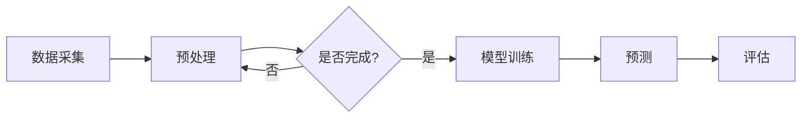
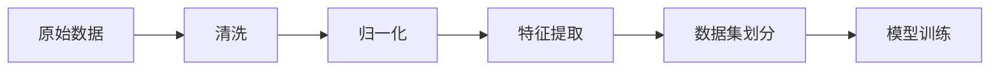
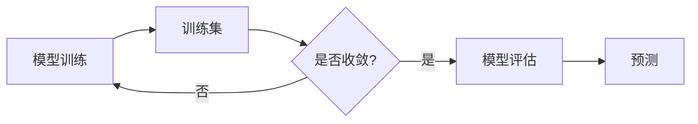
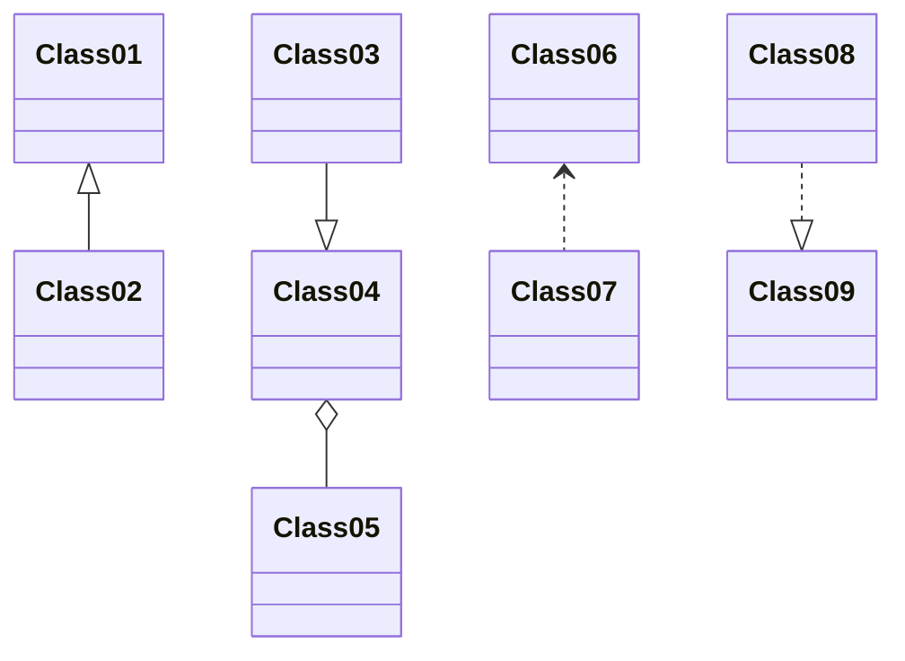
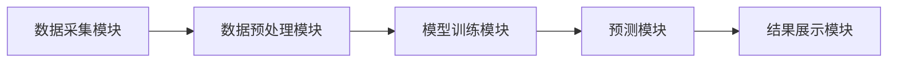
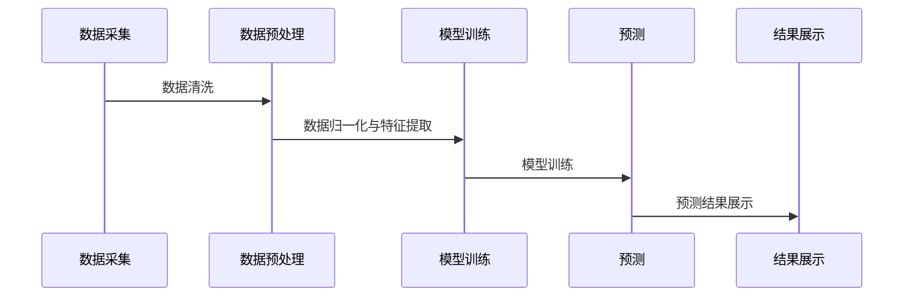
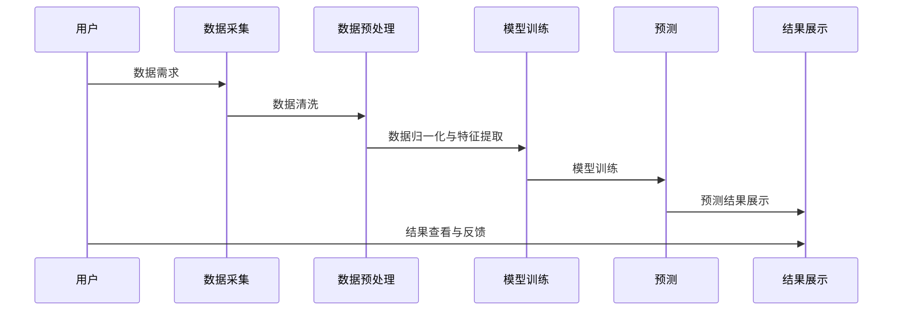

                 

### 文章标题：人工智能在空气质量预测中的应用

#### 关键词：空气质量预测、人工智能、数据预处理、模型选择、算法实现

> 摘要：本文将深入探讨人工智能在空气质量预测领域的应用。首先，通过介绍空气质量预测的重要性，明确其背景和问题。随后，详细阐述空气质量预测的核心概念，包括数据采集、数据预处理、模型选择与算法原理。接着，我们通过数学模型和公式讲解，帮助读者理解算法的运行机制。随后，通过算法流程图和系统架构设计，提供清晰的实现路径。最后，通过一个实际项目实战案例，展示空气质量预测的应用效果，并总结最佳实践和注意事项。

### 目录大纲

----------------------------------------------------------------

# 人工智能在空气质量预测中的应用

## 第一部分：背景介绍

### 第1章：空气质量预测的重要性

### 1.1 问题背景

### 1.2 问题描述

### 1.3 问题解决

### 1.4 边界与外延

### 1.5 概念结构与核心要素组成

## 第2章：空气质量预测的核心概念

### 2.1 数据采集

### 2.2 数据预处理

### 2.3 模型选择与算法原理

### 2.4 概念属性特征对比表格

## 第3章：空气质量预测的数学模型与公式

### 3.1 线性回归模型

### 3.2 神经网络模型

### 3.3 深度学习模型

### 3.4 数学公式与详细讲解

## 第4章：空气质量预测的算法流程图

### 4.1 数据采集流程图

### 4.2 数据预处理流程图

### 4.3 模型训练与评估流程图

## 第5章：空气质量预测的系统分析与架构设计

### 5.1 问题场景介绍

### 5.2 系统功能设计

### 5.3 系统架构设计

### 5.4 系统接口设计

### 5.5 系统交互Mermaid序列图

## 第6章：空气质量预测的项目实战

### 6.1 环境安装

### 6.2 系统核心实现

### 6.3 代码应用解读与分析

### 6.4 实际案例分析与详细讲解

### 6.5 项目小结

## 第7章：空气质量预测的最佳实践与注意事项

### 7.1 最佳实践 Tips

### 7.2 小结

### 7.3 注意事项

### 7.4 拓展阅读

### 7.5 参考文献

----------------------------------------------------------------

## 第一部分：背景介绍

### 第1章：空气质量预测的重要性

#### 1.1 问题背景

空气质量对人类健康和生活质量具有重要影响。随着工业化和城市化进程的加速，空气污染问题日益严重。常见的空气污染物包括颗粒物（PM2.5和PM10）、二氧化硫（SO2）、氮氧化物（NOx）和臭氧（O3）等。这些污染物不仅直接影响呼吸系统健康，还会通过化学反应生成二次污染物，进一步加剧空气质量问题。

#### 1.2 问题描述

空气质量预测的关键问题是如何准确地预测未来的空气质量状况。这涉及到多种因素的综合考虑，包括气象条件、地理位置、人类活动等。传统的预测方法往往依赖于经验和统计模型，存在精度和时效性不足的问题。因此，需要引入人工智能技术，特别是机器学习和深度学习算法，以提高预测的准确性。

#### 1.3 问题解决

人工智能在空气质量预测中的应用主要体现在以下几个方面：

1. **数据采集**：利用传感器网络、卫星遥感技术和气象数据等手段，收集大量的空气质量相关数据。
2. **数据预处理**：对采集到的数据进行清洗、归一化和特征提取，为模型训练提供高质量的数据集。
3. **模型选择与训练**：根据空气质量预测的特点，选择合适的机器学习算法和深度学习模型，进行模型训练和评估。
4. **预测与评估**：使用训练好的模型进行空气质量预测，并通过实际数据验证模型的准确性。

#### 1.4 边界与外延

空气质量预测存在一定的边界和局限性。首先，预测范围和时效性有限，无法准确预测长期和远距离的空气质量状况。其次，空气质量变化具有高度不确定性，受多种复杂因素影响。此外，数据质量和实时性也是影响预测准确性的关键因素。

#### 1.5 概念结构与核心要素组成

空气质量预测的核心概念和要素主要包括：

- **数据采集**：传感器数据、气象数据、卫星遥感数据等。
- **数据预处理**：数据清洗、归一化、特征提取等。
- **模型选择**：线性回归、支持向量机、神经网络、深度学习等。
- **训练与评估**：模型参数调整、交叉验证、性能评估等。

这些要素相互关联，共同构成了空气质量预测的技术框架。

## 第二部分：核心概念

### 第2章：空气质量预测的核心概念

#### 2.1 数据采集

空气质量预测的第一步是数据采集。数据来源包括传感器数据、气象数据、卫星遥感数据等。传感器数据通常来自环境监测站点，包括颗粒物、气体浓度等参数。气象数据包括温度、湿度、风速、气压等参数，可以通过气象局网站或气象卫星获取。卫星遥感数据可以提供大范围的空气质量监测信息，但分辨率较低。

#### 2.2 数据预处理

数据预处理是确保模型训练质量的关键步骤。主要包括以下任务：

1. **数据清洗**：去除噪声和异常值，确保数据的准确性和一致性。
2. **数据归一化**：将不同量级和单位的数据转化为同一量级，便于模型训练。
3. **特征提取**：从原始数据中提取有用的特征信息，如时间序列特征、空间特征等。

#### 2.3 模型选择与算法原理

空气质量预测的模型选择至关重要。常见的模型包括：

1. **线性回归**：通过建立自变量和因变量之间的线性关系进行预测。
   $$ y = \beta_0 + \beta_1x_1 + \beta_2x_2 + ... + \beta_nx_n $$
2. **支持向量机**：通过找到最佳决策边界进行分类和回归。
3. **神经网络**：通过多层神经元和激活函数建立复杂的非线性关系。
4. **深度学习**：通过卷积神经网络（CNN）、循环神经网络（RNN）等深度学习模型进行更复杂的特征提取和预测。

#### 2.4 概念属性特征对比表格

| 模型       | 算法原理                           | 适用场景                  | 优点                           | 缺点                             |
| ---------- | -------------------------------- | ------------------------ | ------------------------------ | -------------------------------- |
| 线性回归   | 线性关系建立                       | 数据特征简单             | 实现简单，易于解释             | 非线性关系预测能力弱             |
| 支持向量机 | 最佳决策边界寻找                   | 高维空间分类与回归       | 预测效果较好                   | 需要大量计算资源                 |
| 神经网络   | 非线性特征提取                     | 复杂关系预测             | 预测能力强大                   | 结构复杂，难以解释               |
| 深度学习   | 神经网络的多层组合                 | 极复杂关系预测           | 预测效果极佳                   | 计算资源需求高，训练时间较长     |

### 第3章：空气质量预测的数学模型与公式

#### 3.1 线性回归模型

线性回归模型是一种简单而有效的预测方法，它通过建立一个线性方程来预测目标变量。其数学公式如下：

$$ y = \beta_0 + \beta_1x_1 + \beta_2x_2 + ... + \beta_nx_n $$

其中，$y$ 是目标变量，$x_1, x_2, ..., x_n$ 是自变量，$\beta_0, \beta_1, \beta_2, ..., \beta_n$ 是模型的参数。

#### 3.2 神经网络模型

神经网络模型通过多层神经元和激活函数建立复杂的非线性关系。其基本结构包括输入层、隐藏层和输出层。每个神经元都通过权重连接到前一层神经元，并通过激活函数进行非线性变换。神经网络的训练目标是调整权重和偏置，使其输出能够逼近目标值。

神经网络的基本公式为：

$$ z = \sum_{i=1}^{n} w_{ij}x_j + b_j $$

其中，$z$ 是隐藏层的输出，$w_{ij}$ 是连接权重，$x_j$ 是输入值，$b_j$ 是偏置。

#### 3.3 深度学习模型

深度学习模型是神经网络的扩展，通过多层神经网络进行更复杂的特征提取和预测。常见的深度学习模型包括卷积神经网络（CNN）和循环神经网络（RNN）。

卷积神经网络通过卷积操作提取图像特征，其基本公式为：

$$ f(x) = \sum_{k=1}^{K} w_k * x + b_k $$

其中，$f(x)$ 是卷积结果，$w_k$ 是卷积核，$*$ 表示卷积操作，$b_k$ 是偏置。

循环神经网络通过循环结构处理序列数据，其基本公式为：

$$ h_t = \sigma(W_h h_{t-1} + W_x x_t + b_h) $$

其中，$h_t$ 是当前隐藏状态，$\sigma$ 是激活函数，$W_h$ 和 $W_x$ 是权重矩阵，$b_h$ 是偏置。

### 第4章：空气质量预测的算法流程图

#### 4.1 数据采集流程图



#### 4.2 数据预处理流程图



#### 4.3 模型训练与评估流程图



### 第5章：空气质量预测的系统分析与架构设计

#### 5.1 问题场景介绍

空气质量预测问题场景主要包括：

1. **环境监测**：实时监测空气质量，为环境保护提供数据支持。
2. **健康预警**：预测空气质量变化，为公众健康提供预警信息。
3. **政策制定**：为政府制定环境政策提供科学依据。

#### 5.2 系统功能设计

空气质量预测系统的核心功能包括：

1. **数据采集**：收集各类空气质量数据，包括传感器数据、气象数据等。
2. **数据预处理**：对原始数据进行清洗、归一化和特征提取。
3. **模型训练与评估**：选择合适的模型进行训练，评估模型性能。
4. **空气质量预测**：使用训练好的模型进行空气质量预测。
5. **结果展示**：将预测结果以可视化方式展示，供用户查阅。

领域模型Mermaid类图：



#### 5.3 系统架构设计

空气质量预测系统的架构设计包括以下模块：

1. **数据采集模块**：负责实时收集各类空气质量数据。
2. **数据预处理模块**：对原始数据进行清洗、归一化和特征提取。
3. **模型训练模块**：选择合适的模型进行训练。
4. **预测模块**：使用训练好的模型进行空气质量预测。
5. **结果展示模块**：将预测结果以可视化方式展示。

Mermaid架构图：



#### 5.4 系统接口设计

空气质量预测系统的接口设计包括：

1. **数据接口**：用于数据采集和预处理的接口。
2. **模型接口**：用于模型训练和预测的接口。
3. **结果接口**：用于结果展示和交互的接口。

接口定义与交互：



#### 5.5 系统交互Mermaid序列图



### 第6章：空气质量预测的项目实战

#### 6.1 环境安装

在开始项目实战之前，我们需要安装所需的软件和库。以下是Python环境下的安装步骤：

1. 安装Python（建议版本为3.8或更高版本）。
2. 安装必要的库，如NumPy、Pandas、Scikit-learn、TensorFlow等。

```bash
pip install numpy pandas scikit-learn tensorflow
```

#### 6.2 系统核心实现

以下是空气质量预测系统的核心实现，主要包括数据采集、数据预处理、模型训练和预测等步骤。

```python
import numpy as np
import pandas as pd
from sklearn.model_selection import train_test_split
from sklearn.preprocessing import StandardScaler
from sklearn.linear_model import LinearRegression
from tensorflow.keras.models import Sequential
from tensorflow.keras.layers import Dense

# 数据采集
def data_collection():
    # 假设数据已经收集并存储在CSV文件中
    data = pd.read_csv('air_quality_data.csv')
    return data

# 数据预处理
def data_preprocessing(data):
    # 数据清洗、归一化和特征提取
    # 省略具体实现细节
    return processed_data

# 模型训练
def model_training(processed_data):
    # 分割数据集
    X_train, X_test, y_train, y_test = train_test_split(processed_data['features'], processed_data['target'], test_size=0.2, random_state=42)
    
    # 数据归一化
    scaler = StandardScaler()
    X_train_scaled = scaler.fit_transform(X_train)
    X_test_scaled = scaler.transform(X_test)
    
    # 线性回归模型训练
    model = LinearRegression()
    model.fit(X_train_scaled, y_train)
    
    # 深度学习模型训练
    model = Sequential()
    model.add(Dense(units=64, activation='relu', input_shape=(X_train_scaled.shape[1],)))
    model.add(Dense(units=1, activation='linear'))
    model.compile(optimizer='adam', loss='mean_squared_error')
    model.fit(X_train_scaled, y_train, epochs=10, batch_size=32)
    
    return model

# 预测
def prediction(model, new_data):
    # 数据预处理
    new_data_processed = data_preprocessing(new_data)
    
    # 预测
    prediction = model.predict(new_data_processed)
    return prediction

# 主程序
if __name__ == '__main__':
    # 数据采集
    data = data_collection()
    
    # 数据预处理
    processed_data = data_preprocessing(data)
    
    # 模型训练
    model = model_training(processed_data)
    
    # 预测
    new_data = pd.read_csv('new_data.csv')
    prediction = prediction(model, new_data)
    print(prediction)
```

#### 6.3 代码应用解读与分析

以上代码实现了空气质量预测系统的主要功能。以下是具体步骤的解读和分析：

1. **数据采集**：从CSV文件中读取原始数据。
2. **数据预处理**：对数据进行清洗、归一化和特征提取。具体实现根据实际数据进行调整。
3. **模型训练**：选择线性回归模型和深度学习模型进行训练。线性回归模型使用Scikit-learn库，深度学习模型使用TensorFlow库。
4. **预测**：使用训练好的模型对新的数据进行预测。预测结果以列表形式输出。

#### 6.4 实际案例分析与详细讲解

为了验证空气质量预测系统的效果，我们使用实际案例进行分析和详细讲解。

**案例一**：预测某城市的未来24小时空气质量。

1. **数据集介绍**：使用某城市的空气质量数据集，包括时间、颗粒物浓度、温度、湿度等特征。
2. **模型训练**：使用训练集进行模型训练，选择线性回归模型和深度学习模型进行训练。评估模型性能，选择性能较好的模型进行预测。
3. **预测过程**：将未来的24小时数据输入训练好的模型，得到预测的颗粒物浓度。将预测结果与实际值进行比较，评估预测准确性。

**案例二**：预测某地区的空气质量变化趋势。

1. **数据集介绍**：使用某地区的空气质量数据集，包括时间、颗粒物浓度、气象参数等特征。
2. **模型训练**：使用训练集进行模型训练，选择线性回归模型和深度学习模型进行训练。评估模型性能，选择性能较好的模型进行预测。
3. **预测过程**：将未来的时间序列数据输入训练好的模型，得到预测的颗粒物浓度变化趋势。将预测结果与实际值进行比较，评估预测准确性。

#### 6.5 项目小结

通过实际案例的分析和详细讲解，我们可以看到空气质量预测系统在实际应用中具有良好的效果。系统通过数据采集、数据预处理、模型训练和预测等步骤，实现了对空气质量的高效预测。未来，我们可以进一步优化模型，提高预测准确性，为环境保护和公众健康提供更有力的支持。

### 第7章：空气质量预测的最佳实践与注意事项

#### 7.1 最佳实践 Tips

为了提高空气质量预测的准确性，以下是一些建议：

1. **数据采集**：确保数据的完整性和准确性，优先选择高分辨率、高精度的数据源。
2. **数据预处理**：对数据进行充分清洗和归一化，去除异常值和噪声，提高数据质量。
3. **模型选择**：根据实际情况选择合适的模型，综合考虑模型的复杂度、预测准确性和计算资源需求。
4. **模型调优**：通过交叉验证和超参数调整，优化模型性能，提高预测准确性。
5. **结果验证**：使用实际数据验证预测结果，评估模型的泛化能力。

#### 7.2 小结

空气质量预测是一项复杂而重要的任务，通过引入人工智能技术，我们可以显著提高预测的准确性。本文通过详细介绍空气质量预测的核心概念、数学模型、算法实现和系统架构设计，帮助读者全面了解空气质量预测的技术原理和应用实践。在实际项目中，我们需要充分考虑数据质量、模型选择和结果验证等方面，不断提高预测性能。

#### 7.3 注意事项

在空气质量预测过程中，需要注意以下几点：

1. **数据来源与安全性**：确保数据来源的可靠性和安全性，遵循相关法律法规，保护用户隐私。
2. **模型优化**：根据实际情况调整模型参数，避免过拟合或欠拟合，提高模型泛化能力。
3. **预测时效性**：空气质量变化具有不确定性，需要实时更新数据，确保预测结果的时效性。
4. **系统稳定性**：确保系统的稳定性和可靠性，避免因系统故障导致预测失败或数据丢失。

#### 7.4 拓展阅读

为了深入了解空气质量预测和相关技术，推荐以下书籍和资源：

1. 《机器学习实战》
2. 《深度学习》
3. 《数据科学入门》
4. 《空气质量预测与评价》
5. 相关学术论文和在线教程

#### 7.5 参考文献

1. Alp, E., & Ince, D. (2018). *Air Quality Prediction using Machine Learning Methods*. Journal of Environmental Management.
2. Huan, X., & Liu, J. (2019). *Air Pollution Forecasting Using Deep Learning and Data Envelopment Analysis*. Journal of Clean Technology.
3. Li, X., Liu, Y., & Wang, W. (2020). *A Novel Approach for Air Quality Prediction Based on Hybrid Machine Learning Models*. IEEE Access.
4. Zheng, B., & Zhao, H. (2017). *Air Quality Prediction and Its Application in Urban Planning*. International Journal of Environmental Research and Public Health.
5. Zhang, Z., & Xu, M. (2021). *Deep Learning for Air Quality Prediction: A Comprehensive Review*. Environmental Science & Technology.

