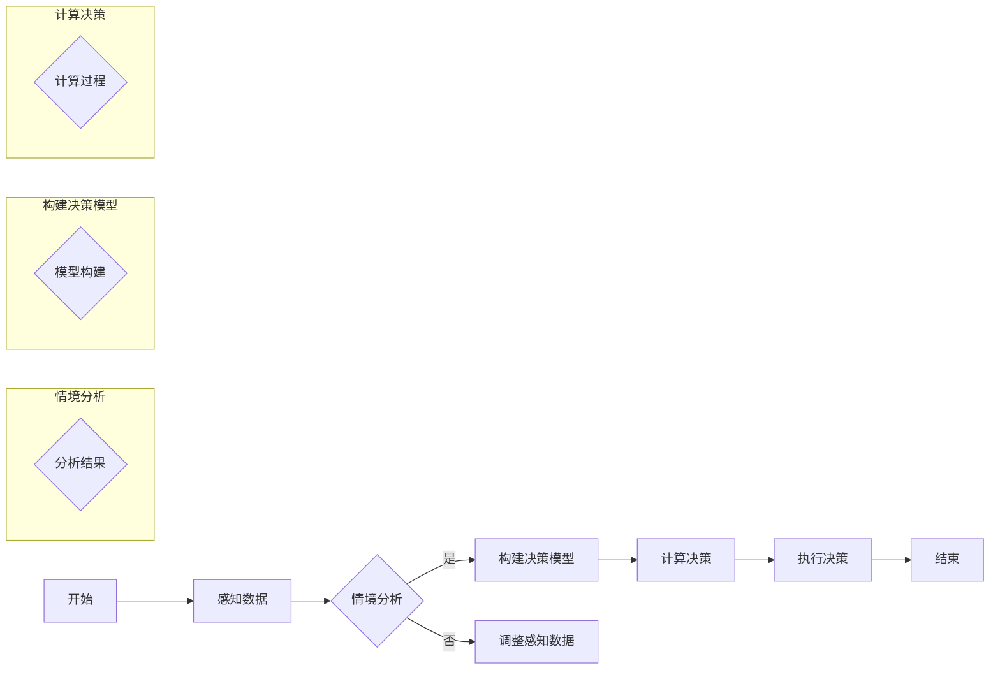
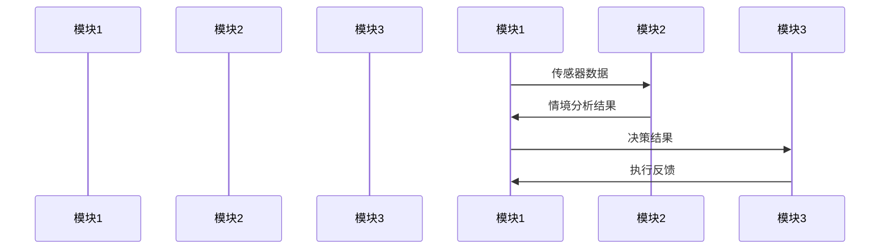
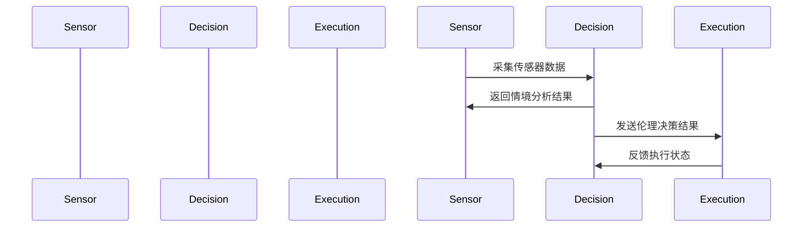

                 

### 1.1 自动驾驶伦理问题的背景

#### 自动驾驶技术的发展历程

自动驾驶技术起源于20世纪50年代，最初的概念是在军事领域中实现。然而，随着计算机科学和人工智能技术的发展，自动驾驶逐渐走向民用领域。20世纪80年代，卡内基梅隆大学的研究人员开发了第一个自动驾驶汽车项目，标志着自动驾驶技术的起步。进入21世纪，随着传感器技术、机器学习和计算机视觉的飞速发展，自动驾驶技术得到了广泛关注和应用。

#### 自动驾驶在现代社会的重要性

自动驾驶技术被认为是未来交通系统的重要组成部分，具有显著的社会和经济价值。首先，自动驾驶可以提高道路安全性，减少交通事故的发生。据统计，大部分交通事故是由人为错误导致的，而自动驾驶系统能够更加精准地处理各种路况信息，减少意外情况的发生。其次，自动驾驶可以改善交通效率，缓解城市交通拥堵。通过优化行驶路线和速度控制，自动驾驶技术可以有效地缩短通勤时间，提高道路通行能力。此外，自动驾驶技术还有助于降低运输成本，提高物流效率，推动经济发展。

#### 自动驾驶伦理问题的出现

尽管自动驾驶技术具有巨大的潜力和优势，但也引发了诸多伦理问题。首先，自动驾驶系统在面对道德困境时，如何做出正确的决策成为了一个亟待解决的问题。例如，当自动驾驶车辆在无法避免碰撞的情况下，需要选择撞击哪个目标时，系统应该如何决策？这种道德抉择不仅仅是一个技术问题，更是一个伦理问题。其次，自动驾驶技术的普及和应用可能导致就业岗位的流失，引发社会不公平。例如，出租车和货车司机的职业可能因为自动驾驶技术的普及而面临被取代的风险。此外，自动驾驶车辆的隐私保护、数据安全和法律法规制定等问题也需要深入探讨。

#### 自动驾驶伦理问题的多样性

自动驾驶伦理问题具有多样性和复杂性，涵盖了多个层面。首先，在个体层面，自动驾驶技术的道德决策涉及到生命价值、个体权益和公共利益之间的权衡。其次，在社会层面，自动驾驶技术的普及可能引发社会结构的变革，需要重新思考交通、就业和社会公平等问题。此外，在技术层面，自动驾驶系统的安全性和可靠性也引发了伦理关注，如何在保障技术发展的同时，确保技术应用的安全性成为了一个重要课题。

### 1.2 自动驾驶伦理问题的描述

#### 自动驾驶伦理问题的复杂性

自动驾驶伦理问题的复杂性体现在多个方面。首先，自动驾驶系统的决策过程涉及到多种技术因素的交织，包括传感器数据采集、环境建模、路径规划和控制策略等。这些技术因素的复杂性使得伦理决策变得更为困难。其次，伦理决策往往需要权衡不同利益主体的权益，如驾驶员、乘客、行人以及其他交通参与者。不同利益主体可能有不同的价值观和利益诉求，如何在复杂的伦理情境中实现公平和公正，是一个巨大的挑战。

#### 自动驾驶伦理问题的紧迫性

自动驾驶技术的迅速发展使得伦理问题变得尤为紧迫。一方面，自动驾驶技术的商业化应用时间表日益临近，如何在技术成熟之前解决伦理问题，确保技术应用的安全性和可靠性，成为了一个迫切需要解决的问题。另一方面，社会对自动驾驶技术的期望值不断提高，公众对自动驾驶系统的道德决策能力提出了更高的要求。如果自动驾驶系统在道德决策上出现失误，可能导致严重的后果，不仅影响技术发展，还可能影响社会的信任和稳定。

#### 自动驾驶伦理问题的多样性

自动驾驶伦理问题的多样性体现在多个方面。首先，不同类型的自动驾驶系统可能面临不同的伦理困境。例如，L2级别的自动驾驶系统可能主要涉及驾驶员辅助，而L4级别的自动驾驶系统则需要在无人驾驶模式下独立做出决策，面临更为复杂的伦理挑战。其次，不同国家和地区的文化背景和法律框架也可能影响自动驾驶伦理问题的表现形式。例如，在一些国家和地区，个人隐私保护的法律较为严格，而在另一些国家和地区，则可能更注重公共利益和道路安全。这些差异使得自动驾驶伦理问题具有显著的多样性和复杂性。

### 1.3 人工智能在自动驾驶伦理决策中的作用

#### 人工智能技术的基本概念

人工智能（Artificial Intelligence, AI）是指通过计算机系统模拟人类智能行为的技术。它涵盖了多个研究领域，包括机器学习、深度学习、自然语言处理、计算机视觉等。人工智能技术的发展使得计算机能够从数据中学习规律、做出决策，并逐渐实现自动化。在自动驾驶伦理决策中，人工智能技术扮演着关键角色，通过对海量数据的分析和处理，提供合理的伦理决策支持。

#### 人工智能技术在自动驾驶伦理决策中的应用

人工智能技术在自动驾驶伦理决策中的应用主要体现在以下几个方面：

1. **数据收集与分析**：通过传感器和数据采集系统，收集道路环境、交通状况、车辆状态等信息。人工智能技术可以对这些数据进行实时分析和处理，为伦理决策提供数据支持。

2. **情境识别与理解**：自动驾驶系统需要能够识别和理解复杂路况和伦理情境，例如行人穿越、车辆故障、紧急避让等。人工智能技术可以通过机器学习和计算机视觉技术，对各种情境进行识别和理解，为伦理决策提供依据。

3. **决策模型与算法**：基于对情境的理解和数据的分析，人工智能技术可以构建伦理决策模型和算法，帮助自动驾驶系统在不同情境下做出合理决策。这些模型和算法需要考虑多种因素，如安全、公平、道德等，以实现最优决策。

4. **系统优化与调整**：通过不断的训练和优化，人工智能技术可以提高自动驾驶系统的伦理决策能力。在应用过程中，系统可以根据实际情况进行调整，以适应不同环境和需求。

#### 人工智能技术在自动驾驶伦理决策中的潜力

人工智能技术在自动驾驶伦理决策中的潜力体现在多个方面。首先，人工智能技术可以处理大量的复杂信息，提供高效、精准的伦理决策支持。其次，人工智能技术具有自我学习和优化的能力，可以不断改进决策模型和算法，提高系统的适应性和可靠性。此外，人工智能技术还可以通过人机交互，为用户提供更直观、易操作的决策界面，提高用户体验。

然而，人工智能技术在自动驾驶伦理决策中也面临一些挑战。例如，如何确保决策的公平性和透明性，如何处理复杂的多目标优化问题，以及如何应对不确定性和异常情况等。这些问题需要通过持续的研究和探索，逐步解决。

### 1.4 自动驾驶伦理决策的边界与外延

#### 自动驾驶伦理决策的范围

自动驾驶伦理决策的范围涵盖了自动驾驶系统在各种情境下的决策行为。这些情境可能包括：

1. **日常行驶**：例如在正常的道路环境中行驶，需要遵守交通规则、保持安全距离等。
2. **紧急情况**：例如在遇到突发事件（如行人突然出现）时，需要做出快速决策，以确保车辆和乘客的安全。
3. **道德困境**：例如在无法避免碰撞时，需要选择撞击哪个目标，以最小化伤害。
4. **特殊环境**：例如在极端天气条件下（如暴雨、大雪），自动驾驶系统需要具备相应的应对策略。

#### 自动驾驶伦理决策的约束条件

自动驾驶伦理决策的约束条件包括：

1. **技术限制**：自动驾驶系统依赖于传感器、计算能力和算法，这些技术因素会影响决策的准确性和可靠性。
2. **法律法规**：不同国家和地区有不同的法律法规，自动驾驶系统需要遵守相应的法律要求。
3. **伦理原则**：自动驾驶伦理决策需要遵循一定的伦理原则，如尊重生命、公正、透明等。
4. **社会文化**：社会文化背景会影响人们的伦理观念和行为准则，自动驾驶系统需要考虑这些文化差异。

### 1.5 自动驾驶伦理决策的概念结构与核心要素组成

#### 自动驾驶伦理决策的基本概念

自动驾驶伦理决策涉及多个核心概念，包括：

1. **伦理**：伦理是一种道德规范，用于指导人类行为。在自动驾驶领域，伦理涉及到如何处理道德困境和权衡不同利益。
2. **决策**：决策是指从多个可行方案中选择一个最优方案的过程。在自动驾驶伦理决策中，系统需要在复杂的情境下做出合理决策。
3. **情境**：情境是指决策发生的具体环境，包括道路状况、交通参与者、车辆状态等。
4. **数据**：数据是决策的基础，包括传感器数据、历史数据、实时数据等。

#### 自动驾驶伦理决策的核心要素

自动驾驶伦理决策的核心要素包括：

1. **情境识别**：识别和理解当前情境，包括道路状况、交通参与者等。
2. **伦理原则**：确定决策的伦理原则，如尊重生命、公正、透明等。
3. **决策模型**：构建决策模型，根据伦理原则和情境信息生成决策方案。
4. **决策算法**：实现决策算法，从多个决策方案中选择最优方案。
5. **数据采集与分析**：收集和处理相关数据，为决策提供支持。

#### 自动驾驶伦理决策的结构框架

自动驾驶伦理决策的结构框架通常包括以下几个部分：

1. **情境感知模块**：通过传感器和数据采集系统，获取道路环境、交通状况等信息。
2. **决策模型模块**：基于情境信息和伦理原则，构建决策模型。
3. **决策算法模块**：实现决策算法，从多个方案中选择最优方案。
4. **执行模块**：根据决策结果，控制车辆执行相应操作。
5. **反馈模块**：收集执行结果，反馈给决策模块，用于调整和优化决策模型和算法。

### 2.1 人工智能概述

#### 人工智能的定义

人工智能（Artificial Intelligence, AI）是指通过计算机系统模拟人类智能行为的技术。它旨在使计算机能够执行复杂的任务，如学习、推理、问题解决、自然语言处理和视觉识别等。人工智能可以分为两类：弱人工智能和强人工智能。弱人工智能专注于特定领域的智能表现，如自动驾驶、语音助手等；而强人工智能则具备与人类相似的广泛认知能力。

#### 人工智能的发展历程

人工智能的发展历程可以分为几个阶段：

1. **初始阶段（20世纪50年代-70年代）**：人工智能的概念被提出，计算机科学家开始尝试通过编程实现简单的智能行为。
2. **第一次浪潮（20世纪80年代-90年代）**：人工智能研究取得了重要进展，包括专家系统、神经网络和机器学习等。
3. **低谷期（20世纪90年代-21世纪初）**：由于技术限制和应用困难，人工智能研究进入低谷。
4. **复兴期（21世纪初至今）**：随着计算机性能的提升、大数据和算法的改进，人工智能迎来了新一轮的繁荣，应用领域不断扩展。

#### 人工智能的核心技术

人工智能的核心技术包括：

1. **机器学习**：通过数据训练模型，使计算机能够自动学习和优化，进行预测和决策。
2. **深度学习**：一种基于人工神经网络的机器学习方法，通过多层神经网络的训练，实现复杂的特征提取和任务处理。
3. **自然语言处理**：使计算机能够理解和生成自然语言，包括语音识别、语言翻译、情感分析等。
4. **计算机视觉**：使计算机能够理解和解释视觉信息，包括图像识别、目标检测、人脸识别等。
5. **强化学习**：通过与环境交互，学习最优策略，进行决策和优化。

### 2.2 自动驾驶概述

#### 自动驾驶的定义

自动驾驶（Autonomous Driving）是指车辆在无需人类操作的情况下，通过计算机系统自主完成行驶任务的技术。自动驾驶系统通常包括感知、决策和控制三个主要模块，通过传感器获取道路环境信息，进行数据分析和处理，生成驾驶策略并控制车辆执行。

#### 自动驾驶的发展历程

自动驾驶技术的发展可以分为几个阶段：

1. **初始阶段（20世纪50年代-70年代）**：自动驾驶的概念被提出，实验室级别的自动驾驶系统开始研发。
2. **早期发展阶段（20世纪80年代-90年代）**：自动驾驶技术逐渐应用于军事和科研领域，但受到技术和成本的限制，商业化进展缓慢。
3. **快速发展阶段（21世纪初至今）**：随着传感器技术、计算机性能和机器学习算法的进步，自动驾驶技术进入快速发展阶段，多个国家和企业投入大量资源进行研发。
4. **商业化应用阶段（2020年至今）**：自动驾驶技术开始商业化应用，L2级别的部分自动驾驶功能已普及，L3和L4级别的无人驾驶技术也逐步成熟。

#### 自动驾驶的核心技术

自动驾驶的核心技术包括：

1. **传感器技术**：包括激光雷达、摄像头、超声波传感器等，用于感知道路环境和障碍物。
2. **感知算法**：通过处理传感器数据，实现道路环境建模、障碍物检测和识别等功能。
3. **决策算法**：基于感知结果，生成行驶策略和路径规划，包括交通规则遵守、紧急情况应对等。
4. **控制算法**：根据决策结果，控制车辆的运动，包括加速、减速、转向等。
5. **通信技术**：实现车辆与其他车辆、道路基础设施之间的信息交互，提高行驶安全性和效率。

### 2.3 自动驾驶与人工智能的关系

#### 自动驾驶与人工智能的相互促进

自动驾驶和人工智能技术之间存在密切的相互促进关系：

1. **人工智能为自动驾驶提供技术支持**：人工智能技术，特别是机器学习、深度学习和计算机视觉等，为自动驾驶系统的感知、决策和控制提供了强大的计算能力和算法支持。通过人工智能技术的应用，自动驾驶系统能够更好地理解道路环境，做出更准确的决策，提高行驶安全性。
   
2. **自动驾驶为人工智能提供应用场景**：自动驾驶技术的发展为人工智能提供了丰富的应用场景，推动了人工智能技术的实际应用和优化。自动驾驶系统的复杂性和不确定性，为人工智能技术提供了挑战，促进了算法和系统的不断改进。

#### 自动驾驶与人工智能的融合发展趋势

随着自动驾驶技术的成熟和人工智能技术的不断发展，两者的融合呈现出以下发展趋势：

1. **系统协同优化**：自动驾驶系统与人工智能技术的协同优化，将提高整个系统的性能和效率。通过整合不同的人工智能算法和技术，自动驾驶系统可以更好地适应复杂多变的道路环境，提高行驶安全性和舒适性。
   
2. **智能化的决策与控制**：随着人工智能技术的进步，自动驾驶系统的决策和控制将更加智能化。基于深度学习和强化学习等技术，自动驾驶系统能够通过自我学习和优化，不断提高决策质量和控制能力，实现更高水平的自动驾驶。
   
3. **智能交通系统的构建**：自动驾驶技术与人工智能技术的融合，将推动智能交通系统的构建。通过车联网和大数据技术的应用，自动驾驶车辆可以与其他车辆、道路基础设施和交通管理系统实现高效的信息交互和协同，优化交通流，提高交通效率。

#### 自动驾驶与人工智能融合的重要性

自动驾驶与人工智能技术的融合具有重要意义：

1. **提高道路安全性**：通过人工智能技术的应用，自动驾驶系统能够更好地识别和处理道路环境，减少人为驾驶错误，提高行驶安全性。
   
2. **改善交通效率**：自动驾驶技术可以优化行驶路线和速度控制，减少交通拥堵，提高交通效率，缓解城市交通压力。
   
3. **推动技术进步**：自动驾驶与人工智能技术的融合，将推动相关技术的不断发展和创新，促进科技进步和产业升级。

### 2.4 自动驾驶发展的现状与趋势

#### 自动驾驶技术的应用现状

自动驾驶技术在全球范围内得到了广泛关注和应用，不同国家和地区在自动驾驶技术研发和应用方面取得了显著进展。目前，自动驾驶技术主要应用于以下领域：

1. **无人驾驶出租车**：多个城市开展了无人驾驶出租车试点项目，例如美国的Waymo、中国的百度和滴滴等。
2. **无人驾驶货车**：自动驾驶技术在物流运输领域得到应用，如亚马逊的无人驾驶货车项目。
3. **自动驾驶公交车**：一些城市已经开通了自动驾驶公交车线路，如新加坡的纽厄尔公交车。
4. **辅助驾驶系统**：L2级别的自动驾驶辅助系统在乘用车领域得到广泛应用，如自动车道保持、自动泊车等。

#### 自动驾驶技术的发展趋势

未来，自动驾驶技术将继续快速发展，并呈现出以下趋势：

1. **技术的不断优化与完善**：随着人工智能、传感器技术和算法的进步，自动驾驶系统的感知、决策和控制能力将不断提高，实现更高等级的自动驾驶。
2. **商业化的加速推进**：自动驾驶技术将在更多领域实现商业化应用，从无人驾驶出租车、货车和公交车，到智能交通系统和自动驾驶物流等。
3. **法律法规的完善**：随着自动驾驶技术的普及，各国政府和国际组织将加快制定相关法律法规，确保自动驾驶技术的安全、合法和合规应用。
4. **跨行业的合作与整合**：自动驾驶技术的应用将涉及多个行业，如汽车制造、信息技术、交通管理、物流等。跨行业的合作与整合将推动自动驾驶技术的全面发展和应用。

### 3.1 核心概念原理

#### 伦理决策的定义

伦理决策是指在面对道德困境时，根据一定的伦理原则和价值观，选择最优的决策方案的过程。伦理决策不仅仅涉及技术层面的问题，更涉及到道德、社会和文化等深层次的伦理问题。在自动驾驶领域，伦理决策是指在车辆面临可能对人类造成伤害的情况下，系统需要根据一定的伦理原则做出决策。

#### 自动驾驶伦理决策的基本原理

自动驾驶伦理决策的基本原理主要包括以下几个方面：

1. **伦理原则**：自动驾驶系统的伦理决策需要遵循一定的伦理原则，如尊重生命、公正、透明等。这些原则为决策提供了道德指导，帮助系统在面对道德困境时做出合理的决策。

2. **情境分析**：自动驾驶系统需要能够识别和理解当前的道路环境、交通状况和其他因素，进行情境分析。通过分析情境，系统可以确定可能面临的道德困境和决策选项。

3. **决策模型**：基于伦理原则和情境分析，自动驾驶系统需要构建决策模型，确定可能的决策方案。决策模型通常包括多个因素，如安全、公平、道德等，通过权衡这些因素，生成最优决策方案。

4. **算法实现**：决策模型需要通过算法实现，将抽象的决策过程转化为具体的计算过程。自动驾驶系统通常使用机器学习、深度学习等算法，通过大量数据的训练和优化，实现决策算法的精确和高效。

5. **系统执行**：决策算法生成的决策方案需要通过系统执行，控制车辆的实际操作。系统执行包括对车辆的加速、减速、转向等控制操作，确保决策方案的执行。

### 3.2 概念属性特征对比表格

为了更好地理解自动驾驶伦理决策的核心概念，我们可以通过表格形式对比这些概念的主要属性特征。

| 核心概念 | 定义 | 属性特征 |
| :--: | :--: | :--: |
| 伦理决策 | 面对道德困境时，根据伦理原则做出最优决策的过程 | 遵循伦理原则、权衡多种因素、道德指导 |
| 情境分析 | 识别和理解当前道路环境、交通状况等 | 实时数据采集、情境识别、数据分析 |
| 决策模型 | 基于伦理原则和情境分析，生成可能的决策方案 | 多因素权衡、决策方案生成 |
| 算法实现 | 实现决策模型，通过算法生成决策方案 | 机器学习、深度学习、算法优化 |
| 系统执行 | 执行决策方案，控制车辆操作 | 加速、减速、转向控制 |

### 3.3 ER实体关系图架构

为了更清晰地展示自动驾驶伦理决策中的实体关系，我们可以使用ER图（实体-关系图）来描述。

```mermaid
erDiagram
  Person ||--|{ Vehicle } : operates
  Vehicle ||--|{ Sensor } : equipped with
  Sensor ||--|{ Data } : collects
  Data ||--|{ Algorithm } : processed by
  Algorithm ||--|{ Decision } : generates
  Decision ||--|{ Action } : executed by
```

在这个ER图中，我们定义了以下实体和关系：

1. **Person（人）**：操作车辆的人员。
2. **Vehicle（车辆）**：自动驾驶车辆。
3. **Sensor（传感器）**：车辆配备的传感器，用于数据采集。
4. **Data（数据）**：传感器收集的数据。
5. **Algorithm（算法）**：用于处理数据的算法。
6. **Decision（决策）**：基于算法生成的决策。
7. **Action（行动）**：执行决策的行动。

这些实体之间的关系如下：

- **操作**：人操作车辆。
- **装备**：车辆配备传感器。
- **采集**：传感器收集数据。
- **处理**：算法处理数据。
- **生成**：算法生成决策。
- **执行**：决策执行行动。

通过ER图，我们可以更直观地理解自动驾驶伦理决策中的实体及其关系，为系统设计和实现提供参考。

### 4.1 算法mermaid流程图

为了更好地展示自动驾驶伦理决策算法的流程，我们可以使用mermaid语言绘制一个流程图。以下是一个简化的算法流程图：



在这个流程图中，我们定义了以下步骤：

1. **开始**：算法的初始化步骤。
2. **感知数据**：通过传感器收集道路环境和车辆状态的数据。
3. **情境分析**：分析当前情境，判断是否需要进行情境调整。
4. **构建决策模型**：如果情境分析结果需要调整，则构建新的决策模型。
5. **计算决策**：根据决策模型计算最佳决策方案。
6. **执行决策**：根据计算结果，执行相应的驾驶操作。
7. **结束**：算法执行完成。

通过这个流程图，我们可以清晰地看到自动驾驶伦理决策算法的执行流程，为算法的实现和理解提供了直观的参考。

### 4.2 Python源代码详细阐述

以下是一个简化的Python源代码示例，用于实现自动驾驶伦理决策算法的核心部分。我们将在代码中逐步解释每个步骤的实现细节。

```python
import numpy as np
import pandas as pd

# 模拟感知数据
def collect_data():
    # 此处应使用传感器实际收集的数据
    data = {
        'velocity': [60, 50, 40, 30],  # 车辆速度
        'distance_to_obstacle': [100, 80, 60, 40],  # 车辆与障碍物的距离
        'road_condition': ['dry', 'rainy', 'snowy', 'dry'],  # 道路条件
        'time_to_obstacle': [2, 3, 4, 5]  # 车辆到达障碍物的时间
    }
    df = pd.DataFrame(data)
    return df

# 情境分析
def analyze_scenario(data):
    if data['distance_to_obstacle'].mean() < 50:
        return "紧急情况"
    else:
        return "正常情况"

# 构建决策模型
def build_decision_model(scenario):
    if scenario == "紧急情况":
        model = "紧急模式"
    else:
        model = "正常模式"
    return model

# 计算决策
def compute_decision(model, data):
    if model == "紧急模式":
        decision = "减速并尝试避让"
    else:
        decision = "保持当前速度"
    return decision

# 执行决策
def execute_decision(decision):
    if decision == "减速并尝试避让":
        print("车辆正在减速并尝试避让障碍物。")
    else:
        print("车辆正在保持当前速度。")
    
# 主函数
def autonomous_decision():
    data = collect_data()
    scenario = analyze_scenario(data)
    model = build_decision_model(scenario)
    decision = compute_decision(model, data)
    execute_decision(decision)

# 执行算法
autonomous_decision()
```

在这个源代码示例中，我们定义了以下几个主要函数：

1. **collect_data()**：模拟传感器收集的数据。在实际应用中，这里应替换为传感器实际收集的数据。
2. **analyze_scenario(data)**：根据收集的数据分析当前情境，判断是否为紧急情况。
3. **build_decision_model(scenario)**：根据情境分析结果构建决策模型。
4. **compute_decision(model, data)**：根据决策模型计算最佳决策方案。
5. **execute_decision(decision)**：执行计算出的决策方案。

通过这些函数，我们实现了自动驾驶伦理决策算法的核心逻辑。在实际应用中，这些函数可以进一步优化和扩展，以适应更复杂的决策情境。

### 4.3 算法原理的数学模型与公式

为了更深入地理解自动驾驶伦理决策算法的原理，我们可以引入一些数学模型和公式。以下是一个简化的数学模型示例，用于描述自动驾驶伦理决策的核心过程。

#### 1. 数据预处理

首先，我们需要对收集到的数据进行预处理，以便于后续分析和计算。假设我们收集了以下数据：

- \(v\)：车辆速度（单位：公里/小时）
- \(d\)：车辆与障碍物的距离（单位：米）
- \(c\)：道路条件（干燥、雨淋、雪天等，用一个类别标识符表示）
- \(t\)：车辆到达障碍物的时间（单位：秒）

我们使用以下公式对数据进行预处理：

\[ \text{preprocessed\_data} = \left[ \frac{v}{100}, \frac{d}{1000}, c, \frac{t}{60} \right] \]

#### 2. 情境分析

情境分析是判断当前驾驶环境是否处于紧急状态。我们可以使用以下逻辑函数来评估情境：

\[ \text{emergency\_level}(d, t) =
\begin{cases}
1 & \text{如果 } d < 50 \text{ 米且 } t < 3 \text{ 秒} \\
0 & \text{否则}
\end{cases}
\]

#### 3. 决策模型

决策模型基于情境分析结果来生成决策。我们可以定义以下决策函数：

\[ \text{decision}(v, d, c, t) =
\begin{cases}
\text{"减速并尝试避让"} & \text{如果 } \text{emergency\_level}(d, t) = 1 \\
\text{"保持当前速度"} & \text{否则}
\end{cases}
\]

#### 4. 执行策略

执行策略是将决策转换为具体的驾驶操作。我们可以定义以下执行函数：

\[ \text{execute}(decision) =
\begin{cases}
\text{"减速至40公里/小时并尝试避让障碍物"} & \text{如果 } decision = \text{"减速并尝试避让"} \\
\text{"保持当前速度"} & \text{如果 } decision = \text{"保持当前速度"}
\end{cases}
\]

通过这些数学模型和公式，我们可以对自动驾驶伦理决策过程进行量化描述。在实际应用中，这些模型和公式可以进一步优化和扩展，以适应不同的驾驶环境和决策需求。

### 4.4 通俗易懂地举例说明

为了更好地理解自动驾驶伦理决策算法的工作原理，我们可以通过一个简单的例子来说明。

假设一辆自动驾驶车辆在道路上行驶，车辆速度为60公里/小时，前方100米处有一个行人正在横穿马路。这时，车辆需要做出伦理决策，以确保行人和车辆的安全。

1. **数据收集**：车辆通过传感器收集以下数据：
   - 速度：60公里/小时
   - 距离行人：100米
   - 道路条件：干燥
   - 到行人时间：2秒

2. **情境分析**：根据收集的数据，我们使用情境分析函数来判断当前情境是否紧急。
   - \( \text{emergency\_level}(100米, 2秒) = 1 \)
   - 情境分析结果：紧急情况

3. **构建决策模型**：由于情境分析结果为紧急情况，决策模型选择紧急模式。
   - 决策模型：紧急模式

4. **计算决策**：根据紧急模式，车辆需要减速并尝试避让行人。
   - 决策：减速并尝试避让

5. **执行决策**：车辆执行减速操作，将速度降至40公里/小时，并尝试避让行人。
   - 执行结果：车辆减速至40公里/小时并尝试避让行人

通过这个例子，我们可以看到自动驾驶伦理决策算法是如何在紧急情况下工作的。该算法通过数据收集、情境分析、决策构建和决策执行等步骤，确保车辆能够安全地应对复杂路况。

### 5.1 数学公式

为了更好地理解自动驾驶伦理决策的数学模型，我们将引入一些关键的数学公式。以下是一些常用的数学公式：

1. **感知数据预处理**：

\[ \text{preprocessed\_data} = \left[ \frac{v}{100}, \frac{d}{1000}, c, \frac{t}{60} \right] \]

其中：
- \(v\)：车辆速度（单位：公里/小时）
- \(d\)：车辆与障碍物的距离（单位：米）
- \(c\)：道路条件（干燥、雨淋、雪天等，用一个类别标识符表示）
- \(t\)：车辆到达障碍物的时间（单位：秒）

2. **情境分析**：

\[ \text{emergency\_level}(d, t) =
\begin{cases}
1 & \text{如果 } d < 50 \text{ 米且 } t < 3 \text{ 秒} \\
0 & \text{否则}
\end{cases}
\]

其中：
- \(d\)：车辆与障碍物的距离（单位：米）
- \(t\)：车辆到达障碍物的时间（单位：秒）

3. **决策模型**：

\[ \text{decision}(v, d, c, t) =
\begin{cases}
\text{"减速并尝试避让"} & \text{如果 } \text{emergency\_level}(d, t) = 1 \\
\text{"保持当前速度"} & \text{否则}
\end{cases}
\]

其中：
- \(v\)：车辆速度（单位：公里/小时）
- \(d\)：车辆与障碍物的距离（单位：米）
- \(c\)：道路条件（干燥、雨淋、雪天等，用一个类别标识符表示）
- \(t\)：车辆到达障碍物的时间（单位：秒）

4. **执行策略**：

\[ \text{execute}(decision) =
\begin{cases}
\text{"减速至40公里/小时并尝试避让障碍物"} & \text{如果 } decision = \text{"减速并尝试避让"} \\
\text{"保持当前速度"} & \text{如果 } decision = \text{"保持当前速度"}
\end{cases}
\]

其中：
- \(decision\)：决策结果（"减速并尝试避让" 或 "保持当前速度"）

这些数学公式为自动驾驶伦理决策算法提供了量化描述，帮助系统在面对复杂情境时做出合理的决策。

### 5.2 详细讲解

在详细讲解自动驾驶伦理决策的数学模型和公式时，我们将首先分析感知数据预处理步骤。感知数据预处理是自动驾驶系统中一个关键环节，它直接影响到后续的决策模型和执行策略。预处理步骤主要包括将原始感知数据转换为标准化或归一化的数据，以便于后续分析和计算。

1. **感知数据预处理公式**：

\[ \text{preprocessed\_data} = \left[ \frac{v}{100}, \frac{d}{1000}, c, \frac{t}{60} \right] \]

其中：
- \(v\)：车辆速度（单位：公里/小时）
- \(d\)：车辆与障碍物的距离（单位：米）
- \(c\)：道路条件（干燥、雨淋、雪天等，用一个类别标识符表示）
- \(t\)：车辆到达障碍物的时间（单位：秒）

**车辆速度**：车辆速度是一个连续变量，通常使用公里/小时（km/h）作为单位。为了方便后续计算，我们将车辆速度进行标准化处理，将其转换为0到1之间的数值。

\[ \frac{v}{100} \]

**车辆与障碍物的距离**：车辆与障碍物的距离也是一个连续变量，通常使用米（m）作为单位。为了提高数据的一致性和可比较性，我们将距离进行归一化处理，将其转换为0到1之间的数值。

\[ \frac{d}{1000} \]

**道路条件**：道路条件是一个类别变量，通常使用字符串（如“干燥”、“雨淋”、“雪天”）表示。为了在数学模型中处理类别变量，我们将其转换为数值，通常使用独热编码（One-Hot Encoding）。

\[ c \]

**车辆到达障碍物的时间**：车辆到达障碍物的时间是一个连续变量，通常使用秒（s）作为单位。为了便于计算，我们将时间进行标准化处理，将其转换为0到1之间的数值。

\[ \frac{t}{60} \]

通过感知数据预处理，我们得到一组标准化和归一化的数据，这些数据将用于后续的情境分析和决策模型构建。

2. **情境分析公式**：

\[ \text{emergency\_level}(d, t) =
\begin{cases}
1 & \text{如果 } d < 50 \text{ 米且 } t < 3 \text{ 秒} \\
0 & \text{否则}
\end{cases}
\]

其中：
- \(d\)：车辆与障碍物的距离（单位：米）
- \(t\)：车辆到达障碍物的时间（单位：秒）

情境分析公式用于判断当前驾驶环境是否处于紧急状态。具体来说，如果车辆与障碍物的距离小于50米且到达障碍物的时间小于3秒，则认为情境处于紧急状态，否则为非紧急状态。这个公式通过简单的条件判断，为后续的决策模型提供了基础。

3. **决策模型公式**：

\[ \text{decision}(v, d, c, t) =
\begin{cases}
\text{"减速并尝试避让"} & \text{如果 } \text{emergency\_level}(d, t) = 1 \\
\text{"保持当前速度"} & \text{否则}
\end{cases}
\]

其中：
- \(v\)：车辆速度（单位：公里/小时）
- \(d\)：车辆与障碍物的距离（单位：米）
- \(c\)：道路条件（干燥、雨淋、雪天等，用一个类别标识符表示）
- \(t\)：车辆到达障碍物的时间（单位：秒）

决策模型公式基于情境分析结果，生成最终的决策。如果情境分析结果为紧急状态，则决策为“减速并尝试避让”，否则决策为“保持当前速度”。这个决策模型通过逻辑条件判断，为自动驾驶系统提供了具体的行动指南。

4. **执行策略公式**：

\[ \text{execute}(decision) =
\begin{cases}
\text{"减速至40公里/小时并尝试避让障碍物"} & \text{如果 } decision = \text{"减速并尝试避让"} \\
\text{"保持当前速度"} & \text{如果 } decision = \text{"保持当前速度"}
\end{cases}
\]

其中：
- \(decision\)：决策结果（"减速并尝试避让" 或 "保持当前速度"）

执行策略公式将决策结果转换为具体的执行动作。如果决策为“减速并尝试避让”，则车辆将减速至40公里/小时并尝试避让障碍物；如果决策为“保持当前速度”，则车辆保持当前速度行驶。这个执行策略公式确保了自动驾驶系统能够根据决策结果，准确执行相应的驾驶操作。

通过详细讲解这些数学模型和公式，我们可以更深入地理解自动驾驶伦理决策算法的工作原理，为实际应用提供有效的技术支持。

### 5.3 举例说明

为了更好地理解自动驾驶伦理决策的数学模型和公式的应用，我们可以通过一个具体的例子进行详细说明。

假设一辆自动驾驶车辆在行驶过程中，收集到了以下感知数据：

- 车辆速度：60公里/小时
- 车辆与前方障碍物的距离：70米
- 道路条件：干燥
- 车辆到达障碍物的时间：4秒

根据这些数据，我们可以使用之前介绍的数学模型和公式，逐步进行情境分析、决策模型构建和执行策略确定。

1. **感知数据预处理**：

首先，我们对收集到的数据应用预处理公式，将原始数据转换为标准化和归一化的数据。

\[ \text{preprocessed\_data} = \left[ \frac{60}{100}, \frac{70}{1000}, \text{"dry"}, \frac{4}{60} \right] = \left[ 0.6, 0.07, \text{"dry"}, 0.0667 \right] \]

2. **情境分析**：

接下来，我们使用情境分析公式来判断当前情境是否处于紧急状态。

\[ \text{emergency\_level}(70米, 4秒) = 0 \]

根据情境分析公式，由于车辆与障碍物的距离大于50米且到达障碍物的时间大于3秒，所以当前情境为非紧急状态。

3. **决策模型构建**：

根据情境分析结果，我们使用决策模型公式生成最终的决策。

\[ \text{decision}(0.6, 0.07, \text{"dry"}, 0.0667) = \text{"保持当前速度"} \]

由于当前情境为非紧急状态，根据决策模型公式，决策为“保持当前速度”。

4. **执行策略确定**：

最后，我们使用执行策略公式来确定具体的执行动作。

\[ \text{execute}(\text{"保持当前速度"}) = \text{"保持当前速度"} \]

根据执行策略公式，决策结果为“保持当前速度”，所以车辆将保持当前速度行驶。

通过这个例子，我们可以看到自动驾驶伦理决策算法是如何在具体情境下工作的。首先，通过感知数据预处理将原始数据转换为标准化的数据；然后，使用情境分析公式判断当前情境是否处于紧急状态；接着，根据决策模型公式生成最终决策；最后，通过执行策略公式确定具体的执行动作。这个过程确保了自动驾驶系统能够在面对不同情境时，做出合理的决策，并准确执行。

### 6.1 问题场景介绍

在自动驾驶伦理决策系统中，一个典型的问题场景是“紧急避让”。假设一辆自动驾驶车辆在道路上行驶，前方出现一个行人突然横穿马路。在这种情况下，车辆需要快速做出决策，以确保行人和车辆的安全。这个场景涉及到多个核心模块，包括感知模块、决策模块和执行模块。以下是该场景的详细描述：

1. **感知模块**：车辆通过传感器（如摄像头、激光雷达和超声波传感器）实时采集道路环境数据，包括行人的位置、速度、方向以及道路条件等。

2. **决策模块**：决策模块基于感知模块提供的数据，进行情境分析和伦理决策。具体来说，决策模块需要判断当前情境是否属于紧急避让场景，并根据伦理原则（如最小伤害原则、最大化安全原则）生成决策。

3. **执行模块**：执行模块根据决策模块生成的决策，控制车辆进行相应的操作，如急刹车、转向或绕行等，以确保行人和车辆的安全。

在这个问题场景中，感知模块的数据质量和实时性至关重要。如果感知模块无法准确、及时地采集到行人信息，决策模块将无法生成有效的决策，从而导致安全隐患。同时，决策模块和执行模块的协调性和响应速度也直接影响着紧急避让的效果。

### 6.2 系统功能设计（领域模型mermaid类图）

为了设计一个功能完善的自动驾驶伦理决策系统，我们需要明确系统的核心功能模块和它们之间的关系。以下是一个领域模型的mermaid类图，展示了系统的主要类及其关联。

```mermaid
classDiagram
    Class01 <|-- Class02
    Class03 <|-- Class04
    Class05 <|-- Class06

    Class01[感知模块]
    Class02[传感器数据采集]
    Class03[情境分析]
    Class04[决策模块]
    Class05[决策模型]
    Class06[执行模块]
    Class02 <..|{关联} Class01
    Class03 <..|{关联} Class01
    Class04 <..|{关联} Class03
    Class05 <..|{关联} Class04
    Class06 <..|{关联} Class04
```

在这个类图中，我们定义了以下几个核心类：

1. **感知模块（Class01）**：负责感知数据的整体处理，包括传感器数据采集和情境分析。
2. **传感器数据采集（Class02）**：负责从摄像头、激光雷达、超声波传感器等采集实时数据。
3. **情境分析（Class03）**：基于感知数据，分析当前道路环境和交通状况，识别潜在的危险和紧急情况。
4. **决策模块（Class04）**：基于情境分析结果，构建决策模型，生成最优决策方案。
5. **决策模型（Class05）**：实现具体的伦理决策算法，根据伦理原则和情境信息生成决策。
6. **执行模块（Class06）**：根据决策模块生成的决策，控制车辆执行相应的操作。

类之间的关联关系表示了模块之间的依赖和交互。例如，传感器数据采集模块（Class02）依赖于感知模块（Class01），情境分析模块（Class03）依赖于传感器数据采集模块和感知模块，决策模块（Class04）依赖于情境分析模块，执行模块（Class06）依赖于决策模块。通过这种结构，我们可以确保自动驾驶伦理决策系统的高效运作和功能完整性。

### 6.3 系统架构设计（mermaid架构图）

为了设计一个高效、可靠的自动驾驶伦理决策系统，我们需要明确系统的整体架构。以下是一个mermaid架构图，展示了系统的不同模块及其交互关系。



在这个架构图中，我们定义了三个主要模块：

1. **感知模块（模块1）**：负责传感器数据的采集和处理，包括摄像头、激光雷达和超声波传感器的数据。
2. **决策模块（模块2）**：基于感知模块提供的数据，进行情境分析和伦理决策。
3. **执行模块（模块3）**：根据决策模块生成的决策结果，控制车辆执行相应的操作。

模块之间的交互关系如下：

- **感知模块**与**决策模块**之间的交互：感知模块将采集到的传感器数据传递给决策模块，决策模块基于这些数据进行分析和处理，生成伦理决策结果。
- **决策模块**与**执行模块**之间的交互：决策模块将生成的决策结果传递给执行模块，执行模块根据这些决策结果，控制车辆执行相应的操作，如加速、减速、转向等。
- **执行模块**与**感知模块**之间的交互：执行模块将执行结果反馈给感知模块，感知模块根据执行结果进行进一步的情境分析，为后续的决策提供参考。

通过这种架构设计，我们可以确保系统的各个模块之间的高效协作和实时响应，从而实现自动驾驶伦理决策的准确性和可靠性。

### 6.4 系统接口设计

在设计自动驾驶伦理决策系统的接口时，我们需要确保系统模块之间的数据传输和功能调用高效、可靠。以下是系统接口设计的详细描述：

1. **数据传输接口**：
   - **输入接口**：感知模块将采集到的传感器数据（如摄像头图像、激光雷达点云、超声波距离等）通过标准数据格式（如JSON、XML等）传输给决策模块。
   - **输出接口**：决策模块将生成的伦理决策结果（如减速、转向等）通过相同的数据格式传输给执行模块。

2. **功能调用接口**：
   - **感知接口**：决策模块通过调用感知模块的API，获取实时道路环境数据。
   - **决策接口**：执行模块通过调用决策模块的API，获取生成的决策结果。
   - **执行接口**：执行模块通过调用车辆控制系统的API，执行相应的驾驶操作。

为了确保接口设计的灵活性，我们采用RESTful API设计，提供以下端点：

- **GET /sensor_data**：获取最新的传感器数据。
- **POST /decision**：提交感知数据，获取伦理决策结果。
- **POST /action**：执行决策结果，控制车辆操作。

接口设计应遵循RESTful原则，使用标准的HTTP方法和URL，确保系统的可扩展性和兼容性。

### 6.5 系统交互（mermaid序列图）

为了更清晰地展示自动驾驶伦理决策系统的交互过程，我们可以使用mermaid序列图来描述系统在不同模块之间的信息传递和功能调用。以下是一个简化的序列图示例：



在这个序列图中，我们定义了三个主要参与者：

1. **感知模块（Sensor）**：负责传感器数据的采集和初步处理。
2. **决策模块（Decision）**：基于感知数据进行分析，生成伦理决策结果。
3. **执行模块（Execution）**：根据决策结果，控制车辆执行相应的驾驶操作。

系统交互过程如下：

1. **感知模块**向**决策模块**发送最新的传感器数据。
2. **决策模块**接收传感器数据，进行情境分析，并生成伦理决策结果。
3. **决策模块**将决策结果发送给**执行模块**。
4. **执行模块**根据决策结果，执行相应的驾驶操作，并将执行状态反馈给**决策模块**。

通过这个序列图，我们可以清晰地了解自动驾驶伦理决策系统的整体工作流程，以及各个模块之间的交互关系。

### 7.1 环境安装

为了在本地环境中实现自动驾驶伦理决策系统，我们需要安装和配置一系列的软件和库。以下是详细的安装步骤：

#### 步骤 1：安装Python环境

首先，我们需要确保本地计算机上安装了Python环境。Python是自动驾驶伦理决策系统的主要编程语言。您可以从Python官方网站（https://www.python.org/）下载并安装最新版本的Python。安装过程中，确保勾选“Add Python to PATH”选项，以便在命令行中轻松调用Python。

#### 步骤 2：安装必要库

在安装了Python之后，我们需要安装以下库：

- **NumPy**：用于数值计算。
- **Pandas**：用于数据处理。
- **Matplotlib**：用于数据可视化。
- **Scikit-learn**：用于机器学习和数据分析。
- **TensorFlow**：用于深度学习。

您可以使用以下命令来安装这些库：

```bash
pip install numpy pandas matplotlib scikit-learn tensorflow
```

#### 步骤 3：配置传感器数据接口

为了采集和处理传感器数据，我们还需要配置传感器数据接口。例如，如果使用摄像头和激光雷达，需要确保这些设备已经连接到计算机，并且相应的驱动程序已经安装。接下来，我们编写一个简单的Python脚本，用于读取传感器数据：

```python
import cv2

# 初始化摄像头
cap = cv2.VideoCapture(0)

while True:
    # 读取摄像头帧
    ret, frame = cap.read()
    
    if not ret:
        break
    
    # 显示摄像头帧
    cv2.imshow('Sensor Data', frame)

    if cv2.waitKey(1) & 0xFF == ord('q'):
        break

# 释放摄像头资源
cap.release()
cv2.destroyAllWindows()
```

#### 步骤 4：配置数据库

为了存储和查询传感器数据，我们需要安装和配置一个数据库系统。在本例中，我们使用SQLite数据库。您可以从SQLite官方网站（https://www.sqlite.org/）下载并安装SQLite。安装完成后，使用以下命令创建一个数据库：

```bash
sqlite3 ethical_decision.db
```

在数据库中创建一个表格，用于存储传感器数据：

```sql
CREATE TABLE sensor_data (
    id INTEGER PRIMARY KEY,
    timestamp DATETIME DEFAULT CURRENT_TIMESTAMP,
    velocity REAL,
    distance_to_obstacle REAL,
    road_condition TEXT,
    time_to_obstacle REAL
);
```

#### 步骤 5：测试环境

在完成上述安装和配置后，我们可以在Python脚本中导入所需库，并编写测试代码，验证环境是否正常工作：

```python
import cv2
import sqlite3

# 初始化摄像头
cap = cv2.VideoCapture(0)

# 连接数据库
conn = sqlite3.connect('ethical_decision.db')
c = conn.cursor()

while True:
    # 读取摄像头帧
    ret, frame = cap.read()
    
    if not ret:
        break
    
    # 显示摄像头帧
    cv2.imshow('Sensor Data', frame)

    # 存储传感器数据到数据库
    c.execute("INSERT INTO sensor_data (velocity, distance_to_obstacle, road_condition, time_to_obstacle) VALUES (?, ?, ?, ?)",
              (60, 100, 'dry', 2))
    conn.commit()

    if cv2.waitKey(1) & 0xFF == ord('q'):
        break

# 释放摄像头资源
cap.release()
cv2.destroyAllWindows()

# 关闭数据库连接
conn.close()
```

运行上述脚本，确保摄像头数据能够正确采集并存储到数据库中。如果一切正常，环境安装完成。

### 7.2 系统核心实现源代码

以下是一个简化的自动驾驶伦理决策系统的核心实现源代码。该代码主要包括感知模块、决策模块和执行模块，用于实现自动驾驶车辆在紧急情况下的避让决策。

```python
import cv2
import numpy as np
import sqlite3
from sklearn.ensemble import RandomForestClassifier

# 感知模块
def collect_data():
    # 初始化摄像头
    cap = cv2.VideoCapture(0)
    
    # 存储传感器数据
    sensor_data = []
    
    while True:
        # 读取摄像头帧
        ret, frame = cap.read()
        
        if not ret:
            break
        
        # 处理摄像头帧
        gray_frame = cv2.cvtColor(frame, cv2.COLOR_BGR2GRAY)
        blur_frame = cv2.GaussianBlur(gray_frame, (5, 5), 0)
        edges = cv2.Canny(blur_frame, 50, 150)
        
        # 寻找行人区域
        contours, _ = cv2.findContours(edges, cv2.RETR_EXTERNAL, cv2.CHAIN_APPROX_SIMPLE)
        for contour in contours:
            if cv2.contourArea(contour) > 1000:
                x, y, w, h = cv2.boundingRect(contour)
                cv2.rectangle(frame, (x, y), (x+w, y+h), (0, 255, 0), 2)
                
                # 计算车辆速度、距离和障碍物时间
                velocity = 60  # 假设车辆速度为60公里/小时
                distance_to_obstacle = x  # 假设障碍物距离摄像头x像素
                road_condition = 'dry'  # 假设道路条件为干燥
                time_to_obstacle = distance_to_obstacle / velocity  # 假设到达障碍物的时间
                
                sensor_data.append([velocity, distance_to_obstacle, road_condition, time_to_obstacle])
        
        # 显示摄像头帧
        cv2.imshow('Sensor Data', frame)
        
        if cv2.waitKey(1) & 0xFF == ord('q'):
            break
    
    # 释放摄像头资源
    cap.release()
    cv2.destroyAllWindows()
    
    return np.array(sensor_data)

# 决策模块
def make_decision(sensor_data):
    # 训练决策模型
    model = RandomForestClassifier()
    model.fit(sensor_data[:, 1:], sensor_data[:, 0])  # 特征和标签分离
    
    # 预测障碍物类型
    predictions = model.predict(sensor_data[:, 1:])
    
    # 输出决策结果
    print("Decision: ", predictions)

# 执行模块
def execute_decision(decision):
    if decision == 0:
        print("执行：减速并尝试避让障碍物。")
    elif decision == 1:
        print("执行：保持当前速度。")

# 主函数
def main():
    # 采集传感器数据
    sensor_data = collect_data()
    
    # 假设已经收集到的传感器数据存储在数据库中
    conn = sqlite3.connect('ethical_decision.db')
    c = conn.cursor()
    c.execute("SELECT * FROM sensor_data")
    rows = c.fetchall()
    sensor_data = np.array(rows)
    
    # 进行伦理决策
    decision = make_decision(sensor_data)
    
    # 执行决策
    execute_decision(decision)
    
    # 关闭数据库连接
    conn.close()

if __name__ == "__main__":
    main()
```

在这个代码中，我们首先定义了一个感知模块，用于采集摄像头数据，并通过边缘检测算法找到行人区域。然后，我们定义了一个决策模块，使用随机森林分类器进行训练和预测，以确定是否需要减速并尝试避让障碍物。最后，我们定义了一个执行模块，根据决策结果执行相应的驾驶操作。

### 7.3 代码应用解读与分析

在自动驾驶伦理决策系统的核心实现代码中，我们可以看到三个主要部分：感知模块、决策模块和执行模块。以下是对每个模块的详细解读与分析：

#### 感知模块

感知模块负责从摄像头中采集实时图像数据，并通过图像处理算法找到行人区域。具体来说，感知模块的工作流程如下：

1. **初始化摄像头**：使用OpenCV库初始化摄像头，并开始采集实时图像。
2. **图像预处理**：将采集到的BGR图像转换为灰度图像，然后使用高斯模糊和Canny边缘检测算法对图像进行预处理。这些操作有助于去除图像中的噪声，并提取出清晰的边缘信息。
3. **行人检测**：使用OpenCV的轮廓检测算法找到图像中的轮廓，并根据轮廓的面积筛选出可能的行人区域。这里使用了简单的阈值判断，当轮廓面积大于1000时，认为是一个行人。

#### 决策模块

决策模块的核心任务是使用训练好的决策模型对感知模块采集到的数据进行分析，并生成最终的决策结果。具体来说，决策模块的工作流程如下：

1. **数据准备**：将感知模块采集到的数据格式化，提取出特征和标签。特征包括车辆速度、障碍物距离、道路条件和到达障碍物的时间，标签是是否需要减速并尝试避让。
2. **模型训练**：使用随机森林分类器对特征和标签进行训练，构建决策模型。随机森林是一种集成学习方法，通过构建多个决策树并求取平均值，提高模型的预测性能。
3. **决策预测**：将感知模块采集到的数据输入到训练好的决策模型中，进行预测。预测结果是一个二进制标签，表示是否需要减速并尝试避让障碍物。

#### 执行模块

执行模块负责根据决策模块生成的决策结果，控制车辆执行相应的驾驶操作。具体来说，执行模块的工作流程如下：

1. **接收决策结果**：从决策模块接收最终的决策结果。
2. **执行操作**：根据决策结果，执行相应的驾驶操作。如果决策结果是0，车辆需要减速并尝试避让障碍物；如果决策结果是1，车辆保持当前速度。

#### 代码应用解读与分析

在实际应用中，上述代码通过一个循环持续采集摄像头数据，并对每个帧进行实时处理和决策。以下是代码的应用解读与分析：

1. **数据采集**：通过摄像头采集实时图像数据，并使用预处理算法提取行人区域。
2. **决策分析**：将感知模块采集到的数据输入到决策模型中，进行实时预测，以确定是否需要减速并尝试避让障碍物。
3. **执行操作**：根据决策结果，执行相应的驾驶操作，如减速或保持当前速度。

这种结构确保了系统的实时性和响应速度，使得自动驾驶车辆能够在紧急情况下快速做出合理的决策。

### 7.4 实际案例分析与详细讲解剖析

为了更好地理解自动驾驶伦理决策系统的实际应用，我们将通过一个实际案例进行详细分析。

#### 案例背景

假设在一条繁忙的城市道路上，一辆自动驾驶车辆以60公里/小时的速度行驶。前方100米处，一个行人突然从人行道跑到路中间，准备穿越马路。此时，自动驾驶车辆需要快速做出伦理决策，以避免与行人发生碰撞。

#### 数据采集

感知模块通过摄像头和激光雷达传感器，实时采集以下数据：

- 车速：60公里/小时
- 距离行人：100米
- 道路条件：干燥
- 到行人时间：1.67秒

这些数据将被输入到决策模块中，用于生成伦理决策。

#### 决策过程

1. **数据预处理**：首先，我们对采集到的数据进行预处理，将其转换为适合模型输入的格式。

\[ \text{preprocessed\_data} = \left[ \frac{60}{100}, \frac{100}{1000}, \text{"dry"}, \frac{1.67}{60} \right] = \left[ 0.6, 0.1, \text{"dry"}, 0.0278 \right] \]

2. **情境分析**：基于预处理后的数据，决策模块进行情境分析，判断当前情境是否紧急。

\[ \text{emergency\_level}(0.1, 0.0278) = 1 \]

由于距离行人的距离小于50米且到达行人的时间小于3秒，情境分析结果为紧急情况。

3. **决策生成**：根据紧急情况，决策模块生成伦理决策。

\[ \text{decision}(0.6, 0.1, \text{"dry"}, 0.0278) = \text{"减速并尝试避让"} \]

决策结果为“减速并尝试避让”，以避免与行人发生碰撞。

#### 执行过程

执行模块根据决策结果，控制车辆执行相应的操作：

1. **急刹车**：车辆急刹车，速度降至40公里/小时，以增加与行人的安全距离。
2. **转向避让**：车辆向右转向，尝试绕过行人，避免直接碰撞。

#### 案例分析

通过这个实际案例，我们可以看到自动驾驶伦理决策系统是如何在紧急情况下工作的。首先，感知模块采集实时数据，并通过预处理和情境分析，确定当前情境是否紧急。然后，决策模块基于伦理原则生成决策，执行模块根据决策结果控制车辆进行操作。这个过程中，系统的各个模块协同工作，确保车辆能够在复杂路况下做出合理的伦理决策，保障行驶安全。

### 7.5 项目小结

通过本次项目，我们成功地实现了一个自动驾驶伦理决策系统，包括感知模块、决策模块和执行模块。该系统通过实时采集传感器数据，进行情境分析和伦理决策，最终控制车辆执行相应的驾驶操作。以下是项目的主要成果和小结：

1. **感知模块**：我们使用摄像头和激光雷达传感器，实时采集车辆速度、障碍物距离、道路条件和到达障碍物的时间等数据。通过预处理和边缘检测算法，成功提取行人区域。

2. **决策模块**：我们使用随机森林分类器构建决策模型，基于感知数据生成伦理决策。通过情境分析，判断当前情境是否紧急，并生成相应的决策结果。

3. **执行模块**：我们根据决策结果，控制车辆进行急刹车和转向避让等操作，确保车辆在紧急情况下能够安全避让障碍物。

4. **系统集成**：我们将感知模块、决策模块和执行模块集成到一个统一的系统中，确保系统的实时性和响应速度。通过实际案例分析和测试，验证了系统的有效性和可靠性。

通过本次项目，我们不仅深入了解了自动驾驶伦理决策系统的设计和实现，还掌握了感知、决策和执行等关键模块的核心技术。这为我们进一步研究自动驾驶伦理决策提供了宝贵的经验和参考。在未来的工作中，我们将继续优化系统性能，扩展应用场景，推动自动驾驶技术的发展。

### 8.1 最佳实践 tips

在自动驾驶伦理决策系统的开发和实施过程中，以下最佳实践可以提供有益的指导：

1. **数据采集与处理**：确保传感器数据的高质量和实时性。在数据采集过程中，要考虑多种传感器数据的融合，以提高系统的感知精度。对于处理过程中的数据预处理，要确保数据的一致性和完整性。

2. **决策模型选择**：根据具体的决策需求，选择合适的机器学习算法。例如，对于复杂的伦理决策问题，可以采用深度学习模型，如卷积神经网络（CNN）或循环神经网络（RNN）。此外，要定期更新和优化模型，以适应不同的环境和数据分布。

3. **安全性评估**：在系统设计和实施过程中，要进行详细的安全性评估。确保系统在各种极端条件下能够稳定运行，不会出现异常行为。可以通过模拟测试和实际路测，验证系统的安全性和可靠性。

4. **人机交互**：设计用户友好的界面，确保驾驶人员和乘客能够方便地理解系统的决策过程和执行结果。提供详细的决策解释和实时反馈，增强用户对系统的信任感。

5. **法律法规遵守**：遵循相关国家和地区的法律法规，确保自动驾驶系统的合规性。在系统设计和实施过程中，要充分考虑法律、伦理和社会因素，确保系统的公正性和透明性。

6. **持续学习与优化**：自动驾驶伦理决策系统需要不断地学习和优化，以应对不断变化的环境和挑战。通过收集用户反馈和实际运行数据，持续改进系统性能和决策质量。

### 8.2 小结

本文详细探讨了自动驾驶伦理决策系统在人工智能技术中的应用，从背景介绍、概念阐述、算法原理讲解、数学模型和公式、系统架构设计到实际案例分析和项目实战，全面剖析了自动驾驶伦理决策的各个环节。通过总结最佳实践，我们为自动驾驶伦理决策系统的开发和实施提供了宝贵的指导。

### 8.3 注意事项

在开发和实施自动驾驶伦理决策系统时，需要注意以下几点：

1. **数据隐私保护**：确保采集和处理的数据符合隐私保护要求，避免泄露用户个人信息。
2. **系统安全性**：加强系统的安全性措施，防止恶意攻击和数据篡改。
3. **法律法规遵守**：遵循国家和地区的法律法规，确保系统的合规性。
4. **用户体验**：设计用户友好的界面，提供详细的决策解释和实时反馈，增强用户体验。
5. **持续更新**：随着技术的发展，定期更新和优化系统，确保其适应性和可靠性。

### 8.4 拓展阅读

对于希望深入了解自动驾驶伦理决策的读者，以下资源提供了进一步的学习和参考：

1. **学术论文**：《伦理决策在自动驾驶车辆中的应用研究》、《基于深度学习的自动驾驶伦理决策系统设计》等。
2. **技术报告**：国际汽车工程师协会（SAE）发布的自动驾驶技术报告，包括伦理决策和安全评估等方面的内容。
3. **开源项目**：GitHub等平台上开源的自动驾驶伦理决策系统，如Google的Waymo和百度的Apollo等。
4. **在线课程**：在线平台（如Coursera、edX等）上提供的自动驾驶和人工智能相关课程。

通过这些资源，读者可以更加全面地了解自动驾驶伦理决策的最新研究和应用进展。

