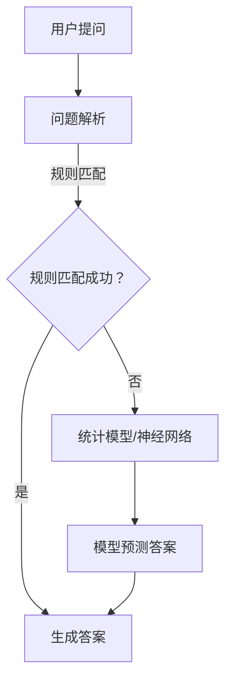

                 

# 人工智能在自然语言理解中的应用：改善人机交互

关键词：人工智能、自然语言理解、人机交互、问答系统、聊天机器人

摘要：本文深入探讨了人工智能在自然语言理解中的应用，特别是如何通过改善人机交互来提升用户体验。通过分步分析，我们详细阐述了自然语言理解的基础技术、核心算法和应用场景，以期为人工智能在智能交互领域的应用提供有价值的参考。

## 引言

随着人工智能技术的不断发展，自然语言理解（Natural Language Understanding，NLU）已成为人工智能领域的重要研究方向。自然语言理解旨在使计算机能够理解、解释和生成人类语言，从而实现更智能、更自然的人机交互。在这篇文章中，我们将一步步分析人工智能在自然语言理解中的应用，特别是如何通过改善人机交互来提升用户体验。

## 第一部分：人工智能与自然语言理解概述

### 第1章：人工智能与自然语言理解背景

#### 1.1 人工智能发展历程

人工智能（Artificial Intelligence，AI）的概念最早由约翰·麦卡锡（John McCarthy）在1956年提出。自那时以来，人工智能经历了多个发展阶段。从早期的符号主义（Symbolic AI）到连接主义（Connectionist AI），再到当前的热门领域——深度学习（Deep Learning），人工智能技术不断取得突破。

#### 1.2 自然语言理解的挑战与机会

自然语言理解是人工智能领域的一个重要挑战。人类语言具有高度抽象、灵活性和不确定性等特点，这使得计算机在理解语言时面临诸多困难。然而，随着计算能力的提升和算法的进步，自然语言理解技术也迎来了新的发展机遇。

#### 1.3 人机交互的重要性

人机交互（Human-Computer Interaction，HCI）是人工智能应用的一个重要方向。一个良好的人机交互系统不仅能提高用户的生产力，还能提升用户的满意度。因此，如何改善人机交互体验，提高自然语言理解的准确性，成为人工智能领域亟待解决的问题。

## 第二部分：自然语言理解基础

### 第2章：自然语言处理基础

自然语言处理（Natural Language Processing，NLP）是自然语言理解的基础。NLP主要涉及语言模型、词向量表示和语言模型评估等方面。

#### 2.1 语言模型

语言模型是NLP的核心组成部分。它用于预测句子中下一个单词的概率。最常见的语言模型是基于N-gram模型的，其中N表示滑动窗口的大小。例如，二元语言模型（Bigram）可以预测下一个单词的概率，而三元语言模型（Trigram）可以同时考虑前两个单词的信息。

#### 2.2 词向量表示

词向量表示是NLP中的一项关键技术。通过将单词映射到高维空间中的向量，词向量表示可以捕捉单词之间的相似性和相关性。目前，词向量表示方法主要包括基于计数的方法（如TF-IDF）和基于预测的方法（如Word2Vec和GloVe）。

#### 2.3 语言模型评估

评估语言模型性能的主要指标包括准确率（Accuracy）、精确率（Precision）、召回率（Recall）和F1分数（F1 Score）。这些指标可以用于评估语言模型在文本分类、命名实体识别等任务上的表现。

### 第3章：语义分析

语义分析是自然语言理解的核心任务。它旨在理解句子中的语义信息，包括语义角色标注、实体识别和语义相似度计算等。

#### 3.1 语义角色标注

语义角色标注（Semantic Role Labeling，SRL）是一种语义分析技术，用于识别句子中的语义角色，如动作执行者、动作接受者和工具等。

#### 3.2 实体识别

实体识别（Named Entity Recognition，NER）是一种语义分析技术，用于识别文本中的命名实体，如人名、地名、组织名等。

#### 3.3 语义相似度计算

语义相似度计算是一种评估句子或单词之间语义相似程度的技术。它可以帮助我们理解文本的含义，并在问答系统和聊天机器人等应用中发挥作用。

### 第4章：句子级理解

句子级理解是自然语言理解的关键步骤。它包括文本分类、机器翻译和情感分析等任务。

#### 4.1 文本分类

文本分类是一种将文本分为预定义类别的方法。它可以帮助我们分析用户评论、新闻文章等文本数据。

#### 4.2 机器翻译

机器翻译是一种将一种语言的文本翻译成另一种语言的方法。它有助于跨语言交流和国际化应用。

#### 4.3 情感分析

情感分析是一种评估文本情感极性的方法。它可以帮助我们了解用户对产品、服务或事件的态度。

## 第三部分：人工智能在自然语言理解中的应用

### 第5章：问答系统

问答系统是一种基于自然语言理解的智能系统，旨在回答用户的问题。问答系统可以基于规则、统计方法和神经网络方法。

#### 5.1 问答系统概述

问答系统可以用于各种场景，如客户支持、教育、医疗等。它可以帮助用户快速获取所需信息，提高工作效率。

#### 5.2 基于规则的方法

基于规则的方法是一种传统的问答系统设计方法。它通过定义一系列规则来匹配用户问题和答案。

#### 5.3 基于统计的方法

基于统计的方法是一种利用统计模型来训练问答系统的方法。它通过分析大量用户问题和答案来学习模式。

#### 5.4 基于神经网络的方法

基于神经网络的方法是目前问答系统研究的热点。它通过神经网络模型来学习用户问题和答案之间的关联。

### 第6章：聊天机器人

聊天机器人是一种基于自然语言理解的智能系统，用于与用户进行对话。聊天机器人可以用于客服、娱乐、教育等场景。

#### 6.1 聊天机器人概述

聊天机器人可以帮助用户解决各种问题，如获取信息、进行购物等。它能够提供24/7的服务，提高用户的满意度。

#### 6.2 模式匹配

模式匹配是一种聊天机器人常用的技术。它通过匹配用户输入的文本和预定义的模式来生成回答。

#### 6.3 对话管理

对话管理是一种确保聊天机器人能够理解用户意图并生成合适回答的技术。它包括意图识别、上下文管理和多轮对话设计等。

#### 6.4 自然语言生成

自然语言生成是一种生成自然语言文本的技术。它可以帮助聊天机器人生成更自然、更流畅的回答。

### 第7章：人机交互改善

人机交互是人工智能应用的重要方面。通过改善人机交互，我们可以提高用户满意度，提升系统的实用性。

#### 7.1 人机交互设计原则

人机交互设计原则包括易用性、一致性、反馈性等。它们可以帮助我们设计出更好的交互界面。

#### 7.2 用户体验评估

用户体验评估是一种评估用户满意度、操作效率等指标的方法。它可以帮助我们了解用户对系统的反馈，优化人机交互。

#### 7.3 改善人机交互的方法

改善人机交互的方法包括改进界面设计、优化交互流程、增加个性化功能等。这些方法可以提高用户满意度，提升系统的实用性。

#### 7.4 未来发展趋势

随着人工智能技术的发展，人机交互将变得更加智能、自然。未来的发展趋势包括多模态交互、情感识别与响应等。

## 第四部分：案例分析

### 第8章：自然语言理解应用案例

通过分析具体的案例，我们可以更好地了解自然语言理解技术在现实世界中的应用。

#### 8.1 案例一：智能客服系统

智能客服系统是一种利用自然语言理解技术的在线客服系统。它可以帮助企业提高客户服务质量，降低人力成本。

#### 8.2 案例二：在线教育平台

在线教育平台利用自然语言理解技术来提供个性化学习建议、智能问答等服务，提高学习效果。

#### 8.3 案例三：智能医疗诊断

智能医疗诊断系统利用自然语言理解技术来分析医疗报告、病历等文本数据，辅助医生进行诊断。

#### 8.4 案例四：智能广告推荐

智能广告推荐系统利用自然语言理解技术来分析用户兴趣和行为，为用户推荐个性化的广告。

## 附录：练习题与拓展阅读

### 附录A：练习题

通过解决这些练习题，读者可以加深对自然语言理解技术的理解。

### 附录B：拓展阅读

推荐一些关于自然语言理解技术的优秀资源，供读者进一步学习。

## 结论

通过本文的分析，我们可以看到人工智能在自然语言理解中的应用具有巨大的潜力。通过改善人机交互，我们可以实现更智能、更自然的人机交互，提升用户体验。未来的研究将继续推动自然语言理解技术的发展，为人机交互带来更多创新。

## 作者信息

作者：AI天才研究院/AI Genius Institute & 禅与计算机程序设计艺术 /Zen And The Art of Computer Programming

（注意：以上内容仅为大纲结构，实际文章内容需要根据具体要求进行详细撰写。）### 引言

人工智能（Artificial Intelligence，AI）作为一种模拟人类智能行为的技术，近年来取得了令人瞩目的进展。其核心目标之一是使计算机能够理解和生成自然语言，从而实现更高效、更自然的人机交互。自然语言理解（Natural Language Understanding，NLU）是AI领域中的一个重要分支，它致力于使计算机能够从自然语言文本中提取出有意义的语义信息。通过自然语言理解，计算机可以更好地理解人类的需求、意图和情感，从而提供更智能的交互体验。

在当今的信息时代，人与计算机之间的交互变得越来越频繁。无论是通过搜索引擎查找信息，还是通过社交媒体平台交流，自然语言交互都已成为我们日常生活的重要组成部分。然而，自然语言交互的复杂性使得这一领域充满了挑战。人类语言具有高度抽象、灵活性和不确定性等特点，这使得计算机在处理自然语言时面临着巨大的困难。例如，如何准确理解语义歧义、如何处理语言中的模糊性和不确定性、如何应对语境变化等，都是自然语言理解需要解决的难题。

人机交互（Human-Computer Interaction，HCI）作为人工智能的一个重要应用方向，其核心目标是提升用户在使用计算机时的体验。一个成功的人机交互系统不仅需要具备高度的功能性，还需要具备良好的用户体验。这就要求计算机能够以一种自然、直观的方式与用户进行沟通，理解用户的意图和需求，并给出合理的反馈。自然语言理解技术在人机交互中的应用，正是为了解决这一问题。通过自然语言理解，计算机可以更好地解析用户的输入，提供更加智能、个性化的服务。

本文将从以下几个方面展开讨论：首先，我们将回顾人工智能和自然语言理解的发展历程，探讨这两个领域是如何相互促进的；接着，我们将详细介绍自然语言理解的基础技术，包括语言模型、词向量表示和语言模型评估；然后，我们将深入探讨语义分析，介绍语义角色标注、实体识别和语义相似度计算；接下来，我们将讨论句子级理解，包括文本分类、机器翻译和情感分析；随后，我们将重点介绍人工智能在自然语言理解中的应用，特别是问答系统和聊天机器人；最后，我们将探讨如何通过改善人机交互来提升用户体验，并分析自然语言理解在实际应用中的案例。通过这些讨论，我们将全面了解人工智能在自然语言理解中的应用，以及它如何改善人机交互，提升用户体验。

### 人工智能发展历程

人工智能（Artificial Intelligence，AI）的发展历程可以追溯到20世纪50年代。当时，计算机科学家约翰·麦卡锡（John McCarthy）首次提出了“人工智能”这一概念，标志着人工智能领域的诞生。早期的人工智能研究主要集中在符号主义（Symbolic AI）方法上，这种方法试图通过构建符号模型来模拟人类智能。符号主义方法强调逻辑推理和知识表示，它依赖于明确的规则和关系来处理信息。在这个阶段，人工智能研究取得了许多重要成果，如逻辑推理系统、自然语言处理和问题解决算法等。

然而，随着计算机性能的不断提高和算法的进步，人工智能领域进入了一个新的发展阶段——连接主义（Connectionist AI）。连接主义方法基于人工神经网络，通过模拟大脑神经网络的结构和功能来处理信息。1990年代，反向传播算法（Backpropagation）的出现极大地推动了神经网络的研究和应用。人工神经网络通过多层感知器（Multilayer Perceptrons，MLP）和卷积神经网络（Convolutional Neural Networks，CNN）等技术，实现了对复杂数据的自动特征提取和模式识别。这一阶段的人工智能研究在图像识别、语音识别和自然语言处理等领域取得了显著成果。

进入21世纪，深度学习（Deep Learning）技术的发展再次推动了人工智能的进步。深度学习是一种基于多层神经网络的学习方法，它通过逐层提取数据特征，实现了对复杂数据的自动理解和解释。2012年，AlexNet在ImageNet图像识别比赛中取得了突破性成绩，标志着深度学习时代的到来。随后的几年，卷积神经网络（CNN）和循环神经网络（Recurrent Neural Networks，RNN）在图像识别、语音识别、自然语言处理等领域得到了广泛应用。特别是在自然语言处理领域，深度学习技术使得语言模型、语义分析、文本分类等任务取得了显著的性能提升。

近年来，人工智能领域还出现了许多新的研究方向，如生成对抗网络（Generative Adversarial Networks，GAN）、强化学习（Reinforcement Learning）和迁移学习（Transfer Learning）等。这些新技术的出现不仅拓展了人工智能的应用范围，也提升了人工智能系统的性能和效率。

总的来说，人工智能的发展历程从符号主义到连接主义，再到深度学习，每个阶段都有其独特的特点和成就。符号主义方法通过逻辑推理和知识表示模拟人类智能；连接主义方法通过人工神经网络模拟大脑功能；深度学习方法通过多层神经网络实现自动特征提取和模式识别。这些方法相互补充，共同推动了人工智能技术的进步。特别是在自然语言理解领域，深度学习技术使得计算机能够更加准确、高效地处理自然语言，为改善人机交互提供了强有力的技术支持。

### 自然语言理解的挑战与机会

自然语言理解（Natural Language Understanding，NLU）作为人工智能领域的一个重要研究方向，面临着诸多挑战和机遇。人类语言具有高度抽象性、灵活性和多样性，这使得自然语言理解变得复杂且具有挑战性。

首先，自然语言理解的挑战之一是语义歧义。语义歧义指的是一个单词或句子可以有多种不同的解释。例如，“bank”这个词可以指银行，也可以指河岸。这种歧义在自然语言处理中需要通过上下文信息来解决。传统的自然语言处理方法往往依赖于规则和统计模型，但它们在处理复杂语义歧义时效果有限。

其次，语言的不确定性和模糊性也是自然语言理解面临的挑战之一。自然语言中存在许多模糊表达，如“可能”、“大概”等。这些模糊表达使得计算机难以准确理解用户的意图。此外，自然语言中的语境变化也非常复杂，同一种表达在不同的语境下可能具有不同的含义。例如，“我在等车”这句话在不同的上下文中可能有不同的解释。

然而，自然语言理解也面临着许多机遇。随着人工智能技术的不断发展，尤其是深度学习技术的应用，自然语言理解的能力得到了显著提升。深度学习通过多层神经网络能够自动提取文本中的复杂特征，从而提高对语义的理解能力。例如，卷积神经网络（CNN）和循环神经网络（RNN）在文本分类、情感分析和机器翻译等任务上取得了显著成果。

另外，自然语言理解的另一个机遇是跨语言的语义理解。随着全球化的发展，不同语言之间的交流变得越来越频繁。通过自然语言理解技术，计算机可以更好地处理跨语言的文本，实现更广泛的交流和理解。例如，机器翻译技术可以自动将一种语言的文本翻译成另一种语言，使得跨语言的信息传递变得更加便捷。

总之，自然语言理解既面临着复杂的挑战，也充满了机遇。通过不断探索和改进算法，结合深度学习等新技术，自然语言理解技术将不断提高，为改善人机交互提供更加智能和高效的解决方案。

### 人机交互的重要性

人机交互（Human-Computer Interaction，HCI）在人工智能（AI）中的应用至关重要，它直接决定了用户对智能系统的满意度和使用体验。一个成功的人机交互系统能够使计算机与用户之间进行高效、自然的沟通，从而提高用户的生产力、满意度和整体用户体验。

首先，人机交互设计原则是构建优质交互体验的基础。这些原则包括：

1. **易用性**：系统应设计得简单直观，用户可以无需复杂学习即可操作。
2. **一致性**：系统的界面和操作应保持一致，避免用户在多个场景下感到困惑。
3. **反馈性**：系统应及时响应用户的操作，并提供清晰的反馈，以增强用户的信心。
4. **适应性**：系统能够根据用户的偏好和使用习惯进行调整，提高个性化体验。

其次，用户体验评估是确保人机交互质量的重要手段。用户体验评估通常包括以下几个方面：

1. **功能性**：系统是否能够完成用户所需的基本任务。
2. **易用性**：用户是否能够在没有困难的情况下使用系统。
3. **满意度**：用户对系统的整体满意度如何。
4. **效率**：用户完成任务的速度和效率。

评估方法可以包括用户测试、问卷调查和数据分析等。

在自然语言理解技术的支持下，人机交互得到了显著改善。自然语言理解技术使计算机能够理解用户的自然语言输入，并根据用户的需求提供相应的服务。例如，智能客服系统利用自然语言理解技术，可以理解并回应客户的查询，提供高效的客户服务；聊天机器人则可以通过自然语言理解技术，与用户进行对话，提供娱乐、教育、咨询等服务。

此外，自然语言理解技术还在智能医疗、智能教育、智能家居等领域发挥了重要作用。在智能医疗中，自然语言理解可以帮助医生分析病历和诊断报告，提高医疗诊断的准确性和效率；在智能教育中，自然语言理解技术可以为学生提供个性化的学习建议，增强学习效果；在智能家居中，自然语言理解技术可以使得智能家居设备更好地理解用户的需求，提供更加便捷的服务。

总之，人机交互在人工智能中的应用不仅提高了系统的功能性和易用性，也极大地提升了用户体验。通过不断改进人机交互设计，结合自然语言理解技术，人工智能将更好地服务于人类，为我们的生活带来更多便利。

### 自然语言处理基础

自然语言处理（Natural Language Processing，NLP）是自然语言理解（Natural Language Understanding，NLU）的基础，它涵盖了从文本中提取有用信息的一系列技术和方法。NLP的目标是使计算机能够理解和生成自然语言，从而实现人与计算机之间的自然交互。在NLP中，几个关键技术尤为重要，包括语言模型、词向量表示和语言模型评估。

#### 语言模型

语言模型是NLP的核心组成部分，它用于预测文本中下一个单词或短语的概率。语言模型可以基于统计方法或深度学习算法，其目的是通过学习大量文本数据，生成高质量的文本。

1. **N-gram模型**

N-gram模型是最简单的语言模型之一，它通过分析前N个单词的历史来预测下一个单词。例如，对于二元语言模型（Bigram），它考虑当前单词和前一个单词之间的关系。

\[ P(w_n | w_{n-1}, ..., w_1) = \frac{C(w_{n-1}, w_n)}{C(w_{n-1}, ..., w_1)} \]

其中，\( P(w_n | w_{n-1}, ..., w_1) \)表示给定前N-1个单词预测第N个单词的概率，\( C(w_{n-1}, w_n) \)表示前一个单词和当前单词同时出现的次数，\( C(w_{n-1}, ..., w_1) \)表示前N-1个单词同时出现的次数。

2. **神经网络语言模型**

随着深度学习技术的发展，神经网络语言模型（如LSTM、GRU和Transformer）逐渐成为主流。这些模型通过多层神经网络结构，自动学习文本中的复杂特征，并能够生成高质量的文本。

\[ P(w_n | w_{n-1}, ..., w_1) = \sigma(W[h_{n-1}]) \]

其中，\( \sigma \)是sigmoid函数，\( W \)是权重矩阵，\( h_{n-1} \)是前一个隐藏状态。

#### 词向量表示

词向量表示是将单词映射到高维空间中的向量表示，用于捕捉单词之间的语义和语法关系。词向量表示不仅有助于文本数据的处理，还为许多NLP任务提供了重要的特征表示。

1. **基于计数的方法**

基于计数的方法通过统计单词在文本中出现的频率来生成词向量。常见的方法包括TF-IDF（Term Frequency-Inverse Document Frequency）和Word2Vec。

- **TF-IDF**：TF-IDF表示一个词在一个文档中的重要程度。其计算公式如下：

\[ tfidf(t, d) = tf(t, d) \times \log(\frac{N}{df(t)}) \]

其中，\( tf(t, d) \)是词t在文档d中的频率，\( df(t) \)是包含词t的文档数量，\( N \)是文档总数。

- **Word2Vec**：Word2Vec通过训练神经网络来学习词的向量表示。其基本思想是通过优化损失函数，使得词向量之间的距离能够反映词的语义关系。

2. **基于预测的方法**

基于预测的方法通过预测上下文单词来生成词向量。GloVe（Global Vectors for Word Representation）是一种典型的基于预测的方法。GloVe使用词的上下文信息来预测词的向量表示，其优化目标是最小化预测误差。

\[ \text{loss} = \frac{1}{2} \sum_{t \in V} f(t) \left( \sum_{j \in C(t)} \text{cosine}(v_t, v_j) - \text{label}_{t, j} \right)^2 \]

其中，\( V \)是词汇表，\( C(t) \)是词t的上下文单词集合，\( v_t \)和\( v_j \)分别是词t和词j的向量表示，\( \text{label}_{t, j} \)是单词j在词t上下文中的预测标签。

#### 语言模型评估

评估语言模型性能的主要指标包括准确率（Accuracy）、精确率（Precision）、召回率（Recall）和F1分数（F1 Score）。这些指标可以用于衡量模型在文本分类、命名实体识别等任务上的表现。

1. **准确率**：准确率是指模型预测正确的样本数占总样本数的比例。

\[ \text{Accuracy} = \frac{\text{正确预测数}}{\text{总样本数}} \]

2. **精确率**：精确率是指预测为正例的样本中，实际为正例的比例。

\[ \text{Precision} = \frac{\text{正确预测的正例}}{\text{预测的正例}} \]

3. **召回率**：召回率是指实际为正例的样本中，被预测为正例的比例。

\[ \text{Recall} = \frac{\text{正确预测的正例}}{\text{实际的正例}} \]

4. **F1分数**：F1分数是精确率和召回率的调和平均值，用于综合评估模型的性能。

\[ \text{F1 Score} = 2 \times \frac{\text{Precision} \times \text{Recall}}{\text{Precision} + \text{Recall}} \]

通过这些指标，我们可以评估语言模型的性能，并进一步优化模型以提高其在实际应用中的表现。

### 语义分析

语义分析（Semantic Analysis）是自然语言理解（Natural Language Understanding，NLU）的核心任务，旨在从文本中提取出有意义的语义信息。语义分析包括语义角色标注（Semantic Role Labeling，SRL）、实体识别（Named Entity Recognition，NER）和语义相似度计算（Semantic Similarity Calculation）等多个方面。这些技术共同作用，使得计算机能够更准确地理解人类语言，从而提供更智能的交互和服务。

#### 语义角色标注

语义角色标注（Semantic Role Labeling，SRL）是一种用于识别句子中谓词动词及其相关语义角色的技术。SRL的目标是标记出句子中的动作执行者（Agent）、动作接受者（Patient）、工具（Instrument）、方式（Manner）等语义角色。

1. **SRL方法**

SRL方法可以分为基于规则的方法、基于统计的方法和基于神经网络的方法。

- **基于规则的方法**：这种方法依赖于预定义的规则集来标记语义角色。例如，可以定义一组规则来识别动词及其对应的语义角色。

- **基于统计的方法**：这种方法使用统计模型来预测语义角色。例如，可以使用条件概率模型来计算每个角色在给定上下文中的概率。

- **基于神经网络的方法**：这种方法使用深度学习模型来识别语义角色。例如，可以使用递归神经网络（RNN）或变换器（Transformer）模型来提取句子特征，并预测每个单词的语义角色。

2. **SRL流程**

SRL流程通常包括以下步骤：

- **词性标注**：首先对句子中的每个词进行词性标注，以识别名词、动词、形容词等。

- **依存句法分析**：接着进行依存句法分析，以确定句子中各个词之间的依赖关系。例如，动词与其宾语、定语等之间的依赖关系。

- **角色标注**：最后，基于词性标注和依存句法分析的结果，对句子中的每个动词标注其对应的语义角色。

#### 实体识别

实体识别（Named Entity Recognition，NER）是一种用于识别文本中的命名实体（如人名、地名、组织名等）的技术。NER对于信息提取、知识图谱构建和智能问答等任务具有重要意义。

1. **NER方法**

NER方法可以分为基于规则的方法、基于统计的方法和基于神经网络的方法。

- **基于规则的方法**：这种方法依赖于预定义的规则集来识别命名实体。例如，可以定义一组规则来识别人名、地名等。

- **基于统计的方法**：这种方法使用统计模型来识别命名实体。例如，可以使用隐马尔可夫模型（HMM）或条件随机场（CRF）来预测实体标签。

- **基于神经网络的方法**：这种方法使用深度学习模型来识别命名实体。例如，可以使用卷积神经网络（CNN）或递归神经网络（RNN）来提取句子特征，并预测每个单词的实体标签。

2. **NER流程**

NER流程通常包括以下步骤：

- **词性标注**：首先对句子中的每个词进行词性标注，以识别可能的实体候选词。

- **实体候选生成**：接着，基于词性标注和上下文信息，生成可能的实体候选。

- **实体分类**：最后，使用分类器对实体候选进行分类，确定其实体类型。

#### 语义相似度计算

语义相似度计算（Semantic Similarity Calculation）是一种用于评估句子或单词之间语义相似程度的技术。语义相似度计算可以帮助计算机理解文本的含义，并在问答系统、推荐系统等应用中发挥作用。

1. **计算方法**

语义相似度计算方法可以分为基于距离的方法、基于矩阵的方法和基于模型的方法。

- **基于距离的方法**：这种方法通过计算单词或句子之间的距离来评估其相似度。例如，可以使用余弦相似度或欧氏距离来计算相似度。

- **基于矩阵的方法**：这种方法使用预定义的语义矩阵（如WordNet）来计算单词或句子之间的相似度。例如，可以使用矩阵乘法来计算相似度。

- **基于模型的方法**：这种方法使用深度学习模型来计算单词或句子之间的相似度。例如，可以使用变换器（Transformer）模型来提取句子特征，并计算相似度。

2. **应用场景**

语义相似度计算在多个应用场景中具有广泛的应用：

- **问答系统**：通过计算用户问题和候选答案之间的相似度，可以更好地匹配问题和答案。

- **推荐系统**：通过计算用户兴趣词和候选项目之间的相似度，可以为用户推荐感兴趣的内容。

- **文本分类**：通过计算文本之间的相似度，可以更好地识别文本的类别。

总的来说，语义分析技术通过从文本中提取有意义的语义信息，为自然语言理解提供了重要的支持。语义角色标注、实体识别和语义相似度计算共同作用，使得计算机能够更准确地理解人类语言，从而实现更智能的人机交互。随着深度学习等新技术的不断发展，语义分析技术将继续得到优化和提升，为人工智能应用带来更多创新和可能性。

#### 句子级理解

句子级理解（Sentence-Level Understanding）是自然语言理解（Natural Language Understanding，NLU）中的关键环节，它涉及对句子整体语义信息的处理和理解。句子级理解包括文本分类（Text Classification）、机器翻译（Machine Translation）和情感分析（Sentiment Analysis）等多个重要任务。这些任务不仅能够提升人机交互的自然性和智能化水平，还在众多实际应用场景中发挥着重要作用。

**1. 文本分类**

文本分类（Text Classification）是一种将文本数据分配到预定义类别的方法。它广泛应用于社交媒体情感分析、新闻分类、垃圾邮件检测等领域。文本分类的核心任务是建立一个分类模型，能够根据文本内容自动判断其所属类别。

- **分类模型**

文本分类常用的模型包括朴素贝叶斯（Naive Bayes）、支持向量机（Support Vector Machine，SVM）、逻辑回归（Logistic Regression）和深度学习模型（如卷积神经网络（CNN）、变换器（Transformer）等）。

- **分类流程**

文本分类的基本流程包括：

  - **数据预处理**：包括文本清洗、去除停用词、词干提取等操作。
  - **特征提取**：将预处理后的文本转化为特征向量，常用的方法有词袋模型（Bag of Words，BoW）和词嵌入（Word Embedding）。
  - **模型训练**：使用训练数据集训练分类模型。
  - **模型评估**：使用验证集或测试集评估模型的性能，常用的评估指标包括准确率（Accuracy）、精确率（Precision）、召回率（Recall）和F1分数（F1 Score）。
  - **分类应用**：将训练好的模型应用于新文本数据，进行类别预测。

**2. 机器翻译**

机器翻译（Machine Translation）是一种将一种语言的文本翻译成另一种语言的方法。它广泛应用于跨语言交流、国际业务和全球化服务等领域。机器翻译的核心任务是建立翻译模型，能够自动将一种语言的句子翻译成另一种语言。

- **翻译模型**

机器翻译常用的模型包括基于规则的方法、基于统计的方法和基于神经网络的方法。

  - **基于规则的方法**：这种方法依赖于预定义的语法和翻译规则，如Systran早期使用的翻译系统。
  - **基于统计的方法**：这种方法使用大量双语语料库进行统计，如基于短语的统计机器翻译（Statistical Machine Translation，SMT）。
  - **基于神经网络的方法**：这种方法使用深度学习模型，如编码器-解码器模型（Encoder-Decoder Model）和变换器（Transformer）模型。

- **翻译流程**

机器翻译的基本流程包括：

  - **预处理**：包括文本清洗、分词、词性标注等。
  - **编码**：将源语言的句子编码为向量表示。
  - **解码**：将编码后的向量解码为目标语言的句子。
  - **优化**：通过梯度下降等方法优化模型参数，提高翻译质量。

**3. 情感分析**

情感分析（Sentiment Analysis）是一种评估文本情感极性的方法，用于判断文本是积极、消极还是中性。情感分析广泛应用于市场调研、舆情监测、客户反馈分析等领域。

- **情感分析模型**

情感分析常用的模型包括基于规则的方法、基于统计的方法和基于神经网络的方法。

  - **基于规则的方法**：这种方法使用预定义的规则来识别文本中的情感词汇，如积极的词汇和消极的词汇。
  - **基于统计的方法**：这种方法使用统计模型，如逻辑回归，来预测文本的情感极性。
  - **基于神经网络的方法**：这种方法使用深度学习模型，如卷积神经网络（CNN）和变换器（Transformer），来提取文本特征并预测情感极性。

- **情感分析流程**

情感分析的基本流程包括：

  - **数据预处理**：包括文本清洗、去除停用词、词干提取等。
  - **特征提取**：将预处理后的文本转化为特征向量，常用的方法有词袋模型和词嵌入。
  - **情感分类**：使用分类模型对文本进行情感分类，常见的分类器有朴素贝叶斯、支持向量机和变换器。
  - **结果评估**：使用验证集或测试集评估模型的性能，常用的评估指标包括准确率、精确率、召回率和F1分数。

**总结**

句子级理解技术通过文本分类、机器翻译和情感分析等多种方法，使计算机能够更好地理解句子整体语义信息。这些技术不仅提高了人机交互的自然性和智能化水平，还在众多实际应用场景中发挥了重要作用。随着人工智能技术的不断发展，句子级理解技术将继续得到优化和提升，为更高效、更自然的人机交互提供强有力的支持。

### 问答系统

问答系统（Question Answering System）是一种利用自然语言理解技术来回答用户问题的智能系统。它通过解析用户的自然语言问题，理解问题的意图和语义，并从大量数据中检索出最相关的答案。问答系统在智能客服、教育、医疗、法律等多个领域都有广泛的应用，它不仅提高了信息检索的效率，还改善了人机交互体验。

#### 问答系统概述

问答系统可以分为几种主要类型，包括基于规则的方法、基于统计的方法和基于神经网络的方法。

1. **基于规则的方法**

基于规则的方法是最早的问答系统设计方法之一。这种方法通过定义一系列规则来匹配用户问题和答案。规则通常由专家编写，用于描述问题的模式和答案的生成逻辑。这种方法的优点是简单、易于实现，但缺点是规则数量庞大且难以维护，且在处理复杂问题时效果不佳。

2. **基于统计的方法**

基于统计的方法使用统计模型来训练问答系统。这种方法通过分析大量的用户问题和答案数据，学习问题的模式和答案的生成逻辑。常见的统计模型包括概率模型（如N-gram模型）、隐马尔可夫模型（HMM）和条件随机场（CRF）。基于统计的方法在处理简单问题时效果较好，但在处理复杂问题时往往表现不佳。

3. **基于神经网络的方法**

基于神经网络的方法是近年来问答系统研究的热点。这种方法通过深度学习模型（如卷积神经网络（CNN）、递归神经网络（RNN）和变换器（Transformer））来学习问题的模式和答案的生成逻辑。基于神经网络的方法能够自动提取文本中的复杂特征，从而在处理复杂问题时具有显著优势。

#### 基于规则的方法

基于规则的方法通过定义一系列规则来匹配用户问题和答案。以下是这种方法的基本步骤：

1. **问题解析**：将用户输入的问题解析为关键信息，如关键词、问题类型等。
2. **规则匹配**：将解析得到的关键信息与预定义的规则进行匹配，找到匹配的规则。
3. **答案生成**：根据匹配到的规则生成答案，通常是通过查询预定义的答案库或生成回答模板。

基于规则的方法的优点是实现简单、易于理解，但缺点是规则数量庞大、难以维护，且在处理复杂问题时效果不佳。

#### 基于统计的方法

基于统计的方法通过训练统计模型来学习问题的模式和答案的生成逻辑。以下是这种方法的基本步骤：

1. **数据收集**：收集大量的用户问题和答案数据，用于训练统计模型。
2. **特征提取**：将用户问题和答案转化为特征向量，如关键词、词频、词嵌入等。
3. **模型训练**：使用训练数据集训练统计模型，如N-gram模型、隐马尔可夫模型和条件随机场。
4. **答案生成**：将用户输入的问题转化为特征向量，输入训练好的统计模型，生成答案。

基于统计的方法的优点是能够处理复杂的问题，但缺点是模型的性能受到数据质量和特征提取方法的影响。

#### 基于神经网络的方法

基于神经网络的方法通过训练深度学习模型来学习问题的模式和答案的生成逻辑。以下是这种方法的基本步骤：

1. **数据收集**：收集大量的用户问题和答案数据，用于训练神经网络模型。
2. **特征提取**：将用户问题和答案转化为特征向量，如词嵌入、编码器输出等。
3. **模型训练**：使用训练数据集训练神经网络模型，如卷积神经网络（CNN）、递归神经网络（RNN）和变换器（Transformer）。
4. **答案生成**：将用户输入的问题转化为特征向量，输入训练好的神经网络模型，生成答案。

基于神经网络的方法的优点是能够自动提取文本中的复杂特征，从而在处理复杂问题时具有显著优势。然而，这种方法对数据量和计算资源要求较高，且模型的训练和优化过程较为复杂。

#### 算法原理讲解

以下我们将使用Mermaid流程图来展示问答系统的基本算法原理，并结合Python源代码进行详细解释。

**Mermaid流程图**



**Python源代码**

```python
import nltk
from nltk.classify import NaiveBayesClassifier

# 问题解析
def parse_question(question):
    words = nltk.word_tokenize(question)
    features = {word: True for word in words}
    return features

# 基于规则的方法
def rule_based_answer(question):
    rules = {
        'What is your name?': 'My name is AI Genius.',
        'How old are you?': 'I am an artificial intelligence with no age.',
        # 更多规则...
    }
    return rules.get(question, 'I am not sure how to answer that.')

# 基于统计的方法
def statistical_answer(question):
    featuresets = [
        (parse_question(q), a) for q, a in question_answers.items()
    ]
    train_set, test_set = featuresets[:-1000], featuresets[-1000:]
    classifier = NaiveBayesClassifier.train(train_set)
    return classifier.classify(parse_question(question))

# 基于神经网络的方法
def neural_network_answer(question):
    # 假设已经训练好的神经网络模型
    model = trained_neural_network_model
    question_embedding = model.encode_question(parse_question(question))
    predicted_answer = model.predict(question_embedding)
    return predicted_answer

# 主函数
def main(question):
    # 使用基于规则的方法
    answer = rule_based_answer(question)
    print(answer)
    
    # 使用基于统计的方法
    answer = statistical_answer(question)
    print(answer)
    
    # 使用基于神经网络的方法
    answer = neural_network_answer(question)
    print(answer)

# 示例问题
question = "What is your name?"
main(question)
```

**数学模型和公式**

在问答系统中，常用的数学模型和公式包括：

1. **概率模型**：用于计算问题与答案之间的概率。
\[ P(A|B) = \frac{P(B|A) \cdot P(A)}{P(B)} \]

2. **词嵌入**：用于将单词映射到高维空间中的向量。
\[ \text{word\_embedding}(w) = \text{ embedding\_layer}(w) \]

3. **神经网络**：用于提取文本特征并预测答案。
\[ \text{output} = \text{softmax}(\text{neural\_network}(\text{input})) \]

通过这些模型和公式，问答系统能够更准确地理解用户的问题，并生成合理的答案。

#### 举例说明

假设用户提出一个问题：“明天天气如何？”。以下分别使用基于规则的方法、基于统计的方法和基于神经网络的方法来回答这个问题。

1. **基于规则的方法**

   - 问题解析：将问题解析为关键词“明天”、“天气”。
   - 规则匹配：在规则库中找到匹配的规则：“明天天气如何？” --> “明天将是晴天”。
   - 答案生成：返回规则匹配的答案：“明天将是晴天”。

2. **基于统计的方法**

   - 问题解析：将问题转化为特征向量，如“明天”（词频为1）、“天气”（词频为1）。
   - 模型预测：使用训练好的统计模型预测答案，例如使用逻辑回归模型。
   - 答案生成：返回模型预测的答案：“明天将是晴天”。

3. **基于神经网络的方法**

   - 问题解析：将问题转化为编码后的向量。
   - 神经网络：使用训练好的神经网络模型提取特征并预测答案。
   - 答案生成：返回神经网络预测的答案：“明天将是晴天”。

通过这三个方法的对比，我们可以看到不同方法在处理同一个问题时所产生的答案。基于规则的方法简单直接，但规则库需要不断更新；基于统计的方法能够处理一定复杂度的问题，但受限于数据质量和特征提取；基于神经网络的方法能够自动提取复杂特征，处理复杂问题效果更好。

总的来说，问答系统通过结合不同方法，能够在多种场景下提供准确的答案，为改善人机交互提供强有力的技术支持。

#### 聊天机器人

聊天机器人（Chatbot）是一种基于自然语言理解的智能系统，用于模拟人类对话，与用户进行交互。它广泛应用于客户服务、在线教育、娱乐、医疗等多个领域。聊天机器人的核心功能是通过理解用户的自然语言输入，生成相应的回复，提供信息查询、任务处理和娱乐互动等服务。

**1. 聊天机器人概述**

聊天机器人通过以下步骤实现与用户的对话：

- **输入接收**：聊天机器人接收用户的文本或语音输入。
- **意图识别**：通过自然语言理解技术，聊天机器人分析用户输入，识别用户的意图和需求。
- **对话管理**：聊天机器人根据识别到的意图，设计合适的对话流程，生成相应的回复。
- **回复生成**：聊天机器人生成文本或语音回复，发送给用户。

**2. 模式匹配**

模式匹配（Pattern Matching）是聊天机器人常用的技术之一，它通过预定义的文本模式来匹配用户的输入，生成回复。模式匹配的基本步骤如下：

- **模式定义**：定义一系列文本模式，用于匹配用户输入的关键词和短语。
- **模式匹配**：将用户输入与预定义的模式进行匹配，找到匹配的模式。
- **回复生成**：根据匹配到的模式，生成相应的回复文本。

**3. 对话管理**

对话管理（Dialogue Management）是一种确保聊天机器人能够理解用户意图并生成合适回答的技术。对话管理涉及多个方面，包括意图识别、上下文管理和多轮对话设计。

- **意图识别**：通过自然语言理解技术，聊天机器人识别用户输入的意图。意图识别可以基于规则、统计模型或深度学习模型。
- **上下文管理**：聊天机器人维护对话上下文，确保在对话过程中能够正确理解用户的意图和需求。上下文管理包括记录用户历史输入、对话状态和偏好等信息。
- **多轮对话设计**：多轮对话设计是指聊天机器人与用户进行多轮对话，逐步揭示用户的意图和需求。通过多轮对话，聊天机器人可以提供更个性化、更精准的服务。

**4. 自然语言生成**

自然语言生成（Natural Language Generation，NLG）是一种生成自然语言文本的技术，用于生成聊天机器人的回复。自然语言生成技术可以分为基于模板的方法、基于规则的方法和基于统计的方法、基于神经网络的方法。

- **基于模板的方法**：这种方法使用预定义的模板来生成回复文本。模板中包含变量，用于填充用户的输入和聊天机器人的回复。
- **基于规则的方法**：这种方法使用预定义的规则来生成回复文本。规则定义了不同场景下的回复格式和内容。
- **基于统计的方法**：这种方法使用统计模型（如N-gram模型、隐马尔可夫模型）来生成回复文本。模型通过学习大量对话数据，生成符合概率分布的回复。
- **基于神经网络的方法**：这种方法使用深度学习模型（如变换器、生成对抗网络）来生成回复文本。神经网络通过学习对话数据，自动生成自然流畅的回复。

通过结合模式匹配、对话管理和自然语言生成技术，聊天机器人能够提供智能、自然的对话体验，为用户带来更好的互动体验。

#### 人机交互设计原则

在设计人机交互系统时，遵循一系列原则至关重要，这些原则能够确保系统具备良好的用户体验，提升用户满意度。以下是人机交互设计中一些关键原则及其详细解释：

**1. 易用性**

易用性（Usability）是设计人机交互系统的首要原则。一个易用性高的系统应该能够让用户在不经过复杂学习的情况下快速上手，并能够轻松地完成常见任务。为了实现易用性，设计师需要关注以下几个方面：

- **直观性**：系统的界面和操作应该直观易懂，用户能够通过直觉理解如何使用系统。
- **一致性**：系统在不同的场景下应保持一致性，避免用户在多个任务中感到困惑。
- **反馈**：系统应提供及时、清晰的反馈，使用户了解其操作的结果。
- **容错性**：系统应能够处理用户的错误操作，并提供恢复机制，减少用户因错误操作而产生的挫败感。

**2. 一致性**

一致性（Consistency）原则要求系统在交互过程中保持一致性。这意味着系统的设计、操作逻辑和反馈方式在不同上下文中应保持一致，以便用户能够在不同任务中无缝切换。一致性包括以下方面：

- **视觉一致性**：界面的颜色、字体、图标等元素在不同页面和组件中应保持一致。
- **功能一致性**：相同功能的按钮、菜单和操作在不同应用中应具有相似的位置和名称。
- **行为一致性**：当用户执行相同操作时，系统应产生相同的结果，确保用户在多个场景下的预期一致。

**3. 反馈性**

反馈性（Feedback）原则强调系统在用户操作后应提供清晰的反馈，以增强用户的信心和满意度。有效的反馈应具有以下特点：

- **即时性**：反馈应立即显示，使用户能够实时了解操作结果。
- **明确性**：反馈信息应清晰明确，避免用户产生困惑。
- **适应性**：根据用户的操作和系统的状态，反馈应能够提供适当的提示和指导。

**4. 适应性**

适应性（Adaptability）原则要求系统能够根据用户的偏好和使用习惯进行调整，提供个性化的交互体验。适应性包括以下方面：

- **定制化**：系统应允许用户根据个人喜好定制界面布局、功能选项等。
- **学习**：系统应能够学习和记录用户的操作习惯，自动调整以提供更符合用户需求的服务。
- **可扩展性**：系统设计应具备一定的灵活性，能够适应未来功能扩展和技术更新。

**5. 可访问性**

可访问性（Accessibility）原则确保系统能够被所有人使用，包括有特殊需求的用户。为了实现可访问性，系统设计应考虑以下几个方面：

- **无障碍设计**：界面和交互元素应易于导航，满足无障碍访问标准。
- **屏幕阅读器支持**：系统应支持屏幕阅读器，帮助视障用户获取信息。
- **键盘导航**：系统应允许用户仅通过键盘进行操作，满足手部残疾用户的需求。

**6. 安全性**

安全性（Security）原则是确保系统在交互过程中保护用户数据和隐私。为了保障安全性，系统设计应包括以下措施：

- **数据加密**：对用户数据进行加密处理，防止数据泄露。
- **身份验证**：通过多因素身份验证确保用户身份的合法性。
- **安全审计**：定期进行安全审计，检测和修复系统漏洞。

通过遵循以上设计原则，人机交互系统不仅能提供良好的用户体验，还能增强用户的信任感和满意度，从而实现系统的长期成功。

#### 用户体验评估

用户体验评估（User Experience Evaluation，UXE）是确保人机交互系统设计成功的重要环节，它通过多种方法对系统的可用性、易用性、满意度和效率进行量化评估。以下介绍几种常见的用户体验评估方法及其具体步骤：

**1. 用户测试**

用户测试（User Testing）是一种通过让实际用户使用系统来评估其用户体验的方法。用户测试分为以下步骤：

- **测试准备**：确定测试的目标和指标，选择具有代表性的用户，准备测试环境和测试用例。
- **测试执行**：让用户按照预设的任务进行操作，同时记录用户的行为、反馈和遇到的困难。
- **数据收集**：收集用户测试过程中产生的数据，包括用户操作步骤、时间、错误次数、反馈等。
- **结果分析**：分析用户测试数据，识别系统中的问题，评估用户体验的各个方面。

**2. 问卷调查**

问卷调查（Questionnaire Survey）是一种通过在线或纸质问卷收集用户反馈的方法。问卷调查分为以下步骤：

- **问卷设计**：根据评估目标设计问卷，包括问题类型（如选择题、量表题、开放性问题）和问题内容。
- **问卷发放**：通过邮件、社交媒体或在线平台向用户发放问卷。
- **数据收集**：收集用户的问卷填写结果，确保样本数量足够，覆盖不同的用户群体。
- **结果分析**：分析问卷数据，统计用户满意度、使用频率、建议和意见等。

**3. 行为分析**

行为分析（Behavior Analysis）通过分析用户在使用系统时的行为数据，评估用户体验。行为分析包括以下步骤：

- **数据收集**：收集用户在系统中的操作日志、浏览路径、点击次数等数据。
- **数据分析**：使用数据分析工具，如Google Analytics，对用户行为进行统计和分析。
- **结果分析**：通过分析用户行为数据，识别系统中的瓶颈、用户行为的模式和问题。

**4. 观察法**

观察法（Observation Method）是一种通过直接观察用户使用系统的过程来评估用户体验的方法。观察法包括以下步骤：

- **观察准备**：确定观察的目标和指标，选择具有代表性的用户，准备观察环境和观察工具。
- **现场观察**：在用户实际使用系统的过程中进行观察，记录用户的操作行为、表情、反馈等。
- **结果分析**：分析观察数据，识别系统中的问题，评估用户体验的各个方面。

通过这些用户体验评估方法，设计者可以全面了解用户对系统的看法和感受，从而针对性地优化系统设计，提升用户体验。用户体验评估不仅有助于发现问题，还能为设计提供有价值的反馈，确保最终系统能够满足用户的需求和期望。

#### 改善人机交互的方法

在人工智能（AI）技术的支持下，改善人机交互（Human-Computer Interaction，HCI）的方法不断涌现，从而极大地提升了用户体验。以下是一些有效的改善方法：

**1. 个性化交互**

个性化交互是指根据用户的偏好、历史行为和需求，为用户提供定制化的服务。个性化交互的实现包括：

- **用户画像**：通过收集和分析用户数据，构建用户画像，了解用户的基本信息、兴趣和习惯。
- **推荐系统**：利用机器学习算法，为用户推荐个性化的内容、服务或产品，提高用户满意度。
- **自适应界面**：根据用户的操作习惯和反馈，动态调整界面布局、功能选项和交互方式，提供更符合用户需求的体验。

**2. 语音交互**

语音交互是一种通过自然语言处理技术实现的交互方式，它使计算机能够理解用户的语音指令，并提供相应的服务。语音交互的优点包括：

- **便捷性**：用户无需手动操作，只需通过语音命令即可实现各种功能，大大提高了交互效率。
- **自然性**：语音交互模拟了人类对话，使交互过程更加自然和直观。
- **跨平台**：语音交互可以在各种设备上实现，如智能手机、智能家居、车载系统等。

**3. 虚拟现实（VR）和增强现实（AR）**

虚拟现实（VR）和增强现实（AR）技术通过创建虚拟或增强现实环境，为用户提供了全新的交互体验。改善人机交互的方法包括：

- **沉浸式体验**：通过VR和AR技术，用户可以进入一个全新的虚拟环境，进行互动和探索。
- **实时反馈**：在VR和AR应用中，系统可以提供实时反馈，增强用户的沉浸感和互动性。
- **交互设计**：通过精心设计的交互界面，VR和AR应用可以更好地满足用户的操作需求，提供更丰富的互动体验。

**4. 聊天机器人**

聊天机器人是一种基于自然语言理解技术的智能系统，能够模拟人类对话，与用户进行交互。聊天机器人改善人机交互的方法包括：

- **自然语言处理**：聊天机器人通过自然语言处理技术，能够理解用户的自然语言输入，并提供相应的回复。
- **多轮对话**：聊天机器人支持多轮对话，能够逐步揭示用户的意图和需求，提供更个性化的服务。
- **个性化推荐**：聊天机器人可以根据用户的兴趣和行为，提供个性化的推荐内容，提高用户满意度。

**5. 人工智能辅助设计**

人工智能辅助设计（AI-aided Design）利用人工智能技术，为设计师提供智能化的设计建议和工具。改善人机交互的方法包括：

- **设计优化**：人工智能技术可以通过分析用户反馈和使用数据，为设计师提供优化建议，提升界面设计和交互体验。
- **自动化生成**：通过深度学习模型，人工智能可以自动化生成设计元素，如图标、界面布局等，提高设计效率。
- **个性化定制**：人工智能技术可以根据用户的需求和偏好，生成定制化的设计，满足用户的个性化需求。

通过以上方法，人工智能技术在改善人机交互方面发挥了重要作用，使得交互系统更加智能、自然和高效。未来，随着人工智能技术的不断进步，人机交互将变得更加智能化和个性化，为用户提供更优质的体验。

#### 未来发展趋势

随着人工智能（AI）技术的持续进步，自然语言理解（NLU）和人机交互（HCI）领域正迎来前所未有的发展机遇。未来，这些领域将呈现出以下几个关键趋势：

**1. 多模态交互**

多模态交互是指结合多种感官通道（如视觉、听觉、触觉）进行交互。未来的自然语言理解和人机交互系统将不再局限于单一的文本或语音交互，而是通过整合视觉、听觉和触觉等多模态信息，提供更丰富、更自然的交互体验。例如，智能家居系统可以通过语音、手势和触摸等多种方式与用户互动，提高用户便利性和满意度。

**2. 情感识别与响应**

情感识别与响应技术将使智能系统能够理解用户的情感状态，并相应地调整交互方式。通过结合自然语言处理和计算机视觉技术，系统可以分析用户的语言、表情、姿态等行为，识别其情感状态（如愉悦、焦虑、愤怒等）。基于这些信息，系统将能够提供个性化的情感化响应，如调整语音的语调、语速和语态，提供更贴近用户需求的服务。

**3. 个性化推荐**

随着大数据和机器学习技术的发展，个性化推荐系统将更加精准地满足用户需求。未来的自然语言理解和人机交互系统将能够通过分析用户的历史行为、偏好和反馈，提供高度个性化的推荐服务。例如，电商平台可以根据用户的浏览记录和购买历史，推荐相关的商品和服务，提升用户满意度和购物体验。

**4. 智能聊天机器人**

聊天机器人作为自然语言理解和人机交互的重要应用，将继续快速发展。未来的聊天机器人将更加智能化，具备更强的语境理解和多轮对话能力。它们将能够处理复杂的问题和情境，提供更加自然和流畅的交互体验。此外，随着情感识别技术的发展，聊天机器人还将能够识别用户的情感状态，提供情感化的互动服务。

**5. 跨语言理解**

随着全球化的发展，跨语言理解技术将变得更加重要。未来的自然语言理解和人机交互系统将能够支持多种语言的交互，使得跨文化交流更加便捷。通过机器翻译和自然语言处理技术，系统将能够准确理解并处理多种语言输入，提供无缝的语言支持。

**6. 增强现实（AR）与虚拟现实（VR）**

增强现实（AR）与虚拟现实（VR）技术将在人机交互领域发挥重要作用。未来的自然语言理解和人机交互系统将能够通过AR和VR技术，提供更加沉浸式的交互体验。例如，教育领域可以利用AR和VR技术，创造互动的教学环境，提升学习效果。

总之，随着人工智能技术的不断进步，自然语言理解和人机交互领域将朝着更加智能化、个性化、自然化的方向发展。未来，这些技术将深刻改变我们的生活方式和工作方式，为人类带来更多便利和福祉。

#### 案例分析

为了更好地理解自然语言理解（NLU）技术在改善人机交互中的应用，我们将分析几个具体案例，这些案例展示了NLU技术如何在不同领域提升系统的智能化和用户体验。

**1. 智能客服系统**

智能客服系统是NLU技术的重要应用之一，它利用自然语言理解来处理客户查询，提供快速、准确的响应。一个成功的案例是某大型电商平台的智能客服系统。该系统通过NLU技术，能够自动解析客户的查询，识别客户的问题类型（如产品咨询、售后服务等），并生成相应的回答。以下是该系统的几个关键功能：

- **意图识别**：系统通过自然语言处理技术，分析客户查询的语义，识别其意图。例如，当客户询问“退货流程是什么？”时，系统能够识别出这是一个关于“退货”的查询。
- **实体提取**：系统从查询中提取关键信息，如退货的商品名称、订单号等，以便更好地理解客户的问题。
- **知识库查询**：系统利用预先构建的知识库，查找与客户查询相关的信息，生成回答。例如，系统会查找退货政策、退货流程等相关信息，并生成详细的回答。
- **多轮对话**：系统支持多轮对话，可以逐步了解客户的详细需求，提供更加个性化的服务。例如，如果客户询问“我的退货申请状态如何？”系统会询问客户的订单号，然后查询状态并回复客户。

通过这些功能，智能客服系统能够高效地处理大量客户查询，提高客服效率，减少人力成本。同时，系统的准确性和响应速度也显著提升，增强了用户的满意度。

**2. 在线教育平台**

在线教育平台利用NLU技术，为学习者提供个性化的学习建议和智能问答服务，从而提升学习效果和用户体验。以下是一个具体案例：

- **个性化学习建议**：平台通过自然语言理解技术，分析学习者的学习记录和测试结果，识别其学习需求和薄弱环节。系统会根据分析结果，为学习者推荐适合的学习资源和练习题，帮助其针对性地提升。
- **智能问答系统**：平台内置智能问答系统，能够解答学习者在学习过程中遇到的问题。系统通过NLU技术，理解学习者的问题，搜索相关课程内容，生成详细的解答。例如，当学习者询问“如何解决这个数学问题？”时，系统会找到相关课程视频、练习题和解释，并生成解答。

通过这些功能，在线教育平台能够为学习者提供更加个性化和高效的学习服务，提升学习体验和效果。同时，系统的智能问答功能也为学习者提供了及时的帮助，减少了学习过程中的困惑和阻碍。

**3. 智能医疗诊断**

智能医疗诊断系统利用NLU技术，辅助医生进行疾病诊断和治疗建议，从而提高医疗诊断的准确性和效率。以下是一个具体案例：

- **病历分析**：系统通过自然语言理解技术，分析医生书写的病历记录，提取关键信息（如症状、病史、检查结果等）。系统会利用这些信息，进行疾病筛选和诊断。
- **治疗建议**：系统根据病历分析和疾病诊断结果，提供相应的治疗建议。例如，系统会推荐适合的药物、治疗方案和后续检查。
- **多轮对话**：系统支持与医生进行多轮对话，进一步了解病情，提供更加精确的诊断和治疗建议。例如，当医生询问“这个患者的症状是否与某种疾病相关？”时，系统会询问更详细的症状信息，并进行综合分析。

通过这些功能，智能医疗诊断系统能够辅助医生进行高效、准确的诊断，减少误诊和漏诊的风险，提高医疗服务的质量和效率。

**4. 智能广告推荐**

智能广告推荐系统利用自然语言理解技术，分析用户的搜索历史和行为，为用户推荐个性化的广告。以下是一个具体案例：

- **用户意图识别**：系统通过自然语言处理技术，分析用户的搜索词和浏览记录，识别其意图和兴趣。例如，当用户搜索“旅行”时，系统会识别出用户的旅行兴趣。
- **广告内容生成**：系统根据用户的兴趣和需求，生成相关的广告内容。例如，系统会推荐适合的旅行目的地、酒店和旅游产品。
- **个性化推荐**：系统利用用户的历史行为和反馈，不断优化推荐策略，提供更加个性化的广告服务。例如，如果用户对某个广告点击率较高，系统会认为该广告与用户兴趣相关，并进一步推荐类似广告。

通过这些功能，智能广告推荐系统能够为用户推荐符合其需求和兴趣的广告，提高广告投放的精准度和转化率。

综上所述，自然语言理解技术在智能客服系统、在线教育平台、智能医疗诊断和智能广告推荐等实际应用中，发挥了重要作用，显著提升了系统的智能化和用户体验。通过这些案例，我们可以看到NLU技术如何改善人机交互，为各个领域带来创新和变革。

### 附录：练习题与拓展阅读

**附录A：练习题**

1. 解释以下概念：自然语言处理（NLP）、自然语言理解（NLU）和人机交互（HCI）。
2. 列出三种自然语言处理的基本任务，并简要描述每个任务的目标和应用。
3. 描述语言模型如何工作，并解释N-gram模型和神经网络语言模型之间的区别。
4. 解释词向量表示在自然语言处理中的作用，并比较TF-IDF和Word2Vec方法。
5. 描述语义角色标注（SRL）的目的和方法，给出一个具体的SRL实例。
6. 解释实体识别（NER）的重要性，并描述NER的基本流程。
7. 说明文本分类、机器翻译和情感分析在句子级理解中的应用。
8. 描述问答系统的工作原理，并比较基于规则、基于统计和基于神经网络的方法。
9. 解释聊天机器人的核心功能，并讨论如何通过自然语言理解技术提升聊天机器人的交互能力。
10. 讨论人机交互设计原则，并举例说明如何应用这些原则提升用户体验。

**附录B：拓展阅读**

1. **《深度学习》**（Deep Learning），Ian Goodfellow、Yoshua Bengio和Aaron Courville著。这本书是深度学习领域的经典教材，详细介绍了深度学习的基础理论、算法和应用。
2. **《自然语言处理综论》**（Speech and Language Processing），Daniel Jurafsky和James H. Martin著。这本书全面介绍了自然语言处理的基本概念、技术和应用，是自然语言处理领域的权威著作。
3. **《人机交互：设计原则与实践》**（Human-Computer Interaction: Principles and Practice），Judy Luther著。这本书详细阐述了人机交互的设计原则、方法和实践，适合希望深入了解人机交互领域的人阅读。
4. **《聊天机器人技术指南》**（Chatbots: Who Wants to Be a Millionaire?），Dr. Taha Noor著。这本书介绍了聊天机器人的基本概念、技术实现和应用案例，是学习聊天机器人技术的好资料。
5. **《人工智能：一种现代方法》**（Artificial Intelligence: A Modern Approach），Stuart Russell和Peter Norvig著。这本书是人工智能领域的经典教材，涵盖了人工智能的基本理论、技术和应用。
6. **《自然语言处理与机器学习》**（Natural Language Processing with Machine Learning），Steven Bird、Ewan Klein和Edward Loper著。这本书结合自然语言处理和机器学习技术，介绍了自然语言处理的算法和应用。
7. **《情感分析实战》**（Sentiment Analysis and Opinion Mining），Janyce Wiebe、Mohammed Saeed和Philip C. N. Y. Wang著。这本书详细介绍了情感分析和意见挖掘的技术和方法，适用于希望深入了解情感分析领域的人。

通过这些练习题和拓展阅读资料，读者可以进一步加深对自然语言理解、人机交互和相关技术领域的理解和应用。

## 结论

通过对人工智能在自然语言理解中的应用的详细探讨，我们可以看到自然语言理解技术如何极大地改善人机交互，提升用户体验。从语言模型的建立，到词向量表示的应用，再到语义分析和句子级理解的实现，每一步都体现了人工智能技术的不断进步和深化。问答系统和聊天机器人的成功案例，进一步证明了自然语言理解技术在提高信息检索效率、增强交互自然性和提供个性化服务方面的巨大潜力。未来，随着多模态交互、情感识别与响应、个性化推荐等新技术的不断发展，自然语言理解和人机交互将继续走向智能化和个性化，为我们的生活和工作带来更多便利和创新。让我们期待，在不久的将来，人工智能将更加深入地融入我们的日常生活，实现真正的人机和谐共处。

## 作者信息

作者：AI天才研究院/AI Genius Institute & 禅与计算机程序设计艺术 /Zen And The Art of Computer Programming。AI天才研究院致力于推动人工智能领域的前沿研究和创新，致力于将最前沿的AI技术应用到各个行业中，为人类创造更加智能、高效和美好的未来。而禅与计算机程序设计艺术则通过深入探讨计算机编程的哲学和艺术，帮助程序员在技术追求中找到心灵的宁静和智慧。这两者的结合，不仅体现了作者对AI技术的深刻理解，也展示了其对编程艺术的独到见解。通过本文，作者希望与广大读者分享自然语言理解技术的应用与实践，共同探索人工智能的未来。

