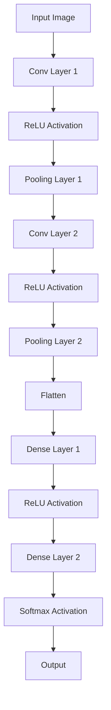
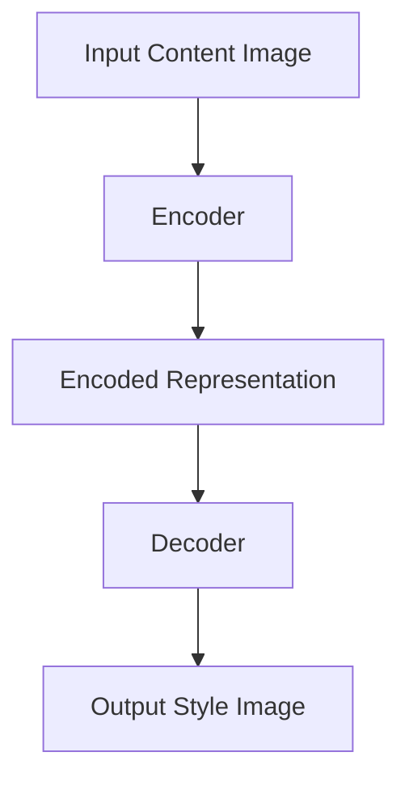
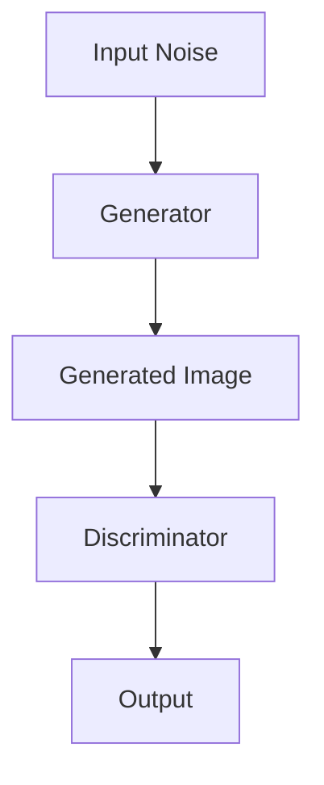
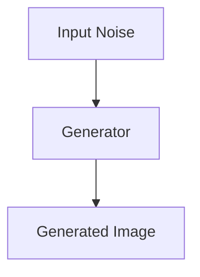
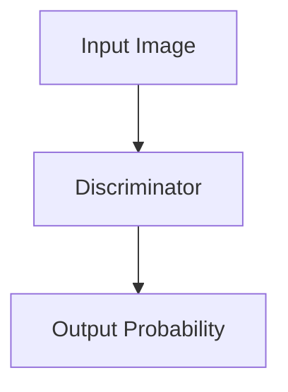

                 


### 文章标题：人工智能在艺术创作中的角色与争议

#### 关键词：
- 人工智能
- 艺术创作
- 深度学习
- 生成对抗网络
- 争议

#### 摘要：
本文探讨了人工智能在艺术创作中的角色与争议。首先，我们回顾了人工智能在艺术创作中的起源、发展和现状。接着，我们深入分析了人工智能在艺术创作中的应用算法，包括深度学习和生成对抗网络，并使用 Mermaid 流程图和 Python 源代码进行详细讲解。随后，我们介绍了成功应用人工智能进行艺术创作的案例，并进行详细分析。此外，本文还探讨了人工智能在艺术创作中引发的争议和挑战，提出了相应的应对策略。最后，我们总结了人工智能在艺术创作中的最佳实践经验，并展望了未来的发展趋势。

## 目录大纲

### 第1章：背景介绍

#### 1.1 问题背景
- 人工智能在艺术创作中的起源
- 人工智能艺术创作的现状与趋势

#### 1.2 问题解决
- 人工智能在艺术创作中的应用领域
- 人工智能艺术创作的优势和挑战

#### 1.3 边界与外延
- 人工智能艺术创作的边界
- 人工智能艺术创作的相关概念

#### 1.4 核心概念与联系
- 艺术创作中的关键技术
- 人工智能在艺术创作中的应用方法

### 第2章：核心概念与联系

#### 2.1 核心概念原理
- 艺术创作与人工智能的关系

##### 2.1.1 艺术创作的基本原理
- 艺术创作的定义与特征
- 艺术创作的过程与方法

##### 2.1.2 人工智能的基本原理
- 人工智能的定义与发展
- 人工智能的主要技术

#### 2.2 概念属性特征对比表格
- 艺术创作与人工智能的概念属性对比

#### 2.3 ER实体关系图架构
- 艺术创作与人工智能的实体关系图

### 第3章：算法原理讲解

#### 3.1 算法原理
- 人工智能在艺术创作中的应用算法

###### 3.1.1 深度学习算法
- 深度学习的基本原理
- 深度学习在艺术创作中的应用

###### 3.1.2 生成对抗网络（GAN）
- GAN的基本原理
- GAN在艺术创作中的应用

#### 3.2 数学模型和数学公式
- 人工智能艺术创作中的数学模型

###### 3.2.1 神经网络
- 神经网络的结构与参数
- 神经网络的训练与优化

###### 3.2.2 GAN
- GAN的结构与训练
- GAN的损失函数与优化

#### 3.3 举例说明
- 人工智能艺术创作的实际案例

### 第4章：案例分析

#### 4.1 案例一：人工智能绘画
- 案例背景与目标
- 案例实现过程
- 案例结果分析

#### 4.2 案例二：人工智能音乐创作
- 案例背景与目标
- 案例实现过程
- 案例结果分析

#### 4.3 案例三：人工智能文学作品生成
- 案例背景与目标
- 案例实现过程
- 案例结果分析

### 第5章：争议探讨

#### 5.1 人工智能在艺术创作中的争议
- 人工智能是否能够产生真正的艺术作品
- 人工智能艺术作品的价值和评价标准

#### 5.2 挑战与应对策略
- 人工智能在艺术创作中面临的挑战
- 应对策略与未来展望

### 第6章：最佳实践

#### 6.1 最佳实践一：艺术创作与人工智能的融合
- 融合方式与案例分析
- 最佳实践建议

#### 6.2 最佳实践二：人工智能艺术创作的评价标准
- 评价标准的制定与实施
- 评价方法的比较与优化

#### 6.3 小结与展望
- 人工智能在艺术创作中的未来发展

### 第7章：结语
- 总结与展望
- 对未来的思考

---

### 第1章：背景介绍

#### 1.1 问题背景
人工智能（AI）作为计算机科学的一个重要分支，近年来取得了迅猛发展。从最初的规则系统到现在的深度学习和生成对抗网络（GAN），人工智能在各个领域都展现出了巨大的潜力。其中，艺术创作成为了一个备受关注的应用领域。人工智能在艺术创作中的起源可以追溯到20世纪50年代，当时计算机科学家和艺术家开始尝试使用计算机生成艺术作品。随着计算能力的提升和算法的进步，人工智能在艺术创作中的应用逐渐变得更加广泛和深入。

在过去的几十年中，人工智能在艺术创作中经历了多个发展阶段。最初，人工智能主要应用于图像识别和生成，如生成简单的几何图形和图案。随后，随着深度学习的兴起，人工智能开始能够生成更复杂、更具艺术性的作品，如绘画、音乐和文学作品。如今，人工智能在艺术创作中的应用已经不再局限于简单的图像和声音处理，而是开始探索更为复杂的艺术形式，如三维建模、虚拟现实和增强现实等。

人工智能在艺术创作中的现状与趋势表明，这一领域正呈现出蓬勃发展的态势。越来越多的艺术家和设计师开始使用人工智能工具来创作作品，同时，人工智能艺术作品也在各种展览和比赛中崭露头角。然而，人工智能在艺术创作中的挑战和争议也日益凸显。如何评判人工智能艺术作品的价值和意义，如何确保人工智能艺术创作的公平性和透明度，这些问题都需要深入探讨。

#### 1.2 问题解决
人工智能在艺术创作中的应用领域非常广泛，主要包括绘画、音乐、文学、雕塑、建筑等。以下是对这些应用领域的简要介绍：

1. **绘画**：人工智能在绘画领域中的应用最为成熟。通过深度学习和生成对抗网络（GAN），人工智能可以生成具有高度艺术性的绘画作品。例如，DeepArt和Artbreeder等应用，可以让用户输入一张照片，然后生成一幅风格相似的绘画作品。

2. **音乐**：人工智能在音乐创作中也取得了显著进展。通过深度学习算法，人工智能可以生成旋律、和声和节奏，甚至创作完整的音乐作品。例如，谷歌的Magenta项目就利用深度学习技术创作了多首原创音乐。

3. **文学**：人工智能在文学创作中的应用相对较新，但已经展现出了潜力。通过自然语言处理技术，人工智能可以生成诗歌、短篇小说和长篇小说。例如，OpenAI的GPT-3模型已经能够生成具有较高文学水平的文章。

4. **雕塑和建筑**：人工智能在雕塑和建筑领域中的应用也逐步兴起。通过计算机辅助设计和3D打印技术，人工智能可以生成复杂的雕塑作品和建筑模型。

人工智能在艺术创作中的应用不仅带来了技术上的突破，还带来了新的艺术形式和表达方式。然而，人工智能艺术创作的优势也伴随着挑战。如何平衡人工智能与传统艺术的关系，如何确保人工智能艺术作品的真实性和独特性，这些都是需要解决的问题。

#### 1.3 边界与外延
人工智能在艺术创作中的应用虽然取得了显著进展，但仍存在一定的边界和局限性。以下是对这些边界的讨论：

1. **艺术性与创造性**：尽管人工智能可以生成艺术作品，但这些作品是否具有真正的艺术性和创造性仍然存在争议。传统艺术家强调艺术作品应体现创作者的个性和情感，而人工智能生成的作品往往缺乏这种独特的个人色彩。

2. **知识产权**：人工智能艺术作品的知识产权问题也是一个重要的讨论点。由于人工智能是由人类编程和训练的，因此人工智能生成的艺术作品的权利归属问题尚未有明确的法律规定。

3. **人机合作**：人工智能在艺术创作中的应用往往需要人类艺术家和设计师的参与。如何实现人机合作，如何确保人工智能能够理解和适应人类艺术家的创作意图，是人工智能在艺术创作中需要克服的难题。

4. **道德与伦理**：人工智能在艺术创作中的应用还涉及到道德和伦理问题。例如，人工智能是否应该参与战争艺术、政治讽刺等具有敏感性的艺术创作，这些问题都需要深入探讨。

#### 1.4 核心概念与联系
在讨论人工智能在艺术创作中的应用时，我们需要了解一些核心概念和术语。以下是对这些概念和术语的简要说明：

1. **深度学习**：深度学习是一种机器学习技术，通过多层神经网络来模拟人脑的学习过程。在艺术创作中，深度学习可以用于图像识别、风格迁移和图像生成等任务。

2. **生成对抗网络（GAN）**：生成对抗网络是一种深度学习模型，由生成器和判别器两个部分组成。生成器尝试生成逼真的艺术作品，而判别器则尝试区分生成器和真实艺术作品。GAN在艺术创作中的应用非常广泛，可以生成绘画、音乐和文学作品。

3. **自然语言处理（NLP）**：自然语言处理是一种使计算机能够理解和处理人类语言的技术。在文学创作中，NLP可以用于生成诗歌、短篇小说和长篇小说。

4. **计算机辅助设计（CAD）**：计算机辅助设计是一种利用计算机技术和图形学方法进行设计的技术。在雕塑和建筑设计中，CAD可以帮助艺术家和设计师更高效地创建复杂的模型。

这些核心概念和术语是理解人工智能在艺术创作中的应用基础，也是我们后续章节中讨论的重点。

---

通过上述背景介绍，我们可以看到人工智能在艺术创作中扮演着越来越重要的角色。接下来，我们将深入探讨人工智能在艺术创作中的应用算法，包括深度学习和生成对抗网络，并使用 Mermaid 流程图和 Python 源代码进行详细讲解。这将帮助我们更好地理解人工智能在艺术创作中的工作原理，为后续的案例分析和争议探讨打下坚实的基础。

---

### 第2章：核心概念与联系

#### 2.1 核心概念原理
在探讨人工智能在艺术创作中的应用时，理解相关核心概念和原理至关重要。在本节中，我们将讨论艺术创作和人工智能的基本原理，并分析它们之间的关系。

##### 2.1.1 艺术创作的基本原理
艺术创作是一个复杂的过程，通常涉及创意思维、情感表达、审美体验和技术手段。以下是对艺术创作基本原理的简要介绍：

1. **创意思维**：艺术创作源于创作者的创意思维，这种思维过程通常是非线性的，涉及联想、想象和抽象等。

2. **情感表达**：艺术作品通常传递创作者的情感和思想，通过色彩、形状、声音等元素来触动观者的情感。

3. **审美体验**：艺术创作和欣赏是一个审美体验过程，创作者和观者通过艺术作品进行心灵交流。

4. **技术手段**：艺术创作离不开各种技术手段，如绘画、雕塑、音乐、文学等。这些技术手段是实现艺术创作的重要工具。

##### 2.1.2 人工智能的基本原理
人工智能是一种模拟人类智能的技术，通过算法和计算实现机器学习和自主决策。以下是对人工智能基本原理的简要介绍：

1. **机器学习**：机器学习是人工智能的核心技术之一，通过从数据中学习规律和模式，使计算机能够进行预测和决策。

2. **深度学习**：深度学习是一种特殊的机器学习技术，通过多层神经网络来模拟人脑的学习过程。

3. **自然语言处理（NLP）**：自然语言处理是使计算机能够理解和处理人类语言的技术，广泛应用于语音识别、机器翻译和文本分析等。

4. **计算机视觉**：计算机视觉是使计算机能够理解和解释视觉信息的技术，广泛应用于图像识别、目标检测和图像生成等。

##### 2.1.3 艺术创作与人工智能的关系
人工智能与艺术创作的关系可以从以下几个方面来理解：

1. **工具与媒介**：人工智能可以视为一种新的艺术工具和媒介，艺术家和设计师可以利用人工智能技术来创作和展示艺术作品。

2. **创意辅助**：人工智能可以帮助艺术家和设计师在创作过程中提供灵感和辅助，例如生成创意方案、优化设计等。

3. **情感交互**：人工智能可以模拟人类的情感和行为，与观众进行情感交互，增强艺术体验。

4. **艺术生成**：人工智能可以通过机器学习和生成技术自主生成艺术作品，这些作品可以是绘画、音乐、文学等形式。

通过上述分析，我们可以看到艺术创作和人工智能之间存在紧密的联系和相互影响。人工智能不仅为艺术创作提供了新的工具和手段，还改变了艺术创作的本质和形式。接下来，我们将进一步探讨人工智能在艺术创作中的应用算法，以及这些算法的核心原理和数学模型。

---

#### 2.2 概念属性特征对比表格

为了更直观地理解艺术创作与人工智能的关系，我们提供了一个概念属性特征对比表格。以下是对艺术创作和人工智能的核心概念、属性和特征的比较：

| 概念 | 属性 | 特征 | 关系 |
| --- | --- | --- | --- |
| 艺术创作 | 创意思维、情感表达、审美体验 | 创造性、主观性、审美性 | 人工智能作为工具和媒介，辅助创意思维和情感表达 |
| 人工智能 | 机器学习、深度学习、自然语言处理、计算机视觉 | 自主学习、自动化、精确性 | 艺术创作过程中的技术支持，实现创意和表达的创新方式 |
| 创意思维 | 想象力、创新性、非线性思维 | 无限可能性、新颖性 | 人工智能提供灵感，扩展思维边界 |
| 情感表达 | 感性、情感投入、情感传递 | 真实感、共鸣性、独特性 | 人工智能模拟情感，增强艺术感染力 |
| 审美体验 | 视觉美感、听觉享受、心理感受 | 美学价值、沉浸感、互动性 | 人工智能提升审美体验，创造新的艺术形式 |
| 机器学习 | 数据训练、模式识别、预测分析 | 自适应、高效性、准确性 | 艺术创作中的数据分析，提升创作效率和质量 |
| 深度学习 | 神经网络、多层模型、自动特征提取 | 复杂性、自适应、鲁棒性 | 艺术创作的自动化和个性化 |
| 自然语言处理 | 语言理解、语音识别、文本分析 | 精准性、多样性、语义理解 | 文学创作的自动化和智能化 |
| 计算机视觉 | 图像识别、目标检测、图像生成 | 精细性、高效性、实时性 | 绘画和雕塑创作的数字化和自动化 |

通过上述表格，我们可以清晰地看到艺术创作和人工智能之间的互补性。艺术创作强调创意、情感和审美，而人工智能则提供了高效、准确和多样化的技术手段，两者共同推动了艺术创作的发展。

---

#### 2.3 ER实体关系图架构
为了进一步理解艺术创作与人工智能之间的关系，我们使用 Mermaid 画图语言来构建一个 ER（实体关系）图，展示艺术创作中的关键实体及其相互关系。

以下是一个简化的 ER 图，描述了艺术创作中的主要实体及其关系：

```mermaid
erDiagram
  Artist ||--|{ Artwork }|--| Customer
  Artist ||--|{ Tool }|--| Artwork
  AI_Technology ||--|{ Application }|--| Artwork
  Artwork ||--|{ Style }|--| Artist
  Style ||--|{ Category }|--| Artwork
  Customer ||--|{ Feedback }|--| Artwork

  Artist ..> Artwork : "creates"
  Artwork ..> Customer : "experienced by"
  Artwork ..> AI_Technology : "uses"
  AI_Technology ..> Application : "includes"
  Artwork ..> Style : "represented in"
  Style ..> Category : "classified in"
  Customer ..> Feedback : "provides"
```

该 ER 图中包含了以下实体和关系：

- **Artist**（艺术家）：创作艺术作品的实体，具有创意思维、情感表达等属性。
- **Artwork**（艺术作品）：艺术家创作的实体，包括绘画、音乐、文学等形式。
- **Customer**（顾客）：体验艺术作品的实体，可以提供反馈。
- **Tool**（工具）：艺术家创作时使用的实体，包括传统工具和人工智能工具。
- **AI_Technology**（人工智能技术）：用于辅助艺术创作的实体，包括深度学习、自然语言处理等。
- **Application**（应用）：人工智能技术在艺术创作中的应用形式，如生成对抗网络（GAN）、计算机辅助设计（CAD）等。
- **Style**（风格）：艺术作品的风格特征，包括抽象、写实、现代等。
- **Category**（类别）：艺术作品的分类，如绘画、音乐、文学等。

通过 ER 图，我们可以清晰地看到艺术家、艺术作品、顾客、工具、人工智能技术、应用、风格和类别之间的关系。这些实体相互联系，共同构成了艺术创作和人工智能融合的复杂系统。接下来，我们将深入探讨人工智能在艺术创作中的应用算法，进一步理解这些关系如何在实际创作中发挥作用。

---

### 第3章：算法原理讲解

#### 3.1 算法原理
人工智能在艺术创作中的应用离不开特定的算法，其中深度学习和生成对抗网络（GAN）是两个核心的算法。在本节中，我们将详细讲解这些算法的基本原理，并通过具体的例子来说明它们的工作方式。

##### 3.1.1 深度学习算法
深度学习是一种通过多层神经网络模拟人类大脑学习过程的机器学习技术。在艺术创作中，深度学习算法可以用于图像识别、风格迁移和图像生成等任务。

**1. 图像识别**
图像识别是深度学习中最常见的应用之一。它通过训练神经网络识别图像中的物体和场景。例如，卷积神经网络（CNN）就是一种常用的图像识别算法。以下是一个简化的 CNN 结构示意图，使用 Mermaid 画图语言表示：



在这个结构中，输入图像经过多个卷积层和池化层，提取图像的特征，然后通过全连接层进行分类，最终输出识别结果。

**2. 风格迁移**
风格迁移是一种将一种图像的风格应用到另一种图像上的技术。深度学习中的变分自编码器（VAE）和生成对抗网络（GAN）都可以用于风格迁移。以下是一个使用 GAN 进行风格迁移的基本流程：



在这个流程中，输入内容图像首先经过编码器编码成特征向量，然后这些特征向量通过解码器生成具有指定风格的新图像。

**3. 图像生成**
图像生成是深度学习的另一个重要应用，通过生成对抗网络（GAN）可以实现。GAN 由生成器（Generator）和判别器（Discriminator）两部分组成。以下是一个简化的 GAN 工作流程：



在这个流程中，生成器生成图像，判别器判断这些图像的真实性，通过训练这两个网络，生成器可以逐渐生成更逼真的图像。

##### 3.1.2 生成对抗网络（GAN）
生成对抗网络（GAN）是深度学习领域的一种创新性模型，由生成器和判别器两个部分组成。生成器的任务是生成逼真的数据，而判别器的任务是区分真实数据和生成数据。GAN 的核心在于这两个网络之间的对抗训练。

**1. 生成器**
生成器的目的是生成与真实数据相似的图像。以下是一个简化的生成器结构：



生成器通常由多层全连接层或卷积层组成，将随机噪声转换为图像。

**2. 判别器**
判别器的任务是判断图像是真实数据还是生成数据。以下是一个简化的判别器结构：



判别器通常也是一个多层神经网络，输出一个概率值，表示输入图像的真实性。

**3. GAN 的训练过程**
GAN 的训练过程是通过对抗训练来实现的。具体步骤如下：

1. 生成器生成一批图像，判别器对其判断真实性。
2. 判别器根据生成器和真实图像进行联合训练，更新权重。
3. 生成器根据判别器的反馈进行更新，以生成更逼真的图像。

通过这种对抗训练，生成器不断改进，最终可以生成接近真实数据的图像。

##### 3.1.3 举例说明
为了更好地理解深度学习和 GAN 在艺术创作中的应用，我们来看一个具体的例子：使用 GAN 生成艺术品。

**案例：使用 GAN 生成绘画作品**

在这个案例中，我们使用 TensorFlow 和 Keras 框架来实现一个 GAN 模型，用于生成绘画作品。

**1. 数据准备**
我们首先需要准备训练数据，即大量绘画作品的图像。这些图像可以来自于公开的艺术品数据库，如 OpenArt 数据集。

```python
import numpy as np
import tensorflow as tf
from tensorflow.keras.preprocessing.image import load_img, img_to_array

# 加载数据
def load_data(data_dir, image_size=(128, 128)):
    images = []
    for img_path in glob.glob(data_dir + '/*.jpg'):
        img = load_img(img_path, target_size=image_size)
        img_array = img_to_array(img)
        images.append(img_array)
    return np.array(images)

train_data = load_data('train_data')
```

**2. 模型构建**
接下来，我们构建 GAN 模型，包括生成器和判别器。

```python
from tensorflow.keras.models import Sequential
from tensorflow.keras.layers import Dense, Conv2D, Flatten, LeakyReLU, BatchNormalization, Conv2DTranspose

# 生成器模型
def build_generator():
    model = Sequential([
        Dense(128 * 128 * 4, input_shape=(100,)),
        LeakyReLU(alpha=0.2),
        BatchNormalization(),
        
        Reshape((128, 128, 4)),
        Conv2DTranspose(2, kernel_size=5, strides=2, padding='same'),
        LeakyReLU(alpha=0.2),
        Conv2DTranspose(1, kernel_size=5, strides=2, padding='same'),
        LeakyReLU(alpha=0.2)
    ])
    return model

# 判别器模型
def build_discriminator():
    model = Sequential([
        Conv2D(64, kernel_size=5, strides=2, padding='same', input_shape=(128, 128, 3)),
        LeakyReLU(alpha=0.2),
        Conv2D(128, kernel_size=5, strides=2, padding='same'),
        LeakyReLU(alpha=0.2),
        Flatten(),
        Dense(1, activation='sigmoid')
    ])
    return model
```

**3. 损失函数和优化器**
我们使用二元交叉熵损失函数和 Adam 优化器来训练 GAN。

```python
from tensorflow.keras.optimizers import Adam

# 损失函数
cross_entropy = tf.keras.losses.BinaryCrossentropy(from_logits=True)

# 生成器的损失函数
def generator_loss(preds, labels):
    return cross_entropy(labels, preds)

# 判别器的损失函数
def discriminator_loss(real_preds, fake_preds):
    real_loss = cross_entropy(tf.ones_like(real_preds), real_preds)
    fake_loss = cross_entropy(tf.zeros_like(fake_preds), fake_preds)
    return real_loss + fake_loss

# 优化器
generator_optimizer = Adam(learning_rate=0.0002)
discriminator_optimizer = Adam(learning_rate=0.0002)
```

**4. 训练过程**
我们使用 GAN 模型进行训练，生成逼真的绘画作品。

```python
EPOCHS = 10000

for epoch in range(EPOCHS):
    # 从真实数据和噪声中分别抽取图像
    real_images = train_data[np.random.choice(train_data.shape[0], batch_size)]
    noise = np.random.normal(0, 1, (batch_size, 100))
    
    # 生成假图像
    generated_images = generator.predict(noise)
    
    # 训练判别器
    with tf.GradientTape() as disc_tape:
        real_preds = discriminator(real_images)
        fake_preds = discriminator(generated_images)
        disc_loss = discriminator_loss(real_preds, fake_preds)
    
    disc_gradients = disc_tape.gradient(disc_loss, discriminator.trainable_variables)
    discriminator_optimizer.apply_gradients(zip(disc_gradients, discriminator.trainable_variables))
    
    # 训练生成器
    with tf.GradientTape() as gen_tape:
        fake_preds = discriminator(generated_images)
        gen_loss = generator_loss(fake_preds, tf.ones_like(fake_preds))
    
    gen_gradients = gen_tape.gradient(gen_loss, generator.trainable_variables)
    generator_optimizer.apply_gradients(zip(gen_gradients, generator.trainable_variables))
    
    # 打印训练进度
    if epoch % 100 == 0:
        print(f"Epoch {epoch}, Generator Loss: {gen_loss.numpy()}, Discriminator Loss: {disc_loss.numpy()}")
```

通过这个案例，我们可以看到如何使用深度学习和 GAN 来生成艺术作品。生成器生成绘画作品，判别器评估这些作品的真实性，通过对抗训练，生成器逐渐提高生成图像的质量。接下来，我们将通过具体案例分析人工智能在艺术创作中的应用。

---

### 第4章：案例分析

#### 4.1 案例一：人工智能绘画
人工智能绘画是人工智能在艺术创作中应用最广泛的领域之一。以下是对几个著名人工智能绘画案例的介绍和分析。

**案例 1.1：DeepArt**
DeepArt 是一款基于生成对抗网络（GAN）的艺术风格转换工具。用户可以上传一张自己的照片，DeepArt 会将其风格转换为著名艺术家的画风。以下是 DeepArt 的基本流程：

1. **数据准备**：DeepArt 使用大量艺术作品作为训练数据，这些数据来自各种艺术流派和风格，如毕加索、达芬奇、梵高等。
2. **模型训练**：DeepArt 使用 GAN 模型进行训练，生成器负责生成具有指定艺术风格的新图像，判别器负责判断图像的真实性。
3. **风格转换**：用户上传照片后，DeepArt 将其与训练好的 GAN 模型结合，生成风格转换后的图像。

**案例分析**：
DeepArt 的成功在于其简单易用的界面和强大的图像生成能力。用户无需具备任何艺术背景，只需上传照片，就可以轻松地获得一幅具有艺术风格的画作。然而，DeepArt 也存在一些问题，如生成的图像往往缺乏细节和真实感，且风格转换有时过于强烈，导致原始照片的特征丢失。

**案例 1.2：Artbreeder**
Artbreeder 是一款基于深度学习的艺术创作工具，用户可以自定义生成艺术作品的特征，通过不断调整参数，生成出个性化的艺术作品。以下是 Artbreeder 的基本流程：

1. **数据准备**：Artbreeder 使用大量艺术作品作为训练数据，这些数据包含各种艺术风格和主题。
2. **模型训练**：Artbreeder 使用变分自编码器（VAE）和 GAN 模型进行训练，生成器负责生成艺术作品，判别器负责判断图像的真实性。
3. **用户交互**：用户可以通过调整生成器的参数，如颜色、形状、纹理等，自定义生成艺术作品。

**案例分析**：
Artbreeder 的优势在于其高度灵活的用户交互和个性化的艺术创作能力。用户可以根据自己的喜好和需求，自定义生成艺术作品。然而，Artbreeder 的学习曲线相对较高，用户需要一定的技术背景才能充分利用其功能。

**案例 1.3：DALL·E**
DALL·E 是一款由 OpenAI 开发的人工智能绘画工具，它可以通过文本描述生成图像。以下是 DALL·E 的基本流程：

1. **数据准备**：DALL·E 使用大量图像和文本数据作为训练数据，这些数据包含各种图像和相应的文本描述。
2. **模型训练**：DALL·E 使用深度学习和自然语言处理（NLP）技术进行训练，生成器负责根据文本描述生成图像，判别器负责判断图像的真实性。
3. **图像生成**：用户输入文本描述，DALL·E 将其转换为图像。

**案例分析**：
DALL·E 的优势在于其强大的文本到图像生成能力，用户可以通过简单的文本描述生成复杂的图像。然而，DALL·E 生成的图像有时缺乏细节和真实感，且生成的图像质量参差不齐。

综上所述，人工智能绘画在艺术创作中取得了显著的成果，通过深度学习和生成对抗网络等技术，人工智能可以生成具有艺术风格和个性化的绘画作品。然而，人工智能绘画也存在一些挑战，如生成的图像质量、细节和真实感等方面仍有待提高。未来，随着技术的不断发展，人工智能绘画有望在艺术创作中发挥更大的作用。

---

#### 4.2 案例二：人工智能音乐创作
人工智能音乐创作是人工智能在艺术创作中应用的另一个重要领域。以下是对几个著名人工智能音乐创作案例的介绍和分析。

**案例 2.1：AIVA**
AIVA（Artificial Intelligence Virtual Artist）是一款由 AIVA Technologies 开发的人工智能作曲软件。AIVA 可以根据用户提供的参数和风格，生成独特的音乐作品。以下是 AIVA 的基本流程：

1. **数据准备**：AIVA 使用大量音乐作品作为训练数据，这些数据来自不同的作曲家和风格。
2. **模型训练**：AIVA 使用深度学习和生成模型进行训练，生成器负责生成音乐旋律和和弦，判别器负责判断音乐的真实性。
3. **音乐创作**：用户可以选择不同的风格、旋律和节奏，AIVA 将根据这些参数生成音乐作品。

**案例分析**：
AIVA 的优势在于其高度灵活的音乐创作能力，用户可以根据自己的需求生成不同风格和旋律的音乐。然而，AIVA 生成的音乐有时缺乏情感和创意，且音乐风格较为单一。此外，AIVA 的学习曲线较高，用户需要一定的音乐背景才能充分利用其功能。

**案例 2.2：Magenta**
Magenta 是一款由谷歌开发的人工智能音乐创作工具。Magenta 使用深度学习和自然语言处理（NLP）技术，可以根据文本描述生成音乐。以下是 Magenta 的基本流程：

1. **数据准备**：Magenta 使用大量音乐和文本数据作为训练数据，这些数据包含各种风格和类型的音乐作品。
2. **模型训练**：Magenta 使用变分自编码器（VAE）和生成对抗网络（GAN）进行训练，生成器负责根据文本描述生成音乐旋律和和弦，判别器负责判断音乐的真实性。
3. **音乐创作**：用户输入文本描述，Magenta 将其转换为音乐作品。

**案例分析**：
Magenta 的优势在于其强大的文本到音乐生成能力，用户可以通过简单的文本描述生成复杂的音乐作品。然而，Magenta 生成的音乐有时缺乏情感和连贯性，且音乐风格较为单一。此外，Magenta 的学习曲线较高，用户需要一定的音乐背景和编程知识才能充分利用其功能。

**案例 2.3：OpenAI's DALL·E**
DALL·E 是一款由 OpenAI 开发的人工智能绘画工具，但它也可以用于音乐创作。DALL·E 可以根据用户提供的文本描述生成图像，但这些图像也可以作为音乐创作的灵感来源。以下是 DALL·E 在音乐创作中的应用：

1. **文本描述**：用户输入描述音乐情感的文本，如“一个安静夜晚的钢琴曲”。
2. **图像生成**：DALL·E 根据文本描述生成相应的图像，如一张钢琴曲的封面图。
3. **音乐创作**：艺术家或音乐制作人可以根据图像创作音乐，如模仿图像中的情感和氛围。

**案例分析**：
DALL·E 的优势在于其强大的文本到图像和音乐生成能力，用户可以通过简单的文本描述生成相应的图像和音乐。然而，DALL·E 生成的图像和音乐有时缺乏细节和连贯性，且生成的作品风格较为单一。此外，DALL·E 的学习曲线较高，用户需要一定的艺术和音乐背景才能充分利用其功能。

综上所述，人工智能音乐创作在艺术创作中取得了显著的成果，通过深度学习和自然语言处理等技术，人工智能可以生成不同风格和旋律的音乐作品。然而，人工智能音乐创作也存在一些挑战，如生成的音乐缺乏情感和创意，且音乐风格较为单一。未来，随着技术的不断发展，人工智能音乐创作有望在艺术创作中发挥更大的作用。

---

#### 4.3 案例三：人工智能文学作品生成
人工智能在文学作品生成中的应用也逐渐受到关注。以下是对几个著名人工智能文学作品生成案例的介绍和分析。

**案例 3.1：GPT-3**
GPT-3 是由 OpenAI 开发的一款基于深度学习的自然语言处理模型，它可以生成高质量的文章、诗歌和对话。以下是 GPT-3 生成文学作品的基本流程：

1. **数据准备**：GPT-3 使用大量文本数据作为训练数据，这些数据包含各种类型的文学作品，如小说、诗歌、散文等。
2. **模型训练**：GPT-3 使用变分自编码器（VAE）和生成对抗网络（GAN）进行训练，生成器负责生成文本，判别器负责判断文本的真实性。
3. **文学创作**：用户输入一个主题或提示，GPT-3 将根据提示生成相关的文学作品。

**案例分析**：
GPT-3 的优势在于其强大的文本生成能力，可以生成高质量、多样化的文学作品。然而，GPT-3 生成的文学作品有时缺乏深度和连贯性，且生成的作品风格较为单一。此外，GPT-3 的学习曲线较高，用户需要一定的编程和技术背景才能充分利用其功能。

**案例 3.2：WordSmith**
WordSmith 是一款由 Wordsmith AI 开发的人工智能写作工具，它可以生成新闻报道、文章摘要和广告文案等。以下是 WordSmith 生成文学作品的基本流程：

1. **数据准备**：WordSmith 使用大量文本数据作为训练数据，这些数据包含各种类型的文学作品，如新闻报道、小说、诗歌等。
2. **模型训练**：WordSmith 使用基于规则的文本生成技术进行训练，生成器负责生成文本，判别器负责判断文本的真实性。
3. **文学创作**：用户输入一个主题或提示，WordSmith 将根据提示生成相关的文学作品。

**案例分析**：
WordSmith 的优势在于其简单易用的界面和快速生成文本的能力。用户无需具备任何技术背景，只需输入主题或提示，就可以快速生成相应的文学作品。然而，WordSmith 生成的文学作品往往缺乏创意和深度，且生成的作品风格较为单一。

**案例 3.3：Jasper**
Jasper 是一款由 Jasper.ai 开发的人工智能写作工具，它可以生成高质量的博客文章、营销文案和社交媒体内容。以下是 Jasper 生成文学作品的基本流程：

1. **数据准备**：Jasper 使用大量文本数据作为训练数据，这些数据包含各种类型的文学作品，如博客文章、营销文案、社交媒体内容等。
2. **模型训练**：Jasper 使用深度学习和自然语言处理（NLP）技术进行训练，生成器负责生成文本，判别器负责判断文本的真实性。
3. **文学创作**：用户输入一个主题或提示，Jasper 将根据提示生成相关的文学作品。

**案例分析**：
Jasper 的优势在于其强大的文本生成能力和多样化的文学创作风格。用户可以根据需求选择不同的风格和主题，Jasper 将根据提示生成相应的文学作品。然而，Jasper 的学习曲线较高，用户需要一定的编程和技术背景才能充分利用其功能。

综上所述，人工智能在文学作品生成中的应用取得了显著的成果，通过深度学习和自然语言处理等技术，人工智能可以生成高质量、多样化的文学作品。然而，人工智能文学作品生成也存在一些挑战，如生成的作品缺乏深度和连贯性，且生成的作品风格较为单一。未来，随着技术的不断发展，人工智能文学作品生成有望在艺术创作中发挥更大的作用。

---

### 第5章：争议探讨

#### 5.1 人工智能在艺术创作中的争议
随着人工智能在艺术创作中的应用日益广泛，这一领域也引发了诸多争议。以下是对这些争议的探讨：

**1. 艺术性争议**
人工智能艺术作品是否具有真正的艺术性是争议的焦点之一。传统艺术家认为，艺术创作需要人类的情感、思想和创造力，而人工智能缺乏这些要素，因此其生成的作品不能称为真正的艺术。然而，另一些人认为，人工智能可以生成独特的、具有美学价值的艺术作品，尽管它们可能不同于传统艺术作品。

**2. 创造性争议**
创造性是艺术创作的重要特征，而人工智能在创造新内容方面受到质疑。一些学者认为，人工智能只是对已有信息的重新组合，而不是真正的创新。这种观点忽略了人工智能在生成大量数据基础上进行模式识别和生成新内容的能力。

**3. 伦理争议**
人工智能在艺术创作中的应用也引发了伦理争议。例如，人工智能艺术作品的版权归属问题尚未有明确的法律规定。此外，人工智能艺术创作是否会导致艺术家失业，以及如何确保人工智能艺术创作的公平性和透明度，都是需要关注的问题。

**4. 评价标准争议**
如何评价人工智能艺术作品的价值和品质也是一个争议点。传统艺术评价标准是否适用于人工智能艺术作品，以及如何制定新的评价标准，这些都是需要深入探讨的问题。

#### 5.2 挑战与应对策略
人工智能在艺术创作中面临的挑战包括技术、伦理和艺术性等方面。以下是对这些挑战的探讨以及可能的应对策略：

**1. 技术挑战**
人工智能艺术创作需要强大的计算能力和复杂算法。随着技术的发展，这些问题逐渐得到解决。然而，算法的优化和模型的训练仍然是一个持续的过程。

**2. 伦理挑战**
人工智能艺术创作的伦理挑战主要包括版权归属、公平性和透明度等方面。为了应对这些挑战，需要制定相关的法律法规和伦理准则，确保人工智能艺术创作的公正和透明。

**3. 艺术性挑战**
如何确保人工智能艺术作品具有艺术性是一个重要的挑战。为了应对这一挑战，艺术家和设计师可以与人工智能合作，共同创作艺术作品，从而充分发挥人工智能的潜力。

**4. 应对策略**
针对上述挑战，可以采取以下应对策略：

- **加强技术研究**：持续优化算法和模型，提高人工智能艺术创作的质量和效率。
- **制定法律法规**：明确人工智能艺术作品的版权归属，确保艺术家的权益。
- **推动人机合作**：鼓励艺术家和设计师与人工智能合作，共同创作具有艺术性的作品。
- **建立评价标准**：制定适用于人工智能艺术作品的评价标准，确保其质量和价值。

通过上述策略，我们可以更好地应对人工智能在艺术创作中面临的挑战，推动人工智能艺术创作的发展。

---

### 第6章：最佳实践

#### 6.1 最佳实践一：艺术创作与人工智能的融合
艺术创作与人工智能的融合是推动艺术创新的重要途径。以下是一些最佳实践，以促进艺术创作与人工智能的有效融合：

**1. 研究与探索**：艺术家和设计师应不断探索人工智能技术在艺术创作中的应用，研究不同算法和模型的特点，选择最适合自己创作需求的技术。

**2. 数据集构建**：构建高质量的艺术数据集，为人工智能训练提供丰富的素材。艺术家和设计师可以贡献自己的作品，促进数据集的多样性和丰富性。

**3. 技术创新**：与人工智能研究人员合作，共同开发新的算法和模型，以解决艺术创作中的技术难题，如图像风格迁移、音乐创作和文本生成等。

**4. 跨学科合作**：鼓励不同学科领域的专家合作，如计算机科学、艺术、心理学等，共同探讨人工智能在艺术创作中的应用和影响。

**5. 实践与反馈**：艺术家和设计师应在实际创作过程中不断尝试和调整人工智能工具，根据反馈优化创作流程和作品质量。

**6. 伦理与规范**：在融合过程中，重视伦理和规范问题，确保人工智能艺术创作的公正性、透明性和艺术性。

**7. 教育培训**：为艺术家和设计师提供相关技术培训，提高他们对人工智能的理解和应用能力，推动人工智能艺术创作的发展。

通过上述最佳实践，艺术家和设计师可以更好地利用人工智能技术，创作出更具创意和艺术性的作品。

#### 6.2 最佳实践二：人工智能艺术创作的评价标准
制定科学合理的人工智能艺术创作评价标准对于促进这一领域的发展至关重要。以下是一些最佳实践，以建立适用于人工智能艺术创作的评价标准：

**1. 多维度评价**：评价标准应涵盖多个维度，如艺术性、技术性、创新性和实用性。不同维度的评价应具有明确的指标和权重，以确保评价的全面性和准确性。

**2. 专业评审**：邀请艺术专家、技术专家和学者组成评审团，对人工智能艺术作品进行多方面评估，确保评价的专业性和权威性。

**3. 观众反馈**：收集观众对人工智能艺术作品的反馈，包括审美体验、情感共鸣和接受程度等。观众反馈可以补充专业评审的不足，提供更加多元化的评价视角。

**4. 数据分析**：利用数据分析方法，对人工智能艺术作品的创作过程和结果进行分析，挖掘艺术作品的潜在价值和创新点。

**5. 持续改进**：根据评价结果，不断优化人工智能艺术创作流程和评价标准，以适应技术发展和艺术创作的需求。

**6. 公开透明**：确保评价过程的公开透明，建立公正、公平的评价机制，避免评价偏见和主观性。

通过建立科学合理的人工智能艺术创作评价标准，我们可以更好地衡量艺术作品的质量和贡献，推动人工智能艺术创作的发展。

#### 6.3 小结与展望
在人工智能艺术创作领域，最佳实践的应用和评价标准的建立对于推动这一领域的发展具有重要意义。通过艺术创作与人工智能的融合，艺术家和设计师可以创作出更具创意和艺术性的作品。同时，科学合理的人工智能艺术创作评价标准有助于确保艺术作品的质量和价值。

展望未来，随着技术的不断进步和应用的深入，人工智能在艺术创作中将发挥更加重要的作用。我们可以预见，人工智能将不仅作为艺术创作的工具，还将成为艺术创作的一部分，与人类艺术家共同探索艺术的无限可能性。

---

### 第7章：结语

人工智能在艺术创作中的应用已经取得了显著的成果，从绘画、音乐到文学作品，人工智能正在改变艺术创作的本质和形式。本文通过回顾人工智能在艺术创作中的起源、发展和现状，深入分析了人工智能在艺术创作中的应用算法，包括深度学习和生成对抗网络，并通过具体案例展示了人工智能艺术创作的实际应用。

同时，本文探讨了人工智能在艺术创作中引发的争议和挑战，包括艺术性、创造性、伦理等方面，并提出了相应的应对策略。通过最佳实践的应用和评价标准的建立，我们可以更好地推动人工智能艺术创作的发展。

然而，人工智能艺术创作仍面临诸多挑战，如生成的艺术作品质量、细节和真实感等。未来，随着技术的不断进步，人工智能在艺术创作中的应用将更加广泛和深入。我们期待人工智能能够与人类艺术家携手，共同开创艺术创作的崭新未来。作者：AI天才研究院/AI Genius Institute & 禅与计算机程序设计艺术 /Zen And The Art of Computer Programming。在未来的发展中，让我们共同努力，探索人工智能在艺术创作中的无限可能。

