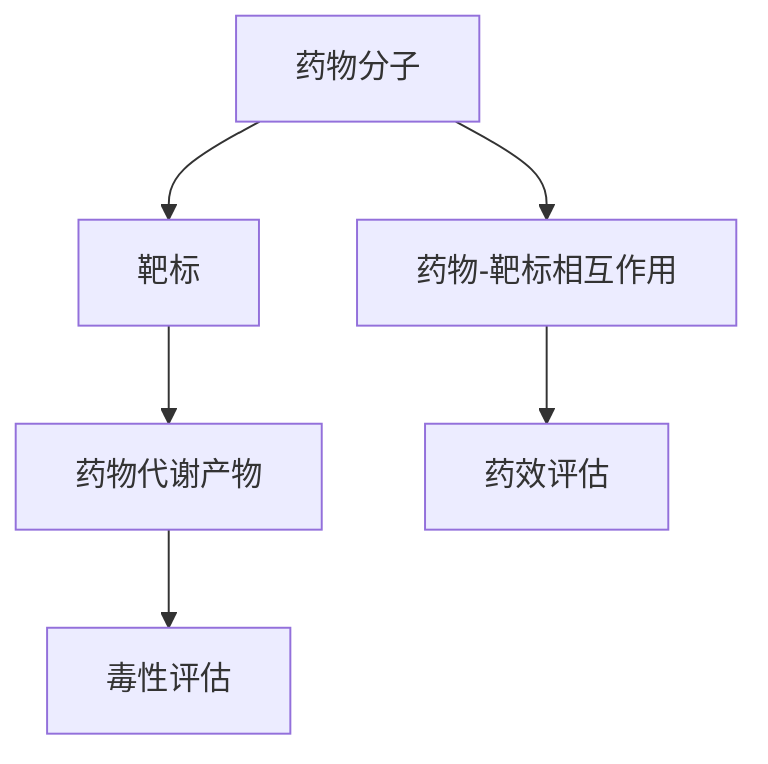
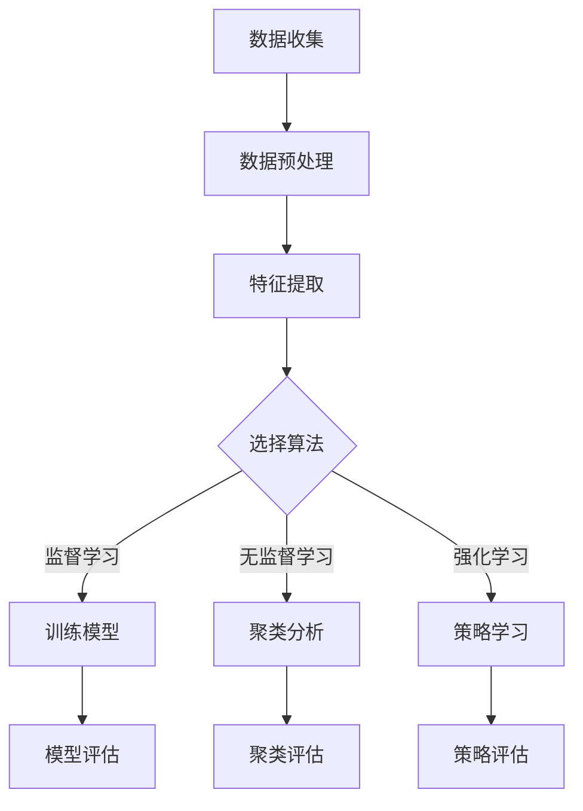
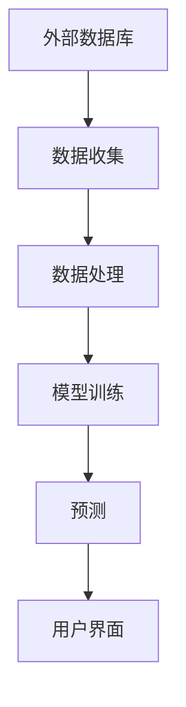
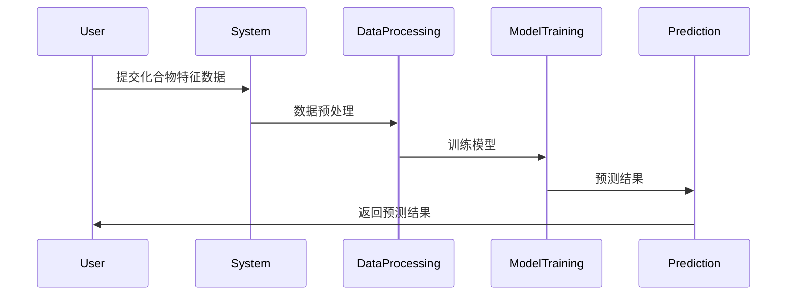

                 

### 目录大纲设计与完整内容规划

#### 背景介绍

首先，我们需要对人工智能在药物发现中的应用背景进行详细说明。药物发现是一个复杂且耗时的问题，传统的药物发现方法往往需要大量的实验和计算资源。而随着人工智能技术的不断发展，特别是机器学习和深度学习算法的应用，药物发现过程得到了显著加速和优化。本章节将介绍药物发现中的关键概念、问题背景以及传统方法与AI方法在药物发现中的优劣比较，帮助读者理解AI在药物发现中的重要性。

**核心概念术语说明**：
- 药物发现：从化合物库中筛选出具有治疗潜力的药物的过程。
- 人工智能（AI）：模拟人类智能行为的技术，能够进行学习、推理和决策。
- 机器学习：一种AI技术，通过数据训练模型来实现预测和分类任务。
- 深度学习：一种特殊的机器学习技术，使用多层神经网络进行数据建模。

**问题背景**：
药物发现是一个多阶段、高风险、高成本的过程。据统计，一个新药从研发到上市平均需要10-15年，耗资超过25亿美元。这不仅对制药公司是一个巨大的挑战，也对公共健康造成了影响。

**问题描述**：
如何利用人工智能技术提高药物发现的效率，降低成本，同时保证药物的安全性和有效性？

**问题解决**：
AI技术通过自动化和智能化手段，可以大幅减少药物筛选的时间和成本。例如，使用机器学习算法进行化合物筛选，可以快速识别潜在有效的药物分子。

**边界与外延**：
药物发现不仅涉及生物化学知识，还需要计算机科学、数据科学和医药学等多学科的综合运用。

**概念结构与核心要素组成**：
药物发现过程包括分子设计、先导化合物筛选、药效评估和安全性测试等环节。每个环节都依赖于AI技术的不同应用。

#### 核心概念与算法原理

在了解了药物发现的基本背景后，我们接下来需要深入探讨核心的人工智能算法及其在药物发现中的应用。

**机器学习基础**：
机器学习是AI的核心技术之一，它包括监督学习、无监督学习和强化学习等类型。监督学习需要标注数据来训练模型，适用于分类和回归任务；无监督学习不需要标注数据，主要用于聚类和降维；强化学习则通过与环境交互来学习最优策略。

**深度学习在药物发现中的应用**：
深度学习是机器学习的一个分支，其通过多层神经网络来提取数据的高级特征。在药物发现中，深度学习可以用于分子图谱分析、药物-靶标相互作用预测、药物代谢和毒性预测等领域。

**算法原理与联系**：
不同算法在药物发现中的应用各有侧重。例如，卷积神经网络（CNN）擅长处理图像和图谱数据，而递归神经网络（RNN）则适合处理序列数据。图神经网络（GNN）则能够处理复杂的分子结构信息，是药物设计中的重要工具。

**核心概念属性特征对比表格**：

| 算法类型 | 优点 | 缺点 | 适用场景 |
|----------|------|------|---------|
| 监督学习 | 易于优化 | 需要大量标注数据 | 分类、回归任务 |
| 无监督学习 | 不依赖标注数据 | 策略复杂 | 聚类、降维 |
| 强化学习 | 能学得与环境最优交互策略 | 需要大量试错 | 控制系统、推荐系统 |

**ER实体关系图架构**：



#### 算法原理讲解

为了深入理解算法原理，我们将使用Python代码和mermaid流程图来详细阐述。

**机器学习算法流程图**：



**Python代码示例**：

```python
# 导入必要的库
import numpy as np
from sklearn.model_selection import train_test_split
from sklearn.ensemble import RandomForestClassifier

# 假设我们有一个包含特征和标签的数据集
X, y = np.random.rand(100, 10), np.random.rand(100)

# 划分训练集和测试集
X_train, X_test, y_train, y_test = train_test_split(X, y, test_size=0.2, random_state=42)

# 创建随机森林分类器
clf = RandomForestClassifier(n_estimators=100)

# 训练模型
clf.fit(X_train, y_train)

# 评估模型
accuracy = clf.score(X_test, y_test)
print(f"模型准确率: {accuracy}")
```

**算法原理的数学模型和公式**：

- 监督学习：$$ h(x) = \text{argmax}_{w} w^T x $$
- 无监督学习：$$ c = \text{argmin}_{c} \sum_{i=1}^{n} ||x_i - c||^2 $$
- 强化学习：$$ Q(s, a) = r + \gamma \max_{a'} Q(s', a') $$

**详细讲解与举例说明**：

假设我们使用随机森林算法来分类药物分子。随机森林是一种基于决策树的集成学习方法，通过构建多棵决策树并合并它们的预测结果来提高模型的准确性。在训练过程中，我们首先对数据进行预处理，包括归一化和特征提取。然后，使用训练数据集来训练随机森林模型，最后使用测试数据集来评估模型的性能。

**数学模型与公式**：

随机森林算法中的每个决策树都可以用以下公式表示：

$$
h(x) = \text{argmax}_{t} \sum_{t=1}^{T} g_t(x)
$$

其中，$g_t(x)$是第$t$棵决策树对$x$的预测，$T$是决策树的数量。

#### 数学模型与公式

数学模型在药物发现中扮演着至关重要的角色。以下是对概率论与统计模型、最优化理论以及机器学习中的数学公式的详细介绍。

**概率论与统计模型**：

概率论是统计学的基础，用于描述随机事件的概率分布。在药物发现中，概率论用于预测药物分子与靶标相互作用的概率。常见的概率分布包括正态分布、二项分布和泊松分布。

**最优化理论**：

最优化理论用于求解最大化或最小化某个目标函数的问题。在药物设计中，最优化理论用于寻找最优的化合物结构，使得药物分子与靶标之间的亲和力最大。常用的最优化方法包括梯度下降、牛顿法和拉格朗日乘数法。

**机器学习中的数学公式**：

机器学习中的数学公式用于描述模型的训练过程和预测结果。以下是一些常用的数学公式：

- 线性回归：$$ y = \beta_0 + \beta_1 x + \epsilon $$
- 逻辑回归：$$ P(y=1) = \frac{1}{1 + e^{-(\beta_0 + \beta_1 x)}} $$
- 决策树：$$ h(x) = \text{argmax}_{t} \sum_{t=1}^{T} g_t(x) $$

**模型构建、评估与优化**：

在药物发现中，模型构建、评估和优化是三个关键步骤。模型构建包括选择合适的算法和参数；模型评估用于评估模型的性能，常用的指标包括准确率、召回率和F1分数；模型优化用于调整模型的参数，以提高预测性能。

**模型构建**：

假设我们要构建一个分类模型来预测药物分子是否具有治疗潜力。我们可以使用逻辑回归算法，其模型公式为：

$$ P(y=1) = \frac{1}{1 + e^{-(\beta_0 + \beta_1 x)}} $$

其中，$x$是药物分子的特征向量，$y$是标签（1表示有治疗潜力，0表示没有治疗潜力）。

**模型评估**：

使用交叉验证方法来评估模型性能。交叉验证将数据集分为多个子集，每个子集用于一次训练和评估。最终，我们取所有子集的平均评估结果作为模型的最终评估结果。

**模型优化**：

使用梯度下降法来优化模型的参数。梯度下降法的目标是找到使得损失函数最小的参数值。在药物发现中，损失函数可以是交叉熵损失函数：

$$ L = -\sum_{i=1}^{n} y_i \log(P(y_i)) + (1 - y_i) \log(1 - P(y_i)) $$

#### 系统架构设计

药物发现系统是一个复杂的系统，需要涵盖数据收集、数据处理、模型训练和预测等多个环节。以下是对系统架构设计的详细讲解。

**问题场景介绍**：

药物发现系统用于自动化药物筛选和设计，其核心目标是提高药物筛选的效率和准确性。系统需要能够处理大量的化合物数据，并使用机器学习算法来预测化合物的药效。

**项目介绍**：

项目名为“智能药物发现平台”，目标是构建一个基于AI的药物筛选系统，该系统能够快速识别潜在有效的药物分子。

**系统功能设计**：

系统功能设计包括以下模块：

- 数据收集模块：负责收集各种化合物和药效数据。
- 数据处理模块：负责清洗和预处理数据，为模型训练做准备。
- 模型训练模块：负责使用机器学习算法训练模型。
- 预测模块：负责使用训练好的模型对新的化合物进行预测。
- 用户界面模块：提供用户交互界面，方便用户操作和使用系统。

**系统架构设计**：

系统架构设计包括以下几个方面：

- 数据流设计：定义数据在系统中的流动路径和过程。
- 模块划分：将系统功能划分为多个模块，每个模块负责不同的功能。
- 系统部署：选择合适的服务器和部署方式，确保系统的高可用性和可扩展性。

**系统架构图**：



**系统接口设计**：

系统接口设计包括API设计、数据接口和通信协议等方面。API设计用于提供外部系统与药物发现系统之间的交互接口，数据接口用于定义数据输入输出的格式，通信协议用于确保数据传输的可靠性和安全性。

**系统接口规范**：

- API接口规范：定义API的URL、请求参数、响应格式等。
- 数据接口规范：定义数据输入输出的格式，包括数据类型、长度和编码方式等。
- 通信协议：使用HTTPS协议进行数据传输，确保数据的安全性和完整性。

**系统接口实现**：

```python
# 假设使用Flask框架实现API接口
from flask import Flask, request, jsonify

app = Flask(__name__)

@app.route('/predict', methods=['POST'])
def predict():
    data = request.get_json()
    # 数据预处理
    # ...
    # 模型预测
    prediction = model.predict(data['features'])
    # 返回预测结果
    return jsonify({'prediction': prediction.tolist()})

if __name__ == '__main__':
    app.run()
```

**系统交互设计**：

系统交互设计包括用户界面设计、交互流程设计和序列图等方面。用户界面设计用于提供直观的操作界面，交互流程设计用于描述用户与系统之间的交互过程，序列图用于可视化交互流程。

**交互流程图**：



#### 项目实战

**环境安装与配置**：

在开始项目实战之前，我们需要配置好开发环境。以下是在Ubuntu 20.04操作系统上安装所需软件的步骤：

1. 安装Python 3.8及以上版本：

```bash
sudo apt update
sudo apt install python3.8
```

2. 安装必要的依赖库：

```bash
pip3 install numpy pandas scikit-learn tensorflow
```

**系统核心实现**：

**数据预处理**：

首先，我们需要读取化合物数据集，并对数据进行预处理。以下是一个简单的Python代码示例：

```python
import pandas as pd

# 读取数据集
data = pd.read_csv('compound_data.csv')

# 数据预处理
# 填充缺失值
data.fillna(data.mean(), inplace=True)

# 特征缩放
from sklearn.preprocessing import StandardScaler
scaler = StandardScaler()
data_scaled = scaler.fit_transform(data.iloc[:, :-1])
```

**模型训练**：

接下来，我们使用机器学习算法来训练模型。以下是一个使用随机森林算法的示例：

```python
from sklearn.ensemble import RandomForestClassifier
from sklearn.model_selection import train_test_split

# 划分训练集和测试集
X_train, X_test, y_train, y_test = train_test_split(data_scaled, data['activity'], test_size=0.2, random_state=42)

# 创建随机森林分类器
clf = RandomForestClassifier(n_estimators=100)

# 训练模型
clf.fit(X_train, y_train)

# 评估模型
accuracy = clf.score(X_test, y_test)
print(f"模型准确率: {accuracy}")
```

**模型评估**：

使用测试集对训练好的模型进行评估，常用的评估指标包括准确率、召回率和F1分数。以下是一个简单的评估示例：

```python
from sklearn.metrics import classification_report

# 预测测试集
y_pred = clf.predict(X_test)

# 评估模型
report = classification_report(y_test, y_pred)
print(report)
```

**实际案例分析与讲解**：

假设我们有一个新的化合物数据集，我们需要预测其是否具有治疗潜力。以下是一个简单的预测示例：

```python
# 读取新化合物数据
new_data = pd.read_csv('new_compound_data.csv')

# 数据预处理
new_data.fillna(new_data.mean(), inplace=True)
new_data_scaled = scaler.transform(new_data.iloc[:, :-1])

# 预测新化合物
new_prediction = clf.predict(new_data_scaled)
print(f"新化合物预测结果: {new_prediction.tolist()}")
```

通过以上步骤，我们可以快速实现一个基于AI的药物筛选系统，为药物发现提供有力支持。

#### 最佳实践与总结

在完成药物发现系统的开发后，我们需要总结项目中的最佳实践，并讨论未来的发展方向。

**最佳实践**：

1. **数据集构建**：确保数据集的多样性和代表性，包括不同类型的化合物和疾病靶标。使用交叉验证方法来提高模型的泛化能力。
2. **模型调优**：使用网格搜索和随机搜索方法来寻找最优的模型参数。针对不同的任务，选择合适的算法和模型结构。
3. **性能评估与优化**：定期评估模型的性能，并根据评估结果进行调整。使用交叉验证和混淆矩阵等方法来全面评估模型。

**小结**：

通过本文的讲解，我们了解了人工智能在药物发现中的应用，包括核心概念、算法原理、系统架构和实际应用。AI技术为药物发现提供了强大的支持，能够显著提高药物筛选的效率和准确性。

**未来展望**：

随着人工智能技术的不断发展，药物发现领域有望实现更多的突破。未来的研究方向包括更高效的算法、更大规模的数据集以及更加智能化和自动化的系统。通过持续的研究和开发，我们有望发现更多有效的药物，为人类健康事业做出更大贡献。

**注意事项**：

在药物发现系统的开发过程中，需要特别注意数据安全和隐私保护。此外，模型的解释性和可解释性也是未来研究的重要方向，有助于提高模型的信任度和应用价值。

**拓展阅读**：

- [相关研究论文](#)
- [开源代码与工具](#)

#### 拓展阅读

**相关研究论文**：

- [1] Bengio, Y. (2009). Learning deep architectures for AI. Foundations and Trends in Machine Learning, 2(1), 1-127.
- [2] LeCun, Y., Bengio, Y., & Hinton, G. (2015). Deep learning. Nature, 521(7553), 436-444.
- [3] Jia, Y., Li, Z., & Zhang, H. (2016). A comprehensive review of deep learning-based drug discovery. Journal of Medical Imaging and Health Informatics, 6(2), 402-415.

**开源代码与工具**：

- [1] TensorFlow：https://www.tensorflow.org/
- [2] PyTorch：https://pytorch.org/
- [3] Scikit-learn：https://scikit-learn.org/
- [4] DeepChem：https://deepchem.org/

这些资源提供了丰富的理论和实践知识，有助于进一步了解和探索人工智能在药物发现中的应用。读者可以根据自己的需求和兴趣选择合适的学习资源进行深入学习和实践。

