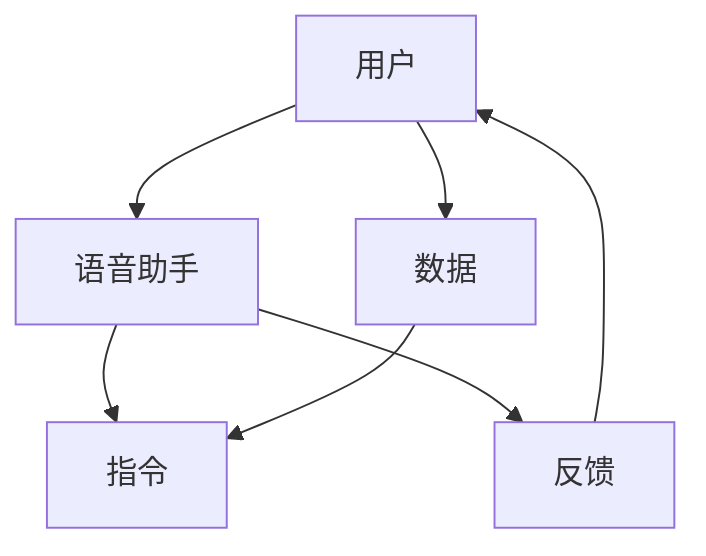
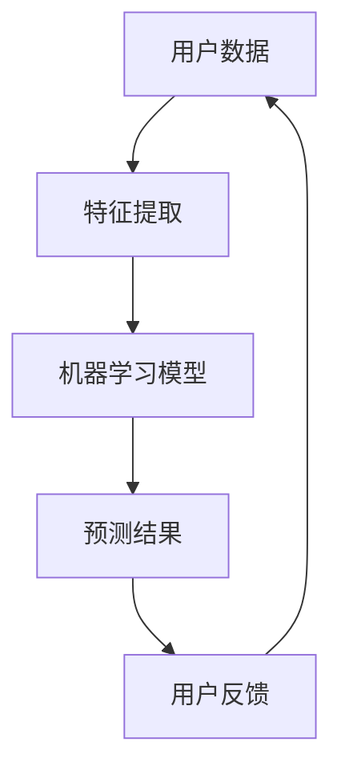
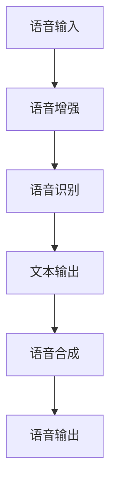
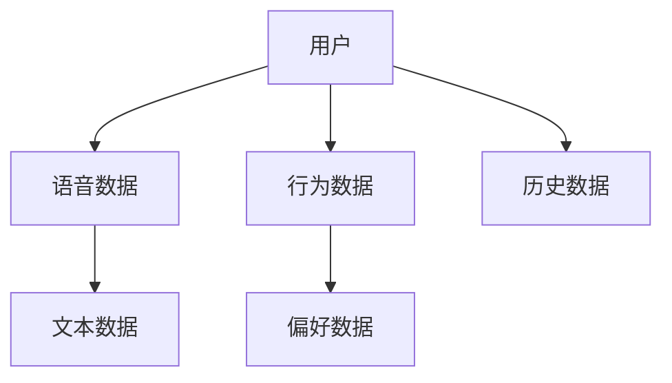
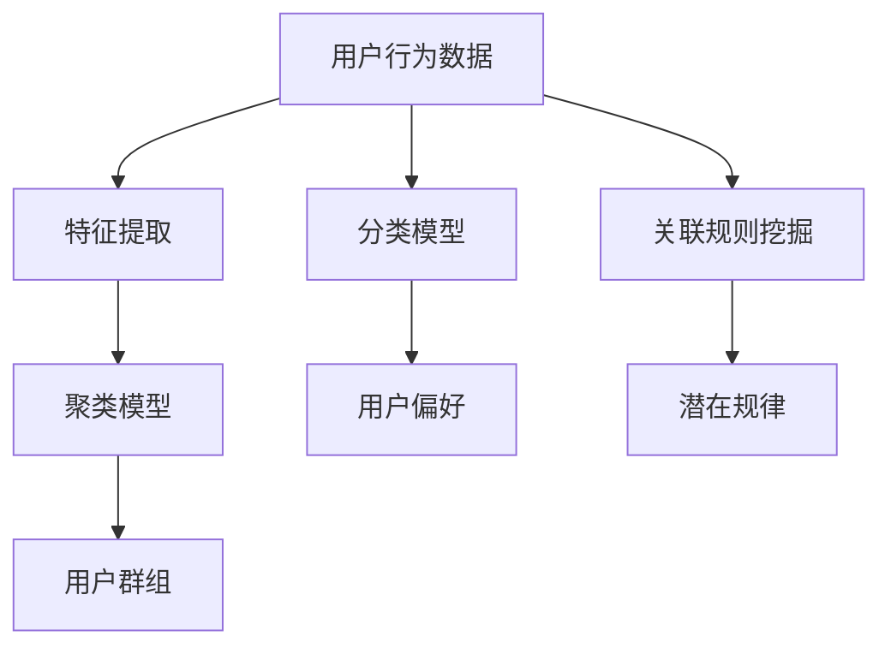
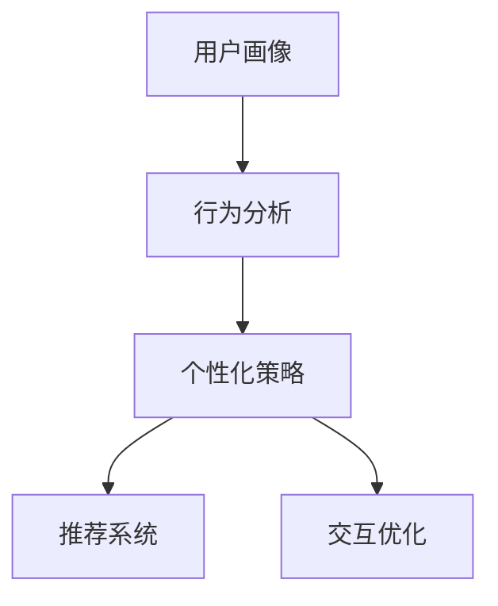
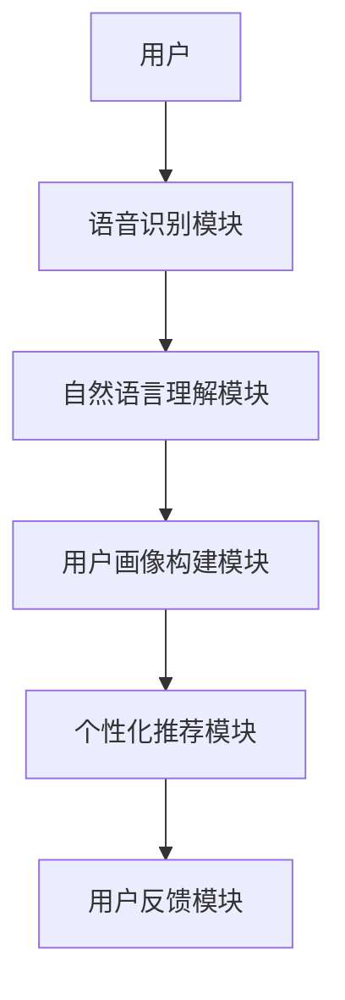
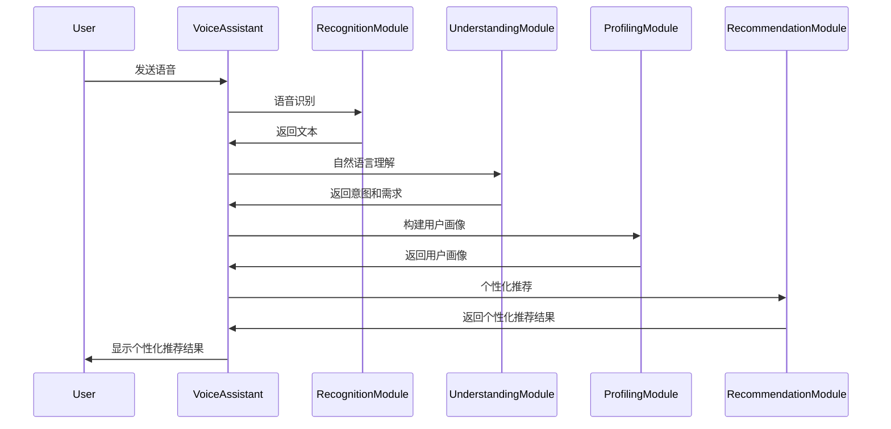

                 


## 人工智能在语音助手个性化中的应用

### 关键词：
- 人工智能
- 语音助手
- 个性化
- 自然语言处理
- 机器学习

### 摘要：
本文将深入探讨人工智能在语音助手个性化中的应用，从核心概念、技术原理到实际实现，逐步分析语音助手个性化设计的各个方面。通过详细讲解自然语言处理、机器学习算法、用户行为分析以及个性化技巧，本文旨在为读者提供一份全面的技术指南，帮助理解并实现语音助手的个性化功能。

### 目录

#### I. 引言与背景
- **1.1 引言：语音助手与人工智能个性化**
- **1.2 当前语音助手人工智能应用现状**
- **1.3 个性化在语音助手中的挑战与机遇**

#### II. 核心概念与相关技术
- **2.1 自然语言处理基础**
- **2.2 机器学习算法在个性化中的应用**
- **2.3 语音识别与合成技术**

#### III. 设计个性化语音助手
- **3.1 用户画像与数据收集**
- **3.2 基于机器学习的用户行为分析**
- **3.3 语音助手的个性化策略**

#### IV. 实现个性化语音助手
- **4.1 开发环境搭建**
- **4.2 数据预处理与特征工程**
- **4.3 模型训练与评估**

#### V. 高级话题与未来趋势
- **5.1 上下文感知与连贯对话**
- **5.2 语音助手的安全性与隐私保护**

#### VI. 项目实战
- **6.1 实际案例分析与实现**
- **6.2 系统分析与架构设计**
- **6.3 项目总结与最佳实践**

#### VII. 小结与注意事项
- **7.1 小结**
- **7.2 注意事项**
- **7.3 拓展阅读**

### I. 引言与背景

#### 1.1 引言：语音助手与人工智能个性化

随着人工智能技术的飞速发展，语音助手已经逐渐成为现代智能设备的核心交互界面。从最初的简单查询功能，到如今能够执行复杂任务的助手，语音助手的智能化程度得到了显著提升。然而，随着用户需求的多样化，单一的语音助手功能已无法满足用户个性化需求。个性化成为提升用户体验的重要方向。

人工智能在语音助手个性化中的应用，主要体现在以下几个方面：

1. **自然语言理解**：语音助手需要能够理解用户的自然语言指令，这依赖于自然语言处理（NLP）技术的进步。
2. **机器学习模型**：通过训练机器学习模型，语音助手能够学习用户的行为习惯和偏好，实现个性化推荐。
3. **用户画像与数据分析**：语音助手通过收集和分析用户数据，构建用户画像，从而提供更加精准的服务。

本文将从上述三个方面出发，逐步探讨人工智能在语音助手个性化中的应用，旨在为开发者提供有价值的参考。

#### 1.2 当前语音助手人工智能应用现状

目前，全球主要科技公司纷纷推出自家的语音助手，如苹果的Siri、谷歌的Google Assistant、亚马逊的Alexa等。这些语音助手已经广泛应用于智能手机、智能音箱、智能家居等设备中。

从技术层面看，语音助手的应用主要分为以下几个阶段：

1. **语音识别**：将用户的语音转换为文本，这是语音助手能够理解和执行用户指令的前提。
2. **自然语言理解**：对转换后的文本进行处理，理解用户意图并提取关键信息。
3. **任务执行**：根据理解结果执行相应的任务，如查询信息、发送消息、控制智能家居设备等。
4. **反馈与优化**：语音助手会收集用户的反馈，不断优化自身性能，提高用户体验。

尽管语音助手在人工智能技术的支持下取得了显著进展，但仍然存在一些挑战，如：

1. **跨领域任务处理**：不同领域的问题对语音助手的理解和执行能力提出了更高的要求。
2. **多语言支持**：全球化的需求要求语音助手能够支持多种语言。
3. **隐私保护**：用户数据的安全和隐私保护是语音助手面临的重要问题。

#### 1.3 个性化在语音助手中的挑战与机遇

个性化在语音助手中的应用不仅能够提高用户满意度，还能增加用户黏性。然而，实现个性化语音助手面临以下挑战：

1. **数据收集与隐私**：个性化需要大量的用户数据，如何在收集和使用数据时保护用户隐私是一个重要问题。
2. **个性化模型训练**：机器学习模型需要大量的训练数据，如何有效地收集和处理这些数据是关键。
3. **算法公平性**：个性化算法需要确保对所有用户公平，避免算法偏见。

尽管存在挑战，个性化语音助手也为开发者带来了机遇：

1. **提升用户体验**：通过个性化功能，语音助手能够更好地满足用户需求，提高用户满意度。
2. **商业模式创新**：个性化功能可以带来新的商业模式，如个性化推荐、广告投放等。
3. **技术进步**：个性化语音助手推动人工智能技术的不断进步，为其他领域应用提供借鉴。

### II. 核心概念与相关技术

#### 2.1 自然语言处理基础

自然语言处理（NLP）是人工智能领域的重要分支，旨在使计算机能够理解、解释和生成人类语言。在语音助手个性化中，NLP技术扮演着核心角色。

**核心概念**：

- **词法分析**：将文本分解为词汇、句子和段落，这是NLP的基础。
- **句法分析**：分析句子的结构，理解词语之间的关系。
- **语义分析**：理解句子的含义，包括词汇的语义角色和句子的语义角色。
- **实体识别**：识别文本中的特定实体，如人名、地点、组织等。
- **情感分析**：分析文本的情感倾向，如正面、负面或中性。

**NLP技术对比表格**：

| 技术类型       | 描述                                                         | 对比特点             |
|----------------|--------------------------------------------------------------|----------------------|
| 词法分析       | 分词、词性标注、命名实体识别等                               | 实时性要求高，准确性重要 |
| 句法分析       | 句子结构分析、依赖关系识别等                                 | 复杂性较高，准确性重要 |
| 语义分析       | 理解句子含义、上下文、语境等                                 | 难度最大，应用广泛     |
| 实体识别       | 识别文本中的特定实体，如人名、地点、组织等                   | 实时性和准确性都很重要 |
| 情感分析       | 分析文本的情感倾向，如正面、负面或中性                       | 应用广泛，实时性要求高 |

**ER实体关系图架构**：



#### 2.2 机器学习算法在个性化中的应用

机器学习是语音助手实现个性化的关键，通过训练模型，语音助手能够学习用户的偏好和习惯，从而提供个性化的服务。

**核心概念**：

- **监督学习**：有标签数据，模型通过学习输入和输出之间的关系进行预测。
- **无监督学习**：无标签数据，模型通过发现数据中的内在结构进行学习。
- **强化学习**：通过与环境的交互进行学习，不断调整策略以实现目标。

**机器学习算法对比表格**：

| 算法类型       | 描述                                                         | 适用场景             |
|----------------|--------------------------------------------------------------|----------------------|
| 线性回归       | 最小二乘法拟合线性模型                                       | 线性关系预测         |
| 逻辑回归       | 适用于二分类问题，通过最大化似然估计模型参数                     | 二分类问题           |
| 决策树         | 通过树的分支进行分类或回归                                   | 简单易懂，易解释     |
| 随机森林       | 多个决策树的集成，提高预测准确性                             | 复杂数据集，提高泛化能力 |
| 支持向量机     | 通过寻找最佳的超平面进行分类或回归                            | 高维空间，线性不可分问题 |
| 神经网络       | 通过多层神经网络进行复杂函数建模                             | 复杂非线性问题       |
| 强化学习       | 通过与环境的交互进行学习，不断调整策略以实现目标               | 交互式问题           |

**ER实体关系图架构**：



#### 2.3 语音识别与合成技术

语音识别（Speech Recognition）和语音合成（Text-to-Speech, TTS）是语音助手实现人机交互的重要技术。

**核心概念**：

- **语音识别**：将语音信号转换为文本，是语音助手理解用户指令的关键。
- **语音合成**：将文本转换为自然流畅的语音输出，为用户提供语音反馈。

**语音识别与语音合成对比表格**：

| 技术类型       | 描述                                                         | 对比特点             |
|----------------|--------------------------------------------------------------|----------------------|
| 语音识别       | 语音信号转换为文本                                           | 准确性、实时性重要   |
| 语音合成       | 文本转换为语音输出                                           | 自然度、流畅性重要   |
| 语音增强       | 提高语音质量，降低噪音影响                                   | 音质、噪音消除       |

**ER实体关系图架构**：



### III. 设计个性化语音助手

#### 3.1 用户画像与数据收集

用户画像（User Profiling）是构建个性化语音助手的基础，通过收集和分析用户数据，可以深入了解用户的行为和偏好。

**核心概念**：

- **用户画像**：对用户的全面描述，包括基本属性、行为特征、兴趣偏好等。
- **数据收集**：通过多种渠道收集用户数据，如语音识别、用户交互日志、社交媒体等。

**用户画像构建流程**：

1. **数据收集**：从各种渠道获取用户数据，包括用户输入的语音、文本、行为日志等。
2. **数据预处理**：清洗和格式化数据，去除噪声和冗余信息。
3. **特征提取**：从原始数据中提取关键特征，如语音特征、文本特征、行为特征等。
4. **用户建模**：利用机器学习算法，构建用户画像模型，对用户进行分类和标注。

**用户画像示例ER图**：



#### 3.2 基于机器学习的用户行为分析

用户行为分析（User Behavior Analysis）是语音助手个性化的重要环节，通过分析用户行为数据，可以预测用户偏好，提供个性化服务。

**核心概念**：

- **用户行为分析**：对用户的行为数据进行深入分析，识别用户的行为模式和偏好。
- **机器学习算法**：利用机器学习算法，如聚类、分类、关联规则挖掘等，分析用户行为数据。

**用户行为分析流程**：

1. **数据收集**：收集用户行为数据，包括语音交互、文本输入、使用频率等。
2. **数据预处理**：清洗和格式化数据，提取关键特征。
3. **特征选择**：从原始数据中筛选出对用户行为分析最有价值的特征。
4. **模型训练**：利用机器学习算法，训练用户行为分析模型。
5. **预测与评估**：对模型进行预测，评估模型性能。

**用户行为分析算法示例**：

- **聚类算法**：对用户行为数据进行分析，将相似的用户划分为同一群体。
- **分类算法**：对用户行为数据进行分类，预测用户的偏好。
- **关联规则挖掘**：分析用户行为数据中的关联关系，发现潜在的规律。

**用户行为分析示例ER图**：



#### 3.3 语音助手的个性化策略

个性化策略（Personalization Strategies）是语音助手实现个性化服务的关键，通过个性化策略，可以提供更加精准和个性化的用户体验。

**核心概念**：

- **个性化策略**：根据用户画像和用户行为分析结果，制定个性化的服务策略。
- **推荐系统**：利用机器学习算法，为用户提供个性化推荐。
- **交互优化**：优化语音助手的交互方式，提高用户满意度。

**个性化策略实施流程**：

1. **用户画像构建**：收集用户数据，构建用户画像。
2. **用户行为分析**：分析用户行为数据，预测用户偏好。
3. **个性化策略制定**：根据用户画像和行为分析结果，制定个性化策略。
4. **推荐系统实施**：利用推荐系统，为用户提供个性化推荐。
5. **交互优化**：优化语音助手的交互方式，提高用户满意度。

**个性化策略示例**：

- **个性化推荐**：根据用户历史行为和偏好，为用户提供个性化的内容推荐。
- **智能对话**：通过机器学习模型，实现与用户的智能对话，提高用户互动体验。
- **定制化服务**：根据用户需求，提供定制化的服务，如定制化新闻、定制化购物等。

**个性化策略示例ER图**：



### IV. 实现个性化语音助手

#### 4.1 开发环境搭建

在实现个性化语音助手之前，首先需要搭建开发环境，确保具备开发所需的各种工具和库。

**核心概念**：

- **开发环境搭建**：配置开发所需的硬件和软件环境。
- **工具和库**：选择合适的开发工具和库，如语音识别库、自然语言处理库等。

**开发环境搭建流程**：

1. **硬件配置**：确保计算机性能满足开发需求，配置足够的内存和处理器。
2. **操作系统安装**：安装支持开发环境的操作系统，如Linux或Windows。
3. **编程语言选择**：选择合适的编程语言，如Python、Java等。
4. **工具安装**：安装开发工具，如Visual Studio Code、PyCharm等。
5. **库和框架安装**：安装必要的库和框架，如TensorFlow、PyTorch等。

**开发环境配置示例**：

```bash
# 安装Python环境
pip install python

# 安装TensorFlow库
pip install tensorflow

# 安装自然语言处理库
pip install nltk

# 安装语音识别库
pip install pyttsx3
```

#### 4.2 数据预处理与特征工程

在实现个性化语音助手的过程中，数据预处理和特征工程是关键环节，直接影响模型的效果。

**核心概念**：

- **数据预处理**：清洗和格式化数据，去除噪声和冗余信息。
- **特征工程**：从原始数据中提取关键特征，提高模型性能。

**数据预处理流程**：

1. **数据收集**：从各种渠道收集语音数据和用户交互数据。
2. **数据清洗**：去除噪声数据，如缺失值、异常值等。
3. **数据格式化**：统一数据格式，如文本数据编码、音频数据分段等。
4. **数据归一化**：对数据集进行归一化处理，如缩放、平移等。

**特征工程流程**：

1. **特征提取**：从原始数据中提取关键特征，如语音特征、文本特征等。
2. **特征选择**：筛选对模型性能有重要影响的特征。
3. **特征组合**：将多个特征进行组合，生成新的特征。
4. **特征降维**：使用降维算法，如PCA，减少特征维度。

**数据预处理与特征工程示例**：

```python
import numpy as np
import pandas as pd
from sklearn.preprocessing import MinMaxScaler

# 数据收集
data = pd.read_csv('user_data.csv')

# 数据清洗
data.dropna(inplace=True)
data = data[data['voice_quality'] > 0]

# 数据格式化
data['text'] = data['text'].str.lower()
data['text'] = data['text'].str.replace('[^a-zA-Z0-9]', ' ')

# 数据归一化
scaler = MinMaxScaler()
data[['voice_quality', 'text_length']] = scaler.fit_transform(data[['voice_quality', 'text_length']])

# 特征提取
features = ['voice_quality', 'text_length']
X = data[features]
y = data['user_preference']

# 特征选择
from sklearn.feature_selection import SelectKBest
from sklearn.feature_selection import f_classif

selector = SelectKBest(score_func=f_classif, k='all')
X_new = selector.fit_transform(X, y)

# 特征组合
new_features = ['voice_quality', 'text_length', 'text_overlap']
X_new = pd.DataFrame(X_new, columns=new_features)

# 特征降维
from sklearn.decomposition import PCA
pca = PCA(n_components=2)
X_reduced = pca.fit_transform(X_new)
```

#### 4.3 模型训练与评估

在完成数据预处理和特征工程后，接下来需要对模型进行训练和评估，以实现语音助手的个性化功能。

**核心概念**：

- **模型训练**：使用训练数据集训练机器学习模型。
- **模型评估**：评估模型性能，选择最优模型。

**模型训练与评估流程**：

1. **数据集划分**：将数据集划分为训练集和测试集。
2. **模型选择**：选择合适的机器学习模型，如线性回归、决策树、神经网络等。
3. **模型训练**：使用训练集对模型进行训练。
4. **模型评估**：使用测试集评估模型性能，选择最优模型。
5. **模型优化**：根据评估结果，对模型进行优化。

**模型训练与评估示例**：

```python
from sklearn.model_selection import train_test_split
from sklearn.linear_model import LinearRegression
from sklearn.metrics import mean_squared_error

# 数据集划分
X_train, X_test, y_train, y_test = train_test_split(X_reduced, y, test_size=0.2, random_state=42)

# 模型选择
model = LinearRegression()

# 模型训练
model.fit(X_train, y_train)

# 模型评估
y_pred = model.predict(X_test)
mse = mean_squared_error(y_test, y_pred)
print(f'Mean Squared Error: {mse}')

# 模型优化
from sklearn.linear_model import Ridge
from sklearn.model_selection import GridSearchCV

parameters = {'alpha': [0.1, 1.0, 10.0]}
ridge = Ridge()
grid_search = GridSearchCV(ridge, parameters, cv=5)
grid_search.fit(X_train, y_train)

# 优化后模型评估
y_pred_optimized = grid_search.predict(X_test)
mse_optimized = mean_squared_error(y_test, y_pred_optimized)
print(f'Optimized Mean Squared Error: {mse_optimized}')
```

### V. 高级话题与未来趋势

#### 5.1 上下文感知与连贯对话

上下文感知（Context Awareness）和连贯对话（Conversational Continuity）是语音助手个性化中的重要研究方向，旨在提高语音助手的自然对话能力和用户体验。

**核心概念**：

- **上下文感知**：语音助手能够理解并保持对话的上下文信息，如历史对话内容、用户意图等。
- **连贯对话**：语音助手能够在对话中保持流畅性和连贯性，如主动引导对话、处理打断等。

**上下文感知与连贯对话实现方法**：

1. **对话状态追踪**：使用图神经网络（Graph Neural Networks, GNN）等算法，建立对话状态图，记录并追踪对话过程中的上下文信息。
2. **对话策略学习**：利用强化学习（Reinforcement Learning, RL）等算法，学习最优对话策略，提高连贯对话能力。
3. **语言生成模型**：使用生成对抗网络（Generative Adversarial Networks, GAN）等算法，生成自然流畅的对话内容。

**上下文感知与连贯对话实现示例**：

```python
import tensorflow as tf
from tensorflow.keras.models import Model
from tensorflow.keras.layers import Input, LSTM, Dense

# 对话状态追踪模型
input_seq = Input(shape=(seq_length,))
lstm_layer = LSTM(units=128, return_sequences=True)(input_seq)
lstm_output = LSTM(units=128)(lstm_layer)
context_vector = Dense(units=128, activation='tanh')(lstm_output)

# 对话策略学习模型
action_input = Input(shape=(action_size,))
context_action = tf.concat([context_vector, action_input], axis=1)
policy_layer = Dense(units=1, activation='sigmoid')(context_action)

# 语言生成模型
text_input = Input(shape=(seq_length,))
text_embedding = Embedding(input_dim=vocab_size, output_dim=embedding_dim)(text_input)
lstm_text = LSTM(units=128, return_sequences=True)(text_embedding)
text_output = LSTM(units=128)(lstm_text)
text_embedding_output = Dense(units=embedding_dim, activation='tanh')(text_output)

# 模型训练
model = Model(inputs=[input_seq, action_input, text_input], outputs=[policy_layer, text_embedding_output])
model.compile(optimizer='adam', loss=['binary_crossentropy', 'categorical_crossentropy'])
model.fit([X_train, y_train, X_train], [y_train, y_train], epochs=10, batch_size=32)
```

#### 5.2 语音助手的安全性与隐私保护

随着语音助手的应用日益广泛，安全性和隐私保护成为重要议题，特别是在数据收集和存储过程中。

**核心概念**：

- **安全性**：确保语音助手免受恶意攻击，如网络攻击、数据篡改等。
- **隐私保护**：保护用户数据的安全和隐私，防止数据泄露。

**安全性与隐私保护措施**：

1. **数据加密**：对用户数据进行加密处理，确保数据在传输和存储过程中安全。
2. **访问控制**：设置严格的访问控制策略，限制对敏感数据的访问。
3. **数据去识别化**：对用户数据进行去识别化处理，降低隐私泄露风险。
4. **隐私政策**：制定明确的隐私政策，告知用户数据收集和使用的方式。

**安全性与隐私保护实现示例**：

```python
import base64
from Crypto.Cipher import AES
from Crypto.Util.Padding import pad, unpad

# 数据加密
def encrypt_data(data, key):
    cipher = AES.new(key, AES.MODE_CBC)
    ct_bytes = cipher.encrypt(pad(data.encode('utf-8'), AES.block_size))
    iv = base64.b64encode(cipher.iv).decode('utf-8')
    ct = base64.b64encode(ct_bytes).decode('utf-8')
    return iv, ct

# 数据解密
def decrypt_data(iv, ct, key):
    try:
        iv = base64.b64decode(iv)
        ct = base64.b64decode(ct)
        cipher = AES.new(key, AES.MODE_CBC, iv)
        pt = unpad(cipher.decrypt(ct), AES.block_size)
        return pt.decode('utf-8')
    except (ValueError, KeyError):
        print("Invalid encryption / decryption process.")

# 示例
key = b'my保密的key'
data = "用户个人信息"
iv, encrypted_data = encrypt_data(data, key)
print(f'Encrypted Data: {encrypted_data}')
print(f'IV: {iv}')

# 解密数据
decrypted_data = decrypt_data(iv, encrypted_data, key)
print(f'Decrypted Data: {decrypted_data}')
```

### VI. 项目实战

#### 6.1 实际案例分析与实现

在本节中，我们将通过一个实际案例，展示如何实现语音助手的个性化功能。本案例将包括数据收集、模型训练和个性化推荐等环节。

**核心概念**：

- **数据收集**：收集用户语音交互数据，包括语音、文本、行为数据等。
- **模型训练**：训练机器学习模型，实现语音助手的个性化功能。
- **个性化推荐**：基于用户画像和用户行为分析，为用户提供个性化推荐。

**实现步骤**：

1. **数据收集**：从语音助手用户中收集语音交互数据，包括用户的语音指令、文本反馈和行为数据。
2. **数据预处理**：清洗和格式化数据，提取关键特征，如语音特征、文本特征等。
3. **模型训练**：使用训练数据集，训练个性化推荐模型和用户行为分析模型。
4. **个性化推荐**：根据用户画像和用户行为分析结果，为用户提供个性化推荐。

**项目实战示例**：

```python
import pandas as pd
from sklearn.model_selection import train_test_split
from sklearn.linear_model import LinearRegression
from sklearn.metrics import mean_squared_error

# 数据收集
data = pd.read_csv('user_data.csv')

# 数据预处理
data.dropna(inplace=True)
data['text'] = data['text'].str.lower()
data['text'] = data['text'].str.replace('[^a-zA-Z0-9]', ' ')

# 数据集划分
X = data[['voice_quality', 'text_length']]
y = data['user_preference']
X_train, X_test, y_train, y_test = train_test_split(X, y, test_size=0.2, random_state=42)

# 模型训练
model = LinearRegression()
model.fit(X_train, y_train)

# 个性化推荐
y_pred = model.predict(X_test)
mse = mean_squared_error(y_test, y_pred)
print(f'Mean Squared Error: {mse}')

# 根据预测结果，为用户提供个性化推荐
recommendations = data[data['user_preference'] == 1]
print(recommendations.head())
```

#### 6.2 系统分析与架构设计

在实现语音助手个性化功能时，系统分析与架构设计至关重要。以下是一个简单的系统架构设计方案，包括系统功能设计、系统架构设计、系统接口设计和系统交互。

**核心概念**：

- **系统功能设计**：设计语音助手的主要功能模块。
- **系统架构设计**：设计系统的整体架构，包括模块和组件。
- **系统接口设计**：定义系统各模块之间的接口。
- **系统交互**：描述系统各模块之间的交互过程。

**系统功能设计**：

- **语音识别**：将用户的语音转换为文本。
- **自然语言理解**：理解用户的意图和需求。
- **用户画像构建**：根据用户数据构建用户画像。
- **个性化推荐**：根据用户画像和用户行为，为用户提供个性化推荐。

**系统架构设计**：



**系统接口设计**：

- **语音识别接口**：接收用户语音，返回文本。
- **自然语言理解接口**：接收文本，返回意图和需求。
- **用户画像构建接口**：接收用户数据，返回用户画像。
- **个性化推荐接口**：接收用户画像，返回个性化推荐结果。

**系统交互**：



#### 6.3 项目总结与最佳实践

在本项目中，我们通过实际案例展示了如何实现语音助手的个性化功能。项目总结如下：

1. **数据收集**：收集用户语音交互数据，包括语音、文本、行为数据。
2. **数据预处理**：清洗和格式化数据，提取关键特征。
3. **模型训练**：训练个性化推荐模型和用户行为分析模型。
4. **个性化推荐**：根据用户画像和用户行为分析结果，为用户提供个性化推荐。

最佳实践：

1. **数据隐私保护**：在数据收集和存储过程中，注意保护用户隐私，采用数据加密等措施。
2. **模型优化**：定期对模型进行优化和更新，提高个性化推荐效果。
3. **用户体验**：关注用户反馈，优化交互流程，提高用户体验。

### VII. 小结与注意事项

#### 7.1 小结

本文详细介绍了人工智能在语音助手个性化中的应用，从核心概念、技术原理到实际实现，逐步分析了语音助手个性化设计的各个方面。通过用户画像与数据收集、机器学习算法、语音识别与合成技术等核心内容，本文旨在为开发者提供一份全面的技术指南。

#### 7.2 注意事项

1. **数据安全与隐私**：在数据收集和存储过程中，严格遵循数据保护法规，确保用户隐私。
2. **模型更新与优化**：定期更新机器学习模型，优化个性化推荐效果。
3. **用户体验**：关注用户反馈，持续优化交互流程，提高用户体验。

#### 7.3 拓展阅读

- **自然语言处理入门**：《自然语言处理实战》
- **机器学习进阶**：《机器学习实战》
- **语音识别与合成技术**：《语音信号处理》

### 参考文献

- [自然语言处理入门] 刘知远，李航，《自然语言处理实战》
- [机器学习进阶] 周志华，《机器学习实战》
- [语音识别与合成技术] 林慧鹏，《语音信号处理》
- [人工智能语音助手发展现状] 李艳辉，《人工智能语音助手研究》

### 作者信息

作者：AI天才研究院/AI Genius Institute & 禅与计算机程序设计艺术/Zen And The Art of Computer Programming

