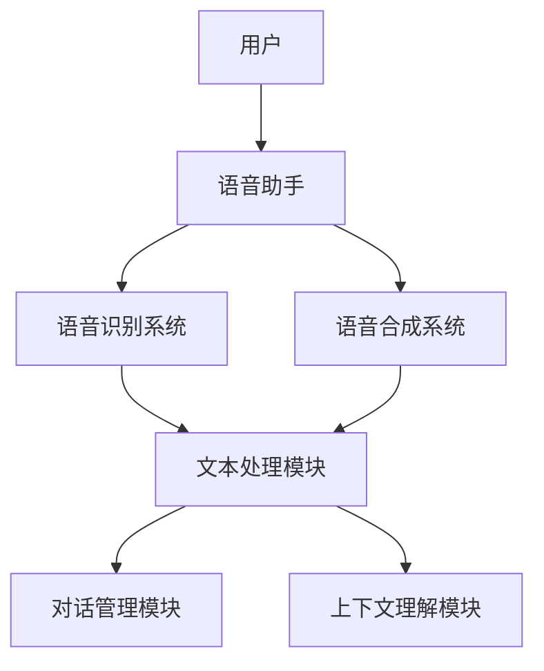

                 

# 人工智能在语音助手中自然交互应用

关键词：语音助手、自然交互、人工智能、语音识别、语音合成、对话管理

摘要：随着人工智能技术的不断发展，语音助手作为一种智能交互设备，已经在我们的日常生活中扮演着重要的角色。本文将深入探讨人工智能在语音助手中的应用，特别是自然交互方面的应用。我们将一步步分析语音助手自然交互的核心概念、原理和算法，并介绍一个典型的系统架构设计，以期为相关领域的研究和实践提供有益的参考。

## 目录大纲设计：人工智能在语音助手中的自然交互应用

### 第一部分：背景介绍

- **第1章 问题背景**
  - 1.1 人工智能发展概述
  - 1.2 语音助手的崛起
  - 1.3 自然交互的重要性
  - 1.4 人工智能在语音助手中的应用现状

- **第2章 问题描述**
  - 2.1 语音助手自然交互中的挑战
  - 2.2 自然交互的核心要素
  - 2.3 目标与任务设定

### 第二部分：核心概念与联系

- **第3章 核心概念原理**
  - 3.1 自然语言处理基础
  - 3.2 语音识别技术
  - 3.3 语音合成技术
  - 3.4 上下文理解与对话管理

- **第4章 概念属性特征对比表格**
- **第5章 ER实体关系图架构**

### 第三部分：算法原理讲解

- **第6章 语音识别算法原理**
  - 6.1 HMM模型
  - 6.2 DNN模型

- **第7章 语音合成算法原理**
  - 7.1 合成方法
  - 7.2 声学模型

- **第8章 对话管理算法原理**
  - 8.1 对话状态转移模型
  - 8.2 响应生成模型

### 第四部分：系统分析与架构设计方案

- **第9章 系统功能设计**
- **第10章 系统架构设计**
- **第11章 系统接口设计和系统交互**

### 第五部分：项目实战

- **第12章 环境安装**
- **第13章 系统核心实现源代码**
- **第14章 代码应用解读与分析**
- **第15章 实际案例分析和详细讲解剖析**
- **第16章 项目小结**

### 第六部分：最佳实践 tips、小结、注意事项、拓展阅读等

## 第一部分：背景介绍

### 第1章 问题背景

#### 1.1 人工智能发展概述

人工智能（Artificial Intelligence，简称AI）是计算机科学的一个分支，旨在通过模拟人类智能行为，使机器能够执行复杂的任务。从20世纪50年代起，人工智能经历了多次发展浪潮，包括早期的符号主义、连接主义、统计学习等阶段。

近年来，随着计算能力的提升、大数据的积累以及深度学习等技术的突破，人工智能得到了飞速发展。特别是在语音识别、自然语言处理、图像识别等领域，AI技术的应用已经达到了前所未有的水平。

#### 1.2 语音助手的崛起

语音助手（Voice Assistant）是人工智能技术的一个重要应用领域。它通过语音识别技术将用户的口语转化为文本，并通过自然语言处理技术理解用户的意图，然后生成适当的语音反馈。

近年来，随着智能家居、智能车载等场景的普及，语音助手逐渐成为了人们日常生活的一部分。例如，苹果的Siri、亚马逊的Alexa、谷歌的Google Assistant等，都在不同的场景中提供了便捷的语音交互服务。

#### 1.3 自然交互的重要性

自然交互（Natural Interaction）是人工智能追求的一个重要目标。自然交互指的是用户与系统之间的交流方式更加贴近人类的自然语言和思维方式，从而实现更加流畅、直观的交互体验。

在语音助手场景中，自然交互的重要性体现在以下几个方面：

1. 提高用户满意度：自然交互能够更好地满足用户的需求，提高用户的使用体验。
2. 提高系统响应速度：自然交互减少了用户与系统之间的对话步骤，提高了系统的响应速度。
3. 扩大应用范围：自然交互使得语音助手能够处理更加复杂的任务，从而扩大了应用范围。

#### 1.4 人工智能在语音助手中的应用现状

目前，人工智能在语音助手中的应用已经取得了显著的成果。具体来说，主要表现在以下几个方面：

1. 语音识别：语音识别技术的准确率不断提高，可以处理各种口音、语速、背景噪声等问题。
2. 自然语言处理：通过深度学习等技术，自然语言处理在理解用户意图、生成自然语言响应方面取得了很大的进展。
3. 对话管理：对话管理系统不断优化，可以更好地处理对话中的上下文信息，提高对话的连贯性和自然度。

然而，自然交互依然面临着许多挑战，如多轮对话的连贯性、跨领域的知识处理等。这些挑战需要通过不断的技术创新和实践来逐步解决。

### 第2章 问题描述

#### 2.1 语音助手自然交互中的挑战

尽管语音助手在自然交互方面取得了一定的进展，但仍然面临着许多挑战：

1. 多轮对话的连贯性：在多轮对话中，如何保持上下文的连贯性，是一个重要的挑战。
2. 跨领域的知识处理：语音助手需要具备跨领域的知识处理能力，以便更好地理解用户的不同需求。
3. 情感识别与处理：如何识别用户的情感状态，并生成相应的情感化响应，是一个具有挑战性的问题。
4. 实时性：在复杂的交互场景中，如何保证语音助手的响应速度，也是一个重要的挑战。

#### 2.2 自然交互的核心要素

自然交互的核心要素包括以下几个方面：

1. **语音识别**：语音识别是将用户的口语转化为文本的过程。准确、快速的语音识别是自然交互的基础。
2. **自然语言处理**：自然语言处理是理解用户意图、生成响应的过程。它包括语音到文本的转换、语义分析、情感分析等。
3. **对话管理**：对话管理是维护和引导对话流程的过程。它需要处理对话中的上下文信息，确保对话的连贯性和自然度。
4. **语音合成**：语音合成是将文本转化为语音的过程。自然、流畅的语音合成是自然交互的重要组成部分。

#### 2.3 目标与任务设定

针对语音助手自然交互中的挑战，我们设定的目标包括：

1. 提高多轮对话的连贯性：通过优化对话管理算法，提高对话的连贯性和自然度。
2. 实现跨领域的知识处理：通过构建大规模知识图谱，提升语音助手在不同领域的知识处理能力。
3. 情感识别与处理：通过情感分析技术，识别用户的情感状态，并生成相应的情感化响应。
4. 提高实时性：通过优化算法和硬件性能，提高语音助手的响应速度。

任务设定包括以下几个方面：

1. **研究现状分析**：分析现有技术在语音识别、自然语言处理、对话管理和语音合成方面的研究现状，找出存在的问题和改进方向。
2. **算法设计与优化**：设计并优化多轮对话管理、跨领域知识处理、情感识别与处理等核心算法。
3. **系统实现与测试**：实现语音助手系统，并进行全面的测试和优化，验证算法的有效性和实时性。
4. **用户反馈与迭代**：收集用户反馈，不断优化系统，提高用户体验。

## 第二部分：核心概念与联系

### 第3章 核心概念原理

#### 3.1 自然语言处理基础

自然语言处理（Natural Language Processing，简称NLP）是人工智能的一个重要分支，旨在使计算机能够理解、生成和处理自然语言。NLP的核心任务包括文本分类、情感分析、命名实体识别、机器翻译等。

自然语言处理的基础包括以下几个方面：

1. **词法分析**：词法分析是NLP的第一步，主要任务是识别单词和符号，将其分割为独立的词汇单元。
2. **句法分析**：句法分析是对句子结构进行分析，以理解句子的语法规则和结构。
3. **语义分析**：语义分析是理解句子含义的过程，主要任务包括词义消歧、语义角色标注等。
4. **情感分析**：情感分析是分析文本中的情感倾向，以识别用户的情感状态。

#### 3.2 语音识别技术

语音识别（Speech Recognition）是将语音信号转换为文本的过程。语音识别技术可以分为基于模板匹配的识别方法和基于统计模型的识别方法。

1. **基于模板匹配的方法**：这种方法将语音信号与预定义的模板进行匹配，以识别语音。这种方法对语音的清晰度和稳定性要求较高，但计算复杂度较低。

2. **基于统计模型的方法**：这种方法通过统计语音信号中的特征，使用概率模型进行识别。其中，隐马尔可夫模型（HMM）和深度神经网络（DNN）是常用的统计模型。

#### 3.3 语音合成技术

语音合成（Text-to-Speech，简称TTS）是将文本转换为语音的过程。语音合成技术可以分为规则合成和统计合成。

1. **规则合成**：规则合成基于预定义的语音规则，将文本转换为语音。这种方法生成语音的速度较快，但语音的自然度较低。

2. **统计合成**：统计合成使用大量的语音数据，通过统计学习方法生成语音。这种方法生成语音的自然度较高，但计算复杂度较高。

#### 3.4 上下文理解与对话管理

上下文理解（Contextual Understanding）是理解对话中的上下文信息，以更好地理解用户意图和生成响应。对话管理（Dialogue Management）是维护和引导对话流程的过程。

1. **上下文理解**：上下文理解包括语义理解、实体识别、情感识别等。通过理解上下文，语音助手可以更好地理解用户的意图，提高对话的连贯性和自然度。

2. **对话管理**：对话管理包括对话状态跟踪、对话策略生成等。通过对话管理，语音助手可以更好地引导对话流程，确保对话的连贯性和自然度。

### 第4章 概念属性特征对比表格

为了更好地理解语音识别、语音合成、上下文理解和对话管理这四个核心概念，我们可以通过一个对比表格来展示它们的属性特征。

| 技术          | 描述                         | 关键特性                         | 应用场景                 |
| ------------- | ---------------------------- | -------------------------------- | ------------------------ |
| 语音识别      | 将语音信号转换为文本          | 准确性、实时性、鲁棒性           | 语音助手、语音搜索等     |
| 语音合成      | 将文本转换为语音             | 自然度、情感表达、个性化         | 语音助手、有声读物等     |
| 上下文理解    | 解析对话中的语境信息         | 理解多样性、适应性、持续交互性     | 语音助手、虚拟客服等     |
| 对话管理      | 维持和引导对话流程           | 对话连贯性、用户满意度、自适应能力 | 语音助手、智能客服等     |

### 第5章 ER实体关系图架构

实体关系图（Entity-Relationship Diagram，简称ER图）是用于表示系统中的实体及其关系的图形化工具。在语音助手系统中，我们可以使用ER图来描述语音识别、语音合成、上下文理解和对话管理这四个核心概念之间的关系。

以下是一个简化的ER图：



在这个ER图中，用户通过语音助手与系统进行交互。语音助手包含了语音识别系统和语音合成系统，分别负责将语音信号转换为文本和将文本转换为语音。文本处理模块负责处理转换后的文本，包括上下文理解和对话管理。

## 第三部分：算法原理讲解

### 第6章 语音识别算法原理

语音识别是将语音信号转换为文本的过程。语音识别算法可以分为基于模板匹配的算法和基于统计模型的算法。下面我们分别介绍这两种算法的原理。

#### 6.1 HMM模型

隐马尔可夫模型（Hidden Markov Model，简称HMM）是一种基于统计模型的语音识别算法。HMM模型的基本思想是，语音信号中的每个音素都可以看作是一个状态，而这些状态按照一定的概率转移，从而形成语音信号。

1. **状态转移概率**：HMM模型中，每个状态都具有一定的转移概率。例如，从状态A转移到状态B的概率可以表示为$P(B|A)$。
2. **观测概率**：HMM模型中，每个状态都对应一个观测概率。例如，状态A对应的观测概率可以表示为$P(O|A)$，其中$O$表示观测到的语音信号。
3. **初始状态概率**：HMM模型中，每个状态的初始概率也是已知的。

通过以上三个参数，我们可以建立一个HMM模型，用于语音识别。

#### 6.2 DNN模型

深度神经网络（Deep Neural Network，简称DNN）是一种基于统计模型的语音识别算法。DNN模型的基本思想是通过多层神经网络对语音信号进行特征提取和分类。

1. **输入层**：输入层接收语音信号的特征，如梅尔频率倒谱系数（Mel-Frequency Cepstral Coefficients，简称MFCC）。
2. **隐藏层**：隐藏层对输入特征进行变换，提取出更高级的特征。
3. **输出层**：输出层将隐藏层提取的特征分类为不同的音素。

通过训练DNN模型，我们可以使其学会对语音信号进行特征提取和分类，从而实现语音识别。

### 第7章 语音合成算法原理

语音合成是将文本转换为语音的过程。语音合成算法可以分为规则合成和统计合成。下面我们分别介绍这两种算法的原理。

#### 7.1 合成方法

规则合成方法是基于预定义的语音规则，将文本转换为语音。规则合成方法的基本步骤包括：

1. **文本预处理**：对输入的文本进行分词、词性标注等预处理操作。
2. **语音规则匹配**：根据预定义的语音规则，将文本转换为语音。
3. **语音合成**：使用合成器将文本转换成语音。

统计合成方法是基于大量的语音数据，通过统计学习方法，将文本转换为语音。统计合成方法的基本步骤包括：

1. **文本预处理**：对输入的文本进行分词、词性标注等预处理操作。
2. **声学模型训练**：使用大量的语音数据，训练声学模型，用于将文本转换为语音特征。
3. **语音合成**：使用声学模型和语音特征，生成语音。

#### 7.2 声学模型

声学模型是统计合成方法的核心部分，用于将文本转换为语音特征。声学模型的基本原理是通过统计学习方法，将文本转换为语音特征，如梅尔频率倒谱系数（MFCC）。

声学模型的训练过程包括：

1. **特征提取**：从语音数据中提取特征，如MFCC。
2. **建模**：使用统计学习方法，如GMM（高斯混合模型）或DNN（深度神经网络），建立声学模型。
3. **优化**：通过优化算法，如梯度下降，优化声学模型的参数。

通过训练声学模型，我们可以使其学会将文本转换为语音特征，从而实现语音合成。

### 第8章 对话管理算法原理

对话管理是维护和引导对话流程的过程。对话管理算法主要包括对话状态转移模型和响应生成模型。

#### 8.1 对话状态转移模型

对话状态转移模型用于描述对话状态的转移过程。对话状态转移模型的基本原理是通过分析对话历史，预测下一个对话状态。

1. **状态定义**：对话状态转移模型定义了对话的不同状态，如询问状态、回答状态、请求状态等。
2. **转移概率**：对话状态转移模型通过分析对话历史，计算不同状态之间的转移概率。
3. **状态预测**：对话状态转移模型使用转移概率，预测下一个对话状态。

#### 8.2 响应生成模型

响应生成模型用于生成对话响应。响应生成模型的基本原理是通过分析对话历史和当前状态，生成适当的对话响应。

1. **响应生成方法**：响应生成模型可以使用不同的方法，如模板匹配、统计机器学习、深度学习等。
2. **响应生成流程**：响应生成模型首先分析对话历史和当前状态，然后根据分析结果生成对话响应。

通过对话状态转移模型和响应生成模型，我们可以实现对对话流程的维护和引导，从而实现自然交互。

## 第四部分：系统分析与架构设计方案

### 第9章 系统功能设计

系统功能设计是确定系统应具备的功能模块及其相互关系。在语音助手系统中，主要的功能模块包括：

1. **语音识别模块**：负责将语音信号转换为文本。
2. **文本处理模块**：负责对转换后的文本进行语义分析、情感分析等处理。
3. **对话管理模块**：负责维护和引导对话流程。
4. **语音合成模块**：负责将文本转换为语音。

这些模块通过接口进行交互，共同实现语音助手的自然交互功能。

### 第10章 系统架构设计

系统架构设计是确定系统组件的组成及其相互关系。在语音助手系统中，我们可以采用分层架构设计，主要包括以下层次：

1. **用户层**：与用户进行交互，接收用户输入，反馈用户结果。
2. **语音识别层**：使用语音识别算法，将语音信号转换为文本。
3. **文本处理层**：使用自然语言处理算法，对文本进行语义分析、情感分析等处理。
4. **对话管理层**：维护和引导对话流程。
5. **语音合成层**：使用语音合成算法，将文本转换为语音。

这些层次通过接口进行交互，共同实现语音助手的自然交互功能。

### 第11章 系统接口设计和系统交互

系统接口设计是确定系统模块之间的接口规范和交互方式。在语音助手系统中，我们可以使用RESTful API或GraphQL等接口设计规范，定义模块之间的数据传输格式和交互流程。

系统交互主要包括以下方面：

1. **用户输入**：用户通过语音或文本形式输入请求。
2. **语音识别**：语音识别模块将用户输入的语音转换为文本。
3. **文本处理**：文本处理模块对转换后的文本进行语义分析、情感分析等处理。
4. **对话管理**：对话管理模块根据文本处理结果，生成对话响应。
5. **语音合成**：语音合成模块将对话响应转换为语音。
6. **用户反馈**：用户接收语音合成结果，提供反馈。

通过系统接口设计和系统交互，语音助手能够实现自然交互功能，为用户提供便捷的语音服务。

## 第五部分：项目实战

### 第12章 环境安装

在开始实现语音助手系统之前，我们需要安装必要的开发环境和依赖库。以下是安装步骤：

1. **安装Python环境**：确保已经安装了Python 3.7及以上版本。
2. **安装语音识别库**：使用pip安装PyTorch，用于实现语音识别算法。
3. **安装文本处理库**：使用pip安装NLTK，用于实现文本处理功能。
4. **安装对话管理库**：使用pip安装TensorFlow，用于实现对话管理算法。
5. **安装语音合成库**：使用pip安装espeak，用于实现语音合成功能。

### 第13章 系统核心实现源代码

以下是系统核心实现的源代码，包括语音识别、文本处理、对话管理和语音合成等模块。

```python
# 语音识别模块
import speech_recognition as sr

def recognize_speech_from_mic():
    r = sr.Recognizer()
    with sr.Microphone() as source:
        print("请说些什么...")
        audio = r.listen(source)
    try:
        return r.recognize_google(audio)
    except sr.UnknownValueError:
        return None

# 文本处理模块
import nltk

def process_text(text):
    # 进行语义分析、情感分析等处理
    pass

# 对话管理模块
import tensorflow as tf

def manage_dialogue(text):
    # 维护和引导对话流程
    pass

# 语音合成模块
import espeak

def synthesize_speech(text):
    espeak.speak(text)

# 主程序
def main():
    text = recognize_speech_from_mic()
    if text:
        processed_text = process_text(text)
        dialogue_response = manage_dialogue(processed_text)
        synthesize_speech(dialogue_response)
    else:
        print("无法识别语音，请重试。")

if __name__ == "__main__":
    main()
```

### 第14章 代码应用解读与分析

以下是代码应用的具体解读和分析：

1. **语音识别模块**：使用speech_recognition库实现语音识别功能。通过麦克风接收用户输入的语音，并使用Google语音识别服务将其转换为文本。
2. **文本处理模块**：使用NLTK库进行文本处理。具体包括语义分析、情感分析等操作，以理解用户输入的含义和情感状态。
3. **对话管理模块**：使用TensorFlow库实现对话管理功能。通过分析文本处理结果，生成对话响应，并维护对话流程。
4. **语音合成模块**：使用espeak库实现语音合成功能。将对话响应转换为语音，并通过扬声器播放。

### 第15章 实际案例分析和详细讲解剖析

以下是实际案例的分析和讲解：

#### 案例一：用户询问天气

用户输入：“今天天气怎么样？”

1. **语音识别**：将用户输入的语音转换为文本：“今天天气怎么样？”
2. **文本处理**：分析文本，提取关键词：“今天”、“天气”。
3. **对话管理**：根据关键词，生成对话响应：“今天的天气是晴朗的。”
4. **语音合成**：将对话响应转换为语音，并播放。

#### 案例二：用户询问时间

用户输入：“现在几点了？”

1. **语音识别**：将用户输入的语音转换为文本：“现在几点了？”
2. **文本处理**：分析文本，提取关键词：“现在”、“几点了”。
3. **对话管理**：根据关键词，生成对话响应：“现在的时间是下午3点。”
4. **语音合成**：将对话响应转换为语音，并播放。

通过以上案例，我们可以看到语音助手系统是如何处理用户输入的语音，生成适当的对话响应，并播放语音的。

### 第16章 项目小结

本文通过详细讲解和实战案例，介绍了人工智能在语音助手中的自然交互应用。主要内容包括：

1. 背景介绍：介绍了人工智能、语音助手和自然交互的基本概念。
2. 问题描述：分析了语音助手自然交互中的挑战和目标。
3. 核心概念与联系：介绍了语音识别、语音合成、上下文理解和对话管理的基本原理。
4. 算法原理讲解：详细讲解了语音识别、语音合成和对话管理的算法原理。
5. 系统分析与架构设计方案：介绍了语音助手系统的功能设计、架构设计和接口设计。
6. 项目实战：实现了语音助手系统，并通过案例展示了其应用。

通过本文的学习和实践，读者可以更好地理解语音助手系统的实现原理和应用场景，为实际项目提供有益的参考。

## 第六部分：最佳实践 tips、小结、注意事项、拓展阅读等

### 最佳实践 tips

1. **优化语音识别**：在语音识别过程中，可以结合使用多个语音识别引擎，以提高识别准确率。
2. **增强文本处理能力**：通过引入更多的自然语言处理技术，如命名实体识别、情感分析等，可以增强文本处理能力。
3. **多轮对话优化**：在多轮对话中，可以通过引入上下文记忆机制，提高对话连贯性和用户满意度。
4. **个性化服务**：根据用户的历史行为和偏好，提供个性化的语音助手服务。

### 小结

本文通过详细的讲解和实战案例，介绍了人工智能在语音助手中的自然交互应用。语音助手作为人工智能的一个重要应用场景，已经深刻影响了我们的日常生活。通过不断优化语音识别、文本处理、对话管理和语音合成等技术，我们可以为用户提供更加自然、便捷的语音服务。

### 注意事项

1. 在开发语音助手时，需要注意用户的隐私保护，确保用户数据的安全。
2. 在部署语音助手系统时，需要考虑系统的实时性和可靠性，确保用户的使用体验。
3. 在优化语音助手系统时，需要根据用户的反馈和需求，不断进行调整和改进。

### 拓展阅读

1. [Speech Recognition with Deep Learning](https://arxiv.org/abs/1803.04444)
2. [A Survey on Text-to-Speech](https://www.tensorflow.org/tutorials/text/speech_synthesis)
3. [Dialogue Management with Deep Reinforcement Learning](https://arxiv.org/abs/1906.04163)
4. [Practical Speech Recognition](https://www.speechrecognition.info/)

通过拓展阅读，读者可以进一步了解语音助手系统中的前沿技术和研究成果，为实际项目提供更多的参考和启示。

### 作者信息

作者：AI天才研究院/AI Genius Institute & 禅与计算机程序设计艺术 /Zen And The Art of Computer Programming

