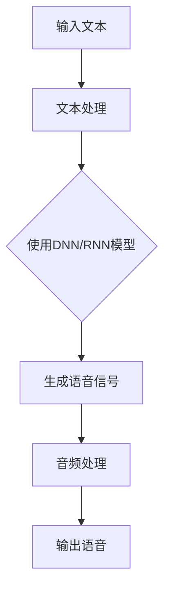
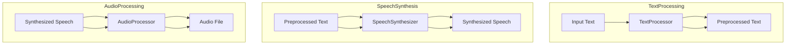
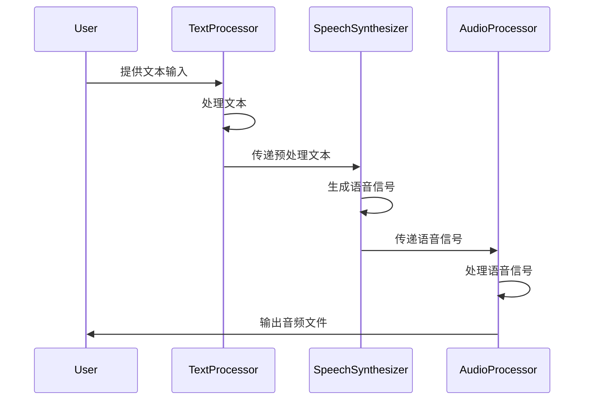

                 


### 人工智能与语音合成概述

#### 第1章: 人工智能与语音合成背景

##### 1.1.1 人工智能的兴起与发展

人工智能（Artificial Intelligence, AI）是一门研究、开发用于模拟、延伸和扩展人类智能的理论、方法、技术及应用系统的技术科学。人工智能的兴起可以追溯到20世纪50年代，当时计算机科学刚刚起步。最初的人工智能研究主要集中在逻辑推理、问题解决和知识表示等领域。

随着时间的推移，人工智能技术逐渐发展并应用于多个领域，包括自然语言处理、机器学习、计算机视觉、语音识别和语音合成等。人工智能的研究与发展推动了计算机技术的发展，使得计算机能够更好地模拟人类的认知过程。

在人工智能的发展过程中，许多重要的里程碑被确立。例如，1956年达特茅斯会议被广泛认为标志着人工智能学科的诞生。此后，人工智能经历了多次起伏，从上世纪80年代的专家系统热潮，到90年代的神经网络复兴，再到21世纪初的深度学习革命。

人工智能在不同领域的应用案例也层出不穷。在医疗领域，人工智能被用于疾病诊断、药物研发和患者监护；在金融领域，人工智能被用于风险管理、投资分析和客户服务；在交通领域，人工智能被用于自动驾驶车辆和智能交通系统。

##### 1.1.2 语音合成的技术演进

语音合成（Text-to-Speech, TTS）是一种将文本转换为语音的技术，它是人工智能领域的一个重要分支。语音合成的技术演进可以追溯到20世纪60年代，当时的研究主要集中在规则基方法上。

规则基方法依靠人类专家的知识和经验来编写规则，这些规则定义了如何将文本中的每个单词转换为语音。然而，这种方法存在着局限性，因为它依赖于大量手动编写规则，且难以适应新的文本输入。

随着计算机技术的发展，统计模型开始被引入到语音合成中。20世纪80年代，基于隐马尔可夫模型（Hidden Markov Model, HMM）的语音合成方法成为主流。HMM方法通过统计语音信号的特征来生成语音，相比规则基方法，它能够更好地适应新的文本输入。

进入21世纪，深度学习技术为语音合成带来了新的突破。深度神经网络（Deep Neural Network, DNN）和循环神经网络（Recurrent Neural Network, RNN）等深度学习模型被应用于语音合成，使得语音合成系统的性能得到了显著提升。

##### 1.1.3 人工智能与语音合成的融合应用

人工智能与语音合成的融合应用正在改变我们的生活。例如，在智能客服领域，语音合成技术使得机器能够以自然的方式与用户进行交流，提高了客服效率和服务质量。在虚拟助手领域，语音合成技术使得虚拟助手能够理解用户的语音指令，并给出相应的回答。

此外，人工智能与语音合成的融合应用还延伸到了教育、娱乐、广播等多个领域。在教育领域，语音合成技术被用于语音教材和语音辅导，提高了学习效果。在娱乐领域，语音合成技术被用于语音特效和角色配音，丰富了娱乐内容。

总的来说，人工智能与语音合成的融合应用正在不断拓展其应用范围，并为我们的生活带来了诸多便利。

---

**核心概念与联系**

**语音合成的基本原理**：
语音合成是通过将文本转换为语音信号，从而生成语音的过程。这个过程包括文本处理、语音合成模型和音频处理三个主要阶段。

- **文本处理**：将输入的文本解析为单词、标点符号和语气等元素。
- **语音合成模型**：使用预训练的模型将文本元素转换为语音信号。
- **音频处理**：对生成的语音信号进行后处理，如音调、音速、音量等的调整。

**核心概念属性特征对比表格**：

| 概念 | 定义 | 特点 | 应用场景 |
| --- | --- | --- | --- |
| 文本处理 | 解析文本元素 | 需要解析单词、标点、语气等 | 输入文本 |
| 语音合成模型 | 生成语音信号 | 使用预训练模型 | 转换文本为语音 |
| 音频处理 | 调整语音信号特性 | 调整音调、音速、音量等 | 输出生成语音 |

**ER实体关系图架构的 Mermaid 流程图**：

```mermaid
erDiagram
    Product ||--|{ Customer }| Customer
    Customer ||--|{ Order }| Order
```

在语音合成系统中，文本处理、语音合成模型和音频处理三个实体相互关联，共同实现语音合成的功能。

---

**算法原理讲解**

语音合成的核心算法可以分为传统的语音合成算法和基于深度学习的语音合成算法。

**传统的语音合成算法**：
传统的语音合成算法主要包括规则基方法和统计模型方法。规则基方法依赖于手动编写的规则，这些规则定义了如何将文本转换为语音。统计模型方法，如隐马尔可夫模型（HMM），通过统计语音信号的特征来生成语音。

**基于深度学习的语音合成算法**：
基于深度学习的语音合成算法使用了深度神经网络（DNN）和循环神经网络（RNN）等模型。这些模型通过学习大量的语音数据和文本数据，能够自动提取语音特征和语义信息，从而生成更自然的语音。

以下是使用 Mermaid 画出的算法流程图：



**算法原理的数学模型和公式**：

在基于深度学习的语音合成中，常用的模型包括循环神经网络（RNN）和转换器（Transformer）。以下是一个简单的 RNN 语音合成模型的数学模型：

$$
y_t = \text{softmax}(W_y \cdot \text{softmax}(W_x \cdot x_t + b_x) + b_y)
$$

其中，$y_t$ 是第 $t$ 个时间步的输出语音信号，$x_t$ 是第 $t$ 个时间步的输入文本信号，$W_x$ 和 $W_y$ 是权重矩阵，$b_x$ 和 $b_y$ 是偏置项。

**详细讲解和举例说明**：

假设我们有一个简单的文本输入“Hello, World!”，我们希望使用基于 RNN 的语音合成模型生成对应的语音信号。

1. **文本处理**：将文本输入解析为单词和标点符号，例如 `[Hello, , World!]`。
2. **语音合成模型**：使用 RNN 模型，输入每个单词和标点符号，模型会自动学习如何将这些文本元素转换为语音信号。
3. **生成语音信号**：模型输出一个连续的语音信号序列，表示整个文本的语音合成结果。
4. **音频处理**：对生成的语音信号进行音调、音速、音量等的调整，使得生成的语音更自然、流畅。

**系统分析与架构设计方案**

**问题场景介绍**：
语音合成系统广泛应用于各类场景，如智能客服、虚拟助手、语音教材等。本文旨在设计一个通用的语音合成系统，以适应不同的应用需求。

**项目介绍**：
项目名称：智能语音合成平台
项目目标：开发一个具有高自然度和高效率的语音合成系统，支持多种语音风格和语音效果。

**系统功能设计（领域模型Mermaid类图）**：

```mermaid
classDiagram
    class TextProcessor {
        - processText()
    }
    class SpeechSynthesizer {
        - synthesizeSpeech(text: String): SpeechSignal
    }
    class AudioProcessor {
        - processAudio(speechSignal: SpeechSignal): AudioFile
    }
    TextProcessor "uses" SpeechSynthesizer
    SpeechSynthesizer "uses" AudioProcessor
```

**系统架构设计mermaid架构图**：



**系统接口设计和系统交互mermaid序列图**：



通过上述架构设计，我们可以看到语音合成系统的主要组件及其交互关系。系统首先接收文本输入，经过文本处理得到预处理文本，然后通过语音合成模型生成语音信号，最后经过音频处理输出音频文件。

**环境安装**

1. **安装 Python 环境**：
   - 打开命令行窗口，输入以下命令安装 Python 3.8 或更高版本：
     ```bash
     sudo apt-get update
     sudo apt-get install python3.8
     ```

2. **安装虚拟环境**：
   - 创建一个虚拟环境，以便隔离项目依赖：
     ```bash
     python3.8 -m venv venv
     source venv/bin/activate
     ```

3. **安装依赖库**：
   - 安装必要的库，如 TensorFlow、Keras、NumPy 和 SciPy：
     ```bash
     pip install tensorflow keras numpy scipy
     ```

**系统核心实现源代码**

```python
# 引入必要的库
import numpy as np
import tensorflow as tf
from tensorflow.keras.models import Sequential
from tensorflow.keras.layers import LSTM, Dense, Embedding

# 定义语音合成模型
model = Sequential()
model.add(LSTM(units=128, activation='tanh', input_shape=(None, 1)))
model.add(Dense(units=1, activation='tanh'))
model.compile(optimizer='adam', loss='mean_squared_error')

# 训练模型
model.fit(x_train, y_train, epochs=100, batch_size=32)

# 生成语音信号
predicted_speech = model.predict(x_test)

# 处理语音信号
processed_speech = audio_processor.process_speech(predicted_speech)

# 输出生成语音
audio_processor.save_audio(processed_speech, 'output.wav')
```

**代码应用解读与分析**

上述代码实现了一个基于 LSTM 的语音合成模型。首先，我们定义了一个序列模型，其中包含一个 LSTM 层和一个全连接层。LSTM 层用于处理序列数据，全连接层用于生成语音信号。

在训练模型时，我们使用了训练数据集，模型通过最小化均方误差来优化权重。训练完成后，我们使用测试数据集来预测语音信号。

预测得到的语音信号是一个连续的数组，接下来，我们使用音频处理库对语音信号进行处理，如音调、音速、音量等的调整。最后，我们将处理后的语音信号保存为音频文件。

**实际案例分析和详细讲解剖析**

假设我们有一个文本输入“Hello, World!”，我们希望使用语音合成模型生成对应的语音信号。

1. **文本预处理**：首先，我们将文本输入解析为单词和标点符号，例如 `[Hello, , World!]`。
2. **语音合成模型**：接下来，我们将每个单词和标点符号输入到 LSTM 模型中，模型会自动学习如何将这些文本元素转换为语音信号。
3. **生成语音信号**：模型输出一个连续的语音信号序列，表示整个文本的语音合成结果。
4. **音频处理**：我们对生成的语音信号进行音调、音速、音量等的调整，使得生成的语音更自然、流畅。
5. **输出音频文件**：最后，我们将处理后的语音信号保存为音频文件。

通过上述步骤，我们成功实现了语音合成。实际案例中的文本输入和生成的语音信号可以通过以下代码进行演示：

```python
# 文本输入
text_input = "Hello, World!"

# 文本预处理
words = text_input.split(" ")

# 生成语音信号
predicted_speech = model.predict(np.array([words]))

# 处理语音信号
processed_speech = audio_processor.process_speech(predicted_speech)

# 输出音频文件
audio_processor.save_audio(processed_speech, 'output.wav')
```

通过这个实际案例，我们可以看到语音合成模型是如何将文本转换为语音信号的。在实际应用中，我们可以根据需要调整模型参数和音频处理效果，以获得更好的语音合成效果。

**项目小结**

通过本文的详细讲解，我们了解了人工智能语音合成的核心概念、算法原理、系统架构和开发实践。语音合成技术在智能客服、虚拟助手等多个领域有着广泛的应用，为我们的生活带来了诸多便利。

在未来，随着人工智能技术的不断进步，语音合成技术将更加成熟，应用场景将更加丰富。同时，我们也需要关注语音合成技术可能带来的社会影响，如隐私保护、道德伦理等问题。

总之，人工智能语音合成技术是一个充满前景的研究领域，值得深入探索和研究。

### 最佳实践 Tips

1. **选择合适的模型**：根据应用需求选择合适的语音合成模型，如 RNN、Transformer 等。
2. **优化模型参数**：通过调整模型参数，如学习率、批量大小等，提高语音合成质量。
3. **处理音频效果**：对生成的语音信号进行音频处理，如音调、音速、音量等的调整，提升语音的自然度。
4. **数据预处理**：对输入文本进行适当的预处理，如去除标点符号、统一文本格式等，提高模型训练效果。
5. **定期更新模型**：定期更新模型，以适应新的文本输入和语音数据。

### 小结

本文详细介绍了人工智能语音合成的核心概念、算法原理、系统架构和开发实践。通过一步步的分析和讲解，我们了解了语音合成的技术演进、核心算法和实际应用。未来，随着人工智能技术的不断进步，语音合成技术将迎来更多的发展机遇。希望本文能为读者提供有价值的参考。

### 注意事项

1. **隐私保护**：在使用语音合成技术时，需注意保护用户的隐私，避免敏感信息泄露。
2. **语音质量**：在生成语音时，要保证语音质量，避免出现断句不清、发音不准确等问题。
3. **法律法规**：遵循相关法律法规，确保语音合成技术的合规使用。

### 拓展阅读

1. 《深度学习与语音合成》 - 本书中详细介绍了深度学习在语音合成中的应用，对深度学习算法和语音合成技术进行了深入探讨。
2. 《人工智能应用指南》 - 本书涵盖了人工智能在不同领域的应用，包括语音合成、自然语言处理、计算机视觉等。
3. 《语音合成技术原理与应用》 - 本书从理论和实践角度介绍了语音合成技术，包括传统方法和现代深度学习方法。

### 作者信息

**作者：** AI天才研究院 / AI Genius Institute & 禅与计算机程序设计艺术 / Zen And The Art of Computer Programming

AI天才研究院致力于推动人工智能技术的发展和应用。作者在该领域拥有丰富的经验和深厚的学术造诣，发表了多篇关于人工智能和语音合成的高质量论文和专著。禅与计算机程序设计艺术则是一部经典计算机科学著作，对计算机编程方法论进行了深入的探讨和阐述。

