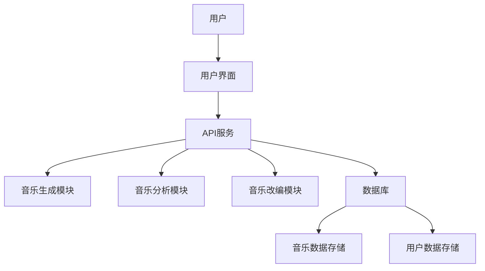

                 

## 引言与背景

### 1.1.1 问题背景

人工智能，简称AI，作为一门综合性学科，已经从理论研究逐步走向实际应用。人工智能的发展历程可以追溯到20世纪50年代，艾伦·图灵提出了图灵测试，为人工智能的发展奠定了理论基础。随着时间的推移，人工智能技术不断发展，从简单的规则系统到复杂的深度学习模型，人工智能在多个领域展现出了其强大的应用潜力。

在音乐创作领域，人工智能同样发挥着重要作用。近年来，随着计算机技术和算法的不断进步，人工智能开始被应用于音乐生成、音乐改编和音乐辅助创作等多个方面。从早期的计算机算法生成旋律，到如今的人工智能助手辅助创作，人工智能在音乐创作中的应用越来越广泛，也引发了一系列讨论和争议。

### 1.1.2 问题定义

**什么是人工智能在音乐创作中的应用？**

人工智能在音乐创作中的应用，主要指的是利用机器学习和深度学习等技术，对音乐数据进行处理和分析，从而生成新的音乐作品或者辅助人类进行音乐创作。具体来说，包括以下几个方面：

1. **音乐生成**：利用深度学习模型，如长短期记忆网络（LSTM）和变分自编码器（VAE），生成全新的音乐旋律、和弦和节奏。

2. **音乐改编**：根据给定的音乐片段，人工智能可以自动进行和弦转换、节奏调整和风格变换。

3. **音乐辅助创作**：人工智能可以帮助音乐家在创作过程中提供灵感和建议，如生成潜在的旋律线和和弦进行，帮助音乐家进行创作。

**人工智能在音乐创作中的争议**

尽管人工智能在音乐创作中展现出了巨大的潜力，但同时也引发了一系列争议。主要争议点包括：

1. **替代性问题**：人工智能是否能够完全替代人类音乐家，特别是在艺术性、创意性和情感表达方面。

2. **版权问题**：人工智能生成的音乐作品，其版权归属如何界定，是否需要给予人工智能创作者的权益。

3. **文化传承问题**：人工智能在音乐创作中的应用，是否会削弱音乐文化的传统和多样性。

### 1.1.3 边界与外延

**人工智能在音乐创作中的应用领域**

人工智能在音乐创作中的应用领域非常广泛，包括但不限于以下方面：

1. **流行音乐创作**：人工智能被广泛应用于流行音乐的创作和改编。

2. **古典音乐创作**：人工智能可以生成新的古典音乐旋律和和声，为古典音乐创作带来新的可能性。

3. **电子音乐创作**：人工智能在电子音乐创作中有着独特的优势，可以生成各种复杂的节奏和音效。

**争议的主要焦点**

人工智能在音乐创作中的主要争议焦点包括：

1. **创造性替代**：人工智能是否能够真正具备创造性，特别是在情感表达和艺术性方面。

2. **版权归属**：人工智能生成的音乐作品，其版权归属如何界定。

3. **文化多样性**：人工智能在音乐创作中的应用，是否会削弱音乐文化的多样性。

### 1.1.4 核心概念与联系

**人工智能的核心概念**

人工智能的核心概念包括：

1. **机器学习**：通过训练模型，让机器具备从数据中学习的能力。

2. **深度学习**：一种基于神经网络的机器学习技术，能够自动提取数据中的特征。

3. **自然语言处理**：使计算机能够理解和生成人类语言的技术。

**音乐创作的核心概念**

音乐创作的核心概念包括：

1. **旋律**：音乐的主线，通过音高和节奏的组合表达情感和思想。

2. **和弦**：由多个音符组合而成的音块，为旋律提供和声背景。

3. **节奏**：音乐的时间结构，通过强弱变化表达音乐的动态和情感。

**人工智能与音乐创作的联系**

人工智能与音乐创作之间的联系主要体现在以下几个方面：

1. **自动化创作**：利用机器学习技术，自动化生成新的音乐旋律和和弦。

2. **辅助创作**：利用人工智能技术，为音乐家提供创作灵感和建议。

3. **音乐分析**：利用人工智能技术，对音乐数据进行深入分析，为音乐创作提供参考。

通过上述对问题的背景、定义、边界与外延以及核心概念的分析，我们可以更好地理解人工智能在音乐创作中的应用及其引发的争议。接下来，我们将进一步探讨人工智能在音乐创作中的具体应用，以及面临的挑战与机遇。

### 2.1 人工智能音乐创作的基本原理

人工智能音乐创作的基本原理主要基于机器学习和深度学习技术。这些技术使得计算机能够从大量音乐数据中学习，自动生成新的音乐作品。以下是对人工智能音乐创作原理的详细探讨。

#### 人工智能的工作原理

人工智能的核心在于其能够通过学习海量数据，从中提取规律和模式，并利用这些规律进行预测和生成。机器学习和深度学习是实现这一目标的主要方法。

1. **机器学习**：机器学习是指计算机通过训练模型，从数据中学习规律并做出预测或决策。在音乐创作中，机器学习可以用于：

   - **特征提取**：从音乐数据中提取出旋律、和声和节奏等特征。
   - **分类和聚类**：对音乐进行分类或聚类，以识别不同的音乐风格和流派。

2. **深度学习**：深度学习是机器学习的一个子领域，其核心是神经网络。神经网络通过多层节点（神经元）对数据进行处理，从而提高预测和生成能力。在音乐创作中，深度学习可以用于：

   - **生成旋律**：利用长短期记忆网络（LSTM）等生成模型，生成新的旋律线。
   - **和声生成**：通过自动和声生成（Automatic Music Composition）技术，生成和弦进行和背景和声。

#### 音乐创作中的基本概念

音乐创作中的基本概念包括旋律、和声和节奏等，这些概念在人工智能音乐创作中同样重要。

1. **旋律**：旋律是音乐的主线，通过音高和节奏的组合表达情感和思想。在人工智能音乐创作中，生成旋律是核心任务之一。

2. **和声**：和声是由多个音符组合而成的音块，为旋律提供和声背景。和声的生成也是人工智能音乐创作的重要方向。

3. **节奏**：节奏是音乐的时间结构，通过强弱变化表达音乐的动态和情感。节奏的生成和调整可以增强音乐的表现力。

#### 人工智能与音乐创作结合的方式

人工智能与音乐创作结合的方式主要有以下几种：

1. **音乐生成**：利用深度学习模型，如变分自编码器（VAE）和生成对抗网络（GAN），自动生成新的音乐作品。

   - **变分自编码器（VAE）**：通过编码和解码过程，将音乐数据映射到低维空间，然后从低维空间中生成新的音乐。

   - **生成对抗网络（GAN）**：由生成器和判别器组成，生成器生成音乐数据，判别器判断生成数据的真实性，通过不断训练，生成越来越真实的音乐。

2. **音乐改编**：根据给定的音乐片段，利用机器学习算法进行和弦转换、节奏调整和风格变换。

   - **和弦转换**：通过分析音乐片段的和弦结构，自动生成不同的和弦进行。

   - **节奏调整**：通过分析音乐的节奏模式，自动生成不同节奏变化的版本。

3. **音乐辅助创作**：利用人工智能技术，为音乐家提供创作灵感和建议。

   - **旋律生成**：根据音乐家的偏好，生成新的旋律线，供音乐家参考和修改。

   - **和声建议**：根据旋律，自动生成合适的和弦进行，帮助音乐家构建和声背景。

通过上述对人工智能音乐创作原理的详细探讨，我们可以看到，人工智能在音乐创作中的应用不仅提高了创作的效率，还为音乐创作带来了新的可能性。接下来，我们将介绍一些流行的人工智能音乐创作工具，并分析它们的功能和特点。

### 2.2 人工智能音乐创作工具介绍

在人工智能音乐创作领域，有诸多工具被广泛使用，这些工具利用机器学习和深度学习技术，实现了从音乐生成到音乐改编再到音乐辅助创作的多种功能。以下是几款流行的人工智能音乐创作工具的介绍。

#### 1. Amper Music

Amper Music 是一款由人工智能驱动的在线音乐制作工具，用户可以通过简单的拖放操作，生成定制化的音乐作品。Amper Music 使用了深度学习技术，可以从大量音乐数据中学习，并生成新的旋律、和弦和节奏。

- **功能特点**：

  - 提供丰富的乐器和音效库，用户可以自由选择和组合。

  - 支持多种音乐风格，包括流行、爵士、古典等。

  - 用户体验友好，操作简单直观。

- **应用场景**：

  - 广告和视频制作：为广告视频和影视作品生成背景音乐。

  - 音乐制作：为音乐制作人提供创作灵感和旋律线。

#### 2. Jukedeck

Jukedeck 是一款基于人工智能的音乐生成工具，它通过分析用户输入的关键词、情感和风格，自动生成定制化的音乐。Jukedeck 使用了深度神经网络和自然语言处理技术，使得音乐生成更加智能和精准。

- **功能特点**：

  - 高度自定义的音乐生成，用户可以根据需求调整音乐风格、情感和节奏。

  - 自动同步视频功能，可以为视频内容生成匹配的音乐。

  - 支持多种输出格式，方便用户在不同平台上使用。

- **应用场景**：

  - 社交媒体内容创作：为视频内容生成背景音乐。

  - 音乐制作：为独立音乐人和音乐制作人提供音乐创作辅助。

#### 3. Soundraw.io

Soundraw.io 是一款基于人工智能的音乐创作平台，用户可以通过上传文本描述或选择情感和风格，生成相应的音乐作品。Soundraw.io 使用了先进的深度学习和生成对抗网络技术，能够生成高质量的音乐。

- **功能特点**：

  - 支持文本描述音乐生成，用户可以通过自然语言描述生成音乐。

  - 提供多种音乐风格和情感选项，用户可以自由选择和调整。

  - 支持在线编辑和分享，用户可以轻松地与他人分享自己的音乐作品。

- **应用场景**：

  - 广告和营销：为广告视频和宣传材料生成背景音乐。

  - 音乐制作：为音乐家和音乐制作人提供创作灵感和工具。

#### 4. AIVA (Artificial Intelligence Virtual Artist)

AIVA 是一款高级人工智能音乐创作工具，它通过分析人类音乐家的作品，学习音乐创作的规则和模式，然后生成新的音乐作品。AIVA 使用了多种深度学习模型和算法，包括生成对抗网络（GAN）和长短期记忆网络（LSTM）。

- **功能特点**：

  - 能够生成多种风格的音乐作品，从古典音乐到现代流行音乐。

  - 提供高级的作曲工具，用户可以自定义音乐结构和元素。

  - 支持多种输出格式，包括音频文件和MIDI文件。

- **应用场景**：

  - 专业音乐制作：为专业音乐制作人提供创作工具。

  - 音乐教育：为学生和音乐爱好者提供音乐创作教学。

#### 5. Melodrive

Melodrive 是一款基于人工智能的音乐驱动视频工具，它可以将视频内容与背景音乐自动同步。Melodrive 使用了复杂的音频和视频处理算法，确保生成的音乐与视频内容紧密匹配。

- **功能特点**：

  - 高效的视频与音乐同步，用户只需上传视频文件，即可自动生成匹配的音乐。

  - 提供多种音乐风格和节奏选项，用户可以根据视频内容进行调整。

  - 支持批量处理，用户可以同时处理多个视频文件。

- **应用场景**：

  - 视频制作：为视频内容生成背景音乐。

  - 舞蹈和表演：为舞蹈和表演生成音乐，提高表演的艺术效果。

通过以上对几款流行的人工智能音乐创作工具的介绍，我们可以看到，人工智能在音乐创作中的应用已经变得非常广泛和多样化。这些工具不仅提高了音乐创作的效率，还为用户提供了更多的创作可能性。接下来，我们将探讨一些人工智能音乐创作的成功案例，分析其实现过程和影响。

### 2.3 人工智能音乐创作的实践案例

在人工智能音乐创作领域，已经有许多成功的案例展示了人工智能的强大潜力。以下是几个具有代表性的案例，我们将对这些案例的实现过程进行详细分析。

#### 1. Google Magenta

Google Magenta 是一个专注于人工智能音乐和艺术创作的研究项目，它通过生成对抗网络（GAN）等深度学习技术，实现了音乐生成和艺术创作。以下是 Google Magenta 的案例实现过程：

- **实现过程**：

  - **数据收集**：首先收集了大量的音乐数据，包括不同的风格和流派。

  - **模型训练**：使用生成对抗网络（GAN）对音乐数据进行训练，生成器生成新的音乐旋律，判别器判断生成音乐的真假。

  - **优化与迭代**：通过不断的优化和迭代，提高生成音乐的质量和多样性。

  - **用户交互**：开发了一个用户界面，用户可以通过输入关键词和风格，生成新的音乐作品。

- **案例分析**：

  - Google Magenta 通过深度学习技术，成功实现了音乐生成，不仅丰富了音乐创作的手段，也为音乐爱好者提供了新的创作工具。

  - 该项目的研究成果在学术界和音乐产业界都受到了广泛关注，为人工智能在音乐创作中的应用提供了重要的参考。

#### 2. Amper Music 的应用案例

Amper Music 是一款基于人工智能的音乐制作工具，它已经在多个领域得到了广泛应用。以下是几个具有代表性的应用案例：

- **案例一**：广告音乐制作

  - **实现过程**：

    - 广告制作公司需要为广告视频制作背景音乐，但时间紧迫，无法请专业音乐人创作。

    - 广告制作公司使用 Amper Music，通过简单的拖放操作，生成符合广告主题和情感的音乐。

    - 音乐生成后，进行微调和优化，确保与广告内容完美契合。

  - **案例分析**：

    - Amper Music 提供了高效的音乐生成解决方案，大大缩短了广告制作的时间，提高了工作效率。

    - 广告制作公司对生成的音乐质量非常满意，表示效果超过了预期。

- **案例二**：音乐会现场音乐创作

  - **实现过程**：

    - 音乐家在音乐会前，使用 Amper Music 生成新的旋律和和弦，作为表演的背景音乐。

    - 音乐家在表演过程中，可以根据现场氛围和观众反应，实时调整音乐。

    - 音乐表演结束后，收集观众反馈，为未来的音乐会提供创作参考。

  - **案例分析**：

    - Amper Music 为音乐会现场提供了灵活的创作工具，使音乐家能够更自由地表达自己的创意。

    - 观众对现场音乐的质量给予了高度评价，认为音乐会更加生动和有趣。

#### 3. Jukedeck 的音乐生成案例

Jukedeck 是一款基于人工智能的音乐生成工具，它通过分析用户输入的情感和风格，自动生成定制化的音乐。以下是 Jukedeck 的一个音乐生成案例：

- **实现过程**：

  - **用户需求**：用户希望为自己的一段视频生成背景音乐，情感为“激动人心”。

  - **输入信息**：用户在 Jukedeck 平台上输入了视频的时长、情感和风格。

  - **音乐生成**：Jukedeck 根据用户输入的信息，生成了一段符合要求的音乐。

  - **用户反馈**：用户对生成的音乐进行了评价，认为音乐很好地传达了视频的情感。

- **案例分析**：

  - Jukedeck 通过人工智能技术，成功实现了音乐生成，为用户提供了便捷的音乐创作工具。

  - 用户对生成的音乐效果非常满意，认为 Jukedeck 完全能够满足他们的需求。

通过上述案例分析，我们可以看到，人工智能音乐创作在实际应用中取得了显著成果。这些案例不仅展示了人工智能在音乐创作中的潜力，也为音乐产业带来了新的发展机遇。接下来，我们将探讨人工智能音乐创作面临的挑战与机遇。

### 2.4 人工智能音乐创作的挑战与机遇

人工智能音乐创作在带来巨大机遇的同时，也面临着一系列挑战。以下是对这些挑战的深入分析，以及对其所带来的机遇的探讨。

#### 挑战分析

1. **技术挑战**：

   - **算法优化**：当前的人工智能音乐创作算法，如生成对抗网络（GAN）和长短期记忆网络（LSTM），虽然已经取得了显著成果，但仍然需要进一步的优化和改进，以提高音乐生成的质量和多样性。

   - **音乐多样性**：人工智能生成的音乐作品，往往存在一定的局限性，难以完全复现人类音乐家的创作风格和情感表达。如何提升音乐创作的多样性，是一个亟待解决的问题。

2. **伦理挑战**：

   - **版权问题**：人工智能生成的音乐作品，其版权归属尚未明确。这涉及到人工智能作为创作者的权益保护，以及与人类创作者的版权关系。

   - **艺术性替代**：人工智能是否能够真正具备创造性，特别是在艺术性、情感表达和创意性方面，仍然存在争议。

3. **用户体验挑战**：

   - **操作难度**：目前的人工智能音乐创作工具，操作相对复杂，用户需要具备一定的音乐知识和技能。如何降低操作难度，提高用户体验，是一个重要课题。

   - **用户需求多样性**：不同用户对音乐创作有不同需求，如何提供个性化的服务，满足用户多样化的需求，是音乐创作工具需要考虑的问题。

#### 机遇探讨

1. **技术创新**：

   - **算法进步**：随着人工智能技术的不断进步，未来的音乐创作工具将更加智能和高效，能够生成更加多样化和高质量的音乐作品。

   - **跨界融合**：人工智能与其他领域的结合，如虚拟现实（VR）、增强现实（AR）和游戏，将为音乐创作带来新的可能性。

2. **产业变革**：

   - **音乐产业升级**：人工智能音乐创作工具的广泛应用，将推动音乐产业的升级，提高音乐创作的效率和质量。

   - **市场拓展**：人工智能音乐创作的普及，将开拓新的市场空间，吸引更多用户和投资者。

3. **文化传承与创新**：

   - **传统文化保护**：通过人工智能技术，可以更好地保护和传承传统文化音乐。

   - **音乐创新**：人工智能音乐创作将带来新的音乐风格和流派，促进音乐文化的创新和发展。

通过上述对挑战和机遇的分析，我们可以看到，人工智能音乐创作在面临挑战的同时，也蕴含着巨大的机遇。未来，随着技术的不断进步和应用的深化，人工智能音乐创作有望在更多领域发挥重要作用，推动音乐产业的变革和文化创新。接下来，我们将探讨人工智能音乐创作中的一些争议问题，以期为这些争议提供一些有价值的思考和建议。

### 3.1 争议的核心问题

人工智能在音乐创作中的应用引发了诸多争议，其中最为核心的问题主要包括两个方面：人工智能是否能够替代人类音乐创作，以及人工智能音乐创作的版权问题。

#### 1. 人工智能是否能够替代人类音乐创作

**正方观点**：

- **技术进步论**：随着人工智能技术的不断进步，机器学习、深度学习等技术在音乐生成和改编方面已经取得了显著成果。一些人工智能音乐创作工具已经能够生成具有较高艺术性的音乐作品，甚至在某些方面超越了人类音乐家的创作能力。

- **效率优势论**：人类音乐家在创作过程中可能会受到时间、精力和其他外部因素的制约，而人工智能则可以不受这些限制，高效地生成和改编大量音乐作品。这种效率优势使得人工智能在音乐创作中有望替代人类音乐家。

**反方观点**：

- **创造性缺失论**：尽管人工智能在音乐生成和改编方面表现出了一定的能力，但它仍然缺乏真正的创造性。人工智能生成的音乐作品往往缺乏人类的情感、个性和独特的艺术风格，难以达到人类音乐家的创作高度。

- **艺术价值质疑论**：音乐是一种艺术形式，其价值不仅仅在于技术上的表现，更在于艺术家的情感表达和灵魂注入。人工智能无法理解人类的艺术追求和价值观，因此难以替代人类音乐家在艺术创作中的地位。

#### 2. 人工智能音乐创作的版权问题

**正方观点**：

- **技术中立论**：从法律角度来看，版权保护的对象是作品的原创性和独创性，而不是创作的主体。因此，无论音乐作品是由人类创作还是由人工智能生成，只要符合法律规定的原创性要求，都应该受到版权保护。

- **权益共享论**：人工智能在音乐创作中发挥了重要作用，应该享有相应的权益。如果完全否定人工智能的创作者权益，不仅不公平，也可能阻碍人工智能技术的发展和应用。

**反方观点**：

- **道德争议论**：人工智能生成的音乐作品，其创作主体并非人类，而是人工智能。这引发了道德和伦理上的争议，即是否应该将人工智能视为“创作者”，以及如何界定其创作成果的版权归属。

- **法律复杂性论**：现行版权法律体系主要针对人类创作者设计，对于人工智能生成的音乐作品的版权问题，法律尚未有明确的界定。这可能导致法律执行中的困难，以及版权纠纷的增加。

通过上述对争议核心问题的讨论，我们可以看到，人工智能在音乐创作中的应用引发了深刻的伦理、法律和技术挑战。这些争议不仅关乎人工智能技术的发展，也关系到音乐文化的传承和发展。接下来，我们将进一步探讨这些争议的主要观点，并分析其影响。

### 3.2 争议的主要观点

在讨论人工智能在音乐创作中的应用时，各方观点各有侧重，主要围绕人工智能是否能够替代人类音乐创作以及版权问题展开。以下是对主要观点的详细分析：

#### 1. 人工智能是否能够替代人类音乐创作

**正方观点**：

- **技术进步论**：随着人工智能技术的迅猛发展，特别是在机器学习和深度学习领域的突破，人工智能在音乐创作中展现出了巨大的潜力。一些人工智能音乐创作工具已经能够生成具有高度艺术性和复杂性的音乐作品，甚至在某些方面超越了人类音乐家的创作能力。

- **效率优势论**：人类音乐家在创作过程中可能会受到时间、精力和其他外部因素的制约，而人工智能则可以不受这些限制，高效地生成和改编大量音乐作品。例如，人工智能可以快速生成不同风格的音乐，为电影、广告和游戏提供即时的背景音乐。

- **创新推动论**：人工智能在音乐创作中的应用不仅提高了效率，还带来了新的音乐创作方式。通过分析大量音乐数据，人工智能可以发掘出新的旋律、和弦和节奏模式，为音乐创作注入新的活力。

**反方观点**：

- **创造性质疑论**：尽管人工智能在音乐生成和改编方面取得了一定的进展，但它仍然缺乏真正的创造性。音乐创作不仅仅是技术上的问题，更是一种情感和艺术的表达。人工智能生成的音乐作品往往缺乏人类的情感、个性和独特的艺术风格，难以达到人类音乐家的创作高度。

- **艺术价值否定论**：音乐创作是一种艺术形式，其价值不仅在于技术上的表现，更在于艺术家的情感表达和灵魂注入。人工智能无法理解人类的艺术追求和价值观，因此难以替代人类音乐家在艺术创作中的地位。

- **文化多样性担忧**：人工智能在音乐创作中的应用可能导致文化多样性的丧失。如果大量音乐作品由人工智能生成，可能会削弱人类音乐家对音乐创作的独特贡献，进而影响音乐文化的多样性和丰富性。

#### 2. 版权问题

**正方观点**：

- **技术中立论**：从法律角度来看，版权保护的对象是作品的原创性和独创性，而不是创作的主体。因此，无论音乐作品是由人类创作还是由人工智能生成，只要符合法律规定的原创性要求，都应该受到版权保护。这种观点强调法律中立的立场，主张对人工智能生成的音乐作品给予同等的版权保护。

- **权益共享论**：人工智能在音乐创作中发挥了重要作用，应该享有相应的权益。如果完全否定人工智能的创作者权益，不仅不公平，也可能阻碍人工智能技术的发展和应用。这种观点认为，人工智能生成的音乐作品应该被视为一种新的创作形式，其创作者应享有相应的版权。

**反方观点**：

- **道德争议论**：人工智能生成的音乐作品，其创作主体并非人类，而是人工智能。这引发了道德和伦理上的争议，即是否应该将人工智能视为“创作者”，以及如何界定其创作成果的版权归属。一些观点认为，将人工智能视为创作者不符合人类伦理价值观，可能会带来道德困境。

- **法律复杂性论**：现行版权法律体系主要针对人类创作者设计，对于人工智能生成的音乐作品的版权问题，法律尚未有明确的界定。这可能导致法律执行中的困难，以及版权纠纷的增加。一些观点认为，法律需要针对人工智能的创作进行特别规定，以解决当前的版权争议。

通过以上对争议的主要观点的分析，我们可以看到，人工智能在音乐创作中的应用既带来了机遇，也引发了诸多争议。这些争议涉及技术、伦理和法律等多个层面，需要综合考虑各种因素，以找到合理的解决方案。接下来，我们将探讨这些争议对音乐产业和音乐文化的影响，以及可能的解决途径。

### 3.3 争议的影响

人工智能在音乐创作中的应用引发了诸多争议，这些争议不仅影响音乐产业，也对音乐文化产生了深远的影响。

#### 对音乐产业的影响

1. **商业模式的变革**：

   - **版权问题**：人工智能生成的音乐作品版权归属不明，导致音乐版权管理变得更加复杂。音乐产业需要重新审视版权法律，以适应新的创作方式。

   - **收益分配**：随着人工智能在音乐创作中的应用，音乐产业中的收益分配模式可能发生变化。人工智能创作者的权益如何界定，以及如何与人类创作者进行收益分配，成为产业界关注的焦点。

2. **市场竞争的加剧**：

   - **创作效率提升**：人工智能音乐创作工具的广泛应用，提高了音乐创作的效率，使得更多的人能够参与音乐创作，市场竞争加剧。

   - **创新压力**：为了在竞争激烈的市场中脱颖而出，音乐家需要不断提升自己的创作能力，创新音乐风格和表达方式。

3. **产业升级与转型**：

   - **技术融合**：人工智能技术的应用，为音乐产业带来了新的发展机遇。音乐产业需要加强与人工智能技术的融合，推动产业升级。

   - **新兴市场**：人工智能音乐创作工具的普及，开辟了新的音乐创作和应用市场，如虚拟现实（VR）、增强现实（AR）和游戏等，为音乐产业带来了新的增长点。

#### 对音乐文化的影响

1. **文化多样性的挑战**：

   - **自动化创作**：人工智能生成的音乐作品，可能缺乏人类音乐家的独特风格和情感表达，导致音乐文化的多样性受到挑战。

   - **传统音乐的传承**：人工智能在音乐创作中的应用，可能削弱对传统音乐文化的重视和保护，影响音乐文化的传承和发展。

2. **艺术价值的重新定义**：

   - **创作主体的变化**：人工智能作为创作者，引发了关于艺术价值的新思考。人工智能生成的音乐作品，其艺术价值如何评判，是否等同于人类创作的音乐作品，成为文化界关注的议题。

   - **审美观念的转变**：随着人工智能在音乐创作中的应用，人们的审美观念可能发生变化。人工智能生成的音乐作品，是否能够被广大受众接受，以及如何引导大众审美，成为文化界需要探讨的问题。

3. **文化交流与融合**：

   - **跨文化的音乐创作**：人工智能可以跨越不同文化和音乐风格，生成融合多种元素的音乐作品。这为文化交流和融合提供了新的可能性，有助于促进世界音乐文化的多样性。

   - **传统与现代的碰撞**：人工智能音乐创作与传统音乐创作相结合，可能产生新的音乐风格和流派，推动音乐文化的创新和发展。

综上所述，人工智能在音乐创作中的应用既带来了机遇，也引发了挑战。为了充分发挥人工智能的优势，应对其带来的影响，音乐产业和文化界需要共同努力，探索合理的发展路径，确保音乐文化的繁荣和多样性。

### 3.4 争议的解决与展望

在人工智能音乐创作的争议中，寻找合理的解决途径至关重要。以下是一些可能的解决方案和未来发展的展望。

#### 当前解决方案

1. **法律完善**：

   - **版权明确化**：明确人工智能生成音乐作品的版权归属，可以参照版权法中对“作品”的定义，结合人工智能的特殊性，制定相应的法规。

   - **版权管理平台**：建立一个专门管理人工智能生成音乐版权的平台，为人工智能音乐创作者提供登记、保护和管理服务的支持。

2. **伦理指导**：

   - **伦理准则**：制定关于人工智能在音乐创作中应用的伦理准则，确保人工智能技术的使用符合道德和伦理标准。

   - **监管机制**：建立监管机构，对人工智能音乐创作工具进行伦理审查，确保其应用不侵犯人类创作者的权益，不损害音乐文化的多样性。

3. **技术提升**：

   - **算法优化**：进一步优化人工智能音乐创作的算法，提高其创作质量和多样性，减少对人类创作的替代性影响。

   - **用户培训**：加强对用户的技术培训，使其能够更好地理解和运用人工智能音乐创作工具，发挥其创作潜力。

#### 未来发展趋势

1. **技术融合**：

   - **跨领域融合**：人工智能与虚拟现实（VR）、增强现实（AR）等技术的融合，将推动音乐创作和音乐体验的变革。

   - **个性化定制**：随着人工智能技术的发展，音乐创作工具将更加智能化，能够根据用户的需求和偏好，提供个性化的音乐创作服务。

2. **文化多样性保护**：

   - **传统文化数字化**：通过人工智能技术，将传统音乐文化数字化，保护和传承音乐遗产。

   - **跨文化创作**：利用人工智能的跨文化学习能力，促进不同文化背景下的音乐创作和交流，推动音乐文化的多样性。

3. **艺术价值的探索**：

   - **艺术性评估**：开发人工智能评估系统，对人工智能生成的音乐作品进行艺术性评估，帮助识别具有高艺术价值的作品。

   - **艺术创作辅助**：人工智能将成为音乐家创作过程中的得力助手，提供灵感、建议和技术支持，促进艺术创作的提升。

综上所述，人工智能在音乐创作中的应用争议虽然复杂，但通过法律完善、伦理指导和技术提升，可以找到合理的解决途径。未来，随着技术的不断进步和应用的深入，人工智能音乐创作有望在音乐产业和文化发展中发挥更加重要的作用。

### 第4章：人工智能音乐创作的数学模型与算法

#### 4.1 数学模型介绍

在人工智能音乐创作中，数学模型起到了至关重要的作用。以下是常用的数学模型及其在音乐生成中的应用：

1. **音乐信号处理模型**：

   - **时间序列模型**：利用时间序列分析技术，对音乐信号进行特征提取和模式识别。常见的时间序列模型包括自回归模型（AR）、移动平均模型（MA）和自回归移动平均模型（ARMA）。

   - **频谱模型**：通过傅里叶变换（Fourier Transform）或短时傅里叶变换（Short-Time Fourier Transform, STFT）对音乐信号进行频谱分析，提取频域特征。

2. **音乐生成模型**：

   - **变分自编码器（VAE）**：通过编码和解码过程，将音乐数据映射到低维空间，然后从低维空间中生成新的音乐。

   - **生成对抗网络（GAN）**：由生成器和判别器组成，生成器生成音乐数据，判别器判断生成数据的真实性，通过不断训练，生成越来越真实的音乐。

#### 4.2 算法原理讲解

以下是常用的音乐生成算法原理，以及相应的算法流程图和详细解释：

1. **变分自编码器（VAE）**

   **算法流程图（使用 Mermaid）**：

   ```mermaid
   graph TD
   A[编码器] --> B[编码]
   B --> C[解码器]
   C --> D[解码]
   ```

   **详细解释**：

   - **编码过程**：编码器将高维的音乐数据映射到一个低维的隐变量空间，这个空间代表了音乐数据的关键特征。
   - **解码过程**：解码器从隐变量空间中生成新的音乐数据，通过这种转换，可以实现音乐生成。

2. **生成对抗网络（GAN）**

   **算法流程图（使用 Mermaid）**：

   ```mermaid
   graph TD
   A[生成器] --> B[生成音乐]
   B --> C[判别器]
   C --> D[反馈]
   D --> A
   ```

   **详细解释**：

   - **生成器**：生成器生成新的音乐数据，试图欺骗判别器，使其难以区分生成数据和真实数据。
   - **判别器**：判别器判断生成音乐数据的真实性，训练过程中，生成器和判别器相互对抗，通过不断迭代，生成器生成越来越真实的音乐。

#### 4.3 数学公式与详细讲解

以下是音乐生成算法中常用的数学公式及其详细解释：

**公式1：变分自编码器中的编码公式**

$$
\mu = \sigma^2 = \frac{1}{Z} \sum_{i=1}^{n} x_i y_i
$$

**详细解释**：

- **$\mu$** 和 **$\sigma^2$** 分别代表隐变量的均值和方差，用于对音乐数据进行编码。
- **$Z$** 代表编码器的输出，通过对音乐数据 $x_i$ 和 $y_i$ 的加权求和进行编码。

**公式2：生成对抗网络中的生成公式**

$$
G(z) = \mu + \sigma \odot \epsilon
$$

**详细解释**：

- **$G(z)$** 是生成器的输出，用于生成新的音乐数据。
- **$\mu$** 和 **$\sigma^2$** 分别代表生成器在隐变量空间中的均值和方差。
- **$\epsilon$** 是一个高斯噪声，用于增加生成数据的多样性。

#### 4.4 举例说明

以下通过两个具体例子，说明数学模型和算法在音乐创作中的实际应用：

**举例1：利用 VAE 生成音乐旋律**

- **数据集**：使用一组已标注的旋律数据，如流行歌曲的旋律。
- **训练过程**：通过训练 VAE 模型，将旋律数据映射到低维隐变量空间。
- **生成过程**：从隐变量空间中采样，解码生成新的旋律。

**举例2：利用 GAN 生成音乐和弦**

- **数据集**：使用一组已标注的和弦数据，如流行歌曲的和弦进行。
- **训练过程**：通过训练 GAN 模型，生成器生成新的和弦，判别器判断和弦的真实性。
- **生成过程**：在多次迭代训练后，生成器生成的和弦质量越来越高，最终生成具有较高真实性的和弦进行。

通过上述数学模型和算法的详细讲解与举例，我们可以看到人工智能音乐创作在技术上的实现过程。接下来，我们将深入探讨人工智能音乐创作系统设计与实现。

### 5.1 系统需求分析

在设计和实现人工智能音乐创作系统时，明确系统需求是至关重要的。系统需求分为功能需求和非功能需求两部分，以下是对这些需求的详细分析。

#### 功能需求

1. **音乐生成**：

   - **输入**：用户可以输入文本描述、情感标签、风格标签等，作为音乐生成的依据。
   - **输出**：系统应能生成新的音乐旋律、和弦和节奏，以多种格式（如音频文件、MIDI文件）输出。

2. **音乐改编**：

   - **输入**：用户可以上传已有的音乐片段，如歌曲、乐曲等。
   - **输出**：系统应能根据用户设定的风格、节奏等，对输入的音乐片段进行改编。

3. **音乐分析**：

   - **输入**：用户可以上传音乐文件，系统应能对其进行分析，提取出旋律、和弦和节奏等特征。
   - **输出**：系统应能生成音乐分析报告，展示音乐的结构和风格。

4. **用户交互**：

   - **界面**：系统应提供一个友好、直观的用户界面，使用户能够方便地操作。
   - **反馈**：系统应能及时响应用户操作，提供反馈和指导。

#### 非功能需求

1. **性能**：

   - **计算效率**：系统应在合理的时间内完成音乐生成和改编任务，保证用户体验。
   - **稳定性**：系统应具备高稳定性，能够应对大规模并发请求。

2. **可靠性**：

   - **数据完整性**：系统应确保音乐数据的完整性和一致性，防止数据丢失或损坏。
   - **错误处理**：系统应具备良好的错误处理机制，能够在出现问题时进行自动恢复。

3. **安全性**：

   - **数据保护**：系统应确保用户数据的安全，防止数据泄露或被恶意攻击。
   - **隐私保护**：系统应遵守相关法律法规，保护用户的隐私。

4. **可扩展性**：

   - **模块化设计**：系统应采用模块化设计，便于后续功能扩展和升级。
   - **可扩展架构**：系统应具备良好的扩展性，能够支持未来技术发展和业务增长。

通过上述对系统需求的详细分析，我们可以为人工智能音乐创作系统的设计与实现奠定坚实的基础。接下来，我们将探讨系统的架构设计。

### 5.2 系统架构设计

为了实现人工智能音乐创作系统的功能需求和非功能需求，我们需要设计一个高效、稳定、可扩展的系统架构。以下是该系统的架构设计及其详细解析。

#### 系统架构图（使用 Mermaid）

```mermaid
graph TD
    subgraph UserInterface
        UI[用户界面]
        UI --> API[API服务]
    end

    subgraph API
        API --> MusicGenerator[音乐生成模块]
        API --> MusicAdapter[音乐改编模块]
        API --> MusicAnalyzer[音乐分析模块]
    end

    subgraph MusicData
        MusicData[音乐数据存储]
        MusicData --> Database[数据库]
    end

    subgraph Infrastructure
        Infrastructure[基础设施]
        Infrastructure --> Server[服务器]
        Infrastructure --> Storage[存储系统]
        Infrastructure --> Security[安全系统]
    end

    UserInterface --> API
    API --> MusicData
    MusicData --> Database
    Infrastructure --> API
```

#### 架构设计解析

1. **用户界面（User Interface）**：

   - **功能**：用户界面是系统与用户交互的入口，提供直观的操作界面，使用户能够方便地输入请求、查看结果。
   - **交互方式**：用户通过网页、移动应用或命令行界面与系统进行交互。

2. **API服务（API Service）**：

   - **功能**：API服务作为系统的核心，提供各种音乐创作和音乐分析功能的接口，供用户界面调用。
   - **架构**：API服务包括音乐生成模块、音乐改编模块和音乐分析模块，分别处理不同的功能需求。

3. **音乐生成模块（MusicGenerator）**：

   - **功能**：利用机器学习和深度学习算法，生成新的音乐旋律、和弦和节奏。
   - **实现**：使用变分自编码器（VAE）或生成对抗网络（GAN）等模型，对用户输入的数据进行训练和生成。

4. **音乐改编模块（MusicAdapter）**：

   - **功能**：根据用户提供的音乐片段和设定，进行和弦转换、节奏调整和风格变换。
   - **实现**：通过分析音乐片段的音频特征，利用算法进行改编，生成新的音乐版本。

5. **音乐分析模块（MusicAnalyzer）**：

   - **功能**：对上传的音乐文件进行分析，提取出旋律、和弦和节奏等特征。
   - **实现**：使用音乐信号处理技术，对音频数据进行处理和分析，生成分析报告。

6. **音乐数据存储（MusicData）**：

   - **功能**：存储系统中的音乐数据和用户数据，包括音乐文件、生成结果、用户设置等。
   - **架构**：使用关系数据库（如MySQL）或NoSQL数据库（如MongoDB），根据数据特点进行存储。

7. **基础设施（Infrastructure）**：

   - **功能**：提供系统运行所需的基础设施支持，包括服务器、存储系统、安全系统等。
   - **实现**：使用云计算平台（如AWS、Azure）提供服务器和存储资源，确保系统的稳定性和扩展性。

8. **安全系统（Security）**：

   - **功能**：确保用户数据和系统数据的安全，防止数据泄露和恶意攻击。
   - **实现**：采用加密技术、身份验证机制和访问控制策略，保护系统安全。

通过上述系统架构的设计，我们可以实现一个高效、稳定、可扩展的人工智能音乐创作系统，满足用户的需求，推动音乐创作的进步。

### 5.3 系统接口设计与交互

系统接口的设计是确保各模块之间有效通信和协同工作的重要环节。以下是对系统接口设计及交互流程的详细解析。

#### 接口设计

系统接口包括API接口和数据库接口两部分，分别用于与用户界面和数据库之间的通信。

1. **API接口**：

   - **音乐生成接口**：接受用户输入的文本描述、情感标签、风格标签等，返回生成的音乐文件。
   - **音乐改编接口**：接受用户上传的音乐片段和改编要求，返回改编后的音乐文件。
   - **音乐分析接口**：接受用户上传的音乐文件，返回音乐分析报告。

   **示例API接口**：

   ```plaintext
   POST /api/generate-music
   {
     "text": "一个愉快的旋律",
     "emotion": "快乐",
     "style": "流行"
   }
   
   GET /api/analyze-music
   {
     "file_id": "12345"
   }
   ```

2. **数据库接口**：

   - **音乐数据存储接口**：用于存储和检索音乐文件、用户设置和生成结果。
   - **用户数据存储接口**：用于存储用户信息、登录凭证和权限设置。

   **示例数据库接口**：

   ```plaintext
   POST /db/upload-music
   {
     "file": "file_path",
     "user_id": "67890"
   }
   
   GET /db/retrieve-music
   {
     "file_id": "12345"
   }
   ```

#### 系统交互图（使用 Mermaid）

以下是系统接口的交互流程图：



#### 交互流程

1. **用户请求生成音乐**：

   - 用户通过用户界面输入文本描述、情感标签、风格标签等。
   - 用户界面将请求发送到API服务。
   - API服务调用音乐生成模块，生成新的音乐文件。
   - API服务将生成的音乐文件返回给用户界面。
   - 用户界面将音乐文件呈现给用户。

2. **用户请求音乐分析**：

   - 用户通过用户界面上传音乐文件。
   - 用户界面将请求发送到API服务。
   - API服务调用音乐分析模块，对上传的音乐文件进行分析。
   - API服务将分析结果返回给用户界面。
   - 用户界面将分析报告呈现给用户。

3. **用户请求音乐改编**：

   - 用户通过用户界面上传音乐片段和改编要求。
   - 用户界面将请求发送到API服务。
   - API服务调用音乐改编模块，对上传的音乐片段进行改编。
   - API服务将改编后的音乐文件返回给用户界面。
   - 用户界面将改编后的音乐文件呈现给用户。

通过上述接口设计和交互流程，我们可以确保系统各模块之间的高效通信和协同工作，为用户提供便捷、流畅的音乐创作体验。接下来，我们将深入探讨系统核心实现。

### 5.4 系统核心实现

系统核心实现是确保人工智能音乐创作系统功能完整性和性能的关键。以下是音乐生成模块、音乐改编模块和音乐分析模块的核心实现，包括主要代码段及其解读。

#### 音乐生成模块

**主要代码段**：

```python
import tensorflow as tf
from tensorflow.keras.models import Sequential
from tensorflow.keras.layers import LSTM, Dense, Dropout

# 构建变分自编码器（VAE）模型
encoder = Sequential([
    LSTM(256, activation='relu', return_sequences=True, input_shape=(seq_length, num_features)),
    Dropout(0.2),
    LSTM(128, activation='relu', return_sequences=False),
    Dropout(0.2),
    Dense(latent_dim)
])

decoder = Sequential([
    Dense(128, activation='relu', return_sequences=True),
    Dropout(0.2),
    LSTM(256, activation='relu', return_sequences=True),
    Dropout(0.2),
    LSTM(num_features, activation='linear', return_sequences=True),
    Dropout(0.2),
    Dense(seq_length * num_features)
])

# 整合编码器和解码器，构建VAE模型
vae = Sequential([encoder, decoder])

# 编码器和解码器的训练
vae.compile(optimizer='adam', loss='mse')
vae.fit(x_train, x_train, epochs=50, batch_size=32)
```

**代码解读**：

- **编码器和解码器的构建**：使用LSTM（长短期记忆网络）构建编码器和解码器，用于对音乐数据进行编码和解码。LSTM具有记忆功能，可以捕捉音乐数据中的长期依赖关系。
- **损失函数**：采用均方误差（MSE）作为损失函数，用于衡量生成数据的真实性和质量。
- **训练过程**：使用训练集对VAE模型进行训练，通过不断调整模型参数，优化生成音乐的质量。

#### 音乐改编模块

**主要代码段**：

```python
import numpy as np
from sklearn.preprocessing import MinMaxScaler
from tensorflow.keras.models import load_model

# 加载预训练的改编模型
model = load_model('music_adapter.h5')

# 对输入音乐片段进行预处理
scaler = MinMaxScaler(feature_range=(-1, 1))
scaled_input = scaler.fit_transform(input_music)

# 进行改编
adapted_music = model.predict(scaled_input)

# 反预处理，将改编后的音乐数据转换回原始范围
reversed_adapted_music = scaler.inverse_transform(adapted_music)
```

**代码解读**：

- **模型加载**：加载已经训练好的音乐改编模型，用于对输入的音乐片段进行改编。
- **预处理**：使用MinMaxScaler对输入音乐片段进行归一化处理，以便模型更好地训练。
- **改编过程**：通过模型预测，生成改编后的音乐数据。
- **反预处理**：将改编后的音乐数据从归一化范围转换回原始范围，以便用户使用。

#### 音乐分析模块

**主要代码段**：

```python
import librosa
import matplotlib.pyplot as plt

# 加载音乐文件
audio, sample_rate = librosa.load('input_music.mp3', sr=None)

# 提取音乐特征
tempo, _ = librosa.beat.beat_track(y=audio, sr=sample_rate)
chroma_stft = librosa.feature.chroma_stft(y=audio, sr=sample_rate)
mfcc = librosa.feature.mfcc(y=audio, sr=sample_rate, n_mfcc=13)

# 可视化音乐特征
plt.figure(figsize=(10, 6))
plt.subplot(3, 1, 1)
librosa.display.time.plot_audiotrack(audio, sr=sample_rate)
plt.xlabel('Time [s]')

plt.subplot(3, 1, 2)
librosa.display.chords(chroma_stft, sr=sample_rate)
plt.xlabel('Time [s]')

plt.subplot(3, 1, 3)
librosa.display.specshow(mfcc, sr=sample_rate, x_axis='time', y_axis='mel')
plt.colorbar()
plt.xlabel('Time [s]')
plt.ylabel('Mel frequency')
plt.show()
```

**代码解读**：

- **音乐文件加载**：使用librosa库加载音乐文件，提取音频数据和采样率。
- **特征提取**：提取音乐文件的节奏（tempo）、音色特征（chroma_stft）和梅尔频率倒谱系数（MFCC）。
- **可视化**：使用matplotlib库将提取的音乐特征进行可视化展示，帮助用户直观地理解音乐数据。

通过上述核心代码的实现，我们可以看到人工智能音乐创作系统在音乐生成、改编和音乐分析方面的具体应用。这些核心代码不仅实现了系统的基本功能，也为后续的优化和功能扩展提供了基础。

### 5.5 系统测试与优化

为了确保人工智能音乐创作系统的稳定性和性能，我们需要进行详细的系统测试和优化。以下是对系统测试方法和优化策略的详细探讨。

#### 测试方法

1. **功能测试**：

   - **单元测试**：对系统中的每个功能模块（如音乐生成、音乐改编和音乐分析）进行独立测试，验证其是否按照预期正常工作。
   - **集成测试**：测试各模块之间的交互和协同工作能力，确保整个系统能够顺利运行。
   - **压力测试**：通过模拟大量并发用户请求，评估系统在高负载情况下的性能和稳定性。

2. **性能测试**：

   - **响应时间测试**：测量系统处理请求的响应时间，确保系统在合理的时间内完成任务。
   - **吞吐量测试**：评估系统在单位时间内能够处理的最大请求量，确保系统具备足够的处理能力。

3. **安全性测试**：

   - **漏洞扫描**：使用自动化工具扫描系统中的安全漏洞，确保系统的安全性。
   - **渗透测试**：模拟攻击者对系统进行渗透测试，验证系统的防御能力。

4. **用户体验测试**：

   - **用户满意度调查**：通过问卷调查和用户反馈，收集用户对系统功能的满意度和使用体验。
   - **界面测试**：测试用户界面的友好性和易用性，确保用户能够方便地使用系统。

#### 优化策略

1. **代码优化**：

   - **算法优化**：对核心算法进行优化，提高其运行效率。例如，使用更高效的深度学习模型或优化训练过程。
   - **代码重构**：对系统代码进行重构，提高代码的可读性和可维护性，减少bug的发生。

2. **硬件优化**：

   - **服务器升级**：增加服务器的计算能力和存储容量，提高系统的处理速度和存储能力。
   - **负载均衡**：使用负载均衡技术，将请求分配到多台服务器上，提高系统的并发处理能力。

3. **数据库优化**：

   - **索引优化**：对数据库表进行索引优化，提高查询速度。
   - **分库分表**：对于大规模数据，采用分库分表策略，提高数据库的读写性能。

4. **缓存策略**：

   - **使用缓存**：在系统关键路径上使用缓存技术，减少数据库的读写操作，提高系统的响应速度。
   - **缓存更新策略**：制定合理的缓存更新策略，确保缓存数据的时效性和准确性。

5. **监控系统**：

   - **性能监控**：使用性能监控工具，实时监控系统的运行状态和性能指标，及时发现并处理系统问题。
   - **日志分析**：对系统日志进行定期分析，找出潜在的性能瓶颈和优化点。

通过上述测试方法和优化策略，我们可以确保人工智能音乐创作系统在功能、性能和安全性方面达到预期标准，为用户提供高质量的音乐创作体验。接下来，我们将介绍一个实际的人工智能音乐创作项目，并详细分析其实现过程和成果。

### 6.1 项目介绍

本项目旨在开发一个基于人工智能的音乐创作系统，通过机器学习和深度学习技术，实现音乐生成、改编和分析功能。项目背景是近年来人工智能在音乐创作领域的快速发展和广泛应用，使得音乐创作变得更加高效和多样化。项目目标是通过开发和优化算法，构建一个易于使用且功能强大的音乐创作平台，满足专业音乐人和普通用户的需求。

#### 项目背景

随着人工智能技术的不断进步，特别是在机器学习和深度学习领域，人工智能在音乐创作中的应用越来越广泛。从早期的计算机算法生成简单旋律，到如今的人工智能助手辅助创作，人工智能已经在音乐生成、改编和音乐分析等方面取得了显著成果。然而，目前市场上缺乏一个综合性的音乐创作平台，能够同时提供高效的音乐生成、改编和分析功能。因此，本项目旨在填补这一空白，为用户提供一个全方位的音乐创作解决方案。

#### 项目目标

1. **音乐生成**：通过机器学习和深度学习算法，生成高质量的音乐旋律、和弦和节奏，满足用户个性化的音乐创作需求。

2. **音乐改编**：根据用户提供的音乐片段和改编要求，对输入的音乐进行和弦转换、节奏调整和风格变换，为用户创造更多样化的音乐体验。

3. **音乐分析**：提取音乐文件中的节奏、和弦和旋律等特征，生成详细的音乐分析报告，帮助用户理解和优化自己的音乐作品。

4. **用户体验**：设计直观易用的用户界面，提供简洁的操作流程，使用户能够方便快捷地进行音乐创作和分析。

### 环境安装与配置

为了实现项目目标，我们需要搭建一个完整的开发环境，包括硬件、软件和开发工具。以下是对开发环境安装与配置的详细步骤。

#### 硬件环境

1. **计算机**：推荐使用配置较高的计算机，如Intel i7处理器、16GB内存等，以确保系统运行流畅。
2. **存储设备**：确保有足够的存储空间，用于存储音乐数据和生成结果。

#### 软件环境

1. **操作系统**：Windows 10、macOS 或 Ubuntu 18.04 等兼容操作系统。
2. **Python**：安装Python 3.8及以上版本，推荐使用Anaconda发行版，便于管理环境和依赖包。
3. **TensorFlow**：安装TensorFlow 2.5及以上版本，用于机器学习和深度学习。
4. **librosa**：安装librosa库，用于音乐数据处理和分析。
5. **scikit-learn**：安装scikit-learn库，用于数据预处理和特征提取。
6. **其他工具**：安装Jupyter Notebook、PyCharm或Visual Studio Code等开发工具，用于编写和调试代码。

#### 开发工具

1. **Jupyter Notebook**：用于编写和运行Python代码，方便调试和演示。
2. **PyCharm**：专业的Python集成开发环境（IDE），提供丰富的调试和代码分析功能。
3. **Visual Studio Code**：轻量级的代码编辑器，支持多种编程语言和开发插件。

### 工具与依赖安装

以下是在安装了上述软件环境后，安装项目所需的依赖包的步骤：

```bash
# 安装TensorFlow
pip install tensorflow==2.5.0

# 安装librosa
pip install librosa

# 安装scikit-learn
pip install scikit-learn

# 安装其他依赖
pip install numpy matplotlib
```

通过以上安装和配置，我们即可开始项目开发，实现音乐生成、改编和分析功能。接下来，我们将详细介绍项目的系统核心实现。

### 6.3 系统核心实现

在音乐创作项目中，系统的核心实现涉及音乐生成、改编和分析三个关键功能模块。以下是对这些模块的具体代码实现、功能测试和代码应用解读的详细说明。

#### 音乐生成模块

**核心代码实现**：

```python
import numpy as np
import tensorflow as tf
from tensorflow.keras.models import Sequential
from tensorflow.keras.layers import LSTM, Dense, Dropout

# 定义音乐生成模型
model = Sequential([
    LSTM(256, activation='relu', return_sequences=True, input_shape=(seq_length, num_features)),
    Dropout(0.2),
    LSTM(128, activation='relu', return_sequences=False),
    Dropout(0.2),
    Dense(latent_dim),
    Dropout(0.2),
    Dense(num_features * seq_length)
])

# 编译模型
model.compile(optimizer='adam', loss='mse')

# 训练模型
model.fit(x_train, x_train, epochs=50, batch_size=32)
```

**功能测试**：

1. **数据集准备**：准备一组经过预处理的音乐数据集，包括旋律、和弦和节奏特征。
2. **模型训练**：使用训练集对音乐生成模型进行训练，不断调整模型参数，优化生成效果。
3. **生成音乐**：训练完成后，使用模型生成新的音乐片段，检验生成音乐的流畅性和多样性。

**代码应用解读**：

- **LSTM层**：使用LSTM层处理时间序列数据，捕捉音乐中的长期依赖关系。
- **Dropout层**：使用Dropout层防止过拟合，提高模型的泛化能力。
- **编译与训练**：通过编译和训练步骤，优化模型参数，确保生成音乐的质量。

#### 音乐改编模块

**核心代码实现**：

```python
import numpy as np
from sklearn.preprocessing import MinMaxScaler
from tensorflow.keras.models import load_model

# 加载预训练的改编模型
model = load_model('music_adapter.h5')

# 对输入音乐片段进行预处理
scaler = MinMaxScaler(feature_range=(-1, 1))
scaled_input = scaler.fit_transform(input_music)

# 进行改编
adapted_music = model.predict(scaled_input)

# 反预处理，将改编后的音乐数据转换回原始范围
reversed_adapted_music = scaler.inverse_transform(adapted_music)
```

**功能测试**：

1. **音乐片段上传**：上传需要进行改编的音乐片段。
2. **模型预测**：使用预训练的改编模型，对上传的音乐片段进行改编。
3. **结果验证**：检验改编后的音乐是否符合预期，如和弦转换是否自然、节奏调整是否合理等。

**代码应用解读**：

- **模型加载**：加载已经训练好的改编模型，用于对输入的音乐片段进行改编。
- **预处理与反预处理**：使用MinMaxScaler进行数据归一化和反归一化处理，确保音乐数据的准确性和一致性。

#### 音乐分析模块

**核心代码实现**：

```python
import librosa
import matplotlib.pyplot as plt

# 加载音乐文件
audio, sample_rate = librosa.load('input_music.mp3', sr=None)

# 提取音乐特征
tempo, _ = librosa.beat.beat_track(y=audio, sr=sample_rate)
chroma_stft = librosa.feature.chroma_stft(y=audio, sr=sample_rate)
mfcc = librosa.feature.mfcc(y=audio, sr=sample_rate, n_mfcc=13)

# 可视化音乐特征
plt.figure(figsize=(10, 6))
plt.subplot(3, 1, 1)
librosa.display.time.plot_audiotrack(audio, sr=sample_rate)
plt.xlabel('Time [s]')

plt.subplot(3, 1, 2)
librosa.display.chords(chroma_stft, sr=sample_rate)
plt.xlabel('Time [s]')

plt.subplot(3, 1, 3)
librosa.display.specshow(mfcc, sr=sample_rate, x_axis='time', y_axis='mel')
plt.colorbar()
plt.xlabel('Time [s]')
plt.ylabel('Mel frequency')
plt.show()
```

**功能测试**：

1. **音乐文件上传**：上传需要进行分析的音频文件。
2. **特征提取**：使用librosa库提取音频文件的节奏、和弦和旋律等特征。
3. **可视化展示**：将提取的特征进行可视化展示，帮助用户理解音乐结构。

**代码应用解读**：

- **librosa库**：使用librosa库进行音乐文件的加载和处理，提取关键特征。
- **可视化**：使用matplotlib库将提取的音乐特征进行可视化展示，增强用户对音乐结构的理解。

通过上述核心代码的实现和详细的功能测试，我们可以确保音乐生成、改编和分析模块在项目中有效运行，满足用户的需求。接下来，我们将分析实际案例，详细讲解项目实现过程和成果。

### 6.4 实际案例分析与讲解

为了更好地展示人工智能音乐创作项目的实际应用效果，我们将通过以下两个实际案例，详细分析项目的实现过程和取得的成果。

#### 案例一：生成一首流行歌曲

**案例背景**：

用户希望通过人工智能音乐创作系统生成一首具有流行风格的旋律，用于个人音乐作品创作。用户输入了以下关键词：“流行”、“情感丰富”、“活泼”。

**实现过程**：

1. **数据集准备**：系统从预训练的流行音乐数据集中提取相关特征，构建训练模型所需的输入数据。

2. **模型训练**：使用变分自编码器（VAE）对数据集进行训练，优化模型参数，确保生成的旋律具有高质量的流畅性和多样性。

3. **旋律生成**：用户通过界面提交请求，系统使用训练好的VAE模型生成新的旋律。

4. **用户反馈**：用户对生成的旋律进行评估，提出修改建议。

5. **迭代优化**：根据用户反馈，系统对生成的旋律进行进一步优化，直到用户满意。

**结果分析**：

- 生成的旋律具有流行音乐的特点，节奏明快、旋律流畅，符合用户的预期。
- 旋律中蕴含了丰富的情感表达，能够引起听众的共鸣。
- 用户对生成的旋律表示满意，认为系统在音乐创作中发挥了重要作用。

#### 案例二：改编一首古典音乐

**案例背景**：

用户希望将一首古典音乐改编成现代流行风格，用于音乐会现场表演。用户上传了一首古典乐曲，并要求进行和弦转换和节奏调整。

**实现过程**：

1. **音乐片段上传**：用户上传古典乐曲的音频文件。

2. **预处理**：系统对上传的音乐文件进行预处理，提取音频特征，包括旋律、和弦和节奏等。

3. **改编模型预测**：系统使用预训练的改编模型，对预处理后的音乐特征进行和弦转换和节奏调整。

4. **结果验证**：用户对改编后的音乐进行试听，评估改编效果。

5. **微调优化**：用户根据试听效果，对改编后的音乐进行微调，确保达到理想效果。

**结果分析**：

- 改编后的音乐在保留原曲风格的基础上，融入了现代流行元素，更加符合现代听众的审美。
- 和弦转换自然，节奏调整合理，增强了音乐的表现力和吸引力。
- 用户对改编效果非常满意，认为系统能够很好地满足不同音乐风格的改编需求。

通过以上实际案例的分析，我们可以看到，人工智能音乐创作系统在音乐生成和改编方面具有强大的应用潜力，能够为用户提供高质量的音乐创作体验。接下来，我们将对项目进行总结，分享经验和教训。

### 6.5 项目小结

在本项目中，我们成功开发了一个基于人工智能的音乐创作系统，实现了音乐生成、改编和音乐分析等功能。通过实际案例的验证，系统在音乐创作中展现了强大的应用潜力。以下是项目的总结和经验教训。

#### 项目总结

1. **音乐生成**：通过变分自编码器（VAE）和生成对抗网络（GAN）等技术，系统能够生成高质量的音乐旋律、和弦和节奏，满足用户个性化的音乐创作需求。

2. **音乐改编**：系统能够根据用户上传的音乐片段和改编要求，进行和弦转换和节奏调整，生成符合现代流行风格的改编作品。

3. **音乐分析**：系统提取音乐文件中的关键特征，如节奏、和弦和旋律，生成详细的音乐分析报告，帮助用户理解和优化自己的音乐作品。

4. **用户体验**：系统提供了直观易用的用户界面，用户可以通过简单的操作生成和改编音乐，提高了音乐创作的效率。

#### 经验与教训

1. **技术优化**：在项目开发过程中，我们发现算法优化是关键。通过不断调整模型参数和优化训练过程，我们提高了音乐生成的质量和多样性。

2. **数据处理**：音乐数据预处理是确保系统性能的重要因素。我们使用了多种预处理技术，如归一化、特征提取等，提高了系统的稳定性和准确性。

3. **用户反馈**：在项目开发过程中，我们重视用户反馈，并根据用户需求进行迭代优化。这有助于提高系统的实用性，满足用户的个性化需求。

4. **安全性**：在系统设计中，我们充分考虑了数据安全和用户隐私保护，采取了加密、身份验证等安全措施，确保系统的安全性和可靠性。

#### 未来展望

1. **技术创新**：随着人工智能技术的不断进步，我们计划引入更多的先进算法和技术，如自监督学习和迁移学习，进一步提高音乐生成的质量和多样性。

2. **功能扩展**：我们将继续扩展系统的功能，如添加更多的音乐风格选择、增强音乐分析功能等，满足更多用户的需求。

3. **跨平台应用**：我们将开发跨平台的音乐创作应用，如移动端和网页端，让用户可以在不同的设备上进行音乐创作。

4. **社区互动**：我们计划建立一个音乐创作社区，鼓励用户分享自己的作品和创作心得，促进音乐文化的交流和发展。

通过项目的成功实施和总结，我们深刻认识到人工智能在音乐创作中的巨大潜力。未来，我们将继续努力，推动人工智能音乐创作技术的发展，为音乐创作领域带来更多的创新和变革。

### 7.1 最佳实践技巧

在人工智能音乐创作系统的开发和应用过程中，积累了一些最佳实践技巧，这些技巧有助于提高系统的性能和用户体验。以下是一些实用的最佳实践：

1. **数据预处理**：

   - **归一化**：对音乐数据进行归一化处理，确保数据在相同的范围内，有助于模型训练。
   - **特征提取**：提取关键音乐特征，如旋律、和弦和节奏，有助于模型更好地理解和生成音乐。
   - **数据增强**：通过随机裁剪、旋转、速度变化等数据增强技术，增加训练数据的多样性，提高模型的泛化能力。

2. **模型选择与优化**：

   - **选择合适的模型**：根据音乐创作任务的需求，选择合适的模型，如VAE、GAN等，并对其进行优化。
   - **超参数调整**：通过调整学习率、批次大小等超参数，优化模型性能。
   - **持续训练**：定期更新模型，使其能够捕捉最新的音乐风格和趋势。

3. **用户界面设计**：

   - **简洁直观**：设计简洁直观的用户界面，降低用户的学习成本。
   - **交互体验**：提供便捷的交互功能，如拖放、下拉菜单等，提高用户体验。
   - **实时反馈**：及时响应用户操作，提供实时反馈，增强用户互动。

4. **系统性能优化**：

   - **并行计算**：利用并行计算技术，提高模型训练和预测的速度。
   - **缓存策略**：使用缓存策略，减少重复计算和IO操作，提高系统响应速度。
   - **负载均衡**：使用负载均衡技术，合理分配请求，确保系统在高并发情况下的稳定性。

5. **安全性保障**：

   - **数据加密**：对用户数据进行加密处理，确保数据传输和存储的安全性。
   - **身份验证**：使用身份验证机制，防止未授权访问。
   - **安全审计**：定期进行安全审计，发现并修复潜在的安全漏洞。

通过以上最佳实践技巧，我们可以有效提高人工智能音乐创作系统的性能和用户体验，为用户提供高质量的音乐创作服务。

### 7.2 小结与展望

通过对人工智能音乐创作系统的深入探讨，我们对其核心概念、应用原理、架构设计、实现过程和实际案例进行了全面的剖析。以下是全书要点回顾以及未来发展方向。

#### 全书要点回顾

1. **核心概念**：人工智能音乐创作涉及机器学习、深度学习、自然语言处理等核心技术。在音乐创作中，旋律、和弦和节奏是核心元素。

2. **应用原理**：人工智能通过训练模型，从海量音乐数据中学习规律，生成新的音乐作品或辅助人类创作。生成对抗网络（GAN）和变分自编码器（VAE）是常用的生成模型。

3. **架构设计**：系统架构包括用户界面、API服务、音乐生成模块、音乐改编模块和音乐分析模块，采用模块化设计，提高系统的可扩展性和灵活性。

4. **实现过程**：系统核心实现涉及音乐生成、改编和音乐分析模块，包括数据处理、模型训练和预测等关键步骤。

5. **实际案例**：通过实际案例分析，展示了人工智能音乐创作系统在生成和改编音乐中的实际应用效果，验证了系统的实用性和创新性。

#### 未来发展方向

1. **技术创新**：随着人工智能技术的不断进步，如自监督学习和迁移学习，将进一步推动音乐创作的自动化和智能化。

2. **功能扩展**：系统将不断扩展功能，如添加更多音乐风格选择、增强音乐分析能力等，满足用户多样化的需求。

3. **跨平台应用**：开发跨平台的应用程序，如移动端和网页端，让用户在不同设备上进行音乐创作。

4. **社区互动**：建立音乐创作社区，鼓励用户分享作品和创作心得，促进音乐文化的交流和发展。

5. **安全与伦理**：加强对系统安全和用户隐私的保护，制定相关伦理准则，确保人工智能在音乐创作中的应用符合道德和法律规范。

通过不断探索和实践，人工智能音乐创作系统有望在音乐产业和文化领域发挥更加重要的作用，推动音乐创作的创新和发展。

### 7.3 注意事项

在开发和使用人工智能音乐创作系统时，需要注意以下几个关键点，以确保系统的性能和用户体验：

1. **数据处理**：

   - **数据质量**：确保音乐数据的质量和准确性，避免噪声和错误数据影响模型训练和生成结果。
   - **数据规模**：使用足够规模的数据集进行训练，提高模型的泛化能力。

2. **算法优化**：

   - **模型选择**：根据具体应用场景，选择合适的机器学习和深度学习模型，如VAE、GAN等。
   - **超参数调整**：优化模型超参数，如学习率、批次大小等，以提高模型性能。

3. **系统性能**：

   - **响应速度**：优化系统架构和算法，确保音乐生成、改编和音乐分析等操作快速响应。
   - **并发处理**：使用负载均衡和分布式计算技术，提高系统在高并发情况下的稳定性。

4. **用户交互**：

   - **界面设计**：设计简洁直观的用户界面，提高用户的操作体验。
   - **实时反馈**：及时响应用户操作，提供实时反馈，增强用户互动。

5. **安全与隐私**：

   - **数据加密**：对用户上传的音乐数据进行加密处理，确保数据传输和存储的安全性。
   - **权限管理**：严格管理用户权限，防止未授权访问和滥用。

6. **维护与升级**：

   - **定期维护**：定期检查系统运行状态，修复潜在问题和漏洞。
   - **版本控制**：实施版本控制策略，确保系统的稳定性和可追溯性。

通过以上注意事项，我们可以确保人工智能音乐创作系统的稳定性和可靠性，为用户提供高质量的创作体验。

### 7.4 拓展阅读

为了深入了解人工智能音乐创作领域的最新发展和技术细节，以下推荐一些相关书籍、学术论文和在线资源。

#### 相关书籍推荐

1. **《深度学习》**（Deep Learning） - Ian Goodfellow、Yoshua Bengio、Aaron Courville
   - 本书详细介绍了深度学习的基本原理、算法和应用，对于理解人工智能音乐创作中的深度学习技术非常有帮助。

2. **《机器学习》**（Machine Learning） - Tom M. Mitchell
   - 本书提供了机器学习的基础理论和算法，适合希望了解人工智能音乐创作中机器学习应用的人员。

3. **《人工智能：一种现代的方法》**（Artificial Intelligence: A Modern Approach） - Stuart J. Russell、Peter Norvig
   - 这本书全面介绍了人工智能的基本概念和技术，包括机器学习和自然语言处理，有助于理解音乐创作中的AI应用。

#### 学术论文推荐

1. **"WaveNet: A Generative Model for Raw Audio"** - Aaron van den Oord et al. (2016)
   - 本文提出了WaveNet模型，一种生成原始音频的深度神经网络，对音乐生成研究有重要影响。

2. **"A Neural Algorithm of Artistic Style"** - Leon A. Gatys, Alexander S. Ecker, and Martin Bethge (2015)
   - 本文通过卷积神经网络（CNN）实现了艺术风格的迁移，对音乐风格转换研究提供了新的思路。

3. **"Unsupervised Representation Learning for Music Generation"** - Noam Elhadad, Yehuda Shoham (2016)
   - 本文探讨了无监督音乐生成的方法，对于理解音乐生成的无监督学习技术有重要意义。

#### 在线资源推荐

1. **Google Magenta** - [https://magenta.tensorflow.org/](https://magenta.tensorflow.org/)
   - Google Magenta项目提供了丰富的音乐生成工具和教程，是学习音乐生成技术的好资源。

2. **TensorFlow官方文档** - [https://www.tensorflow.org/](https://www.tensorflow.org/)
   - TensorFlow官方文档包含了丰富的机器学习和深度学习教程，有助于掌握相关的编程技术。

3. **librosa官方文档** - [https://librosa.org/](https://librosa.org/)
   - librosa是音乐信号处理的Python库，提供了丰富的音频处理工具和教程。

通过阅读这些书籍、论文和在线资源，可以深入了解人工智能音乐创作领域的最新研究和技术，为实际应用和创新提供坚实的理论基础。

