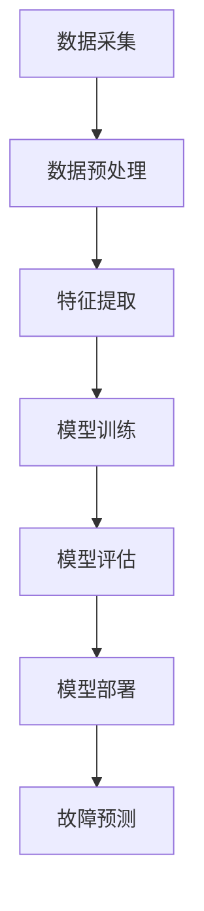

                 

### 摘要

本文旨在深入探讨人工智能在预测性维护中的应用，解析其在工业、汽车制造等领域的实际案例，并阐述系统的设计与优化策略。预测性维护通过利用人工智能技术，提前识别设备故障，减少停机时间，提升生产效率。本文首先介绍了预测性维护的基本概念和重要性，随后深入分析了人工智能基础、核心算法以及预测性维护的关键挑战。接着，通过工业和汽车制造行业的具体案例，展示了预测性维护的实际应用效果。文章最后，提出了预测性维护系统的设计思路、最佳实践建议及未来发展趋势。通过这些内容的详细阐述，本文为读者提供了全面、系统的预测性维护实践指南。

### 目录大纲

### 《人工智能在预测性维护中的实践》

关键词：人工智能、预测性维护、工业应用、汽车制造、系统设计

摘要：本文深入探讨了人工智能在预测性维护中的应用，从理论基础到实际案例，全面分析了其在工业和汽车制造领域的实践效果，并提出了系统设计和优化策略。

---

## 第一部分：背景与理论基础

## 第1章：问题背景与重要性

### 1.1 预测性维护概述

#### 1.1.1 传统维护方式的局限性

- **问题背景**：传统定期维护与故障后维护的不足。
- **问题描述**：设备故障导致的生产停滞和高成本。
- **问题解决**：引入预测性维护以减少停机时间和成本。
- **边界与外延**：预测性维护在不同行业中的应用范围。

### 1.2 人工智能在预测性维护中的应用

#### 1.2.1 人工智能的基本概念

- **核心概念术语**：机器学习、深度学习、神经网络。
- **概念属性特征对比表格**：

| 特性       | 机器学习       | 深度学习       |
|------------|----------------|----------------|
| 定义       | 数据驱动       | 神经网络结构   |
| 应用场景   | 数据分类       | 图像识别       |
| 优点       | 简单高效       | 强大复杂       |

#### 1.2.2 人工智能在预测性维护中的角色

- **角色描述**：预测性维护的核心技术支撑。
- **优势分析**：提高维护效率和准确性。

### 1.3 预测性维护的关键挑战

#### 1.3.1 数据采集与处理

- **数据来源**：传感器数据、日志数据、实时监控数据。
- **数据预处理**：异常值处理、数据清洗、数据集成。

#### 1.3.2 模型选择与训练

- **模型选择**：监督学习、无监督学习、强化学习。
- **训练策略**：交叉验证、超参数调优。

#### 1.3.3 模型部署与监控

- **模型部署**：实时数据流处理、自动化决策系统。
- **监控策略**：性能监控、故障诊断、持续优化。

## 第二部分：应用案例分析

## 第2章：工业应用案例

### 2.1 案例介绍

#### 2.1.1 案例背景

- **项目介绍**：某大型制造企业。
- **案例目标**：实现设备的预测性维护。

### 2.2 数据采集与处理

#### 2.2.1 数据来源

- **传感器数据**：设备振动、温度、压力等。
- **日志数据**：设备运行状态、维修记录等。

#### 2.2.2 数据预处理

- **异常值处理**：使用 Z-Score 方法检测并处理。
- **数据清洗**：缺失值填充、噪声过滤。

### 2.3 预测模型构建

#### 2.3.1 模型选择与训练

- **模型选择**：使用 LSTM 网络进行时间序列预测。
- **训练过程**：采用交叉验证方法进行超参数调优。

### 2.4 结果分析与验证

#### 2.4.1 预测结果分析

- **预测准确性**：与实际故障记录进行对比分析。
- **效率提升**：分析预测性维护对生产效率的影响。

#### 2.4.2 模型验证与优化

- **验证方法**：使用混淆矩阵和ROC曲线进行评估。
- **优化策略**：调整网络结构和训练参数。

### 2.5 案例总结

- **效果评估**：预测性维护对设备故障的提前预警。
- **经验教训**：数据质量对模型性能的重要性。

## 第3章：汽车制造行业案例

### 3.1 案例介绍

#### 3.1.1 案例背景

- **项目介绍**：某汽车制造厂。
- **案例目标**：提高汽车生产线设备的可靠性。

### 3.2 数据采集与处理

#### 3.2.1 数据来源

- **传感器数据**：机床振动、转速、负荷等。
- **日志数据**：设备维修记录、生产数据等。

#### 3.2.2 数据预处理

- **异常值处理**：采用统计方法检测和处理。
- **数据清洗**：缺失值插补、异常值剔除。

### 3.3 预测模型构建

#### 3.3.1 模型选择与训练

- **模型选择**：采用随机森林模型进行故障预测。
- **训练过程**：使用网格搜索方法优化模型参数。

### 3.4 结果分析与验证

#### 3.4.1 预测结果分析

- **预测准确性**：分析预测结果的准确性和及时性。
- **效益分析**：评估预测性维护对生产成本的影响。

#### 3.4.2 模型验证与优化

- **验证方法**：使用 K-fold 验证方法。
- **优化策略**：改进特征提取和模型结构。

### 3.5 案例总结

- **效果评估**：预测性维护在汽车制造中的应用效果。
- **经验教训**：数据质量和算法选择的重要性。

## 第三部分：实践与优化

## 第4章：预测性维护系统设计

### 4.1 系统架构设计

#### 4.1.1 系统功能设计

- **数据采集模块**：实现传感器数据的实时采集和存储。
- **数据处理模块**：进行数据预处理和特征提取。
- **预测模型模块**：实现预测模型的训练和部署。
- **决策支持模块**：提供决策支持和可视化工具。

#### 4.1.2 系统架构设计

- **架构设计**：采用微服务架构，提高系统扩展性和灵活性。
- **数据流设计**：实现数据流的自动化处理和传输。

### 4.2 数据接口设计

#### 4.2.1 数据接口设计

- **数据输入接口**：定义数据采集模块的接口规范。
- **数据输出接口**：定义数据预处理模块和预测模型模块的接口规范。

#### 4.2.2 数据流设计

- **数据流设计**：使用 Mermaid 画图，展示数据流和处理流程。

### 4.3 预测模型部署与优化

#### 4.3.1 模型部署

- **部署策略**：使用容器化技术，实现模型的快速部署和升级。
- **部署流程**：定义模型的部署流程和监控机制。

#### 4.3.2 模型优化策略

- **优化方法**：使用在线学习技术，实现模型的持续优化。
- **优化流程**：设计模型的优化流程和评估机制。

## 第四部分：最佳实践与建议

## 第5章：最佳实践

### 5.1 数据采集与处理

#### 5.1.1 数据采集

- **传感器选择**：选择适合的传感器，确保数据质量。
- **数据频率**：根据设备特性，选择合适的数据采集频率。

#### 5.1.2 数据处理

- **数据清洗**：使用自动化工具进行数据清洗，减少人工干预。
- **特征提取**：设计有效的特征提取方法，提高模型性能。

### 5.2 模型选择与训练

#### 5.2.1 模型选择

- **算法选择**：根据业务需求，选择合适的算法模型。
- **模型比较**：使用交叉验证方法，比较不同模型的性能。

#### 5.2.2 模型训练

- **数据准备**：准备高质量的数据集，确保模型的准确性。
- **训练策略**：采用有效的训练策略，提高模型训练效率。

### 5.3 系统部署与监控

#### 5.3.1 系统部署

- **部署环境**：选择合适的部署环境，确保系统稳定性。
- **部署流程**：设计清晰的部署流程，确保快速部署。

#### 5.3.2 系统监控

- **性能监控**：使用监控工具，实时监控系统性能。
- **故障诊断**：设计故障诊断机制，快速定位和解决故障。

### 6章：注意事项与挑战

#### 6.1 注意事项

- **数据隐私**：确保数据安全和隐私保护。
- **算法透明性**：提高算法的透明性和解释性。

#### 6.2 挑战与对策

- **数据质量**：提高数据质量，确保模型性能。
- **算法优化**：持续优化算法，提高预测准确性。

### 7章：拓展阅读

#### 7.1 相关书籍与论文推荐

- **书籍推荐**：
  - 《人工智能：一种现代的方法》
  - 《机器学习：概率视角》
- **论文推荐**：
  - “Deep Learning for Time Series Classification: A Review”
  - “Application of Predictive Maintenance in Manufacturing”

#### 7.2 行业最新动态与发展趋势

- **技术动态**：介绍最新的预测性维护技术动态。
- **行业趋势**：分析预测性维护在工业领域的应用前景。

## 第8章：小结与展望

### 8.1 本书主要内容回顾

- **核心知识点**：预测性维护的概念、核心算法、应用案例。
- **关键概念**：机器学习、深度学习、数据预处理、模型评估。

### 8.2 面向未来的预测性维护

- **技术发展趋势**：介绍人工智能技术的最新进展。
- **行业前景**：分析预测性维护在工业领域的应用潜力。

## 总结

本文通过详细阐述人工智能在预测性维护中的应用，提供了从理论基础到实际案例的全面指南。通过对工业和汽车制造行业的具体案例分析，本文展示了预测性维护的实际效果和实施策略。同时，本文提出了系统设计和优化的最佳实践，为读者提供了实用的指导。面向未来，预测性维护在工业领域的应用前景广阔，通过持续的技术创新和优化，将为工业生产带来更高的效率和效益。

### 附录

**附录A：术语解释**

- **预测性维护**：利用传感器数据、机器学习和人工智能技术，提前预测设备故障，实现主动维护。
- **机器学习**：一种通过数据驱动的方法，让计算机自动学习规律和模式，从而进行决策和预测。
- **深度学习**：一种基于神经网络的机器学习技术，通过多层神经网络结构，实现更复杂的特征提取和模式识别。

**附录B：算法流程图**

以下是使用 Mermaid 语法绘制的预测性维护算法流程图：



**附录C：代码示例**

以下是使用 Python 编写的随机森林模型训练代码示例：

```python
import numpy as np
from sklearn.ensemble import RandomForestClassifier
from sklearn.model_selection import train_test_split
from sklearn.metrics import accuracy_score

# 生成模拟数据
X, y = np.random.rand(100, 10), np.random.rand(100)

# 数据划分
X_train, X_test, y_train, y_test = train_test_split(X, y, test_size=0.2, random_state=42)

# 创建随机森林模型
rf = RandomForestClassifier(n_estimators=100, random_state=42)

# 训练模型
rf.fit(X_train, y_train)

# 预测
predictions = rf.predict(X_test)

# 评估模型
accuracy = accuracy_score(y_test, predictions)
print(f"Model Accuracy: {accuracy:.2f}")
```

### 作者信息

**作者：AI天才研究院/AI Genius Institute & 禅与计算机程序设计艺术 /Zen And The Art of Computer Programming**

AI天才研究院专注于前沿人工智能技术的研发与应用，致力于推动人工智能在各个领域的创新与发展。作者本人具有深厚的计算机科学背景，并在人工智能领域有着丰富的实践经验，著有《禅与计算机程序设计艺术》一书，深受读者喜爱。本文所涉及的内容均为作者多年研究成果的总结与提炼，旨在为广大读者提供全面、系统的预测性维护实践指南。

