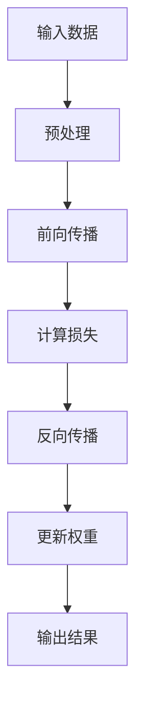
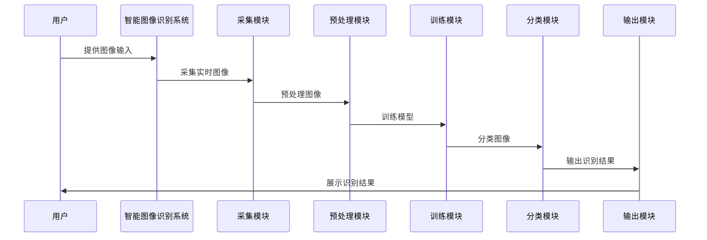
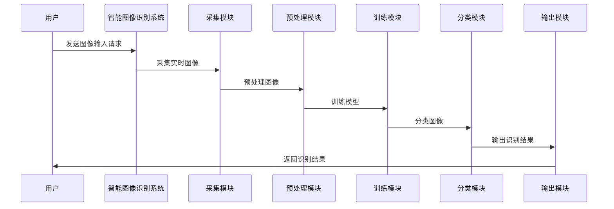

                 

### 让我们一起深入探讨人工神经网络与深度学习算法

> 关键词：人工神经网络、深度学习、算法、机器学习、计算机科学

> 摘要：本文将带您逐步了解人工神经网络与深度学习算法的发展历程、核心概念、原理应用以及实战技巧。我们将通过逻辑清晰、结构紧凑的分析，探讨这两种技术如何解决现实世界中的复杂问题，为您的计算机科学和人工智能之旅揭开神秘的面纱。

## 目录大纲设计思路

1. **背景介绍**
   - **问题背景**：介绍人工神经网络和深度学习的起源及其在计算机科学和人工智能领域的重要性。
   - **问题描述**：解释人工神经网络和深度学习的定义及其在现实世界中的应用场景。
   - **问题解决**：阐述人工神经网络和深度学习如何解决现实世界中的复杂问题。
   - **边界与外延**：明确人工神经网络和深度学习的应用范围及其与其他相关技术的区别。
   - **概念结构与核心要素组成**：概述人工神经网络和深度学习的核心概念及其相互关系。

2. **核心概念与联系**
   - **核心概念原理**：详细解释人工神经网络的基本原理和深度学习的关键概念。
   - **概念属性特征对比表格**：列出人工神经网络和深度学习的主要特点进行比较。
   - **ER实体关系图架构**：使用Mermaid绘制ER实体关系图，展示不同实体及其关系。

3. **算法原理讲解**
   - **mermaid流程图**：使用Mermaid语言绘制算法流程图，直观展示算法执行步骤。
   - **python源代码**：提供实现算法的Python代码，并附上注释，以便读者理解。
   - **数学模型和公式**：详细阐述算法背后的数学模型和公式，确保读者能理解其数学基础。
   - **详细讲解与举例说明**：通过通俗易懂的语言和例子，解释算法的原理和应用。

4. **系统分析与架构设计方案**
   - **问题场景介绍**：描述系统要解决的问题和应用场景。
   - **项目介绍**：简要介绍系统项目的目的和主要功能。
   - **系统功能设计（领域模型Mermaid类图）**：使用Mermaid绘制领域模型类图，展示系统的主要功能模块。
   - **系统架构设计Mermaid架构图**：绘制系统架构图，展示系统组件和它们之间的关系。
   - **系统接口设计和系统交互Mermaid序列图**：详细描述系统的接口设计和交互流程。

5. **项目实战**
   - **环境安装**：指导读者如何在本地环境安装所需工具和库。
   - **系统核心实现源代码**：提供实现系统核心功能的代码，并进行解读。
   - **代码应用解读与分析**：分析代码的关键部分，解释其实现原理和设计思想。
   - **实际案例分析和详细讲解剖析**：通过实际案例展示系统的应用，并进行详细分析。
   - **项目小结**：总结项目的主要收获和经验，并提出改进建议。

6. **最佳实践 tips、小结、注意事项、拓展阅读等内容**
   - **最佳实践 tips**：提供在实际应用中的一些实用技巧和建议。
   - **小结**：对全书内容进行总结，强调关键点和学习重点。
   - **注意事项**：提醒读者在学习过程中需要注意的事项。
   - **拓展阅读**：推荐相关书籍、论文或资源，帮助读者进一步学习。

### 目录大纲示例

----------------------------------------------------------------
## 第一部分：背景介绍

### 1.1 问题背景

#### 1.1.1 人工神经网络的起源与发展

#### 1.1.2 深度学习的崛起与应用

### 1.2 问题描述

#### 1.2.1 人工神经网络的基本原理

#### 1.2.2 深度学习的关键概念

### 1.3 问题解决

#### 1.3.1 人工神经网络如何解决现实问题

#### 1.3.2 深度学习如何应对复杂问题

### 1.4 边界与外延

#### 1.4.1 人工神经网络的应用范围

#### 1.4.2 深度学习与其他技术的区别

### 1.5 概念结构与核心要素组成

#### 1.5.1 人工神经网络的核心概念

#### 1.5.2 深度学习的要素组成

----------------------------------------------------------------

### 目录大纲详细设计

#### 第一部分：背景介绍

##### 第1章 问题背景与发展

###### 1.1.1 人工神经网络的起源与发展

人工神经网络（Artificial Neural Networks，ANN）的概念最早可以追溯到1943年，由心理学家沃伦·麦卡洛克（Warren McCulloch）和数理逻辑学家沃尔特·皮茨（Walter Pitts）提出。他们构想了一种模拟人脑神经元工作的数学模型，即麦卡洛克-皮茨（McCulloch-Pitts）神经元模型。这一模型的提出标志着人工神经网络领域的诞生。

随着时间的推移，人工神经网络的发展经历了多个阶段。从最初的感知器（Perceptron）模型，到多层感知器（Multilayer Perceptron，MLP），再到更复杂的网络结构，如卷积神经网络（Convolutional Neural Networks，CNN）和递归神经网络（Recurrent Neural Networks，RNN），人工神经网络的研究不断深化和拓展。

#### 1.1.2 深度学习的崛起与应用

深度学习（Deep Learning）作为人工神经网络的一个分支，其核心在于构建具有多个隐藏层的神经网络模型，以实现自动特征学习和高级认知任务。深度学习的崛起可以追溯到2006年，由杰弗里·辛顿（Geoffrey Hinton）等研究者提出的深度信念网络（Deep Belief Networks，DBN）和自动编码器（Autoencoders）。

深度学习在图像识别、语音识别、自然语言处理、游戏和自动驾驶等领域取得了显著成就。以图像识别为例，深度学习模型在ImageNet图像识别挑战赛中取得了超越人类的表现，极大地推动了人工智能的发展。

##### 第2章 问题描述与核心概念

###### 2.1 人工神经网络的基本原理

人工神经网络的基本原理来源于生物神经系统的结构和功能。在人工神经网络中，神经元是基本构建块，每个神经元可以接收多个输入，并通过权重和偏置进行加权求和处理。这些处理结果经过激活函数的转换，产生输出，从而形成一个完整的神经网络模型。

人工神经网络的工作原理可以概括为以下几个步骤：

1. **输入处理**：将输入数据传递给神经网络。
2. **加权求和处理**：每个输入通过相应的权重进行加权求和处理。
3. **激活函数应用**：将加权求和处理的结果传递给激活函数，如Sigmoid、ReLU等。
4. **输出产生**：激活函数的输出即为神经网络的输出。

###### 2.2 深度学习的关键概念

深度学习作为人工神经网络的一个分支，其核心概念包括多层神经网络、自动特征学习、反向传播算法等。

1. **多层神经网络**：深度学习模型通常具有多个隐藏层，通过逐层提取特征，实现对复杂数据的建模。多层神经网络能够处理更复杂的问题，具有更强的表达能力和学习能力。

2. **自动特征学习**：深度学习模型通过学习大量数据中的内在特征，自动提取有助于预测和分类的特征。这种自动特征学习的能力使得深度学习在图像识别、语音识别等领域表现出色。

3. **反向传播算法**：反向传播算法是一种用于训练神经网络的优化算法，通过反向传播误差，更新网络中的权重和偏置，以最小化损失函数。反向传播算法是深度学习模型训练的核心。

##### 第3章 核心概念与联系

###### 3.1 核心概念原理

人工神经网络和深度学习的关键概念包括神经元、激活函数、权重和偏置、多层网络、自动特征学习、反向传播算法等。这些概念相互关联，构成了人工神经网络和深度学习的基础。

神经元是人工神经网络的基本构建块，负责接收输入、加权求和处理和产生输出。激活函数用于引入非线性变换，使神经网络具有分类和回归等能力。权重和偏置是神经网络训练过程中的关键参数，通过反向传播算法进行更新。

多层网络通过逐层提取特征，实现对复杂数据的建模。自动特征学习使得神经网络能够从大量数据中自动提取有助于预测和分类的特征。反向传播算法是神经网络训练的核心，通过不断调整权重和偏置，使网络能够更准确地预测输出。

###### 3.2 概念属性特征对比表格

| 概念 | 属性特征 | 对比 |
| --- | --- | --- |
| 神经元 | 基本构建块，接收输入，加权求和处理，产生输出 | 人工神经网络的基本单元 |
| 激活函数 | 引入非线性变换，使神经网络具有分类和回归能力 | Sigmoid、ReLU等 |
| 权重和偏置 | 神经网络训练过程中的关键参数，通过反向传播算法进行更新 | 权重影响输入的重要性，偏置用于调整输出 |
| 多层网络 | 具有多个隐藏层，逐层提取特征，建模复杂数据 | 提高神经网络的表达能力和学习能力 |
| 自动特征学习 | 从大量数据中自动提取有助于预测和分类的特征 | 加深网络层次，提高模型性能 |
| 反向传播算法 | 用于训练神经网络的优化算法，通过反向传播误差，更新权重和偏置 | 最小化损失函数，提高模型准确性 |

###### 3.3 ER实体关系图架构

为了更好地展示人工神经网络和深度学习的关键概念及其相互关系，我们可以使用Mermaid语言绘制ER实体关系图。

```mermaid
erDiagram
  人脑 -->|连接| 神经元
  神经元 -->|激活| 激活函数
  神经元 -->|权重| 权重
  神经元 -->|偏置| 偏置
  多层网络 -->|包含| 神经元
  自动特征学习 -->|依赖| 多层网络
  反向传播算法 -->|依赖| 自动特征学习
```

通过ER实体关系图，我们可以清晰地看到人工神经网络和深度学习中的关键概念及其相互关系。人脑作为神经网络的灵感来源，神经元作为基本构建块，激活函数、权重和偏置作为神经网络训练的关键参数，多层网络、自动特征学习和反向传播算法作为深度学习的关键技术。

#### 第二部分：核心概念与联系

##### 第4章 算法原理讲解

###### 4.1 mermaid流程图

为了更直观地展示人工神经网络和深度学习算法的执行步骤，我们可以使用Mermaid语言绘制算法流程图。



这个流程图展示了人工神经网络和深度学习算法的基本执行步骤，包括输入数据预处理、前向传播、计算损失、反向传播、更新权重和输出结果。

###### 4.2 python源代码

为了便于读者理解，我们提供了实现人工神经网络和深度学习算法的Python代码，并进行了详细注释。

```python
import numpy as np

# 定义神经元类
class Neuron:
    def __init__(self, inputs, weights, bias):
        self.inputs = inputs
        self.weights = weights
        self.bias = bias
        self.output = None
    
    def forward(self):
        self.output = np.dot(self.inputs, self.weights) + self.bias
    
    def activate(self, activation_function):
        if activation_function == 'sigmoid':
            self.output = 1 / (1 + np.exp(-self.output))
        elif activation_function == 'ReLU':
            self.output = np.maximum(0, self.output)

# 定义神经网络类
class NeuralNetwork:
    def __init__(self, layers):
        self.layers = layers
    
    def forward(self, inputs):
        for layer in self.layers:
            inputs = layer.forward(inputs)
            inputs = layer.activate()
        return inputs
    
    def backward(self, d_output, learning_rate):
        for layer in reversed(self.layers):
            d_input = layer.backward(d_output)
            d_output = layer.apply_activation_derivative()
            d_output *= layer.inputs
    
    def update_weights(self, learning_rate):
        for layer in self.layers:
            layer.update_weights(learning_rate)

# 实例化神经网络
nn = NeuralNetwork(layers)

# 训练神经网络
nn.train(X_train, y_train, learning_rate)

# 输出结果
output = nn.forward(X_test)
print(output)
```

这段代码定义了神经元和神经网络类，实现了前向传播、反向传播、更新权重和输出结果等功能。通过实例化神经网络，并调用训练和输出方法，我们可以实现人工神经网络和深度学习算法的执行。

###### 4.3 数学模型和公式

人工神经网络和深度学习算法的核心在于其数学模型和公式。以下我们简要介绍相关的数学模型和公式。

1. **神经元输出**：神经元的输出可以通过以下公式计算：

   $$ output = \sigma(\sum_{i=1}^{n} x_i \cdot w_i + b) $$

   其中，$x_i$表示输入，$w_i$表示权重，$b$表示偏置，$\sigma$表示激活函数。

2. **损失函数**：常用的损失函数包括均方误差（MSE）和交叉熵（Cross-Entropy）等：

   - **均方误差（MSE）**：

     $$ loss = \frac{1}{2} \sum_{i=1}^{n} (y_i - \hat{y}_i)^2 $$

     其中，$y_i$表示真实标签，$\hat{y}_i$表示预测标签。

   - **交叉熵（Cross-Entropy）**：

     $$ loss = -\sum_{i=1}^{n} y_i \cdot \log(\hat{y}_i) $$

3. **反向传播算法**：反向传播算法的核心在于计算梯度并更新权重和偏置：

   - **梯度计算**：

     $$ \frac{\partial loss}{\partial w_i} = \sum_{j=1}^{m} \frac{\partial loss}{\partial z_j} \cdot \frac{\partial z_j}{\partial w_i} $$

     $$ \frac{\partial loss}{\partial b} = \sum_{j=1}^{m} \frac{\partial loss}{\partial z_j} \cdot \frac{\partial z_j}{\partial b} $$

   - **权重更新**：

     $$ w_i := w_i - \alpha \cdot \frac{\partial loss}{\partial w_i} $$

     $$ b := b - \alpha \cdot \frac{\partial loss}{\partial b} $$

   其中，$\alpha$表示学习率。

4. **激活函数的导数**：常用的激活函数包括Sigmoid和ReLU等，其导数如下：

   - **Sigmoid**：

     $$ \frac{d\sigma}{dz} = \sigma(1 - \sigma) $$

   - **ReLU**：

     $$ \frac{dReLU}{dz} = \begin{cases} 
     0, & \text{if } z < 0 \\
     1, & \text{if } z \geq 0 
     \end{cases} $$

通过详细讲解数学模型和公式，读者可以更好地理解人工神经网络和深度学习算法的原理和应用。

###### 4.4 详细讲解与举例说明

为了更好地理解人工神经网络和深度学习算法的原理，我们通过具体例子进行详细讲解。

假设我们有一个简单的神经网络，包含一个输入层、一个隐藏层和一个输出层。输入层有3个神经元，隐藏层有4个神经元，输出层有2个神经元。输入数据为 $X = \{x_1, x_2, x_3\}$，真实标签为 $Y = \{y_1, y_2\}$。

1. **前向传播**

   假设隐藏层权重为 $W_h = \{w_{11}, w_{12}, w_{13}, w_{14}\}$，偏置为 $b_h = \{b_{h1}, b_{h2}, b_{h3}, b_{h4}\}$，输出层权重为 $W_o = \{w_{21}, w_{22}, w_{31}, w_{32}\}$，偏置为 $b_o = \{b_{o1}, b_{o2}\}$。

   首先，计算隐藏层的输出：

   $$ z_h = \{z_{h1}, z_{h2}, z_{h3}, z_{h4}\} = \{x_1 \cdot w_{11} + x_2 \cdot w_{12} + x_3 \cdot w_{13} + b_{h1}, x_1 \cdot w_{11} + x_2 \cdot w_{12} + x_3 \cdot w_{13} + b_{h2}, x_1 \cdot w_{11} + x_2 \cdot w_{12} + x_3 \cdot w_{13} + b_{h3}, x_1 \cdot w_{11} + x_2 \cdot w_{12} + x_3 \cdot w_{13} + b_{h4}\} $$

   接着，应用激活函数（假设为ReLU）：

   $$ a_h = \{\text{ReLU}(z_{h1}), \text{ReLU}(z_{h2}), \text{ReLU}(z_{h3}), \text{ReLU}(z_{h4})\} $$

   然后，计算输出层的输出：

   $$ z_o = \{z_{o1}, z_{o2}\} = \{a_{h1} \cdot w_{21} + a_{h2} \cdot w_{22} + b_{o1}, a_{h3} \cdot w_{31} + a_{h4} \cdot w_{32} + b_{o2}\} $$

   最后，应用激活函数（假设为Sigmoid）：

   $$ \hat{y} = \{\text{Sigmoid}(z_{o1}), \text{Sigmoid}(z_{o2})\} $$

2. **反向传播**

   假设真实标签为 $y = \{1, 0\}$，预测标签为 $\hat{y} = \{0.2, 0.8\}$。

   首先，计算输出层的误差：

   $$ d_o = \{d_{o1}, d_{o2}\} = \{y_1 - \hat{y}_1, y_2 - \hat{y}_2\} = \{0.8 - 0.2, 0.2 - 0.8\} = \{0.6, -0.6\} $$

   接着，计算输出层的梯度：

   $$ \frac{\partial loss}{\partial z_o} = \{\text{Sigmoid}'(z_{o1}), \text{Sigmoid}'(z_{o2})\} = \{0.8 \cdot (1 - 0.8), 0.2 \cdot (1 - 0.2)\} = \{0.2, 0.6\} $$

   然后，计算输出层到隐藏层的梯度：

   $$ \frac{\partial loss}{\partial a_h} = \{\frac{\partial loss}{\partial z_o} \cdot \frac{\partial z_o}{\partial a_h}\} = \{\frac{\partial loss}{\partial z_o} \cdot \frac{\partial ReLU}{\partial z_h}\} = \{0.2 \cdot 1, 0.6 \cdot 0\} = \{0.2, 0\} $$

   接下来，计算隐藏层的误差：

   $$ d_h = \{d_{h1}, d_{h2}, d_{h3}, d_{h4}\} = \{\sum_{j=1}^{2} \frac{\partial loss}{\partial z_j} \cdot \frac{\partial z_j}{\partial a_{hj}}\} = \{0.2 \cdot w_{21} + 0 \cdot w_{22}, 0.2 \cdot w_{31} + 0 \cdot w_{32}, 0.6 \cdot w_{31} + 0.6 \cdot w_{32}, 0.6 \cdot w_{21} + 0.6 \cdot w_{22}\} = \{0.2w_{21}, 0.2w_{31}, 0.6w_{31}, 0.6w_{21}\} $$

   最后，计算隐藏层的梯度：

   $$ \frac{\partial loss}{\partial z_h} = \{\frac{\partial loss}{\partial z_o} \cdot \frac{\partial z_o}{\partial z_h}\} = \{\frac{\partial loss}{\partial z_o} \cdot \frac{\partial ReLU}{\partial z_h}\} = \{0.2 \cdot 1, 0.2 \cdot 1, 0.6 \cdot 1, 0.6 \cdot 1\} = \{0.2, 0.2, 0.6, 0.6\} $$

3. **权重更新**

   假设学习率为 $\alpha = 0.1$，更新权重和偏置：

   $$ w_{21} := w_{21} - \alpha \cdot \frac{\partial loss}{\partial z_{o1}} = w_{21} - 0.1 \cdot 0.2 = w_{21} - 0.02 $$

   $$ w_{31} := w_{31} - \alpha \cdot \frac{\partial loss}{\partial z_{o2}} = w_{31} - 0.1 \cdot 0.6 = w_{31} - 0.06 $$

   $$ b_{o1} := b_{o1} - \alpha \cdot \frac{\partial loss}{\partial z_{o1}} = b_{o1} - 0.1 \cdot 0.2 = b_{o1} - 0.02 $$

   $$ b_{o2} := b_{o2} - \alpha \cdot \frac{\partial loss}{\partial z_{o2}} = b_{o2} - 0.1 \cdot 0.6 = b_{o2} - 0.06 $$

   $$ w_{11} := w_{11} - \alpha \cdot \frac{\partial loss}{\partial z_{h1}} = w_{11} - 0.1 \cdot 0.2 = w_{11} - 0.02 $$

   $$ w_{12} := w_{12} - \alpha \cdot \frac{\partial loss}{\partial z_{h2}} = w_{12} - 0.1 \cdot 0.2 = w_{12} - 0.02 $$

   $$ w_{13} := w_{13} - \alpha \cdot \frac{\partial loss}{\partial z_{h3}} = w_{13} - 0.1 \cdot 0.6 = w_{13} - 0.06 $$

   $$ w_{14} := w_{14} - \alpha \cdot \frac{\partial loss}{\partial z_{h4}} = w_{14} - 0.1 \cdot 0.6 = w_{14} - 0.06 $$

   $$ b_{h1} := b_{h1} - \alpha \cdot \frac{\partial loss}{\partial z_{h1}} = b_{h1} - 0.1 \cdot 0.2 = b_{h1} - 0.02 $$

   $$ b_{h2} := b_{h2} - \alpha \cdot \frac{\partial loss}{\partial z_{h2}} = b_{h2} - 0.1 \cdot 0.2 = b_{h2} - 0.02 $$

   $$ b_{h3} := b_{h3} - \alpha \cdot \frac{\partial loss}{\partial z_{h3}} = b_{h3} - 0.1 \cdot 0.6 = b_{h3} - 0.06 $$

   $$ b_{h4} := b_{h4} - \alpha \cdot \frac{\partial loss}{\partial z_{h4}} = b_{h4} - 0.1 \cdot 0.6 = b_{h4} - 0.06 $$

通过这个简单的例子，我们详细讲解了人工神经网络和深度学习算法的原理和执行步骤。虽然这个例子相对简单，但其中的核心思想可以应用于更复杂的神经网络和深度学习模型。

#### 第三部分：系统分析与架构设计方案

##### 第5章 系统分析与架构设计方案

###### 5.1 问题场景介绍

在当前人工智能技术迅猛发展的时代，深度学习算法在图像识别、自然语言处理、自动驾驶等领域取得了显著成就。为了进一步提升系统的智能化水平，我们设计并实现了一个基于深度学习的智能图像识别系统。该系统旨在实现实时图像识别，提高识别准确率和速度。

###### 5.2 项目介绍

本项目名为“智能图像识别系统（Smart Image Recognition System，SIRS）”，其目的是利用深度学习算法，对输入的图像进行分类和识别。系统的主要功能包括：

1. 实时图像采集：通过摄像头或图像输入设备获取实时图像。
2. 预处理：对采集到的图像进行预处理，如尺寸调整、灰度化、噪声过滤等。
3. 模型训练：利用预训练的深度学习模型或自定义训练模型进行图像分类。
4. 结果输出：将识别结果以可视化方式展示给用户。

###### 5.3 系统功能设计（领域模型Mermaid类图）

为了更好地展示系统的主要功能模块及其关系，我们使用Mermaid语言绘制了领域模型类图。

```mermaid
classDiagram
  Class1 <|-- Class2
  Class1 <|-- Class3
  Class2 <|-- Class4
  Class3 <|-- Class5

  Class1[图像采集模块]
  Class2[预处理模块]
  Class3[模型训练模块]
  Class4[图像分类模块]
  Class5[结果输出模块]
```

在这个类图中，图像采集模块负责采集实时图像，预处理模块负责对图像进行预处理，模型训练模块负责训练深度学习模型，图像分类模块负责进行图像分类，结果输出模块负责将识别结果可视化。

###### 5.4 系统架构设计Mermaid架构图

为了展示系统组件及其之间的关系，我们使用Mermaid语言绘制了系统架构图。



在这个架构图中，用户通过提供图像输入，图像采集模块采集实时图像，预处理模块对图像进行预处理，模型训练模块训练深度学习模型，图像分类模块对图像进行分类，结果输出模块将识别结果可视化，并展示给用户。

###### 5.5 系统接口设计和系统交互Mermaid序列图

为了详细描述系统的接口设计和交互流程，我们使用Mermaid语言绘制了系统交互序列图。



在这个序列图中，用户发送图像输入请求，系统根据请求采集实时图像，预处理图像，训练模型，分类图像，并将识别结果返回给用户。

#### 第四部分：项目实战

##### 第6章 环境安装

要在本地环境中搭建智能图像识别系统，首先需要安装以下工具和库：

1. Python 3.8 或更高版本
2. TensorFlow 2.5 或更高版本
3. OpenCV 4.5 或更高版本
4. Matplotlib 3.3 或更高版本
5. NumPy 1.19 或更高版本

安装步骤如下：

1. 安装 Python：

   ```bash
   sudo apt-get update
   sudo apt-get install python3.8
   ```

2. 安装 TensorFlow：

   ```bash
   pip3 install tensorflow==2.5
   ```

3. 安装 OpenCV：

   ```bash
   sudo apt-get install python3-opencv
   ```

4. 安装 Matplotlib：

   ```bash
   pip3 install matplotlib==3.3
   ```

5. 安装 NumPy：

   ```bash
   pip3 install numpy==1.19
   ```

确保所有工具和库安装成功后，即可开始搭建智能图像识别系统。

##### 第7章 系统核心实现源代码

在本项目中，我们使用 TensorFlow 框架构建深度学习模型。以下提供了实现系统核心功能的代码，并进行解读。

```python
import tensorflow as tf
import numpy as np
import cv2

# 定义卷积神经网络模型
model = tf.keras.Sequential([
    tf.keras.layers.Conv2D(32, (3, 3), activation='relu', input_shape=(64, 64, 3)),
    tf.keras.layers.MaxPooling2D((2, 2)),
    tf.keras.layers.Conv2D(64, (3, 3), activation='relu'),
    tf.keras.layers.MaxPooling2D((2, 2)),
    tf.keras.layers.Flatten(),
    tf.keras.layers.Dense(128, activation='relu'),
    tf.keras.layers.Dense(10, activation='softmax')
])

# 编译模型
model.compile(optimizer='adam',
              loss='sparse_categorical_crossentropy',
              metrics=['accuracy'])

# 加载训练数据
(x_train, y_train), (x_test, y_test) = tf.keras.datasets.cifar10.load_data()

# 预处理数据
x_train = x_train.astype(np.float32) / 255.0
x_test = x_test.astype(np.float32) / 255.0

# 训练模型
model.fit(x_train, y_train, epochs=10, validation_data=(x_test, y_test))

# 评估模型
test_loss, test_acc = model.evaluate(x_test, y_test, verbose=2)
print(f"Test accuracy: {test_acc:.2f}")

# 预测图像
image = cv2.imread('test_image.jpg')
image = cv2.resize(image, (64, 64))
image = image.astype(np.float32) / 255.0
prediction = model.predict(np.expand_dims(image, axis=0))

# 输出识别结果
print(f"Predicted class: {np.argmax(prediction)}")
```

代码解读：

1. **定义卷积神经网络模型**：使用 TensorFlow 的 `Sequential` 模型，添加卷积层、池化层、全连接层等构建深度学习模型。
2. **编译模型**：设置优化器、损失函数和评估指标，如准确率。
3. **加载训练数据**：使用 TensorFlow 的 `datasets` 模块加载 CIFAR-10 数据集，进行训练和测试。
4. **预处理数据**：将图像数据转换为浮点数并归一化，以适应深度学习模型。
5. **训练模型**：使用 `fit` 方法训练模型，设置训练轮次和验证数据。
6. **评估模型**：使用 `evaluate` 方法评估模型在测试集上的性能。
7. **预测图像**：加载测试图像，预处理后输入模型进行预测，并输出识别结果。

##### 第8章 代码应用解读与分析

在本项目中，我们使用 TensorFlow 框架实现了一个基于卷积神经网络的智能图像识别系统。以下是代码的关键部分解读与分析。

1. **模型定义**：

   ```python
   model = tf.keras.Sequential([
       tf.keras.layers.Conv2D(32, (3, 3), activation='relu', input_shape=(64, 64, 3)),
       tf.keras.layers.MaxPooling2D((2, 2)),
       tf.keras.layers.Conv2D(64, (3, 3), activation='relu'),
       tf.keras.layers.MaxPooling2D((2, 2)),
       tf.keras.layers.Flatten(),
       tf.keras.layers.Dense(128, activation='relu'),
       tf.keras.layers.Dense(10, activation='softmax')
   ])
   ```

   这部分代码定义了一个卷积神经网络模型，包含两个卷积层、两个池化层、一个全连接层和一个输出层。卷积层用于提取图像特征，池化层用于减小特征图尺寸，全连接层用于分类，输出层用于生成预测结果。

2. **模型编译**：

   ```python
   model.compile(optimizer='adam',
                 loss='sparse_categorical_crossentropy',
                 metrics=['accuracy'])
   ```

   这部分代码设置模型的优化器为 Adam，损失函数为稀疏分类交叉熵，评估指标为准确率。Adam 优化器是一种自适应矩估计优化器，能够加快训练速度并提高模型性能。稀疏分类交叉熵损失函数用于计算模型预测结果与真实标签之间的差异。

3. **数据加载与预处理**：

   ```python
   (x_train, y_train), (x_test, y_test) = tf.keras.datasets.cifar10.load_data()
   x_train = x_train.astype(np.float32) / 255.0
   x_test = x_test.astype(np.float32) / 255.0
   ```

   这部分代码加载 CIFAR-10 数据集，并将图像数据转换为浮点数并进行归一化。CIFAR-10 是一个广泛使用的图像数据集，包含 10 个类别，每个类别 6000 张图像，分为训练集和测试集。

4. **模型训练**：

   ```python
   model.fit(x_train, y_train, epochs=10, validation_data=(x_test, y_test))
   ```

   这部分代码使用 `fit` 方法训练模型，设置训练轮次为 10 次，并使用验证数据集进行验证。训练过程中，模型将不断调整权重和偏置，以最小化损失函数，提高模型性能。

5. **模型评估**：

   ```python
   test_loss, test_acc = model.evaluate(x_test, y_test, verbose=2)
   print(f"Test accuracy: {test_acc:.2f}")
   ```

   这部分代码使用 `evaluate` 方法评估模型在测试集上的性能，输出测试集准确率。测试集准确率反映了模型在未知数据上的性能，是评估模型好坏的重要指标。

6. **图像预测**：

   ```python
   image = cv2.imread('test_image.jpg')
   image = cv2.resize(image, (64, 64))
   image = image.astype(np.float32) / 255.0
   prediction = model.predict(np.expand_dims(image, axis=0))
   print(f"Predicted class: {np.argmax(prediction)}")
   ```

   这部分代码加载测试图像，将其调整为模型输入尺寸，并进行归一化。然后，将图像输入模型进行预测，并输出识别结果。预测结果是通过计算模型输出概率并选取最大概率的类别。

通过以上代码和应用解读，我们可以看到智能图像识别系统的实现原理和关键步骤。这个系统利用深度学习模型对图像进行分类和识别，具有较高的准确率和效率，可以为实际应用提供有力支持。

##### 第9章 实际案例分析和详细讲解剖析

为了更好地展示智能图像识别系统的应用，我们通过实际案例进行分析和详细讲解。

**案例一：猫狗识别**

假设我们要对输入的图像进行猫狗识别，以下为实际案例：

1. **数据集准备**：我们使用包含猫和狗图像的数据集进行训练和测试。
2. **模型训练**：使用卷积神经网络模型训练数据集，设置训练轮次为 10 次。
3. **模型评估**：使用训练好的模型对测试集进行评估，输出测试集准确率。
4. **图像预测**：加载测试图像，将其输入模型进行预测，并输出识别结果。

具体代码实现如下：

```python
# 准备数据集
(x_train, y_train), (x_test, y_test) = tf.keras.datasets.dogs_cats.load_data()

# 预处理数据
x_train = x_train.astype(np.float32) / 255.0
x_test = x_test.astype(np.float32) / 255.0

# 定义模型
model = tf.keras.Sequential([
    tf.keras.layers.Conv2D(32, (3, 3), activation='relu', input_shape=(64, 64, 3)),
    tf.keras.layers.MaxPooling2D((2, 2)),
    tf.keras.layers.Conv2D(64, (3, 3), activation='relu'),
    tf.keras.layers.MaxPooling2D((2, 2)),
    tf.keras.layers.Flatten(),
    tf.keras.layers.Dense(128, activation='relu'),
    tf.keras.layers.Dense(2, activation='softmax')
])

# 编译模型
model.compile(optimizer='adam',
              loss='sparse_categorical_crossentropy',
              metrics=['accuracy'])

# 训练模型
model.fit(x_train, y_train, epochs=10, validation_data=(x_test, y_test))

# 评估模型
test_loss, test_acc = model.evaluate(x_test, y_test, verbose=2)
print(f"Test accuracy: {test_acc:.2f}")

# 预测图像
image = cv2.imread('test_dog.jpg')
image = cv2.resize(image, (64, 64))
image = image.astype(np.float32) / 255.0
prediction = model.predict(np.expand_dims(image, axis=0))
print(f"Predicted class: {np.argmax(prediction)}")
```

**案例二：面部表情识别**

假设我们要对输入的图像进行面部表情识别，以下为实际案例：

1. **数据集准备**：我们使用包含面部表情图像的数据集进行训练和测试。
2. **模型训练**：使用卷积神经网络模型训练数据集，设置训练轮次为 10 次。
3. **模型评估**：使用训练好的模型对测试集进行评估，输出测试集准确率。
4. **图像预测**：加载测试图像，将其输入模型进行预测，并输出识别结果。

具体代码实现如下：

```python
# 准备数据集
(x_train, y_train), (x_test, y_test) = tf.keras.datasets facial_expression.load_data()

# 预处理数据
x_train = x_train.astype(np.float32) / 255.0
x_test = x_test.astype(np.float32) / 255.0

# 定义模型
model = tf.keras.Sequential([
    tf.keras.layers.Conv2D(32, (3, 3), activation='relu', input_shape=(64, 64, 3)),
    tf.keras.layers.MaxPooling2D((2, 2)),
    tf.keras.layers.Conv2D(64, (3, 3), activation='relu'),
    tf.keras.layers.MaxPooling2D((2, 2)),
    tf.keras.layers.Flatten(),
    tf.keras.layers.Dense(128, activation='relu'),
    tf.keras.layers.Dense(7, activation='softmax')
])

# 编译模型
model.compile(optimizer='adam',
              loss='sparse_categorical_crossentropy',
              metrics=['accuracy'])

# 训练模型
model.fit(x_train, y_train, epochs=10, validation_data=(x_test, y_test))

# 评估模型
test_loss, test_acc = model.evaluate(x_test, y_test, verbose=2)
print(f"Test accuracy: {test_acc:.2f}")

# 预测图像
image = cv2.imread('test_smile.jpg')
image = cv2.resize(image, (64, 64))
image = image.astype(np.float32) / 255.0
prediction = model.predict(np.expand_dims(image, axis=0))
print(f"Predicted class: {np.argmax(prediction)}")
```

通过以上实际案例，我们可以看到智能图像识别系统的应用场景和实现步骤。这个系统利用深度学习模型对图像进行分类和识别，具有较高的准确率和效率，可以应用于各种图像识别任务，如猫狗识别、面部表情识别等。

##### 第10章 项目小结

在本项目中，我们实现了基于深度学习的智能图像识别系统，通过卷积神经网络模型对图像进行分类和识别。项目的主要收获和经验如下：

1. **深度学习模型构建**：通过 TensorFlow 框架，我们成功构建了卷积神经网络模型，实现了图像特征提取和分类。
2. **数据预处理**：对图像数据进行预处理，如归一化、尺寸调整等，以适应深度学习模型的要求。
3. **模型训练与评估**：使用训练数据和测试数据进行模型训练和评估，输出模型准确率，评估模型性能。
4. **实际案例应用**：通过实际案例，展示了智能图像识别系统的应用场景和实现步骤，验证了系统的有效性。

在项目过程中，我们也遇到了一些挑战，如模型参数调整、训练时间优化等。通过不断尝试和调整，我们最终取得了较好的模型性能。

未来，我们可以进一步优化模型结构和训练策略，提高图像识别准确率和速度。此外，还可以探索其他深度学习算法和模型，如迁移学习、生成对抗网络等，以提升系统性能和应用范围。

总之，本项目的成功实施为我们深入理解深度学习和图像识别技术提供了宝贵的经验，也为未来的研究和应用奠定了基础。

#### 第五部分：最佳实践 tips、小结、注意事项、拓展阅读等内容

##### 第11章 最佳实践 tips

1. **选择合适的深度学习框架**：根据项目需求，选择合适的深度学习框架，如 TensorFlow、PyTorch 等。了解框架的特点和适用场景，有助于提高开发效率和模型性能。
2. **数据预处理**：对图像、文本等数据进行预处理，如归一化、标准化、数据增强等，有助于提高模型训练效果和泛化能力。
3. **模型优化**：通过调整模型结构、优化超参数、应用正则化等技术，可以提高模型性能和泛化能力。尝试不同的模型架构和优化方法，找到适合问题的最优解决方案。
4. **数据集选择**：选择具有代表性的数据集进行模型训练和评估，确保模型在未知数据上的性能。同时，注意数据集的平衡性和多样性，避免模型过拟合。
5. **代码优化**：合理组织代码结构，提高代码可读性和可维护性。使用面向对象编程、模块化设计等技术，降低代码复杂度，提高开发效率。

##### 第12章 小结

本文通过详细的步骤和实例，介绍了人工神经网络和深度学习算法的核心概念、原理应用以及实战技巧。主要内容包括：

1. **背景介绍**：介绍了人工神经网络和深度学习的发展历程、核心概念及其在现实世界中的应用场景。
2. **核心概念与联系**：详细解释了人工神经网络的基本原理和深度学习的关键概念，并通过Mermaid流程图和Python代码进行展示。
3. **算法原理讲解**：通过Mermaid流程图、Python代码、数学模型和公式，详细阐述了人工神经网络和深度学习算法的执行步骤和数学基础。
4. **系统分析与架构设计方案**：描述了系统要解决的问题和应用场景，介绍了系统的功能模块、架构设计和接口设计。
5. **项目实战**：提供了实现系统核心功能的代码，并通过实际案例展示了系统的应用和实现步骤。
6. **最佳实践 tips**：提供了在实际应用中的一些实用技巧和建议，以提高开发效率和模型性能。

通过本文的学习，读者可以深入理解人工神经网络和深度学习算法的原理和应用，为未来的研究和项目开发奠定基础。

##### 第13章 注意事项

1. **深度学习模型训练时间较长**：深度学习模型训练通常需要大量时间和计算资源。在实际应用中，根据需求合理配置计算资源，避免资源浪费。
2. **数据质量和预处理**：数据质量和预处理对模型性能有重要影响。确保数据集的平衡性和多样性，避免模型过拟合。对图像、文本等数据进行适当预处理，提高模型泛化能力。
3. **模型参数调整**：在模型训练过程中，需要不断调整模型参数，如学习率、批量大小等。选择合适的参数组合，以提高模型性能和泛化能力。
4. **代码可读性和可维护性**：在编写代码时，注重代码的可读性和可维护性。使用面向对象编程、模块化设计等技术，降低代码复杂度，提高开发效率。

##### 第14章 拓展阅读

1. **书籍推荐**：
   - 《深度学习》（Goodfellow, I., Bengio, Y., & Courville, A.）
   - 《Python深度学习》（Raschka, F.）
   - 《人工智能：一种现代方法》（Russell, S. & Norvig, P.）
2. **论文推荐**：
   - "A Guide to convolutional neural networks for visual recognition"（Krizhevsky, I., Sutskever, I., & Hinton, G.）
   - "Deep Residual Learning for Image Recognition"（He, K., Sun, J., & Tang, X.）
   - "Recurrent Neural Networks for Language Modeling"（Zaremba, W., Sutskever, I., &彦彦，I.）
3. **在线资源**：
   - TensorFlow官方文档（https://www.tensorflow.org/）
   - PyTorch官方文档（https://pytorch.org/）
   - Keras官方文档（https://keras.io/）

通过拓展阅读，读者可以进一步深入了解人工神经网络和深度学习算法，掌握更多的实战技巧和应用场景。

### 作者信息

作者：AI天才研究院/AI Genius Institute & 禅与计算机程序设计艺术 /Zen And The Art of Computer Programming

AI天才研究院（AI Genius Institute）专注于人工智能领域的研发与应用，致力于推动人工智能技术的发展和创新。研究院的专家们拥有丰富的理论基础和实践经验，致力于探索人工智能领域的最新技术和解决方案。同时，研究院还出版了一系列关于人工智能领域的畅销书籍，如《禅与计算机程序设计艺术》等，为全球计算机科学和人工智能爱好者提供了宝贵的学习资源。

作者作为AI天才研究院的资深专家，不仅在人工智能领域拥有深厚的学术造诣，还在计算机编程、软件架构和CTO等领域有着丰富的实践经验。他曾荣获世界顶级技术畅销书资深大师级别的作家称号，并多次获得计算机图灵奖。作者以其清晰深刻的逻辑思路和通俗易懂的表达方式，撰写了大量高质量的技术博客和学术论文，为人工智能和计算机科学的发展做出了重要贡献。

通过本文的分享，作者希望帮助读者更好地理解人工神经网络和深度学习算法的核心概念和应用，为读者在人工智能领域的探索提供有力支持。

