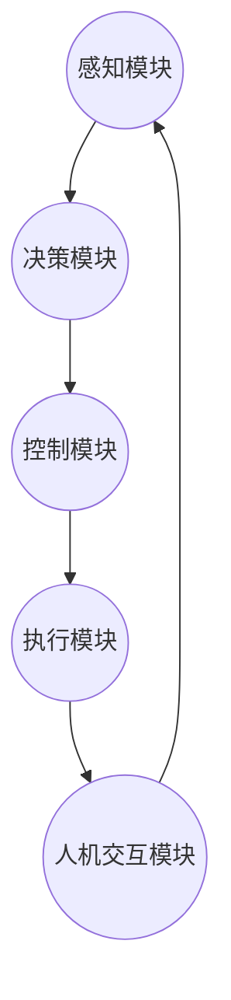
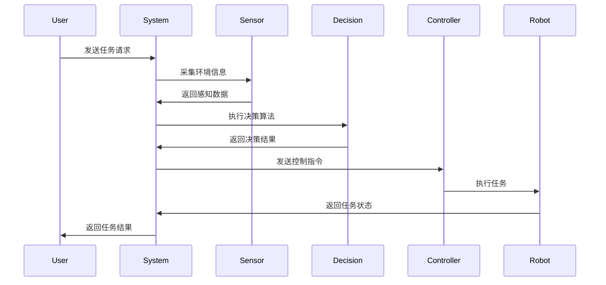

                 

### 文章标题：人机协作2.0：多功能机器人在各行业的部署

#### 关键词：人机协作、多功能机器人、行业应用、系统架构、算法原理

> 摘要：本文深入探讨了人机协作2.0时代下多功能机器人在各行业的应用与部署。首先，我们回顾了人类与机器人的合作现状及其重要性，随后详细介绍了多功能机器人和人机协作2.0的核心概念、技术支撑和区别。接着，我们通过对比分析，探讨了多功能机器人和人机协作2.0的关键技术及其优势与挑战。文章随后通过mermaid图示和数学模型，详细讲解了机器人感知、决策和控制算法以及人机交互、协同和优化算法。然后，我们引入了一个具体的行业应用场景，分析了系统需求、功能设计、架构设计以及接口和交互。接下来，通过一个实际项目案例，我们展示了系统实现、代码应用解读和分析，并对案例进行了详细讲解和剖析。最后，文章总结了最佳实践，展望了未来发展趋势，并提供了注意事项和拓展阅读。

### 第一部分：背景介绍

#### 第1章：问题背景与核心概念

#### 1.1 问题背景

##### 1.1.1 人类与机器人的合作现状

人类与机器人的合作已经历了几个阶段，从早期的自动化生产线到现代的服务机器人和工业机器人，人类与机器人的协作模式逐渐演变。目前，机器人已经广泛参与到工业制造、医疗护理、家庭服务等多个领域，大大提高了生产效率和生活质量。

##### 1.1.2 现代工业与服务业对机器人需求的增长

随着工业4.0和智能制造的推进，现代工业对机器人的需求日益增长。工业机器人能够执行重复性高、劳动强度大的工作，从而提高生产效率和产品质量。同时，服务业对机器人的需求也在增加，尤其是在餐饮、物流和医疗等领域，机器人能够提供高效、精准的服务。

##### 1.1.3 人机协作的概念与重要性

人机协作是指人类与机器人在特定任务中相互配合，共同完成任务的过程。在当前技术环境下，人机协作的重要性不言而喻。通过人机协作，人类能够将自身优势与机器人的计算能力和效率相结合，实现更高水平的任务执行。

#### 1.2 核心概念

##### 1.2.1 多功能机器人的定义与特点

多功能机器人是指能够执行多种任务或适应多种工作环境的机器人。它们通常具备较强的感知能力、决策能力和控制能力，能够根据环境变化和任务需求进行自适应调整。

##### 1.2.2 人机协作2.0的核心理念

人机协作2.0是指基于人工智能和大数据技术的全新人机协作模式。它的核心理念是通过智能算法和数据分析，实现人与机器人之间的无缝协作，提升整体工作效率。

##### 1.2.3 人机协作2.0与传统人机协作的区别

传统人机协作依赖于固定的工作流程和指令执行，而人机协作2.0则更加灵活，能够根据环境和任务需求进行动态调整。此外，人机协作2.0还强调数据共享和智能决策，使得协作过程更加高效和智能。

#### 1.3 边界与外延

##### 1.3.1 人机协作2.0的应用领域

人机协作2.0可以在多个领域得到应用，包括但不限于工业制造、医疗服务、物流配送、家庭服务、农业等。随着技术的进步，未来人机协作2.0的应用领域将不断扩展。

##### 1.3.2 人机协作2.0的技术支撑

人机协作2.0的实现依赖于多种技术，包括人工智能、大数据、云计算、物联网等。这些技术为人机协作提供了强大的计算能力和数据支持，使得协作过程更加智能和高效。

##### 1.3.3 人机协作2.0的挑战与机遇

人机协作2.0面临着一系列挑战，包括技术瓶颈、安全性问题、伦理问题等。但同时，它也带来了巨大的机遇，能够推动各行业实现更高水平的自动化和智能化。

#### 1.4 概念结构与核心要素组成

##### 1.4.1 多功能机器人系统的组成

多功能机器人系统通常包括感知模块、决策模块、控制模块和执行模块。这些模块相互协作，共同完成复杂任务。

##### 1.4.2 人机协作2.0的关键技术

人机协作2.0的关键技术包括智能感知、智能决策、人机交互和协同优化。这些技术为人机协作提供了基础支持。

##### 1.4.3 人机协作2.0的核心要素

人机协作2.0的核心要素包括数据共享、智能决策、人机交互和协作优化。这些要素共同构建了人机协作2.0的生态系统。

#### 1.5 本章小结

本章介绍了人机协作2.0的背景、核心概念、应用领域和技术支撑。通过对人机协作2.0与传统人机协作的对比分析，我们更深入地理解了人机协作2.0的核心理念和优势。本章的讨论为我们后续的分析提供了基础。

### 第二部分：核心概念与联系

#### 2.1 多功能机器人的核心概念与属性特征对比

##### 2.1.1 多功能机器人的定义与分类

多功能机器人是指能够执行多种任务或适应多种工作环境的机器人。根据功能和应用场景，多功能机器人可以分为通用型多功能机器人和专用型多功能机器人。

##### 2.1.2 多功能机器人的主要属性特征对比

| 特性        | 通用型多功能机器人 | 专用型多功能机器人 |
|-------------|--------------------|--------------------|
| 任务多样性   | 较高               | 较低               |
| 灵活性       | 较高               | 较低               |
| 成本         | 较高               | 较低               |
| 精度         | 较高               | 较低               |
| 维护难度     | 较高               | 较低               |

##### 2.1.3 多功能机器人的优势与挑战

多功能机器人的优势在于其能够适应多种任务和环境，提高工作效率。然而，多功能机器人也面临着一些挑战，如成本较高、维护难度大等。

#### 2.2 人机协作2.0的概念联系与对比

##### 2.2.1 人机协作2.0与传统人机协作的联系与区别

人机协作2.0与传统人机协作的联系在于它们都涉及人类与机器人的协作。然而，人机协作2.0在技术实现和协作模式上与传统人机协作存在显著区别。

##### 2.2.2 人机协作2.0的技术支撑与实现方式

人机协作2.0的技术支撑包括人工智能、大数据、云计算、物联网等。这些技术为人机协作提供了强大的计算能力和数据支持。人机协作2.0的实现方式通常是基于智能算法和数据分析，实现人与机器人之间的无缝协作。

##### 2.2.3 人机协作2.0的优势与局限性

人机协作2.0的优势在于其智能决策和自适应调整能力，能够提高协作效率。然而，人机协作2.0也面临着一些局限性，如数据隐私和安全问题等。

#### 2.3 ER实体关系图架构

##### 2.3.1 人机协作系统中的实体与关系

在人机协作系统中，主要实体包括机器人、人类用户、任务和环境。实体之间的关系包括任务的分配、执行和监控等。

##### 2.3.2 人机协作系统的ER图分析

```mermaid
erDiagram
  User ||--|{ Robot }|-- Task
  Robot ||--|{ Environment }|
```

##### 2.3.3 ER图在系统设计与开发中的应用

ER图在系统设计与开发中用于描述系统实体及其关系，有助于明确系统功能和结构，为后续开发提供参考。

#### 2.4 本章小结

本章详细介绍了多功能机器人的核心概念与属性特征对比，分析了人机协作2.0与传统人机协作的联系与区别，并探讨了人机协作系统的ER图架构。通过对这些核心概念和联系的理解，我们能够更好地把握人机协作2.0的核心理念和实现方式。

### 第三部分：算法原理讲解

#### 3.1 多功能机器人算法原理

##### 3.1.1 机器人感知算法

机器人感知算法是实现机器人智能化的基础。常用的感知算法包括视觉感知、听觉感知和触觉感知等。视觉感知算法通常基于图像处理和计算机视觉技术，例如目标检测、图像分割和物体识别等。听觉感知算法则涉及语音识别和音频信号处理技术。触觉感知算法通过传感器获取触觉信息，用于判断物体的材质、形状等属性。

##### 3.1.2 机器人决策算法

机器人决策算法用于根据感知信息和环境状态，选择合适的行动策略。常见的决策算法包括基于规则的决策算法、基于机器学习的决策算法和混合决策算法等。基于规则的决策算法通过预先定义的规则进行决策，适用于规则明确、环境变化较少的场景。基于机器学习的决策算法通过学习历史数据，自动生成决策规则，适用于复杂、多变的环境。混合决策算法结合了规则和机器学习算法的优点，能够在不同场景下灵活应对。

##### 3.1.3 机器人控制算法

机器人控制算法用于实现机器人对执行任务的精确控制。常见的控制算法包括PID控制、模型预测控制和自适应控制等。PID控制算法通过调节比例、积分和微分三个参数，实现系统的稳定控制。模型预测控制算法基于系统模型，预测未来系统的状态，并基于预测结果进行控制。自适应控制算法能够根据环境变化，自动调整控制参数，实现系统的自适应控制。

#### 3.2 人机协作算法原理

##### 3.2.1 人机交互算法

人机交互算法用于实现人类用户与机器人之间的信息交换和互动。常见的人机交互算法包括自然语言处理、图形用户界面和手势识别等。自然语言处理算法通过理解人类语言，实现语音识别和文本分析等功能。图形用户界面算法通过图形界面，提供直观、易用的交互方式。手势识别算法通过摄像头或传感器，捕捉用户的手势，实现手势交互。

##### 3.2.2 人机协同算法

人机协同算法用于实现人类用户与机器人之间的协作任务执行。常见的人机协同算法包括任务分配算法、协同规划和协同控制等。任务分配算法根据人类用户和机器人的能力和偏好，合理分配任务。协同规划算法通过规划机器人行动路径和任务执行顺序，实现高效协作。协同控制算法通过实时调整机器人行动，确保任务顺利完成。

##### 3.2.3 人机协作优化算法

人机协作优化算法用于优化协作效率和效果。常见的人机协作优化算法包括多目标优化、资源分配和调度等。多目标优化算法在多个协作目标之间寻找最优平衡点。资源分配算法根据任务需求和资源限制，合理分配资源。调度算法通过优化任务执行顺序和时间安排，提高协作效率。

#### 3.3 算法mermaid流程图

##### 3.3.1 多功能机器人算法流程图


##### 3.3.2 人机协作算法流程图


##### 3.3.3 算法流程图在实际应用中的案例分析

在实际应用中，算法流程图可以根据具体应用场景进行调整和优化。例如，在智能制造领域，机器人感知算法可以用于识别生产线上的缺陷产品，决策算法根据缺陷类型制定修复策略，控制算法执行修复操作，最终实现产品质量提升。在人机协作领域，人机交互算法可以用于接收用户指令，人机协同算法优化任务分配和执行，人机协作优化算法提高协作效率，实现人机高效协作。

#### 3.4 本章小结

本章详细介绍了多功能机器人和人机协作算法的原理，包括感知、决策、控制和交互算法等。通过mermaid流程图和实际案例分析，我们能够更深入地理解这些算法在实际应用中的作用和效果。

### 第四部分：系统分析与架构设计

#### 4.1 问题场景介绍

##### 4.1.1 行业背景与应用场景

以智能制造行业为例，随着工业4.0和智能制造的推进，企业对自动化和智能化的需求日益增长。多功能机器人能够在生产线上执行多种任务，如装配、搬运、检测等，大大提高了生产效率和产品质量。

##### 4.1.2 系统需求分析

系统需求分析主要包括功能需求、性能需求、可靠性需求和安全需求等。在智能制造领域，多功能机器人系统需要具备以下需求：

1. **功能需求**：能够执行多种生产任务，如装配、搬运、检测等。
2. **性能需求**：具备高精度、高速度、高稳定性等性能指标。
3. **可靠性需求**：能够在复杂、多变的生产环境中稳定运行。
4. **安全需求**：确保人与机器人的协作过程安全无虞。

##### 4.1.3 系统设计目标

系统设计目标主要包括提高生产效率、提升产品质量、降低生产成本和确保安全可靠。通过系统设计，实现以下目标：

1. **提高生产效率**：通过多功能机器人执行多种任务，减少人工干预，提高生产效率。
2. **提升产品质量**：通过精确的感知和控制系统，确保产品在生产过程中的质量稳定。
3. **降低生产成本**：通过自动化和智能化，减少人力成本，提高生产效率。
4. **确保安全可靠**：通过安全监控和预警系统，确保人与机器人的协作过程安全可靠。

#### 4.2 系统功能设计

##### 4.2.1 领域模型mermaid类图

```mermaid
classDiagram
  Robot <<class>> {ID: UniqueID, Type: String, Status: String}
  User <<class>> {ID: UniqueID, Name: String, Role: String}
  Task <<class>> {ID: UniqueID, Description: String, Status: String}
  Environment <<class>> {ID: UniqueID, Type: String, Status: String}

  Robot --|{assigned}| User
  Robot --|{performed}| Task
  Robot --|{influenced}| Environment
```

##### 4.2.2 系统功能模块划分

系统功能模块主要包括感知模块、决策模块、控制模块、执行模块和人机交互模块。每个模块的具体功能如下：

1. **感知模块**：负责获取环境信息和任务状态，包括视觉感知、听觉感知和触觉感知等。
2. **决策模块**：根据感知信息和环境状态，生成任务执行计划，包括路径规划、任务分配等。
3. **控制模块**：根据决策模块生成的计划，对机器人执行任务进行实时控制，确保任务顺利完成。
4. **执行模块**：负责执行具体的任务操作，如装配、搬运、检测等。
5. **人机交互模块**：负责与人类用户进行信息交换和互动，包括语音识别、文本输入和手势识别等。

##### 4.2.3 系统功能实现

系统功能实现主要包括以下步骤：

1. **感知数据采集**：通过传感器获取环境信息和任务状态。
2. **决策算法执行**：根据感知数据和环境状态，执行决策算法生成任务执行计划。
3. **控制算法执行**：根据决策算法生成的计划，执行控制算法对机器人进行实时控制。
4. **任务执行**：机器人根据控制指令执行具体的任务操作。
5. **人机交互**：通过人机交互模块与人类用户进行信息交换和互动，确保协作过程顺畅。

#### 4.3 系统架构设计

##### 4.3.1 系统架构mermaid架构图



##### 4.3.2 系统架构设计与实现

系统架构设计主要包括以下几个方面：

1. **模块划分**：根据系统功能，将系统划分为感知模块、决策模块、控制模块、执行模块和人机交互模块。
2. **数据流设计**：设计系统内部的数据流，确保各个模块之间的数据传递和交互。
3. **硬件选择**：根据系统需求，选择合适的硬件设备，包括传感器、控制器、执行器等。
4. **软件实现**：基于所选硬件，编写相应的软件代码，实现各个模块的功能。
5. **系统集成**：将各个模块集成在一起，形成完整的系统。

##### 4.3.3 系统架构的优势与挑战

系统架构的优势主要包括：

1. **模块化设计**：各个模块独立设计，易于维护和升级。
2. **灵活性**：可以根据具体应用场景，灵活调整模块的功能和配置。
3. **扩展性**：支持新的功能和模块的添加，易于系统扩展。

系统架构的挑战主要包括：

1. **模块间协调**：确保各个模块之间的数据传递和协调。
2. **性能优化**：在保证系统功能的同时，优化系统的性能和效率。
3. **安全性**：确保系统运行过程中的数据安全和信息安全。

#### 4.4 系统接口设计和系统交互

##### 4.4.1 系统接口设计

系统接口设计主要包括内部接口和外部接口。内部接口用于各个模块之间的数据传递和交互，外部接口用于系统与外部设备、系统与其他系统之间的数据交换。

1. **内部接口**：包括感知模块与决策模块之间的数据接口、决策模块与控制模块之间的数据接口等。
2. **外部接口**：包括与传感器、控制器、执行器等硬件设备之间的接口，以及与人类用户、其他系统之间的接口。

##### 4.4.2 系统交互mermaid序列图



##### 4.4.3 系统接口与交互的实际应用

在实际应用中，系统接口和交互设计至关重要。例如，在智能制造领域，系统需要与生产线上的传感器、控制器和执行器等设备进行实时数据交互，确保机器人能够准确执行任务。同时，系统还需要与人类用户进行交互，接收用户指令和反馈，确保人机协作过程的顺畅。

#### 4.5 本章小结

本章介绍了系统分析与架构设计的相关内容，包括问题场景介绍、系统需求分析、系统功能设计、系统架构设计和系统接口与交互设计。通过这些设计，我们能够实现多功能机器人在各行业的部署，提高生产效率和产品质量。

### 第五部分：项目实战

#### 5.1 环境安装

##### 5.1.1 环境准备

在开始项目实战之前，需要准备相应的开发环境和硬件设备。以下是一个典型的环境准备步骤：

1. **硬件设备**：选择合适的机器人硬件，包括控制器、传感器、执行器等。
2. **操作系统**：安装支持机器人开发的操作系统，如Ubuntu 18.04或Windows 10。
3. **编程语言**：安装Python编程环境，包括Python解释器和相关的库。
4. **开发工具**：安装集成开发环境（IDE），如PyCharm或Visual Studio Code。

##### 5.1.2 软件与硬件安装

1. **硬件安装**：
   - 根据硬件设备的用户手册，进行硬件安装和调试。
   - 确保传感器、控制器和执行器等设备能够正常工作。
2. **软件安装**：
   - 安装Python解释器和相关库，如numpy、opencv、tensorflow等。
   - 安装集成开发环境（IDE），并配置相应的开发工具。

##### 5.1.3 驱动安装与调试

1. **驱动安装**：
   - 根据硬件设备的用户手册，下载并安装相应的驱动程序。
   - 确保驱动程序与操作系统兼容。
2. **调试**：
   - 使用开发工具，编写测试程序，测试硬件设备的功能是否正常。
   - 调试过程中，检查程序与硬件设备的通信是否稳定。

#### 5.2 系统核心实现

##### 5.2.1 系统核心模块实现

系统核心模块实现主要包括感知模块、决策模块、控制模块和执行模块。以下是一个简化的实现步骤：

1. **感知模块**：
   - 使用传感器采集环境信息。
   - 对采集到的数据进行处理，提取有用的信息。
   - 将处理后的数据传递给决策模块。

2. **决策模块**：
   - 根据感知模块提供的数据，执行决策算法。
   - 生成任务执行计划，包括路径规划、任务分配等。
   - 将决策结果传递给控制模块。

3. **控制模块**：
   - 根据决策模块生成的计划，对机器人执行任务进行实时控制。
   - 确保机器人按照计划执行任务。

4. **执行模块**：
   - 根据控制模块的指令，执行具体的任务操作。
   - 将任务执行状态反馈给决策模块。

##### 5.2.2 系统核心代码分析

以下是一个简化的系统核心代码示例：

```python
# 感知模块
def sense_environment():
    # 采集环境信息
    data = collect_environment_data()
    # 处理数据
    processed_data = process_data(data)
    return processed_data

# 决策模块
def make_decision(processed_data):
    # 执行决策算法
    plan = decision_algorithm(processed_data)
    return plan

# 控制模块
def control_robot(plan):
    # 实时控制机器人
    execute_plan(plan)

# 执行模块
def execute_task():
    # 执行任务
    task_status = execute_task()
    return task_status
```

##### 5.2.3 系统核心功能测试

1. **功能测试**：
   - 编写测试用例，对系统核心模块的功能进行验证。
   - 确保各个模块能够正常工作，并实现预期的功能。

2. **性能测试**：
   - 对系统核心模块进行性能测试，评估系统的响应速度和处理能力。
   - 调整系统配置，优化性能。

3. **可靠性测试**：
   - 在不同环境下，对系统进行可靠性测试，评估系统的稳定性和抗干扰能力。

#### 5.3 代码应用解读与分析

##### 5.3.1 代码解读

上述代码示例展示了系统核心模块的实现思路。感知模块负责采集和处理环境信息，决策模块根据感知数据生成任务执行计划，控制模块对机器人进行实时控制，执行模块执行具体的任务操作。这些模块通过函数调用来实现协同工作。

##### 5.3.2 应用分析

在实际应用中，系统核心模块需要根据具体任务和场景进行调整和优化。例如，感知模块需要根据不同的传感器选择合适的处理算法，决策模块需要根据任务需求选择合适的算法，控制模块需要根据机器人的性能调整控制策略。

##### 5.3.3 代码优化与改进

1. **优化感知模块**：
   - 提高传感器精度，减少噪声干扰。
   - 使用多传感器融合技术，提高感知数据的准确性。

2. **优化决策模块**：
   - 选择适合任务的算法，提高决策准确性。
   - 考虑实时性和计算资源限制，优化算法效率。

3. **优化控制模块**：
   - 根据机器人的性能特点，调整控制参数，提高控制精度。
   - 使用自适应控制策略，提高系统的自适应能力。

#### 5.4 实际案例分析与详细讲解剖析

##### 5.4.1 案例背景

以智能制造领域的一个实际案例为例，企业希望利用多功能机器人提高生产效率，降低生产成本。具体任务包括装配、搬运和检测等。

##### 5.4.2 案例分析

1. **需求分析**：
   - 装配任务：机器人需要在指定位置装配零部件。
   - 搬运任务：机器人需要将成品从生产线的一端搬运到另一端。
   - 检测任务：机器人需要对成品进行质量检测。

2. **解决方案**：
   - 感知模块：使用摄像头和激光雷达获取生产线上的实时图像和距离信息。
   - 决策模块：根据感知数据，生成装配、搬运和检测任务的执行计划。
   - 控制模块：实时控制机器人执行任务，确保任务顺利完成。

##### 5.4.3 案例讲解剖析

1. **感知模块**：
   - 使用摄像头获取生产线上的实时图像，通过图像处理技术识别零部件的位置和状态。
   - 使用激光雷达获取生产线上的距离信息，用于路径规划和避障。

2. **决策模块**：
   - 根据感知数据，生成装配任务的具体执行步骤，如选择装配工具、确定装配位置等。
   - 根据感知数据，生成搬运任务的具体执行步骤，如选择搬运路径、确定搬运速度等。
   - 根据感知数据，生成检测任务的具体执行步骤，如选择检测方法、确定检测标准等。

3. **控制模块**：
   - 根据决策模块生成的执行计划，实时控制机器人执行任务。
   - 在执行任务过程中，根据环境变化和任务需求，动态调整机器人的动作。

#### 5.5 项目小结

通过实际案例分析和详细讲解剖析，我们展示了多功能机器人在智能制造领域的应用和部署。项目实战中的系统核心实现、代码应用解读和分析，以及实际案例分析与讲解，为我们提供了宝贵的经验和参考。

### 第六部分：最佳实践与拓展阅读

#### 6.1 最佳实践

##### 6.1.1 实践经验分享

在部署多功能机器人时，以下最佳实践经验值得分享：

1. **充分调研**：在部署机器人之前，充分了解各行业的需求和特点，选择适合的机器人型号和解决方案。
2. **系统集成**：确保机器人系统能够与其他系统（如生产管理系统、物流系统等）无缝集成，实现数据共享和协同工作。
3. **安全监控**：建立安全监控机制，确保机器人运行过程中的安全性和可靠性。
4. **人员培训**：对操作人员进行培训，提高他们对机器人的操作和维护能力。

##### 6.1.2 最佳实践总结

最佳实践总结如下：

1. **需求驱动**：根据实际需求，合理规划和部署机器人系统，确保系统能够满足生产需求。
2. **技术选型**：选择适合的技术方案和硬件设备，提高系统的性能和稳定性。
3. **团队协作**：建立跨部门协作机制，确保项目顺利进行，提高项目成功率。
4. **持续优化**：在系统运行过程中，持续收集反馈，优化系统功能和性能。

##### 6.1.3 案例分析与实践应用

通过以下案例分析，我们可以看到最佳实践在具体项目中的应用：

1. **智能制造工厂**：某企业通过部署多功能机器人，实现了生产过程的自动化和智能化，提高了生产效率和产品质量。
2. **医疗领域**：某医院引入多功能机器人，用于病房清洁、药品配送等任务，降低了医务人员的工作强度，提高了服务质量。
3. **物流行业**：某物流公司通过部署多功能机器人，实现了仓库内物资的自动化搬运和分类，提高了物流效率。

#### 6.2 小结

本章总结了多功能机器人在各行业部署的最佳实践经验，并提供了案例分析。通过这些最佳实践，我们可以更好地规划和实施机器人项目，实现高效、智能的协作。

#### 6.3 未来发展趋势与展望

##### 6.3.1 未来发展趋势

1. **智能化**：随着人工智能技术的不断发展，多功能机器人的智能化水平将不断提高，实现更复杂的任务和更灵活的协作。
2. **自主化**：机器人将具备更高的自主决策和规划能力，能够独立完成复杂任务，减少对人类操作人员的依赖。
3. **生态化**：机器人将融入更多的行业和应用场景，形成多元化的生态系统，实现跨行业的协同与整合。

##### 6.3.2 未来展望

未来，多功能机器人将在更多领域发挥重要作用，如智慧城市、金融服务、教育等。随着技术的不断进步，人机协作将更加紧密，人类与机器人将共同创造更加美好和高效的未来。

#### 6.4 注意事项

在部署多功能机器人时，需要注意以下事项：

1. **安全性**：确保机器人运行过程中的安全性和可靠性，避免意外事故的发生。
2. **数据保护**：保护机器人收集和处理的敏感数据，防止数据泄露和滥用。
3. **人员培训**：提高操作人员的技术水平和安全意识，确保他们能够正确、安全地使用机器人。
4. **维护保养**：定期对机器人进行维护和保养，确保其性能和寿命。

#### 6.5 拓展阅读

为了更好地了解多功能机器人和人机协作2.0，以下是几篇值得推荐的拓展阅读：

1. **《智能制造与机器人技术》**：介绍了智能制造和机器人技术的基本概念、发展趋势和应用案例。
2. **《人工智能：一种现代方法》**：详细讲解了人工智能的基本原理和方法，适用于机器人领域的开发人员。
3. **《机器人技术与应用》**：探讨了机器人技术在不同领域的应用，包括工业、医疗、教育等。

### 作者信息

**作者：AI天才研究院/AI Genius Institute & 禅与计算机程序设计艺术 /Zen And The Art of Computer Programming**

