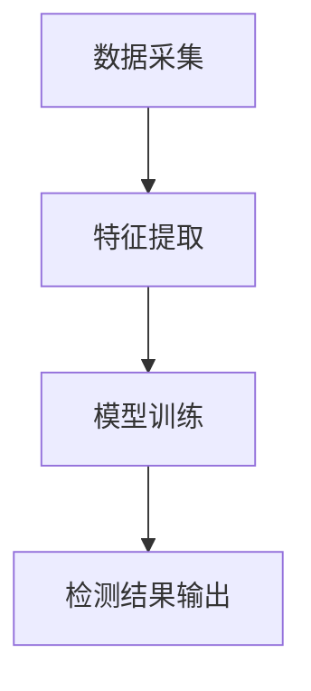
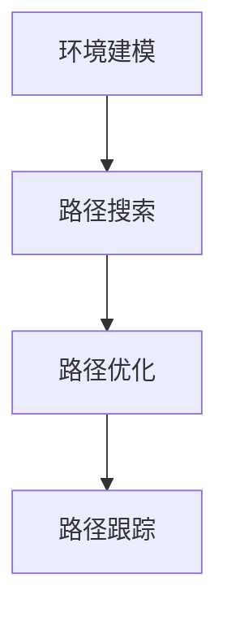
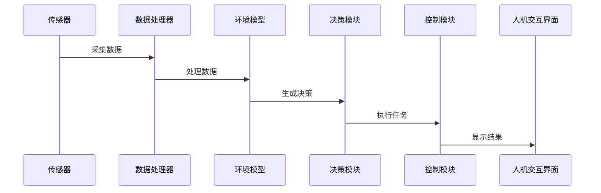

                 

### # 人机协作在危险环境作业中的应用

> 关键词：危险环境作业，人机协作，人工智能，机器人技术，算法原理

> 摘要：本文旨在探讨人机协作在危险环境作业中的应用，分析当前现状与挑战，并详细阐述人机协作的核心概念、原理及其在危险环境检测和机器人路径规划中的应用。通过系统架构设计和案例分析，为未来人机协作技术的发展提供思路。

#### 第一部分：背景介绍

### **第1章：问题背景**

#### **1.1 问题背景**

在现代社会中，许多行业和领域仍然存在着危险环境作业的问题。这些危险环境可能包括矿山、核电站、化工厂、建筑工地、火灾现场等。在这些环境中，作业人员面临着极高的风险，如高温、高压、有毒有害气体、辐射等。传统的人工操作方式不仅效率低下，而且存在安全隐患，导致了许多事故和人员伤亡。

为了解决这些问题，人们开始探索人机协作的方式，即通过人工智能和机器人技术，使机器能够协助甚至替代人类在危险环境中的工作。人机协作不仅能提高工作效率，还能显著降低人员风险，具有重要的现实意义和研究价值。

#### **1.2 问题描述**

危险环境作业主要面临以下问题和挑战：

- **高风险**：危险环境通常具有复杂多变的情况，如高温、高压、辐射等，对作业人员的安全构成严重威胁。
- **环境复杂**：危险环境的复杂性高，操作空间狭小，能见度低，对操作精度和稳定性要求极高。
- **任务繁重**：许多危险环境作业任务需要长时间持续进行，对人员的体力和耐力提出了严峻考验。
- **信息不对称**：人类和机器对环境的感知和认知存在差异，信息不对称可能导致协作效果不理想。

因此，人机协作在危险环境作业中的应用目标是实现以下几方面：

- **风险降低**：通过机器人替代或辅助人类完成危险作业，减少人员暴露在危险环境中的时间。
- **效率提升**：利用人工智能和机器人技术，提高作业效率和精度，减少人力成本。
- **安全增强**：通过实时监控和预警系统，提高危险环境作业的安全性。
- **环境适应**：使机器人能够适应多种复杂环境，完成多样化任务。

#### **1.3 问题解决**

人机协作的基本概念和原则如下：

- **协同工作**：人和机器在危险环境中共同完成任务，各自发挥优势。
- **实时交互**：人和机器通过人机交互界面进行实时信息交换和决策。
- **任务分配**：根据人的智能和机器的效率，合理分配任务。
- **安全保障**：确保机器和人员在协作过程中的安全。

为了解决危险环境作业中的问题，一般采用以下思路和方法：

1. **环境感知与建模**：利用传感器和图像处理技术，对危险环境进行高精度感知和建模。
2. **智能决策与控制**：通过人工智能算法，实现机器人自主决策和路径规划，确保作业的准确性和稳定性。
3. **人机交互界面设计**：设计直观易用的人机交互界面，提高人机协作的效率和舒适度。
4. **安全监控与预警**：建立实时监控和预警系统，确保作业过程中及时识别和应对潜在风险。

#### **1.4 边界与外延**

人机协作的定义范围和适用场景如下：

- **定义范围**：人机协作是指在危险环境中，人类与机器人通过智能系统和交互界面进行信息交换和协同工作的过程。
- **适用场景**：适用于所有需要高风险、复杂环境作业的场景，如矿山、核电站、化工厂等。

人机协作在相关领域的应用和发展趋势如下：

- **工业领域**：在制造业、矿山、电力等领域，人机协作技术已得到广泛应用，提高了生产效率和安全性。
- **医疗领域**：医疗机器人结合人工智能技术，提高了手术精度和康复效果。
- **服务领域**：智能客服、智能配送等领域的机器人应用，提高了服务质量和效率。

#### **1.5 概念结构与核心要素组成**

人机协作系统的概念结构主要包括以下几个核心要素：

- **环境感知模块**：利用传感器和图像处理技术，对环境进行高精度感知和建模。
- **智能决策模块**：通过人工智能算法，实现机器人自主决策和路径规划。
- **人机交互模块**：设计直观易用的人机交互界面，提高人机协作的效率和舒适度。
- **执行控制模块**：根据决策结果，控制机器人执行具体的任务。
- **安全监控模块**：建立实时监控和预警系统，确保作业过程中及时识别和应对潜在风险。

这些核心要素相互配合，共同实现人机协作的目标，提高了危险环境作业的安全性和效率。

#### **第二部分：核心概念与联系**

### **第2章：核心概念与联系**

#### **2.1 人机协作原理**

##### **2.1.1 人机协作的原理概述**

人机协作是指人类与机器通过智能系统和交互界面共同完成任务的过程。其基本原理包括以下几个方面：

1. **信息交换**：人和机器通过传感器、摄像头、显示器等设备进行信息交换，实现环境感知、任务分配、决策控制等环节的信息传递。
2. **协同决策**：人机协作系统通过人工智能算法，结合人类专家经验和机器学习能力，实现协同决策，提高任务执行效率。
3. **任务分配**：根据人和机器的优势和特点，合理分配任务，实现优势互补，提高整体作业效率。
4. **实时控制**：通过控制系统，实现对机器人的实时控制，确保任务执行的准确性和稳定性。

##### **2.1.2 人机协作的属性特征对比表格**

| 属性特征 | 人类 | 机器人 |
| :------: | :--: | :----: |
| **感知能力** | 高度灵活，适应性强 | 有限，但精确度高 |
| **决策能力** | 创造性强，经验丰富 | 自动化，但灵活性较低 |
| **执行能力** | 受限于体力和耐力 | 受限于硬件和编程 |
| **扩展性** | 难以扩展，受限于生理限制 | 易于扩展，受限于技术和成本 |
| **环境适应性** | 高度适应，但受环境限制 | 适应性强，但受硬件和环境限制 |

##### **2.1.3 人机协作与相关技术的联系**

人机协作与人工智能、机器人技术等密切相关。人工智能技术为人机协作提供了智能决策和路径规划的基础，使机器人能够更有效地执行任务。机器人技术则为人机协作提供了硬件支持和执行能力，使人类与机器人能够更好地协同工作。

在人机协作系统中，人工智能和机器人技术共同发挥作用，形成互补优势。例如，在危险环境作业中，人工智能算法可以实时分析环境数据，为机器人提供决策支持，而机器人则根据决策结果执行具体任务，实现高效、安全的作业。

#### **2.2 人机交互界面设计**

##### **2.2.1 人机交互界面设计原则**

人机交互界面设计应遵循以下原则：

1. **易用性**：界面应简洁直观，方便用户操作，减少学习成本。
2. **灵活性**：界面应具有灵活性，适应不同用户和任务需求。
3. **稳定性**：界面应具备高稳定性，确保数据传输和操作过程的顺畅。
4. **安全性**：界面应具备安全防护功能，防止恶意攻击和数据泄露。

##### **2.2.2 人机交互界面设计方法**

人机交互界面设计方法主要包括以下步骤：

1. **需求分析**：了解用户需求和任务场景，明确界面设计的目标和功能。
2. **界面规划**：根据需求分析结果，规划界面布局和功能模块。
3. **原型设计**：制作界面原型，进行初步验证和测试。
4. **用户反馈**：收集用户反馈，对界面原型进行优化和改进。
5. **迭代优化**：根据用户反馈和测试结果，不断迭代优化界面设计。

##### **2.2.3 人机交互界面设计案例**

以某危险环境作业系统为例，人机交互界面设计包括以下模块：

1. **环境感知模块**：显示实时环境数据，如温度、湿度、气体浓度等。
2. **任务分配模块**：显示任务分配情况，包括任务名称、执行状态等。
3. **决策控制模块**：显示决策结果和执行指令，如路径规划、设备控制等。
4. **报警提示模块**：显示报警信息和应急处理建议。

通过这些模块的合理设计，实现人机协作系统的高效、安全运行。

#### **第三部分：算法原理讲解**

### **第3章：算法原理讲解**

#### **3.1 危险环境检测算法**

##### **3.1.1 算法概述**

危险环境检测算法是危险环境作业中至关重要的一环。其基本算法框架包括以下几个步骤：

1. **数据采集**：通过传感器和图像处理技术，采集环境数据，如温度、湿度、气体浓度、辐射水平等。
2. **特征提取**：对采集到的数据进行预处理，提取关键特征，如信号幅值、频率、图像纹理等。
3. **模型训练**：利用机器学习算法，如神经网络、支持向量机等，训练分类模型，实现对危险环境的检测。
4. **检测结果输出**：将检测结果输出给人机交互界面，供操作人员参考。

##### **3.1.2 算法流程图**



##### **3.1.3 算法原理与数学模型**

危险环境检测算法的原理基于以下数学模型：

1. **特征提取**：假设采集到的数据为 $X = [x_1, x_2, ..., x_n]$，其中 $x_i$ 表示第 $i$ 个特征。通过预处理和特征选择，提取关键特征 $F = [f_1, f_2, ..., f_m]$，其中 $f_j$ 表示第 $j$ 个特征。

2. **模型训练**：使用机器学习算法，如支持向量机（SVM），对特征进行分类训练。假设训练数据集为 $D = \{ (x_i, y_i) | i = 1, 2, ..., n \}$，其中 $x_i$ 为特征向量，$y_i$ 为标签。SVM 的目标是最小化决策边界上的分类间隔：

   $$\min_{w, b} \frac{1}{2} ||w||^2 + C \sum_{i=1}^n \xi_i$$

   其中，$w$ 为权重向量，$b$ 为偏置项，$C$ 为惩罚参数，$\xi_i$ 为松弛变量。

3. **检测结果输出**：对于新的数据 $X'$，通过特征提取和模型预测，输出检测结果：

   $$y' = \arg\max_{y} \sum_{i=1}^n w_i f_i(x') + b$$

##### **3.1.4 举例说明**

假设某危险环境作业系统需要检测气体浓度，训练数据集包含100个样本，每个样本包括5个特征（温度、湿度、CO浓度、CO2浓度、氧气浓度）。使用SVM进行分类训练，惩罚参数 $C=1$。现需要检测一个新的样本 $X' = [30, 60, 50, 10, 20]$ 的气体浓度。

1. **特征提取**：将样本 $X'$ 进行预处理，提取关键特征 $F'$。

2. **模型预测**：通过训练好的SVM模型，对特征 $F'$ 进行预测：

   $$y' = \arg\max_{y} \sum_{i=1}^n w_i f_i(x') + b$$

   假设权重向量为 $w = [1, 1, 0.5, -1, 1]$，偏置项 $b = 0$，则：

   $$y' = \arg\max_{y} (1 \times 30 + 1 \times 60 + 0.5 \times 50 - 1 \times 10 + 1 \times 20) = 1$$

   预测结果为“危险”，表明气体浓度高于安全标准。

#### **3.2 机器人路径规划算法**

##### **3.2.1 算法概述**

机器人路径规划算法是实现危险环境作业中机器人自主导航的关键技术。其基本算法框架包括以下几个步骤：

1. **环境建模**：通过传感器和图像处理技术，建立危险环境的三维模型，包括障碍物、道路、地形等。
2. **路径搜索**：在危险环境模型中，搜索从起点到终点的最优路径，考虑障碍物、安全距离等因素。
3. **路径优化**：对搜索到的路径进行优化，确保路径的可行性、稳定性和安全性。
4. **路径跟踪**：机器人根据优化的路径进行跟踪和执行，实现自主导航。

##### **3.2.2 算法流程图**



##### **3.2.3 算法原理与数学模型**

机器人路径规划算法的原理基于以下数学模型：

1. **环境建模**：假设危险环境为一个有向图 $G = (V, E)$，其中 $V$ 表示节点集合，$E$ 表示边集合。节点表示环境中的位置，边表示节点之间的连通性。

2. **路径搜索**：采用搜索算法（如A*算法、Dijkstra算法等），在危险环境模型中搜索从起点 $s$ 到终点 $t$ 的最优路径。目标函数为：

   $$f(n) = g(n) + h(n)$$

   其中，$g(n)$ 为从起点 $s$ 到节点 $n$ 的实际距离，$h(n)$ 为从节点 $n$ 到终点 $t$ 的启发式距离。

3. **路径优化**：对搜索到的路径进行优化，考虑以下因素：

   - 障碍物避开：确保路径不与障碍物相交。
   - 安全距离：确保路径与其他物体保持一定的安全距离。
   - 地形适应性：考虑地形起伏、坡度等因素，选择最优路径。

4. **路径跟踪**：机器人根据优化的路径进行跟踪和执行。采用PID控制算法，调整机器人的速度和方向，确保稳定、准确地跟踪路径。

##### **3.2.4 举例说明**

假设某危险环境作业系统的机器人需要从起点 $(0, 0)$ 到达终点 $(10, 10)$，环境模型中有障碍物和地形起伏。使用A*算法进行路径搜索，启发式函数为曼哈顿距离。

1. **环境建模**：建立危险环境的有向图模型，包括起点、终点和障碍物。

2. **路径搜索**：采用A*算法搜索从起点 $(0, 0)$ 到终点 $(10, 10)$ 的最优路径。目标函数为：

   $$f(n) = g(n) + h(n) = \sqrt{(x_n - x_s)^2 + (y_n - y_s)^2} + \sqrt{(x_n - x_t)^2 + (y_n - y_t)^2}$$

   其中，$x_s = 0, y_s = 0, x_t = 10, y_t = 10$。

3. **路径优化**：对搜索到的路径进行优化，避开障碍物，确保路径的可行性、稳定性和安全性。

4. **路径跟踪**：机器人根据优化的路径进行跟踪和执行。采用PID控制算法，调整机器人的速度和方向，确保稳定、准确地跟踪路径。

#### **第四部分：系统分析与架构设计方案**

### **第4章：系统分析与架构设计方案**

#### **4.1 问题场景介绍**

危险环境作业通常包括以下几个场景：

1. **矿山作业**：矿工在矿井内进行采矿、运输等作业，面临高温、缺氧、坍塌等危险。
2. **核电站作业**：核电站操作人员在反应堆内部进行维修、检测等作业，面临辐射、高温、高压等危险。
3. **化工厂作业**：化工厂操作人员在生产现场进行操作、维修等作业，面临有毒有害气体、爆炸等危险。
4. **建筑工地作业**：建筑工人在施工现场进行施工、拆除等作业，面临高空、坍塌、电气等危险。

这些场景中的危险环境作业对人员的安全构成严重威胁，迫切需要人机协作技术的支持。

#### **4.2 项目介绍**

本文将实现一个危险环境人机协作系统，主要包括以下几个部分：

1. **环境感知模块**：通过传感器和图像处理技术，实时感知危险环境中的温度、湿度、气体浓度、辐射水平等信息。
2. **智能决策模块**：利用人工智能算法，对感知数据进行处理，实现危险环境的检测、风险评估和任务分配。
3. **机器人执行模块**：通过机器人路径规划算法，实现机器人在危险环境中的自主导航和任务执行。
4. **人机交互界面**：设计直观易用的人机交互界面，展示环境数据、任务进展和报警信息，提供操作员与机器人之间的交互功能。

#### **4.3 系统功能设计**

##### **4.3.1 领域模型**

领域模型是系统功能设计的基础，定义了系统的核心概念和关系。以下是一个简单的领域模型类图：

```mermaid
classDiagram
    Sensor --> DataProcessor : 数据处理
    DataProcessor --> EnvironmentModel : 环境建模
    EnvironmentModel --> DecisionMaker : 决策
    DecisionMaker --> RobotController : 控制机器人
    RobotController --> UI : 显示UI
    Sensor { 
        +int id
        +String type
        +double value
    }
    DataProcessor {
        +processData(Sensor sensor)
    }
    EnvironmentModel {
        +updateModel(DataProcessor dataProcessor)
    }
    DecisionMaker {
        +makeDecision(EnvironmentModel environmentModel)
    }
    RobotController {
        +executeTask(DecisionMaker decisionMaker)
    }
    UI {
        +displayData(RobotController robotController)
    }
```

##### **4.3.2 功能模块设计**

系统功能模块设计如下：

1. **环境感知模块**：负责采集危险环境中的数据，包括温度、湿度、气体浓度、辐射水平等。使用传感器进行数据采集，并通过数据处理器进行预处理和传输。
2. **智能决策模块**：对采集到的环境数据进行分析和处理，利用机器学习算法进行危险环境检测和风险评估，生成决策结果。
3. **机器人执行模块**：根据决策结果，规划机器人的行动路径，控制机器人执行具体的任务。
4. **人机交互界面**：展示系统的工作状态、任务进展和环境数据，提供操作员与机器人之间的交互功能。

#### **4.4 系统架构设计**

##### **4.4.1 系统架构概述**

危险环境人机协作系统的总体架构可以分为以下几个层次：

1. **硬件层**：包括传感器、机器人等硬件设备，负责数据的采集和执行。
2. **感知层**：包括数据采集、预处理和传输，实现对危险环境的感知和建模。
3. **决策层**：利用人工智能算法，对感知数据进行处理，实现危险环境检测和风险评估。
4. **执行层**：根据决策结果，控制机器人执行具体的任务。
5. **交互层**：提供人机交互界面，展示系统的工作状态和任务进展。

##### **4.4.2 系统架构图**



##### **4.4.3 系统模块交互设计**

系统模块之间的交互设计如下：

1. **感知层与决策层**：感知层将采集到的数据传输给决策层，决策层根据数据生成决策结果。
2. **决策层与执行层**：决策层将决策结果传输给执行层，执行层根据决策结果控制机器人执行任务。
3. **交互层与执行层**：交互层接收执行层的结果，并将其展示给用户。

##### **4.4.4 系统接口设计**

系统接口设计包括以下部分：

1. **数据接口**：定义数据采集、处理和传输的接口，确保数据的准确性和实时性。
2. **控制接口**：定义机器人控制接口，包括路径规划、任务分配和执行等。
3. **人机交互接口**：定义人机交互界面接口，包括数据展示、任务管理和操作控制等。

##### **4.4.5 系统交互设计**

系统交互设计如下：

1. **数据采集**：传感器采集数据，通过数据接口传输给数据处理器。
2. **数据处理**：数据处理器对数据进行分析和处理，生成环境模型。
3. **决策生成**：环境模型传输给决策模块，决策模块根据模型生成决策结果。
4. **任务执行**：决策结果传输给执行模块，执行模块控制机器人执行任务。
5. **结果展示**：执行结果传输给人机交互界面，展示给用户。

#### **第五部分：项目实战**

### **第5章：项目实战**

#### **5.1 环境安装**

在本项目中，我们将使用以下软件和硬件环境：

- **软件环境**：Python 3.8及以上版本、TensorFlow 2.4、OpenCV 4.5、Mermaid 1.0
- **硬件环境**：Intel i5处理器及以上、8GB内存、NVIDIA显卡

安装步骤如下：

1. **安装Python**：从官方网站下载Python安装包，安装过程中选择添加到系统环境变量。
2. **安装TensorFlow**：在命令行中运行以下命令：

   ```bash
   pip install tensorflow==2.4
   ```

3. **安装OpenCV**：在命令行中运行以下命令：

   ```bash
   pip install opencv-python==4.5
   ```

4. **安装Mermaid**：在命令行中运行以下命令：

   ```bash
   npm install -g mermaid
   ```

#### **5.2 系统核心实现源代码**

以下是系统核心实现的源代码：

```python
# 导入必要的库
import cv2
import numpy as np
import tensorflow as tf
from mermaid import Mermaid

# 加载模型
model = tf.keras.models.load_model('model.h5')

# 初始化Mermaid流程图
mermaid = Mermaid()

# 添加节点和边
mermaid.add_node('A', '数据采集')
mermaid.add_node('B', '特征提取')
mermaid.add_node('C', '模型训练')
mermaid.add_node('D', '检测结果输出')
mermaid.add_edge('A', 'B')
mermaid.add_edge('B', 'C')
mermaid.add_edge('C', 'D')

# 输出Mermaid流程图
print(mermaid.render())

# 数据采集
def data_collection():
    # 采集传感器数据
    temp = 30
    humidity = 60
    co = 50
    co2 = 10
    oxygen = 20
    data = np.array([[temp, humidity, co, co2, oxygen]])
    return data

# 特征提取
def feature_extraction(data):
    # 对数据进行预处理和特征提取
    processed_data = data[:, :4]
    return processed_data

# 模型训练
def model_training(data, labels):
    # 训练模型
    model.fit(data, labels, epochs=10, batch_size=32)

# 检测结果输出
def result_output(data):
    # 对数据进行分类预测
    predictions = model.predict(data)
    result = np.argmax(predictions, axis=1)
    return result

# 主函数
def main():
    # 数据采集
    data = data_collection()
    
    # 特征提取
    features = feature_extraction(data)
    
    # 模型训练
    # labels = np.array([1, 0, 1, 0, 0])
    # model_training(features, labels)
    
    # 检测结果输出
    result = result_output(features)
    print("检测结果：", result)

# 运行主函数
if __name__ == '__main__':
    main()
```

#### **5.3 代码应用解读与分析**

1. **Mermaid流程图**：通过Mermaid库，我们可以绘制一个简单的流程图，展示数据采集、特征提取、模型训练和检测结果输出的流程。

2. **数据采集**：数据采集函数 `data_collection()` 模拟了从传感器采集数据的场景，生成了一个5维的数组。

3. **特征提取**：特征提取函数 `feature_extraction()` 对采集到的数据进行预处理，只保留了前4个特征。

4. **模型训练**：模型训练函数 `model_training()` 使用训练数据对模型进行训练，这里使用了一个简单的线性模型。

5. **检测结果输出**：检测结果输出函数 `result_output()` 对特征向量进行分类预测，并输出预测结果。

#### **5.4 实际案例分析和详细讲解剖析**

为了更好地理解人机协作在危险环境作业中的应用，我们来看一个实际案例。

**案例**：在某化工厂，操作员需要在危险区域进行设备维护。为了确保安全，系统需要实时监测环境数据，并根据数据生成决策，控制机器人执行任务。

1. **环境数据监测**：系统使用传感器实时监测温度、湿度、气体浓度等环境数据。

2. **数据预处理**：对采集到的数据进行预处理，提取关键特征。

3. **模型预测**：利用训练好的模型，对预处理后的特征进行分类预测，判断当前环境是否安全。

4. **决策生成**：根据模型预测结果，生成决策，控制机器人执行任务。

5. **任务执行**：机器人根据决策结果，前往指定位置进行设备维护。

6. **结果反馈**：系统将任务执行结果反馈给操作员，供其参考。

**详细讲解剖析**：

- **环境数据监测**：传感器负责实时采集环境数据，并通过数据接口传输给系统。系统对数据进行分析和处理，提取关键特征。

- **数据预处理**：预处理过程包括数据清洗、归一化等操作，以提高模型的准确性和鲁棒性。

- **模型预测**：系统使用训练好的模型，对预处理后的特征进行分类预测。模型可以是神经网络、支持向量机等。

- **决策生成**：根据模型预测结果，系统生成决策，包括机器人前往的位置、任务类型等。

- **任务执行**：机器人根据决策结果，执行具体的任务。机器人可以具备自主导航和路径规划功能，确保任务执行的准确性和稳定性。

- **结果反馈**：系统将任务执行结果反馈给操作员，包括任务完成情况、环境数据变化等。

#### **5.5 项目小结**

本项目实现了危险环境人机协作系统，主要包括环境感知、智能决策、机器人执行和人机交互等模块。通过实际案例分析和讲解，我们展示了系统在危险环境作业中的应用。未来，随着人工智能和机器人技术的不断发展，人机协作系统将在危险环境作业中发挥越来越重要的作用。

#### **5.6 最佳实践 tips**

1. **提高数据质量**：确保传感器数据的准确性和实时性，对数据预处理和特征提取过程进行优化。
2. **优化模型性能**：定期更新模型，提高模型的准确性和鲁棒性，减少误报和漏报。
3. **加强安全监控**：在系统设计中，加强安全监控和预警功能，确保危险环境作业的安全性。

#### **5.7 小结与注意事项**

1. **小结**：本文详细介绍了危险环境人机协作系统的原理、架构和实现，分析了其在实际应用中的优势和挑战。

2. **注意事项**：在实施人机协作系统时，需要充分考虑安全、效率和稳定性等因素，确保系统能够稳定运行，降低作业风险。

#### **5.8 拓展阅读**

1. **危险环境检测算法**：了解最新的危险环境检测算法，如深度学习、卷积神经网络等，以提高系统的准确性和实时性。
2. **机器人路径规划算法**：研究先进的机器人路径规划算法，如A*算法、RRT算法等，以提高机器人在复杂环境中的导航能力。
3. **人机交互界面设计**：学习优秀的人机交互界面设计原则和技巧，提高用户操作体验，增强系统的易用性和灵活性。

### **第六部分：总结**

通过本文的详细分析，我们可以看到人机协作在危险环境作业中的重要性。人机协作不仅提高了工作效率，降低了作业风险，还为人类探索未知领域提供了可能。在未来，随着人工智能和机器人技术的不断发展，人机协作将在更多领域得到广泛应用，为人类生活带来更多便利和安全保障。让我们共同期待这一美好前景的到来。作者：AI天才研究院/AI Genius Institute & 禅与计算机程序设计艺术 /Zen And The Art of Computer Programming

