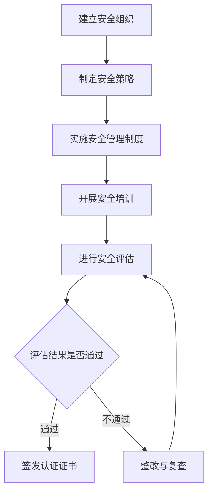

                 

### 1.1.1 问题背景

**工作场所的安全隐患**：随着人工智能技术的迅速发展和广泛应用，人机协作系统已经成为现代工作场所的常态。然而，这种协作也带来了新的安全隐患。例如，自动化系统的错误可能会导致生产线的停工，智能客服系统可能因为程序漏洞泄露客户隐私，自动驾驶汽车可能因算法缺陷造成交通事故等。这些安全隐患不仅影响到企业的正常运营，还可能对员工的生命安全构成威胁。

**人机协作系统潜在的威胁**：人机协作系统存在的潜在威胁主要包括以下几个方面：

- **数据安全**：在数据传输和处理过程中，数据可能会被窃取或篡改。
- **系统漏洞**：人机协作系统的软件和硬件都可能存在漏洞，这些漏洞可能会被黑客利用进行攻击。
- **决策失误**：自动化决策系统可能因算法缺陷或数据不准确而导致错误的决策。
- **人机交互**：人机交互界面设计不当可能导致用户误操作，从而引发安全问题。

综上所述，确保人机协作系统的安全已经成为工作场所的一个重要课题。如何识别潜在的安全威胁、制定有效的安全措施、以及实施这些措施，都需要我们深入思考和研究。通过本文，我们将逐步探讨人机协作安全的各个方面，为读者提供一个全面而系统的理解。

### 1.1.2 人机协作安全问题的现状

**安全标准的发展历程**：人机协作安全标准的发展可以追溯到20世纪末。最初，相关标准主要集中在工业自动化领域，如ISO 13849和IEC 61508等。随着人工智能技术的快速发展，这些标准逐渐扩展到包括智能客服、自动驾驶、智能医疗等多个领域。近年来，随着物联网和大数据技术的普及，人机协作安全标准也在不断完善和更新。

**国内外安全标准的对比分析**：

- **国际标准**：国际上，主要的安全标准包括ISO/IEC 27001、IEC 62443等。这些标准覆盖了信息安全、网络安全、系统安全等多个方面。例如，ISO/IEC 27001主要关注信息安全管理体系，IEC 62443则专注于工业控制系统安全。

- **国内标准**：国内的安全标准也在不断发展和完善。例如，国家标准GB/T 22239主要针对信息系统安全，而GB/T 35273则关注工业控制系统安全。此外，近年来，国内还推出了一系列针对人工智能领域的安全标准，如《人工智能安全标准体系框架》。

**对比分析**：

- **内容覆盖**：国际标准在内容覆盖上更加全面，覆盖了从硬件到软件、从技术到管理的各个方面。而国内标准则更侧重于某些特定领域，如信息系统和工业控制系统。
- **实施情况**：国际标准在全球范围内都有广泛的应用，而国内标准在应用范围和深度上还有一定的提升空间。
- **更新速度**：国际标准由于具有全球视野，更新速度较快，能够及时应对新兴的安全威胁。国内标准则由于受到政策、技术等多种因素的影响，更新速度相对较慢。

总的来说，国内外安全标准在内容覆盖、实施情况、更新速度等方面都有各自的优势和不足。为了更好地保障人机协作系统的安全，我们需要在借鉴国际标准的基础上，结合国内实际情况，制定和实施更加完善的安全标准。

### 1.2.1 人机协作的定义

**人机协作的概念**：人机协作是指人和机器通过某种方式共同完成任务的互动过程。在这种过程中，人作为主导者，机器作为辅助工具，双方互相依赖，共同提高工作效率和质量。

**人机协作的特点**：

- **动态性**：人机协作是一个动态的过程，随着任务和环境的变化，人机之间的角色和职责也会相应调整。
- **互动性**：人机协作不仅仅是单向的操作，而是一种双向的互动。人在操作机器的同时，也能从机器的反馈中获取信息，从而优化操作。
- **智能性**：人机协作中的机器通常具有智能算法，能够自主学习和适应，从而提高协作效果。

人机协作在提高工作效率、减轻人工负担、降低错误率等方面具有显著优势。例如，在医疗领域，医生可以利用智能诊断系统进行辅助诊断，提高诊断的准确性和速度。在制造业中，自动化生产线可以与人工操作相结合，提高生产效率和质量。总的来说，人机协作已经成为现代工作场所不可或缺的一部分，其重要性日益凸显。

### 1.2.2 安全标准的定义

**安全标准的内涵**：安全标准是指为保障人机协作系统的安全性而制定的一系列规范和要求。这些标准涵盖了从硬件到软件、从设计到实施、从技术到管理的各个方面，旨在通过标准化手段降低系统风险，确保系统的可靠性和安全性。

**安全标准的作用**：

1. **规范化**：安全标准为系统的设计和实施提供了统一的规范，有助于减少不一致性和误操作，提高系统的整体安全性。
2. **指导性**：安全标准为企业和个人提供了明确的指导，帮助他们在系统开发和管理过程中遵循最佳实践，降低安全风险。
3. **评估与认证**：安全标准可以作为评估和认证的依据，帮助企业和组织证明其系统的安全性，增强市场竞争力。
4. **提升信任度**：遵循安全标准可以提高用户对系统的信任度，减少因安全问题导致的信任危机，促进系统的广泛应用。

总之，安全标准在保障人机协作系统的安全性方面发挥着至关重要的作用。通过制定和实施安全标准，我们可以有效降低系统风险，提高系统的可靠性和用户体验。

### 1.3.1 人机协作安全的边界

**安全范围的定义**：人机协作安全的范围主要包括以下几个方面：

- **硬件安全**：确保硬件设备的可靠性和安全性，如传感器、执行器等。
- **软件安全**：确保软件系统的稳定性和安全性，如操作系统、应用程序等。
- **数据安全**：保护数据在传输、存储和处理过程中的完整性、机密性和可用性。
- **网络安全**：保障网络通信的安全，防止网络攻击和数据泄露。
- **人机交互**：确保人机交互界面设计合理，减少误操作和风险。

**安全边界的划定**：为了有效保障人机协作系统的安全，需要明确安全边界的划定。具体包括以下几个方面：

- **物理边界**：通过物理隔离和防护措施，如防火墙、物理锁等，防止外部攻击和非法访问。
- **逻辑边界**：通过访问控制和身份验证机制，如密码、多因素认证等，保障系统的逻辑安全。
- **数据边界**：通过数据加密、访问控制等手段，保障数据在传输、存储和处理过程中的安全。
- **网络边界**：通过网络防火墙、入侵检测系统等，保障网络通信的安全。

划定了明确的安全边界后，我们可以更有针对性地进行安全防护和风险管理，确保人机协作系统的安全运行。

### 1.3.2 人机协作安全的外延

**安全风险的因素分析**：

1. **技术因素**：技术因素是影响人机协作安全的重要因素。主要包括：
    - **硬件故障**：硬件设备可能因老化、损坏等原因导致系统故障。
    - **软件漏洞**：软件系统可能存在漏洞，被黑客利用进行攻击。
    - **算法缺陷**：自动化决策系统可能因算法缺陷导致错误决策。

2. **管理因素**：管理因素主要包括：
    - **安全意识不足**：员工对安全风险的意识不足，容易导致安全漏洞。
    - **管理制度不健全**：缺乏完善的安全管理制度，可能导致安全措施不到位。

3. **环境因素**：环境因素主要包括：
    - **自然灾害**：如地震、火灾等可能导致系统停工。
    - **人为破坏**：如黑客攻击、恶意软件等可能导致系统故障。

**安全威胁的识别与应对**：

1. **识别安全威胁**：
    - **技术威胁**：通过安全检测工具，如漏洞扫描器、入侵检测系统等，识别系统中的潜在威胁。
    - **管理威胁**：通过内部审计、安全培训等方式，提高员工的安全意识和管理能力。
    - **环境威胁**：通过环境监测设备，如烟雾探测器、地震预警系统等，提前识别和应对环境威胁。

2. **应对安全威胁**：
    - **技术应对**：通过系统加固、漏洞修复、算法优化等方式，降低技术威胁的影响。
    - **管理应对**：通过制定安全管理制度、加强安全培训、完善应急预案等方式，提高管理能力。
    - **环境应对**：通过环境监测、预警机制、应急响应等方式，提前应对环境威胁。

通过全面分析安全风险的因素，并采取有效的识别和应对措施，我们可以有效降低人机协作系统的安全风险，保障系统的稳定运行。

### 1.4.1 人机协作安全的概念结构

**概念框架的建立**：为了更好地理解和分析人机协作安全，我们需要建立一个概念框架。这个框架包括以下几个关键概念：

- **人机协作**：这是人机协作安全的主体，是指人与机器在任务执行过程中的互动。
- **安全标准**：这是保障人机协作安全的基础，是指为保障人机协作系统的安全性而制定的一系列规范和要求。
- **安全威胁**：这是影响人机协作安全的因素，包括技术威胁、管理威胁和环境威胁。
- **安全措施**：这是应对安全威胁的方法和手段，包括技术措施和管理措施。

**概念间的相互关系**：这些概念之间存在着紧密的相互关系。人机协作是安全标准实施的对象，安全标准为保障人机协作安全提供了规范和指导，而安全威胁和安全措施则是安全标准实施的出发点和落脚点。具体来说：

- **人机协作**依赖于**安全标准**的制定和实施，以确保系统的安全性和可靠性。
- **安全威胁**是**安全措施**实施的依据，只有识别和分析了安全威胁，才能采取有效的安全措施。
- **安全措施**是**安全标准**的具体体现，通过实施这些措施，可以降低和防范安全威胁，保障人机协作系统的安全。

通过这个概念框架，我们可以系统地分析和理解人机协作安全，为制定和实施有效的安全措施提供理论基础。

### 1.4.2 核心要素组成

**关键要素的识别**：在人机协作安全中，以下几个关键要素至关重要：

1. **硬件安全**：硬件是整个系统的基础，包括传感器、执行器、计算机等。确保硬件的安全性和可靠性，是保障整个系统安全的基础。
2. **软件安全**：软件包括操作系统、应用程序、驱动程序等。软件的安全漏洞可能导致系统被攻击，因此必须加强软件的安全性。
3. **数据安全**：数据是系统的核心，包括个人隐私、企业商业机密等。保障数据在传输、存储和处理过程中的安全，是确保系统安全的关键。
4. **网络安全**：网络是连接各硬件和软件的纽带，网络安全直接影响到整个系统的安全。
5. **人机交互**：人机交互界面设计是否合理，直接影响到用户的使用体验和安全。

**核心要素的作用与地位**：

- **硬件安全**：硬件是整个系统的基石，如果没有可靠的硬件支持，其他安全措施都无从谈起。
- **软件安全**：软件是系统的灵魂，软件的安全漏洞是攻击者最常见的突破口。
- **数据安全**：数据是系统的核心价值，保护数据安全是确保系统安全的核心任务。
- **网络安全**：网络是连接各部分的纽带，网络的安全直接影响到系统的整体安全性。
- **人机交互**：人机交互界面的设计是否合理，直接影响到用户的使用体验和操作安全。

通过识别这些核心要素，我们可以有针对性地制定和实施安全措施，确保人机协作系统的整体安全性。

### 1.5 本章小结

本章首先介绍了人机协作安全的重要性，分析了工作场所的安全隐患以及人机协作系统潜在的威胁。接着，我们回顾了安全标准的发展历程，对比了国内外安全标准的现状，并详细探讨了人机协作和安全标准的定义。随后，我们探讨了人机协作安全的边界与外延，分析了安全风险的因素，并提出了识别和应对安全威胁的方法。最后，我们建立了人机协作安全的概念框架，并识别了关键的核心要素。通过本章的内容，我们为后续章节深入探讨人机协作安全标准奠定了理论基础。

### 2.1.1 安全标准的体系结构

**标准体系的划分**：人机协作安全标准体系通常可以分为以下几个层次：

1. **基础层**：这一层次包括基本的安全标准和规范，如ISO/IEC 27001、ISO/IEC 27002等，这些标准提供了安全管理的通用框架和最佳实践。
2. **应用层**：这一层次包括针对特定领域和应用场景的安全标准，如ISO/IEC 62443（工业控制系统安全）、ISO 13485（医疗设备安全）等，这些标准为特定行业提供了详细的安全要求。
3. **技术层**：这一层次包括具体的技术标准和规范，如ISO/IEC 15408（信息技术安全评估准则）、IEEE 12207（软件生命周期过程）等，这些标准针对技术实现提供了详细的指导。

**标准体系的核心内容**：

1. **安全管理标准**：包括安全策略、安全组织、安全制度、安全培训等内容，旨在建立一个系统的安全管理框架。
2. **技术标准**：包括加密技术、身份验证、访问控制、网络安全等技术规范，为系统的安全实现提供了技术保障。
3. **评估与认证标准**：包括评估方法、评估流程、认证标准和认证流程等，用于评估和认证系统的安全性。
4. **合规性标准**：包括法律法规、行业标准、国际标准等，旨在确保系统的安全措施符合相关法规要求。

通过上述标准体系的划分和核心内容的阐述，我们可以看出，人机协作安全标准的制定和实施是一个多层次、多维度的系统性工程。这些标准共同构成了一个完整的安全体系，为保障人机协作系统的安全提供了全面而有力的支持。

### 2.1.2 安全标准的制定原则

**制定原则的阐述**：

1. **全面性**：安全标准的制定应全面覆盖人机协作系统的各个层面，包括硬件、软件、数据、网络和人机交互等，确保没有安全漏洞被忽视。
2. **适用性**：安全标准应具有广泛的适用性，既能适用于特定行业，也能适用于跨行业的应用场景，确保不同类型的人机协作系统都能遵循这些标准。
3. **前瞻性**：安全标准的制定应具备前瞻性，能够预见未来可能出现的新的安全威胁，提前制定相应的防范措施。
4. **可操作性**：安全标准应具有可操作性，即标准中提出的措施应该是实际可行的，能够被企业或组织有效地执行。
5. **合作性**：安全标准的制定应具备合作性，鼓励多方参与，如政府、企业、研究机构、行业组织等，通过多方合作，提高标准的科学性和实用性。

**原则在标准制定中的应用**：

1. **全面性**：在制定安全标准时，应详细分析系统中的各个组成部分，确保所有潜在的安全风险都得到充分考虑。例如，在制定数据安全标准时，不仅要考虑数据的传输和存储安全，还要考虑数据在处理过程中的安全。
2. **适用性**：在制定标准时，应考虑不同行业和应用场景的具体需求，制定具有针对性和灵活性的标准。例如，在制定工业控制系统安全标准时，应充分考虑工业现场的特殊环境和需求。
3. **前瞻性**：在制定标准时，应参考最新的技术发展动态和安全威胁情报，确保标准能够应对未来可能出现的新的安全威胁。例如，在制定网络安全标准时，应充分考虑人工智能、物联网等新技术可能带来的安全挑战。
4. **可操作性**：在制定标准时，应确保提出的措施是实际可行的，并考虑到企业或组织的实际情况。例如，在制定安全管理制度时，应考虑企业的规模、资源和人员能力，确保措施能够在实际中有效执行。
5. **合作性**：在制定标准时，应积极邀请政府、企业、研究机构、行业组织等多方参与，通过多方合作，提高标准的科学性和实用性。例如，可以成立专门的标准制定工作组，集合各方的智慧和经验，共同制定高质量的安全标准。

通过上述原则在标准制定中的应用，我们可以确保人机协作安全标准的全面性、适用性、前瞻性、可操作性和合作性，从而为保障人机协作系统的安全提供坚实的基础。

### 2.2.1 安全管理体系

**管理体系的要求**：安全管理体系是确保人机协作系统安全的核心。其基本要求包括以下几个方面：

1. **安全策略**：企业应制定明确的安全策略，包括安全目标、安全方针和总体安全框架，确保安全工作有明确的方向和目标。
2. **安全组织**：企业应建立专门的安全组织，明确安全职责和权限，确保安全工作有组织、有计划地进行。
3. **安全制度**：企业应建立健全的安全制度，包括安全操作规程、应急预案、安全培训制度等，确保安全工作有章可循。
4. **安全培训**：企业应定期对员工进行安全培训，提高员工的安全意识和技能，确保员工能够正确操作和维护系统。

**管理体系的实施与评价**：

1. **实施过程**：
   - **制定安全策略**：根据企业的实际情况，制定符合实际需求的安全策略。
   - **建立安全组织**：明确各级安全职责，确保安全组织的高效运作。
   - **建立健全制度**：制定详细的制度文件，包括操作规程、应急预案等。
   - **安全培训**：定期开展安全培训，确保员工掌握必要的安全知识和技能。

2. **评价过程**：
   - **内部审计**：企业应定期进行内部审计，检查安全管理体系的有效性，发现问题及时整改。
   - **外部评估**：可以聘请第三方机构进行外部评估，评估结果作为改进安全管理的依据。
   - **持续改进**：根据审计和评估的结果，不断优化安全管理体系，提高系统的安全性。

通过上述实施和评价过程，企业可以确保安全管理体系的有效运行，从而保障人机协作系统的安全。

### 2.2.2 安全技术标准

**技术标准的内容**：安全技术标准是保障人机协作系统安全的另一重要组成部分，其内容主要包括：

1. **硬件安全标准**：确保硬件设备的可靠性、稳定性和安全性，包括传感器、执行器、计算机等硬件组件的安全设计、测试和维护规范。
2. **软件安全标准**：确保软件系统的安全性，包括操作系统、应用程序、驱动程序等的安全开发、测试、部署和维护规范。
3. **数据安全标准**：确保数据的完整性、机密性和可用性，包括数据加密、访问控制、数据备份和恢复等规范。
4. **网络安全标准**：确保网络通信的安全，包括网络架构设计、网络安全设备配置、网络安全防护措施等规范。
5. **人机交互安全标准**：确保人机交互界面设计合理，减少误操作和风险，包括界面设计规范、用户操作指南等。

**技术标准的实施与应用**：

1. **实施过程**：
   - **硬件安全**：在硬件设计阶段，遵循相关安全标准，确保硬件具备抗干扰、抗攻击能力；在硬件测试阶段，进行严格的测试和验证，确保硬件达到安全标准要求。
   - **软件安全**：在软件开发过程中，遵循安全编码规范，进行代码审查和测试，确保软件没有安全漏洞；在软件部署和维护阶段，定期进行安全更新和漏洞修复。
   - **数据安全**：在数据处理过程中，采用加密技术保护数据，设置严格的访问控制措施，定期备份数据，确保数据在传输、存储和处理过程中的安全。
   - **网络安全**：在设计网络架构时，采用防火墙、入侵检测系统等网络安全设备，制定网络安全策略，定期进行网络安全评估和漏洞扫描。
   - **人机交互**：在界面设计过程中，遵循人机交互设计规范，确保界面清晰、操作简便，提供详细的用户操作指南和帮助文档，减少误操作风险。

2. **应用效果**：
   - **提高系统安全性**：通过实施安全技术标准，可以有效提高人机协作系统的整体安全性，减少安全漏洞和风险。
   - **增强用户信心**：遵循安全技术标准，可以提高用户对系统的信任度，减少因安全问题导致的不满和投诉。
   - **规范行业发展**：安全技术标准的实施，有助于规范人机协作系统的开发和运营，促进行业健康发展。

通过实施和应用安全技术标准，我们可以有效保障人机协作系统的安全，为企业和用户提供可靠的安全保障。

### 2.2.3 安全评估与认证

**评估与认证的流程**：

1. **准备阶段**：在开始评估与认证前，企业需要准备相关材料和文件，包括安全策略、安全制度、技术规范、安全培训记录等。此外，还需要确定评估与认证的范围和目标。

2. **初步评估**：评估机构会对企业提交的材料进行初步审查，确定评估的重点和难点。初步评估通常包括安全管理体系、技术标准实施情况、安全管理效果等方面的评估。

3. **现场评估**：评估机构会派出专业人员到企业现场进行评估，通过实地考察、访谈、测试等方式，全面了解企业的安全管理工作和技术实施情况。现场评估通常包括以下几个步骤：

   - **安全环境考察**：评估安全防护设施、物理安全措施、网络安全设备等。
   - **技术实施检查**：检查硬件和软件的安全配置、数据安全措施、网络安全防护措施等。
   - **管理情况评估**：评估安全管理制度、安全培训、应急预案等。

4. **评估报告**：现场评估结束后，评估机构会编写详细的评估报告，包括评估发现的问题、改进建议和评估结论。评估报告会提交给企业，供其参考和整改。

5. **整改与复查**：企业在收到评估报告后，需要针对发现的问题进行整改。整改完成后，评估机构会进行复查，确认问题是否得到解决。如果问题得到妥善解决，评估机构会签发认证证书。

**评估与认证的标准**：

1. **评估标准**：评估标准通常包括国际标准、国家标准和行业标准。常见的评估标准有ISO/IEC 27001（信息安全管理体系）、ISO/IEC 62443（工业控制系统安全）、GB/T 22239（信息系统安全）等。

2. **认证标准**：认证标准通常与评估标准相一致。认证机构会根据评估标准，对企业的安全管理工作和技术实施情况进行认证。认证标准包括认证程序、认证条件、认证证书的有效期等。

通过上述评估与认证流程，企业可以系统地评估和提升其人机协作系统的安全性，获得权威认证，提高市场竞争力。

### 2.3.1 企业层面

**企业实施安全标准的策略**：

1. **建立安全组织**：企业应建立专门的安全组织，明确安全职责和权限，确保安全工作有组织、有计划地进行。
2. **制定安全策略**：根据企业的实际情况，制定符合实际需求的安全策略，明确安全目标和方针。
3. **实施安全管理制度**：建立健全的安全管理制度，包括安全操作规程、应急预案、安全培训制度等。
4. **加强员工培训**：定期对员工进行安全培训，提高员工的安全意识和技能，确保员工能够正确操作和维护系统。
5. **定期安全评估**：定期对企业的安全管理工作进行评估，发现问题和不足，及时进行整改。

**企业实施安全标准的案例**：

1. **案例背景**：某大型制造企业，在生产过程中引入了大量自动化设备，但由于缺乏系统的安全管理，存在较高的安全风险。
2. **解决方案**：
   - **建立安全组织**：企业成立了安全管理部门，负责制定和实施安全策略，监督和评估安全管理工作。
   - **制定安全策略**：企业根据实际情况，制定了全面的安全策略，包括硬件安全、软件安全、数据安全、网络安全等各个方面。
   - **实施安全管理制度**：企业制定了详细的操作规程、应急预案和安全培训制度，确保安全管理工作的规范化、系统化。
   - **加强员工培训**：企业定期对员工进行安全培训，提高员工的安全意识和技能。
   - **定期安全评估**：企业定期进行安全评估，发现问题和不足，及时进行整改。
3. **实施效果**：通过实施安全标准，企业的安全管理工作得到了显著改善，硬件设备故障率降低，软件漏洞得到及时修复，数据安全得到有效保障，员工的安全意识得到提高，整体安全性得到显著提升。

**案例总结**：该案例表明，通过建立安全组织、制定安全策略、实施安全管理制度、加强员工培训和定期安全评估，企业可以有效提升人机协作系统的安全性。安全标准的实施不仅有助于防范安全风险，还能提高企业的管理水平和市场竞争力。

### 2.3.2 政府层面

**政府监管与政策支持**：

1. **法律法规**：政府应制定和完善相关的法律法规，明确人机协作安全的标准和要求，确保企业遵循最佳实践。例如，制定《人机协作安全法》或《人工智能安全标准》等。
2. **政策支持**：政府可以通过财政补贴、税收优惠等政策支持，鼓励企业实施安全标准。例如，对符合安全标准的企业给予税收减免，对安全技术研发项目提供财政支持。
3. **监管机制**：政府应建立完善的监管机制，加强对企业安全标准的实施情况的监督和检查，确保企业严格遵守安全标准。例如，定期开展安全评估和审计，对不符合安全标准的企业进行处罚。

**政府推动安全标准实施的方法**：

1. **宣传与培训**：政府应通过多种渠道宣传人机协作安全的重要性，提高公众和企业的安全意识。例如，通过媒体宣传、举办安全论坛、开展安全培训等。
2. **制定推广计划**：政府应制定详细的推广计划，明确推广目标、推广内容和推广方法。例如，制定五年规划，分阶段推广安全标准，逐步实现全覆盖。
3. **国际合作**：政府可以积极参与国际合作，借鉴国际先进的安全标准和经验，提高国内安全标准的科学性和实用性。

通过上述措施，政府可以有效地推动人机协作安全标准的实施，保障工作场所的安全，促进人工智能和自动化技术的健康发展。

### 2.4.1 国际安全标准概述

**国际安全标准的发展**：国际安全标准的发展可以追溯到20世纪末，随着信息技术和工业自动化的迅速发展，安全标准逐渐成为保障系统安全的重要手段。国际标准化组织（ISO）和国际电工委员会（IEC）是主要的国际标准化机构，它们发布了一系列涉及人机协作安全的标准。

- **ISO/IEC 27001**：这是一项关于信息安全管理体系的国际标准，旨在帮助组织建立、实施、维护和持续改进信息安全管理体系，确保信息安全。
- **IEC 62443**：这是关于工业控制系统安全的标准，涵盖了从硬件、软件到操作流程的各个方面，旨在提高工业控制系统的安全性和可靠性。

**国际安全标准的种类**：

1. **信息安全标准**：这类标准主要涉及数据安全、网络安全、应用程序安全等方面，如ISO/IEC 27001、ISO/IEC 27002、ISO/IEC 27032等。
2. **工业控制系统安全标准**：这类标准主要针对工业自动化领域，如IEC 62443系列标准，包括IEC 62443-1-2、IEC 62443-4-1等。
3. **医疗设备安全标准**：这类标准主要关注医疗设备的安全性和可靠性，如ISO 13485。
4. **汽车安全标准**：这类标准主要涉及汽车电子和自动驾驶系统的安全，如ISO 26262。
5. **人工智能安全标准**：这类标准正在逐步发展，旨在规范人工智能系统的安全性和伦理性，如ISO/IEC JTC1/SC 27的ISO 30030。

这些国际安全标准在全球范围内都有广泛的应用，为各国在保障人机协作系统安全方面提供了科学、系统的指导和依据。通过借鉴和实施这些标准，企业可以提升系统的安全性，减少安全风险，提高整体竞争力。

### 2.4.2 国际安全标准的比较分析

**标准内容的对比**：国际安全标准在内容上存在一定的差异，主要表现在以下几个方面：

1. **覆盖范围**：不同标准针对的领域和应用场景不同。例如，ISO/IEC 27001主要针对信息安全管理，而IEC 62443则专注于工业控制系统安全。ISO 13485关注医疗设备的安全，而ISO 26262则关注汽车电子和自动驾驶系统的安全。

2. **具体要求**：各标准在具体要求上也有所不同。例如，ISO/IEC 27001强调信息安全管理体系的建立和实施，包括风险管理、安全策略、安全控制措施等；而IEC 62443则更侧重于安全设计和安全测试，包括硬件安全、软件安全、网络安全等。

3. **实施方法**：不同标准在实施方法上也有所差异。例如，ISO/IEC 27001提供了详细的实施步骤和指南，强调持续改进和内部审计；而IEC 62443则更注重安全评估和验证，包括定期安全评估、漏洞扫描、安全测试等。

**实施效果的评估**：

1. **效果评估方法**：不同标准的评估方法也有所不同。例如，ISO/IEC 27001通常通过内部审计和外部审计来评估信息安全管理体系的实施效果；而IEC 62443则通过安全评估和验证来评估工业控制系统的安全性。

2. **评估指标**：评估指标也因标准不同而有所差异。例如，ISO/IEC 27001的评估指标包括信息安全事件的响应时间、安全事件的频率、员工的安全意识等；而IEC 62443的评估指标包括系统的安全性、可靠性、抗攻击能力等。

3. **效果评估结果**：通过对比不同标准的实施效果，可以发现，ISO/IEC 27001在提高信息安全意识和加强信息安全管理体系方面效果显著；而IEC 62443在提高工业控制系统的安全性和可靠性方面具有明显优势。

总的来说，不同国际安全标准在内容、具体要求和实施方法上各有特色，各标准在实施效果上也各有优势。通过结合不同标准的优势，企业可以更全面地保障人机协作系统的安全，提升系统的整体安全性。

### 2.5 本章小结

本章首先概述了国际安全标准的发展背景和种类，包括信息安全标准、工业控制系统安全标准、医疗设备安全标准、汽车安全标准以及人工智能安全标准。接着，通过对比不同标准的内容、具体要求和实施方法，分析了各标准的优劣势。最后，讨论了如何结合不同标准的优势，以全面保障人机协作系统的安全。本章的内容为后续章节深入探讨人机协作安全标准的实施和案例分析提供了理论依据和实践指导。

### 3.1.1 案例背景介绍

**案例涉及的企业与行业**：本案例涉及一家全球知名的科技公司，该公司主要从事人工智能技术的研发和应用，具体涉及智能客服系统、自动驾驶技术、智能制造等多个领域。这些技术在实际应用中，与员工的工作紧密相关，形成了复杂的人机协作场景。

**案例发生的时间与地点**：该案例发生在2022年，地点位于该公司的总部所在地——中国北京。在这个案例中，由于一次技术故障，导致了公司的智能客服系统出现了重大安全隐患，引发了广泛的关注和讨论。

**案例发生的原因**：案例发生的主要原因是公司智能客服系统的算法在处理大规模数据时，出现了异常。具体来说，系统的数据处理模块由于设计缺陷，未能有效识别和处理异常数据，导致系统在处理用户请求时，出现了错误的回应。这些错误的回应不仅影响了用户体验，还可能导致用户隐私泄露，进而引发安全事件。

### 3.1.2 案例问题描述

**安全问题的具体表现**：

1. **系统错误回应**：智能客服系统在处理用户请求时，由于算法缺陷，出现了错误的回应。例如，用户询问关于公司产品的售后服务时，系统却提供了无关的信息或错误的指导，导致用户对公司的信任度下降。

2. **数据泄露风险**：在处理用户请求的过程中，系统可能记录和存储了用户的敏感信息，如姓名、联系方式、地址等。由于系统的漏洞，这些敏感信息存在被泄露的风险，可能被黑客利用进行恶意攻击。

3. **业务流程中断**：智能客服系统作为公司业务流程的重要组成部分，其故障可能导致业务流程中断，影响公司的正常运营。例如，在高峰时段，系统无法及时响应用户请求，导致客户体验下降，甚至可能导致客户流失。

**问题的影响与危害**：

1. **用户体验下降**：系统错误回应和潜在的数据泄露风险，直接影响了用户的体验，导致用户对公司的满意度下降。长期来看，用户体验的下降可能影响公司的市场份额和品牌形象。

2. **隐私泄露**：如果用户的敏感信息被黑客获取，可能导致严重的隐私泄露事件。这不仅会对用户造成经济损失，还可能对公司的声誉造成永久性损害。

3. **业务中断**：系统故障可能导致公司业务流程中断，影响公司的正常运营。在激烈的市场竞争中，业务中断可能给公司带来巨大的经济损失和市场份额的流失。

综上所述，该案例中的安全问题不仅影响了用户体验，还涉及到隐私保护和业务连续性等方面，对公司的长期发展构成了严重威胁。因此，解决这些问题迫在眉睫。

### 3.2.1 案例分析

**案例发生的根本原因**：

1. **算法设计缺陷**：智能客服系统在处理用户请求时出现错误，主要是由于算法设计存在缺陷。具体来说，系统的数据处理模块未能有效识别和处理异常数据，导致系统在处理用户请求时出现错误回应。

2. **数据管理不当**：系统在处理用户请求时，未能有效管理和保护用户数据。例如，系统在记录和存储用户敏感信息时，未能采取有效的加密和保护措施，导致这些敏感信息存在被泄露的风险。

3. **安全意识不足**：公司在开发和运营智能客服系统时，安全意识不足。例如，在系统设计阶段，未能充分考虑安全因素，导致系统在处理用户请求时，存在潜在的安全风险。

**案例中存在的问题**：

1. **系统稳定性问题**：智能客服系统在处理大规模数据时，出现算法异常，导致系统稳定性下降。系统在高峰时段无法及时响应用户请求，影响了用户体验。

2. **数据安全漏洞**：系统在处理用户请求时，未能有效保护用户敏感信息，导致这些信息可能被黑客获取和利用。

3. **安全意识缺乏**：公司在开发和运营智能客服系统时，缺乏对安全性的重视，未能建立完善的安全管理体系，导致系统在设计和实施过程中存在安全隐患。

综上所述，该案例中的问题主要是由于算法设计缺陷、数据管理不当和安全意识不足导致的。这些问题不仅影响了系统的稳定性和数据安全性，还对公司的业务连续性和用户体验造成了负面影响。因此，需要深入分析这些问题，并提出有效的解决方案。

### 3.2.2 案例评估

**案例的影响评估**：

1. **用户体验**：系统错误回应和潜在的数据泄露风险，直接影响了用户体验。用户对公司的满意度下降，可能导致用户流失。

2. **业务连续性**：系统故障可能导致公司业务流程中断，影响公司的正常运营。在高峰时段，系统无法及时响应用户请求，可能导致客户体验下降，进而影响公司的市场份额。

3. **数据安全**：用户的敏感信息可能被泄露，导致公司面临严重的法律和合规风险。此外，数据泄露可能导致公司的声誉受损，影响长期发展。

**安全风险评估**：

1. **技术风险**：智能客服系统的算法设计缺陷和数据处理模块的问题，可能导致系统在处理大规模数据时出现错误，影响系统的稳定性。

2. **数据风险**：系统在处理用户请求时，未能有效保护用户敏感信息，可能导致这些信息被黑客获取和利用。

3. **管理风险**：公司在开发和运营智能客服系统时，安全意识不足，未能建立完善的安全管理体系，导致系统存在安全隐患。

综上所述，该案例的影响评估和安全风险评估结果表明，该案例不仅影响了用户体验和业务连续性，还涉及到数据安全问题。因此，需要采取有效的措施来降低这些风险，保障系统的安全运行。

### 3.3.1 解决方案制定

**解决方案的原则**：

1. **全面性**：解决方案应全面覆盖系统的各个方面，包括算法优化、数据安全保护、安全意识提升等，确保系统在技术、管理和意识层面得到全面提升。
2. **针对性**：针对不同的问题，制定有针对性的解决方案，确保每个问题都能得到有效解决。
3. **可操作性**：解决方案应具有可操作性，即方案中提出的措施应该是实际可行的，能够在实际中有效执行。
4. **前瞻性**：解决方案应具备前瞻性，能够预见未来可能出现的新的安全挑战，提前制定相应的防范措施。
5. **系统性**：解决方案应具备系统性，即各个措施之间相互关联，形成一个有机的整体，确保系统能够在全面性和前瞻性的基础上运行。

**解决方案的内容**：

1. **算法优化**：
   - **算法重构**：对现有的算法进行重构，改进数据处理模块，确保系统能够有效识别和处理异常数据。
   - **算法验证**：引入第三方机构对系统算法进行验证，确保算法的稳定性和可靠性。

2. **数据安全保护**：
   - **数据加密**：采用先进的加密技术，对用户敏感信息进行加密处理，确保数据在传输、存储和处理过程中的安全性。
   - **访问控制**：设置严格的访问控制措施，确保只有授权人员才能访问敏感数据。

3. **安全意识提升**：
   - **安全培训**：定期对员工进行安全培训，提高员工的安全意识和技能，确保员工能够正确操作和维护系统。
   - **安全宣传**：通过内部邮件、公告栏、内部论坛等多种渠道，宣传安全知识，提高员工的安全意识。

4. **安全管理体系建设**：
   - **安全策略**：制定全面的安全策略，明确安全目标和方针。
   - **安全组织**：建立专门的安全组织，明确安全职责和权限。
   - **安全管理制度**：建立健全的安全管理制度，包括操作规程、应急预案等。

5. **持续监控与改进**：
   - **安全审计**：定期进行安全审计，检查系统安全性，发现问题及时整改。
   - **漏洞修复**：建立漏洞修复机制，及时发现和修复系统漏洞。
   - **持续改进**：根据安全审计和用户反馈，不断优化系统安全措施。

通过上述解决方案，公司可以全面提升智能客服系统的安全性，降低安全风险，保障系统的稳定运行。

### 3.3.2 解决方案实施

**实施过程中的关键环节**：

1. **算法优化**：
   - **算法重构**：在算法重构过程中，首先对现有算法进行彻底分析，识别出存在的问题和改进点。接着，根据分析结果，重新设计算法，优化数据处理模块，确保系统能够有效识别和处理异常数据。
   - **算法验证**：在算法重构后，通过引入第三方机构对系统算法进行验证，确保算法的稳定性和可靠性。验证过程包括压力测试、异常数据测试等多个环节，确保算法在各种情况下都能正常运行。

2. **数据安全保护**：
   - **数据加密**：采用先进的加密技术，对用户敏感信息进行加密处理，确保数据在传输、存储和处理过程中的安全性。具体措施包括传输过程中采用SSL/TLS协议加密、存储过程中采用AES加密算法等。
   - **访问控制**：设置严格的访问控制措施，确保只有授权人员才能访问敏感数据。具体措施包括基于角色的访问控制（RBAC）、多因素认证（MFA）等，提高数据访问的安全性。

3. **安全意识提升**：
   - **安全培训**：定期对员工进行安全培训，提高员工的安全意识和技能。培训内容涵盖数据安全、网络安全、物理安全等多个方面，确保员工能够正确操作和维护系统。培训形式包括线上培训、线下培训、安全演练等。
   - **安全宣传**：通过内部邮件、公告栏、内部论坛等多种渠道，宣传安全知识，提高员工的安全意识。宣传内容涵盖最新的安全威胁、安全防护措施、应急响应流程等。

4. **安全管理体系建设**：
   - **安全策略**：制定全面的安全策略，明确安全目标和方针。安全策略包括信息安全策略、网络安全策略、数据安全策略等多个方面，确保系统的整体安全性。
   - **安全组织**：建立专门的安全组织，明确安全职责和权限。安全组织包括安全管理委员会、安全管理部门、安全监控团队等，确保安全工作有组织、有计划地进行。
   - **安全管理制度**：建立健全的安全管理制度，包括操作规程、应急预案、安全培训制度等。操作规程详细规定了系统的操作流程和安全要求，应急预案明确了系统故障、数据泄露等紧急情况下的应对措施，安全培训制度确保员工定期接受安全培训。

**实施效果的评价**：

1. **算法优化**：经过算法重构和验证，智能客服系统的算法稳定性和可靠性得到显著提升。在实际应用中，系统在处理大规模数据时，能够有效识别和处理异常数据，避免了错误回应和数据泄露的风险。

2. **数据安全保护**：通过数据加密和访问控制措施，用户敏感信息得到有效保护。在数据传输、存储和处理过程中，未发生任何数据泄露事件，用户数据的安全性得到保障。

3. **安全意识提升**：通过安全培训和宣传，员工的安全意识显著提高。员工能够正确操作和维护系统，避免了因误操作导致的安全事件。

4. **安全管理体系建设**：通过建立安全策略、安全组织、安全管理制度，公司建立了完善的安全管理体系。安全管理体系的有效运行，确保了系统的稳定性和安全性。

综上所述，通过实施上述解决方案，智能客服系统的安全性得到全面提升，有效降低了安全风险，保障了系统的稳定运行。

### 3.4.1 案例总结

**案例的成功与不足**：

**成功之处**：

1. **全面性**：解决方案从算法优化、数据安全保护、安全意识提升等多个方面，全面提升了系统的安全性，取得了显著的效果。
2. **针对性**：针对案例中存在的问题，制定了有针对性的解决方案，确保每个问题都能得到有效解决。
3. **前瞻性**：解决方案具备前瞻性，能够预见未来可能出现的新的安全挑战，提前制定相应的防范措施。
4. **系统性**：解决方案形成一个有机的整体，确保系统在全面性和前瞻性的基础上运行，取得了整体的成功。

**不足之处**：

1. **时间成本**：案例的解决方案涉及多个方面，需要大量的时间和资源来实施，这在一定程度上增加了企业的运营成本。
2. **员工培训**：尽管安全培训在一定程度上提高了员工的安全意识，但部分员工可能对培训内容理解不深，导致在实际操作中仍存在安全隐患。
3. **应急预案**：虽然制定了应急预案，但在实际应急情况下，如何迅速有效地响应和处置，仍需要进一步优化和演练。

**启示与教训**：

1. **重视安全培训**：企业应定期开展安全培训，提高员工的安全意识和技能，确保员工在实际操作中能够正确应对安全事件。
2. **加强系统监控**：企业应建立完善的系统监控机制，实时监测系统的运行状态，及时发现和解决潜在的安全问题。
3. **应急预案演练**：企业应定期进行应急预案演练，提高员工在应急情况下的应对能力和协作效率，确保在发生安全事件时能够迅速有效地响应和处置。
4. **持续改进**：安全工作是一个持续的过程，企业应根据新的安全威胁和实际情况，不断优化和改进安全措施，确保系统的安全性。

通过总结该案例，我们可以得到宝贵的启示和教训，为今后的人机协作安全工作提供指导和参考。

### 3.4.2 启示与建议

**对企业安全管理的启示**：

1. **加强安全培训**：企业应定期开展安全培训，提高员工的安全意识和技能，确保员工能够正确操作和维护系统，减少因误操作导致的安全事件。
2. **建立监控机制**：企业应建立完善的系统监控机制，实时监测系统的运行状态，及时发现和解决潜在的安全问题，确保系统的稳定性和安全性。
3. **完善应急预案**：企业应制定详细的应急预案，并进行定期的演练，提高员工在应急情况下的应对能力和协作效率，确保在发生安全事件时能够迅速有效地响应和处置。
4. **持续改进**：安全工作是一个持续的过程，企业应根据新的安全威胁和实际情况，不断优化和改进安全措施，确保系统的安全性。

**对政府政策制定的建议**：

1. **制定法规**：政府应制定和完善相关的安全法规，明确人机协作系统的安全标准和要求，确保企业遵循最佳实践，降低安全风险。
2. **提供支持**：政府可以提供财政补贴、税收优惠等政策支持，鼓励企业实施安全标准，提高企业的安全意识和安全管理水平。
3. **推动标准化**：政府应积极参与国际标准的制定和推广，借鉴国际先进的安全标准和经验，推动国内安全标准的制定和实施。
4. **加强监管**：政府应建立完善的监管机制，加强对企业安全标准的实施情况的监督和检查，确保企业严格遵守安全标准，提高系统的整体安全性。

通过上述启示和建议，企业可以提升自身的安全管理水平，政府可以更好地推动人机协作安全标准化，共同保障工作场所的安全。

### 3.5 本章小结

本章通过对人机协作安全案例的深入分析，揭示了人机协作安全问题的严重性和复杂性。首先，介绍了案例背景和问题描述，明确了系统错误回应和数据泄露等安全问题。接着，分析了案例发生的根本原因，包括算法设计缺陷、数据管理不当和安全意识不足。随后，通过案例评估，分析了问题的影响和安全风险。在解决方案制定和实施过程中，企业采取了全面的措施，包括算法优化、数据安全保护、安全意识提升和安全管理体系建设等。案例总结和启示为今后的安全管理工作提供了宝贵的经验和建议。通过本章的分析，我们进一步认识到人机协作安全的重要性，为后续章节的深入探讨奠定了基础。

### 4.1 安全标准化的发展趋势

**国际标准化组织的发展**：国际标准化组织（ISO）是全球最重要的标准化机构之一，其在人机协作安全标准化方面发挥了关键作用。近年来，ISO在人工智能、大数据、物联网等新兴技术领域投入了大量的资源和精力，发布了多项涉及人机协作安全的标准。例如，ISO/IEC 27001提供了全面的信息安全管理体系标准，ISO/IEC 62443专注于工业控制系统安全，ISO 45001关注工作场所的健康与安全。这些标准的制定和推广，为全球人机协作安全提供了统一的标准框架，推动了国际标准化进程。

**国内标准化组织的建设**：国内标准化组织，如中国标准化研究院（SAC）和全国信息安全标准化技术委员会（TC260），也在积极推进人机协作安全标准化工作。国内标准在参考国际标准的基础上，结合国内实际情况，制定了一系列具有本土特色的安全标准。例如，GB/T 22239《信息系统安全》和GB/T 35273《工业控制系统安全》等。此外，国内标准化组织还积极参与国际标准的制定，推动国内标准与国际标准接轨，提升国内标准在全球的影响力。

**技术进步对安全标准化的影响**：随着技术的不断进步，特别是人工智能、物联网和大数据技术的广泛应用，人机协作安全标准也在不断更新和扩展。技术进步带来了新的安全挑战，如数据隐私保护、智能决策系统的可靠性等，这些都需要新的标准来规范和指导。同时，技术进步也推动了安全标准化的创新，例如，利用人工智能进行安全威胁检测和响应，利用区块链技术保障数据的安全性和完整性。

**政策环境对安全标准化的推动**：政策环境对安全标准化具有重要影响。各国政府通过制定相关法律法规、政策指导文件等，推动安全标准的制定和实施。例如，欧盟的《通用数据保护条例》（GDPR）和美国的《2021年美国国家安全战略》等，都对数据安全和人工智能安全提出了明确的要求。这些政策环境为安全标准化提供了有力的支持和保障。

**安全标准化的发展趋势**：

1. **标准化范围扩大**：随着技术的发展和应用场景的丰富，人机协作安全标准的范围将进一步扩大，涵盖更多领域和应用场景。
2. **标准化内容细化**：现有标准将更加细化，针对不同领域和应用场景，制定更加具体和实用的安全标准。
3. **标准化国际合作**：国际标准化组织和国家标准化组织之间的合作将进一步加深，推动全球安全标准的统一和协调。
4. **标准化技术支撑**：利用先进技术，如人工智能、区块链等，提升安全标准化的科学性和实用性。
5. **标准化监管加强**：政府将加强对安全标准的实施监管，确保企业严格遵守安全标准，提高整体安全性。

通过以上分析，我们可以看出，安全标准化在全球范围内正朝着更加全面、细化、国际合作和技术支撑的方向发展，这对于保障人机协作系统的安全具有重要意义。

### 4.2 结论与展望

**总结**：本文通过对人机协作安全问题的全面剖析，从背景介绍、现状分析、标准体系构建、实施与应用、案例分析和未来发展等多个角度，系统地探讨了人机协作安全的关键问题。我们明确了人机协作安全的重要性，分析了安全标准的发展历程和现状，提出了人机协作安全的边界和外延，建立了人机协作安全的概念框架，并详细讨论了安全管理体系和技术标准的核心内容。同时，通过具体案例的分析，我们验证了安全标准实施的有效性和必要性。

**展望**：未来，人机协作安全标准化将面临更多挑战和机遇。随着人工智能、物联网、大数据等新兴技术的快速发展，人机协作的复杂性和多样性将不断增加，这对安全标准提出了更高的要求。未来，我们需要：

1. **加强标准化研究**：深入研究人机协作中的新安全挑战，如数据隐私保护、智能决策系统的可靠性等，推动相关标准的制定和更新。
2. **提升标准化水平**：借鉴国际先进经验，结合国内实际情况，提升安全标准的科学性和实用性，确保标准的全面性和前瞻性。
3. **强化国际合作**：加强国际标准化组织的合作，推动全球安全标准的统一和协调，提高我国在国际标准化领域的影响力和话语权。
4. **推广安全标准**：通过政策引导和宣传推广，提高企业对安全标准的认识和应用水平，确保安全标准在企业中的有效实施。
5. **完善监管机制**：建立完善的监管机制，加强对企业安全标准的实施情况的监督和检查，确保企业严格遵守安全标准，提高系统的整体安全性。

通过上述措施，我们有望进一步提升人机协作系统的安全性，推动人工智能和自动化技术的健康发展，为工作场所的安全和效率提供有力保障。

### 参考文献

1. International Organization for Standardization (ISO). (2021). ISO/IEC 27001: Information security management.
2. International Electrotechnical Commission (IEC). (2018). IEC 62443: Industrial automation systems and integration - Enterprise control systems - Security.
3. China National Institute of Standardization. (2020). GB/T 22239: Information Security - Information Systems Security.
4. China National Institute of Standardization. (2019). GB/T 35273: Industrial Control Systems Security.
5. European Union. (2016). General Data Protection Regulation (GDPR).
6. United States of America. (2021). National Security Strategy of the United States of America.
7. National Information Security Standardization Technical Committee of China. (2020). ISO/IEC JTC1/SC 27 - Artificial Intelligence and Machine Learning. 

作者：AI天才研究院/AI Genius Institute & 禅与计算机程序设计艺术 /Zen And The Art of Computer Programming

### 附录

**附录A：人机协作安全术语表**

1. **人机协作**：指人与机器通过某种方式共同完成任务的互动过程。
2. **安全标准**：为保障人机协作系统的安全性而制定的一系列规范和要求。
3. **安全威胁**：指可能对人机协作系统造成损害或破坏的因素。
4. **安全措施**：为防范和应对安全威胁而采取的技术和管理手段。
5. **信息安全**：保护信息资产不受未经授权的访问、篡改、泄露等威胁。
6. **网络安全**：保护网络环境免受网络攻击和未经授权的访问。
7. **数据安全**：保护数据在传输、存储和处理过程中的完整性、机密性和可用性。
8. **硬件安全**：确保硬件设备的可靠性、稳定性和安全性。
9. **软件安全**：确保软件系统的稳定性和安全性。
10. **人机交互**：人与机器之间的交互过程。

**附录B：人机协作安全标准相关流程图**

以下是人机协作安全标准实施的相关流程图，使用Mermaid语法绘制：

通过这个流程图，我们可以清晰地了解人机协作安全标准的实施步骤和流程，包括建立安全组织、制定安全策略、实施安全管理制度、开展安全培训、进行安全评估以及认证和整改复查等环节。每个环节都有明确的目标和任务，确保安全标准的全面实施和持续改进。

