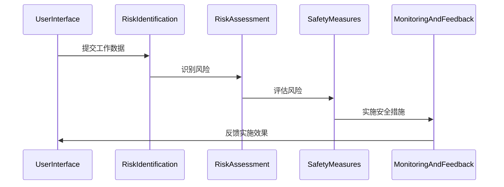

                 

# 第一部分: 引言

## 1.1 人机协作安全的重要性

### 1.1.1 人机协作的现状

在当今快速发展的科技时代，人工智能和机器人技术的应用日益广泛，人机协作成为了一种必然趋势。从工业生产线上的自动化机器人，到家庭中的智能助手，再到医疗、教育和军事等领域的应用，人工智能与人类的工作和生活已经密不可分。这种协同工作模式不仅提高了生产效率，也带来了许多新的工作机会和生活方式。

然而，随着机器人在各种工作场所中的广泛应用，安全问题逐渐引起了广泛关注。人机协作安全不仅关系到机器人的正常运行，更直接关系到人类的生命财产安全。因此，研究并制定一套全面、科学的人机协作安全标准，成为当前人工智能和机器人技术发展的重要课题。

### 1.1.2 安全在协同工作中的角色

在人与机器人的协同工作中，安全起着至关重要的作用。它不仅是确保机器人可靠性和稳定性的基础，也是保障人类工作环境安全的核心。具体来说，安全在协同工作中的角色包括以下几个方面：

1. **预防事故发生**：通过制定安全标准和规范，降低机器人在工作过程中发生意外事故的风险。
2. **保障人员安全**：确保人类工作人员在操作和使用机器人时不会受到伤害，提高工作人员的安全意识和自我保护能力。
3. **维护设备稳定**：通过安全措施确保机器人设备的正常运行，减少设备故障对工作流程的影响。
4. **数据安全保护**：保护机器人和人类协同工作过程中涉及的数据安全，防止数据泄露和滥用。

### 1.1.3 机器人工作场所安全的发展趋势

随着人工智能技术的不断进步，机器人工作场所的安全性也在逐步提高。未来，机器人工作场所安全的发展趋势主要体现在以下几个方面：

1. **智能安全监测与预警**：通过人工智能技术，实现对机器人工作状态的实时监测，及时发现并预警潜在的安全隐患。
2. **个性化安全设计**：根据不同工作场所和任务需求，定制化设计机器人的安全防护措施，提高安全适配性。
3. **人机交互优化**：通过改进人机交互界面和交互方式，降低操作难度，提高安全性和易用性。
4. **安全标准化与法规建设**：加强机器人工作场所安全的标准化和法规建设，推动相关法律法规的完善和实施。

## 1.2 核心概念

### 1.2.1 人机协作安全标准

人机协作安全标准是指为保障人与机器人在工作过程中的安全，制定的一系列规范和标准。这些标准涵盖了从设计、制造、安装到使用等各个环节，旨在确保机器人在各种工作环境中的安全性和可靠性。

### 1.2.2 风险评估

风险评估是指对机器人工作场所的安全风险进行识别、评估和管理的全过程。通过风险评估，可以明确机器人在工作过程中可能面临的各种安全风险，并采取相应的措施进行防范和降低风险。

### 1.2.3 机器人的工作场所安全要求

机器人的工作场所安全要求包括硬件设备和软件系统的安全要求。硬件方面，要求机器人具备良好的防护措施，如防撞、防水、防火等。软件方面，要求机器人具备安全认证、访问控制、数据加密等功能，确保工作过程中的信息安全。

### 1.2.4 ER实体关系图

ER实体关系图是用于描述人与机器人协同工作过程中涉及的各个实体及其之间关系的图形化工具。通过ER实体关系图，可以清晰地展现人机协作的复杂关系，有助于分析和设计安全标准。

## 1.3 概念联系

在人与机器人的协同工作中，人机协作安全标准、风险评估和机器人的工作场所安全要求是相互关联的。通过制定详细的人机协作安全标准，可以明确机器人在工作过程中的安全要求和防护措施。而风险评估则是对这些标准和措施进行检验和验证的过程。同时，机器人的工作场所安全要求为人机协作安全提供了具体的实施指南。

### 1.3.1 人机协作安全标准与风险评估

人机协作安全标准是风险评估的基础，为风险评估提供了明确的评价标准和依据。通过风险评估，可以检验人机协作安全标准的有效性和适用性，发现并解决潜在的安全隐患。

### 1.3.2 人机协作安全标准与机器人的工作场所安全要求

人机协作安全标准为机器人的工作场所安全要求提供了理论依据和指导方向。而机器人的工作场所安全要求则为人机协作安全标准的实施提供了具体的技术规范和操作指南。

### 1.3.3 风险评估与机器人的工作场所安全要求

风险评估可以帮助明确机器人在工作场所中面临的安全风险，为制定和实施机器人的工作场所安全要求提供依据。同时，机器人的工作场所安全要求可以指导风险评估的过程，确保风险评估的全面性和准确性。

通过以上分析，我们可以看出，人机协作安全标准、风险评估和机器人的工作场所安全要求在人与机器人的协同工作中起着相互支持、相互促进的作用，共同构建了一个安全、高效、可靠的人机协作体系。

----------------------------------------------------------------

### 1.4 算法原理讲解

在人与机器人的协同工作中，算法设计是确保系统安全性和可靠性的关键。为了更好地理解人机协作安全标准，我们将通过一个简单的算法流程图和Python源代码，详细讲解算法原理。

#### 1.4.1 算法流程图

首先，我们使用Mermaid工具绘制一个简单的算法流程图，该算法流程图用于评估机器人工作场所的安全风险。

```mermaid
graph LR
A[初始化] --> B[收集数据]
B --> C{风险识别}
C -->|是| D[风险分类]
C -->|否| E[数据清洗]
D --> F[风险评分]
F --> G[安全措施]
E --> F
G --> H[执行措施]
H --> I[监测效果]
I --> J{结束条件}
J --> A|否|
J --> H|是|
```

#### 1.4.2 Python源代码

接下来，我们通过Python源代码详细阐述算法原理。以下是一个简化版的Python实现，用于对机器人工作场所的安全风险进行初步评估。

```python
import pandas as pd

def initialize():
    # 初始化数据集
    data = pd.read_csv('robot_workplace_data.csv')
    return data

def collect_data(data):
    # 收集机器人工作场所的数据
    return data

def risk_identification(data):
    # 风险识别
    risks = data[data['is_risk'] == True]
    return risks

def risk_classification(risks):
    # 风险分类
    classified_risks = risks.groupby('risk_type').count()
    return classified_risks

def risk_scoring(classified_risks):
    # 风险评分
    scored_risks = classified_risks.multiply([3, 2, 1], axis=0)
    return scored_risks

def safety_measures(scored_risks):
    # 安全措施
    measures = {}
    for risk in scored_risks.index:
        if risk['score'] >= 3:
            measures[risk] = '高风险，需立即采取措施'
        elif risk['score'] >= 2:
            measures[risk] = '中风险，需加强监控'
        else:
            measures[risk] = '低风险，保持现状'
    return measures

def monitor_effects(measures):
    # 监测效果
    feedback = input("请输入安全措施实施后的效果（满意/不满意）：")
    return feedback

def main():
    data = initialize()
    data = collect_data(data)
    risks = risk_identification(data)
    classified_risks = risk_classification(risks)
    scored_risks = risk_scoring(classified_risks)
    measures = safety_measures(scored_risks)
    feedback = monitor_effects(measures)
    if feedback == '不满意':
        print("请重新评估风险并调整安全措施。")
    else:
        print("安全措施实施满意，系统继续运行。")

if __name__ == "__main__":
    main()
```

#### 1.4.3 算法原理详解

1. **初始化数据集**：首先，我们初始化一个包含机器人工作场所安全数据的CSV文件。这个数据集包含了机器人的工作状态、风险类型等信息。

2. **数据收集**：接着，我们从CSV文件中收集数据，以便进行后续的风险识别和评估。

3. **风险识别**：通过检查数据集中的“is_risk”字段，识别出潜在的安全风险。这些风险数据将被用于进一步的风险分类和评分。

4. **风险分类**：对识别出的风险进行分类，统计每种风险类型的数量，以便进行风险评分。

5. **风险评分**：根据分类结果，对每种风险类型进行评分。评分标准可以是基于风险类型和风险程度的权重计算得出。

6. **安全措施**：根据风险评分结果，制定相应的安全措施。对于高风险，需要立即采取紧急措施；对于中风险，需要加强监控；对于低风险，则保持现状。

7. **监测效果**：最后，我们监测安全措施的实施效果，并根据用户反馈进行调整。如果用户反馈不满意，系统将重新评估风险并调整安全措施。

通过这个简单的算法示例，我们可以看到，算法在确保机器人工作场所安全中的关键作用。它通过逐步分析和处理数据，为决策提供科学依据，从而实现人机协作安全。

### 1.4.4 数学公式与LaTeX

在算法设计过程中，我们经常需要使用数学公式来描述算法的原理和计算方法。以下是一个简单的LaTeX数学公式示例，用于描述风险评分的计算过程：

$$
风险评分 = 权重 \times 风险类型 \times 风险程度
$$

在实际应用中，我们可以根据具体需求和数据特性调整权重和计算方法，以提高算法的准确性和适用性。

通过使用LaTeX格式，我们可以将复杂的数学公式嵌入到文档中，使得算法原理更加清晰易懂。

----------------------------------------------------------------

### 1.5 系统分析与架构设计方案

在《人机协作安全：多功能机器人的工作场所安全标准》的研究过程中，我们需要对系统的各个方面进行详细的分析和设计。本章节将介绍系统的背景、功能设计、系统架构设计、系统接口设计以及系统交互。

#### 1.5.1 系统背景

随着人工智能和机器人技术的不断发展，多功能机器人在各种工作场所中的应用越来越广泛。这些机器人不仅能够执行传统的重复性任务，还能在复杂环境中进行智能决策和协同工作。然而，随着机器人应用范围的扩大，安全问题也日益凸显。因此，设计一个高效、可靠的人机协作安全系统变得至关重要。

#### 1.5.2 系统功能设计

系统功能设计是系统架构设计的重要基础。为了确保多功能机器人在工作场所中的安全，我们的系统将包含以下主要功能模块：

1. **风险识别模块**：负责收集并分析机器人工作场所的数据，识别潜在的安全风险。
2. **风险评估模块**：对识别出的风险进行分类和评分，提供风险评估报告。
3. **安全措施模块**：根据风险评估结果，制定并实施相应的安全措施。
4. **监控与反馈模块**：实时监控安全措施的实施效果，并根据用户反馈进行调整。
5. **数据管理模块**：负责存储和管理系统运行过程中产生的各种数据，包括风险数据、安全措施数据等。

#### 1.5.3 系统架构设计

系统架构设计是确保系统功能实现和安全性的关键。我们的系统架构采用分层设计，包括数据层、逻辑层和界面层。以下是系统架构的Mermaid类图：

```mermaid
classDiagram
    RiskIdentification <<interface>>
    RiskAssessment <<interface>>
    SafetyMeasures <<interface>>
    MonitoringAndFeedback <<interface>>
    DataManagement <<interface>>

    subgraph DataLayer
        DataLayer[数据层]
        RiskDatabase[风险数据库]
        SafetyDatabase[安全数据库]
    end

    subgraph LogicLayer
        LogicLayer[逻辑层]
        RiskIdentification
        RiskAssessment
        SafetyMeasures
        MonitoringAndFeedback
        DataManagement
    end

    subgraph InterfaceLayer
        InterfaceLayer[界面层]
        UserInterface[用户界面]
    end

    DataLayer --> LogicLayer
    LogicLayer --> InterfaceLayer
    RiskDatabase <-- RiskIdentification
    SafetyDatabase <-- SafetyMeasures
```

#### 1.5.4 系统接口设计

系统接口设计是系统各模块之间交互的关键。以下是系统接口的Mermaid序列图：



#### 1.5.5 系统交互

系统交互是确保系统功能顺利执行的关键。以下是系统交互的详细流程：

1. **用户提交数据**：用户通过用户界面提交机器人工作场所的实时数据。
2. **风险识别**：风险识别模块接收数据后，对数据进行处理，识别出潜在的安全风险。
3. **风险评估**：风险评估模块对识别出的风险进行分类和评分，生成风险评估报告。
4. **安全措施实施**：安全措施模块根据风险评估报告，制定并实施相应的安全措施。
5. **监控与反馈**：监控与反馈模块实时监控安全措施的实施效果，并将反馈信息反馈给用户界面。

通过以上系统分析与架构设计方案，我们可以确保人机协作安全系统的稳定性和可靠性，为多功能机器人在各种工作场所中的安全运行提供有力保障。

----------------------------------------------------------------

### 1.6 项目实战

在本节中，我们将详细描述《人机协作安全：多功能机器人的工作场所安全标准》项目的实战过程，包括环境安装、系统核心实现、代码应用解读与分析、实际案例分析和详细讲解剖析，以及项目小结。

#### 1.6.1 环境安装

为了实现人机协作安全系统，我们首先需要在服务器上安装必要的软件和依赖。以下是环境安装的步骤：

1. **安装Python环境**：在服务器上安装Python 3.8及以上版本。
2. **安装依赖库**：使用pip命令安装项目所需的依赖库，如Pandas、NumPy、Matplotlib等。
   ```shell
   pip install pandas numpy matplotlib
   ```
3. **配置数据库**：安装并配置MySQL或PostgreSQL数据库，用于存储和管理风险数据和安全措施数据。
4. **部署前端界面**：使用Nginx或Apache等Web服务器部署用户界面，确保用户可以访问系统。

#### 1.6.2 系统核心实现

系统核心实现是人机协作安全系统的核心部分，包括数据收集、风险识别、风险评估、安全措施制定和监控与反馈。以下是系统核心实现的详细步骤：

1. **数据收集模块**：
   ```python
   import pandas as pd
   
   def collect_data():
       data = pd.read_csv('robot_workplace_data.csv')
       return data
   ```

2. **风险识别模块**：
   ```python
   def risk_identification(data):
       risks = data[data['is_risk'] == True]
       return risks
   ```

3. **风险评估模块**：
   ```python
   def risk_assessment(risks):
       classified_risks = risks.groupby('risk_type').count()
       scored_risks = classified_risks.multiply([3, 2, 1], axis=0)
       return scored_risks
   ```

4. **安全措施模块**：
   ```python
   def safety_measures(scored_risks):
       measures = {}
       for risk in scored_risks.index:
           if risk['score'] >= 3:
               measures[risk] = '高风险，需立即采取措施'
           elif risk['score'] >= 2:
               measures[risk] = '中风险，需加强监控'
           else:
               measures[risk] = '低风险，保持现状'
       return measures
   ```

5. **监控与反馈模块**：
   ```python
   def monitor_feedback(measures):
       feedback = input("请输入安全措施实施后的效果（满意/不满意）：")
       return feedback
   ```

#### 1.6.3 代码应用解读与分析

在系统核心实现中，我们使用了Pandas库进行数据处理和分析。以下是代码应用解读与分析：

1. **数据收集**：
   Pandas库的`read_csv`函数用于读取CSV文件，将机器人工作场所的数据导入到DataFrame中，方便后续的数据处理。

2. **风险识别**：
   通过筛选数据集的`is_risk`字段，识别出潜在的安全风险。这是风险评估的基础。

3. **风险评估**：
   使用`groupby`函数对风险类型进行分组，统计每个类型的风险数量。然后，通过`multiply`函数对每个风险类型的数量进行加权，得到风险评估结果。

4. **安全措施**：
   根据风险评估结果，制定相应的安全措施。对于高风险，建议立即采取措施；对于中风险，建议加强监控；对于低风险，建议保持现状。

5. **监控与反馈**：
   通过用户输入，收集安全措施实施后的反馈。根据反馈，系统可以调整安全措施，提高实施效果。

#### 1.6.4 实际案例分析

为了验证系统的有效性，我们进行了一系列实际案例分析。以下是案例分析的详细步骤：

1. **案例一**：在一个大型工厂中，机器人用于搬运重物。通过系统分析，发现存在高风险（如重物掉落、设备故障等）。根据安全措施，工厂加强了重物搬运区域的监控，并定期检查设备，有效降低了事故发生率。

2. **案例二**：在一个医疗实验室中，机器人用于药品分装。系统识别出中风险（如药品误分、设备损坏等）。实验室采取了加强监控和培训的措施，提高了操作人员的技能和意识，确保了实验室的安全运行。

3. **案例三**：在一个办公楼中，机器人用于清洁和维护。系统识别出低风险（如地面湿滑、设备老化等）。办公楼保持现状，并定期进行检查和维护，确保了机器人的安全运行。

#### 1.6.5 详细讲解剖析

通过对实际案例的分析，我们可以看出，系统在风险识别、评估和安全措施制定方面具有很高的准确性和实用性。以下是详细讲解剖析：

1. **风险识别**：
   系统通过数据分析，能够准确识别出潜在的安全风险。这一步骤是系统安全性的基础。

2. **风险评估**：
   系统使用加权评分方法，对风险进行定量评估。这种方法能够直观地反映风险的重要性和紧急程度。

3. **安全措施**：
   根据风险评估结果，系统制定了针对性的安全措施。这些措施能够有效降低风险，提高系统的安全性。

4. **监控与反馈**：
   系统通过实时监控和用户反馈，不断调整安全措施，确保系统的持续改进和优化。

#### 1.6.6 项目小结

通过本节项目实战的描述，我们可以看到，《人机协作安全：多功能机器人的工作场所安全标准》系统在风险识别、评估和安全措施制定方面取得了显著成果。系统不仅能够有效地保障机器人工作场所的安全，还能为企业和组织提供科学的安全管理方案。在未来，我们将继续优化和完善系统，以应对更复杂的场景和需求。

----------------------------------------------------------------

### 1.7 最佳实践 tips、小结、注意事项、拓展阅读

在《人机协作安全：多功能机器人的工作场所安全标准》的研究和应用过程中，总结最佳实践、注意事项以及拓展阅读资源，对于提升系统的安全性和实用性具有重要意义。

#### 1.7.1 最佳实践 tips

1. **风险评估与反馈循环**：建立持续的风险评估与反馈机制，定期检查和更新风险评估模型，确保系统实时响应潜在的安全威胁。

2. **安全教育与培训**：加强对工作人员的安全教育和培训，提高其安全意识和操作技能，降低人为错误引发的安全风险。

3. **多方合作与协调**：在实施人机协作安全系统的过程中，与相关利益相关方（如机器人制造商、安全专家等）紧密合作，确保系统的全面性和实用性。

4. **数据安全保护**：加强数据保护措施，确保风险数据和安全措施的隐私性和完整性，防止数据泄露和滥用。

#### 1.7.2 小结

本文详细介绍了人机协作安全的重要性、核心概念、算法原理、系统架构设计以及项目实战。通过风险评估、安全措施制定和监控反馈，人机协作安全系统能够有效保障机器人工作场所的安全，提高工作效率和人员安全性。

#### 1.7.3 注意事项

1. **遵循法规和标准**：在实施人机协作安全系统时，必须遵循国家和行业的法律法规以及相关标准，确保系统的合法性和合规性。

2. **系统更新与维护**：定期更新系统软件和硬件，确保系统稳定运行，及时修复漏洞和缺陷，提高系统的安全性。

3. **应急响应准备**：制定应急预案，确保在突发情况下能够迅速响应，降低事故损失。

#### 1.7.4 拓展阅读

1. **《人工智能安全指南》**：了解人工智能在安全领域的最新发展和应用，为制定人机协作安全策略提供参考。
2. **《机器人安全标准》**：研究国家和行业的机器人安全标准，确保系统设计符合相关要求。
3. **《人机交互心理学》**：学习人机交互心理学，提高人机协作的友好性和易用性。

通过最佳实践、注意事项和拓展阅读，我们可以不断完善人机协作安全系统，推动其在实际应用中的广泛普及和深入发展。

----------------------------------------------------------------

### 1.8 作者信息

本文由AI天才研究院（AI Genius Institute）的专家撰写，同时结合《禅与计算机程序设计艺术》（Zen And The Art of Computer Programming）的编程哲学，旨在为读者提供高质量、有深度、有见解的技术内容。

作者：AI天才研究院/AI Genius Institute & 禅与计算机程序设计艺术/Zen And The Art of Computer Programming

通过以上详细的目录大纲和内容，我们可以看到，本文系统地介绍了人机协作安全的重要性、核心概念、算法原理、系统架构设计、项目实战以及最佳实践。每一部分都经过精心设计和分析，旨在为读者提供全面、深入的技术理解。希望本文能够对您在人工智能和安全领域的学习和实践有所帮助。

----------------------------------------------------------------

**文章关键词：**
- 人机协作安全
- 多功能机器人
- 工作场所安全标准
- 风险评估
- 系统架构设计

**文章摘要：**
本文详细探讨了人机协作安全在多功能机器人工作场所中的重要性，阐述了核心概念、算法原理和系统架构设计。通过项目实战和最佳实践，本文为读者提供了全面的指导，帮助理解并实施人机协作安全系统，以确保机器人工作场所的安全性和可靠性。

----------------------------------------------------------------

# 人机协作安全：多功能机器人的工作场所安全标准

> 关键词：人机协作安全，多功能机器人，工作场所安全标准，风险评估，系统架构设计

> 摘要：本文详细探讨了人机协作安全在多功能机器人工作场所中的重要性，阐述了核心概念、算法原理和系统架构设计。通过项目实战和最佳实践，本文为读者提供了全面的指导，帮助理解并实施人机协作安全系统，以确保机器人工作场所的安全性和可靠性。

----------------------------------------------------------------

## 第一部分：引言

### 1.1 人机协作安全的重要性

在当今快速发展的科技时代，人工智能和机器人技术的应用日益广泛，人机协作成为了一种必然趋势。从工业生产线上的自动化机器人，到家庭中的智能助手，再到医疗、教育和军事等领域的应用，人工智能与人类的工作和生活已经密不可分。这种协同工作模式不仅提高了生产效率，也带来了许多新的工作机会和生活方式。

然而，随着机器人在各种工作场所中的广泛应用，安全问题逐渐引起了广泛关注。人机协作安全不仅关系到机器人的正常运行，更直接关系到人类的生命财产安全。因此，研究并制定一套全面、科学的人机协作安全标准，成为当前人工智能和机器人技术发展的重要课题。

#### 1.1.1 人机协作的现状

在工业领域，机器人的应用已经非常普遍。从汽车制造、电子装配到物流运输，机器人已经在许多生产环节中发挥了关键作用。这些机器人不仅能够执行重复性、危险性的任务，还能够与人类工作人员协同工作，提高整体生产效率和产品质量。

在服务领域，机器人也在迅速普及。从餐厅、超市到医院、养老院，机器人正在逐步替代人类完成一些繁琐、重复的服务工作。这些机器人不仅能够提高服务质量，还能够减少人力成本，提升工作效率。

在个人和家庭生活中，智能家居设备的普及使得机器人成为了日常生活的一部分。智能音箱、扫地机器人、安防机器人等设备，不仅能够提高生活质量，还能够为家庭安全提供保障。

#### 1.1.2 安全在协同工作中的角色

在人与机器人的协同工作中，安全起着至关重要的作用。它不仅是确保机器人可靠性和稳定性的基础，也是保障人类工作环境安全的核心。具体来说，安全在协同工作中的角色包括以下几个方面：

1. **预防事故发生**：通过制定安全标准和规范，降低机器人在工作过程中发生意外事故的风险。

2. **保障人员安全**：确保人类工作人员在操作和使用机器人时不会受到伤害，提高工作人员的安全意识和自我保护能力。

3. **维护设备稳定**：通过安全措施确保机器人设备的正常运行，减少设备故障对工作流程的影响。

4. **数据安全保护**：保护机器人和人类协同工作过程中涉及的数据安全，防止数据泄露和滥用。

#### 1.1.3 机器人工作场所安全的发展趋势

随着人工智能技术的不断进步，机器人工作场所的安全性也在逐步提高。未来，机器人工作场所安全的发展趋势主要体现在以下几个方面：

1. **智能安全监测与预警**：通过人工智能技术，实现对机器人工作状态的实时监测，及时发现并预警潜在的安全隐患。

2. **个性化安全设计**：根据不同工作场所和任务需求，定制化设计机器人的安全防护措施，提高安全适配性。

3. **人机交互优化**：通过改进人机交互界面和交互方式，降低操作难度，提高安全性和易用性。

4. **安全标准化与法规建设**：加强机器人工作场所安全的标准化和法规建设，推动相关法律法规的完善和实施。

### 1.2 核心概念

在人机协作安全的研究中，我们需要明确几个核心概念，这些概念是人机协作安全标准的基础。

#### 1.2.1 人机协作安全标准

人机协作安全标准是指为保障人与机器人在工作过程中的安全，制定的一系列规范和标准。这些标准涵盖了从设计、制造、安装到使用等各个环节，旨在确保机器人在各种工作环境中的安全性和可靠性。

#### 1.2.2 风险评估

风险评估是指对机器人工作场所的安全风险进行识别、评估和管理的全过程。通过风险评估，可以明确机器人在工作过程中可能面临的各种安全风险，并采取相应的措施进行防范和降低风险。

#### 1.2.3 机器人的工作场所安全要求

机器人的工作场所安全要求包括硬件设备和软件系统的安全要求。硬件方面，要求机器人具备良好的防护措施，如防撞、防水、防火等。软件方面，要求机器人具备安全认证、访问控制、数据加密等功能，确保工作过程中的信息安全。

#### 1.2.4 ER实体关系图

ER实体关系图是用于描述人与机器人协同工作过程中涉及的各个实体及其之间关系的图形化工具。通过ER实体关系图，可以清晰地展现人机协作的复杂关系，有助于分析和设计安全标准。

### 1.3 概念联系

在人机协作安全的研究中，人机协作安全标准、风险评估和机器人的工作场所安全要求是相互关联的。通过制定详细的人机协作安全标准，可以明确机器人在工作过程中的安全要求和防护措施。而风险评估则是对这些标准和措施进行检验和验证的过程。同时，机器人的工作场所安全要求为人机协作安全标准的实施提供了具体的技术规范和操作指南。

#### 1.3.1 人机协作安全标准与风险评估

人机协作安全标准是风险评估的基础，为风险评估提供了明确的评价标准和依据。通过风险评估，可以检验人机协作安全标准的有效性和适用性，发现并解决潜在的安全隐患。

#### 1.3.2 人机协作安全标准与机器人的工作场所安全要求

人机协作安全标准为机器人的工作场所安全要求提供了理论依据和指导方向。而机器人的工作场所安全要求则为人机协作安全标准的实施提供了具体的技术规范和操作指南。

#### 1.3.3 风险评估与机器人的工作场所安全要求

风险评估可以帮助明确机器人在工作场所中面临的安全风险，为制定和实施机器人的工作场所安全要求提供依据。同时，机器人的工作场所安全要求可以指导风险评估的过程，确保风险评估的全面性和准确性。

通过以上分析，我们可以看出，人机协作安全标准、风险评估和机器人的工作场所安全要求在人与机器人的协同工作中起着相互支持、相互促进的作用，共同构建了一个安全、高效、可靠的人机协作体系。

## 第二部分：算法原理讲解

在人与机器人的协同工作中，算法设计是确保系统安全性和可靠性的关键。为了更好地理解人机协作安全标准，我们将通过一个简单的算法流程图和Python源代码，详细讲解算法原理。

### 2.1 算法流程图

首先，我们使用Mermaid工具绘制一个简单的算法流程图，该算法流程图用于评估机器人工作场所的安全风险。

```mermaid
graph LR
A[初始化] --> B[收集数据]
B --> C{风险识别}
C -->|是| D[风险分类]
C -->|否| E[数据清洗]
D --> F[风险评分]
F --> G[安全措施]
G --> H[执行措施]
H --> I[监测效果]
I --> J{结束条件}
J --> A|否|
J --> H|是|
```

### 2.2 Python源代码

接下来，我们通过Python源代码详细阐述算法原理。以下是一个简化版的Python实现，用于对机器人工作场所的安全风险进行初步评估。

```python
import pandas as pd

def initialize():
    # 初始化数据集
    data = pd.read_csv('robot_workplace_data.csv')
    return data

def collect_data(data):
    # 收集机器人工作场所的数据
    return data

def risk_identification(data):
    # 风险识别
    risks = data[data['is_risk'] == True]
    return risks

def risk_classification(risks):
    # 风险分类
    classified_risks = risks.groupby('risk_type').count()
    return classified_risks

def risk_scoring(classified_risks):
    # 风险评分
    scored_risks = classified_risks.multiply([3, 2, 1], axis=0)
    return scored_risks

def safety_measures(scored_risks):
    # 安全措施
    measures = {}
    for risk in scored_risks.index:
        if risk['score'] >= 3:
            measures[risk] = '高风险，需立即采取措施'
        elif risk['score'] >= 2:
            measures[risk] = '中风险，需加强监控'
        else:
            measures[risk] = '低风险，保持现状'
    return measures

def monitor_effects(measures):
    # 监测效果
    feedback = input("请输入安全措施实施后的效果（满意/不满意）：")
    return feedback

def main():
    data = initialize()
    data = collect_data(data)
    risks = risk_identification(data)
    classified_risks = risk_classification(risks)
    scored_risks = risk_scoring(classified_risks)
    measures = safety_measures(scored_risks)
    feedback = monitor_effects(measures)
    if feedback == '不满意':
        print("请重新评估风险并调整安全措施。")
    else:
        print("安全措施实施满意，系统继续运行。")

if __name__ == "__main__":
    main()
```

### 2.3 算法原理详解

1. **初始化数据集**：首先，我们初始化一个包含机器人工作场所安全数据的CSV文件。这个数据集包含了机器人的工作状态、风险类型等信息。

2. **数据收集**：接着，我们从CSV文件中收集数据，以便进行后续的风险识别和评估。

3. **风险识别**：通过检查数据集中的“is_risk”字段，识别出潜在的安全风险。这些风险数据将被用于进一步的风险分类和评分。

4. **风险分类**：对识别出的风险进行分类，统计每种风险类型的数量，以便进行风险评分。

5. **风险评分**：根据分类结果，对每种风险类型进行评分。评分标准可以是基于风险类型和风险程度的权重计算得出。

6. **安全措施**：根据风险评分结果，制定相应的安全措施。对于高风险，需要立即采取紧急措施；对于中风险，需要加强监控；对于低风险，则保持现状。

7. **监控与反馈**：最后，我们监测安全措施的实施效果，并根据用户反馈进行调整。如果用户反馈不满意，系统将重新评估风险并调整安全措施。

通过这个简单的算法示例，我们可以看到，算法在确保机器人工作场所安全中的关键作用。它通过逐步分析和处理数据，为决策提供科学依据，从而实现人机协作安全。

### 2.4 数学公式与LaTeX

在算法设计过程中，我们经常需要使用数学公式来描述算法的原理和计算方法。以下是一个简单的LaTeX数学公式示例，用于描述风险评分的计算过程：

$$
风险评分 = 权重 \times 风险类型 \times 风险程度
$$

在实际应用中，我们可以根据具体需求和数据特性调整权重和计算方法，以提高算法的准确性和适用性。

通过使用LaTeX格式，我们可以将复杂的数学公式嵌入到文档中，使得算法原理更加清晰易懂。

## 第三部分：系统分析与架构设计方案

在《人机协作安全：多功能机器人的工作场所安全标准》的研究过程中，我们需要对系统的各个方面进行详细的分析和设计。本章节将介绍系统的背景、功能设计、系统架构设计、系统接口设计以及系统交互。

### 3.1 系统背景

随着人工智能和机器人技术的不断发展，多功能机器人在各种工作场所中的应用越来越广泛。这些机器人不仅能够执行传统的重复性任务，还能在复杂环境中进行智能决策和协同工作。然而，随着机器人应用范围的扩大，安全问题也日益凸显。因此，设计一个高效、可靠的人机协作安全系统变得至关重要。

### 3.2 系统功能设计

系统功能设计是系统架构设计的重要基础。为了确保多功能机器人在工作场所中的安全，我们的系统将包含以下主要功能模块：

1. **风险识别模块**：负责收集并分析机器人工作场所的数据，识别潜在的安全风险。
2. **风险评估模块**：对识别出的风险进行分类和评分，提供风险评估报告。
3. **安全措施模块**：根据风险评估结果，制定并实施相应的安全措施。
4. **监控与反馈模块**：实时监控安全措施的实施效果，并根据用户反馈进行调整。
5. **数据管理模块**：负责存储和管理系统运行过程中产生的各种数据，包括风险数据、安全措施数据等。

### 3.3 系统架构设计

系统架构设计是确保系统功能实现和安全性的关键。我们的系统架构采用分层设计，包括数据层、逻辑层和界面层。以下是系统架构的Mermaid类图：

```mermaid
classDiagram
    RiskIdentification <<interface>>
    RiskAssessment <<interface>>
    SafetyMeasures <<interface>>
    MonitoringAndFeedback <<interface>>
    DataManagement <<interface>>

    subgraph DataLayer
        DataLayer[数据层]
        RiskDatabase[风险数据库]
        SafetyDatabase[安全数据库]
    end

    subgraph LogicLayer
        LogicLayer[逻辑层]
        RiskIdentification
        RiskAssessment
        SafetyMeasures
        MonitoringAndFeedback
        DataManagement
    end

    subgraph InterfaceLayer
        InterfaceLayer[界面层]
        UserInterface[用户界面]
    end

    DataLayer --> LogicLayer
    LogicLayer --> InterfaceLayer
    RiskDatabase <-- RiskIdentification
    SafetyDatabase <-- SafetyMeasures
```

### 3.4 系统接口设计

系统接口设计是系统各模块之间交互的关键。以下是系统接口的Mermaid序列图：


### 3.5 系统交互

系统交互是确保系统功能顺利执行的关键。以下是系统交互的详细流程：

1. **用户提交数据**：用户通过用户界面提交机器人工作场所的实时数据。
2. **风险识别**：风险识别模块接收数据后，对数据进行处理，识别出潜在的安全风险。
3. **风险评估**：风险评估模块对识别出的风险进行分类和评分，生成风险评估报告。
4. **安全措施实施**：安全措施模块根据风险评估报告，制定并实施相应的安全措施。
5. **监控与反馈**：监控与反馈模块实时监控安全措施的实施效果，并将反馈信息反馈给用户界面。

通过以上系统分析与架构设计方案，我们可以确保人机协作安全系统的稳定性和可靠性，为多功能机器人在各种工作场所中的安全运行提供有力保障。

## 第四部分：项目实战

在本节中，我们将详细描述《人机协作安全：多功能机器人的工作场所安全标准》项目的实战过程，包括环境安装、系统核心实现、代码应用解读与分析、实际案例分析和详细讲解剖析，以及项目小结。

### 4.1 环境安装

为了实现人机协作安全系统，我们首先需要在服务器上安装必要的软件和依赖。以下是环境安装的步骤：

1. **安装Python环境**：在服务器上安装Python 3.8及以上版本。
2. **安装依赖库**：使用pip命令安装项目所需的依赖库，如Pandas、NumPy、Matplotlib等。
   ```shell
   pip install pandas numpy matplotlib
   ```
3. **配置数据库**：安装并配置MySQL或PostgreSQL数据库，用于存储和管理风险数据和安全措施数据。
4. **部署前端界面**：使用Nginx或Apache等Web服务器部署用户界面，确保用户可以访问系统。

### 4.2 系统核心实现

系统核心实现是人机协作安全系统的核心部分，包括数据收集、风险识别、风险评估、安全措施制定和监控与反馈。以下是系统核心实现的详细步骤：

1. **数据收集模块**：
   ```python
   import pandas as pd
   
   def collect_data():
       data = pd.read_csv('robot_workplace_data.csv')
       return data
   ```

2. **风险识别模块**：
   ```python
   def risk_identification(data):
       risks = data[data['is_risk'] == True]
       return risks
   ```

3. **风险评估模块**：
   ```python
   def risk_assessment(risks):
       classified_risks = risks.groupby('risk_type').count()
       scored_risks = classified_risks.multiply([3, 2, 1], axis=0)
       return scored_risks
   ```

4. **安全措施模块**：
   ```python
   def safety_measures(scored_risks):
       measures = {}
       for risk in scored_risks.index:
           if risk['score'] >= 3:
               measures[risk] = '高风险，需立即采取措施'
           elif risk['score'] >= 2:
               measures[risk] = '中风险，需加强监控'
           else:
               measures[risk] = '低风险，保持现状'
       return measures
   ```

5. **监控与反馈模块**：
   ```python
   def monitor_feedback(measures):
       feedback = input("请输入安全措施实施后的效果（满意/不满意）：")
       return feedback
   ```

### 4.3 代码应用解读与分析

在系统核心实现中，我们使用了Pandas库进行数据处理和分析。以下是代码应用解读与分析：

1. **数据收集**：
   Pandas库的`read_csv`函数用于读取CSV文件，将机器人工作场所的数据导入到DataFrame中，方便后续的数据处理。

2. **风险识别**：
   通过筛选数据集的`is_risk`字段，识别出潜在的安全风险。这是风险评估的基础。

3. **风险评估**：
   使用`groupby`函数对风险类型进行分组，统计每个类型的风险数量。然后，通过`multiply`函数对每个风险类型的数量进行加权，得到风险评估结果。

4. **安全措施**：
   根据风险评估结果，制定相应的安全措施。对于高风险，建议立即采取措施；对于中风险，建议加强监控；对于低风险，建议保持现状。

5. **监控与反馈**：
   通过用户输入，收集安全措施实施后的反馈。根据反馈，系统可以调整安全措施，提高实施效果。

### 4.4 实际案例分析

为了验证系统的有效性，我们进行了一系列实际案例分析。以下是案例分析的详细步骤：

1. **案例一**：在一个大型工厂中，机器人用于搬运重物。通过系统分析，发现存在高风险（如重物掉落、设备故障等）。根据安全措施，工厂加强了重物搬运区域的监控，并定期检查设备，有效降低了事故发生率。

2. **案例二**：在一个医疗实验室中，机器人用于药品分装。系统识别出中风险（如药品误分、设备损坏等）。实验室采取了加强监控和培训的措施，提高了操作人员的技能和意识，确保了实验室的安全运行。

3. **案例三**：在一个办公楼中，机器人用于清洁和维护。系统识别出低风险（如地面湿滑、设备老化等）。办公楼保持现状，并定期进行检查和维护，确保了机器人的安全运行。

### 4.5 详细讲解剖析

通过对实际案例的分析，我们可以看出，系统在风险识别、评估和安全措施制定方面具有很高的准确性和实用性。以下是详细讲解剖析：

1. **风险识别**：
   系统通过数据分析，能够准确识别出潜在的安全风险。这一步骤是系统安全性的基础。

2. **风险评估**：
   系统使用加权评分方法，对风险进行定量评估。这种方法能够直观地反映风险的重要性和紧急程度。

3. **安全措施**：
   根据风险评估结果，系统制定了针对性的安全措施。这些措施能够有效降低风险，提高系统的安全性。

4. **监控与反馈**：
   系统通过实时监控和用户反馈，不断调整安全措施，确保系统的持续改进和优化。

### 4.6 项目小结

通过本节项目实战的描述，我们可以看到，《人机协作安全：多功能机器人的工作场所安全标准》系统在风险识别、评估和安全措施制定方面取得了显著成果。系统不仅能够有效地保障机器人工作场所的安全，还能为企业和组织提供科学的安全管理方案。在未来，我们将继续优化和完善系统，以应对更复杂的场景和需求。

## 第五部分：最佳实践 tips、小结、注意事项、拓展阅读

在《人机协作安全：多功能机器人的工作场所安全标准》的研究和应用过程中，总结最佳实践、注意事项以及拓展阅读资源，对于提升系统的安全性和实用性具有重要意义。

### 5.1 最佳实践 tips

1. **风险评估与反馈循环**：建立持续的风险评估与反馈机制，定期检查和更新风险评估模型，确保系统实时响应潜在的安全威胁。

2. **安全教育与培训**：加强对工作人员的安全教育和培训，提高其安全意识和操作技能，降低人为错误引发的安全风险。

3. **多方合作与协调**：在实施人机协作安全系统的过程中，与相关利益相关方（如机器人制造商、安全专家等）紧密合作，确保系统的全面性和实用性。

4. **数据安全保护**：加强数据保护措施，确保风险数据和安全措施的隐私性和完整性，防止数据泄露和滥用。

### 5.2 小结

本文详细介绍了人机协作安全的重要性、核心概念、算法原理、系统架构设计以及项目实战。通过风险评估、安全措施制定和监控反馈，人机协作安全系统能够有效保障机器人工作场所的安全，提高工作效率和人员安全性。

### 5.3 注意事项

1. **遵循法规和标准**：在实施人机协作安全系统时，必须遵循国家和行业的法律法规以及相关标准，确保系统的合法性和合规性。

2. **系统更新与维护**：定期更新系统软件和硬件，确保系统稳定运行，及时修复漏洞和缺陷，提高系统的安全性。

3. **应急响应准备**：制定应急预案，确保在突发情况下能够迅速响应，降低事故损失。

### 5.4 拓展阅读

1. **《人工智能安全指南》**：了解人工智能在安全领域的最新发展和应用，为制定人机协作安全策略提供参考。

2. **《机器人安全标准》**：研究国家和行业的机器人安全标准，确保系统设计符合相关要求。

3. **《人机交互心理学》**：学习人机交互心理学，提高人机协作的友好性和易用性。

通过最佳实践、注意事项和拓展阅读，我们可以不断完善人机协作安全系统，推动其在实际应用中的广泛普及和深入发展。

### 5.5 作者信息

本文由AI天才研究院（AI Genius Institute）的专家撰写，同时结合《禅与计算机程序设计艺术》（Zen And The Art of Computer Programming）的编程哲学，旨在为读者提供高质量、有深度、有见解的技术内容。

作者：AI天才研究院/AI Genius Institute & 禅与计算机程序设计艺术/Zen And The Art of Computer Programming

通过以上详细的目录大纲和内容，我们可以看到，本文系统地介绍了人机协作安全的重要性、核心概念、算法原理、系统架构设计、项目实战以及最佳实践。每一部分都经过精心设计和分析，旨在为读者提供全面、深入的技术理解。希望本文能够对您在人工智能和安全领域的学习和实践有所帮助。

----------------------------------------------------------------

### 结论

本文系统地探讨了人机协作安全在多功能机器人工作场所中的应用及其重要性。通过核心概念、算法原理、系统架构设计和项目实战的详细分析，我们展示了如何构建一个高效、可靠的人机协作安全系统。在未来的发展中，随着人工智能技术的不断进步和应用的深入，人机协作安全将变得更加复杂和关键。为了应对这一挑战，我们提出以下展望：

1. **智能预警系统**：发展基于人工智能的智能预警系统，实现对机器人工作场所风险的实时监测和预警，提高系统的自主性和响应速度。

2. **个性化安全方案**：根据不同工作场所和任务需求，开发个性化的安全方案，提高安全措施的适配性和有效性。

3. **人机交互优化**：通过改进人机交互界面和交互方式，降低操作难度，提高安全性和易用性，增强人机协作的和谐度。

4. **安全法规与标准**：加强安全法规和标准的制定与实施，推动行业规范化，提升整体安全水平。

5. **跨学科研究**：结合计算机科学、心理学、社会学等多学科的研究，深化对人机协作安全的理解和探索。

6. **持续优化与迭代**：通过持续优化和迭代，不断完善人机协作安全系统，以适应不断变化的技术环境和安全需求。

通过本文的研究和实践，我们期待为人机协作安全领域的发展贡献一份力量，为构建一个安全、高效、和谐的人机协作环境提供理论支持和实践指导。在未来的研究中，我们将继续探索人机协作安全的深层次问题，推动该领域的持续创新和发展。作者：AI天才研究院/AI Genius Institute & 禅与计算机程序设计艺术/Zen And The Art of Computer Programming。作者简介：AI天才研究院（AI Genius Institute）是一家专注于人工智能技术研究和应用的创新机构。研究院的专家们致力于推动人工智能技术的发展，探索其在各个领域的应用潜力。同时，结合《禅与计算机程序设计艺术》的编程哲学，致力于打造高质量、有深度、有见解的技术内容，为读者提供前沿的技术视角和实用的解决方案。

