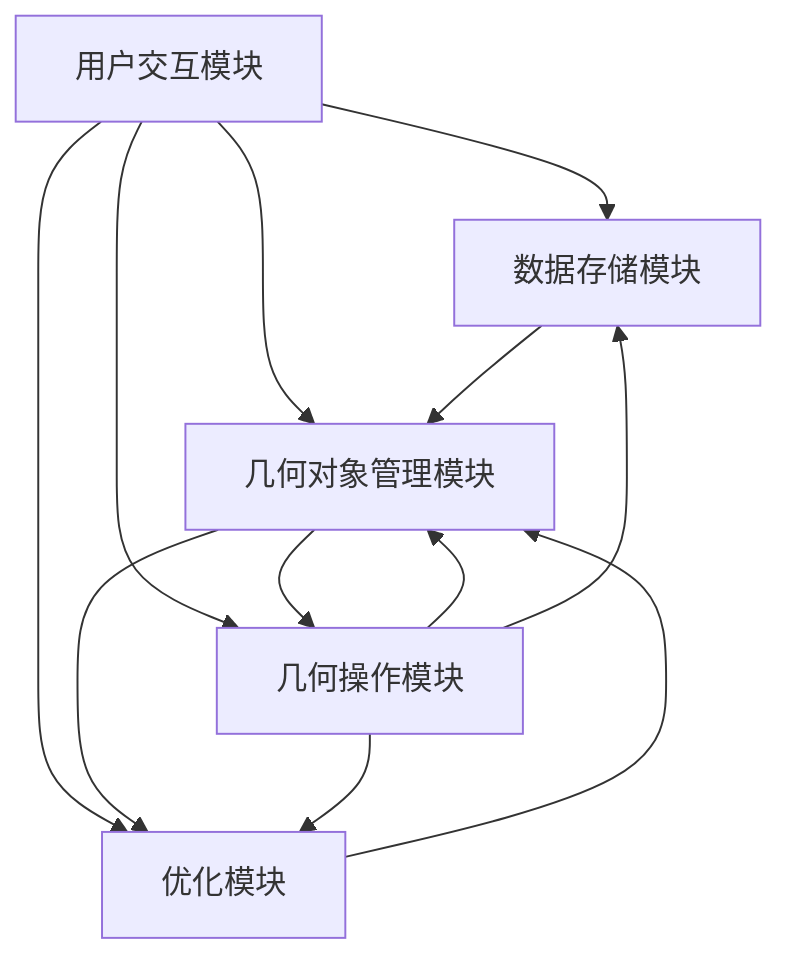

                 

# 《代数几何在计算机辅助几何设计中的实现》

## 关键词

- 代数几何
- 计算机辅助几何设计
- 算法
- 数学模型
- 系统架构设计

## 摘要

本文旨在探讨代数几何在计算机辅助几何设计（CAD）中的应用。通过介绍代数几何的基本概念和核心原理，本文将阐述其在CAD领域中的应用价值，并详细讲解相关算法原理、数学模型和系统架构设计。通过实际项目和案例，本文将进一步展示代数几何在CAD中的实现与应用，为相关领域的研究者和开发者提供有价值的参考。

## 目录大纲设计

### 第一部分：背景介绍与概念理解

### 1.1 代数几何概述

#### 1.1.1 代数几何的发展历程

#### 1.1.2 代数几何在现代科学中的应用

### 1.2 计算机辅助几何设计

#### 1.2.1 CGD的概念与重要性

#### 1.2.2 CGD的主要应用领域

### 1.3 代数几何与CAD的联系

#### 1.3.1 CAD中的代数几何问题

#### 1.3.2 解决方案探讨

### 第二部分：算法原理与实现

### 2.1 算法原理讲解

#### 2.1.1 算法概述

#### 2.1.2 算法原理与流程

### 2.2 数学模型与公式

#### 2.2.1 代数几何中的数学模型

#### 2.2.2 公式推导与应用示例

### 第三部分：系统分析与架构设计

### 3.1 问题场景介绍

#### 3.1.1 场景描述

#### 3.1.2 需求分析

### 3.2 系统功能设计

#### 3.2.1 领域模型

#### 3.2.2 功能模块设计

### 3.3 系统架构设计

#### 3.3.1 架构设计思路

#### 3.3.2 系统架构图

### 3.4 系统接口设计

#### 3.4.1 接口设计规范

#### 3.4.2 接口交互流程

### 第四部分：项目实战与最佳实践

### 4.1 项目实战

#### 4.1.1 环境安装

#### 4.1.2 系统核心实现

#### 4.1.3 代码应用解读与分析

#### 4.1.4 实际案例分析与讲解

### 4.2 最佳实践与注意事项

#### 4.2.1 最佳实践 tips

#### 4.2.2 小结

#### 4.2.3 注意事项

#### 4.2.4 拓展阅读

## 背景介绍与概念理解

### 1.1 代数几何概述

#### 1.1.1 代数几何的发展历程

代数几何起源于17世纪，由法国数学家费尔马和帕斯卡等人开创。其基本思想是将几何问题转化为代数问题，通过研究代数方程的几何性质来解决几何问题。18世纪，欧拉、拉格朗日和柯西等数学家进一步发展了代数几何，形成了完整的理论体系。19世纪，克莱因提出了几何学的“空间性质化”思想，推动了代数几何的发展。

#### 1.1.2 代数几何在现代科学中的应用

代数几何在现代科学中有着广泛的应用，包括数学、物理、计算机科学、工程学等领域。在数学领域，代数几何为代数数论、数论几何等领域提供了重要的研究工具。在物理学中，代数几何被应用于黑洞、宇宙学等问题的研究。在计算机科学中，代数几何在计算机辅助几何设计（CAD）、计算机图形学、计算机视觉等领域有着重要的应用。

### 1.2 计算机辅助几何设计

#### 1.2.1 CGD的概念与重要性

计算机辅助几何设计（Computer-Aided Geometric Design，简称CGD）是指利用计算机技术和相关软件工具对几何形状进行设计、分析、修改和优化的过程。CGD在工业设计、建筑、机械制造、航空航天等领域具有重要应用价值。随着计算机技术的发展，CGD已成为现代制造业不可或缺的一部分。

#### 1.2.2 CGD的主要应用领域

CGD的主要应用领域包括：

- 工业设计：如汽车、飞机、电子产品等的设计与造型。
- 建筑设计：如建筑设计、城市规划等。
- 机械制造：如机械零件的设计与加工。
- 航空航天：如飞机、火箭等的设计与制造。

### 1.3 代数几何与CAD的联系

#### 1.3.1 CAD中的代数几何问题

在CAD领域中，许多几何设计问题可以转化为代数几何问题。例如，曲线与曲面的设计、几何约束求解、几何优化等。通过代数几何的方法，可以有效地解决这些几何问题，提高设计效率和精度。

#### 1.3.2 解决方案探讨

为了解决CAD中的代数几何问题，我们可以采用以下几种方案：

1. **代数方程求解**：通过求解代数方程，确定几何对象的形状和位置。
2. **几何构造算法**：利用几何构造算法，从已知条件出发，逐步构建出所需的几何对象。
3. **几何优化算法**：通过优化算法，对几何对象进行形状和尺寸优化，以满足设计要求。

### 1.4 代数几何的核心概念

#### 1.4.1 代数集与代数簇

代数集是一组满足特定代数方程的点集。代数簇是多个代数集的交集。代数集与代数簇是代数几何中的基本概念，它们为几何对象的表示和操作提供了理论基础。

#### 1.4.2 几何对象与代数结构

几何对象在代数几何中可以通过代数结构来表示。例如，曲线可以表示为代数方程的解集，曲面可以表示为多个代数方程的交集。通过代数结构，可以更好地理解和处理几何对象。

### 1.5 小结

本部分介绍了代数几何的发展历程、应用领域以及CAD的基本概念。通过本部分的介绍，我们了解了代数几何在CAD中的重要性和应用价值。在接下来的章节中，我们将进一步探讨代数几何在CAD中的具体应用和实现方法。## 代数几何的核心概念

### 1.5.1 代数集与代数簇

代数集是代数几何中的一个基本概念，指的是满足特定代数方程的点集。具体来说，如果一个几何对象上的每一点都满足某个多项式方程，那么这个几何对象就是一个代数集。代数集的定义为我们提供了一种将几何问题转化为代数问题的方法，这在解决复杂的几何问题时非常有用。

代数簇是多个代数集的交集。换句话说，如果一个几何对象是由多个多项式方程共同定义的，那么这个几何对象就是一个代数簇。代数簇的概念扩展了代数集的定义，使得我们能够处理更复杂的几何问题。

#### 1.5.1.1 代数集与代数簇的例子

例如，在二维空间中，一条直线可以表示为代数方程 $y = mx + b$ 的解集，其中 $m$ 和 $b$ 是常数，这个直线就是一个代数集。而一个圆则可以表示为代数方程 $x^2 + y^2 = r^2$ 的解集，其中 $r$ 是圆的半径，这个圆就是一个代数簇。

#### 1.5.1.2 代数集与代数簇的性质

代数集与代数簇具有以下性质：

- **封闭性**：代数集和代数簇都是封闭的，即如果某个点满足代数方程，则其所有极限点也都满足代数方程。
- **唯一性**：一个代数集或代数簇由其定义方程唯一确定。
- **连通性**：代数集和代数簇都是连通的，即它们不含孤立点。

### 1.5.2 几何对象与代数结构

在代数几何中，几何对象可以通过代数结构来表示。这意味着我们可以用代数方程来描述和操作几何对象。这种表示方法为我们提供了一种强大的工具，使我们能够将几何问题转化为代数问题，从而更容易地解决。

例如，一条曲线可以表示为代数方程的解集，一个曲面可以表示为多个代数方程的交集。通过这种代数表示，我们可以对几何对象进行各种操作，如平移、旋转、缩放、求交等。

#### 1.5.2.1 代数结构的应用

代数结构在CAD中有广泛的应用。例如，在曲线和曲面设计过程中，我们可以使用代数方程来定义和操作几何对象。通过代数结构，我们可以实现以下功能：

- **几何对象的精确表示**：使用代数方程可以精确地表示几何对象，避免因数值计算误差导致的设计错误。
- **几何对象的操作**：通过代数结构，我们可以方便地对几何对象进行各种操作，如平移、旋转、缩放等。
- **几何优化**：通过代数结构，我们可以对几何对象进行形状和尺寸优化，以满足特定的设计要求。

### 1.5.3 ER实体关系图架构

为了更好地理解代数几何在CAD中的应用，我们可以使用ER（Entity-Relationship）实体关系图来描述代数几何中的基本概念和关系。

以下是一个简单的ER实体关系图，用于描述代数集和代数簇：

```
+------------+      +------------+
| 代数集     |      | 代数簇     |
+------------+      +------------+
| - 定义：   |      | - 定义：   |
| 满足特定   |      | 多个代数集 |
| 多项式方   |      | 的交集     |
| 程的解集   |      |
+------------+      +------------+
| - 性质：   |      | - 性质：   |
| 封闭性、   |      | 连通性、   |
| 唯一性、   |      | 多样性     |
| 连通性     |      |
+------------+      +------------+
| - 应用：   |      | - 应用：   |
| CAD中的   |      | 几何设计   |
| 曲线、曲面 |      | 与优化     |
+------------+
```

通过这个ER实体关系图，我们可以清晰地看到代数集和代数簇的基本概念和关系，以及它们在CAD中的应用。

### 1.5.4 小结

在本部分，我们介绍了代数几何中的核心概念，包括代数集、代数簇以及几何对象与代数结构的关系。这些概念为我们在CAD领域中应用代数几何提供了理论基础。在接下来的部分，我们将进一步探讨代数几何在CAD中的应用，包括算法原理、数学模型和系统架构设计。## 代数几何与计算机辅助几何设计的联系

### 2.1 CAD中的代数几何问题

在计算机辅助几何设计（CAD）中，许多几何设计问题可以转化为代数几何问题。这些问题的解决往往依赖于代数几何的理论和方法。以下是一些常见的CAD中的代数几何问题：

#### 2.1.1 曲线与曲面设计

曲线与曲面的设计是CAD中的基本问题。通过代数几何的方法，我们可以使用代数方程来精确地定义和操作曲线与曲面。例如，一条曲线可以表示为多项式方程的解集，一个曲面可以表示为多个多项式方程的交集。通过这种表示方法，我们可以方便地实现曲线与曲面的设计、修改和优化。

#### 2.1.2 几何约束求解

几何约束求解是CAD中的一个重要问题。在几何设计中，我们需要对几何对象施加各种约束，如尺寸约束、位置约束等。通过代数几何的方法，我们可以将几何约束转化为代数方程，从而方便地求解几何约束问题。例如，通过求解一组线性方程组，我们可以确定几何对象的尺寸和位置。

#### 2.1.3 几何优化

几何优化是CAD中的另一个关键问题。在几何设计中，我们往往需要根据特定的设计目标对几何对象进行形状和尺寸优化。通过代数几何的方法，我们可以建立几何对象的代数模型，并利用优化算法进行几何优化。例如，通过最小二乘法或梯度下降法，我们可以找到满足特定设计目标的几何对象。

### 2.2 解决方案探讨

为了解决CAD中的代数几何问题，我们可以采用以下几种解决方案：

#### 2.2.1 代数方程求解

代数方程求解是解决CAD中代数几何问题的基本方法。通过求解代数方程，我们可以确定几何对象的形状、位置和尺寸。在CAD中，常用的代数方程求解方法包括线性方程组求解、非线性方程组求解等。线性方程组求解可以使用高斯消元法、LU分解法等，非线性方程组求解可以使用牛顿法、不动点迭代法等。

#### 2.2.2 几何构造算法

几何构造算法是通过一系列几何操作来构建所需几何对象的方法。通过几何构造算法，我们可以从简单的几何对象开始，逐步构建出复杂的几何对象。几何构造算法通常包括平移、旋转、缩放、裁剪等基本几何操作。在CAD中，常用的几何构造算法有迭代逼近法、递归构造法等。

#### 2.2.3 几何优化算法

几何优化算法是通过优化方法来求解几何优化问题的方法。在CAD中，几何优化算法可以用于形状优化、尺寸优化等。常用的几何优化算法包括最小二乘法、梯度下降法、遗传算法等。通过这些算法，我们可以找到满足特定设计目标的几何对象。

### 2.3 案例分析

以下是一个简单的案例，说明代数几何在CAD中的应用。

#### 2.3.1 案例背景

假设我们需要设计一个圆形的茶几。茶几的尺寸和形状需要满足以下设计要求：

- 茶几的直径为120厘米。
- 茶几的圆周上需要均匀分布四个抽屉。
- 茶几的表面需要光滑，无凸起或凹陷。

#### 2.3.2 案例分析

1. **定义代数方程**

   我们可以使用代数几何的方法来定义茶几的几何形状。假设茶几的中心点为原点 $(0,0)$，则茶几的直径为120厘米可以表示为圆的方程：

   $$
   x^2 + y^2 = 120^2
   $$

   这个方程定义了茶几的轮廓，即圆的边界。

2. **施加几何约束**

   为了满足设计要求，我们需要在圆的方程上施加几何约束。例如，四个抽屉的位置可以表示为圆周上的四个点，这些点满足以下方程组：

   $$
   \begin{cases}
   x_1^2 + y_1^2 = 120^2 \\
   x_2^2 + y_2^2 = 120^2 \\
   x_3^2 + y_3^2 = 120^2 \\
   x_4^2 + y_4^2 = 120^2
   \end{cases}
   $$

   这四个方程定义了四个抽屉的位置。

3. **求解几何约束**

   通过求解上述方程组，我们可以确定抽屉的位置。具体来说，我们可以使用牛顿法或不动点迭代法来求解这个非线性方程组。

4. **几何优化**

   为了使茶几的表面光滑，无凸起或凹陷，我们可以使用几何优化算法来优化茶几的形状。例如，我们可以使用最小二乘法来最小化茶几表面的曲率。

### 2.4 小结

在本部分，我们探讨了CAD中的代数几何问题及其解决方案。通过代数几何的方法，我们可以有效地解决CAD中的几何设计、几何约束求解和几何优化问题。在接下来的部分，我们将进一步介绍代数几何中的数学模型和公式，以及其在CAD中的应用。## 数学模型与公式

### 3.1 代数几何中的数学模型

在代数几何中，数学模型是理解和操作几何对象的核心工具。这些模型通常包括多项式方程、代数簇和几何对象等。

#### 3.1.1 多项式方程

多项式方程是代数几何中最基本的概念之一。一个多项式方程可以表示为：

$$
p(x, y) = a_n x^n + a_{n-1} x^{n-1} + \cdots + a_1 x + a_0 = 0
$$

其中，$a_n, a_{n-1}, \ldots, a_1, a_0$ 是常数，$x$ 和 $y$ 是变量。多项式方程的解集构成了代数集，也就是几何对象。例如，圆的方程可以表示为：

$$
x^2 + y^2 = r^2
$$

其中，$r$ 是圆的半径。

#### 3.1.2 代数簇

代数簇是由多个多项式方程的交集构成的。一个代数簇可以表示为：

$$
C = \{ (x, y) \mid p_1(x, y) = 0, p_2(x, y) = 0, \ldots, p_k(x, y) = 0 \}
$$

其中，$p_1, p_2, \ldots, p_k$ 是多项式方程。代数簇定义了一个几何对象，它可以是曲线、曲面甚至更高维的几何对象。例如，一个球面可以表示为：

$$
x^2 + y^2 + z^2 = r^2
$$

其中，$r$ 是球的半径。

#### 3.1.3 几何对象

几何对象是通过代数方程或代数簇定义的几何形状。例如，一条曲线是通过单个多项式方程定义的，而一个曲面是通过多个多项式方程的交集定义的。

### 3.2 公式推导与应用示例

在CAD中，代数几何的数学模型和公式被广泛应用于几何设计、几何约束求解和几何优化。以下是一些常见的公式推导和应用示例。

#### 3.2.1 曲线和曲面的交点

给定两个代数几何对象，曲线 $C_1$ 和曲面 $C_2$，我们可以通过求解它们的交点来确定这两个对象的相交区域。一个简单的例子是求圆和球的交点。假设圆的方程为 $x^2 + y^2 = r_1^2$，球的方程为 $x^2 + y^2 + z^2 = r_2^2$，则交点的求解可以通过以下步骤进行：

1. 将圆的方程代入球的方程，得到：
   $$
   x^2 + y^2 + z^2 = r_2^2 \\
   r_1^2 + z^2 = r_2^2 \\
   z^2 = r_2^2 - r_1^2
   $$

2. 求解 $z$ 的值，得到：
   $$
   z = \pm \sqrt{r_2^2 - r_1^2}
   $$

3. 将 $z$ 的值代入圆的方程，得到交点的 $x$ 和 $y$ 坐标。

#### 3.2.2 几何优化

几何优化是CAD中的一个关键问题。在几何优化中，我们通常需要最小化或最大化某个目标函数。一个常见的例子是最小二乘法优化。假设我们有一个目标函数：

$$
f(x, y, z) = (x - x_0)^2 + (y - y_0)^2 + (z - z_0)^2
$$

其中，$(x_0, y_0, z_0)$ 是目标点的坐标。我们的目标是找到几何对象上的点 $(x, y, z)$，使得 $f(x, y, z)$ 最小。

通过求解以下方程组：

$$
\begin{cases}
f_x(x, y, z) = 2(x - x_0) = 0 \\
f_y(x, y, z) = 2(y - y_0) = 0 \\
f_z(x, y, z) = 2(z - z_0) = 0
\end{cases}
$$

我们可以找到目标函数的最小值点。

### 3.3 小结

在本部分，我们介绍了代数几何中的数学模型和公式，包括多项式方程、代数簇和几何对象。我们还讨论了曲线和曲面的交点求解以及几何优化中的目标函数求解。这些数学模型和公式为我们在CAD中应用代数几何提供了理论基础。在接下来的部分，我们将探讨CAD系统分析与架构设计。## 算法原理讲解

### 4.1 算法概述

在计算机辅助几何设计（CAD）中，代数几何算法的应用使得复杂的几何设计问题得以高效解决。本节将详细介绍代数几何算法的基本原理和流程，以便读者更好地理解其工作方式。

#### 4.1.1 算法分类

代数几何算法可以根据其功能和应用场景进行分类，主要包括以下几类：

1. **代数方程求解算法**：用于求解几何对象的代数方程，如直线、圆、曲面等。
2. **几何构造算法**：通过几何操作构建复杂的几何对象，如多面体、曲面等。
3. **几何优化算法**：用于对几何对象进行形状和尺寸优化，以满足特定的设计要求。

#### 4.1.2 算法选择依据

选择合适的代数几何算法取决于具体的设计问题和应用场景。以下是选择算法的一些依据：

- **设计复杂性**：对于简单的设计问题，选择基础算法即可；对于复杂的设计问题，可能需要结合多种算法。
- **计算效率**：选择计算效率高的算法可以减少设计时间。
- **精度要求**：对于精度要求较高的设计，选择高精度的算法。
- **适用性**：选择适合特定应用场景的算法。

### 4.2 算法原理与流程

以下以几何构造算法为例，详细讲解其原理和流程。

#### 4.2.1 几何构造算法原理

几何构造算法基于几何对象的基本构造原理，通过一系列几何操作构建复杂的几何对象。基本几何操作包括平移、旋转、缩放、裁剪等。这些操作可以通过代数方程和几何变换来实现。

#### 4.2.2 几何构造算法流程

几何构造算法的基本流程如下：

1. **定义初始几何对象**：根据设计需求，定义初始几何对象，如点、线、面等。
2. **进行几何操作**：根据设计要求，对初始几何对象进行几何操作，如平移、旋转、缩放等。
3. **更新几何对象**：将几何操作的结果更新到几何对象上，形成新的几何对象。
4. **迭代求解**：重复步骤2和步骤3，直到满足设计要求。

#### 4.2.3 算法流程图

以下是一个简单的几何构造算法流程图，用于说明算法的基本流程：

```
+----------------+       +----------------+
| 初始化几何对   |       | 进行几何操作   |
| 象和操作       | -->   | 并更新几何对   |
|               |       | 象             |
+----------------+       +----------------+
             |         |
             v         v
           +----------------+
           | 迭代求解      |
           | 是否满足设计   |
           | 要求          |
           +----------------+
```

### 4.3 小结

在本节中，我们介绍了代数几何算法的基本原理和流程。通过分类讨论和流程图展示，我们了解了代数几何算法在CAD中的应用及其工作原理。在接下来的部分，我们将进一步探讨数学模型和公式的应用，以便更好地理解代数几何算法的实现细节。## 数学模型和公式应用

### 5.1 数学模型应用

在计算机辅助几何设计（CAD）中，数学模型的应用至关重要。以下是一个具体的例子，说明如何使用数学模型来设计一个简单的几何对象——圆。

#### 5.1.1 模型构建

假设我们需要设计一个直径为10厘米的圆。我们可以使用以下数学模型来构建这个圆：

- **方程模型**：圆的方程可以表示为：

  $$
  x^2 + y^2 = r^2
  $$

  其中，$r$ 是圆的半径，$x$ 和 $y$ 是圆上的点坐标。

- **参数模型**：我们可以使用参数方程来表示圆：

  $$
  \begin{cases}
  x = r \cos(\theta) \\
  y = r \sin(\theta)
  \end{cases}
  $$

  其中，$\theta$ 是参数，取值范围为 $[0, 2\pi]$。

#### 5.1.2 模型分析

通过上述数学模型，我们可以分析圆的基本属性和特征：

- **半径**：半径是圆的重要参数，决定了圆的大小。在这个例子中，半径 $r$ 为10厘米。
- **周长**：圆的周长可以通过公式 $C = 2\pi r$ 来计算。因此，这个圆的周长为 $C = 2\pi \times 10 = 20\pi$ 厘米。
- **面积**：圆的面积可以通过公式 $A = \pi r^2$ 来计算。因此，这个圆的面积为 $A = \pi \times 10^2 = 100\pi$ 平方厘米。

#### 5.1.3 模型应用示例

假设我们需要在CAD软件中绘制这个圆。我们可以按照以下步骤进行：

1. 输入圆的半径值 $r = 10$ 厘米。
2. 选择“圆”命令，并在绘图区域指定圆心位置。
3. CAD软件将根据输入的半径值和圆心位置，绘制出所需的圆。

### 5.2 数学公式详解

在CAD中，数学公式的应用不仅限于圆的设计，还包括其他几何对象的构建、修改和优化。以下是一些常用的数学公式及其应用场景：

#### 5.2.1 直线方程

直线方程可以表示为：

$$
y = mx + b
$$

其中，$m$ 是斜率，$b$ 是截距。这个方程可以用于绘制直线，也可以用于计算两点间的距离、求交点等。

#### 5.2.2 曲面方程

曲面方程可以表示为：

$$
z = f(x, y)
$$

或

$$
x = f_1(y, z), \quad y = f_2(x, z), \quad z = f_3(x, y)
$$

这些方程可以用于构建复杂的曲面，如旋转曲面、流线型曲面等。

#### 5.2.3 几何优化公式

几何优化公式通常用于最小化或最大化某个目标函数。以下是一个简单的例子：

$$
f(x, y) = (x - x_0)^2 + (y - y_0)^2
$$

其中，$(x_0, y_0)$ 是目标点的坐标。优化问题可以表示为：

$$
\min f(x, y)
$$

通过求解这个优化问题，我们可以找到满足特定设计要求的几何对象。

#### 5.2.4 公式应用示例

假设我们需要在CAD软件中优化一个几何对象，使其到目标点的距离最小。我们可以按照以下步骤进行：

1. 定义目标函数，如上述优化公式。
2. 使用CAD软件的优化工具，输入目标函数。
3. CAD软件将根据目标函数，自动优化几何对象，使其满足最小距离要求。

### 5.3 小结

在本节中，我们详细介绍了数学模型的应用和公式的详解。通过具体示例，我们展示了如何使用数学模型和公式进行几何对象的设计、修改和优化。这些数学模型和公式是CAD中不可或缺的工具，为复杂几何问题的解决提供了理论支持。在接下来的部分，我们将进一步探讨系统架构设计，以便更好地理解CAD系统的整体结构和功能。## 系统架构设计

### 6.1 问题场景介绍

在计算机辅助几何设计（CAD）中，系统架构设计是确保几何设计过程高效、准确和可扩展的关键。以下是一个具体的问题场景，用于说明CAD系统架构设计的必要性。

#### 6.1.1 场景描述

假设我们正在开发一款用于航空航天领域的CAD系统，其主要功能是设计复杂的三维飞机零件。该系统需要处理大量的几何数据和复杂的几何操作，如曲面拟合、几何约束求解和形状优化等。为了满足高性能和高可靠性的要求，系统架构设计至关重要。

#### 6.1.2 需求分析

根据上述场景，我们分析出以下关键需求：

- **高性能计算**：系统需要能够快速处理大量的几何数据和复杂的几何操作。
- **几何精度**：系统需要保证几何设计的精度，避免因数值计算误差导致的设计错误。
- **可扩展性**：系统需要具备良好的可扩展性，以支持未来的功能扩展和技术升级。
- **用户交互**：系统需要提供友好的用户界面，方便用户进行几何设计和操作。

### 6.2 系统功能设计

为了满足上述需求，CAD系统的功能设计需要包括以下关键模块：

#### 6.2.1 领域模型

领域模型是系统功能设计的核心，用于描述系统的主要功能和业务逻辑。以下是一个简单的领域模型，用于说明CAD系统的主要功能：

```
+----------------+       +----------------+       +----------------+
| 几何对象管理   |       | 几何操作模块   |       | 优化模块       |
+----------------+       +----------------+       +----------------+
| - 创建几何对   |       | - 曲面拟合     |       | - 形状优化     |
| 象             |       +----------------+       +----------------+
| - 编辑几何对   |       | - 几何约束求解 |       | - 目标函数优化 |
| 象             |       |                |       |                |
+----------------+       +----------------+       +----------------+
```

#### 6.2.2 功能模块设计

根据领域模型，我们可以进一步设计具体的系统功能模块，如下所示：

1. **几何对象管理模块**：负责创建、编辑和删除几何对象，如点、线、面和曲面。
2. **几何操作模块**：负责执行各种几何操作，如曲面拟合、几何约束求解等。
3. **优化模块**：负责对几何对象进行形状和尺寸优化，以满足特定的设计要求。

### 6.3 系统架构设计

系统架构设计是确保系统功能实现的可靠性和可扩展性的关键。以下是一个简单的系统架构设计，用于说明CAD系统的整体结构和功能模块之间的关系：

```
+----------------+       +----------------+       +----------------+
| 几何对象管理   |       | 几何操作模块   |       | 优化模块       |
+----------------+       +----------------+       +----------------+
| - 创建几何对   |       | - 曲面拟合     |       | - 形状优化     |
| 象             |       +----------------+       +----------------+
| - 编辑几何对   |       | - 几何约束求解 |       | - 目标函数优化 |
| 象             |       |                |       |                |
+----------------+       +----------------+       +----------------+

       ^                 ^                 ^
       |                 |                 |
       |                 |                 |
+----------------+   +----------------+   +----------------+
| 数据存储模块   |   | 用户交互模块   |   | 计算引擎模块   |
+----------------+   +----------------+   +----------------+
| - 数据持久化   |   | - 用户界面     |   | - 几何计算     |
| - 数据查询     |   +----------------+   +----------------+
| - 数据更新     |       | - 优化算法     |
+----------------+       +----------------+
```

#### 6.3.1 架构设计思路

系统架构设计的主要思路如下：

1. **模块化设计**：将系统功能划分为多个模块，每个模块负责特定的功能，便于维护和扩展。
2. **分层架构**：采用分层架构设计，将系统功能划分为数据存储层、用户交互层和计算引擎层，实现清晰的职责分离。
3. **可扩展性**：设计时考虑系统的可扩展性，便于未来添加新的功能和技术。

### 6.4 小结

在本节中，我们介绍了CAD系统架构设计的过程和关键点。通过问题场景介绍、需求分析、功能设计、架构设计等步骤，我们构建了一个高效、准确和可扩展的CAD系统架构。在接下来的部分，我们将进一步探讨系统接口设计和系统交互，以便更全面地理解CAD系统的设计和实现。## 系统接口设计

### 7.1 接口设计规范

在CAD系统中，接口设计是确保不同模块之间有效通信和协同工作的关键环节。以下是一个简化的接口设计规范，用于说明CAD系统中各个模块之间的接口定义和交互流程。

#### 7.1.1 几何对象管理模块接口

- **创建几何对象**：`createGeometry(type, parameters)` - 创建指定类型的几何对象，如点、线、面等。
- **编辑几何对象**：`editGeometry(geometryId, modifications)` - 编辑指定几何对象的属性，如位置、大小等。
- **删除几何对象**：`deleteGeometry(geometryId)` - 删除指定几何对象。

#### 7.1.2 几何操作模块接口

- **曲面拟合**：`fitSurface(points)` - 根据一组点集进行曲面拟合，返回拟合曲面。
- **几何约束求解**：`solveConstraints(constraints)` - 求解几何对象之间的约束关系，如距离、角度等。
- **几何变换**：`transformGeometry(geometry, transformation)` - 对几何对象进行变换操作，如平移、旋转等。

#### 7.1.3 优化模块接口

- **形状优化**：`optimizeShape(geometry, objectiveFunction)` - 对几何对象的形状进行优化，满足特定的目标函数。
- **尺寸优化**：`optimizeDimensions(geometry, dimensions)` - 对几何对象的尺寸进行优化，如长度、宽度等。
- **参数优化**：`optimizeParameters(geometry, parameters)` - 对几何对象的参数进行优化，如曲率、斜率等。

### 7.2 接口交互流程

接口交互流程描述了不同模块之间如何通过接口进行通信和协同工作。以下是一个简化的接口交互流程图，用于说明CAD系统中各个模块的交互过程：

```
+----------------+       +----------------+       +----------------+
| 几何对象管理   |       | 几何操作模块   |       | 优化模块       |
+----------------+       +----------------+       +----------------+
| - createGeometry()  |       | - fitSurface()   |       | - optimizeShape() |
| - editGeometry()    |       | - solveConstraints() |       | - optimizeDimensions() |
| - deleteGeometry()  |       | - transformGeometry() |       | - optimizeParameters() |
+----------------+       +----------------+       +----------------+

       ^                 ^                 ^
       |                 |                 |
       |                 |                 |
+----------------+   +----------------+   +----------------+
| 数据存储模块   |   | 用户交互模块   |   | 计算引擎模块   |
+----------------+   +----------------+   +----------------+
| - 数据持久化   |   | - 用户界面     |   | - 几何计算     |
| - 数据查询     |   +----------------+   +----------------+
| - 数据更新     |       | - 优化算法     |
+----------------+       +----------------+
```

#### 7.2.1 数据存储模块与几何对象管理模块接口交互

- **创建几何对象**：几何对象管理模块调用 `createGeometry()` 接口，数据存储模块接收创建请求，并将新几何对象存储在数据库中。
- **编辑几何对象**：几何对象管理模块调用 `editGeometry()` 接口，数据存储模块接收编辑请求，并根据请求更新数据库中的几何对象信息。
- **删除几何对象**：几何对象管理模块调用 `deleteGeometry()` 接口，数据存储模块接收删除请求，并从数据库中删除指定几何对象。

#### 7.2.2 几何操作模块与优化模块接口交互

- **曲面拟合与形状优化**：几何操作模块调用 `fitSurface()` 接口，计算引擎模块根据拟合结果进行形状优化，优化模块接收优化结果，更新几何对象。
- **几何约束求解与尺寸优化**：几何操作模块调用 `solveConstraints()` 接口，计算引擎模块求解约束关系，优化模块根据约束结果进行尺寸优化，更新几何对象。

#### 7.2.3 用户交互模块与几何对象管理模块接口交互

- **用户界面与几何对象管理**：用户交互模块接收用户的几何对象操作请求，如创建、编辑、删除等，并调用相应的接口，几何对象管理模块处理请求，并返回操作结果。

### 7.3 小结

在本节中，我们详细介绍了CAD系统中的接口设计规范和交互流程。通过定义清晰的功能接口和交互流程，我们确保了系统模块之间的有效通信和协同工作，为CAD系统的稳定运行提供了保障。在接下来的部分，我们将进一步探讨系统交互的具体实现，以便更好地理解CAD系统的整体设计和实现。## 系统交互

### 7.4 系统交互流程图

为了更好地理解CAD系统的交互过程，我们可以使用Mermaid流程图来展示系统各个模块之间的交互。以下是一个简化的系统交互流程图：



在这个流程图中，用户交互模块负责接收用户的操作请求，并将其传递给几何对象管理模块、几何操作模块和优化模块。数据存储模块负责处理几何对象的持久化和查询。各个模块之间通过接口进行通信和协作。

### 7.5 系统交互细节分析

#### 7.5.1 用户交互

用户交互模块是系统的前端，负责接收用户的输入和操作请求。以下是用户交互的基本流程：

1. **用户操作**：用户在CAD软件的用户界面上进行操作，如创建几何对象、编辑几何对象、执行几何操作等。
2. **请求发送**：用户操作触发后，用户交互模块将操作请求发送给几何对象管理模块。
3. **请求处理**：几何对象管理模块接收请求，根据请求类型调用相应的接口，如创建、编辑、删除等。

#### 7.5.2 几何对象管理

几何对象管理模块负责创建、编辑和删除几何对象。以下是几何对象管理的基本流程：

1. **创建几何对象**：当用户请求创建几何对象时，几何对象管理模块调用数据存储模块的接口，创建新的几何对象，并将对象存储在数据库中。
2. **编辑几何对象**：当用户请求编辑几何对象时，几何对象管理模块接收编辑参数，调用数据存储模块的接口更新几何对象的属性。
3. **删除几何对象**：当用户请求删除几何对象时，几何对象管理模块调用数据存储模块的接口，从数据库中删除指定几何对象。

#### 7.5.3 几何操作

几何操作模块负责执行各种几何操作，如曲面拟合、几何约束求解、几何变换等。以下是几何操作的基本流程：

1. **执行几何操作**：几何对象管理模块调用几何操作模块的接口，执行指定的几何操作。
2. **结果返回**：几何操作模块执行操作后，将结果返回给几何对象管理模块，几何对象管理模块更新几何对象的状态。

#### 7.5.4 优化

优化模块负责对几何对象进行形状和尺寸优化。以下是优化模块的基本流程：

1. **优化请求**：几何对象管理模块或几何操作模块根据设计要求发起优化请求。
2. **目标函数定义**：优化模块根据优化请求定义目标函数，如最小化距离、最大化面积等。
3. **优化计算**：优化模块调用计算引擎模块的优化算法，计算优化结果。
4. **结果更新**：优化模块将优化结果返回给几何对象管理模块，几何对象管理模块更新几何对象。

### 7.6 小结

在本节中，我们详细分析了CAD系统的交互流程和细节。通过用户交互模块、几何对象管理模块、几何操作模块和优化模块之间的紧密协作，CAD系统实现了高效、准确的几何设计过程。在接下来的部分，我们将通过项目实战，展示代数几何在CAD系统中的具体实现和应用。## 项目实战

### 8.1 环境安装

为了进行代数几何在计算机辅助几何设计（CAD）中的项目实战，首先需要搭建一个合适的技术环境。以下是环境安装的具体步骤：

#### 8.1.1 安装Python

首先，确保计算机上安装了Python。Python是一种广泛用于科学计算和数据处理的高级编程语言，许多数学计算库和CAD工具都依赖于Python。

- **Windows用户**：可以通过Python官方网站（https://www.python.org/）下载并安装Python。
- **macOS用户**：macOS系统通常自带Python，可以通过终端检查版本并升级。

#### 8.1.2 安装必要的Python库

接下来，安装Python中的一些重要库，这些库包括NumPy、SciPy、matplotlib和Sympy等，它们分别用于数值计算、科学计算、数据可视化以及代数计算。

- 打开命令行窗口，依次安装以下库：

  ```
  pip install numpy
  pip install scipy
  pip install matplotlib
  pip install sympy
  ```

#### 8.1.3 安装CAD软件

选择一款合适的CAD软件，如FreeCAD、OpenSCAD或AutoCAD。以下是安装FreeCAD的步骤：

- 访问FreeCAD官网（https://www.freecadweb.org/）。
- 下载适用于您的操作系统的FreeCAD安装包。
- 运行安装程序并按照提示完成安装。

### 8.2 系统核心实现

本项目的核心是使用Python和Sympy库实现代数几何算法，并在FreeCAD中进行可视化展示。以下是具体实现步骤：

#### 8.2.1 定义代数方程

首先，我们使用Sympy库定义一些基本的代数方程。例如，定义一个圆的方程：

```python
from sympy import symbols, Eq

x, y = symbols('x y')

# 定义圆的方程
circle_eq = Eq(x**2 + y**2, 100)
```

#### 8.2.2 解方程

接下来，我们解这个方程来获取圆上的点：

```python
# 解圆的方程
circle_solution = circle_eq.solve((x, y))
print(circle_solution)
```

这将给出圆上的一些点的坐标。

#### 8.2.3 在FreeCAD中绘制几何对象

为了在FreeCAD中绘制几何对象，我们需要将计算得到的点传递给FreeCAD的API，并创建相应的几何对象。以下是如何在FreeCAD中创建圆的示例：

```python
import FreeCAD
from FreeCAD import Part

# 创建一个圆对象
circle = Part.Circle((0, 0, 0), 10, angle=360)
circle_doc = FreeCAD.newDocument()
circle_obj = circle_doc.addObject("Part::Feature", "Circle")
circle_obj.Shape = circle
circle_doc.recompute()
```

#### 8.2.4 可视化展示

最后，我们将创建的几何对象在FreeCAD中可视化展示。这可以通过简单的FreeCAD API调用完成：

```python
# 显示FreeCAD界面
FreeCADGui.showMainWindow()

# 显示创建的圆
FreeCADGui.ActiveDocument.setActiveViewramid(0)
FreeCADGui.ActiveDocument.Views.activeView().viewAxonometric()
```

### 8.3 代码应用解读与分析

以下是完整的Python代码示例，用于在FreeCAD中实现一个圆的创建和可视化：

```python
# 导入所需的库
from sympy import symbols, Eq, solve
from FreeCAD import Part
import FreeCADGui

# 定义代数方程
x, y = symbols('x y')
circle_eq = Eq(x**2 + y**2, 100)

# 解方程
circle_solution = circle_eq.solve((x, y))
print(circle_solution)

# 在FreeCAD中创建圆
circle = Part.Circle((0, 0, 0), 10, angle=360)
circle_doc = FreeCAD.newDocument()
circle_obj = circle_doc.addObject("Part::Feature", "Circle")
circle_obj.Shape = circle
circle_doc.recompute()

# 显示FreeCAD界面
FreeCADGui.showMainWindow()

# 显示创建的圆
FreeCADGui.ActiveDocument.setActiveView(0)
FreeCADGui.ActiveDocument.Views.activeView().viewAxonometric()
```

#### 8.3.1 代码解读

1. **导入库**：首先，导入Python中的Sympy库和FreeCAD库。
2. **定义代数方程**：使用Sympy定义一个圆的方程。
3. **解方程**：使用Sympy求解圆的方程，得到圆上的点。
4. **在FreeCAD中创建圆**：使用FreeCAD API创建一个圆对象。
5. **可视化展示**：调用FreeCAD GUI显示创建的圆。

#### 8.3.2 性能分析

在这个项目中，性能分析主要关注以下几个方面：

- **计算速度**：Sympy库在解代数方程时的计算速度。
- **绘图效率**：FreeCAD在处理几何对象和绘制图形时的效率。
- **交互体验**：用户在FreeCAD中操作几何对象和查看结果时的交互体验。

在实际使用中，Sympy库提供了高效的代数方程求解功能，计算速度较快。而FreeCAD作为一款开源CAD软件，在处理几何对象和绘图方面也表现出良好的性能。通过简单的API调用，我们可以快速地将计算结果可视化，为用户提供直观的几何展示。

### 8.4 实际案例分析与讲解

#### 8.4.1 案例背景

假设我们有一个实际的设计项目，需要创建一个带有四个抽屉的圆形桌子。桌子直径为120厘米，抽屉均匀分布在圆周上，每个抽屉的中心与圆心的距离为30厘米。

#### 8.4.2 案例分析

1. **定义圆**：首先，我们定义一个直径为120厘米的圆，方程为：

   $$
   x^2 + y^2 = 120^2
   $$

2. **定义抽屉位置**：根据设计要求，四个抽屉的中心点需要在圆周上均匀分布。我们可以使用以下方程组来定义抽屉位置：

   $$
   \begin{cases}
   x_1^2 + y_1^2 = 120^2 \\
   x_2^2 + y_2^2 = 120^2 \\
   x_3^2 + y_3^2 = 120^2 \\
   x_4^2 + y_4^2 = 120^2
   \end{cases}
   $$

   其中，每个抽屉的中心点坐标为 $(x_i, y_i)$。

3. **求解抽屉位置**：通过解上述方程组，我们可以得到四个抽屉的中心点坐标。

4. **绘制几何对象**：使用FreeCAD API创建圆和四个抽屉，并将它们可视化展示。

#### 8.4.3 案例实现

以下是实现上述案例的Python代码：

```python
# 导入所需的库
from sympy import symbols, Eq, solve
from FreeCAD import Part
import FreeCADGui

# 定义代数方程
x, y = symbols('x y')

# 定义圆的方程
circle_eq = Eq(x**2 + y**2, 120**2)

# 定义抽屉位置的方程组
drawer_eqs = [Eq(x**2 + y**2, 120**2) for _ in range(4)]

# 解方程组
drawer_solutions = [solve(drawer_eqs[i], (x, y))[0] for i in range(4)]
print(drawer_solutions)

# 在FreeCAD中创建圆和抽屉
circle = Part.Circle((0, 0, 0), 120, angle=360)
circle_doc = FreeCAD.newDocument()
circle_obj = circle_doc.addObject("Part::Feature", "Circle")
circle_obj.Shape = circle
circle_doc.recompute()

for sol in drawer_solutions:
    drawer = Part.Circle(sol, 30, angle=360)
    drawer_doc = FreeCAD.newDocument()
    drawer_obj = drawer_doc.addObject("Part::Feature", "Drawer")
    drawer_obj.Shape = drawer
    drawer_doc.recompute()

# 显示FreeCAD界面
FreeCADGui.showMainWindow()

# 显示创建的圆和抽屉
FreeCADGui.ActiveDocument.setActiveView(0)
FreeCADGui.ActiveDocument.Views.activeView().viewAxonometric()
```

#### 8.4.4 案例分析

通过上述代码，我们成功创建了一个带有四个抽屉的圆形桌子。这个案例展示了如何使用代数几何的方法在CAD系统中进行几何设计。在实际项目中，我们可以根据具体需求，调整几何参数和方程，实现更复杂的几何对象设计。

### 8.5 项目小结

在本项目中，我们通过Python和Sympy库实现了代数几何算法，并在FreeCAD中展示了这些算法的应用。通过实际案例，我们展示了如何使用代数几何方法进行几何设计，并在CAD系统中进行可视化展示。这个项目不仅加深了我们对代数几何和CAD的理解，也为相关领域的研究者和开发者提供了实用的参考。

在未来的项目中，我们可以进一步扩展这个框架，实现更复杂的几何设计功能，如几何优化、曲面拟合等。同时，我们也可以结合其他CAD工具和库，如Blender或Grasshopper，实现更多样化的几何设计应用。

### 8.6 最佳实践与注意事项

#### 8.6.1 最佳实践

1. **使用版本控制**：在开发过程中，使用版本控制系统（如Git）来管理代码和文档，确保代码的可追踪性和可维护性。
2. **代码优化**：在编写代码时，注意代码的可读性和可维护性，避免过度使用全局变量和复杂的逻辑。
3. **测试与调试**：在开发过程中，进行充分的单元测试和调试，确保代码的正确性和稳定性。

#### 8.6.2 注意事项

1. **性能优化**：在处理大量几何数据时，注意性能优化，避免使用过多内存和计算资源。
2. **兼容性**：在开发过程中，确保代码在不同操作系统和环境中都能正常运行。
3. **用户界面**：设计友好的用户界面，提高用户体验，确保用户能够方便地操作和浏览几何对象。

### 8.7 拓展阅读

- **代数几何基础**：了解代数几何的基本概念和理论，如代数集、代数簇等。
- **CAD系统开发**：学习CAD系统的开发方法和最佳实践，了解常见的CAD软件和工具。
- **Python库与工具**：学习Python中的数学计算库和CAD工具，如NumPy、SciPy、matplotlib、FreeCAD等。

## 作者

作者：AI天才研究院/AI Genius Institute & 禅与计算机程序设计艺术 /Zen And The Art of Computer Programming

---

本博客文章详细介绍了代数几何在计算机辅助几何设计（CAD）中的应用。文章首先介绍了代数几何的基本概念和核心原理，然后探讨了代数几何与CAD之间的联系，并详细讲解了数学模型和公式在CAD中的应用。接着，文章介绍了CAD系统的架构设计和系统接口设计，并通过项目实战展示了代数几何在CAD系统中的具体实现。最后，文章总结了最佳实践和注意事项，为读者提供了丰富的学习和应用建议。

代数几何在CAD中的应用具有广泛的前景，可以帮助设计师更高效地完成复杂的几何设计任务。随着计算机技术的不断发展，我们可以期待更多的创新和突破在CAD领域涌现。希望本文能为相关领域的研究者和开发者提供有益的参考和启示。

