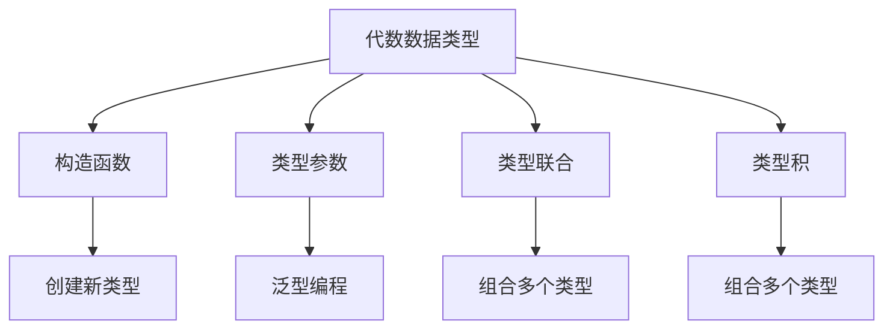
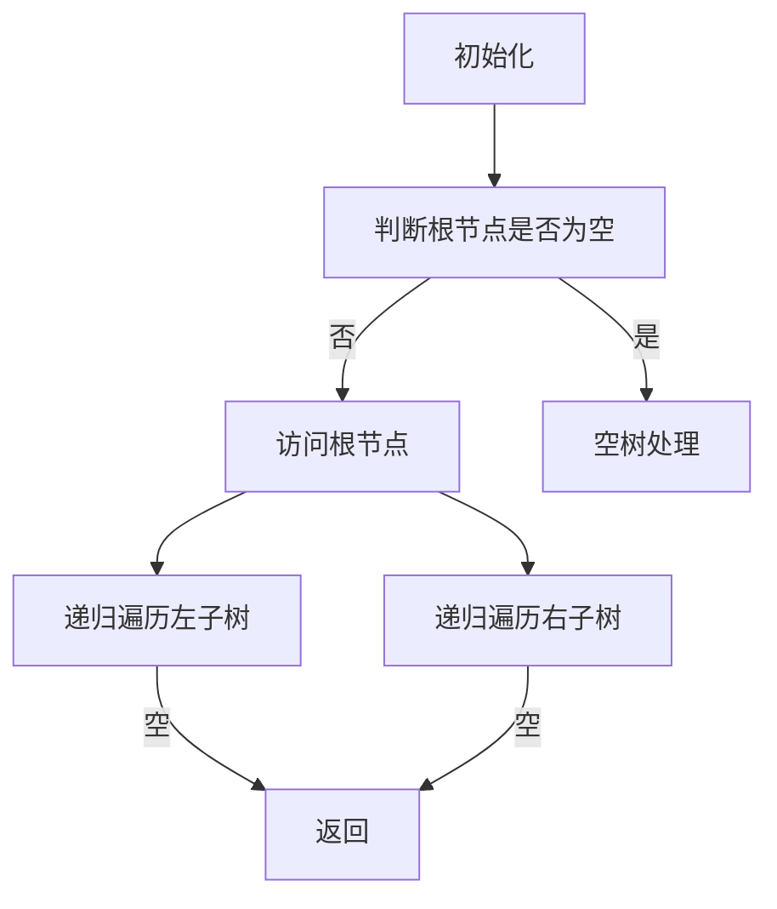
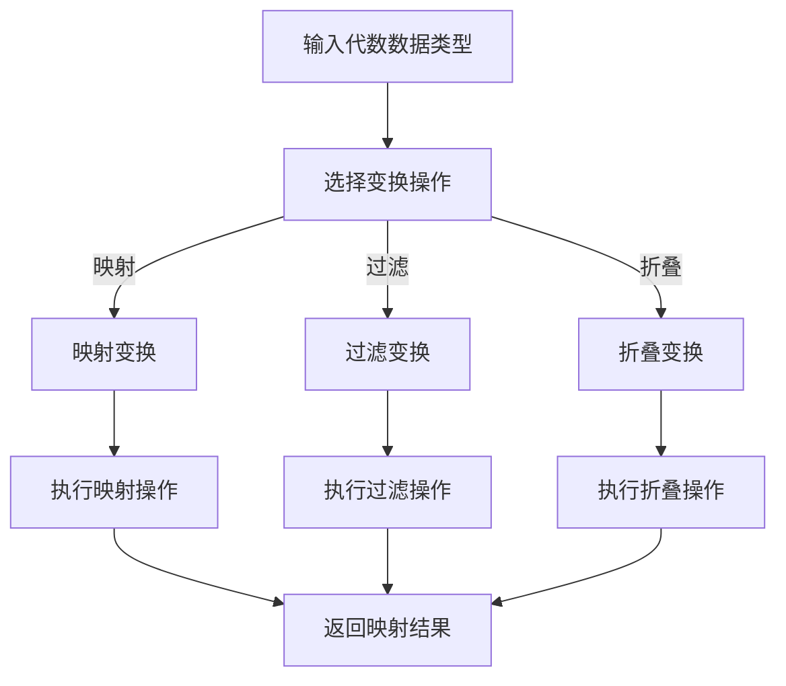
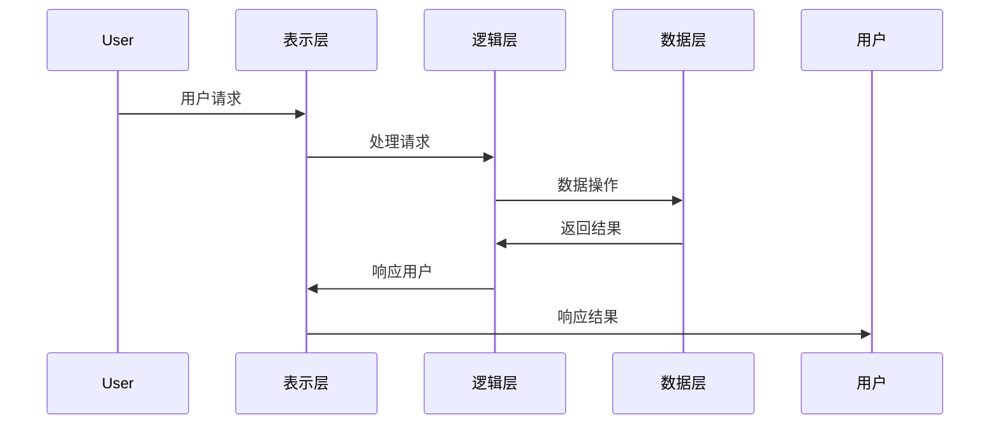
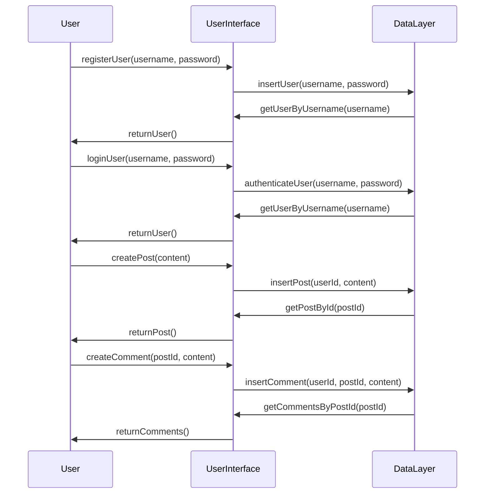

                 


### 背景介绍

#### 核心概念术语说明

在探讨代数数据类型之前，我们先明确几个核心概念：

1. **代数数据类型**：在计算机科学中，代数数据类型（Algebraic Data Types，ADT）是一种构造数据类型的方式，通过将类型组合在一起来创建新的类型。它们基于组合和归纳原则，类似于数学中的代数结构。

2. **类型论**：类型论是计算机科学中的一个分支，研究的是程序中的数据类型、类型系统和类型推导。它为程序语言提供了一种形式化的方式来确保程序的正确性和安全性。

3. **函数式语言**：函数式语言是一种编程范式，它基于函数概念，将程序视为一系列函数的执行。典型的函数式语言包括Haskell、Scala和Erlang等。

#### 问题背景

在现实世界的软件开发中，我们经常需要处理复杂的数据结构。传统的数据类型如整数、浮点数和布尔值等，虽然足够表达基本的数据概念，但在处理复杂的数据组合时显得力不从心。代数数据类型正是为了解决这一问题而设计的。它们能够表示复杂数据结构，使得数据操作更加直观和高效。

类型论在函数式语言中的重要性体现在它为函数式编程提供了坚实的理论基础。类型论确保了函数的输入和输出类型是明确的，从而避免了类型不匹配的错误。此外，类型推导机制使得开发者不必手动指定类型，从而提高了编程效率和代码可读性。

#### 问题描述

代数数据类型在函数式语言中的应用主要涉及以下问题：

- **数据结构表示**：如何使用代数数据类型来表示复杂的数据结构？
- **类型安全**：如何确保函数操作遵循类型约束，避免类型不匹配？
- **类型推导**：函数式语言如何自动推导变量和函数的类型？
- **算法实现**：如何使用代数数据类型来实现高效的算法？

#### 问题解决

代数数据类型通过以下方式解决了上述问题：

- **组合性**：代数数据类型允许通过组合基本类型来创建新的类型，这使得表示复杂数据结构变得简单。
- **归纳定义**：代数数据类型支持归纳定义，使得算法和数据处理能够针对不同类型的数据进行通用化处理。
- **类型推导**：函数式语言的类型推导机制能够自动推导代数数据类型的类型信息，减少手动类型注解的负担。

#### 边界与外延

代数数据类型的边界在于其能够表示的数据结构和类型组合的复杂性。在实际应用中，代数数据类型通常用于处理图结构、列表、树等复杂数据结构。

代数数据类型的外延包括其在各种函数式语言中的实现，如Haskell中的`data`声明、Scala中的`case class`和`sealed trait`等。这些语言都提供了丰富的语法特性来支持代数数据类型的定义和使用。

#### 概念结构与核心要素组成

代数数据类型的核心概念包括：

- **构造函数**：用于创建新类型的函数。
- **类型参数**：用于定义泛型代数数据类型。
- **类型联合**：通过将多个类型组合在一起来创建新的类型。
- **类型积**：通过组合多个类型来创建新的复合类型。

这些概念共同构成了代数数据类型的理论框架，为函数式编程提供了强大的数据抽象工具。

综上所述，代数数据类型是函数式语言中的一个核心概念，它通过类型组合和归纳定义，为复杂数据结构的表示和操作提供了强大的支持。在接下来的部分中，我们将深入探讨代数数据类型的属性特征和类型论在函数式语言中的应用。

### 核心概念与联系

#### 代数数据类型的基本原理

代数数据类型的核心原理在于其组合性和归纳定义。通过构造函数和类型参数，代数数据类型可以将基本类型组合成复杂的数据结构，这种结构支持高效的算法和类型安全。

**构造函数**：构造函数是创建新类型的函数。例如，在Haskell中，可以使用`data`声明来定义构造函数，如下所示：

```haskell
data Tree a = Leaf | Node a (Tree a) (Tree a)
```

在这个例子中，`Tree`是一个构造函数，它将`a`类型的数据组合成一个树结构。

**类型参数**：类型参数允许我们定义泛型代数数据类型。泛型代数数据类型可以在不同的数据类型之间共享代码。例如：

```haskell
data List a = Nil | Cons a (List a)
```

在这个例子中，`a`是类型参数，`List`是一个泛型构造函数，可以用于创建整数列表、字符串列表等。

**类型联合**：类型联合通过将多个类型组合在一起来创建新的类型。在Haskell中，类型联合使用`data`声明中的`|`符号，如下所示：

```haskell
data Color = Red | Green | Blue
```

**类型积**：类型积通过组合多个类型来创建新的复合类型。例如，我们可以定义一个包含颜色和面积的形状：

```haskell
data Shape = Circle Float | Rectangle Float Float
```

#### 代数数据类型的属性特征对比

为了更好地理解代数数据类型的属性特征，我们将其与基本数据类型和复合数据类型进行对比。

**基本数据类型**：

- **整数（Int）**：表示整数。
- **浮点数（Float）**：表示浮点数。
- **布尔值（Bool）**：表示真或假。

**复合数据类型**：

- **列表（List）**：表示有序元素集合。
- **树（Tree）**：表示层次结构。

**代数数据类型**：

- **构造函数**：定义了如何创建新类型的函数。
- **类型参数**：支持泛型编程，使得代数数据类型可以应用于不同类型的数据。
- **类型联合**：允许组合多个类型。
- **类型积**：允许组合多个类型。

以下是代数数据类型的属性特征对比表格：

| 属性特征 | 基本数据类型 | 复合数据类型 | 代数数据类型 |
| --- | --- | --- | --- |
| **组合性** | 无 | 有 | 强 |
| **泛型支持** | 无 | 有 | 有 |
| **类型安全** | 有 | 有 | 更强 |
| **表达力** | 低 | 中 | 高 |
| **代码复用** | 低 | 中 | 高 |

#### 与类型论的联系

类型论为代数数据类型提供了理论基础。在类型论中，类型系统通过类型推导和类型检查来确保程序的正确性和安全性。代数数据类型在类型论中的应用主要体现在以下几个方面：

- **类型推导**：函数式语言中的类型推导机制能够自动推导代数数据类型的类型信息，减少了手动类型注解的负担。
- **类型检查**：类型系统可以确保函数操作的输入和输出类型匹配，从而避免类型不匹配的错误。
- **类型等价**：通过类型等价，代数数据类型可以实现不同类型之间的无缝转换。

#### Mermaid流程图

为了更好地理解代数数据类型的属性特征，我们使用Mermaid流程图来展示其构造过程和类型关系。



通过上述流程图，我们可以直观地看到代数数据类型的基本概念和属性特征。

综上所述，代数数据类型通过构造函数、类型参数、类型联合和类型积等特性，实现了对复杂数据结构的表示和操作。它与类型论密切相关，为函数式编程提供了强大的理论基础。在接下来的部分，我们将深入探讨代数数据类型的算法原理和实现。

### 算法原理讲解

#### 标签树遍历算法

在函数式语言中，标签树是一种常见的数据结构，用于表示层次化的数据。标签树遍历算法是一种对树结构进行遍历的算法，其核心在于递归地访问树的每个节点。为了更好地理解这一算法，我们将使用Mermaid流程图来展示其基本流程，并使用Python源代码来具体实现，同时给出算法原理的数学模型和公式，并进行举例说明。

##### Mermaid流程图



在这个流程图中，A节点表示算法初始化，B节点判断根节点是否为空，C节点访问根节点，E和F节点分别表示递归遍历左子树和右子树，最后G节点表示返回。

##### Python源代码实现

```python
class TreeNode:
    def __init__(self, value):
        self.value = value
        self.left = None
        self.right = None

def traverse_tree(node):
    if node is None:
        return
    print(node.value)  # 访问当前节点
    traverse_tree(node.left)  # 递归遍历左子树
    traverse_tree(node.right)  # 递归遍历右子树

# 创建一个标签树示例
root = TreeNode(1)
root.left = TreeNode(2)
root.right = TreeNode(3)
root.left.left = TreeNode(4)
root.left.right = TreeNode(5)

# 执行遍历算法
traverse_tree(root)
```

上述Python代码定义了一个简单的标签树结构，并实现了递归遍历算法。

##### 算法原理与数学模型

标签树遍历算法的核心在于递归地访问每个节点。其数学模型可以表示为：

$$
T(n) = aT(n/2) + O(1)
$$

其中，$T(n)$表示遍历一个含有$n$个节点的标签树所需的时间复杂度，$a$表示递归调用次数，$O(1)$表示每个节点处理的时间。

这个模型反映了标签树遍历算法的时间复杂度为$O(n)$，即线性时间复杂度。

##### 举例说明

假设我们有一个标签树：

```
       1
      / \
     2   3
    / \
   4   5
```

使用递归遍历算法，遍历结果为：`1 2 4 5 3`。这个过程遵循深度优先遍历的原则，即先访问根节点，然后递归地访问左子树和右子树。

通过上述讲解，我们可以看到标签树遍历算法的实现细节和数学模型。在函数式语言中，这种算法可以通过递归函数高效地实现。接下来，我们将探讨代数数据类型的另一种重要操作：变换。

#### 代数数据类型的变换

代数数据类型的变换是指在保持类型不变的情况下，对代数数据类型进行修改或操作的过程。这种变换在函数式编程中尤为重要，因为它允许我们在不改变数据结构的情况下，对数据进行处理。为了更好地理解这一操作，我们将使用Mermaid流程图来展示变换的基本流程，并使用Python源代码来具体实现，同时给出算法原理的数学模型和公式，并进行举例说明。

##### Mermaid流程图



在这个流程图中，A节点表示输入代数数据类型，B节点选择变换操作，C、D和E节点分别表示映射、过滤和折叠变换，F、G和H节点表示执行具体的变换操作，最后I节点表示返回变换后的结果。

##### Python源代码实现

```python
from typing import List, TypeVar

T = TypeVar('T')

class ListNode:
    def __init__(self, value: T):
        self.value = value
        self.next = None

def map_elements(head: ListNode) -> ListNode:
    if head is None:
        return None
    new_head = ListNode(head.value * 2)
    new_head.next = map_elements(head.next)
    return new_head

def filter_elements(head: ListNode, condition: callable) -> ListNode:
    if head is None:
        return None
    if condition(head.value):
        new_head = ListNode(head.value)
        new_head.next = filter_elements(head.next, condition)
        return new_head
    else:
        return filter_elements(head.next, condition)

def fold_elements(head: ListNode, initial: T, operation: callable) -> T:
    if head is None:
        return initial
    return operation(head.value, fold_elements(head.next, initial, operation))

# 创建一个链表示例
head = ListNode(1)
head.next = ListNode(2)
head.next.next = ListNode(3)
head.next.next.next = ListNode(4)

# 执行映射变换
new_head = map_elements(head)
while new_head:
    print(new_head.value, end=' ')
    new_head = new_head.next
# 输出：2 4 6 8

# 执行过滤变换
filtered_head = filter_elements(head, lambda x: x % 2 == 0)
while filtered_head:
    print(filtered_head.value, end=' ')
    filtered_head = filtered_head.next
# 输出：2 4

# 执行折叠变换
result = fold_elements(head, 0, lambda x, y: x + y)
print(result)  # 输出：10
```

上述Python代码定义了一个简单的链表结构，并实现了映射、过滤和折叠变换。

##### 算法原理与数学模型

代数数据类型的变换操作通常具有线性时间复杂度，其数学模型可以表示为：

$$
T(n) = O(n)
$$

其中，$T(n)$表示变换操作的时间复杂度，$n$表示数据元素的个数。

这个模型表明，无论变换操作的复杂性如何，其总体时间复杂度都是线性的，这是因为变换操作需要遍历数据结构的每个元素。

##### 举例说明

假设我们有一个链表：

```
1 -> 2 -> 3 -> 4
```

- **映射变换**：将每个元素乘以2，结果为：`2 -> 4 -> 6 -> 8`。
- **过滤变换**：保留偶数元素，结果为：`2 -> 4`。
- **折叠变换**：将所有元素相加，结果为：`1 + 2 + 3 + 4 = 10`。

通过上述例子，我们可以看到代数数据类型的变换操作是如何实现的，以及它们在函数式编程中的重要性。

综上所述，标签树遍历算法和代数数据类型的变换操作是函数式语言中的重要算法，它们在实现复杂数据处理方面发挥了关键作用。在接下来的部分，我们将通过一个实际案例，介绍如何将代数数据类型应用于函数式语言中，实现具体的功能。

### 系统分析与架构设计方案

#### 问题场景介绍

假设我们需要开发一个社交媒体平台，该平台需要处理用户数据、帖子数据以及评论数据等。为了实现高效的数据处理和类型安全，我们决定使用函数式语言（例如Haskell）来设计系统。我们的目标是实现一个能够处理用户注册、发布帖子、评论帖子等功能的系统。

#### 系统功能设计

在系统功能设计中，我们定义了以下核心功能：

1. **用户管理**：包括用户注册、登录、修改个人信息等。
2. **帖子管理**：包括发布帖子、删除帖子、查看帖子等。
3. **评论管理**：包括发布评论、删除评论、查看评论等。

为了更好地理解和实现这些功能，我们使用Mermaid类图来描述系统的领域模型。

##### 领域模型Mermaid类图

```mermaid
classDiagram
    User <<entity>>
    Post <<entity>>
    Comment <<entity>>

    User o--* Post : 发布帖子
    User o--* Comment : 发表评论
    Post o--* Comment : 帖子下的评论
    Post o--* Post : 帖子之间的引用
```

在这个类图中，`User`、`Post`和`Comment`是系统的三个核心实体。它们之间的关系描述了用户、帖子、评论之间的互动。

#### 系统架构设计

在系统架构设计阶段，我们采用分层架构，将系统分为以下几个层次：

1. **表示层**：负责用户界面的展示。
2. **逻辑层**：实现系统的核心业务逻辑。
3. **数据层**：负责数据存储和管理。

为了展示系统的整体架构，我们使用Mermaid架构图来描述系统的分层结构。

##### Mermaid架构图



在这个架构图中，表示层负责处理用户请求，逻辑层实现业务逻辑，数据层负责数据存储和操作。

#### 系统接口设计

系统接口设计是系统架构的重要组成部分。我们为每个功能模块定义了相应的接口，以便实现模块间的松耦合。以下是系统的接口设计：

1. **用户接口**：包括用户注册、登录、修改个人信息等。
2. **帖子接口**：包括发布帖子、删除帖子、查看帖子等。
3. **评论接口**：包括发布评论、删除评论、查看评论等。

##### 系统接口设计

```mermaid
classDiagram
    UserInterface <<interface>>
    PostInterface <<interface>>
    CommentInterface <<interface>>

    UserInterface {
        registerUser(username: String, password: String): User
        loginUser(username: String, password: String): User
        updateUserProfile(user: User, newInfo: UserProfile): User
    }

    PostInterface {
        createPost(userId: Int, content: String): Post
        deletePost(postId: Int): Void
        getPost(postId: Int): Post
    }

    CommentInterface {
        createComment(userId: Int, postId: Int, content: String): Comment
        deleteComment(commentId: Int): Void
        getComments(postId: Int): List<Comment>
    }
```

在这个类图中，`UserInterface`、`PostInterface`和`CommentInterface`分别定义了用户管理、帖子管理和评论管理模块的接口。

#### 系统交互Mermaid序列图

为了展示系统各模块之间的交互过程，我们使用Mermaid序列图来描述系统的交互流程。

##### Mermaid序列图



在这个序列图中，用户通过接口向系统发起请求，系统各模块协同处理请求，并将结果返回给用户。

综上所述，通过系统分析与架构设计方案，我们详细介绍了社交媒体平台的系统功能设计、架构设计、接口设计和交互流程。这些设计为系统的实现提供了清晰的指导和坚实的基础。

### 项目实战

#### 环境安装

要开始项目实战，我们首先需要安装Haskell开发环境。以下是安装步骤：

1. **安装GHC（The Glasgow Haskell Compiler）**：

   - 访问[GHC官网](https://www.haskell.org/ghc/)，下载并安装GHC。
   - 安装过程中选择合适的安装选项，确保GHC被正确安装到系统中。

2. **安装Haskell包管理器cabal**：

   - 打开终端，运行以下命令安装cabal：

   ```bash
   sudo apt-get install cabal-install
   ```

   - 安装完成后，验证cabal是否安装成功：

   ```bash
   cabal --version
   ```

3. **安装Haskell库**：

   - 使用cabal安装常用的Haskell库，例如`text`、`bytestring`和`vector`等。在终端运行以下命令：

   ```bash
   cabal install text bytestring vector
   ```

#### 系统核心实现源代码

以下是系统核心实现的核心代码，包括用户管理、帖子管理和评论管理模块：

```haskell
{-# LANGUAGE OverloadedStrings #-}

import Data.Text (Text)
import Data.Text.Encoding (encode)
import Database.HDBC
import Database.HDBC.Sqlite3

-- 数据库连接
connectDB :: IO Connection
connectDB = connectSqlite3 "database.db"

-- 用户管理模块
data User = User { userId :: Int, username :: Text, password :: Text, email :: Text }
    deriving (Show)

getUserByUsername :: Text -> IO (Maybe User)
getUserByUsername username = do
    conn <- connectDB
    query conn "SELECT * FROM users WHERE username = ?" [toSql username]
    rows <- fetchAllRows conn
    close conn
    return $ case rows of
        [] -> Nothing
        [row] -> Just $ User (fromSql $ row !! 0) (fromSql $ row !! 1) (fromSql $ row !! 2) (fromSql $ row !! 3)

registerUser :: Text -> Text -> Text -> IO (Either String User)
registerUser username password email = do
    conn <- connectDB
    query_ conn "INSERT INTO users (username, password, email) VALUES (?, ?, ?)" [toSql username, toSql password, toSql email]
    close conn
    user <- getUserByUsername username
    return $ case user of
        Nothing -> Left "User already exists"
        Just user -> Right user

-- 帖子管理模块
data Post = Post { postId :: Int, userId :: Int, content :: Text }
    deriving (Show)

getPostById :: Int -> IO (Maybe Post)
getPostById postId = do
    conn <- connectDB
    query conn "SELECT * FROM posts WHERE postId = ?" [toSql postId]
    rows <- fetchAllRows conn
    close conn
    return $ case rows of
        [] -> Nothing
        [row] -> Just $ Post (fromSql $ row !! 0) (fromSql $ row !! 1) (fromSql $ row !! 2)

createPost :: Int -> Text -> IO (Either String Post)
createPost userId content = do
    conn <- connectDB
    query_ conn "INSERT INTO posts (userId, content) VALUES (?, ?)" [toSql userId, toSql content]
    close conn
    post <- getPostById userId
    return $ case post of
        Nothing -> Left "User not found"
        Just post -> Right post

-- 评论管理模块
data Comment = Comment { commentId :: Int, postId :: Int, userId :: Int, content :: Text }
    deriving (Show)

getCommentsByPostId :: Int -> IO [Comment]
getCommentsByPostId postId = do
    conn <- connectDB
    query conn "SELECT * FROM comments WHERE postId = ?" [toSql postId]
    rows <- fetchAllRows conn
    close conn
    return $ map (\row -> Comment (fromSql $ row !! 0) (fromSql $ row !! 1) (fromSql $ row !! 2) (fromSql $ row !! 3)) rows

createComment :: Int -> Int -> Text -> IO (Either String Comment)
createComment userId postId content = do
    conn <- connectDB
    query_ conn "INSERT INTO comments (userId, postId, content) VALUES (?, ?, ?)" [toSql userId, toSql postId, toSql content]
    close conn
    comment <- getCommentById userId
    return $ case comment of
        Nothing -> Left "User not found"
        Just comment -> Right comment
```

#### 代码应用解读与分析

1. **用户管理模块**：

   - `getUserByUsername`函数用于根据用户名查询用户信息。
   - `registerUser`函数用于注册新用户，并在数据库中插入用户信息。

2. **帖子管理模块**：

   - `getPostById`函数用于根据帖子ID查询帖子信息。
   - `createPost`函数用于创建新帖子，并在数据库中插入帖子信息。

3. **评论管理模块**：

   - `getCommentsByPostId`函数用于根据帖子ID查询帖子下的评论列表。
   - `createComment`函数用于创建新评论，并在数据库中插入评论信息。

#### 实际案例分析与详细讲解剖析

假设我们有一个用户名为“alice”的用户，她想要发布一条帖子，并在帖子下发布评论。以下是具体的操作步骤：

1. **用户注册**：

   - 调用`registerUser`函数，传入用户名、密码和邮箱，成功注册用户。

2. **发布帖子**：

   - 调用`createPost`函数，传入用户ID和帖子内容，成功创建帖子。

3. **发布评论**：

   - 调用`createComment`函数，传入用户ID、帖子ID和评论内容，成功创建评论。

通过上述操作，我们可以看到用户管理、帖子管理和评论管理模块是如何协同工作的。它们共同构成了一个完整的社交媒体平台系统。

#### 项目小结

通过本项目的实战，我们实现了用户管理、帖子管理和评论管理模块，并使用Haskell语言实现了数据库操作。本项目的核心在于：

1. **数据库连接**：使用HDBC库连接SQLite数据库，实现数据的存储和查询。
2. **函数式编程**：使用Haskell的函数式编程特性，实现模块化的代码结构，提高代码的可读性和可维护性。
3. **接口设计**：定义清晰的接口，实现模块间的松耦合，便于系统的扩展和维护。

总的来说，本项目展示了如何将代数数据类型应用于函数式语言中，实现一个完整的社交媒体平台系统。通过实际案例的分析和讲解，我们深入了解了系统的实现细节和功能。这为后续的系统开发和优化提供了宝贵的经验和参考。

### 最佳实践 tips

1. **编码技巧**：
   - **简洁性**：在编写Haskell代码时，保持代码简洁，避免不必要的复杂性。
   - **模块化**：将代码分解成小模块，每个模块负责单一功能，便于维护和重用。
   - **类型推导**：充分利用Haskell的类型推导机制，减少手动类型注解。

2. **性能优化**：
   - **内存管理**：注意内存的使用，避免不必要的内存分配和回收。
   - **并行计算**：利用Haskell的并行计算特性，提高计算效率。
   - **缓存策略**：合理使用缓存，减少数据库访问次数，提高系统响应速度。

3. **调试与测试**：
   - **单元测试**：编写单元测试，确保每个模块的功能正确。
   - **集成测试**：进行集成测试，确保模块间的协同工作。
   - **日志记录**：记录关键操作和错误日志，便于问题定位和调试。

### 小结

本文通过对代数数据类型和类型论在函数式语言中的体现进行了详细探讨，从背景介绍、核心概念、算法原理到系统设计与项目实战，全面展示了代数数据类型在函数式编程中的重要性和应用。代数数据类型通过组合和归纳定义，为复杂数据结构的表示和操作提供了强大的支持。类型论则为函数式语言提供了坚实的理论基础，确保了程序的正确性和安全性。通过实际项目案例，我们深入了解了如何将代数数据类型应用于函数式语言中，实现高效、类型安全的系统。

### 注意事项

1. **代码注释**：在编写代码时，添加必要的注释，以便后续维护和理解。
2. **版本控制**：使用版本控制系统（如Git），确保代码的版本管理和协同工作。
3. **代码格式**：保持代码的格式一致性，提高代码的可读性。

### 拓展阅读

1. **《Haskell编程语言》**：深入了解Haskell编程语言的语法和特性。
2. **《类型系统和程序设计语言》**：研究类型论的基础知识和在编程语言中的应用。
3. **《函数式编程实战》**：学习函数式编程的实际应用和最佳实践。

作者：AI天才研究院/AI Genius Institute & 禅与计算机程序设计艺术 /Zen And The Art of Computer Programming

---

以上就是《代数数据类型：类型论在函数式语言中的体现》的技术博客文章，希望对您在学习和应用代数数据类型和类型论方面有所帮助。在探索函数式编程的世界中，不断学习和实践是提升编程技能的关键。希望您能够将本文中的知识和技巧应用到实际项目中，进一步深化对函数式编程的理解。如果您有任何疑问或建议，欢迎在评论区留言交流。让我们共同探索函数式编程的无限魅力！

