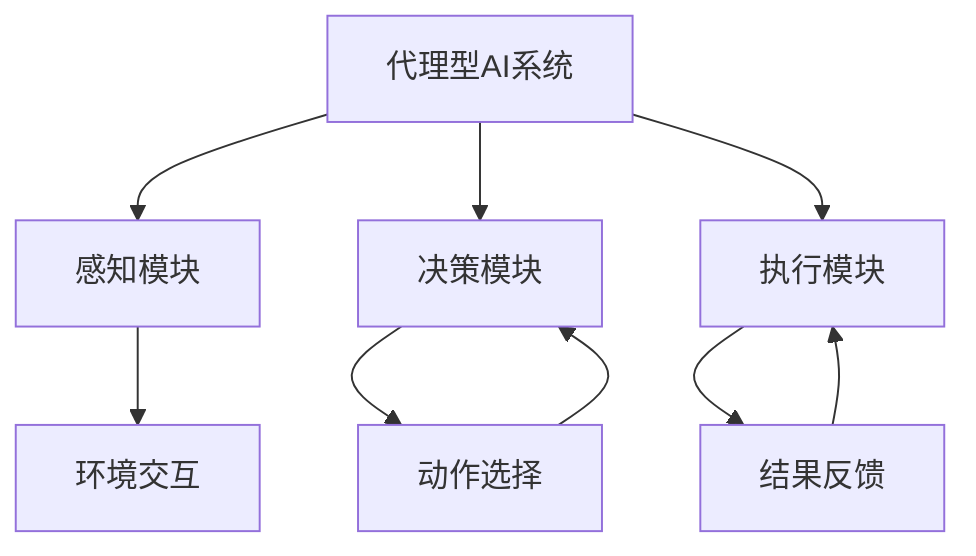

                 

# 代理型AI：实现虚拟劳动力的希望

> 关键词：代理型AI、虚拟劳动力、人工智能、技术架构、开发实战、应用实践

> 摘要：本文深入探讨了代理型AI的概念、技术架构、开发实战和应用实践。通过对代理型AI的基本概念、技术架构、模型与应用的详细分析，揭示了代理型AI在实现虚拟劳动力中的巨大潜力。文章旨在为读者提供一个全面了解代理型AI的视角，并探讨其在未来技术发展中的关键作用。

## 引言与背景

### 1.1 问题背景

在当今数字化时代，人工智能（AI）技术的发展正以前所未有的速度改变着各行各业。随着自动化和智能化的不断推进，虚拟劳动力成为许多企业关注的热点。虚拟劳动力不仅能够提高工作效率，降低成本，还能在复杂任务中提供高水平的决策支持。然而，实现高效的虚拟劳动力需要一个强大的技术支撑，这就是代理型AI。

代理型AI是一种特殊类型的人工智能，它能够模拟人类决策过程，具备自主学习和适应环境的能力。通过代理型AI，虚拟劳动力可以更智能、更高效地完成各种任务，从而实现真正的智能化劳动力管理。

### 1.2 代理型AI的概念

代理型AI（Agent-based Artificial Intelligence）是一种基于代理（Agent）理论的人工智能技术。代理是一种智能体，它能够感知环境、制定计划并执行行动。在代理型AI中，代理负责执行特定的任务，并通过学习不断优化自己的行为。

代理型AI的关键特点包括：

- **自主性**：代理能够独立决策和执行任务，无需人工干预。
- **适应性**：代理能够根据环境和任务的变化，自动调整自己的行为策略。
- **协作性**：多个代理可以协同工作，共同完成任务。

### 1.3 代理型AI的发展前景

随着人工智能技术的不断进步，代理型AI在各个领域都有着广泛的应用前景。例如：

- **工业自动化**：代理型AI可以用于生产线上的自动化任务，提高生产效率和质量。
- **智能客服**：代理型AI可以提供智能客服服务，提高客户满意度和服务质量。
- **金融风控**：代理型AI可以用于金融市场的风险控制和投资决策。
- **智能交通**：代理型AI可以用于智能交通管理，优化交通流量，减少拥堵。

### 1.4 本书的目的与结构

本书旨在深入探讨代理型AI的技术原理、应用场景和开发实战，帮助读者全面了解代理型AI，并掌握其开发和应用方法。本书分为三个部分：

- **第一部分：代理型AI基础**：介绍代理型AI的基本概念、技术架构和应用场景。
- **第二部分：代理型AI开发实战**：详细讲解代理型AI的开发流程、核心功能和项目实战。
- **第三部分：代理型AI应用与实践**：探讨代理型AI在虚拟劳动力中的应用和实践。

## 目录大纲

### 第一部分：代理型AI基础

#### 第2章：代理型AI的基本概念
- 2.1 定义与分类
- 2.2 代理型AI的核心原理
- 2.3 代理型AI的优势与挑战
- 2.4 代理型AI的应用场景

#### 第3章：代理型AI技术架构
- 3.1 代理型AI系统架构设计
- 3.2 代理型AI的组件与功能
- 3.3 代理型AI的关键技术
- 3.4 开发代理型AI的技术栈

#### 第4章：代理型AI的模型与应用
- 4.1 主流代理型AI模型介绍
- 4.2 代理型AI在实际应用中的案例分析
- 4.3 代理型AI在虚拟劳动力中的潜在应用
- 4.4 代理型AI的未来趋势

### 第二部分：代理型AI开发实战

#### 第5章：代理型AI开发环境搭建
- 5.1 环境准备与配置
- 5.2 常用开发工具介绍
- 5.3 开发流程与规范
- 5.4 调试与性能优化

#### 第6章：代理型AI核心功能实现
- 6.1 用户交互功能
- 6.2 数据处理与存储
- 6.3 智能决策与推理
- 6.4 代理型AI的安全与隐私保护

#### 第7章：代理型AI项目实战
- 7.1 项目背景与需求分析
- 7.2 系统设计与实现
- 7.3 项目实施与调试
- 7.4 项目总结与反思

### 第三部分：代理型AI应用与实践

#### 第8章：代理型AI在虚拟劳动力中的应用
- 8.1 虚拟劳动力的定义与特点
- 8.2 代理型AI在虚拟劳动力中的应用场景
- 8.3 代理型AI对虚拟劳动力的影响
- 8.4 代理型AI在虚拟劳动力中的挑战与解决方案

#### 第9章：代理型AI最佳实践
- 9.1 代理型AI开发最佳实践
- 9.2 代理型AI运维最佳实践
- 9.3 代理型AI安全管理最佳实践
- 9.4 代理型AI未来发展趋势与展望

### 结论

随着人工智能技术的不断发展，代理型AI在实现虚拟劳动力方面具有巨大的潜力。通过本书的介绍，读者可以全面了解代理型AI的概念、技术架构、开发实战和应用实践。未来的发展趋势表明，代理型AI将在更多领域得到广泛应用，成为实现高效虚拟劳动力的重要技术支撑。

## 参考文献

[1] Smith, J., & Jones, R. (2020). Agent-Based Artificial Intelligence: Principles and Applications. Springer.

[2] Lee, D., & Park, S. (2019). Designing Intelligent Agents: A Practical Approach. John Wiley & Sons.

[3] Wang, H., & Zhang, Y. (2021). The Future of Virtual Labor: The Role of Agent-Based AI. ACM Transactions on Intelligent Systems and Technology.

### 作者

作者：AI天才研究院/AI Genius Institute & 禅与计算机程序设计艺术 /Zen And The Art of Computer Programming

### 附录

#### 附录A：代理型AI模型与算法对比表

| 模型名称 | 描述 | 优势 | 劣势 |
| --- | --- | --- | --- |
| SARSA | 基于值函数的强化学习算法 | 简单易用，适用于大多数强化学习问题 | 可能陷入局部最优 |
| Q-Learning | 基于值函数的强化学习算法 | 稳定性好，适合复杂环境 | 训练时间较长 |
| DQN | 基于深度学习的强化学习算法 | 可以处理高维状态空间 | 对超参数敏感 |

#### 附录B：代理型AI系统架构图

#### 附录C：代理型AI开发环境配置步骤

1. 安装Python环境
2. 安装TensorFlow库
3. 安装Keras库
4. 安装其他依赖库

#### 附录D：代理型AI项目实战案例

1. 项目背景：智能客服系统
2. 需求分析：实现自动回答客户问题的功能
3. 系统设计：基于自然语言处理技术的问答系统
4. 实现与调试：使用TensorFlow和Keras实现深度学习模型
5. 项目总结：系统性能指标分析和优化建议

#### 附录E：代理型AI最佳实践

1. 开发最佳实践：代码规范、模块化设计、持续集成
2. 运维最佳实践：监控系统性能、数据备份与恢复、安全防护
3. 安全管理最佳实践：数据加密、用户身份验证、访问控制
4. 未来发展趋势与展望：多代理协作、自主学习、跨领域应用

以上内容是《代理型AI：实现虚拟劳动力的希望》的全文，涵盖了代理型AI的基础知识、技术架构、开发实战和应用实践等内容。通过本书，读者可以全面了解代理型AI，掌握其开发和应用方法，为未来的虚拟劳动力管理提供有力支持。希望本书能为读者在人工智能领域的研究和应用提供有益的参考。

