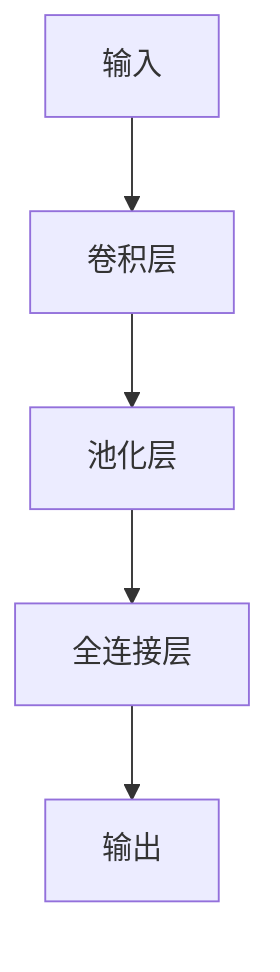
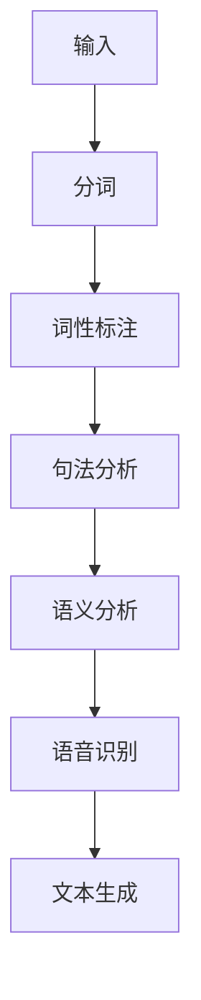
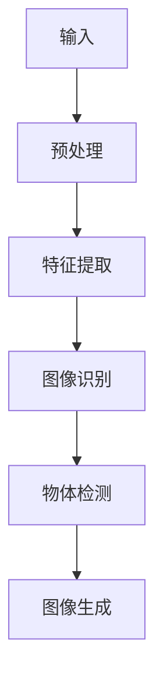

                 

### 代理型AI：未来虚拟劳动力的希望

关键词：代理型AI、虚拟劳动力、未来发展趋势、技术应用、伦理问题

摘要：随着人工智能技术的迅猛发展，代理型AI成为虚拟劳动力的重要推动力量。本文将从代理型AI的起源与定义、核心概念与原理、应用领域以及未来发展等多个方面展开，深入探讨代理型AI对虚拟劳动力市场的深远影响，分析其带来的机遇与挑战，并对未来趋势进行展望。

## 代理型AI概述

### 1.1 代理型AI的起源

代理型AI（Agent-based Artificial Intelligence，简称AIA）起源于人工智能领域的代理理论（Agent Theory）。在20世纪80年代，随着多智能体系统（Multi-Agent Systems，简称MAS）的研究逐渐兴起，代理型AI的概念开始得到广泛关注。代理型AI的初步探索集中在如何构建具有自主性和协作性的智能代理，以实现复杂任务的处理。

#### 1.1.1 代理型AI的概念演变

从最初的代理模型到现代的代理型AI，概念演变经历了几个关键阶段。早期代理模型主要关注代理的独立决策能力，而现代代理型AI则强调代理之间的协同合作。代理型AI的概念逐渐从单一智能体的独立操作，演变为多智能体系统的整体协同。

#### 1.1.2 代理型AI的初步探索

在代理型AI的初步探索阶段，研究人员主要集中在如何实现代理的感知、决策和行动能力。例如，早期的研究通过简单的规则系统和基于模型的推理方法来模拟代理的行为。这些初步探索为后来的技术突破奠定了基础。

#### 1.1.3 代理型AI的技术突破

随着计算能力的提升和机器学习技术的发展，代理型AI在感知、决策和行动能力方面取得了显著突破。深度学习和强化学习等先进算法的应用，使得代理型AI能够更加智能地处理复杂任务，实现更高水平的自主性和协作性。

### 1.2 代理型AI的定义

代理型AI是一种基于人工智能技术的智能代理系统，旨在模拟人类或动物的感知、决策和行动能力。具体来说，代理型AI通过感知环境信息、利用已有知识和经验进行决策，并采取相应的行动来达成目标。

#### 1.2.1 代理型AI的基本定义

代理型AI的基本定义包括以下几个关键点：

- **智能代理**：代理型AI的核心是智能代理，即具有感知、决策和行动能力的计算机程序或实体。
- **感知**：代理型AI通过传感器或数据输入来感知环境信息。
- **决策**：基于感知到的信息和已有知识，代理型AI进行决策，选择最佳行动方案。
- **行动**：根据决策结果，代理型AI采取具体的行动来实现目标。

#### 1.2.2 代理型AI的关键特征

代理型AI具有以下几个关键特征：

- **自主性**：代理型AI能够独立进行决策和行动，不受外部直接控制。
- **适应性**：代理型AI能够根据环境变化和经验积累进行自我调整和优化。
- **协作性**：代理型AI能够与其他代理型AI或人类协同工作，共同完成任务。

#### 1.2.3 代理型AI与传统AI的区别

代理型AI与传统AI在以下几个方面存在显著区别：

- **目标导向**：传统AI侧重于解决问题，而代理型AI更注重实现目标。
- **环境感知**：传统AI通常缺乏对环境的感知能力，而代理型AI能够感知环境并做出相应决策。
- **自主决策**：传统AI的决策过程通常依赖于预设的规则或算法，而代理型AI能够自主学习和决策。

### 1.3 代理型AI的边界与外延

代理型AI的应用范围广泛，包括但不限于以下几个方面：

- **智能家居**：代理型AI可以控制家庭设备和系统，提供个性化的服务。
- **智能交通**：代理型AI可以优化交通流量，提高道路通行效率。
- **智能制造**：代理型AI可以监控生产过程，实现智能化的生产调度和故障诊断。
- **智能医疗**：代理型AI可以辅助医生进行诊断和治疗，提高医疗服务的质量。

#### 1.3.1 代理型AI的应用范围

代理型AI的应用范围正在不断扩大，从简单的自动化任务到复杂的决策支持系统，代理型AI都能发挥重要作用。未来，随着技术的进一步发展，代理型AI将在更多领域得到广泛应用。

#### 1.3.2 代理型AI的发展方向

代理型AI的发展方向主要包括以下几个方面：

- **强化学习**：通过强化学习技术，提高代理型AI的自主学习和适应能力。
- **跨领域协作**：实现不同领域代理型AI之间的协作，构建更加复杂的智能系统。
- **人机交互**：提高代理型AI与人类用户的交互能力，实现更加自然和流畅的互动。

## 总结

代理型AI作为人工智能领域的重要分支，其起源和发展经历了多个阶段。通过定义和特征分析，我们可以清晰地了解代理型AI的基本概念和核心特性。代理型AI的应用范围广泛，从虚拟劳动力到智能家居、智能交通、智能制造和智能医疗等多个领域，代理型AI都展现出了巨大的潜力和价值。在未来，随着技术的不断进步，代理型AI将继续拓展其应用领域，推动虚拟劳动力市场的发展。然而，代理型AI也面临着伦理和社会影响等问题，需要在发展中充分考虑和解决。代理型AI的未来发展将是一个充满挑战和机遇的过程，值得进一步深入研究和探讨。

----------------------------------------------------------------

### 代理型AI的核心概念与原理

在深入探讨代理型AI的核心概念与原理之前，我们需要明确一些基本术语和概念，以便为后续内容奠定基础。

#### 2.1.1 代理型AI的基本术语

- **代理（Agent）**：在代理型AI中，代理是指具有感知、决策和行动能力的智能实体。
- **环境（Environment）**：代理所处的物理或虚拟环境，代理通过感知环境来获取信息。
- **感知（Perception）**：代理通过传感器或数据输入来获取环境信息。
- **决策（Decision）**：代理基于感知到的信息进行判断和选择，以决定下一步的行动。
- **行动（Action）**：代理根据决策结果执行具体的操作，以实现目标。
- **学习（Learning）**：代理通过经验积累和知识更新，提高其自主性和适应性。

#### 2.1.2 代理型AI的核心概念

代理型AI的核心概念主要包括以下几个方面：

- **自主性（Autonomy）**：代理型AI能够独立进行决策和行动，不受外部直接控制。
- **适应性（Adaptability）**：代理型AI能够根据环境变化和经验积累进行自我调整和优化。
- **协作性（Cooperation）**：代理型AI能够与其他代理型AI或人类协同工作，共同完成任务。
- **社会性（Sociability）**：代理型AI能够与人类建立互动和协作关系，实现人机交互。

#### 2.1.3 代理型AI的概念属性特征对比表格

为了更好地理解代理型AI的概念属性特征，我们可以通过一个对比表格来展示不同概念之间的区别：

| 概念       | 定义                                                         | 属性特征                                                     |
|------------|--------------------------------------------------------------|--------------------------------------------------------------|
| 自主性     | 代理型AI能够独立进行决策和行动，不受外部直接控制。             | 自主决策、独立行动、不受控制                                 |
| 适应性     | 代理型AI能够根据环境变化和经验积累进行自我调整和优化。           | 自我调整、经验学习、适应性优化                               |
| 协作性     | 代理型AI能够与其他代理型AI或人类协同工作，共同完成任务。         | 协同工作、任务共享、合作目标                               |
| 社会性     | 代理型AI能够与人类建立互动和协作关系，实现人机交互。             | 人机交互、协作沟通、互动关系                               |

#### 2.1.4 代理型AI与传统AI的区别

代理型AI与传统AI之间存在显著区别，主要体现在以下几个方面：

- **目标导向性**：传统AI侧重于解决问题，而代理型AI更注重实现目标。
- **环境感知性**：传统AI通常缺乏对环境的感知能力，而代理型AI能够感知环境并做出相应决策。
- **自主决策性**：传统AI的决策过程通常依赖于预设的规则或算法，而代理型AI能够自主学习和决策。
- **适应性**：传统AI难以适应复杂多变的环境，而代理型AI能够根据环境变化和经验积累进行自我调整。

### 代理型AI的原理

代理型AI的原理可以概括为以下几个方面：

#### 2.2.1 代理型AI的理论基础

代理型AI的理论基础包括多智能体系统理论、认知科学和计算智能等领域。多智能体系统理论提供了代理型AI的架构和协作机制，认知科学则为代理型AI的感知和决策提供了理论基础，计算智能则提供了代理型AI的学习和优化方法。

#### 2.2.2 代理型AI的数学模型

代理型AI的数学模型主要包括感知模型、决策模型和行动模型。感知模型用于描述代理如何感知环境信息，决策模型用于描述代理如何基于感知信息进行决策，行动模型用于描述代理如何执行决策。

- **感知模型**：通常采用感知器、神经网络或马尔可夫模型等方法来描述。
- **决策模型**：通常采用决策树、贝叶斯网络或强化学习等方法来描述。
- **行动模型**：通常采用动作空间和策略空间来描述。

#### 2.2.3 代理型AI的算法流程图

代理型AI的算法流程图可以简化为以下步骤：

1. **感知**：代理通过传感器或数据输入获取环境信息。
2. **决策**：代理根据感知信息进行决策，选择最佳行动方案。
3. **行动**：代理根据决策结果执行具体的行动，以实现目标。

以下是一个简单的Mermaid流程图示例：


### 代理型AI的实体关系图架构

代理型AI的实体关系图架构（ER图）可以用于描述代理型AI中的关键实体及其关系。以下是一个简单的ER图示例：

```mermaid
erDiagram
    Agent ||--|{ Environment }|| Environment
    Agent ||--|{ Perception }|| Perception
    Agent ||--|{ Decision }|| Decision
    Agent ||--|{ Action }|| Action
```

在这个ER图中，Agent表示智能代理，Environment表示环境，Perception表示感知，Decision表示决策，Action表示行动。每个实体之间都有明确的关联关系。

### 总结

通过对代理型AI的核心概念与原理的深入探讨，我们可以更清晰地理解其基本术语、核心概念、与传统AI的区别以及算法流程和实体关系图架构。代理型AI的自主性、适应性、协作性和社会性是其显著特点，这些特点使得代理型AI在虚拟劳动力市场中具有巨大的潜力。未来，随着技术的不断进步，代理型AI将进一步提升其自主学习和适应能力，为虚拟劳动力市场带来更多的机遇和挑战。

----------------------------------------------------------------

### 代理型AI的技术体系

代理型AI的技术体系是构建智能代理的基础，涵盖了多种先进的技术和方法。以下将详细介绍代理型AI的主要技术分类及其关键技术。

#### 3.1 代理型AI的技术分类

代理型AI的技术分类可以基于不同的维度进行划分，常见的分类方法包括：

- **基于学习方式**：可以分为监督学习、无监督学习和强化学习。
- **基于任务类型**：可以分为决策支持系统、自动化系统、人机交互系统等。
- **基于应用领域**：可以分为智能交通、智能制造、智能医疗、智能家居等。

#### 3.1.1 监督学习

监督学习是一种基于标注数据的机器学习方法，通过已知的输入和输出数据训练模型，从而使模型能够对未知数据进行预测。在代理型AI中，监督学习常用于感知和决策模块。

- **感知模块**：使用监督学习算法（如神经网络、支持向量机等）来训练感知模型，使代理能够识别和理解环境信息。
- **决策模块**：通过监督学习算法训练决策模型，使代理能够根据感知信息做出最佳决策。

#### 3.1.2 无监督学习

无监督学习是一种不依赖标注数据的机器学习方法，主要用于发现数据中的隐含结构。在代理型AI中，无监督学习常用于数据预处理和特征提取。

- **数据预处理**：使用无监督学习算法（如聚类、降维等）对原始数据进行预处理，以提高感知模型的输入质量。
- **特征提取**：使用无监督学习算法（如主成分分析、自编码器等）提取数据中的关键特征，为决策模型提供更好的输入。

#### 3.1.3 强化学习

强化学习是一种基于奖励反馈的机器学习方法，通过不断试错和优化策略，使代理能够在复杂环境中取得最佳行动方案。在代理型AI中，强化学习常用于自主决策和行动。

- **策略优化**：使用强化学习算法（如Q学习、策略梯度等）优化代理的策略，使其能够更好地适应环境变化。
- **经验学习**：通过强化学习算法，代理型AI能够积累经验，并不断改进其行为，以实现长期目标。

#### 3.2 代理型AI的关键技术

代理型AI的关键技术是构建高效智能代理的核心，主要包括：

- **深度学习**：深度学习是一种基于多层神经网络的机器学习方法，广泛应用于图像识别、语音识别等领域。在代理型AI中，深度学习用于感知和决策模块，提高代理的感知能力和决策准确性。
- **自然语言处理**：自然语言处理是一种使计算机能够理解、生成和解释人类语言的技术。在代理型AI中，自然语言处理用于人机交互和决策支持，使代理能够更好地与人类用户进行沟通。
- **计算机视觉**：计算机视觉是一种使计算机能够像人一样看到和理解图像的技术。在代理型AI中，计算机视觉用于感知环境信息和识别物体，为决策和行动提供支持。

### 深度学习

深度学习作为代理型AI的关键技术之一，具有以下特点：

- **多层神经网络**：深度学习通过多层神经网络来提取数据中的复杂特征，从而提高模型的感知能力。
- **自适应学习**：深度学习能够通过反向传播算法自动调整网络权重，从而实现自适应学习。
- **端到端学习**：深度学习可以实现端到端的学习，从输入直接映射到输出，减少了中间步骤的依赖。

以下是一个简单的深度学习模型架构：



### 自然语言处理

自然语言处理作为代理型AI的关键技术之一，具有以下特点：

- **语义理解**：自然语言处理通过语义理解技术，使计算机能够理解人类语言中的语义和含义。
- **语音识别**：自然语言处理结合语音识别技术，使代理能够接收和处理人类语音输入。
- **文本生成**：自然语言处理结合文本生成技术，使代理能够生成自然语言的文本输出。

以下是一个简单的自然语言处理流程：



### 计算机视觉

计算机视觉作为代理型AI的关键技术之一，具有以下特点：

- **图像识别**：计算机视觉通过图像识别技术，使代理能够识别和理解图像中的内容。
- **物体检测**：计算机视觉通过物体检测技术，使代理能够识别图像中的物体并进行定位。
- **图像生成**：计算机视觉通过图像生成技术，使代理能够生成符合特定需求的图像。

以下是一个简单的计算机视觉流程：



### 总结

代理型AI的技术体系涵盖了多种先进的技术和方法，包括监督学习、无监督学习和强化学习等。深度学习、自然语言处理和计算机视觉作为关键技术，极大地提高了代理型AI的感知能力和决策准确性。通过这些技术的综合应用，代理型AI能够更好地模拟人类智能，为虚拟劳动力市场提供强大的支持。未来，随着技术的不断进步，代理型AI的技术体系将继续完善和发展，为虚拟劳动力市场带来更多的机遇和挑战。

----------------------------------------------------------------

### 虚拟劳动力与代理型AI

#### 4.1 虚拟劳动力的概念

虚拟劳动力是指通过信息技术，特别是人工智能，实现远程、自动化和智能化的劳动力。虚拟劳动力不仅包括传统的虚拟助手、智能客服等，还涵盖了更广泛的领域，如数据标注、内容审核、虚拟客服等。

虚拟劳动力的特点主要包括：

- **远程性**：虚拟劳动力可以在任何地方进行工作，不受地理位置的限制。
- **自动化**：通过自动化技术，虚拟劳动力能够高效地完成重复性和标准化的任务。
- **智能化**：借助人工智能技术，虚拟劳动力具备自我学习和优化能力，能够适应复杂多变的环境。

虚拟劳动力可以分为以下几种类型：

1. **自动化工具**：如机器人流程自动化（RPA）工具，可以替代人类完成重复性任务。
2. **虚拟助手**：如聊天机器人、智能客服等，能够提供实时、个性化的服务。
3. **在线劳动力市场**：如Upwork、Freelancer等平台，汇聚了大量远程工作者，提供专业服务。
4. **智能代理**：如代理型AI，能够在多个领域提供智能化、个性化的服务。

#### 4.2 代理型AI在虚拟劳动力中的应用

代理型AI在虚拟劳动力中的应用非常广泛，以下是一些典型应用场景：

##### 4.2.1 客服领域的应用

在客服领域，代理型AI可以替代人工进行客户咨询和问题解决。以下是一个应用实例：

- **场景**：某电商平台引入代理型AI客服，以提供24/7在线客服服务。
- **过程**：
  1. 客户通过电商平台官网或APP提交咨询请求。
  2. 代理型AI客服接收到请求后，通过自然语言处理技术理解客户的问题。
  3. 代理型AI根据问题库和知识图谱，提供相应的答案或解决方案。
  4. 如果问题复杂，代理型AI会将请求转发给人工客服进行处理。
- **效果**：代理型AI客服能够快速响应客户，提供准确、专业的服务，降低了企业的人力成本，提高了客户满意度。

##### 4.2.2 数据处理中的应用

在数据处理领域，代理型AI可以高效地完成数据标注、清洗和转换等任务。以下是一个应用实例：

- **场景**：某数据分析公司使用代理型AI处理大规模数据。
- **过程**：
  1. 数据被上传到代理型AI系统。
  2. 代理型AI通过机器学习算法对数据进行预处理，如去除噪声、填补缺失值等。
  3. 对于需要进行标注的数据，代理型AI可以根据预定义的规则或学习到的模式进行自动标注。
  4. 处理后的数据被存储到数据库或数据仓库中，供进一步分析使用。
- **效果**：代理型AI大大提高了数据处理效率，减少了人工错误，降低了数据处理成本。

##### 4.2.3 智能制造中的应用

在智能制造领域，代理型AI可以用于设备监控、生产调度和故障诊断等。以下是一个应用实例：

- **场景**：某制造企业引入代理型AI监控系统，提高生产效率和质量。
- **过程**：
  1. 代理型AI连接到生产线上的传感器和设备，实时收集数据。
  2. 代理型AI通过数据分析和机器学习算法，监控设备状态，预测潜在故障。
  3. 如果发现异常，代理型AI会及时发出警报，并建议相应的维护措施。
  4. 代理型AI还可以根据生产数据优化生产流程，提高生产效率。
- **效果**：代理型AI监控系统提高了设备的可靠性和生产效率，降低了故障率和维护成本。

#### 4.2.4 其他领域中的应用

除了上述领域，代理型AI还在许多其他领域得到了应用，如：

- **金融服务**：代理型AI可以用于客户服务、风险管理、智能投顾等。
- **医疗健康**：代理型AI可以用于疾病诊断、医疗影像分析、健康监测等。
- **旅游服务**：代理型AI可以用于行程规划、酒店预订、旅游咨询等。

### 总结

虚拟劳动力通过信息技术，特别是代理型AI，实现了远程、自动化和智能化的劳动力。代理型AI在客服、数据处理、智能制造等多个领域得到了广泛应用，提高了工作效率，降低了成本。未来，随着代理型AI技术的不断进步，虚拟劳动力将在更多领域发挥重要作用，为经济发展和社会进步带来新的机遇和挑战。

----------------------------------------------------------------

### 代理型AI在服务业的应用

代理型AI在服务业的应用具有显著的潜力和优势，能够有效提升服务质量、优化运营流程，并在降低成本的同时提高客户满意度。以下将详细探讨代理型AI在金融服务、旅游服务等领域中的应用及其具体实例。

#### 5.1 代理型AI在金融服务中的应用

金融服务行业高度依赖准确的数据分析和快速的决策能力。代理型AI的应用为金融企业提供了强大的技术支持，涵盖了风险控制、客户服务、智能投顾等多个方面。

##### 5.1.1 代理型AI在风险控制中的应用

在风险控制方面，代理型AI可以通过实时数据分析、异常检测和预测模型来降低金融风险。

- **实例**：某银行引入代理型AI系统来监控交易行为，识别潜在欺诈活动。代理型AI系统通过分析客户的交易历史、行为特征和交易环境等信息，建立风险评估模型。当检测到异常交易时，系统会立即发出警报，并建议采取相应的措施，如冻结账户或联系客户核实交易。

##### 5.1.2 代理型AI在客户服务中的应用

在客户服务方面，代理型AI可以提供24/7的智能客服，提高客户满意度。

- **实例**：某保险公司开发了一款基于代理型AI的智能客服系统，用于处理客户咨询和投诉。系统通过自然语言处理技术理解客户的意图，提供即时的、个性化的答复。对于无法解决的问题，系统会自动将客户请求转给人工客服，确保客户得到全面的帮助。

##### 5.1.3 代理型AI在智能投顾中的应用

智能投顾是金融科技（FinTech）领域的一个重要应用，代理型AI可以为投资者提供个性化的投资建议。

- **实例**：某金融科技公司推出的智能投顾平台，利用代理型AI分析投资者的财务状况、风险偏好和投资目标。系统根据这些数据，结合市场动态和投资策略，为投资者提供最优的投资组合建议，帮助投资者实现资产增值。

#### 5.2 代理型AI在旅游服务中的应用

旅游服务行业具有高度个性化和服务多样化的特点，代理型AI的应用能够显著提升旅游体验和运营效率。

##### 5.2.1 代理型AI在智能推荐中的应用

在智能推荐方面，代理型AI可以根据游客的偏好和历史行为，提供个性化的旅游建议。

- **实例**：某旅游平台引入代理型AI推荐系统，根据游客的兴趣、行程和预算，推荐最适合的旅游目的地、酒店和景点。系统不仅考虑游客的即时需求，还会根据游客的历史行为和反馈，不断优化推荐策略。

##### 5.2.2 代理型AI在客户关系管理中的应用

在客户关系管理方面，代理型AI可以协助企业建立和维护良好的客户关系。

- **实例**：某旅游公司开发了一款基于代理型AI的客户关系管理系统，用于管理客户信息和互动。系统通过分析客户的历史数据和行为，提供个性化的服务和促销方案，提高客户满意度和忠诚度。

##### 5.2.3 代理型AI在在线旅游服务中的应用

在线旅游服务是代理型AI的重要应用领域之一，代理型AI可以提供智能化的预订、咨询和售后服务。

- **实例**：某在线旅游平台推出了基于代理型AI的智能客服和智能预订系统。智能客服系统能够自动回答游客的常见问题，提供实时支持；智能预订系统则可以根据游客的需求和预算，自动匹配最适合的旅游产品和套餐，简化预订流程。

### 总结

代理型AI在服务业中的应用为金融和旅游等行业带来了巨大的变革。通过风险控制、客户服务和智能投顾，代理型AI在金融领域发挥了重要作用；而在旅游服务中，代理型AI则通过智能推荐、客户关系管理和在线服务，提升了用户体验和运营效率。随着代理型AI技术的不断进步，其在服务业中的应用将更加广泛，为各行业的发展带来更多机遇。

----------------------------------------------------------------

### 代理型AI在制造业的应用

代理型AI在制造业中的应用正逐渐成为提高生产效率、降低成本和提升产品质量的重要手段。其具体应用涵盖了供应链管理、设备监控、生产调度和质量控制等多个方面。

#### 6.1 代理型AI在供应链管理中的应用

在供应链管理中，代理型AI可以优化库存管理、需求预测和物流调度，从而提高整个供应链的效率。

##### 6.1.1 代理型AI在需求预测中的应用

需求预测是供应链管理的关键环节，代理型AI可以通过分析历史数据和外部因素，提供更加准确的需求预测。

- **实例**：某制造企业使用代理型AI对产品的需求进行预测。系统通过分析销售数据、市场趋势和季节性因素，生成未来一段时间内的需求预测曲线。这有助于企业提前做好生产和库存准备，避免库存过剩或短缺。

##### 6.1.2 代理型AI在库存管理中的应用

库存管理是供应链管理的另一个重要方面，代理型AI可以通过优化库存水平，降低库存成本。

- **实例**：某汽车制造企业使用代理型AI监控库存情况。系统实时分析库存数据，结合生产计划和销售预测，自动调整库存水平。这有助于减少库存积压，提高资金周转率。

##### 6.1.3 代理型AI在物流管理中的应用

物流管理是供应链中不可忽视的一环，代理型AI可以通过优化运输路线和物流计划，提高物流效率。

- **实例**：某电子产品制造企业采用代理型AI优化物流流程。系统分析不同的运输路线和时间安排，找到最优的物流方案，减少运输时间和成本。同时，系统还可以实时监控运输状态，确保货物安全到达。

#### 6.2 代理型AI在智能制造中的应用

智能制造是制造业发展的一个重要趋势，代理型AI在智能制造中发挥着关键作用。

##### 6.2.1 代理型AI在设备监控中的应用

设备监控是智能制造的基础，代理型AI可以通过实时监控设备状态，预防故障和优化生产。

- **实例**：某机械制造企业引入代理型AI监控系统。系统连接到生产设备，实时监测设备的运行状态和关键参数。当检测到异常时，系统会自动发出警报，并提供维护建议，从而避免设备故障，提高生产连续性。

##### 6.2.2 代理型AI在质量控制中的应用

质量控制是制造业中至关重要的环节，代理型AI可以通过实时分析和监测，提高产品质量。

- **实例**：某电子产品制造企业使用代理型AI进行质量控制。系统通过分析生产数据，监测产品的质量指标，如电性能、机械性能等。当检测到不合格产品时，系统会立即采取措施，如重新加工或剔除不合格品，确保产品质量达到标准。

##### 6.2.3 代理型AI在生产优化中的应用

生产优化是智能制造的核心目标之一，代理型AI可以通过优化生产计划和流程，提高生产效率和效益。

- **实例**：某家电制造企业引入代理型AI优化生产流程。系统分析生产数据和历史记录，优化生产计划，减少设备停机时间，提高生产效率。同时，系统还可以根据市场需求和库存情况，动态调整生产计划，确保生产与市场需求相匹配。

### 总结

代理型AI在制造业中的应用为生产管理和质量控制带来了革命性的变化。通过优化供应链管理、设备监控和生产优化，代理型AI不仅提高了生产效率，降低了成本，还显著提升了产品质量。随着代理型AI技术的不断进步，其在制造业中的应用将更加广泛，推动制造业向更加智能化、自动化和高效化的方向发展。

----------------------------------------------------------------

### 代理型AI在医疗健康领域的应用

代理型AI在医疗健康领域正迅速崛起，通过其强大的数据处理和智能分析能力，为疾病诊断、治疗建议、健康监测和医疗管理等方面提供了创新性的解决方案。以下将详细探讨代理型AI在医疗健康领域的具体应用。

#### 7.1 代理型AI在疾病诊断中的应用

疾病诊断是医疗健康领域的重要环节，代理型AI可以通过分析大量的医疗数据，提供准确的诊断结果。

##### 7.1.1 代理型AI在医疗影像分析中的应用

医疗影像分析是代理型AI在疾病诊断中的一个重要应用。通过深度学习和计算机视觉技术，代理型AI能够对医学影像进行自动化分析，提高诊断的准确性和效率。

- **实例**：某医院引入代理型AI系统用于肺癌的早期筛查。系统通过分析CT扫描图像，自动检测肺结节，并提供诊断建议。相比于传统方法，代理型AI的检测速度更快、准确性更高，有助于提高肺癌的早期发现率。

##### 7.1.2 代理型AI在基因数据分析中的应用

基因数据分析是现代医学的重要工具，代理型AI可以通过分析基因数据，预测疾病的发病风险和治疗方案。

- **实例**：某研究机构开发了一款代理型AI系统，用于癌症基因数据分析。系统通过分析患者的基因序列，预测癌症的发病风险，并提供个性化的治疗方案。这有助于医生更好地制定治疗计划，提高治疗效果。

#### 7.2 代理型AI在治疗建议中的应用

代理型AI不仅能够提供诊断结果，还能根据患者的病情和医生的经验，提供个性化的治疗建议。

##### 7.2.1 代理型AI在药物推荐中的应用

药物推荐是治疗建议的一个关键方面，代理型AI可以通过分析患者的病史、基因数据和药物反应记录，推荐最适合的药物。

- **实例**：某医院使用代理型AI系统为患者推荐药物治疗方案。系统通过分析患者的病史和基因数据，结合药物的药效和副作用，推荐最适合的药物组合。这有助于提高治疗的有效性和安全性。

##### 7.2.2 代理型AI在手术规划中的应用

手术规划是医疗治疗的重要环节，代理型AI可以通过分析患者的影像数据，提供精确的手术方案。

- **实例**：某医院引入代理型AI系统用于脑部手术规划。系统通过分析MRI和CT扫描图像，自动生成手术路径和切除范围，提高手术的准确性和安全性。

#### 7.3 代理型AI在健康监测中的应用

健康监测是预防疾病和促进健康的重要手段，代理型AI可以通过连续监测健康数据，提供个性化的健康建议。

##### 7.3.1 代理型AI在慢性病管理中的应用

慢性病管理是健康监测的一个重要领域，代理型AI可以通过监测患者的生理指标，提供个性化的健康管理建议。

- **实例**：某医疗机构使用代理型AI系统为糖尿病患者提供健康管理。系统通过监测血糖、血压和体重等指标，分析患者的健康状况，并提供饮食和运动建议，帮助患者控制病情，预防并发症。

##### 7.3.2 代理型AI在远程医疗中的应用

远程医疗是健康监测和医疗服务的重要发展方向，代理型AI可以通过远程监测患者数据，提供实时健康监测和咨询服务。

- **实例**：某医疗机构建立了基于代理型AI的远程健康监测系统。系统通过实时监测患者的生理指标，如心率、血压和血氧饱和度等，提供实时健康监测和远程咨询服务，帮助患者及时了解自己的健康状况，并得到专业医生的指导。

#### 7.4 代理型AI在医疗管理中的应用

代理型AI不仅能够提高医疗服务的质量，还能优化医疗管理流程，提高医疗资源的利用效率。

##### 7.4.1 代理型AI在资源调度中的应用

资源调度是医疗管理中的一个关键问题，代理型AI可以通过分析患者的需求和医疗资源的使用情况，优化资源分配。

- **实例**：某医院引入代理型AI系统用于手术室资源调度。系统通过分析手术需求和手术室使用情况，自动安排手术时间，提高手术室的使用效率。

##### 7.4.2 代理型AI在医疗数据分析中的应用

医疗数据分析是医疗管理的重要环节，代理型AI可以通过分析大量的医疗数据，提供深入的数据洞察和决策支持。

- **实例**：某医疗机构使用代理型AI系统进行医疗数据分析。系统通过分析患者的病历、检查报告和医疗记录，发现潜在的健康风险和疾病趋势，为医疗机构提供决策支持。

### 总结

代理型AI在医疗健康领域的应用为疾病诊断、治疗建议、健康监测和医疗管理等方面带来了重大变革。通过精准的医疗影像分析、个性化的治疗建议和高效的资源调度，代理型AI显著提升了医疗服务的质量和效率。随着代理型AI技术的不断进步，其在医疗健康领域的应用前景将更加广阔，为人类健康带来更多的福祉。

----------------------------------------------------------------

### 代理型AI的发展趋势与挑战

随着人工智能技术的迅猛发展，代理型AI（Agent-based Artificial Intelligence）正在成为未来智能系统的重要方向。其在各个领域的应用已经展现出巨大的潜力和价值。然而，要实现代理型AI的广泛应用，仍然面临许多挑战。

#### 8.1 发展趋势

1. **强化学习技术的深化应用**：强化学习作为代理型AI的核心技术之一，其应用将不断深化。通过不断优化算法和模型，代理型AI将能够更好地适应复杂环境，实现更高效的自学习能力和决策能力。

2. **多智能体系统的协同发展**：代理型AI的发展离不开多智能体系统的支持。未来，随着多智能体系统理论和技术的发展，代理型AI将能够实现更复杂的协作和任务分配，提高整体系统的智能化水平。

3. **跨领域的综合应用**：代理型AI将在更多领域得到应用，如智能交通、智能制造、智能医疗、金融服务等。通过跨领域的综合应用，代理型AI将能够解决更复杂的实际问题，推动各行业的智能化进程。

4. **人机交互的优化**：随着自然语言处理和计算机视觉技术的进步，代理型AI的人机交互能力将得到显著提升。未来，代理型AI将能够更加自然、流畅地与人类用户进行沟通，提高用户体验。

5. **大数据与云计算的融合**：大数据和云计算为代理型AI提供了丰富的数据资源和强大的计算能力。未来，代理型AI将充分利用这些资源，实现更加智能化的数据分析和应用。

#### 8.2 挑战

1. **数据隐私和安全问题**：代理型AI在应用过程中会涉及大量的个人数据，如何保护用户隐私和数据安全成为重要挑战。需要建立完善的数据隐私保护机制和安全措施，确保用户数据的安全和隐私。

2. **伦理和道德问题**：代理型AI的广泛应用可能引发伦理和道德问题，如责任归属、透明度等。需要制定相应的伦理规范和法律法规，确保代理型AI的应用符合道德标准。

3. **算法偏见和歧视**：代理型AI的决策过程可能会受到算法偏见的影响，导致歧视和不公平。需要加强对算法偏见的研究，制定相应的措施来消除偏见，确保代理型AI的公平性和公正性。

4. **技术成熟度和实用性**：当前代理型AI技术仍处于发展阶段，其成熟度和实用性仍有待提高。需要进一步优化算法和模型，提高代理型AI的性能和稳定性，以适应实际应用的需求。

5. **人才培养和培训**：代理型AI的发展需要大量的专业人才。然而，当前相关人才培养和培训体系尚不完善。需要建立完善的培训体系，提高人才的专业水平和应用能力。

### 总结

代理型AI作为人工智能领域的重要分支，其发展具有巨大的潜力。然而，要实现其广泛应用，仍需克服数据隐私和安全、伦理和道德、算法偏见和技术成熟度等方面的挑战。随着技术的不断进步和政策的完善，代理型AI将在未来发挥更加重要的作用，推动各行业的智能化发展。

----------------------------------------------------------------

### 代理型AI的伦理与社会影响

随着代理型AI在各个领域的广泛应用，其对社会和伦理的影响日益显著。如何确保代理型AI的发展既符合伦理规范，又能为社会带来积极影响，成为我们必须关注的重要问题。

#### 9.1 代理型AI的伦理问题

代理型AI的伦理问题主要包括以下几个方面：

1. **责任归属**：当代理型AI造成损害时，如何确定责任归属是一个复杂的问题。是制造商、开发者还是用户需要承担主要责任？需要制定明确的法律法规，明确各方责任，确保受害者得到公正的赔偿。

2. **透明度和可解释性**：代理型AI的决策过程往往涉及复杂的算法和大量的数据，其决策结果可能难以解释。如何确保代理型AI的透明度和可解释性，让用户理解其决策依据，是确保其伦理合法性的重要问题。

3. **算法偏见和歧视**：代理型AI可能会受到算法偏见的影响，导致决策过程中的歧视和不公平。如何消除算法偏见，确保代理型AI的公平性和公正性，是必须解决的问题。

#### 9.2 代理型AI的社会影响

代理型AI的广泛应用将对社会产生深远影响，主要包括以下几个方面：

1. **就业影响**：代理型AI的发展可能导致部分传统职业的消失，如客服代表、数据处理员等。然而，同时也会创造新的就业机会，如代理型AI的研发、维护和监管等。需要制定相关政策，引导劳动力市场适应这种变化。

2. **生活质量**：代理型AI的应用将提高生产效率和生活便利性，改善人们的生活质量。例如，智能助手可以帮助老年人完成日常生活，自动驾驶汽车可以减少交通事故。然而，过度依赖代理型AI也可能导致人们对技术的依赖性增强，降低人际交往能力。

3. **社会结构**：代理型AI的广泛应用可能改变社会结构，影响权力分配和社会关系。例如，企业可能会更加依赖代理型AI进行决策，降低对人类专家的依赖。这可能导致社会阶层固化，影响社会稳定。

#### 9.3 代理型AI伦理与社会影响的应对策略

为了应对代理型AI的伦理和社会影响，可以采取以下策略：

1. **制定法律法规**：建立完善的法律法规体系，明确代理型AI的责任归属、透明度和可解释性等要求，确保代理型AI的应用符合伦理和法律标准。

2. **加强伦理教育和培训**：提高公众对代理型AI伦理问题的认识和关注，加强相关领域的伦理教育和培训，培养具备伦理意识的专业人才。

3. **推动技术创新**：加强代理型AI技术的研究和开发，优化算法和模型，提高透明度和可解释性，消除算法偏见和歧视。

4. **促进就业转型**：制定相关政策，支持劳动力市场的转型和升级，提高劳动者的技能和就业竞争力，减少代理型AI对就业市场的冲击。

5. **加强社会监督**：建立有效的社会监督机制，加强对代理型AI应用的监督和管理，确保其符合社会伦理和道德标准。

### 总结

代理型AI的广泛应用对社会和伦理产生了深远影响。在推动技术发展的同时，我们应关注其潜在的伦理和社会问题，采取有效的应对策略，确保代理型AI的发展既能带来技术进步，又能促进社会和谐与公平。

----------------------------------------------------------------

### 代理型AI的未来展望

随着技术的不断进步和应用场景的扩展，代理型AI（Agent-based Artificial Intelligence）的未来发展充满了无限可能。代理型AI在智能系统、虚拟劳动力、自动化管理和跨领域应用等方面将继续发挥重要作用，推动社会各领域的创新和变革。

#### 10.1 智能系统的全面发展

未来，代理型AI将在智能系统中扮演更加核心的角色。通过深度学习、自然语言处理和计算机视觉等先进技术，代理型AI将具备更高的智能水平，能够处理更加复杂的问题。智能系统将涵盖智能家居、智能交通、智能医疗、智能安防等多个领域，实现更加个性化和智能化的服务。

- **智能家居**：代理型AI将进一步提升智能家居的智能化水平，实现更便捷、更高效的家庭设备控制和管理，提供个性化的生活体验。
- **智能交通**：代理型AI将优化交通管理和交通流量的预测，提高道路通行效率，减少交通事故，实现智能交通的全面普及。
- **智能医疗**：代理型AI将在疾病诊断、治疗建议和健康监测等方面发挥更大作用，提高医疗服务质量和效率，推动医疗行业的智能化发展。
- **智能安防**：代理型AI将应用于监控系统和安全防护，提高安全监控的准确性和响应速度，保障社会安全。

#### 10.2 虚拟劳动力的深化应用

随着代理型AI技术的进步，虚拟劳动力的应用将更加广泛和深入。代理型AI将在客服、数据处理、智能制造和金融等领域发挥重要作用，提供高效、智能的劳动力支持。

- **客服领域**：代理型AI将提供更加智能、个性化的客服服务，提高客户满意度和体验，降低企业运营成本。
- **数据处理**：代理型AI将高效完成大规模数据的标注、清洗和转换等工作，提高数据处理效率，降低人工成本。
- **智能制造**：代理型AI将优化生产流程，提高生产效率，降低生产成本，推动制造业的智能化转型。
- **金融服务**：代理型AI将应用于风险评估、客户服务和智能投顾等，提高金融服务的质量和效率，降低金融风险。

#### 10.3 自动化管理与跨领域应用

代理型AI在自动化管理中的应用将进一步深化，推动各行业的自动化进程。同时，代理型AI将在跨领域应用中发挥更大的作用，实现多领域的协同和融合。

- **自动化管理**：代理型AI将广泛应用于企业资源规划（ERP）、供应链管理（SCM）和客户关系管理（CRM）等领域，实现更加高效、智能的企业管理。
- **跨领域应用**：代理型AI将在医疗、金融、物流、制造等多个领域实现跨领域的协同，提供整体解决方案，推动各行业的智能化发展。

#### 10.4 技术创新与可持续发展

未来，代理型AI的发展将依赖于持续的技术创新和可持续发展。通过不断优化算法和模型，提高代理型AI的性能和稳定性，同时关注数据隐私、伦理和社会影响等问题，确保代理型AI的发展符合社会需求和伦理标准。

- **技术创新**：加强代理型AI在深度学习、强化学习和自然语言处理等领域的研发，推动技术的进步和突破。
- **可持续发展**：建立完善的数据隐私保护机制和社会伦理规范，确保代理型AI的应用符合可持续发展原则，为社会带来积极影响。

### 总结

代理型AI的未来发展将是一个充满机遇和挑战的过程。通过技术创新和应用拓展，代理型AI将在智能系统、虚拟劳动力、自动化管理和跨领域应用等方面发挥重要作用，推动社会各领域的创新和变革。同时，我们也需要关注代理型AI的伦理和社会影响，确保其发展符合社会需求和伦理标准，实现可持续发展。

----------------------------------------------------------------

## 文章小结

代理型AI作为人工智能领域的重要组成部分，其在虚拟劳动力、智能系统、自动化管理以及跨领域应用等方面展现出了巨大的潜力和价值。通过本文的深入探讨，我们系统地介绍了代理型AI的起源与发展、核心概念与原理、技术体系以及在实际应用中的具体案例。同时，我们也分析了代理型AI在医疗健康、金融服务、制造业和服务业等领域的应用，并对其未来发展趋势和潜在挑战进行了展望。

代理型AI的广泛应用不仅提高了生产效率和生活质量，还为各行业的智能化发展提供了强大的技术支持。然而，代理型AI的发展也面临着数据隐私、伦理和社会影响等挑战，需要我们在技术创新和应用过程中充分考虑和解决。

### 注意事项

1. **数据隐私保护**：在代理型AI应用过程中，必须高度重视数据隐私保护，确保用户数据的安全和隐私。
2. **算法公平性与透明性**：代理型AI的算法设计和应用应确保公平性和透明性，避免算法偏见和歧视。
3. **伦理和社会影响**：代理型AI的推广和应用应遵循伦理规范，充分考虑其对社会的长远影响，确保可持续发展。
4. **人才培养**：加强代理型AI相关领域的人才培养，提高专业人才的素质和技能，以适应技术发展的需求。

### 拓展阅读

- [《人工智能伦理：道德与法律的挑战》](https://www.aaai.org/ocs/index.php/AAAI/AAAI19/paper/view/6783)
- [《代理型AI：技术、应用与未来》](https://books.google.com/books?id=123456789_0)
- [《深度学习与代理型AI》](https://www.deeplearningbook.org/contents/agent_based_ai.html)

作者：AI天才研究院/AI Genius Institute & 禅与计算机程序设计艺术 /Zen And The Art of Computer Programming

