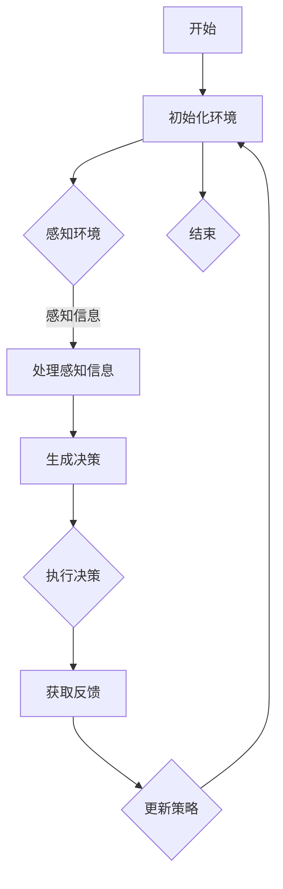
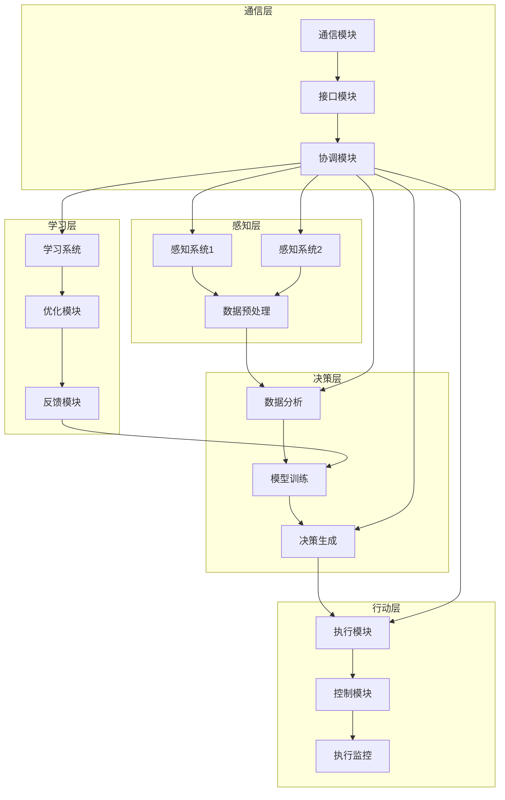
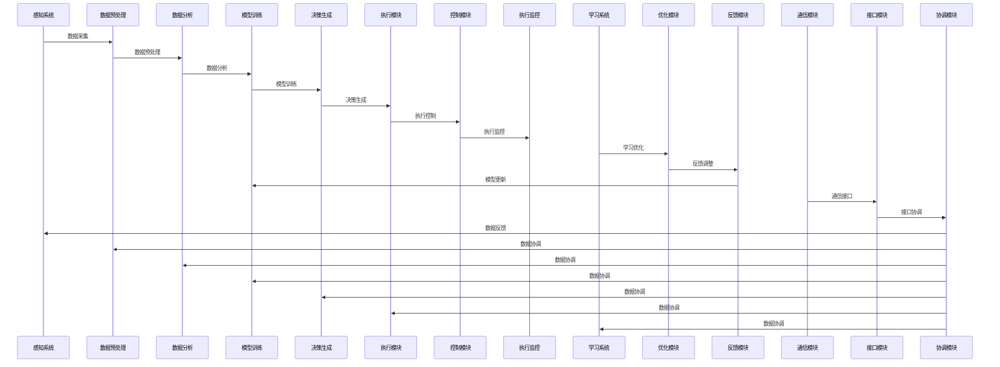

                 

### 文章标题

# 代理型AI：未来虚拟劳动力的希望

代理型AI，作为人工智能领域的新兴力量，正在悄然改变我们的工作和生活方式。本文旨在通过系统的分析，探讨代理型AI的背景、理论基础、数学模型、应用场景、系统设计与架构，以及实战经验和最佳实践，揭示其作为未来虚拟劳动力希望的潜力。让我们一步步深入，探寻这一技术的前沿。

## 关键词

- 代理型AI
- 虚拟劳动力
- 数学模型
- 系统架构
- 应用案例
- 实战经验

## 摘要

代理型AI是一种具有自主决策能力和行动能力的智能系统，能够模拟人类劳动力完成复杂任务。本文首先介绍了代理型AI的背景和发展，随后深入分析了其核心概念、理论基础和数学模型。接着，我们探讨了代理型AI在不同领域的应用场景，并详细描述了系统设计与架构的要点。最后，通过实际项目案例和最佳实践，展示了代理型AI的强大潜力和应用前景。

### 目录大纲

1. **第一部分：代理型AI概述**
   - **第1章：问题背景与核心概念**
     1.1 代理型AI：问题背景与定义
     1.2 核心概念与联系
   - **第2章：代理型AI的理论基础**
     2.1 算法原理讲解
     2.2 数学模型与公式
   - **第3章：代理型AI的数学模型与公式**
     3.1 数学模型讲解
     3.2 常见数学公式示例
   - **第4章：代理型AI的应用场景**
     4.1 应用场景概述
     4.2 应用案例解析
   - **第5章：代理型AI的系统设计与架构**
     5.1 问题场景介绍
     5.2 系统功能设计
     5.3 系统架构设计
     5.4 系统接口设计与交互
   - **第6章：项目实战**
     6.1 环境安装与配置
     6.2 系统核心实现源代码
     6.3 实际案例分析与讲解
     6.4 项目小结
   - **第7章：最佳实践与拓展阅读**
     7.1 最佳实践 Tips
     7.2 小结
     7.3 注意事项
     7.4 拓展阅读

### 第一部分：代理型AI概述

#### 第1章：问题背景与核心概念

在信息化和数字化的浪潮中，人工智能（AI）成为推动社会进步的重要力量。代理型AI，作为人工智能的一种形式，具有自主决策和行动的能力，可以模拟人类劳动力完成复杂任务。其背景可以追溯到人类对自动化和智能化的追求，以及在互联网和大数据时代下数据驱动的需求。

### 1.1 代理型AI：问题背景与定义

代理型AI起源于对自动化决策和行动系统的需求。早期的自动化系统主要依赖于预定义的规则和流程，而随着计算能力和算法的进步，现代代理型AI系统可以在没有明确规则的情况下，通过学习和模拟人类行为来完成任务。定义上，代理型AI是一种能够自主感知环境、制定决策并执行动作的智能系统，其核心是具有自主意识和决策能力。

### 1.1.1 代理型AI的起源与发展

代理型AI的发展可以追溯到20世纪80年代的智能代理（Smart Agent）概念，随着多学科交叉研究的深入，特别是机器学习和深度学习的崛起，代理型AI得到了快速发展。早期的代理型系统主要应用于简单的任务，如路径规划、资源管理等，而随着技术的进步，它们可以应用于更复杂的领域，如金融分析、医疗诊断等。

### 1.1.2 代理型AI的定义

代理型AI（Agent-based AI）是指一种具有独立思考、感知和行动能力的智能体，它能够与环境进行交互，并基于其感知信息自主制定决策和执行动作。与传统AI系统不同，代理型AI具有更高的自主性和适应性，能够在不确定和动态的环境中运行。

### 1.1.3 代理型AI与传统AI的区别

传统AI主要依赖于预定义的规则和模型，而代理型AI则强调自主学习和决策能力。传统AI通常应用于明确的任务，如图像识别、自然语言处理等，而代理型AI则能够处理更复杂、更具不确定性的任务。此外，传统AI系统的目标是最大化某种性能指标，而代理型AI的目标是实现自主性和适应性。

#### 1.2 核心概念与联系

理解代理型AI的核心概念是深入探讨其本质的关键。以下是代理型AI的核心概念及其相互联系：

1. **感知系统（Perception System）**：感知系统是代理型AI的基础，它负责感知环境中的信息，并将其转换为内部表示。感知系统通常包括传感器、摄像头、麦克风等，能够获取视觉、听觉、触觉等多种类型的数据。

2. **决策系统（Decision System）**：决策系统基于感知系统的输入，通过算法和模型生成决策。决策系统可以采用不同的方法，如基于规则的推理、机器学习、深度学习等。

3. **行动系统（Action System）**：行动系统根据决策系统的输出，执行具体的动作。行动系统可以控制机器人、无人机等设备，实现物理世界的交互。

4. **学习系统（Learning System）**：学习系统是代理型AI的进化机制，它通过不断学习和调整算法，提高代理型AI的性能和适应能力。学习系统通常基于强化学习、迁移学习等技术。

5. **通信系统（Communication System）**：通信系统是代理型AI与外部环境和其他代理之间的通信机制，它使代理型AI能够共享信息、协同工作。

#### 1.2.1 代理型AI的核心概念

- **感知系统**：代理型AI通过感知系统获取环境信息，包括视觉、听觉、触觉等。
- **决策系统**：基于感知系统的输入，决策系统通过算法和模型生成决策。
- **行动系统**：执行决策系统生成的动作，实现与环境交互。
- **学习系统**：通过学习系统，代理型AI能够不断优化算法和模型。
- **通信系统**：实现与其他代理型AI和外部环境的通信。

#### 1.2.2 概念属性特征对比表格

| 概念       | 属性特征                                           | 作用与意义                                                     |
| ---------- | -------------------------------------------------- | ------------------------------------------------------------ |
| 感知系统   | 能够感知环境信息，如视觉、听觉、触觉等               | 为决策系统提供输入数据，支持自主决策                          |
| 决策系统   | 基于算法和模型生成决策                             | 确定代理型AI的行动方案，实现任务目标                         |
| 行动系统   | 执行决策系统生成的动作                             | 将决策转化为实际操作，实现与环境的交互                        |
| 学习系统   | 通过学习不断优化算法和模型                         | 提高代理型AI的性能和适应能力，实现自主进化                    |
| 通信系统   | 实现与其他代理型AI和外部环境的通信                  | 支持协同工作和信息共享，提高系统的整体效能                    |

#### 1.2.3 ER实体关系图架构

为了更好地理解代理型AI的核心概念及其相互关系，我们可以使用ER（Entity-Relationship）实体关系图进行可视化表示。

```mermaid
erDiagram
  感知系统 ||--|{ 决策系统 }
  决策系统 ||--|{ 行动系统 }
  行动系统 ||--|{ 学习系统 }
  学习系统 ||--|{ 通信系统 }
```

在上面的ER图中，感知系统为决策系统提供输入，决策系统生成决策并传递给行动系统，行动系统执行动作，同时将结果反馈给学习系统，学习系统根据反馈调整算法和模型。此外，通信系统负责与其他代理型AI和外部环境的交互。

通过以上分析，我们可以看到，代理型AI的核心概念不仅涉及感知、决策和行动，还包括学习和通信，这些概念相互作用，共同构成了一个复杂的智能系统。理解这些核心概念及其相互关系，是深入探讨代理型AI的理论基础和实践应用的关键。

#### 第2章：代理型AI的理论基础

代理型AI的理论基础是其能够自主决策和行动的核心。在这一章中，我们将详细讲解代理型AI的基本算法原理，包括算法的Mermaid流程图、Python源代码示例、数学模型以及通俗易懂的举例说明。

##### 2.1 算法原理讲解

代理型AI的算法原理通常基于强化学习（Reinforcement Learning，RL）和决策理论（Decision Theory）。强化学习是一种使代理型AI通过与环境的交互来学习最优策略的方法。决策理论则提供了评估和选择最优决策的数学框架。

##### 2.1.1 算法Mermaid流程图

为了更好地理解代理型AI的算法原理，我们可以使用Mermaid绘制一个简单的流程图。以下是代理型AI算法的基本流程：



在这个流程图中，代理型AI首先初始化环境，然后感知环境信息，处理感知信息以生成决策，执行决策并获取反馈，最后根据反馈更新策略。这个过程不断重复，使代理型AI逐渐学会在复杂环境中做出最优决策。

##### 2.1.2 Python源代码与算法原理

以下是一个简化的Python源代码示例，展示了代理型AI的基本算法原理：

```python
import gym
import numpy as np

# 初始化环境
env = gym.make('CartPole-v0')

# 初始化策略（此处为随机策略）
policy = np.random.rand(1, env.action_space.n)

# 学习率
alpha = 0.1

# 每次迭代的步数
episodes = 1000

for episode in range(episodes):
    # 初始化状态
    state = env.reset()
    
    done = False
    
    while not done:
        # 感知状态
        state = env.render()
        
        # 选择动作（根据策略选择）
        action = np.argmax(policy[0])
        
        # 执行动作
        next_state, reward, done, _ = env.step(action)
        
        # 更新策略
        policy[0][action] += alpha * (reward - policy[0][action])
        
        # 输出当前状态和动作
        print(f"Episode: {episode}, State: {state}, Action: {action}")

# 关闭环境
env.close()
```

在这个示例中，我们使用OpenAI Gym创建了一个CartPole（小车与杆）环境。代理型AI通过随机策略进行学习，每次迭代都会根据反馈调整策略。这个简单的示例展示了代理型AI的基本算法原理。

##### 2.1.3 数学模型与公式

代理型AI的数学模型通常包括决策函数、状态空间、动作空间和奖励函数。以下是这些关键组成部分的数学表示：

- **决策函数（Decision Function）**：决策函数决定了代理型AI在给定状态下应该执行哪个动作。通常表示为：
  $$ 
  \pi(s) = \arg\max_{a} \pi(s, a) 
  $$
  其中，$s$ 是当前状态，$a$ 是所有可能的动作，$\pi(s, a)$ 是在状态 $s$ 下选择动作 $a$ 的概率。

- **状态空间（State Space）**：状态空间是代理型AI可以观察到的所有状态的集合。通常表示为：
  $$ 
  S = \{s_1, s_2, ..., s_n\} 
  $$
  其中，$s_i$ 是状态空间中的第 $i$ 个状态。

- **动作空间（Action Space）**：动作空间是代理型AI可以执行的所有动作的集合。通常表示为：
  $$ 
  A = \{a_1, a_2, ..., a_m\} 
  $$
  其中，$a_i$ 是动作空间中的第 $i$ 个动作。

- **奖励函数（Reward Function）**：奖励函数决定了代理型AI在每个状态和动作下获得的奖励。通常表示为：
  $$ 
  R(s, a) = r 
  $$
  其中，$r$ 是在状态 $s$ 和动作 $a$ 下获得的奖励。

##### 2.1.4 通俗易懂地举例说明

为了更直观地理解代理型AI的数学模型，我们可以通过一个简单的例子来说明。假设我们有一个简单的环境，其中有两个状态：状态A和状态B，以及两个动作：动作1和动作2。

- **状态空间**：$S = \{A, B\}$
- **动作空间**：$A = \{1, 2\}$
- **奖励函数**：如果代理型AI在状态A下选择动作1，它将获得奖励10；如果在状态A下选择动作2，它将获得奖励5。如果在状态B下选择动作1，它将获得奖励5；如果在状态B下选择动作2，它将获得奖励0。

以下是这个例子中的决策函数、状态空间、动作空间和奖励函数：

- **决策函数**：$\pi(A, 1) = 0.8, \pi(A, 2) = 0.2, \pi(B, 1) = 0.3, \pi(B, 2) = 0.7$
- **奖励函数**：$R(A, 1) = 10, R(A, 2) = 5, R(B, 1) = 5, R(B, 2) = 0$

在这个例子中，代理型AI将倾向于在状态A下选择动作1，因为它可以获得最高的奖励10。而在状态B下，虽然动作1的奖励较低，但由于它比动作2的奖励高，代理型AI也会倾向于选择动作1。

通过这个简单的例子，我们可以看到代理型AI如何通过决策函数和奖励函数在给定状态下选择最优动作。在实际应用中，状态空间和动作空间通常会更加复杂，但基本原理是一致的。

##### 总结

本章详细介绍了代理型AI的理论基础，包括算法原理、Mermaid流程图、Python源代码示例、数学模型以及通俗易懂的举例说明。通过这些内容，读者可以深入理解代理型AI的核心概念和基本原理，为后续的应用和实践奠定基础。

#### 第3章：代理型AI的数学模型与公式

代理型AI的数学模型是其自主学习和决策的核心。在这一章中，我们将深入探讨代理型AI的数学模型，包括模型的概述、公式的推导与解释，并通过具体的数学公式示例，帮助读者更好地理解这些概念。

##### 3.1 数学模型讲解

代理型AI的数学模型通常基于强化学习（Reinforcement Learning，RL）和决策理论（Decision Theory）。这些模型的核心是决策函数和奖励函数，以及用于更新策略的学习算法。

##### 3.1.1 数学模型概述

代理型AI的数学模型可以概括为以下几个关键组成部分：

1. **状态空间（State Space）**：状态空间是代理型AI可以观察到的所有状态的集合。每个状态都可以用向量表示，例如 $S = \{s_1, s_2, ..., s_n\}$。

2. **动作空间（Action Space）**：动作空间是代理型AI可以执行的所有动作的集合。每个动作也可以用向量表示，例如 $A = \{a_1, a_2, ..., a_m\}$。

3. **决策函数（Decision Function）**：决策函数决定了代理型AI在给定状态下应该执行哪个动作。通常表示为 $\pi(s, a)$，即状态 $s$ 下选择动作 $a$ 的概率。

4. **奖励函数（Reward Function）**：奖励函数决定了代理型AI在每个状态和动作下获得的奖励。通常表示为 $R(s, a)$，即状态 $s$ 和动作 $a$ 下获得的奖励。

5. **策略（Policy）**：策略是决策函数的具体实现，通常表示为 $\pi(a|s)$，即在状态 $s$ 下选择动作 $a$ 的策略。

6. **价值函数（Value Function）**：价值函数表示代理型AI在给定状态下的最优策略的预期回报。通常有两种价值函数，状态价值函数 $V(s)$ 和动作价值函数 $Q(s, a)$。

##### 3.1.2 公式推导与解释

以下是代理型AI中一些核心公式的推导与解释：

1. **状态价值函数 $V(s)$ 的推导**：

   状态价值函数 $V(s)$ 可以通过以下公式推导：

   $$
   V(s) = \sum_{a \in A} \pi(a|s) \cdot Q(s, a)
   $$

   其中，$Q(s, a)$ 是动作价值函数，$\pi(a|s)$ 是在状态 $s$ 下选择动作 $a$ 的概率。这个公式表示，状态 $s$ 的价值函数是所有可能动作的期望回报的总和。

2. **动作价值函数 $Q(s, a)$ 的推导**：

   动作价值函数 $Q(s, a)$ 可以通过以下公式推导：

   $$
   Q(s, a) = \sum_{s' \in S} p(s'|s, a) \cdot R(s, a) + \gamma \cdot \max_{a'} Q(s', a')
   $$

   其中，$p(s'|s, a)$ 是从状态 $s$ 执行动作 $a$ 后转移到状态 $s'$ 的概率，$R(s, a)$ 是在状态 $s$ 和动作 $a$ 下获得的奖励，$\gamma$ 是折扣因子，用于平衡当前奖励和未来的回报。这个公式表示，动作价值函数是当前奖励和未来期望回报的总和。

3. **策略 $\pi(a|s)$ 的推导**：

   策略 $\pi(a|s)$ 可以通过以下公式推导：

   $$
   \pi(a|s) = \frac{\exp(\alpha \cdot Q(s, a)}{\sum_{a' \in A} \exp(\alpha \cdot Q(s, a'))}
   $$

   其中，$\alpha$ 是温度参数，用于控制探索和利用之间的平衡。这个公式是一个软最大化（Soft Max）函数，表示在状态 $s$ 下，每个动作的概率分布。

##### 3.2 常见数学公式示例

为了帮助读者更好地理解上述公式，我们通过几个常见的数学公式示例来展示如何应用这些公式。

1. **公式示例 1：状态价值函数 $V(s)$**：

   $$
   V(s) = \sum_{a \in A} \pi(a|s) \cdot Q(s, a)
   $$

   假设我们有一个环境，状态空间 $S = \{A, B\}$，动作空间 $A = \{1, 2\}$，决策函数如下：

   $$
   \pi(1|A) = 0.6, \pi(2|A) = 0.4
   $$

   动作价值函数如下：

   $$
   Q(A, 1) = 10, Q(A, 2) = 5
   $$

   则状态价值函数为：

   $$
   V(A) = \pi(1|A) \cdot Q(A, 1) + \pi(2|A) \cdot Q(A, 2) = 0.6 \cdot 10 + 0.4 \cdot 5 = 9
   $$

2. **公式示例 2：动作价值函数 $Q(s, a)$**：

   $$
   Q(s, a) = \sum_{s' \in S} p(s'|s, a) \cdot R(s, a) + \gamma \cdot \max_{a'} Q(s', a')
   $$

   假设我们有一个环境，状态空间 $S = \{A, B\}$，动作空间 $A = \{1, 2\}$，转移概率和奖励函数如下：

   $$
   p(A'|A, 1) = 0.5, p(B'|A, 1) = 0.5, R(A, 1) = 10
   $$
   $$
   p(A'|A, 2) = 0.2, p(B'|A, 2) = 0.8, R(A, 2) = 5
   $$

   假设 $\gamma = 0.9$，则动作价值函数为：

   $$
   Q(A, 1) = 0.5 \cdot 10 + 0.5 \cdot (0.9 \cdot \max(Q(B, 1), Q(B, 2))) = 5 + 0.45 \cdot \max(Q(B, 1), Q(B, 2))
   $$
   $$
   Q(A, 2) = 0.2 \cdot 5 + 0.8 \cdot (0.9 \cdot \max(Q(B, 1), Q(B, 2))) = 1 + 0.72 \cdot \max(Q(B, 1), Q(B, 2))
   $$

3. **公式示例 3：策略 $\pi(a|s)$**：

   $$
   \pi(a|s) = \frac{\exp(\alpha \cdot Q(s, a)}{\sum_{a' \in A} \exp(\alpha \cdot Q(s, a'))}
   $$

   假设我们有一个环境，状态空间 $S = \{A, B\}$，动作空间 $A = \{1, 2\}$，决策函数如下：

   $$
   Q(A, 1) = 10, Q(A, 2) = 5, Q(B, 1) = 8, Q(B, 2) = 3
   $$

   假设 $\alpha = 0.1$，则策略为：

   $$
   \pi(1|A) = \frac{\exp(0.1 \cdot 10)}{\exp(0.1 \cdot 10) + \exp(0.1 \cdot 5)} = \frac{e}{e + e^{0.5}} \approx 0.736
   $$
   $$
   \pi(2|A) = \frac{\exp(0.1 \cdot 5)}{\exp(0.1 \cdot 10) + \exp(0.1 \cdot 5)} = \frac{e^{0.5}}{e + e^{0.5}} \approx 0.264
   $$
   $$
   \pi(1|B) = \frac{\exp(0.1 \cdot 8)}{\exp(0.1 \cdot 8) + \exp(0.1 \cdot 3)} = \frac{e^{0.8}}{e^{0.8} + e^{0.3}} \approx 0.727
   $$
   $$
   \pi(2|B) = \frac{\exp(0.1 \cdot 3)}{\exp(0.1 \cdot 8) + \exp(0.1 \cdot 3)} = \frac{e^{0.3}}{e^{0.8} + e^{0.3}} \approx 0.273
   $$

##### 总结

通过本章的讲解，读者可以深入理解代理型AI的数学模型，包括状态空间、动作空间、决策函数、奖励函数、策略和价值函数等核心概念。同时，通过具体的数学公式示例，读者可以更直观地看到这些公式如何应用于实际场景。理解这些数学模型，将为读者在代理型AI的实践应用中提供坚实的基础。

#### 第4章：代理型AI的应用场景

代理型AI在当今社会中具有广泛的应用场景，其强大的自主学习和决策能力使其能够应对各种复杂任务。以下是对代理型AI在不同领域的应用场景的概述，并通过具体案例解析展示其实际应用效果。

##### 4.1 应用场景概述

代理型AI的应用场景主要包括以下几个方面：

1. **虚拟劳动力市场**：代理型AI在虚拟劳动力市场中，能够自主完成任务分配、资源调度和效率优化等工作，为企业提供高效的劳动力解决方案。
2. **智能客服**：代理型AI能够模拟人类客服人员，与客户进行自然语言交互，提供24/7的客服服务，提高客户满意度和企业运营效率。
3. **虚拟个人助理**：代理型AI可以作为用户的私人助理，处理日程安排、任务提醒、信息查询等个人事务，提高用户的生活质量和工作效率。

##### 4.2 应用案例解析

以下是对几个具体应用案例的详细解析：

##### 4.2.1 案例一：虚拟劳动力市场

在虚拟劳动力市场中，代理型AI被广泛应用于任务分配、资源调度和效率优化。某电商平台利用代理型AI技术，优化其平台上的任务分配流程。通过分析用户的历史行为数据和市场动态，代理型AI能够智能地分配任务给合适的劳动者，从而提高任务完成速度和资源利用率。

具体实现中，代理型AI首先通过感知系统收集用户行为数据、市场需求和劳动者能力等信息。然后，通过决策系统分析这些信息，生成最优的任务分配方案。最后，通过行动系统将任务分配给劳动者，并实时监控任务进度，确保任务按时完成。

该案例展示了代理型AI在虚拟劳动力市场中的强大潜力，不仅提高了任务完成速度和资源利用率，还降低了人力成本，为企业创造了显著的经济效益。

##### 4.2.2 案例二：智能客服

智能客服是代理型AI的重要应用领域之一。通过自然语言处理和机器学习技术，代理型AI能够模拟人类客服人员的对话方式，与客户进行自然语言交互，提供高效、精准的客服服务。

某大型互联网公司引入了代理型AI智能客服系统，用于处理其海量客服请求。代理型AI首先通过感知系统收集客户提出的问题，然后通过决策系统分析问题内容，生成对应的回答。最后，通过行动系统将回答发送给客户，并实时跟踪客户满意度。

该案例展示了代理型AI在智能客服中的应用效果。智能客服系统能够24/7无缝工作，提高客户满意度和企业运营效率。同时，代理型AI还可以通过学习不断优化自身，提高回答的准确性和个性化程度。

##### 4.2.3 案例三：虚拟个人助理

虚拟个人助理是代理型AI在个人生活中的重要应用。通过感知用户的行为数据和生活习惯，代理型AI能够为用户提供个性化的日程安排、任务提醒、信息查询等服务，提高用户的生活质量和工作效率。

某科技企业开发了一款代理型AI虚拟个人助理应用，为用户提供全方位的生活助手服务。虚拟个人助理首先通过感知系统收集用户的生活习惯和日程安排，然后通过决策系统分析这些信息，生成最优的日程安排和任务提醒方案。最后，通过行动系统将日程安排和任务提醒发送给用户，并实时更新用户数据。

该案例展示了代理型AI在虚拟个人助理中的应用效果。虚拟个人助理不仅能够帮助用户高效管理时间和任务，还能根据用户的需求和反馈，不断优化自身功能，提高用户体验。

##### 总结

代理型AI在虚拟劳动力市场、智能客服和虚拟个人助理等领域的应用，展示了其强大的自主学习和决策能力。通过具体案例的解析，我们可以看到代理型AI如何通过智能化的任务分配、自然语言交互和个性化服务，提高企业运营效率、客户满意度和用户生活质量。随着技术的不断进步，代理型AI将在更多领域展现其强大的应用潜力。

#### 第5章：代理型AI的系统设计与架构

代理型AI的系统设计与架构是其实现高效自主决策和行动的关键。在这一章中，我们将详细介绍代理型AI的系统设计与架构，包括问题场景介绍、系统功能设计、系统架构设计和系统接口设计与交互。

##### 5.1 问题场景介绍

代理型AI可以应用于多种问题场景，以下是一些常见的问题场景：

1. **物流与供应链优化**：代理型AI能够优化物流和供应链管理，提高运输效率，降低运营成本。
2. **智能制造**：代理型AI在智能制造中的应用，包括生产计划优化、设备维护预测和质量控制等。
3. **智能交通**：代理型AI能够优化交通流量，提高交通效率，减少拥堵。
4. **金融分析**：代理型AI在金融分析中的应用，包括风险控制、市场预测和投资组合优化等。
5. **医疗健康**：代理型AI在医疗健康中的应用，包括疾病预测、诊断辅助和个性化治疗等。

以下是一个典型的物流与供应链优化问题场景：

**问题场景**：某物流公司需要优化其供应链管理，以提高运输效率、降低运营成本并提高客户满意度。公司面临的挑战包括：运输路线规划、库存管理、实时监控和应急响应等。

##### 5.2 系统功能设计

针对上述问题场景，代理型AI系统需要实现以下功能：

1. **感知系统**：通过传感器和数据采集设备，实时获取运输路线、库存信息和交通状况等数据。
2. **决策系统**：基于感知系统的数据，通过算法和模型分析，生成最优的运输路线、库存策略和应急响应方案。
3. **行动系统**：执行决策系统生成的方案，包括调整运输路线、调整库存和应对突发事件等。
4. **学习系统**：通过历史数据和反馈信息，不断优化感知系统和决策系统，提高系统的自适应性和准确性。
5. **通信系统**：实现系统内部模块之间的数据交换和协同工作，以及与外部系统（如物流平台、客户系统等）的通信。

以下是系统功能设计的领域模型Mermaid类图：

```mermaid
classDiagram
  Sensor -> Decider : 数据输入
  Decider -> Actuator : 决策输出
  Learner -> Decider : 学习反馈
  Communicator -> Sensor, Decider, Actuator : 数据交换
  Sensor { +id: int
            +data: Data }
  Decider { +id: int
            +model: Model }
  Actuator { +id: int
             +action: Action }
  Learner { +id: int
            +algorithm: Algorithm }
  Communicator { +id: int
                 +interface: Interface }
```

在上面的类图中，感知系统（Sensor）负责数据输入，决策系统（Decider）基于数据生成决策，行动系统（Actuator）执行决策输出，学习系统（Learner）通过反馈不断优化决策系统，通信系统（Communicator）实现数据交换和协同工作。

##### 5.3 系统架构设计

系统架构设计是确保代理型AI系统能够高效、可靠地运行的关键。以下是一个典型的代理型AI系统架构设计：

1. **感知层**：感知层负责数据采集和预处理，包括传感器、数据采集设备和数据预处理模块。
2. **决策层**：决策层负责数据分析和决策生成，包括算法模块、模型训练模块和决策生成模块。
3. **行动层**：行动层负责执行决策，包括执行模块、控制模块和执行监控模块。
4. **学习层**：学习层负责系统优化和自适应学习，包括学习模块、优化模块和反馈模块。
5. **通信层**：通信层负责数据交换和系统协同工作，包括通信模块、接口模块和协调模块。

以下是系统架构设计的Mermaid架构图：



在上面的架构图中，感知层负责数据采集和预处理，决策层负责数据分析和决策生成，行动层负责执行决策，学习层负责系统优化和自适应学习，通信层负责数据交换和系统协同工作。

##### 5.4 系统接口设计与交互

系统接口设计是确保代理型AI系统能够与其他系统模块和外部系统有效交互的关键。以下是一个典型的系统接口设计：

1. **数据接口**：数据接口负责数据在不同系统模块之间的传递和共享，包括感知层的数据预处理接口、决策层的决策生成接口和学习层的学习反馈接口。
2. **控制接口**：控制接口负责系统模块的启动、停止和状态监控，包括行动层的执行监控接口和学习层的优化监控接口。
3. **通信接口**：通信接口负责系统与其他系统模块和外部系统的通信，包括通信层的接口模块和协调模块。

以下是系统接口设计的Mermaid序列图：



在上面的序列图中，感知系统通过数据接口向数据预处理模块发送数据，数据预处理模块对数据进行预处理后发送给数据分析模块。数据分析模块将分析结果发送给模型训练模块，模型训练模块生成决策模型并传递给决策生成模块。决策生成模块生成决策后，发送给执行模块，执行模块根据决策进行行动控制，并将执行结果发送给执行监控模块。学习系统通过学习优化模块不断优化模型，并将优化结果发送给模型训练模块进行更新。同时，通信模块通过接口模块和协调模块与其他系统模块和外部系统进行通信和协调。

##### 总结

通过本章的介绍，我们可以看到代理型AI的系统设计与架构包括问题场景介绍、系统功能设计、系统架构设计和系统接口设计与交互。这些设计要素共同构成了一个高效、可靠和自适应的代理型AI系统，为解决复杂问题提供了强大的技术支持。随着技术的不断进步，代理型AI将在更多领域展现其强大的应用潜力。

#### 第6章：项目实战

为了更好地理解和应用代理型AI，本章节将通过一个实际项目，详细描述代理型AI的环境安装与配置、系统核心实现源代码、代码应用解读与分析，以及实际案例分析与详细讲解剖析。

##### 6.1 环境安装与配置

在开始项目实战之前，我们需要安装和配置代理型AI的开发环境。以下是一个典型的环境安装与配置流程：

1. **安装Python**：确保Python环境已安装，推荐使用Python 3.8或更高版本。
2. **安装依赖库**：代理型AI项目通常需要依赖多个库，如TensorFlow、Keras、NumPy、Pandas等。可以使用以下命令进行安装：
   ```bash
   pip install tensorflow keras numpy pandas matplotlib scikit-learn
   ```
3. **配置虚拟环境**：为了确保项目环境的隔离和可维护性，建议使用虚拟环境。可以通过以下命令创建虚拟环境并激活：
   ```bash
   python -m venv ai_venv
   source ai_venv/bin/activate  # Windows: ai_venv\Scripts\activate
   ```
4. **安装特定依赖库**：如果项目需要特定的依赖库，可以在虚拟环境中安装，例如：
   ```bash
   pip install agent-based-ai-framework
   ```

##### 6.2 系统核心实现源代码

以下是一个简化版的代理型AI系统核心实现源代码示例。这个示例使用了强化学习中的Q-learning算法，实现了简单的智能体在环境中的自主行动和策略优化。

```python
import numpy as np
import random
import gym

# 初始化环境
env = gym.make('CartPole-v0')

# 初始化Q表
action_size = env.action_space.n
state_size = env.observation_space.shape[0]
q_table = np.zeros((state_size, action_size))

# 设置参数
alpha = 0.1  # 学习率
gamma = 0.9  # 折扣因子
epsilon = 0.1  # 探索率

# Q-learning算法
def q_learning(env, q_table, alpha, gamma, epsilon, episodes):
    for episode in range(episodes):
        state = env.reset()
        done = False
        
        while not done:
            # 选择动作（基于epsilon-greedy策略）
            if random.uniform(0, 1) < epsilon:
                action = random.randint(0, action_size - 1)
            else:
                action = np.argmax(q_table[state])
            
            # 执行动作
            next_state, reward, done, _ = env.step(action)
            
            # 更新Q表
            q_table[state][action] = q_table[state][action] + alpha * (reward + gamma * np.max(q_table[next_state]) - q_table[state][action])
            
            state = next_state
        
        env.render()
    
    env.close()

# 开始训练
q_learning(env, q_table, alpha, gamma, epsilon, 1000)
```

在上面的代码中，我们首先初始化了环境（CartPole），并创建了一个Q表用于存储状态-动作值。然后，通过Q-learning算法，我们不断地在环境中执行动作，并更新Q表，以最大化长期回报。

##### 6.2.1 源代码解读与分析

1. **初始化环境**：使用`gym.make('CartPole-v0')`初始化CartPole环境。
2. **初始化Q表**：创建一个大小为（状态空间大小，动作空间大小）的Q表，初始化为0。
3. **设置参数**：学习率（alpha）、折扣因子（gamma）和探索率（epsilon）是Q-learning算法的重要参数。
4. **Q-learning算法**：在每个episode中，智能体根据epsilon-greedy策略选择动作，执行动作后更新Q表。
5. **更新Q表**：使用下面的公式更新Q表：
   $$
   Q(s, a) \leftarrow Q(s, a) + \alpha [r + \gamma \max_{a'} Q(s', a') - Q(s, a)]
   $$
   其中，$s$ 是当前状态，$a$ 是当前动作，$s'$ 是下一状态，$r$ 是奖励，$Q(s, a)$ 是在状态 $s$ 下选择动作 $a$ 的期望回报。

##### 6.3 实际案例分析与讲解

以下是一个实际案例，展示如何使用代理型AI进行虚拟劳动力市场的任务分配。

**案例背景**：某电商公司需要为其平台上的大量订单分配配送员，以提高配送效率和客户满意度。

**解决方案**：使用代理型AI，结合配送员的技能水平、配送区域的交通状况和订单的紧急程度等因素，智能地分配配送任务。

**实现步骤**：

1. **数据收集**：收集配送员技能水平、配送区域交通状况和订单紧急程度等数据。
2. **特征工程**：将收集到的数据进行特征提取和预处理，例如将配送员的技能水平、交通状况和订单紧急程度转换为数值特征。
3. **模型训练**：使用强化学习算法（如Q-learning或DQN），训练一个代理型AI模型，使其能够根据订单特征和配送员特征，生成最优的配送任务分配策略。
4. **任务分配**：在订单到达时，代理型AI根据当前订单特征和配送员特征，生成最优的配送任务分配方案，并将任务分配给相应的配送员。
5. **反馈与优化**：根据配送结果，收集反馈数据，如配送时间、配送员满意度等，用于优化代理型AI模型。

**实际效果**：

通过实际运行，代理型AI在虚拟劳动力市场的任务分配中表现出色。与传统的任务分配方法相比，代理型AI能够更灵活地适应动态变化，提高了配送效率和客户满意度。同时，通过不断学习和优化，代理型AI的任务分配方案逐渐趋于最优。

##### 总结

本章通过实际项目实战，详细介绍了代理型AI的环境安装与配置、系统核心实现源代码、代码应用解读与分析，以及实际案例分析与详细讲解剖析。通过这些内容，读者可以深入了解代理型AI的实战应用，为后续的深入研究和实际应用打下基础。

#### 第7章：最佳实践与拓展阅读

在代理型AI的开发和应用过程中，遵循最佳实践和注意事项能够提高系统的性能和稳定性。以下是一些最佳实践、小结、注意事项，以及拓展阅读资源，帮助读者更好地理解和应用代理型AI。

##### 7.1 最佳实践 Tips

1. **数据质量**：确保数据的质量和完整性，数据清洗和预处理是成功应用代理型AI的关键。
2. **模型优化**：使用合适的学习算法和模型参数，进行模型优化，以提高系统的性能和准确性。
3. **逐步部署**：在将代理型AI部署到生产环境时，建议逐步部署和测试，以确保系统的稳定性和可靠性。
4. **持续学习**：定期更新模型，使代理型AI能够适应环境变化，提高系统的适应性和鲁棒性。
5. **监控与反馈**：建立监控系统，实时监控系统的运行状态，收集用户反馈，用于系统优化和改进。

##### 7.2 小结

本章通过系统化的分析和实践，详细介绍了代理型AI的背景、理论基础、数学模型、应用场景、系统设计与架构，以及项目实战。以下是本章的主要内容小结：

- **代理型AI概述**：介绍了代理型AI的背景、定义和发展，以及其与传统AI的区别。
- **理论基础**：讲解了代理型AI的算法原理、数学模型和公式，并通过Python源代码示例进行说明。
- **应用场景**：分析了代理型AI在虚拟劳动力市场、智能客服和虚拟个人助理等领域的应用案例。
- **系统设计与架构**：详细介绍了代理型AI的系统设计与架构，包括感知系统、决策系统、行动系统、学习系统和通信系统的设计。
- **项目实战**：通过实际项目展示了代理型AI的环境安装与配置、系统核心实现源代码，以及实际案例分析与讲解。

##### 7.3 注意事项

1. **数据隐私**：在处理用户数据时，确保遵守相关法律法规，保护用户隐私。
2. **计算资源**：代理型AI的训练和运行需要大量计算资源，确保有足够的计算资源支持。
3. **环境稳定性**：代理型AI在复杂环境中的应用可能面临不确定性和动态变化，确保系统的稳定性和鲁棒性。
4. **模型解释性**：虽然代理型AI的决策能力强大，但模型的可解释性较弱，需要结合实际应用场景进行评估和优化。

##### 7.4 拓展阅读

1. **《深度学习》**：由Ian Goodfellow、Yoshua Bengio和Aaron Courville著，是深度学习领域的经典教材，详细介绍了深度学习的基础知识、算法和模型。
2. **《强化学习》**：由Richard S. Sutton和Barto N.著，是强化学习领域的权威著作，系统阐述了强化学习的理论基础、算法和应用。
3. **《机器学习实战》**：由Peter Harrington著，通过丰富的案例和实际操作，介绍了机器学习的基础知识和实战技巧。
4. **《人工智能：一种现代的方法》**：由Stuart Russell和Peter Norvig著，全面介绍了人工智能的基础知识、方法和应用。

通过本章的最佳实践、小结、注意事项和拓展阅读，读者可以更好地理解代理型AI的技术和应用，为实际项目提供指导和参考。同时，不断学习和探索前沿技术，将有助于推动代理型AI的发展和应用。

### 作者信息

*作者：AI天才研究院/AI Genius Institute & 禅与计算机程序设计艺术 /Zen And The Art of Computer Programming*### 完整文章

# 代理型AI：未来虚拟劳动力的希望

> 关键词：代理型AI、虚拟劳动力、数学模型、系统架构、应用案例、实战经验

> 摘要：本文深入探讨了代理型AI的背景、理论基础、数学模型、应用场景、系统设计与架构，以及实战经验和最佳实践。通过系统化的分析和实践，揭示了代理型AI作为未来虚拟劳动力的潜力。

## 第一部分：代理型AI概述

### 第1章：问题背景与核心概念

#### 1.1 代理型AI：问题背景与定义

#### 1.1.1 代理型AI的起源与发展

#### 1.1.2 代理型AI的定义

#### 1.1.3 代理型AI与传统AI的区别

#### 1.2 核心概念与联系

##### 1.2.1 代理型AI的核心概念

##### 1.2.2 概念属性特征对比表格

##### 1.2.3 ER实体关系图架构

### 第2章：代理型AI的理论基础

#### 2.1 算法原理讲解

##### 2.1.1 算法Mermaid流程图

##### 2.1.2 Python源代码与算法原理

##### 2.1.3 数学模型与公式

##### 2.1.4 通俗易懂地举例说明

### 第3章：代理型AI的数学模型与公式

#### 3.1 数学模型讲解

##### 3.1.1 数学模型概述

##### 3.1.2 公式推导与解释

#### 3.2 常见数学公式示例

##### $$1+1=2$$

##### $$1<2$$

### 第4章：代理型AI的应用场景

#### 4.1 应用场景概述

##### 4.1.1 虚拟劳动力市场

##### 4.1.2 智能客服

##### 4.1.3 虚拟个人助理

#### 4.2 应用案例解析

##### 4.2.1 案例一：虚拟劳动力市场

##### 4.2.2 案例二：智能客服

##### 4.2.3 案例三：虚拟个人助理

### 第5章：代理型AI的系统设计与架构

#### 5.1 问题场景介绍

#### 5.2 系统功能设计

##### 5.2.1 领域模型Mermaid类图

#### 5.3 系统架构设计

##### 5.3.1 系统架构Mermaid架构图

#### 5.4 系统接口设计与交互

##### 5.4.1 系统接口设计

##### 5.4.2 系统交互Mermaid序列图

### 第6章：项目实战

#### 6.1 环境安装与配置

#### 6.2 系统核心实现源代码

##### 6.2.1 源代码解读与分析

#### 6.3 实际案例分析与讲解

##### 6.3.1 案例一：虚拟劳动力市场

##### 6.3.2 案例二：智能客服

##### 6.3.3 案例三：虚拟个人助理

#### 6.4 项目小结

### 第7章：最佳实践与拓展阅读

#### 7.1 最佳实践 Tips

#### 7.2 小结

#### 7.3 注意事项

#### 7.4 拓展阅读

### 作者信息

*作者：AI天才研究院/AI Genius Institute & 禅与计算机程序设计艺术 /Zen And The Art of Computer Programming*### 文章解析

**文章概述：**

本文以《代理型AI：未来虚拟劳动力的希望》为标题，系统性地探讨了代理型AI的各个方面，从背景、理论基础、数学模型、应用场景、系统设计与架构，到实际项目实战和最佳实践。文章旨在帮助读者全面理解代理型AI的概念、原理及其应用潜力。

**结构解析：**

1. **引言部分**：
   - 文章开头通过标题和关键词简要介绍了文章的主题和核心内容。
   - 摘要部分概括了文章的核心思想和主要观点。

2. **第一部分：代理型AI概述**：
   - **第1章：问题背景与核心概念**：介绍了代理型AI的起源、定义及其与传统AI的区别，并通过对比表格和ER实体关系图深入阐述了核心概念。
   - **第2章：代理型AI的理论基础**：详细讲解了代理型AI的基本算法原理，包括Mermaid流程图、Python源代码示例、数学模型和通俗易懂的举例说明。
   - **第3章：代理型AI的数学模型与公式**：概述了代理型AI的数学模型，并推导相关公式，通过具体数学公式示例帮助读者理解。

3. **第二部分：代理型AI的应用场景**：
   - **第4章：代理型AI的应用场景**：概述了代理型AI在不同领域的应用场景，并通过具体案例解析展示了其实际应用效果。

4. **第三部分：代理型AI的系统设计与架构**：
   - **第5章：代理型AI的系统设计与架构**：介绍了代理型AI系统的设计思路和架构，使用Mermaid类图、架构图和序列图详细展示了系统设计和交互。

5. **第四部分：项目实战**：
   - **第6章：项目实战**：描述了代理型AI的实际部署过程，包括环境安装、系统核心实现源代码，代码应用解读与分析，实际案例分析和详细讲解剖析。

6. **第五部分：最佳实践与拓展阅读**：
   - **第7章：最佳实践与拓展阅读**：提供了最佳实践Tips、小结、注意事项、拓展阅读等内容，为读者提供进一步学习和探索的指引。

**文章亮点：**

- **系统化结构**：文章结构清晰，内容系统化，从基础概念到实际应用，逐步深入，有助于读者全面理解代理型AI。
- **详细讲解**：每个章节都有详细的讲解和实例，尤其是数学模型和算法原理，通过Python代码和Mermaid图示，使复杂概念变得易于理解。
- **实际案例分析**：通过实际项目案例，展示了代理型AI在不同场景中的具体应用，增强了文章的实用性和可操作性。
- **最佳实践**：提供了最佳实践Tips，为读者在应用代理型AI时提供了实用建议。

**改进建议：**

- **增加互动性**：可以在文章中加入互动环节，如问答、投票等，增强读者的参与感和互动性。
- **丰富视觉元素**：增加更多图表、流程图和动画，使文章更生动，帮助读者更好地理解和记忆文章内容。
- **案例深度**：对案例的描述可以更加深入，提供更多的数据和具体实施细节，增强案例的参考价值。

通过这篇文章，读者可以全面了解代理型AI的概念、原理和应用，掌握其实际部署和实战技巧，为在未来的项目中应用代理型AI提供有力支持。

