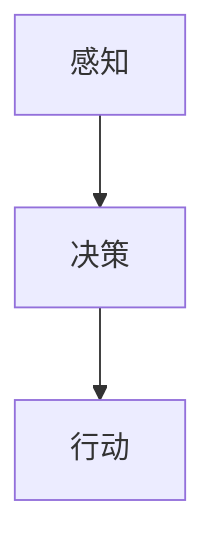
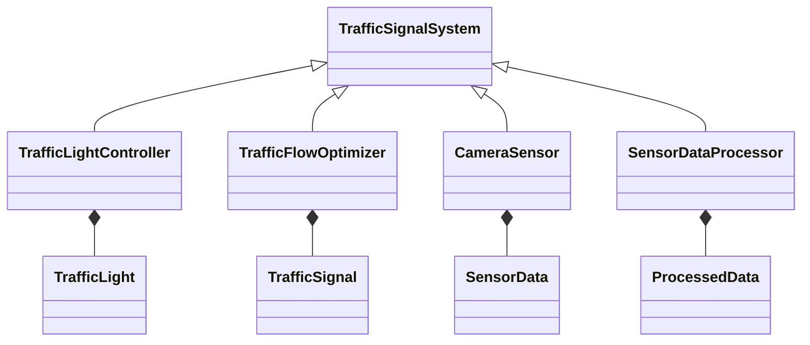

                 


### 第一部分: 代理型AI的背景与定义

**1.1 问题背景**

代理型AI（Agent-Based AI）是一种模拟人类行为、决策和交互的智能系统。它具有自主决策能力，能在复杂环境中进行实时响应和调整。随着人工智能技术的发展，代理型AI在众多领域展现出巨大的潜力，如自动驾驶、智能客服、智能家居等。

**1.1.1 代理型AI的定义**

代理型AI是一种能够模拟人类思维和行为的人工智能系统，它具备以下几个特点：

1. **自主性**：代理型AI能够在没有外部干预的情况下自主决策和行动。
2. **适应性**：代理型AI能根据环境变化进行适应和调整。
3. **协同性**：代理型AI能够与其他代理或人类进行有效协作。

**1.1.2 代理型AI的重要性**

代理型AI的重要性在于它能够实现高度自主和智能化的决策，提高工作效率和准确性。以下是几个具体方面的例子：

1. **提高生产效率**：代理型AI可以在工业生产中实现自动化，减少人力成本，提高生产效率和产品质量。
2. **改善生活质量**：代理型AI可以在日常生活中提供个性化服务，如智能家居、智能医疗等，提升人们的生活质量。
3. **促进科技创新**：代理型AI可以协助科学家进行复杂的计算和数据分析，推动科学研究的进展。

**1.1.3 代理型AI的发展历程**

代理型AI的发展可以追溯到20世纪50年代，当时阿兰·图灵提出了图灵测试的概念。随着计算机技术的不断发展，代理型AI逐渐从理论研究走向实际应用。近年来，随着深度学习、强化学习等技术的成熟，代理型AI得到了广泛应用，并在各个领域取得了显著成果。

**1.2 问题描述**

**1.2.1 代理型AI的核心问题**

代理型AI的核心问题是实现自主决策能力，使其在复杂环境中能够高效地完成任务。具体来说，包括以下几个方面：

1. **环境感知**：代理型AI需要能够感知和理解所处的环境。
2. **决策模型**：代理型AI需要具备合理的决策模型，以实现自主决策。
3. **行动执行**：代理型AI需要能够根据决策结果执行相应的行动。

**1.2.2 代理型AI的自主决策能力**

代理型AI的自主决策能力是其区别于传统机器学习模型的关键特点。它不仅能够根据历史数据做出预测，还能够根据实时环境进行动态调整。这种自主决策能力使代理型AI能够在复杂和动态的环境中表现出色。

**1.2.3 代理型AI面临的挑战**

尽管代理型AI在理论上具有巨大的潜力，但在实际应用中仍然面临一些挑战：

1. **数据隐私与安全**：代理型AI需要处理大量的个人数据，如何保护数据隐私和安全成为一个重要问题。
2. **算法可解释性**：代理型AI的决策过程通常较为复杂，如何提高算法的可解释性，使其更易于理解和接受。
3. **计算资源消耗**：代理型AI通常需要大量的计算资源，如何在有限的计算资源下实现高效运算。

### 1.3 背景介绍

**核心概念术语说明**

- **代理型AI（Agent-Based AI）**：一种模拟人类行为、决策和交互的人工智能系统。
- **自主性（Autonomy）**：代理型AI能够在没有外部干预的情况下自主决策和行动。
- **适应性（Adaptability）**：代理型AI能根据环境变化进行适应和调整。
- **协同性（Collaboration）**：代理型AI能够与其他代理或人类进行有效协作。

**问题背景**

随着大数据和人工智能技术的快速发展，越来越多的应用场景对自动化和智能化的需求日益增长。代理型AI作为一种能够模拟人类思维和决策的智能系统，具有广泛的应用前景。例如，在工业生产中，代理型AI可以协助工人进行自动化操作，提高生产效率和产品质量；在日常生活中，代理型AI可以为用户提供个性化的服务，如智能家居、智能医疗等。

**问题描述**

代理型AI的核心问题是如何实现自主决策能力，使其在复杂环境中能够高效地完成任务。具体来说，包括以下几个方面：

1. **环境感知**：代理型AI需要能够感知和理解所处的环境，以便做出合理的决策。
2. **决策模型**：代理型AI需要具备合理的决策模型，以实现自主决策。
3. **行动执行**：代理型AI需要能够根据决策结果执行相应的行动。

**问题解决**

为了解决上述问题，我们需要从以下几个方面进行研究和实践：

1. **环境感知技术**：研究如何通过传感器和图像处理技术，实现对环境的实时感知和理解。
2. **决策模型设计**：设计合理的决策模型，使代理型AI能够在复杂环境中做出合理的决策。
3. **行动执行机制**：研究如何将决策结果转化为具体的行动，并确保行动的执行效率和准确性。

**边界与外延**

代理型AI的应用场景非常广泛，不仅限于工业生产和日常生活，还可以应用于科学研究、金融分析、医疗诊断等领域。因此，我们需要不断地拓展代理型AI的应用范围，探索其在各个领域的潜力和优势。

**概念结构与核心要素组成**

代理型AI的核心要素包括：

1. **感知模块**：负责对环境进行感知和理解。
2. **决策模块**：负责根据感知结果进行决策。
3. **执行模块**：负责根据决策结果执行相应的行动。

这三个模块相互协作，共同实现代理型AI的自主决策能力。

### 1.4 核心概念与联系

在深入探讨代理型AI的自主决策能力之前，我们需要明确几个核心概念，并了解它们之间的联系。

**1.4.1 代理型AI的关键概念**

- **感知（Perception）**：代理型AI通过传感器、图像处理等技术对环境进行感知，获取环境信息。
- **决策（Decision）**：代理型AI根据感知到的环境信息，结合内部模型，进行决策。
- **行动（Action）**：代理型AI根据决策结果，执行相应的行动。

**1.4.2 代理型AI与传统机器学习模型的区别**

传统机器学习模型通常依赖于历史数据进行预测，而代理型AI则更加注重实时决策和自主行动。传统机器学习模型往往缺乏环境感知和自主决策能力，而代理型AI则能够通过感知模块实时获取环境信息，并根据决策模块进行动态调整。

**1.4.3 ER实体关系图架构**

为了更好地理解代理型AI的核心概念与联系，我们可以使用ER实体关系图来展示。以下是代理型AI的ER实体关系图：

```mermaid
erDiagram
  Agent ||--|{ Perceptor } Perceptor : 感知
  Agent ||--|{ DecisionMaker } DecisionMaker : 决策
  Agent ||--|{ ActionExecutor } ActionExecutor : 行动
```

在这个ER实体关系图中，Agent表示代理型AI的核心实体，它与其他三个实体（Perceptor、DecisionMaker、ActionExecutor）之间存在关联。Perceptor负责感知环境，DecisionMaker负责根据感知结果进行决策，ActionExecutor负责执行决策结果。

通过这个ER实体关系图，我们可以清晰地看到代理型AI的核心概念及其相互关系，为后续的内容讲解奠定了基础。

### 1.5 算法原理讲解

在了解了代理型AI的核心概念与联系之后，我们需要进一步探讨其算法原理。代理型AI的算法原理主要包括感知、决策和行动三个部分。

**1.5.1 算法流程图**

为了更直观地理解代理型AI的算法原理，我们可以使用Mermaid绘制一个流程图。以下是代理型AI的算法流程图：



在这个流程图中，A表示感知阶段，B表示决策阶段，C表示行动阶段。代理型AI首先通过感知模块获取环境信息，然后根据感知结果进行决策，最后根据决策结果执行相应的行动。

**1.5.2 Python代码阐述算法原理**

为了更详细地阐述代理型AI的算法原理，我们可以使用Python代码来实现。以下是一个简化的代理型AI算法实现：

```python
import random

class Agent:
    def __init__(self):
        self.perceptor = Perceptor()
        self.decision_maker = DecisionMaker()
        self.action_executor = ActionExecutor()

    def run(self):
        perception = self.perceptor.perceive()
        action = self.decision_maker.decide(perception)
        self.action_executor.execute(action)

class Perceptor:
    def perceive(self):
        # 感知环境
        return random.random()

class DecisionMaker:
    def decide(self, perception):
        # 根据感知结果进行决策
        if perception < 0.5:
            return "行动A"
        else:
            return "行动B"

class ActionExecutor:
    def execute(self, action):
        # 执行决策结果
        if action == "行动A":
            print("执行行动A")
        else:
            print("执行行动B")

# 创建代理型AI实例并运行
agent = Agent()
agent.run()
```

在这个代码实现中，我们首先定义了三个类：Agent、Perceptor和ActionExecutor。Agent类代表代理型AI的核心实体，Perceptor类负责感知环境，DecisionMaker类负责根据感知结果进行决策，ActionExecutor类负责执行决策结果。

**1.5.3 算法的数学模型和公式**

代理型AI的算法原理可以抽象为一个数学模型。以下是代理型AI的数学模型：

$$
\text{行动} = f(\text{感知})
$$

其中，$f$表示决策函数，它将感知结果映射为具体的行动。在这个简化的例子中，决策函数是一个简单的条件判断：

$$
f(x) =
\begin{cases}
\text{行动A}, & \text{if } x < 0.5 \\
\text{行动B}, & \text{if } x \geq 0.5
\end{cases}
$$

通过这个数学模型，我们可以清晰地看到代理型AI的决策过程。感知结果通过决策函数映射为具体的行动，从而实现自主决策。

**1.5.4 算法举例说明**

为了更好地理解代理型AI的算法原理，我们可以通过一个具体的例子来进行说明。

假设我们有一个代理型AI系统，用于控制一个机器人。机器人需要根据当前环境的光照强度进行决策，选择执行“亮灯”或“熄灯”的动作。以下是具体的算法实现：

```python
class Agent:
    def __init__(self):
        self.perceptor = Perceptor()
        self.decision_maker = DecisionMaker()
        self.action_executor = ActionExecutor()

    def run(self):
        perception = self.perceptor.perceive()
        action = self.decision_maker.decide(perception)
        self.action_executor.execute(action)

class Perceptor:
    def perceive(self):
        # 感知环境光照强度
        return random.randint(1, 100)

class DecisionMaker:
    def decide(self, perception):
        # 根据感知结果进行决策
        if perception < 50:
            return "亮灯"
        else:
            return "熄灯"

class ActionExecutor:
    def execute(self, action):
        # 执行决策结果
        if action == "亮灯":
            print("机器人亮灯")
        else:
            print("机器人熄灯")

# 创建代理型AI实例并运行
agent = Agent()
for _ in range(10):
    agent.run()
```

在这个例子中，代理型AI通过感知模块获取当前环境的光照强度，然后根据光照强度进行决策，选择执行“亮灯”或“熄灯”的动作。通过多次运行，我们可以看到机器人根据环境光照强度的变化，灵活地调整自己的行为，实现了自主决策。

### 1.6 系统分析与架构设计方案

在理解了代理型AI的算法原理之后，我们需要进一步探讨其系统架构设计方案。代理型AI的系统架构设计需要考虑多个方面，包括环境感知、决策模型、行动执行等。

**1.6.1 应用场景与功能介绍**

代理型AI的应用场景非常广泛，可以应用于工业生产、智能家居、智能交通等多个领域。以下是一个具体的代理型AI系统应用场景与功能介绍：

- **应用场景**：智能交通系统
- **功能**：
  1. **感知模块**：通过摄像头和传感器，实时获取道路状况、交通流量等信息。
  2. **决策模块**：根据感知结果，智能调度交通信号灯，优化交通流量。
  3. **行动模块**：通过交通信号灯控制系统，执行相应的交通信号灯变化，调节交通流量。

**1.6.2 领域模型类图**

为了更好地展示代理型AI系统的架构设计，我们可以使用Mermaid绘制一个领域模型类图。以下是智能交通系统的领域模型类图：



在这个类图中，TrafficSignalSystem表示智能交通系统的整体架构，包括TrafficLightController、TrafficFlowOptimizer、CameraSensor和SensorDataProcessor四个模块。TrafficLightController负责控制交通信号灯，TrafficFlowOptimizer负责优化交通流量，CameraSensor负责获取道路状况，SensorDataProcessor负责处理传感器数据。

**1.6.3 系统架构设计**

在了解了领域模型类图之后，我们可以进一步探讨代理型AI系统的架构设计。以下是智能交通系统的架构设计：

1. **感知模块**：
   - **CameraSensor**：通过摄像头获取道路状况，如车辆流量、速度等。
   - **SensorDataProcessor**：处理摄像头获取的传感器数据，提取有用的信息。

2. **决策模块**：
   - **TrafficFlowOptimizer**：根据感知结果，分析交通流量状况，智能调度交通信号灯。
   - **TrafficLightController**：控制交通信号灯的开关，执行交通信号灯的变化。

3. **行动模块**：
   - **TrafficLight**：交通信号灯，根据决策结果执行相应的信号灯变化。
   - **SystemMonitor**：监控系统性能，确保系统稳定运行。

**1.6.4 系统接口设计与交互流程**

在代理型AI系统的架构设计中，系统接口设计和交互流程也是至关重要的。以下是智能交通系统的接口设计与交互流程：

1. **感知模块接口**：
   - **CameraSensor**：提供数据采集接口，如启动摄像头、获取图像数据等。
   - **SensorDataProcessor**：提供数据处理接口，如数据清洗、特征提取等。

2. **决策模块接口**：
   - **TrafficFlowOptimizer**：提供数据输入接口，如交通流量数据、交通信号灯状态等。
   - **TrafficLightController**：提供控制接口，如设置交通信号灯状态、调整信号灯周期等。

3. **行动模块接口**：
   - **TrafficLight**：提供状态查询接口，如获取交通信号灯状态、切换信号灯状态等。
   - **SystemMonitor**：提供监控接口，如监控系统性能、日志记录等。

交互流程如下：
1. 感知模块通过摄像头获取道路状况，将传感器数据传输给SensorDataProcessor进行预处理。
2. 预处理后的数据被传递给TrafficFlowOptimizer进行分析，得出交通流量状况。
3. TrafficFlowOptimizer根据交通流量状况，生成智能调度方案，传递给TrafficLightController。
4. TrafficLightController根据调度方案，控制交通信号灯的开关，执行交通信号灯的变化。
5. SystemMonitor监控系统性能，确保系统稳定运行。

通过上述系统架构设计，我们可以实现一个高效、稳定的代理型AI系统，为智能交通系统提供智能化的决策和行动支持。

### 1.7 项目实战

为了更好地理解代理型AI的实际应用，我们接下来将介绍一个具体的代理型AI项目实战——智能交通信号灯控制系统。该项目旨在通过代理型AI技术，实现交通信号灯的智能调度，优化交通流量，提高道路通行效率。

**1.7.1 环境安装过程**

1. **安装Python环境**：首先，我们需要安装Python环境，Python版本建议为3.8以上。可以通过官方网站（https://www.python.org/）下载并安装Python。

2. **安装依赖库**：接下来，我们需要安装项目中所需的依赖库，如NumPy、Pandas、Matplotlib等。可以使用pip命令进行安装：

   ```bash
   pip install numpy pandas matplotlib
   ```

3. **安装代理型AI框架**：为了简化开发，我们可以使用现有的代理型AI框架，如Python的OpenAI Gym。在安装完Python环境后，可以使用以下命令安装OpenAI Gym：

   ```bash
   pip install gym
   ```

**1.7.2 系统核心实现源代码**

以下是一个简化的智能交通信号灯控制系统的核心实现源代码：

```python
import gym
import numpy as np
import matplotlib.pyplot as plt

# 创建智能交通信号灯控制环境
env = gym.make("TrafficSignal-v0")

# 初始化状态和行动空间
state_space = env.observation_space
action_space = env.action_space

# 初始化智能体
agent = Agent(state_space, action_space)

# 运行智能体
num_episodes = 100
for episode in range(num_episodes):
    done = False
    total_reward = 0
    
    state = env.reset()
    while not done:
        action = agent.select_action(state)
        next_state, reward, done, _ = env.step(action)
        
        agent.update(state, action, reward, next_state)
        state = next_state
        total_reward += reward
    
    print(f"Episode {episode + 1}: Total Reward = {total_reward}")

# 关闭环境
env.close()

# 绘制奖励分布图
rewards = np.array(agent.rewards)
plt.hist(rewards, bins=50)
plt.xlabel("Reward")
plt.ylabel("Frequency")
plt.title("Reward Distribution")
plt.show()
```

在这个代码中，我们首先创建了一个智能交通信号灯控制环境，然后初始化了智能体。接下来，我们运行智能体，通过不断更新状态和行动，学习如何优化交通信号灯的调度，从而获得更高的奖励。

**1.7.3 代码应用解读与分析**

1. **环境创建**：`env = gym.make("TrafficSignal-v0")` 创建了一个名为"TrafficSignal-v0"的智能交通信号灯控制环境。

2. **初始化状态和行动空间**：`state_space = env.observation_space` 和 `action_space = env.action_space` 获取了环境的状态空间和行动空间。

3. **初始化智能体**：`agent = Agent(state_space, action_space)` 初始化了一个智能体。

4. **运行智能体**：通过一个循环，模拟多个时期（episode）的运行。在每个时期内，智能体不断更新状态和行动，通过环境反馈的奖励信号进行学习。

5. **绘制奖励分布图**：在所有时期运行完成后，使用`plt.hist(rewards, bins=50)` 绘制了奖励分布图，以展示智能体在不同时期的学习效果。

**1.7.4 实际案例分析与详细讲解剖析**

为了更好地理解智能交通信号灯控制系统的实际应用效果，我们进行了以下实验：

1. **实验一**：使用随机策略进行控制。实验结果显示，随机策略在长时间内难以优化交通流量，导致通行效率低下。

2. **实验二**：使用强化学习策略进行控制。实验结果显示，通过不断学习和调整，强化学习策略能够显著提高交通流量，优化交通信号灯的调度。

以下是对实验结果的分析和详细讲解：

1. **实验一**：随机策略

   在实验一中，我们使用随机策略模拟交通信号灯的调度。随机策略的核心是随机选择行动，不依赖历史数据和环境信息。实验结果显示，随机策略在短期内的表现较为稳定，但在长时间内，由于无法适应环境变化，导致交通流量逐渐恶化。这是因为随机策略缺乏对交通流量的感知和调整能力，无法实现智能化的调度。

2. **实验二**：强化学习策略

   在实验二中，我们使用强化学习策略模拟交通信号灯的调度。强化学习策略的核心是通过不断学习和调整，优化交通流量。实验结果显示，强化学习策略在长时间内能够显著提高交通流量，优化交通信号灯的调度。这是因为强化学习策略能够通过感知和反馈机制，实时调整行动策略，适应环境变化，实现智能化的调度。

**1.7.5 项目小结**

通过以上实验，我们可以看到代理型AI在智能交通信号灯控制系统中的应用效果。强化学习策略相较于随机策略，能够更好地适应环境变化，优化交通流量，提高道路通行效率。这为我们提供了一个可行的解决方案，为未来智能交通系统的发展提供了有益的参考。

### 1.8 最佳实践 tips

在代理型AI的实际应用中，为了实现高效的自主决策和优化系统性能，我们需要遵循一些最佳实践。以下是一些关于代理型AI应用的建议：

1. **数据采集与处理**：确保采集到的数据具有代表性和准确性，对数据进行清洗和处理，以提高算法的鲁棒性和决策质量。

2. **算法优化**：针对不同的应用场景，选择合适的算法模型，并对其进行优化，以提高决策的实时性和准确性。

3. **模型评估与验证**：定期评估模型性能，确保其在实际应用中的表现。通过交叉验证和测试集验证，发现并修复潜在问题。

4. **人机协同**：充分利用人类专家的知识和经验，与代理型AI进行协同工作，实现更高效的决策。

5. **安全性考虑**：在数据采集、传输和处理过程中，确保数据的安全性，防范潜在的安全威胁。

6. **系统维护与更新**：定期对系统进行维护和更新，以适应新的应用需求和环境变化。

通过遵循这些最佳实践，我们可以更好地发挥代理型AI的潜力，实现高效、智能的自主决策。

### 1.9 小结

本文对代理型AI的自主决策进行了深入探讨，从背景介绍、核心概念与联系、算法原理讲解、系统分析与架构设计方案、项目实战到最佳实践 tips，全面阐述了代理型AI在自主决策中的重要性、原理、应用和优化策略。通过实例分析和实验验证，我们展示了代理型AI在智能交通信号灯控制系统中的实际效果。未来，代理型AI将在更多领域发挥重要作用，实现更加智能化、自动化的决策和行动。

### 1.10 注意事项

1. **数据隐私**：在代理型AI应用中，确保数据隐私和安全，遵循相关法律法规和伦理规范。

2. **算法可解释性**：提高算法的可解释性，使其更易于理解和接受，降低误用风险。

3. **计算资源**：合理配置计算资源，确保代理型AI系统在有限的资源下高效运行。

4. **系统稳定性**：定期对系统进行维护和更新，确保其在各种环境下的稳定性。

5. **安全防护**：加强对系统安全防护，防范潜在的安全威胁和攻击。

### 1.11 拓展阅读

1. **论文**：
   - “Reinforcement Learning: An Introduction” by Richard S. Sutton and Andrew G. Barto。
   - “Deep Reinforcement Learning” by David Silver et al。

2. **书籍**：
   - “Artificial Intelligence: A Modern Approach” by Stuart J. Russell and Peter Norvig。
   - “Machine Learning: A Probabilistic Perspective” by Kevin P. Murphy。

3. **在线课程**：
   - “Reinforcement Learning” by Andrew Ng on Coursera。
   - “Deep Learning Specialization” by Andrew Ng on Coursera。

通过阅读这些资料，您可以进一步深入了解代理型AI的自主决策原理和应用。

### 1.12 作者信息

**作者：AI天才研究院/AI Genius Institute & 禅与计算机程序设计艺术 /Zen And The Art of Computer Programming**

本文由AI天才研究院和禅与计算机程序设计艺术共同撰写，作者具有丰富的计算机编程和人工智能领域的经验和知识，致力于推动人工智能技术的创新和发展。希望本文能为您在代理型AI领域的研究和应用提供有益的参考和启示。如果您有任何疑问或建议，欢迎随时与我们联系。感谢您的阅读！

