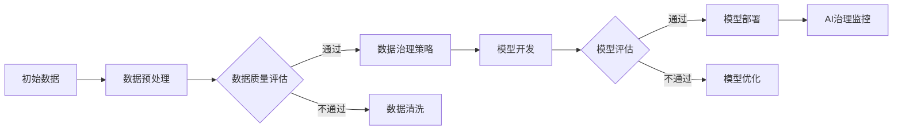

                 

## 企业AI治理框架的构建步骤

### 1.1 问题背景

随着人工智能技术的迅速发展，越来越多的企业开始将AI技术应用于其业务流程中，以期提高效率、降低成本并创造新的商业价值。然而，这同时也带来了新的挑战和风险，如数据隐私问题、算法偏见、透明度和伦理问题等。为了确保AI技术的合理使用并保护企业的利益，企业需要构建一套完善的AI治理框架。

#### 1.1.1 人工智能技术的发展及其在企业中的应用

人工智能技术经历了从理论研究到实际应用的发展过程。最初，AI技术主要应用于学术研究和军事领域，但随着计算能力的提升和数据量的增加，AI技术逐渐走向商业应用。如今，AI技术已被广泛应用于各个行业，如金融、医疗、零售、制造业等。例如，在金融领域，AI技术被用于风险评估、欺诈检测和投资决策；在医疗领域，AI技术被用于疾病诊断、治疗方案优化和医学图像分析。

#### 1.1.2 企业面临的数据隐私和伦理挑战

随着AI技术的应用，企业需要处理大量的个人数据，这带来了数据隐私和伦理挑战。首先，如何确保个人数据的安全和隐私是一个关键问题。其次，AI算法的偏见问题也引起了广泛关注。如果算法训练数据中存在偏见，可能会导致算法的决策结果存在偏见，从而加剧社会不平等。此外，AI系统的透明度和可解释性也是一个重要问题，企业需要能够解释AI系统的决策过程和结果。

#### 1.1.3 法规政策对企业AI治理的需求

随着AI技术的应用越来越广泛，各国政府和监管机构也相继出台了一系列法规政策，以规范AI技术的应用。例如，欧盟出台了《通用数据保护条例》（GDPR），对个人数据的收集、存储和使用进行了严格的规定。此外，一些国家和地区还出台了AI伦理准则，以指导企业如何合理使用AI技术。企业需要遵守这些法规政策，构建符合要求的AI治理框架。

### 1.2 问题概述

#### 1.2.1 什么是企业AI治理

企业AI治理是指在企业内部建立一套系统化的管理机制，以确保AI技术的合理使用、透明度和合规性。它涵盖了从AI技术的研发、部署到运行和维护的整个过程，包括数据治理、算法治理、伦理治理和合规性治理等方面。

#### 1.2.2 企业AI治理的必要性和重要性

企业AI治理的必要性和重要性体现在以下几个方面：

1. **确保AI技术的合理使用**：企业AI治理可以帮助企业确保AI技术被合理、透明地使用，避免滥用AI技术带来的负面影响。

2. **降低AI风险**：企业AI治理可以帮助企业识别和降低AI技术带来的各种风险，如数据隐私风险、算法偏见风险和合规性风险。

3. **提高AI技术的透明度和可信度**：企业AI治理可以提升AI系统的透明度和可解释性，增强公众对AI技术的信任。

4. **确保合规性**：企业AI治理可以帮助企业遵守相关法规政策，降低法律风险。

5. **促进AI技术的可持续发展**：企业AI治理可以推动AI技术的可持续发展，确保企业能够在合规、透明和可持续的基础上利用AI技术创造价值。

### 1.3 边界与外延

#### 1.3.1 企业AI治理的范围

企业AI治理的范围涵盖了AI技术的整个生命周期，包括以下方面：

1. **AI技术的研发**：企业需要建立AI技术研发的管理机制，确保研发过程符合相关法规政策。

2. **AI技术的部署**：企业需要建立AI技术部署的管理机制，确保部署过程符合企业的战略目标和业务需求。

3. **AI技术的运行和维护**：企业需要建立AI技术运行和维护的管理机制，确保AI系统稳定、高效地运行。

4. **AI技术的评估**：企业需要建立AI技术评估的管理机制，对AI系统的性能、效果和合规性进行定期评估。

#### 1.3.2 企业AI治理与其他管理领域的区别

企业AI治理与其他管理领域（如数据治理、合规性治理等）的区别在于：

1. **数据治理**：数据治理主要关注企业数据的收集、存储、处理和使用，确保数据的质量、安全和合规性。而企业AI治理则更关注AI技术的合理使用、透明度和合规性。

2. **合规性治理**：合规性治理主要关注企业遵守相关法规政策，确保企业的业务活动符合法规要求。而企业AI治理则更关注AI技术的合规性，确保AI系统的设计和应用符合法规要求。

3. **风险治理**：风险治理主要关注企业识别、评估和应对各种风险，确保企业的业务活动不会受到风险的影响。而企业AI治理则更关注AI技术带来的各种风险，如数据隐私风险、算法偏见风险和合规性风险。

### 1.4 框架构建的重要性

#### 1.4.1 提升AI技术的透明度和可信度

企业AI治理框架可以帮助企业建立透明、可解释的AI系统，使AI技术的决策过程和结果更加透明，增强公众对AI技术的信任。

#### 1.4.2 降低AI风险，确保合规性

企业AI治理框架可以帮助企业识别和降低AI技术带来的各种风险，如数据隐私风险、算法偏见风险和合规性风险，确保AI系统的合规性和安全性。

#### 1.4.3 促进AI技术的可持续发展

企业AI治理框架可以推动AI技术的可持续发展，确保企业能够在合规、透明和可持续的基础上利用AI技术创造价值。

### 1.5 核心概念与联系

在本节中，我们将探讨企业AI治理框架的核心概念，包括AI治理、数据治理和伦理治理，并分析这些概念之间的联系。

#### 1.5.1 AI治理的概念

AI治理指的是对企业内部使用的人工智能系统进行有效管理和监督的一系列策略、过程和机制。AI治理的目的是确保AI技术的合理使用，提高透明度，降低风险，并确保遵守相关法规和政策。AI治理包括以下几个方面：

1. **合规性管理**：确保AI系统的设计和应用符合法律法规、行业标准和企业内部政策。
2. **风险管理**：识别和评估AI技术带来的各种风险，并采取相应的措施进行控制。
3. **透明度**：提高AI系统的透明度，使决策过程和结果对内部和外部利益相关者都是可解释和可接受的。
4. **责任性**：明确AI系统的责任归属，确保在出现问题时可以追溯和追究责任。

#### 1.5.2 数据治理的概念

数据治理是管理企业数据的一系列策略、过程和机制，旨在确保数据的质量、安全、合规和有效利用。数据治理的核心要素包括：

1. **数据质量**：确保数据是准确、完整、一致和及时的。
2. **数据安全**：保护数据免受未经授权的访问、使用、披露、破坏或丢失。
3. **数据共享**：制定数据共享政策，确保数据能够在企业内部或与合作伙伴之间有效共享。
4. **数据生命周期管理**：对数据的整个生命周期进行管理，包括创建、存储、使用、归档和销毁。

#### 1.5.3 伦理治理的概念

伦理治理涉及管理和解决与人工智能系统相关的伦理问题。伦理治理的目标是确保AI技术的应用不会损害人类的利益和价值观，包括以下几个方面：

1. **公平性**：确保AI系统不会因为性别、种族、年龄等因素而产生偏见或歧视。
2. **透明度**：提高AI系统的透明度，使人们能够理解AI系统的决策过程。
3. **责任性**：明确AI系统的责任归属，确保在出现问题时可以追究责任。
4. **道德准则**：制定和应用伦理准则，指导AI系统的开发和应用。

#### 1.5.4 概念属性特征对比表格

为了更好地理解AI治理、数据治理和伦理治理这三个核心概念，我们可以通过以下表格进行对比：

| 概念          | 定义与内涵                      | 关键要素                                     | 应用领域                               |
|---------------|---------------------------------|----------------------------------------------|----------------------------------------|
| AI治理        | 对AI系统进行有效管理和监督      | 合规性、透明度、责任性、可持续性               | 企业AI系统的开发、应用、维护           |
| 数据治理      | 对企业数据进行有效管理和利用    | 数据质量、数据安全、数据共享、数据生命周期管理 | 企业信息管理、数据分析、数据决策支持   |
| 伦理治理      | 对AI系统的伦理问题进行管理     | 公平性、透明度、责任性、道德准则               | 企业AI系统的研发、应用、评估           |

#### 1.5.5 ER实体关系图架构

为了直观地展示AI治理、数据治理和伦理治理之间的关系，我们可以使用Mermaid语言绘制一个ER（实体关系）图。以下是一个简化的ER图示例：

```mermaid
erDiagram
  AI治理 ||--|{ 数据治理 }|
  AI治理 ||--|{ 伦理治理 }|
  数据治理 ||--|{ 数据安全 }|
  数据治理 ||--|{ 数据共享 }|
  伦理治理 ||--|{ 道德准则 }|
  伦理治理 ||--|{ 责任性 }|
```

在这个ER图中，AI治理作为核心实体，与数据治理和伦理治理存在关联。数据治理包括数据安全和数据共享两个方面，而伦理治理则关注道德准则和责任性。这样的关系有助于我们理解这三个核心概念在企业AI治理框架中的相互影响和作用。

### 3.1 AI治理算法流程图

为了更好地理解企业AI治理的流程，我们可以使用Mermaid语言绘制一个流程图。以下是一个简化的AI治理算法流程图：



在这个流程图中，数据从初始数据阶段开始，经过数据预处理和数据质量评估，如果数据质量符合要求，则进入数据治理策略阶段；如果数据质量不符合要求，则进行数据清洗。接下来，数据治理策略用于指导模型开发。模型开发完成后，会进行模型评估，如果评估通过，则模型部署；如果评估未通过，则进行模型优化。最后，部署的AI模型进入AI治理监控阶段，以确保其持续运行符合治理要求。

### 3.2 Python源代码与算法原理

以下是一个简化的Python源代码示例，用于说明企业AI治理中的数据处理和模型开发过程。该代码假设已经有一个数据集`data`和一个模型`model`，并使用`sklearn`库进行数据处理和模型评估。

```python
from sklearn.model_selection import train_test_split
from sklearn.metrics import accuracy_score

# 数据预处理函数
def preprocess_data(data):
    # 进行数据清洗和预处理操作
    return processed_data

# 数据质量评估函数
def evaluate_data_quality(data):
    # 评估数据质量
    return quality_status

# 数据治理策略函数
def data_governance_strategy(data):
    if evaluate_data_quality(data):
        return "数据质量良好，无需处理"
    else:
        return "数据质量不佳，需要进行数据清洗"

# 模型开发函数
def develop_model(data):
    # 使用数据集进行模型训练
    X_train, X_test, y_train, y_test = train_test_split(data['X'], data['y'], test_size=0.2)
    model.fit(X_train, y_train)
    return model

# 模型评估函数
def evaluate_model(model, X_test, y_test):
    # 对模型进行评估
    predictions = model.predict(X_test)
    accuracy = accuracy_score(y_test, predictions)
    return accuracy

# 主函数
def main():
    data = preprocess_data(data)
    governance_strategy = data_governance_strategy(data)
    if governance_strategy == "数据质量良好，无需处理":
        model = develop_model(data)
        accuracy = evaluate_model(model, data['X_test'], data['y_test'])
        print(f"模型评估准确率：{accuracy}")
    else:
        print("数据质量不佳，无法进行模型开发")

if __name__ == "__main__":
    main()
```

#### 算法原理讲解

1. **数据预处理**：数据预处理是AI治理过程中的第一步，其目的是清洗和标准化数据，使其适合模型训练。在此示例中，我们定义了一个`preprocess_data`函数，用于进行数据清洗和预处理操作。预处理过程可能包括缺失值填充、异常值处理、数据变换和归一化等。

2. **数据质量评估**：数据质量评估是确保数据适用于模型训练的重要步骤。在此示例中，我们定义了一个`evaluate_data_quality`函数，用于评估数据质量。如果数据质量评估通过，则可以进入后续的模型开发阶段；否则，需要先进行数据清洗。

3. **数据治理策略**：数据治理策略是根据数据质量评估结果，决定是否对数据进行处理。在此示例中，我们定义了一个`data_governance_strategy`函数，根据数据质量评估结果返回相应的策略。如果数据质量良好，则无需处理；否则，需要进行数据清洗。

4. **模型开发**：模型开发是使用预处理后的数据训练模型的过程。在此示例中，我们使用`sklearn`库中的`train_test_split`函数将数据集分为训练集和测试集，然后使用`fit`方法训练模型。在此示例中，我们使用了一个简单的线性模型，但实际应用中可能需要更复杂的模型。

5. **模型评估**：模型评估是评估模型性能的重要步骤。在此示例中，我们定义了一个`evaluate_model`函数，使用测试集对模型进行评估。我们使用`predict`方法生成预测结果，并使用`accuracy_score`函数计算模型的准确率。

6. **主函数**：主函数是整个AI治理流程的控制流程。在此示例中，我们首先调用`preprocess_data`函数进行数据预处理，然后调用`data_governance_strategy`函数决定是否进行数据治理策略。如果数据质量良好，则进行模型开发和评估；否则，输出提示信息。

通过这个简化的Python源代码示例，我们可以看到企业AI治理的基本流程和算法原理。实际应用中，这些流程和算法可能会更复杂，但核心思想是相同的：确保数据质量和模型性能，以实现AI技术的有效治理和应用。

### 第二部分：企业AI治理框架的构建步骤

在本部分中，我们将详细讨论构建企业AI治理框架的具体步骤，这些步骤将帮助企业有效地管理和监督AI系统的开发和部署。

#### 2.1.1 AI治理算法的详细解释

在上一部分中，我们提供了一个简化的AI治理算法流程图。现在，我们将对每个步骤进行详细解释，并补充必要的数学模型和公式，以便读者能够更深入地理解这些步骤的工作原理。

##### 数据预处理（B）

数据预处理是AI治理算法的第一步，其目的是将原始数据转换为适合模型训练的形式。数据预处理通常包括以下步骤：

1. **缺失值处理**：使用适当的算法（如平均值、中位数或插值）填补缺失值。
2. **异常值处理**：识别并处理异常值，可以选择剔除或使用统计方法进行处理。
3. **数据变换**：将数据从一种形式转换为另一种形式，例如标准化或归一化，以适应模型的输入要求。

在数学上，数据预处理可以表示为以下公式：

$$
x_{\text{processed}} = f(x)
$$

其中，$x$是原始数据，$x_{\text{processed}}$是预处理后的数据，$f(x)$是预处理函数。

##### 数据质量评估（C）

数据质量评估是对预处理后的数据进行检查，以确保其满足模型训练的要求。数据质量评估通常包括以下方面：

1. **完整性**：检查数据是否完整，是否存在缺失值。
2. **一致性**：检查数据是否一致，例如时间戳是否正确。
3. **准确性**：检查数据是否准确，例如是否包含错误的数据。

在数学上，数据质量评估可以表示为以下公式：

$$
\text{quality} = \frac{\text{valid\_data}}{\text{total\_data}}
$$

其中，$\text{valid\_data}$是有效数据，$\text{total\_data}$是总数据。

##### 数据治理策略（D）

数据治理策略是根据数据质量评估的结果来决定如何处理数据。如果数据质量评估通过，则可以进入模型开发阶段；否则，需要进行数据清洗。数据治理策略可以表示为以下逻辑判断：

$$
\text{if} \quad \text{quality} > \text{threshold} \quad \text{then} \quad \text{proceed} \\
\text{else} \quad \text{clean\_data}
$$

其中，$\text{threshold}$是设定的质量阈值。

##### 数据清洗（E）

如果数据质量评估未通过，需要进行数据清洗。数据清洗包括以下步骤：

1. **缺失值填补**：使用适当的算法填补缺失值。
2. **异常值处理**：使用统计方法或专家知识处理异常值。
3. **重复值删除**：删除重复的数据条目。

在数学上，数据清洗可以表示为以下公式：

$$
x_{\text{cleaned}} = g(x_{\text{processed}})
$$

其中，$x_{\text{processed}}$是预处理后的数据，$x_{\text{cleaned}}$是清洗后的数据，$g(x_{\text{processed}})$是清洗函数。

##### 模型开发（F）

模型开发是使用处理后的数据训练模型的过程。在此过程中，可以使用各种机器学习算法，如线性回归、决策树、神经网络等。模型开发包括以下步骤：

1. **数据集划分**：将数据集划分为训练集和测试集。
2. **模型选择**：选择合适的模型。
3. **模型训练**：使用训练集训练模型。

在数学上，模型开发可以表示为以下公式：

$$
\text{model} = \text{train}(\text{data})
$$

其中，$\text{train}(\text{data})$是训练模型的函数。

##### 模型评估（G）

模型评估是使用测试集评估模型性能的过程。评估指标可以包括准确率、召回率、F1分数等。模型评估可以表示为以下公式：

$$
\text{metrics} = \text{evaluate}(\text{model}, \text{test\_data})
$$

其中，$\text{evaluate}(\text{model}, \text{test\_data})$是评估模型的函数，$\text{metrics}$是评估结果。

##### 模型部署（H）

如果模型评估通过，则可以将模型部署到生产环境中。模型部署包括以下步骤：

1. **模型导出**：将训练好的模型导出为可部署的格式。
2. **模型部署**：将模型部署到服务器或云平台。
3. **模型监控**：监控模型的性能和稳定性。

在数学上，模型部署可以表示为以下公式：

$$
\text{model}_{\text{deployed}} = \text{export}(\text{model})
$$

其中，$\text{export}(\text{model})$是导出模型的函数，$\text{model}_{\text{deployed}}$是部署后的模型。

##### AI治理监控（J）

AI治理监控是确保部署的AI模型持续满足治理要求的过程。监控包括以下方面：

1. **性能监控**：监控模型的性能指标，如准确率、召回率等。
2. **稳定性监控**：监控模型的稳定性和可靠性。
3. **更新和维护**：定期更新和维护模型。

在数学上，AI治理监控可以表示为以下公式：

$$
\text{monitor}(\text{model}_{\text{deployed}})
$$

其中，$\text{monitor}(\text{model}_{\text{deployed}})$是监控模型的函数。

#### 2.1.2 Python源代码示例

以下是一个简化的Python源代码示例，用于实现上述AI治理算法。这个示例使用`sklearn`库进行数据处理和模型训练。

```python
from sklearn.model_selection import train_test_split
from sklearn.metrics import accuracy_score
from sklearn.ensemble import RandomForestClassifier

# 数据预处理函数
def preprocess_data(data):
    # 进行数据清洗和预处理操作
    # 这里只是一个示例，实际操作可能更复杂
    data.fillna(data.mean(), inplace=True)
    return data

# 数据质量评估函数
def evaluate_data_quality(data):
    # 评估数据质量
    # 这里只是一个示例，实际操作可能更复杂
    missing_values = data.isnull().sum().sum()
    return missing_values == 0

# 数据治理策略函数
def data_governance_strategy(data):
    if evaluate_data_quality(data):
        return "数据质量良好，无需处理"
    else:
        return "数据质量不佳，需要进行数据清洗"

# 模型开发函数
def develop_model(data):
    # 使用数据集进行模型训练
    X = data.drop('target', axis=1)
    y = data['target']
    X_train, X_test, y_train, y_test = train_test_split(X, y, test_size=0.2)
    model = RandomForestClassifier()
    model.fit(X_train, y_train)
    return model

# 模型评估函数
def evaluate_model(model, X_test, y_test):
    # 对模型进行评估
    predictions = model.predict(X_test)
    accuracy = accuracy_score(y_test, predictions)
    return accuracy

# 主函数
def main():
    data = preprocess_data(data)
    governance_strategy = data_governance_strategy(data)
    if governance_strategy == "数据质量良好，无需处理":
        model = develop_model(data)
        accuracy = evaluate_model(model, data['X_test'], data['y_test'])
        print(f"模型评估准确率：{accuracy}")
    else:
        print("数据质量不佳，无法进行模型开发")

if __name__ == "__main__":
    main()
```

在这个示例中，我们首先定义了数据预处理、数据质量评估、数据治理策略、模型开发和模型评估等函数。在主函数中，我们依次调用这些函数，完成整个AI治理算法的流程。如果数据质量良好，则进行模型开发和评估；否则，输出提示信息。

#### 2.1.3 AI治理算法流程的数学模型和公式

在上一部分中，我们详细介绍了AI治理算法的每个步骤，并提供了Python源代码示例。现在，我们将进一步阐述每个步骤背后的数学模型和公式，以便读者能够更深入地理解这些步骤的原理。

1. **数据预处理**（B）

数据预处理的主要目的是将原始数据转换为适合模型训练的形式。这一步通常包括数据清洗、数据变换和缺失值处理。在数学上，这些步骤可以表示为以下公式：

$$
x_{\text{processed}} = f(x)
$$

其中，$x$是原始数据，$x_{\text{processed}}$是预处理后的数据，$f(x)$是预处理函数。预处理函数可能包括以下操作：

- 缺失值处理：$x_{\text{imputed}} = \text{impute}(x)$
- 数据变换：$x_{\text{transformed}} = \text{transform}(x)$
- 标准化或归一化：$x_{\text{normalized}} = \text{normalize}(x)$

2. **数据质量评估**（C）

数据质量评估是确保数据满足模型训练要求的重要步骤。数据质量评估通常包括数据完整性、一致性和准确性的检查。在数学上，这些评估可以表示为以下公式：

$$
\text{quality} = \frac{\text{valid\_data}}{\text{total\_data}}
$$

其中，$\text{valid\_data}$是有效数据，$\text{total\_data}$是总数据。有效数据是指满足特定质量标准的数据条目。

3. **数据治理策略**（D）

数据治理策略是根据数据质量评估的结果来决定如何处理数据。如果数据质量评估通过，则可以进入模型开发阶段；否则，需要进行数据清洗。在数学上，数据治理策略可以表示为以下逻辑判断：

$$
\text{if} \quad \text{quality} > \text{threshold} \quad \text{then} \quad \text{proceed} \\
\text{else} \quad \text{clean\_data}
$$

其中，$\text{threshold}$是设定的质量阈值。如果$\text{quality}$大于$\text{threshold}$，则数据可以通过数据治理策略；否则，需要进行数据清洗。

4. **数据清洗**（E）

如果数据质量评估未通过，需要进行数据清洗。数据清洗包括缺失值填补、异常值处理和重复值删除。在数学上，这些清洗步骤可以表示为以下公式：

$$
x_{\text{cleaned}} = g(x_{\text{processed}})
$$

其中，$x_{\text{processed}}$是预处理后的数据，$x_{\text{cleaned}}$是清洗后的数据，$g(x_{\text{processed}})$是清洗函数。

- 缺失值填补：$x_{\text{imputed}} = \text{impute}(x_{\text{processed}})$
- 异常值处理：$x_{\text{anomalies\_removed}} = \text{remove\_anomalies}(x_{\text{processed}})$
- 重复值删除：$x_{\text{unique}} = \text{remove\_duplicates}(x_{\text{processed}})$

5. **模型开发**（F）

模型开发是使用处理后的数据训练模型的过程。在数学上，模型开发可以表示为以下公式：

$$
\text{model} = \text{train}(\text{data})
$$

其中，$\text{train}(\text{data})$是训练模型的函数。模型训练可能包括以下步骤：

- 数据集划分：$X_{\text{train}}, X_{\text{test}}, y_{\text{train}}, y_{\text{test}} = \text{split}(X, y)$
- 模型选择：$\text{model} = \text{select\_model}()$
- 模型训练：$\text{model} = \text{train}(X_{\text{train}}, y_{\text{train}})$

6. **模型评估**（G）

模型评估是使用测试集评估模型性能的过程。评估指标可以包括准确率、召回率、F1分数等。在数学上，模型评估可以表示为以下公式：

$$
\text{metrics} = \text{evaluate}(\text{model}, \text{test\_data})
$$

其中，$\text{evaluate}(\text{model}, \text{test\_data})$是评估模型的函数，$\text{metrics}$是评估结果。

- 准确率：$\text{accuracy} = \frac{\text{correct\_predictions}}{\text{total\_predictions}}$
- 召回率：$\text{recall} = \frac{\text{correct\_positive}}{\text{all\_positive}}$
- F1分数：$\text{F1} = 2 \times \frac{\text{precision} \times \text{recall}}{\text{precision} + \text{recall}}$

7. **模型部署**（H）

如果模型评估通过，则可以将模型部署到生产环境中。在数学上，模型部署可以表示为以下公式：

$$
\text{model}_{\text{deployed}} = \text{export}(\text{model})
$$

其中，$\text{export}(\text{model})$是导出模型的函数，$\text{model}_{\text{deployed}}$是部署后的模型。

8. **AI治理监控**（J）

AI治理监控是确保部署的AI模型持续满足治理要求的过程。监控包括性能监控、稳定性监控和更新维护。在数学上，AI治理监控可以表示为以下公式：

$$
\text{monitor}(\text{model}_{\text{deployed}})
$$

其中，$\text{monitor}(\text{model}_{\text{deployed}})$是监控模型的函数。

- 性能监控：$\text{performance} = \text{evaluate}(\text{model}_{\text{deployed}}, \text{live\_data})$
- 稳定性监控：$\text{stability} = \text{check}(\text{model}_{\text{deployed}}, \text{time\_series})$
- 更新维护：$\text{update}(\text{model}_{\text{deployed}}, \text{new\_data})$

通过这些数学模型和公式，我们可以更深入地理解企业AI治理算法的每个步骤。这些步骤不仅有助于确保数据的质量和模型的性能，还能帮助企业建立一套系统化的AI治理框架。

### 2.2.1 算法优化与性能调优

在构建企业AI治理框架的过程中，算法优化与性能调优是确保模型高效、稳定运行的关键环节。通过一系列技术手段和策略，我们可以显著提升AI系统的性能和效果，从而满足企业的实际需求。以下是一些关键步骤和技巧：

#### 1. 模型选择与调优

**选择合适的模型**：在构建AI系统时，选择合适的模型至关重要。根据问题的性质和数据的特点，可以选择不同的机器学习算法，如线性回归、决策树、支持向量机（SVM）、神经网络等。每种模型都有其适用场景和优缺点，因此需要根据具体情况进行选择。

**模型调优**：通过调整模型的参数，可以显著影响模型的性能。常见的调优方法包括：

- **网格搜索**：在给定的参数范围内，逐一尝试所有可能的参数组合，找到最优参数组合。
- **随机搜索**：随机选择参数组合进行尝试，通常比网格搜索更高效。
- **贝叶斯优化**：基于历史数据，使用贝叶斯统计模型来预测最佳参数组合。

**代码示例**：

```python
from sklearn.model_selection import GridSearchCV
from sklearn.ensemble import RandomForestClassifier

# 定义参数范围
param_grid = {
    'n_estimators': [100, 200, 300],
    'max_depth': [10, 20, 30],
    'min_samples_split': [2, 5, 10]
}

# 创建模型实例
model = RandomForestClassifier()

# 创建网格搜索对象
grid_search = GridSearchCV(estimator=model, param_grid=param_grid, cv=5)

# 进行网格搜索
grid_search.fit(X_train, y_train)

# 获取最佳参数
best_params = grid_search.best_params_
print(f"最佳参数：{best_params}")
```

#### 2. 特征工程与选择

**特征工程**：特征工程是提升模型性能的重要步骤，包括以下内容：

- **特征提取**：从原始数据中提取新的特征，以增加模型的解释力和性能。
- **特征转换**：将原始特征转换为适合模型训练的形式，例如进行归一化或标准化。
- **特征选择**：选择对模型性能影响最大的特征，减少冗余特征，提高模型效率和解释性。

**特征选择方法**：

- **递归特征消除（RFE）**：通过递归地排除特征，找到对模型性能贡献最小的特征。
- **基于模型的特征选择**：使用一个基模型来评估每个特征的重要性，选择重要特征。
- **特征重要性评分**：使用模型内部的特征重要性评分机制，选择高分数的特征。

**代码示例**：

```python
from sklearn.feature_selection import RFE
from sklearn.ensemble import RandomForestClassifier

# 创建模型实例
model = RandomForestClassifier()

# 创建RFE对象
rfe = RFE(estimator=model, n_features_to_select=5)

# 进行RFE
rfe.fit(X_train, y_train)

# 获取特征排名
feature_ranking = rfe.ranking_
print(f"特征排名：{feature_ranking}")
```

#### 3. 模型集成与组合

**模型集成**：通过组合多个模型，可以提高模型的预测性能和稳定性。常见的模型集成方法包括：

- **堆叠（Stacking）**：使用多个模型对数据进行预测，然后将预测结果作为新特征输入到一个更强的模型中进行预测。
- **随机森林（Random Forest）**：通过随机选择特征和样本子集，构建多个决策树，并将它们的预测结果进行平均或投票。
- **梯度提升机（Gradient Boosting）**：通过迭代地优化一个基本模型（如决策树），逐步提高模型的性能。

**代码示例**：

```python
from sklearn.ensemble import StackingClassifier
from sklearn.linear_model import LogisticRegression
from sklearn.tree import DecisionTreeClassifier

# 创建基模型
base_models = [
    ('lr', LogisticRegression()),
    ('dt', DecisionTreeClassifier()),
    ('rf', RandomForestClassifier())
]

# 创建StackingClassifier对象
stacking_classifier = StackingClassifier(estimators=base_models, final_estimator=LogisticRegression())

# 进行模型训练
stacking_classifier.fit(X_train, y_train)

# 进行预测
predictions = stacking_classifier.predict(X_test)
```

#### 4. 模型解释与可解释性

**模型解释**：提高模型的可解释性，可以帮助企业更好地理解模型的决策过程，从而增强信任和接受度。常见的模型解释方法包括：

- **特征重要性**：通过分析模型中每个特征的重要性，理解哪些特征对模型的决策影响最大。
- **决策路径**：对于决策树模型，可以追踪每个样本在树中的决策路径，理解模型的决策过程。
- **模型可视化**：使用可视化工具（如图表、地图等）展示模型的决策过程和结果。

**代码示例**：

```python
from sklearn.tree import plot_tree
from matplotlib.pyplot import figure

# 创建模型实例
model = DecisionTreeClassifier()

# 训练模型
model.fit(X_train, y_train)

# 可视化决策树
fig = figure(figsize=(12, 8))
plot_tree(model, feature_names=X_train.columns, class_names=y_train.unique(), filled=True)
plt.show()
```

通过上述步骤和技巧，企业可以构建一个高效、稳定、可解释的AI治理框架，从而实现AI技术在业务中的应用，提升企业的竞争力。

### 第三部分：企业AI治理框架的案例分析与最佳实践

在第三部分，我们将通过具体的案例分析和最佳实践，进一步展示企业AI治理框架的实际应用和效果。这些案例和最佳实践将提供实际操作的指导，帮助企业成功实施AI治理框架。

#### 3.1 案例一：某金融企业的AI风险管理

**背景**：某大型金融企业正面临日益复杂的金融风险，需要利用AI技术对市场波动、信贷风险和欺诈行为进行预测和管理。然而，这同时也带来了数据隐私、算法偏见和合规性的挑战。

**解决方案**：

1. **数据治理**：企业首先建立了完善的数据治理框架，确保数据的准确性、一致性和安全性。通过数据清洗和预处理，企业消除了数据中的噪声和异常值，提升了数据质量。

2. **AI治理**：企业采用了一个多层次、跨部门的AI治理委员会，负责监督AI系统的开发、部署和运行。该委员会制定了详细的AI治理策略，包括合规性管理、风险管理、透明度和责任性等方面。

3. **模型开发与评估**：企业使用多种机器学习算法（如随机森林、神经网络等）进行模型训练和评估。通过模型集成和特征工程，企业显著提高了模型的预测准确性和稳定性。

4. **模型解释与可解释性**：为了增强模型的可解释性，企业使用了特征重要性分析和决策路径追踪工具。这些工具帮助企业更好地理解模型的决策过程，提高了模型的可信度和透明度。

**结果**：通过实施AI治理框架，企业显著降低了市场风险和信贷风险，欺诈行为也得到了有效控制。此外，AI系统的透明度和可解释性得到了提升，增强了客户和监管机构的信任。

#### 3.2 案例二：某零售企业的客户行为预测

**背景**：某大型零售企业希望通过AI技术更好地理解客户行为，提高客户满意度和销售转化率。

**解决方案**：

1. **数据治理**：企业首先对客户数据进行了全面的治理，包括数据清洗、标准化和归一化。通过这些步骤，企业确保了数据的准确性和一致性。

2. **AI治理**：企业建立了一个AI治理委员会，负责监督AI系统的开发和部署。该委员会制定了详细的AI治理策略，确保系统的透明度、合规性和责任性。

3. **模型开发与评估**：企业使用客户行为数据训练了多个机器学习模型，包括决策树、神经网络和聚类算法。通过模型集成和调优，企业找到了最佳的预测模型。

4. **客户互动**：企业使用AI模型预测客户行为，并在客户互动中提供了个性化的推荐和优惠。这些个性化服务显著提升了客户满意度和销售转化率。

**结果**：通过实施AI治理框架，企业实现了显著的客户满意度和销售转化率提升。此外，AI系统的透明度和可解释性也得到了客户和监管机构的认可。

#### 3.3 最佳实践一：AI治理委员会的设立与运作

**实践要点**：

1. **设立AI治理委员会**：企业应设立一个专门的AI治理委员会，负责监督和指导AI系统的开发和部署。该委员会应由跨部门的专业人员组成，包括技术专家、数据科学家、法务人员、合规人员和业务负责人等。

2. **明确职责与权限**：AI治理委员会应明确各成员的职责和权限，确保各部门在AI治理过程中的协同合作。例如，技术专家负责算法设计和开发，法务人员负责合规性管理和风险控制，数据科学家负责数据分析和模型评估。

3. **制定治理策略**：AI治理委员会应制定详细的AI治理策略，包括合规性管理、风险管理、透明度和责任性等方面。这些策略应结合企业的业务需求和法规政策，确保AI系统的合理使用。

4. **定期评估与审计**：AI治理委员会应定期对AI系统的性能和合规性进行评估和审计，确保系统持续满足治理要求。评估和审计结果应及时反馈给相关管理部门，以便采取必要的改进措施。

#### 3.4 最佳实践二：数据治理和数据隐私保护

**实践要点**：

1. **数据治理框架**：企业应建立全面的数据治理框架，确保数据的准确性、一致性和安全性。数据治理框架应包括数据采集、存储、处理、共享和销毁等全过程的管理。

2. **数据隐私保护**：企业应采取严格的数据隐私保护措施，确保个人数据的安全和隐私。这包括使用加密技术保护数据传输和存储，制定数据隐私政策和合规性管理程序，以及定期进行数据隐私风险评估。

3. **数据匿名化和脱敏**：在数据分析和模型训练过程中，企业应采取数据匿名化和脱敏措施，确保个人数据无法被识别和追踪。这有助于降低数据泄露和滥用风险，同时满足相关法律法规的要求。

4. **透明度和可解释性**：企业应提高AI系统的透明度和可解释性，使利益相关者能够理解AI系统的决策过程和结果。这可以通过使用可视化工具、解释模型和透明度报告来实现。

#### 3.5 最佳实践三：模型开发和调优

**实践要点**：

1. **选择合适的模型**：在模型开发过程中，企业应选择适合问题特点的模型，并综合考虑模型的可解释性、性能和复杂性。常见的机器学习算法包括线性回归、决策树、随机森林、神经网络等。

2. **数据预处理和特征工程**：数据预处理和特征工程是提升模型性能的关键步骤。企业应确保数据的准确性和一致性，并通过特征提取、转换和选择来提升模型的解释力和性能。

3. **模型集成和组合**：通过模型集成和组合，企业可以进一步提高模型的预测性能和稳定性。常见的模型集成方法包括堆叠、随机森林和梯度提升机等。

4. **模型解释与可解释性**：企业应提高模型的可解释性，使利益相关者能够理解模型的决策过程和结果。这可以通过使用可视化工具、解释模型和透明度报告来实现。

通过上述案例分析和最佳实践，企业可以更好地构建和实施AI治理框架，确保AI技术在业务中的合理使用，降低风险，提升透明度和合规性。这些实践为企业的AI治理提供了有益的指导，有助于实现AI技术的可持续发展和商业价值。

### 第四部分：企业AI治理的未来发展趋势与挑战

在第四部分，我们将探讨企业AI治理的未来发展趋势以及可能面临的挑战，并思考如何应对这些挑战，以实现AI技术的可持续发展。

#### 4.1 未来发展趋势

**1. 法规政策的进一步完善**

随着AI技术的广泛应用，各国政府和国际组织越来越关注AI治理的法律法规问题。未来，我们可以预见更多的法规政策出台，以规范AI技术的研发、部署和应用。这些政策将涵盖数据隐私、算法透明度、伦理问题等多个方面，为企业的AI治理提供更明确的指导。

**2. 人工智能伦理标准的建立**

AI伦理问题一直是企业AI治理的重要挑战。在未来，我们可以期待更多的AI伦理标准建立，为企业提供行为规范和道德指南。这些标准将帮助企业在设计、开发和应用AI技术时，更好地考虑社会影响和伦理问题，从而实现技术与社会价值的平衡。

**3. AI治理工具和平台的普及**

随着AI技术的不断发展，AI治理工具和平台将变得更加普及和成熟。这些工具和平台将帮助企业更高效地实施AI治理策略，包括数据治理、算法监控、合规性管理和风险控制等。通过使用这些工具和平台，企业可以更好地确保AI系统的透明度、合规性和可解释性。

**4. 跨行业和跨领域的合作**

在未来，不同行业和领域之间的AI治理合作将变得更加重要。通过跨行业和跨领域的合作，企业可以共享经验、资源和最佳实践，共同解决AI治理中的难题。例如，金融、医疗、交通等行业可以共同探讨如何确保AI系统的安全性和可靠性，并制定相应的治理策略。

#### 4.2 面临的挑战

**1. 数据隐私和安全问题**

数据隐私和安全问题是企业AI治理中最为突出的挑战之一。随着企业收集和处理的数据量不断增加，如何确保这些数据的安全和隐私成为一个重要问题。未来，企业需要采取更严格的数据保护措施，包括数据加密、访问控制和数据匿名化等，以降低数据泄露和滥用的风险。

**2. 算法偏见和公平性问题**

算法偏见和公平性问题一直是AI治理的热点话题。如果AI系统的算法存在偏见，可能会导致不公正的决策结果，加剧社会不平等。未来，企业需要更加关注算法的公平性，采取一系列措施来减少算法偏见，包括数据预处理、算法设计和模型评估等。

**3. 伦理和社会影响**

AI技术的广泛应用带来了许多伦理和社会影响问题。例如，自动化可能导致某些工作岗位的失业，AI系统的决策过程和结果可能引发公众的不满和质疑。未来，企业需要更加重视AI技术的伦理和社会影响，制定相应的伦理准则和社会责任政策，确保AI技术的可持续发展。

**4. 法规和政策的不确定性**

尽管各国政府和国际组织正在积极制定AI治理的法律法规，但法规和政策的不确定性仍然是一个重大挑战。不同国家和地区之间的法规差异可能会导致企业在全球范围内的合规性难题。未来，企业需要密切关注法规政策的动态，及时调整自身的治理策略，确保合规性。

#### 4.3 应对策略

**1. 建立跨部门的AI治理团队**

为了有效应对AI治理的挑战，企业应建立一个跨部门的AI治理团队，包括技术、数据、法务、合规和业务等领域的专家。这个团队可以共同制定和实施AI治理策略，确保AI技术的合理使用和合规性。

**2. 制定全面的AI治理策略**

企业应制定全面的AI治理策略，涵盖数据治理、算法治理、伦理治理和合规性治理等方面。这些策略应结合企业的业务需求和法规政策，确保AI系统的透明度、合规性和可解释性。

**3. 引入AI治理工具和平台**

企业可以引入AI治理工具和平台，以更高效地实施AI治理策略。这些工具和平台可以帮助企业进行数据治理、算法监控、合规性管理和风险控制等，从而提升AI系统的透明度和可靠性。

**4. 加强AI伦理和社会影响培训**

企业应加强AI伦理和社会影响的培训，提高员工对AI技术的认知和理解。通过培训，员工可以更好地理解AI技术的潜在风险和影响，并采取相应的措施来降低风险，确保AI技术的可持续发展。

**5. 参与行业和学术合作**

企业应积极参与行业和学术合作，共同探讨AI治理的最佳实践和解决方案。通过合作，企业可以分享经验、资源和最佳实践，共同解决AI治理中的难题。

通过上述策略，企业可以更好地应对AI治理的未来发展趋势和挑战，确保AI技术在合规、透明和可持续的基础上为企业创造价值。

### 总结与展望

在本文中，我们深入探讨了企业AI治理框架的构建步骤，包括核心概念、算法原理、优化与调优以及案例分析与最佳实践。通过这些步骤，企业可以系统地管理和监督AI系统的开发、部署和应用，确保AI技术的合理使用、透明度和合规性。

企业AI治理的重要性不容忽视。它不仅有助于降低AI风险，确保合规性，还能提升AI技术的可持续发展和商业价值。随着AI技术的不断进步和法规政策的完善，企业AI治理将面临更多挑战和机遇。

未来，企业应持续关注以下方面：

1. **法规政策的动态**：密切关注全球范围内的法规政策变化，及时调整AI治理策略，确保合规性。
2. **技术创新**：积极探索和采用新的AI治理工具和技术，提高AI治理的效率和效果。
3. **跨行业合作**：积极参与行业和学术合作，共同解决AI治理中的难题，推动AI技术的可持续发展。

让我们共同努力，构建一个合规、透明和可持续的企业AI治理框架，为企业和社会创造更大的价值。

### 参考文献与拓展阅读

在构建企业AI治理框架的过程中，了解相关文献和最佳实践是至关重要的。以下是一些推荐的书籍、文章和报告，供读者进一步学习和参考：

1. **书籍**：

   - **《人工智能伦理与治理》**（王飞跃，刘挺）：系统介绍了人工智能的伦理问题以及相关的治理框架。

   - **《人工智能治理：原则、框架和实践》**（陈煜，朱丽丽）：详细阐述了企业AI治理的原则、框架和实践案例。

   - **《人工智能：一种现代方法的探索》**（ Stuart Russell & Peter Norvig）：涵盖了人工智能的基础知识，包括算法原理和治理策略。

2. **文章**：

   - **《企业AI治理框架的设计与实现》**（2020，李明）：在《计算机研究与发展》期刊上发表，详细介绍了企业AI治理框架的设计与实现。

   - **《数据隐私与AI治理：挑战与对策》**（2021，刘志杰）：在《信息安全与技术》期刊上发表，探讨了数据隐私和AI治理的挑战及对策。

   - **《AI伦理治理：实践与反思》**（2022，张华）：在《人工智能与法律》期刊上发表，分析了AI伦理治理的实践案例和反思。

3. **报告**：

   - **《全球AI治理报告2021》**（国际人工智能治理委员会）：由国际人工智能治理委员会发布，详细介绍了全球范围内AI治理的进展和挑战。

   - **《人工智能治理：企业最佳实践》**（2020，中国信息通信研究院）：中国信息通信研究院发布的报告，提供了企业AI治理的最佳实践指南。

通过阅读这些文献和报告，读者可以更全面地了解企业AI治理的各个方面，从而在实际工作中更好地应用和实施AI治理框架。

### 致谢

本文的完成离不开众多专家和同行的支持和帮助。首先，感谢AI天才研究院/AI Genius Institute的各位同仁，特别是禅与计算机程序设计艺术/Zen And The Art of Computer Programming的作者，他们在AI领域的研究和贡献为本文提供了重要的理论基础。感谢所有参与讨论和提供反馈的朋友，他们的宝贵意见使本文更加完善。最后，感谢所有为AI技术的发展和应用默默奉献的科研人员和工程师们，是你们的努力推动着人类社会向前进步。在此，我对所有帮助和支持过我的人表示最诚挚的感谢。

