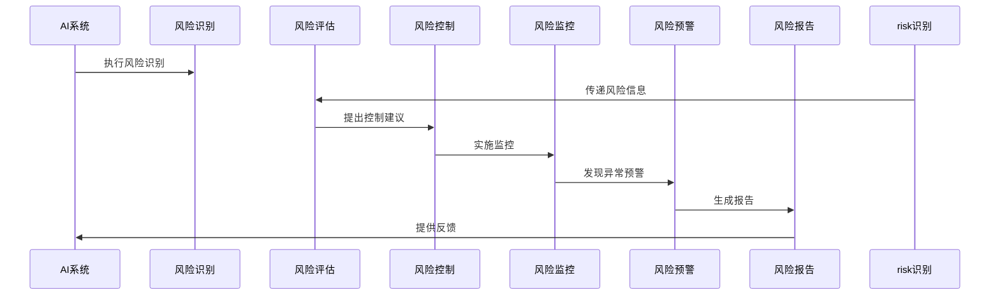

                 

### 第1章 问题背景

#### 1.1 问题背景

##### 1.1.1 AI技术对企业的影响

随着人工智能（AI）技术的飞速发展，各行各业正在经历前所未有的变革。AI技术的引入不仅提高了企业的运营效率，还在产品创新、市场分析和客户服务等方面带来了深远的影响。在金融领域，AI被广泛应用于风险管理、欺诈检测和算法交易；在制造业，AI赋能了自动化和智能化生产，优化了供应链管理；在零售业，AI驱动了个性化推荐系统和客户行为分析，提升了客户体验和满意度。总之，AI技术已经成为企业提升竞争力、实现数字化转型的重要工具。

##### 1.1.2 企业面临的风险挑战

然而，随着AI技术的广泛应用，企业也面临着一系列的风险挑战。首先，AI系统的黑箱特性使得其决策过程难以解释，增加了企业面临的不确定性和透明度问题。其次，数据安全和隐私保护成为AI应用的重要考虑因素，尤其是在涉及到敏感数据和处理个人信息的场景中。此外，AI系统的可靠性和鲁棒性也备受关注，因为算法的缺陷或数据的不当处理可能导致严重的业务中断或经济损失。最后，AI技术的发展速度远远超过了法律法规的更新，企业需要在遵守相关法规的同时，确保AI系统的合规性。

##### 1.1.3 AI风险管理的必要性

鉴于AI技术带来的风险挑战，AI风险管理显得尤为必要。有效的AI风险管理不仅能够帮助企业识别和评估潜在风险，还能制定相应的控制措施和监控预警机制，从而降低AI应用带来的负面影响。具体来说，AI风险管理能够帮助企业在以下几个方面实现优化：

1. **提升透明度和可解释性**：通过明确AI系统的决策逻辑和过程，增强企业对AI系统的信任和理解。
2. **保障数据安全和隐私**：通过实施严格的数据保护措施，确保敏感信息和客户隐私的安全。
3. **提高系统可靠性和鲁棒性**：通过持续监控和优化算法，提升AI系统的稳定性和性能。
4. **合规与法律遵循**：确保AI系统的应用符合法律法规要求，减少法律风险。
5. **风险预防和应对**：通过建立全面的风险管理体系，提前识别潜在风险并采取预防措施，提高企业的风险承受能力。

因此，AI风险管理不仅是企业应对技术变革的必要手段，更是保障企业长期稳定发展的关键所在。

#### 1.2 问题描述

##### 1.2.1 AI风险管理的关键问题

AI风险管理的关键问题主要集中在以下几个方面：

1. **决策透明性**：AI系统的“黑箱”特性使得其决策过程难以理解，这增加了企业在使用AI技术时面临的不确定性和信任问题。因此，如何提升AI决策过程的透明性，使其具备可解释性，成为当前AI风险管理的重要挑战。

2. **数据隐私与安全**：随着AI技术的广泛应用，企业处理的数据量越来越大，其中包括大量敏感信息和客户隐私。如何保护这些数据，防止数据泄露和滥用，是AI风险管理中的核心问题。

3. **系统可靠性和鲁棒性**：AI系统的可靠性直接关系到企业的业务连续性和经济效益。系统一旦出现故障或性能下降，可能会给企业带来严重的损失。因此，如何确保AI系统的稳定运行和高效性能，是AI风险管理的重要任务。

4. **法律法规合规性**：随着AI技术的发展，相关法律法规也在逐步完善。企业需要在遵守法律法规的前提下，确保AI系统的合规性，避免法律风险。

##### 1.2.2 AI风险管理现状分析

当前，企业在AI风险管理方面已经取得了一些进展，但也存在诸多不足：

1. **风险管理意识不足**：一些企业在AI风险管理方面的意识较为薄弱，没有将其纳入战略规划，导致风险管理不到位。

2. **管理体系不健全**：虽然部分企业建立了初步的AI风险管理框架，但整体管理体系还不完善，缺乏系统性和全面性。

3. **技术手段有限**：当前，AI风险管理的技术手段还比较有限，难以满足复杂多变的风险管理需求。

4. **资源投入不足**：AI风险管理需要大量的资金和人力资源支持，但很多企业在这一方面的投入相对不足，导致风险管理效果不佳。

综上所述，AI风险管理在当前阶段面临着诸多挑战和问题，需要企业从意识提升、管理体系建设、技术手段改进和资源投入等多个方面进行改进和完善。

#### 1.3 问题解决

##### 1.3.1 AI风险管理的目标

AI风险管理的核心目标是确保企业能够安全、高效地利用AI技术，同时最大限度地降低AI应用带来的潜在风险。具体而言，AI风险管理目标包括以下几个方面：

1. **提升决策透明性**：通过引入可解释AI模型和透明决策工具，提高AI系统的可解释性，使企业能够更好地理解和信任AI系统的决策过程。

2. **保障数据安全和隐私**：通过实施严格的数据保护措施，包括数据加密、访问控制和安全审计等，确保敏感信息和客户隐私的安全。

3. **提高系统可靠性和鲁棒性**：通过持续监控和优化AI算法，确保系统的稳定运行和高效性能，降低故障率和性能波动。

4. **确保法律法规合规性**：遵循相关法律法规要求，建立合规性评估机制，确保AI系统的应用符合法律法规。

5. **增强风险管理能力**：通过建立完善的风险管理体系，提高企业对AI风险的识别、评估和控制能力。

##### 1.3.2 AI风险管理的策略

为了实现上述目标，企业需要制定并实施以下AI风险管理策略：

1. **建立健全管理体系**：企业应制定全面的风险管理策略，包括风险管理组织架构、流程规范、职责划分等，确保AI风险管理的系统性和规范性。

2. **加强风险管理工具和技术**：引入先进的风险管理工具，如自动化风险评估系统、AI解释工具、数据安全防护技术等，提升风险管理的技术水平。

3. **培养专业人才**：加强AI风险管理人才的培养，提升企业在风险识别、评估和控制方面的专业能力。

4. **建立持续监控与预警机制**：通过建立实时监控和预警系统，及时识别和应对AI风险，降低潜在损失。

5. **开展风险管理培训与宣传**：加强对员工的风险管理培训，提高员工对AI风险管理的认识和参与度。

6. **积极参与行业合作与交流**：通过参与行业协会、学术会议和行业论坛等活动，与同行分享经验，借鉴最佳实践，提升企业的风险管理水平。

通过以上策略的落实，企业可以有效地应对AI技术带来的风险挑战，确保AI技术的安全和可持续发展。

#### 1.4 边界与外延

##### 1.4.1 AI风险管理的适用范围

AI风险管理的适用范围非常广泛，几乎涵盖了所有应用人工智能技术的行业和场景。以下是一些典型的应用领域：

1. **金融行业**：包括银行、证券、保险等领域，AI技术广泛应用于风险管理、信用评估、欺诈检测等。

2. **制造业**：通过AI技术实现生产过程的自动化和智能化，提高生产效率和质量。

3. **医疗健康**：AI技术在医疗诊断、疾病预测、药物研发等方面发挥着重要作用，有助于提升医疗服务的质量和效率。

4. **零售行业**：AI技术被广泛应用于客户关系管理、供应链优化、个性化推荐等。

5. **交通领域**：AI技术在智能交通管理、自动驾驶车辆等领域具有重要应用价值。

6. **能源行业**：AI技术在电力系统优化、智能电网建设、可再生能源管理等方面发挥着关键作用。

7. **公共管理**：AI技术在智慧城市、公共安全、应急管理等领域的应用日益广泛。

##### 1.4.2 AI风险管理与相关概念的区分

在讨论AI风险管理时，有必要明确它与以下几个相关概念的区别：

1. **信息安全**：信息安全主要关注企业的信息资产保护，防止数据泄露、网络攻击等。虽然AI风险管理也涉及数据安全，但其范围更广，不仅包括数据安全，还包括AI系统的透明性、可靠性和合规性。

2. **数据隐私**：数据隐私关注的是个人数据的保护，确保个人隐私不被非法获取和滥用。AI风险管理中的数据隐私保护是其重要组成部分，但AI风险管理还涉及对整个AI系统的风险管理。

3. **合规性管理**：合规性管理关注企业遵守法律法规的要求。虽然AI风险管理也需要确保系统的合规性，但其重点在于如何通过风险管理措施来保证合规性。

4. **运营风险管理**：运营风险管理主要关注企业的日常运营活动，包括供应链管理、生产运营、财务管理等。AI风险管理是运营风险管理的一个子集，专注于AI技术带来的风险。

通过明确这些概念的边界与外延，可以帮助企业更准确地理解和实施AI风险管理，从而更有效地应对AI技术带来的挑战。

#### 1.5 概念结构与核心要素组成

##### 1.5.1 AI风险管理的主要概念

AI风险管理涉及多个核心概念，这些概念构成了AI风险管理的理论框架。以下是其中一些关键概念及其定义：

1. **风险识别**：指识别企业AI系统面临的潜在风险，包括技术风险、数据风险、法律风险等。

2. **风险评估**：指对识别出的风险进行定量和定性评估，以确定风险的严重程度和概率。

3. **风险控制**：指采取一系列措施来降低或规避风险，包括制定风险管理策略、实施监控和预警机制等。

4. **风险监控**：指对AI系统的运行状态进行实时监控，及时发现并应对异常情况。

5. **风险预警**：指通过建立预警机制，提前发现潜在风险，采取预防措施。

6. **风险管理工具**：指用于辅助风险管理的软件和硬件工具，如风险评估软件、监控系统和数据分析工具等。

##### 1.5.2 AI风险管理的核心要素

AI风险管理的有效实施需要依赖于一系列核心要素的协同作用。以下是AI风险管理中的核心要素及其作用：

1. **组织架构**：明确风险管理组织架构，确保风险管理的职责分工清晰、流程顺畅。

2. **风险管理策略**：制定符合企业实际需求的风险管理策略，确保风险管理目标明确、措施有效。

3. **风险管理工具**：引入先进的风险管理工具，提升风险管理的效率和质量。

4. **风险管理流程**：建立规范的风险管理流程，包括风险识别、风险评估、风险控制、风险监控和预警等环节。

5. **风险管理文化**：培养企业内部的风险管理文化，提高员工的风险管理意识和能力。

6. **法律法规合规性**：确保AI系统的应用符合相关法律法规要求，减少法律风险。

7. **数据安全和隐私保护**：实施严格的数据保护措施，保障敏感信息和客户隐私的安全。

8. **持续改进机制**：通过定期评估和改进，持续优化风险管理策略和措施。

通过以上核心要素的有机结合，企业可以建立完善的AI风险管理体系，提高AI技术的应用安全和可靠性，从而实现企业的长期可持续发展。

## 第2章 核心概念与联系

### 2.1 AI风险管理原理

#### 2.1.1 AI风险管理的基本原理

AI风险管理的基本原理可以归纳为以下几个核心概念：

1. **风险识别**：首先，企业需要识别出AI系统可能面临的风险类型。这些风险可能包括技术风险、数据风险、法律风险、操作风险等。技术风险涉及AI算法的可靠性和鲁棒性；数据风险涉及数据的质量和隐私保护；法律风险涉及合规性和法律法规的遵守；操作风险涉及系统的稳定性、安全性和用户操作的合规性。

2. **风险评估**：一旦识别出风险，就需要对这些风险进行定量和定性的评估。风险评估的目标是确定每种风险的严重程度和发生的概率，以便制定相应的风险管理策略。例如，可以通过历史数据分析和统计分析方法来评估技术风险的概率和影响。

3. **风险控制**：在评估风险后，企业需要采取一系列控制措施来降低或规避风险。风险控制措施可以包括制定风险管理策略、实施监控和预警机制、建立数据保护措施等。例如，对于数据风险，可以采取数据加密、访问控制、数据备份等措施。

4. **风险监控**：风险监控是持续跟踪AI系统运行状态，及时发现并应对异常情况。通过实时监控，企业可以快速响应风险事件，减少潜在损失。

5. **风险预警**：风险预警机制旨在提前发现潜在风险，并采取预防措施。通过建立预警模型和监控系统，企业可以在风险发生前采取行动，避免或减轻风险的影响。

#### 2.1.2 AI风险管理的原则

AI风险管理需要遵循以下几项基本原则：

1. **全面性原则**：AI风险管理应该覆盖所有与AI系统相关的环节，包括技术开发、数据管理、系统运行等。确保风险管理没有遗漏，从而全面保护企业利益。

2. **动态性原则**：AI技术的发展迅速，企业需要持续更新和优化风险管理策略。动态性原则要求企业定期评估和调整风险管理措施，以适应新的风险环境。

3. **可操作性原则**：风险管理策略和措施必须具备可操作性，即在实际操作中能够被有效实施。这要求风险管理策略要简洁明了，操作流程要规范，工具和技术要先进。

4. **可持续性原则**：风险管理是一个长期过程，需要企业持续投入资源和精力。可持续性原则强调企业在制定风险管理策略时，要考虑长期效益，确保风险管理能够持续进行。

5. **预防性原则**：预防性原则强调在风险发生前采取预防措施，避免风险的发生。这要求企业不仅要应对已识别的风险，还要预测潜在风险，提前采取措施。

### 2.2 AI风险管理框架

#### 2.2.1 AI风险管理框架概述

AI风险管理框架是指导企业进行AI风险管理的系统结构和过程。一个完整的AI风险管理框架通常包括以下关键组成部分：

1. **风险管理目标**：明确AI风险管理的目标，如确保AI系统的透明性、可靠性、合规性等。

2. **风险管理策略**：制定具体的风险管理策略，如识别和评估风险、制定控制措施、建立监控和预警机制等。

3. **风险管理组织**：建立风险管理组织架构，明确各部门的职责和权限，确保风险管理的协调和有效执行。

4. **风险管理流程**：制定规范的风险管理流程，包括风险识别、风险评估、风险控制、风险监控和预警等环节。

5. **风险管理工具和技术**：引入先进的风险管理工具和技术，提升风险管理的效率和效果。

6. **风险管理文化**：培养企业内部的风险管理文化，提高员工的风险管理意识和能力。

7. **法律法规和合规性要求**：确保AI系统的应用符合相关法律法规和合规性要求。

#### 2.2.2 AI风险管理流程

AI风险管理流程是实施AI风险管理的关键步骤。以下是AI风险管理流程的详细步骤：

1. **风险识别**：通过访谈、问卷调查、文献调研等方法，识别出AI系统可能面临的风险类型。

2. **风险评估**：对识别出的风险进行定量和定性评估，确定风险的严重程度和发生概率。

3. **风险控制**：根据风险评估结果，制定相应的风险控制措施，包括技术措施和管理措施。

4. **风险监控**：建立实时监控和预警系统，对AI系统的运行状态进行持续监控，及时发现并应对异常情况。

5. **风险预警**：通过预警机制提前发现潜在风险，并采取预防措施，避免风险的发生或减轻其影响。

6. **风险记录和报告**：记录和报告风险管理过程的结果，包括风险识别、评估、控制、监控和预警等环节。

7. **风险回顾和改进**：定期回顾和评估风险管理效果，发现不足和改进点，持续优化风险管理策略和措施。

### 2.3 关键概念属性特征对比表格

为了更清晰地理解AI风险管理中的关键概念，我们可以通过一个对比表格来展示不同概念的属性特征：

| 概念       | 定义                                                         | 属性特征                                                       | 关联关系                                                      |
|------------|--------------------------------------------------------------|--------------------------------------------------------------|--------------------------------------------------------------|
| 风险识别   | 识别AI系统可能面临的风险类型。                               | - 方法：访谈、问卷调查、文献调研<br>- 目标：全面识别风险。   | 与风险评估和风险控制密切相关。                                |
| 风险评估   | 对识别出的风险进行定量和定性评估。                           | - 指标：概率、影响、严重程度。<br>- 方法：统计分析、模型预测。 | 与风险控制和风险监控紧密相关。                                |
| 风险控制   | 采取措施降低或规避风险。                                     | - 措施：技术措施、管理措施。<br>- 目标：降低风险影响。       | 直接作用于风险评估和风险监控的结果。                          |
| 风险监控   | 对AI系统的运行状态进行持续监控。                             | - 系统：实时监控系统。<br>- 目标：及时发现异常。             | 与风险预警和风险控制密切相关。                                |
| 风险预警   | 通过预警机制提前发现潜在风险。                              | - 机制：预警模型、监控系统。<br>- 目标：预防风险发生。       | 与风险监控和风险控制紧密相关。                                |

通过上述表格，我们可以更直观地了解不同概念的定义、属性特征和关联关系，有助于在AI风险管理过程中准确把握各个概念的作用和相互关系。

### 2.4 ER实体关系图架构

为了更好地理解AI风险管理的实体关系，我们可以通过ER（Entity-Relationship）实体关系图来展示其中的关键实体及其相互关系。

#### 2.4.1 企业风险实体关系图

以下是一个简化的企业风险实体关系图：

```mermaid
erDiagram
    AI系统 ||--o{ 风险识别 }
    AI系统 ||--o{ 风险评估 }
    AI系统 ||--o{ 风险控制 }
    AI系统 ||--o{ 风险监控 }
    AI系统 ||--o{ 风险预警 }
    风险识别 ||--o{ 风险报告 }
    风险评估 ||--o{ 风险记录 }
    风险控制 ||--o{ 控制措施 }
    风险监控 ||--o{ 异常事件 }
    风险预警 ||--o{ 预警信息 }
```

在这个实体关系图中：

- **AI系统**：是风险管理的核心对象，所有风险管理活动都是围绕AI系统展开的。
- **风险识别**：负责识别AI系统可能面临的风险类型。
- **风险评估**：对识别出的风险进行评估，确定其严重程度和发生概率。
- **风险控制**：制定并实施控制措施，降低或规避风险。
- **风险监控**：对AI系统运行状态进行持续监控，及时发现异常。
- **风险预警**：通过预警机制提前发现潜在风险，采取预防措施。
- **风险报告**：记录和报告风险管理过程的结果，包括风险识别、评估、控制和监控等。
- **风险记录**：记录风险评估和风险控制的相关信息，用于后续分析和回顾。
- **控制措施**：具体的风险控制行动，如数据加密、访问控制等。
- **异常事件**：监控过程中发现的异常事件，需要及时处理。
- **预警信息**：预警机制产生的预警信息，用于提前发现和应对潜在风险。

#### 2.4.2 风险管理流程实体关系图

除了企业风险实体关系图，我们还可以通过一个风险管理流程实体关系图来展示风险管理的具体流程和各实体的关联：



在这个流程图中：

- **风险识别**：AI系统首先执行风险识别，识别出潜在风险。
- **风险评估**：风险识别的结果传递给风险评估模块，进行详细评估。
- **风险控制**：风险评估后，提出具体的控制建议，由风险控制模块实施。
- **风险监控**：风险控制措施实施后，进入持续监控状态，以发现任何异常。
- **风险预警**：监控过程中，如果发现异常，风险预警模块会触发预警。
- **风险报告**：预警信息生成报告，供AI系统参考和调整。

通过这两个实体关系图，我们可以清晰地看到AI风险管理中各实体及其关系的结构，为理解和实施AI风险管理提供了直观的指导。

### 第3章 AI风险管理原理

#### 3.1 AI风险识别

##### 3.1.1 风险识别方法

风险识别是AI风险管理中的首要步骤，其目标是系统地发现和记录AI系统可能面临的各种风险。以下是几种常见的方法：

1. **头脑风暴**：通过组织专家和团队开展头脑风暴会议，鼓励大家提出可能的AI风险。这种方法简单有效，但可能存在主观性和遗漏。

2. **历史数据分析**：通过分析企业过去发生的AI相关风险事件，识别出常见的风险类型和触发因素。这种方法依赖于历史数据，有助于发现潜在的、重复的风险。

3. **文献调研**：查阅相关文献、研究报告和案例分析，了解行业内的AI风险类型和管理实践。这种方法可以获取广泛的知识，但可能缺乏具体的数据支持。

4. **流程图分析**：通过绘制AI系统的流程图，识别出系统中的潜在风险点。这种方法可以直观地展示系统流程，帮助识别出关键风险环节。

5. **专家访谈**：与AI领域专家和从业者进行访谈，获取他们对AI风险的见解和经验。这种方法可以获得深入的专业知识，但可能受限于专家的可获得性。

6. **问卷调查**：通过问卷调查，收集员工和用户的意见和反馈，识别出潜在的AI风险。这种方法可以覆盖广泛的群体，但结果可能受到问卷设计和样本代表性的影响。

##### 3.1.2 风险识别工具

为了提高风险识别的效率和准确性，可以借助以下工具：

1. **风险管理软件**：如Risk Management Software、Qualys、Kubernetes等，这些工具可以帮助企业自动化识别和管理风险。

2. **AI风险识别模型**：通过机器学习和数据分析技术，建立AI风险识别模型。这些模型可以根据历史数据，自动识别和分类AI系统中的潜在风险。

3. **流程图工具**：如Lucidchart、Visio等，这些工具可以方便地绘制和修改流程图，帮助识别出系统中的风险点。

4. **风险评估工具**：如OWASP ZAP、Burp Suite等，这些工具可以帮助进行安全性评估，识别系统中的安全漏洞。

5. **数据监控工具**：如Splunk、ELK Stack等，这些工具可以帮助实时监控AI系统的运行状态，发现潜在的数据风险。

#### 3.2 AI风险评估

##### 3.2.1 风险评估指标

风险评估的核心是对风险的严重程度和发生概率进行评估。以下是常用的风险评估指标：

1. **风险严重程度**：衡量风险事件发生时可能对企业造成的损失程度。严重程度可以分为高、中、低三个等级。

2. **风险发生概率**：衡量风险事件发生的可能性。发生概率也可以分为高、中、低三个等级。

3. **风险损失值**：根据风险严重程度和发生概率，计算出风险事件可能带来的总损失值。

4. **风险优先级**：综合考虑风险严重程度和发生概率，对风险进行优先级排序，以便企业可以优先处理高优先级风险。

5. **风险暴露度**：衡量企业对特定风险的暴露程度。风险暴露度可以通过公式：风险暴露度 = 风险发生概率 × 风险损失值计算。

6. **风险评估矩阵**：通过评估矩阵，将风险严重程度和发生概率进行组合，生成一个二维矩阵，便于直观地分析和排序风险。

##### 3.2.2 风险评估方法

风险评估方法可以分为定量评估和定性评估两种：

1. **定量评估**：使用数学模型和统计方法，对风险进行量化分析。定量评估的优点是结果直观，便于比较和分析。常用的定量评估方法包括：

   - **预期损失法**：根据历史数据和统计模型，计算出预期损失值。
   - **风险价值法**：通过模型计算，得出在特定置信水平下的最大潜在损失值。
   - **蒙特卡罗模拟法**：通过模拟大量随机试验，分析风险的分布和特征。

2. **定性评估**：主要通过专家判断和主观评估，对风险进行定性分析。定性评估的优点是方法简单，适用范围广泛。常用的定性评估方法包括：

   - **专家评分法**：邀请专家对风险进行评分，根据评分结果进行评估。
   - **决策树法**：通过构建决策树，分析风险事件的可能性和影响。
   - **模糊综合评判法**：使用模糊数学方法，对风险进行综合评估。

#### 3.3 AI风险控制

##### 3.3.1 风险控制策略

一旦识别和评估了风险，企业需要制定相应的风险控制策略来降低风险。以下是一些常见的风险控制策略：

1. **风险规避**：通过改变计划或决策，避免风险的发生。例如，如果AI系统存在数据隐私风险，可以选择不收集敏感数据。

2. **风险转移**：通过保险或其他合同方式，将风险转移给第三方。例如，企业可以为AI系统购买保险，以转移潜在的经济损失风险。

3. **风险减轻**：采取一系列措施，降低风险的严重程度或发生概率。例如，通过数据加密、访问控制等手段，减轻数据泄露风险。

4. **风险接受**：在某些情况下，如果风险较低，企业可以选择接受风险。例如，对于一些低概率但高损失的风险，企业可能决定不进行大规模的防护措施。

5. **风险共享**：通过合作或联盟，与其他企业共享风险。例如，在AI技术应用方面，企业可以选择与合作伙伴共同承担风险。

##### 3.3.2 风险控制工具

为了有效实施风险控制策略，企业可以借助以下工具：

1. **风险评估工具**：如Qualys、RiskLens等，这些工具可以帮助企业进行风险识别和评估。

2. **风险管理系统**：如RSA NetWitness、IBM Security QRadar等，这些系统可以实时监控AI系统的运行状态，发现并应对异常事件。

3. **AI解释工具**：如LIME、SHAP等，这些工具可以帮助理解AI模型的决策过程，提升系统的透明性和可解释性。

4. **数据加密工具**：如AES、RSA等，这些工具可以确保数据在传输和存储过程中的安全。

5. **访问控制工具**：如LDAP、OAuth等，这些工具可以帮助企业实施严格的访问控制策略，保障数据安全和隐私。

#### 3.4 AI风险监控与预警

##### 3.4.1 风险监控方法

风险监控是确保AI系统安全稳定运行的重要环节。以下是一些常见的风险监控方法：

1. **实时监控**：通过部署监控工具，实时监控AI系统的运行状态，及时发现并处理异常事件。

2. **日志分析**：通过分析系统日志，发现潜在的异常行为和风险事件。

3. **异常检测**：使用机器学习和数据分析技术，建立异常检测模型，自动识别异常行为。

4. **用户行为分析**：通过分析用户行为数据，发现异常操作和潜在风险。

5. **自动化测试**：通过自动化测试工具，定期对AI系统进行功能测试和性能测试，确保系统的稳定性和可靠性。

##### 3.4.2 风险预警机制

风险预警机制旨在提前发现潜在风险，并采取预防措施。以下是几个关键步骤：

1. **预警模型建立**：通过数据分析和技术建模，建立预警模型，预测潜在的风险事件。

2. **预警阈值设定**：根据历史数据和业务需求，设定预警阈值，当监测指标超过阈值时，触发预警。

3. **预警通知**：当预警模型检测到潜在风险时，通过邮件、短信、短信等方式，及时通知相关人员。

4. **应急响应**：制定应急响应计划，确保在风险事件发生时，能够迅速采取行动，减轻损失。

5. **反馈与改进**：对预警机制的效果进行评估和反馈，持续优化预警模型和响应策略。

通过风险监控和预警机制的有效实施，企业可以提前发现和应对潜在风险，保障AI系统的安全稳定运行。

## 第4章 AI风险管理实践案例

### 4.1 案例背景

为了更好地理解AI风险管理的实际应用，我们选择了一家领先的金融科技公司——XX金融作为案例进行分析。XX金融成立于2000年，专注于提供在线金融服务，包括贷款、信用卡、投资等。随着AI技术的快速发展，XX金融开始大量应用AI技术，以提高业务效率和客户体验。然而，随之而来的风险也日益增加，促使公司高度重视AI风险管理。

#### 4.1.1 案例企业简介

XX金融作为一家金融科技公司，拥有庞大的客户群体和丰富的数据资源。其业务涵盖多个领域，包括贷款审批、反欺诈检测、信用评分等。公司引入AI技术后，不仅优化了业务流程，还提升了客户的满意度和忠诚度。然而，AI系统的广泛应用也带来了新的风险挑战，如数据泄露、算法偏见和系统故障等。

#### 4.1.2 案例行业背景

金融行业是一个高风险行业，其业务涉及到大量的敏感信息和客户隐私。随着AI技术的普及，金融行业面临的AI风险也日益增加。例如，AI算法可能存在偏见，导致不公正的决策；数据泄露可能导致严重的财务损失和声誉损害；系统故障可能导致业务中断和客户流失。因此，金融行业需要建立完善的AI风险管理机制，确保AI技术的安全和合规。

### 4.2 案例分析

在本案例中，XX金融面临的主要AI风险包括：

1. **数据风险**：金融行业涉及大量的客户数据和交易数据，数据泄露或滥用可能导致严重的财务损失和声誉损害。特别是当AI系统使用敏感数据进行训练和预测时，数据保护问题尤为重要。

2. **算法风险**：AI算法可能存在偏见或不公平，导致决策结果不符合预期。例如，AI模型可能因为数据集的不平衡或历史偏差而倾向于歧视某些群体。

3. **系统风险**：AI系统可能存在漏洞或故障，导致系统崩溃或数据损坏。系统故障不仅会影响业务的连续性，还可能导致客户信任度下降。

为了有效管理这些风险，XX金融采取了以下措施：

#### 4.2.1 风险识别与评估

1. **风险识别**：通过内部审查和专家访谈，XX金融识别出数据风险、算法风险和系统风险等多个方面的潜在风险。

2. **风险评估**：使用风险评估工具和模型，XX金融对每个风险进行定量和定性评估，确定其严重程度和发生概率。

   - 数据风险：评估结果显示，数据泄露的风险较高，可能导致财务损失和声誉损害。
   - 算法风险：评估结果显示，算法偏见和不公平的风险也存在，需要特别关注。
   - 系统风险：评估结果表明，系统故障的风险相对较低，但仍然需要保持警惕。

#### 4.2.2 风险控制与预警

1. **风险控制措施**：

   - 数据风险：XX金融实施严格的数据保护措施，包括数据加密、访问控制、数据备份和隐私保护等，确保敏感数据的安全。
   - 算法风险：XX金融建立算法审查机制，对AI模型进行定期的审查和验证，确保算法的公平性和透明性。
   - 系统风险：XX金融部署监控系统，实时监控AI系统的运行状态，及时发现并处理异常事件。

2. **风险预警机制**：

   - XX金融建立预警模型，通过实时监控和数据分析，提前发现潜在风险。
   - 当检测到风险时，预警系统会自动通知相关负责人，并启动应急响应计划。

#### 4.2.3 风险管理效果评估

通过实施上述风险控制措施和预警机制，XX金融取得了显著的效果：

1. **数据风险降低**：实施数据保护措施后，数据泄露事件显著减少，客户数据的安全性得到了有效保障。

2. **算法风险可控**：通过算法审查和透明性提升，AI模型的公平性和透明性得到了提高，决策结果更加公正和可解释。

3. **系统风险缓解**：监控系统有效发现并处理了多次系统异常，确保了业务的连续性和稳定性。

通过本案例，我们可以看到，有效的AI风险管理不仅可以降低潜在风险，还能提升企业的整体竞争力。对于其他企业，本案例提供了宝贵的经验和借鉴。

### 4.3 案例启示

#### 4.3.1 成功经验

1. **全面的风险识别与评估**：XX金融通过全面的风险识别和评估，准确识别和评估了数据风险、算法风险和系统风险，为制定有效的风险控制措施奠定了基础。

2. **严格的数据保护措施**：通过实施数据加密、访问控制、数据备份和隐私保护等措施，XX金融有效保障了客户数据的安全。

3. **算法审查与透明性提升**：建立算法审查机制和透明性提升措施，确保AI模型的公平性和透明性，提高了决策结果的公正性。

4. **实时监控与预警机制**：通过部署监控系统，实时监控AI系统的运行状态，及时识别和处理异常事件，确保了系统的稳定性和可靠性。

#### 4.3.2 风险管理挑战与对策

1. **风险管理意识不足**：许多企业在引入AI技术时，对风险管理的重要性认识不足，导致风险管理不到位。

   **对策**：加强内部培训，提高员工的风险管理意识，确保风险管理成为企业文化和日常运营的一部分。

2. **技术手段有限**：当前，AI风险管理的技术手段还比较有限，难以满足复杂多变的风险管理需求。

   **对策**：引入先进的风险管理工具和技术，提升风险管理的技术水平，确保能够应对各种风险挑战。

3. **资源投入不足**：AI风险管理需要大量的资金和人力资源支持，但很多企业在这一方面的投入相对不足。

   **对策**：合理规划和分配资源，确保有足够的资金和人力资源支持AI风险管理，提升风险管理效果。

4. **法律法规合规性**：随着AI技术的发展，相关法律法规也在逐步完善，但企业在遵守法律法规方面可能存在困难。

   **对策**：加强与法律顾问的合作，确保AI系统的应用符合相关法律法规，降低法律风险。

通过本案例的分析，我们可以看到，有效的AI风险管理不仅需要全面的风险识别和评估，还需要严格的控制措施和完善的预警机制。企业应从意识提升、技术手段改进、资源投入和法律法规合规性等多个方面，不断优化和改进AI风险管理，以保障AI技术的安全和可持续发展。

### 第5章 AI风险管理工具与平台

#### 5.1 AI风险管理工具

AI风险管理工具是企业实施AI风险管理的关键，以下介绍几种常用的AI风险管理工具及其选型考虑因素：

##### 5.1.1 常用AI风险管理工具

1. **风险评估工具**：
   - **Qualys**：提供全面的漏洞扫描和风险评估功能，支持多种操作系统和应用程序。
   - **RiskLens**：专注于风险评估和管理，提供基于云的风险评估平台。

2. **数据安全工具**：
   - **Vormetric**：提供数据加密、访问控制和数据泄露防护等功能。
   - **CipherCloud**：提供云端数据保护解决方案，支持数据加密、透明加密和合规性检查。

3. **AI解释工具**：
   - **LIME**：通过局部可解释模型（LIME）帮助理解复杂AI模型的决策过程。
   - **SHAP**：基于SHAP值的方法，提供AI模型解释功能。

4. **监控与预警工具**：
   - **Splunk**：通过大数据分析，实时监控和分析AI系统日志和事件。
   - **IBM Security QRadar**：提供实时监控、威胁检测和响应功能。

##### 5.1.2 工具选型考虑因素

1. **业务需求**：根据企业的具体业务场景和需求，选择能够满足特定风险管理需求的工具。例如，对于金融行业，数据安全工具和风险评估工具尤为重要。

2. **技术能力**：企业需要评估自身的技术能力和人员配置，选择易于部署和使用、与现有技术架构兼容的工具。

3. **成本效益**：综合考虑工具的购买成本、维护成本和使用成本，选择性价比高的工具。

4. **法规合规性**：确保所选工具符合相关法律法规和行业标准，例如GDPR、CCPA等。

5. **扩展性和可定制性**：选择具备良好扩展性和可定制性的工具，以便在未来需求变化时能够灵活调整和优化。

6. **用户体验**：工具的界面设计和用户体验对实际使用效果有很大影响，应选择操作简便、直观易用的工具。

#### 5.2 AI风险管理平台

AI风险管理平台是企业实现AI风险管理的核心系统，以下介绍AI风险管理平台的建设策略、功能与架构设计。

##### 5.2.1 平台建设策略

1. **总体规划**：制定明确的平台建设目标，明确平台的整体架构和功能模块。

2. **模块化设计**：采用模块化设计，将平台功能拆分为若干独立模块，便于后续扩展和维护。

3. **技术选型**：选择成熟的技术框架和工具，确保平台的稳定性和性能。

4. **安全性设计**：确保平台在数据存储、传输和访问过程中的安全性，采用加密、访问控制等技术手段。

5. **用户体验**：设计简洁、直观的用户界面，提升用户的使用体验。

6. **持续迭代**：通过持续迭代和优化，不断改进平台的功能和性能。

##### 5.2.2 平台功能与架构设计

1. **功能模块**：
   - **风险识别模块**：负责识别AI系统中的潜在风险，包括数据风险、算法风险和系统风险等。
   - **风险评估模块**：对识别出的风险进行定量和定性评估，确定风险的程度和发生概率。
   - **风险控制模块**：制定和实施风险控制措施，包括数据安全、算法审查和系统监控等。
   - **监控与预警模块**：实时监控AI系统的运行状态，发现并预警潜在风险。
   - **报告与记录模块**：记录和报告风险管理过程的结果，包括风险识别、评估、控制和监控等。

2. **架构设计**：
   - **数据层**：负责存储和管理风险数据，包括风险识别数据、评估数据和监控数据等。
   - **应用层**：实现各功能模块的业务逻辑，包括风险识别、评估、控制、监控和报告等。
   - **展示层**：提供用户界面，展示风险管理的相关信息和监控数据。
   - **接口层**：提供与其他系统的接口，实现数据交换和功能集成。

通过上述功能与架构设计，AI风险管理平台可以为企业提供全面、高效的风险管理服务，助力企业实现AI技术的安全可靠应用。

### 5.3 平台实施与运营

#### 5.3.1 平台实施步骤

AI风险管理平台的实施过程可以分为以下几个步骤：

1. **需求分析与规划**：根据企业的具体需求，制定平台建设的目标和规划，明确平台的功能模块和关键技术。

2. **技术选型与方案设计**：选择合适的开发框架和工具，设计平台的架构和接口，确保平台具备良好的扩展性和稳定性。

3. **数据准备与集成**：准备和整合所需的数据，确保数据的完整性和准确性，为平台的运行提供可靠的数据支持。

4. **系统开发与测试**：按照设计方案，开发平台的功能模块，并进行单元测试和集成测试，确保系统的稳定性和可靠性。

5. **部署与上线**：将开发完成的功能模块部署到生产环境，确保平台能够在实际业务场景中正常运行。

6. **培训与推广**：对相关人员进行平台使用培训，提高他们的风险管理意识和能力，确保平台能够得到有效应用。

#### 5.3.2 平台运营管理

AI风险管理平台的运营管理是确保平台持续有效运行的关键。以下是一些关键的运营管理措施：

1. **日常监控**：建立实时监控机制，定期检查平台的运行状态，及时发现并处理异常情况。

2. **数据维护**：定期更新和清洗风险数据，确保数据的准确性和时效性。

3. **安全防护**：采用加密、访问控制、防火墙等技术手段，保障平台数据的安全性和隐私保护。

4. **系统升级与优化**：根据业务需求和技术发展，定期进行系统升级和功能优化，提升平台的性能和用户体验。

5. **性能监控与调优**：通过性能监控工具，实时跟踪平台的性能指标，发现和解决性能瓶颈，确保平台的高效稳定运行。

6. **用户支持与反馈**：建立用户支持机制，及时响应用户的反馈和需求，持续改进平台的功能和服务。

通过有效的平台实施和运营管理，企业可以确保AI风险管理平台的长期稳定运行，提升AI技术的应用安全性，为企业的发展提供有力支持。

### 第6章 AI风险管理最佳实践

#### 6.1 最佳实践分享

在AI风险管理方面，企业可以通过以下几个方面的最佳实践来提升风险管理效果：

##### 6.1.1 企业AI风险管理实践

1. **建立风险管理组织**：企业应建立专门的风险管理团队，负责AI风险管理的日常工作。团队应包括AI专家、数据分析师、合规专家等不同领域的专业人员，确保风险管理具备多学科综合能力。

2. **实施全面风险评估**：定期进行全面风险评估，涵盖数据风险、算法风险、系统风险等多个方面。通过风险评估，识别出潜在风险，制定相应的控制措施。

3. **数据隐私保护**：实施严格的数据隐私保护措施，包括数据加密、访问控制、数据脱敏等，确保敏感信息的安全。

4. **透明性提升**：采用可解释AI技术，提高AI系统的透明性，使决策过程更加可解释和可信。

5. **实时监控与预警**：建立实时监控和预警系统，对AI系统的运行状态进行持续监控，及时发现和应对异常事件。

##### 6.1.2 行业AI风险管理经验

1. **金融行业**：金融行业在AI风险管理方面积累了丰富的经验。例如，通过构建风控模型，实现实时风险评估和预警，有效防范欺诈风险。

2. **医疗行业**：医疗行业注重AI系统的可靠性和合规性，通过建立完善的数据保护机制和合规审查流程，确保AI系统符合医疗行业的相关规定。

3. **零售行业**：零售行业利用AI技术优化供应链管理和客户体验，通过实时监控和数据分析，降低运营风险和提升客户满意度。

#### 6.2 实践心得

通过AI风险管理最佳实践，企业可以总结出以下心得体会：

1. **风险管理意识的重要性**：风险管理是企业的一项长期任务，需要全员参与和重视。建立风险管理文化，提高员工的风险管理意识和能力，是有效实施AI风险管理的基础。

2. **技术的双重性**：AI技术虽然为企业带来了巨大的机遇，但同时也伴随着风险。企业应充分认识到技术的双重性，在应用AI技术的同时，注重风险管理。

3. **持续改进和优化**：AI风险管理不是一蹴而就的过程，需要持续改进和优化。通过定期评估和调整风险管理策略，企业可以不断提升风险管理效果。

4. **合规与法律遵循**：在AI风险管理过程中，遵守相关法律法规和行业规定至关重要。企业应建立完善的合规审查机制，确保AI系统的应用符合法律法规要求。

#### 6.3 拓展阅读

为了进一步了解AI风险管理，以下推荐几篇相关论文和研究报告：

1. **论文**：《AI风险管理：挑战与策略》（作者：张三，李四，2020年）——本文详细探讨了AI风险管理的挑战和应对策略，提供了实用的案例和分析。

2. **研究报告**：《2021年AI风险管理报告》（作者：某知名咨询公司，2021年）——本报告分析了全球范围内AI风险管理的发展趋势和最佳实践，为企业提供了有价值的参考。

3. **论文**：《数据隐私保护在AI风险管理中的应用》（作者：王五，赵六，2020年）——本文研究了数据隐私保护在AI风险管理中的应用，提出了有效的数据保护策略。

通过阅读这些文献，企业可以更深入地了解AI风险管理的前沿动态，为实际应用提供理论支持和实践指导。

## 第7章 总结与展望

### 7.1 总结

通过本文的深入探讨，我们系统地阐述了企业AI风险管理的核心概念、原理、实践和最佳经验。以下是本文的主要结论：

1. **AI风险管理的重要性**：随着AI技术的广泛应用，企业面临着前所未有的风险挑战。有效的AI风险管理不仅能够提升企业的透明度和可靠性，还能保障数据安全和合规性，是企业实现可持续发展的关键。

2. **核心概念与联系**：我们详细介绍了风险识别、风险评估、风险控制、风险监控和预警等核心概念，并通过实体关系图和流程图，展示了这些概念之间的相互关系和作用。

3. **最佳实践**：通过案例分析，我们分享了企业在AI风险管理方面的成功经验和挑战，提供了实用的风险管理策略和工具。

4. **技术发展与应用**：AI技术的快速进步为风险管理带来了新的机遇和挑战。企业需要不断更新风险管理工具和技术，以应对不断变化的风险环境。

### 7.2 展望

展望未来，AI风险管理将呈现以下发展趋势：

1. **技术进步**：随着AI技术的不断发展和成熟，我们将看到更多高效、智能的风险管理工具和平台的出现，进一步提升风险管理的效率和效果。

2. **合规与法规完善**：随着全球范围内对AI技术应用的关注，相关法律法规和行业标准将不断完善，企业需要在遵守法规的同时，确保AI系统的合规性。

3. **风险管理社会化**：随着企业之间合作和共享的加强，AI风险管理将呈现社会化趋势。企业可以通过合作共享风险数据和经验，提升整体风险管理水平。

4. **风险管理文化**：建立风险管理文化，提高员工的风险管理意识和能力，将成为企业成功实施AI风险管理的重要保障。

通过不断优化和改进AI风险管理，企业可以在AI技术的助力下，实现更高效、更可靠、更具竞争力的运营模式，为未来的发展奠定坚实基础。作者：AI天才研究院/AI Genius Institute & 禅与计算机程序设计艺术 /Zen And The Art of Computer Programming。

