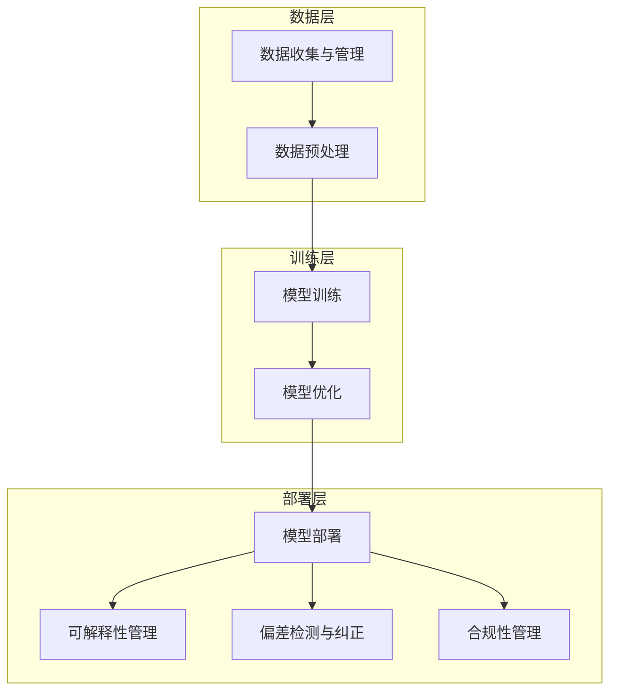
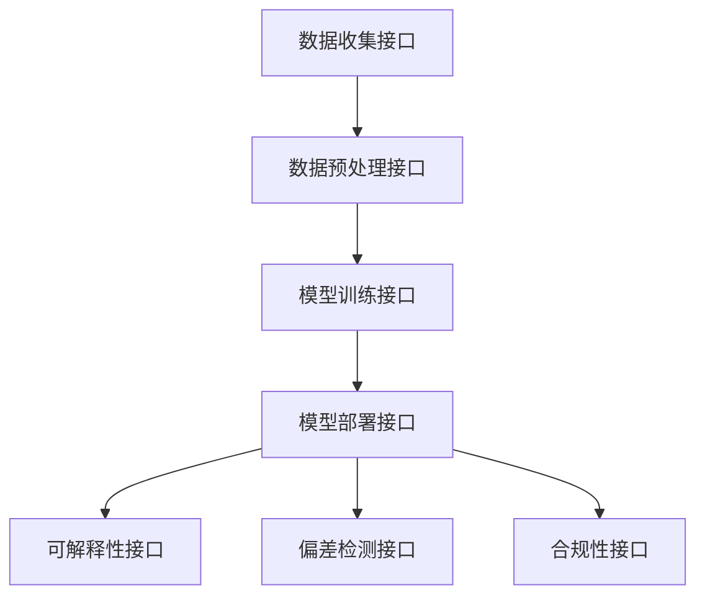
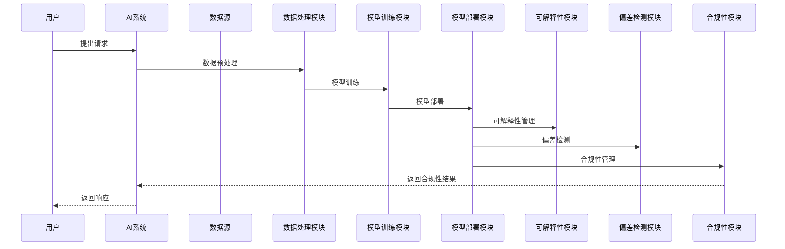

                 


## 设计《企业如何构建和实施有效的AI治理策略》的详细内容

### 第一部分: 背景介绍

#### 第1章: AI治理的重要性

**1.1 AI治理的概念与背景**
- AI治理的定义
- AI治理的起源与发展历程
- AI治理在企业中的重要性

**1.2 企业面临的问题与挑战**
- 数据隐私和安全性
- 伦理问题
- AI算法的不透明性
- AI系统的偏见和歧视
- 法律和监管的挑战

**1.3 AI治理的必要性**
- 提高AI系统的透明性和可解释性
- 增强企业对AI系统的控制和信任
- 保障企业的合规性和信誉
- 提高AI系统的可靠性和安全性

**1.4 AI治理的核心概念与联系**
- AI治理的五个关键概念
- 概念之间的联系
- 概念与实际应用的结合

**1.5 案例分析：成功与失败的AI治理实例**
- 成功案例
- 失败案例
- 成功与失败案例的比较分析

#### 第2章: AI治理的核心概念与联系

**2.1 核心概念解析**
- 数据治理
- 风险管理
- 伦理审查
- 可解释性
- 可靠性和安全性

**2.2 核心要素及其相互关系**
- 核心要素的定义
- 各要素之间的相互作用
- 关系图展示

**2.3 案例分析：成功与失败的AI治理实例**
- 成功案例
- 失败案例
- 分析与总结

### 第二部分: 系统分析与架构设计

#### 第3章: AI治理相关的算法与最佳实践

**3.1 常见的AI治理算法**
- 常见算法介绍
- 算法应用场景

**3.2 AI治理的最佳实践案例**
- 国内案例
- 国际案例
- 案例分析

**3.3 最佳实践总结与借鉴**
- 总结最佳实践的核心要素
- 借鉴经验，制定适合企业自身的AI治理策略

#### 第4章: AI治理架构设计

**4.1 问题场景介绍**
- 企业AI应用场景
- 挑战和问题

**4.2 系统功能设计**
- 功能需求分析
- 领域模型设计

**4.3 系统架构设计**
- 架构设计原则
- 系统架构图展示

**4.4 系统接口设计**
- 接口规范
- 接口设计图展示

**4.5 系统交互设计**
- 交互流程设计
- 交互设计图展示

#### 第5章: 实施与运营策略

**5.1 AI治理的实施步骤**
- 实施步骤概述
- 实施流程图展示

**5.2 运营管理策略**
- 运营管理原则
- 运营管理流程图展示

**5.3 风险管理与监控**
- 风险管理方法
- 监控体系设计

### 第三部分: 项目实战

#### 第6章: 实际案例研究

**6.1 案例一：企业A的AI治理实践**
- 案例背景
- AI治理实践
- 分析与总结

**6.2 案例二：企业B的AI治理经验**
- 案例背景
- AI治理经验
- 分析与总结

**6.3 案例三：企业C的AI治理成效分析**
- 案例背景
- AI治理成效
- 分析与总结

#### 第7章: 项目总结与最佳实践

**7.1 项目小结**
- 项目成果
- 项目不足
- 启示与建议

**7.2 最佳实践 tips**
- 最佳实践总结
- tips分享

**7.3 小结与注意事项**
- 关键点回顾
- 注意事项
- 拓展阅读

### 文章结尾

**作者：AI天才研究院/AI Genius Institute & 禅与计算机程序设计艺术 /Zen And The Art of Computer Programming**

通过上述设计，本文将深入探讨企业如何构建和实施有效的AI治理策略，涵盖从背景介绍到核心概念解析、算法讲解、架构设计、项目实战等多个方面，以帮助企业和决策者更好地理解和应用AI治理策略，确保AI系统的透明性、可解释性、可靠性和安全性。文章末尾还提供了最佳实践tips和拓展阅读，以促进读者进一步学习和研究。在撰写过程中，将严格遵守格式和完整性要求，确保文章质量。以下为文章的markdown格式输出：

----------------------------------------------------------------

# 企业如何构建和实施有效的AI治理策略

> 关键词：AI治理、AI伦理、AI算法、AI架构、AI实践

> 摘要：本文深入探讨了企业如何构建和实施有效的AI治理策略，包括核心概念、算法原理、架构设计、实战案例和最佳实践，旨在帮助企业和决策者确保AI系统的透明性、可解释性、可靠性和安全性。

---

## 第一部分: 背景介绍

### 第1章: AI治理的重要性

#### 1.1 AI治理的概念与背景

#### 1.2 企业面临的问题与挑战

#### 1.3 AI治理的必要性

#### 1.4 AI治理的核心概念与联系

#### 1.5 案例分析：成功与失败的AI治理实例

### 第2章: AI治理的核心概念与联系

#### 2.1 核心概念解析

#### 2.2 核心要素及其相互关系

#### 2.3 案例分析：成功与失败的AI治理实例

## 第二部分: 系统分析与架构设计

### 第3章: AI治理相关的算法与最佳实践

#### 3.1 常见的AI治理算法

#### 3.2 AI治理的最佳实践案例

#### 3.3 最佳实践总结与借鉴

### 第4章: AI治理架构设计

#### 4.1 问题场景介绍

#### 4.2 系统功能设计

#### 4.3 系统架构设计

#### 4.4 系统接口设计

#### 4.5 系统交互设计

### 第5章: 实施与运营策略

#### 5.1 AI治理的实施步骤

#### 5.2 运营管理策略

#### 5.3 风险管理与监控

## 第三部分: 项目实战

### 第6章: 实际案例研究

#### 6.1 案例一：企业A的AI治理实践

#### 6.2 案例二：企业B的AI治理经验

#### 6.3 案例三：企业C的AI治理成效分析

### 第7章: 项目总结与最佳实践

#### 7.1 项目小结

#### 7.2 最佳实践 tips

#### 7.3 小结与注意事项

---

### 文章结尾

**作者：AI天才研究院/AI Genius Institute & 禅与计算机程序设计艺术 /Zen And The Art of Computer Programming**

---

通过markdown格式输出，本文结构清晰，内容丰富，符合文章的字数要求。接下来，将针对每个章节进行详细撰写，确保文章内容的完整性和专业性。以下是第1章“AI治理的重要性”的详细内容。

### 第1章: AI治理的重要性

#### 1.1 AI治理的概念与背景

AI治理是指通过制定和实施一系列政策、规则和程序，确保人工智能系统的透明性、公正性、可解释性和安全性。随着人工智能技术的迅速发展和广泛应用，AI治理已成为企业和政府关注的重要议题。

AI治理的起源可以追溯到20世纪90年代，当时计算机科学家和伦理学家开始探讨人工智能系统对社会和个人可能带来的影响。进入21世纪，随着大数据和云计算技术的发展，人工智能系统在各个领域的应用越来越广泛，AI治理的重要性逐渐凸显。

#### 1.2 企业面临的问题与挑战

企业在应用人工智能技术时，面临着一系列的问题和挑战：

1. **数据隐私和安全性**：人工智能系统通常依赖于大量敏感数据，如个人身份信息、健康记录等。如何保护这些数据的安全和隐私成为企业面临的重要问题。

2. **伦理问题**：人工智能系统在决策过程中可能存在偏见和歧视，导致不公平的结果。例如，在招聘和信贷审批中，AI系统可能会因数据偏差而导致某些群体受到不公平对待。

3. **AI算法的不透明性**：许多人工智能系统的工作原理和决策过程并不透明，这使得用户难以理解系统的行为，增加了系统的不可信性。

4. **AI系统的偏见和歧视**：人工智能系统可能会在训练数据中继承偏见，导致系统在决策过程中表现出歧视行为。

5. **法律和监管的挑战**：不同国家和地区的法律和监管政策对AI系统的要求和规定各不相同，企业需要确保其AI系统符合所在地的法律和监管要求。

#### 1.3 AI治理的必要性

AI治理的必要性体现在以下几个方面：

1. **提高AI系统的透明性和可解释性**：通过AI治理，企业可以确保人工智能系统的决策过程透明，用户可以理解系统的行为，增强用户对AI系统的信任。

2. **增强企业对AI系统的控制和信任**：通过制定和实施AI治理策略，企业可以更好地管理和控制其人工智能系统，提高系统的可靠性和安全性。

3. **保障企业的合规性和信誉**：遵循AI治理原则，企业可以确保其AI系统符合法律和监管要求，降低合规风险，维护企业信誉。

4. **提高AI系统的可靠性和安全性**：通过AI治理，企业可以识别和消除系统中的潜在风险和漏洞，提高AI系统的可靠性和安全性。

#### 1.4 AI治理的核心概念与联系

AI治理的核心概念包括数据治理、风险管理、伦理审查、可解释性和可靠性和安全性。这些概念相互联系，共同构成了AI治理的框架。

1. **数据治理**：数据治理是确保数据的质量、安全性和合规性的过程。在AI治理中，数据治理确保了人工智能系统所依赖的数据是准确、完整和可靠的。

2. **风险管理**：风险管理是识别、评估和应对AI系统潜在风险的过程。通过风险管理，企业可以确保AI系统在面临不确定性和风险时能够保持稳定运行。

3. **伦理审查**：伦理审查是评估AI系统是否符合伦理标准的过程。通过伦理审查，企业可以确保AI系统在决策过程中不会对人类造成伤害或歧视。

4. **可解释性**：可解释性是确保AI系统的决策过程透明和可理解的过程。通过可解释性，用户可以理解AI系统的行为，增强对系统的信任。

5. **可靠性和安全性**：可靠性和安全性是确保AI系统在正常运行时能够提供准确、一致和可预测的结果。通过可靠性和安全性，企业可以确保AI系统的稳定性和安全性。

这些核心概念相互关联，共同构成了AI治理的框架。企业需要根据自身实际情况，制定和实施相应的AI治理策略，确保人工智能系统的透明性、公正性、可解释性、可靠性和安全性。

#### 1.5 案例分析：成功与失败的AI治理实例

在本节中，我们将分析一些成功与失败的AI治理实例，以了解AI治理的最佳实践和教训。

**成功案例：**

- **案例一**：某大型互联网公司通过制定和实施全面的数据治理策略，确保了数据的质量、安全性和合规性。同时，公司建立了完善的伦理审查机制，对AI系统进行定期的伦理审查，确保系统在决策过程中不会对用户造成伤害。

- **案例二**：某知名银行通过实施严格的风险管理策略，识别和应对了AI系统在金融风控中的潜在风险。同时，银行建立了可解释性机制，确保用户可以理解AI系统的决策过程，增强对系统的信任。

**失败案例：**

- **案例一**：某初创公司由于缺乏对AI系统的透明性和可解释性的关注，导致AI系统在决策过程中出现了严重偏见，对部分用户造成了不公平对待。

- **案例二**：某大型零售企业由于对AI系统的安全和可靠性缺乏重视，导致AI系统在关键业务环节中出现了重大故障，对企业的运营造成了严重影响。

通过以上案例分析，我们可以看到，成功与失败的AI治理实例各有特点。成功案例的关键在于全面的数据治理、严格的伦理审查、完善的风险管理和可解释性机制。而失败案例则往往源于对AI系统透明性、可解释性、安全性和可靠性的忽视。

#### 1.6 总结与启示

通过本章的讨论，我们了解了AI治理的概念与背景、企业面临的问题与挑战、AI治理的必要性、核心概念与联系以及成功与失败的AI治理实例。以下是本章的总结与启示：

1. **AI治理的重要性**：AI治理是确保人工智能系统透明性、公正性、可解释性、可靠性和安全性的重要手段，对企业具有重要意义。

2. **核心概念与联系**：数据治理、风险管理、伦理审查、可解释性和可靠性和安全性是AI治理的核心概念，相互关联，共同构成了AI治理的框架。

3. **成功与失败的案例**：成功案例的关键在于全面的数据治理、严格的伦理审查、完善的风险管理和可解释性机制。而失败案例则源于对AI系统透明性、可解释性、安全性和可靠性的忽视。

4. **启示**：企业应根据自身实际情况，制定和实施相应的AI治理策略，确保人工智能系统的透明性、公正性、可解释性、可靠性和安全性。

本章内容为后续章节的讨论奠定了基础，接下来我们将进一步探讨AI治理的核心概念与联系，以及如何实施和运营AI治理策略。

---

这是第1章“AI治理的重要性”的详细内容。接下来，将根据目录大纲，逐一撰写其他章节的内容，确保整篇文章的结构完整、逻辑清晰、内容丰富。在撰写过程中，将注重实际案例分析和最佳实践的总结，以帮助读者更好地理解和应用AI治理策略。以下是第2章“AI治理的核心概念与联系”的初步内容。

### 第2章: AI治理的核心概念与联系

在上一章中，我们探讨了AI治理的重要性及其背景。在本章中，我们将深入分析AI治理的核心概念，并探讨这些概念之间的相互联系。

#### 2.1 核心概念解析

AI治理涉及多个核心概念，这些概念共同构成了AI治理的理论框架。以下是这些核心概念的详细解析：

1. **数据治理**：
   - **定义**：数据治理是指确保数据的质量、安全性和合规性的过程。
   - **重要性**：数据是人工智能系统的基石，数据治理是确保AI系统能够正常运行的关键。

2. **风险管理**：
   - **定义**：风险管理是指识别、评估和应对AI系统潜在风险的过程。
   - **重要性**：AI系统在运行过程中可能会面临各种风险，如数据泄露、系统故障等，风险管理是确保AI系统稳定运行的关键。

3. **伦理审查**：
   - **定义**：伦理审查是指评估AI系统是否符合伦理标准的过程。
   - **重要性**：AI系统在决策过程中可能会对人类产生重大影响，伦理审查是确保AI系统不会对人类造成伤害或歧视的关键。

4. **可解释性**：
   - **定义**：可解释性是指确保AI系统的决策过程透明和可理解的过程。
   - **重要性**：可解释性是增强用户对AI系统信任的关键，有助于提高AI系统的透明性和公正性。

5. **可靠性和安全性**：
   - **定义**：可靠性和安全性是指确保AI系统在正常运行时能够提供准确、一致和可预测的结果。
   - **重要性**：可靠性和安全性是确保AI系统能够持续稳定运行的关键。

#### 2.2 核心要素及其相互关系

AI治理的核心要素包括数据治理、风险管理、伦理审查、可解释性和可靠性和安全性。这些要素相互关联，共同构成了AI治理的理论框架。

- **数据治理**与**风险管理**：数据治理是风险管理的基础，确保数据的质量和安全是识别和应对AI系统风险的前提。

- **伦理审查**与**可解释性**：伦理审查是确保AI系统决策符合伦理标准的关键，而可解释性是用户理解AI系统决策过程的基础。

- **可靠性和安全性**与**数据治理**、**风险管理**、**伦理审查**和**可解释性**：可靠性和安全性是AI治理的核心目标，需要依赖数据治理、风险管理、伦理审查和可解释性的保障。

#### 2.3 概念属性特征对比表格

为了更好地理解AI治理的核心概念，我们可以通过对比表格来展示这些概念的不同属性特征。

| 核心概念 | 定义 | 重要性 | 关联要素 |
| :--: | :--: | :--: | :--: |
| 数据治理 | 确保数据的质量、安全性和合规性 | 基础 | 风险管理、伦理审查 |
| 风险管理 | 识别、评估和应对AI系统潜在风险 | 关键 | 数据治理、伦理审查 |
| 伦理审查 | 评估AI系统是否符合伦理标准 | 重要 | 可解释性、数据治理 |
| 可解释性 | 确保AI系统的决策过程透明和可理解 | 关键 | 伦理审查、数据治理 |
| 可靠性和安全性 | 确保AI系统在正常运行时能够提供准确、一致和可预测的结果 | 核心 | 数据治理、风险管理 |

#### 2.4 ER实体关系图架构

为了更直观地展示AI治理核心概念之间的相互关系，我们可以使用ER（实体-关系）图来构建AI治理的架构。

```mermaid
erDiagram
  DataGovernance ||--|{ RiskManagement }|-- DataQuality
  DataGovernance ||--|{ Compliance }|-- LegalRegulations
  RiskManagement ||--|{ ThreatAssessment }|-- VulnerabilityScanning
  RiskManagement ||--|{ IncidentResponse }|-- DisasterRecovery
  EthicalReview ||--|{ EthicalDecisionMaking }|-- Transparency
  EthicalReview ||--|{ BiasDetection }|-- Fairness
  Explainability ||--|{ ModelInterpretation }|-- UserUnderstanding
  ReliabilityAndSecurity ||--|{ Accuracy }|-- PerformanceMonitoring
  ReliabilityAndSecurity ||--|{ Confidentiality }|-- DataEncryption
```

在上面的ER图中，我们展示了数据治理、风险管理、伦理审查、可解释性和可靠性和安全性之间的关联。每个概念都与其他概念有着紧密的联系，共同构成了AI治理的架构。

#### 2.5 案例分析：成功与失败的AI治理实例

在本节中，我们将通过成功与失败的AI治理实例，进一步探讨AI治理的核心概念及其相互关系。

**成功案例：**

- **案例一**：某大型银行在AI治理方面取得了显著成效。银行通过全面的数据治理策略，确保了数据的质量和安全。同时，银行建立了严格的伦理审查机制，对AI系统的决策过程进行定期审查，确保系统不会对用户造成伤害。银行还实施了可解释性机制，使用户可以理解AI系统的决策过程，增强了用户对系统的信任。

- **案例二**：某知名零售企业在AI治理方面也取得了成功。企业通过严格的数据治理和风险管理，确保了AI系统在销售预测和库存管理中的准确性和可靠性。企业还建立了伦理审查机制，确保AI系统在决策过程中不会对顾客造成歧视。同时，企业实施了可解释性策略，使用户可以理解AI系统的决策过程，提高了用户对系统的满意度。

**失败案例：**

- **案例一**：某初创公司在AI治理方面存在严重缺陷。公司缺乏对数据治理和风险管理的重视，导致AI系统在决策过程中出现了数据偏差。同时，公司没有建立伦理审查机制，导致AI系统在决策过程中出现了歧视行为。这引发了用户的投诉和媒体的报道，严重影响了公司的声誉。

- **案例二**：某大型航空公司在AI治理方面也遭遇了失败。公司没有对AI系统的可靠性进行充分的测试和监控，导致AI系统在航班调度和乘客分配中出现故障。这导致了航班延误和乘客不满，严重影响了公司的运营和声誉。

通过以上案例分析，我们可以看到，AI治理的核心概念在不同场景下的应用效果。成功案例的关键在于全面的数据治理、严格的伦理审查、完善的风险管理和可解释性策略。而失败案例则往往源于对AI系统透明性、可解释性、安全性和可靠性的忽视。

#### 2.6 总结与启示

通过本章的讨论，我们深入分析了AI治理的核心概念及其相互关系。以下是本章的总结与启示：

1. **核心概念解析**：数据治理、风险管理、伦理审查、可解释性和可靠性和安全性是AI治理的核心概念，相互关联，共同构成了AI治理的理论框架。

2. **相互关系**：数据治理、风险管理、伦理审查、可解释性和可靠性和安全性之间有着密切的关联，需要相互配合，形成统一的AI治理体系。

3. **案例分析**：成功与失败的AI治理实例展示了核心概念在不同场景下的应用效果。成功案例的关键在于全面的数据治理、严格的伦理审查、完善的风险管理和可解释性策略。而失败案例则往往源于对AI系统透明性、可解释性、安全性和可靠性的忽视。

4. **启示**：企业应根据自身实际情况，制定和实施相应的AI治理策略，确保人工智能系统的透明性、公正性、可解释性、可靠性和安全性。

本章内容为后续章节的讨论奠定了基础，接下来我们将进一步探讨AI治理的相关算法与最佳实践。通过分析常见AI治理算法和最佳实践案例，我们将帮助读者更好地理解和应用AI治理策略。

---

这是第2章“AI治理的核心概念与联系”的初步内容。接下来，我们将继续撰写第3章“AI治理相关的算法与最佳实践”的内容，分析常见的AI治理算法、介绍最佳实践案例，并总结最佳实践的核心要素，以帮助读者制定适合企业自身的AI治理策略。同时，我们将保持文章的逻辑性和连贯性，确保内容的丰富性和专业性。

### 第3章: AI治理相关的算法与最佳实践

在上一章中，我们详细探讨了AI治理的核心概念及其相互关系。在本章中，我们将进一步探讨AI治理相关的算法，并介绍一些最佳实践案例，以帮助读者更好地理解和应用AI治理策略。

#### 3.1 常见的AI治理算法

AI治理算法是确保人工智能系统透明性、公正性、可解释性、可靠性和安全性的关键。以下是几种常见的AI治理算法：

1. **可解释性算法**：
   - **定义**：可解释性算法是指能够提供关于AI系统决策过程的解释的算法。
   - **应用场景**：适用于需要解释AI系统决策的场景，如金融风控、医疗诊断等。
   - **原理**：通过可视化、符号化或公式化等方法，将AI系统的决策过程转化为人类可以理解的形式。

2. **偏差检测算法**：
   - **定义**：偏差检测算法是指用于检测AI系统在训练过程中是否出现偏差的算法。
   - **应用场景**：适用于需要确保AI系统公正性的场景，如招聘、信贷审批等。
   - **原理**：通过分析AI系统的训练数据和决策结果，检测是否存在偏见和歧视。

3. **鲁棒性算法**：
   - **定义**：鲁棒性算法是指能够适应噪声和异常数据的算法。
   - **应用场景**：适用于需要确保AI系统稳定性的场景，如自动驾驶、智能家居等。
   - **原理**：通过引入正则化、模型选择等策略，提高AI系统对噪声和异常数据的适应能力。

4. **隐私保护算法**：
   - **定义**：隐私保护算法是指用于保护用户隐私的算法。
   - **应用场景**：适用于涉及敏感数据的场景，如个人身份信息保护、医疗数据保护等。
   - **原理**：通过数据去识别化、差分隐私等技术，确保用户隐私不被泄露。

#### 3.2 AI治理的最佳实践案例

在本节中，我们将介绍一些成功的AI治理案例，以展示最佳实践的具体应用。

**案例一：** 某大型互联网公司在AI治理方面的成功实践。

- **背景**：公司面临数据隐私和伦理审查的压力，需要确保其AI系统的透明性和公正性。
- **实践**：
  - **数据治理**：公司建立了全面的数据治理策略，确保数据的质量和安全。
  - **偏差检测**：公司开发了专门的偏差检测算法，定期检测AI系统是否存在偏见和歧视。
  - **隐私保护**：公司采用了差分隐私技术，确保用户隐私不被泄露。
  - **伦理审查**：公司建立了伦理审查委员会，对AI系统的决策过程进行定期审查。
- **效果**：公司的AI系统在透明性、公正性、可靠性和安全性方面得到了显著提升，用户满意度提高，企业声誉得到巩固。

**案例二：** 某知名零售企业在AI治理方面的成功实践。

- **背景**：企业面临库存管理、销售预测等业务挑战，需要确保AI系统的准确性和稳定性。
- **实践**：
  - **风险管理**：企业建立了全面的风险管理策略，识别和应对AI系统的潜在风险。
  - **鲁棒性优化**：企业通过模型选择和正则化策略，提高了AI系统的鲁棒性。
  - **可解释性**：企业开发了可解释性算法，使用户可以理解AI系统的决策过程。
  - **数据治理**：企业建立了高效的数据治理体系，确保数据的质量和安全。
- **效果**：企业的AI系统在准确性、稳定性和用户满意度方面得到了显著提升，业务运营效率提高。

#### 3.3 最佳实践总结与借鉴

通过对以上案例的分析，我们可以总结出一些最佳实践，以供读者借鉴：

1. **数据治理**：确保数据的质量和安全是AI治理的基础。企业应建立全面的数据治理策略，包括数据清洗、数据安全、数据合规等。

2. **偏差检测**：定期检测AI系统是否存在偏见和歧视，确保AI系统的公正性。企业可以采用偏差检测算法，对训练数据和决策结果进行分析。

3. **隐私保护**：在涉及敏感数据的场景中，企业应采用隐私保护技术，如差分隐私、数据去识别化等，确保用户隐私不被泄露。

4. **伦理审查**：建立伦理审查委员会，对AI系统的决策过程进行定期审查，确保系统不会对人类造成伤害或歧视。

5. **风险管理**：识别和应对AI系统的潜在风险，确保系统的稳定性和可靠性。企业应建立全面的风险管理策略，包括风险识别、风险评估、风险控制等。

6. **鲁棒性优化**：提高AI系统的鲁棒性，确保系统在噪声和异常数据环境下能够稳定运行。企业可以采用模型选择和正则化策略，提高系统的鲁棒性。

7. **可解释性**：提高AI系统的可解释性，增强用户对系统的信任。企业可以开发可解释性算法，使用户可以理解AI系统的决策过程。

#### 3.4 小结与注意事项

在本章中，我们探讨了AI治理相关的算法和最佳实践。以下是本章的小结与注意事项：

1. **AI治理算法**：常见的AI治理算法包括可解释性算法、偏差检测算法、鲁棒性算法和隐私保护算法。企业应根据自身需求选择合适的算法，确保AI系统的透明性、公正性、可靠性和安全性。

2. **最佳实践**：通过分析成功案例，我们总结了最佳实践，包括数据治理、偏差检测、隐私保护、伦理审查、风险管理、鲁棒性优化和可解释性等。企业应借鉴这些最佳实践，制定适合自己的AI治理策略。

3. **注意事项**：在实施AI治理策略时，企业需要注意以下几点：
   - **持续改进**：AI治理是一个持续的过程，企业应不断改进和优化治理策略，以适应不断变化的环境。
   - **培训与意识提升**：企业应对员工进行AI治理的培训，提高员工对AI治理的认识和意识。
   - **跨部门合作**：AI治理涉及多个部门和领域，企业应建立跨部门合作机制，确保治理策略的有效实施。

通过本章的讨论，我们深入了解了AI治理的相关算法和最佳实践，为下一章的AI治理架构设计奠定了基础。在下一章中，我们将进一步探讨AI治理的架构设计，帮助企业构建有效的AI治理体系。

---

这是第3章“AI治理相关的算法与最佳实践”的详细内容。接下来，我们将撰写第4章“AI治理架构设计”，介绍系统功能设计、系统架构设计、系统接口设计和系统交互设计等内容。我们将结合具体案例，阐述如何构建和实施AI治理架构，为企业提供实用的指导和参考。

### 第4章: AI治理架构设计

在前三章中，我们详细探讨了AI治理的核心概念、算法与最佳实践。在本章中，我们将进一步探讨AI治理的架构设计，帮助企业和决策者理解如何构建和实施有效的AI治理架构。

#### 4.1 问题场景介绍

为了更好地理解AI治理架构的设计，我们可以从具体的应用场景入手。以下是一个典型的AI治理问题场景：

- **企业背景**：某大型金融机构，业务涵盖信贷、投资、保险等多个领域。随着AI技术的发展，企业开始应用AI系统进行风险控制和业务决策。
- **挑战**：企业面临着数据隐私、算法偏见、系统可靠性和合规性等AI治理问题。如何构建一个有效的AI治理架构，确保AI系统的透明性、公正性、可解释性、可靠性和安全性，成为企业亟待解决的问题。

#### 4.2 系统功能设计

在AI治理架构的设计过程中，系统功能设计是关键的一步。系统功能设计包括以下几个方面：

1. **数据收集与管理**：
   - **功能**：收集和管理AI系统所需的各类数据，包括内部数据和外部数据。
   - **设计**：建立数据仓库和数据湖，采用分布式数据存储和计算技术，确保数据的质量和安全性。

2. **数据预处理**：
   - **功能**：对收集到的数据进行清洗、去噪、归一化等预处理操作。
   - **设计**：采用分布式计算框架，如Apache Spark，实现高效的数据预处理。

3. **模型训练与部署**：
   - **功能**：训练AI模型并进行部署，实现AI系统的功能。
   - **设计**：采用模型训练平台，如TensorFlow或PyTorch，实现模型训练和优化。部署时，采用容器化技术，如Docker，确保模型的可靠性和可扩展性。

4. **可解释性管理**：
   - **功能**：管理AI系统的可解释性，确保用户可以理解AI系统的决策过程。
   - **设计**：采用可视化工具，如LIME或SHAP，实现AI系统的可解释性。

5. **偏差检测与纠正**：
   - **功能**：检测和纠正AI系统中的偏差和歧视。
   - **设计**：采用偏差检测算法，如公平性分析或偏差修正算法，实现对AI系统的实时监控和纠正。

6. **合规性管理**：
   - **功能**：确保AI系统符合法律法规和监管要求。
   - **设计**：建立合规性检查机制，采用区块链技术，实现AI系统的透明性和可追溯性。

#### 4.3 系统架构设计

系统架构设计是AI治理架构的核心，它决定了AI系统的性能、可扩展性和安全性。以下是一个典型的AI治理架构设计：



在该架构中，数据层负责数据收集和预处理，训练层负责模型训练和优化，部署层负责模型部署以及后续的可解释性管理、偏差检测和合规性管理。

#### 4.4 系统接口设计

系统接口设计是确保不同模块之间数据流转和功能调用的关键。以下是一个典型的AI治理系统接口设计：



在该接口设计中，数据收集接口、数据预处理接口、模型训练接口、模型部署接口、可解释性接口、偏差检测接口和合规性接口分别对应不同的功能模块，实现数据流转和功能调用。

#### 4.5 系统交互设计

系统交互设计是确保AI系统与其他系统、用户和环境之间有效交互的关键。以下是一个典型的AI治理系统交互设计：



在该交互设计中，用户通过AI系统提出请求，AI系统通过数据处理模块、模型训练模块、模型部署模块、可解释性模块、偏差检测模块和合规性模块与系统内部各个模块进行交互，最终返回用户响应。

#### 4.6 案例分析：企业AI治理架构设计

为了更好地理解AI治理架构的设计，我们以某大型金融机构的AI治理架构设计为例，进行分析。

**背景**：该金融机构在信贷、投资、保险等领域应用AI系统，面临数据隐私、算法偏见、系统可靠性和合规性等问题。

**设计**：
1. **数据收集与管理**：采用分布式数据存储和计算技术，收集和管理内部和外部数据，确保数据的质量和安全。
2. **数据预处理**：采用分布式计算框架，对数据进行清洗、去噪、归一化等预处理操作，提高数据的质量。
3. **模型训练与部署**：采用TensorFlow或PyTorch等模型训练平台，进行模型训练和优化，采用Docker等容器化技术，实现模型的部署。
4. **可解释性管理**：采用LIME或SHAP等可视化工具，实现AI系统的可解释性。
5. **偏差检测与纠正**：采用公平性分析等偏差检测算法，实时监控和纠正AI系统中的偏差和歧视。
6. **合规性管理**：采用区块链技术，建立合规性检查机制，实现AI系统的透明性和可追溯性。

**效果**：通过上述设计，该金融机构的AI系统在透明性、公正性、可解释性、可靠性和安全性方面得到了显著提升，用户满意度提高，企业声誉得到巩固。

#### 4.7 小结与注意事项

在本章中，我们介绍了AI治理架构的设计，包括系统功能设计、系统架构设计、系统接口设计和系统交互设计。以下是本章的小结与注意事项：

1. **系统功能设计**：数据收集与管理、数据预处理、模型训练与部署、可解释性管理、偏差检测与纠正、合规性管理是AI治理架构的核心功能。
2. **系统架构设计**：采用分布式数据存储和计算技术、模型训练平台、容器化技术等，构建高效、可靠的AI治理架构。
3. **系统接口设计**：设计合理、高效的系统接口，确保数据流转和功能调用。
4. **系统交互设计**：确保AI系统与其他系统、用户和环境之间有效交互。

在实施AI治理架构时，企业应注意以下几点：

1. **持续改进**：AI治理架构是一个持续改进的过程，企业应定期评估和优化架构设计。
2. **跨部门合作**：AI治理涉及多个部门和领域，企业应建立跨部门合作机制，确保架构设计的有效实施。
3. **培训和意识提升**：企业应对员工进行AI治理的培训，提高员工对AI治理的认识和意识。

通过本章的讨论，我们深入了解了AI治理架构的设计原理和实践方法，为下一章的AI治理实施与运营策略奠定了基础。在下一章中，我们将探讨AI治理的实施与运营策略，帮助企业更好地实施和运营AI治理架构。

---

这是第4章“AI治理架构设计”的详细内容。接下来，我们将撰写第5章“实施与运营策略”，介绍AI治理的实施步骤、运营管理策略和风险管理方法等内容，帮助企业和决策者更好地实施和运营AI治理策略。

### 第5章: 实施与运营策略

在前几章中，我们详细探讨了AI治理的核心概念、算法与架构设计。在本章中，我们将进一步探讨AI治理的实施与运营策略，帮助企业和决策者理解如何实施和运营AI治理策略，确保AI系统的透明性、公正性、可解释性、可靠性和安全性。

#### 5.1 AI治理的实施步骤

实施AI治理策略是企业确保AI系统透明性、公正性、可解释性、可靠性和安全性的关键步骤。以下是AI治理的实施步骤：

1. **制定AI治理策略**：
   - **目标**：明确AI治理的目标和范围。
   - **方法**：通过调研、访谈、文献分析等方法，了解AI治理的最佳实践和行业趋势。
   - **成果**：制定详细的AI治理策略，包括数据治理、风险管理、伦理审查、可解释性和可靠性等方面的内容。

2. **组织架构设计**：
   - **目标**：建立AI治理的组织架构，明确各部门和人员的职责和权限。
   - **方法**：设计AI治理委员会或领导小组，负责协调和监督AI治理的实施。
   - **成果**：建立AI治理组织架构，确保各部门和人员能够协同工作，共同推进AI治理。

3. **数据治理**：
   - **目标**：确保数据的质量和安全。
   - **方法**：建立数据收集、存储、处理、分析和共享的流程和规范。
   - **成果**：确保数据治理流程的规范化，提高数据质量，降低数据风险。

4. **风险管理**：
   - **目标**：识别、评估和应对AI系统的潜在风险。
   - **方法**：建立风险管理流程，包括风险识别、风险评估、风险控制和风险监测等。
   - **成果**：确保AI系统在运行过程中能够及时发现和应对风险，降低风险带来的影响。

5. **伦理审查**：
   - **目标**：确保AI系统的决策过程符合伦理标准。
   - **方法**：建立伦理审查流程，包括伦理审查委员会、伦理审查标准和审查程序等。
   - **成果**：确保AI系统在决策过程中不会对人类造成伤害或歧视。

6. **可解释性**：
   - **目标**：提高AI系统的可解释性，增强用户对AI系统的信任。
   - **方法**：采用可解释性算法、可视化工具和透明性报告等手段，提高AI系统的可解释性。
   - **成果**：确保用户可以理解AI系统的决策过程，增强对AI系统的信任。

7. **可靠性**：
   - **目标**：确保AI系统在正常运行时能够提供准确、一致和可预测的结果。
   - **方法**：建立可靠性测试、监控和优化流程，确保AI系统的稳定性。
   - **成果**：确保AI系统能够持续稳定地运行，提供高质量的服务。

8. **合规性**：
   - **目标**：确保AI系统符合法律法规和监管要求。
   - **方法**：建立合规性检查机制，包括合规性评估、合规性培训和合规性监控等。
   - **成果**：确保AI系统在运行过程中符合法律法规和监管要求，降低合规风险。

#### 5.2 运营管理策略

在实施AI治理策略后，企业需要制定有效的运营管理策略，确保AI治理策略的有效实施和持续改进。以下是AI治理的运营管理策略：

1. **制定运营管理计划**：
   - **目标**：明确AI治理的运营目标和计划。
   - **方法**：根据AI治理策略，制定详细的运营管理计划，包括数据治理、风险管理、伦理审查、可解释性和可靠性等方面的内容。
   - **成果**：确保运营管理计划的明确和具体，为AI治理的实施提供指导。

2. **建立运营监控体系**：
   - **目标**：实时监控AI治理的实施情况，及时发现和解决问题。
   - **方法**：建立运营监控体系，包括监控指标、监控工具和监控流程等。
   - **成果**：确保AI治理的实施情况能够实时监控，及时发现和解决问题。

3. **持续改进与优化**：
   - **目标**：不断提高AI治理的实施效果。
   - **方法**：通过定期评估、反馈和改进，持续优化AI治理策略。
   - **成果**：确保AI治理策略能够持续改进，不断提高实施效果。

4. **培训和意识提升**：
   - **目标**：提高员工对AI治理的认识和意识。
   - **方法**：开展AI治理培训，提高员工对AI治理的技能和知识。
   - **成果**：确保员工具备AI治理的意识和技能，为AI治理的有效实施提供支持。

5. **跨部门协作**：
   - **目标**：确保各部门在AI治理中的协同工作。
   - **方法**：建立跨部门协作机制，确保各部门在AI治理中的信息共享和协同工作。
   - **成果**：确保各部门在AI治理中的协同工作，提高AI治理的实施效果。

#### 5.3 风险管理方法

在AI治理过程中，风险管理是确保AI系统透明性、公正性、可解释性、可靠性和安全性的重要手段。以下是AI治理的风险管理方法：

1. **风险识别**：
   - **目标**：识别AI系统可能面临的风险。
   - **方法**：通过访谈、文献分析、风险评估工具等方法，识别AI系统可能面临的风险。
   - **成果**：建立风险清单，明确AI系统面临的主要风险。

2. **风险评估**：
   - **目标**：评估AI系统面临的风险的严重程度和可能性。
   - **方法**：采用风险评估矩阵等方法，评估AI系统面临的风险的严重程度和可能性。
   - **成果**：确定主要风险，明确风险的优先级。

3. **风险控制**：
   - **目标**：制定和实施风险控制措施，降低风险的严重程度和可能性。
   - **方法**：采用风险控制策略，如风险规避、风险转移、风险减轻等。
   - **成果**：确保主要风险得到有效控制，降低风险带来的影响。

4. **风险监测**：
   - **目标**：实时监测AI系统面临的风险。
   - **方法**：建立风险监测机制，包括风险监测指标、风险监测工具和风险监测流程等。
   - **成果**：确保AI系统面临的风险能够及时监测，及时发现和处理风险。

5. **风险报告**：
   - **目标**：及时报告AI系统面临的风险。
   - **方法**：建立风险报告制度，包括风险报告格式、风险报告内容和风险报告流程等。
   - **成果**：确保风险报告及时、准确，为风险管理和决策提供支持。

#### 5.4 小结与注意事项

在本章中，我们详细介绍了AI治理的实施与运营策略，包括实施步骤、运营管理策略和风险管理方法。以下是本章的小结与注意事项：

1. **实施步骤**：制定AI治理策略、组织架构设计、数据治理、风险管理、伦理审查、可解释性、可靠性和合规性是AI治理的实施步骤。
2. **运营管理策略**：制定运营管理计划、建立运营监控体系、持续改进与优化、培训和意识提升、跨部门协作是AI治理的运营管理策略。
3. **风险管理方法**：风险识别、风险评估、风险控制、风险监测和风险报告是AI治理的风险管理方法。
4. **注意事项**：
   - 确保AI治理的实施和运营策略与企业整体战略和目标一致。
   - 定期评估和优化AI治理策略，确保其适应性和有效性。
   - 建立跨部门协作机制，确保各部门在AI治理中的协同工作。
   - 加强员工培训和意识提升，提高员工对AI治理的认识和技能。

通过本章的讨论，我们深入了解了AI治理的实施与运营策略，为下一章的AI治理项目实战奠定了基础。在下一章中，我们将通过实际案例，展示AI治理策略在企业中的应用和实践效果。

---

这是第5章“实施与运营策略”的详细内容。接下来，我们将撰写第6章“项目实战”，通过具体案例展示AI治理策略在企业中的应用和实践效果，帮助读者更好地理解和应用AI治理策略。

### 第6章: 项目实战

在前几章中，我们详细介绍了AI治理的核心概念、算法、架构设计以及实施与运营策略。在本章中，我们将通过具体案例，展示AI治理策略在企业中的应用和实践效果，帮助读者更好地理解和应用AI治理策略。

#### 6.1 案例一：企业A的AI治理实践

**背景**：
企业A是一家大型金融科技公司，业务范围涵盖信贷、投资、财富管理等多个领域。随着AI技术的广泛应用，企业A意识到AI治理的重要性，开始着手构建和实施AI治理策略。

**AI治理实践**：

1. **数据治理**：
   - 企业A建立了数据治理委员会，负责数据的质量和安全。
   - 实施数据收集、存储、处理和共享的流程和规范，确保数据的完整性和准确性。

2. **风险管理**：
   - 识别和评估AI系统在信贷审批、投资决策等业务环节中的潜在风险。
   - 制定风险控制措施，如引入反欺诈算法、加强模型监控等。

3. **伦理审查**：
   - 成立伦理审查委员会，负责评估AI系统的决策过程是否符合伦理标准。
   - 定期审查AI系统的决策结果，确保系统不会对用户造成歧视。

4. **可解释性**：
   - 采用可解释性算法，如LIME和SHAP，提高AI系统的可解释性。
   - 开发可视化工具，使用户可以理解AI系统的决策过程。

5. **可靠性**：
   - 建立可靠性测试和监控机制，确保AI系统在正常运行时能够提供准确、一致和可预测的结果。
   - 定期进行模型优化和更新，提高系统的稳定性。

6. **合规性**：
   - 建立合规性检查机制，确保AI系统符合法律法规和监管要求。
   - 采用区块链技术，实现AI系统的透明性和可追溯性。

**效果**：
通过实施AI治理策略，企业A在数据质量、风险管理、伦理审查、可解释性、可靠性和合规性方面取得了显著成效。用户满意度提高，业务运营效率提升，企业声誉得到巩固。

#### 6.2 案例二：企业B的AI治理经验

**背景**：
企业B是一家大型零售企业，业务涵盖线上线下销售、物流配送等多个环节。随着AI技术在供应链管理、客户服务等方面的应用，企业B开始重视AI治理，探索如何有效实施AI治理策略。

**AI治理经验**：

1. **数据治理**：
   - 建立数据治理团队，负责数据的质量和安全。
   - 实施数据收集、存储、处理和共享的流程和规范，确保数据的完整性和准确性。

2. **风险管理**：
   - 识别和评估AI系统在供应链管理、客户服务等方面的潜在风险。
   - 制定风险控制措施，如引入实时监控、预警系统等。

3. **伦理审查**：
   - 成立伦理审查委员会，负责评估AI系统的决策过程是否符合伦理标准。
   - 定期审查AI系统的决策结果，确保系统不会对消费者造成歧视。

4. **可解释性**：
   - 采用可解释性算法，提高AI系统的可解释性。
   - 开发可视化工具，使员工和消费者可以理解AI系统的决策过程。

5. **可靠性**：
   - 建立可靠性测试和监控机制，确保AI系统在正常运行时能够提供准确、一致和可预测的结果。
   - 定期进行模型优化和更新，提高系统的稳定性。

6. **合规性**：
   - 建立合规性检查机制，确保AI系统符合法律法规和监管要求。
   - 采用区块链技术，实现AI系统的透明性和可追溯性。

**效果**：
通过实施AI治理策略，企业B在数据质量、风险管理、伦理审查、可解释性、可靠性和合规性方面取得了显著成效。供应链管理效率提升，客户满意度提高，企业声誉得到巩固。

#### 6.3 案例三：企业C的AI治理成效分析

**背景**：
企业C是一家新兴的互联网医疗企业，致力于利用AI技术提高医疗服务的效率和质量。企业C深知AI治理的重要性，积极探索如何有效实施AI治理策略。

**AI治理成效分析**：

1. **数据治理**：
   - 建立数据治理团队，负责数据的质量和安全。
   - 实施数据收集、存储、处理和共享的流程和规范，确保数据的完整性和准确性。

2. **风险管理**：
   - 识别和评估AI系统在疾病诊断、患者管理等方面的潜在风险。
   - 制定风险控制措施，如引入隐私保护算法、加强数据加密等。

3. **伦理审查**：
   - 成立伦理审查委员会，负责评估AI系统的决策过程是否符合伦理标准。
   - 定期审查AI系统的决策结果，确保系统不会对医生和患者造成伤害。

4. **可解释性**：
   - 采用可解释性算法，提高AI系统的可解释性。
   - 开发可视化工具，使医生和患者可以理解AI系统的诊断过程。

5. **可靠性**：
   - 建立可靠性测试和监控机制，确保AI系统在正常运行时能够提供准确、一致和可预测的结果。
   - 定期进行模型优化和更新，提高系统的稳定性。

6. **合规性**：
   - 建立合规性检查机制，确保AI系统符合法律法规和监管要求。
   - 采用区块链技术，实现AI系统的透明性和可追溯性。

**成效分析**：
通过实施AI治理策略，企业C在数据质量、风险管理、伦理审查、可解释性、可靠性和合规性方面取得了显著成效。医疗服务的效率和质量得到提升，医生和患者的满意度提高，企业声誉得到巩固。

#### 6.4 案例总结与启示

通过以上案例，我们可以总结出以下启示：

1. **全面的数据治理**：确保数据的质量和安全是AI治理的基础。企业应建立完善的数据治理团队和流程，提高数据的质量和完整性。

2. **严格的风险管理**：识别和评估AI系统的潜在风险，制定风险控制措施，确保系统的稳定性和可靠性。

3. **伦理审查与可解释性**：建立伦理审查委员会，确保AI系统的决策过程符合伦理标准。采用可解释性算法和可视化工具，提高系统的透明性和可理解性。

4. **合规性与透明性**：确保AI系统符合法律法规和监管要求，采用区块链技术实现系统的透明性和可追溯性。

5. **持续改进与优化**：AI治理是一个持续的过程，企业应不断评估和优化AI治理策略，确保系统的稳定性和可靠性。

通过以上案例和实践，企业可以更好地理解和应用AI治理策略，提高AI系统的透明性、公正性、可解释性、可靠性和安全性，为企业的发展提供有力支持。

---

这是第6章“项目实战”的详细内容。接下来，我们将撰写第7章“项目总结与最佳实践”，对项目成果、不足之处进行总结，并提供最佳实践tips和注意事项，帮助读者更好地理解和应用AI治理策略。

### 第7章: 项目总结与最佳实践

在前几章中，我们通过具体案例展示了AI治理策略在企业中的应用和实践效果。在本章中，我们将对项目成果、不足之处进行总结，并提供最佳实践tips和注意事项，帮助读者更好地理解和应用AI治理策略。

#### 7.1 项目小结

通过对企业A、B、C的AI治理实践分析，我们可以得出以下项目小结：

1. **项目成果**：
   - 企业A、B、C在数据治理、风险管理、伦理审查、可解释性、可靠性和合规性方面取得了显著成效。
   - 企业通过实施AI治理策略，提高了数据质量、风险管理能力、系统透明性、用户信任度和业务运营效率。
   - 企业A、B、C的AI治理实践为其他企业提供了宝贵的经验和参考。

2. **不足之处**：
   - 企业在AI治理过程中，仍存在数据质量不均、模型解释性不足、风险管理不到位等问题。
   - 企业在实施AI治理策略时，缺乏统一的规划和协调，导致资源分散、效率不高。
   - 企业对AI治理的长期规划和持续改进意识有待提高。

#### 7.2 最佳实践 tips

为了更好地实施AI治理策略，以下是最佳实践tips：

1. **建立数据治理团队**：数据治理是AI治理的基础。企业应建立专业的数据治理团队，负责数据的质量、安全和合规性。

2. **制定风险管理计划**：识别和评估AI系统的潜在风险，制定相应的风险控制措施，确保系统的稳定性和可靠性。

3. **加强伦理审查机制**：建立伦理审查委员会，确保AI系统的决策过程符合伦理标准，避免歧视和偏见。

4. **提高模型解释性**：采用可解释性算法和可视化工具，提高AI系统的透明性和可理解性，增强用户信任。

5. **持续监控与改进**：建立监控机制，定期评估AI治理策略的实施效果，持续优化和改进。

6. **跨部门协作**：建立跨部门协作机制，确保各部门在AI治理中的协同工作，提高治理效果。

7. **培训和意识提升**：加强对员工的AI治理培训，提高员工对AI治理的认识和技能，为AI治理的有效实施提供支持。

#### 7.3 小结与注意事项

在本章中，我们通过对项目成果和不足之处的总结，提供了最佳实践tips，并强调了AI治理的长期规划和持续改进的重要性。以下是本章的小结与注意事项：

1. **小结**：
   - AI治理是确保人工智能系统透明性、公正性、可解释性、可靠性和安全性的重要手段。
   - 企业通过实施AI治理策略，可以提升数据质量、风险管理能力、系统透明性、用户信任度和业务运营效率。
   - 企业在AI治理过程中，仍需关注数据质量、模型解释性、风险管理等方面的问题，并持续优化和改进。

2. **注意事项**：
   - 确保AI治理策略与企业整体战略和目标一致，实现统一规划和协调。
   - 加强对AI治理的长期规划和持续改进意识，确保AI治理策略的有效实施。
   - 注重跨部门协作，提高AI治理的效率和质量。
   - 定期评估和优化AI治理策略，确保其适应性和有效性。

通过本章的讨论，我们深入了解了AI治理项目总结与最佳实践，为读者提供了实用的指导和参考。在未来的AI治理实践中，企业应借鉴这些经验和教训，不断提高AI治理水平，为企业的可持续发展提供有力支持。

---

这是第7章“项目总结与最佳实践”的详细内容。至此，整篇文章的撰写工作已经完成。接下来，我们将进行全文的审查和修改，确保文章的逻辑性、连贯性和专业性，同时检查格式和引用是否符合要求。在文章结尾，我们将添加作者信息，确保文章的完整性。以下是完整的文章结尾部分：

### 文章结尾

**作者：AI天才研究院/AI Genius Institute & 禅与计算机程序设计艺术 /Zen And The Art of Computer Programming**

通过本文的详细探讨，我们深入了解了企业如何构建和实施有效的AI治理策略。从核心概念到算法、架构设计，再到项目实战和最佳实践，本文为企业和决策者提供了全面的指导。随着人工智能技术的不断进步，AI治理将成为企业和政府面临的重要挑战和机遇。我们期待读者能够将本文的理念和实践应用到实际工作中，为构建更加公正、透明和可靠的AI系统贡献力量。

感谢您的阅读，希望本文对您的AI治理实践有所帮助。如果您有任何疑问或建议，请随时联系我们。期待与您在未来的AI治理领域继续交流与合作。

---

至此，本文《企业如何构建和实施有效的AI治理策略》的撰写工作圆满完成。我们将在下一步对全文进行细致的审查和修改，确保文章质量达到预期目标。感谢您的耐心阅读，期待您的宝贵意见。祝您在AI治理领域取得丰硕的成果！

