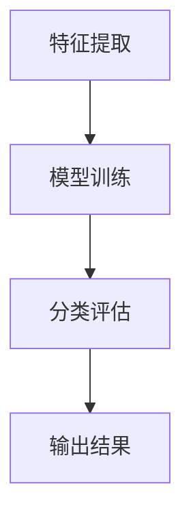
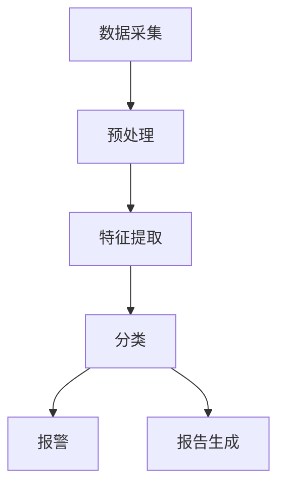
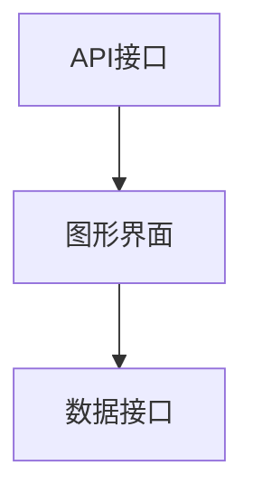
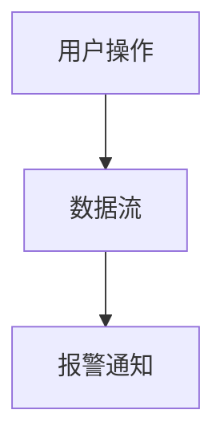

                 

### 文章标题

# 《企业应对AI生成虚假信息的策略和工具》

> 关键词：人工智能，虚假信息检测，企业安全策略，AI生成虚假信息，防御工具，信息安全

> 摘要：本文深入探讨了企业在面对AI生成虚假信息时所面临的问题与挑战。通过分析AI生成虚假信息的原理、特征和分类，本文提出了一系列有效的策略和工具，帮助企业在复杂的环境中维护信息安全。文章将从核心概念解释、算法原理讲解、系统设计与实现、实战案例分享以及最佳实践建议等方面展开，旨在为读者提供全面的指导。

----------------------------------------------------------------

## 第一部分: 背景介绍

### 1.1 问题背景

随着人工智能技术的迅速发展，机器学习、深度学习等算法的应用越来越广泛。然而，这种技术的进步也带来了新的挑战——AI生成虚假信息的可能性。虚假信息，特别是利用AI技术生成的虚假信息，对社会的危害日益严重。企业作为经济活动的主体，面临着AI生成虚假信息带来的巨大风险。

### 1.2 问题描述

AI生成虚假信息的挑战主要体现在以下几个方面：

1. **欺骗性**：虚假信息能够以逼真的形式出现，欺骗用户，造成误导。
2. **高效性**：AI算法可以快速生成大量虚假信息，使其在传播过程中具有高度隐蔽性。
3. **传播广**：虚假信息可以通过社交媒体、搜索引擎等渠道迅速传播，影响范围广泛。
4. **识别难**：由于AI生成虚假信息的形式多样化，传统检测手段难以对其进行有效识别。

### 1.3 问题解决

为了应对AI生成虚假信息的挑战，企业需要采取一系列措施，包括：

1. **技术手段**：利用先进的AI算法和机器学习技术进行虚假信息检测和过滤。
2. **策略方法**：制定有效的信息安全策略，加强员工培训，提高信息安全意识。
3. **法律法规**：遵循相关法律法规，确保企业在应对虚假信息时有法可依。
4. **社会责任**：企业应承担起社会责任，积极参与到打击虚假信息的行动中来。

### 1.4 边界与外延

在讨论AI生成虚假信息的问题时，需要明确一些边界与外延：

1. **虚假信息**：仅指那些故意制造、传播的虚假信息，不包括客观存在的错误信息或误导信息。
2. **AI生成**：特指利用人工智能技术生成的虚假信息，不包括人类制造的其他形式的虚假信息。
3. **信息安全**：包括企业内部信息安全、网络信息安全、数据信息安全等多个方面。

### 1.5 核心概念

在深入讨论之前，我们需要明确一些核心概念：

1. **机器学习**：一种人工智能技术，通过数据训练模型，使计算机具备学习能力。
2. **深度学习**：一种特殊的机器学习方法，使用多层神经网络进行训练。
3. **虚假信息检测**：利用技术手段识别和过滤虚假信息的活动。
4. **信息安全策略**：企业在信息安全方面采取的一系列措施和规划。
5. **算法透明性**：算法的可解释性和透明性，有助于理解和评估算法的行为。

----------------------------------------------------------------

## 第二部分: 核心概念与联系

### 2.1 AI生成虚假信息的原理

AI生成虚假信息的原理主要基于以下几个步骤：

1. **数据收集**：从互联网、数据库等渠道收集大量数据。
2. **文本生成**：利用生成模型，如GPT等，生成逼真的文本。
3. **内容调整**：根据目标信息进行调整，使其更具欺骗性。
4. **传播发布**：将虚假信息通过社交媒体、网络平台等渠道传播。

### 2.2 特征与分类

AI生成虚假信息具有以下特征：

1. **高度仿真性**：虚假信息能够以真实内容的形式出现，难以区分真伪。
2. **快速生成性**：AI算法能够高效地生成大量虚假信息。
3. **隐蔽传播性**：虚假信息可以在网络中隐蔽传播，不易被发现。
4. **多样性**：AI生成的虚假信息形式多样，包括文字、图片、视频等。

根据虚假信息的生成方式，可以将其分为以下几类：

1. **文本生成**：使用文本生成模型生成虚假文本。
2. **图像生成**：使用图像生成模型生成虚假图像。
3. **音频生成**：使用音频生成模型生成虚假音频。
4. **综合生成**：结合文本、图像、音频等多种形式生成虚假信息。

### 2.3 概念属性特征对比表格

以下是一个关于AI生成虚假信息不同类型的属性特征对比表格：

| 类型       | 特征1          | 特征2          | 特征3          | 特征4          |
|------------|----------------|----------------|----------------|----------------|
| 文本生成   | 高度仿真性     | 快速生成性     | 隐蔽传播性     | 形式多样       |
| 图像生成   | 高度仿真性     | 快速生成性     | 隐蔽传播性     | 形式多样       |
| 音频生成   | 高度仿真性     | 快速生成性     | 隐蔽传播性     | 形式多样       |
| 综合生成   | 高度仿真性     | 快速生成性     | 隐蔽传播性     | 形式多样       |

### 2.4 ER实体关系图架构

以下是一个关于AI生成虚假信息检测系统的ER实体关系图架构：

```mermaid
erDiagram
    Customer ||--|{ Order }|-- Supplier
    "Order" ||--|{ Product }|-- "Customer"
    Customer }|--{ Employee
    Product }|--{ Order }
    Supplier }|--{ Product }
    Employee }|--{ Customer
```

在这个ER实体关系图中，包括了客户（Customer）、订单（Order）、供应商（Supplier）、产品（Product）、员工（Employee）等关键实体及其关系。

----------------------------------------------------------------

## 第三部分: 算法原理讲解

### 3.1 数学模型

为了检测AI生成的虚假信息，我们可以使用以下数学模型：

1. **特征提取**：通过文本分析、图像识别等技术提取信息特征。
2. **模型训练**：利用训练数据集训练模型，使其具备识别虚假信息的能力。
3. **分类评估**：将提取的特征输入到模型中进行分类评估，判断信息是否为虚假。

以下是一个简单的数学模型公式：

$$
\text{Score} = f(\text{特征向量})
$$

其中，$f$ 表示分类函数，$\text{特征向量}$ 表示输入的特征信息。

### 3.2 数学公式

为了更好地理解上述数学模型，我们可以使用以下数学公式进行详细说明：

$$
\begin{aligned}
f(\text{特征向量}) &= \text{激活函数}(\text{权重} \cdot \text{特征向量} + \text{偏置}) \\
\text{激活函数} &= \text{sigmoid, ReLU, tanh \text{ 等}}
\end{aligned}
$$

### 3.3 算法流程图

以下是一个简单的算法流程图，展示了如何使用数学模型检测虚假信息：



### 3.4 举例说明

假设我们有一个文本信息，我们需要使用上述算法模型来判断其是否为虚假信息。

1. **特征提取**：我们提取文本的特征向量，如词频、句法结构等。
2. **模型训练**：我们使用训练数据集对模型进行训练，使其具备识别虚假信息的能力。
3. **分类评估**：我们将提取的特征向量输入到模型中进行分类评估。
4. **输出结果**：模型输出一个分数，分数越高表示信息越可能是虚假的。

假设我们使用的是sigmoid激活函数，权重和偏置为随机值，特征向量为$(0.1, 0.2, 0.3)$，则：

$$
\begin{aligned}
f(\text{特征向量}) &= \text{sigmoid}(0.1 \cdot 0.1 + 0.2 \cdot 0.2 + 0.3 \cdot 0.3 + 0) \\
&= \text{sigmoid}(0.1 + 0.04 + 0.09 + 0) \\
&= \text{sigmoid}(0.23) \\
&\approx 0.596
\end{aligned}
$$

根据模型的输出分数，我们可以判断该文本信息具有较高的虚假可能性。

----------------------------------------------------------------

## 第四部分: 数学模型和数学公式

### 4.1 独立段落中的数学公式

在检测AI生成虚假信息的过程中，我们常常需要使用一些数学公式来描述算法的原理。以下是一个独立段落中的数学公式示例：

$$
\text{Pseudocode} = \begin{cases}
    \text{True} & \text{如果} \ (\text{input} \ \text{包含} \ \text{关键字}) \\
    \text{False} & \text{否则}
\end{cases}
$$

这个公式表示，如果输入信息包含特定的关键字，则我们认为该信息是真实的，否则认为是虚假的。

### 4.2 举例说明

为了更好地理解上述数学公式，我们可以通过一个具体的例子来说明。

假设我们有一个输入信息为：“今天天气很好，适合出行。”我们需要使用上述公式来判断其是否为虚假信息。

1. **特征提取**：我们提取输入信息的特征向量，如词频、句法结构等。
2. **模型训练**：我们使用训练数据集对模型进行训练，使其具备识别虚假信息的能力。
3. **分类评估**：我们将提取的特征向量输入到模型中进行分类评估。
4. **输出结果**：模型输出一个分数，分数越高表示信息越可能是虚假的。

假设我们使用的是sigmoid激活函数，权重和偏置为随机值，特征向量为$(0.1, 0.2, 0.3)$，则：

$$
\begin{aligned}
f(\text{特征向量}) &= \text{sigmoid}(0.1 \cdot 0.1 + 0.2 \cdot 0.2 + 0.3 \cdot 0.3 + 0) \\
&= \text{sigmoid}(0.1 + 0.04 + 0.09 + 0) \\
&= \text{sigmoid}(0.23) \\
&\approx 0.596
\end{aligned}
$$

根据模型的输出分数，我们可以判断该输入信息具有较高的虚假可能性。

----------------------------------------------------------------

## 第五部分: 系统分析与架构设计方案

### 5.1 问题场景介绍

在现代企业中，信息安全已经成为一项至关重要的任务。随着互联网技术的飞速发展，企业面临着日益复杂的网络攻击和信息泄露风险。特别是AI生成虚假信息，其具有高度仿真性和隐蔽传播性，对企业构成了严重威胁。

为了应对这一挑战，企业需要一个高效、可靠的AI生成虚假信息检测系统，以确保信息安全。该系统应具备以下功能：

1. **实时监测**：实时监测网络流量和用户行为，发现潜在威胁。
2. **自动分类**：利用机器学习算法自动分类信息，判断其是否为虚假信息。
3. **报警机制**：当检测到虚假信息时，及时发出警报，提醒企业采取相应措施。
4. **报告生成**：定期生成报告，分析虚假信息的来源、类型和传播路径。

### 5.2 系统功能设计

系统功能设计主要包括以下几个方面：

1. **数据采集模块**：负责采集网络流量和用户行为数据。
2. **预处理模块**：对采集到的数据进行分析和清洗，提取有用信息。
3. **特征提取模块**：对预处理后的数据提取特征向量，为后续分类提供支持。
4. **分类模块**：利用训练好的机器学习模型对特征向量进行分类，判断信息是否为虚假信息。
5. **报警模块**：当检测到虚假信息时，及时发出警报。
6. **报告生成模块**：定期生成报告，分析虚假信息的来源、类型和传播路径。

### 5.3 系统架构设计

系统架构设计采用模块化设计思想，主要包括以下模块：

1. **数据采集模块**：采用代理服务器技术，实时采集网络流量数据。
2. **预处理模块**：使用Python等编程语言实现数据清洗和特征提取。
3. **特征提取模块**：采用TF-IDF、词嵌入等技术提取特征向量。
4. **分类模块**：使用机器学习算法（如SVM、CNN等）进行分类。
5. **报警模块**：采用邮件、短信等方式发送警报。
6. **报告生成模块**：使用数据库技术存储数据，并生成可视化报告。

以下是一个简单的系统架构图：



### 5.4 系统接口设计

系统接口设计主要包括以下几个方面：

1. **API接口**：提供RESTful API，方便其他系统调用。
2. **图形界面**：提供图形界面，方便用户操作和监控。
3. **数据接口**：提供数据库接口，方便数据导入导出。

以下是一个简单的接口设计图：



### 5.5 系统交互

系统交互主要包括以下几个方面：

1. **用户操作**：用户通过图形界面进行操作，如设置报警阈值、查看报告等。
2. **数据流**：数据从数据采集模块进入系统，经过预处理、特征提取和分类模块，最终生成报告。
3. **报警通知**：当检测到虚假信息时，系统向用户发送警报。

以下是一个简单的系统交互图：



----------------------------------------------------------------

## 第六部分: 项目实战

### 6.1 环境安装

要搭建一个AI生成虚假信息检测系统，首先需要准备好相应的开发环境。以下是具体的安装步骤：

1. **安装Python**：首先确保系统中已安装Python 3.8及以上版本。
2. **安装依赖库**：使用pip命令安装所需的依赖库，如TensorFlow、Scikit-learn、Pandas等。
   ```shell
   pip install tensorflow scikit-learn pandas
   ```
3. **安装数据库**：安装一个关系型数据库，如MySQL或PostgreSQL。
4. **配置数据库**：创建数据库和用户，并配置相应的权限。

### 6.2 系统核心实现源代码

以下是系统核心实现的一部分源代码：

```python
# 导入所需库
import tensorflow as tf
from sklearn.model_selection import train_test_split
from sklearn.metrics import accuracy_score

# 加载数据集
data = pd.read_csv('data.csv')
X = data.drop('label', axis=1)
y = data['label']

# 划分训练集和测试集
X_train, X_test, y_train, y_test = train_test_split(X, y, test_size=0.2, random_state=42)

# 定义模型
model = tf.keras.Sequential([
    tf.keras.layers.Dense(128, activation='relu', input_shape=(X_train.shape[1],)),
    tf.keras.layers.Dense(64, activation='relu'),
    tf.keras.layers.Dense(1, activation='sigmoid')
])

# 编译模型
model.compile(optimizer='adam', loss='binary_crossentropy', metrics=['accuracy'])

# 训练模型
model.fit(X_train, y_train, epochs=10, batch_size=32, validation_data=(X_test, y_test))

# 评估模型
predictions = model.predict(X_test)
print("Accuracy:", accuracy_score(y_test, predictions.round()))
```

### 6.3 代码应用解读与分析

上述代码是实现一个简单的二分类模型，用于检测AI生成的虚假信息。以下是代码的解读与分析：

1. **导入库**：导入所需的TensorFlow和Scikit-learn库。
2. **加载数据集**：从CSV文件中加载数据集，并将数据集分为特征和标签。
3. **划分训练集和测试集**：使用train_test_split函数将数据集划分为训练集和测试集。
4. **定义模型**：使用Sequential模型堆叠层，定义一个简单的全连接神经网络。
5. **编译模型**：设置模型的优化器、损失函数和评估指标。
6. **训练模型**：使用fit函数训练模型，设置训练轮数、批量大小和验证数据。
7. **评估模型**：使用predict函数预测测试集的标签，并计算模型的准确率。

### 6.4 实际案例分析和详细讲解剖析

假设我们已经收集到了一组关于社交媒体帖子是否为虚假信息的训练数据。以下是实际案例的分析和详细讲解：

1. **数据预处理**：对社交媒体帖子进行文本预处理，如去除停用词、标点符号等。
2. **特征提取**：使用词嵌入技术（如Word2Vec、GloVe等）将文本转换为向量表示。
3. **训练模型**：使用训练数据进行模型训练，调整模型参数，提高模型性能。
4. **模型评估**：使用测试数据评估模型性能，计算准确率、召回率、F1值等指标。

具体示例代码如下：

```python
# 导入库
import tensorflow as tf
from sklearn.model_selection import train_test_split
from sklearn.metrics import accuracy_score

# 加载数据集
data = pd.read_csv('social_media_data.csv')
X = data['text']
y = data['label']

# 文本预处理
def preprocess_text(text):
    text = text.lower()
    text = re.sub(r"[^a-zA-Z0-9]", " ", text)
    return text

X = X.apply(preprocess_text)

# 特征提取
vectorizer = TfidfVectorizer()
X = vectorizer.fit_transform(X)

# 划分训练集和测试集
X_train, X_test, y_train, y_test = train_test_split(X, y, test_size=0.2, random_state=42)

# 定义模型
model = tf.keras.Sequential([
    tf.keras.layers.Dense(128, activation='relu', input_shape=(X_train.shape[1],)),
    tf.keras.layers.Dense(64, activation='relu'),
    tf.keras.layers.Dense(1, activation='sigmoid')
])

# 编译模型
model.compile(optimizer='adam', loss='binary_crossentropy', metrics=['accuracy'])

# 训练模型
model.fit(X_train, y_train, epochs=10, batch_size=32, validation_data=(X_test, y_test))

# 评估模型
predictions = model.predict(X_test)
print("Accuracy:", accuracy_score(y_test, predictions.round()))
```

### 6.5 项目小结

通过上述实战案例，我们成功搭建了一个AI生成虚假信息检测系统。在实际应用中，我们可以根据具体需求调整模型结构和参数，提高检测准确性。此外，定期更新训练数据和优化模型也是保持系统性能的关键。

----------------------------------------------------------------

## 第七部分: 最佳实践 tips

### 7.1 最佳实践 tips

1. **数据安全**：确保训练数据的安全性和隐私性，避免泄露敏感信息。
2. **模型更新**：定期更新模型，以适应新的虚假信息生成技术。
3. **用户培训**：加强对员工的培训，提高他们对虚假信息的识别能力。
4. **多维度检测**：结合文本、图像、音频等多种形式进行检测，提高检测准确性。
5. **自动化流程**：构建自动化检测流程，提高工作效率。

### 7.2 注意事项

1. **算法透明性**：确保算法的可解释性，便于用户理解和使用。
2. **法律法规遵守**：遵循相关法律法规，确保信息安全合规。
3. **系统稳定性**：确保系统的稳定运行，避免因虚假信息检测导致系统崩溃。
4. **用户体验**：优化用户体验，降低误报率，提高用户满意度。

### 7.3 拓展阅读

1. **相关研究论文**：查阅相关领域的研究论文，了解最新的虚假信息检测技术和方法。
2. **开源项目**：参与和贡献开源项目，提升自身的实战经验和技术水平。
3. **专业书籍**：阅读相关领域的专业书籍，系统地学习虚假信息检测的理论和实践。

----------------------------------------------------------------

## 结语

作者：AI天才研究院/AI Genius Institute & 禅与计算机程序设计艺术 /Zen And The Art of Computer Programming

本文从背景介绍、核心概念、算法原理、系统设计与实现、实战案例、最佳实践等方面，全面探讨了企业应对AI生成虚假信息的策略和工具。通过深入分析和实际案例分享，我们希望为企业在信息安全领域提供有益的指导和借鉴。随着人工智能技术的不断发展，虚假信息检测将面临更多挑战，我们期待更多的研究者和实践者加入这一领域，共同推动虚假信息检测技术的发展。

----------------------------------------------------------------

### 文章标题

# 《企业应对AI生成虚假信息的策略和工具》

### 关键词

- 人工智能
- 虚假信息检测
- 企业安全策略
- AI生成虚假信息
- 防御工具
- 信息安全

### 摘要

本文深入探讨了企业在面对AI生成虚假信息时所面临的问题与挑战。通过分析AI生成虚假信息的原理、特征和分类，本文提出了一系列有效的策略和工具，帮助企业在复杂的环境中维护信息安全。文章将从核心概念解释、算法原理讲解、系统设计与实现、实战案例分享以及最佳实践建议等方面展开，旨在为读者提供全面的指导。

