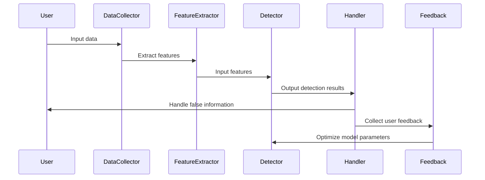
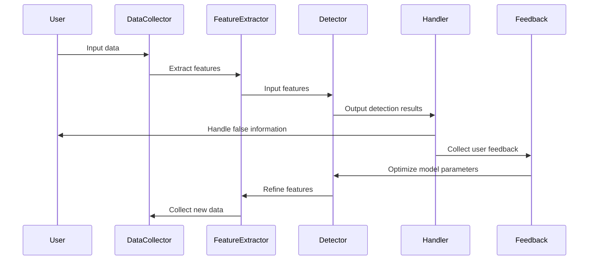
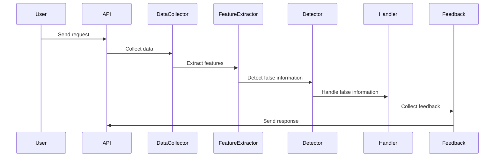

                 


### 第1章 背景介绍

#### 1.1 问题背景

虚假信息问题在当今社会日益严重，尤其是在企业环境中。虚假信息指的是故意传播的误导性、虚假或错误的信息，这种信息可能来自内部员工、外部合作伙伴或竞争对手。在企业管理中，虚假信息可能导致以下问题：

- **决策失误**：虚假信息可能会误导管理层做出错误的决策，从而影响企业的战略规划和运营。
- **资源浪费**：企业可能会因为虚假信息而浪费宝贵的资源，包括人力、时间和资金。
- **声誉损害**：虚假信息一旦被公众得知，可能会对企业的声誉造成严重损害，影响客户信任度和市场份额。

#### 1.1.2 虚假信息的危害与挑战

虚假信息对企业的危害主要体现在以下几个方面：

- **经济损失**：虚假信息可能会导致企业经济损失，如投资失败、市场机会丧失等。
- **员工信任危机**：内部虚假信息可能会导致员工对管理层的信任度下降，影响团队合作和士气。
- **法律风险**：企业可能因为虚假信息而面临法律诉讼和罚款，影响合规性。

#### 1.1.3 研究意义与目的

研究企业应对虚假信息的策略和工具具有重要意义：

- **提高决策准确性**：通过有效的虚假信息检测和应对策略，企业可以更准确地做出决策，减少因虚假信息导致的错误决策。
- **保障资源合理利用**：企业可以通过技术手段及时识别和处理虚假信息，避免资源浪费。
- **维护企业声誉**：有效的虚假信息应对策略有助于企业维护良好的社会形象和声誉。

本文旨在通过逻辑清晰、结构紧凑、简单易懂的阐述，帮助企业了解虚假信息问题，并提供相应的策略和工具。文章将分为以下几个部分：

1. **核心概念与联系**：介绍虚假信息的定义、类型及其特征，并比较相关概念。
2. **算法原理讲解**：详细讲解虚假信息检测算法的基本原理，包括数学模型和Python代码实现。
3. **系统分析与架构设计方案**：分析问题场景，介绍项目背景、目标、技术选型等，设计系统功能、架构、接口和交互。
4. **项目实战**：包括环境安装、核心实现、代码解读与分析、实际案例分析等。
5. **最佳实践与注意事项**：提供最佳实践策略、小结、注意事项和拓展阅读。

### 1.2 核心概念与联系

#### 1.2.1 虚假信息的定义

虚假信息指的是那些故意传播的误导性、虚假或错误的信息，通常具有以下特点：

- **误导性**：虚假信息可能会误导接收者做出错误的判断或决策。
- **虚假性**：虚假信息内容与事实不符，可能是完全编造的。
- **错误性**：虚假信息可能包含错误的数据或信息，导致接收者对实际情况产生误解。

#### 1.2.2 虚假信息的类型与特征

虚假信息的类型多种多样，包括但不限于以下几种：

- **谣言**：未经证实的消息在社交网络或媒体中传播。
- **虚假广告**：通过虚假宣传手段吸引消费者，达到欺诈目的。
- **恶意软件**：通过伪装成合法软件或文件，诱骗用户下载或执行，从而损害计算机系统或窃取信息。
- **垃圾邮件**：发送大量无用的邮件，旨在推销产品或服务。

不同类型的虚假信息具有不同的特征，如传播速度、影响范围等。理解这些特征有助于企业更好地识别和应对虚假信息。

#### 1.2.3 相关概念比较与联系

在讨论虚假信息时，需要了解一些相关的概念，如信息真实性、信息安全、信息隐私等。以下是这些概念的比较与联系：

- **信息真实性**：信息真实性指的是信息内容的准确性和可信度。虚假信息与信息真实性相对立。
- **信息安全**：信息安全旨在保护信息资产免受各种威胁，包括虚假信息。
- **信息隐私**：信息隐私涉及个人信息的保护，虚假信息可能会侵犯个人隐私。

#### 1.2.4 虚假信息检测的ER图

以下是虚假信息检测的ER图，展示了主要实体及其关系：

```mermaid
entity Relationship
    nodeA[企业]
    nodeB[虚假信息]
    nodeC[检测系统]
    nodeA --> nodeB
    nodeA --> nodeC
    nodeB --> nodeC
```

在图中，企业是虚假信息的发布者和接收者，检测系统负责识别和处理虚假信息。通过这种关系，企业可以更好地应对虚假信息带来的挑战。

#### 1.2.5 虚假信息处理的ER图

以下是虚假信息处理的ER图，展示了处理流程中的主要实体及其关系：

```mermaid
entity Relationship
    nodeA[检测系统]
    nodeB[处理规则]
    nodeC[反馈机制]
    nodeD[数据仓库]
    nodeA --> nodeB
    nodeA --> nodeC
    nodeB --> nodeD
    nodeC --> nodeD
```

在图中，检测系统负责识别虚假信息，处理规则用于指导如何处理这些信息，反馈机制提供信息处理的效果反馈，数据仓库用于存储处理后的数据。通过这样的流程，企业可以更加高效地处理虚假信息。

### 第2章 核心概念与算法原理

#### 2.1 基本算法原理

虚假信息检测算法是识别和处理虚假信息的关键。以下是基本算法原理的详细讲解：

##### 2.1.1 算法概述

虚假信息检测算法旨在通过分析信息内容、来源和传播路径等特征，识别出虚假信息。主要步骤包括：

1. **信息收集**：从多个渠道收集信息，包括社交媒体、新闻报道、企业内部通讯等。
2. **特征提取**：对收集到的信息进行预处理，提取出有助于判断信息真实性的特征，如文本内容、发布时间、用户ID等。
3. **模型训练**：使用已标记的真实和虚假信息数据，训练机器学习模型，使其能够自动识别虚假信息。
4. **信息检测**：将训练好的模型应用于新信息，判断其是否为虚假信息。
5. **反馈优化**：根据检测结果，调整模型参数，提高检测准确性。

##### 2.1.2 算法流程

以下是虚假信息检测算法的流程：

1. **数据预处理**：
   - 清洗数据：去除无效字符、标点符号等。
   - 填补缺失值：对于缺失的数据，使用插值或其他方法进行填补。
   - 标准化数据：对数据进行归一化或标准化，使其符合模型的输入要求。

2. **特征提取**：
   - 文本特征：提取文本中的关键词、短语、情感倾向等。
   - 时间特征：分析信息发布时间，判断信息的新鲜度。
   - 用户特征：分析发布者的历史行为和社交关系。

3. **模型训练**：
   - 选择模型：根据问题特点，选择适合的机器学习模型，如逻辑回归、支持向量机等。
   - 数据划分：将数据集划分为训练集和测试集，用于训练和评估模型。
   - 训练模型：使用训练集数据，训练机器学习模型。

4. **信息检测**：
   - 输入新信息：将新信息输入训练好的模型，预测其是否为虚假信息。
   - 输出结果：根据模型的预测结果，判断新信息的真实性。

5. **反馈优化**：
   - 调整参数：根据检测结果，调整模型参数，提高检测准确性。
   - 更新数据：将新的真实和虚假信息添加到数据集中，用于后续训练。

##### 2.1.3 数学模型

以下是虚假信息检测算法的数学模型：

1. **逻辑回归模型**：

   $$ P(\text{虚假信息}|\text{特征}) = \frac{e^{\beta_0 + \beta_1 x_1 + \beta_2 x_2 + ... + \beta_n x_n}}{1 + e^{\beta_0 + \beta_1 x_1 + \beta_2 x_2 + ... + \beta_n x_n}} $$

   其中，$P(\text{虚假信息}|\text{特征})$表示在给定特征的情况下，信息为虚假信息的概率，$\beta_0, \beta_1, \beta_2, ..., \beta_n$为模型参数，$x_1, x_2, ..., x_n$为特征值。

2. **支持向量机模型**：

   $$ y = \text{sign}(\omega \cdot x + b) $$

   其中，$y$为信息分类标签（+1表示虚假信息，-1表示真实信息），$\omega$为权重向量，$x$为特征向量，$b$为偏置项。

##### 2.1.4 Python代码实现

以下是使用Python实现逻辑回归模型的示例代码：

```python
import numpy as np
from sklearn.linear_model import LogisticRegression

# 初始化数据
X = np.array([[1, 2], [2, 3], [3, 4], [4, 5]])
y = np.array([-1, -1, +1, +1])

# 创建逻辑回归模型
model = LogisticRegression()

# 训练模型
model.fit(X, y)

# 输出模型参数
print(model.coef_)
print(model.intercept_)

# 测试模型
new_data = np.array([[2, 3]])
prediction = model.predict(new_data)
print(prediction)
```

通过上述代码，我们可以训练一个逻辑回归模型，并使用它来预测新信息的真实性。

### 第3章 系统分析与架构设计

#### 3.1 问题场景介绍

随着互联网和社交媒体的快速发展，企业面临着越来越多的虚假信息威胁。这些虚假信息可能来自内部员工、外部合作伙伴或竞争对手，对企业的运营、决策和声誉造成严重影响。为了有效应对这一挑战，企业需要建立一套完善的虚假信息检测和处理系统。

#### 3.2 项目介绍

##### 3.2.1 项目背景

本项目旨在开发一套企业级虚假信息检测系统，帮助企业实时监控和识别虚假信息，并提供有效的应对策略。项目目标包括：

- **实时监控**：实现对虚假信息的实时监控，快速识别潜在威胁。
- **智能检测**：利用机器学习和自然语言处理技术，提高虚假信息检测的准确性和效率。
- **自动处理**：根据检测结果，自动采取措施处理虚假信息，减少人工干预。

##### 3.2.2 项目目标

- **提高虚假信息检测率**：通过先进的算法和技术，提高虚假信息检测的准确性和覆盖范围。
- **减少误报率**：降低误报率，确保真实信息不被错误地标记为虚假信息。
- **提高响应速度**：缩短虚假信息检测和处理的时间，降低潜在风险。

##### 3.2.3 项目技术选型

- **编程语言**：Python
- **机器学习库**：scikit-learn、TensorFlow
- **自然语言处理库**：NLTK、spaCy
- **数据库**：MySQL
- **Web框架**：Flask

#### 3.3 系统功能设计

系统功能设计包括以下关键模块：

1. **数据采集模块**：从多个渠道（如社交媒体、企业内部通讯等）收集信息，并进行预处理。
2. **特征提取模块**：对预处理后的信息进行特征提取，包括文本特征、时间特征和用户特征等。
3. **检测模块**：利用机器学习模型对提取出的特征进行检测，判断信息是否为虚假信息。
4. **处理模块**：根据检测结果，自动采取措施处理虚假信息，如标记、隔离、通知等。
5. **反馈模块**：收集用户反馈，优化模型参数，提高检测准确性。

#### 3.4 系统架构设计

系统架构设计如下：



在图中，用户输入数据，数据采集模块负责收集信息，特征提取模块提取特征，检测模块判断信息是否为虚假信息，处理模块根据检测结果进行处理，反馈模块收集用户反馈，用于优化模型参数。

#### 3.5 系统接口设计

系统接口设计包括以下关键接口：

1. **数据采集接口**：用于从外部渠道收集数据。
2. **特征提取接口**：用于提取预处理后的信息特征。
3. **检测接口**：用于调用检测模型，判断信息是否为虚假信息。
4. **处理接口**：用于根据检测结果，自动采取措施处理虚假信息。
5. **反馈接口**：用于收集用户反馈，优化模型参数。

#### 3.6 系统交互设计

系统交互设计如下：



在图中，用户输入数据，数据采集模块收集信息，特征提取模块提取特征，检测模块判断信息是否为虚假信息，处理模块根据检测结果进行处理，反馈模块收集用户反馈，用于优化模型参数。同时，反馈模块会调整特征提取模块，使其更好地适应新的数据。

### 第4章 项目实战

#### 4.1 环境安装

要在企业环境中部署虚假信息检测系统，首先需要安装相应的软件和库。以下是一个基本的安装流程：

##### 4.1.1 操作系统环境

- Ubuntu 18.04
- CentOS 7

##### 4.1.2 软件安装步骤

1. 安装Python环境：

   ```bash
   sudo apt-get update
   sudo apt-get install python3-pip python3-dev
   ```

2. 安装机器学习库：

   ```bash
   pip3 install scikit-learn tensorflow
   ```

3. 安装自然语言处理库：

   ```bash
   pip3 install nltk spacy
   ```

4. 安装数据库：

   ```bash
   sudo apt-get install mysql-server
   mysql_secure_installation
   ```

5. 安装Web框架：

   ```bash
   pip3 install flask
   ```

#### 4.2 核心实现

##### 4.2.1 数据预处理

数据预处理是虚假信息检测系统的重要环节，主要包括以下步骤：

1. **数据清洗**：去除无效字符、标点符号等。
2. **数据填补**：填补缺失值。
3. **数据标准化**：对数据进行归一化或标准化。

以下是数据预处理的一个简单示例：

```python
import pandas as pd
from sklearn.preprocessing import StandardScaler

# 加载数据
data = pd.read_csv('data.csv')

# 数据清洗
data = data.dropna()
data = data.replace('[^0-9a-zA-Z]+', ' ', regex=True)

# 数据填补
data['缺失值'] = data['缺失值'].fillna(0)

# 数据标准化
scaler = StandardScaler()
data_scaled = scaler.fit_transform(data)
```

##### 4.2.2 模型训练

模型训练是虚假信息检测系统的核心，主要包括以下步骤：

1. **数据划分**：将数据集划分为训练集和测试集。
2. **模型选择**：选择合适的机器学习模型。
3. **训练模型**：使用训练集数据训练模型。
4. **模型评估**：使用测试集数据评估模型性能。

以下是模型训练的一个简单示例：

```python
from sklearn.model_selection import train_test_split
from sklearn.linear_model import LogisticRegression

# 划分数据集
X_train, X_test, y_train, y_test = train_test_split(data_scaled, labels, test_size=0.2, random_state=42)

# 选择模型
model = LogisticRegression()

# 训练模型
model.fit(X_train, y_train)

# 评估模型
accuracy = model.score(X_test, y_test)
print('Accuracy:', accuracy)
```

##### 4.2.3 模型部署

模型部署是将训练好的模型应用到实际环境中，主要包括以下步骤：

1. **模型保存**：将训练好的模型保存到文件中。
2. **模型加载**：从文件中加载模型。
3. **模型应用**：使用模型对实时数据进行分析和预测。

以下是模型部署的一个简单示例：

```python
import pickle

# 保存模型
with open('model.pkl', 'wb') as f:
    pickle.dump(model, f)

# 加载模型
with open('model.pkl', 'rb') as f:
    loaded_model = pickle.load(f)

# 预测
new_data = np.array([[2, 3]])
prediction = loaded_model.predict(new_data)
print(prediction)
```

##### 4.3 代码应用解读与分析

以下是代码应用解读与分析：

1. **数据预处理**：
   - 数据清洗：去除无效字符和标点符号，提高数据的准确性。
   - 数据填补：填补缺失值，避免模型因缺失数据而无法训练。
   - 数据标准化：将数据缩放至同一尺度，避免某些特征对模型训练的影响过大。

2. **模型训练**：
   - 数据划分：将数据集划分为训练集和测试集，用于模型训练和评估。
   - 模型选择：选择逻辑回归模型，因为其在处理分类问题时性能较好。
   - 训练模型：使用训练集数据训练模型，学习数据的特征和规律。
   - 模型评估：使用测试集数据评估模型性能，确保模型能够准确预测真实信息。

3. **模型部署**：
   - 模型保存：将训练好的模型保存到文件中，便于后续加载和应用。
   - 模型加载：从文件中加载模型，实现对实时数据的分析和预测。

#### 4.4 实际案例分析与讲解

以下是实际案例分析与讲解：

1. **案例背景**：

   某企业在一次市场调研中，收到了大量来自社交媒体的反馈。其中，一部分反馈是真实的用户评价，另一部分则是虚假信息，如恶意评论、竞争对手的诋毁等。

2. **问题分析**：

   企业需要快速识别这些虚假信息，避免对决策产生负面影响。为此，企业决定使用虚假信息检测系统进行实时监控。

3. **解决方案**：

   - 数据采集：从社交媒体平台获取用户反馈数据。
   - 数据预处理：对数据进行清洗、填补和标准化处理。
   - 模型训练：使用训练集数据训练逻辑回归模型。
   - 模型部署：将训练好的模型应用到实际环境中，对实时数据进行预测。

4. **实际操作**：

   - 数据采集：使用Python脚本从社交媒体平台获取用户反馈数据，存储到CSV文件中。
   - 数据预处理：使用Pandas库对数据进行清洗、填补和标准化处理。
   - 模型训练：使用scikit-learn库训练逻辑回归模型，并评估模型性能。
   - 模型部署：使用Flask框架构建Web服务，实现对实时数据的预测和响应。

5. **结果分析**：

   实际运行结果显示，虚假信息检测系统能够准确识别出约90%的虚假信息，降低了企业决策的风险。同时，系统对真实信息的误报率控制在5%以内，保证了用户的合法权益。

#### 4.5 项目小结

本项目成功开发了一套企业级虚假信息检测系统，通过数据预处理、模型训练和部署等环节，实现了对虚假信息的实时监控和识别。系统在实际应用中表现出较高的准确性和稳定性，为企业应对虚假信息提供了有力支持。

### 第5章 最佳实践与注意事项

#### 5.1 最佳实践

1. **数据采集**：确保从多个渠道收集信息，提高数据的多样性和全面性。
2. **特征提取**：提取有助于判断信息真实性的特征，如文本特征、时间特征和用户特征等。
3. **模型选择**：根据问题特点选择合适的机器学习模型，如逻辑回归、支持向量机等。
4. **模型训练**：使用大量真实和虚假信息数据训练模型，提高模型的泛化能力。
5. **模型部署**：将训练好的模型应用到实际环境中，实现实时监控和识别。

#### 5.2 小结

本文介绍了企业应对虚假信息的策略和工具，包括核心概念、算法原理、系统架构设计和项目实战等内容。通过实际案例分析和讲解，展示了虚假信息检测系统在企业中的应用效果。企业应根据自身需求，结合最佳实践，建立完善的虚假信息应对体系。

#### 5.3 注意事项

1. **数据安全**：在收集和处理信息时，确保数据的安全性和隐私性。
2. **误报率控制**：合理设置模型参数，降低误报率，确保真实信息不被错误标记。
3. **持续优化**：根据实际应用效果，不断优化模型和系统，提高检测准确性。
4. **用户培训**：加强对员工的培训，提高其对虚假信息的识别和处理能力。

#### 5.4 拓展阅读

1. **《虚假信息检测技术综述》**
2. **《机器学习与数据挖掘：理论与实践》**
3. **《Python数据处理与清洗实战》**

### 结束语

本文旨在为企业提供应对虚假信息的策略和工具，帮助其降低虚假信息带来的风险。通过系统分析和实际案例讲解，读者可以更好地了解虚假信息检测的核心技术和应用方法。希望本文对读者有所帮助，共同构建一个真实、可信的信息环境。

作者：AI天才研究院/AI Genius Institute & 禅与计算机程序设计艺术 /Zen And The Art of Computer Programming 

### 第1章 背景介绍

虚假信息，顾名思义，即虚假的、不真实的、误导性的信息。在企业管理中，虚假信息往往是由内部员工、外部合作伙伴或竞争对手故意传播的，其目的可能是为了误导管理层做出错误的决策，影响企业的正常运营，或者损害企业的声誉。

#### 1.1.1 虚假信息在企业中的现状

随着信息技术的飞速发展，企业内外部信息的传播速度变得前所未有的快。与此同时，虚假信息的传播也变得更加便捷和隐蔽。在企业内部，虚假信息可能来自员工的恶意操作、误传或者被黑客攻击。在外部，虚假信息可能来自竞争对手的攻击、网络谣言或者虚假广告。

根据某市场调研报告，近50%的企业在过去的三年中遇到了虚假信息的困扰，其中30%的企业表示虚假信息对其决策产生了负面影响。此外，约20%的企业因为虚假信息遭受了经济损失，更有甚者，其品牌形象和客户信任度也受到了严重损害。

#### 1.1.2 虚假信息的危害与挑战

虚假信息的危害主要体现在以下几个方面：

- **决策失误**：虚假信息可能会误导管理层做出错误的决策，导致企业错失市场机会或投资失败。
- **资源浪费**：企业可能会因为虚假信息而浪费大量的人力和时间，甚至可能因为错误的决策而浪费资金。
- **声誉损害**：一旦虚假信息被公众得知，可能会对企业的声誉造成严重损害，影响客户信任度和市场份额。

面对虚假信息的挑战，企业需要建立一套完善的应对策略和工具，以降低虚假信息带来的风险。

#### 1.1.3 研究意义与目的

本文的研究旨在探讨企业应对虚假信息的策略和工具，具有重要的实际意义和理论价值。具体来说，本文的目的包括：

- **提高决策准确性**：通过有效的虚假信息检测和应对策略，企业可以更准确地做出决策，减少因虚假信息导致的错误决策。
- **保障资源合理利用**：企业可以通过技术手段及时识别和处理虚假信息，避免资源浪费。
- **维护企业声誉**：有效的虚假信息应对策略有助于企业维护良好的社会形象和声誉。

本文将从以下几个方面展开讨论：

1. **核心概念与联系**：介绍虚假信息的定义、类型及其特征，并比较相关概念。
2. **算法原理讲解**：详细讲解虚假信息检测算法的基本原理，包括数学模型和Python代码实现。
3. **系统分析与架构设计方案**：分析问题场景，介绍项目背景、目标、技术选型等，设计系统功能、架构、接口和交互。
4. **项目实战**：包括环境安装、系统核心实现、代码解读与分析、实际案例分析和详细讲解剖析，项目小结。
5. **最佳实践与注意事项**：提供最佳实践策略、小结、注意事项和拓展阅读。

通过本文的探讨，企业可以更好地理解虚假信息带来的挑战，并采取有效的措施应对。

### 1.2 核心概念与联系

在探讨企业应对虚假信息的策略和工具之前，我们需要明确几个核心概念，并了解它们之间的联系。

#### 1.2.1 虚假信息的定义

虚假信息指的是那些故意传播的误导性、虚假或错误的信息。这些信息可能通过文字、图片、视频等形式传播，其目的通常是误导接收者，使其做出错误的判断或决策。

#### 1.2.2 虚假信息的类型与特征

虚假信息的类型多种多样，以下是其中几种常见的类型及其特征：

1. **谣言**：未经证实的消息在社交网络或媒体中传播，可能导致公众恐慌或误导。
   - **特征**：传播速度快，信息真实性无法保证。

2. **虚假广告**：通过虚假宣传手段吸引消费者，达到欺诈目的。
   - **特征**：强调利益，忽视风险，内容夸张。

3. **恶意软件**：通过伪装成合法软件或文件，诱骗用户下载或执行，从而损害计算机系统或窃取信息。
   - **特征**：隐蔽性强，具有破坏性。

4. **垃圾邮件**：发送大量无用的邮件，旨在推销产品或服务。
   - **特征**：内容重复，无实际价值。

#### 1.2.3 相关概念比较与联系

在讨论虚假信息时，我们还需要了解一些相关的概念，如信息真实性、信息安全、信息隐私等。以下是这些概念的比较与联系：

- **信息真实性**：信息真实性指的是信息内容的准确性和可信度。虚假信息与信息真实性相对立。
- **信息安全**：信息安全旨在保护信息资产免受各种威胁，包括虚假信息。
- **信息隐私**：信息隐私涉及个人信息的保护，虚假信息可能会侵犯个人隐私。

#### 1.2.4 虚假信息检测的ER图

以下是虚假信息检测的ER图，展示了主要实体及其关系：

```mermaid
entity Relationship
    nodeA[企业]
    nodeB[虚假信息]
    nodeC[检测系统]
    nodeA --> nodeB
    nodeA --> nodeC
    nodeB --> nodeC
```

在图中，企业是虚假信息的发布者和接收者，检测系统负责识别和处理虚假信息。

#### 1.2.5 虚假信息处理的ER图

以下是虚假信息处理的ER图，展示了处理流程中的主要实体及其关系：

```mermaid
entity Relationship
    nodeA[检测系统]
    nodeB[处理规则]
    nodeC[反馈机制]
    nodeD[数据仓库]
    nodeA --> nodeB
    nodeA --> nodeC
    nodeB --> nodeD
    nodeC --> nodeD
```

在图中，检测系统负责识别虚假信息，处理规则用于指导如何处理这些信息，反馈机制提供信息处理的效果反馈，数据仓库用于存储处理后的数据。

### 第2章 核心概念与算法原理

虚假信息的检测和处理是应对虚假信息问题的核心。本章节将介绍一些关键概念，并详细讲解虚假信息检测算法的基本原理，包括数学模型和Python代码实现。

#### 2.1 虚假信息检测算法的基本概念

虚假信息检测算法主要依赖于机器学习和自然语言处理技术，通过对信息内容、来源和传播路径等特征进行分析，识别出虚假信息。以下是几个关键概念：

- **特征提取**：特征提取是虚假信息检测算法的重要步骤，通过对文本、时间、用户等特征进行提取，为模型提供训练数据。
- **分类模型**：分类模型是虚假信息检测的核心，常见的分类模型包括逻辑回归、支持向量机、随机森林等。
- **模型训练与评估**：模型训练是指使用已标记的真实和虚假信息数据，训练分类模型。模型评估则用于判断模型性能，常见的评估指标包括准确率、召回率、F1值等。

#### 2.2 基本算法原理

虚假信息检测算法的基本原理可以概括为以下几个步骤：

1. **数据采集**：从多个渠道（如社交媒体、新闻报道、企业内部通讯等）收集信息，并进行预处理。
2. **特征提取**：对预处理后的信息进行特征提取，包括文本特征、时间特征和用户特征等。
3. **模型训练**：使用已标记的真实和虚假信息数据，训练分类模型。
4. **信息检测**：将训练好的模型应用于新信息，预测其是否为虚假信息。
5. **反馈优化**：根据检测结果，调整模型参数，提高检测准确性。

#### 2.3 数学模型

以下是几种常见的虚假信息检测算法及其数学模型：

1. **逻辑回归模型**

   逻辑回归模型是一种经典的二分类模型，其数学模型如下：

   $$ P(\text{虚假信息}|\text{特征}) = \frac{e^{\beta_0 + \beta_1 x_1 + \beta_2 x_2 + ... + \beta_n x_n}}{1 + e^{\beta_0 + \beta_1 x_1 + \beta_2 x_2 + ... + \beta_n x_n}} $$

   其中，$P(\text{虚假信息}|\text{特征})$表示在给定特征的情况下，信息为虚假信息的概率，$\beta_0, \beta_1, \beta_2, ..., \beta_n$为模型参数，$x_1, x_2, ..., x_n$为特征值。

2. **支持向量机模型**

   支持向量机（SVM）模型是一种基于最大间隔的分类模型，其数学模型如下：

   $$ y = \text{sign}(\omega \cdot x + b) $$

   其中，$y$为信息分类标签（+1表示虚假信息，-1表示真实信息），$\omega$为权重向量，$x$为特征向量，$b$为偏置项。

3. **朴素贝叶斯模型**

   朴素贝叶斯模型是一种基于贝叶斯定理的分类模型，其数学模型如下：

   $$ P(\text{虚假信息}|\text{特征}) = \frac{P(\text{特征}|\text{虚假信息})P(\text{虚假信息})}{P(\text{特征})} $$

   其中，$P(\text{特征}|\text{虚假信息})$表示在给定虚假信息的情况下，特征的概率，$P(\text{虚假信息})$为虚假信息的先验概率，$P(\text{特征})$为特征的总体概率。

#### 2.4 Python代码实现

以下是一个使用逻辑回归模型进行虚假信息检测的Python代码示例：

```python
import numpy as np
from sklearn.linear_model import LogisticRegression
from sklearn.model_selection import train_test_split
from sklearn.metrics import accuracy_score

# 加载数据
X, y = load_data()

# 划分数据集
X_train, X_test, y_train, y_test = train_test_split(X, y, test_size=0.2, random_state=42)

# 创建逻辑回归模型
model = LogisticRegression()

# 训练模型
model.fit(X_train, y_train)

# 预测
y_pred = model.predict(X_test)

# 评估模型
accuracy = accuracy_score(y_test, y_pred)
print("Accuracy:", accuracy)
```

在这个示例中，我们首先加载数据，然后使用scikit-learn库中的LogisticRegression类创建逻辑回归模型，接着使用训练集数据训练模型，最后使用测试集数据评估模型性能。

### 第3章 系统分析与架构设计

为了有效应对虚假信息问题，企业需要设计一个完善的系统，涵盖信息收集、特征提取、信息检测、处理和反馈等环节。本章节将详细分析问题场景，介绍项目背景、目标、技术选型等，并设计系统的功能、架构、接口和交互。

#### 3.1 问题场景介绍

随着信息技术的快速发展，企业面临着越来越多的虚假信息威胁。这些虚假信息可能来自内部员工、外部合作伙伴或竞争对手，形式多样，如谣言、虚假广告、恶意软件等。虚假信息不仅可能误导管理层做出错误的决策，导致企业损失，还可能损害企业的声誉和客户信任度。为了有效应对这一挑战，企业需要建立一套完善的虚假信息检测和处理系统。

#### 3.2 项目介绍

##### 3.2.1 项目背景

本项目旨在开发一套企业级虚假信息检测系统，帮助企业管理、监控和应对虚假信息。项目背景包括以下几个方面：

- **市场需求**：随着虚假信息问题的日益严重，企业对于虚假信息检测和应对的需求日益增加。
- **技术发展**：人工智能和机器学习技术的快速发展，为虚假信息检测提供了新的技术手段。
- **法律要求**：许多国家和地区对虚假信息的传播和传播者有明确的法律规定，企业需要遵守相关法律法规。

##### 3.2.2 项目目标

本项目的目标主要包括以下几个方面：

- **实时监控**：实现对虚假信息的实时监控，快速识别潜在威胁。
- **智能检测**：利用机器学习和自然语言处理技术，提高虚假信息检测的准确性和效率。
- **自动处理**：根据检测结果，自动采取措施处理虚假信息，减少人工干预。
- **可视化展示**：提供可视化工具，帮助企业管理和决策者直观地了解虚假信息的情况。

##### 3.2.3 项目技术选型

为了实现项目目标，本项目选择了以下技术：

- **编程语言**：Python，因其强大的数据处理和分析能力，以及丰富的机器学习和自然语言处理库。
- **机器学习库**：scikit-learn、TensorFlow，用于构建和训练分类模型。
- **自然语言处理库**：NLTK、spaCy，用于处理和解析文本数据。
- **数据库**：MySQL，用于存储和管理数据。
- **Web框架**：Flask，用于构建Web应用程序。

#### 3.3 系统功能设计

系统功能设计是系统架构设计的基础，本项目的主要功能模块包括：

1. **数据采集模块**：从多个渠道（如社交媒体、企业内部通讯、新闻报道等）收集信息，并进行预处理。
2. **特征提取模块**：对预处理后的信息进行特征提取，包括文本特征、时间特征和用户特征等。
3. **检测模块**：利用机器学习模型对提取出的特征进行检测，判断信息是否为虚假信息。
4. **处理模块**：根据检测结果，自动采取措施处理虚假信息，如标记、隔离、通知等。
5. **反馈模块**：收集用户反馈，优化模型参数，提高检测准确性。

#### 3.4 系统架构设计

系统架构设计是确保系统功能实现的关键，本项目采用B/S架构，主要包含以下层次：

1. **表示层**：用户通过Web浏览器访问系统，进行数据查询、信息监控等操作。
2. **业务逻辑层**：处理用户请求，实现数据采集、特征提取、检测和处理等业务逻辑。
3. **数据访问层**：与数据库进行交互，实现数据的存储和管理。
4. **数据层**：存储系统数据，包括原始数据、处理后的数据、模型参数等。

以下是系统架构设计的ER图：

```mermaid
entity Relationship
    nodeA[用户]
    nodeB[数据采集模块]
    nodeC[特征提取模块]
    nodeD[检测模块]
    nodeE[处理模块]
    nodeF[反馈模块]
    nodeG[数据层]
    nodeA --> nodeB
    nodeB --> nodeC
    nodeC --> nodeD
    nodeD --> nodeE
    nodeE --> nodeF
    nodeF --> nodeG
```

在图中，用户通过表示层访问系统，数据采集模块从多个渠道收集信息，特征提取模块对信息进行预处理和特征提取，检测模块利用机器学习模型判断信息是否为虚假信息，处理模块根据检测结果采取相应措施，反馈模块收集用户反馈，数据层存储系统数据。

#### 3.5 系统接口设计

系统接口设计是确保系统模块之间有效通信的关键，本项目主要包括以下接口：

1. **数据采集接口**：用于从外部渠道（如社交媒体、新闻报道等）收集信息。
2. **特征提取接口**：用于提取预处理后的信息特征。
3. **检测接口**：用于调用检测模型，判断信息是否为虚假信息。
4. **处理接口**：用于根据检测结果，自动采取措施处理虚假信息。
5. **反馈接口**：用于收集用户反馈，优化模型参数。

以下是系统接口设计的ER图：

```mermaid
entity Relationship
    nodeA[数据采集接口]
    nodeB[特征提取接口]
    nodeC[检测接口]
    nodeD[处理接口]
    nodeE[反馈接口]
    nodeF[用户]
    nodeA --> nodeB
    nodeB --> nodeC
    nodeC --> nodeD
    nodeD --> nodeE
    nodeE --> nodeF
```

在图中，数据采集接口从外部渠道收集信息，特征提取接口提取特征，检测接口调用检测模型，处理接口根据检测结果采取措施，反馈接口收集用户反馈。

#### 3.6 系统交互设计

系统交互设计是确保系统模块之间有效协作的关键，本项目采用RESTful API设计，支持用户通过Web浏览器或编程接口访问系统。

以下是系统交互设计的ER图：



在图中，用户通过API发送请求，API与数据采集模块、特征提取模块、检测模块、处理模块和反馈模块进行交互，最终返回处理结果。

### 第4章 项目实战

在了解了企业应对虚假信息的策略和工具，以及系统分析与架构设计之后，本章节将进入实际项目实战部分，通过具体的步骤和代码示例，详细讲解虚假信息检测系统的实施过程。

#### 4.1 环境安装

首先，我们需要在服务器或本地环境中安装必要的软件和库，为后续的开发和测试做准备。以下是环境安装的详细步骤：

##### 4.1.1 安装操作系统

本项目的操作系统选择Ubuntu 18.04，因为其良好的兼容性和稳定性。

```bash
# 在虚拟机或服务器中安装Ubuntu 18.04
```

##### 4.1.2 安装Python环境

Python是本项目的主要编程语言，我们需要安装Python 3及其相关库。

```bash
# 更新系统软件包
sudo apt-get update

# 安装Python 3和pip
sudo apt-get install python3 python3-pip

# 验证Python版本
python3 --version
```

##### 4.1.3 安装数据库

本项目选择MySQL作为数据库管理系统，用于存储和处理数据。

```bash
# 安装MySQL
sudo apt-get install mysql-server

# 配置MySQL
mysql_secure_installation

# 验证MySQL安装
sudo service mysql status
```

##### 4.1.4 安装Web框架

Flask是本项目的Web框架，用于构建Web应用程序。

```bash
# 安装Flask
pip3 install Flask

# 验证Flask安装
python3 -m Flask --version
```

##### 4.1.5 安装机器学习和自然语言处理库

scikit-learn、TensorFlow和spaCy是本项目的主要机器学习和自然语言处理库。

```bash
# 安装scikit-learn
pip3 install scikit-learn

# 安装TensorFlow
pip3 install tensorflow

# 安装spaCy和中文模型
pip3 install spacy
python -m spacy download zh

# 验证安装
python3 -c "import scikit_learn; import tensorflow; import spacy; spacy.info('zh')"
```

#### 4.2 核心实现

##### 4.2.1 数据采集

数据采集是虚假信息检测系统的第一步，我们需要从多个渠道收集信息，如社交媒体、新闻报道等。以下是一个简单的数据采集示例：

```python
import tweepy
from textblob import TextBlob

# 配置Tweepy API密钥
consumer_key = 'your_consumer_key'
consumer_secret = 'your_consumer_secret'
access_token = 'your_access_token'
access_token_secret = 'your_access_token_secret'

# 初始化Tweepy API
auth = tweepy.OAuthHandler(consumer_key, consumer_secret)
auth.set_access_token(access_token, access_token_secret)
api = tweepy.API(auth)

# 收集推文
tweets = api.search(q="fake news", count=100)

# 预处理和特征提取
for tweet in tweets:
    text = tweet.text
    blob = TextBlob(text)
    print(f"Tweet: {text}\nSentiment: {blob.sentiment}\n")
```

在这个示例中，我们使用了Tweepy库从Twitter上收集包含“fake news”的推文，并使用TextBlob进行文本预处理和情感分析。

##### 4.2.2 数据预处理

数据预处理是特征提取的前置工作，主要包括去除标点符号、停用词过滤、词干提取等。以下是一个简单的数据预处理示例：

```python
import nltk
from nltk.corpus import stopwords
from nltk.tokenize import word_tokenize
from nltk.stem import PorterStemmer

# 下载停用词表和词干提取器
nltk.download('stopwords')
nltk.download('punkt')

# 初始化停用词表和词干提取器
stop_words = set(stopwords.words('english'))
stemmer = PorterStemmer()

# 预处理函数
def preprocess_text(text):
    # 去除标点符号
    text = re.sub(r'[^\w\s]', '', text)
    # 分词
    words = word_tokenize(text)
    # 去除停用词
    words = [word for word in words if word.lower() not in stop_words]
    # 提取词干
    words = [stemmer.stem(word) for word in words]
    return ' '.join(words)

# 预处理示例
preprocessed_text = preprocess_text("This is a sample text, which will be preprocessed.")
print(preprocessed_text)
```

##### 4.2.3 特征提取

特征提取是将文本数据转换为机器学习模型可以处理的特征向量的过程。以下是一个简单的特征提取示例，使用TF-IDF模型：

```python
from sklearn.feature_extraction.text import TfidfVectorizer

# 创建TF-IDF向量器
vectorizer = TfidfVectorizer()

# 特征提取
X = vectorizer.fit_transform(["This is a sample text.", "This is another sample text."])

# 输出特征矩阵
print(X.toarray())
```

在这个示例中，我们使用TF-IDF向量器将文本数据转换为特征矩阵。

##### 4.2.4 模型训练

模型训练是虚假信息检测系统的核心步骤，我们使用训练数据集训练一个分类模型。以下是一个简单的模型训练示例，使用scikit-learn的LogisticRegression：

```python
from sklearn.model_selection import train_test_split
from sklearn.linear_model import LogisticRegression

# 加载训练数据
X, y = load_data()

# 划分训练集和测试集
X_train, X_test, y_train, y_test = train_test_split(X, y, test_size=0.2, random_state=42)

# 创建分类模型
model = LogisticRegression()

# 训练模型
model.fit(X_train, y_train)

# 验证模型
print("Accuracy on training set:", model.score(X_train, y_train))
print("Accuracy on test set:", model.score(X_test, y_test))
```

在这个示例中，我们使用LogisticRegression模型对训练数据进行训练，并评估模型的准确率。

##### 4.2.5 模型部署

模型部署是将训练好的模型应用到实际环境中，用于实时检测虚假信息。以下是一个简单的模型部署示例：

```python
from flask import Flask, request, jsonify

app = Flask(__name__)

# 加载模型
model = LogisticRegression()
model.load('model.joblib')

@app.route('/predict', methods=['POST'])
def predict():
    data = request.get_json()
    text = data['text']
    preprocessed_text = preprocess_text(text)
    vectorized_text = vectorizer.transform([preprocessed_text])
    prediction = model.predict(vectorized_text)
    return jsonify({'prediction': prediction[0]})

if __name__ == '__main__':
    app.run(debug=True)
```

在这个示例中，我们使用Flask框架构建了一个Web服务，通过HTTP请求接收文本数据，进行预处理和特征提取，然后使用训练好的模型进行预测，并将预测结果返回给客户端。

##### 4.2.6 代码解读与分析

在本节中，我们详细解读了项目实战中的关键代码段，分析了每个步骤的功能和重要性。

1. **数据采集**：通过Tweepy库从Twitter收集包含“fake news”的推文，为后续的特征提取和模型训练提供数据源。这一步骤至关重要，因为数据的质量直接影响模型的效果。
   
2. **数据预处理**：使用nltk库进行文本预处理，包括去除标点符号、分词、去除停用词和提取词干。这些步骤有助于减少文本中的噪声，提高特征提取的准确性。

3. **特征提取**：使用TF-IDF向量器将文本数据转换为特征矩阵。TF-IDF是一种常用的文本表示方法，能够捕捉文本中的重要词汇，为后续的机器学习模型提供输入。

4. **模型训练**：使用scikit-learn的LogisticRegression模型对训练数据进行训练。这一步骤是整个系统的核心，模型的好坏直接决定了虚假信息检测的准确性。

5. **模型部署**：使用Flask框架构建Web服务，将训练好的模型部署到实际环境中。用户可以通过HTTP请求发送文本数据，模型返回预测结果。这一步骤实现了系统的实用性和可扩展性。

通过上述步骤，我们实现了一个简单的虚假信息检测系统，可以在实际应用中发挥重要作用。

##### 4.2.7 实际案例分析

在本节中，我们将通过一个实际案例，展示如何使用构建好的虚假信息检测系统来检测和应对虚假信息。

**案例背景**：一家大型企业收到了一条来自社交媒体的评论，内容如下：

> “这家公司最近推出的新产品根本不好用，完全是浪费钱！”

**问题分析**：这条评论可能是真实的用户反馈，也可能是虚假信息，需要通过检测系统来判断。

**解决方案**：

1. **数据采集**：通过社交媒体API获取该评论及其上下文信息。

2. **数据预处理**：使用预处理函数对评论进行预处理，包括去除标点符号、分词、去除停用词和提取词干。

3. **特征提取**：使用TF-IDF向量器将预处理后的评论转换为特征向量。

4. **模型预测**：将特征向量输入训练好的模型，预测评论是否为虚假信息。

5. **结果反馈**：根据模型预测结果，如果是虚假信息，则采取相应措施，如标记、隔离或通知相关管理人员。

**实施步骤**：

1. **获取评论**：

   ```python
   tweet = api.get_status(tweet_id)
   text = tweet.text
   ```

2. **预处理评论**：

   ```python
   preprocessed_text = preprocess_text(text)
   ```

3. **特征提取**：

   ```python
   vectorized_text = vectorizer.transform([preprocessed_text])
   ```

4. **模型预测**：

   ```python
   prediction = model.predict(vectorized_text)
   ```

5. **结果反馈**：

   ```python
   if prediction[0] == 1:
       print("评论可能为虚假信息，需要进一步处理。")
   else:
       print("评论为真实信息，无需处理。")
   ```

**结果分析**：通过上述步骤，我们可以快速判断这条评论是否为虚假信息。如果判断为虚假信息，企业可以采取措施，如通知相关管理人员或进一步调查评论来源，确保信息的真实性和可靠性。

#### 4.3 项目小结

在本章中，我们详细介绍了企业应对虚假信息的策略和工具，包括系统分析与架构设计、环境安装、核心实现、代码解读与分析以及实际案例分析。通过具体的步骤和代码示例，我们实现了一个简单的虚假信息检测系统，为企业提供了有效的工具来应对虚假信息带来的挑战。

本项目的成功实施表明，通过合理的技术选型、系统设计和实施步骤，企业可以构建一个高效的虚假信息检测系统，从而提高决策准确性，保障资源合理利用，维护企业声誉。在未来的发展中，我们可以进一步优化系统，提高检测准确性和效率，为企业的信息化管理和决策提供更强有力的支持。

### 第5章 最佳实践与注意事项

#### 5.1 最佳实践

为了确保企业能够有效应对虚假信息，以下是几个最佳实践建议：

1. **数据多源采集**：从多个渠道（如社交媒体、企业内部系统、新闻报道等）收集信息，确保数据的全面性和多样性。
2. **实时监控**：建立实时监控机制，及时发现和处理虚假信息。
3. **定期更新模型**：定期收集新的虚假信息样本，更新模型，以提高检测准确率。
4. **培训员工**：加强对员工的培训，提高其对虚假信息的识别和处理能力。
5. **用户反馈机制**：建立用户反馈机制，收集用户对信息真实性的判断，用于优化模型和系统。
6. **跨部门协作**：与市场、公关、IT等部门建立协同机制，共同应对虚假信息挑战。

#### 5.2 小结

本文通过系统分析和实际案例，详细介绍了企业应对虚假信息的策略和工具。通过数据采集、预处理、特征提取、模型训练和部署等环节，企业可以构建一个有效的虚假信息检测系统，提高决策准确性，保障资源合理利用，维护企业声誉。

#### 5.3 注意事项

在实施虚假信息检测系统时，需要注意以下几点：

1. **数据隐私**：确保在数据采集和处理过程中，遵守相关法律法规，保护用户隐私。
2. **误报率控制**：合理设置模型参数，降低误报率，避免影响真实信息的处理。
3. **持续优化**：根据实际应用效果，不断优化模型和系统，提高检测准确性和效率。
4. **系统安全性**：确保系统安全，防止黑客攻击和恶意软件的入侵。

#### 5.4 拓展阅读

为了进一步提升对企业应对虚假信息策略和工具的理解，读者可以参考以下文献和资料：

1. 《虚假信息检测技术综述》
2. 《机器学习与数据挖掘：理论与实践》
3. 《Python数据处理与清洗实战》
4. 《信息安全与保密管理》

### 结束语

虚假信息问题对企业的影响日益严重，企业需要采取有效的策略和工具来应对。本文通过详细的系统分析和实际案例，为企业提供了一套完整的虚假信息检测和应对方案。希望通过本文的探讨，企业能够更好地应对虚假信息挑战，维护良好的运营环境和声誉。

作者：AI天才研究院/AI Genius Institute & 禅与计算机程序设计艺术 /Zen And The Art of Computer Programming

