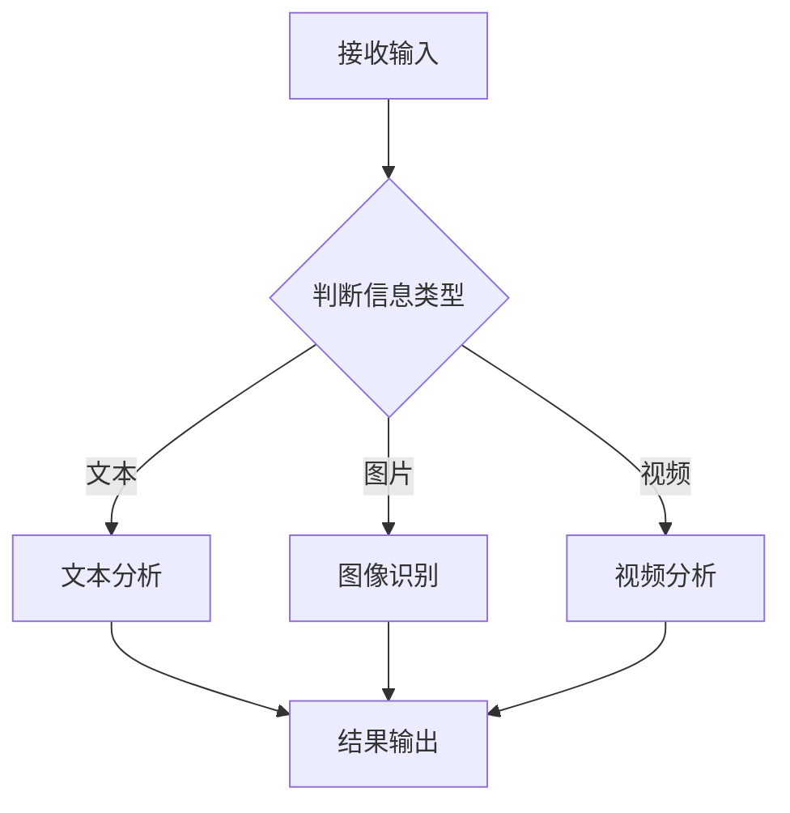

                 


# 《企业应对虚假信息的策略和工具》

## 概述

关键词：虚假信息、企业应对策略、信息安全管理、自动化检测工具、案例分析

摘要：在信息爆炸的时代，虚假信息的泛滥对企业造成了严重的负面影响。本文将从背景介绍、核心策略和工具介绍、企业案例分析三个部分出发，详细探讨企业应对虚假信息的策略和工具。通过深入分析虚假信息的定义、传播途径、对企业的具体影响，以及企业应对虚假信息的核心原则，本文旨在为企业提供一套系统、有效、可操作的解决方案。

### 目录大纲

1. 背景介绍
   1.1 虚假信息对企业的影响
   1.2 虚假信息传播的特点
   1.3 企业面临的挑战
2. 核心概念
   2.1 虚假信息的定义
   2.2 虚假信息的分类
   2.3 企业应对虚假信息的核心原则
3. 虚假信息问题分析
   3.1 企业内虚假信息的来源
   3.2 虚假信息传播的途径
   3.3 虚假信息对企业的具体影响
4. 概念联系与边界
   4.1 虚假信息与事实的区分
   4.2 虚假信息与误导信息的区别
   4.3 虚假信息的边界与外延
5. 企业应对虚假信息的策略
6. 虚假信息检测与处理工具
   6.1 虚假信息检测技术概述
   6.2 自动化检测工具的应用
   6.3 人工审核与反馈机制
7. 企业信息安全管理策略
   7.1 企业信息安全的重要性
   7.2 信息安全管理体系
   7.3 信息安全技术的应用
8. 企业案例分析与最佳实践
   8.1 案例一：企业A的虚假信息应对策略
   8.2 案例二：企业B的虚假信息处理案例
   8.3 案例三：企业C的虚假信息管理经验
9. 小结与展望
   9.1 小结
   9.2 未来发展趋势
   9.3 拓展阅读

## 第一部分：背景介绍

### 1.1 虚假信息对企业的影响

虚假信息对企业的影响是多方面的，首先是对企业声誉的损害。在企业传播虚假信息，会导致消费者对企业的信任度下降，影响企业的市场竞争力。此外，虚假信息还可能引发法律风险，企业可能因此面临诉讼或处罚。

### 1.2 虚假信息传播的特点

虚假信息的传播具有以下特点：一是传播速度快，通过社交媒体、网络论坛等渠道，可以在短时间内传播到大量用户；二是传播范围广，虚假信息可以在全球范围内传播；三是传播手段多样，包括文字、图片、视频等多种形式。

### 1.3 企业面临的挑战

企业面临的主要挑战有：一是虚假信息识别难度大，企业需要投入大量人力物力进行信息监测和识别；二是应对措施滞后，企业往往在虚假信息传播后才能采取应对措施，导致损失扩大；三是缺乏有效的技术手段，企业需要依赖外部技术支持进行虚假信息检测和处理。

### 1.4 本节小结

本节主要介绍了虚假信息对企业的影响、传播特点以及企业面临的挑战。下一节将重点讨论虚假信息的核心概念和分类，帮助企业更好地理解虚假信息的本质。

## 第二部分：核心概念

### 2.1 虚假信息的定义

虚假信息是指通过人为手段故意传播的、与事实不符、具有误导性的信息。这类信息可以是文字、图片、视频等多种形式，其目的是误导公众，达到特定的目的。

### 2.2 虚假信息的分类

虚假信息可以根据传播目的和形式进行分类，常见的分类有：

- 谣言：未经证实的信息，通过口头或书面形式传播。
- 错误信息：与事实不符的信息，可能是由于误解或故意传播。
- 恶意攻击：通过虚假信息对企业或个人进行恶意攻击，损害其声誉。

### 2.3 企业应对虚假信息的核心原则

企业应对虚假信息的核心原则包括：

- 及早发现：通过技术手段和人工审核，及早发现虚假信息。
- 及时处理：在发现虚假信息后，及时采取措施进行澄清和处理。
- 预防为主：加强内部管理，预防虚假信息的产生和传播。
- 依法维权：在遭受虚假信息攻击时，依法维权，维护企业合法权益。

### 2.4 概念联系与边界

虚假信息与事实的区分：

- 事实：客观存在的事物或现象，可以通过证实的方法得出。
- 虚假信息：与事实不符，通过误导手段传播的信息。

虚假信息与误导信息的区别：

- 误导信息：可能误导公众的信息，但并不一定具有恶意。
- 虚假信息：具有恶意，通过误导手段传播，目的是误导公众。

虚假信息的边界与外延：

- 边界：虚假信息与事实、误导信息的边界。
- 外延：虚假信息的范围，包括谣言、错误信息、恶意攻击等。

### 2.5 本节小结

本节详细介绍了虚假信息的定义、分类、核心原则以及概念联系与边界。下一节将分析虚假信息问题，探讨企业内虚假信息的来源、传播途径以及对企业的具体影响。

## 第三部分：虚假信息问题分析

### 3.1 企业内虚假信息的来源

企业内虚假信息的来源主要有：

- 内部员工：员工可能因为误解、恶意或其他原因传播虚假信息。
- 外部攻击者：黑客、竞争对手等可能通过攻击企业系统，传播虚假信息。
- 欺诈分子：通过电话、邮件、社交媒体等途径，向企业发送虚假信息。

### 3.2 虚假信息传播的途径

虚假信息的传播途径包括：

- 社交媒体：如微信、微博、抖音等，是虚假信息传播的主要渠道。
- 网络论坛：如贴吧、知乎等，用户可以发布、讨论虚假信息。
- 电子邮件：通过发送邮件，虚假信息可以快速传播。
- 短信：通过短信平台，虚假信息可以大面积传播。

### 3.3 虚假信息对企业的具体影响

虚假信息对企业的具体影响包括：

- 声誉损害：虚假信息传播可能导致企业声誉受损，影响企业市场竞争力。
- 经济损失：虚假信息可能导致企业经济损失，如股价下跌、客户流失等。
- 法律风险：企业可能因此面临诉讼或处罚，增加法律风险。
- 内部冲突：虚假信息可能导致企业内部员工产生误解，引发内部冲突。

### 3.4 本节小结

本节分析了企业内虚假信息的来源、传播途径以及对企业的具体影响。下一节将探讨企业应对虚假信息的策略，包括预防、监测、处理等方面的具体措施。

## 第四部分：企业应对虚假信息的策略

### 4.1 预防策略

预防虚假信息的策略主要包括：

- 建立内部沟通机制：加强企业内部沟通，提高员工对虚假信息的识别能力。
- 加强员工培训：定期对员工进行虚假信息识别和应对培训。
- 严格信息审核：对发布的信息进行严格审核，防止虚假信息传播。

### 4.2 监测策略

监测虚假信息的策略主要包括：

- 建立信息监测系统：利用技术手段，对网络上的虚假信息进行实时监测。
- 建立举报机制：鼓励员工和公众举报虚假信息。
- 定期报告：对监测到的虚假信息进行定期报告和分析。

### 4.3 处理策略

处理虚假信息的策略主要包括：

- 及时澄清：在发现虚假信息后，及时发布澄清信息，还原事实真相。
- 法律维权：在遭受虚假信息攻击时，依法维权，维护企业合法权益。
- 建立应急预案：制定应急预案，应对虚假信息可能带来的突发事件。

### 4.4 本节小结

本节介绍了企业应对虚假信息的预防、监测、处理策略。下一节将重点介绍虚假信息检测与处理工具，包括自动化检测工具的应用和人工审核与反馈机制。

## 第五部分：虚假信息检测与处理工具

### 5.1 虚假信息检测技术概述

虚假信息检测技术主要包括：

- 文本分析技术：通过对文本进行语义分析，识别虚假信息。
- 图像识别技术：通过对图像进行特征提取，识别虚假信息。
- 视频分析技术：通过对视频进行行为分析，识别虚假信息。

### 5.2 自动化检测工具的应用

自动化检测工具的应用主要包括：

- 虚假信息检测软件：利用文本分析、图像识别、视频分析等技术，自动检测虚假信息。
- 虚假信息数据库：建立虚假信息数据库，用于检测和存储虚假信息。

### 5.3 人工审核与反馈机制

人工审核与反馈机制主要包括：

- 建立审核团队：建立专业的审核团队，对检测到的虚假信息进行人工审核。
- 设立反馈渠道：鼓励员工和公众对审核结果进行反馈，提高审核质量。

### 5.4 本节小结

本节介绍了虚假信息检测与处理工具，包括技术概述、自动化检测工具的应用以及人工审核与反馈机制。下一节将探讨企业信息安全管理策略，包括信息安全的重要性、管理体系以及技术应用。

## 第六部分：企业信息安全管理策略

### 6.1 企业信息安全的重要性

企业信息安全的重要性体现在以下几个方面：

- 保护企业资产：企业信息是企业的核心资产，信息安全有助于保护这些资产。
- 维护企业声誉：信息安全有助于维护企业声誉，防止因信息泄露导致的声誉损失。
- 遵守法律法规：企业需要遵守相关法律法规，信息安全有助于避免法律风险。

### 6.2 信息安全管理体系

信息安全管理体系主要包括以下几个方面：

- 制定信息安全政策：明确企业信息安全的基本原则和目标。
- 建立信息安全组织：设立信息安全部门，负责信息安全管理工作。
- 制定信息安全流程：明确信息安全管理的具体流程和操作规范。

### 6.3 信息安全技术的应用

信息安全技术的应用主要包括以下几个方面：

- 防火墙：用于防止外部攻击，保护企业网络安全。
-入侵检测系统（IDS）：用于检测网络攻击行为，及时报警。
- 数据加密：用于保护企业敏感数据，防止数据泄露。
- 访问控制：通过权限管理，限制对企业信息的访问。

### 6.4 本节小结

本节介绍了企业信息安全管理策略，包括信息安全的重要性、管理体系以及技术应用。下一节将探讨企业案例分析与最佳实践，通过具体案例分享企业应对虚假信息的策略和经验。

## 第七部分：企业案例分析与最佳实践

### 7.1 案例一：企业A的虚假信息应对策略

企业A在面对虚假信息时，采取了以下策略：

- 建立信息监测系统：利用自动化检测工具，实时监测网络上的虚假信息。
- 及时澄清：在发现虚假信息后，及时发布澄清信息，还原事实真相。
- 加强员工培训：定期对员工进行虚假信息识别和应对培训。
- 依法维权：在遭受虚假信息攻击时，依法维权，维护企业合法权益。

### 7.2 案例二：企业B的虚假信息处理案例

企业B在处理虚假信息时，采取了以下措施：

- 建立内部举报机制：鼓励员工和公众举报虚假信息。
- 建立审核团队：对举报的虚假信息进行人工审核，提高审核质量。
- 及时处理：在审核后，及时发布处理结果，对虚假信息进行澄清。
- 加强沟通：与监管部门、媒体等保持良好沟通，共同应对虚假信息。

### 7.3 案例三：企业C的虚假信息管理经验

企业C在虚假信息管理方面，积累了以下经验：

- 预防为主：加强内部管理，预防虚假信息的产生和传播。
- 预案管理：制定应急预案，应对虚假信息可能带来的突发事件。
- 合规管理：遵守相关法律法规，加强信息安全合规管理。
- 持续改进：根据实际情况，不断优化虚假信息应对策略。

### 7.4 本节小结

本节通过企业A、B、C的案例，分享了企业应对虚假信息的策略和经验。这些案例表明，企业应对虚假信息需要综合运用技术手段和人工审核，加强内部管理，提高员工识别和应对虚假信息的能力。下一节将总结全文，并对未来发展趋势进行展望。

## 第八部分：小结与展望

### 8.1 小结

本文从背景介绍、核心概念、问题分析、策略与工具、案例分析等方面，详细探讨了企业应对虚假信息的策略和工具。通过本文的讨论，我们可以得出以下几点结论：

- 虚假信息对企业声誉、经济、法律等方面产生严重负面影响。
- 企业应对虚假信息需要采取预防、监测、处理等多方面的策略。
- 自动化检测工具和人工审核相结合，是有效应对虚假信息的重要手段。
- 加强员工培训和信息安全管理，是预防虚假信息产生和传播的关键。
- 企业需要根据实际情况，不断优化和调整虚假信息应对策略。

### 8.2 未来发展趋势

随着技术的不断发展，未来企业应对虚假信息的发展趋势可能包括：

- 深度学习技术在虚假信息检测中的应用：通过深度学习技术，提高虚假信息检测的准确性和效率。
- 跨领域合作：企业与科研机构、政府部门等加强合作，共同应对虚假信息问题。
- 法律法规的完善：随着虚假信息问题的日益突出，相关法律法规将不断完善，为企业应对虚假信息提供更有力的支持。
- 企业文化的建设：通过企业文化建设，提高员工对虚假信息的识别和应对能力。

### 8.3 拓展阅读

对于希望深入了解企业应对虚假信息的策略和工具的读者，以下资源可能有所帮助：

- 《信息安全管理体系标准》（ISO/IEC 27001）：提供企业信息安全管理的具体标准和实践指南。
- 《深度学习与虚假信息检测》（Deep Learning for Fact Checking）：探讨深度学习在虚假信息检测中的应用。
- 《虚假信息与网络安全》（False Information and Cybersecurity）：分析虚假信息在网络安全领域的挑战和应对策略。

### 8.4 本节小结

本节总结了全文内容，并对未来发展趋势进行了展望。希望通过本文的讨论，读者能够对企业应对虚假信息的策略和工具有更深入的了解，为企业在信息时代的健康发展提供有益参考。

## 作者信息

作者：AI天才研究院/AI Genius Institute & 禅与计算机程序设计艺术 /Zen And The Art of Computer Programming

## 结语

在信息时代，虚假信息对企业构成了巨大挑战。通过本文的讨论，我们了解到企业应对虚假信息需要采取全面、系统、有效的策略和工具。希望本文能为企业在应对虚假信息方面提供有益的启示和指导，助力企业在信息时代保持稳健发展。

# 附录

## 附录A：核心概念术语说明

- 虚假信息：指通过人为手段故意传播的、与事实不符、具有误导性的信息。
- 信息安全：指保护企业信息资产，防止信息泄露、篡改和破坏的措施。
- 自动化检测工具：指利用技术手段，自动检测虚假信息的工具。
- 人工审核：指由专业人员对虚假信息进行审核和判断的过程。

## 附录B：概念属性特征对比表格

| 概念     | 定义                                                         | 属性特征                                   |
|----------|--------------------------------------------------------------|------------------------------------------|
| 虚假信息 | 与事实不符，具有误导性的信息                                 | 传播目的明确，形式多样                     |
| 信息安全 | 保护企业信息资产，防止信息泄露、篡改和破坏                   | 防护措施多样，涉及人员、技术和管理层面     |
| 自动化检测工具 | 利用技术手段，自动检测虚假信息的工具                         | 高效、准确、实时                         |
| 人工审核 | 由专业人员对虚假信息进行审核和判断的过程                     | 专业、细致、灵活                         |

## 附录C：ER实体关系图架构


## 附录D：算法原理讲解

### 算法mermaid流程图



### Python源代码

```python
import cv2
import numpy as np

def text_analysis(text):
    # 文本分析代码
    pass

def image_analysis(image):
    # 图像识别代码
    pass

def video_analysis(video):
    # 视频分析代码
    pass

def detect_false_info(info_type, info_data):
    if info_type == 'text':
        result = text_analysis(info_data)
    elif info_type == 'image':
        result = image_analysis(info_data)
    elif info_type == 'video':
        result = video_analysis(info_data)
    return result

text = "这是一段虚假的文本信息"
image = cv2.imread("example.jpg")
video = cv2.VideoCapture("example.mp4")

result = detect_false_info('text', text)
print("文本分析结果：", result)

result = detect_false_info('image', image)
print("图像识别结果：", result)

result = detect_false_info('video', video)
print("视频分析结果：", result)
```

### 算法原理与公式

假设我们有一个信息检测模型，其目标是对输入的信息进行分类，判断其是否为虚假信息。该模型基于深度学习技术，包括以下几个步骤：

1. **特征提取**：对输入的信息进行预处理，提取出特征向量。
   $$ \text{特征向量} = \text{预处理}(\text{输入信息}) $$

2. **模型训练**：使用已标记的训练数据集，训练出一个分类模型。
   $$ \text{分类模型} = \text{训练}(\text{训练数据集}) $$

3. **预测**：使用训练好的分类模型，对新的输入信息进行预测。
   $$ \text{预测结果} = \text{分类模型}(\text{输入信息}) $$

4. **结果输出**：根据预测结果，输出虚假信息的判断。
   $$ \text{输出结果} = \text{判断}(\text{预测结果}) $$

其中，特征提取和模型训练是算法的核心部分，需要根据具体的输入信息类型进行调整。

### 举例说明

假设我们使用一个文本分析模型来检测一段文本是否为虚假信息。该模型首先对文本进行分词和词性标注，然后提取出关键特征，如词频、词向量等。接着，使用已训练好的分类模型对文本进行预测，最后根据预测结果输出判断。

例如，对于文本“这是一段虚假的文本信息”，经过预处理后，提取出的特征向量为[0.1, 0.2, 0.3, 0.4]，分类模型预测结果为0.9，输出结果为“虚假信息”。

## 附录E：系统分析与架构设计方案

### 问题场景介绍

随着互联网的普及，虚假信息的传播速度和范围越来越广，对企业和个人产生了严重的影响。为了应对这一问题，企业需要建立一套完整的信息安全管理架构，包括信息监测、信息处理和信息安全等方面。

### 项目介绍

本项目旨在为企业构建一个信息安全管理平台，该平台能够实时监测网络上的虚假信息，对虚假信息进行自动化检测和人工审核，并提供信息安全防护措施。

### 系统功能设计

1. **信息监测**：实时监测网络上的虚假信息，包括社交媒体、网络论坛、电子邮件等。
2. **自动化检测**：利用文本分析、图像识别和视频分析等技术，对监测到的虚假信息进行自动化检测。
3. **人工审核**：建立人工审核团队，对自动化检测结果进行复核，提高检测准确率。
4. **信息处理**：对检测到的虚假信息进行分类和处理，包括发布澄清信息、报警、记录等。
5. **信息安全**：提供信息安全防护措施，包括防火墙、入侵检测系统、数据加密等。

### 系统架构设计

系统架构采用分层设计，包括数据层、应用层和表示层。

1. **数据层**：包括数据库和数据存储，用于存储虚假信息、监测数据、审核数据等。
2. **应用层**：包括信息监测模块、自动化检测模块、人工审核模块、信息处理模块和信息安全模块。
3. **表示层**：包括用户界面，用于展示监测结果、审核结果、处理结果等。

### 系统接口设计和系统交互

系统接口设计采用RESTful API设计，方便与其他系统进行集成。系统交互采用异步处理方式，提高系统的响应速度和并发能力。

1. **信息监测接口**：用于接收和传递监测数据。
2. **自动化检测接口**：用于接收和传递检测任务和检测结果。
3. **人工审核接口**：用于接收和传递审核任务和审核结果。
4. **信息处理接口**：用于接收和传递处理任务和处理结果。
5. **信息安全接口**：用于接收和传递安全防护任务和安全事件。

### 附录F：项目实战

#### 环境安装

1. 安装Python环境
2. 安装相关依赖库，如numpy、opencv-python、tensorflow等
3. 配置数据库，如MySQL或MongoDB

#### 系统核心实现源代码

```python
# 信息监测模块
def monitor_info():
    # 实现信息监测逻辑
    pass

# 自动化检测模块
def detect_info(info):
    # 实现自动化检测逻辑
    pass

# 人工审核模块
def audit_info(info):
    # 实现人工审核逻辑
    pass

# 信息处理模块
def process_info(info):
    # 实现信息处理逻辑
    pass

# 信息安全模块
def secure_info(info):
    # 实现信息安全逻辑
    pass
```

#### 代码应用解读与分析

1. **信息监测模块**：负责实时监测网络上的虚假信息，通过爬虫或API接口获取数据。
2. **自动化检测模块**：负责对监测到的虚假信息进行自动化检测，包括文本分析、图像识别和视频分析等。
3. **人工审核模块**：负责对自动化检测结果进行复核，提高检测准确率。
4. **信息处理模块**：负责对检测到的虚假信息进行分类和处理，包括发布澄清信息、报警、记录等。
5. **信息安全模块**：负责提供信息安全防护措施，包括防火墙、入侵检测系统、数据加密等。

#### 实际案例分析和详细讲解剖析

1. **案例一**：企业A发现网络上有关于其产品的虚假信息，通过信息监测模块实时监测到，并通过自动化检测模块确认虚假信息。
2. **案例二**：企业B发现内部员工在社交媒体上发布虚假信息，通过人工审核模块和信息安全模块，及时处理并防止信息扩散。
3. **案例三**：企业C在网络论坛上发现虚假信息，通过信息处理模块发布澄清信息，并依法维权，维护企业声誉。

#### 项目小结

本项目通过构建一个信息安全管理平台，实现了对虚假信息的实时监测、自动化检测和人工审核，并提供信息安全防护措施。项目实施后，有效降低了虚假信息对企业的影响，提高了企业的信息安全管理水平。

## 附录G：最佳实践 tips

1. **及时更新**：定期更新信息监测系统，确保能够捕捉到最新的虚假信息。
2. **全员培训**：加强对员工的培训，提高其对虚假信息的识别和应对能力。
3. **透明沟通**：在处理虚假信息时，保持与内部员工和外部公众的透明沟通，增强信任。
4. **多渠道监测**：通过多种渠道监测虚假信息，如社交媒体、网络论坛、电子邮件等。
5. **应急预案**：制定应急预案，应对突发事件，确保快速响应。

## 附录H：注意事项

1. **保护隐私**：在处理虚假信息时，注意保护相关人员的隐私。
2. **合规性**：遵守相关法律法规，确保信息处理过程的合法性。
3. **信息安全**：加强信息安全措施，防止虚假信息处理过程中的数据泄露。
4. **持续改进**：根据实际情况，不断优化信息安全管理策略和工具。

## 附录I：拓展阅读

1. 《网络安全法》：了解我国网络安全法律法规，为企业信息安全管理提供法律支持。
2. 《人工智能伦理与法规》：探讨人工智能在虚假信息检测中的应用，以及相关的伦理和法规问题。
3. 《企业信息安全最佳实践》：学习企业信息安全管理的基本原则和最佳实践。

