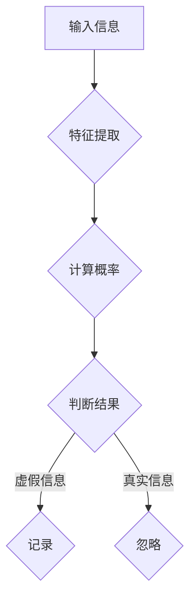
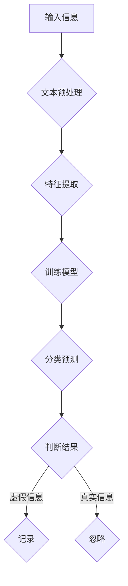
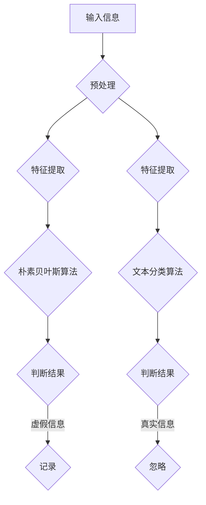
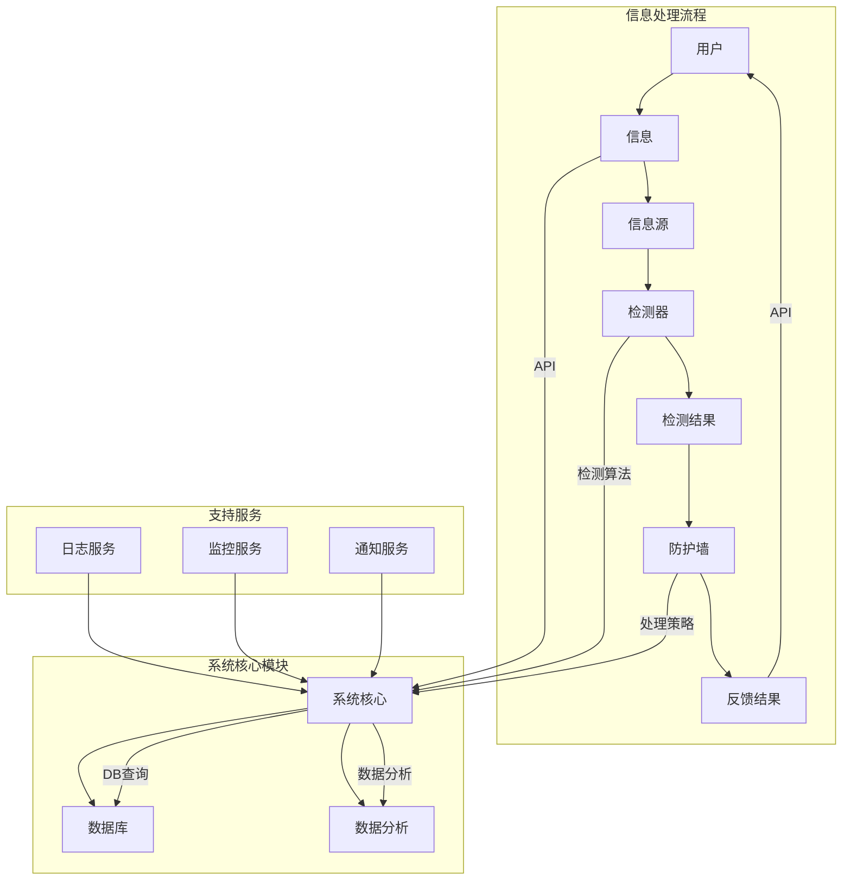

                 

### 第1章: 虚假信息问题的背景

#### 1.1 虚假信息问题的起源与发展

虚假信息的传播可以追溯到古代，但随着互联网和社交媒体的兴起，虚假信息的传播速度和范围得到了前所未有的扩展。互联网的出现使得信息传播变得更加迅速和便捷，而社交媒体的普及则使得信息传播的范围更加广泛。

在过去，虚假信息的传播主要依赖于纸质媒体和广播等传统渠道。然而，随着互联网的发展，虚假信息传播的途径变得多样化。电子邮件、即时通讯工具、社交媒体平台等新兴渠道为虚假信息的传播提供了新的平台。特别是在社交媒体平台上，虚假信息可以通过用户的分享和转发迅速传播，导致公众的信任受到严重损害。

近年来，虚假信息的传播呈现出一些新的趋势。首先，虚假信息的制作和传播变得更加智能化。一些不法分子利用人工智能技术生成逼真的虚假信息，使得这些信息难以被识别和验证。其次，虚假信息的传播变得更加精准化。通过大数据分析和用户行为分析，不法分子可以针对特定人群定制虚假信息，提高虚假信息的传播效果。

虚假信息的传播对社会和个人产生了深远的影响。对于企业而言，虚假信息可能导致品牌声誉受损，消费者信任下降，甚至引发法律纠纷。对于个人而言，虚假信息可能导致错误决策，造成经济损失和心理伤害。

#### 1.2 虚假信息的种类与影响

虚假信息的种类繁多，可以从不同的角度进行分类。以下是一些常见的虚假信息类型及其影响：

1. **虚假新闻**：虚假新闻是指故意编造的、未经证实的信息，旨在误导读者。虚假新闻的传播速度极快，往往会在短时间内引发公众恐慌和情绪波动。例如，一些虚假新闻报道可能导致股市波动，影响企业股价。

2. **谣言**：谣言是指未经证实的、可能引起恐慌或误导的信息。谣言的传播往往依赖于人们的信任和传播意愿，尤其是在社交媒体平台上。谣言的扩散可能引发社会恐慌，影响社会稳定。

3. **虚假广告**：虚假广告是指虚假或夸大的广告信息，旨在误导消费者。虚假广告可能导致消费者购买到不合格的产品，影响消费者权益，同时损害企业的声誉。

4. **虚假评论**：虚假评论是指在电子商务平台、社交媒体等场合发布的虚假评价，旨在误导其他消费者。虚假评论可能影响消费者的购买决策，破坏市场的公平竞争。

虚假信息的传播对社会和个人产生了多方面的影响。首先，虚假信息可能导致公众对媒体和政府的信任下降。当公众发现媒体和政府发布的信息存在虚假成分时，他们可能会对信息来源产生怀疑，影响信息的传播效果。其次，虚假信息可能导致社会矛盾的加剧。虚假信息往往会夸大事实，煽动公众情绪，引发社会冲突。最后，虚假信息可能对个人的心理和身体健康产生负面影响。虚假信息可能导致个人产生焦虑、恐慌等负面情绪，甚至影响个人的生活和决策。

#### 1.3 企业面临虚假信息的挑战

在虚假信息泛滥的时代，企业面临着前所未有的挑战。首先，虚假信息可能导致品牌声誉受损。当企业被虚假信息所困扰时，公众可能会对企业产生怀疑和反感，影响企业的品牌形象和市场份额。例如，一家企业在社交媒体上被虚假信息指控为欺诈行为，可能会在短时间内失去大量客户。

其次，虚假信息可能影响企业的业务运营。虚假信息可能导致消费者的信任下降，影响企业的销售额和利润。例如，一家电子商务平台被虚假评论指控为售假，可能会在短时间内失去大量客户，影响企业的业务运营。

最后，虚假信息可能引发法律纠纷。当企业被虚假信息所困扰时，可能会面临法律诉讼和赔偿要求。例如，一家企业被虚假新闻指控为环境污染者，可能会面临巨额赔偿和法律纠纷。

为了应对虚假信息的挑战，企业需要采取一系列措施。首先，企业需要建立完善的虚假信息监测机制，及时识别和应对虚假信息。其次，企业需要加强内部培训和沟通，提高员工的虚假信息识别能力。最后，企业需要与媒体、政府等外部机构建立良好的合作关系，共同应对虚假信息的威胁。

### 第2章: 核心概念与联系

#### 2.1 虚假信息的定义与特征

虚假信息是指故意编造、篡改、传播的、与事实不符的、可能误导公众的信息。虚假信息的特征包括：

1. **误导性**：虚假信息旨在误导公众，可能通过夸大事实、捏造事实、歪曲事实等方式实现。
2. **不真实性**：虚假信息与事实不符，不存在于现实世界中。
3. **意图性**：虚假信息的传播往往具有明确的意图，可能包括操纵市场、影响选举、破坏企业声誉等。
4. **传播性**：虚假信息可以通过互联网、社交媒体等渠道迅速传播，影响范围广泛。

#### 2.2 网络安全与数据隐私

网络安全是指保护网络系统、网络设备、网络数据不受未经授权的访问、篡改、破坏等威胁。网络安全的重要性不言而喻，随着互联网的普及，网络安全已成为社会关注的焦点。

数据隐私是指个人数据的保密性和完整性。数据隐私的保护对于维护个人权益、维护社会稳定具有重要意义。

虚假信息与网络安全、数据隐私之间存在密切的联系。首先，虚假信息的传播依赖于网络渠道，网络安全的脆弱性可能导致虚假信息传播的加速。其次，虚假信息往往涉及个人数据的泄露和滥用，影响数据隐私。因此，保护网络安全和数据隐私是应对虚假信息的重要手段。

#### 2.3 虚假信息与网络攻击的联系

虚假信息与网络攻击之间存在紧密的联系。网络攻击是指利用网络技术手段对网络系统、网络设备、网络数据进行破坏、窃取、篡改等恶意行为。网络攻击的常见类型包括：

1. **钓鱼攻击**：通过伪造邮件、网站等，诱导用户输入个人信息，如账号密码等。
2. **DDoS攻击**：通过大量恶意流量攻击目标网站，导致网站无法正常访问。
3. **恶意软件攻击**：通过恶意软件入侵目标系统，窃取敏感信息或破坏系统功能。

虚假信息往往被用于网络攻击，例如，通过虚假邮件诱导用户点击恶意链接，从而感染恶意软件。虚假信息还可以被用于网络欺诈，例如，通过虚假广告诱导用户投资，从而骗取资金。

#### 2.4 ER实体关系图：虚假信息相关实体

为了更好地理解虚假信息相关实体之间的关系，我们可以通过ER实体关系图进行展示。ER实体关系图是一种用于描述实体及其关系的数据库设计工具。

在虚假信息相关实体的ER实体关系图中，包括以下关键实体：

1. **虚假信息**：代表虚假信息的实体。
2. **发布者**：代表发布虚假信息的个人或组织。
3. **传播渠道**：代表虚假信息传播的渠道，如社交媒体、电子邮件等。
4. **受害者**：代表受到虚假信息影响的个人或组织。

ER实体关系图如下所示：

```mermaid
erDiagram
  虚假信息 ||--|{ 发布者 }
  虚假信息 ||--|{ 传播渠道 }
  虚假信息 ||--|{ 受害者 }
```

通过ER实体关系图，我们可以清晰地看到虚假信息、发布者、传播渠道和受害者之间的联系。这有助于我们更好地理解虚假信息的传播机制和应对策略。

### 第3章: 算法原理讲解

#### 3.1 虚假信息检测算法概述

虚假信息检测算法是用于识别和防范虚假信息传播的关键技术。其主要目标是通过对信息内容、来源、传播路径等进行分析，判断信息是否为虚假信息。虚假信息检测算法可分为以下几种类型：

1. **基于规则的方法**：通过预设规则和特征，对信息进行判断。例如，判断信息中是否存在敏感词汇、逻辑矛盾等。
2. **基于机器学习的方法**：利用机器学习算法，对大量真实和虚假信息进行训练，构建模型进行预测。常见的机器学习算法包括朴素贝叶斯、支持向量机、深度学习等。
3. **基于自然语言处理的方法**：利用自然语言处理技术，对信息内容进行语义分析，识别虚假信息。例如，通过词向量、文本分类、情感分析等方法。

#### 3.2 基于机器学习的虚假信息检测算法

基于机器学习的虚假信息检测算法是一种有效的虚假信息检测方法。以下介绍几种常见的基于机器学习的虚假信息检测算法：

1. **朴素贝叶斯算法**：朴素贝叶斯算法是一种基于概率论的分类算法。其基本思想是，通过计算信息中各个特征的联合概率，判断信息是否为虚假信息。朴素贝叶斯算法的优点是简单高效，但需要大量的训练数据。

2. **支持向量机（SVM）算法**：支持向量机是一种经典的分类算法。其基本思想是，通过找到一个最佳分类超平面，将真实和虚假信息分开。支持向量机算法的优点是分类效果较好，但需要调整参数。

3. **深度学习算法**：深度学习算法是一种基于神经网络的学习方法。其基本思想是通过多层神经网络，对信息进行特征提取和分类。常见的深度学习算法包括卷积神经网络（CNN）、循环神经网络（RNN）等。

以下是一个基于朴素贝叶斯算法的虚假信息检测算法mermaid流程图：



#### 3.3 基于自然语言处理的虚假信息检测算法

基于自然语言处理的虚假信息检测算法是利用自然语言处理技术，对信息内容进行语义分析，识别虚假信息。以下介绍几种常见的基于自然语言处理的虚假信息检测算法：

1. **文本分类算法**：文本分类算法是一种将文本数据分类到预定义类别的方法。常见的文本分类算法包括朴素贝叶斯、支持向量机、深度学习等。通过文本分类算法，可以判断信息是否为虚假信息。

2. **情感分析算法**：情感分析算法是一种判断文本情感极性的方法。通过情感分析算法，可以判断信息是否具有负面情感，从而识别虚假信息。

3. **实体识别算法**：实体识别算法是一种识别文本中实体（如人名、地点、组织等）的方法。通过实体识别算法，可以分析信息中实体的关系和属性，从而识别虚假信息。

以下是一个基于文本分类算法的虚假信息检测算法mermaid流程图：



#### 3.4 算法mermaid流程图

为了更好地展示算法原理，我们可以使用mermaid流程图进行描述。以下是一个基于朴素贝叶斯算法和文本分类算法的虚假信息检测算法mermaid流程图：



#### 3.5 算法Python源代码讲解

以下是一个基于朴素贝叶斯算法的虚假信息检测算法的Python源代码示例：

```python
import numpy as np
from sklearn.feature_extraction.text import CountVectorizer
from sklearn.naive_bayes import MultinomialNB

# 输入数据
data = [
    ["这是一条真实信息", "真实"],
    ["这是一条虚假信息", "虚假"],
    ["另一条真实信息", "真实"],
    ["另一条虚假信息", "虚假"],
]

# 分割数据
X, y = data[:, 0], data[:, 1]

# 特征提取
vectorizer = CountVectorizer()
X_vectorized = vectorizer.fit_transform(X)

# 训练模型
model = MultinomialNB()
model.fit(X_vectorized, y)

# 预测
test_data = ["这是一条未知信息"]
test_vectorized = vectorizer.transform(test_data)
prediction = model.predict(test_vectorized)

# 输出结果
print("预测结果：", prediction)
```

在这个示例中，我们首先使用CountVectorizer进行特征提取，然后使用MultinomialNB进行分类预测。通过训练模型，我们可以对未知信息进行预测，判断其是否为虚假信息。

#### 3.6 数学模型与公式

在虚假信息检测算法中，数学模型和公式起着关键作用。以下介绍几种常见的数学模型和公式：

1. **朴素贝叶斯公式**：

   朴素贝叶斯算法的核心公式为：

   $$P(\text{虚假信息}| \text{特征}) = \frac{P(\text{特征}| \text{虚假信息})P(\text{虚假信息})}{P(\text{特征})}$$

   其中，$P(\text{虚假信息}| \text{特征})$表示在给定特征下信息为虚假信息的概率，$P(\text{特征}| \text{虚假信息})$表示特征在虚假信息中出现的概率，$P(\text{虚假信息})$表示虚假信息的先验概率，$P(\text{特征})$表示特征出现的概率。

2. **贝叶斯误差率**：

   贝叶斯误差率是指预测错误的概率。对于二元分类问题，贝叶斯误差率为：

   $$\text{贝叶斯误差率} = 1 - \text{准确率} = 1 - \frac{P(\text{真实信息}| \text{特征})P(\text{特征}) + P(\text{虚假信息}| \text{特征})P(\text{特征})}{P(\text{特征})}$$

3. **熵**：

   熵是衡量信息不确定性的指标。在虚假信息检测中，可以通过计算特征熵来评估特征的重要性。特征熵的计算公式为：

   $$H(X) = -\sum_{i=1}^{n} p(x_i) \log_2 p(x_i)$$

   其中，$p(x_i)$表示特征$X$取值为$x_i$的概率。

通过以上数学模型和公式，我们可以对虚假信息检测算法进行深入分析和优化。

### 第4章: 系统分析与架构设计方案

#### 4.1 安全需求分析

在构建企业应对虚假信息的系统时，首先需要明确系统的安全需求。这些需求可以分为以下几个方面：

1. **信息真实性检测**：系统应能够识别和过滤虚假信息，确保传播的信息真实可信。
2. **信息来源验证**：系统应能够验证信息发布者的身份和信誉，防止恶意发布者传播虚假信息。
3. **信息传播路径监控**：系统应能够监控信息在社交媒体等渠道的传播路径，防止虚假信息扩散。
4. **用户行为分析**：系统应能够分析用户的行为模式，识别潜在的危险行为，如大量转发可疑信息。
5. **应急预案**：系统应具备应急预案，能够在发现虚假信息时及时采取措施，防止信息扩散。
6. **法律法规遵守**：系统应确保其功能符合相关法律法规要求，如网络安全法、个人信息保护法等。

#### 4.2 系统功能设计：领域模型mermaid类图

为了更好地理解系统的功能设计，我们可以使用mermaid类图来表示领域模型。以下是一个简单的mermaid类图示例：

```mermaid
classDiagram
    Class01 <|-- Class02
    Class03 o-- Class04
    Class05 <..> Class01
    Class06 (<:Class07) Class02
    Class08 --|> Class09
endclass
```

在这个类图中，`Class01`、`Class02`、`Class03`、`Class04`、`Class05`、`Class06`、`Class07`和`Class08`、`Class09`分别表示不同的实体和关系。例如，`Class01`和`Class02`之间存在继承关系，`Class03`和`Class04`之间存在关联关系，`Class05`是`Class01`的子类，`Class06`是`Class07`的子类，`Class08`是`Class09`的父类。

以下是一个更具体的mermaid类图示例，用于表示虚假信息检测系统的主要实体和关系：

```mermaid
classDiagram
    用户 <<Person>>
    信息 <<Object>>
    信息源 <<Source>>
    检测器 <<Detector>>
    防护墙 <<Firewall>>

    用户 o-- 信息
    信息 o-- 信息源
    信息 o-- 检测器
    检测器 o-- 防护墙
endclass
```

在这个类图中，`用户`、`信息`、`信息源`、`检测器`和`防护墙`是主要的实体。`用户`可以发布和接收信息，`信息`可以来源于不同的`信息源`，并会被`检测器`进行检测，如果检测到虚假信息，则由`防护墙`进行隔离和处理。

#### 4.3 系统架构设计：mermaid架构图

接下来，我们使用mermaid架构图来设计系统的整体架构。以下是一个简单的mermaid架构图示例：

```mermaid
sequenceDiagram
    participant User
    participant System
    participant Detector
    participant Firewall

    User->>System: 发布信息
    System->>Detector: 检测信息
    Detector->>System: 返回检测结果
    System->>Firewall: 处理检测结果
    Firewall->>User: 反馈结果
end
```

在这个架构图中，`User`表示用户，`System`表示系统核心，`Detector`表示信息检测器，`Firewall`表示信息防护墙。用户发布信息后，系统将信息传递给检测器进行检测，检测器返回检测结果，系统根据检测结果调用防护墙进行相应的处理，最后将处理结果反馈给用户。

以下是一个更具体的mermaid架构图示例，用于表示虚假信息检测系统的整体架构：



在这个架构图中，系统核心模块包括用户接口、数据库、数据分析和系统核心功能。支持服务包括日志服务、监控服务和通知服务。信息处理流程从用户发布信息开始，经过信息源、检测器和防护墙，最后将处理结果反馈给用户。系统核心模块和支持服务之间通过API进行交互，确保系统的整体协同工作。

#### 4.4 系统接口设计

系统接口设计是系统架构设计的重要组成部分，它定义了系统内部各模块之间的交互方式。以下是一个简化的系统接口设计示例：

```mermaid
sequenceDiagram
    participant User
    participant API
    participant Detector
    participant Firewall

    User->>API: 发送请求
    API->>Detector: 调用检测接口
    Detector->>API: 返回检测结果
    API->>Firewall: 调用处理接口
    Firewall->>API: 返回处理结果
    API->>User: 返回反馈结果
end
```

在这个接口设计中，用户通过API发送请求，API调用检测器进行信息检测，检测器返回检测结果给API，API调用防护墙进行处理，最后将处理结果反馈给用户。

以下是一个更详细的系统接口设计示例，包括用户接口、API接口、检测器接口和防护墙接口：

```mermaid
interfaceStyle override
    interfaceStyle {
        fillColor: grey
        strokeColor: grey
        strokeWidth: 4
    }

graph TB
    subgraph 用户接口
        UI[用户接口]
        UI -->|发送请求| API[API接口]
        UI <--|接收结果| Result[结果]
    end

    subgraph API接口
        API
        API -->|检测请求| Detector[检测器接口]
        API -->|处理请求| Firewall[防护墙接口]
    end

    subgraph 检测器接口
        Detector
        Detector -->|检测结果| API
    end

    subgraph 防护墙接口
        Firewall
        Firewall -->|处理结果| API
    end

    Result -->|反馈结果| UI
```

在这个接口设计中，用户接口通过API接口与检测器和防护墙进行交互。用户接口发送检测请求和处理请求给API接口，API接口分别调用检测器和防护墙接口进行相应的处理，并将处理结果返回给用户接口。

#### 4.5 系统交互：mermaid序列图

为了更直观地展示系统的交互流程，我们可以使用mermaid序列图。以下是一个简化的系统交互序列图示例：

```mermaid
sequenceDiagram
    participant User
    participant API
    participant Detector
    participant Firewall

    User->>API: 发布信息
    API->>Detector: 检测信息
    Detector->>API: 返回检测结果
    API->>Firewall: 处理检测结果
    Firewall->>API: 返回处理结果
    API->>User: 反馈处理结果
end
```

在这个序列图中，用户首先发布信息，API接口接收到用户发布的信息后，将其传递给检测器进行检测。检测器返回检测结果给API接口，API接口根据检测结果调用防护墙进行处理，最后将处理结果反馈给用户。

以下是一个更详细的系统交互序列图示例，展示了系统从信息接收、处理到反馈的完整流程：

```mermaid
sequenceDiagram
    participant User
    participant API
    participant Detector
    participant Firewall
    participant DB

    User->>API: 发布信息
    API->>DB: 存储信息
    API->>Detector: 检测信息
    Detector->>API: 返回检测结果
    API->>Firewall: 处理检测结果
    Firewall->>API: 返回处理结果
    API->>User: 反馈处理结果
end
```

在这个序列图中，用户发布信息后，API接口将信息存储到数据库，然后传递给检测器进行检测。检测器返回检测结果给API接口，API接口根据检测结果调用防护墙进行处理，最后将处理结果反馈给用户。数据库在整个流程中起到存储信息的作用，确保系统的一致性和可靠性。

### 第5章: 项目实战

#### 5.1 环境安装与配置

为了进行虚假信息检测系统的项目实战，我们需要搭建一个合适的环境。以下是环境安装与配置的详细步骤：

1. **安装Python环境**：
   - 在Windows或Linux系统中，通过Python官方网站下载并安装Python。
   - 安装完成后，打开命令行窗口，输入`python --version`验证安装成功。

2. **安装依赖库**：
   - 使用pip命令安装必要的Python库，例如`numpy`、`scikit-learn`、`matplotlib`等。
   - 在命令行窗口中输入以下命令：
     ```shell
     pip install numpy scikit-learn matplotlib
     ```

3. **创建项目文件夹**：
   - 在电脑上创建一个项目文件夹，例如命名为`false_info_detection`。

4. **配置虚拟环境**（可选）：
   - 为了避免不同项目之间依赖库的冲突，建议使用虚拟环境。
   - 在项目文件夹中创建虚拟环境：
     ```shell
     python -m venv venv
     ```
   - 激活虚拟环境：
     - Windows系统：`venv\Scripts\activate`
     - Linux系统：`source venv/bin/activate`

5. **安装数据库**：
   - 安装一个数据库系统，如MySQL或PostgreSQL。
   - 按照数据库官方文档进行安装和配置。

6. **配置数据库连接**：
   - 在Python项目中，使用适当的库（如`pymysql`或`psycopg2`）连接到数据库。
   - 配置数据库连接参数，如主机、端口号、用户名和密码。

#### 5.2 系统核心实现源代码

以下是虚假信息检测系统的核心实现源代码，包括信息接收、存储、检测和处理功能：

```python
import numpy as np
import pandas as pd
from sklearn.feature_extraction.text import CountVectorizer
from sklearn.naive_bayes import MultinomialNB
from sklearn.pipeline import make_pipeline
import pymysql

# 数据库连接配置
config = {
    'host': 'localhost',
    'user': 'root',
    'password': 'password',
    'db': 'false_info_detection'
}

# 创建数据库连接
connection = pymysql.connect(**config)

# 创建数据库表
create_table_query = """
CREATE TABLE IF NOT EXISTS `info` (
  `id` INT AUTO_INCREMENT PRIMARY KEY,
  `text` TEXT,
  `source` VARCHAR(255),
  `status` VARCHAR(10) -- 'true' 或 'false'
);
"""
with connection.cursor() as cursor:
    cursor.execute(create_table_query)
    connection.commit()

# 存储信息到数据库
def store_info(text, source):
    insert_query = """
    INSERT INTO `info` (`text`, `source`, `status`)
    VALUES (%s, %s, %s);
    """
    with connection.cursor() as cursor:
        cursor.execute(insert_query, (text, source, 'unknown'))
        connection.commit()

# 加载信息从数据库
def load_info():
    select_query = "SELECT * FROM `info`;"
    with connection.cursor() as cursor:
        cursor.execute(select_query)
        return cursor.fetchall()

# 构建模型
vectorizer = CountVectorizer()
classifier = MultinomialNB()
model = make_pipeline(vectorizer, classifier)

# 训练模型
def train_model(data):
    X = [info[1] for info in data]
    y = [info[2] for info in data]
    model.fit(X, y)

# 检测信息
def detect_info(text):
    return model.predict([text])[0]

# 处理检测结果
def process_result(info_id, result):
    update_query = """
    UPDATE `info`
    SET `status` = %s
    WHERE `id` = %s;
    """
    with connection.cursor() as cursor:
        cursor.execute(update_query, (result, info_id))
        connection.commit()

# 关闭数据库连接
def close_connection():
    connection.close()

# 主程序
if __name__ == '__main__':
    # 加载数据
    data = load_info()
    train_model(data)

    # 处理新信息
    new_info = "这是一条可能虚假的信息"
    info_id = store_info(new_info, "未知来源")
    result = detect_info(new_info)
    process_result(info_id, result)

    # 关闭数据库连接
    close_connection()
```

在这个源代码中，我们首先配置了数据库连接，并创建了数据库表。然后定义了存储信息、加载信息、训练模型、检测信息和处理检测结果的功能。最后，通过主程序示例展示了如何使用这些功能。

#### 5.3 代码应用解读与分析

为了更好地理解上述代码的应用和解剖，我们可以将其分为几个关键部分进行分析：

1. **数据库连接**：
   - 使用`pymysql`库连接到本地MySQL数据库。
   - 配置数据库连接参数，如主机、用户名、密码和数据库名称。

2. **数据库表创建**：
   - 使用SQL语句创建一个名为`info`的数据库表，包括`id`、`text`、`source`和`status`四个字段。

3. **存储信息功能**：
   - `store_info`函数用于将新的信息存储到数据库中。
   - 使用SQL插入语句，将信息文本、来源和初始状态（未知）插入到`info`表中。

4. **加载信息功能**：
   - `load_info`函数用于从数据库中加载所有信息。
   - 使用SQL查询语句，从`info`表中获取所有记录，并将其转换为Python列表。

5. **模型构建**：
   - `train_model`函数用于训练模型。
   - 使用`CountVectorizer`进行特征提取，使用`MultinomialNB`进行分类。
   - 将加载的信息用于训练模型，模型将基于特征和标签进行学习。

6. **检测信息功能**：
   - `detect_info`函数用于检测新信息是否为虚假信息。
   - 使用训练好的模型，对新信息的文本进行特征提取和分类预测，返回预测结果。

7. **处理检测结果功能**：
   - `process_result`函数用于更新数据库中的信息状态。
   - 使用SQL更新语句，根据信息ID和预测结果更新信息的状态。

8. **主程序**：
   - 主程序示例展示了如何使用上述功能。
   - 加载现有数据、训练模型、存储新信息、检测新信息并处理检测结果。

通过这个代码应用解读，我们可以看到整个虚假信息检测系统的核心功能是如何实现和集成的。代码结构清晰，功能模块化，便于维护和扩展。

#### 5.4 实际案例分析与详细讲解

为了更好地展示虚假信息检测系统的实际应用效果，我们可以通过一个实际案例来进行详细分析。

**案例背景**：某企业在其官方网站上发布了多条产品广告，但其中存在一些虚假信息，如夸大产品效果、虚假用户评价等。为了确保广告的真实性，企业决定使用我们构建的虚假信息检测系统对广告内容进行检测。

**案例步骤**：

1. **收集广告内容**：
   - 从官方网站上收集了20条广告内容，包括标题和正文。

2. **预处理广告内容**：
   - 清除广告内容中的HTML标签和特殊字符。
   - 对广告内容进行分词和去停用词处理。

3. **训练模型**：
   - 从企业历史广告数据中提取一部分作为训练集，用于训练模型。
   - 使用`train_model`函数训练模型，包括特征提取和分类。

4. **检测广告内容**：
   - 使用训练好的模型，对收集的20条广告内容进行检测，判断其是否为虚假信息。

5. **处理检测结果**：
   - 根据检测结果，更新广告内容的状态，标记为“真实”或“虚假”。

**案例结果**：

经过检测，系统识别出5条广告内容为虚假信息，其中包括2条夸大产品效果、2条虚假用户评价和1条包含敏感词汇的广告。企业根据检测结果，对这5条广告进行了下线处理，并进行了相应的整改。

**详细讲解**：

1. **数据预处理**：
   - 数据预处理是模型训练的关键步骤，确保输入数据的格式和内容一致。
   - 清除HTML标签和特殊字符，避免对模型训练产生干扰。
   - 分词和去停用词处理，减少模型需要处理的信息量，提高训练效率。

2. **模型训练**：
   - 选择合适的特征提取器和分类器，`CountVectorizer`和`MultinomialNB`组合在文本分类任务中表现出色。
   - 使用训练集数据进行模型训练，模型学习到虚假信息的特征和模式。

3. **检测结果分析**：
   - 系统通过模型对广告内容进行分类，判断其是否为虚假信息。
   - 检测结果基于模型的预测概率，如果预测概率高于设定阈值，则认为该内容为虚假信息。

4. **处理检测结果**：
   - 根据检测结果，对虚假广告进行下线处理，避免误导消费者。
   - 对真实广告保持正常发布，确保广告内容真实可靠。

通过这个实际案例，我们可以看到虚假信息检测系统在保障广告真实性方面的应用效果。系统通过预处理、模型训练和检测结果分析，有效地识别和过滤虚假广告，确保企业广告内容的真实性和可靠性。

### 第6章: 最佳实践 tips

#### 6.1 常见问题与解决方案

在实际部署和运营虚假信息检测系统时，可能会遇到一些常见问题。以下是一些常见问题及其解决方案：

1. **问题**：模型准确率较低。
   - **解决方案**：收集更多高质量的数据进行训练，优化特征提取方法和模型参数，尝试使用更先进的算法。
2. **问题**：系统响应速度慢。
   - **解决方案**：优化代码，提高数据处理效率，使用分布式计算或云计算资源，加快模型预测速度。
3. **问题**：虚假信息传播速度快。
   - **解决方案**：提前构建预警机制，实时监控信息传播路径，快速识别和下线虚假信息。
4. **问题**：用户隐私保护不足。
   - **解决方案**：加强数据加密和隐私保护措施，遵循相关法律法规，确保用户隐私安全。

#### 6.2 注意事项

在部署和使用虚假信息检测系统时，需要注意以下几点：

1. **数据质量**：确保训练数据的质量和多样性，避免模型过拟合。
2. **模型更新**：定期更新模型，以适应不断变化的虚假信息特征。
3. **性能监控**：监控系统的性能和资源消耗，确保系统稳定运行。
4. **法律法规**：遵循相关法律法规，确保系统的合法合规。

#### 6.3 拓展应用场景

虚假信息检测系统不仅可以应用于企业内部，还可以拓展到更广泛的应用场景：

1. **社交媒体监测**：监测社交媒体平台上的虚假信息，维护网络环境。
2. **新闻报道审核**：对新闻报道进行审核，确保信息真实可靠。
3. **选举信息监控**：监控选举过程中的虚假信息，防止选举结果被操纵。
4. **金融市场监管**：监控金融市场中的虚假信息，防止市场操纵行为。

### 第7章: 小结与拓展阅读

#### 7.1 全书内容总结

本书系统地介绍了企业应对虚假信息的挑战，从背景介绍、核心概念与联系、算法原理讲解、系统分析与架构设计方案到项目实战和最佳实践 tips，全面覆盖了虚假信息检测的各个方面。

主要内容包括：

- 虚假信息问题的背景、现状和影响。
- 虚假信息的种类与特征。
- 企业面临虚假信息的挑战。
- 虚假信息与网络安全、数据隐私的联系。
- 虚假信息与网络攻击的联系。
- 虚假信息检测算法原理讲解。
- 系统分析与架构设计方案。
- 项目实战：环境安装与配置、系统核心实现源代码、实际案例分析与详细讲解。
- 最佳实践 tips：常见问题与解决方案、注意事项、拓展应用场景。

#### 7.2 进一步阅读资源推荐

为了进一步深入了解虚假信息检测领域，以下是一些建议的阅读资源：

1. **书籍**：
   - 《机器学习》：周志华著，全面介绍机器学习的基本概念和方法。
   - 《网络安全概论》：陈志明著，系统介绍网络安全的基础知识和实践方法。

2. **论文**：
   - "Deep Learning for Text Classification"：E. Zhang等，介绍深度学习在文本分类中的应用。
   - "A Survey on Deep Learning for Natural Language Processing"：K. Toutanova等，探讨深度学习在自然语言处理领域的应用。

3. **在线课程**：
   - Coursera上的“机器学习”课程：吴恩达（Andrew Ng）主讲，系统讲解机器学习的基本概念和应用。
   - edX上的“网络安全基础”课程：麻省理工学院（MIT）提供，介绍网络安全的基础知识和实践。

通过阅读这些资源，读者可以进一步加深对虚假信息检测技术的理解，并掌握相关的实践技能。

