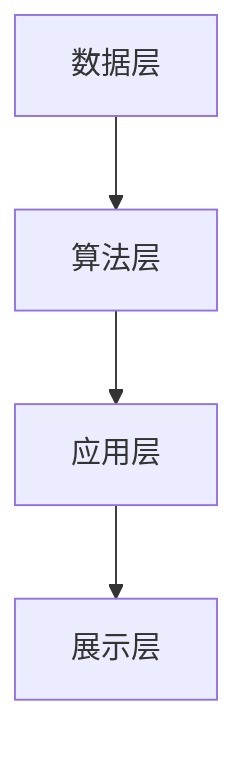
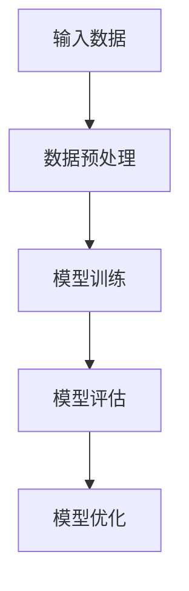
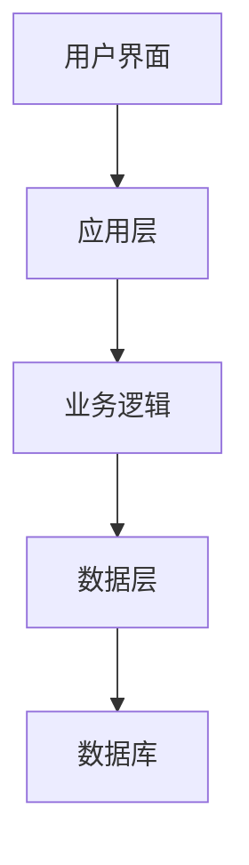
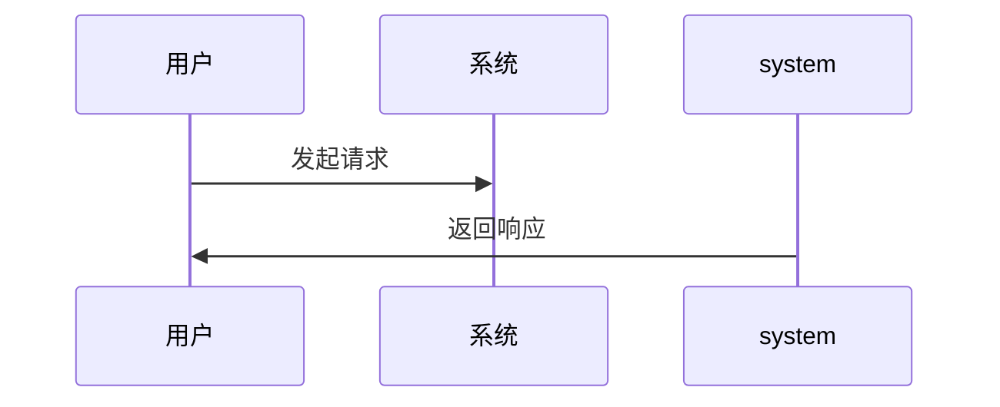

                 

## 企业数字助理：AI增强员工生产力

### 关键词：企业数字助理、AI、员工生产力、数字化转型、智能化应用

> 摘要：随着人工智能技术的迅猛发展，企业数字助理作为一种新型的智能工作助手，正逐渐改变着企业的运营模式和工作方式。本文将从背景介绍、核心概念解析、AI技术应用、原理分析、技术架构设计、部署实施、案例分析以及未来展望等方面，系统探讨企业数字助理如何通过AI技术增强员工生产力，推动企业实现数字化转型和智能化升级。

---

### 目录大纲

**1. 背景介绍与问题提出**  
    - **1.1 问题的提出**  
    - **1.2 数字化转型背景**  
    - **1.3 AI技术在企业中的应用现状**

**2. 企业数字助理的概念与定义**  
    - **2.1 企业数字助理的概念**  
    - **2.2 企业数字助理的核心要素**

**3. AI技术在企业中的应用**  
    - **3.1 自然语言处理（NLP）**  
    - **3.2 机器学习与深度学习**  
    - **3.3 计算机视觉**

**4. AI增强员工生产力的原理**  
    - **4.1 AI生产力的定义**  
    - **4.2 AI生产力模型**  
    - **4.3 AI生产力提升的方法**

**5. 构建企业数字助理的技术架构**  
    - **5.1 技术架构概述**  
    - **5.2 数据处理与存储**  
    - **5.3 模型训练与优化**

**6. 企业数字助理的部署与实施**  
    - **6.1 部署策略**  
    - **6.2 实施步骤**  
    - **6.3 遇到的问题及解决方案**

**7. 案例分析与最佳实践**  
    - **7.1 案例介绍**  
    - **7.2 最佳实践**  
    - **7.3 拓展与应用**

**8. 未来展望与挑战**  
    - **8.1 未来发展趋势**  
    - **8.2 技术挑战**  
    - **8.3 企业应对策略**

---

### 引言

在当今快速发展的数字经济时代，企业面临着前所未有的挑战和机遇。数字化转型已成为企业提升竞争力、增强市场适应能力的重要途径。人工智能（AI）技术的发展，为这一进程注入了新的动力。企业数字助理作为一种新兴的应用形态，通过AI技术赋能，正逐步成为企业智能化运营的得力助手。

企业数字助理，是指利用人工智能技术，模拟人类智能行为，帮助企业员工完成日常任务、提供决策支持、优化业务流程的智能系统。它不仅能够提高员工的工作效率，还能够为企业带来巨大的生产力和经济效益。本文将围绕企业数字助理的背景、定义、应用、原理、架构设计、部署实施、案例分析以及未来展望等方面，进行深入探讨，以期为企业在数字化转型和智能化升级过程中提供有益的参考和指导。

### 第1章：背景介绍与问题提出

#### 1.1 问题的提出

随着全球经济的不断发展，市场竞争日益激烈，企业面临的挑战也愈发严峻。传统的管理模式和业务流程已经无法满足企业快速响应市场变化的需求，企业迫切需要通过创新和改进来提升自身的竞争力。具体来说，企业面临以下问题：

1. **生产效率低下**：许多企业仍然依赖手工操作和传统的管理模式，导致工作效率低下，生产成本较高。
2. **人力资源不足**：随着业务规模的扩大，企业需要更多的人力资源来支持日常运营，但招聘和培训成本不断增加。
3. **决策支持不足**：企业在面对复杂的市场环境时，缺乏有效的决策支持系统，容易导致战略决策失误。
4. **业务流程复杂**：企业内部业务流程繁琐，跨部门协作不畅，影响整体运营效率。

#### 1.2 数字化转型背景

数字化转型是当前企业应对挑战、提升竞争力的重要手段。数字化转型不仅仅是技术的变革，更是一种商业模式和运营方式的转变。以下是数字化转型的一些背景信息：

1. **技术趋势**：大数据、云计算、物联网、人工智能等新兴技术迅速发展，为企业的数字化转型提供了强有力的技术支持。
2. **市场环境**：市场需求的变化和消费者行为的多样化，要求企业必须具备快速响应和灵活调整的能力。
3. **政策支持**：各国政府纷纷出台政策，鼓励企业进行数字化转型，以提升国家整体经济竞争力。

#### 1.3 AI技术在企业中的应用现状

人工智能技术在企业中的应用已经取得了显著的成果。以下是AI技术在企业中的一些应用现状：

1. **生产自动化**：通过机器人和自动化设备的应用，实现生产过程的自动化，提高生产效率。
2. **智能客服**：利用自然语言处理（NLP）技术，实现智能客服系统的建设，提升客户服务质量和效率。
3. **数据挖掘与分析**：通过数据挖掘和分析技术，帮助企业从海量数据中提取有价值的信息，支持决策制定。
4. **智能供应链管理**：利用人工智能技术优化供应链管理，提高供应链的灵活性和响应速度。

### 第2章：企业数字助理的概念与定义

#### 2.1 企业数字助理的概念

企业数字助理是一种基于人工智能技术的智能系统，它通过模拟人类智能行为，为企业的运营和管理提供支持。具体来说，企业数字助理具有以下特点：

1. **智能化**：企业数字助理能够自动执行任务，无需人工干预，提高工作效率。
2. **自主性**：企业数字助理具备一定的自主决策能力，可以根据业务需求和场景进行自适应调整。
3. **协作性**：企业数字助理能够与企业内部的各个系统进行无缝集成，支持跨部门协作。
4. **可扩展性**：企业数字助理可以随着业务的发展不断扩展功能，满足企业的长期需求。

#### 2.2 企业数字助理的核心要素

企业数字助理的核心要素包括以下几个方面：

1. **数据采集与处理**：企业数字助理需要从各种数据源中采集数据，并对数据进行清洗、转换和分析，以支持智能决策。
2. **自然语言处理（NLP）**：企业数字助理需要具备理解和生成自然语言的能力，以支持与员工的自然对话。
3. **机器学习与深度学习**：企业数字助理通过机器学习和深度学习技术，不断提升自身的智能水平，实现更准确的预测和决策。
4. **用户界面**：企业数字助理需要提供友好、直观的用户界面，以便员工能够方便地使用系统。

### 第3章：AI技术在企业中的应用

#### 3.1 自然语言处理（NLP）

自然语言处理（NLP）是人工智能技术的一个重要分支，它致力于使计算机能够理解、生成和处理人类自然语言。在企业中，NLP技术有广泛的应用，主要包括：

1. **智能客服**：通过NLP技术，企业数字助理可以自动处理客户咨询，提供实时、准确的答复。
2. **文本分析**：企业数字助理可以利用NLP技术对大量文本数据进行情感分析、主题检测等，为企业提供有价值的业务洞察。
3. **语音识别与转换**：企业数字助理可以将语音转换为文字，或将文字转换为语音，实现人与系统的自然交互。

#### 3.2 机器学习与深度学习

机器学习（ML）和深度学习（DL）是人工智能的核心技术，它们通过构建模型，从数据中自动学习，并用于解决实际问题。在企业中，机器学习和深度学习有广泛的应用，主要包括：

1. **预测分析**：企业数字助理可以利用机器学习技术进行销售预测、库存管理、风险预测等，帮助企业做出更准确的决策。
2. **图像识别**：企业数字助理可以利用深度学习技术进行图像识别，如产品分类、缺陷检测等，提高生产效率。
3. **个性化推荐**：企业数字助理可以根据用户的行为数据，利用机器学习算法进行个性化推荐，提升用户体验。

#### 3.3 计算机视觉

计算机视觉是人工智能的一个重要分支，它致力于使计算机能够像人类一样理解视觉信息。在企业中，计算机视觉技术有广泛的应用，主要包括：

1. **生产监控**：企业数字助理可以利用计算机视觉技术进行生产过程的实时监控，及时发现异常情况。
2. **安全监控**：企业数字助理可以利用计算机视觉技术进行安全监控，如人脸识别、行为分析等，保障企业安全。
3. **自动化配送**：企业数字助理可以利用计算机视觉技术进行自动化配送，如无人仓库、无人驾驶等。

### 第4章：AI增强员工生产力的原理

#### 4.1 AI生产力的定义

AI生产力是指通过人工智能技术提高生产效率、优化业务流程、降低运营成本等方面的能力。它不仅仅体现在生产效率的提升，还包括决策支持、资源优化等多个方面。

#### 4.2 AI生产力模型

AI生产力模型是一个用于描述和衡量AI对企业生产力提升效果的框架。该模型包括以下几个关键要素：

1. **数据质量**：数据质量是AI生产力模型的基础，高质量的数据能够为AI算法提供更准确的训练数据，从而提高预测和决策的准确性。
2. **算法能力**：算法能力是AI生产力模型的核心，先进的算法能够从数据中提取更多有价值的信息，提高生产力的提升效果。
3. **技术基础设施**：技术基础设施是AI生产力模型的支撑，包括计算能力、存储能力、网络传输能力等，这些基础设施的强大能够保证AI模型的高效运行。
4. **员工能力**：员工能力是AI生产力模型的重要组成部分，员工需要具备一定的技术能力和业务知识，以便能够充分利用AI技术为企业创造价值。

#### 4.3 AI生产力提升的方法

以下是几种常见的提升AI生产力方法：

1. **自动化流程**：通过自动化技术，减少人工干预，提高生产效率和准确度。
2. **数据挖掘与分析**：通过数据挖掘和分析技术，从海量数据中提取有价值的信息，支持决策制定。
3. **个性化推荐**：通过个性化推荐技术，提高用户体验，提升业务转化率。
4. **智能预测**：通过智能预测技术，提前预测市场趋势和需求变化，为企业制定更有效的战略。

### 第5章：构建企业数字助理的技术架构

#### 5.1 技术架构概述

企业数字助理的技术架构通常包括以下几个层次：

1. **数据层**：数据层是企业数字助理的基础，包括各种结构化和非结构化数据，如客户数据、产品数据、交易数据等。
2. **算法层**：算法层是企业数字助理的核心，包括各种机器学习算法、深度学习模型等，用于处理和分析数据。
3. **应用层**：应用层是企业数字助理的接口，包括各种应用功能，如智能客服、数据分析等。
4. **展示层**：展示层是企业数字助理的界面，包括各种图表、报表等，用于展示分析结果。

#### 5.2 数据处理与存储

数据处理与存储是企业数字助理技术架构的重要部分，主要包括以下几个环节：

1. **数据采集**：通过API接口、日志收集等方式，从各种数据源采集数据。
2. **数据清洗**：对采集到的数据进行清洗、去重、转换等处理，确保数据质量。
3. **数据存储**：将处理后的数据存储到数据库或数据仓库中，便于后续分析和处理。
4. **数据集成**：通过数据集成技术，将不同来源的数据进行整合，实现数据统一管理和分析。

#### 5.3 模型训练与优化

模型训练与优化是企业数字助理技术架构的关键环节，主要包括以下几个步骤：

1. **数据预处理**：对训练数据进行预处理，如数据归一化、缺失值处理等，提高模型训练效果。
2. **模型选择**：根据业务需求和数据特点，选择合适的机器学习算法和深度学习模型。
3. **模型训练**：使用训练数据进行模型训练，通过调整超参数和优化算法，提高模型性能。
4. **模型评估**：使用验证集对模型进行评估，选择性能最好的模型进行部署。
5. **模型优化**：根据业务需求和模型性能，对模型进行持续优化和调整。

### 第6章：企业数字助理的部署与实施

#### 6.1 部署策略

企业数字助理的部署策略需要根据企业的实际情况进行制定，主要包括以下几个步骤：

1. **需求分析**：明确企业数字助理的功能需求和性能要求，为后续部署提供指导。
2. **技术选型**：根据需求分析结果，选择合适的技术方案和工具，如数据库、计算框架等。
3. **资源规划**：根据技术选型结果，规划所需的硬件资源和软件资源，确保部署的可行性。
4. **测试与验证**：在部署前进行系统测试和验证，确保系统功能完整、性能稳定。
5. **部署实施**：按照部署策略和实施计划，进行系统部署和实施，确保系统顺利上线。

#### 6.2 实施步骤

企业数字助理的实施步骤通常包括以下几个阶段：

1. **项目启动**：明确项目目标、范围和时间表，组建项目团队，进行项目启动会议。
2. **需求分析**：与业务部门进行沟通，明确数字助理的功能需求和业务流程。
3. **系统设计**：根据需求分析结果，进行系统架构设计和技术方案选择。
4. **开发实施**：进行系统开发和功能实现，进行单元测试和集成测试。
5. **测试验收**：进行系统测试和用户验收，确保系统功能完整、性能稳定。
6. **上线部署**：进行系统上线和部署，进行系统监控和维护。

#### 6.3 遇到的问题及解决方案

在部署和实施企业数字助理的过程中，可能会遇到以下问题及解决方案：

1. **数据质量问题**：数据质量是数字助理性能的关键，需要采取数据清洗、去重、标准化等措施，提高数据质量。
2. **技术选型问题**：技术选型需要根据实际需求和预算进行，选择合适的工具和平台，避免因技术选型不当导致项目失败。
3. **资源调度问题**：资源调度是影响系统性能的重要因素，需要合理分配计算资源、存储资源等，确保系统高效运行。
4. **用户培训问题**：用户培训是系统成功的关键，需要制定详细的培训计划，确保用户能够熟练操作系统。

### 第7章：案例分析与最佳实践

#### 7.1 案例介绍

以下是几个企业数字助理的案例分析：

1. **案例分析一**：某大型零售企业通过引入企业数字助理，实现了销售预测、库存管理和客户服务的自动化，有效提高了生产效率和客户满意度。
2. **案例分析二**：某制造业企业通过引入企业数字助理，实现了生产过程的实时监控和设备维护的自动化，降低了设备故障率和生产成本。
3. **案例分析三**：某金融企业通过引入企业数字助理，实现了金融产品的智能推荐和风险控制，提升了客户体验和业务转化率。

#### 7.2 最佳实践

根据以上案例分析，可以总结出以下最佳实践：

1. **明确需求**：在引入企业数字助理之前，明确业务需求和功能要求，确保系统能够真正解决实际问题。
2. **技术选型**：根据业务需求和预算，选择合适的技术方案和工具，避免因技术选型不当导致项目失败。
3. **数据驱动**：充分利用企业内部的数据资源，进行数据分析和挖掘，为企业提供有价值的业务洞察。
4. **用户参与**：在系统开发和部署过程中，积极与用户进行沟通和反馈，确保系统能够满足用户需求。
5. **持续优化**：根据业务需求和用户反馈，对系统进行持续优化和改进，提升系统的性能和用户体验。

#### 7.3 拓展与应用

企业数字助理的应用范围广泛，以下是一些拓展和应用领域：

1. **智能客服**：通过自然语言处理技术，实现智能客服系统，提高客户服务效率和满意度。
2. **智能供应链管理**：通过人工智能技术，实现供应链的智能优化，提高供应链的灵活性和响应速度。
3. **智能人力资源管理**：通过人工智能技术，实现员工招聘、培训、绩效评估等环节的智能化管理，提高人力资源效率。
4. **智能营销**：通过大数据分析和机器学习技术，实现精准营销和用户行为预测，提升营销效果。

### 第8章：未来展望与挑战

#### 8.1 未来发展趋势

随着人工智能技术的不断发展，企业数字助理将在未来呈现出以下发展趋势：

1. **智能化水平提升**：企业数字助理的智能化水平将不断提高，能够更好地模拟人类智能行为，提供更加个性化的服务。
2. **跨行业应用**：企业数字助理将在更多行业得到应用，如金融、医疗、教育等，推动各行业的数字化转型和智能化升级。
3. **人机协同**：企业数字助理将更加注重与人类员工的协同工作，提高整体工作效率。
4. **可持续发展**：企业数字助理将在可持续发展方面发挥重要作用，如节能减排、环境保护等。

#### 8.2 技术挑战

在发展过程中，企业数字助理将面临以下技术挑战：

1. **数据安全与隐私**：随着数据的广泛应用，数据安全和隐私保护将成为重要问题，需要采取有效的数据安全措施。
2. **算法公正性与透明性**：算法的公正性和透明性将成为关注焦点，需要建立有效的算法评估和监管机制。
3. **技术人才短缺**：随着企业数字助理的广泛应用，对技术人才的需求将大幅增加，但当前技术人才供给不足，需要加大人才培养力度。
4. **技术适应性**：企业数字助理需要具备快速适应新技术、新业务的能力，以应对快速变化的市场环境。

#### 8.3 企业应对策略

为应对未来挑战，企业可以采取以下策略：

1. **加强数据安全与隐私保护**：建立健全的数据安全管理体系，加强数据加密、访问控制等技术措施。
2. **推动算法公正性与透明性**：建立算法评估和监管机制，提高算法的公正性和透明性。
3. **加大人才培养**：加大技术人才培养力度，通过内部培训、外部招聘等多种途径，提高技术人才储备。
4. **提升技术适应性**：加强技术创新和研发投入，提高企业数字助理的技术适应性，以适应快速变化的市场环境。

### 结束语

企业数字助理作为一种新兴的智能工作助手，正逐步成为企业数字化转型和智能化升级的重要推动力量。通过本文的探讨，我们了解了企业数字助理的背景、定义、应用、原理、架构设计、部署实施、案例分析以及未来展望等方面的内容。未来，随着人工智能技术的不断进步，企业数字助理将在更多领域发挥更大的作用，为企业的可持续发展注入新的动力。

### 作者信息

作者：AI天才研究院/AI Genius Institute & 禅与计算机程序设计艺术 /Zen And The Art of Computer Programming

---

### 附录

本文附录包含以下几个部分：

**附录A：核心概念术语说明**

- **企业数字助理**：基于人工智能技术的智能系统，模拟人类智能行为，为企业提供支持。
- **自然语言处理（NLP）**：使计算机能够理解、生成和处理人类自然语言的技术。
- **机器学习（ML）**：通过数据训练，使计算机能够从数据中学习并做出预测或决策的技术。
- **深度学习（DL）**：一种特殊的机器学习技术，通过构建深度神经网络，模拟人类大脑的学习过程。

**附录B：AI生产力的核心要素**

- **数据质量**：高质量的数据是AI生产力模型的基础。
- **算法能力**：先进的算法能够提高AI生产力的提升效果。
- **技术基础设施**：强大的技术基础设施能够保证AI模型的高效运行。
- **员工能力**：具备技术能力和业务知识的员工能够更好地利用AI技术。

**附录C：技术架构图示例**

**附录D：算法流程图示例**

**附录E：系统架构设计图示例**

**附录F：系统接口设计和交互图示例**

---

通过本文和附录的内容，读者可以全面了解企业数字助理的概念、原理和应用，为企业数字化转型的实施提供有益的参考。同时，附录中的技术架构图、算法流程图、系统架构设计图、系统接口设计和交互图等，也为读者提供了直观的技术细节展示。希望本文能为读者在探索企业数字助理领域的道路上提供有力的支持和启示。在未来的发展中，期待更多企业能够充分利用AI技术，打造出更加智能、高效的企业数字助理，推动企业实现可持续发展和智能化升级。作者：AI天才研究院/AI Genius Institute & 禅与计算机程序设计艺术/Zen And The Art of Computer Programming。

