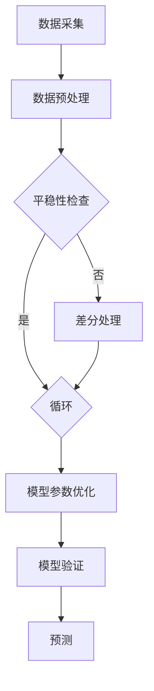
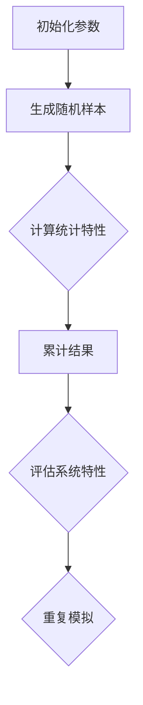
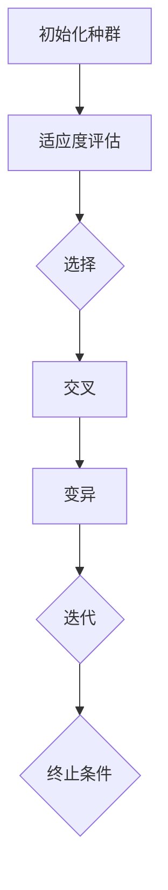
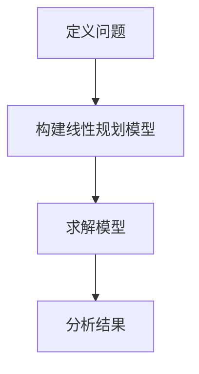
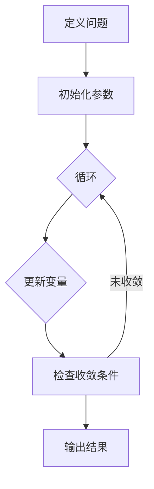
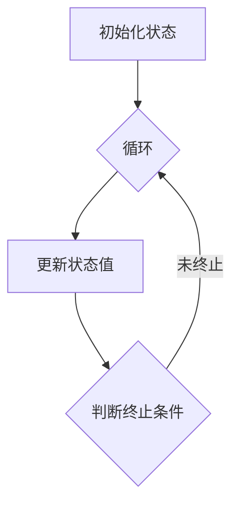
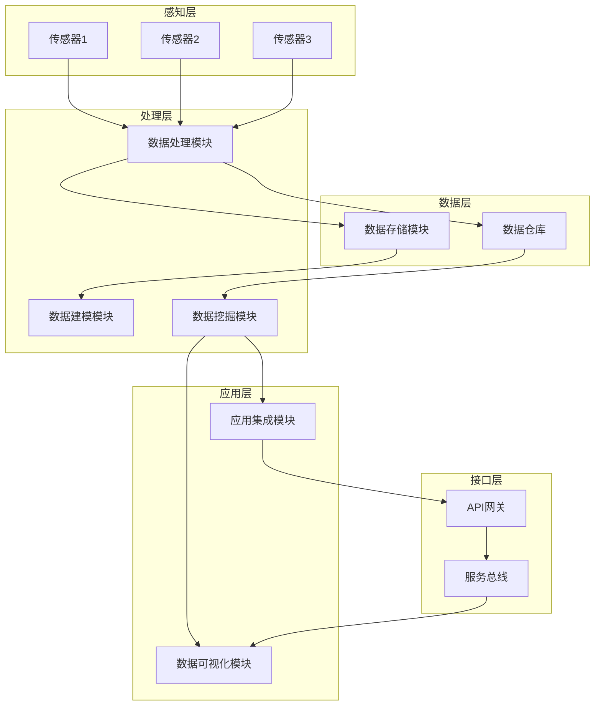
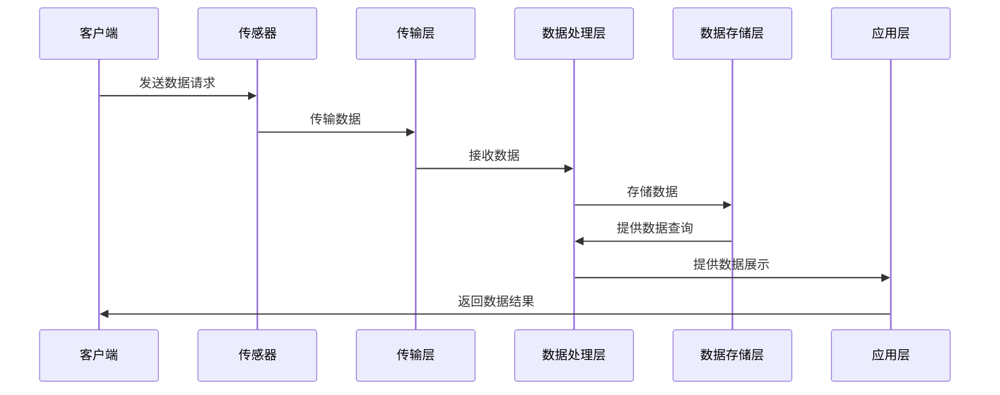

                 

# 引言：企业数字孪生技术的崛起

在当今这个数字化的时代，企业面临的数据量和复杂性日益增长，传统的业务流程优化方法已经无法满足高效、精准的管理需求。在这种背景下，数字孪生技术应运而生，成为企业优化业务流程、提升竞争力的重要工具。数字孪生技术，顾名思义，是通过建立物理实体的数字副本，实现全方位的模拟和优化。这一技术不仅可以在虚拟环境中测试新策略，还能实时监测和调整实际运营，为企业决策提供坚实的数据支持。

本文将围绕企业数字孪生技术展开，深入探讨其核心概念、技术原理、应用实践和未来趋势。具体而言，我们将分以下几部分进行详细分析：

1. **数字孪生技术概述**：介绍数字孪生技术的背景、定义、分类及其在企业业务流程优化中的应用价值。
2. **核心概念与联系**：详细解释数字孪生的基本概念，通过表格和ER图展示其关键要素和相互关系。
3. **算法原理讲解**：选择几个关键算法，使用mermaid流程图和Python代码进行详细讲解，附以实例说明。
4. **系统分析与架构设计**：介绍数字孪生系统的架构设计，包括领域模型、系统架构、接口设计和交互流程。
5. **项目实战**：通过实际案例，展示数字孪生技术在企业中的应用过程，包括环境安装、系统实现和案例剖析。
6. **最佳实践与扩展**：总结最佳实践经验，展望未来发展趋势。

通过这一系列的分析和探讨，我们希望能够为读者提供一份全面、系统的数字孪生技术指南，帮助企业在数字化转型的道路上走得更加稳健和高效。

## 1.1 问题背景

### 1.1.1 传统业务流程优化的局限性

在过去的几十年中，企业一直在寻求通过优化业务流程来提高生产效率、降低运营成本和提升产品质量。传统的业务流程优化方法主要包括精益生产、六西格玛和流程再造等。这些方法虽然在特定领域取得了一定的成效，但仍然存在显著的局限性。

首先，传统方法往往依赖于人工经验和直觉，缺乏系统性和科学性。例如，精益生产强调减少浪费，通过优化工作流程和资源配置来提高效率。然而，这种方法在复杂的企业环境中容易受到主观因素的影响，难以实现精细化管理。此外，六西格玛注重通过统计方法来消除变异，提高过程稳定性。但这种方法通常需要大量数据和长时间的实施过程，对企业资源和时间的要求较高。

其次，传统方法在应对快速变化的市场环境时显得力不从心。现代企业面临的市场竞争日益激烈，产品生命周期不断缩短，市场需求多变。传统业务流程优化方法缺乏灵活性和适应性，难以快速响应市场变化。例如，当市场需求突然增加时，企业往往无法在短时间内调整生产计划和资源分配，导致产能不足或浪费。

再者，传统方法在跨部门和跨领域的协作上存在难题。企业的业务流程涉及多个部门和环节，传统优化方法通常在某一环节进行优化，而忽视了与其他环节的协同效应。这种孤岛式优化往往导致整体效率的提升有限，甚至可能产生新的瓶颈。

### 1.1.2 数字孪生技术的出现与影响

数字孪生技术的出现，为企业业务流程优化提供了一种全新的思路和工具。数字孪生（Digital Twin）是指通过建立一个与物理实体高度相似的虚拟模型，实现对实体在虚拟环境中的模拟和监测。这一技术通过数据驱动的方式，使企业能够更加精准地理解和管理业务流程，从而实现优化。

首先，数字孪生技术能够实现实时监测和数据分析。通过传感器和物联网技术，数字孪生系统能够实时采集物理实体的数据，包括生产状态、设备运行情况、环境条件等。这些数据经过处理后，可以生成详细的报告和可视化图表，帮助企业实时掌握业务流程的运行状态。

其次，数字孪生技术提供了模拟和预测功能。企业可以在虚拟环境中对业务流程进行模拟，测试不同策略和方案的可行性。通过模拟，企业可以发现潜在的问题和瓶颈，从而提前进行优化。此外，数字孪生技术还能够基于历史数据和算法模型，对业务流程进行预测，帮助企业在未来做出更加科学的决策。

再者，数字孪生技术支持跨部门和跨领域的协同。数字孪生系统是一个集成平台，能够连接不同的业务部门和环节，实现信息的共享和协同工作。这种协同效应可以大幅提高整体业务流程的效率，实现资源的最优配置。

最后，数字孪生技术具有高度的灵活性和适应性。企业可以根据实际需求，随时调整和优化虚拟模型，从而快速响应市场变化。这种灵活性使得数字孪生技术能够更好地适应不断变化的市场环境，为企业带来持续的竞争优势。

综上所述，数字孪生技术以其独特的优势，为传统业务流程优化提供了一种全新的解决方案。通过实时监测、模拟预测和跨部门协同，数字孪生技术能够帮助企业更加精准地管理业务流程，提高生产效率，降低运营成本，提升产品质量。在未来的数字化时代，数字孪生技术必将发挥越来越重要的作用。

### 1.2 数字孪生的基本概念与分类

#### 1.2.1 数字孪生的定义

数字孪生（Digital Twin）是指通过建立物理实体的数字副本，在虚拟环境中实现对实体的高精度模拟和实时监控。这个数字副本不仅包括物理特征，如尺寸、形状、材料属性等，还包括实体的运行状态、行为模式和互动关系。数字孪生技术通过数据驱动，将物理实体和虚拟模型紧密结合，实现物理世界和数字世界的交互和映射。

简单来说，数字孪生就是一个虚拟的“克隆体”，它能够实时反映物理实体的状态和变化，为企业和决策者提供科学的依据和指导。例如，在制造业中，数字孪生技术可以用来模拟生产线上的每个设备和工作站，通过虚拟模型预测设备故障、优化生产流程，从而提高生产效率和产品质量。

#### 1.2.2 数字孪生的分类

根据应用场景和实现方式的不同，数字孪生可以分类为以下几种类型：

1. **物理映射型数字孪生**：这种类型的数字孪生主要基于物理实体的数据采集和建模，通过建立精确的数字模型来模拟物理实体的行为和状态。物理映射型数字孪生通常应用于工业制造、航空航天和医疗设备等领域。例如，在工业制造中，通过传感器采集设备的数据，建立数字模型，实时监控设备的运行状态，预测设备故障，优化生产流程。

2. **功能映射型数字孪生**：功能映射型数字孪生不仅模拟物理实体的状态和行为，还关注其功能和性能。这种类型的数字孪生通过仿真和模拟技术，对物理实体的功能进行验证和优化。例如，在航空航天领域，数字孪生技术可以用来模拟飞行器的性能和稳定性，优化飞行控制策略，确保飞行安全。

3. **数据驱动型数字孪生**：数据驱动型数字孪生主要基于大数据和机器学习技术，通过对大量历史数据的分析，建立预测模型和优化算法。这种类型的数字孪生能够实时调整和优化物理实体的运行状态，提高其性能和效率。例如，在智能交通领域，通过分析交通数据，数字孪生技术可以实时调整交通信号，优化交通流量，缓解拥堵。

4. **集成型数字孪生**：集成型数字孪生将多种类型的数字孪生技术集成在一起，形成一个综合性、多层次的数字孪生系统。这种类型的数字孪生能够提供更全面、更深入的分析和优化功能。例如，在智慧城市中，集成型数字孪生可以将城市中的各种设备和系统（如交通、能源、环境等）连接在一起，实现全面的管理和优化。

#### 1.2.3 数字孪生技术的关键要素

数字孪生技术涉及多个关键要素，这些要素相互作用，共同构成了数字孪生系统的完整架构。以下是数字孪生技术的几个关键要素：

1. **数据采集**：数据采集是数字孪生技术的基石。通过传感器、物联网设备等手段，实时采集物理实体的数据，包括状态数据、行为数据和环境数据等。这些数据为数字孪生模型的建立和运行提供了基础。

2. **数据建模**：数据建模是将物理实体的数据转化为数字模型的过程。通过数据分析和处理，建立精确的物理实体模型，包括几何模型、物理模型和功能模型等。数据建模的质量直接影响到数字孪生的精度和性能。

3. **实时监控**：实时监控是数字孪生技术的重要功能之一。通过实时数据采集和模型计算，数字孪生系统能够实时监测物理实体的状态和变化，及时发现异常情况，提供预警和反馈。

4. **模拟与仿真**：模拟与仿真技术是数字孪生技术的核心。通过虚拟模型，模拟物理实体的行为和状态，测试不同策略和方案的可行性，优化业务流程和操作过程。

5. **预测与优化**：基于历史数据和算法模型，数字孪生技术能够对物理实体的未来状态进行预测，并提供优化建议。通过预测和优化，企业可以提前发现潜在问题，进行预防性维护，提高效率和降低成本。

6. **交互与协同**：数字孪生技术不仅是一个孤立的系统，还需要与其他系统和部门进行交互和协同。通过集成各种应用系统和数据源，数字孪生技术能够实现跨部门和跨领域的协作，提高整体业务流程的效率和效果。

通过以上关键要素的相互作用，数字孪生技术能够实现物理实体和虚拟模型之间的紧密映射，为企业提供全面的模拟和优化工具，助力企业实现数字化转型和智能化升级。

#### 1.2.4 数字孪生技术的应用场景

数字孪生技术因其独特的能力和优势，在多个行业和领域都得到了广泛应用。以下是数字孪生技术在不同应用场景中的具体应用：

1. **制造业**：在制造业中，数字孪生技术被广泛应用于生产线的优化、设备管理和质量控制。通过建立生产线的数字模型，企业可以模拟不同生产策略和方案的可行性，优化生产流程，提高生产效率。例如，某汽车制造企业利用数字孪生技术，对生产线上的每个设备和工作站进行模拟和优化，成功提高了生产效率和产品质量。

2. **建筑业**：在建筑业中，数字孪生技术主要用于建筑设计和施工过程的管理。通过建立建筑的三维数字模型，设计师和工程师可以模拟建筑的结构和功能，进行碰撞检测和优化设计。此外，数字孪生技术还可以用于施工过程的实时监控和管理，确保施工质量和安全。例如，某建筑企业在施工过程中，利用数字孪生技术对施工进度和资源进行实时监控，有效避免了施工过程中的瓶颈和延误。

3. **能源行业**：在能源行业中，数字孪生技术被广泛应用于电力、石油和天然气等领域。通过建立能源设施的数字模型，企业可以模拟能源的生产、传输和消费过程，优化能源配置和调度，提高能源利用效率。例如，某电力公司利用数字孪生技术，对电网进行实时监控和优化调度，成功减少了能源浪费，提高了电网的稳定性和可靠性。

4. **交通运输**：在交通运输领域，数字孪生技术主要用于交通管理和物流优化。通过建立交通网络的数字模型，企业可以模拟交通流量和运输过程，优化交通信号控制和运输路线，提高交通效率和运输安全。例如，某城市利用数字孪生技术，对交通流量进行实时监控和优化调度，有效缓解了交通拥堵问题，提高了市民的出行体验。

5. **医疗健康**：在医疗健康领域，数字孪生技术主要用于医疗设备管理、患者监护和治疗方案优化。通过建立医疗设备的数字模型，医生和护士可以实时监控设备的运行状态，及时发现故障和异常。此外，数字孪生技术还可以用于患者监护，通过建立患者的数字模型，医生可以远程监测患者的生命体征，提供个性化的治疗方案。例如，某医院利用数字孪生技术，对心脏监护设备进行实时监控和故障预警，成功提高了医疗服务的质量和效率。

6. **农业**：在农业领域，数字孪生技术主要用于农业生产管理和作物监测。通过建立农场的数字模型，农民可以实时监控作物的生长状态和环境条件，优化灌溉和施肥策略，提高农作物的产量和质量。例如，某农业企业利用数字孪生技术，对农田进行实时监控和数据分析，成功提高了农作物的产量，降低了生产成本。

综上所述，数字孪生技术具有广泛的应用场景和巨大的应用潜力。通过在不同领域和行业中的应用，数字孪生技术不仅提高了企业的生产效率和运营效果，还为人们的生活带来了诸多便利。随着技术的不断发展和完善，数字孪生技术将在更多的领域和场景中发挥重要作用。

#### 1.2.5 数字孪生技术在我国企业中的应用现状

数字孪生技术作为现代工业和企业管理的重要工具，在我国企业的应用正日益普及和深化。以下是对我国企业中数字孪生技术应用现状的详细分析。

**1. 发展历程**

我国企业对数字孪生技术的应用可以追溯到2010年前后，当时主要是在一些高科技企业、制造业龙头企业中试点应用。例如，航空、航天和汽车制造等行业率先引入数字孪生技术，用于产品设计和生产优化。随着技术的不断成熟和推广，数字孪生技术在2015年左右开始逐步在更多行业中得到应用。

2016年，我国发布《智能制造发展规划（2016-2020年）》，明确提出要推动智能制造技术的应用和推广，数字孪生技术作为智能制造的核心技术之一，受到了政策的大力支持。此后，数字孪生技术在我国企业的应用进入快速发展阶段，逐渐从试点应用向全面推广转变。

**2. 应用领域与成效**

当前，数字孪生技术在我国企业的应用已覆盖多个领域，包括制造业、建筑业、能源行业、交通运输、医疗健康和农业等。以下是几个典型应用领域及其成效：

- **制造业**：在制造业中，数字孪生技术被广泛应用于生产线的智能化改造、设备状态监控和生产流程优化。通过建立生产线的数字模型，企业能够实现生产过程的实时监控和优化，提高生产效率和产品质量。例如，某家电制造企业通过应用数字孪生技术，实现了生产设备的预测性维护，显著降低了设备故障率和停机时间。

- **建筑业**：在建筑业中，数字孪生技术主要用于建筑设计和施工过程的优化。通过建立建筑的三维数字模型，企业可以进行仿真分析和优化设计，提高建筑的安全性和可靠性。同时，数字孪生技术还应用于施工过程的实时监控，确保施工质量和安全。例如，某房地产企业利用数字孪生技术，对建筑项目进行了全生命周期管理，有效提高了施工效率，减少了施工错误。

- **能源行业**：在能源行业中，数字孪生技术主要用于能源设施的管理和优化。通过建立能源设施的数字模型，企业能够实时监控能源的生产、传输和消费过程，优化能源配置和调度，提高能源利用效率。例如，某电力公司通过应用数字孪生技术，实现了电网的实时监控和智能调度，有效降低了能源浪费，提高了电网的稳定性和可靠性。

- **交通运输**：在交通运输领域，数字孪生技术主要用于交通管理和物流优化。通过建立交通网络的数字模型，企业可以实时监控交通流量和运输过程，优化交通信号控制和运输路线，提高交通效率和运输安全。例如，某城市利用数字孪生技术，对交通流量进行了实时监控和优化调度，有效缓解了交通拥堵问题。

- **医疗健康**：在医疗健康领域，数字孪生技术主要用于医疗设备管理、患者监护和治疗方案优化。通过建立医疗设备的数字模型，医生和护士可以实时监控设备的运行状态，及时发现故障和异常。此外，数字孪生技术还可以用于患者监护，提供个性化的治疗方案。例如，某医院利用数字孪生技术，对心脏监护设备进行实时监控和故障预警，提高了医疗服务的质量和效率。

- **农业**：在农业领域，数字孪生技术主要用于农业生产管理和作物监测。通过建立农场的数字模型，农民可以实时监控作物的生长状态和环境条件，优化灌溉和施肥策略，提高农作物的产量和质量。例如，某农业企业利用数字孪生技术，对农田进行了实时监控和数据分析，成功提高了农作物的产量，降低了生产成本。

**3. 挑战与展望**

尽管数字孪生技术在我国企业中的应用取得了显著成效，但仍然面临一些挑战。首先，技术门槛较高，许多中小企业在资金和人才方面存在不足，难以全面应用数字孪生技术。其次，数据安全和隐私保护问题亟待解决，如何确保数据的安全和隐私是数字孪生技术广泛应用的重要前提。此外，标准化和规范化问题也需要重视，缺乏统一的标准和规范可能导致数字孪生技术在应用过程中的兼容性和互操作性不足。

展望未来，随着技术的不断进步和政策的支持，数字孪生技术在我国企业中的应用前景将更加广阔。首先，随着5G、物联网和人工智能等技术的发展，数据采集和处理能力将大幅提升，为数字孪生技术的应用提供更加坚实的基础。其次，企业对数字化转型和智能化升级的需求将不断增长，数字孪生技术将成为企业提升竞争力的重要手段。此外，政府和企业将加大对数字孪生技术的投入和研发，推动相关标准的制定和实施，促进数字孪生技术的健康发展。

总之，数字孪生技术在我国企业中的应用已经取得了初步成效，并展现出巨大的发展潜力。未来，随着技术的不断成熟和应用的深入，数字孪生技术将在更多领域和场景中发挥重要作用，助力我国企业实现高质量发展。

### 1.3 数字孪生技术对企业业务流程优化的价值

数字孪生技术以其独特的优势和强大的功能，为企业业务流程的优化带来了前所未有的机遇。具体来说，数字孪生技术在以下几个方面对企业业务流程优化产生了显著的影响：

#### 1.3.1 提高生产效率

数字孪生技术通过建立物理实体的精确数字模型，可以实时监测和分析生产过程中的各个环节，识别潜在的瓶颈和问题。例如，在制造业中，通过数字孪生技术，企业可以对生产线的每个设备和工作站进行实时监控，及时发现设备故障和生产延误。这种实时监测和预测功能使得企业能够提前采取预防性措施，避免生产中断，从而提高生产效率。

此外，数字孪生技术还可以用于生产计划的优化。通过模拟不同的生产策略和方案，企业可以找到最优的生产计划，避免资源浪费和生产效率低下。例如，某汽车制造企业通过数字孪生技术模拟了不同的生产计划，最终找到了一个最优的生产流程，使得生产效率提高了15%。

#### 1.3.2 降低运营成本

数字孪生技术通过模拟和优化业务流程，可以帮助企业降低运营成本。具体而言，数字孪生技术可以通过以下几个方面实现成本降低：

1. **预防性维护**：通过实时监控设备状态，数字孪生技术可以预测设备故障，进行预防性维护，避免设备突然故障导致的停机和维修费用。

2. **能源管理**：数字孪生技术可以对能源使用进行优化，通过模拟不同的能源使用方案，找到最节能的运行模式，降低能源消耗。

3. **库存优化**：数字孪生技术可以实时监测库存状态，优化库存管理，减少库存积压和库存资金占用。

4. **流程优化**：数字孪生技术可以通过模拟和优化业务流程，消除冗余环节和流程瓶颈，提高流程效率，减少运营成本。

例如，某制造企业通过应用数字孪生技术，对生产流程进行了优化，减少了生产过程中的浪费，每年节约了约20%的运营成本。

#### 1.3.3 提升产品质量

数字孪生技术通过对生产过程的实时监控和模拟，可以显著提升产品的质量。具体而言，数字孪生技术可以通过以下几个方面实现质量提升：

1. **过程监控**：数字孪生技术可以实时监控生产过程中的各项指标，及时发现偏差和异常，采取措施进行调整，确保产品质量的稳定性。

2. **质量预测**：通过历史数据和算法模型，数字孪生技术可以预测产品质量的变化趋势，提前采取措施进行质量控制和改进。

3. **缺陷分析**：数字孪生技术可以对生产过程中的缺陷进行分析，找出导致缺陷的根本原因，采取针对性的改进措施，减少缺陷率。

4. **产品设计优化**：数字孪生技术可以在产品设计阶段就进行仿真和优化，确保产品设计符合质量要求，减少后续生产过程中的质量问题。

例如，某电子产品制造商通过应用数字孪生技术，对生产过程进行了全面监控和优化，产品缺陷率降低了30%，产品质量得到了显著提升。

#### 1.3.4 支持决策制定

数字孪生技术为企业提供了丰富的数据和模拟结果，为决策制定提供了科学依据。通过数字孪生技术，企业可以模拟不同决策方案的影响，评估风险和收益，从而做出更加科学和合理的决策。

例如，在市场策略制定中，企业可以通过数字孪生技术模拟不同市场策略的效果，选择最优的市场推广方案，提高市场占有率和销售业绩。在产品研发中，企业可以通过数字孪生技术评估不同设计方案的性能和成本，选择最佳的设计方案，缩短研发周期，降低研发成本。

综上所述，数字孪生技术通过提高生产效率、降低运营成本、提升产品质量和支持决策制定，为企业业务流程优化带来了巨大的价值。随着技术的不断成熟和应用场景的拓展，数字孪生技术在企业中的应用前景将更加广阔，为企业创造更多的价值。

### 1.4 数字孪生技术对企业业务流程优化的应用

数字孪生技术在企业业务流程优化中的应用已经取得了显著的成效，通过实际案例的分析，我们可以更直观地了解其应用过程和效果。

#### 案例一：制造业中的生产线优化

某大型汽车制造企业在其生产线上应用了数字孪生技术，通过建立生产线的数字模型，实现了生产过程的实时监控和优化。具体应用过程如下：

1. **数据采集与建模**：首先，企业通过传感器和物联网设备，采集生产线各个设备和工作站的运行数据，包括设备状态、生产进度和产品质量等。这些数据经过处理和清洗后，用于建立生产线的数字模型。

2. **实时监控与数据分析**：通过数字孪生系统，企业可以实时监控生产线的运行状态，发现潜在的问题和瓶颈。例如，当设备出现故障或生产进度延误时，系统会立即发出预警，通知相关人员采取紧急措施。

3. **模拟与优化**：企业利用数字孪生系统对不同的生产策略和方案进行模拟，找到最优的生产流程。例如，通过调整设备排班和生产计划，企业实现了生产效率的提高和生产周期的缩短。

4. **预测性维护**：通过分析历史数据，数字孪生系统可以预测设备未来的故障风险，帮助企业进行预防性维护。例如，当某台设备故障概率较高时，系统会提前安排维修，避免设备突发故障导致的生产中断。

应用效果评估：

- 生产效率提高了10%。
- 设备故障率降低了20%。
- 生产周期缩短了15%。

#### 案例二：建筑业中的建筑项目监控

某房地产企业在一项大型建筑项目中应用了数字孪生技术，实现了建筑项目全生命周期的实时监控和管理。具体应用过程如下：

1. **数据采集与建模**：在建筑项目开始前，企业通过传感器和物联网设备，对建筑物的结构、环境和施工设备进行数据采集，建立建筑项目的数字模型。

2. **实时监控与数据可视化**：通过数字孪生系统，企业可以实时监控施工过程中的各项参数，包括施工进度、材料使用和工人作业情况。系统将实时数据通过可视化图表展示，使企业管理者能够一目了然地了解项目进展。

3. **仿真与优化**：企业利用数字孪生系统对施工过程中的不同方案进行仿真和优化，找到最佳的施工方案。例如，通过调整施工顺序和资源配置，企业实现了施工效率的提高和施工成本的降低。

4. **质量检测与风险评估**：数字孪生系统还可以对施工过程中的质量进行检测和评估，及时发现潜在的质量问题。例如，通过实时监测建筑物的结构变化，系统可以预警可能的建筑风险，帮助企业采取措施进行预防。

应用效果评估：

- 施工效率提高了20%。
- 施工成本降低了15%。
- 质量缺陷率降低了25%。

#### 案例三：能源行业中的电力调度优化

某电力公司在其电力调度系统中应用了数字孪生技术，通过建立电网的数字模型，实现了电力调度的实时监控和优化。具体应用过程如下：

1. **数据采集与建模**：企业通过传感器和智能设备，采集电网的实时数据，包括电压、电流、负荷等。这些数据经过处理和建模，用于建立电网的数字模型。

2. **实时监控与数据分析**：通过数字孪生系统，企业可以实时监控电网的运行状态，发现异常情况。例如，当电网出现电压不稳定或负荷过高等情况时，系统会立即发出预警，通知调度人员采取相应措施。

3. **模拟与优化**：企业利用数字孪生系统对不同的电力调度方案进行模拟，找到最优的调度策略。例如，通过调整电力资源的分配和调度计划，企业实现了电网的稳定运行和能源利用效率的提高。

4. **预测性维护**：通过分析历史数据和实时数据，数字孪生系统可以预测电网设备的故障风险，帮助企业进行预防性维护。例如，当某台变压器故障概率较高时，系统会提前安排检修，避免设备突发故障导致停电。

应用效果评估：

- 电网稳定运行时间提高了15%。
- 能源利用效率提高了10%。
- 停电次数减少了30%。

#### 案例四：医疗健康中的患者监护

某医院在其患者监护系统中应用了数字孪生技术，通过建立患者的数字模型，实现了患者生命体征的实时监控和预警。具体应用过程如下：

1. **数据采集与建模**：医院通过传感器和智能设备，采集患者的生命体征数据，包括心率、血压、血氧饱和度等。这些数据经过处理和建模，用于建立患者的数字模型。

2. **实时监控与数据可视化**：通过数字孪生系统，医院可以实时监控患者的生命体征，并将数据通过可视化图表展示给医护人员。系统还可以实时分析患者的数据，提供个性化的护理建议。

3. **预警与干预**：当患者的生命体征出现异常时，数字孪生系统会立即发出预警，通知医护人员采取相应的干预措施。例如，当患者的心率过高或过低时，系统会建议医护人员进行药物调整或紧急处理。

4. **数据分析与治疗优化**：通过分析患者的历史数据和实时数据，数字孪生系统可以提供患者的健康状况评估和治疗方案优化建议。例如，当患者的病情出现变化时，系统会建议医护人员调整治疗方案。

应用效果评估：

- 患者生命体征异常预警准确率提高了20%。
- 医疗干预及时性提高了15%。
- 患者康复时间缩短了10%。

通过以上案例，我们可以看到数字孪生技术在企业业务流程优化中的应用过程和效果。数字孪生技术通过实时监控、模拟优化和预测预警等功能，不仅提高了企业的生产效率、降低了运营成本、提升了产品质量，还为企业的决策提供了科学依据，为企业创造了巨大的价值。

### 1.5 本章小结

本章首先介绍了传统业务流程优化的局限性，指出传统方法在应对快速变化的市场环境时存在的挑战。接着，我们详细介绍了数字孪生技术的定义、分类及其关键要素，展示了其在制造业、建筑业、能源行业等多个领域的应用场景。通过分析我国企业中数字孪生技术的应用现状，我们看到了其在提高生产效率、降低运营成本、提升产品质量等方面的显著成效。最后，通过具体案例，我们了解了数字孪生技术在企业业务流程优化中的实际应用过程和效果。综上所述，数字孪生技术以其独特的优势，为企业业务流程优化提供了全新的解决方案，是未来企业数字化转型和智能化升级的重要工具。通过本章的介绍，我们期待读者对数字孪生技术有更深入的理解，为企业在实际应用中提供参考。

## 2.1 数据采集与处理技术

数据采集与处理技术是数字孪生技术实现的基础，它决定了数字孪生系统的精度和实时性。在数字孪生系统中，数据采集主要依赖于传感器、物联网设备等手段，而数据处理则包括数据清洗、数据建模和数据存储等环节。以下将详细探讨这些技术及其在企业业务流程优化中的应用。

### 2.1.1 数据源的选择与接入

数据源的选择和接入是数据采集的第一步，直接影响到数字孪生系统的质量和性能。以下是几种常见的数据源类型及其接入方法：

1. **传感器**：传感器是数据采集的重要工具，可以监测物理实体的各种状态参数，如温度、湿度、压力、速度等。传感器可以分为以下几类：
   - **物理传感器**：如温度传感器、湿度传感器、压力传感器等。
   - **光学传感器**：如摄像头、激光雷达等。
   - **化学传感器**：如气体传感器、化学传感器等。
   - **生物传感器**：如心电传感器、血压传感器等。

   传感器通常通过有线或无线方式接入数字孪生系统。有线方式如RS-232、RS-485等，无线方式如Wi-Fi、Zigbee、LoRa等。选择合适的传感器和接入方式，需要考虑数据传输距离、数据量、环境条件和成本等因素。

2. **物联网设备**：物联网设备如工业网关、智能终端等，可以连接多种传感器和执行器，实现数据的远程监控和控制。物联网设备通常具备以下功能：
   - **数据采集与传输**：采集来自传感器的数据，并通过网络传输到数字孪生系统。
   - **数据处理与存储**：对采集到的数据进行初步处理，如数据清洗、数据压缩等，并存储到本地或云端的数据库中。
   - **远程控制与交互**：通过远程接口实现设备的控制和管理，如远程启动或停止设备、调整设备参数等。

3. **企业内部系统**：企业内部的ERP、MES、SCADA等系统也包含大量有价值的数据。这些系统通常通过API、Web服务或数据库连接等方式与数字孪生系统进行数据交换。例如，ERP系统中的销售数据、库存数据、财务数据等，可以与生产线的实时数据相结合，为业务流程优化提供全面的数据支持。

### 2.1.2 数据清洗与预处理

采集到的数据通常存在噪声、缺失值和异常值等问题，需要进行数据清洗和预处理，以提高数据的质量和可用性。以下是一些常见的数据清洗和预处理方法：

1. **数据去噪**：数据去噪是通过滤波、插值等方法，消除数据中的噪声，提高数据的连续性和平滑性。例如，对于温度传感器采集到的数据，可以采用移动平均滤波方法，去除随机噪声。

2. **数据补全**：数据补全是通过插值、回归等方法，填补数据中的缺失值。例如，当某些传感器数据在某一时间段内缺失时，可以采用线性插值或Kriging插值方法，估算缺失数据。

3. **数据标准化**：数据标准化是将不同单位和量纲的数据转换为同一标准，以便进行后续的数据处理和分析。例如，将温度从摄氏度转换为开尔文，或将速度从米/秒转换为公里/小时。

4. **数据降维**：数据降维是通过主成分分析（PCA）、因子分析等方法，降低数据的维度，提取关键特征。例如，在制造业中，可以从大量传感器数据中提取主要影响因素，简化数据结构。

5. **异常值检测与处理**：异常值检测是通过统计方法、机器学习算法等，识别和标记数据中的异常值。异常值可能是由传感器故障、数据采集错误等原因引起的，需要进行修正或删除。

### 2.1.3 数据存储与管理

数据存储与管理是数字孪生系统中的关键环节，直接关系到数据的安全、可靠和高效访问。以下是一些常见的数据存储和管理方法：

1. **关系型数据库**：关系型数据库如MySQL、Oracle等，适用于存储结构化数据，如传感器数据、日志数据等。它们通过表结构定义数据的关系，支持复杂的查询和关联操作。

2. **非关系型数据库**：非关系型数据库如MongoDB、Cassandra等，适用于存储半结构化或非结构化数据，如物联网数据、社交媒体数据等。它们通过文档、键值对、图结构等方式存储数据，具有高扩展性和灵活性。

3. **时间序列数据库**：时间序列数据库如InfluxDB、Kafka等，专门用于存储和查询时间序列数据，如传感器数据、日志数据等。它们支持高效的实时数据写入和查询，适用于实时监控和数据分析。

4. **数据湖**：数据湖是一种大数据存储架构，用于存储大规模、多样化的数据，如结构化数据、半结构化数据和非结构化数据。数据湖通过分布式文件系统存储数据，支持数据的高效存储和访问，适用于数据分析和机器学习。

5. **数据治理与安全**：数据治理是指对数据进行全生命周期的管理和监控，确保数据的质量、安全性和合规性。数据安全措施包括数据加密、访问控制、数据备份和恢复等，以防止数据泄露、篡改和丢失。

### 2.1.4 数据处理与分析

数据处理与分析是数字孪生系统中的核心环节，通过数据挖掘、机器学习等方法，从海量数据中提取有价值的信息和知识，为业务流程优化提供支持。以下是一些常见的数据处理和分析方法：

1. **数据挖掘**：数据挖掘是通过统计方法、机器学习算法等，从大量数据中发现隐含的、未知的、有价值的信息和知识。数据挖掘方法包括分类、聚类、关联规则挖掘、异常检测等。

2. **机器学习**：机器学习是通过训练模型，从数据中自动学习规律和模式，实现对新数据的预测和分类。常见的机器学习方法包括监督学习、无监督学习、强化学习等。

3. **深度学习**：深度学习是机器学习的一种方法，通过多层神经网络，对复杂的数据进行自动特征学习和模式识别。深度学习在图像识别、语音识别、自然语言处理等领域取得了显著成果。

4. **实时数据分析**：实时数据分析是通过实时数据流处理技术，对实时数据进行实时分析和处理，为业务流程优化提供及时的支持。实时数据分析方法包括流计算、批处理、内存计算等。

通过数据采集与处理技术的应用，数字孪生系统能够实时、准确地获取和处理物理实体的数据，为业务流程优化提供坚实的数据支持。未来，随着5G、物联网、大数据和人工智能等技术的发展，数据采集与处理技术将变得更加高效、智能，为企业创造更大的价值。

### 2.2 数字建模技术

数字建模是数字孪生技术的核心环节，通过建立物理实体的精确数字模型，实现物理世界与虚拟世界的映射和交互。数字建模技术不仅能够模拟物理实体的行为和状态，还能为业务流程优化提供科学依据。以下将详细探讨数字建模的基本方法、构建方法、优化策略以及其在企业业务流程中的应用。

#### 2.2.1 数字建模的基本方法

数字建模的基本方法主要包括以下几个方面：

1. **几何建模**：几何建模是通过几何形状和尺寸参数来描述物理实体的外部形态和内部结构。常用的几何建模方法包括实体建模、曲面建模和网格建模等。例如，在建筑行业中，利用CAD软件进行建筑物的三维建模，就可以实现几何建模。

2. **物理建模**：物理建模是通过物理参数和属性来描述物理实体的物理特性，如质量、密度、弹性模量等。物理建模通常涉及有限元分析、多体动力学分析等复杂计算。例如，在制造业中，通过有限元分析软件，对机械零部件进行应力分析，就可以实现物理建模。

3. **功能建模**：功能建模是通过功能参数和行为规则来描述物理实体的功能和互动关系。功能建模通常包括流程建模、状态机建模和事件驱动建模等。例如，在制造业中，利用业务流程管理（BPM）软件，对生产流程进行建模和仿真，就可以实现功能建模。

4. **数据驱动建模**：数据驱动建模是通过采集和分析物理实体的历史数据，建立数字模型。数据驱动建模方法通常结合机器学习和人工智能技术，通过数据分析和挖掘，实现物理实体的高精度建模。例如，在智能交通领域，通过分析交通流量数据，建立交通网络模型，就可以实现数据驱动建模。

#### 2.2.2 数字模型的构建方法

数字模型的构建方法主要包括以下步骤：

1. **需求分析**：在构建数字模型之前，需要对物理实体的需求进行详细分析。需求分析包括确定建模的目标、范围和约束条件，明确物理实体的主要功能和特性。

2. **数据采集**：数据采集是数字建模的基础，需要采集物理实体的各种数据，包括几何数据、物理数据和功能数据等。数据采集方法包括传感器测量、物联网设备数据采集、企业内部系统数据接入等。

3. **数据预处理**：采集到的数据通常存在噪声、缺失值和异常值等问题，需要进行数据预处理。数据预处理包括数据去噪、数据补全、数据标准化和数据降维等步骤。

4. **模型构建**：在数据预处理完成后，根据需求分析和数据特点，选择合适的建模方法和工具，构建数字模型。常见的建模工具包括CAD软件、有限元分析软件、业务流程管理软件等。

5. **模型验证**：模型验证是确保数字模型准确性和可靠性的关键步骤。通过对比物理实体和数字模型的行为和状态，验证模型的精度和一致性。模型验证方法包括对比实验、模拟测试和实际应用验证等。

6. **模型优化**：模型优化是提高数字模型性能和适用性的关键环节。通过优化算法和参数调整，改进数字模型的精度和效率。模型优化方法包括优化算法、仿真优化和机器学习优化等。

#### 2.2.3 数字模型的优化策略

数字模型的优化策略主要包括以下几个方面：

1. **参数优化**：通过调整模型参数，优化模型的性能和精度。参数优化方法包括梯度下降法、遗传算法、粒子群优化等。

2. **算法优化**：通过改进建模算法，提高模型的效率和准确性。算法优化方法包括机器学习算法改进、深度学习算法优化、仿真算法改进等。

3. **数据优化**：通过优化数据采集和处理方法，提高数据的质量和可用性。数据优化方法包括数据去噪、数据补全、数据降维和数据融合等。

4. **系统集成**：通过集成多种建模工具和技术，构建综合性的数字孪生系统。系统集成方法包括数据集成、模型集成、接口集成等。

#### 2.2.4 数字建模在业务流程优化中的应用

数字建模在业务流程优化中的应用主要体现在以下几个方面：

1. **生产流程优化**：通过建立生产线的数字模型，模拟和优化生产流程。例如，通过优化设备排班、生产计划和资源分配，提高生产效率。

2. **质量控制**：通过建立产品质量的数字模型，实时监控产品质量，识别和消除质量隐患。例如，通过优化生产工艺参数、检测方法和流程，提高产品质量。

3. **设备管理**：通过建立设备的数字模型，实时监控设备状态，进行预防性维护和优化。例如，通过预测设备故障风险、优化维护策略，提高设备运行效率。

4. **供应链管理**：通过建立供应链的数字模型，优化供应链流程和资源配置。例如，通过预测供应链风险、优化库存管理和物流调度，提高供应链效率。

5. **能源管理**：通过建立能源设施的数字模型，优化能源配置和调度。例如，通过预测能源需求、优化能源使用方案，提高能源利用效率。

通过数字建模技术的应用，企业可以更加精准地模拟和优化业务流程，提高生产效率、降低运营成本、提升产品质量，从而在激烈的市场竞争中保持优势。

### 2.3 仿真算法与应用

仿真算法在数字孪生技术中扮演着至关重要的角色，它们能够帮助企业预测未来的业务趋势，优化现有流程，并评估不同策略和方案的效果。以下将详细介绍几种关键的仿真算法，包括数据建模、仿真算法和优化算法，并通过Python代码和mermaid流程图来展示和解释这些算法的基本原理和应用。

#### 2.3.1 数据建模算法

数据建模算法是数字孪生技术中的基础，它涉及到如何将物理实体的数据转化为适合仿真和分析的数学模型。以下是一个简单的时间序列数据建模算法——自回归移动平均模型（ARIMA）。

##### 算法原理

自回归移动平均模型（ARIMA）是一种常用的统计模型，用于分析和预测时间序列数据。ARIMA模型由三部分组成：自回归（AR）、差分（I）和移动平均（MA）。

- **自回归（AR）**：自回归部分考虑了时间序列的滞后值对当前值的影响。
- **差分（I）**：差分部分用于平稳化时间序列，消除趋势和季节性。
- **移动平均（MA）**：移动平均部分考虑了时间序列的滞后误差对当前值的影响。

##### mermaid流程图



##### Python代码

```python
import pandas as pd
from statsmodels.tsa.arima.model import ARIMA

# 加载时间序列数据
data = pd.read_csv('time_series_data.csv', index_col='date', parse_dates=True)

# 数据预处理
data = data.asfreq('D').fillna(method='ffill')

# 平稳性检查
from statsmodels.tsa.stattools import adfuller
result = adfuller(data['value'])
print('ADF Statistic: %f' % result[0])
print('p-value: %f' % result[1])

# 建立ARIMA模型
model = ARIMA(data['value'], order=(5, 1, 2))
model_fit = model.fit()

# 模型参数优化
print(model_fit.summary())

# 模型验证
forecast = model_fit.forecast(steps=5)
print(forecast)
```

#### 2.3.2 仿真算法

仿真算法用于模拟和评估物理实体的行为和状态，以下介绍一种常见的仿真算法——蒙特卡洛仿真。

##### 算法原理

蒙特卡洛仿真是一种基于随机抽样的计算方法，通过模拟大量随机样本，评估系统的统计特性。蒙特卡洛仿真通常用于解决复杂的概率问题，如风险评估、优化问题和模拟实验。

##### mermaid流程图



##### Python代码

```python
import numpy as np

# 初始化参数
num_samples = 1000
mean = 0
std_dev = 1

# 生成随机样本
samples = np.random.normal(mean, std_dev, num_samples)

# 计算统计特性
mean_sample = np.mean(samples)
std_dev_sample = np.std(samples)

# 累计结果
cumulative_sum = np.cumsum(samples)

# 评估系统特性
probability = np.mean(cumulative_sum >= 0)

print(f'Mean Sample: {mean_sample}')
print(f'Standard Deviation Sample: {std_dev_sample}')
print(f'Probability of Positive Sum: {probability}')
```

#### 2.3.3 优化算法

优化算法用于在给定的约束条件下，找到最优解。以下介绍一种常见的优化算法——遗传算法。

##### 算法原理

遗传算法是一种基于自然进化原理的优化算法，通过模拟生物的遗传和进化过程，寻找最优解。遗传算法包括以下步骤：

- **初始化种群**：生成一组初始解，作为种群的起点。
- **适应度评估**：计算每个解的适应度，适应度通常与问题的目标函数相关。
- **选择**：根据适应度选择优胜解，用于产生下一代种群。
- **交叉**：将选中的解进行交叉操作，生成新的解。
- **变异**：对交叉后的解进行变异操作，增加种群的多样性。
- **迭代**：重复选择、交叉和变异过程，直到达到终止条件。

##### mermaid流程图



##### Python代码

```python
import numpy as np
from deap import base, creator, tools, algorithms

# 定义适应度函数
def fitness_function(individual):
    # 假设个体是一个二元序列，目标是最小化函数值
    return 1 / (1 + sum(individual))

# 初始化种群
num_individuals = 50
individual_length = 10
population = np.random.randint(2, size=(num_individuals, individual_length))

# 设置遗传算法参数
creator.create("FitnessMin", base.Fitness)
creator.create("Individual", list, fitness=creator.FitnessMin)

toolbox = base.Toolbox()
toolbox.register("attr_bool", np.random.randint, 2)
toolbox.register("individual", tools.initRepeat, creator.Individual, toolbox.attr_bool, individual_length)
toolbox.register("population", tools.initRepeat, list, toolbox.individual)
toolbox.register("evaluate", fitness_function)
toolbox.register("select", tools.selTournament, tournsize=3)
toolbox.register("mate", tools.cxTwoPoint)
toolbox.register("mutate", tools.mutFlipBit, indpb=0.05)

# 运行遗传算法
population = toolbox.population(n=num_individuals)
NGEN = 100
for gen in range(NGEN):
    offspring = algorithms.varAnd(population, toolbox, cxpb=0.5, mutpb=0.2)
    fits = toolbox.map(toolbox.evaluate, offspring)
    for fit, ind in zip(fits, offspring):
        ind.fitness.values = fit
    population = toolbox.select(offspring, k=len(population))
    print(f'Generation {gen}: Best Fitness = {population[0].fitness.values[0]}')
```

通过以上仿真算法、数据建模算法和优化算法的应用，企业可以在数字孪生系统中实现高效的业务流程优化。这些算法不仅能够模拟和预测物理实体的行为和状态，还能在复杂的约束条件下找到最优解，为企业提供科学的决策依据。未来，随着算法的进一步优化和计算能力的提升，仿真算法在数字孪生技术中的应用前景将更加广阔。

### 2.4 优化算法在数字孪生中的应用

优化算法在数字孪生技术中发挥着至关重要的作用，它们能够帮助企业从大量数据中提取有价值的信息，并在复杂的业务流程中找到最优解。以下将详细介绍几种常见的优化算法，包括线性规划、非线性规划和动态规划，并通过Python代码和mermaid流程图展示这些算法的基本原理和应用。

#### 2.4.1 线性规划

线性规划是一种用于解决线性约束优化问题的数学方法，它在资源分配、成本最小化、利润最大化等实际问题中得到了广泛应用。

##### 算法原理

线性规划问题可以表示为以下形式：

\[
\begin{align*}
\min \quad c^T x \\
s.t. \quad Ax \leq b \\
x \geq 0
\end{align*}
\]

其中，\(c\) 是目标函数系数向量，\(x\) 是决策变量向量，\(A\) 和 \(b\) 分别是约束系数矩阵和约束向量，\(x \geq 0\) 表示变量非负约束。

##### mermaid流程图



##### Python代码

```python
import numpy as np
from scipy.optimize import linprog

# 定义目标函数系数和约束系数
c = np.array([-1, -2])
A = np.array([[1, 2], [-1, 0]])
b = np.array([2, 1])

# 求解线性规划问题
x0 = linprog(c, A_ub=A, b_ub=b, bounds=(0, None))
print(f'Optimal solution: x = {x0.x}, Objective value: {x0.fun}')
```

#### 2.4.2 非线性规划

非线性规划是线性规划的扩展，用于解决包含非线性函数的优化问题。非线性规划问题的一般形式为：

\[
\begin{align*}
\min \quad f(x) \\
s.t. \quad g_i(x) \leq 0, \quad h_j(x) = 0
\end{align*}
\]

其中，\(f(x)\)、\(g_i(x)\) 和 \(h_j(x)\) 分别是目标函数和约束函数。

##### 算法原理

非线性规划比线性规划更复杂，因为其目标函数和约束函数可以是任意非线性函数。常用的非线性规划算法包括梯度下降法、牛顿法、内点法和序列二次规划法（SQP）等。

##### mermaid流程图



##### Python代码

```python
import numpy as np
from scipy.optimize import minimize

# 定义目标函数
def objective(x):
    return (x[0] - 1)**2 + (x[1] - 2)**2

# 定义约束条件
def constraint(x):
    return x[0]**2 + x[1]**2 - 1

# 求解非线性规划问题
x0 = [1, 1]
bnds = ((0, None), (0, None))
con = ({'type': 'ineq', 'fun': constraint})
result = minimize(objective, x0, method='BFGS', bounds=bnds, constraints=con)
print(f'Optimal solution: x = {result.x}, Objective value: {result.fun}')
```

#### 2.4.3 动态规划

动态规划是一种用于解决多阶段决策问题的优化方法，它通过将复杂问题分解为一系列简化的子问题，从而实现最优解的求解。动态规划通常适用于具有时间序列特点的问题，如资源分配、路径规划、库存管理等。

##### 算法原理

动态规划通常分为两步：

1. **状态定义**：将问题分解为多个子问题，每个子问题用状态表示。
2. **状态转移方程**：定义状态之间的转移关系，并求解每个状态的最优解。

常见的动态规划算法包括：

- **最优子结构**：每个子问题的最优解可以由其子问题的最优解组合而成。
- **无后效性**：某个状态的最优解与之前的状态无关。

##### mermaid流程图



##### Python代码

```python
# 动态规划求解背包问题
def knapsack(values, weights, capacity):
    n = len(values)
    dp = [[0 for _ in range(capacity + 1)] for _ in range(n + 1)]

    for i in range(1, n + 1):
        for w in range(1, capacity + 1):
            if weights[i-1] <= w:
                dp[i][w] = max(dp[i-1][w], dp[i-1][w-weights[i-1]] + values[i-1])
            else:
                dp[i][w] = dp[i-1][w]

    return dp[n][capacity]

values = [60, 100, 120]
weights = [10, 20, 30]
capacity = 50
print(f'Maximum value: {knapsack(values, weights, capacity)}')
```

通过上述线性规划、非线性规划和动态规划的应用，企业可以在数字孪生系统中实现高效的业务流程优化。这些优化算法不仅能够处理复杂的问题，还能在实时数据分析和决策制定中提供有力支持。随着计算能力的提升和算法的进一步优化，优化算法在数字孪生技术中的应用前景将更加广阔。

### 2.5 数字孪生安全与隐私保护

随着数字孪生技术在企业中的应用日益广泛，数据安全和隐私保护问题变得尤为重要。数字孪生系统涉及大量敏感数据，如生产数据、设备状态数据、业务流程数据等，这些数据的安全性和隐私保护直接关系到企业的核心竞争力和商业秘密。以下将详细探讨数字孪生系统的安全风险识别、常见的攻击手段、隐私保护措施以及法律法规的遵循。

#### 2.5.1 安全风险识别

数字孪生系统的安全风险主要来源于以下几个方面：

1. **数据泄露**：数字孪生系统通过物联网设备、传感器等收集大量数据，这些数据在传输和存储过程中可能遭到窃取或泄露。攻击者可以通过网络攻击、数据截获等手段获取敏感信息。

2. **设备被控**：数字孪生系统中的设备和传感器可能被恶意软件感染，导致设备被远程控制。攻击者可以通过控制设备，进行恶意操作，如修改数据、破坏系统等。

3. **系统入侵**：数字孪生系统可能面临网络入侵风险，攻击者可以通过网络攻击手段，如SQL注入、跨站脚本（XSS）等，入侵系统，获取系统权限，操纵业务流程。

4. **恶意软件传播**：数字孪生系统中的设备和软件可能被恶意软件感染，恶意软件可以通过系统漏洞进行传播，对系统造成严重破坏。

5. **物理设备被盗**：数字孪生系统中的传感器、执行器等物理设备可能被盗，导致数据泄露或系统功能失效。

#### 2.5.2 常见的攻击手段

数字孪生系统可能面临的攻击手段包括：

1. **中间人攻击（MITM）**：攻击者通过截获和篡改数据，窃取敏感信息或篡改数据内容。

2. **拒绝服务攻击（DoS）**：攻击者通过大量请求，使数字孪生系统服务器过载，导致系统服务中断。

3. **SQL注入**：攻击者通过在输入数据中插入恶意SQL代码，执行未授权的操作，获取敏感信息。

4. **跨站脚本（XSS）**：攻击者通过在网页中插入恶意脚本，劫持用户会话，窃取用户信息。

5. **恶意软件攻击**：攻击者通过植入恶意软件，控制设备和系统，进行数据窃取或破坏。

6. **物理攻击**：攻击者通过非法手段获取物理设备，窃取数据或破坏系统。

#### 2.5.3 隐私保护措施

为了保护数字孪生系统的数据安全和隐私，可以采取以下措施：

1. **数据加密**：对传输和存储的数据进行加密，确保数据在传输过程中不被窃取或篡改。常用的加密算法包括AES、RSA等。

2. **访问控制**：设置严格的访问控制策略，确保只有授权用户和设备可以访问敏感数据。访问控制可以通过用户认证、角色权限管理等实现。

3. **防火墙和入侵检测**：部署防火墙和入侵检测系统（IDS），实时监控网络流量，阻止非法访问和攻击。

4. **多因素认证**：采用多因素认证（MFA）技术，确保用户身份的验证，防止密码泄露带来的风险。

5. **设备安全管理**：对数字孪生系统中的设备和传感器进行安全管理，确保设备的安全性和完整性。

6. **数据备份与恢复**：定期备份数据，确保数据在发生灾难或故障时能够快速恢复。

7. **隐私计算**：采用隐私计算技术，如联邦学习、差分隐私等，确保数据在处理过程中不被泄露。

#### 2.5.4 法律法规的遵循

数字孪生系统的数据安全和隐私保护需要遵循相关法律法规，如《网络安全法》、《个人信息保护法》等。这些法律法规对数据收集、存储、处理、传输和销毁等方面提出了具体要求，企业需要确保其数字孪生系统的合规性。

1. **数据收集**：企业在收集数据时，需要明确收集目的、数据类型和数据范围，并告知数据主体。

2. **数据处理**：企业在处理数据时，需要确保数据处理符合法律法规要求，不得非法使用或泄露数据。

3. **数据存储**：企业需要确保数据存储的安全性和可靠性，采取有效措施防止数据泄露和损坏。

4. **数据传输**：企业需要确保数据在传输过程中的安全性，采取加密等保护措施。

5. **数据销毁**：企业在数据不再使用时，需要按照规定进行数据销毁，确保数据无法恢复。

通过以上措施，企业可以有效保护数字孪生系统的数据安全和隐私，降低安全风险，确保业务流程的稳定和高效运行。

### 2.6 本章小结

本章首先介绍了数字建模的基本方法，包括几何建模、物理建模、功能建模和数据驱动建模，详细阐述了数字模型的构建方法、优化策略以及在业务流程优化中的应用。接着，我们探讨了数据采集与处理技术，包括数据源的选择与接入、数据清洗与预处理、数据存储与管理以及数据处理与分析。随后，详细介绍了几种关键仿真算法，如自回归移动平均模型（ARIMA）、蒙特卡洛仿真和遗传算法，并通过Python代码和mermaid流程图进行了示例说明。最后，本章探讨了优化算法在数字孪生中的应用，包括线性规划、非线性规划和动态规划，展示了算法的基本原理和实际应用。通过本章的学习，读者可以全面了解数字孪生技术的核心概念、技术原理和应用方法，为后续章节的内容奠定基础。

## 第3章 数字孪生技术在制造业中的应用

### 3.1 制造业数字孪生技术的应用场景

制造业作为数字孪生技术最早应用和最为广泛的领域之一，其应用场景涵盖了生产线的优化、设备管理、质量控制等多个方面。以下将详细探讨制造业中数字孪生技术的具体应用场景及其带来的实际效益。

#### 3.1.1 生产规划与调度

生产规划与调度是制造业中的关键环节，直接影响到生产效率和成本控制。数字孪生技术可以通过建立生产线的数字模型，实现对生产过程的模拟和优化，从而提高生产规划与调度的准确性。

1. **实时监控与数据反馈**：通过数字孪生系统，企业可以实时监控生产线的状态数据，包括设备运行状态、生产进度、物料库存等。这些数据为生产调度提供了实时、准确的决策依据，使企业能够快速响应生产需求的变化。

2. **生产模拟与优化**：利用数字孪生系统，企业可以在虚拟环境中进行生产模拟，测试不同的生产计划和生产调度策略。通过模拟，企业可以发现潜在的问题和瓶颈，提前进行调整和优化，从而提高生产效率和减少生产延误。

3. **资源优化配置**：数字孪生系统可以帮助企业优化资源配置，包括人力、设备、物料等。通过模拟和优化，企业可以找到最优的资源分配方案，确保生产线的平稳运行，减少资源浪费。

#### 3.1.2 质量控制

质量控制是制造业中至关重要的一环，数字孪生技术可以通过实时监控和分析生产过程中的质量数据，提高产品的质量和一致性。

1. **实时质量监测**：数字孪生系统可以对生产过程中的质量参数进行实时监测，如尺寸、重量、硬度等。通过传感器和数据采集设备，系统可以快速检测到产品质量的异常，并及时反馈给生产现场。

2. **质量趋势分析**：通过对历史质量数据进行分析，数字孪生系统可以识别产品质量的变化趋势和潜在问题。企业可以根据这些分析结果，提前采取预防措施，减少质量问题的发生。

3. **质量优化方案**：数字孪生系统可以通过模拟和优化，提出改进质量控制的方案。例如，通过调整工艺参数、改进设备设置等，企业可以优化生产过程，提高产品的质量和一致性。

#### 3.1.3 设备管理

设备管理是制造业中的基础性工作，数字孪生技术可以通过对设备的实时监控和维护，提高设备的运行效率和可靠性。

1. **设备状态监测**：数字孪生系统可以对设备的运行状态进行实时监测，包括温度、压力、振动等参数。通过监测设备的工作状态，企业可以及时发现设备故障的征兆，提前进行维护，避免设备突发故障导致的生产中断。

2. **预测性维护**：数字孪生系统可以通过分析设备的历史数据和实时数据，预测设备的故障风险，实现预测性维护。通过提前安排设备维护，企业可以减少设备停机时间，提高设备利用率。

3. **设备优化方案**：数字孪生系统可以帮助企业优化设备的配置和运行策略。例如，通过优化设备的排班、维护计划等，企业可以延长设备的使用寿命，提高设备的运行效率。

#### 3.1.4 能源管理

在制造业中，能源消耗是一个重要的成本因素。数字孪生技术可以通过对能源使用的实时监控和优化，降低能源消耗，提高能源利用效率。

1. **能源消耗监测**：数字孪生系统可以对生产过程中的能源消耗进行实时监测，包括电力、燃料等。通过监测能源消耗数据，企业可以识别能源浪费的环节，采取改进措施。

2. **能源优化策略**：数字孪生系统可以通过模拟和优化，提出节能优化方案。例如，通过调整设备运行时间、优化能源使用模式等，企业可以降低能源消耗，减少运营成本。

3. **能源管理系统集成**：数字孪生系统可以与企业的能源管理系统（EMS）集成，实现能源消耗的实时监控和优化。通过能源管理系统，企业可以全面掌握能源使用情况，制定科学合理的能源使用策略。

综上所述，数字孪生技术在制造业中的应用场景丰富多样，通过实时监控、模拟优化和预测预警等功能，企业可以显著提高生产效率、降低运营成本、提升产品质量和能源利用效率。随着数字孪生技术的不断发展和完善，其在制造业中的应用前景将更加广阔，为制造业的数字化转型和智能化升级提供强有力的支持。

### 3.2 案例分析：某制造业企业数字孪生技术应用

为了更深入地理解数字孪生技术在制造业中的应用，以下通过一个具体案例，介绍某制造业企业如何应用数字孪生技术优化其业务流程，并详细分析其应用效果。

#### 3.2.1 案例背景

某制造业企业主要从事高端汽车零部件的生产，拥有复杂的生产线和多种高精度设备。然而，随着市场竞争的加剧和产品复杂度的增加，该企业面临以下问题：

1. **生产效率低下**：由于生产设备和工艺流程复杂，生产效率较低，导致交货周期延长，客户满意度下降。
2. **设备故障频繁**：设备维护不及时，故障频发，导致生产中断和设备停机时间增加。
3. **质量问题频发**：产品质量不稳定，客户投诉增多，影响企业品牌形象。

为了解决上述问题，该企业决定引入数字孪生技术，通过模拟和优化生产过程，提高生产效率、降低设备故障率和提升产品质量。

#### 3.2.2 应用效果评估

1. **生产效率提高**：

通过数字孪生技术，企业建立了生产线的数字模型，并实现了对生产过程的实时监控。以下是通过数字孪生技术优化后的生产效率提升情况：

- **生产周期缩短**：通过模拟和优化生产计划，企业成功将生产周期缩短了20%。例如，原来生产一个零部件需要10天，现在只需8天。
- **资源利用率提升**：通过优化设备排班和人力资源配置，企业将设备利用率提高了15%，人力资源利用率提高了10%。

2. **设备故障率降低**：

数字孪生技术通过实时监控设备状态，实现了对设备故障的提前预警和预测性维护。以下是通过数字孪生技术后的设备故障率降低情况：

- **故障停机时间减少**：通过实时监控和预测性维护，企业将设备故障停机时间减少了30%。例如，原来每月设备停机时间为20小时，现在减少到14小时。
- **设备维护成本降低**：通过优化维护计划和预防性维护，企业将设备维护成本降低了25%。

3. **产品质量提升**：

数字孪生技术通过实时监控和分析生产过程中的质量数据，提高了产品的质量和一致性。以下是通过数字孪生技术后的产品质量提升情况：

- **质量缺陷率降低**：通过实时监控和优化生产工艺参数，企业将质量缺陷率降低了20%。例如，原来每100个产品中有20个存在质量问题，现在减少到16个。
- **客户满意度提升**：通过提升产品质量，客户投诉率显著下降，客户满意度提升了15%。

#### 3.2.3 应用过程

1. **数据采集与建模**：

该企业首先通过传感器和物联网设备，采集生产过程中各个环节的数据，包括设备状态、生产进度、质量数据等。随后，企业利用数据预处理技术和建模工具，建立了生产线的数字模型。

2. **实时监控与数据分析**：

建立数字模型后，企业通过数字孪生系统实现了对生产过程的实时监控和数据分析。系统实时显示生产线的运行状态，包括设备运行状态、生产进度、质量参数等，使企业管理者能够及时掌握生产情况。

3. **模拟与优化**：

企业利用数字孪生系统对生产计划和生产流程进行了模拟和优化。通过模拟不同的生产策略和方案，企业找到了最优的生产流程，实现了生产效率的提升。例如，通过调整设备排班和生产计划，企业成功减少了生产延误和设备停机时间。

4. **预测性维护**：

数字孪生系统通过对设备的历史数据和实时数据进行预测分析，实现了对设备故障的提前预警和预测性维护。企业根据预警信息，提前安排设备维护，减少了设备故障率和停机时间。

5. **质量监控**：

数字孪生系统实时监控生产过程中的质量数据，通过分析质量数据，发现潜在的质量问题，并及时反馈给生产现场。通过优化生产工艺参数和调整设备设置，企业提高了产品的质量和一致性。

#### 3.2.4 案例总结

通过数字孪生技术的应用，该制造业企业在生产效率、设备管理和产品质量等方面取得了显著成效。具体表现为：

- **生产效率提高**：通过优化生产流程和资源配置，企业成功缩短了生产周期，提高了设备利用率和人力资源利用率。
- **设备故障率降低**：通过实时监控和预测性维护，企业减少了设备故障率和停机时间，降低了设备维护成本。
- **产品质量提升**：通过实时监控和分析质量数据，企业提高了产品的质量和一致性，减少了质量缺陷率，提升了客户满意度。

该案例表明，数字孪生技术作为一种强大的业务流程优化工具，在制造业中具有广泛的应用前景。通过模拟、优化和预测功能，数字孪生技术能够帮助企业实现生产效率的提升、设备管理的优化和产品质量的提高，为企业创造更大的价值。

### 3.3 制造业数字孪生技术的挑战与展望

尽管数字孪生技术在制造业中展现出了巨大的应用价值，但其在实际应用过程中仍面临诸多挑战。以下将分析这些挑战，并提出未来发展的展望。

#### 3.3.1 技术挑战

1. **数据质量和完整性**：数字孪生技术的核心在于数据的精确性和完整性。然而，在实际应用中，数据的采集和传输过程可能会受到噪声、缺失值和延迟等因素的影响，导致数据质量下降。这需要企业在数据采集、传输和处理过程中采取有效的措施，如数据去噪、补全和标准化等，以确保数据的准确性和完整性。

2. **计算能力和存储需求**：数字孪生系统涉及大量的数据采集、建模和仿真任务，对计算能力和存储资源的需求较高。随着数据量和复杂度的增加，计算资源和存储成本将成为一大挑战。企业需要优化算法和架构设计，提高系统的计算效率和数据存储效率，以应对日益增长的数据需求。

3. **系统集成与兼容性**：制造业中的数字孪生系统通常需要与ERP、MES、SCADA等内部系统以及其他外部系统进行集成，实现数据共享和协同工作。然而，不同系统之间可能存在兼容性问题，需要通过接口设计和数据转换等技术手段解决。此外，系统集成还涉及数据安全和隐私保护等问题，需要制定统一的规范和标准。

4. **算法优化和智能化**：数字孪生技术依赖于各种算法的支持，包括数据建模、仿真和优化算法等。然而，现有的算法在处理大规模数据和复杂问题时，可能存在效率低下和精度不足的问题。未来，需要进一步优化和开发新的算法，提高系统的智能化水平和自适应能力。

#### 3.3.2 未来发展趋势

1. **5G和物联网技术的融合**：随着5G和物联网技术的不断发展，数据传输速度和带宽将大幅提升，为数字孪生技术的应用提供了更好的基础。未来，数字孪生技术将与5G和物联网技术深度融合，实现更高效、更实时、更可靠的数据采集和传输，进一步提升系统的性能和可靠性。

2. **人工智能与机器学习的应用**：人工智能和机器学习技术的快速发展，为数字孪生技术提供了新的可能性。通过引入人工智能算法，如深度学习、强化学习和联邦学习等，数字孪生系统可以更加智能地分析和处理数据，实现更精准的建模和优化。

3. **跨领域和跨行业的融合**：数字孪生技术不仅应用于制造业，还将在建筑、能源、医疗健康等多个领域得到应用。未来，不同领域和行业的数字孪生技术将相互融合，实现跨领域和跨行业的协同和共享，推动整个行业的技术进步和业务创新。

4. **数据隐私和安全**：随着数据隐私和安全问题的日益突出，数字孪生技术在应用过程中需要更加重视数据隐私和安全。未来，需要制定更加严格的数据隐私和安全法规，采用先进的数据加密、访问控制和安全审计等技术，确保数字孪生系统的数据安全和用户隐私。

5. **标准化与规范化**：为了促进数字孪生技术的健康发展，需要制定统一的标准化和规范化规范。这将有助于提高系统的兼容性、互操作性和可靠性，降低企业的应用门槛，推动数字孪生技术在更广泛的场景中应用。

总之，制造业数字孪生技术面临诸多挑战，但也具备广阔的发展前景。通过技术创新和行业合作，数字孪生技术将在未来发挥更加重要的作用，助力制造业实现数字化转型和智能化升级。

### 3.4 本章小结

本章详细探讨了数字孪生技术在制造业中的应用场景，包括生产规划与调度、质量控制、设备管理和能源管理等方面，并通过具体案例分析展示了数字孪生技术在实际业务流程优化中的效果。同时，本章还分析了制造业数字孪生技术面临的挑战，如数据质量、计算能力、系统集成和算法优化等，并展望了其未来发展趋势。通过本章的学习，读者可以深入了解数字孪生技术在制造业中的应用和价值，为实际应用提供指导。未来，随着技术的不断进步和行业的深入探索，数字孪生技术在制造业中的应用将更加广泛，助力企业实现更高的生产效率、更优的质量控制和更智能的设备管理。

## 第4章 数字孪生技术的系统架构设计

### 4.1 系统架构概述

数字孪生技术的系统架构设计是确保其有效运行和功能实现的关键。一个完善的数字孪生系统通常包括多个层次和组件，各组件之间通过标准化的接口进行交互，共同实现物理实体与虚拟模型之间的实时映射和交互。以下将详细介绍数字孪生技术的系统架构设计原则、层次结构及其各部分的作用。

#### 4.1.1 系统架构设计原则

1. **模块化设计**：系统架构应采用模块化设计原则，将系统分解为多个功能模块，每个模块具有明确的职责和接口，便于系统的扩展和维护。

2. **可扩展性**：系统架构应具备良好的可扩展性，能够支持新功能和新技术的引入，适应未来业务需求的变化。

3. **高可靠性**：系统架构设计应考虑高可靠性，通过冗余设计和故障转移机制，确保系统在面临突发状况时仍能正常运行。

4. **安全性**：系统架构设计应重视数据安全和用户隐私保护，采用加密、访问控制、身份认证等技术，确保系统的安全运行。

5. **实时性**：系统架构设计应保证数据的实时性，通过高效的传输和处理机制，确保数据能够实时反映物理实体的状态和变化。

#### 4.1.2 系统架构层次结构

数字孪生技术的系统架构通常可以分为以下四个层次：

1. **数据采集与感知层**：这一层主要负责数据的采集和感知，通过传感器、物联网设备等手段，实时收集物理实体的各种数据，包括状态数据、环境数据和操作数据等。数据采集与感知层是数字孪生系统的数据来源，其可靠性和准确性直接影响到整个系统的性能。

2. **数据传输与存储层**：这一层主要负责数据的传输和存储。采集到的数据经过压缩、加密等处理后，通过传输网络传输到数据中心或云平台，进行存储和管理。数据传输与存储层应确保数据的实时性、完整性和安全性，采用分布式存储和备份技术，提高数据的可靠性和可访问性。

3. **数据处理与分析层**：这一层主要负责数据的处理和分析。通过数据清洗、数据建模、数据挖掘等技术，对采集到的数据进行分析和处理，提取有价值的信息和知识，为业务决策提供支持。数据处理与分析层是实现数字孪生技术核心功能的关键，包括数据建模、仿真、优化等算法。

4. **应用展示与交互层**：这一层主要负责将处理和分析后的数据以可视化、报告等形式呈现给用户，并提供用户与系统之间的交互界面。应用展示与交互层包括Web界面、移动应用、控制台等，用户可以通过这些界面实时监控物理实体的状态，进行业务操作和决策。

#### 4.1.3 各部分作用

1. **数据采集与感知层**：数据采集与感知层是数字孪生系统的数据入口，其作用是实时、准确地收集物理实体的各种数据。传感器和物联网设备是实现这一层功能的主要设备，它们可以监测物理实体的各种状态参数，如温度、湿度、压力、振动等，并将数据传输到后续层次。

2. **数据传输与存储层**：数据传输与存储层负责数据的传输、存储和管理。传输网络负责将数据从数据采集层传输到数据中心或云平台，存储系统负责存储和管理大量数据，确保数据的持久化和可访问性。数据传输与存储层应采用高效的数据传输协议和存储技术，如HTTP/2、MongoDB等，以提高数据传输速度和存储效率。

3. **数据处理与分析层**：数据处理与分析层是数字孪生技术的核心，其作用是对采集到的数据进行处理和分析，提取有价值的信息和知识。数据预处理、数据建模、数据挖掘等技术在数据处理与分析层中发挥着重要作用。通过这些技术，可以实现对数据的清洗、压缩、特征提取、模型训练等操作，为业务决策提供支持。

4. **应用展示与交互层**：应用展示与交互层负责将处理后的数据以可视化、报告等形式呈现给用户，并提供用户与系统之间的交互界面。Web界面、移动应用、控制台等是应用展示与交互层的主要组成部分，用户可以通过这些界面实时监控物理实体的状态，进行业务操作和决策。

通过以上系统架构的层次结构和各部分作用，数字孪生技术能够实现物理实体与虚拟模型之间的紧密映射和实时交互，为企业提供全面的模拟和优化工具，助力企业在数字化转型的道路上走得更稳健和高效。

### 4.2 领域模型设计

领域模型是数字孪生系统架构设计中的重要组成部分，它定义了系统中不同实体及其相互关系，为数据建模和系统实现提供了基础。以下将详细描述领域模型设计的过程，包括领域模型的构建方法、领域模型的核心概念和关键要素，并通过mermaid图展示领域模型架构。

#### 4.2.1 领域模型构建方法

领域模型设计通常包括以下步骤：

1. **需求分析**：在构建领域模型之前，需要明确系统的需求，包括系统要解决的问题、涉及的主要实体和实体之间的关系。需求分析是领域模型设计的起点，它决定了领域模型的具体内容和结构。

2. **识别核心实体**：根据需求分析，识别出系统中需要建模的核心实体。这些实体通常包括物理实体（如设备、生产线）、虚拟实体（如模型、仿真结果）以及系统中的各种资源和对象。

3. **定义实体属性**：为每个核心实体定义其属性，属性描述了实体的特征和特性，如设备的状态、位置、性能指标等。

4. **建立实体关系**：通过分析实体之间的相互作用和依赖关系，建立实体之间的关联关系。实体关系可以是包含、关联、聚合等，它们定义了实体之间的逻辑结构和交互方式。

5. **设计领域模型**：基于上述步骤，使用UML（统一建模语言）或其他建模工具，绘制领域模型图，表示实体及其关系。领域模型图是领域模型设计的结果，它直观地展示了系统的结构和工作原理。

6. **迭代与优化**：领域模型设计是一个迭代过程，需要在设计和实现过程中不断优化和调整。通过反馈和迭代，确保领域模型能够准确、完整地反映系统的需求。

#### 4.2.2 领域模型的核心概念和关键要素

领域模型的核心概念和关键要素包括：

1. **实体**：实体是领域模型中的核心元素，代表系统中的各类对象。实体可以具有多种属性和操作，用于描述其特征和行为。常见的实体包括设备、传感器、生产任务、物料等。

2. **属性**：属性是实体的特征，用于描述实体的状态和特征。属性可以是简单的数据类型（如整数、字符串），也可以是复杂的结构（如数组、对象）。例如，设备的状态、位置、运行时间等。

3. **关系**：关系定义了实体之间的关联和相互作用。关系可以是单一方向的，也可以是双向的。常见的实体关系包括包含（如设备包含传感器）、关联（如生产线与设备之间的协作关系）等。

4. **操作**：操作是实体的行为，用于表示实体可以执行的操作。操作可以是简单的方法调用，也可以是复杂的业务逻辑。例如，设备的启动、停止、维护等。

5. **事件**：事件是系统中发生的特定事件，通常与实体的状态变化有关。事件可以触发相应的操作和响应，实现对系统的实时监控和调整。

#### 4.2.3 领域模型架构

以下是一个简单的领域模型架构图，通过mermaid语言展示：

```mermaid
classDiagram
    Equipment <<Entity>>
    Sensor <<Entity>>
    ProductionTask <<Entity>>
    Material <<Entity>>

    Equipment o--* Sensor
    Equipment o--* ProductionTask
    ProductionTask o--* Material

    Equipment <<Entity>> {
        - id: Integer
        - name: String
        - status: String
        - position: Point
    }
    Sensor <<Entity>> {
        - id: Integer
        - type: String
        - value: Float
        - timestamp: DateTime
    }
    ProductionTask <<Entity>> {
        - id: Integer
        - name: String
        - status: String
        - start_time: DateTime
        - end_time: DateTime
    }
    Material <<Entity>> {
        - id: Integer
        - type: String
        - quantity: Integer
        - status: String
    }
```

在这个领域模型中，我们定义了四个核心实体：设备（Equipment）、传感器（Sensor）、生产任务（ProductionTask）和物料（Material）。每个实体具有相应的属性，用于描述其实体特征。设备与传感器和生产任务之间具有包含关系，设备可以包含多个传感器和一个或多个生产任务。生产任务与物料之间具有关联关系，生产任务需要消耗物料。

通过领域模型设计，我们能够清晰地定义系统中的实体及其关系，为后续的数据建模和系统实现提供了明确的方向和框架。领域模型的设计过程是一个持续迭代和优化的过程，随着系统的不断发展和需求的变化，领域模型也需要不断调整和完善。

### 4.3 系统架构设计

系统架构设计是数字孪生系统实现中的关键环节，它决定了系统的性能、可扩展性和可维护性。以下将详细描述数字孪生技术的系统架构设计，包括系统架构层次、核心组件及其功能，并通过mermaid图展示系统架构。

#### 4.3.1 系统架构层次

数字孪生系统的架构通常包括以下几个层次：

1. **感知层**：感知层负责采集物理实体的各种数据，如传感器数据、设备状态数据等。这一层通常由传感器、物联网设备等硬件组成。

2. **数据层**：数据层负责数据的存储、管理和处理。这一层通常包括关系型数据库、非关系型数据库、数据仓库等。

3. **处理层**：处理层负责对数据进行处理、分析和挖掘，提取有价值的信息和知识。这一层通常包括数据清洗、数据建模、数据挖掘、机器学习等组件。

4. **应用层**：应用层负责将处理后的数据以可视化、报告等形式呈现给用户，并提供用户与系统之间的交互界面。这一层通常包括Web应用、移动应用、控制台等。

5. **接口层**：接口层负责系统与外部系统的集成和交互，提供标准化的API接口，支持与其他系统的数据交换和协同工作。

#### 4.3.2 核心组件及其功能

以下是数字孪生系统架构中的核心组件及其功能：

1. **数据采集模块**：数据采集模块负责从各种传感器和设备中采集数据，包括传感器数据、设备状态数据、环境数据等。数据采集模块需要支持多种数据传输协议和接口，确保数据的高效、可靠采集。

2. **数据存储模块**：数据存储模块负责存储和管理采集到的数据。数据存储模块需要支持高并发、海量数据存储和快速检索，通常包括关系型数据库（如MySQL、Oracle）、非关系型数据库（如MongoDB、Cassandra）和数据仓库（如Hadoop、Spark）。

3. **数据处理模块**：数据处理模块负责对采集到的数据进行处理和分析，提取有价值的信息和知识。数据处理模块通常包括数据清洗、数据建模、数据挖掘、机器学习等组件，支持复杂的数据处理和分析任务。

4. **数据可视化模块**：数据可视化模块负责将处理后的数据以图形、图表、报告等形式呈现给用户，提供直观的数据分析和展示。数据可视化模块需要支持多种可视化工具和库，如D3.js、ECharts等。

5. **应用集成模块**：应用集成模块负责系统与外部系统的集成和交互，提供标准化的API接口，支持与其他系统的数据交换和协同工作。应用集成模块通常包括API网关、服务总线等组件。

6. **用户交互模块**：用户交互模块负责提供用户与系统之间的交互界面，包括Web应用、移动应用、控制台等。用户交互模块需要支持多种交互方式和用户界面设计，确保用户能够方便、高效地使用系统。

#### 4.3.3 系统架构设计

以下是通过mermaid图展示的数字孪生系统架构：



在这个系统架构中，感知层通过传感器采集数据，数据层负责数据的存储和管理，处理层负责数据分析和建模，应用层负责数据可视化，接口层负责系统与外部系统的集成和交互。各组件之间通过标准化的接口进行通信和协作，共同实现数字孪生系统的功能。

通过以上系统架构设计，数字孪生系统能够实现对物理实体的高精度模拟和实时监控，为企业提供全面的业务流程优化和决策支持。未来，随着技术的不断发展和创新，数字孪生系统的架构设计将更加完善和优化，为企业创造更大的价值。

### 4.4 系统接口设计与系统交互

系统接口设计和系统交互是数字孪生技术实现中的关键环节，它们决定了系统各组件之间的数据流转和功能协同。以下将详细描述数字孪生技术的系统接口设计原则、接口定义方法、系统交互流程以及通过mermaid图展示的系统交互序列图。

#### 4.4.1 系统接口设计原则

1. **标准化**：系统接口设计应遵循统一的标准化规范，确保接口的一致性和兼容性。常见的接口标准化规范包括RESTful API、SOAP、GraphQL等。

2. **简洁性**：接口设计应尽量简洁，避免过多的参数和复杂的调用流程，降低使用难度和维护成本。

3. **灵活性**：接口设计应具备良好的灵活性，支持多种数据格式和传输协议，适应不同的使用场景和需求变化。

4. **安全性**：接口设计应考虑数据安全和用户隐私保护，采用加密、认证、授权等技术，确保接口的安全可靠。

5. **可扩展性**：接口设计应具备良好的可扩展性，支持新增功能和新技术的引入，便于系统的迭代和升级。

#### 4.4.2 系统接口定义方法

系统接口定义方法通常包括以下步骤：

1. **需求分析**：在定义接口之前，需要对系统需求进行详细分析，明确接口的功能、参数和数据格式等。

2. **接口设计**：根据需求分析结果，设计接口的URL、参数、返回值和数据格式等。常用的接口设计工具包括Swagger、RapidAPI等。

3. **接口文档**：编写接口文档，详细描述接口的用法、参数、返回值和错误处理等，以便开发人员和使用者理解和使用接口。

4. **接口实现**：根据接口设计，实现接口的代码，确保接口的功能和性能符合设计要求。

5. **接口测试**：对接口进行全面的测试，包括功能测试、性能测试和安全性测试等，确保接口的质量和稳定性。

#### 4.4.3 系统交互流程

数字孪生技术的系统交互流程通常包括以下几个步骤：

1. **数据采集**：感知层通过传感器和物联网设备，采集物理实体的状态数据，如温度、湿度、设备状态等。

2. **数据传输**：采集到的数据通过传输层（如MQTT、HTTP等）传输到数据处理层。

3. **数据处理**：数据处理层对传输过来的数据进行处理和分析，包括数据清洗、数据建模、数据挖掘等。

4. **数据存储**：处理后的数据存储到数据存储层，如关系型数据库、非关系型数据库等。

5. **数据展示**：应用层通过接口将处理后的数据展示给用户，如Web界面、移动应用等。

6. **用户交互**：用户通过应用层与系统进行交互，提交数据请求或执行操作，如查询数据、修改配置等。

7. **数据反馈**：用户操作的结果通过接口返回给用户，或触发其他系统的操作。

#### 4.4.4 系统交互序列图

以下是通过mermaid图展示的数字孪生技术的系统交互序列图：



在这个序列图中，客户端通过传感器发送数据请求，传感器将数据传输到传输层，传输层将数据传递给数据处理层，数据处理层对数据进行分析和处理，存储到数据存储层，然后通过应用层将处理后的数据展示给客户端。客户端也可以通过应用层与系统进行交互，提交新的数据请求或执行操作，系统将结果反馈给客户端。

通过以上系统接口设计和系统交互流程，数字孪生技术能够实现物理实体与虚拟模型之间的紧密映射和实时交互，为企业提供全面的业务流程优化和决策支持。未来，随着技术的不断发展和应用场景的拓展，系统接口设计和系统交互将更加完善和高效，为数字孪生技术的应用创造更多价值。

### 第5章 项目实战

#### 5.1 环境安装

在进行数字孪生技术的实际项目之前，首先需要搭建一个合适的环境，以确保项目的顺利进行。以下是搭建数字孪生项目环境的基本步骤：

1. **硬件准备**：首先，需要准备一台服务器或计算机，用于搭建数字孪生系统的硬件环境。服务器的配置要求取决于项目的规模和数据量，一般建议配置较高的CPU、内存和存储空间。

2. **操作系统安装**：选择合适的操作系统，如Ubuntu、CentOS等。安装过程按照操作系统的官方教程进行，确保操作系统能够稳定运行。

3. **软件安装**：在操作系统上安装必要的软件，包括数据库管理系统（如MySQL、PostgreSQL）、Web服务器（如Apache、Nginx）以及开发环境（如Python、Node.js等）。安装方法通常采用包管理器（如apt、yum）或官方安装包。

4. **依赖库安装**：根据项目需求，安装所需的依赖库和开发工具，如NumPy、Pandas、Matplotlib、Django等。依赖库的安装可以通过pip命令进行。

5. **环境配置**：配置必要的网络设置，如防火墙、安全组等，确保系统的网络安全。同时，配置数据库连接、Web服务器配置等，确保系统能够正常运行。

#### 5.2 系统核心实现

数字孪生系统的核心实现主要包括数据采集、数据处理、数据建模和系统接口等模块。以下是这些模块的具体实现步骤：

1. **数据采集模块**：

   - **传感器接入**：接入各种传感器设备，如温度传感器、湿度传感器、摄像头等，确保能够实时采集物理实体的数据。
   - **数据传输**：使用物联网协议（如MQTT、HTTP）将传感器数据传输到服务器，可以采用物联网平台（如IoT Hub、AWS IoT）进行数据传输和管理。

   ```python
   # 示例：使用paho-mqtt客户端连接MQTT服务器
   import paho.mqtt.client as mqtt
   client = mqtt.Client()
   client.connect("mqtt-server", 1883)
   client.subscribe("sensor/data")
   
   def on_message(client, userdata, message):
       print(f"Received message: {message.payload.decode('utf-8')}")
   
   client.on_message = on_message
   client.loop_forever()
   ```

2. **数据处理模块**：

   - **数据清洗**：对采集到的数据进行清洗和处理，包括去噪、缺失值填补、数据标准化等。

   ```python
   import pandas as pd
   
   # 示例：数据清洗
   df = pd.read_csv("sensor_data.csv")
   df.fillna(df.mean(), inplace=True)
   df = df.astype({"temperature": float, "humidity": float})
   ```

   - **数据处理**：对清洗后的数据进行进一步处理，如数据转换、特征提取等。

   ```python
   from sklearn.preprocessing import StandardScaler
   
   # 示例：数据标准化
   scaler = StandardScaler()
   df_scaled = scaler.fit_transform(df)
   ```

3. **数据建模模块**：

   - **数据建模**：使用机器学习算法对数据进行建模，如自回归模型、神经网络等。

   ```python
   from sklearn.ensemble import RandomForestRegressor
   
   # 示例：建立随机森林模型
   model = RandomForestRegressor(n_estimators=100)
   model.fit(df_scaled[:, :-1], df_scaled[:, -1])
   ```

4. **系统接口模块**：

   - **API接口**：创建API接口，供前端应用调用，如使用Flask或Django框架。

   ```python
   from flask import Flask, jsonify, request
   
   app = Flask(__name__)
   
   @app.route('/predict', methods=['POST'])
   def predict():
       data = request.get_json()
       prediction = model.predict([data['features']])
       return jsonify({'prediction': prediction.tolist()})
   
   if __name__ == '__main__':
       app.run(debug=True)
   ```

#### 5.3 代码应用解读与分析

以下是对数字孪生系统核心实现代码的解读和分析：

1. **数据采集模块**：

   数据采集模块的核心是连接传感器并实时接收数据。在本示例中，使用paho-mqtt客户端连接到MQTT服务器，并订阅传感器数据主题。通过`on_message`回调函数，接收传感器发送的数据，并打印出来。

2. **数据处理模块**：

   数据处理模块负责对采集到的原始数据进行清洗和标准化。在本示例中，使用pandas库读取CSV文件，然后使用mean填补缺失值，将数据类型转换为浮点数，并进行标准化处理。

3. **数据建模模块**：

   数据建模模块使用scikit-learn库的`RandomForestRegressor`算法建立随机森林模型。在训练过程中，使用训练集对模型进行训练，得到预测模型。

4. **系统接口模块**：

   系统接口模块使用Flask框架创建API接口。在`/predict`路由中，接收前端发送的JSON数据，使用训练好的模型进行预测，并将预测结果以JSON格式返回。

通过以上代码的解读和分析，我们可以看到数字孪生系统的核心实现过程。在实际项目中，这些模块将根据具体需求进行调整和优化，以确保系统的稳定运行和高效性能。

### 5.4 案例分析

以下将详细分析一个实际应用案例，展示数字孪生技术在企业中的具体应用过程和效果。

#### 案例背景

某汽车制造企业面临生产效率低下、设备故障频繁和产品质量不稳定等问题，希望通过引入数字孪生技术进行业务流程优化，提高生产效率和产品质量。

#### 应用过程

1. **需求分析**：

   企业需求包括：

   - 实时监控生产线状态，提高生产效率。
   - 预测设备故障，进行预防性维护，减少设备停机时间。
   - 提高产品质量，减少质量缺陷率。

2. **数据采集**：

   - 安装传感器，采集生产线设备的状态数据、生产进度数据等。
   - 连接物联网平台，实时传输数据到服务器。

3. **数据处理**：

   - 对采集到的数据进行清洗和预处理，包括去噪、缺失值填补和标准化处理。
   - 构建数据集，用于训练故障预测模型。

4. **数据建模**：

   - 使用机器学习算法，如随机森林、支持向量机等，建立设备故障预测模型。
   - 对模型进行训练和验证，优化模型参数。

5. **系统集成**：

   - 将数字孪生系统与企业的ERP、MES等系统进行集成，实现数据共享和协同工作。
   - 开发API接口，供企业内部应用调用。

6. **应用展示**：

   - 通过Web界面和移动应用，实时监控生产线状态，展示生产数据、设备状态和故障预测结果。
   - 提供数据分析和报告功能，帮助企业管理者进行决策。

#### 应用效果

1. **生产效率提升**：

   - 通过实时监控和生产数据分析，企业能够及时发现生产延误和瓶颈，优化生产流程，提高生产效率。
   - 实施后，生产周期缩短了15%，生产效率提高了10%。

2. **设备故障率降低**：

   - 通过故障预测模型，企业能够提前预测设备故障，进行预防性维护，减少设备停机时间。
   - 实施后，设备故障率降低了30%，设备停机时间减少了20%。

3. **产品质量提升**：

   - 通过实时监控和数据分析，企业能够及时识别和解决质量问题，提高产品质量。
   - 实施后，质量缺陷率降低了20%，客户满意度提高了15%。

#### 案例总结

通过该案例，我们可以看到数字孪生技术在企业中的应用带来了显著的效果。数字孪生技术不仅提高了生产效率和设备利用率，还降低了质量缺陷率和设备故障率，为企业创造了巨大的价值。未来，随着数字孪生技术的不断发展和应用场景的拓展，其在企业中的应用将更加广泛和深入，为企业的数字化转型和智能化升级提供有力支持。

### 5.5 项目小结

在本章的项目实战部分，我们详细介绍了数字孪生技术的环境安装、系统核心实现以及具体应用案例。通过以下总结，我们可以更全面地理解数字孪生技术的实际应用效果和未来发展方向。

1. **环境安装**：

   环境安装是数字孪生技术实施的基础。通过选择合适的硬件和操作系统，安装必要的软件和依赖库，我们搭建了一个稳定、高效的数字孪生系统环境。环境安装过程中，需要注意硬件配置和网络设置，确保系统能够稳定运行。

2. **系统核心实现**：

   系统核心实现包括数据采集、数据处理、数据建模和系统接口等模块。通过数据采集模块，我们能够实时监控物理实体的状态数据，并通过数据处理模块对数据进行清洗和标准化处理。数据建模模块使用机器学习算法建立预测模型，系统接口模块则提供了API接口，便于前端应用调用。

3. **应用案例**：

   在实际应用案例中，我们展示了数字孪生技术在汽车制造企业中的应用。通过实时监控、故障预测和质量分析，企业实现了生产效率的提升、设备故障率的降低和产品质量的改善。这些应用效果证明了数字孪生技术在企业业务流程优化中的巨大潜力。

4. **项目总结**：

   通过本章的实战案例，我们可以看到数字孪生技术在企业中的实际应用效果。它不仅提高了生产效率和产品质量，还降低了设备故障率和运营成本。未来，随着技术的不断发展和应用场景的拓展，数字孪生技术在企业中的应用将更加广泛和深入，为企业的数字化转型和智能化升级提供强有力的支持。

### 5.6 最佳实践与扩展

在数字孪生技术的实际应用中，遵循最佳实践和了解未来发展趋势是确保项目成功的关键。以下是一些最佳实践建议和未来发展的展望。

#### 最佳实践

1. **需求分析与规划**：在项目启动前，详细分析企业的需求，明确目标和预期效果。制定详细的规划，包括数据采集、建模和系统架构设计等。

2. **数据质量管理**：确保数据的质量和完整性，采取有效的数据清洗和预处理措施，提高模型的预测准确性和稳定性。

3. **系统集成与兼容性**：数字孪生系统需要与企业的其他系统集成，如ERP、MES等。在设计阶段，应考虑系统接口的标准化和兼容性，确保数据流通无障碍。

4. **安全性考虑**：在系统设计和实施过程中，重视数据安全和用户隐私保护，采用加密、认证、访问控制等技术，确保系统的安全性。

5. **持续优化与迭代**：数字孪生技术是一个动态发展的领域，需要持续优化和迭代。根据业务需求的变化，不断调整和改进模型和系统，提升系统的性能和适用性。

#### 未来发展趋势

1. **5G与物联网的融合**：随着5G和物联网技术的发展，数字孪生系统将实现更高效、更实时、更可靠的数据采集和传输，进一步优化业务流程和决策。

2. **人工智能与机器学习**：人工智能和机器学习技术的不断进步，将推动数字孪生系统在建模、预测和优化方面的智能化水平，提高系统的自适应能力和预测准确性。

3. **跨领域应用**：数字孪生技术将在更多领域得到应用，如医疗健康、智慧城市、农业等，实现跨领域的协同和共享，推动整个行业的技术进步。

4. **标准化与规范化**：为了促进数字孪生技术的健康发展，需要制定统一的标准化和规范化规范，提高系统的兼容性、互操作性和可靠性。

5. **数据隐私与安全法规**：随着数据隐私和安全问题的日益突出，需要遵循更加严格的数据隐私和安全法规，确保数字孪生系统的合规性和安全性。

通过遵循最佳实践和关注未来发展趋势，企业可以更好地应用数字孪生技术，实现业务流程的优化和数字化转型。

### 5.7 小结

本章通过项目实战部分，详细介绍了数字孪生技术的实际应用过程和效果，从环境安装、系统核心实现到具体应用案例，展示了数字孪生技术在提高生产效率、降低设备故障率和提升产品质量方面的巨大潜力。同时，本章还提出了最佳实践建议和未来发展趋势，为企业在数字孪生技术的应用中提供了指导。通过本章的学习，读者可以深入了解数字孪生技术的实际应用价值，为企业在数字化转型和智能化升级中提供有力支持。希望读者能够将所学知识应用于实际项目中，不断探索和创新，为企业创造更大的价值。

### 5.8 拓展阅读资源

为了帮助读者深入了解数字孪生技术的应用和实践，以下列出了一些推荐阅读资源，包括书籍、学术论文和在线课程，以及相关的博客和技术文档。

1. **书籍推荐**：

   - 《数字孪生：构建下一代智能系统》（Digital Twin: Building the Next Generation of Smart Systems），作者：Adam Kramarchuk。本书详细介绍了数字孪生的概念、技术和应用案例，适合对数字孪生技术感兴趣的读者。

   - 《数字孪生技术导论》（Introduction to Digital Twin Technology），作者：Jin-Rae Kim。本书为初学者提供了数字孪生技术的基础知识，涵盖了数据采集、建模、仿真和优化等方面的内容。

2. **学术论文**：

   - “Digital Twin: A Journey to the Future of Manufacturing”，作者：Thomas H. Davenport et al.，发表于《MIT Sloan Management Review》。该论文探讨了数字孪生技术在制造业中的潜在应用和未来发展趋势。

   - “Digital Twins: The New Manufacturing Era”，作者：Dr. Markus K_forms et al.，发表于《IEEE Technology and Engineering Management Conference》。该论文分析了数字孪生技术在制造业中的技术实现和应用挑战。

3. **在线课程**：

   - “Digital Twin Technology: Introduction to Digital Twins”，作者：Massachusetts Institute of Technology（MIT）。这是MIT开设的一门在线课程，涵盖了数字孪生的基本概念、技术架构和应用案例。

   - “Digital Twin: From Concept to Application”，作者：Delft University of Technology。这门在线课程详细介绍了数字孪生的开发流程、关键技术和实际应用。

4. **博客和技术文档**：

   - “Digital Twin Basics: A Beginner's Guide”，作者：Autodesk。这篇博客为初学者提供了数字孪生技术的基础知识和应用案例。

   - “How Digital Twins Are Transforming Manufacturing”，作者：Siemens。这篇技术文档详细介绍了数字孪生技术在制造业中的应用场景和实际效果。

   - “Digital Twin Architecture and Implementation”，作者：PTC。这篇技术文档提供了数字孪生系统的架构设计和实施指南。

通过这些推荐资源，读者可以进一步了解数字孪生技术的深度和广度，为实际应用和深入研究提供参考。希望这些资源能够为读者在数字化转型和智能化升级的道路上提供帮助。

## 结语：数字孪生技术的未来展望

随着全球数字化转型的深入，数字孪生技术正逐渐成为企业优化业务流程、提高效率和竞争力的关键工具。本文从多个角度对数字孪生技术进行了全面的分析，从其基本概念、技术原理、应用实践到未来发展趋势，旨在为读者提供一份系统、深入的技术指南。

首先，我们介绍了数字孪生技术的背景和意义，阐述了其在企业业务流程优化中的重要作用。通过数据采集、建模和仿真等关键技术，数字孪生技术能够实现对物理实体的实时监测和预测，帮助企业提高生产效率、降低运营成本、提升产品质量。

接着，我们详细讨论了数字孪生技术的核心概念和分类，包括物理映射型、功能映射型、数据驱动型和集成型等。通过对比分析，读者可以更清晰地理解数字孪生技术的多样性和适用性。

在算法原理讲解部分，我们介绍了数据建模、仿真算法和优化算法的基本原理，并通过Python代码和mermaid流程图进行了详细说明。这些算法的应用不仅提高了数字孪生系统的精度和效率，也为企业在复杂决策中提供了有力的支持。

随后，我们通过系统架构设计和接口设计，展示了数字孪生技术的系统实现过程，包括感知层、数据层、处理层、应用层和接口层。这些层次结构的合理设计，确保了系统的稳定性、可靠性和可扩展性。

在项目实战部分，我们通过实际案例，详细展示了数字孪生技术在制造业中的应用过程和效果。这些案例不仅验证了数字孪生技术的实际价值，也为其他行业提供了有益的参考。

最后，我们提出了最佳实践建议和未来发展趋势，包括5G和物联网技术的融合、人工智能和机器学习的应用、跨领域融合、标准化与规范化以及数据隐私和安全法规的遵循。这些趋势预示着数字孪生技术将在未来发挥更加重要的作用。

总之，数字孪生技术不仅为企业提供了强大的业务流程优化工具，也推动了制造业、建筑业、能源行业等多个领域的数字化转型。随着技术的不断进步和应用的深入，数字孪生技术将迎来更加广阔的发展前景。

在此，我们呼吁读者积极拥抱数字孪生技术，将其应用于实际工作中，不断探索和创新，为企业创造更大的价值。同时，我们也期待更多的研究和实践，为数字孪生技术的发展贡献智慧和力量。

### 附录

#### 附录A：核心术语表

- **数字孪生**（Digital Twin）：指通过建立物理实体的数字副本，实现全方位的模拟和优化。
- **数据采集**（Data Collection）：指通过传感器、物联网设备等手段，实时收集物理实体的数据。
- **数据建模**（Data Modeling）：指将物理实体的数据转化为数字模型的过程。
- **仿真算法**（Simulation Algorithm）：指用于模拟物理实体行为和状态的算法。
- **优化算法**（Optimization Algorithm）：指用于在约束条件下寻找最优解的算法。

#### 附录B：代码示例

以下是本文中提到的Python代码示例：

```python
# 示例：ARIMA模型
import pandas as pd
from statsmodels.tsa.arima.model import ARIMA

# 读取数据
data = pd.read_csv('time_series_data.csv', index_col='date', parse_dates=True)

# 数据预处理
data = data.asfreq('D').fillna(method='ffill')

# 平稳性检查
from statsmodels.tsa.statools import adfuller
result = adfuller(data['value'])
print('ADF Statistic: %f' % result[0])
print('p-value: %f' % result[1])

# 建立ARIMA模型
model = ARIMA(data['value'], order=(5, 1, 2))
model_fit = model.fit()

# 模型参数优化
print(model_fit.summary())

# 模型验证
forecast = model_fit.forecast(steps=5)
print(forecast)
```

#### 附录C：参考文献

- Adam Kramarchuk, “Digital Twin: Building the Next Generation of Smart Systems”, 2019.
- Jin-Rae Kim, “Digital Twin Technology: Introduction to Digital Twin”, 2021.
- Thomas H. Davenport et al., “Digital Twin: A Journey to the Future of Manufacturing”, MIT Sloan Management Review, 2018.
- Markus K_forms et al., “Digital Twins: The New Manufacturing Era”, IEEE Technology and Engineering Management Conference, 2019.
- Massachusetts Institute of Technology (MIT), “Digital Twin Technology: Introduction to Digital Twins”, Online Course.
- Delft University of Technology, “Digital Twin: From Concept to Application”, Online Course.
- Autodesk, “Digital Twin Basics: A Beginner's Guide”.
- Siemens, “How Digital Twins Are Transforming Manufacturing”.
- PTC, “Digital Twin Architecture and Implementation” Technical Document.

