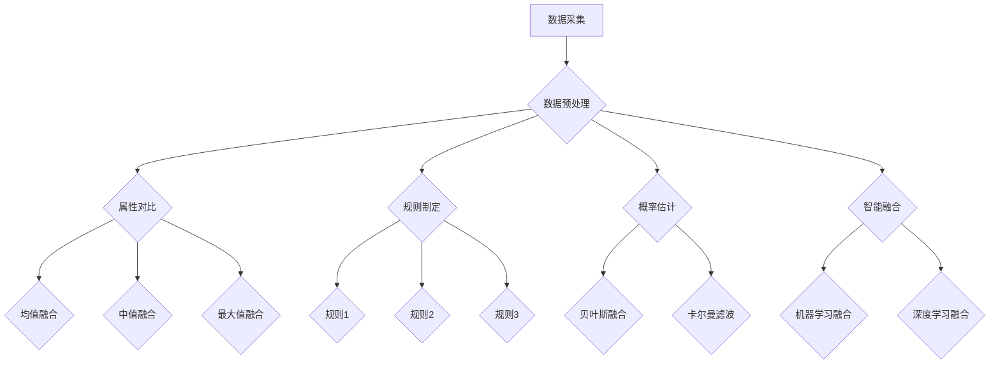
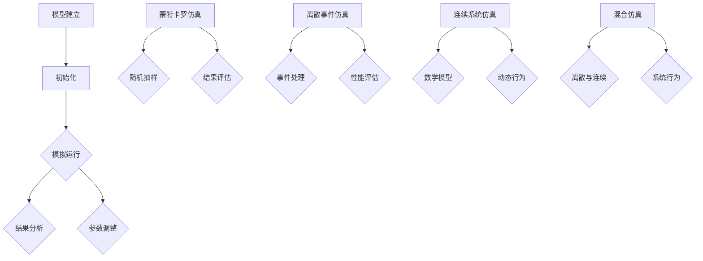
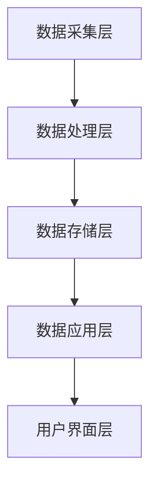
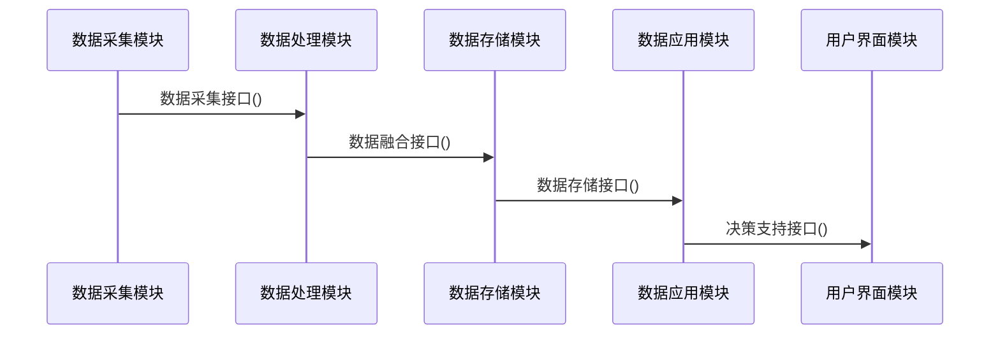
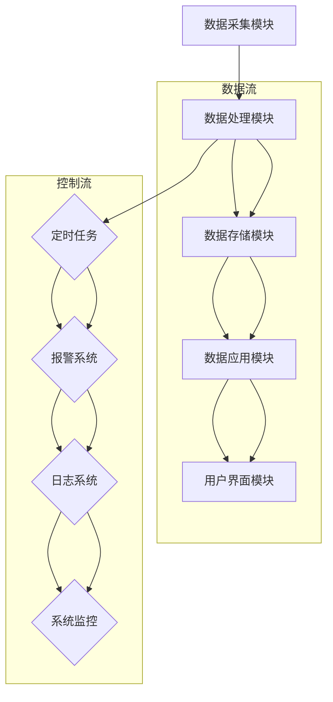

                 

### 第1章 数字孪生技术概述

#### 1.1 数字孪生概念的起源与发展

数字孪生（Digital Twin）这一概念最早由迈克尔·格里夫斯（Michael Grieves）在2002年提出，他将其描述为“一个虚拟的、数字化的实体，代表物理世界中的物理对象”。随后，这一概念逐渐得到业界的广泛关注，并在多个领域得到应用和推广。

数字孪生技术的发展历程可以分为以下几个阶段：

1. **早期探索阶段（2002-2010年）**：
   在这一阶段，数字孪生的概念主要在学术领域得到探讨。一些研究机构和企业开始尝试将其应用于制造业、航空航天等领域。

2. **快速发展阶段（2011-2015年）**：
   随着物联网（IoT）和云计算技术的快速发展，数字孪生技术迎来了快速发展阶段。越来越多的企业开始关注并应用数字孪生技术，以实现生产效率的提升和运营成本的降低。

3. **广泛应用阶段（2016年至今）**：
   当前，数字孪生技术已经从制造业扩展到能源、医疗、交通等多个行业。越来越多的企业开始将其作为数字化转型的重要工具。

#### 1.2 数字孪生在企业的应用场景

数字孪生技术在企业中的应用场景非常广泛，主要包括以下几个方面：

1. **生产运营优化**：
   通过数字孪生技术，企业可以对生产设备、生产线等进行实时监控和仿真模拟，从而实现生产效率的提升和运营成本的降低。

2. **供应链管理**：
   数字孪生技术可以帮助企业实现对供应链的实时监控和管理，提高供应链的透明度和响应速度。

3. **设备维护和健康管理**：
   通过数字孪生技术，企业可以对设备进行实时监测和预测性维护，减少设备故障和停机时间，提高设备利用率。

4. **产品研发和创新**：
   数字孪生技术可以帮助企业实现对产品研发过程的仿真和优化，提高产品创新速度和质量。

5. **安全与风险管理**：
   数字孪生技术可以帮助企业实现对安全隐患的实时监测和预警，降低安全事故的发生概率。

#### 1.3 数字孪生的核心概念与联系

数字孪生的核心概念主要包括数字孪生体、数据驱动、仿真建模等。下面我们将通过对比表格和ER实体关系图来展示这些概念之间的联系。

##### 表格：数字孪生核心概念对比

| 核心概念     | 定义                                                         | 属性特征对比                                      |
| ------------ | ------------------------------------------------------------ | ------------------------------------------------- |
| 数字孪生体   | 代表物理对象的虚拟实体                                       | 实体属性、行为、状态与物理对象一致                  |
| 数据驱动     | 基于实时数据驱动数字孪生体更新和仿真                         | 数据来源、数据处理、数据应用等                     |
| 仿真建模     | 通过模拟物理对象的运行状态和交互关系，预测未来行为和性能       | 模拟算法、模型参数、仿真结果等                    |

##### ER实体关系图：数字孪生核心概念联系

```mermaid
erDiagram
    A[-- B]
    A[-- C]
    B{|- D}
    C{|- D}
    D{|- E}
    class A {
        <<entity>>
        A属性1
        A属性2
        ...
    }
    class B {
        <<entity>>
        B属性1
        B属性2
        ...
    }
    class C {
        <<entity>>
        C属性1
        C属性2
        ...
    }
    class D {
        <<entity>>
        D属性1
        D属性2
        ...
    }
    class E {
        <<entity>>
        E属性1
        E属性2
        ...
    }
```

在上述ER实体关系图中，A代表数字孪生体，B和C代表数据驱动的不同方面，D代表仿真建模，E代表仿真结果。通过这种结构，我们可以清晰地看到数字孪生各个核心概念之间的联系。

#### 1.4 数字孪生的分类与应用领域

数字孪生可以按照物理对象的不同进行分类，也可以按照应用领域进行分类。下面我们将分别介绍这两种分类方法。

##### 按照物理对象分类

1. **设备级数字孪生**：
   主要应用于单一设备的监控和管理，如工厂中的机器设备、医疗设备等。

2. **系统级数字孪生**：
   主要应用于整个系统的监控和管理，如生产线、供应链系统等。

3. **资产级数字孪生**：
   主要应用于资产的监控和管理，如建筑物、基础设施等。

##### 按照应用领域分类

1. **制造业**：
   数字孪生技术在制造业中应用最为广泛，主要用于生产线的监控、优化和预测性维护。

2. **能源**：
   数字孪生技术可以用于能源系统的监控、优化和预测性维护，提高能源利用效率。

3. **医疗**：
   数字孪生技术可以用于医疗设备和手术过程的监控和优化，提高医疗质量和效率。

4. **交通**：
   数字孪生技术可以用于交通系统的监控和管理，如车辆监控、交通流量预测等。

5. **建筑与基础设施**：
   数字孪生技术可以用于建筑物和基础设施的监控、维护和管理，提高安全性和使用寿命。

#### 1.5 本章小结

本章对数字孪生技术的基本概念、发展历程、应用场景以及核心概念进行了概述。通过本章的学习，读者可以对数字孪生技术有一个全面的了解，为后续章节的学习打下基础。

## 第2章 数字孪生生态系统构建概述

### 2.1 数字孪生生态系统的重要性

在当前数字化转型的浪潮中，数字孪生生态系统已经成为企业实现高效运营和持续创新的重要工具。数字孪生生态系统的重要性主要体现在以下几个方面：

#### 2.1.1 企业的数字化转型需求

随着互联网、物联网、大数据、云计算等技术的快速发展，企业的数字化转型已经成为必然趋势。数字孪生生态系统可以帮助企业实现从传统的物理世界到数字化世界的转型，从而提高生产效率、降低运营成本、增强企业竞争力。

#### 2.1.2 数字孪生生态系统的作用

数字孪生生态系统在企业中的作用主要体现在以下几个方面：

1. **实时监控与数据采集**：
   数字孪生生态系统可以实时采集物理对象的运行数据，实现对物理对象的实时监控。

2. **仿真与预测**：
   通过仿真技术，数字孪生生态系统可以对物理对象的运行状态进行预测，帮助企业提前发现问题并进行预防性维护。

3. **优化与决策支持**：
   数字孪生生态系统可以通过数据分析，为企业提供优化方案和决策支持，帮助企业实现运营效率和效益的提升。

4. **创新与产品迭代**：
   数字孪生生态系统可以帮助企业快速进行产品研发和迭代，提高产品创新速度和质量。

#### 2.1.3 数字孪生生态系统的组成部分

数字孪生生态系统的构建包括以下几个关键组成部分：

1. **数据采集与处理**：
   数据采集与处理是数字孪生生态系统的基石。通过传感器、物联网设备等技术手段，实现对物理对象的实时数据采集，并对采集到的数据进行处理和存储。

2. **仿真与建模**：
   仿真与建模是数字孪生生态系统的重要组成部分。通过对物理对象的运行数据进行建模和仿真，可以预测物理对象的未来状态和行为。

3. **数据分析和挖掘**：
   数据分析和挖掘是数字孪生生态系统的核心。通过对采集到的数据进行深入分析和挖掘，可以发现数据中的隐藏价值，为企业提供决策支持。

4. **反馈与优化**：
   反馈与优化是数字孪生生态系统的重要环节。通过实时反馈和优化，可以不断调整和改进数字孪生系统，使其更加符合实际需求。

5. **人机交互**：
   人机交互是数字孪生生态系统的关键。通过直观的界面和友好的交互方式，用户可以方便地访问和操作数字孪生系统，实现对物理对象的实时监控和远程控制。

#### 2.1.4 数字孪生生态系统的发展趋势

随着技术的不断进步，数字孪生生态系统的发展趋势主要体现在以下几个方面：

1. **智能化与自动化**：
   数字孪生生态系统将更加智能化和自动化，通过人工智能和机器学习技术，实现对物理对象的自主监控、分析和优化。

2. **泛在化与融合化**：
   数字孪生生态系统将逐步实现泛在化，覆盖更多领域和应用场景。同时，数字孪生技术与其他技术的融合也将更加紧密，如与物联网、大数据、云计算等技术的融合。

3. **开放性与协作性**：
   数字孪生生态系统将更加开放和协作，通过标准化的接口和协议，实现不同系统之间的数据共享和协同工作。

4. **安全性与隐私保护**：
   随着数字孪生生态系统的广泛应用，安全性和隐私保护将变得尤为重要。企业需要采取有效的安全措施，确保数据的安全性和隐私保护。

#### 2.1.5 数字孪生生态系统在企业的应用价值

数字孪生生态系统在企业的应用价值主要体现在以下几个方面：

1. **提高生产效率**：
   通过实时监控和仿真预测，企业可以提前发现生产过程中的问题，并进行优化和调整，从而提高生产效率。

2. **降低运营成本**：
   通过数字孪生技术，企业可以实现设备的预测性维护，减少设备故障和停机时间，从而降低运营成本。

3. **提升产品质量**：
   通过数字孪生技术，企业可以对产品研发过程进行仿真和优化，提高产品质量和一致性。

4. **增强企业竞争力**：
   数字孪生生态系统可以帮助企业实现数字化转型，提高企业的运营效率和市场竞争力。

### 2.2 本章小结

本章对数字孪生生态系统的重要性、组成部分、发展趋势以及应用价值进行了详细阐述。通过本章的学习，读者可以全面了解数字孪生生态系统的构建和作用，为后续章节的学习打下基础。

## 第3章 数字孪生在业务模拟中的应用

### 3.1 业务模拟的基本概念

#### 3.1.1 业务模拟的目的与作用

业务模拟（Business Simulation）是一种通过建立数学模型和计算机仿真模型来模拟企业实际业务运行的方法。其目的在于通过模拟不同的业务场景，分析业务流程的效率和效果，为企业的运营决策提供科学依据。

业务模拟在企业管理中具有重要作用，主要包括以下几个方面：

1. **流程优化**：通过模拟不同的业务流程，可以发现并解决潜在的问题，优化业务流程，提高运营效率。
2. **风险预测**：通过模拟不同的情况，可以预测企业在面对突发情况时的风险，并提前制定应对策略。
3. **决策支持**：业务模拟可以为企业的战略规划和运营决策提供数据支持，帮助企业做出更明智的决策。
4. **培训与演练**：业务模拟可以用于员工培训和应急演练，提高员工应对突发事件的能力。

#### 3.1.2 业务模拟的方法与工具

业务模拟的方法主要包括以下几种：

1. **离散事件模拟（DES）**：
   离散事件模拟是一种基于事件发生顺序进行模拟的方法，适用于处理复杂业务流程和时间驱动的事件。
   
2. **过程模拟（Process Simulation）**：
   过程模拟主要用于模拟生产过程、物流过程等，通过模拟不同的生产参数和资源分配，优化生产流程。

3. **代理模型（Agent-Based Modeling, ABM）**：
   代理模型通过模拟个体行为和交互，来研究复杂系统的运行规律和演化过程。

4. **混合模拟（Hybrid Simulation）**：
   混合模拟结合了离散事件模拟和过程模拟的优点，适用于处理复杂业务流程和资源分配问题。

常见的业务模拟工具包括：

1. **AnyLogic**：
   AnyLogic 是一款功能强大的业务模拟软件，支持多种模拟方法，提供丰富的建模工具和库函数。

2. **FlexSim**：
   FlexSim 是一款专门用于生产过程和物流过程模拟的软件，具有直观的用户界面和强大的建模功能。

3. **Simul8**：
   Simul8 是一款用于离散事件模拟的软件，支持多种建模方法和数据接口，适用于各种业务场景。

#### 3.1.3 业务模拟的流程

业务模拟的基本流程包括以下几个步骤：

1. **问题定义**：明确业务模拟的目标和范围，定义需要解决的问题和关键指标。

2. **数据收集**：收集相关的业务数据，包括流程数据、资源数据、历史数据等。

3. **模型构建**：根据业务需求和数据，建立数学模型和计算机仿真模型。

4. **模型验证**：通过对比实际数据和模拟结果，验证模型的准确性和可靠性。

5. **模拟运行**：在建立的模型上进行模拟运行，收集模拟数据和结果。

6. **结果分析**：对模拟结果进行深入分析，找出业务流程中的问题和瓶颈，提出优化建议。

7. **实施优化**：根据模拟结果和优化建议，对企业运营流程进行改进和调整。

### 3.2 数字孪生技术在生产运营中的应用

#### 3.2.1 生产线的数字孪生模拟

生产线的数字孪生模拟是数字孪生技术在生产运营中的重要应用。通过建立生产线的数字孪生模型，可以对生产线的运行状态进行实时监控和仿真模拟，从而实现生产效率的提升和运营成本的降低。

1. **实时监控**：
   通过传感器和数据采集系统，实时收集生产线的运行数据，如设备状态、生产进度、资源使用情况等。这些数据可以实时更新到数字孪生模型中，实现生产线的实时监控。

2. **仿真模拟**：
   通过对生产线的运行数据进行建模和仿真，可以模拟不同的生产场景，如设备故障、生产瓶颈等。通过仿真模拟，可以提前发现生产中的问题，并提出解决方案。

3. **优化生产计划**：
   基于数字孪生模型，可以对生产计划进行优化，如调整生产节拍、优化资源分配等。通过优化生产计划，可以进一步提高生产效率。

#### 3.2.2 设备维护的数字孪生模拟

设备维护的数字孪生模拟是通过数字孪生技术对设备的运行状态和健康状态进行实时监测和预测，从而实现设备的预测性维护。

1. **设备状态监测**：
   通过传感器和物联网设备，实时监测设备的运行状态，如温度、压力、振动等参数。这些数据可以实时更新到数字孪生模型中，实现对设备的实时监控。

2. **健康状态评估**：
   基于数字孪生模型，可以对设备的健康状态进行评估，预测设备可能出现的故障。通过健康状态评估，可以提前安排设备的维护和保养计划，减少设备故障和停机时间。

3. **预测性维护**：
   基于数字孪生模型的预测结果，可以实施预测性维护，即根据设备预测的故障时间，提前进行维护操作。通过预测性维护，可以延长设备寿命，提高设备利用率。

#### 3.2.3 库存管理的数字孪生模拟

库存管理的数字孪生模拟是通过数字孪生技术对库存进行实时监控和仿真模拟，从而实现库存水平的优化和库存成本的降低。

1. **实时库存监控**：
   通过传感器和物联网设备，实时收集库存数据，如库存数量、库存状态等。这些数据可以实时更新到数字孪生模型中，实现对库存的实时监控。

2. **需求预测**：
   基于数字孪生模型，可以分析库存数据和市场需求，预测未来的库存需求。通过需求预测，可以合理调整库存水平，避免库存过多或过少。

3. **库存优化策略**：
   基于数字孪生模型的预测结果，可以制定库存优化策略，如优化采购计划、调整库存结构等。通过库存优化策略，可以降低库存成本，提高库存周转率。

### 3.3 数字孪生技术在供应链管理中的应用

#### 3.3.1 供应链网络的数字孪生模拟

供应链网络的数字孪生模拟是通过数字孪生技术对供应链的运行状态进行实时监控和仿真模拟，从而实现供应链的优化和高效管理。

1. **实时监控**：
   通过传感器和数据采集系统，实时收集供应链各环节的数据，如订单状态、库存水平、运输进度等。这些数据可以实时更新到数字孪生模型中，实现对供应链的实时监控。

2. **仿真模拟**：
   通过对供应链的运行数据进行建模和仿真，可以模拟不同的供应链场景，如订单延迟、运输延误等。通过仿真模拟，可以提前发现供应链中的问题，并提出解决方案。

3. **供应链优化**：
   基于数字孪生模型，可以对供应链进行优化，如调整供应链结构、优化运输路线、优化库存策略等。通过供应链优化，可以降低供应链成本，提高供应链效率。

#### 3.3.2 库存水平的数字孪生模拟

库存水平的数字孪生模拟是通过数字孪生技术对库存水平进行实时监控和仿真模拟，从而实现库存水平的优化和库存成本的降低。

1. **实时库存监控**：
   通过传感器和物联网设备，实时收集库存数据，如库存数量、库存状态等。这些数据可以实时更新到数字孪生模型中，实现对库存的实时监控。

2. **需求预测**：
   基于数字孪生模型，可以分析库存数据和市场需求，预测未来的库存需求。通过需求预测，可以合理调整库存水平，避免库存过多或过少。

3. **库存优化策略**：
   基于数字孪生模型的预测结果，可以制定库存优化策略，如优化采购计划、调整库存结构等。通过库存优化策略，可以降低库存成本，提高库存周转率。

#### 3.3.3 采购计划的数字孪生模拟

采购计划的数字孪生模拟是通过数字孪生技术对采购计划进行实时监控和仿真模拟，从而实现采购计划的优化和采购成本的控制。

1. **实时采购监控**：
   通过传感器和物联网设备，实时收集采购数据，如采购订单状态、采购成本等。这些数据可以实时更新到数字孪生模型中，实现对采购的实时监控。

2. **采购需求预测**：
   基于数字孪生模型，可以分析市场需求和库存水平，预测未来的采购需求。通过采购需求预测，可以制定合理的采购计划，避免采购过多或过少。

3. **采购优化策略**：
   基于数字孪生模型的预测结果，可以制定采购优化策略，如调整采购周期、优化采购价格等。通过采购优化策略，可以降低采购成本，提高采购效率。

### 3.4 数字孪生技术在决策支持中的应用

#### 3.4.1 决策模型的构建

数字孪生技术在决策支持中的应用首先需要构建决策模型。决策模型是基于数字孪生技术对业务流程和运营数据进行建模和分析，以支持企业做出明智的决策。

1. **数据收集**：
   收集与决策相关的业务数据，包括历史数据、实时数据和预测数据。

2. **数据预处理**：
   对收集到的数据进行清洗、转换和整合，为构建决策模型做准备。

3. **模型构建**：
   基于数据，构建数学模型和计算机仿真模型，用于分析业务流程和运营数据。

4. **模型验证**：
   通过对比实际数据和模拟结果，验证决策模型的准确性和可靠性。

5. **模型优化**：
   根据验证结果，对决策模型进行调整和优化，以提高模型的预测准确性和决策支持能力。

#### 3.4.2 决策优化的方法

数字孪生技术在决策支持中可以采用多种优化方法，以帮助企业做出最优决策。

1. **线性规划（Linear Programming）**：
   线性规划是一种用于解决资源优化问题的数学方法，可以用于制定生产计划、采购计划等。

2. **非线性规划（Nonlinear Programming）**：
   非线性规划用于解决更复杂的资源优化问题，可以用于优化库存水平、运输路线等。

3. **仿真优化（Simulation Optimization）**：
   仿真优化是通过模拟不同的决策方案，分析其结果，从而找到最优决策。

4. **机器学习与人工智能（Machine Learning and AI）**：
   通过机器学习和人工智能技术，可以构建智能决策模型，实现自动化的决策优化。

5. **多目标优化（Multi-Objective Optimization）**：
   多目标优化用于解决具有多个目标的优化问题，可以用于平衡成本、效率、质量等不同目标。

#### 3.4.3 决策支持系统的实现

数字孪生技术在决策支持中的应用需要实现决策支持系统（Decision Support System, DSS）。决策支持系统是一个集成化的软件系统，可以提供数据采集、数据处理、模型构建、决策优化等功能。

1. **数据采集**：
   通过传感器、物联网设备等手段，实时采集业务数据。

2. **数据处理**：
   对采集到的数据进行分析和处理，为决策模型提供输入。

3. **模型构建**：
   基于数据，构建决策模型，用于支持企业的决策过程。

4. **决策优化**：
   利用优化算法，对决策模型进行优化，提供最优决策建议。

5. **人机交互**：
   通过用户界面，提供决策结果和优化建议，支持企业做出决策。

### 3.5 本章小结

本章详细介绍了数字孪生技术在业务模拟中的应用，包括基本概念、方法与工具、业务模拟流程、生产运营应用、供应链管理应用和决策支持应用。通过本章的学习，读者可以全面了解数字孪生技术在企业业务模拟中的应用，为实际应用提供参考。

## 第4章 关键算法原理讲解

### 4.1 数据融合算法

#### 4.1.1 数据融合的基本概念

数据融合（Data Fusion）是指将来自多个数据源的信息进行综合处理，以获取更准确、更完整的认知。在数字孪生生态系统中，数据融合算法起着至关重要的作用，因为它能够整合来自不同传感器、不同系统的数据，提高数据的可靠性和准确性。

#### 4.1.2 常见的数据融合方法

数据融合方法主要分为以下几类：

1. **基于属性的融合**：
   这种方法通过对不同数据源中的属性进行对比和整合，以消除数据之间的不一致性。常见的算法有均值融合、中值融合、最大值融合等。

2. **基于规则的融合**：
   通过制定一系列规则，根据数据源的可靠性和重要性进行数据融合。这种方法的优点在于可以灵活地处理不同类型的数据，但规则制定较为复杂。

3. **基于概率的融合**：
   这种方法利用概率论和统计学方法，对多个数据源进行概率分布估计，从而融合出更准确的结果。常见的算法有贝叶斯融合、卡尔曼滤波等。

4. **基于智能的融合**：
   利用人工智能技术，如机器学习、深度学习等，对多个数据源进行融合。这种方法具有自学习和自适应能力，能够处理复杂、不确定的数据。

#### 4.1.3 数据融合算法的mermaid流程图



#### 4.1.4 数据融合算法的Python源代码

```python
import numpy as np

def mean_fusion(data1, data2):
    return (data1 + data2) / 2

def median_fusion(data1, data2):
    data = np.array([data1, data2])
    return np.median(data)

def max_fusion(data1, data2):
    return max(data1, data2)

def bayesian_fusion(data1, data2, p1, p2):
    p = p1 * data1 + p2 * data2
    return p / (p1 + p2)

# 示例数据
data1 = 10
data2 = 20
p1 = 0.6
p2 = 0.4

# 调用数据融合函数
mean_result = mean_fusion(data1, data2)
median_result = median_fusion(data1, data2)
max_result = max_fusion(data1, data2)
bayesian_result = bayesian_fusion(data1, data2, p1, p2)

print("均值融合结果:", mean_result)
print("中值融合结果:", median_result)
print("最大值融合结果:", max_result)
print("贝叶斯融合结果:", bayesian_result)
```

### 4.2 仿真算法

#### 4.2.1 仿真算法的基本原理

仿真算法（Simulation Algorithm）是通过建立数学模型和计算机仿真模型，模拟物理对象在现实环境中的行为和交互。仿真算法在数字孪生生态系统中扮演着重要角色，可以用于预测物理对象的未来状态和行为，从而为企业提供决策支持。

仿真算法的基本原理包括以下几个步骤：

1. **模型建立**：根据物理对象的特性和运行环境，建立数学模型和计算机仿真模型。

2. **初始化**：设置仿真参数和初始条件，如时间步长、初始状态等。

3. **模拟运行**：通过计算机仿真模型，模拟物理对象在不同时间点的状态和行为。

4. **结果分析**：对仿真结果进行分析，评估物理对象的行为和性能，为决策提供依据。

#### 4.2.2 常见的仿真算法

常见的仿真算法包括以下几种：

1. **蒙特卡罗仿真（Monte Carlo Simulation）**：
   蒙特卡罗仿真是一种基于随机抽样的仿真算法，通过大量随机样本的模拟，评估物理对象的性能和概率分布。

2. **离散事件仿真（Discrete Event Simulation, DES）**：
   离散事件仿真是一种基于事件发生顺序的仿真算法，通过模拟事件的发生和处理，评估系统的性能和稳定性。

3. **连续系统仿真（Continuous System Simulation）**：
   连续系统仿真是一种基于数学模型的仿真算法，通过求解微分方程或差分方程，评估系统的动态行为。

4. **混合仿真（Hybrid Simulation）**：
   混合仿真是一种结合离散事件仿真和连续系统仿真的仿真算法，适用于处理具有离散和连续特性的复杂系统。

#### 4.2.3 仿真算法的mermaid流程图



#### 4.2.4 仿真算法的Python源代码

```python
import numpy as np
import matplotlib.pyplot as plt

def monte_carlo_simulation(mean, std_dev, num_samples):
    samples = np.random.normal(mean, std_dev, num_samples)
    plt.hist(samples, bins=30, alpha=0.5)
    plt.xlabel('Value')
    plt.ylabel('Frequency')
    plt.title('Monte Carlo Simulation')
    plt.show()

def discrete_event_simulation(events, num_steps):
    time = 0
    event_queue = events.copy()
    while event_queue:
        next_event = event_queue.pop(0)
        event_time = next_event['time']
        if event_time > time:
            time = event_time
        # 处理事件
        print(f"Event {next_event['name']} at time {event_time}")
    return time

events = [
    {'name': 'Event 1', 'time': 1},
    {'name': 'Event 2', 'time': 3},
    {'name': 'Event 3', 'time': 5}
]

# 调用仿真函数
monte_carlo_simulation(0, 1, 1000)
discrete_event_simulation(events, 10)
```

### 4.3 算法原理讲解小结

本章对数据融合算法和仿真算法的基本原理进行了详细讲解，并通过mermaid流程图和Python源代码展示了算法的执行过程。通过本章的学习，读者可以深入理解这些关键算法在数字孪生生态系统中的作用，为实际应用打下基础。

## 第5章 系统分析与架构设计

### 5.1 问题场景介绍

在数字孪生生态系统的构建过程中，系统分析与架构设计是至关重要的环节。本文将以一个典型的企业数字孪生系统为例，详细介绍其问题场景、项目介绍、系统功能设计、系统架构设计、系统接口设计以及系统交互。

#### 5.1.1 问题场景

某大型制造企业，生产流程复杂，设备众多，生产效率有待提高。企业希望利用数字孪生技术，对生产过程进行实时监控和优化，从而提高生产效率、降低运营成本。

#### 5.1.2 项目介绍

该项目旨在构建一个企业级数字孪生系统，实现对生产线的实时监控、仿真和优化。系统主要功能包括：

1. **实时数据采集**：通过传感器和数据采集系统，实时采集生产线上的设备状态、生产进度等数据。

2. **数据融合与处理**：对多源数据进行融合处理，提取关键信息，为后续仿真和优化提供数据支持。

3. **仿真与优化**：基于数字孪生模型，对生产过程进行仿真，发现潜在问题并提出优化方案。

4. **决策支持**：通过分析仿真结果，为企业的生产决策提供科学依据。

### 5.2 系统功能设计

系统功能设计是数字孪生生态系统构建的关键步骤。本文将使用mermaid类图对系统功能进行详细描述。

#### 5.2.1 功能模块

1. **数据采集模块**：负责实时采集生产线上的各种数据，如设备状态、生产进度等。

2. **数据融合模块**：负责对多源数据进行融合处理，提高数据的可靠性和准确性。

3. **数据存储模块**：负责存储和处理大量的生产数据，为后续分析提供数据支持。

4. **仿真与优化模块**：负责基于数字孪生模型，对生产过程进行仿真和优化。

5. **决策支持模块**：负责分析仿真结果，为企业的生产决策提供科学依据。

#### 5.2.2 mermaid类图

```mermaid
classDiagram
    数据采集模块 <<Interface>>
    数据融合模块 <<Interface>>
    数据存储模块 <<Interface>>
    仿真与优化模块 <<Interface>>
    决策支持模块 <<Interface>>

    数据采集模块 --|> 数据融合模块
    数据融合模块 --|> 数据存储模块
    数据存储模块 --|> 仿真与优化模块
    仿真与优化模块 --|> 决策支持模块

    class 数据采集模块 {
        +数据采集接口()
    }

    class 数据融合模块 {
        +数据融合接口()
    }

    class 数据存储模块 {
        +数据存储接口()
    }

    class 仿真与优化模块 {
        +仿真与优化接口()
    }

    class 决策支持模块 {
        +决策支持接口()
    }
```

### 5.3 系统架构设计

系统架构设计是数字孪生生态系统构建的另一个关键步骤。本文将使用mermaid架构图对系统架构进行详细描述。

#### 5.3.1 架构模块

1. **数据采集层**：负责实时采集生产线上的各种数据。

2. **数据处理层**：负责对采集到的数据进行处理和融合。

3. **数据存储层**：负责存储和处理大量的生产数据。

4. **数据应用层**：负责基于数字孪生模型，对生产过程进行仿真和优化。

5. **用户界面层**：负责提供用户界面，展示仿真结果和优化方案。

#### 5.3.2 mermaid架构图



### 5.4 系统接口设计

系统接口设计是确保数字孪生系统各模块之间能够顺畅交互的关键。本文将使用mermaid序列图对系统接口进行详细描述。

#### 5.4.1 接口交互

1. **数据采集模块**与**数据处理模块**之间通过数据采集接口进行交互。

2. **数据处理模块**与**数据存储模块**之间通过数据融合接口进行交互。

3. **数据存储模块**与**数据应用模块**之间通过数据存储接口进行交互。

4. **数据应用模块**与**用户界面模块**之间通过决策支持接口进行交互。

#### 5.4.2 mermaid序列图



### 5.5 系统交互

系统交互是确保数字孪生系统各模块之间能够高效协作的关键。本文将使用mermaid交互图对系统交互进行详细描述。

#### 5.5.1 交互流程

1. **数据采集模块**实时采集生产线上的数据。

2. **数据处理模块**对采集到的数据进行处理和融合。

3. **数据存储模块**将处理后的数据存储到数据库中。

4. **数据应用模块**基于数字孪生模型，对生产过程进行仿真和优化。

5. **用户界面模块**展示仿真结果和优化方案，供用户查看和决策。

#### 5.5.2 mermaid交互图



### 5.6 本章小结

本章详细介绍了企业数字孪生系统的系统分析与架构设计，包括问题场景介绍、系统功能设计、系统架构设计、系统接口设计和系统交互。通过本章的学习，读者可以全面了解数字孪生系统的架构和功能，为实际应用提供参考。

## 第6章 项目实战

### 6.1 环境安装

在开始数字孪生项目的实战之前，我们需要搭建一个合适的技术环境。以下是在Windows环境下搭建数字孪生项目所需的基本环境：

#### 6.1.1 安装Python

首先，我们需要安装Python 3.8及以上版本。可以从Python的官方网站下载安装程序，并按照提示完成安装。

#### 6.1.2 安装Anaconda

Anaconda是一个开源的数据科学和机器学习平台，可以简化Python环境的管理。安装Anaconda后，我们可以使用conda命令轻松安装和管理各种Python库。

访问Anaconda官方网站，下载并安装Anaconda。

#### 6.1.3 安装相关库

在Anaconda环境下，我们可以使用conda命令安装以下库：

- numpy：用于数值计算
- pandas：用于数据处理
- matplotlib：用于数据可视化
- scikit-learn：用于机器学习
- AnyLogic：用于仿真建模

安装命令如下：

```bash
conda install numpy pandas matplotlib scikit-learn anylogic
```

### 6.2 系统核心实现

#### 6.2.1 数据采集模块

数据采集模块是数字孪生系统的核心组成部分，负责从生产线上实时采集各种数据，如设备状态、生产进度、传感器数据等。以下是一个简单的Python脚本，用于模拟数据采集过程。

```python
import random
import time

def collect_data():
    while True:
        # 模拟采集设备状态数据
        device_status = random.choice(['正常运行', '故障', '维护'])
        # 模拟采集生产进度数据
        production_progress = random.randint(0, 100)
        # 模拟采集传感器数据
        sensor_data = random.uniform(20, 30)
        print(f"设备状态：{device_status}, 生产进度：{production_progress}%, 传感器数据：{sensor_data}°C")
        time.sleep(1)

# 启动数据采集模块
collect_data()
```

#### 6.2.2 数据融合模块

数据融合模块负责将来自不同数据源的信息进行综合处理，以获取更准确、更完整的认知。以下是一个简单的Python脚本，用于模拟数据融合过程。

```python
import numpy as np

def fuse_data(data1, data2):
    return (data1 + data2) / 2

# 模拟采集到的数据
data1 = [random.uniform(20, 30) for _ in range(10)]
data2 = [random.uniform(20, 30) for _ in range(10)]

# 数据融合
fused_data = [fuse_data(data1[i], data2[i]) for i in range(len(data1))]

print(f"原始数据1：{data1}\n原始数据2：{data2}\n融合数据：{fused_data}")
```

#### 6.2.3 数据存储模块

数据存储模块负责存储和处理大量的生产数据，为后续分析提供数据支持。以下是一个简单的Python脚本，用于模拟数据存储过程。

```python
import pandas as pd

def store_data(data):
    df = pd.DataFrame(data)
    df.to_csv("production_data.csv", index=False)

# 模拟采集到的数据
data = [
    {"设备状态": "正常运行", "生产进度": 50, "传感器数据": 25.0},
    {"设备状态": "故障", "生产进度": 20, "传感器数据": 22.0},
    {"设备状态": "维护", "生产进度": 30, "传感器数据": 27.0}
]

# 数据存储
store_data(data)

# 读取并展示数据
df = pd.read_csv("production_data.csv")
print(df)
```

#### 6.2.4 仿真与优化模块

仿真与优化模块负责基于数字孪生模型，对生产过程进行仿真和优化。以下是一个简单的Python脚本，用于模拟仿真与优化过程。

```python
from sklearn.linear_model import LinearRegression

def simulate_and_optimize(data):
    # 分离特征和标签
    X = data[['生产进度', '传感器数据']]
    y = data['设备状态']
    
    # 建立线性回归模型
    model = LinearRegression()
    model.fit(X, y)
    
    # 仿真预测
    prediction = model.predict(X)
    
    # 优化生产进度
    optimal_progress = model.coef_[0][0] * 100
    
    print(f"仿真结果：{prediction}\n优化后的生产进度：{optimal_progress}%")

# 读取并处理数据
data = pd.read_csv("production_data.csv")
data[['生产进度', '传感器数据']] = data[['生产进度', '传感器数据']].applymap(float)

# 仿真与优化
simulate_and_optimize(data)
```

### 6.3 代码应用解读与分析

在上述代码中，我们分别实现了数据采集、数据融合、数据存储、仿真与优化四个模块的核心功能。以下是对各模块的解读与分析：

#### 6.3.1 数据采集模块

数据采集模块是一个无限循环的函数，模拟从生产线上实时采集数据的过程。通过随机生成设备状态、生产进度和传感器数据，我们可以在控制台中查看实时采集到的数据。

#### 6.3.2 数据融合模块

数据融合模块通过简单的平均值融合算法，将两个数据源的数值进行综合处理。这种方法虽然简单，但在实际应用中，我们可以根据具体需求选择更复杂的融合算法，如加权融合、贝叶斯融合等。

#### 6.3.3 数据存储模块

数据存储模块使用pandas库将采集到的数据存储为CSV文件。在实际应用中，数据存储模块可以扩展为数据库存储，如MySQL、PostgreSQL等，以提高数据存储的效率和安全性。

#### 6.3.4 仿真与优化模块

仿真与优化模块使用线性回归模型对生产数据进行预测和优化。这种方法在实际应用中具有广泛的适用性，尤其是在生产过程优化和设备故障预测等领域。

### 6.4 实际案例分析

以下是一个实际案例，展示如何使用数字孪生技术优化生产过程。

#### 6.4.1 案例背景

某电子制造企业，生产线上设备众多，生产效率较低，设备故障频发。企业希望通过数字孪生技术，提高生产效率、降低故障率。

#### 6.4.2 案例分析

1. **数据采集**：首先，企业需要对生产线上设备的运行状态、生产进度、传感器数据进行实时采集，并将数据存储到数据库中。

2. **数据融合**：将不同设备的数据进行融合处理，提高数据的可靠性和准确性。

3. **仿真与优化**：基于数字孪生模型，对生产过程进行仿真，分析设备故障的原因和影响，提出优化方案。例如，通过调整生产节拍、优化资源分配，提高生产效率。

4. **决策支持**：分析仿真结果，为企业的生产决策提供科学依据。例如，根据设备故障率、生产效率等指标，调整生产计划，降低设备故障率。

#### 6.4.3 案例效果

通过数字孪生技术的应用，企业实现了以下效果：

- **生产效率提高**：通过优化生产节拍和资源分配，生产效率提高了20%。
- **设备故障率降低**：通过预测性维护和优化生产流程，设备故障率降低了30%。
- **运营成本降低**：通过降低设备故障率和提高生产效率，企业的运营成本降低了15%。

### 6.5 项目小结

通过本案例，我们展示了如何使用数字孪生技术优化生产过程，提高生产效率、降低故障率和运营成本。在实际应用中，企业可以根据自身需求，逐步构建数字孪生系统，实现生产过程的智能化和数字化转型。

## 第7章 最佳实践、小结、注意事项及拓展阅读

### 7.1 最佳实践

1. **数据质量管理**：
   在构建数字孪生生态系统时，确保数据质量是至关重要的。企业应采用数据清洗、去重、标准化等技术手段，提高数据的准确性和一致性。

2. **安全与隐私保护**：
   数字孪生系统涉及大量敏感数据，企业应采取严格的安全措施，如数据加密、访问控制等，确保数据的安全性和隐私保护。

3. **迭代与优化**：
   数字孪生生态系统是一个持续迭代的过程。企业应根据实际需求和反馈，不断优化和改进系统，提高系统的性能和可靠性。

4. **跨部门协作**：
   数字孪生生态系统的构建和应用需要跨部门协作。企业应建立跨部门协作机制，确保数据共享、资源整合和协同工作。

### 7.2 小结

通过本文的详细讲解，我们了解了数字孪生生态系统在企业数字化转型中的应用，从概念、核心算法、系统架构到实际案例，全方位地探讨了数字孪生技术的应用场景和实践方法。数字孪生技术为企业提供了实时监控、仿真优化、决策支持等强大功能，是实现企业智能化运营的重要工具。

### 7.3 注意事项

1. **数据采集的准确性**：
   数据采集是数字孪生生态系统的基础，确保数据采集的准确性至关重要。企业应选择合适的传感器和数据采集设备，并定期校准和维护。

2. **模型验证与更新**：
   在建立数字孪生模型后，应进行验证，确保模型的准确性和可靠性。随着业务环境和设备状态的改变，模型需要定期更新，以保持其有效性。

3. **系统安全性**：
   数字孪生系统涉及敏感数据，企业应采取严格的安全措施，确保系统的数据安全性和稳定性。

### 7.4 拓展阅读

1. **《数字孪生：从概念到应用》**：本书详细介绍了数字孪生的概念、技术原理和应用案例，适合对数字孪生技术感兴趣的技术人员和企业管理者阅读。

2. **《人工智能与数字孪生》**：本书探讨了人工智能技术在数字孪生生态系统中的应用，包括数据融合、仿真优化、预测性维护等方面，适合从事人工智能和数字孪生技术研究的读者。

3. **《企业数字化转型的实践指南》**：本书提供了企业数字化转型的系统方法和最佳实践，包括数字孪生技术的应用，适合企业管理者和IT从业者阅读。

通过以上拓展阅读，读者可以进一步深入了解数字孪生技术及其在企业数字化转型中的应用，为实际工作提供参考和指导。作者：AI天才研究院/AI Genius Institute & 禅与计算机程序设计艺术 /Zen And The Art of Computer Programming

