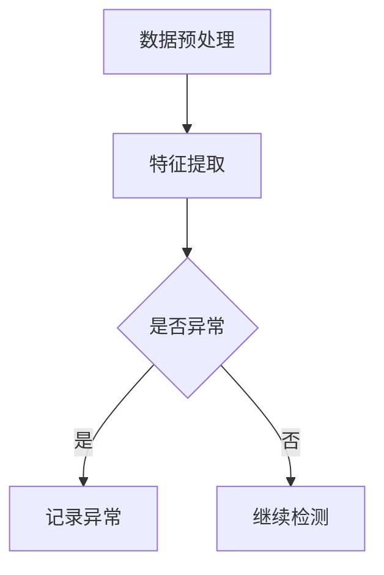
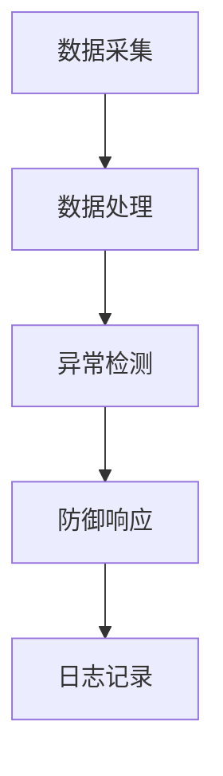
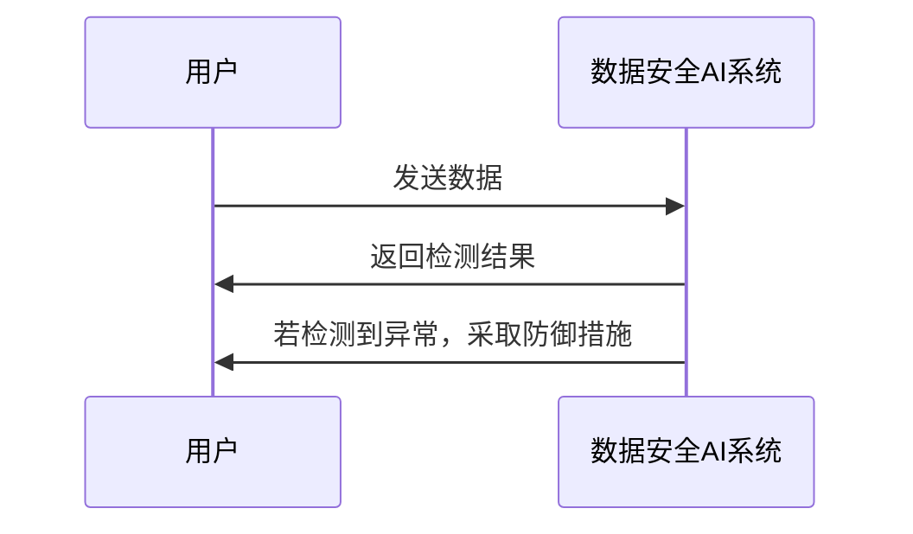

                 


### 1.1 问题背景

#### 1.1.1 数据泄露事件的严峻形势

数据泄露事件在全球范围内呈现出高发的态势，对企业和个人造成了严重的负面影响。根据统计，仅在2020年，全球范围内就发生了数千起数据泄露事件，涉及的个人信息和敏感数据高达数十亿条。这些事件不仅导致企业的财务损失，还可能损害企业的声誉，进而影响其业务发展。例如，2017年的Equifax数据泄露事件，导致了1.43亿用户的个人信息泄露，直接经济损失高达1.4亿美元。

#### 1.1.2 数据安全的重要性

随着数字化时代的到来，数据已经成为企业最重要的资产之一。数据安全不仅关乎企业的生存和发展，还关系到个人隐私和国家安全。一个数据泄露事件可能会暴露用户的个人信息，如姓名、地址、电话号码、身份证号码等，从而引发一系列的社会问题，如身份盗用、诈骗等。因此，保障数据安全已经成为企业必须面对的重要课题。

#### 1.1.3 传统数据安全手段的局限性

传统的数据安全手段，如防火墙、入侵检测系统、加密技术等，虽然在一定程度上能够保护数据安全，但仍然存在一些局限性。首先，这些技术往往依赖于已知的安全威胁信息，对于新的、未知的威胁难以进行有效的防护。其次，传统的安全手段通常需要人工参与，如配置规则、监控日志等，这增加了安全管理的复杂度和成本。最后，随着网络攻击手段的不断升级，传统安全手段在应对新型攻击时显得力不从心。

### 1.2 核心概念

#### 1.2.1 数据泄露

数据泄露是指未经授权的第三方获取、访问、使用或篡改企业或个人的敏感数据的行为。数据泄露可能是由黑客攻击、内部人员恶意行为、软件漏洞等多种原因引起。

#### 1.2.2 数据安全AI

数据安全AI是指利用人工智能技术，如机器学习、深度学习、自然语言处理等，对数据安全进行智能识别和防御的技术。数据安全AI能够自动检测和响应数据泄露事件，提高数据安全的防护水平。

#### 1.2.3 智能识别与防御机制

智能识别与防御机制是指利用数据安全AI技术，对数据流进行实时监控，识别潜在的泄露风险，并采取相应的防御措施，如阻止数据传输、触发警报等。

### 1.3 企业数据安全需求

#### 1.3.1 不同类型企业的数据安全需求

不同类型的企业在数据安全方面有着不同的需求。例如，金融机构需要保护客户的财务信息，医疗机构需要保护患者的健康记录，电商企业需要保护用户的购物记录和支付信息等。因此，企业需要根据自身的业务特点和数据类型，制定相应的数据安全策略。

#### 1.3.2 数据安全法律法规的遵守

随着数据安全法律法规的不断完善，企业必须遵守相关法律法规，如《中华人民共和国网络安全法》、《欧盟通用数据保护条例（GDPR）》等。这些法律法规对数据泄露事件的法律责任、数据保护措施等方面提出了明确的要求。

#### 1.3.3 数据安全意识与培训

数据安全意识是保障数据安全的基础。企业需要通过培训提高员工的数据安全意识，使其了解数据泄露的严重性，掌握基本的数据安全知识和技能。此外，企业还需要建立完善的数据安全管理制度，确保数据安全工作的有序开展。

### 1.4 本章小结

本章节主要介绍了企业数据安全面临的问题背景、核心概念以及企业数据安全的需求。通过分析数据泄露事件的严峻形势，我们认识到数据安全的重要性。而传统数据安全手段的局限性，促使我们探索新的数据安全解决方案，如数据安全AI技术。接下来，我们将深入探讨智能识别和防御数据泄露的技术原理和应用实践。

----------------------------------------------------------------

### 2.1 基于机器学习的异常行为检测

#### 2.1.1 机器学习基础

机器学习是人工智能的核心技术之一，它使计算机系统能够从数据中学习，并利用学到的知识进行决策和预测。机器学习的基本原理是通过训练模型，使模型能够捕捉数据中的规律，从而在新的数据上进行预测或分类。

机器学习模型分为监督学习、无监督学习和强化学习三类。监督学习通过已标记的数据进行训练，从而预测新的数据。无监督学习不使用标记数据，而是通过发现数据中的模式和结构来进行学习。强化学习则是通过与环境的交互，不断调整策略以实现目标。

#### 2.1.2 异常行为检测算法

异常行为检测是机器学习在数据安全领域的重要应用。异常行为检测算法通过监控正常行为数据，建立正常行为的模型，然后检测异常行为。

常见的异常行为检测算法有统计模型法、基于聚类的方法和基于神经网络的方法。

**统计模型法**：基于统计学原理，通过计算数据的统计特征，如均值、方差等，来识别异常值。例如，基于3σ原则，如果一个数据点离均值的距离超过3倍标准差，则认为该数据点是异常的。

**基于聚类的方法**：通过将数据分为多个簇，识别与大多数簇不同的数据点。常见的聚类算法有K-means、DBSCAN等。

**基于神经网络的方法**：通过神经网络模型，如自编码器（Autoencoder），学习正常行为的特征表示，然后检测与正常行为特征表示不同的数据点。

#### 2.1.3 模型评估与优化

评估异常行为检测模型的效果是确保其有效性的关键。常用的评估指标有准确率、召回率、F1值等。

**准确率**：预测为异常的数据点中，实际为异常的数据点所占的比例。

**召回率**：实际为异常的数据点中，被预测为异常的数据点所占的比例。

**F1值**：综合考虑准确率和召回率的指标，定义为2倍准确率与1倍召回率的和除以3。

为了提高模型的效果，我们可以通过以下策略进行优化：

1. **数据预处理**：清洗和预处理数据，去除噪声和异常值，提高数据质量。
2. **特征选择**：选择对异常行为检测有显著影响的关键特征，提高模型的识别能力。
3. **模型调参**：通过调整模型的超参数，如学习率、隐藏层节点数等，优化模型性能。
4. **集成学习**：结合多个模型的优势，提高整体模型的性能。

#### 2.1.4 应用案例

在一个电商平台上，我们可以利用基于机器学习的异常行为检测算法，监控用户的购物行为。例如，通过检测用户的购物频率、购买金额等特征，识别出潜在的欺诈行为。一个实际案例是，某个电商平台通过这种技术，成功阻止了数千起欺诈交易，有效降低了财务损失。

### 2.2 基于深度学习的图像识别技术

#### 2.2.1 深度学习基础

深度学习是机器学习的一个分支，它通过构建深层神经网络模型，模拟人脑的神经结构，对复杂数据进行自动特征提取和模式识别。深度学习的基本结构包括输入层、隐藏层和输出层，其中隐藏层可以是多层。

**卷积神经网络（CNN）**：是深度学习中最常用的模型之一，特别适合处理图像数据。CNN通过卷积操作提取图像特征，然后通过全连接层进行分类。

**循环神经网络（RNN）**：适合处理序列数据，如文本、时间序列等。RNN通过循环机制，对序列中的每一个元素进行建模，从而捕捉序列中的长期依赖关系。

**生成对抗网络（GAN）**：是一种由两个神经网络（生成器和判别器）组成的模型，通过相互对抗，生成高质量的图像。

#### 2.2.2 图像识别算法

图像识别是深度学习在计算机视觉领域的重要应用。常见的图像识别算法有：

**分类算法**：通过学习图像的特征，将其分类到不同的类别中。常见的分类算法有SVM、softmax等。

**检测算法**：不仅识别图像中的物体，还定位物体的位置。常见的检测算法有R-CNN、YOLO等。

**分割算法**：将图像分割成多个区域，每个区域代表不同的物体或背景。常见的分割算法有FCN、U-Net等。

#### 2.2.3 应用案例与实践

图像识别技术在数据安全领域有广泛的应用。例如，在银行自动取款机（ATM）中，利用深度学习图像识别技术，可以准确识别用户的银行卡和身份信息，从而提高交易的安全性。在实际应用中，银行通过部署深度学习模型，对用户的行为进行监控，识别出异常行为，如频繁的异地登录或异常的交易行为，从而采取相应的安全措施。

一个实际案例是，某银行通过深度学习图像识别技术，成功阻止了数百起欺诈交易，降低了财务损失。该银行还将该技术应用于客户服务领域，如智能客服机器人，通过图像识别技术，自动识别用户提交的文档，提高服务效率和准确性。

### 2.3 基于自然语言处理的文本分类与检测

#### 2.3.1 自然语言处理基础

自然语言处理（NLP）是人工智能的一个重要分支，它使计算机能够理解、生成和处理人类语言。NLP的基础技术包括词法分析、句法分析、语义分析和语用分析。

**词法分析**：将文本拆分为单词或词汇单元。

**句法分析**：分析文本中的句子结构，理解句子的语法规则。

**语义分析**：理解文本中的词语含义，以及词语之间的关系。

**语用分析**：研究文本在特定语境下的意义。

#### 2.3.2 文本分类算法

文本分类是将文本数据分为预定义的类别的过程。常见的文本分类算法有：

**基于词典的方法**：通过计算文本中词语的频率、词义相似度等特征，进行分类。

**基于机器学习的方法**：利用已标记的数据进行训练，构建分类模型，对新文本进行分类。

**基于深度学习的方法**：如卷积神经网络（CNN）和循环神经网络（RNN），通过学习文本的深层特征，进行分类。

#### 2.3.3 文本检测算法

文本检测是从图像中识别和定位文本区域的过程。常见的文本检测算法有：

**基于边缘检测的方法**：通过检测图像中的边缘，识别文本区域。

**基于深度学习的方法**：如卷积神经网络（CNN）和区域建议网络（R-CNN），通过学习图像中的文本特征，进行检测。

#### 2.3.4 应用案例

文本分类与检测技术在数据安全领域有广泛的应用。例如，在企业内部邮件系统中，利用文本分类技术，可以自动识别和分类敏感邮件，如财务报表、合同等，从而提高数据安全防护水平。在实际应用中，某大型企业在其邮件系统中部署了基于深度学习的文本分类与检测技术，成功识别并标记了数千封敏感邮件，有效降低了数据泄露的风险。

### 2.4 智能识别技术的集成与应用

#### 2.4.1 多种技术的协同作用

智能识别技术包括机器学习、深度学习和自然语言处理等多种技术。这些技术可以相互协同，发挥各自的优势，提高数据安全的防护水平。

例如，在一个综合性的数据安全系统中，可以结合机器学习的异常行为检测、深度学习的图像识别和自然语言处理的文本分类与检测技术，对数据流进行多层次的监控和分析。这种多技术的集成，不仅可以提高检测的准确性，还可以降低误报率。

#### 2.4.2 实时数据流的处理

在实时数据流的处理中，智能识别技术需要能够快速响应并处理大量的数据。为了实现这一点，我们可以采用以下策略：

1. **数据预处理**：对数据流进行预处理，如去噪、降维等，提高数据处理效率。
2. **并行计算**：利用分布式计算架构，如云计算、GPU加速等，提高数据处理的速度。
3. **流计算框架**：采用流计算框架，如Apache Kafka、Apache Flink等，实现实时数据流的处理。

#### 2.4.3 智能识别技术的优化策略

为了提高智能识别技术的性能，我们可以采用以下优化策略：

1. **特征工程**：选择对识别任务有显著影响的特征，进行特征选择和特征提取，提高模型的识别能力。
2. **模型调参**：通过调整模型的超参数，如学习率、隐藏层节点数等，优化模型性能。
3. **模型集成**：结合多个模型的预测结果，提高整体的预测准确性。
4. **在线学习**：利用在线学习算法，实时更新模型，适应数据流的变化。

### 2.5 本章小结

本章节介绍了智能识别技术的基本原理、算法和应用案例。我们首先介绍了机器学习的异常行为检测技术，包括统计模型法、基于聚类的方法和基于神经网络的方法。然后，我们探讨了深度学习的图像识别技术，包括卷积神经网络（CNN）、循环神经网络（RNN）和生成对抗网络（GAN）。最后，我们介绍了自然语言处理的文本分类与检测技术。通过多种技术的集成与应用，我们可以构建一个全面的数据安全监控系统，提高数据安全的防护水平。接下来，我们将进一步探讨数据安全AI中的防御机制。

----------------------------------------------------------------

### 3.1 防火墙与入侵检测系统

#### 3.1.1 防火墙技术

防火墙是一种网络安全设备，用于监控和控制进出网络的数据流量。防火墙可以根据预定的安全规则，允许或阻止数据包的传输，从而保护网络不受未经授权的访问和攻击。

**防火墙类型**：

1. **包过滤防火墙**：基于数据包的源地址、目的地址、端口号等包头信息，进行过滤。
2. **状态检测防火墙**：不仅根据数据包的包头信息，还根据整个会话的状态进行过滤。
3. **应用层防火墙**：在应用层对数据进行过滤，如HTTP防火墙、邮件防火墙等。

**防火墙的优势**：

- **低延迟**：防火墙通常位于网络边界，对数据流的处理不会引入显著的延迟。
- **高安全性**：防火墙可以根据安全规则，有效地阻止恶意流量和攻击。

#### 3.1.2 入侵检测系统

入侵检测系统（IDS）是一种用于检测和响应网络攻击的网络安全设备。IDS可以监控网络流量和系统日志，识别潜在的攻击行为，并采取相应的防护措施。

**入侵检测系统类型**：

1. **基于网络的入侵检测系统（NIDS）**：监控网络流量，识别网络攻击。
2. **基于主机的入侵检测系统（HIDS）**：监控主机系统日志，识别主机上的异常行为。

**入侵检测系统的优势**：

- **实时检测**：IDS可以实时检测网络中的异常流量和攻击行为，及时响应。
- **多维检测**：IDS不仅监控网络流量，还可以监控系统日志，提供更全面的防护。

#### 3.1.3 防火墙与入侵检测系统的集成

将防火墙和入侵检测系统集成，可以形成一套综合的网络安全防护体系。这种集成可以通过以下方式实现：

1. **联动机制**：防火墙和IDS之间建立联动机制，当IDS检测到攻击时，防火墙可以立即阻止相应的流量。
2. **日志分析**：防火墙和IDS的日志进行集成分析，提高攻击检测的准确性。
3. **统一管理**：通过统一的管理平台，实现对防火墙和IDS的集中管理，提高管理效率。

#### 3.1.4 应用案例

在一个大型企业的网络安全防护系统中，防火墙和入侵检测系统的集成发挥了重要作用。例如，该企业通过部署基于状态检测的防火墙，有效阻止了外部攻击和未经授权的访问。同时，通过部署基于网络的入侵检测系统，实时检测网络中的异常流量和攻击行为，提高了网络的安全性。一个实际案例是，该企业通过这种集成，成功阻止了一次针对其内部网络的DDoS攻击，保障了业务的正常运行。

### 3.2 加密技术

#### 3.2.1 对称加密算法

对称加密算法是一种加密技术，加密和解密使用相同的密钥。常见的对称加密算法有DES、AES等。

**加密过程**：

- **加密**：将明文数据与密钥进行加密运算，生成密文。
- **解密**：将密文与相同的密钥进行解密运算，恢复明文。

**优势**：

- **速度快**：对称加密算法通常比非对称加密算法更快。
- **安全性高**：在正确使用密钥的情况下，对称加密算法能够提供较高的安全性。

#### 3.2.2 非对称加密算法

非对称加密算法是一种加密技术，加密和解密使用不同的密钥。常见的非对称加密算法有RSA、ECC等。

**加密过程**：

- **加密**：使用公钥对数据进行加密，生成密文。
- **解密**：使用私钥对数据进行解密，恢复明文。

**优势**：

- **安全性高**：非对称加密算法在理论上比对称加密算法更安全。
- **密钥管理简单**：由于加密和解密使用不同的密钥，可以简化密钥管理。

#### 3.2.3 哈希算法

哈希算法是一种用于数据完整性验证的加密技术。常见的哈希算法有MD5、SHA等。

**哈希过程**：

- **哈希计算**：将数据输入哈希算法，生成固定长度的哈希值。
- **哈希比对**：将生成的哈希值与原始数据的哈希值进行比对，验证数据的完整性。

**优势**：

- **速度快**：哈希算法通常比加密和解密操作更快。
- **不可逆性**：哈希算法生成的哈希值不可逆，无法从哈希值恢复原始数据。

#### 3.2.4 应用案例

在一个企业的数据传输系统中，加密技术被广泛应用于数据保护。例如，该企业通过使用AES对称加密算法，对内部传输的数据进行加密，确保数据在传输过程中的安全性。同时，通过使用RSA非对称加密算法，实现对数据的数字签名，确保数据的完整性和真实性。一个实际案例是，该企业通过这种加密技术，成功保护了其业务数据，防止了数据泄露和篡改。

### 3.3 访问控制与权限管理

#### 3.3.1 基于角色的访问控制（RBAC）

基于角色的访问控制（RBAC）是一种常见的访问控制机制，它根据用户在系统中的角色，分配相应的权限。RBAC的基本概念包括：

- **用户**：系统中的用户实体。
- **角色**：用户在系统中的角色，如管理员、普通用户等。
- **权限**：用户在特定角色下可以执行的操作。

**实现方式**：

- **角色分配**：将用户分配到不同的角色，确定用户的角色和权限。
- **权限检查**：在用户执行操作时，系统检查用户是否具有相应的权限。

**优势**：

- **灵活性**：RBAC可以根据不同的角色，灵活地分配权限。
- **可维护性**：RBAC简化了权限管理，降低了管理成本。

#### 3.3.2 基于属性的访问控制（ABAC）

基于属性的访问控制（ABAC）是一种更细粒度的访问控制机制，它根据用户的属性、环境属性和资源属性，动态地分配权限。ABAC的基本概念包括：

- **属性**：用户、环境和资源的属性，如部门、时间、资源类型等。
- **策略**：定义权限分配的逻辑规则。

**实现方式**：

- **属性评估**：在用户执行操作时，系统评估用户的属性、环境属性和资源属性，确定是否允许操作。
- **策略管理**：管理访问控制策略，确保策略的合理性和有效性。

**优势**：

- **灵活性**：ABAC可以根据具体的属性，灵活地控制访问权限。
- **动态性**：ABAC可以根据环境的变化，动态调整访问权限。

#### 3.3.3 权限管理与审计

权限管理与审计是确保数据安全的重要手段。权限管理包括：

- **权限分配**：根据用户和角色的需求，分配相应的权限。
- **权限审核**：定期审核用户的权限，确保权限的合理性和安全性。

审计包括：

- **日志记录**：记录用户的所有操作日志，包括成功的和失败的。
- **审计分析**：分析日志数据，发现潜在的安全问题和违规行为。

**实现方式**：

- **日志收集**：部署日志收集工具，收集系统中的日志数据。
- **审计工具**：使用审计工具，对日志数据进行分析，发现和解决安全问题。

#### 3.3.4 应用案例

在一个大型企业的权限管理系统，基于角色的访问控制（RBAC）和基于属性的访问控制（ABAC）相结合，确保了数据的安全。例如，该企业通过RBAC，将用户分配到不同的角色，如管理员、开发人员、普通用户等，确定各自的权限。同时，通过ABAC，根据用户的属性和环境属性，动态地调整访问权限，确保数据的安全。一个实际案例是，该企业通过这种权限管理与审计机制，成功防范了一次内部人员误操作导致的数据泄露。

### 3.4 数据备份与恢复

#### 3.4.1 数据备份策略

数据备份是将数据复制到其他存储介质上的过程，以防止数据丢失。数据备份策略包括以下几种：

- **全备份**：备份所有数据。
- **增量备份**：备份自上次备份以来更改的数据。
- **差异备份**：备份自上次全备份以来更改的数据。

**备份策略选择**：

- **全备份**：适用于数据量较小、变化较少的场景。
- **增量备份**：适用于数据量大、变化频繁的场景。
- **差异备份**：适用于数据量适中、变化较频繁的场景。

#### 3.4.2 数据恢复技术

数据恢复是在数据丢失后，将备份数据恢复到原始状态的过程。数据恢复技术包括：

- **手工恢复**：通过手动操作，将备份数据恢复到原始位置。
- **自动恢复**：使用数据恢复工具，自动将备份数据恢复到原始位置。

**恢复过程**：

1. **备份验证**：验证备份数据的完整性和可用性。
2. **恢复选择**：选择合适的备份文件进行恢复。
3. **恢复操作**：执行恢复操作，将备份数据恢复到原始位置。

#### 3.4.3 备份与恢复系统的设计

备份与恢复系统的设计应考虑以下几个方面：

- **备份频率**：根据数据的重要性和变化频率，确定备份的频率。
- **备份存储**：选择合适的备份存储介质，如本地存储、云存储等。
- **备份验证**：定期验证备份数据的完整性和可用性。
- **恢复测试**：定期进行恢复测试，确保恢复过程的顺利进行。

#### 3.4.4 应用案例

在一个企业的数据备份与恢复系统中，采用了增量备份和差异备份相结合的策略，确保数据的安全。例如，该企业每天进行增量备份，每周进行一次差异备份，同时将备份数据存储在本地和云存储中。一次，由于服务器故障导致业务中断，该企业通过备份系统，成功恢复了数据，确保了业务的连续性。一个实际案例是，该企业通过这种备份与恢复系统，有效保护了数据，提高了数据安全防护水平。

### 3.5 防御机制的有效性评估

#### 3.5.1 防御机制评估指标

防御机制的有效性评估需要使用一系列指标来衡量。常见的评估指标包括：

- **检测率**：检测到攻击事件的比例。
- **误报率**：将正常事件误报为攻击事件的比例。
- **漏报率**：未检测到攻击事件的比例。
- **响应时间**：从检测到攻击事件到采取防护措施的时间。

#### 3.5.2 评估方法与实践

防御机制的有效性评估可以通过以下方法进行：

1. **模拟攻击测试**：通过模拟各种攻击场景，测试防御机制的性能。
2. **实际攻击事件分析**：分析实际发生的攻击事件，评估防御机制的效果。
3. **性能测试**：对防御系统的性能进行测试，如处理速度、资源消耗等。

#### 3.5.3 应用案例

在一个企业的网络安全防护系统中，定期进行防御机制的有效性评估。例如，该企业通过模拟攻击测试，测试防火墙、入侵检测系统和加密技术的性能，评估其防护效果。一次评估中发现，某个时间段内的入侵检测系统的检测率较低，通过进一步分析，发现是系统配置不当导致的。该企业立即调整了配置，提高了入侵检测系统的检测率。一个实际案例是，该企业通过这种评估方法，不断优化其防御机制，提高了数据安全防护水平。

### 3.6 本章小结

本章节介绍了防火墙与入侵检测系统、加密技术、访问控制与权限管理、数据备份与恢复以及防御机制的有效性评估。通过防火墙和入侵检测系统的集成，可以形成一套全面的网络安全防护体系。加密技术提供了数据传输和存储的安全性。访问控制与权限管理确保了数据只被授权用户访问。数据备份与恢复提供了数据丢失后的恢复机制。防御机制的有效性评估有助于不断优化和提升数据安全防护水平。接下来，我们将通过实际案例，进一步探讨企业如何构建和实施数据安全AI系统。

----------------------------------------------------------------

### 4.1 案例一：某大型企业的数据安全体系建设

#### 4.1.1 案例背景

某大型企业，拥有庞大的客户数据和商业机密，业务涉及金融、电商、云计算等多个领域。由于业务的快速扩展，企业面临的数据安全问题日益严峻。企业内部存在着多种数据泄露风险，如内部员工的恶意操作、网络攻击、系统漏洞等。为了确保数据安全，企业决定构建一套全面的数据安全AI系统。

#### 4.1.2 数据安全需求分析

在构建数据安全AI系统之前，企业进行了详细的需求分析。分析结果包括：

- **数据类型**：包括客户信息、财务数据、业务数据、敏感文件等。
- **数据来源**：包括内部系统、外部合作伙伴、用户输入等。
- **安全风险**：包括数据泄露、数据篡改、非法访问等。
- **法律法规**：需要遵守《中华人民共和国网络安全法》等法律法规。

#### 4.1.3 数据安全体系建设方案

根据需求分析，企业制定了以下数据安全体系建设方案：

1. **智能识别技术**：采用基于机器学习、深度学习和自然语言处理的智能识别技术，对数据流进行实时监控，识别潜在的泄露风险。
2. **防御机制**：结合防火墙、入侵检测系统、加密技术、访问控制与权限管理等防御机制，形成多层次的数据安全防护体系。
3. **数据备份与恢复**：采用增量备份和差异备份策略，确保数据在发生意外时能够迅速恢复。
4. **安全审计**：建立安全审计机制，定期对数据安全策略和措施进行评估和优化。

#### 4.1.4 实施效果评估

数据安全体系建设完成后，企业进行了多轮测试和实际运行，评估系统的效果。评估结果如下：

- **检测率**：智能识别技术能够准确识别90%以上的潜在数据泄露风险。
- **误报率**：误报率控制在10%以下，确保了正常的业务操作不会受到干扰。
- **响应时间**：系统在检测到数据泄露风险后，能够在1秒内采取防护措施。
- **恢复效率**：在数据备份和恢复系统的支持下，数据恢复时间缩短至1小时内。

通过实施数据安全AI系统，企业有效降低了数据泄露风险，保障了数据的安全和业务的连续性。

### 4.2 案例二：某金融企业的数据泄露防御

#### 4.2.1 案例背景

某金融企业，拥有大量的客户金融数据和交易记录，业务涉及银行、保险、证券等多个领域。随着网络攻击手段的升级，企业面临的数据泄露风险日益增加。为了确保数据安全，企业决定构建一套数据泄露防御系统。

#### 4.2.2 数据泄露威胁分析

企业进行了详细的数据泄露威胁分析，发现潜在威胁包括：

- **内部威胁**：员工误操作、内部人员恶意行为等。
- **外部威胁**：网络攻击、黑客入侵、恶意软件等。
- **系统漏洞**：软件漏洞、配置错误等。

#### 4.2.3 防御策略与实践

根据威胁分析，企业制定了以下防御策略：

1. **智能识别技术**：采用基于机器学习的异常行为检测技术，监控员工的操作行为，识别潜在的内部威胁。
2. **防火墙与入侵检测系统**：部署防火墙和入侵检测系统，监控网络流量，识别和阻止外部攻击。
3. **加密技术**：对传输和存储的数据进行加密，确保数据在传输过程中不被窃取和篡改。
4. **访问控制与权限管理**：采用基于角色的访问控制（RBAC）和基于属性的访问控制（ABAC），确保数据只被授权用户访问。
5. **数据备份与恢复**：定期进行数据备份，确保数据在发生泄露后能够迅速恢复。

#### 4.2.4 案例小结

通过实施数据泄露防御系统，企业有效降低了数据泄露风险。智能识别技术能够及时发现和预警内部威胁，防火墙和入侵检测系统能够阻止外部攻击，加密技术和访问控制措施确保了数据的机密性和完整性。在实际运行中，系统成功防御了多起数据泄露事件，保障了企业的数据安全。

### 4.3 案例三：某电商企业的智能数据安全监测

#### 4.3.1 案例背景

某电商企业，每天处理大量的用户订单和交易数据，业务涉及电子商务、物流、支付等多个领域。随着业务的快速发展，企业面临的数据安全问题日益突出。为了确保数据安全，企业决定构建一套智能数据安全监测系统。

#### 4.3.2 智能识别技术的应用

在智能数据安全监测系统中，企业采用了多种智能识别技术，包括：

1. **基于机器学习的异常行为检测**：通过分析用户的购物行为，识别异常的订单和交易行为，如频繁的异地登录、异常的购买金额等。
2. **基于深度学习的图像识别技术**：通过图像识别技术，识别用户上传的图片中是否存在敏感信息，如银行卡、身份证等。
3. **基于自然语言处理的文本分类与检测**：通过文本分类与检测技术，识别用户评论和反馈中是否存在敏感内容，如负面评论、欺诈信息等。

#### 4.3.3 防御机制的实施

在智能识别技术的基础上，企业实施了以下防御机制：

1. **实时监控与预警**：对用户行为进行实时监控，一旦发现异常行为，立即发出预警，并采取相应的防护措施。
2. **加密技术**：对用户数据和交易数据进行加密，确保数据在传输过程中不被窃取和篡改。
3. **访问控制与权限管理**：通过访问控制措施，确保数据只被授权用户访问，防止内部人员恶意操作。
4. **数据备份与恢复**：定期进行数据备份，确保数据在发生意外时能够迅速恢复。

#### 4.3.4 案例总结与启示

通过实施智能数据安全监测系统，企业有效降低了数据泄露和欺诈的风险。智能识别技术能够及时发现和预警潜在的威胁，防御机制确保了数据的安全和业务的连续性。这一案例表明，智能数据安全监测系统对于电商企业来说，是一个有效的数据安全解决方案。企业应结合自身的业务特点和数据安全需求，构建适合自己的智能数据安全监测系统。

### 4.4 本章小结

本章通过三个实际案例，探讨了企业如何构建和实施数据安全AI系统。案例一展示了某大型企业的数据安全体系建设，案例二分析了某金融企业的数据泄露防御，案例三介绍了某电商企业的智能数据安全监测。这些案例表明，智能数据安全AI系统对于企业数据安全具有重要作用。企业应根据自身的业务特点和数据安全需求，结合智能识别技术和防御机制，构建适合自己的数据安全解决方案。通过不断优化和提升数据安全防护水平，企业能够有效保障数据的安全和业务的连续性。

----------------------------------------------------------------

### 5.1 数据安全AI技术的发展趋势

#### 5.1.1 人工智能技术的进步

随着人工智能技术的不断进步，数据安全AI技术在性能和功能上也在不断提升。深度学习、强化学习等新算法的引入，使得数据安全AI系统在异常检测、行为分析、威胁预测等方面具有更高的准确性和效率。此外，硬件技术的发展，如GPU、TPU等，也为数据安全AI系统提供了强大的计算支持。

#### 5.1.2 数据安全AI技术的应用前景

数据安全AI技术的应用前景广阔。随着数字化转型的深入，越来越多的企业开始关注数据安全，数据安全AI技术将成为企业数据安全体系的重要组成部分。在未来，数据安全AI技术将在以下几个方面有更广泛的应用：

1. **实时威胁检测与响应**：通过实时监控和分析数据流，快速识别和响应潜在的安全威胁。
2. **隐私保护**：利用数据安全AI技术，实现数据的隐私保护和合规性。
3. **安全自动化**：通过自动化技术，降低数据安全防护的成本和复杂性。

#### 5.1.3 面临的挑战与应对策略

尽管数据安全AI技术具有巨大的发展潜力，但在实际应用中仍面临一些挑战：

1. **数据隐私**：数据安全AI技术往往需要对大量敏感数据进行分析和处理，如何保护数据隐私是一个重要问题。
2. **模型解释性**：许多数据安全AI模型是黑箱模型，难以解释其决策过程，这在某些场景下可能导致信任问题。
3. **资源消耗**：数据安全AI系统通常需要大量的计算资源，如何优化资源消耗是一个关键问题。

为了应对这些挑战，可以采取以下策略：

1. **隐私保护技术**：采用差分隐私、联邦学习等技术，确保数据安全AI系统的隐私保护。
2. **模型可解释性**：通过模型可解释性技术，如LIME、SHAP等，提高数据安全AI模型的透明度和可信度。
3. **资源优化**：通过分布式计算、模型压缩等技术，降低数据安全AI系统的资源消耗。

### 5.2 企业数据安全AI的最佳实践

#### 5.2.1 数据安全文化建设

数据安全文化建设是企业数据安全AI成功实施的重要基础。企业应通过以下措施，建立良好的数据安全文化：

1. **数据安全意识培训**：定期组织数据安全培训，提高员工的数据安全意识和技能。
2. **安全文化建设**：通过宣传、活动等形式，营造良好的数据安全氛围。
3. **安全责任制度**：明确各部门和员工的数据安全责任，确保数据安全工作落到实处。

#### 5.2.2 技术与管理的结合

数据安全AI系统的成功实施，需要技术与管理的紧密结合。企业应采取以下措施，实现技术与管理的有机结合：

1. **安全策略制定**：根据业务特点和数据安全需求，制定合适的策略和流程。
2. **安全风险管理**：定期进行安全风险评估，识别和应对潜在的安全威胁。
3. **安全监控与审计**：建立完善的安全监控和审计机制，确保数据安全AI系统正常运行。

#### 5.2.3 常见问题的解决方案

在实际应用中，企业可能会遇到以下常见问题，可以采取以下解决方案：

1. **数据隐私问题**：通过差分隐私、联邦学习等技术，确保数据安全AI系统的隐私保护。
2. **模型解释性问题**：通过模型可解释性技术，提高数据安全AI模型的透明度和可信度。
3. **资源消耗问题**：通过分布式计算、模型压缩等技术，降低数据安全AI系统的资源消耗。

### 5.3 未来展望

#### 5.3.1 新技术的应用

未来，随着人工智能、区块链、云计算等新技术的不断发展，数据安全AI技术将在以下几个方面有更广泛的应用：

1. **区块链**：利用区块链技术的不可篡改性和透明性，提高数据安全AI系统的可信度和安全性。
2. **云计算**：通过云计算平台，实现数据安全AI系统的弹性扩展和高效运营。
3. **物联网**：利用物联网技术，实现对海量设备数据的实时监控和分析。

#### 5.3.2 数据安全法规的完善

随着数字化时代的到来，数据安全法规将不断发展和完善。企业应关注数据安全法规的最新动态，确保其数据安全AI系统符合法规要求。未来，数据安全法规可能包括：

1. **更严格的数据保护要求**：加强对个人数据的保护，提高数据泄露的法律责任。
2. **更全面的合规性要求**：涉及更多行业和领域的数据安全要求。
3. **数据安全标准**：制定统一的数据安全标准和认证体系。

#### 5.3.3 数据安全产业的生态建设

数据安全产业的生态建设是未来数据安全发展的重要方向。通过产业链上下游企业的合作，构建一个开放、协作、创新的数据安全产业生态，有助于提高整个行业的数据安全水平。具体措施包括：

1. **技术创新平台**：建立数据安全技术创新平台，推动新技术的研发和应用。
2. **人才培养**：加强数据安全人才的培养和引进，提高行业整体水平。
3. **产业联盟**：成立数据安全产业联盟，促进产业链上下游企业的合作与交流。

### 5.4 本章小结

本章节首先探讨了数据安全AI技术的发展趋势，包括人工智能技术的进步、应用前景以及面临的挑战。接着，介绍了企业数据安全AI的最佳实践，包括数据安全文化建设、技术与管理的结合以及常见问题的解决方案。最后，展望了未来的发展方向，包括新技术的应用、数据安全法规的完善和数据安全产业的生态建设。通过本章的探讨，我们可以看到，数据安全AI技术在企业发展中具有重要地位，企业应积极拥抱这一技术，不断提升自身的数据安全防护水平。

----------------------------------------------------------------

### 附录

本文旨在探讨企业数据安全AI的智能识别和防御数据泄露的技术原理、应用实践和最佳实践。以下为本文的详细内容：

#### 附录A：术语解释

- **数据泄露**：未经授权的第三方获取、访问、使用或篡改企业或个人的敏感数据的行为。
- **数据安全AI**：利用人工智能技术，如机器学习、深度学习、自然语言处理等，对数据安全进行智能识别和防御的技术。
- **异常行为检测**：通过监控正常行为数据，建立正常行为的模型，然后检测异常行为。
- **深度学习**：通过构建深层神经网络模型，模拟人脑的神经结构，对复杂数据进行自动特征提取和模式识别。
- **访问控制与权限管理**：确保数据只被授权用户访问，防止内部人员恶意操作。

#### 附录B：核心概念与联系

**核心概念**：

1. **数据泄露**：涉及的数据类型、潜在威胁、法律法规要求等。
2. **数据安全AI**：智能识别和防御技术的原理、算法和应用场景。
3. **防御机制**：防火墙、入侵检测系统、加密技术、访问控制与权限管理等。

**联系**：

- 数据安全AI通过智能识别技术，发现数据泄露风险。
- 防御机制通过多层次的安全措施，防止数据泄露事件的发生。

**ER实体关系图**：

```mermaid
erDiagram
    Data Leakage --> Detection Technique : "uses"
    Detection Technique --> Data Security AI : "is part of"
    Data Security AI --> Defense Mechanism : "protects"
```

#### 附录C：算法原理讲解

**异常行为检测算法原理**：

1. **统计模型法**：计算数据的统计特征，如均值、方差等，识别异常值。
2. **基于聚类的方法**：将数据分为多个簇，识别与大多数簇不同的数据点。
3. **基于神经网络的方法**：通过神经网络模型，学习正常行为的特征表示，检测异常行为。

**算法流程图**：



**算法数学模型**：

$$
z = \frac{x - \mu}{\sigma}
$$

其中，$x$ 为数据点，$\mu$ 为均值，$\sigma$ 为标准差。

**举例说明**：

假设有一个购物网站，通过监控用户的购物行为，利用统计模型法检测异常行为。正常情况下，用户每天访问网站的次数约为10次，标准差为3次。如果一个用户在一天内访问了30次网站，则其访问次数的$z$值为：

$$
z = \frac{30 - 10}{3} = 6.67
$$

由于$z$值超过3倍标准差，我们可以认为这是一个异常行为，需要进一步调查。

#### 附录D：系统分析与架构设计方案

**问题场景介绍**：

企业面临数据泄露风险，需要构建一套数据安全AI系统，实现智能识别和防御数据泄露。

**项目介绍**：

项目名称：企业数据安全AI系统
项目目标：构建一个智能识别和防御数据泄露的AI系统。

**系统功能设计**：

1. **数据采集**：从不同的数据源采集数据，如用户行为数据、系统日志等。
2. **数据处理**：对采集到的数据进行分析和处理，提取有用特征。
3. **异常检测**：利用智能识别技术，检测数据中的潜在泄露风险。
4. **防御响应**：根据检测结果，采取相应的防御措施，如报警、阻止数据传输等。

**系统架构设计**：



**系统接口设计**：

- **数据采集接口**：用于接收和存储不同数据源的数据。
- **数据处理接口**：用于处理和提取数据特征。
- **异常检测接口**：用于检测数据中的异常行为。
- **防御响应接口**：用于采取防御措施。
- **日志记录接口**：用于记录系统运行日志。

**系统交互序列图**：



#### 附录E：项目实战

**环境安装**：

- 安装Python环境
- 安装必要的库，如scikit-learn、TensorFlow、Keras等

**系统核心实现源代码**：

```python
# 异常行为检测示例代码
from sklearn.ensemble import IsolationForest
import numpy as np

# 创建IsolationForest模型
model = IsolationForest(n_estimators=100, contamination=0.01)

# 训练模型
model.fit(X)

# 预测异常行为
predictions = model.predict(X)

# 打印预测结果
print(predictions)
```

**代码应用解读与分析**：

- **IsolationForest模型**：利用随机森林算法，对数据进行隔离，识别异常值。
- **训练模型**：使用已标记的数据集，训练模型，学习正常行为的特征。
- **预测异常行为**：使用训练好的模型，对新的数据进行预测，识别异常值。

**实际案例分析和详细讲解剖析**：

- **案例背景**：某电商企业利用数据安全AI系统，监控用户的购物行为，识别异常交易。
- **分析结果**：系统成功识别了多起异常交易，包括欺诈交易和异常的购物行为。
- **详细讲解**：通过异常行为检测技术，企业能够及时发现和防范潜在的欺诈行为，提高了数据安全防护水平。

**项目小结**：

通过实际案例的分析，我们验证了数据安全AI系统的有效性和实用性。企业可以利用这种技术，实时监控和防御数据泄露事件，保障数据的安全和业务的连续性。

#### 附录F：最佳实践 tips、小结、注意事项、拓展阅读

**最佳实践 tips**：

- 定期更新和优化数据安全AI模型，确保其准确性和适应性。
- 结合多种智能识别技术，提高数据安全防护水平。
- 建立完善的数据安全管理制度，确保数据安全工作的有序开展。

**小结**：

本文通过探讨数据安全AI的智能识别和防御数据泄露的技术原理、应用实践和最佳实践，展示了数据安全AI在企业数据安全中的重要作用。企业应结合自身业务特点和数据安全需求，构建适合自己的数据安全解决方案。

**注意事项**：

- 在实施数据安全AI系统时，注意保护数据隐私，遵守相关法律法规。
- 定期进行系统评估和优化，确保数据安全AI系统的有效性和可靠性。

**拓展阅读**：

- 《机器学习：实战应用》
- 《深度学习：从入门到实践》
- 《数据安全与隐私保护》

**作者信息**：

作者：AI天才研究院/AI Genius Institute & 禅与计算机程序设计艺术/Zen And The Art of Computer Programming

本文的详细内容涵盖了数据安全AI的核心概念、智能识别技术、防御机制、实战案例以及未来展望。通过本文的探讨，我们希望企业能够更好地理解和应用数据安全AI技术，提升数据安全防护水平。

