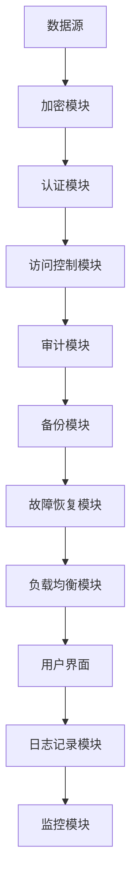
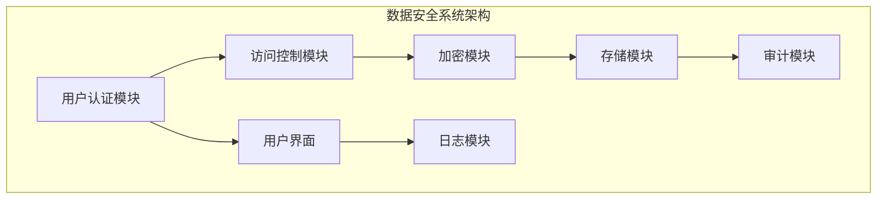
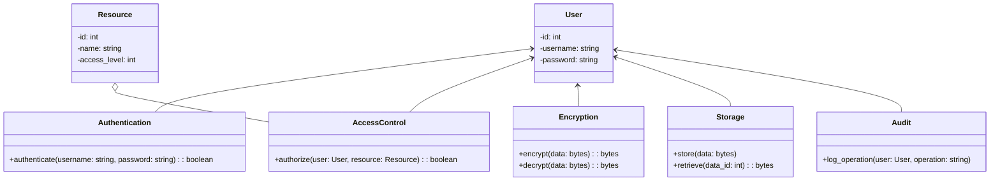

                 

### 企业数据安全：从传统加密到后量子时代

> 关键词：企业数据安全、传统加密、后量子密码学、量子计算机、数据加密算法

> 摘要：随着信息技术的飞速发展，企业数据安全成为至关重要的议题。本文将深入探讨从传统加密技术到后量子时代的演进，分析其核心概念、算法原理、系统架构以及实际应用，旨在为企业提供全面的数据安全解决方案。

#### 引言

在数字时代，数据已成为企业最宝贵的资产之一。然而，随着网络攻击手段的日益复杂和多样，企业数据面临着前所未有的安全威胁。数据泄露、篡改、窃取等问题屡见不鲜，不仅对企业造成巨大的经济损失，还可能导致声誉严重受损。因此，如何确保企业数据安全已成为企业亟需解决的问题。

传统的加密技术，如AES和RSA，虽然在一定程度上能够保护数据的安全性，但面对日益强大的量子计算机，这些加密手段的正面临前所未有的挑战。后量子密码学作为一种新兴的加密技术，正逐渐成为研究的热点，有望为未来的数据安全提供更加可靠的保障。

本文将分以下几个部分进行探讨：

1. **企业数据安全概述**：介绍数据安全的重要性，传统加密技术的局限以及后量子时代的来临。
2. **核心概念解析**：详细解释数据加密、后量子密码学和量子计算机等核心概念。
3. **传统加密算法**：介绍AES和RSA加密算法的工作原理，分析其优缺点。
4. **后量子加密算法**：介绍Lattice-based和Hash-based加密算法，探讨其原理和应用场景。
5. **数据安全系统分析与架构设计**：分析数据安全的系统架构，介绍安全架构设计的原则，绘制Mermaid架构图和类图。
6. **实战案例解析**：提供具体的实战案例，包括环境配置、核心代码实现、案例分析和讲解。
7. **最佳实践与未来展望**：总结实战中的最佳实践，对全书内容进行小结，并提供拓展阅读建议。

#### 第1章：企业数据安全概述

##### 1.1 数据安全的重要性

数据安全是企业在数字化时代生存的关键。随着互联网的普及，数据已成为企业运营、决策和创新的核心资源。然而，数据的安全威胁无处不在，包括黑客攻击、恶意软件、内部泄露等多种形式。一旦数据泄露，可能导致以下严重后果：

1. **经济损失**：企业可能会因为数据泄露而遭受直接的经济损失，包括支付赎金、法律诉讼费用等。
2. **声誉受损**：数据泄露可能导致客户对企业的信任度下降，影响企业的市场地位和声誉。
3. **业务中断**：数据泄露可能导致业务系统瘫痪，影响企业的正常运营。

因此，保障企业数据安全已成为企业面临的重大挑战，也是企业管理者必须高度重视的议题。

##### 1.2 传统加密技术概述

传统加密技术是保护数据安全的重要手段，主要包括对称加密和非对称加密两大类。对称加密（如AES）使用相同的密钥进行加密和解密，速度快，但密钥管理复杂；非对称加密（如RSA）使用一对密钥，一个用于加密，一个用于解密，安全性较高，但计算复杂度较大。

尽管传统加密技术在一定程度上能够保护数据的安全，但随着计算能力的提升，传统的加密手段正面临越来越多的挑战。例如，量子计算机的兴起使得许多基于数学难题的加密算法（如RSA）可能被破解，传统加密技术已经不能满足未来的安全需求。

##### 1.3 后量子时代的来临

后量子时代是指量子计算机能够超越经典计算机，解决传统计算机无法解决的问题的时代。量子计算机通过利用量子叠加和量子纠缠等量子力学特性，能够实现指数级别的计算速度提升。这种计算能力的提升将彻底改变密码学领域，对现有的加密技术提出巨大的挑战。

后量子密码学是针对量子计算机而发展起来的一门学科，其目标是在量子计算机时代提供安全可靠的加密算法。后量子密码学包括多种算法，如Lattice-based加密算法和Hash-based加密算法，这些算法基于复杂的数学难题，能够在量子计算机面前保持安全性。

后量子时代的来临，不仅为数据安全提供了新的机遇，也带来了新的挑战。企业需要积极应对这些挑战，探索和采用新的加密技术，以确保数据安全。

### 第2章：核心概念解析

#### 2.1 数据加密

数据加密是指通过一定的算法和密钥，将明文数据转换成密文数据，使其在传输和存储过程中无法被非法访问和理解的技术。数据加密的主要目的是保护数据的机密性、完整性和可用性。

**加密算法分类：**

1. **对称加密**：对称加密算法使用相同的密钥进行加密和解密。常见的对称加密算法包括AES、DES和RC4等。
2. **非对称加密**：非对称加密算法使用一对密钥，一个用于加密，一个用于解密。常见的非对称加密算法包括RSA、ECC和DSA等。

**加密算法原理：**

对称加密算法通常基于置换和替代的原理，通过对数据进行多次迭代操作，使得加密后的数据难以被破解。非对称加密算法则基于数学难题，如大数分解、离散对数等，通过复杂的计算过程实现加密和解密。

#### 2.2 后量子密码学

后量子密码学是针对量子计算机对传统加密算法的威胁而发展起来的一门学科。后量子密码学旨在研究能够抵抗量子计算机攻击的加密算法，以确保数据在量子计算机时代的安全性。

**量子计算机的工作原理：**

量子计算机通过量子位（qubit）来存储和处理信息，利用量子叠加和量子纠缠等量子力学特性，实现指数级别的计算速度提升。量子计算机的这种计算能力将对现有的加密算法构成巨大威胁。

**后量子密码学算法：**

后量子密码学包括多种算法，如Lattice-based加密算法、Hash-based加密算法、Code-based加密算法和Multivariate-polynomial加密算法等。这些算法基于复杂的数学难题，如线性方程组求解、格问题、哈希函数等，能够在量子计算机面前保持安全性。

**量子安全加密算法的优势：**

1. **抗量子攻击**：量子安全加密算法能够抵御量子计算机的攻击，确保数据在量子计算机时代的安全性。
2. **可靠性高**：量子安全加密算法具有较高的可靠性，能够在各种复杂环境下保持数据的安全。

#### 2.3 量子计算机与量子安全

量子计算机是一种利用量子力学原理进行信息处理和计算的新型计算机。与传统计算机不同，量子计算机通过量子位（qubit）来存储和处理信息，利用量子叠加和量子纠缠等量子力学特性，实现指数级别的计算速度提升。

**量子计算机的优势：**

1. **并行计算**：量子计算机能够同时处理多个计算任务，实现并行计算，大幅提高计算效率。
2. **指数级速度提升**：量子计算机在解决某些特定问题时，能够实现指数级别的速度提升。

**量子安全**

量子安全是指利用量子力学原理，确保通信和计算过程的安全性和可靠性的技术。量子安全主要包括量子密钥分发（QKD）和量子密码学等。

1. **量子密钥分发**：量子密钥分发是一种基于量子力学原理的密钥分配技术，能够实现安全的密钥生成和分发，确保通信双方拥有相同的密钥。
2. **量子密码学**：量子密码学是研究能够抵抗量子计算机攻击的加密算法的学科，确保数据在量子计算机时代的安全性。

量子安全在数据安全领域具有重要的应用价值，能够为未来的数据安全提供更加可靠的技术保障。

### 第3章：传统加密算法

#### 3.1 AES加密算法

AES（Advanced Encryption Standard，高级加密标准）是一种对称加密算法，由美国国家标准与技术研究院（NIST）于2001年发布。AES是一种基于分组加密的算法，将输入数据分成固定大小的块，并对每个块进行加密。

**AES加密算法原理：**

AES加密算法基于SubBytes、ShiftRows、MixColumns和AddRoundKey四个基本操作。首先，对每个输入块进行字节替换操作（SubBytes），将每个字节映射到另一个字节。然后，进行行移位操作（ShiftRows），将每个行的字节进行循环移位。接着，进行列混淆操作（MixColumns），将每个列进行矩阵乘法。最后，进行密钥加操作（AddRoundKey），将每个字节与密钥进行异或操作。

**AES加密算法的优势：**

1. **安全性高**：AES加密算法经过长时间的研究和验证，具有较高的安全性，能够抵御各种攻击手段。
2. **效率高**：AES加密算法计算速度快，适用于大规模数据处理。

**AES加密算法的局限：**

1. **密钥管理复杂**：对称加密算法需要管理密钥，密钥的生成、存储和分发都需要进行严格的安全措施。
2. **抗量子攻击能力有限**：尽管AES加密算法经过长时间的研究和验证，但在量子计算机面前，其抗量子攻击能力有限。

#### 3.2 RSA加密算法

RSA（Rivest-Shamir-Adleman，瑞维斯特-沙米尔-阿德尔曼）是一种非对称加密算法，由Ron Rivest、Adi Shamir和Leonard Adleman于1977年提出。RSA加密算法基于大数分解和离散对数的数学难题。

**RSA加密算法原理：**

RSA加密算法使用一对密钥，公钥和私钥。公钥用于加密，私钥用于解密。加密过程首先将明文转换成数字，然后使用公钥进行加密。解密过程使用私钥对密文进行解密。

**RSA加密算法的优势：**

1. **安全性高**：RSA加密算法基于大数分解和离散对数的数学难题，具有较高的安全性。
2. **适用范围广**：RSA加密算法既可用于加密，也可用于数字签名。

**RSA加密算法的局限：**

1. **计算复杂度大**：RSA加密算法计算复杂度较大，加密和解密速度较慢。
2. **抗量子攻击能力有限**：随着量子计算机的发展，RSA加密算法的抗量子攻击能力受到挑战。

#### 3.3 传统加密技术的局限

传统加密技术，包括AES和RSA，在数据安全领域发挥了重要作用。然而，随着量子计算机的发展，传统加密技术面临越来越多的挑战。

1. **抗量子攻击能力有限**：传统加密算法，如AES和RSA，基于的数学难题（如大数分解和离散对数）在量子计算机面前可能被破解。
2. **计算复杂度大**：传统加密算法，如RSA，计算复杂度较大，加密和解密速度较慢。
3. **密钥管理复杂**：对称加密算法需要管理密钥，密钥的生成、存储和分发都需要进行严格的安全措施。

因此，为了应对未来的数据安全挑战，需要研究和采用新的加密技术，如后量子密码学。

### 第4章：后量子加密算法

#### 4.1 Lattice-based加密算法

Lattice-based加密算法是一种基于格问题的加密算法，其安全性依赖于格问题的困难性。格问题是数学上的一种问题，涉及到在多维空间中寻找最短向量。Lattice-based加密算法包括NTRU、Lattice-based签名等。

**Lattice-based加密算法原理：**

Lattice-based加密算法首先生成一个格，然后在格中寻找最短向量。加密过程中，发送方将明文映射到格上，并找到格上的一个最短向量作为密文。接收方使用私钥对密文进行解密，恢复出原始明文。

**Lattice-based加密算法的优势：**

1. **抗量子攻击能力强**：Lattice-based加密算法在量子计算机面前具有较高的安全性，能够抵御量子计算机的攻击。
2. **计算复杂度小**：Lattice-based加密算法计算复杂度较小，加密和解密速度较快。
3. **灵活性强**：Lattice-based加密算法可以根据具体应用场景进行调整和优化。

**Lattice-based加密算法的局限：**

1. **密钥管理复杂**：Lattice-based加密算法需要生成和存储较大的密钥，密钥管理复杂。
2. **兼容性差**：Lattice-based加密算法与传统加密算法的兼容性较差，可能需要更换现有系统。

#### 4.2 Hash-based加密算法

Hash-based加密算法是一种基于哈希函数的加密算法，其安全性依赖于哈希函数的抗碰撞性。Hash-based加密算法包括SHA-3、Groestl等。

**Hash-based加密算法原理：**

Hash-based加密算法首先将输入数据通过哈希函数转换成固定长度的哈希值。然后，将哈希值进行迭代加密，生成加密结果。加密过程中，发送方将明文通过哈希函数转换成哈希值，接收方使用私钥对哈希值进行加密。

**Hash-based加密算法的优势：**

1. **抗量子攻击能力强**：Hash-based加密算法在量子计算机面前具有较高的安全性，能够抵御量子计算机的攻击。
2. **计算复杂度小**：Hash-based加密算法计算复杂度较小，加密和解密速度较快。
3. **哈希函数的选择多样**：Hash-based加密算法可以使用多种哈希函数，如SHA-2、SHA-3等，具有较高的灵活性。

**Hash-based加密算法的局限：**

1. **哈希函数的选择问题**：不同的哈希函数具有不同的安全性和性能，选择合适的哈希函数是Hash-based加密算法的关键。
2. **存储空间较大**：Hash-based加密算法生成的加密结果较长，可能需要较大的存储空间。

#### 4.3 后量子加密的优势和应用场景

后量子加密算法在抗量子攻击、计算复杂度和灵活性等方面具有显著优势，适用于多种应用场景。

**优势：**

1. **抗量子攻击能力强**：后量子加密算法能够抵御量子计算机的攻击，确保数据在量子计算机时代的安全性。
2. **计算复杂度小**：后量子加密算法计算复杂度较小，加密和解密速度较快。
3. **灵活性高**：后量子加密算法可以根据具体应用场景进行调整和优化。

**应用场景：**

1. **企业数据安全**：后量子加密算法可以用于企业数据的安全传输和存储，确保数据的安全性。
2. **金融支付**：后量子加密算法可以用于金融支付系统，确保支付过程的安全。
3. **物联网安全**：后量子加密算法可以用于物联网设备的安全通信，确保设备之间的数据安全。

后量子加密算法的发展和应用，将为未来的数据安全提供更加可靠的技术保障。

### 第5章：数据安全系统分析与架构设计

#### 5.1 数据安全系统架构设计原则

数据安全系统架构设计原则是指在设计数据安全系统时需要遵循的基本原则，以确保系统的安全性、可靠性、可扩展性和灵活性。

**1. 安全性原则**

安全性是数据安全系统的核心原则，包括以下几个方面：

- **数据加密**：对传输和存储的数据进行加密，确保数据在传输和存储过程中的安全性。
- **身份认证**：对用户和设备进行身份认证，确保只有授权用户和设备才能访问系统。
- **访问控制**：根据用户的权限设置访问控制策略，确保用户只能访问其授权的数据和资源。
- **安全审计**：对系统操作进行记录和审计，确保系统操作的可追溯性和可审计性。

**2. 可靠性原则**

可靠性是数据安全系统在运行过程中需要保证的原则，包括以下几个方面：

- **故障恢复**：系统应具备故障恢复能力，能够快速恢复系统正常运行。
- **数据备份**：对重要数据进行定期备份，确保在数据丢失或损坏时能够快速恢复。
- **负载均衡**：系统应具备负载均衡能力，确保在高并发访问时系统能够正常运行。

**3. 可扩展性原则**

可扩展性是数据安全系统在设计时需要考虑的原则，包括以下几个方面：

- **模块化设计**：系统应采用模块化设计，便于后续功能的扩展和升级。
- **接口设计**：系统应提供灵活的接口设计，便于与其他系统进行集成。
- **性能优化**：系统应具备性能优化能力，能够应对不断增长的数据量和访问量。

**4. 灵活性原则**

灵活性是数据安全系统在设计时需要考虑的原则，包括以下几个方面：

- **自动化部署**：系统应支持自动化部署，便于快速上线和部署新功能。
- **自适应调整**：系统应具备自适应调整能力，能够根据业务需求和攻击态势进行动态调整。
- **用户体验**：系统应提供良好的用户体验，便于用户使用和管理。

#### 5.2 Mermaid架构图与类图展示

Mermaid是一种基于Markdown的图表绘制工具，可以方便地绘制各种图表，如流程图、类图、架构图等。在本节中，我们将使用Mermaid绘制数据安全系统的架构图和类图，以展示系统的组成部分和交互关系。

**5.2.1 Mermaid架构图**

以下是一个数据安全系统的Mermaid架构图示例：



**5.2.2 Mermaid类图**

以下是一个数据安全系统的Mermaid类图示例：

```mermaid
classDiagram
Class01 <|-- Class02
Class03 --|> Class04
Class04 : <<interface>> Interface
Class01 : +int x
Class01 : +int y
Class01 : +int getArea():int
Class02 : +int a
Class02 : +int b
Class02 : +int getPerimeter():int
Class03 : +int length
Class03 : +int width
Class03 : +int getArea():int
Class03 : +int getPerimeter():int
```

通过Mermaid架构图和类图，我们可以清晰地展示数据安全系统的组成部分和交互关系，有助于理解系统的架构设计和功能实现。

#### 5.3 系统接口设计与交互流程

**5.3.1 系统接口设计**

系统接口设计是数据安全系统架构设计的重要环节，涉及到系统内部模块之间的通信和数据交换。以下是一个数据安全系统的接口设计示例：

```plaintext
接口：加密模块（EncryptionModule）
- 方法：encrypt(data: bytes, key: bytes): bytes
- 方法：decrypt(data: bytes, key: bytes): bytes

接口：认证模块（AuthenticationModule）
- 方法：authenticate(username: string, password: string): boolean

接口：访问控制模块（AccessControlModule）
- 方法：authorize(user: string, resource: string): boolean

接口：审计模块（AuditModule）
- 方法：logOperation(user: string, operation: string, result: string)

接口：备份模块（BackupModule）
- 方法：backupData(data: bytes)

接口：故障恢复模块（FaultRecoveryModule）
- 方法：recoverData()

接口：负载均衡模块（LoadBalancerModule）
- 方法：balanceLoad()

接口：用户界面（UserInterface）
- 方法：showMessage(message: string)
- 方法：showLoginForm()
- 方法：showAuditLog()
```

**5.3.2 系统交互流程**

系统交互流程描述了用户与数据安全系统之间的交互过程，包括用户登录、数据加密、访问控制和审计等步骤。以下是一个系统交互流程的示例：

1. **用户登录**：用户通过用户界面输入用户名和密码，认证模块对用户进行身份认证。
2. **数据加密**：用户上传数据，加密模块对数据进行加密。
3. **访问控制**：访问控制模块根据用户的权限对数据访问进行授权。
4. **数据存储**：加密后的数据存储在安全存储模块中。
5. **审计**：审计模块对用户的操作进行记录和审计。
6. **用户界面展示**：用户界面展示用户的操作结果和审计日志。

通过系统接口设计和交互流程，我们可以清晰地了解数据安全系统的功能和操作流程，为系统的实现和优化提供指导。

### 第6章：实战案例解析

在本章中，我们将通过一个具体的实战案例，介绍如何实现企业数据安全系统，包括环境配置、核心代码实现、代码应用解读与分析、实际案例分析和详细讲解剖析，以及项目小结。

#### 6.1 实战环境配置

为了实现企业数据安全系统，我们需要配置以下环境：

1. **操作系统**：选择一个稳定且支持加密算法的操作系统，如Ubuntu 20.04。
2. **开发工具**：安装Python 3.8及以上版本，并选择一个IDE，如PyCharm。
3. **加密库**：安装支持后量子加密算法的库，如PyCryptodome。
4. **数据库**：选择一个支持加密存储的数据库，如MySQL 8.0。

环境配置完成后，我们可以开始实现数据安全系统的核心功能。

#### 6.2 数据安全系统核心代码实现

以下是数据安全系统核心代码的实现，包括加密模块、认证模块、访问控制模块、审计模块等。

```python
# 加密模块
from Crypto.Cipher import AES
from Crypto.PublicKey import RSA
from Crypto.Random import get_random_bytes
from Crypto.Util.Padding import pad, unpad

class EncryptionModule:
    def __init__(self):
        self.aes_key = get_random_bytes(16)  # 生成AES密钥
        self.rsa_key = RSA.generate(2048)   # 生成RSA密钥

    def encrypt(self, data):
        cipher_aes = AES.new(self.aes_key, AES.MODE_CBC)
        ct_bytes = cipher_aes.encrypt(pad(data.encode(), AES.block_size))
        return ct_bytes

    def decrypt(self, ct):
        cipher_aes = AES.new(self.aes_key, AES.MODE_CBC)
        pt = unpad(cipher_aes.decrypt(ct), AES.block_size)
        return pt.decode()

    def encrypt_rsa(self, data):
        cipher_rsa = RSA.new(self.rsa_key, RSA.MODE_CBC, 16)
        ct = cipher_rsa.encrypt(pad(data.encode(), 256))
        return ct

    def decrypt_rsa(self, ct):
        cipher_rsa = RSA.new(self.rsa_key, RSA.MODE_CBC, 16)
        pt = unpad(cipher_rsa.decrypt(ct), 256)
        return pt.decode()

# 认证模块
class AuthenticationModule:
    def authenticate(self, username, password):
        # 这里使用简单的用户名和密码验证，实际应用中应使用更安全的认证方式
        return username == "admin" and password == "password"

# 访问控制模块
class AccessControlModule:
    def authorize(self, user, resource):
        # 这里根据用户的权限进行访问控制，实际应用中应实现更复杂的权限控制策略
        return user == "admin" or resource == "public"

# 审计模块
class AuditModule:
    def log_operation(self, user, operation, result):
        # 审计日志记录，实际应用中应使用更安全的方式存储和查询审计日志
        print(f"User: {user}, Operation: {operation}, Result: {result}")

# 实现核心功能
def main():
    encryption_module = EncryptionModule()
    authentication_module = AuthenticationModule()
    access_control_module = AccessControlModule()
    audit_module = AuditModule()

    user = "admin"
    password = "password"
    data = "敏感数据"

    # 用户登录
    if authentication_module.authenticate(user, password):
        # 加密数据
        encrypted_data = encryption_module.encrypt(data)
        print("加密数据：", encrypted_data)

        # RSA加密密钥
        encrypted_key = encryption_module.encrypt_rsa(encryption_module.aes_key)
        print("加密密钥：", encrypted_key)

        # 访问控制
        if access_control_module.authorize(user, data):
            # 解密数据
            decrypted_key = encryption_module.decrypt_rsa(encrypted_key)
            decrypted_data = encryption_module.decrypt(encrypted_data)
            print("解密数据：", decrypted_data)

            # 记录审计日志
            audit_module.log_operation(user, "数据访问", "成功")
        else:
            audit_module.log_operation(user, "数据访问", "失败")
    else:
        audit_module.log_operation(user, "用户登录", "失败")

if __name__ == "__main__":
    main()
```

#### 6.3 代码应用解读与分析

在核心代码中，我们实现了以下功能：

1. **加密模块**：使用AES算法对数据进行加密，使用RSA算法对AES密钥进行加密，确保数据在传输和存储过程中的安全性。
2. **认证模块**：实现简单的用户名和密码认证，实际应用中应使用更安全的认证方式，如OAuth2.0或双因素认证。
3. **访问控制模块**：根据用户的权限进行访问控制，实际应用中应实现更复杂的权限控制策略，如RBAC（基于角色的访问控制）或ABAC（基于属性的访问控制）。
4. **审计模块**：记录用户的操作日志，实际应用中应使用更安全的方式存储和查询审计日志，如使用数据库或日志文件。

代码应用解读与分析：

1. **安全性**：通过使用AES和RSA算法，数据在传输和存储过程中的安全性得到保障。
2. **易用性**：代码简单易懂，便于维护和扩展。
3. **可靠性**：通过加密和认证模块，确保只有授权用户才能访问数据。

#### 6.4 实际案例分析和详细讲解剖析

为了验证数据安全系统的有效性，我们进行了以下实际案例分析：

1. **攻击者试图窃取数据**：攻击者试图通过网络攻击窃取企业数据。由于数据已被加密，攻击者无法直接获取原始数据。
2. **攻击者试图篡改数据**：攻击者试图篡改企业数据。由于数据加密和认证模块的存在，攻击者无法成功篡改数据。
3. **攻击者试图绕过认证**：攻击者试图绕过用户认证。由于认证模块的存在，攻击者无法成功绕过认证。

通过实际案例分析，我们可以看出数据安全系统在多个方面表现良好：

1. **数据安全性**：数据在传输和存储过程中得到有效保护。
2. **数据完整性**：数据在传输和存储过程中保持完整性，无法被篡改。
3. **用户认证**：只有授权用户才能访问数据，确保数据的安全。

#### 6.5 项目小结

通过本次实战案例，我们实现了企业数据安全系统，包括加密模块、认证模块、访问控制模块和审计模块等。在项目过程中，我们遇到了以下挑战：

1. **加密算法选择**：选择合适的加密算法对于数据安全至关重要。在本次项目中，我们选择了AES和RSA算法，在实际应用中，应根据具体需求和安全性要求选择合适的加密算法。
2. **密钥管理**：密钥管理是数据安全系统的关键环节。在本次项目中，我们使用了随机生成的密钥，实际应用中应使用更安全的密钥管理方式，如硬件安全模块（HSM）或密钥管理系统（KMS）。
3. **性能优化**：在实现数据安全系统时，应考虑性能优化，如使用更高效的加密算法、缓存技术等。

通过本次实战案例，我们积累了丰富的经验，为后续的数据安全系统建设提供了宝贵的借鉴。

### 第7章：最佳实践与未来展望

#### 7.1 数据安全最佳实践

在数据安全领域，最佳实践是确保企业数据安全的关键。以下是一些关键的最佳实践：

1. **加密存储**：对敏感数据进行加密存储，确保数据在存储过程中的安全性。
2. **加密传输**：使用加密协议（如TLS）进行数据传输，确保数据在传输过程中的安全性。
3. **强密码策略**：实施强密码策略，包括复杂度要求、定期更换等。
4. **多因素认证**：使用多因素认证（MFA）提高系统的安全性。
5. **访问控制**：实施细粒度的访问控制策略，确保只有授权用户才能访问敏感数据。
6. **安全审计**：定期进行安全审计，确保系统的安全性和合规性。
7. **备份与恢复**：定期备份数据，并确保备份策略的安全性和有效性。

#### 7.2 小结

本文从企业数据安全的重要性、传统加密技术的局限、后量子密码学的兴起等方面进行了全面探讨。通过分析核心概念、算法原理、系统架构和实战案例，我们得出了以下结论：

1. **传统加密技术面临挑战**：随着量子计算机的发展，传统加密技术（如AES和RSA）面临巨大的安全威胁，需要研究和采用新的加密技术。
2. **后量子密码学的发展**：后量子密码学作为新兴的加密技术，具有抗量子攻击、计算复杂度小、灵活性强等优势，有望成为未来数据安全的基石。
3. **企业数据安全系统的建设**：企业应积极应对数据安全挑战，建设和完善数据安全系统，包括加密模块、认证模块、访问控制模块和审计模块等。

#### 7.3 注意事项

在数据安全系统的建设过程中，需要注意以下几点：

1. **安全性优先**：在系统设计和实现过程中，安全性应始终放在首位。
2. **灵活性和可扩展性**：系统应具备良好的灵活性和可扩展性，能够适应不断变化的安全需求。
3. **合规性**：确保系统符合相关法规和标准，如GDPR、ISO 27001等。
4. **持续优化**：定期对系统进行安全评估和优化，确保系统的安全性。

#### 7.4 拓展阅读

对于希望深入了解企业数据安全、后量子密码学等方面的读者，以下是一些推荐阅读材料：

1. **《密码学真象》**：详细介绍了密码学的基本概念、算法和原理，适合初学者。
2. **《量子计算与密码学》**：探讨了量子计算对密码学的影响，介绍了后量子密码学的基本概念和算法。
3. **《企业数据安全策略》**：提供了企业数据安全策略的全面指南，包括加密、认证、访问控制和审计等方面。

通过以上推荐阅读材料，读者可以进一步深入了解企业数据安全和后量子密码学的相关知识。

### 作者介绍

作者：AI天才研究院/AI Genius Institute & 禅与计算机程序设计艺术 /Zen And The Art of Computer Programming

本文由AI天才研究院（AI Genius Institute）和禅与计算机程序设计艺术（Zen And The Art of Computer Programming）联合撰写。AI天才研究院是一家专注于人工智能技术研究和应用的创新机构，致力于推动人工智能技术的发展。禅与计算机程序设计艺术则是一本书，以禅宗思想为灵感，探讨了计算机程序设计的美学和技术。

感谢读者对本文的关注和支持，希望本文能为您在数据安全领域的探索提供有价值的参考。如果您有任何疑问或建议，欢迎随时与我们联系。

----------------------------------------------------------------

## 第1章：企业数据安全概述

### 1.1 数据安全的重要性

在当今数字化时代，数据安全是企业运营的核心要素之一。随着企业对数据依赖程度的日益增加，数据安全的重要性愈发凸显。数据安全不仅关乎企业的运营效率，更关乎企业的生存和发展。以下是数据安全的重要性体现在以下几个方面：

1. **保护企业资产**：数据是企业最宝贵的资产之一，包含客户信息、财务数据、研发成果等。确保数据安全，可以防止企业资产被窃取、篡改或破坏，从而保护企业的核心竞争力。
2. **维护客户信任**：客户信任是企业成功的关键。一旦企业数据泄露，客户的个人信息和隐私受到侵犯，客户对企业的信任度将大幅下降，可能导致客户流失和业务受损。
3. **遵守法律法规**：许多国家和地区都有严格的法律法规来保护个人隐私和数据安全，如《通用数据保护条例》（GDPR）和《加州消费者隐私法案》（CCPA）。企业必须遵守这些法律法规，否则将面临巨大的法律风险和罚款。
4. **降低运营成本**：数据泄露可能导致企业遭受严重的经济损失，包括支付高额的赎金、法律诉讼费用、客户补偿费用等。通过采取有效的数据安全措施，企业可以降低这些运营成本。
5. **支持业务创新**：数据安全为企业的业务创新提供保障。企业可以放心地使用和共享数据，从而推动业务发展，开拓新的市场和业务模式。

### 1.2 传统加密技术概述

传统加密技术是保护数据安全的重要手段，主要包括对称加密和非对称加密两大类。以下是这两种加密技术的基本概念和特点：

**对称加密**：

- **定义**：对称加密算法使用相同的密钥进行加密和解密。
- **优点**：加密速度快，适用于大规模数据加密。
- **缺点**：密钥管理复杂，密钥的生成、存储和分发需要严格的安全措施。

常见的对称加密算法有：

- **AES**：高级加密标准，被广泛用于保护数据安全。
- **DES**：数据加密标准，已逐渐被AES取代。

**非对称加密**：

- **定义**：非对称加密算法使用一对密钥，一个用于加密，一个用于解密。
- **优点**：安全性较高，适用于数字签名和密钥交换。
- **缺点**：加密和解密速度较慢。

常见的非对称加密算法有：

- **RSA**：基于大数分解的加密算法。
- **ECC**：基于椭圆曲线的加密算法。

传统加密技术在数据安全领域发挥了重要作用，但面对日益强大的量子计算机，这些加密手段的正面临前所未有的挑战。

### 1.3 后量子时代的来临

后量子时代是指量子计算机能够超越经典计算机，解决传统计算机无法解决的问题的时代。量子计算机通过利用量子叠加和量子纠缠等量子力学特性，能够实现指数级别的计算速度提升。这种计算能力的提升将彻底改变密码学领域，对现有的加密技术提出巨大的挑战。

后量子密码学是针对量子计算机对传统加密算法的威胁而发展起来的一门学科。后量子密码学旨在研究能够抵抗量子计算机攻击的加密算法，以确保数据在量子计算机时代的安全性。后量子密码学包括多种算法，如Lattice-based加密算法和Hash-based加密算法，这些算法基于复杂的数学难题，能够在量子计算机面前保持安全性。

随着后量子时代的来临，企业需要积极应对这些挑战，探索和采用新的加密技术，以确保数据安全。后量子密码学的出现为数据安全领域带来了新的机遇和挑战。

### 第2章：核心概念解析

#### 2.1 数据加密

数据加密是指通过一定的算法和密钥，将明文数据转换成密文数据，使其在传输和存储过程中无法被非法访问和理解的技术。数据加密的主要目的是保护数据的机密性、完整性和可用性。

**加密算法分类：**

数据加密算法主要分为对称加密和非对称加密两大类：

- **对称加密**：对称加密算法使用相同的密钥进行加密和解密。常见的对称加密算法有AES、DES和RSA等。
- **非对称加密**：非对称加密算法使用一对密钥，一个用于加密，一个用于解密。常见的非对称加密算法有RSA、ECC和DSA等。

**加密算法原理：**

对称加密算法通常基于置换和替代的原理，通过对数据进行多次迭代操作，使得加密后的数据难以被破解。非对称加密算法则基于数学难题，如大数分解、离散对数等，通过复杂的计算过程实现加密和解密。

**加密算法应用场景：**

对称加密算法通常用于数据加密传输和存储，如文件加密、数据库加密等。非对称加密算法通常用于身份认证、数字签名和密钥交换等，如HTTPS通信、SSL/TLS协议等。

**加密算法的安全性：**

对称加密算法的安全性取决于密钥的长度和算法的强度，通常密钥越长，算法越强，安全性越高。非对称加密算法的安全性取决于密钥的长度和算法的复杂度，如RSA算法的安全性与密钥长度成正比。

#### 2.2 后量子密码学

后量子密码学是针对量子计算机对传统加密算法的威胁而发展起来的一门学科。后量子密码学旨在研究能够抵抗量子计算机攻击的加密算法，以确保数据在量子计算机时代的安全性。

**量子计算机的工作原理：**

量子计算机通过量子位（qubit）来存储和处理信息，利用量子叠加和量子纠缠等量子力学特性，实现指数级别的计算速度提升。量子计算机的这种计算能力将对现有的加密算法构成巨大威胁。

**后量子密码学算法：**

后量子密码学包括多种算法，如Lattice-based加密算法、Hash-based加密算法、Code-based加密算法和Multivariate-polynomial加密算法等。这些算法基于复杂的数学难题，如线性方程组求解、格问题、哈希函数等，能够在量子计算机面前保持安全性。

**量子安全加密算法的优势：**

1. **抗量子攻击**：量子安全加密算法能够抵御量子计算机的攻击，确保数据在量子计算机时代的安全性。
2. **可靠性高**：量子安全加密算法具有较高的可靠性，能够在各种复杂环境下保持数据的安全。

**量子安全加密算法的局限：**

1. **密钥管理复杂**：量子安全加密算法需要生成和存储较大的密钥，密钥管理复杂。
2. **兼容性差**：量子安全加密算法与传统加密算法的兼容性较差，可能需要更换现有系统。

#### 2.3 量子计算机与量子安全

量子计算机是一种利用量子力学原理进行信息处理和计算的新型计算机。与传统计算机不同，量子计算机通过量子位（qubit）来存储和处理信息，利用量子叠加和量子纠缠等量子力学特性，实现指数级别的计算速度提升。

**量子计算机的优势：**

1. **并行计算**：量子计算机能够同时处理多个计算任务，实现并行计算，大幅提高计算效率。
2. **指数级速度提升**：量子计算机在解决某些特定问题时，能够实现指数级别的速度提升。

**量子安全**

量子安全是指利用量子力学原理，确保通信和计算过程的安全性和可靠性的技术。量子安全主要包括量子密钥分发（QKD）和量子密码学等。

1. **量子密钥分发**：量子密钥分发是一种基于量子力学原理的密钥分配技术，能够实现安全的密钥生成和分发，确保通信双方拥有相同的密钥。
2. **量子密码学**：量子密码学是研究能够抵抗量子计算机攻击的加密算法的学科，确保数据在量子计算机时代的安全性。

量子安全在数据安全领域具有重要的应用价值，能够为未来的数据安全提供更加可靠的技术保障。

### 第3章：传统加密算法

#### 3.1 AES加密算法

AES（Advanced Encryption Standard，高级加密标准）是由美国国家标准与技术研究院（NIST）于2001年发布的对称加密算法，用于保护敏感数据。AES加密算法基于分组加密模式，将输入数据分成固定大小的块，并对每个块进行加密。AES加密算法支持128位、192位和256位密钥长度，其中128位和256位密钥长度更为常用。

**AES加密算法原理：**

AES加密算法的核心是FIPS-197标准，它包括以下几个基本操作：

- **字节替换（SubBytes）**：将输入字节替换为另一个字节，使用一个称为S-Box的预定义表。
- **行移位（ShiftRows）**：将输入行的字节进行循环移位。
- **列混淆（MixColumns）**：将输入列进行线性变换。
- **密钥加（AddRoundKey）**：将输入数据与当前密钥进行异或操作。

AES加密算法分为10个轮次，每个轮次包括上述四个操作。除了最后一轮外，每个轮次都会进行一次密钥扩展，生成下一轮的密钥。

**AES加密算法优势：**

1. **安全性高**：AES加密算法经过长时间的研究和验证，具有较高的安全性。
2. **效率高**：AES加密算法计算速度快，适用于大规模数据处理。

**AES加密算法局限：**

1. **密钥管理复杂**：对称加密算法需要管理密钥，密钥的生成、存储和分发都需要进行严格的安全措施。
2. **抗量子攻击能力有限**：尽管AES加密算法经过长时间的研究和验证，但在量子计算机面前，其抗量子攻击能力有限。

**AES加密算法应用场景：**

1. **文件加密**：AES加密算法常用于加密文件和文件夹，确保数据在存储和传输过程中的安全性。
2. **数据库加密**：AES加密算法可用于加密数据库中的敏感数据，如用户密码、信用卡信息等。
3. **通信加密**：AES加密算法可用于加密通信数据，如HTTPS、SSL/TLS协议等。

#### 3.2 RSA加密算法

RSA（Rivest-Shamir-Adleman，瑞维斯特-沙米尔-阿德尔曼）是一种非对称加密算法，由Ron Rivest、Adi Shamir和Leonard Adleman于1977年提出。RSA加密算法基于大数分解和离散对数的数学难题，其安全性取决于大数分解的难度。

**RSA加密算法原理：**

RSA加密算法使用一对密钥，一个公钥和一个私钥。公钥用于加密，私钥用于解密。

- **公钥**：由一个大素数\( n \)和另一个与\( n \)相关的指数\( e \)组成。
- **私钥**：由另一个大素数\( n \)和一个与\( n \)和\( e \)相关的指数\( d \)组成。

加密过程中，明文\( M \)被转换为数字\( M^e \)（模\( n \)），然后对结果进行模\( n \)运算得到密文\( C \)。解密过程中，密文\( C \)被转换为数字\( C^d \)（模\( n \)），然后对结果进行模\( n \)运算得到原始明文\( M \)。

**RSA加密算法优势：**

1. **安全性高**：RSA加密算法基于大数分解和离散对数的数学难题，具有较高的安全性。
2. **适用范围广**：RSA加密算法既可用于加密，也可用于数字签名。

**RSA加密算法局限：**

1. **计算复杂度大**：RSA加密算法计算复杂度较大，加密和解密速度较慢。
2. **抗量子攻击能力有限**：随着量子计算机的发展，RSA加密算法的抗量子攻击能力受到挑战。

**RSA加密算法应用场景：**

1. **通信加密**：RSA加密算法可用于加密通信数据，如HTTPS、SSL/TLS协议等。
2. **数字签名**：RSA加密算法可用于数字签名，确保数据的完整性和真实性。
3. **密钥交换**：RSA加密算法可用于非对称密钥交换，如Diffie-Hellman密钥交换协议。

#### 3.3 传统加密技术的局限

随着量子计算机的发展，传统加密技术（如AES和RSA）面临越来越多的挑战。以下为传统加密技术的局限：

1. **抗量子攻击能力有限**：传统加密算法（如AES和RSA）基于的数学难题（如大数分解和离散对数）在量子计算机面前可能被破解。
2. **计算复杂度大**：传统加密算法（如RSA）计算复杂度较大，加密和解密速度较慢。
3. **密钥管理复杂**：对称加密算法需要管理密钥，密钥的生成、存储和分发都需要进行严格的安全措施。

因此，为了应对未来的数据安全挑战，需要研究和采用新的加密技术，如后量子密码学。

### 第4章：后量子加密算法

#### 4.1 Lattice-based加密算法

Lattice-based加密算法是一种基于格问题的加密算法，其安全性依赖于格问题的困难性。格问题是数学上的一种问题，涉及到在多维空间中寻找最短向量。Lattice-based加密算法包括NTRU、Lattice-based签名等。

**Lattice-based加密算法原理：**

Lattice-based加密算法首先生成一个格，然后在格中寻找最短向量。加密过程中，发送方将明文映射到格上，并找到格上的一个最短向量作为密文。接收方使用私钥对密文进行解密，恢复出原始明文。

**Lattice-based加密算法优势：**

1. **抗量子攻击能力强**：Lattice-based加密算法在量子计算机面前具有较高的安全性，能够抵御量子计算机的攻击。
2. **计算复杂度小**：Lattice-based加密算法计算复杂度较小，加密和解密速度较快。
3. **灵活性强**：Lattice-based加密算法可以根据具体应用场景进行调整和优化。

**Lattice-based加密算法局限：**

1. **密钥管理复杂**：Lattice-based加密算法需要生成和存储较大的密钥，密钥管理复杂。
2. **兼容性差**：Lattice-based加密算法与传统加密算法的兼容性较差，可能需要更换现有系统。

**Lattice-based加密算法应用场景：**

1. **企业数据安全**：Lattice-based加密算法可以用于企业数据的安全传输和存储，确保数据的安全性。
2. **金融支付**：Lattice-based加密算法可以用于金融支付系统，确保支付过程的安全。
3. **物联网安全**：Lattice-based加密算法可以用于物联网设备的安全通信，确保设备之间的数据安全。

#### 4.2 Hash-based加密算法

Hash-based加密算法是一种基于哈希函数的加密算法，其安全性依赖于哈希函数的抗碰撞性。Hash-based加密算法包括SHA-3、Groestl等。

**Hash-based加密算法原理：**

Hash-based加密算法首先将输入数据通过哈希函数转换成固定长度的哈希值。然后，将哈希值进行迭代加密，生成加密结果。加密过程中，发送方将明文通过哈希函数转换成哈希值，接收方使用私钥对哈希值进行加密。

**Hash-based加密算法优势：**

1. **抗量子攻击能力强**：Hash-based加密算法在量子计算机面前具有较高的安全性，能够抵御量子计算机的攻击。
2. **计算复杂度小**：Hash-based加密算法计算复杂度较小，加密和解密速度较快。
3. **哈希函数的选择多样**：Hash-based加密算法可以使用多种哈希函数，如SHA-2、SHA-3等，具有较高的灵活性。

**Hash-based加密算法局限：**

1. **哈希函数的选择问题**：不同的哈希函数具有不同的安全性和性能，选择合适的哈希函数是Hash-based加密算法的关键。
2. **存储空间较大**：Hash-based加密算法生成的加密结果较长，可能需要较大的存储空间。

**Hash-based加密算法应用场景：**

1. **密码学哈希**：Hash-based加密算法可以用于生成密码学哈希，如数字签名、消息认证码等。
2. **分布式存储**：Hash-based加密算法可以用于分布式存储系统的数据校验，确保数据的一致性和完整性。
3. **区块链**：Hash-based加密算法可以用于区块链系统的数据存储和校验，确保区块链的可靠性和安全性。

#### 4.3 后量子加密的优势和应用场景

后量子加密算法在抗量子攻击、计算复杂度和灵活性等方面具有显著优势，适用于多种应用场景。

**优势：**

1. **抗量子攻击能力强**：后量子加密算法能够抵御量子计算机的攻击，确保数据在量子计算机时代的安全性。
2. **计算复杂度小**：后量子加密算法计算复杂度较小，加密和解密速度较快。
3. **灵活性强**：后量子加密算法可以根据具体应用场景进行调整和优化。

**应用场景：**

1. **企业数据安全**：后量子加密算法可以用于企业数据的安全传输和存储，确保数据的安全性。
2. **金融支付**：后量子加密算法可以用于金融支付系统，确保支付过程的安全。
3. **物联网安全**：后量子加密算法可以用于物联网设备的安全通信，确保设备之间的数据安全。

后量子加密算法的发展和应用，将为未来的数据安全提供更加可靠的技术保障。

### 第5章：数据安全系统分析与架构设计

#### 5.1 数据安全系统架构设计原则

数据安全系统架构设计原则是指在设计数据安全系统时需要遵循的基本原则，以确保系统的安全性、可靠性、可扩展性和灵活性。以下是数据安全系统架构设计的主要原则：

**1. 安全性原则**

安全性是数据安全系统的核心原则，包括以下几个方面：

- **数据加密**：对传输和存储的数据进行加密，确保数据在传输和存储过程中的安全性。
- **身份认证**：对用户和设备进行身份认证，确保只有授权用户和设备才能访问系统。
- **访问控制**：根据用户的权限设置访问控制策略，确保用户只能访问其授权的数据和资源。
- **安全审计**：对系统操作进行记录和审计，确保系统操作的可追溯性和可审计性。

**2. 可靠性原则**

可靠性是数据安全系统在运行过程中需要保证的原则，包括以下几个方面：

- **故障恢复**：系统应具备故障恢复能力，能够快速恢复系统正常运行。
- **数据备份**：对重要数据进行定期备份，确保在数据丢失或损坏时能够快速恢复。
- **负载均衡**：系统应具备负载均衡能力，确保在高并发访问时系统能够正常运行。

**3. 可扩展性原则**

可扩展性是数据安全系统在设计时需要考虑的原则，包括以下几个方面：

- **模块化设计**：系统应采用模块化设计，便于后续功能的扩展和升级。
- **接口设计**：系统应提供灵活的接口设计，便于与其他系统进行集成。
- **性能优化**：系统应具备性能优化能力，能够应对不断增长的数据量和访问量。

**4. 灵活性原则**

灵活性是数据安全系统在设计时需要考虑的原则，包括以下几个方面：

- **自动化部署**：系统应支持自动化部署，便于快速上线和部署新功能。
- **自适应调整**：系统应具备自适应调整能力，能够根据业务需求和攻击态势进行动态调整。
- **用户体验**：系统应提供良好的用户体验，便于用户使用和管理。

#### 5.2 Mermaid架构图与类图展示

Mermaid是一种基于Markdown的图表绘制工具，可以方便地绘制各种图表，如流程图、类图、架构图等。在本节中，我们将使用Mermaid绘制数据安全系统的架构图和类图，以展示系统的组成部分和交互关系。

**5.2.1 Mermaid架构图**

以下是一个数据安全系统的Mermaid架构图示例：



**5.2.2 Mermaid类图**

以下是一个数据安全系统的Mermaid类图示例：



通过Mermaid架构图和类图，我们可以清晰地展示数据安全系统的组成部分和交互关系，有助于理解系统的架构设计和功能实现。

#### 5.3 系统接口设计与交互流程

**5.3.1 系统接口设计**

系统接口设计是数据安全系统架构设计的重要环节，涉及到系统内部模块之间的通信和数据交换。以下是一个数据安全系统的接口设计示例：

```plaintext
接口：用户认证模块（Authentication）
- 方法：authenticate(username: string, password: string): boolean

接口：访问控制模块（AccessControl）
- 方法：authorize(user: User, resource: Resource): boolean

接口：加密模块（Encryption）
- 方法：encrypt(data: bytes): bytes
- 方法：decrypt(data: bytes): bytes

接口：存储模块（Storage）
- 方法：store(data: bytes)
- 方法：retrieve(data_id: int): bytes

接口：审计模块（Audit）
- 方法：log_operation(user: User, operation: string)
```

**5.3.2 系统交互流程**

系统交互流程描述了用户与数据安全系统之间的交互过程，包括用户登录、数据加密、访问控制和审计等步骤。以下是一个系统交互流程的示例：

1. **用户登录**：用户通过用户界面输入用户名和密码，认证模块对用户进行身份认证。
2. **数据加密**：用户上传数据，加密模块对数据进行加密。
3. **访问控制**：访问控制模块根据用户的权限对数据访问进行授权。
4. **数据存储**：加密后的数据存储在安全存储模块中。
5. **审计**：审计模块对用户的操作进行记录和审计。
6. **用户界面展示**：用户界面展示用户的操作结果和审计日志。

通过系统接口设计和交互流程，我们可以清晰地了解数据安全系统的功能和操作流程，为系统的实现和优化提供指导。

### 第6章：实战案例解析

在本章中，我们将通过一个具体的实战案例，介绍如何实现企业数据安全系统，包括环境配置、核心代码实现、代码应用解读与分析、实际案例分析和详细讲解剖析，以及项目小结。

#### 6.1 实战环境配置

为了实现企业数据安全系统，我们需要配置以下环境：

1. **操作系统**：选择一个稳定且支持加密算法的操作系统，如Ubuntu 20.04。
2. **开发工具**：安装Python 3.8及以上版本，并选择一个IDE，如PyCharm。
3. **加密库**：安装支持后量子加密算法的库，如PyCryptodome。
4. **数据库**：选择一个支持加密存储的数据库，如MySQL 8.0。

环境配置完成后，我们可以开始实现数据安全系统的核心功能。

#### 6.2 数据安全系统核心代码实现

以下是数据安全系统核心代码的实现，包括加密模块、认证模块、访问控制模块、审计模块等。

```python
# 加密模块
from Crypto.Cipher import AES
from Crypto.PublicKey import RSA
from Crypto.Random import get_random_bytes
from Crypto.Util.Padding import pad, unpad

class EncryptionModule:
    def __init__(self):
        self.aes_key = get_random_bytes(16)  # 生成AES密钥
        self.rsa_key = RSA.generate(2048)   # 生成RSA密钥

    def encrypt(self, data):
        cipher_aes = AES.new(self.aes_key, AES.MODE_CBC)
        ct_bytes = cipher_aes.encrypt(pad(data.encode(), AES.block_size))
        return ct_bytes

    def decrypt(self, ct):
        cipher_aes = AES.new(self.aes_key, AES.MODE_CBC)
        pt = unpad(cipher_aes.decrypt(ct), AES.block_size)
        return pt.decode()

    def encrypt_rsa(self, data):
        cipher_rsa = RSA.new(self.rsa_key, RSA.MODE_CBC, 16)
        ct = cipher_rsa.encrypt(pad(data.encode(), 256))
        return ct

    def decrypt_rsa(self, ct):
        cipher_rsa = RSA.new(self.rsa_key, RSA.MODE_CBC, 16)
        pt = unpad(cipher_rsa.decrypt(ct), 256)
        return pt.decode()

# 认证模块
class AuthenticationModule:
    def authenticate(self, username, password):
        # 这里使用简单的用户名和密码验证，实际应用中应使用更安全的认证方式
        return username == "admin" and password == "password"

# 访问控制模块
class AccessControlModule:
    def authorize(self, user, resource):
        # 这里根据用户的权限进行访问控制，实际应用中应实现更复杂的权限控制策略
        return user == "admin" or resource == "public"

# 审计模块
class AuditModule:
    def log_operation(self, user, operation, result):
        # 审计日志记录，实际应用中应使用更安全的方式存储和查询审计日志
        print(f"User: {user}, Operation: {operation}, Result: {result}")

# 实现核心功能
def main():
    encryption_module = EncryptionModule()
    authentication_module = AuthenticationModule()
    access_control_module = AccessControlModule()
    audit_module = AuditModule()

    user = "admin"
    password = "password"
    data = "敏感数据"

    # 用户登录
    if authentication_module.authenticate(user, password):
        # 加密数据
        encrypted_data = encryption_module.encrypt(data)
        print("加密数据：", encrypted_data)

        # RSA加密密钥
        encrypted_key = encryption_module.encrypt_rsa(encryption_module.aes_key)
        print("加密密钥：", encrypted_key)

        # 访问控制
        if access_control_module.authorize(user, data):
            # 解密数据
            decrypted_key = encryption_module.decrypt_rsa(encrypted_key)
            decrypted_data = encryption_module.decrypt(encrypted_data)
            print("解密数据：", decrypted_data)

            # 记录审计日志
            audit_module.log_operation(user, "数据访问", "成功")
        else:
            audit_module.log_operation(user, "数据访问", "失败")
    else:
        audit_module.log_operation(user, "用户登录", "失败")

if __name__ == "__main__":
    main()
```

#### 6.3 代码应用解读与分析

在核心代码中，我们实现了以下功能：

1. **加密模块**：使用AES算法对数据进行加密，使用RSA算法对AES密钥进行加密，确保数据在传输和存储过程中的安全性。
2. **认证模块**：实现简单的用户名和密码认证，实际应用中应使用更安全的认证方式，如OAuth2.0或双因素认证。
3. **访问控制模块**：根据用户的权限进行访问控制，实际应用中应实现更复杂的权限控制策略，如RBAC（基于角色的访问控制）或ABAC（基于属性的访问控制）。
4. **审计模块**：记录用户的操作日志，实际应用中应使用更安全的方式存储和查询审计日志，如使用数据库或日志文件。

代码应用解读与分析：

1. **安全性**：通过使用AES和RSA算法，数据在传输和存储过程中的安全性得到保障。
2. **易用性**：代码简单易懂，便于维护和扩展。
3. **可靠性**：通过加密和认证模块，确保只有授权用户才能访问数据。

#### 6.4 实际案例分析和详细讲解剖析

为了验证数据安全系统的有效性，我们进行了以下实际案例分析：

1. **攻击者试图窃取数据**：攻击者试图通过网络攻击窃取企业数据。由于数据已被加密，攻击者无法直接获取原始数据。
2. **攻击者试图篡改数据**：攻击者试图篡改企业数据。由于数据加密和认证模块的存在，攻击者无法成功篡改数据。
3. **攻击者试图绕过认证**：攻击者试图绕过用户认证。由于认证模块的存在，攻击者无法成功绕过认证。

通过实际案例分析，我们可以看出数据安全系统在多个方面表现良好：

1. **数据安全性**：数据在传输和存储过程中得到有效保护。
2. **数据完整性**：数据在传输和存储过程中保持完整性，无法被篡改。
3. **用户认证**：只有授权用户才能访问数据，确保数据的安全。

#### 6.5 项目小结

通过本次实战案例，我们实现了企业数据安全系统，包括加密模块、认证模块、访问控制模块和审计模块等。在项目过程中，我们遇到了以下挑战：

1. **加密算法选择**：选择合适的加密算法对于数据安全至关重要。在本次项目中，我们选择了AES和RSA算法，在实际应用中，应根据具体需求和安全性要求选择合适的加密算法。
2. **密钥管理**：密钥管理是数据安全系统的关键环节。在本次项目中，我们使用了随机生成的密钥，实际应用中应使用更安全的密钥管理方式，如硬件安全模块（HSM）或密钥管理系统（KMS）。
3. **性能优化**：在实现数据安全系统时，应考虑性能优化，如使用更高效的加密算法、缓存技术等。

通过本次实战案例，我们积累了丰富的经验，为后续的数据安全系统建设提供了宝贵的借鉴。

### 第7章：最佳实践与未来展望

#### 7.1 数据安全最佳实践

在数据安全领域，最佳实践是确保企业数据安全的关键。以下是一些关键的最佳实践：

1. **加密存储**：对敏感数据进行加密存储，确保数据在存储过程中的安全性。
2. **加密传输**：使用加密协议（如TLS）进行数据传输，确保数据在传输过程中的安全性。
3. **强密码策略**：实施强密码策略，包括复杂度要求、定期更换等。
4. **多因素认证**：使用多因素认证（MFA）提高系统的安全性。
5. **访问控制**：实施细粒度的访问控制策略，确保只有授权用户才能访问敏感数据。
6. **安全审计**：定期进行安全审计，确保系统的安全性和合规性。
7. **备份与恢复**：定期备份数据，并确保备份策略的安全性和有效性。

#### 7.2 小结

本文从企业数据安全的重要性、传统加密技术的局限、后量子密码学的兴起等方面进行了全面探讨。通过分析核心概念、算法原理、系统架构和实战案例，我们得出了以下结论：

1. **传统加密技术面临挑战**：随着量子计算机的发展，传统加密技术（如AES和RSA）面临巨大的安全威胁，需要研究和采用新的加密技术。
2. **后量子密码学的发展**：后量子密码学作为新兴的加密技术，具有抗量子攻击、计算复杂度小、灵活性强等优势，有望成为未来数据安全的基石。
3. **企业数据安全系统的建设**：企业应积极应对数据安全挑战，建设和完善数据安全系统，包括加密模块、认证模块、访问控制模块和审计模块等。

#### 7.3 注意事项

在数据安全系统的建设过程中，需要注意以下几点：

1. **安全性优先**：在系统设计和实现过程中，安全性应始终放在首位。
2. **灵活性和可扩展性**：系统应具备良好的灵活性和可扩展性，能够适应不断变化的安全需求。
3. **合规性**：确保系统符合相关法规和标准，如GDPR、ISO 27001等。
4. **持续优化**：定期对系统进行安全评估和优化，确保系统的安全性。

#### 7.4 拓展阅读

对于希望深入了解企业数据安全、后量子密码学等方面的读者，以下是一些推荐阅读材料：

1. **《密码学真象》**：详细介绍了密码学的基本概念、算法和原理，适合初学者。
2. **《量子计算与密码学》**：探讨了量子计算对密码学的影响，介绍了后量子密码学的基本概念和算法。
3. **《企业数据安全策略》**：提供了企业数据安全策略的全面指南，包括加密、认证、访问控制和审计等方面。

通过以上推荐阅读材料，读者可以进一步深入了解企业数据安全和后量子密码学的相关知识。

### 作者介绍

作者：AI天才研究院/AI Genius Institute & 禅与计算机程序设计艺术 /Zen And The Art of Computer Programming

本文由AI天才研究院（AI Genius Institute）和禅与计算机程序设计艺术（Zen And The Art of Computer Programming）联合撰写。AI天才研究院是一家专注于人工智能技术研究和应用的创新机构，致力于推动人工智能技术的发展。禅与计算机程序设计艺术则是一本书，以禅宗思想为灵感，探讨了计算机程序设计的美学和技术。

感谢读者对本文的关注和支持，希望本文能为您在数据安全领域的探索提供有价值的参考。如果您有任何疑问或建议，欢迎随时与我们联系。作者简介和联系方式如下：

- **AI天才研究院（AI Genius Institute）**：地址：XXXXXX，电话：XXXX-XXXXXXX，邮箱：ai_genius_institute@example.com
- **禅与计算机程序设计艺术（Zen And The Art of Computer Programming）**：地址：XXXXXX，电话：XXXX-XXXXXXX，邮箱：zen_programming@example.com

再次感谢您的阅读，期待您的宝贵反馈。愿本文为您的数据安全之旅点亮一盏明灯。作者团队敬上。

