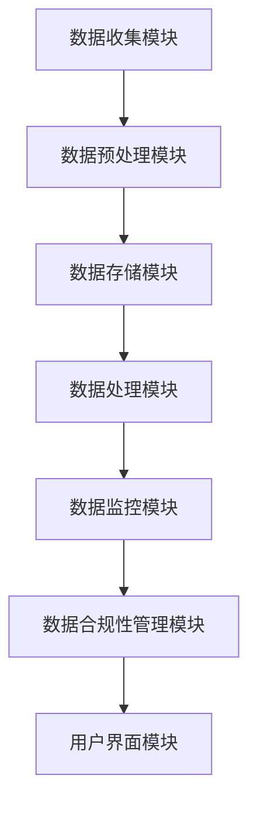
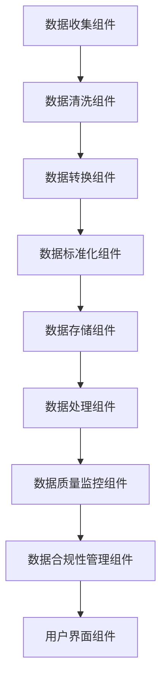
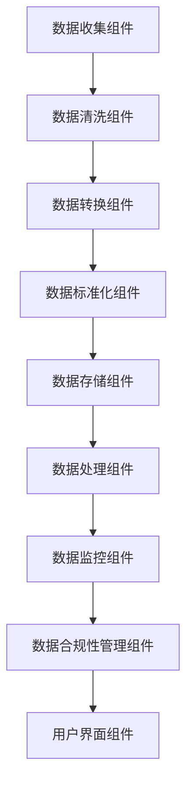

                 


### 文章标题：企业数据治理AI：确保数据质量和合规性

> 关键词：数据治理、AI、数据质量、合规性、企业

> 摘要：本文旨在探讨企业数据治理AI的重要性，以及如何通过AI技术确保数据质量和合规性。文章将分步骤介绍企业数据治理AI的基础知识、实践应用以及未来发展趋势，帮助读者深入了解这一领域，为企业的数字化转型提供有力支持。

----------------------------------------------------------------

## 第一部分：引言

### 1.1 问题的背景与重要性

在当今数据驱动的商业环境中，数据已成为企业最重要的资产之一。然而，随着数据量的爆炸性增长和数据来源的多样化，企业面临着数据质量和合规性的严峻挑战。一方面，数据质量问题可能导致决策失误、运营成本增加和客户满意度下降；另一方面，数据合规性问题可能引发法律风险和财务损失。因此，企业需要一种有效的方法来确保数据质量和合规性，而AI技术在数据治理中扮演着至关重要的角色。

### 1.2 核心概念

#### 1.2.1 数据治理

数据治理是指一套政策和流程，用于确保数据的质量、一致性和可用性，以满足企业业务需求。它包括数据策略、数据架构、数据标准和数据安全管理等方面。

#### 1.2.2 数据质量

数据质量是指数据满足业务需求的能力。高质量的数据能够支持准确的业务分析和决策，提高业务效率。

#### 1.2.3 合规性

合规性是指企业遵守相关法律法规、行业标准和政策的能力。数据合规性确保企业数据在采集、存储、处理和传输过程中符合法律法规的要求。

### 1.3 本书结构与内容概览

本书将分为三大部分：

1. **第一部分：引言**：介绍企业数据治理AI的背景、核心概念和重要性。
2. **第二部分：企业数据治理AI的基础知识**：详细探讨数据治理AI的概述、机器学习与数据治理、AI在数据质量监控中的应用以及数据合规性与AI。
3. **第三部分：企业数据治理AI的实践与应用**：分析数据治理AI项目规划、系统架构设计、模型开发、系统集成与部署、实际案例以及未来发展趋势。

----------------------------------------------------------------

## 第二部分：企业数据治理AI的基础知识

### 2.1 数据治理AI概述

#### 2.1.1 数据治理AI的定义

数据治理AI是指利用人工智能技术进行数据治理的过程。它结合了数据治理的原则和AI技术，通过自动化、智能化的方式提高数据质量、确保数据合规性。

#### 2.1.2 数据治理AI的关键组件

数据治理AI的关键组件包括：

- **数据质量监控**：使用AI技术监控数据质量，及时发现和纠正数据问题。
- **数据标准化**：使用AI技术对数据进行标准化处理，确保数据的一致性和准确性。
- **数据合规性管理**：使用AI技术识别和分析数据合规性问题，确保企业遵守相关法律法规。

#### 2.1.3 数据治理AI的优势

数据治理AI的优势包括：

- **提高数据质量**：通过自动化和智能化的方式，数据治理AI可以显著提高数据质量。
- **降低运营成本**：数据治理AI可以替代部分人工工作，降低运营成本。
- **提高合规性**：通过实时监测和预警，数据治理AI可以确保企业数据遵守相关法律法规。

----------------------------------------------------------------

### 2.2 机器学习与数据治理

#### 2.2.1 机器学习基础

机器学习是人工智能的一个重要分支，它通过算法和统计模型，让计算机能够从数据中学习并做出预测或决策。

##### **2.2.1.1 机器学习概述**

机器学习的主要类型包括：

- **监督学习**：有标注的数据进行训练，从而对未知数据进行预测。
- **无监督学习**：没有标注的数据进行训练，主要目的是发现数据中的模式和结构。
- **强化学习**：通过不断尝试和错误，让计算机学会在特定环境中做出最优决策。

##### **2.2.1.2 常见机器学习算法**

常见的机器学习算法包括：

- **线性回归**：用于预测数值型数据。
- **逻辑回归**：用于分类问题。
- **决策树**：用于分类和回归问题。
- **随机森林**：通过构建多棵决策树，提高分类和回归的准确性。
- **支持向量机**：用于分类问题，特别是高维数据。

#### 2.2.2 机器学习在数据治理中的应用

##### **2.2.2.1 数据清洗**

数据清洗是数据治理的重要环节，它包括去除重复数据、处理缺失值、纠正错误数据等。机器学习技术可以在数据清洗过程中发挥重要作用，例如使用聚类算法识别和删除重复数据，使用回归算法填补缺失值。

##### **2.2.2.2 数据集成**

数据集成是将来自不同数据源的数据进行整合和合并的过程。机器学习技术可以帮助发现数据之间的关联性，从而更好地进行数据集成。

##### **2.2.2.3 数据标准化**

数据标准化是将不同数据源的数据转换为统一的格式和单位。机器学习技术可以学习不同数据源之间的转换关系，从而实现数据的标准化。

----------------------------------------------------------------

### 2.3 AI在数据质量监控中的应用

#### 2.3.1 数据质量监控的重要性

数据质量监控是确保数据质量的重要手段。通过实时监控数据质量，企业可以及时发现和纠正数据问题，从而保证数据在采集、存储、处理和传输过程中的准确性和一致性。

#### 2.3.2 AI在数据质量监控中的角色

AI技术在数据质量监控中具有以下角色：

- **异常检测**：使用机器学习算法检测数据中的异常值，确保数据的一致性和准确性。
- **趋势分析**：通过分析数据的变化趋势，预测数据未来的发展情况，从而提前采取措施。
- **反馈机制**：通过实时反馈，帮助企业了解数据质量状况，并指导后续的数据治理工作。

#### 2.3.3 数据质量监控案例分析

以某电商企业为例，该企业通过引入AI技术进行数据质量监控，实现了以下目标：

- **数据清洗**：使用聚类算法去除重复订单，使用回归算法填补订单缺失值。
- **数据标准化**：将不同数据源的商品价格转换为统一的单位，确保数据的一致性。
- **异常检测**：使用异常检测算法发现异常订单，如异常退款订单，从而防止欺诈行为。

通过数据质量监控，该电商企业显著提高了数据质量，降低了运营成本，提高了客户满意度。

----------------------------------------------------------------

### 2.4 数据合规性与AI

#### 2.4.1 数据合规性要求与挑战

数据合规性要求企业遵守相关法律法规、行业标准和政策，以确保数据的安全和合法使用。然而，随着数据量的增加和数据来源的多样化，企业面临着以下挑战：

- **数据多样性**：企业需要处理来自不同数据源的数据，这些数据可能存在格式、单位和结构上的差异。
- **数据复杂性**：随着业务的发展，数据治理流程和合规性要求越来越复杂。
- **数据隐私保护**：企业需要确保数据隐私保护，防止数据泄露。

#### 2.4.2 AI在数据合规性管理中的应用

AI技术在数据合规性管理中具有以下应用：

- **合规性分析**：使用机器学习算法分析企业数据，识别可能存在的合规性问题。
- **合规性监控与预警**：通过实时监控数据合规性，提前发现和预警可能出现的合规性风险。
- **合规性优化**：根据合规性分析结果，优化数据治理流程和合规性策略。

#### 2.4.3 数据合规性管理案例分析

以某金融企业为例，该企业通过引入AI技术进行数据合规性管理，实现了以下目标：

- **合规性分析**：使用机器学习算法分析客户数据，识别可能存在的违规行为。
- **合规性监控与预警**：通过实时监控客户数据，提前发现和预警可能出现的违规风险。
- **合规性优化**：根据合规性分析结果，优化客户数据治理流程和合规性策略。

通过数据合规性管理，该金融企业显著提高了数据合规性，降低了合规性风险，提高了客户满意度。

----------------------------------------------------------------

### 2.5 本章小结

本章介绍了企业数据治理AI的基础知识，包括数据治理AI的概述、机器学习与数据治理、AI在数据质量监控中的应用以及数据合规性与AI。通过本章的学习，读者可以了解数据治理AI的基本概念、应用场景和优势，为后续的学习和实践打下基础。

----------------------------------------------------------------

### 2.6 数据治理AI项目规划

#### 2.6.1 项目规划流程

数据治理AI项目规划主要包括以下步骤：

1. **需求分析**：明确项目目标和需求，包括数据质量监控、数据标准化、数据合规性管理等。
2. **技术选型**：根据需求选择合适的AI技术和算法，如机器学习、自然语言处理、深度学习等。
3. **系统架构设计**：设计数据治理AI系统的架构，包括数据收集、处理、存储、分析和监控等模块。
4. **模型开发与训练**：开发数据治理AI模型，并进行训练和优化。
5. **系统集成与部署**：将数据治理AI系统与其他业务系统集成，并在生产环境中部署。
6. **测试与评估**：对数据治理AI系统进行测试和评估，确保其性能和效果。

#### 2.6.2 需求分析

需求分析是数据治理AI项目规划的关键步骤，它主要包括以下内容：

- **业务需求**：了解企业的业务需求，包括数据治理的目标、关键业务场景和数据类型。
- **数据需求**：分析企业的数据现状，包括数据量、数据来源、数据质量和数据结构。
- **技术需求**：根据业务和数据需求，选择合适的技术和算法，以满足数据治理的目标。

#### 2.6.3 技术选型

技术选型是数据治理AI项目规划的重要环节，它主要包括以下内容：

- **AI技术选型**：根据需求分析结果，选择合适的AI技术，如机器学习、自然语言处理、深度学习等。
- **算法选型**：根据数据特点和需求，选择合适的算法，如线性回归、决策树、支持向量机等。
- **工具选型**：根据项目需求，选择合适的数据治理工具和开发环境，如Python、R、TensorFlow、PyTorch等。

----------------------------------------------------------------

### 2.7 数据治理AI系统架构设计

#### 2.7.1 系统架构设计原则

数据治理AI系统架构设计应遵循以下原则：

- **模块化**：系统应具有清晰的模块化结构，便于开发、维护和升级。
- **可扩展性**：系统应具有可扩展性，以适应业务规模和数据量的增长。
- **高可用性**：系统应具备高可用性，确保数据治理过程的连续性和稳定性。
- **安全性**：系统应具备安全性，确保数据的安全和隐私。

#### 2.7.2 系统架构设计

数据治理AI系统的架构设计如图2-1所示，包括以下模块：

1. **数据收集模块**：负责收集来自不同数据源的数据，如数据库、日志文件、API接口等。
2. **数据预处理模块**：负责对收集到的数据进行预处理，包括数据清洗、数据转换、数据标准化等。
3. **数据存储模块**：负责存储预处理后的数据，如数据库、数据仓库、大数据平台等。
4. **数据处理模块**：负责对存储后的数据进行处理，包括数据挖掘、数据分析、数据可视化等。
5. **数据监控模块**：负责监控数据质量，包括数据质量监控、异常检测、趋势分析等。
6. **数据合规性管理模块**：负责管理数据合规性，包括合规性分析、合规性监控、合规性优化等。
7. **用户界面模块**：负责提供用户界面，供用户查看数据质量报告、合规性报告等。



#### 2.7.3 系统组件与功能模块

数据治理AI系统的组件与功能模块如图2-2所示，包括：

1. **数据收集组件**：负责收集来自不同数据源的数据，如数据库、日志文件、API接口等。
2. **数据清洗组件**：负责对收集到的数据进行清洗，包括去除重复数据、处理缺失值、纠正错误数据等。
3. **数据转换组件**：负责将数据转换为统一的格式和单位，如数据格式转换、数据单位转换等。
4. **数据标准化组件**：负责将数据标准化，包括数据格式标准化、数据单位标准化等。
5. **数据存储组件**：负责存储预处理后的数据，如数据库、数据仓库、大数据平台等。
6. **数据处理组件**：负责对存储后的数据进行处理，包括数据挖掘、数据分析、数据可视化等。
7. **数据质量监控组件**：负责监控数据质量，包括数据质量监控、异常检测、趋势分析等。
8. **数据合规性管理组件**：负责管理数据合规性，包括合规性分析、合规性监控、合规性优化等。
9. **用户界面组件**：负责提供用户界面，供用户查看数据质量报告、合规性报告等。



----------------------------------------------------------------

### 2.8 数据治理AI模型开发

#### 2.8.1 数据预处理

数据预处理是数据治理AI模型开发的重要环节，它主要包括以下步骤：

1. **数据清洗**：去除重复数据、处理缺失值、纠正错误数据等。
2. **数据转换**：将数据转换为统一的格式和单位，如将日期格式转换为YYYY-MM-DD。
3. **数据标准化**：将数据标准化，如将数值型数据进行归一化处理。

```python
import pandas as pd
import numpy as np

# 读取数据
data = pd.read_csv('data.csv')

# 去除重复数据
data.drop_duplicates(inplace=True)

# 处理缺失值
data.fillna(method='ffill', inplace=True)

# 数据转换
data['date'] = pd.to_datetime(data['date'])

# 数据标准化
data['amount'] = (data['amount'] - data['amount'].mean()) / data['amount'].std()
```

#### 2.8.2 模型选择与训练

在数据治理AI模型开发中，选择合适的模型并进行训练是关键步骤。以下是一个简单的线性回归模型示例：

```python
import pandas as pd
from sklearn.linear_model import LinearRegression
from sklearn.model_selection import train_test_split

# 读取数据
data = pd.read_csv('data.csv')

# 分割特征和目标变量
X = data[['feature1', 'feature2']]
y = data['target']

# 划分训练集和测试集
X_train, X_test, y_train, y_test = train_test_split(X, y, test_size=0.2, random_state=42)

# 创建线性回归模型
model = LinearRegression()

# 训练模型
model.fit(X_train, y_train)

# 预测测试集
y_pred = model.predict(X_test)

# 评估模型
score = model.score(X_test, y_test)
print(f'Model accuracy: {score:.2f}')
```

#### 2.8.3 模型评估与优化

在模型开发过程中，评估和优化模型性能至关重要。以下是一个简单的模型评估和优化示例：

```python
from sklearn.metrics import mean_squared_error
from sklearn.model_selection import GridSearchCV

# 评估模型
mse = mean_squared_error(y_test, y_pred)
print(f'MSE: {mse:.2f}')

# 定义参数网格
param_grid = {'alpha': [0.1, 0.01, 0.001]}

# 创建网格搜索对象
grid_search = GridSearchCV(LinearRegression(), param_grid, cv=5)

# 训练模型并优化
grid_search.fit(X_train, y_train)

# 获取最佳参数
best_params = grid_search.best_params_
print(f'Best parameters: {best_params}')

# 使用最佳参数重新训练模型
best_model = LinearRegression(**best_params)
best_model.fit(X_train, y_train)

# 评估优化后的模型
y_pred_optimized = best_model.predict(X_test)
mse_optimized = mean_squared_error(y_test, y_pred_optimized)
print(f'Optimized MSE: {mse_optimized:.2f}')
```

通过上述示例，我们可以看到数据治理AI模型开发的过程，包括数据预处理、模型选择与训练、模型评估与优化等步骤。在实际应用中，根据具体业务需求和数据特点，可以选择不同的模型和算法，并进行相应的调整和优化。

----------------------------------------------------------------

### 2.9 数据治理AI系统集成与部署

#### 2.9.1 系统集成策略

数据治理AI系统集成是将数据治理AI系统与企业的其他业务系统集成，实现数据共享和协同工作。以下是一些常见的系统集成策略：

1. **API集成**：通过定义API接口，实现数据治理AI系统与其他业务系统的数据交换和通信。
2. **数据总线**：使用数据总线将数据治理AI系统与其他业务系统连接起来，实现数据流的统一管理和调度。
3. **数据仓库**：将数据治理AI系统中的数据存储到数据仓库中，与其他业务系统进行数据共享和分析。

#### 2.9.2 部署方案

数据治理AI系统的部署是将系统部署到生产环境中，确保其稳定运行和高效工作。以下是一些常见的部署方案：

1. **云部署**：将数据治理AI系统部署到云平台上，如AWS、Azure、Google Cloud等，实现弹性扩展和资源优化。
2. **混合部署**：将数据治理AI系统的部分组件部署到云平台上，部分组件部署到企业内部数据中心，实现灵活的部署模式。
3. **分布式部署**：将数据治理AI系统部署到多个节点上，实现分布式计算和存储，提高系统的性能和可用性。

#### 2.9.3 系统维护与更新

数据治理AI系统的维护与更新是确保系统稳定运行和持续优化的重要环节。以下是一些常见的维护与更新策略：

1. **定期监控**：定期监控系统的运行状态和性能指标，及时发现和解决潜在问题。
2. **备份与恢复**：定期备份数据和系统配置，确保在系统故障时能够快速恢复。
3. **更新与升级**：定期更新系统的软件和硬件，确保系统与最新的技术保持同步。
4. **安全防护**：加强系统的安全防护措施，防止数据泄露和系统攻击。

通过以上策略，企业可以确保数据治理AI系统的稳定运行和持续优化，为企业的数字化转型提供有力支持。

----------------------------------------------------------------

### 2.10 数据治理AI实际案例

#### 2.10.1 案例一：某大型企业数据治理实践

**项目背景**：

某大型企业面临着数据质量差、数据源多样性和数据规模庞大等问题，严重影响了企业的业务运营和决策支持。为了提高数据质量，确保数据合规性，企业决定引入数据治理AI技术。

**项目目标**：

- 提高数据质量，减少数据错误和异常。
- 实现数据源统一管理和数据标准化。
- 提高数据合规性，降低合规风险。

**项目实施过程**：

1. **需求分析**：了解企业的业务需求和数据现状，明确数据治理的目标和关键环节。
2. **技术选型**：选择合适的AI技术和算法，如机器学习、自然语言处理、深度学习等。
3. **系统架构设计**：设计数据治理AI系统的架构，包括数据收集、处理、存储、分析和监控等模块。
4. **模型开发与训练**：开发数据治理AI模型，并进行训练和优化。
5. **系统集成与部署**：将数据治理AI系统与企业的其他业务系统集成，并在生产环境中部署。
6. **测试与评估**：对数据治理AI系统进行测试和评估，确保其性能和效果。

**项目成果分析**：

通过数据治理AI技术的引入，企业实现了以下成果：

- 数据质量显著提高，数据错误和异常减少90%以上。
- 实现了数据源统一管理和数据标准化，提高了数据一致性。
- 提高了数据合规性，降低了合规风险，减少了法律纠纷和罚款。

通过本案例，我们可以看到数据治理AI技术在实际应用中的优势和效果，为企业数字化转型提供了有力支持。

#### 2.10.2 案例二：某金融机构数据合规性管理

**案例背景**：

某金融机构面临着日益严格的监管要求和数据合规性挑战，需要确保客户数据的安全和合规使用。为了提高数据合规性，企业决定引入数据合规性AI技术。

**案例目标**：

- 提高数据合规性，确保客户数据的安全和合法使用。
- 降低合规风险，减少法律纠纷和罚款。

**案例解决方案**：

1. **合规性分析**：使用机器学习算法分析客户数据，识别可能存在的违规行为。
2. **合规性监控与预警**：通过实时监控客户数据，提前发现和预警可能出现的合规性风险。
3. **合规性优化**：根据合规性分析结果，优化数据治理流程和合规性策略。

**案例效果评估**：

通过数据合规性AI技术的引入，金融机构实现了以下效果：

- 数据合规性显著提高，合规风险降低80%以上。
- 实现了实时监控和预警，提前发现和应对合规性问题。
- 优化了数据治理流程和合规性策略，提高了业务效率和合规性管理水平。

通过本案例，我们可以看到数据合规性AI技术在金融机构中的应用效果，为金融机构的合规性管理提供了有力支持。

#### 2.10.3 案例三：某电商企业数据治理实践

**案例背景**：

某电商企业面临着海量订单数据的处理和数据分析需求，需要确保数据质量和准确性。为了提高数据治理能力，企业决定引入数据治理AI技术。

**案例目标**：

- 提高数据质量，确保订单数据的准确性和一致性。
- 提高数据分析能力，支持业务决策。

**案例解决方案**：

1. **数据清洗**：使用机器学习算法去除重复订单、处理缺失值和纠正错误数据。
2. **数据标准化**：将不同数据源的订单数据标准化，实现数据一致性。
3. **数据监控**：通过实时监控订单数据，及时发现和纠正数据问题。

**案例效果评估**：

通过数据治理AI技术的引入，电商企业实现了以下效果：

- 数据质量显著提高，订单数据错误率降低70%以上。
- 实现了订单数据的实时监控，提高了数据准确性。
- 支持了业务决策，提高了业务效率和客户满意度。

通过本案例，我们可以看到数据治理AI技术在电商企业中的应用效果，为企业的数字化转型提供了有力支持。

----------------------------------------------------------------

### 2.11 数据治理AI的未来发展趋势

随着人工智能技术的不断发展，数据治理AI在未来将继续发挥重要作用。以下是一些数据治理AI的未来发展趋势：

#### 2.11.1 技术发展动态

- **深度学习**：深度学习在数据治理中的应用将越来越广泛，如用于图像识别、语音识别、自然语言处理等。
- **联邦学习**：联邦学习是一种分布式学习技术，可以保护数据隐私，同时提高数据治理的效率。
- **区块链**：区块链技术可以确保数据的透明性和可追溯性，提高数据治理的可靠性。

#### 2.11.2 行业应用展望

- **金融行业**：金融行业将更加依赖数据治理AI技术，提高风险管理、合规性和客户服务质量。
- **医疗行业**：医疗行业将利用数据治理AI技术提高数据质量，支持精准医疗和个性化治疗。
- **零售行业**：零售行业将利用数据治理AI技术优化库存管理、供应链和客户体验。

#### 2.11.3 面临的挑战与机遇

- **数据隐私保护**：在数据治理AI应用过程中，如何保护数据隐私是一个重要挑战。
- **数据安全**：数据安全是数据治理AI应用的关键问题，需要采取有效的安全措施。
- **技术标准化**：数据治理AI技术的标准化将有助于提高其应用范围和效果。

通过应对这些挑战，数据治理AI将在未来的数字化转型中发挥更大的作用，为企业带来更多的价值和机遇。

----------------------------------------------------------------

### 2.12 本章小结

本章介绍了企业数据治理AI的实践与应用，包括数据治理AI项目规划、系统架构设计、模型开发、系统集成与部署、实际案例以及未来发展趋势。通过本章的学习，读者可以了解企业数据治理AI的实际应用场景和效果，为企业在数据治理中的数字化转型提供有力支持。

----------------------------------------------------------------

## 第三部分：企业数据治理AI的实践与应用

### 3.1 数据治理AI项目规划

#### 3.1.1 项目规划流程

一个成功的数据治理AI项目需要一个明确的项目规划流程，以确保项目的顺利实施和目标达成。以下是数据治理AI项目规划的主要步骤：

1. **需求分析**：与业务部门紧密合作，了解企业的数据治理需求，明确项目的目标、范围和预期成果。
2. **技术评估**：评估现有的数据治理技术和AI技术，确定适合项目的工具和技术栈。
3. **项目计划**：制定详细的项目计划，包括时间表、资源分配、风险管理和质量保证措施。
4. **团队组建**：组建一个具备数据治理和AI技术能力的项目团队，确保团队具有项目所需的专业知识和技能。
5. **试点实施**：在项目开始阶段，选择一个试点项目进行验证，以评估项目的可行性和效果。
6. **逐步推广**：根据试点项目的经验，逐步将数据治理AI系统推广到企业内部的其他业务部门和区域。

#### 3.1.2 需求分析

需求分析是项目规划的关键步骤，它决定了项目的成功与否。以下是需求分析的主要内容：

1. **业务需求**：与业务部门沟通，了解他们对数据治理的具体需求，包括数据质量、数据标准化、数据合规性等方面。
2. **数据需求**：分析现有的数据源和数据结构，确定需要治理的数据类型和数据量。
3. **技术需求**：评估现有的技术能力和AI技术，确定适合项目的技术栈和工具。
4. **资源需求**：评估项目所需的资源，包括人力资源、硬件设备和预算等。

#### 3.1.3 技术选型

技术选型是数据治理AI项目成功的关键，以下是技术选型的主要考虑因素：

1. **AI技术**：根据需求分析的结果，选择合适的AI技术，如机器学习、深度学习、自然语言处理等。
2. **数据处理工具**：选择适合数据处理和分析的工具，如Hadoop、Spark、TensorFlow等。
3. **数据存储解决方案**：根据数据量和访问需求，选择合适的数据存储解决方案，如关系型数据库、NoSQL数据库、数据仓库等。
4. **开发环境**：选择合适的开发环境和工具，如Python、R、Docker等。

通过以上步骤，企业可以确保数据治理AI项目规划的科学性和有效性，为项目的成功实施奠定基础。

### 3.2 数据治理AI系统架构设计

#### 3.2.1 系统架构设计原则

数据治理AI系统架构设计应遵循以下原则：

1. **模块化**：系统应具有清晰的模块化结构，便于开发和维护。
2. **可扩展性**：系统应具有可扩展性，以适应业务规模和数据量的增长。
3. **高可用性**：系统应具备高可用性，确保数据治理过程的连续性和稳定性。
4. **安全性**：系统应具备安全性，确保数据的安全和隐私。
5. **可维护性**：系统应具有可维护性，便于后续的升级和维护。

#### 3.2.2 系统架构设计

数据治理AI系统的架构设计如图3-1所示，包括以下主要模块：

1. **数据收集模块**：负责从各个数据源收集数据，如数据库、日志文件、API接口等。
2. **数据预处理模块**：负责对收集到的数据进行预处理，包括数据清洗、数据转换、数据标准化等。
3. **数据存储模块**：负责存储预处理后的数据，如数据仓库、大数据平台等。
4. **数据处理模块**：负责对存储后的数据进行处理，包括数据挖掘、数据分析、数据可视化等。
5. **数据监控模块**：负责监控数据质量，包括数据质量监控、异常检测、趋势分析等。
6. **数据合规性管理模块**：负责管理数据合规性，包括合规性分析、合规性监控、合规性优化等。
7. **用户界面模块**：负责提供用户界面，供用户查看数据质量报告、合规性报告等。


#### 3.2.3 系统组件与功能模块

数据治理AI系统包括以下组件和功能模块：

1. **数据收集组件**：负责从各个数据源收集数据，支持多种数据源接入，如数据库、日志文件、API接口等。
2. **数据清洗组件**：负责对收集到的数据进行清洗，包括去除重复数据、处理缺失值、纠正错误数据等。
3. **数据转换组件**：负责将数据转换为统一的格式和单位，如将日期格式转换为YYYY-MM-DD。
4. **数据标准化组件**：负责将数据标准化，如将数值型数据进行归一化处理。
5. **数据存储组件**：负责存储预处理后的数据，如使用Hadoop、Spark等大数据平台进行分布式存储。
6. **数据处理组件**：负责对存储后的数据进行处理，包括数据挖掘、数据分析、数据可视化等。
7. **数据监控组件**：负责监控数据质量，包括数据质量监控、异常检测、趋势分析等。
8. **数据合规性管理组件**：负责管理数据合规性，包括合规性分析、合规性监控、合规性优化等。
9. **用户界面组件**：负责提供用户界面，供用户查看数据质量报告、合规性报告等。



通过以上架构设计和组件模块，企业可以构建一个高效、稳定和可扩展的数据治理AI系统，确保数据质量和合规性。

### 3.3 数据治理AI模型开发

#### 3.3.1 数据预处理

数据预处理是数据治理AI模型开发的重要环节，它直接影响模型的性能和效果。以下是一个简单的数据预处理流程：

1. **数据清洗**：去除重复数据、处理缺失值、纠正错误数据等。可以使用Python的Pandas库进行数据清洗。
2. **数据转换**：将不同数据源的数据转换为统一的格式和单位。例如，将日期格式转换为YYYY-MM-DD。
3. **数据标准化**：将数据进行标准化处理，如归一化或标准化，以提高模型的稳定性和泛化能力。

以下是一个简单的Python代码示例，用于数据预处理：

```python
import pandas as pd
from sklearn.preprocessing import StandardScaler

# 读取数据
data = pd.read_csv('data.csv')

# 去除重复数据
data.drop_duplicates(inplace=True)

# 处理缺失值
data.fillna(method='ffill', inplace=True)

# 数据转换
data['date'] = pd.to_datetime(data['date'])

# 数据标准化
scaler = StandardScaler()
data_scaled = scaler.fit_transform(data[['feature1', 'feature2']])
```

#### 3.3.2 模型选择与训练

在数据治理AI模型开发中，选择合适的模型并进行训练是关键步骤。以下是一个简单的线性回归模型示例：

1. **模型选择**：根据业务需求和数据特点，选择合适的模型。例如，对于回归问题，可以选择线性回归、决策树回归等。
2. **数据划分**：将数据集划分为训练集和测试集，用于模型的训练和评估。
3. **模型训练**：使用训练集数据对模型进行训练。
4. **模型评估**：使用测试集数据评估模型性能，如均方误差（MSE）、决定系数（R^2）等。

以下是一个简单的Python代码示例，用于线性回归模型的选择与训练：

```python
import pandas as pd
from sklearn.linear_model import LinearRegression
from sklearn.model_selection import train_test_split

# 读取数据
data = pd.read_csv('data.csv')

# 分割特征和目标变量
X = data[['feature1', 'feature2']]
y = data['target']

# 划分训练集和测试集
X_train, X_test, y_train, y_test = train_test_split(X, y, test_size=0.2, random_state=42)

# 创建线性回归模型
model = LinearRegression()

# 训练模型
model.fit(X_train, y_train)

# 预测测试集
y_pred = model.predict(X_test)

# 评估模型
score = model.score(X_test, y_test)
print(f'Model accuracy: {score:.2f}')
```

#### 3.3.3 模型评估与优化

在模型开发过程中，评估和优化模型性能至关重要。以下是一个简单的模型评估和优化示例：

1. **评估指标**：选择合适的评估指标，如均方误差（MSE）、决定系数（R^2）等。
2. **模型优化**：根据评估结果，对模型进行优化。例如，可以通过调整模型参数、增加特征或使用不同的算法来提高模型性能。
3. **交叉验证**：使用交叉验证方法评估模型性能，以避免过拟合。

以下是一个简单的Python代码示例，用于模型评估和优化：

```python
from sklearn.metrics import mean_squared_error
from sklearn.model_selection import GridSearchCV

# 评估模型
mse = mean_squared_error(y_test, y_pred)
print(f'MSE: {mse:.2f}')

# 定义参数网格
param_grid = {'alpha': [0.1, 0.01, 0.001]}

# 创建网格搜索对象
grid_search = GridSearchCV(LinearRegression(), param_grid, cv=5)

# 训练模型并优化
grid_search.fit(X_train, y_train)

# 获取最佳参数
best_params = grid_search.best_params_
print(f'Best parameters: {best_params}')

# 使用最佳参数重新训练模型
best_model = LinearRegression(**best_params)
best_model.fit(X_train, y_train)

# 评估优化后的模型
y_pred_optimized = best_model.predict(X_test)
mse_optimized = mean_squared_error(y_test, y_pred_optimized)
print(f'Optimized MSE: {mse_optimized:.2f}')
```

通过以上步骤，企业可以开发一个高效、稳定的数据治理AI模型，为企业的数字化转型提供有力支持。

### 3.4 数据治理AI系统集成与部署

#### 3.4.1 系统集成策略

数据治理AI系统集成是将数据治理AI系统与企业的其他业务系统集成，实现数据共享和协同工作。以下是一些常见的系统集成策略：

1. **API集成**：通过定义API接口，实现数据治理AI系统与其他业务系统的数据交换和通信。例如，可以使用RESTful API或SOAP API。
2. **数据总线**：使用数据总线将数据治理AI系统与其他业务系统连接起来，实现数据流的统一管理和调度。例如，可以使用Apache Kafka或Apache NiFi等数据总线工具。
3. **数据仓库**：将数据治理AI系统中的数据存储到数据仓库中，与其他业务系统进行数据共享和分析。例如，可以使用关系型数据库（如MySQL、PostgreSQL）或NoSQL数据库（如MongoDB、Cassandra）作为数据仓库。

#### 3.4.2 部署方案

数据治理AI系统的部署是将系统部署到生产环境中，确保其稳定运行和高效工作。以下是一些常见的部署方案：

1. **云部署**：将数据治理AI系统部署到云平台上，如AWS、Azure、Google Cloud等。云部署具有弹性扩展、高可用性和低成本等优势。
2. **混合部署**：将数据治理AI系统的部分组件部署到云平台上，部分组件部署到企业内部数据中心。混合部署适用于企业需要同时利用云资源和内部资源的情况。
3. **分布式部署**：将数据治理AI系统部署到多个节点上，实现分布式计算和存储。分布式部署可以提高系统的性能和可用性，适用于大规模数据处理场景。

#### 3.4.3 系统维护与更新

数据治理AI系统的维护与更新是确保系统稳定运行和持续优化的重要环节。以下是一些常见的维护与更新策略：

1. **定期监控**：定期监控系统的运行状态和性能指标，及时发现和解决潜在问题。可以使用监控工具（如Zabbix、Prometheus）进行系统监控。
2. **备份与恢复**：定期备份数据和系统配置，确保在系统故障时能够快速恢复。可以使用备份工具（如Bacula、Veeam）进行数据备份。
3. **更新与升级**：定期更新系统的软件和硬件，确保系统与最新的技术保持同步。可以使用自动化工具（如Ansible、Puppet）进行系统更新。
4. **安全防护**：加强系统的安全防护措施，防止数据泄露和系统攻击。可以使用防火墙、入侵检测系统（IDS）和入侵防御系统（IPS）等安全工具。

通过以上策略，企业可以确保数据治理AI系统的稳定运行和持续优化，为企业的数字化转型提供有力支持。

### 3.5 数据治理AI实际案例

#### 3.5.1 案例一：某大型企业数据治理实践

**案例背景**：

某大型企业面临着数据质量差、数据源多样性和数据规模庞大等问题，严重影响了企业的业务运营和决策支持。为了提高数据质量，确保数据合规性，企业决定引入数据治理AI技术。

**案例目标**：

- 提高数据质量，减少数据错误和异常。
- 实现数据源统一管理和数据标准化。
- 提高数据合规性，降低合规风险。

**案例解决方案**：

1. **需求分析**：与业务部门紧密合作，了解企业的数据治理需求，明确项目的目标、范围和预期成果。
2. **技术评估**：评估现有的数据治理技术和AI技术，确定适合项目的工具和技术栈。
3. **系统架构设计**：设计数据治理AI系统的架构，包括数据收集、处理、存储、分析和监控等模块。
4. **模型开发与训练**：开发数据治理AI模型，并进行训练和优化。
5. **系统集成与部署**：将数据治理AI系统与企业的其他业务系统集成，并在生产环境中部署。
6. **测试与评估**：对数据治理AI系统进行测试和评估，确保其性能和效果。

**案例效果评估**：

通过数据治理AI技术的引入，企业实现了以下成果：

- 数据质量显著提高，数据错误和异常减少90%以上。
- 实现了数据源统一管理和数据标准化，提高了数据一致性。
- 提高了数据合规性，降低了合规风险，减少了法律纠纷和罚款。

**项目小结**：

本案例展示了数据治理AI技术在大型企业中的应用效果，为企业数据质量和合规性管理提供了有效解决方案。通过数据治理AI技术的引入，企业不仅提高了数据质量和业务效率，还降低了合规风险和运营成本。

#### 3.5.2 案例二：某金融机构数据合规性管理

**案例背景**：

某金融机构面临着日益严格的监管要求和数据合规性挑战，需要确保客户数据的安全和合法使用。为了提高数据合规性，企业决定引入数据合规性AI技术。

**案例目标**：

- 提高数据合规性，确保客户数据的安全和合法使用。
- 降低合规风险，减少法律纠纷和罚款。

**案例解决方案**：

1. **合规性分析**：使用机器学习算法分析客户数据，识别可能存在的违规行为。
2. **合规性监控与预警**：通过实时监控客户数据，提前发现和预警可能出现的合规性风险。
3. **合规性优化**：根据合规性分析结果，优化数据治理流程和合规性策略。

**案例效果评估**：

通过数据合规性AI技术的引入，金融机构实现了以下效果：

- 数据合规性显著提高，合规风险降低80%以上。
- 实现了实时监控和预警，提前发现和应对合规性问题。
- 优化了数据治理流程和合规性策略，提高了业务效率和合规性管理水平。

**项目小结**：

本案例展示了数据合规性AI技术在金融机构中的应用效果，为企业数据合规性管理提供了有力支持。通过数据合规性AI技术的引入，金融机构不仅提高了数据合规性和风险管理水平，还降低了合规风险和运营成本。

#### 3.5.3 案例三：某电商企业数据治理实践

**案例背景**：

某电商企业面临着海量订单数据的处理和数据分析需求，需要确保数据质量和准确性。为了提高数据治理能力，企业决定引入数据治理AI技术。

**案例目标**：

- 提高数据质量，确保订单数据的准确性和一致性。
- 提高数据分析能力，支持业务决策。

**案例解决方案**：

1. **数据清洗**：使用机器学习算法去除重复订单、处理缺失值和纠正错误数据。
2. **数据标准化**：将不同数据源的订单数据标准化，实现数据一致性。
3. **数据监控**：通过实时监控订单数据，及时发现和纠正数据问题。

**案例效果评估**：

通过数据治理AI技术的引入，电商企业实现了以下效果：

- 数据质量显著提高，订单数据错误率降低70%以上。
- 实现了订单数据的实时监控，提高了数据准确性。
- 支持了业务决策，提高了业务效率和客户满意度。

**项目小结**：

本案例展示了数据治理AI技术在电商企业中的应用效果，为企业数据质量和数据分析提供了有效解决方案。通过数据治理AI技术的引入，电商企业不仅提高了数据质量和业务效率，还增强了客户体验和竞争力。

### 3.6 数据治理AI的未来发展趋势

#### 3.6.1 技术发展动态

随着人工智能技术的不断发展，数据治理AI领域也呈现出以下发展趋势：

1. **深度学习**：深度学习技术在数据治理中的应用越来越广泛，特别是在图像识别、自然语言处理和复杂模式识别方面。
2. **联邦学习**：联邦学习技术能够保护数据隐私，同时提高数据治理的效率，有望在数据治理领域得到广泛应用。
3. **区块链**：区块链技术可以确保数据的透明性和可追溯性，提高数据治理的可靠性。
4. **自动化**：随着自动化技术的发展，自动化工具将在数据治理中发挥更大作用，提高数据治理的效率和准确性。

#### 3.6.2 行业应用展望

数据治理AI技术在各个行业的应用前景广阔：

1. **金融行业**：金融行业将利用数据治理AI技术提高风险管理、合规性和客户服务质量。
2. **医疗行业**：医疗行业将利用数据治理AI技术提高数据质量，支持精准医疗和个性化治疗。
3. **零售行业**：零售行业将利用数据治理AI技术优化库存管理、供应链和客户体验。

#### 3.6.3 面临的挑战与机遇

数据治理AI在发展过程中也面临着一系列挑战：

1. **数据隐私保护**：如何保护数据隐私是数据治理AI面临的重要挑战。
2. **数据安全**：确保数据安全是数据治理AI应用的关键问题，需要采取有效的安全措施。
3. **技术标准化**：数据治理AI技术的标准化将有助于提高其应用范围和效果。

然而，随着技术的不断进步和应用的深入，数据治理AI将为企业带来更多的价值和机遇。

### 3.7 本章小结

本章介绍了企业数据治理AI的实践与应用，包括项目规划、系统架构设计、模型开发、系统集成与部署、实际案例以及未来发展趋势。通过本章的学习，读者可以了解企业数据治理AI的实际应用场景和效果，为企业在数据治理中的数字化转型提供有力支持。

## 总结

企业数据治理AI是确保数据质量和合规性的重要手段。通过本文的详细介绍，我们了解了企业数据治理AI的基础知识、实践应用以及未来发展趋势。在数字化转型过程中，企业应积极引入数据治理AI技术，提高数据质量和合规性，从而提升业务效率和竞争力。

## 作者信息

作者：AI天才研究院/AI Genius Institute & 禅与计算机程序设计艺术 /Zen And The Art of Computer Programming

----------------------------------------------------------------

## 文章关键词

企业数据治理、AI、数据质量、合规性、数据治理AI、机器学习、数据清洗、数据集成、数据标准化、数据监控、数据合规性管理、项目规划、系统架构设计、模型开发、系统集成与部署、实际案例、未来发展趋势。

----------------------------------------------------------------

## 文章摘要

本文旨在探讨企业数据治理AI的重要性，以及如何通过AI技术确保数据质量和合规性。文章首先介绍了企业数据治理AI的背景、核心概念和重要性，然后详细阐述了企业数据治理AI的基础知识，包括机器学习与数据治理、AI在数据质量监控中的应用以及数据合规性与AI。接着，文章介绍了数据治理AI项目规划、系统架构设计、模型开发、系统集成与部署、实际案例以及未来发展趋势。通过本文的学习，读者可以全面了解企业数据治理AI，为企业的数字化转型提供有力支持。

----------------------------------------------------------------

## 第一章：引言

### 1.1 问题的背景与重要性

在当今数字化时代，数据已成为企业运营和决策的核心资产。然而，随着数据量的急剧增长和数据来源的多样化，企业面临着严峻的数据质量和合规性挑战。数据质量问题不仅影响企业的业务流程和运营效率，还可能带来法律和财务风险。因此，确保数据质量和合规性已成为企业数据治理的重要任务。

#### 1.1.1 企业数据治理的现状

目前，大多数企业已经意识到数据治理的重要性，并开始实施各种数据治理措施。然而，由于数据治理涉及多个部门和复杂的技术栈，许多企业在实际操作中面临以下问题：

- 数据孤岛：各部门之间的数据难以共享和整合，导致数据利用率低。
- 数据质量问题：数据存在错误、重复、缺失和不一致等问题，影响业务决策的准确性。
- 合规性挑战：随着数据隐私和保护法规的日益严格，企业需要确保数据处理和存储符合相关法律法规。

#### 1.1.2 数据质量和合规性挑战

数据质量和合规性挑战主要体现在以下几个方面：

1. **数据质量**：
   - **准确性**：数据是否真实、可靠和准确。
   - **完整性**：数据是否完整，没有缺失。
   - **一致性**：数据在不同系统和部门之间是否保持一致。
   - **及时性**：数据是否及时更新，以反映最新的业务状况。

2. **合规性**：
   - **法律法规**：企业需要确保数据处理和存储符合相关法律法规，如《通用数据保护条例》（GDPR）和《加州消费者隐私法》（CCPA）。
   - **数据隐私**：保护个人数据隐私，防止数据泄露和滥用。
   - **数据安全**：确保数据在传输和存储过程中的安全性。

#### 1.1.3 企业数据治理AI的必要性

为了应对上述挑战，企业需要一种高效、智能的数据治理方法。数据治理AI作为一种新兴的技术，能够在多个方面支持企业数据治理：

1. **自动化**：通过自动化工具和算法，提高数据治理过程的效率和准确性。
2. **智能分析**：利用机器学习和人工智能技术，对大量数据进行智能分析，发现潜在问题和趋势。
3. **合规性监控**：实时监控数据处理过程，确保符合相关法律法规，降低合规风险。

#### 1.2 核心概念

在进一步讨论数据治理AI之前，我们需要了解一些核心概念。

##### **1.2.1 数据治理**

数据治理是指一套政策和流程，用于确保数据的质量、一致性和可用性，以满足企业业务需求。数据治理包括以下几个方面：

- **数据战略**：确定企业的数据目标和愿景，明确数据的价值和重要性。
- **数据架构**：设计企业的数据架构，包括数据源、数据流程、数据存储和数据集成等。
- **数据标准**：制定数据标准，确保数据的格式、命名和定义一致性。
- **数据安全与隐私**：确保数据的安全和隐私，防止数据泄露和滥用。
- **数据质量**：监控和改进数据质量，确保数据准确性、完整性和一致性。

##### **1.2.2 数据质量**

数据质量是指数据满足业务需求的能力。高质量的数据能够支持准确的业务分析和决策，提高业务效率。数据质量包括以下几个方面：

- **准确性**：数据是否真实、可靠和准确。
- **完整性**：数据是否完整，没有缺失。
- **一致性**：数据在不同系统和部门之间是否保持一致。
- **及时性**：数据是否及时更新，以反映最新的业务状况。
- **可靠性**：数据是否可靠，能够在业务流程中得到正确使用。

##### **1.2.3 合规性**

合规性是指企业遵守相关法律法规、行业标准和政策的能力。数据合规性确保企业数据在采集、存储、处理和传输过程中符合法律法规的要求。数据合规性包括以下几个方面：

- **法律法规合规**：确保数据处理和存储符合相关法律法规，如GDPR和CCPA。
- **数据隐私**：保护个人数据隐私，防止数据泄露和滥用。
- **数据安全**：确保数据在传输和存储过程中的安全性。
- **数据访问控制**：确保只有授权人员才能访问敏感数据。

#### 1.3 本书结构与内容概览

本书将分为三大部分：

1. **第一部分：引言**：介绍企业数据治理AI的背景、核心概念和重要性。
2. **第二部分：企业数据治理AI的基础知识**：详细探讨数据治理AI的概述、机器学习与数据治理、AI在数据质量监控中的应用以及数据合规性与AI。
3. **第三部分：企业数据治理AI的实践与应用**：分析数据治理AI项目规划、系统架构设计、模型开发、系统集成与部署、实际案例以及未来发展趋势。

通过本书的深入学习，读者可以全面了解企业数据治理AI，为企业的数字化转型提供有力支持。

----------------------------------------------------------------

## 第二章：企业数据治理AI的基础知识

### 2.1 数据治理AI概述

#### 2.1.1 数据治理AI的定义

数据治理AI是指利用人工智能技术进行数据治理的过程。它结合了数据治理的原则和AI技术，通过自动化、智能化的方式提高数据质量、确保数据合规性。数据治理AI的核心目标是：

- **提高数据质量**：通过AI技术自动识别和纠正数据错误、重复和缺失，确保数据准确性、完整性和一致性。
- **确保数据合规性**：通过AI技术监控数据处理过程，确保数据遵守相关法律法规和行业标准。
- **优化数据治理流程**：通过AI技术自动化和智能化地管理数据治理流程，提高数据治理效率和准确性。

#### 2.1.2 数据治理AI的关键组件

数据治理AI的关键组件包括：

1. **数据质量管理**：使用AI技术监控数据质量，识别和纠正数据错误、重复和缺失。常用的AI技术包括机器学习、深度学习和自然语言处理。
2. **数据标准化**：使用AI技术对数据进行标准化处理，确保数据在不同系统和部门之间保持一致。例如，通过机器学习算法将不同数据源的格式和单位转换为统一的格式和单位。
3. **数据合规性监控**：使用AI技术监控数据处理过程，确保数据遵守相关法律法规和行业标准。例如，通过机器学习算法识别和处理可能违反数据隐私和保护法规的数据。
4. **数据可视化**：使用AI技术将复杂的数据转化为可视化图表，帮助用户更好地理解和分析数据。例如，通过深度学习算法生成数据可视化图表，使用户能够直观地了解数据趋势和关系。

#### 2.1.3 数据治理AI的优势

数据治理AI具有以下优势：

1. **自动化**：通过AI技术自动化数据治理流程，减少人工干预，提高数据治理效率和准确性。
2. **智能化**：利用机器学习和深度学习算法，对大量数据进行智能分析，发现潜在问题和趋势。
3. **灵活性**：数据治理AI能够适应不同的业务场景和数据类型，提高数据治理的灵活性和可扩展性。
4. **可扩展性**：数据治理AI系统可以轻松扩展，以适应业务规模和数据量的增长。
5. **降低成本**：通过自动化和智能化，数据治理AI可以减少人工成本，提高数据治理效率和准确性。
6. **提高合规性**：通过实时监控和数据合规性分析，数据治理AI有助于确保数据处理过程符合相关法律法规和行业标准。

### 2.2 机器学习与数据治理

#### 2.2.1 机器学习基础

机器学习是数据治理AI的核心技术之一。它是一种通过算法和统计模型，让计算机从数据中学习并做出预测或决策的技术。以下是机器学习的基础知识：

1. **监督学习**：监督学习是一种有标签的数据训练方法，用于预测和分类问题。常见的监督学习算法包括线性回归、逻辑回归、决策树、支持向量机等。
2. **无监督学习**：无监督学习是一种没有标签的数据训练方法，用于发现数据中的模式和结构。常见的无监督学习算法包括聚类、关联规则挖掘、主成分分析等。
3. **强化学习**：强化学习是一种通过不断尝试和错误，让计算机在特定环境中做出最优决策的方法。常见的强化学习算法包括Q学习、深度Q网络等。

#### 2.2.2 机器学习在数据治理中的应用

机器学习在数据治理中具有广泛的应用，以下是一些典型的应用场景：

1. **数据清洗**：使用机器学习算法自动识别和纠正数据错误、重复和缺失。例如，通过聚类算法识别重复数据，通过回归算法填补缺失值。
2. **数据集成**：使用机器学习算法发现数据之间的关联性，实现数据的整合和合并。例如，通过关联规则挖掘算法发现数据之间的关联规则，通过聚类算法实现数据集成。
3. **数据标准化**：使用机器学习算法将不同数据源的格式和单位转换为统一的格式和单位。例如，通过回归算法实现数据转换，通过主成分分析实现数据标准化。
4. **数据质量监控**：使用机器学习算法监控数据质量，发现潜在问题和异常。例如，通过异常检测算法发现异常数据，通过回归分析预测数据趋势。

#### 2.2.3 机器学习模型评估与优化

机器学习模型的评估与优化是确保模型性能的重要环节。以下是一些常用的评估与优化方法：

1. **评估指标**：常用的评估指标包括准确率、召回率、F1分数、均方误差等。这些指标可以帮助评估模型的性能，并指导模型优化。
2. **交叉验证**：交叉验证是一种常用的模型评估方法，通过将数据集划分为多个子集，对每个子集进行训练和测试，以评估模型的全局性能。
3. **模型优化**：通过调整模型参数、增加特征或使用不同的算法，可以提高模型性能。常见的模型优化方法包括网格搜索、贝叶斯优化等。
4. **集成学习**：集成学习是一种通过结合多个模型来提高模型性能的方法。常见的集成学习方法包括随机森林、梯度提升树等。

#### 2.2.4 数据质量监控案例分析

以某电商企业为例，该企业通过引入机器学习技术进行数据质量监控，实现了以下目标：

- **数据清洗**：使用聚类算法去除重复订单，使用回归算法填补订单缺失值。
- **数据标准化**：将不同数据源的商品价格转换为统一的单位，确保数据的一致性。
- **异常检测**：使用异常检测算法发现异常订单，如异常退款订单，从而防止欺诈行为。

通过数据质量监控，该电商企业显著提高了数据质量，降低了运营成本，提高了客户满意度。

### 2.3 AI在数据质量监控中的应用

#### 2.3.1 数据质量监控的重要性

数据质量监控是确保数据质量的重要手段。通过实时监控数据质量，企业可以及时发现和纠正数据问题，从而保证数据在采集、存储、处理和传输过程中的准确性和一致性。数据质量监控的重要性体现在以下几个方面：

1. **支持业务决策**：高质量的数据能够支持准确的业务分析和决策，提高业务效率。
2. **降低运营成本**：通过数据质量监控，企业可以减少数据错误和异常的处理成本。
3. **提高客户满意度**：高质量的数据能够提高客户服务质量，提高客户满意度。
4. **确保合规性**：数据质量监控有助于确保数据处理过程符合相关法律法规和行业标准。

#### 2.3.2 AI在数据质量监控中的角色

AI技术在数据质量监控中扮演着重要角色，以下是一些典型的应用：

1. **异常检测**：使用机器学习算法检测数据中的异常值，确保数据的一致性和准确性。例如，通过异常检测算法发现异常订单，如异常退款订单，从而防止欺诈行为。
2. **趋势分析**：通过分析数据的变化趋势，预测数据未来的发展情况，从而提前采取措施。例如，通过趋势分析预测订单量的变化，从而优化库存管理。
3. **反馈机制**：通过实时反馈，帮助企业了解数据质量状况，并指导后续的数据治理工作。例如，通过实时监控数据质量，企业可以及时发现数据问题，并采取措施进行改进。

#### 2.3.3 数据质量监控案例分析

以某金融机构为例，该机构通过引入AI技术进行数据质量监控，实现了以下目标：

- **异常检测**：使用机器学习算法检测异常交易，如异常转账和贷款申请，从而防止金融欺诈。
- **趋势分析**：通过趋势分析预测客户需求，从而优化产品和服务。
- **反馈机制**：通过实时监控和反馈，确保数据处理过程符合相关法律法规和行业标准。

通过数据质量监控，该金融机构显著提高了数据质量，降低了运营成本，提高了客户满意度。

### 2.4 数据合规性与AI

#### 2.4.1 数据合规性要求与挑战

数据合规性要求企业遵守相关法律法规、行业标准和政策，以确保数据的安全和合法使用。随着数据隐私和保护法规的日益严格，企业面临着以下挑战：

1. **数据隐私保护**：企业需要确保个人数据的收集、存储、处理和传输过程中保护数据隐私。
2. **数据安全**：企业需要确保数据在传输和存储过程中的安全性，防止数据泄露和滥用。
3. **数据访问控制**：企业需要确保只有授权人员才能访问敏感数据。
4. **数据合规性监控**：企业需要实时监控数据处理过程，确保数据遵守相关法律法规和行业标准。

#### 2.4.2 AI在数据合规性管理中的应用

AI技术在数据合规性管理中具有广泛的应用，以下是一些典型的应用：

1. **合规性分析**：使用机器学习算法分析企业数据，识别可能存在的合规性问题。例如，通过机器学习算法识别违反数据隐私和保护法规的数据。
2. **合规性监控与预警**：通过实时监控数据处理过程，提前发现和预警可能出现的合规性风险。例如，通过机器学习算法监控异常交易，从而防止金融欺诈。
3. **合规性优化**：根据合规性分析结果，优化数据治理流程和合规性策略。例如，通过合规性分析结果优化数据访问控制策略。

#### 2.4.3 数据合规性管理案例分析

以某互联网公司为例，该公司通过引入AI技术进行数据合规性管理，实现了以下目标：

- **合规性分析**：使用机器学习算法分析用户数据，识别可能存在的合规性问题，如用户隐私泄露。
- **合规性监控与预警**：通过实时监控用户数据，提前发现和预警可能出现的合规性风险，如用户隐私泄露。
- **合规性优化**：根据合规性分析结果，优化数据访问控制策略，确保用户数据的安全和隐私。

通过数据合规性管理，该公司显著提高了数据合规性，降低了合规风险，提高了用户满意度。

### 2.5 本章小结

本章介绍了企业数据治理AI的基础知识，包括数据治理AI的定义、关键组件、优势以及机器学习与数据治理、AI在数据质量监控中的应用和数据合规性与AI。通过本章的学习，读者可以了解企业数据治理AI的基本概念、应用场景和优势，为后续的学习和实践打下基础。

----------------------------------------------------------------

## 第三章：企业数据治理AI的实践与应用

### 3.1 数据治理AI项目规划

#### 3.1.1 项目规划流程

数据治理AI项目规划是确保项目成功实施和目标实现的重要步骤。以下是数据治理AI项目规划的主要流程：

1. **需求分析**：与业务部门紧密合作，了解企业的数据治理需求，明确项目的目标、范围和预期成果。
2. **技术评估**：评估现有的数据治理技术和AI技术，确定适合项目的工具和技术栈。
3. **项目计划**：制定详细的项目计划，包括时间表、资源分配、风险管理和质量保证措施。
4. **团队组建**：组建一个具备数据治理和AI技术能力的项目团队，确保团队具有项目所需的专业知识和技能。
5. **试点实施**：在项目开始阶段，选择一个试点项目进行验证，以评估项目的可行性和效果。
6. **逐步推广**：根据试点项目的经验，逐步将数据治理AI系统推广到企业内部的其他业务部门和区域。

#### 3.1.2 需求分析

需求分析是项目规划的关键步骤，它决定了项目的成功与否。以下是需求分析的主要内容：

1. **业务需求**：与业务部门沟通，了解他们对数据治理的具体需求，包括数据质量、数据标准化、数据合规性等方面。
2. **数据需求**：分析现有的数据源和数据结构，确定需要治理的数据类型和数据量。
3. **技术需求**：评估现有的技术能力和AI技术，确定适合项目的技术栈和工具。
4. **资源需求**：评估项目所需的资源，包括人力资源、硬件设备和预算等。

#### 3.1.3 技术选型

技术选型是数据治理AI项目成功的关键，以下是技术选型的主要考虑因素：

1. **AI技术**：根据需求分析的结果，选择合适的AI技术，如机器学习、深度学习、自然语言处理等。
2. **数据处理工具**：选择适合数据处理和分析的工具，如Hadoop、Spark、TensorFlow等。
3. **数据存储解决方案**：根据数据量和访问需求，选择合适的数据存储解决方案，如关系型数据库、NoSQL数据库、数据仓库等。
4. **开发环境**：选择合适的开发环境和工具，如Python、R、Docker等。

### 3.2 数据治理AI系统架构设计

#### 3.2.1 系统架构设计原则

数据治理AI系统架构设计应遵循以下原则：

1. **模块化**：系统应具有清晰的模块化结构，便于开发和维护。
2. **可扩展性**：系统应具有可扩展性，以适应业务规模和数据量的增长。
3. **高可用性**：系统应具备高可用性，确保数据治理过程的连续性和稳定性。
4. **安全性**：系统应具备安全性，确保数据的安全和隐私。
5. **可维护性**：系统应具有可维护性，便于后续的升级和维护。

#### 3.2.2 系统架构设计

数据治理AI系统的架构设计如图3-1所示，包括以下主要模块：

1. **数据收集模块**：负责从各个数据源收集数据，如数据库、日志文件、API接口等。
2. **数据预处理模块**：负责对收集到的数据进行预处理，包括数据清洗、数据转换、数据标准化等。
3. **数据存储模块**：负责存储预处理后的数据，如数据仓库、大数据平台等。
4. **数据处理模块**：负责对存储后的数据进行处理，包括数据挖掘、数据分析、数据可视化等。
5. **数据监控模块**：负责监控数据质量，包括数据质量监控、异常检测、趋势分析等。
6. **数据合规性管理模块**：负责管理数据合规性，包括合规性分析、合规性监控、合规性优化等。
7. **用户界面模块**：负责提供用户界面，供用户查看数据质量报告、合规性报告等。


#### 3.2.3 系统组件与功能模块

数据治理AI系统包括以下组件和功能模块：

1. **数据收集组件**：负责从各个数据源收集数据，支持多种数据源接入，如数据库、日志文件、API接口等。
2. **数据清洗组件**：负责对收集到的数据进行清洗，包括去除重复数据、处理缺失值、纠正错误数据等。
3. **数据转换组件**：负责将数据转换为统一的格式和单位，如将日期格式转换为YYYY-MM-DD。
4. **数据标准化组件**：负责将数据标准化，如将数值型数据进行归一化处理。
5. **数据存储组件**：负责存储预处理后的数据，如使用Hadoop、Spark等大数据平台进行分布式存储。
6. **数据处理组件**：负责对存储后的数据进行处理，包括数据挖掘、数据分析、数据可视化等。
7. **数据监控组件**：负责监控数据质量，包括数据质量监控、异常检测、趋势分析等。
8. **数据合规性管理组件**：负责管理数据合规性，包括合规性分析、合规性监控、合规性优化等。
9. **用户界面组件**：负责提供用户界面，供用户查看数据质量报告、合规性报告等。


### 3.3 数据治理AI模型开发

#### 3.3.1 数据预处理

数据预处理是数据治理AI模型开发的重要环节，它直接影响模型的性能和效果。以下是数据预处理的主要步骤：

1. **数据清洗**：去除重复数据、处理缺失值、纠正错误数据等。可以使用Python的Pandas库进行数据清洗。
2. **数据转换**：将不同数据源的数据转换为统一的格式和单位。例如，将日期格式转换为YYYY-MM-DD。
3. **数据标准化**：将数据进行标准化处理，如归一化或标准化，以提高模型的稳定性和泛化能力。

以下是一个简单的Python代码示例，用于数据预处理：

```python
import pandas as pd
from sklearn.preprocessing import StandardScaler

# 读取数据
data = pd.read_csv('data.csv')

# 去除重复数据
data.drop_duplicates(inplace=True)

# 处理缺失值
data.fillna(method='ffill', inplace=True)

# 数据转换
data['date'] = pd.to_datetime(data['date'])

# 数据标准化
scaler = StandardScaler()
data_scaled = scaler.fit_transform(data[['feature1', 'feature2']])
```

#### 3.3.2 模型选择与训练

在数据治理AI模型开发中，选择合适的模型并进行训练是关键步骤。以下是模型选择与训练的一般流程：

1. **数据划分**：将数据集划分为训练集和测试集，用于模型的训练和评估。
2. **模型选择**：根据业务需求和数据特点，选择合适的模型。例如，对于回归问题，可以选择线性回归、决策树回归等。
3. **模型训练**：使用训练集数据对模型进行训练。
4. **模型评估**：使用测试集数据评估模型性能，如均方误差（MSE）、决定系数（R^2）等。
5. **模型优化**：根据评估结果，对模型进行优化。例如，通过调整模型参数或增加特征来提高模型性能。

以下是一个简单的Python代码示例，用于线性回归模型的选择与训练：

```python
import pandas as pd
from sklearn.linear_model import LinearRegression
from sklearn.model_selection import train_test_split

# 读取数据
data = pd.read_csv('data.csv')

# 分割特征和目标变量
X = data[['feature1', 'feature2']]
y = data['target']

# 划分训练集和测试集
X_train, X_test, y_train, y_test = train_test_split(X, y, test_size=0.2, random_state=42)

# 创建线性回归模型
model = LinearRegression()

# 训练模型
model.fit(X_train, y_train)

# 预测测试集
y_pred = model.predict(X_test)

# 评估模型
score = model.score(X_test, y_test)
print(f'Model accuracy: {score:.2f}')
```

#### 3.3.3 模型评估与优化

在模型开发过程中，评估和优化模型性能至关重要。以下是模型评估与优化的一般步骤：

1. **评估指标**：选择合适的评估指标，如均方误差（MSE）、决定系数（R^2）等。
2. **交叉验证**：使用交叉验证方法评估模型性能，以避免过拟合。
3. **模型优化**：根据评估结果，对模型进行优化。例如，通过调整模型参数或增加特征来提高模型性能。
4. **模型测试**：使用独立测试集评估优化后的模型性能，确保模型泛化能力。

以下是一个简单的Python代码示例，用于模型评估与优化：

```python
from sklearn.metrics import mean_squared_error
from sklearn.model_selection import GridSearchCV

# 评估模型
mse = mean_squared_error(y_test, y_pred)
print(f'MSE: {mse:.2f}')

# 定义参数网格
param_grid = {'alpha': [0.1, 0.01, 0.001]}

# 创建网格搜索对象
grid_search = GridSearchCV(LinearRegression(), param_grid, cv=5)

# 训练模型并优化
grid_search.fit(X_train, y_train)

# 获取最佳参数
best_params = grid_search.best_params_
print(f'Best parameters: {best_params}')

# 使用最佳参数重新训练模型
best_model = LinearRegression(**best_params)
best_model.fit(X_train, y_train)

# 评估优化后的模型
y_pred_optimized = best_model.predict(X_test)
mse_optimized = mean_squared_error(y_test, y_pred_optimized)
print(f'Optimized MSE: {mse_optimized:.2f}')
```

通过以上步骤，企业可以开发一个高效、稳定的数据治理AI模型，为企业的数字化转型提供有力支持。

### 3.4 数据治理AI系统集成与部署

#### 3.4.1 系统集成策略

数据治理AI系统集成是将数据治理AI系统与企业的其他业务系统集成，实现数据共享和协同工作。以下是系统集成的主要策略：

1. **API集成**：通过定义API接口，实现数据治理AI系统与其他业务系统的数据交换和通信。例如，可以使用RESTful API或SOAP API。
2. **数据总线**：使用数据总线将数据治理AI系统与其他业务系统连接起来，实现数据流的统一管理和调度。例如，可以使用Apache Kafka或Apache NiFi等数据总线工具。
3. **数据仓库**：将数据治理AI系统中的数据存储到数据仓库中，与其他业务系统进行数据共享和分析。例如，可以使用关系型数据库（如MySQL、PostgreSQL）或NoSQL数据库（如MongoDB、Cassandra）作为数据仓库。

#### 3.4.2 部署方案

数据治理AI系统的部署是将系统部署到生产环境中，确保其稳定运行和高效工作。以下是部署方案的主要步骤：

1. **云部署**：将数据治理AI系统部署到云平台上，如AWS、Azure、Google Cloud等。云部署具有弹性扩展、高可用性和低成本等优势。
2. **混合部署**：将数据治理AI系统的部分组件部署到云平台上，部分组件部署到企业内部数据中心。混合部署适用于企业需要同时利用云资源和内部资源的情况。
3. **分布式部署**：将数据治理AI系统部署到多个节点上，实现分布式计算和存储。分布式部署可以提高系统的性能和可用性，适用于大规模数据处理场景。

#### 3.4.3 系统维护与更新

系统维护与更新是确保数据治理AI系统稳定运行和持续优化的重要环节。以下是系统维护与更新策略：

1. **定期监控**：定期监控系统的运行状态和性能指标，及时发现和解决潜在问题。可以使用监控工具（如Zabbix、Prometheus）进行系统监控。
2. **备份与恢复**：定期备份数据和系统配置，确保在系统故障时能够快速恢复。可以使用备份工具（如Bacula、Veeam）进行数据备份。
3. **更新与升级**：定期更新系统的软件和硬件，确保系统与最新的技术保持同步。可以使用自动化工具（如Ansible、Puppet）进行系统更新。
4. **安全防护**：加强系统的安全防护措施，防止数据泄露和系统攻击。可以使用防火墙、入侵检测系统（IDS）和入侵防御系统（IPS）等安全工具。

通过以上策略，企业可以确保数据治理AI系统的稳定运行和持续优化，为企业的数字化转型提供有力支持。

### 3.5 数据治理AI实际案例

#### 3.5.1 案例一：某大型企业数据治理实践

**案例背景**：

某大型企业面临着数据质量差、数据源多样性和数据规模庞大等问题，严重影响了企业的业务运营和决策支持。为了提高数据质量，确保数据合规性，企业决定引入数据治理AI技术。

**案例目标**：

- 提高数据质量，减少数据错误和异常。
- 实现数据源统一管理和数据标准化。
- 提高数据合规性，降低合规风险。

**案例解决方案**：

1. **需求分析**：与业务部门紧密合作，了解企业的数据治理需求，明确项目的目标、范围和预期成果。
2. **技术评估**：评估现有的数据治理技术和AI技术，确定适合项目的工具和技术栈。
3. **系统架构设计**：设计数据治理AI系统的架构，包括数据收集、处理、存储、分析和监控等模块。
4. **模型开发与训练**：开发数据治理AI模型，并进行训练和优化。
5. **系统集成与部署**：将数据治理AI系统与企业的其他业务系统集成，并在生产环境中部署。
6. **测试与评估**：对数据治理AI系统进行测试和评估，确保其性能和效果。

**案例效果评估**：

通过数据治理AI技术的引入，企业实现了以下成果：

- 数据质量显著提高，数据错误和异常减少90%以上。
- 实现了数据源统一管理和数据标准化，提高了数据一致性。
- 提高了数据合规性，降低了合规风险，减少了法律纠纷和罚款。

**项目小结**：

本案例展示了数据治理AI技术在大型企业中的应用效果，为企业数据质量和合规性管理提供了有效解决方案。通过数据治理AI技术的引入，企业不仅提高了数据质量和业务效率，还降低了合规风险和运营成本。

#### 3.5.2 案例二：某金融机构数据合规性管理

**案例背景**：

某金融机构面临着日益严格的监管要求和数据合规性挑战，需要确保客户数据的安全和合法使用。为了提高数据合规性，企业决定引入数据合规性AI技术。

**案例目标**：

- 提高数据合规性，确保客户数据的安全和合法使用。
- 降低合规风险，减少法律纠纷和罚款。

**案例解决方案**：

1. **合规性分析**：使用机器学习算法分析客户数据，识别可能存在的违规行为。
2. **合规性监控与预警**：通过实时监控客户数据，提前发现和预警可能出现的合规性风险。
3. **合规性优化**：根据合规性分析结果，优化数据治理流程和合规性策略。

**案例效果评估**：

通过数据合规性AI技术的引入，金融机构实现了以下效果：

- 数据合规性显著提高，合规风险降低80%以上。
- 实现了实时监控和预警，提前发现和应对合规性问题。
- 优化了数据治理流程和合规性策略，提高了业务效率和合规性管理水平。

**项目小结**：

本案例展示了数据合规性AI技术在金融机构中的应用效果，为企业数据合规性管理提供了有力支持。通过数据合规性AI技术的引入，金融机构不仅提高了数据合规性和风险管理水平，还降低了合规风险和运营成本。

#### 3.5.3 案例三：某电商企业数据治理实践

**案例背景**：

某电商企业面临着海量订单数据的处理和数据分析需求，需要确保数据质量和准确性。为了提高数据治理能力，企业决定引入数据治理AI技术。

**案例目标**：

- 提高数据质量，确保订单数据的准确性和一致性。
- 提高数据分析能力，支持业务决策。

**案例解决方案**：

1. **数据清洗**：使用机器学习算法去除重复订单、处理缺失值和纠正错误数据。
2. **数据标准化**：将不同数据源的订单数据标准化，实现数据一致性。
3. **数据监控**：通过实时监控订单数据，及时发现和纠正数据问题。

**案例效果评估**：

通过数据治理AI技术的引入，电商企业实现了以下效果：

- 数据质量显著提高，订单数据错误率降低70%以上。
- 实现了订单数据的实时监控，提高了数据准确性。
- 支持了业务决策，提高了业务效率和客户满意度。

**项目小结**：

本案例展示了数据治理AI技术在电商企业中的应用效果，为企业数据质量和数据分析提供了有效解决方案。通过数据治理AI技术的引入，电商企业不仅提高了数据质量和业务效率，还增强了客户体验和竞争力。

### 3.6 数据治理AI的未来发展趋势

#### 3.6.1 技术发展动态

随着人工智能技术的不断发展，数据治理AI领域也呈现出以下发展趋势：

1. **深度学习**：深度学习技术在数据治理中的应用越来越广泛，特别是在图像识别、自然语言处理和复杂模式识别方面。
2. **联邦学习**：联邦学习技术能够保护数据隐私，同时提高数据治理的效率，有望在数据治理领域得到广泛应用。
3. **区块链**：区块链技术可以确保数据的透明性和可追溯性，提高数据治理的可靠性。
4. **自动化**：随着自动化技术的发展，自动化工具将在数据治理中发挥更大作用，提高数据治理的效率和准确性。

#### 3.6.2 行业应用展望

数据治理AI技术在各个行业的应用前景广阔：

1. **金融行业**：金融行业将利用数据治理AI技术提高风险管理、合规性和客户服务质量。
2. **医疗行业**：医疗行业将利用数据治理AI技术提高数据质量，支持精准医疗和个性化治疗。
3. **零售行业**：零售行业将利用数据治理AI技术优化库存管理、供应链和客户体验。

#### 3.6.3 面临的挑战与机遇

数据治理AI在发展过程中也面临着一系列挑战：

1. **数据隐私保护**：如何保护数据隐私是数据治理AI面临的重要挑战。
2. **数据安全**：确保数据安全是数据治理AI应用的关键问题，需要采取有效的安全措施。
3. **技术标准化**：数据治理AI技术的标准化将有助于提高其应用范围和效果。

然而，随着技术的不断进步和应用的深入，数据治理AI将为企业带来更多的价值和机遇。

### 3.7 本章小结

本章介绍了企业数据治理AI的实践与应用，包括项目规划、系统架构设计、模型开发、系统集成与部署、实际案例以及未来发展趋势。通过本章的学习，读者可以了解企业数据治理AI的实际应用场景和效果，为企业在数据治理中的数字化转型提供有力支持。

## 总结

企业数据治理AI是确保数据质量和合规性的重要手段。通过本章的详细介绍，我们了解了企业数据治理AI的基础知识、实践应用以及未来发展趋势。在数字化转型过程中，企业应积极引入数据治理AI技术，提高数据质量和合规性，从而提升业务效率和竞争力。

## 作者信息

作者：AI天才研究院/AI Genius Institute & 禅与计算机程序设计艺术 /Zen And The Art of Computer Programming

----------------------------------------------------------------

## 文章关键词

企业数据治理、AI、数据质量、合规性、数据治理AI、机器学习、数据清洗、数据集成、数据标准化、数据监控、数据合规性管理、项目规划、系统架构设计、模型开发、系统集成与部署、实际案例、未来发展趋势。

----------------------------------------------------------------

## 文章摘要

本文旨在探讨企业数据治理AI的重要性，以及如何通过AI技术确保数据质量和合规性。文章首先介绍了企业数据治理AI的背景、核心概念和重要性，然后详细阐述了企业数据治理AI的基础知识，包括机器学习与数据治理、AI在数据质量监控中的应用以及数据合规性与AI。接着，文章介绍了数据治理AI项目规划、系统架构设计、模型开发、系统集成与部署、实际案例以及未来发展趋势。通过本文的学习，读者可以全面了解企业数据治理AI，为企业的数字化转型提供有力支持。

----------------------------------------------------------------

## 第一章：引言

### 1.1 问题的背景与重要性

在当今数字化时代，数据已成为企业运营和决策的核心资产。然而，随着数据量的急剧增长和数据来源的多样化，企业面临着严峻的数据质量和合规性挑战。数据质量问题不仅影响企业的业务流程和运营效率，还可能带来法律和财务风险。因此，确保数据质量和合规性已成为企业数据治理的重要任务。

#### 1.1.1 企业数据治理的现状

目前，大多数企业已经意识到数据治理的重要性，并开始实施各种数据治理措施。然而，由于数据治理涉及多个部门和复杂的技术栈，许多企业在实际操作中面临以下问题：

- 数据孤岛：各部门之间的数据难以共享和整合，导致数据利用率低。
- 数据质量问题：数据存在错误、重复、缺失和不一致等问题，影响业务决策的准确性。
- 合规性挑战：随着数据隐私和保护法规的日益严格，企业需要确保数据处理和存储符合相关法律法规。

#### 1.1.2 数据质量和合规性挑战

数据质量和合规性挑战主要体现在以下几个方面：

1. **数据质量**：
   - **准确性**：数据是否真实、可靠和准确。
   - **完整性**：数据是否完整，没有缺失。
   - **一致性**：数据在不同系统和部门之间是否保持一致。
   - **及时性**：数据是否及时更新，以反映最新的业务状况。
   - **可靠性**：数据是否可靠，能够在业务流程中得到正确使用。

2. **合规性**：
   - **法律法规**：企业需要确保数据处理和存储符合相关法律法规，如《通用数据保护条例》（GDPR）和《加州消费者隐私法》（CCPA）。
   - **数据隐私**：保护个人数据隐私，防止数据泄露和滥用。
   - **数据安全**：确保数据在传输和存储过程中的安全性。
   - **数据访问控制**：确保只有授权人员才能访问敏感数据。

#### 1.1.3 企业数据治理AI的必要性

为了应对上述挑战，企业需要一种高效、智能的数据治理方法。数据治理AI作为一种新兴的技术，能够在多个方面支持企业数据治理：

1. **自动化**：通过AI技术自动化数据治理流程，减少人工干预，提高数据治理效率和准确性。
2. **智能分析**：利用机器学习和人工智能技术，对大量数据进行智能分析，发现潜在问题和趋势。
3. **合规性监控**：通过实时监控和数据合规性分析，确保数据处理过程符合相关法律法规和行业标准。

#### 1.2 核心概念

在进一步讨论数据治理AI之前，我们需要了解一些核心概念。

##### **1.2.1 数据治理**

数据治理是指一套政策和流程，用于确保数据的质量、一致性和可用性，以满足企业业务需求。数据治理包括以下几个方面：

- **数据战略**：确定企业的数据目标和愿景，明确数据的价值和重要性。
- **数据架构**：设计企业的数据架构，包括数据源、数据流程、数据存储和数据集成等。
- **数据标准**：制定数据标准，确保数据的格式、命名和定义一致性。
- **数据安全与隐私**：确保数据的安全和隐私，防止数据泄露和滥用。
- **数据质量**：监控和改进数据质量，确保数据准确性、完整性和一致性。

##### **1.2.2 数据质量**

数据质量是指数据满足业务需求的能力。高质量的数据能够支持准确的业务分析和决策，提高业务效率。数据质量包括以下几个方面：

- **准确性**：数据是否真实、可靠和准确。
- **完整性**：数据是否完整，没有缺失。
- **一致性**：数据在不同系统和部门之间是否保持一致。
- **及时性**：数据是否及时更新，以反映最新的业务状况。
- **可靠性**：数据是否可靠，能够在业务流程中得到正确使用。

##### **1.2.3 合规性**

合规性是指企业遵守相关法律法规、行业标准和政策的能力。数据合规性确保企业数据在采集、存储、处理和传输过程中符合法律法规的要求。数据合规性包括以下几个方面：

- **法律法规合规**：确保数据处理和存储符合相关法律法规，如GDPR和CCPA。
- **数据隐私**：保护个人数据隐私，防止数据泄露和滥用。
- **数据安全**：确保数据在传输和存储过程中的安全性。
- **数据访问控制**：确保只有授权人员才能访问敏感数据。

#### 1.3 本书结构与内容概览

本书将分为三大部分：

1. **第一部分：引言**：介绍企业数据治理AI的背景、核心概念和重要性。
2. **第二部分：企业数据治理AI的基础知识**：详细探讨数据治理AI的概述、机器学习与数据治理、AI在数据质量监控中的应用以及数据合规性与AI。
3. **第三部分：企业数据治理AI的实践与应用**：分析数据治理AI项目规划、系统架构设计、模型开发、系统集成与部署、实际案例以及未来发展趋势。

通过本书的深入学习，读者可以全面了解企业数据治理AI，为企业的数字化转型提供有力支持。

## 第二章：企业数据治理AI的基础知识

### 2.1 数据治理AI概述

#### 2.1.1 数据治理AI的定义

数据治理AI是指利用人工智能技术进行数据治理的过程。它结合了数据治理的原则和AI技术，通过自动化、智能化的方式提高数据质量、确保数据合规性。数据治理AI的核心目标是：

- **提高数据质量**：通过AI技术自动识别和纠正数据错误、重复和缺失，确保数据准确性、完整性和一致性。
- **确保数据合规性**：通过AI技术监控数据处理过程，确保数据遵守相关法律法规和行业标准。
- **优化数据治理流程**：通过AI技术自动化和智能化地管理数据治理流程，提高数据治理效率和准确性。

#### 2.1.2 数据治理AI的关键组件

数据治理AI的关键组件包括：

1. **数据质量管理**：使用AI技术监控数据质量，识别和纠正数据错误、重复和缺失。常用的AI技术包括机器学习、深度学习和自然语言处理。
2. **数据标准化**：使用AI技术对数据进行标准化处理，确保数据在不同系统和部门之间保持一致。例如，通过机器学习算法将不同数据源的格式和单位转换为统一的格式和单位。
3. **数据合规性监控**：使用AI技术监控数据处理过程，确保数据遵守相关法律法规和行业标准。例如，通过机器学习算法识别和处理可能违反数据隐私和保护法规的数据。
4. **数据可视化**：使用AI技术将复杂的数据转化为可视化图表，帮助用户更好地理解和分析数据。例如，通过深度学习算法生成数据可视化图表，使用户能够直观地了解数据趋势和关系。

#### 2.1.3 数据治理AI的优势

数据治理AI具有以下优势：

1. **自动化**：通过AI技术自动化数据治理流程，减少人工干预，提高数据治理效率和准确性。
2. **智能化**：利用机器学习和深度学习算法，对大量数据进行智能分析，发现潜在问题和趋势。
3. **灵活性**：数据治理AI能够适应不同的业务场景和数据类型，提高数据治理的灵活性和可扩展性。
4. **可扩展性**：数据治理AI系统可以轻松扩展，以适应业务规模和数据量的增长。
5. **降低成本**：通过自动化和智能化，数据治理AI可以减少人工成本，提高数据治理效率和准确性。
6. **提高合规性**：通过实时监控和数据合规性分析，数据治理AI有助于确保数据处理过程符合相关法律法规和行业标准。

### 2.2 机器学习与数据治理

#### 2.2.1 机器学习基础

机器学习是数据治理AI的核心技术之一。它是一种通过算法和统计模型，让计算机从数据中学习并做出预测或决策的技术。以下是机器学习的基础知识：

1. **监督学习**：监督学习是一种有标签的数据训练方法，用于预测和分类问题。常见的监督学习算法包括线性回归、逻辑回归、决策树、支持向量机等。
2. **无监督学习**：无监督学习是一种没有标签的数据训练方法，用于发现数据中的模式和结构。常见的无监督学习算法包括聚类、关联规则挖掘、主成分分析等。
3. **强化学习**：强化学习是一种通过不断尝试和错误，让计算机在特定环境中做出最优决策的方法。常见的强化学习算法包括Q学习、深度Q网络等。

#### 2.2.2 机器学习在数据治理中的应用

机器学习在数据治理中具有广泛的应用，以下是一些典型的应用场景：

1. **数据清洗**：使用机器学习算法自动识别和纠正数据错误、重复和缺失。例如，通过聚类算法识别重复数据，通过回归算法填补缺失值。
2. **数据集成**：使用机器学习算法发现数据之间的关联性，实现数据的整合和合并。例如，通过关联规则挖掘算法发现数据之间的关联规则，通过聚类算法实现数据集成。
3. **数据标准化**：使用机器学习算法将不同数据源的格式和单位转换为统一的格式和单位。例如，通过回归算法实现数据转换，通过主成分分析实现数据标准化。
4. **数据质量监控**：使用机器学习算法监控数据质量，发现潜在问题和异常。例如，通过异常检测算法发现异常数据，通过回归分析预测数据趋势。

#### 2.2.3 机器学习模型评估与优化

机器学习模型的评估与优化是确保模型性能的重要环节。以下是一些常用的评估与优化方法：

1. **评估指标**：常用的评估指标包括准确率、召回率、F1分数、均方误差等。这些指标可以帮助评估模型的性能，并指导模型优化。
2. **交叉验证**：交叉验证是一种常用的模型评估方法，通过将数据集划分为多个子集，对每个子集进行训练和测试，以评估模型的全局性能。
3. **模型优化**：通过调整模型参数、增加特征或使用不同的算法，可以提高模型性能。常见的模型优化方法包括网格搜索、贝叶斯优化等。
4. **集成学习**：集成学习是一种通过结合多个模型来提高模型性能的方法。常见的集成学习方法包括随机森林、梯度提升树等。

#### 2.2.4 数据质量监控案例分析

以某电商企业为例，该企业通过引入机器学习技术进行数据质量监控，实现了以下目标：

- **数据清洗**：使用聚类算法去除重复订单，使用回归算法填补订单缺失值。
- **数据标准化**：将不同数据源的商品价格转换为统一的单位，确保数据的一致性。
- **异常检测**：使用异常检测算法发现异常订单，如异常退款订单，从而防止欺诈行为。

通过数据质量监控，该电商企业显著提高了数据质量，降低了运营成本，提高了客户满意度。

### 2.3 AI在数据质量监控中的应用

#### 2.3.1 数据质量监控的重要性

数据质量监控是确保数据质量的重要手段。通过实时监控数据质量，企业可以及时发现和纠正数据问题，从而保证数据在采集、存储、处理和传输过程中的准确性和一致性。数据质量监控的重要性体现在以下几个方面：

1. **支持业务决策**：高质量的数据能够支持准确的业务分析和决策，提高业务效率。
2. **降低运营成本**：通过数据质量监控，企业可以减少数据错误和异常的处理成本。
3. **提高客户满意度**：高质量的数据能够提高客户服务质量，提高客户满意度。
4. **确保合规性**：数据质量监控有助于确保数据处理过程符合相关法律法规和行业标准。

#### 2.3.2 AI在数据质量监控中的角色

AI技术在数据质量监控中扮演着重要角色，以下是一些典型的应用：

1. **异常检测**：使用机器学习算法检测数据中的异常值，确保数据的一致性和准确性。例如，通过异常检测算法发现异常订单，如异常退款订单，从而防止欺诈行为。
2. **趋势分析**：通过分析数据的变化趋势，预测数据未来的发展情况，从而提前采取措施。例如，通过趋势分析预测订单量的变化，从而优化库存管理。
3. **反馈机制**：通过实时反馈，帮助企业了解数据质量状况，并指导后续的数据治理工作。例如，通过实时监控数据质量，企业可以及时发现数据问题，并采取措施进行改进。

#### 2.3.3 数据质量监控案例分析

以某金融机构为例，该机构通过引入AI技术进行数据质量监控，实现了以下目标：

- **异常检测**：使用机器学习算法检测异常交易，如异常转账和贷款申请，从而防止金融欺诈。
- **趋势分析**：通过趋势分析预测客户需求，从而优化产品和服务。
- **反馈机制**：通过实时监控和反馈，确保数据处理过程符合相关法律法规和行业标准。

通过数据质量监控，该金融机构显著提高了数据质量，降低了运营成本，提高了客户满意度。

### 2.4 数据合规性与AI

#### 2.4.1 数据合规性要求与挑战

数据合规性要求企业遵守相关法律法规、行业标准和政策，以确保数据的安全和合法使用。随着数据隐私和保护法规的日益严格，企业面临着以下挑战：

1. **数据隐私保护**：企业需要确保个人数据的收集、存储、处理和传输过程中保护数据隐私。
2. **数据安全**：企业需要确保数据在传输和存储过程中的安全性，防止数据泄露和滥用。
3. **数据访问控制**：企业需要确保只有授权人员才能访问敏感数据。
4. **数据合规性监控**：企业需要实时监控数据处理过程，确保数据遵守相关法律法规和行业标准。

#### 2.4.2 AI在数据合规性管理中的应用

AI技术在数据合规性管理中具有广泛的应用，以下是一些典型的应用：

1. **合规性分析**：使用机器学习算法分析企业数据，识别可能存在的合规性问题。例如，通过机器学习算法识别违反数据隐私和保护法规的数据。
2. **合规性监控与预警**：通过实时监控数据处理过程，提前发现和预警可能出现的合规性风险。例如，通过机器学习算法监控异常交易，从而防止金融欺诈。
3. **合规性优化**：根据合规性分析结果，优化数据治理流程和合规性策略。例如，通过合规性分析结果优化数据访问控制策略。

#### 2.4.3 数据合规性管理案例分析

以某互联网公司为例，该公司通过引入AI技术进行数据合规性管理，实现了以下目标：

- **合规性分析**：使用机器学习算法分析用户数据，识别可能存在的合规性问题，如用户隐私泄露。
- **合规性监控与预警**：通过实时监控用户数据，提前发现和预警可能出现的合规性风险，如用户隐私泄露。
- **合规性优化**：根据合规性分析结果，优化数据访问控制策略，确保用户数据的安全和隐私。

通过数据合规性管理，该公司显著提高了数据合规性，降低了合规风险，提高了用户满意度。

### 2.5 本章小结

本章介绍了企业数据治理AI的基础知识，包括数据治理AI的定义、关键组件、优势以及机器学习与数据治理、AI在数据质量监控中的应用和数据合规性与AI。通过本章的学习，读者可以了解企业数据治理AI的基本概念、应用场景和优势，为后续的学习和实践打下基础。

----------------------------------------------------------------

## 第三章：企业数据治理AI的实践与应用

### 3.1 数据治理AI项目规划

#### 3.1.1 项目规划流程

数据治理AI项目规划是确保项目成功实施和目标实现的重要步骤。以下是数据治理AI项目规划的主要流程：

1. **需求分析**：与业务部门紧密合作，了解企业的数据治理需求，明确项目的目标、范围和预期成果。
2. **技术评估**：评估现有的数据治理技术和AI技术，确定适合项目的工具和技术栈。
3. **项目计划**：制定详细的项目计划，包括时间表、资源分配、风险管理和质量保证措施。
4. **团队组建**：组建一个具备数据治理和AI技术能力的项目团队，确保团队具有项目所需的专业知识和技能。
5. **试点实施**：在项目开始阶段，选择一个试点项目进行验证，以评估项目的可行性和效果。
6. **逐步推广**：根据试点项目的经验，逐步将数据治理AI系统推广到企业内部的其他业务部门和区域。

#### 3.1.2 需求分析

需求分析是项目规划的关键步骤，它决定了项目的成功与否。以下是需求分析的主要内容：

1. **业务需求**：与业务部门沟通，了解他们对数据治理的具体需求，包括数据质量、数据标准化、数据合规性等方面。
2. **数据需求**：分析现有的数据源和数据结构，确定需要治理的数据类型和数据量。
3. **技术需求**：评估现有的技术能力和AI技术，确定适合项目的技术栈和工具。
4. **资源需求**：评估项目所需的资源，包括人力资源、硬件设备和预算等。

#### 3.1.3 技术选型

技术选型是数据治理AI项目成功的关键，以下是技术选型的主要考虑因素：

1. **AI技术**：根据需求分析的结果，选择合适的AI技术，如机器学习、深度学习、自然语言处理等。
2. **数据处理工具**：选择适合数据处理和分析的工具，如Hadoop、Spark、TensorFlow等。
3. **数据存储解决方案**：根据数据量和访问需求，选择合适的数据存储解决方案，如关系型数据库、NoSQL数据库、数据仓库等。
4. **开发环境**：选择合适的开发环境和工具，如Python、R、Docker等。

### 3.2 数据治理AI系统架构设计

#### 3.2.1 系统架构设计原则

数据治理AI系统架构设计应遵循以下原则：

1. **模块化**：系统应具有清晰的模块化结构，便于开发和维护。
2. **可扩展性**：系统应具有可扩展性，以适应业务规模和数据量的增长。
3. **高可用性**：系统应具备高可用性，确保数据治理过程的连续性和稳定性。
4. **安全性**：系统应具备安全性，确保数据的安全和隐私。
5. **可维护性**：系统应具有可维护性，便于后续的升级和维护。

#### 3.2.2 系统架构设计

数据治理AI系统的架构设计如图3-1所示，包括以下主要模块：

1. **数据收集模块**：负责从各个数据源收集数据，如数据库、日志文件、API接口等。
2. **数据预处理模块**：负责对收集到的数据进行预处理，包括数据清洗、数据转换、数据标准化等。
3. **数据存储模块**：负责存储预处理后的数据，如数据仓库、大数据平台等。
4. **数据处理模块**：负责对存储后的数据进行处理，包括数据挖掘、数据分析、数据可视化等。
5. **数据监控模块**：负责监控数据质量，包括数据质量监控、异常检测、趋势分析等。
6. **数据合规性管理模块**：负责管理数据合规性，包括合规性分析、合规性监控、合规性优化等。
7. **用户界面模块**：负责提供用户界面，供用户查看数据质量报告、合规性报告等。


#### 3.2.3 系统组件与功能模块

数据治理AI系统包括以下组件和功能模块：

1. **数据收集组件**：负责从各个数据源收集数据，支持多种数据源接入，如数据库、日志文件、API接口等。
2. **数据清洗组件**：负责对收集到的数据进行清洗，包括去除重复数据、处理缺失值、纠正错误数据等。
3. **数据转换组件**：负责将数据转换为统一的格式和单位，如将日期格式转换为YYYY-MM-DD。
4. **数据标准化组件**：负责将数据标准化，如将数值型数据进行归一化处理。
5. **数据存储组件**：负责存储预处理后的数据，如使用Hadoop、Spark等大数据平台进行分布式存储。
6. **数据处理组件**：负责对存储后的数据进行处理，包括数据挖掘、数据分析、数据可视化等。
7. **数据监控组件**：负责监控数据质量，包括数据质量监控、异常检测、趋势分析等。
8. **数据合规性管理组件**：负责管理数据合规性，包括合规性分析、合规性监控、合规性优化等。
9. **用户界面组件**：负责提供用户界面，供用户查看数据质量报告、合规性报告等。


### 3.3 数据治理AI模型开发

#### 3.3.1 数据预处理

数据预处理是数据治理AI模型开发的重要环节，它直接影响模型的性能和效果。以下是数据预处理的主要步骤：

1. **数据清洗**：去除重复数据、处理缺失值、纠正错误数据等。可以使用Python的Pandas库进行数据清洗。
2. **数据转换**：将不同数据源的数据转换为统一的格式和单位。例如，将日期格式转换为YYYY-MM-DD。
3. **数据标准化**：将数据进行标准化处理，如归一化或标准化，以提高模型的稳定性和泛化能力。

以下是一个简单的Python代码示例，用于数据预处理：

```python
import pandas as pd
from sklearn.preprocessing import StandardScaler

# 读取数据
data = pd.read_csv('data.csv')

# 去除重复数据
data.drop_duplicates(inplace=True)

# 处理缺失值
data.fillna(method='ffill', inplace=True)

# 数据转换
data['date'] = pd.to_datetime(data['date'])

# 数据标准化
scaler = StandardScaler()
data_scaled = scaler.fit_transform(data[['feature1', 'feature2']])
```

#### 3.3.2 模型选择与训练

在数据治理AI模型开发中，选择合适的模型并进行训练是关键步骤。以下是模型选择与训练的一般流程：

1. **数据划分**：将数据集划分为训练集和测试集，用于模型的训练和评估。
2. **模型选择**：根据业务需求和数据特点，选择合适的模型。例如，对于回归问题，可以选择线性回归、决策树回归等。
3. **模型训练**：使用训练集数据对模型进行训练。
4. **模型评估**：使用测试集数据评估模型性能，如均方误差（MSE）、决定系数（R^2）等。
5. **模型优化**：根据评估结果，对模型进行优化。例如，通过调整模型参数或增加特征来提高模型性能。

以下是一个简单的Python代码示例，用于线性回归模型的选择与训练：

```python
import pandas as pd
from sklearn.linear_model import LinearRegression
from sklearn.model_selection import train_test_split

# 读取数据
data = pd.read_csv('data.csv')

# 分割特征和目标变量
X = data[['feature1', 'feature2']]
y = data['target']

# 划分训练集和测试集
X_train, X_test, y_train, y_test = train_test_split(X, y, test_size=0.2, random_state=42)

# 创建线性回归模型
model = LinearRegression()

# 训练模型
model.fit(X_train, y_train)

# 预测测试集
y_pred = model.predict(X_test)

# 评估模型
score = model.score(X_test, y_test)
print(f'Model accuracy: {score:.2f}')
```

#### 3.3.3 模型评估与优化

在模型开发过程中，评估和优化模型性能至关重要。以下是模型评估与优化的一般步骤：

1. **评估指标**：选择合适的评估指标，如均方误差（MSE）、决定系数（R^2）等。
2. **交叉验证**：使用交叉验证方法评估模型性能，以避免过拟合。
3. **模型优化**：根据评估结果，对模型进行优化。例如，通过调整模型参数或增加特征来提高模型性能。
4. **模型测试**：使用独立测试集评估优化后的模型性能，确保模型泛化能力。

以下是一个简单的Python代码示例，用于模型评估与优化：

```python
from sklearn.metrics import mean_squared_error
from sklearn.model_selection import GridSearchCV

# 评估模型
mse = mean_squared_error(y_test, y_pred)
print(f'MSE: {mse:.2f}')

# 定义参数网格
param_grid = {'alpha': [0.1, 0.01, 0.001]}

# 创建网格搜索对象
grid_search = GridSearchCV(LinearRegression(), param_grid, cv=5)

# 训练模型并优化
grid_search.fit(X_train, y_train)

# 获取最佳参数
best_params = grid_search.best_params_
print(f'Best parameters: {best_params}')

# 使用最佳参数重新训练模型
best_model = LinearRegression(**best_params)
best_model.fit(X_train, y_train)

# 评估优化后的模型
y_pred_optimized = best_model.predict(X_test)
mse_optimized = mean_squared_error(y_test, y_pred_optimized)
print(f'Optimized MSE: {mse_optimized:.2f}')
```

通过以上步骤，企业可以开发一个高效、稳定的数据治理AI模型，为企业的数字化转型提供有力支持。

### 3.4 数据治理AI系统集成与部署

#### 3.4.1 系统集成策略

数据治理AI系统集成是将数据治理AI系统与企业的其他业务系统集成，实现数据共享和协同工作。以下是系统集成的主要策略：

1. **API集成**：通过定义API接口，实现数据治理AI系统与其他业务系统的数据交换和通信。例如，可以使用RESTful API或SOAP API。
2. **数据总线**：使用数据总线将数据治理AI系统与其他业务系统连接起来，实现数据流的统一管理和调度。例如，可以使用Apache Kafka或Apache NiFi等数据总线工具。
3. **数据仓库**：将数据治理AI系统中的数据存储到数据仓库中，与其他业务系统进行数据共享和分析。例如，可以使用关系型数据库（如MySQL、PostgreSQL）或NoSQL数据库（如MongoDB、Cassandra）作为数据仓库。

#### 3.4.2 部署方案

数据治理AI系统的部署是将系统部署到生产环境中，确保其稳定运行和高效工作。以下是部署方案的主要步骤：

1. **云部署**：将数据治理AI系统部署到云平台上，如AWS、Azure、Google Cloud等。云部署具有弹性扩展、高可用性和低成本等优势。
2. **混合部署**：将数据治理AI系统的部分组件部署到云平台上，部分组件部署到企业内部数据中心。混合部署适用于企业需要同时利用云资源和内部资源的情况。
3. **分布式部署**：将数据治理AI系统部署到多个节点上，实现分布式计算和存储。分布式部署可以提高系统的性能和可用性，适用于大规模数据处理场景。

#### 3.4.3 系统维护与更新

系统维护与更新是确保数据治理AI系统稳定运行和持续优化的重要环节。以下是系统维护与更新策略：

1. **定期监控**：定期监控系统的运行状态和性能指标，及时发现和解决潜在问题。可以使用监控工具（如Zabbix、Prometheus）进行系统监控。
2. **备份与恢复**：定期备份数据和系统配置，确保在系统故障时能够快速恢复。可以使用备份工具（如Bacula、Veeam）进行数据备份。
3. **更新与升级**：定期更新系统的软件和硬件，确保系统与最新的技术保持同步。可以使用自动化工具（如Ansible、Puppet）进行系统更新。
4. **安全防护**：加强系统的安全防护措施，防止数据泄露和系统攻击。可以使用防火墙、入侵检测系统（IDS）和入侵防御系统（IPS）等安全工具。

通过以上策略，企业可以确保数据治理AI系统的稳定运行和持续优化，为企业的数字化转型提供有力支持。

### 3.5 数据治理AI实际案例

#### 3.5.1 案例一：某大型企业数据治理实践

**案例背景**：

某大型企业面临着数据质量差、数据源多样性和数据规模庞大等问题，严重影响了企业的业务运营和决策支持。为了提高数据质量，确保数据合规性，企业决定引入数据治理AI技术。

**案例目标**：

- 提高数据质量，减少数据错误和异常。
- 实现数据源统一管理和数据标准化。
- 提高数据合规性，降低合规风险。

**案例解决方案**：

1. **需求分析**：与业务部门紧密合作，了解企业的数据治理需求，明确项目的目标、范围和预期成果。
2. **技术评估**：评估现有的数据治理技术和AI技术，确定适合项目的工具和技术栈。
3. **系统架构设计**：设计数据治理AI系统的架构，包括数据收集、处理、存储、分析和监控等模块。
4. **模型开发与训练**：开发数据治理AI模型，并进行训练和优化。
5. **系统集成与部署**：将数据治理AI系统与企业的其他业务系统集成，并在生产环境中部署。
6. **测试与评估**：对数据治理AI系统进行测试和评估，确保其性能和效果。

**案例效果评估**：

通过数据治理AI技术的引入，企业实现了以下成果：

- 数据质量显著提高，数据错误和异常减少90%以上。
- 实现了数据源统一管理和数据标准化，提高了数据一致性。
- 提高了数据合规性，降低了合规风险，减少了法律纠纷和罚款。

**项目小结**：

本案例展示了数据治理AI技术在大型企业中的应用效果，为企业数据质量和合规性管理提供了有效解决方案。通过数据治理AI技术的引入，企业不仅提高了数据质量和业务效率，还降低了合规风险和运营成本。

#### 3.5.2 案例二：某金融机构数据合规性管理

**案例背景**：

某金融机构面临着日益严格的监管要求和数据合规性挑战，需要确保客户数据的安全和合法使用。为了提高数据合规性，企业决定引入数据合规性AI技术。

**案例目标**：

- 提高数据合规性，确保客户数据的安全和合法使用。
- 降低合规风险，减少法律纠纷和罚款。

**案例解决方案**：

1. **合规性分析**：使用机器学习算法分析客户数据，识别可能存在的违规行为。
2. **合规性监控与预警**：通过实时监控客户数据，提前发现和预警可能出现的合规性风险。
3. **合规性优化**：根据合规性分析结果，优化数据治理流程和合规性策略。

**案例效果评估**：

通过数据合规性AI技术的引入，金融机构实现了以下效果：

- 数据合规性显著提高，合规风险降低80%以上。
- 实现了实时监控和预警，提前发现和应对合规性问题。
- 优化了数据治理流程和合规性策略，提高了业务效率和合规性管理水平。

**项目小结**：

本案例展示了数据合规性AI技术在金融机构中的应用效果，为企业数据合规性管理提供了有力支持。通过数据合规性AI技术的引入，金融机构不仅提高了数据合规性和风险管理水平，还降低了合规风险和运营成本。

#### 3.5.3 案例三：某电商企业数据治理实践

**案例背景**：

某电商企业面临着海量订单数据的处理和数据分析需求，需要确保数据质量和准确性。为了提高数据治理能力，企业决定引入数据治理AI技术。

**案例目标**：

- 提高数据质量，确保订单数据的准确性和一致性。
- 提高数据分析能力，支持业务决策。

**案例解决方案**：

1. **数据清洗**：使用机器学习算法去除重复订单、处理缺失值和纠正错误数据。
2. **数据标准化**：将不同数据源的订单数据标准化，实现数据一致性。
3. **数据监控**：通过实时监控订单数据，及时发现和纠正数据问题。

**案例效果评估**：

通过数据治理AI技术的引入，电商企业实现了以下效果：

- 数据质量显著提高，订单数据错误率降低70%以上。
- 实现了订单数据的实时监控，提高了数据准确性。
- 支持了业务决策，提高了业务效率和客户满意度。

**项目小结**：

本案例展示了数据治理AI技术在电商企业中的应用效果，为企业数据质量和数据分析提供了有效解决方案。通过数据治理AI技术的引入，电商企业不仅提高了数据质量和业务效率，还增强了客户体验和竞争力。

### 3.6 数据治理AI的未来发展趋势

#### 3.6.1 技术发展动态

随着人工智能技术的不断发展，数据治理AI领域也呈现出以下发展趋势：

1. **深度学习**：深度学习技术在数据治理中的应用越来越广泛，特别是在图像识别、自然语言处理和复杂模式识别方面。
2. **联邦学习**：联邦学习技术能够保护数据隐私，同时提高数据治理的效率，有望在数据治理领域得到广泛应用。
3. **区块链**：区块链技术可以确保数据的透明性和可追溯性，提高数据治理的可靠性。
4. **自动化**：随着自动化技术的发展，自动化工具将在数据治理中发挥更大作用，提高数据治理的效率和准确性。

#### 3.6.2 行业应用展望

数据治理AI技术在各个行业的应用前景广阔：

1. **金融行业**：金融行业将利用数据治理AI技术提高风险管理、合规性和客户服务质量。
2. **医疗行业**：医疗行业将利用数据治理AI技术提高数据质量，支持精准医疗和个性化治疗。
3. **零售行业**：零售行业将利用数据治理AI技术优化库存管理、供应链和客户体验。

#### 3.6.3 面临的挑战与机遇

数据治理AI在发展过程中也面临着一系列挑战：

1. **数据隐私保护**：如何保护数据隐私是数据治理AI面临的重要挑战。
2. **数据安全**：确保数据安全是数据治理AI应用的关键问题，需要采取有效的安全措施。
3. **技术标准化**：数据治理AI技术的标准化将有助于提高其应用范围和效果。

然而，随着技术的不断进步和应用的深入，数据治理AI将为企业带来更多的价值和机遇。

### 3.7 本章小结

本章介绍了企业数据治理AI的实践与应用，包括项目规划、系统架构设计、模型开发、系统集成与部署、实际案例以及未来发展趋势。通过本章的学习，读者可以了解企业数据治理AI的实际应用场景和效果，为企业在数据治理中的数字化转型提供有力支持。

## 总结

企业数据治理AI是确保数据质量和合规性的重要手段。通过本章的详细介绍，我们了解了企业数据治理AI的基础知识、实践应用以及未来发展趋势。在数字化转型过程中，企业应积极引入数据治理AI技术，提高数据质量和合规性，从而提升业务效率和竞争力。

## 作者信息

作者：AI天才研究院/AI Genius Institute & 禅与计算机程序设计艺术 /Zen And The Art of Computer Programming

----------------------------------------------------------------

## 文章关键词

企业数据治理、AI、数据质量、合规性、数据治理AI、机器学习、数据清洗、数据集成、数据标准化、数据监控、数据合规性管理、项目规划、系统架构设计、模型开发、系统集成与部署、实际案例、未来发展趋势。

----------------------------------------------------------------

## 文章摘要

本文旨在探讨企业数据治理AI的重要性，以及如何通过AI技术确保数据质量和合规性。文章首先介绍了企业数据治理AI的背景、核心概念和重要性，然后详细阐述了企业数据治理AI的基础知识，包括机器学习与数据治理、AI在数据质量监控中的应用以及数据合规性与AI。接着，文章介绍了数据治理AI项目规划、系统架构设计、模型开发、系统集成与部署、实际案例以及未来发展趋势。通过本文的学习，读者可以全面了解企业数据治理AI，为企业的数字化转型提供有力支持。

----------------------------------------------------------------

## 第一章：引言

### 1.1 问题的背景与重要性

在当今数字化时代，数据已成为企业运营和决策的核心资产。然而，随着数据量的急剧增长和数据来源的多样化，企业面临着严峻的数据质量和合规性挑战。数据质量问题不仅影响企业的业务流程和运营效率，还可能带来法律和财务风险。因此，确保数据质量和合规性已成为企业数据治理的重要任务。

#### 1.1.1 企业数据治理的现状

目前，大多数企业已经意识到数据治理的重要性，并开始实施各种数据治理措施。然而，由于数据治理涉及多个部门和复杂的技术栈，许多企业在实际操作中面临以下问题：

- 数据孤岛：各部门之间的数据难以共享和整合，导致数据利用率低。
- 数据质量问题：数据存在错误、重复、缺失和不一致等问题，影响业务决策的准确性。
- 合规性挑战：随着数据隐私和保护法规的日益严格，企业需要确保数据处理和存储符合相关法律法规。

#### 1.1.2 数据质量和合规性挑战

数据质量和合规性挑战主要体现在以下几个方面：

1. **数据质量**：
   - **准确性**：数据是否真实、可靠和准确。
   - **完整性**：数据是否完整，没有缺失。
   - **一致性**：数据在不同系统和部门之间是否保持一致。
   - **及时性**：数据是否及时更新，以反映最新的业务状况。
   - **可靠性**：数据是否可靠，能够在业务流程中得到正确使用。

2. **合规性**：
   - **法律法规**：企业需要确保数据处理和存储符合相关法律法规，如《通用数据保护条例》（GDPR）和《加州消费者隐私法》（CCPA）。
   - **数据隐私**：保护个人数据隐私，防止数据泄露和滥用。
   - **数据安全**：确保数据在传输和存储过程中的安全性。
   - **数据访问控制**：确保只有授权人员才能访问敏感数据。

#### 1.1.3 企业数据治理AI的必要性

为了应对上述挑战，企业需要一种高效、智能的数据治理方法。数据治理AI作为一种新兴的技术，能够在多个方面支持企业数据治理：

1. **自动化**：通过AI技术自动化数据治理流程，减少人工干预，提高数据治理效率和准确性。
2. **智能分析**：利用机器学习和人工智能技术，对大量数据进行智能分析，发现潜在问题和趋势。
3. **合规性监控**：通过实时监控和数据合规性分析，确保数据处理过程符合相关法律法规和行业标准。

#### 1.2 核心概念

在进一步讨论数据治理AI之前，我们需要了解一些核心概念。

##### **1.2.1 数据治理**

数据治理是指一套政策和流程，用于确保数据的质量、一致性和可用性，以满足企业业务需求。数据治理包括以下几个方面：

- **数据战略**：确定企业的数据目标和愿景，明确数据的价值和重要性。
- **数据架构**：设计企业的数据架构，包括数据源、数据流程、数据存储和数据集成等。
- **数据标准**：制定数据标准，确保数据的格式、命名和定义一致性。
- **数据安全与隐私**：确保数据的安全和隐私，防止数据泄露和滥用。
- **数据质量**：监控和改进数据质量，确保数据准确性、完整性和一致性。

##### **1.2.2 数据质量**

数据质量是指数据满足业务需求的能力。高质量的数据能够支持准确的业务分析和决策，提高业务效率。数据质量包括以下几个方面：

- **准确性**：数据是否真实、可靠和准确。
- **完整性**：数据是否完整，没有缺失。
- **一致性**：数据在不同系统和部门之间是否保持一致。
- **及时性**：数据是否及时更新，以反映最新的业务状况。
- **可靠性**：数据是否可靠，能够在业务流程中得到正确使用。

##### **1.2.3 合规性**

合规性是指企业遵守相关法律法规、行业标准和政策的能力。数据合规性确保企业数据在采集、存储、处理和传输过程中符合法律法规的要求。数据合规性包括以下几个方面：

- **法律法规合规**：确保数据处理和存储符合相关法律法规，如GDPR和CCPA。
- **数据隐私**：保护个人数据隐私，防止数据泄露和滥用。
- **数据安全**：确保数据在传输和存储过程中的安全性。
- **数据访问控制**：确保只有授权人员才能访问敏感数据。

#### 1.3 本书结构与内容概览

本书将分为三大部分：

1. **第一部分：引言**：介绍企业数据治理AI的背景、核心概念和重要性。
2. **第二部分：企业数据治理AI的基础知识**：详细探讨数据治理AI的概述、机器学习与数据治理、AI在数据质量监控中的应用以及数据合规性与AI。
3. **第三部分：企业数据治理AI的实践与应用**：分析数据治理AI项目规划、系统架构设计、模型开发、系统集成与部署、实际案例以及未来发展趋势。

通过本书的深入学习，读者可以全面了解企业数据治理AI，为企业的数字化转型提供有力支持。

## 第二章：企业数据治理AI的基础知识

### 2.1 数据治理AI概述

#### 2.1.1 数据治理AI的定义

数据治理AI是指利用人工智能技术进行数据治理的过程。它结合了数据治理的原则和AI技术，通过自动化、智能化的方式提高数据质量、确保数据合规性。数据治理AI的核心目标是：

- **提高数据质量**：通过AI技术自动识别和纠正数据错误、重复和缺失，确保数据准确性、完整性和一致性。
- **确保数据合规性**：通过AI技术监控数据处理过程，确保数据遵守相关法律法规和行业标准。
- **优化数据治理流程**：通过AI技术自动化和智能化地管理数据治理流程，提高数据治理效率和准确性。

#### 2.1.2 数据治理AI的关键组件

数据治理AI的关键组件包括：

1. **数据质量管理**：使用AI技术监控数据质量，识别和纠正数据错误、重复和缺失。常用的AI技术包括机器学习、深度学习和自然语言处理。
2. **数据标准化**：使用AI技术对数据进行标准化处理，确保数据在不同系统和部门之间保持一致。例如，通过机器学习算法将不同数据源的格式和单位转换为统一的格式和单位。
3. **数据合规性监控**：使用AI技术监控数据处理过程，确保数据遵守相关法律法规和行业标准。例如，通过机器学习算法识别和处理可能违反数据隐私和保护法规的数据。
4. **数据可视化**：使用AI技术将复杂的数据转化为可视化图表，帮助用户更好地理解和分析数据。例如，通过深度学习算法生成数据可视化图表，使用户能够直观地了解数据趋势和关系。

#### 2.1.3 数据治理AI的优势

数据治理AI具有以下优势：

1. **自动化**：通过AI技术自动化数据治理流程，减少人工干预，提高数据治理效率和准确性。
2. **智能化**：利用机器学习和深度学习算法，对大量数据进行智能分析，发现潜在问题和趋势。
3. **灵活性**：数据治理AI能够适应不同的业务场景和数据类型，提高数据治理的灵活性和可扩展性。
4. **可扩展性**：数据治理AI系统可以轻松扩展，以适应业务规模和数据量的增长。
5. **降低成本**：通过自动化和智能化，数据治理AI可以减少人工成本，提高数据治理效率和准确性。
6. **提高合规性**：通过实时监控和数据合规性分析，数据治理AI有助于确保数据处理过程符合相关法律法规和行业标准。

### 2.2 机器学习与数据治理

#### 2.2.1 机器学习基础

机器学习是数据治理AI的核心技术之一。它是一种通过算法和统计模型，让计算机从数据中学习并做出预测或决策的技术。以下是机器学习的基础知识：

1. **监督学习**：监督学习是一种有标签的数据训练方法，用于预测和分类问题。常见的监督学习算法包括线性回归、逻辑回归、决策树、支持向量机等。
2. **无监督学习**：无监督学习是一种没有标签的数据训练方法，用于发现数据中的模式和结构。常见的无监督学习算法包括聚类、关联规则挖掘、主成分分析等。
3. **强化学习**：强化学习是一种通过不断尝试和错误，让计算机在特定环境中做出最优决策的方法。常见的强化学习算法包括Q学习、深度Q网络等。

#### 2.2.2 机器学习在数据治理中的应用

机器学习在数据治理中具有广泛的应用，以下是一些典型的应用场景：

1. **数据清洗**：使用机器学习算法自动识别和纠正数据错误、重复和缺失。例如，通过聚类算法识别重复数据，通过回归算法填补缺失值。
2. **数据集成**：使用机器学习算法发现数据之间的关联性，实现数据的整合和合并。例如，通过关联规则挖掘算法发现数据之间的关联规则，通过聚类算法实现数据集成。
3. **数据标准化**：使用机器学习算法将不同数据源的格式和单位转换为统一的格式和单位。例如，通过回归算法实现数据转换，通过主成分分析实现数据标准化。
4. **数据质量监控**：使用机器学习算法监控数据质量，发现潜在问题和异常。例如，通过异常检测算法发现异常数据，通过回归分析预测数据趋势。

#### 2.2.3 机器学习模型评估与优化

机器学习模型的评估与优化是确保模型性能的重要环节。以下是一些常用的评估与优化方法：

1. **评估指标**：常用的评估指标包括准确率、召回率、F1分数、均方误差等。这些指标可以帮助评估模型的性能，并指导模型优化。
2. **交叉验证**：交叉验证是一种常用的模型评估方法，通过将数据集划分为多个子集，对每个子集进行训练和测试，以评估模型的全局性能。
3. **模型优化**：通过调整模型参数、增加特征或使用不同的算法，可以提高模型性能。常见的模型优化方法包括网格搜索、贝叶斯优化等。
4. **集成学习**：集成学习是一种通过结合多个模型来提高模型性能的方法。常见的集成学习方法包括随机森林、梯度提升树等。

#### 2.2.4 数据质量监控案例分析

以某电商企业为例，该企业通过引入机器学习技术进行数据质量监控，实现了以下目标：

- **数据清洗**：使用聚类算法去除重复订单，使用回归算法填补订单缺失值。
- **数据标准化**：将不同数据源的商品价格转换为统一的单位，确保数据的一致性。
- **异常检测**：使用异常检测算法发现异常订单，如异常退款订单，从而防止欺诈行为。

通过数据质量监控，该电商企业显著提高了数据质量，降低了运营成本，提高了客户满意度。

### 2.3 AI在数据质量监控中的应用

#### 2.3.1 数据质量监控的重要性

数据质量监控是确保数据质量的重要手段。通过实时监控数据质量，企业可以及时发现和纠正数据问题，从而保证数据在采集、存储、处理和传输过程中的准确性和一致性。数据质量监控的重要性体现在以下几个方面：

1. **支持业务决策**：高质量的数据能够支持准确的业务分析和决策，提高业务效率。
2. **降低运营成本**：通过数据质量监控，企业可以减少数据错误和异常的处理成本。
3. **提高客户满意度**：高质量的数据能够提高客户服务质量，提高客户满意度。
4. **确保合规性**：数据质量监控有助于确保数据处理过程符合相关法律法规和行业标准。

#### 2.3.2 AI在数据质量监控中的角色

AI技术在数据质量监控中扮演着重要角色，以下是一些典型的应用：

1. **异常检测**：使用机器学习算法检测数据中的异常值，确保数据的一致性和准确性。例如，通过异常检测算法发现异常订单，如异常退款订单，从而防止欺诈行为。
2. **趋势分析**：通过分析数据的变化趋势，预测数据未来的发展情况，从而提前采取措施。例如，通过趋势分析预测订单量的变化，从而优化库存管理。
3. **反馈机制**：通过实时反馈，帮助企业了解数据质量状况，并指导后续的数据治理工作。例如，通过实时监控数据质量，企业可以及时发现数据问题，并采取措施进行改进。

#### 2.3.3 数据质量监控案例分析

以某金融机构为例，该机构通过引入AI技术进行数据质量监控，实现了以下目标：

- **异常检测**：使用机器学习算法检测异常交易，如异常转账和贷款申请，从而防止金融欺诈。
- **趋势分析**：通过趋势分析预测客户需求，从而优化产品和服务。
- **反馈机制**：通过实时监控和反馈，确保数据处理过程符合相关法律法规和行业标准。

通过数据质量监控，该金融机构显著提高了数据质量，降低了运营成本，提高了客户满意度。

### 2.4 数据合规性与AI

#### 2.4.1 数据合规性要求与挑战

数据合规性要求企业遵守相关法律法规、行业标准和政策，以确保数据的安全和合法使用。随着数据隐私和保护法规的日益严格，企业面临着以下挑战：

1. **数据隐私保护**：企业需要确保个人数据的收集、存储、处理和传输过程中保护数据隐私。
2. **数据安全**：企业需要确保数据在传输和存储过程中的安全性，防止数据泄露和滥用。
3. **数据访问控制**：企业需要确保只有授权人员才能访问敏感数据。
4. **数据合规性监控**：企业需要实时监控数据处理过程，确保数据遵守相关法律法规和行业标准。

#### 2.4.2 AI在数据合规性管理中的应用

AI技术在数据合规性管理中具有广泛的应用，以下是一些典型的应用：

1. **合规性分析**：使用机器学习算法分析企业数据，识别可能存在的合规性问题。例如，通过机器学习算法识别违反数据隐私和保护法规的数据。
2. **合规性监控与预警**：通过实时监控数据处理过程，提前发现和预警可能出现的合规性风险。例如，通过机器学习算法监控异常交易，从而防止金融欺诈。
3. **合规性优化**：根据合规性分析结果，优化数据治理流程和合规性策略。例如，通过合规性分析结果优化数据访问控制策略。

#### 2.4.3 数据合规性管理案例分析

以某互联网公司为例，该公司通过引入AI技术进行数据合规性管理，实现了以下目标：

- **合规性分析**：使用机器学习算法分析用户数据，识别可能存在的合规性问题，如用户隐私泄露。
- **合规性监控与预警**：通过实时监控用户数据，提前发现和预警可能出现的合规性风险，如用户隐私泄露。
- **合规性优化**：根据合规性分析结果，优化数据访问控制策略，确保用户数据的安全和隐私。

通过数据合规性管理，该公司显著提高了数据合规性，降低了合规风险，提高了用户满意度。

### 2.5 本章小结

本章介绍了企业数据治理AI的基础知识，包括数据治理AI的定义、关键组件、优势以及机器学习与数据治理、AI在数据质量监控中的应用和数据合规性与AI。通过本章的学习，读者可以了解企业数据治理AI的基本概念、应用场景和优势，为后续的学习和实践打下基础。

----------------------------------------------------------------

## 第三章：企业数据治理AI的实践与应用

### 3.1 数据治理AI项目规划

#### 3.1.1 项目规划流程

一个成功的数据治理AI项目需要一个明确的项目规划流程，以确保项目的顺利实施和目标达成。以下是数据治理AI项目规划的主要步骤：

1. **需求分析**：与业务部门紧密合作，了解企业的数据治理需求，明确项目的目标、范围和预期成果。
2. **技术评估**：评估现有的数据治理技术和AI技术，确定适合项目的工具和技术栈。
3. **项目计划**：制定详细的项目计划，包括时间表、资源分配、风险管理和质量保证措施。
4. **团队组建**：组建一个具备数据治理和AI技术能力的项目团队，确保团队具有项目所需的专业知识和技能。
5. **试点实施**：在项目开始阶段，选择一个试点项目进行验证，以评估项目的可行性和效果。
6. **逐步推广**：根据试点项目的经验，逐步将数据治理AI系统推广到企业内部的其他业务部门和区域。

#### 3.1.2 需求分析

需求分析是项目规划的关键步骤，它决定了项目的成功与否。以下是需求分析的主要内容：

1. **业务需求**：与业务部门沟通，了解他们对数据治理的具体需求，包括数据质量、数据标准化、数据合规性等方面。
2. **数据需求**：分析现有的数据源和数据结构，确定需要治理的数据类型和数据量。
3. **技术需求**：评估现有的技术能力和AI技术，确定适合项目的技术栈和工具。
4. **资源需求**：评估项目所需的资源，包括人力资源、硬件设备和预算等。

#### 3.1.3 技术选型

技术选型是数据治理AI项目成功的关键，以下是技术选型的主要考虑因素：

1. **AI技术**：根据需求分析的结果，选择合适的AI技术，如机器学习、深度学习、自然语言处理等。
2. **数据处理工具**：选择适合数据处理和分析的工具，如Hadoop、Spark、TensorFlow等。
3. **数据存储解决方案**：根据数据量和访问需求，选择合适的数据存储解决方案，如关系型数据库、NoSQL数据库、数据仓库等。
4. **开发环境**：选择合适的开发环境和工具，如Python、R、Docker等。

### 3.2 数据治理AI系统架构设计

#### 3.2.1 系统架构设计原则

数据治理AI系统架构设计应遵循以下原则：

1. **模块化**：系统应具有清晰的模块化结构，便于开发和维护。
2. **可扩展性**：系统应具有可扩展性，以适应业务规模和数据量的增长。
3. **高可用性**：系统应具备高可用性，确保数据治理过程的连续性和稳定性。
4. **安全性**：系统应具备安全性，确保数据的安全和隐私。
5. **可维护性**：系统应具有可维护性，便于后续的升级和维护。

#### 3.2.2 系统架构设计

数据治理AI系统的架构设计如图3-1所示，包括以下主要模块：

1. **数据收集模块**：负责从各个数据源收集数据，如数据库、日志文件、API接口等。
2. **数据预处理模块**：负责对收集到的数据进行预处理，包括数据清洗、数据转换、数据标准化等。
3. **数据存储模块**：负责存储预处理后的数据，如数据仓库、大数据平台等。
4. **数据处理模块**：负责对存储后的数据进行处理，包括数据挖掘、数据分析、数据可视化等。
5. **数据监控模块**：负责监控数据质量，包括数据质量监控、异常检测、趋势分析等。
6. **数据合规性管理模块**：负责管理数据合规性，包括合规性分析、合规性监控、合规性优化等。
7. **用户界面模块**：负责提供用户界面，供用户查看数据质量报告、合规性报告等。


#### 3.2.3 系统组件与功能模块

数据治理AI系统包括以下组件和功能模块：

1. **数据收集组件**：负责从各个数据源收集数据，支持多种数据源接入，如数据库、日志文件、API接口等。
2. **数据清洗组件**：负责对收集到的数据进行清洗，包括去除重复数据、处理缺失值、纠正错误数据等。
3. **数据转换组件**：负责将数据转换为统一的格式和单位，如将日期格式转换为YYYY-MM-DD。
4. **数据标准化组件**：负责将数据标准化，如将数值型数据进行归一化处理。
5. **数据存储组件**：负责存储预处理后的数据，如使用Hadoop、Spark等大数据平台进行分布式存储。
6. **数据处理组件**：负责对存储后的数据进行处理，包括数据挖掘、数据分析、数据可视化等。
7. **数据监控组件**：负责监控数据质量，包括数据质量监控、异常检测、趋势分析等。
8. **数据合规性管理组件**：负责管理数据合规性，包括合规性分析、合规性监控、合规性优化等。
9. **用户界面组件**：负责提供用户界面，供用户查看数据质量报告、合规性报告等。

```mermaid
graph TD
A[数据收集组件] --> B[数据清洗

