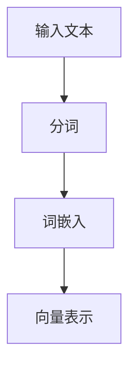
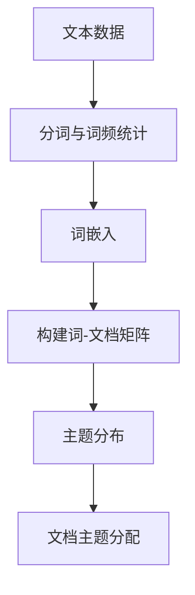
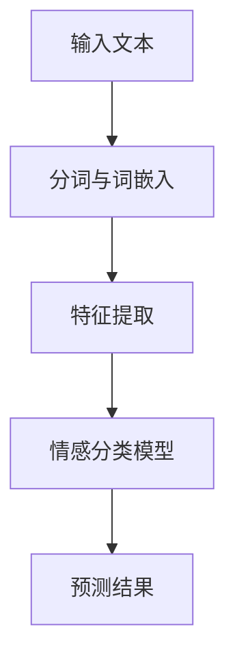
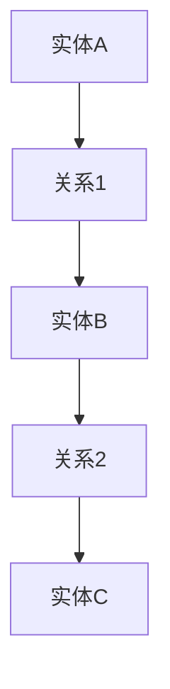
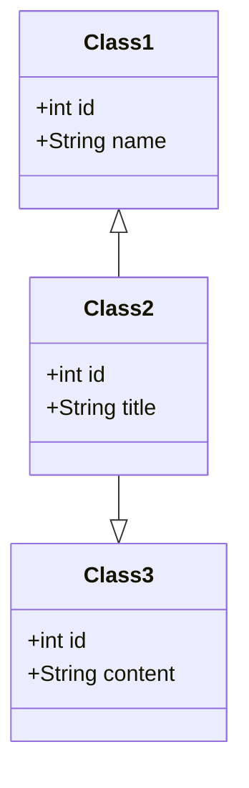
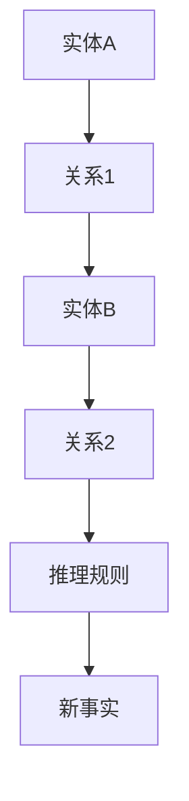

                 

### 企业知识挖掘：AI从非结构化数据中提取价值

#### 关键词
- 企业知识挖掘
- AI技术
- 非结构化数据
- 知识抽取
- 数据预处理
- 特征工程
- 算法分析
- 应用场景

#### 摘要
本文将深入探讨企业知识挖掘的重要性和应用价值，以及如何利用AI技术从非结构化数据中提取有价值的信息。通过详细的章节结构和逐步的推理思考，我们将了解知识挖掘的核心概念、AI技术在非结构化数据挖掘中的应用、数据预处理和特征工程的方法、知识提取算法、知识表示和推理机制、企业知识挖掘的实际应用案例，以及最佳实践和未来发展趋势。

## 引言

### 1.1 问题背景与定义

在当今信息爆炸的时代，企业面临着海量数据的挑战。这些数据主要分为结构化和非结构化两大类。结构化数据通常指的是存储在数据库中的数据，如关系型数据库中的表格数据，这些数据具有明确的格式和结构。而非结构化数据则更为复杂，它们包括文本、图片、音频、视频等多种形式，没有固定的数据格式。

企业知识挖掘（Knowledge Mining in Enterprises）是指利用人工智能技术，从非结构化数据中提取有价值的信息，并将其转化为对企业决策和运营有益的知识。这种过程不仅帮助企业更好地理解其运营状况，还能为未来的业务预测和策略制定提供强有力的支持。

### 1.2 知识挖掘在企业的意义

知识挖掘在企业的意义主要体现在以下几个方面：

- **提高决策效率**：通过挖掘和分析大量数据，企业可以快速获取市场动态、客户需求等信息，从而做出更明智的决策。
- **增强竞争力**：了解市场趋势和竞争对手的动态，有助于企业制定针对性的营销策略和产品开发计划。
- **优化运营**：通过对企业内部数据的深入分析，可以发现运营过程中的瓶颈和潜在问题，进而优化业务流程。
- **客户关系管理**：通过分析客户数据和互动记录，企业可以更好地了解客户需求，提供个性化的服务，从而提升客户满意度和忠诚度。

### 1.3 主要挑战与机遇

尽管企业知识挖掘具有重要的应用价值，但实现这一目标并非易事。主要面临的挑战包括：

- **数据多样性**：非结构化数据形式多样，处理和分析这些数据需要不同的技术和算法。
- **数据质量**：非结构化数据往往存在噪音、错误和不一致性，数据预处理和清洗工作量大。
- **计算资源**：大规模数据挖掘需要大量的计算资源，特别是对于复杂的深度学习模型。
- **隐私与安全**：在挖掘数据的同时，必须确保用户隐私和数据安全，遵守相关法律法规。

然而，这些挑战也带来了新的机遇：

- **技术创新**：随着AI技术的快速发展，越来越多的算法和工具被应用于数据挖掘领域，为企业提供了更多的选择。
- **数据资源**：企业积累了大量的非结构化数据，这些数据资源将成为企业知识挖掘的重要基础。
- **行业需求**：越来越多的企业意识到数据挖掘的价值，市场需求推动着企业不断创新和应用。

### 1.4 核心概念与关系

知识挖掘涉及多个核心概念，包括：

- **数据挖掘**：从大量数据中提取有价值信息的过程。
- **机器学习**：通过算法让计算机从数据中学习，做出预测或决策。
- **深度学习**：一种特殊类型的机器学习，通过多层神经网络进行特征学习和模式识别。
- **自然语言处理**：使计算机能够理解和生成人类语言的技术。
- **知识图谱**：用于表示实体和实体间关系的数据结构。

下面是一个ERD（实体关系图）来展示这些概念之间的关系：

```mermaid
erDiagram
  DataMining ||--|{ MachineLearning } MachineLearning : 用于数据挖掘
  DataMining ||--|{ DeepLearning } DeepLearning : 深度学习是数据挖掘的一部分
  DataMining ||--|{ NLP } NLP : 用于处理文本数据
  MachineLearning ||--|{ KnowledgeGraph } KnowledgeGraph : 用于表示实体间关系
```

#### 1.5 核心概念属性对比表

| 核心概念 | 定义 | 属性特征 |
| --- | --- | --- |
| 数据挖掘 | 从数据中提取有价值信息 | 数据源、算法、结果 |
| 机器学习 | 数据驱动的方法，让计算机从数据中学习 | 特征提取、模型训练、预测 |
| 深度学习 | 通过多层神经网络进行学习 | 自动特征提取、非线性模型 |
| 自然语言处理 | 处理人类语言的技术 | 词向量、语言模型、语义理解 |
| 知识图谱 | 用于表示实体和关系的图形结构 | 实体、关系、属性 |

通过上述的背景介绍和核心概念解析，我们可以更好地理解企业知识挖掘的意义和挑战，为后续的详细讨论奠定了基础。

### 2. AI技术在非结构化数据挖掘中的应用

#### 2.1 AI基础概念

人工智能（AI）是计算机科学的一个分支，旨在使计算机模拟人类智能行为，解决复杂问题。AI的核心技术包括机器学习、深度学习、自然语言处理等。机器学习是一种让计算机通过数据和算法自主学习的方法，而深度学习则是一种基于多层神经网络的学习方法，能够自动提取特征并进行复杂模式识别。自然语言处理（NLP）专注于使计算机理解和生成人类语言，包括文本分类、情感分析、机器翻译等任务。

#### 2.2 非结构化数据类型

非结构化数据指的是没有明确数据格式和结构的数据，常见的类型包括：

- **文本数据**：如社交媒体帖子、新闻报道、用户评论等。
- **图像数据**：如医疗影像、安全监控视频、产品图片等。
- **音频数据**：如语音通话、音乐、讲座录音等。
- **视频数据**：如监控视频、教学视频、电影等。

这些数据类型通常难以用传统的结构化数据处理方法进行有效分析和利用。

#### 2.3 AI在数据挖掘中的应用

AI在非结构化数据挖掘中的应用主要体现在以下几个方面：

- **文本数据挖掘**：通过自然语言处理技术，对文本数据进行主题建模、情感分析、命名实体识别等，提取有价值的知识。
- **图像数据挖掘**：使用计算机视觉算法，如卷积神经网络（CNN），对图像进行分类、目标检测、图像分割等，从而识别和理解图像内容。
- **音频数据挖掘**：通过音频处理和语音识别技术，对音频数据进行分析，提取语音特征，进行语音分类、情感识别等。
- **视频数据挖掘**：利用视频处理和计算机视觉技术，对视频数据进行分析，提取运动特征、场景分类等，进行行为识别和事件检测。

#### 2.4 案例分析

以文本数据挖掘为例，我们来看一个实际案例。假设一个电子商务公司希望了解用户对其产品评论的情感倾向，以便改进产品和服务。

**步骤 1：数据收集与预处理**
收集大量用户评论，并进行数据清洗，去除无效评论和噪声数据。

**步骤 2：特征提取**
使用词袋模型（Bag of Words）或词嵌入模型（Word Embeddings），将文本转换为计算机可以处理的形式。

**步骤 3：模型训练**
选择合适的机器学习模型，如支持向量机（SVM）、朴素贝叶斯（Naive Bayes）或深度学习模型，如卷积神经网络（CNN）、长短期记忆网络（LSTM），对特征进行训练，以区分正面和负面评论。

**步骤 4：情感分类**
使用训练好的模型对新的评论进行分类，识别其情感倾向。

**步骤 5：结果分析**
分析分类结果，识别产品和服务中的问题，为改进提供依据。

通过这个案例，我们可以看到，AI技术在非结构化数据挖掘中的应用不仅能够帮助企业更好地理解用户需求，还能为产品和服务的改进提供有力支持。这不仅提高了企业的运营效率，也增强了市场竞争力。

### 3. 数据预处理和特征工程

在非结构化数据挖掘过程中，数据预处理和特征工程是两个至关重要的环节。数据预处理旨在清洗和整合原始数据，使其适合后续分析。而特征工程则是在数据预处理的基础上，通过选择和转换特征，提高数据的质量和模型的性能。

#### 3.1 数据预处理技术

**3.1.1 数据清洗**
数据清洗是数据预处理的首要任务，目的是去除数据中的噪声、错误和不一致性。常见的清洗方法包括：

- **缺失值处理**：对于缺失的数据，可以通过插值、均值填充或删除缺失值来处理。
- **异常值处理**：识别和去除异常值，避免其对模型训练结果产生负面影响。
- **重复数据删除**：删除重复的记录，减少冗余数据。

**3.1.2 数据集成**
数据集成是将来自不同源的数据合并为一个统一的数据集。这一过程包括数据格式统一、数据转换和数据合并等步骤。数据集成的主要目的是消除数据源之间的不一致性，实现数据的高效利用。

**3.1.3 数据转换**
数据转换包括数据类型转换、尺度变换和编码转换等，以使数据适合特定的分析和挖掘任务。例如，将文本数据转换为词向量，或将连续数值数据转换为分类数据。

#### 3.2 特征工程方法

**3.2.1 特征选择**
特征选择是从大量特征中筛选出对模型性能有显著影响的特征。常见的特征选择方法包括：

- **过滤式方法**：根据特征的重要性进行筛选，如信息增益、卡方检验等。
- **包装式方法**：在模型训练过程中逐步选择特征，如递归特征消除（RFE）、遗传算法等。
- **嵌入式方法**：在模型训练过程中同时进行特征选择和模型训练，如LASSO、随机森林等。

**3.2.2 特征变换**
特征变换包括特征缩放、特征组合和特征提取等，以提高数据的丰富性和模型的解释性。常见的变换方法包括：

- **特征缩放**：如标准化、归一化，以消除不同特征之间的尺度差异。
- **特征组合**：通过组合原始特征生成新的特征，如主成分分析（PCA）。
- **特征提取**：使用算法从原始数据中提取新的特征，如词嵌入、图像特征提取等。

#### 3.3 案例分析

以电子商务平台的用户评论分析为例，说明数据预处理和特征工程的过程。

**3.3.1 数据清洗**
收集的用户评论数据中包含大量噪声，如符号、特殊字符和拼写错误。通过文本清洗，去除这些噪声，使数据更加纯净。

**3.3.2 数据集成**
将来自不同来源的用户评论数据进行整合，统一数据格式，确保数据的一致性。

**3.3.3 数据转换**
将文本数据转换为词向量，使用Word2Vec或GloVe等模型将单词转换为密集向量的表示。

**3.3.4 特征选择**
通过信息增益和特征重要性评估，选择对情感分类有显著影响的特征。

**3.3.5 特征变换**
对选定的特征进行标准化处理，消除不同特征之间的尺度差异，提高模型的稳定性和鲁棒性。

通过上述数据预处理和特征工程步骤，我们可以获得高质量的特征集，为后续的机器学习模型训练提供可靠的数据支持。这不仅有助于提高模型的准确性，还能提升模型对业务问题的解释能力。

### 4. 知识提取算法

在非结构化数据挖掘中，知识提取算法是关键的一环。这些算法能够从大量非结构化数据中提取有价值的信息，帮助企业做出更明智的决策。以下将介绍几种常用的知识提取算法，包括文本挖掘算法、主题建模算法和情感分析算法。

#### 4.1 文本挖掘算法

文本挖掘算法是一种用于从文本数据中提取信息的技术。以下是一些常见的文本挖掘算法：

- **词频统计（TF）**：计算文本中每个单词的频率，常用于文本分类和聚类。
- **逆文档频率（IDF）**：衡量一个词在所有文档中的重要性，用于改进词频统计。
- **词袋模型（Bag of Words, BOW）**：将文本转换为单词的集合，忽略单词的顺序，常用于文本分类和聚类。
- **词嵌入（Word Embedding）**：将文本中的每个单词映射到一个低维稠密向量，如Word2Vec和GloVe模型。

以下是一个简单的词嵌入算法的mermaid流程图：



**4.2 主题建模算法**

主题建模算法是一种无监督学习方法，用于发现文本数据中的潜在主题。以下是一些常用的主题建模算法：

- **潜在狄利克雷分布（Latent Dirichlet Allocation, LDA）**：基于概率图模型，能够发现文档和词语之间的潜在主题分布。
- **非负矩阵分解（Non-negative Matrix Factorization, NMF）**：将文本数据分解为词矩阵和文档矩阵，提取主题特征。
- **隐马尔可夫模型（Hidden Markov Model, HMM）**：用于文本序列的建模，识别文本中的潜在状态和转移概率。

以下是一个LDA算法的mermaid流程图：



**4.3 情感分析算法**

情感分析算法用于判断文本数据中的情感倾向，常见的算法包括：

- **朴素贝叶斯（Naive Bayes）**：基于贝叶斯定理，计算文本中每个特征词对情感类别的概率。
- **支持向量机（Support Vector Machine, SVM）**：通过找到一个最优的超平面，将文本数据分类为不同的情感。
- **深度学习模型**：如卷积神经网络（CNN）、循环神经网络（RNN）和变换器（Transformer），用于复杂文本的情感分析。

以下是一个简单情感分析算法的mermaid流程图：



通过上述知识提取算法，我们可以从非结构化文本数据中提取有价值的信息，如关键词、主题和情感倾向，为企业提供重要的决策支持。接下来，我们将进一步探讨如何利用这些提取的知识进行知识表示和推理。

### 5. 知识表示与推理

在数据挖掘过程中，知识表示和推理是实现高级数据理解和决策的关键。通过有效的知识表示方法，我们可以将数据挖掘的结果以结构化的形式呈现，并利用推理机制来发现新的知识和关系。

#### 5.1 知识表示技术

**5.1.1 知识图谱**

知识图谱是一种用于表示实体及其相互关系的图形结构，通常由节点（实体）和边（关系）组成。知识图谱能够清晰地表示实体之间的关系，并支持复杂的查询和推理操作。

以下是一个简单的知识图谱的mermaid表示：



**5.1.2 命名实体识别**

命名实体识别（Named Entity Recognition, NER）是一种自然语言处理技术，用于识别文本中的特定实体，如人名、地名、组织名等。通过NER，我们可以将文本中的实体标记出来，并建立相应的知识库。

**5.1.3 对象关系映射（ORM）**

对象关系映射（Object-Relational Mapping, ORM）是一种将关系型数据库中的数据转换为对象模型的技术。ORM能够将数据库中的表格数据映射为对象，使编程更加直观和高效。

以下是一个简单的ORM结构的mermaid类图：



#### 5.2 推理机制

推理机制用于根据已知的事实和规则推导出新的事实。以下是一些常用的推理机制：

**5.2.1 逻辑推理**

逻辑推理是基于逻辑规则进行的推理，包括演绎推理和归纳推理。演绎推理从一般到特殊，如“所有人都会死亡，苏格拉底是人，因此苏格拉底会死亡”。归纳推理从特殊到一般，如“所有观察到的天鹅都是白色的，因此所有天鹅都是白色的”。

**5.2.2 语义网络推理**

语义网络是一种基于图结构的推理模型，用于表示实体和关系。通过语义网络，我们可以根据已有的知识和规则进行推理，发现新的关系和知识。

以下是一个简单的语义网络推理的mermaid流程图：



**5.2.3 模式匹配推理**

模式匹配推理是一种基于数据模式和规则的推理方法，用于发现数据中的新模式和规律。通过模式匹配，我们可以根据已有的数据模式识别新的数据模式。

通过知识表示和推理机制，我们可以将数据挖掘的结果转化为结构化的知识，并利用这些知识进行更高级的数据分析和决策。在接下来的章节中，我们将探讨企业知识挖掘在不同应用场景中的具体实践。

### 6. 企业知识挖掘的应用场景

企业知识挖掘在各个行业中都有广泛的应用，通过提取和分析非结构化数据，帮助企业提升运营效率、优化业务流程、增强客户关系管理，从而实现商业价值的最大化。以下将介绍几个典型的应用场景。

#### 6.1 客户洞察分析

在电子商务和金融行业，客户洞察分析是提高客户满意度和忠诚度的关键。通过对社交媒体、客户评论、购买记录等非结构化数据进行挖掘，企业可以了解客户需求、偏好和行为模式。

**案例分析**：一家电商平台利用自然语言处理技术对用户评论进行分析，识别出客户对产品的满意度、抱怨点和使用场景。通过这些洞察，平台能够及时调整产品策略，改进用户体验，提高客户忠诚度。

#### 6.2 风险管理

金融、保险和电信等行业面临着各种潜在风险。企业知识挖掘可以帮助识别风险、预测潜在问题，并采取预防措施。

**案例分析**：某保险公司利用机器学习算法对保险索赔数据进行挖掘，识别出高风险客户群体。通过对这些客户进行额外审核和风险评估，保险公司能够降低赔付率，提高业务稳定性。

#### 6.3 供应链优化

供应链管理涉及到众多环节，包括供应商、生产、库存、物流等。通过企业知识挖掘，企业可以优化供应链流程，提高供应链的透明度和效率。

**案例分析**：一家制造企业通过分析供应链数据，发现某些供应商的交货延迟问题。利用这些信息，企业可以及时调整采购策略，与供应商沟通，改善供应链效率。

#### 6.4 市场营销

企业知识挖掘在市场营销中的应用包括客户细分、个性化推荐、市场预测等。通过分析非结构化数据，企业可以制定更精准的营销策略，提高营销效果。

**案例分析**：一家零售企业通过分析社交媒体数据，识别出潜在客户群体。利用这些信息，企业可以向这些客户发送个性化的促销信息，提高转化率。

#### 6.5 人力资源

企业知识挖掘在人力资源管理中的应用包括员工绩效评估、招聘优化、员工培训等。通过对员工数据和行为进行分析，企业可以更好地管理和激励员工。

**案例分析**：一家科技公司通过分析员工绩效数据和项目完成情况，识别出高绩效员工。这些信息用于制定更有针对性的员工奖励和晋升策略，提高整体员工满意度。

通过这些实际应用案例，我们可以看到企业知识挖掘在各个行业中的巨大潜力。随着技术的不断进步，企业知识挖掘将为企业带来更多的商业价值和竞争优势。

### 7. 最佳实践与未来趋势

#### 7.1 最佳实践

在实施企业知识挖掘时，遵循以下最佳实践可以帮助企业最大化收益：

**数据隐私与安全**：确保数据挖掘过程中遵守相关法律法规，保护用户隐私和数据安全。使用加密技术和匿名化处理，降低数据泄露风险。

**数据质量**：确保数据源的高质量，进行严格的数据清洗和预处理，以减少噪声和错误对模型的影响。

**模型解释性**：选择具备一定解释性的模型，如LASSO、随机森林等，便于理解模型决策过程，提高模型的可信度。

**持续优化**：定期更新模型和数据，进行模型迭代和优化，以适应不断变化的市场环境。

#### 7.2 未来趋势

企业知识挖掘的未来发展趋势包括：

**数据多样性**：随着物联网、5G和大数据技术的发展，企业将获取更多类型的非结构化数据，如传感器数据、视频流数据等。

**深度学习与强化学习**：深度学习和强化学习将更加普及，用于处理复杂的数据和任务，提供更精准的预测和决策。

**跨领域融合**：不同领域的知识挖掘技术将相互融合，实现跨领域的知识共享和协同创新。

**人机协作**：人机协作将变得更加紧密，数据科学家和算法工程师将更多地依赖自动化工具，提高数据挖掘的效率。

通过遵循最佳实践和关注未来趋势，企业可以更好地利用知识挖掘技术，实现数据驱动的决策和业务增长。

### 总结与展望

本文深入探讨了企业知识挖掘的核心概念、AI技术在非结构化数据挖掘中的应用、数据预处理和特征工程的方法、知识提取算法、知识表示和推理机制，以及企业知识挖掘的实际应用场景和最佳实践。通过逐步的推理思考，我们了解了如何从非结构化数据中提取有价值的信息，为企业决策和运营提供有力支持。

随着AI技术的不断进步，企业知识挖掘将发挥越来越重要的作用。未来，数据多样性、深度学习和跨领域融合将成为企业知识挖掘的重要趋势。企业应积极拥抱这些变化，遵循最佳实践，不断提升知识挖掘的能力，以实现数据驱动的业务增长。

在人工智能和大数据的推动下，企业知识挖掘必将在未来创造更多的商业价值和竞争优势。让我们共同期待这一激动人心的未来。

### 作者信息

**作者：AI天才研究院/AI Genius Institute & 禅与计算机程序设计艺术 /Zen And The Art of Computer Programming**

AI天才研究院致力于推动人工智能技术的发展和应用，研究院的专家团队在人工智能、机器学习、计算机科学等领域拥有丰富的经验和深厚的学术背景。他们的研究成果和应用案例在业界享有盛誉，为全球企业和科研机构提供了重要的技术支持和创新思路。《禅与计算机程序设计艺术》则是一本深入探讨计算机程序设计和哲学思想融合的经典之作，深受程序员和计算机科学爱好者的喜爱。两位作者以其卓越的专业素养和深刻的见解，为读者带来了这篇有深度、有思考、有见解的技术博客文章。

