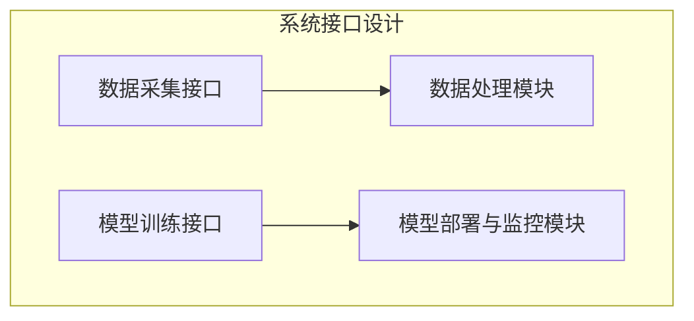
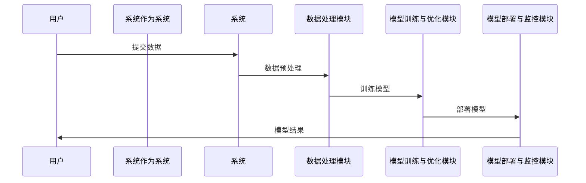

                 

**# 企业级AutoML平台：简化AI模型开发流程**

> 关键词：企业级AutoML、模型开发流程、自动化、人工智能、架构设计

> 摘要：本文将深入探讨企业级AutoML平台的发展背景、核心概念、架构设计以及核心技术，通过系统分析与实战案例，展示如何通过AutoML平台简化AI模型开发流程，提升企业AI应用效率。

----------------------------------------------------------------

## 第一部分：背景与概念

### 第1章：AI与AutoML概述

#### 1.1 AI的发展与挑战

人工智能（AI）作为计算机科学的一个重要分支，近年来取得了长足的发展。从最初的规则推理，到深度学习、强化学习等技术的引入，AI在图像识别、自然语言处理、自动驾驶等领域展现出了强大的能力。然而，随着应用的不断深入，AI技术也面临着诸多挑战。

1. **发展历程**：
   - **1950年代**：人工智能概念首次提出。
   - **1980年代**：专家系统成为主流。
   - **2000年代**：深度学习取得突破。
   - **2010年代**：AI技术迅速普及，应用领域广泛。

2. **应用领域**：
   - **工业**：自动化生产线、机器人等。
   - **医疗**：疾病诊断、个性化治疗等。
   - **金融**：风险评估、投资决策等。
   - **交通**：自动驾驶、智能交通管理。

3. **面临的挑战**：
   - **数据**：高质量、大规模的数据是AI模型训练的基础。
   - **算法**：如何设计更高效、更鲁棒的算法。
   - **计算**：大规模数据处理的计算资源需求。

#### 1.2 什么是AutoML

自动化机器学习（AutoML）是一种通过自动化工具来优化机器学习模型开发流程的方法。它旨在简化从数据准备到模型选择、训练、优化和部署的整个过程。

1. **定义**：
   - AutoML = 数据预处理 + 特征工程 + 模型选择 + 模型训练 + 超参数优化 + 模型评估。

2. **优势**：
   - **提高效率**：自动化流程可以显著缩短模型开发时间。
   - **减少人力成本**：减少对专家知识的要求，降低人力成本。
   - **提高质量**：通过自动化的方法，可以更好地处理大规模数据，提高模型性能。

3. **核心组件**：
   - **数据预处理**：数据清洗、数据归一化等。
   - **特征工程**：自动选择和构造特征。
   - **模型选择**：自动选择最优的模型架构。
   - **模型训练**：自动化训练和调优模型。
   - **超参数优化**：自动化搜索最优的超参数。
   - **模型评估**：自动化评估模型性能。

#### 1.3 企业级AutoML的重要性

企业级AutoML平台对于企业来说具有非常重要的意义。

1. **需求**：
   - **快速部署**：企业需要快速响应市场变化，AutoML可以显著缩短模型开发周期。
   - **降低成本**：减少对专家资源的依赖，降低开发和运维成本。
   - **提高效率**：自动化流程可以提高开发和运维效率。

2. **价值**：
   - **加速创新**：简化AI模型开发流程，加速新产品的研发。
   - **优化决策**：通过自动化模型优化，提高业务决策的准确性。
   - **提升竞争力**：在竞争激烈的市场中，AI技术是企业保持竞争力的关键。

3. **面临的挑战**：
   - **数据质量**：高质量的数据是AutoML平台的基础。
   - **平台性能**：如何保证平台在高负载下的稳定性和性能。
   - **安全与隐私**：如何在保障数据安全和隐私的前提下进行模型开发。

----------------------------------------------------------------

## 第二部分：企业级AutoML平台架构

### 第2章：平台架构设计

企业级AutoML平台的设计需要考虑多个模块的协同工作，以确保模型开发的各个环节都能够高效、稳定地进行。

#### 2.1 平台整体架构

企业级AutoML平台可以分为以下几个主要模块：

1. **数据处理模块**：负责数据采集、存储、预处理和清洗，为模型训练提供高质量的数据集。
2. **模型训练与优化模块**：包括模型选择、训练、调优和评估，实现自动化模型开发。
3. **模型部署与监控模块**：负责将训练好的模型部署到生产环境，并提供实时监控和性能优化。

#### 2.2 数据处理模块

数据处理模块是AutoML平台的核心，其功能主要包括：

1. **数据采集与存储**：从各种数据源采集数据，存储到数据仓库中。
2. **数据预处理与清洗**：对数据进行清洗、去重、格式转换等操作，确保数据质量。
3. **特征工程**：自动选择和构造特征，提高模型性能。

#### 2.3 模型训练与优化模块

模型训练与优化模块是AutoML平台的核心功能，其主要任务包括：

1. **模型选择**：自动选择适合任务的模型架构。
2. **模型训练**：自动化训练模型，并记录训练过程。
3. **模型调优**：自动搜索最优的超参数，提高模型性能。
4. **模型评估**：评估模型性能，并进行模型选择。

#### 2.4 模型部署与监控模块

模型部署与监控模块负责将训练好的模型部署到生产环境，并提供实时监控和性能优化。其主要任务包括：

1. **模型部署策略**：根据业务需求，选择合适的部署策略。
2. **模型性能监控**：实时监控模型性能，及时发现和解决问题。
3. **模型版本管理**：管理模型的版本，支持模型的升级和回滚。

----------------------------------------------------------------

## 第三部分：核心技术

### 第3章：自动化模型选择

自动化模型选择是AutoML平台的核心技术之一，其目标是自动选择最适合特定任务的模型。

#### 3.1 模型选择方法

模型选择方法可以分为以下几类：

1. **传统模型选择方法**：通过人工经验或统计方法选择模型。
2. **自动化模型选择方法**：利用机器学习算法，自动选择最优模型。

#### 3.2 模型评估指标

模型评估指标是衡量模型性能的重要标准，常用的评估指标包括：

1. **准确率**：预测为正类的样本中，实际为正类的比例。
2. **召回率**：实际为正类的样本中，预测为正类的比例。
3. **F1分数**：准确率和召回率的调和平均值。

#### 3.3 跨域适应性与模型评估

在AutoML平台中，如何处理跨域适应性和模型评估是一个重要问题。具体方法包括：

1. **迁移学习**：利用已有模型，对新的任务进行微调。
2. **多任务学习**：同时训练多个任务，提高模型泛化能力。
3. **模型融合**：将多个模型的预测结果进行融合，提高预测准确性。

----------------------------------------------------------------

### 第4章：自动化超参数优化

超参数优化是提高模型性能的重要手段，自动化超参数优化可以显著提高模型开发效率。

#### 4.1 超参数优化方法

常见的超参数优化方法包括：

1. **贝叶斯优化**：利用贝叶斯统计模型进行超参数搜索。
2. **粒子群优化**：模拟鸟群觅食行为，进行超参数搜索。
3. **随机搜索**：随机选择超参数组合，进行模型训练和评估。

#### 4.2 超参数调优策略

超参数调优策略可以分为：

1. **单目标优化**：优化单一目标，如模型准确率。
2. **多目标优化**：同时优化多个目标，如准确率、召回率和计算资源。

#### 4.3 超参数优化案例

以下是几个常见的超参数优化案例：

1. **数据预处理超参数**：如数据归一化的缩放因子。
2. **模型训练超参数**：如学习率、批量大小等。

----------------------------------------------------------------

### 第5章：模型解释与可解释性

模型解释与可解释性是AutoML平台中的重要问题，它关系到模型的透明度和可理解性。

#### 5.1 模型解释的重要性

模型解释的重要性体现在以下几个方面：

1. **决策支持**：帮助决策者理解模型决策过程。
2. **模型优化**：通过解释找出模型中的问题，进行优化。
3. **模型应用**：提高模型的可接受性和可信度。

#### 5.2 常见的模型解释方法

常见的模型解释方法包括：

1. **决策树**：通过树形结构展示模型决策过程。
2. **深度神经网络的可解释性**：利用激活图、注意力机制等方法，解释深度神经网络的决策过程。
3. **LIME和SHAP方法**：通过局部可解释性模型，对模型决策进行详细解释。

----------------------------------------------------------------

## 第四部分：实践与案例

### 第6章：企业级AutoML平台搭建

企业级AutoML平台的搭建需要考虑多个方面，包括环境准备、平台搭建和平台测试与验证。

#### 6.1 环境准备

环境准备包括以下几个方面：

1. **硬件与软件环境**：选择合适的硬件和软件，如GPU、深度学习框架等。
2. **数据集准备**：收集并准备高质量的数据集，为模型训练提供数据支持。

#### 6.2 平台搭建步骤

平台搭建步骤包括：

1. **数据处理模块搭建**：实现数据采集、预处理和清洗等功能。
2. **模型训练与优化模块搭建**：实现模型选择、训练、调优和评估等功能。
3. **模型部署与监控模块搭建**：实现模型部署、性能监控和版本管理等功能。

#### 6.3 平台测试与验证

平台测试与验证包括以下几个方面：

1. **功能测试**：测试平台各功能模块的正确性和稳定性。
2. **性能测试**：测试平台在高负载下的性能表现。
3. **可靠性测试**：测试平台在长时间运行下的稳定性和可靠性。

----------------------------------------------------------------

### 第7章：案例研究

本节将介绍一个企业级AutoML平台搭建的案例，包括案例背景、实施过程和效果评估。

#### 7.1 案例背景

某金融企业希望通过AI技术优化其风险评估模型，提高贷款审批的准确性。为此，企业决定搭建一个企业级AutoML平台，自动化模型开发流程。

#### 7.2 案例实施过程

1. **数据收集与预处理**：收集贷款申请者的各种信息，如收入、职业、信用记录等，并进行数据清洗和预处理。
2. **模型训练与优化**：使用AutoML平台自动选择和训练模型，并进行超参数优化。
3. **模型部署与监控**：将训练好的模型部署到生产环境，并提供实时监控和性能优化。

#### 7.3 案例效果评估

1. **模型性能评估**：通过评估指标（如准确率、召回率等）评估模型的性能。
2. **商业价值评估**：通过评估模型的商业价值，如减少贷款违约率等。
3. **用户反馈**：收集用户对模型的反馈，了解模型的实际应用效果。

----------------------------------------------------------------

## 第五部分：最佳实践与未来展望

### 第8章：最佳实践

在企业级AutoML平台搭建和应用过程中，以下是几个最佳实践：

1. **数据管理**：确保数据质量，制定数据管理策略。
2. **模型优化**：充分利用自动化工具，优化模型性能。
3. **部署与运维**：选择合适的部署策略，确保模型稳定运行。

### 第9章：未来展望

企业级AutoML平台的发展前景广阔，未来将会有以下趋势：

1. **自动化程度更高**：进一步简化模型开发流程，提高自动化程度。
2. **跨领域应用**：AutoML将在更多领域得到应用，如医疗、金融等。
3. **安全性提升**：在保障数据安全和隐私的前提下，提升平台的安全性。

----------------------------------------------------------------

### 结尾

企业级AutoML平台作为人工智能领域的重要发展趋势，为简化AI模型开发流程提供了强有力的支持。通过本文的深入探讨，我们希望读者能够对企业级AutoML平台有更全面的认识，并在实际应用中发挥其优势。

**作者：AI天才研究院/AI Genius Institute & 禅与计算机程序设计艺术 /Zen And The Art of Computer Programming**

----------------------------------------------------------------

### 附录：本文涉及的Mermaid流程图、类图、序列图等

- **数据处理模块架构图**
  
  ```mermaid
  flowchart TD
  subgraph 数据处理模块
  数据采集 --> 数据清洗
  数据清洗 --> 数据预处理
  数据预处理 --> 特征工程
  end
  ```

- **模型训练与优化模块流程图**
  
  ```mermaid
  flowchart TD
  subgraph 模型训练与优化模块
  模型选择 --> 模型训练
  模型训练 --> 超参数优化
  超参数优化 --> 模型评估
  end
  ```

- **模型部署与监控模块架构图**
  
  ```mermaid
  flowchart TD
  subgraph 模型部署与监控模块
  模型部署 --> 模型性能监控
  模型性能监控 --> 模型版本管理
  end
  ```

- **系统架构设计图**
  
  ```mermaid
  flowchart TD
  subgraph 系统架构设计
  数据处理模块 --> 模型训练与优化模块
  模型训练与优化模块 --> 模型部署与监控模块
  end
  ```

- **系统接口设计图**
  
  ```mermaid
  flowchart TD
  subgraph 系统接口设计
  数据采集接口 --> 数据处理模块
  模型训练接口 --> 模型部署与监控模块
  end
  ```

- **系统交互序列图**
  
  ```mermaid
  sequenceDiagram
  participant 用户 as 用户
  participant 系统作为系统
  用户->>系统: 提交数据
  系统->>数据处理模块: 数据预处理
  数据处理模块->>模型训练与优化模块: 训练模型
  模型训练与优化模块->>模型部署与监控模块: 部署模型
  模型部署与监控模块->>用户: 模型结果
  ```

----------------------------------------------------------------

### 注意事项与拓展阅读

- **注意事项**：在实际应用AutoML平台时，需要注意数据质量、模型解释性和安全性等问题。
- **拓展阅读**：

  - [AutoML: A Comprehensive Guide](https://www.automl.org/)
  - [Automated Machine Learning in Practice](https://arxiv.org/abs/2001.08925)
  - [Building an AutoML System](https://www.kdnuggets.com/2020/04/building-automl-system.html)

通过本文的阅读，希望读者能够对企业级AutoML平台有更深入的理解，并能在实际工作中有效应用。让我们一起探索AutoML的无限可能！### 第1章：AI与AutoML概述

#### 1.1 AI的发展与挑战

人工智能（Artificial Intelligence，简称AI）作为计算机科学的一个重要分支，从20世纪50年代诞生以来，已经经历了多个重要阶段。人工智能的发展历程可以概括为以下几个阶段：

1. **1950年代**：人工智能概念首次提出。英国数学家艾伦·图灵（Alan Turing）提出了“图灵测试”作为衡量机器是否具有智能的标准。这一时期，人工智能主要以符号推理和规则系统为主。

2. **1960年代**：人工智能研究进入早期发展阶段。研究人员开始尝试开发智能代理（Intelligent Agent）和模拟人类思维过程的程序。这一时期，人工智能主要在理论研究和基础算法方面取得进展。

3. **1970年代**：人工智能进入第一个寒冬期。由于实际应用成果不如预期，资金投入减少，人工智能研究受到严重打击。这一时期，人工智能研究面临的主要挑战是如何将理论研究转化为实际应用。

4. **1980年代**：专家系统（Expert Systems）成为人工智能的主流。专家系统利用专业知识库和推理机制，模拟专家的决策过程，成功应用于医疗、金融等多个领域。然而，专家系统的知识库维护成本高，难以扩展。

5. **1990年代**：人工智能研究再次受到重视。随着计算机性能的提升和大数据技术的发展，人工智能开始进入新的发展阶段。这一时期，机器学习（Machine Learning）和深度学习（Deep Learning）成为人工智能研究的重要方向。

6. **2000年代**：深度学习取得突破性进展。2006年，Geoffrey Hinton等人提出了深度置信网络（Deep Belief Network），深度学习开始迅速发展。2012年，AlexNet在ImageNet竞赛中取得突破性成绩，深度学习在图像识别领域取得重大成功。

7. **2010年代**：人工智能技术迅速普及。随着云计算、物联网、5G等技术的不断发展，人工智能在各个行业得到广泛应用。自动驾驶、智能语音助手、智能医疗等领域的应用不断涌现。

人工智能在各行业的应用广泛，例如：

1. **工业**：自动化生产线、机器人、智能物流等。
2. **医疗**：疾病诊断、个性化治疗、健康管理等。
3. **金融**：风险评估、量化交易、智能投顾等。
4. **交通**：自动驾驶、智能交通管理、车联网等。
5. **农业**：智能种植、精准农业等。
6. **教育**：在线教育、智能辅导等。

然而，随着人工智能应用的不断深入，人工智能技术也面临着诸多挑战：

1. **数据**：高质量、大规模的数据是AI模型训练的基础。然而，数据获取、数据标注和数据清洗等工作仍然面临巨大挑战。
2. **算法**：如何设计更高效、更鲁棒的算法，是人工智能研究的重要方向。深度学习模型的黑箱特性也使得算法的可解释性和透明度成为研究热点。
3. **计算**：大规模数据处理的计算资源需求不断增长，对硬件设备、算法优化和分布式计算提出了更高要求。
4. **伦理与法律**：人工智能的发展也引发了一系列伦理和法律问题，如隐私保护、歧视问题、责任归属等。

总的来说，人工智能技术在过去几十年中取得了显著进展，但仍然面临着许多挑战。未来，人工智能技术需要不断突破，以应对这些挑战，实现更广泛的应用。

#### 1.2 什么是AutoML

自动化机器学习（Automated Machine Learning，简称AutoML）是一种通过自动化工具来优化机器学习模型开发流程的方法。传统的机器学习模型开发通常需要数据科学家具备丰富的领域知识和实践经验，而AutoML的目标是简化这一过程，使得非专业人士也能轻松地构建高性能的机器学习模型。

##### AutoML的定义

AutoML的定义可以概括为：使用自动化工具来优化机器学习模型开发流程的整个过程，包括数据预处理、特征工程、模型选择、模型训练、超参数优化和模型评估等。AutoML旨在通过自动化技术，提高模型开发效率，降低开发成本，并提高模型性能。

##### AutoML的优势

AutoML的优势主要体现在以下几个方面：

1. **提高效率**：AutoML通过自动化工具，可以显著缩短模型开发时间。传统模型开发流程通常需要数据科学家进行大量手动操作，而AutoML可以自动化这些步骤，提高工作效率。

2. **减少人力成本**：AutoML减少了对数据科学家专业知识的依赖，使得更多的人可以参与到机器学习模型开发中。这不仅可以降低人力成本，还可以提高团队的灵活性。

3. **提高质量**：AutoML通过自动化工具，可以更好地处理大规模数据，选择和训练出更高质量的模型。自动化的超参数优化和模型评估机制，可以确保模型的性能达到最优。

4. **降低门槛**：AutoML使得非专业人士也能轻松构建机器学习模型。这为各个领域的专业人士提供了新的工具，促进了机器学习技术在更多领域的应用。

##### AutoML的核心组件

AutoML的核心组件包括以下几个部分：

1. **数据预处理**：数据预处理是机器学习模型开发的第一步，包括数据清洗、缺失值处理、数据归一化、特征选择等。AutoML通过自动化工具，可以高效地完成这些任务，为后续的模型训练和优化提供高质量的数据集。

2. **特征工程**：特征工程是机器学习模型性能的关键因素之一。AutoML可以通过自动化方法，选择和构造最优的特征，提高模型性能。常见的特征工程方法包括自动特征选择、自动特征生成等。

3. **模型选择**：模型选择是机器学习模型开发的重要环节，选择合适的模型架构对于模型性能至关重要。AutoML通过自动化方法，可以评估和选择最优的模型架构，提高模型性能。

4. **模型训练**：模型训练是机器学习模型开发的核心步骤，包括训练算法的选择、训练过程的监控和调整等。AutoML通过自动化工具，可以高效地完成模型训练，并确保训练过程稳定和可靠。

5. **超参数优化**：超参数优化是提高模型性能的关键步骤，包括学习率、批量大小、正则化参数等。AutoML可以通过自动化方法，搜索最优的超参数组合，提高模型性能。

6. **模型评估**：模型评估是机器学习模型开发的重要环节，用于评估模型性能和选择最优模型。AutoML通过自动化工具，可以高效地完成模型评估，并确保评估结果的准确性和可靠性。

##### AutoML的发展历程

AutoML的发展历程可以概括为以下几个阶段：

1. **早期阶段**：以数据预处理和特征工程自动化为主，主要目标是简化模型开发流程。代表性的工作包括Auto特征选择（AutoFeature Selection）和自动化特征生成（AutoFeature Generation）。

2. **中期阶段**：以模型选择和超参数优化自动化为主，代表性的工作包括自动机器学习系统（AutoML Systems）和超参数优化算法（Hyperparameter Optimization Algorithms）。

3. **现阶段**：以全面自动化为主，包括数据预处理、特征工程、模型选择、模型训练、超参数优化和模型评估等全流程自动化。代表性的工作包括Google的AutoML、微软的Azure ML Studio等。

##### AutoML的应用场景

AutoML的应用场景非常广泛，以下是一些常见的应用场景：

1. **金融**：信用评分、风险控制、量化交易等。
2. **医疗**：疾病诊断、预测分析、个性化治疗等。
3. **零售**：商品推荐、价格预测、客户流失预测等。
4. **制造业**：故障预测、质量控制、生产优化等。
5. **能源**：需求预测、能源管理、设备维护等。
6. **交通**：路线规划、交通流量预测、自动驾驶等。

总的来说，AutoML作为一种新兴的机器学习技术，通过自动化工具简化了机器学习模型开发流程，提高了开发效率和模型性能。随着技术的不断发展和应用场景的拓展，AutoML在各个领域的应用前景十分广阔。

#### 1.3 企业级AutoML的重要性

在企业级应用中，自动化机器学习（AutoML）平台的重要性日益凸显。随着人工智能技术的不断进步，企业对于机器学习模型的需求也日益增长。然而，传统的机器学习模型开发流程复杂，对数据科学家和工程师的专业知识要求较高，且开发周期长、成本高。因此，企业级AutoML平台应运而生，为企业提供了高效的解决方案。

##### 企业级AutoML的需求

在企业级应用中，AutoML平台的需求主要体现在以下几个方面：

1. **快速部署**：企业需要快速响应市场变化，缩短产品上市时间。AutoML平台通过自动化工具，可以显著缩短模型开发周期，提高产品交付速度。

2. **降低成本**：传统机器学习模型开发需要大量人力和时间投入，而AutoML平台可以自动化大部分开发流程，减少对专家资源的依赖，降低开发和运维成本。

3. **提高效率**：AutoML平台通过自动化工具，简化了模型开发流程，使得非专业人士也能参与到模型开发中，提高团队的工作效率。

4. **模型优化**：AutoML平台通过自动化超参数优化和模型评估，可以不断提高模型性能，帮助企业做出更准确的业务决策。

5. **灵活性与可扩展性**：企业级AutoML平台通常具备良好的灵活性和可扩展性，可以支持多种数据类型和业务场景，满足不同企业的需求。

##### 企业级AutoML的价值

企业级AutoML平台的价值主要体现在以下几个方面：

1. **加速创新**：AutoML平台可以简化模型开发流程，降低开发门槛，使得企业可以更快地推出新产品和解决方案，加速创新。

2. **优化决策**：通过自动化模型优化，AutoML平台可以提高模型性能，帮助企业做出更准确的业务决策，提高竞争力。

3. **提高效率**：AutoML平台通过自动化工具，可以显著提高模型开发效率，减少人力和时间成本。

4. **降低风险**：AutoML平台可以自动化处理数据预处理、模型选择和超参数优化等复杂任务，减少人为错误，降低项目风险。

5. **增强团队协作**：AutoML平台提供了一个统一的平台，使得不同团队成员可以协同工作，提高团队协作效率。

##### 企业级AutoML面临的挑战

尽管企业级AutoML平台具有诸多优势，但在实际应用中，也面临着一些挑战：

1. **数据质量**：高质量的数据是AutoML平台的基础。然而，数据质量直接影响模型性能，如何确保数据质量是一个重要问题。

2. **模型解释性**：自动化模型开发可能导致模型黑箱化，降低模型的解释性。如何提高模型的可解释性，是企业级AutoML需要解决的问题。

3. **安全与隐私**：在数据收集和处理过程中，如何保障数据安全和隐私是一个重要挑战。企业需要制定严格的隐私保护措施，确保用户数据的安全。

4. **计算资源**：AutoML平台需要大量的计算资源，特别是在大规模数据处理和模型训练过程中。如何高效利用计算资源，是一个重要问题。

5. **技术更新**：人工智能技术更新迅速，AutoML平台需要不断更新和优化，以适应新技术的发展。

总的来说，企业级AutoML平台为企业提供了高效的机器学习解决方案，但同时也面临着数据质量、模型解释性、安全与隐私、计算资源和技术更新等方面的挑战。企业需要综合考虑这些因素，制定合适的策略，充分利用AutoML平台的优势，推动人工智能技术的应用和发展。

### 第二部分：企业级AutoML平台架构

#### 2.1 平台架构设计

企业级AutoML平台的架构设计是确保平台高效、稳定运行的关键。一个典型的企业级AutoML平台通常包括以下几个模块：

1. **数据处理模块**：负责数据采集、存储、预处理和清洗，为模型训练提供高质量的数据集。
2. **模型训练与优化模块**：包括模型选择、训练、调优和评估，实现自动化模型开发。
3. **模型部署与监控模块**：负责将训练好的模型部署到生产环境，并提供实时监控和性能优化。

##### 数据处理模块

数据处理模块是AutoML平台的基础，其功能主要包括：

1. **数据采集与存储**：从各种数据源采集数据，如数据库、文件、API接口等，并存储到数据仓库中。数据采集需要考虑数据源的类型、数据格式和数据量等因素。

2. **数据预处理与清洗**：对采集到的数据进行清洗、去重、格式转换等操作，确保数据质量。数据预处理包括数据缺失值处理、数据归一化、数据标准化等。

3. **特征工程**：自动选择和构造特征，提高模型性能。特征工程包括特征提取、特征选择、特征组合等。自动化特征工程是AutoML平台的核心功能之一，可以帮助数据科学家快速找到有效的特征。

##### 模型训练与优化模块

模型训练与优化模块是AutoML平台的核心，其功能主要包括：

1. **模型选择**：自动选择适合任务的模型架构。模型选择包括传统机器学习模型和深度学习模型的选择。AutoML平台会根据数据特征和任务类型，选择最优的模型架构。

2. **模型训练**：自动化训练模型，并记录训练过程。模型训练包括数据划分、参数调整、训练过程监控等。自动化训练可以显著提高模型训练效率，减少人为干预。

3. **超参数优化**：自动搜索最优的超参数组合，提高模型性能。超参数优化包括学习率、批量大小、正则化参数等。常用的超参数优化方法有随机搜索、贝叶斯优化、遗传算法等。

4. **模型评估**：评估模型性能，并进行模型选择。模型评估指标包括准确率、召回率、F1分数等。AutoML平台会根据评估结果，选择最优的模型。

##### 模型部署与监控模块

模型部署与监控模块负责将训练好的模型部署到生产环境，并提供实时监控和性能优化，其功能主要包括：

1. **模型部署策略**：根据业务需求，选择合适的部署策略。常见的部署策略有微服务架构、容器化部署等。

2. **模型性能监控**：实时监控模型性能，及时发现和解决问题。性能监控包括模型响应时间、准确率、召回率等指标。

3. **模型版本管理**：管理模型的版本，支持模型的升级和回滚。版本管理包括模型版本控制、模型版本切换等。

##### 平台架构设计原则

在设计企业级AutoML平台时，需要遵循以下原则：

1. **模块化**：平台应采用模块化设计，各模块之间功能明确，易于扩展和维护。
2. **灵活性**：平台应具备良好的灵活性，支持多种数据类型和业务场景。
3. **可扩展性**：平台应支持横向和纵向扩展，以应对不断增长的数据量和计算需求。
4. **高性能**：平台应具备高性能，确保模型训练和部署的效率。
5. **安全性**：平台应确保数据安全和隐私，采用加密、权限控制等安全措施。
6. **易用性**：平台应提供友好的用户界面，降低使用门槛，提高用户满意度。

#### 2.2 数据处理模块

数据处理模块是AutoML平台的核心组成部分，其功能主要包括数据采集、存储、预处理和清洗。以下是数据处理模块的详细说明：

##### 数据采集与存储

数据采集是数据处理模块的第一步，涉及从各种数据源（如数据库、文件、API接口等）收集数据。在数据采集过程中，需要考虑以下因素：

1. **数据源类型**：支持多种数据源类型，包括关系型数据库、NoSQL数据库、文件系统、RESTful API等。
2. **数据格式**：支持多种数据格式，包括CSV、JSON、XML、Parquet等。
3. **数据量**：支持大规模数据采集，具备高效的数据读取和处理能力。
4. **数据采集频率**：支持实时数据采集和历史数据采集，以满足不同场景的需求。

数据存储是数据采集的后续步骤，涉及将采集到的数据存储到数据仓库中。数据仓库应具备以下特点：

1. **存储容量**：具备足够的存储空间，支持大规模数据存储。
2. **数据安全性**：采用加密、备份等技术，确保数据安全。
3. **数据访问速度**：具备高效的数据访问速度，支持快速查询和分析。
4. **数据一致性**：确保数据的准确性和一致性，避免数据冲突和错误。

##### 数据预处理与清洗

数据预处理与清洗是确保数据质量的关键步骤，涉及对数据进行清洗、去重、格式转换等操作。以下是数据预处理与清洗的主要内容：

1. **数据清洗**：包括处理数据缺失值、异常值和噪声数据等。常见的数据清洗方法有：

   - 缺失值处理：包括删除缺失值、填充缺失值等方法。
   - 异常值处理：包括识别和去除异常值、对异常值进行修正等方法。
   - 噪声数据处理：包括噪声过滤、噪声抑制等方法。

2. **数据去重**：去除重复数据，确保数据的唯一性。

3. **数据格式转换**：将不同数据源的数据格式转换为统一的格式，以便后续处理。

4. **数据归一化与标准化**：对数据进行归一化或标准化处理，使其符合特定范围或标准。

##### 特征工程

特征工程是数据处理模块的重要组成部分，旨在选择和构造有效的特征，提高模型性能。以下是特征工程的详细说明：

1. **特征提取**：从原始数据中提取有代表性的特征。常见的方法有：

   - 统计特征：包括均值、方差、标准差等。
   - 时序特征：包括时间窗口特征、滞后特征等。
   - 空间特征：包括空间分布特征、密度特征等。

2. **特征选择**：从提取的特征中选择对模型性能有显著影响的特征。常见的方法有：

   - 单变量特征选择：包括信息增益、卡方检验等。
   - 多变量特征选择：包括基于模型的特征选择、基于正则化的特征选择等。

3. **特征组合**：将多个特征组合成新的特征，以提高模型性能。常见的方法有：

   - 特征交叉：将两个或多个特征进行交叉组合。
   - 特征聚合：将多个特征进行合并或平均。

##### 数据处理模块的架构设计

数据处理模块的架构设计需要考虑以下方面：

1. **数据处理流程**：设计高效的数据处理流程，包括数据采集、存储、预处理、清洗、特征工程等。
2. **数据处理组件**：设计数据处理组件，包括数据采集器、数据存储器、数据清洗器、特征提取器等。
3. **数据处理策略**：设计灵活的数据处理策略，支持多种数据类型和业务场景。

总之，数据处理模块是企业级AutoML平台的核心组成部分，其功能包括数据采集、存储、预处理和清洗，以及特征工程。通过合理的设计和架构，数据处理模块可以为模型训练提供高质量的数据集，提高模型性能。

#### 2.3 模型训练与优化模块

模型训练与优化模块是企业级AutoML平台的核心功能之一，其任务包括模型选择、模型训练、超参数优化和模型评估。以下是模型训练与优化模块的详细说明：

##### 模型选择

模型选择是模型训练与优化模块的第一步，其目标是选择适合特定任务的模型架构。模型选择过程通常包括以下步骤：

1. **任务类型分析**：分析任务类型，如分类、回归、聚类等，确定需要使用的模型类型。
2. **数据特征分析**：分析数据特征，包括数据分布、特征相关性等，为模型选择提供依据。
3. **模型库构建**：构建包含多种模型的模型库，包括传统机器学习模型（如决策树、支持向量机等）和深度学习模型（如卷积神经网络、循环神经网络等）。
4. **模型评估**：对模型库中的模型进行评估，选择性能较好的模型进行训练。

##### 模型训练

模型训练是模型训练与优化模块的核心步骤，其目标是根据训练数据调整模型参数，使其在测试数据上达到良好的性能。模型训练过程通常包括以下步骤：

1. **数据准备**：将数据集分为训练集和测试集，为模型训练提供数据。
2. **模型初始化**：初始化模型参数，为模型训练奠定基础。
3. **模型训练**：使用训练数据训练模型，通过优化算法（如梯度下降、随机梯度下降等）更新模型参数。
4. **训练过程监控**：监控训练过程，包括训练误差、学习率等参数，确保训练过程稳定。
5. **模型保存**：在训练过程中，保存性能较好的模型，为后续评估和部署提供模型。

##### 超参数优化

超参数优化是模型训练与优化模块的重要任务，其目标是搜索最优的超参数组合，提高模型性能。超参数优化过程通常包括以下步骤：

1. **超参数定义**：定义模型中的超参数，如学习率、批量大小、正则化参数等。
2. **搜索策略选择**：选择合适的超参数搜索策略，如随机搜索、网格搜索、贝叶斯优化等。
3. **超参数评估**：评估不同超参数组合的性能，选择最优的超参数组合。
4. **模型重新训练**：使用最优超参数组合重新训练模型，提高模型性能。

##### 模型评估

模型评估是模型训练与优化模块的最后一步，其目标是评估模型性能，选择最佳模型。模型评估过程通常包括以下步骤：

1. **评估指标定义**：定义评估指标，如准确率、召回率、F1分数等。
2. **模型测试**：在测试数据上测试模型，计算评估指标。
3. **模型选择**：根据评估指标，选择性能较好的模型。
4. **模型调优**：根据评估结果，对模型进行进一步调优。

##### 模型训练与优化模块的架构设计

模型训练与优化模块的架构设计需要考虑以下方面：

1. **模型选择组件**：包括任务类型分析、数据特征分析、模型库构建等，为模型选择提供支持。
2. **模型训练组件**：包括数据准备、模型初始化、模型训练、训练过程监控等，确保模型训练过程稳定。
3. **超参数优化组件**：包括超参数定义、搜索策略选择、超参数评估等，为超参数优化提供支持。
4. **模型评估组件**：包括评估指标定义、模型测试、模型选择、模型调优等，确保模型性能评估准确。

总之，模型训练与优化模块是企业级AutoML平台的核心组成部分，其任务包括模型选择、模型训练、超参数优化和模型评估。通过合理的设计和架构，模型训练与优化模块可以为模型开发提供高效、稳定的支持。

#### 2.4 模型部署与监控模块

模型部署与监控模块是企业级AutoML平台的重要组成部分，其主要任务是确保训练好的模型能够在生产环境中稳定运行，并提供实时监控和性能优化。以下是模型部署与监控模块的详细说明：

##### 模型部署策略

模型部署策略是模型部署与监控模块的首要任务，其目标是根据业务需求选择合适的部署方式，确保模型的高效运行和灵活性。常见的模型部署策略包括：

1. **微服务架构**：将模型部署为一个独立的服务，与其他业务服务解耦，提高系统的扩展性和维护性。
2. **容器化部署**：使用容器技术（如Docker）将模型部署到容器中，实现快速部署和隔离。
3. **Kubernetes集群部署**：使用Kubernetes进行容器编排，实现模型的自动部署、扩展和监控。
4. **云服务部署**：将模型部署到云平台（如AWS、Azure、Google Cloud等），利用云服务的弹性资源和自动化管理功能。

选择合适的模型部署策略需要考虑以下因素：

- **业务需求**：根据业务需求选择适合的部署方式，如实时性、可靠性、可扩展性等。
- **系统架构**：考虑现有系统架构，确保模型部署与现有系统的兼容性和稳定性。
- **资源需求**：考虑模型运行的资源需求，如计算资源、存储资源、网络带宽等。
- **运维成本**：考虑部署和运维的复杂度及成本，选择成本效益较高的部署方式。

##### 模型性能监控

模型性能监控是确保模型在生产环境中稳定运行的重要手段，其主要任务是实时监控模型的性能指标，及时发现和解决问题。模型性能监控包括以下几个方面：

1. **实时监控**：实时监控模型的运行状态，包括CPU利用率、内存占用、网络流量等，确保模型资源使用合理。
2. **性能指标监控**：监控模型的性能指标，如响应时间、准确率、召回率等，确保模型性能满足业务需求。
3. **错误日志监控**：监控模型的错误日志，及时发现和解决模型运行过程中出现的问题。
4. **告警机制**：设置告警机制，当监控指标达到预设阈值时，及时发送告警通知，确保问题能够得到及时处理。

##### 模型性能监控指标

模型性能监控指标是评估模型性能的重要依据，常见的模型性能监控指标包括：

1. **响应时间**：模型处理请求的时间，用于评估模型的响应速度。
2. **准确率**：预测正确的样本数与总样本数的比例，用于评估模型的分类或回归性能。
3. **召回率**：实际为正类别的样本中被正确预测为正类别的比例，用于评估模型对正类别的识别能力。
4. **F1分数**：准确率和召回率的加权平均值，用于综合评估模型的性能。
5. **误报率**：预测错误的正类样本数与实际为正类别的样本数的比例，用于评估模型的负类识别能力。
6. **覆盖率**：模型预测结果覆盖实际结果的百分比，用于评估模型的覆盖范围。
7. **计算资源利用率**：模型运行过程中使用的计算资源比例，用于评估模型资源使用情况。

##### 模型版本管理

模型版本管理是确保模型迭代和更新过程可控的重要手段，其主要任务是管理模型的版本，支持模型的升级和回滚。模型版本管理包括以下几个方面：

1. **版本控制**：对模型的每个版本进行标识和控制，确保模型版本的可追溯性。
2. **版本升级**：在模型迭代过程中，将新版本模型部署到生产环境，确保新版本模型的性能和稳定性。
3. **版本回滚**：当新版本模型出现问题时，能够快速回滚到旧版本模型，确保系统的稳定运行。
4. **版本迁移**：在跨环境部署时，确保模型版本的一致性和可迁移性。

##### 模型运维与生命周期管理

模型运维与生命周期管理是确保模型长期稳定运行的重要任务，其主要任务是管理模型的整个生命周期，包括部署、监控、升级和退役。模型运维与生命周期管理包括以下几个方面：

1. **部署管理**：负责模型部署的过程，包括环境配置、依赖安装、模型初始化等。
2. **监控管理**：负责监控模型运行状态，包括资源使用、性能指标、错误日志等。
3. **升级管理**：负责模型的升级和更新，包括版本控制、新版本部署等。
4. **退役管理**：负责模型退役的过程，包括版本删除、资源回收等。
5. **备份与恢复**：负责模型的备份和恢复，确保模型数据的安全性和可靠性。

##### 模型部署与监控模块的架构设计

模型部署与监控模块的架构设计需要考虑以下几个方面：

1. **部署组件**：包括部署策略选择、部署过程管理、部署监控等，确保模型能够高效、稳定地部署到生产环境中。
2. **监控组件**：包括性能指标监控、错误日志监控、告警机制等，确保模型运行过程中能够实时监控和发现潜在问题。
3. **版本管理组件**：包括版本控制、版本升级、版本回滚等，确保模型迭代和更新过程可控。
4. **运维管理组件**：包括部署管理、监控管理、升级管理、退役管理等，确保模型生命周期内能够得到有效的管理和维护。

总之，模型部署与监控模块是企业级AutoML平台的重要组成部分，通过合理的设计和架构，可以确保训练好的模型能够在生产环境中稳定运行，并提供实时监控和性能优化，从而提高企业人工智能应用的效果和效率。

### 第三部分：核心技术

#### 第3章：自动化模型选择

自动化模型选择是AutoML平台的核心技术之一，其目标是通过自动化工具，从多个候选模型中选择最优模型。这一技术的关键在于如何高效地评估和选择模型，以确保最终选择的模型具有最佳性能。

#### 3.1 模型选择方法

在AutoML平台中，模型选择方法可以分为传统模型选择方法和自动化模型选择方法。

**传统模型选择方法**：

传统模型选择方法通常依赖于数据科学家的人工经验和专业知识。数据科学家会根据任务类型、数据特征和业务需求，选择合适的模型。常见的传统模型选择方法包括：

1. **试错法**：通过尝试不同的模型，选择性能最好的模型。
2. **网格搜索**：在预先定义的超参数范围内，逐一尝试所有可能的超参数组合，选择性能最好的组合。
3. **交叉验证**：通过将数据集划分为训练集和验证集，使用交叉验证方法评估模型的性能，选择性能最好的模型。

**自动化模型选择方法**：

自动化模型选择方法利用机器学习算法和优化技术，自动选择最优模型。常见的自动化模型选择方法包括：

1. **贝叶斯优化**：利用贝叶斯统计模型，通过模拟仿真，选择最优模型。
2. **遗传算法**：模拟自然进化过程，通过遗传操作（如选择、交叉、变异），选择最优模型。
3. **随机搜索**：随机选择模型和超参数组合，通过评估模型性能，选择最优模型。

**模型选择方法对比**：

传统模型选择方法依赖于人类专家的经验和知识，可能存在主观性和局限性。而自动化模型选择方法通过算法和优化技术，可以更客观地评估模型性能，提高选择的准确性。

#### 3.2 模型评估指标

模型评估指标是衡量模型性能的重要标准，常见的评估指标包括：

1. **准确率**：预测为正类的样本中，实际为正类的比例。准确率可以直观地反映模型的分类性能，但容易受到不平衡数据的影响。
2. **召回率**：实际为正类的样本中，预测为正类的比例。召回率反映了模型对正类样本的识别能力，但可能忽视假阳性。
3. **F1分数**：准确率和召回率的调和平均值，综合反映了模型的分类性能。F1分数在处理不平衡数据时具有较高的参考价值。

4. **ROC曲线**：接受者操作特征曲线，用于评估二分类模型的性能。ROC曲线下面积（AUC）越大，模型性能越好。
5. **精确率**：预测为正类的样本中，实际为正类的比例。精确率与召回率相似，但更关注假阳性。
6. **Matthews相关系数（MCC）**：综合考虑准确率、召回率和精确率，用于评估模型的总体性能。

**模型评估指标的选择**：

选择评估指标时，需要考虑数据分布、任务类型和业务需求。对于分类任务，通常使用准确率、召回率、F1分数等指标；对于回归任务，通常使用均方误差（MSE）、均方根误差（RMSE）等指标。

#### 3.3 跨域适应性与模型评估

在AutoML平台中，跨域适应性（Cross-Domain Adaptation）是确保模型在不同数据集和应用场景中表现一致性的重要问题。跨域适应性包括以下几个方面：

1. **领域自适应**：将一个领域的模型应用到另一个领域，通过领域映射和特征转换，提高模型在新领域的性能。
2. **迁移学习**：利用已有模型，对新的任务进行微调，减少对新数据的依赖，提高模型泛化能力。
3. **多任务学习**：同时训练多个任务，利用任务之间的相关性，提高模型在单一任务上的性能。

**跨域适应性的实现方法**：

1. **领域特定特征提取**：通过提取领域特定特征，减少领域差异对模型性能的影响。
2. **对抗训练**：通过对抗性样本训练，提高模型对领域变化的适应性。
3. **领域自适应网络**：设计具有自适应能力的网络结构，自动调整模型在不同领域中的参数。

**模型评估中的跨域适应性**：

在模型评估时，需要考虑跨域适应性，确保模型在不同数据集和应用场景中的表现一致。跨域评估方法包括：

1. **内部验证集**：使用内部验证集评估模型性能，确保模型在不同子领域中的表现一致。
2. **外部验证集**：使用外部验证集评估模型性能，确保模型在不同数据集和应用场景中的表现一致。
3. **领域映射评估**：通过领域映射评估模型在不同领域中的性能，确保模型具有较好的跨域适应性。

总之，自动化模型选择是AutoML平台的核心技术之一，通过传统模型选择方法和自动化模型选择方法，可以高效地选择最优模型。同时，模型评估指标和跨域适应性也是模型选择过程中需要重点关注的问题。通过合理的方法和策略，AutoML平台可以显著提高模型选择和评估的效率，为企业提供高质量的机器学习解决方案。

#### 第4章：自动化超参数优化

超参数优化是提高机器学习模型性能的关键步骤，它涉及到调整模型训练过程中的一些重要参数，如学习率、批量大小、正则化参数等。自动化超参数优化通过使用算法和优化技术来自动找到最优的超参数组合，从而简化了这一过程，提高了模型的性能和开发效率。以下是自动化超参数优化的详细探讨。

#### 4.1 超参数优化方法

自动化超参数优化方法种类繁多，每种方法都有其特定的适用场景和优缺点。以下是几种常见的超参数优化方法：

**1. 随机搜索（Random Search）**

随机搜索是一种简单且直观的超参数优化方法，通过随机采样超参数空间来搜索最优参数。其优点是实现简单，计算成本相对较低，但可能需要大量的搜索迭代才能找到最优参数。

- **优点**：
  - 简单易懂，易于实现。
  - 不需要对搜索空间有深刻的了解。

- **缺点**：
  - 可能需要大量的迭代次数才能找到最优参数。
  - 在高维超参数空间中效果不佳。

**2. 网格搜索（Grid Search）**

网格搜索是一种系统性的超参数优化方法，它遍历预定义的超参数网格来搜索最优参数。这种方法可以确保找到全局最优参数，但计算成本较高。

- **优点**：
  - 可以找到全局最优参数。
  - 确定性高，结果可靠。

- **缺点**：
  - 计算成本高，特别是当超参数空间较大时。
  - 无法处理非线性超参数关系。

**3. 贝叶斯优化（Bayesian Optimization）**

贝叶斯优化是一种基于概率模型的超参数优化方法，通过构建目标函数的概率模型来指导搜索过程。它利用历史数据来预测新的超参数组合，从而高效地搜索最优参数。

- **优点**：
  - 高效性，对高维超参数空间有较好的处理能力。
  - 能有效利用历史信息，避免重复计算。

- **缺点**：
  - 需要大量的计算资源来构建概率模型。

**4. 粒子群优化（Particle Swarm Optimization, PSO）**

粒子群优化是一种基于群体智能的优化方法，通过模拟鸟群觅食行为来搜索最优参数。它适用于高维超参数优化问题，但可能需要较长的搜索时间。

- **优点**：
  - 简单易懂，实现成本低。
  - 对复杂非线性问题有较好的适应性。

- **缺点**：
  - 可能陷入局部最优。
  - 需要多次迭代，计算成本较高。

**5. 决策树（Decision Tree）**

决策树是一种基于规则的优化方法，通过构建决策树来选择最优超参数。这种方法适用于超参数空间较小的问题，但可能无法处理复杂的非线性关系。

- **优点**：
  - 实现简单，易于理解和解释。
  - 对离散超参数效果较好。

- **缺点**：
  - 对高维超参数空间处理能力有限。
  - 需要大量的计算资源来构建决策树。

#### 4.2 超参数调优策略

超参数调优策略是指如何选择和调整超参数的方法，以最大化模型性能。常见的调优策略包括：

**1. 单目标优化**

单目标优化旨在优化单一目标函数，如模型准确率或预测误差。这种方法通常使用梯度下降或其他优化算法来搜索最优超参数。

- **优点**：
  - 实现简单，适用于单目标优化问题。

- **缺点**：
  - 在多目标优化问题中效果不佳。

**2. 多目标优化**

多目标优化旨在同时优化多个目标函数，如模型准确率、计算效率和资源消耗。这种方法通常使用多目标优化算法，如NSGA-II或Pareto优化。

- **优点**：
  - 能够考虑多个目标函数，找到最优的平衡点。

- **缺点**：
  - 实现复杂，需要更多的计算资源。

**3. 模型评估与筛选**

模型评估与筛选是一种基于模型性能的调优策略，通过评估不同超参数组合下的模型性能，筛选出最优的超参数组合。

- **优点**：
  - 直接基于模型性能，结果可靠。

- **缺点**：
  - 可能需要大量的评估迭代。

**4. 基于历史信息的优化**

基于历史信息的优化策略利用历史训练数据来指导当前的超参数搜索过程。这种方法通过分析历史数据中的成功案例，选择相似的超参数组合进行优化。

- **优点**：
  - 高效利用历史信息，减少搜索成本。

- **缺点**：
  - 可能无法适应新的数据分布。

#### 4.3 超参数优化案例

以下是一个简单的超参数优化案例，演示如何使用Python和自动化超参数优化方法来优化机器学习模型。

**案例背景**：

假设我们有一个分类问题，需要使用随机森林模型进行分类。我们希望自动找到最优的超参数组合，以提高模型的准确率。

**实现步骤**：

1. **数据准备**：

首先，我们需要准备训练数据集，并将其划分为训练集和测试集。

```python
from sklearn.datasets import load_iris
from sklearn.model_selection import train_test_split

iris = load_iris()
X = iris.data
y = iris.target
X_train, X_test, y_train, y_test = train_test_split(X, y, test_size=0.2, random_state=42)
```

2. **超参数设置**：

定义随机森林模型的可调超参数，如最大深度、最小样本叶子节点等。

```python
from sklearn.ensemble import RandomForestClassifier
from sklearn.model_selection import GridSearchCV

param_grid = {
    'n_estimators': [10, 50, 100],
    'max_depth': [10, 20, 30],
    'min_samples_leaf': [1, 2, 4]
}
```

3. **超参数优化**：

使用网格搜索进行超参数优化，找到最优的超参数组合。

```python
rf = RandomForestClassifier(random_state=42)
grid_search = GridSearchCV(estimator=rf, param_grid=param_grid, cv=5, scoring='accuracy')
grid_search.fit(X_train, y_train)

best_params = grid_search.best_params_
best_score = grid_search.best_score_
```

4. **模型评估**：

使用最优的超参数组合重新训练模型，并评估其在测试集上的性能。

```python
best_rf = RandomForestClassifier(**best_params, random_state=42)
best_rf.fit(X_train, y_train)
test_score = best_rf.score(X_test, y_test)

print(f"Best Parameters: {best_params}")
print(f"Best Score: {best_score}")
print(f"Test Score: {test_score}")
```

**案例结果**：

通过超参数优化，我们找到了最优的超参数组合，并提高了模型的测试准确率。这个案例展示了如何使用自动化超参数优化方法来优化机器学习模型。

总之，自动化超参数优化是提高机器学习模型性能的关键技术之一。通过使用不同的优化方法和策略，可以有效地找到最优的超参数组合，提高模型性能和开发效率。在实际应用中，根据具体问题和数据特点选择合适的优化方法和策略，将有助于取得更好的优化效果。

#### 第5章：模型解释与可解释性

模型解释与可解释性在机器学习领域变得越来越重要。随着深度学习等复杂模型的应用日益广泛，模型的透明度和可解释性成为评估模型性能和信任度的重要因素。本文将讨论模型解释与可解释性的重要性、常见的方法以及如何提高模型的可解释性。

#### 5.1 模型解释的重要性

模型解释与可解释性的重要性体现在以下几个方面：

1. **决策支持**：可解释性有助于决策者理解模型的决策过程，从而为业务决策提供支持。特别是在金融、医疗等高风险领域，模型的解释性对于决策者至关重要。

2. **模型优化**：通过模型解释，可以发现模型中的问题并进行优化。例如，识别出训练数据中的偏差或噪声，从而提高模型性能。

3. **模型信任度**：可解释性有助于提高用户对模型的信任度。在医疗、金融等领域，用户希望了解模型的决策依据，以增强对模型的接受度和依赖度。

4. **合规与伦理**：在数据隐私和安全日益受到关注的今天，模型解释与可解释性有助于确保模型的应用符合法规和伦理标准，避免歧视等问题。

5. **技术交流**：可解释性有助于技术团队之间的交流和理解，促进知识的共享和协作。

#### 5.2 常见的模型解释方法

常见的模型解释方法可以分为以下几类：

1. **基于规则的解释方法**：

   - **决策树**：决策树通过树形结构展示每个决策节点的条件，使得模型决策过程直观易懂。
   - **规则提取**：从机器学习模型中提取规则，如逻辑回归模型的规则，从而解释模型的决策依据。

2. **特征重要性分析**：

   - **特征重要性排序**：通过分析模型中每个特征的权重或重要性，了解特征对模型决策的影响。
   - **特征贡献分析**：分析每个特征在模型预测中的具体贡献，如使用LIME（Local Interpretable Model-agnostic Explanations）或SHAP（SHapley Additive exPlanations）方法。

3. **模型可视化**：

   - **模型结构图**：通过可视化模型的结构，如神经网络中的层和节点，了解模型的复杂性和决策过程。
   - **激活图**：展示神经网络中每个层的激活情况，帮助理解模型的决策路径。

4. **基于模型的解释方法**：

   - **局部可解释模型**：将复杂模型与局部可解释模型（如线性回归、决策树）结合，解释模型在特定数据点的决策过程。
   - **注意力机制**：在深度学习模型中，注意力机制可以揭示模型在处理输入数据时关注的特定区域。

5. **对比实验**：

   - **基线对比**：通过比较模型在有无特定特征或调整特定参数前的性能差异，解释模型决策的原因。
   - **替代模型对比**：使用不同模型（如线性模型、决策树）进行对比，解释复杂模型与简单模型之间的差异。

#### 5.3 提高模型可解释性的方法

提高模型可解释性的方法包括以下几个方面：

1. **模型选择**：

   - 选择具有良好解释性的模型，如决策树、线性回归等。这些模型相对简单，易于理解。
   - 避免过度复杂的模型，如深度神经网络，这些模型通常具有较低的可解释性。

2. **特征工程**：

   - 设计具有明确业务含义的特征，使得模型决策过程具有可解释性。
   - 通过特征选择和特征组合，降低模型复杂度，提高可解释性。

3. **模型解释工具**：

   - 使用现有的模型解释工具，如LIME、SHAP等，这些工具可以提供详细的模型解释。
   - 开发自定义解释工具，根据具体需求对模型进行解释。

4. **可视化技术**：

   - 利用可视化技术，如热图、决策树结构图等，展示模型决策过程，提高模型的可解释性。
   - 设计交互式可视化工具，使用户能够探索和了解模型的决策过程。

5. **对比分析**：

   - 通过对比实验，分析模型在不同特征、参数设置下的性能差异，揭示模型决策的依据。
   - 对比不同模型的性能和解释性，选择最适合业务需求的模型。

总之，模型解释与可解释性在机器学习领域具有重要意义。通过使用适当的解释方法和策略，可以提高模型的可解释性，为业务决策提供支持，增强用户对模型的信任度，并确保模型的应用符合法规和伦理标准。

#### 第6章：模型部署与运维

模型部署与运维是确保AI模型能够稳定、高效地运行于生产环境的关键环节。一个完善的模型部署与运维体系不仅能够保障模型性能的持续优化，还能够提高系统的可靠性和可扩展性。以下是模型部署与运维的详细探讨。

#### 6.1 模型部署策略

模型部署策略决定了模型在生产环境中的运行方式和性能表现。以下是一些常见的模型部署策略：

**1. 微服务架构**

微服务架构是将模型部署为一个独立的服务，与业务系统的其他部分解耦。这种方式具有以下优点：

- **高可扩展性**：可以独立扩展模型的计算资源。
- **灵活性**：模型和服务可以独立更新和迭代。
- **易于维护**：故障和问题可以局部解决，不会影响整体系统。

然而，微服务架构也带来了一定的复杂性，如服务间的通信、数据一致性等需要仔细设计和管理。

**2. 容器化部署**

容器化部署使用容器技术（如Docker）将模型封装在容器中，确保模型在不同环境中的一致性和隔离性。主要优点包括：

- **轻量级**：容器启动速度快，资源占用低。
- **可移植性**：容器可以在任何支持容器引擎的系统中运行。
- **隔离性**：容器之间相互独立，提高了系统的安全性。

容器化部署的缺点主要包括容器管理的复杂性以及需要一定的技术积累。

**3. 云服务部署**

云服务部署是将模型部署到云平台（如AWS、Azure、Google Cloud等），利用云平台的弹性资源和自动化管理功能。这种方式具有以下优点：

- **弹性扩展**：可以根据需求动态调整计算资源。
- **高可用性**：云平台提供高可用性保障，如负载均衡、故障转移等。
- **便捷管理**：云平台提供丰富的管理工具和API，便于模型的管理和运维。

然而，云服务部署也带来了一定的成本，如云服务费用等。

#### 6.2 模型性能监控

模型性能监控是确保模型在生产环境中稳定运行的重要手段。以下是一些关键的监控指标和方法：

**1. 实时监控**

实时监控可以及时发现模型运行中的异常情况，如计算资源不足、响应时间过长等。常用的实时监控工具包括：

- **Prometheus**：开源监控解决方案，可以监控各种指标并生成告警。
- **Grafana**：基于Prometheus的数据可视化工具，可以直观地展示监控数据。

**2. 性能指标**

模型性能指标包括但不限于：

- **响应时间**：模型处理请求的时间，反映了模型的响应速度。
- **准确率**：模型预测正确的比例，反映了模型的分类或回归性能。
- **召回率**：实际为正类别的样本中被正确预测为正类的比例，反映了模型对正类别的识别能力。
- **F1分数**：准确率和召回率的调和平均值，综合反映了模型的性能。

**3. 监控方法**

常见的监控方法包括：

- **日志监控**：通过收集和分析模型运行日志，监控模型的运行状态和性能。
- **API监控**：通过监控模型API的调用情况，监控模型的请求量和响应时间。
- **性能测试**：定期进行性能测试，评估模型在高负载下的性能表现。

#### 6.3 模型运维与生命周期管理

模型运维与生命周期管理是确保模型能够持续稳定运行的重要环节。以下是一些关键的运维与管理任务：

**1. 部署与回滚**

- **模型部署**：将训练好的模型部署到生产环境，确保模型能够正常运行。
- **模型回滚**：当新部署的模型出现问题时，可以快速回滚到旧版本模型，确保系统的稳定性。

**2. 性能优化**

- **资源优化**：根据模型运行的实际情况，调整计算资源和存储资源，确保模型运行的高效性。
- **算法优化**：通过调整模型算法和超参数，优化模型性能。

**3. 版本管理**

- **版本控制**：管理模型的版本信息，确保不同版本模型的可追溯性和可管理性。
- **版本升级**：在模型迭代过程中，及时升级到新版本模型，确保模型性能的持续提升。

**4. 数据管理**

- **数据监控**：监控数据质量，确保数据的一致性和准确性。
- **数据备份**：定期备份模型训练数据和模型参数，确保数据的安全性和可靠性。

**5. 安全管理**

- **访问控制**：确保模型的访问权限，防止未经授权的访问。
- **数据加密**：对模型数据进行加密，确保数据传输和存储的安全。

#### 6.4 模型运维工具与平台

为了提高模型运维的效率，可以使用一些专门的工具和平台，如：

- **Kubernetes**：用于容器编排和自动化运维的工具，可以轻松管理模型部署、扩展和监控。
- **Docker**：用于容器化的工具，可以将模型封装在容器中，提高部署的灵活性和可移植性。
- **Prometheus + Grafana**：用于监控和可视化的工具，可以实时监控模型性能并提供直观的监控界面。
- **ModelDB**：用于模型管理和运维的平台，可以管理模型的版本、性能和监控信息。

总之，模型部署与运维是确保AI模型稳定、高效运行的关键。通过合理的部署策略、性能监控和运维管理，可以保障模型在复杂的生产环境中的正常运行，从而充分发挥AI技术的价值。

### 第7章：企业级AutoML平台搭建

企业级AutoML平台搭建是一个复杂而系统性的工程，涉及多个技术组件和环节的集成。以下是企业级AutoML平台搭建的详细步骤，包括环境准备、平台搭建和平台测试与验证。

#### 7.1 环境准备

环境准备是搭建企业级AutoML平台的第一步，确保所有所需的硬件、软件和基础设施都已就绪。以下是一些关键的环境准备工作：

**1. 硬件准备**

- **计算资源**：根据模型的复杂度和数据量，选择合适的计算资源。对于大规模数据和高性能需求，建议使用高性能GPU服务器。
- **存储资源**：准备足够的存储空间，用于存储原始数据、处理数据、模型参数和日志文件。
- **网络带宽**：确保网络带宽充足，以支持大规模数据传输和模型部署。

**2. 软件准备**

- **操作系统**：选择适合的操作系统，如Linux或Windows Server。
- **深度学习框架**：安装常用的深度学习框架，如TensorFlow、PyTorch、Keras等。
- **依赖管理工具**：安装依赖管理工具，如Conda或pip，以便管理和安装Python依赖库。
- **容器化工具**：安装Docker，用于容器化和自动化部署。

**3. 数据准备**

- **数据集**：收集并准备高质量的数据集，包括训练数据集、验证数据集和测试数据集。确保数据集具有代表性，覆盖各种场景。
- **数据存储**：使用分布式文件系统（如HDFS、HugeFS）或云存储服务（如AWS S3、Azure Blob Storage）来存储和管理数据。

**4. 配置与管理工具**

- **配置管理工具**：安装配置管理工具，如Ansible、Chef或Puppet，用于自动化配置和管理服务器。
- **日志管理工具**：安装日志管理工具，如ELK（Elasticsearch、Logstash、Kibana），用于收集、存储和监控日志。

#### 7.2 平台搭建步骤

搭建企业级AutoML平台主要包括以下步骤：

**1. 数据处理模块搭建**

- **数据采集**：使用ETL（Extract, Transform, Load）工具从各种数据源（如数据库、API、文件系统）中采集数据。
- **数据预处理**：对采集到的数据进行清洗、去重、格式转换等预处理操作，确保数据质量。
- **特征工程**：自动选择和构造特征，提高模型性能。可以使用开源库（如scikit-learn、Feature-engine）进行特征工程。

**2. 模型训练与优化模块搭建**

- **模型选择**：使用自动化工具（如AutoML框架）自动选择适合任务的模型架构。可以选择常见的机器学习模型或深度学习模型。
- **模型训练**：使用训练数据进行模型训练，记录训练过程和参数。可以使用分布式训练策略，提高训练效率。
- **超参数优化**：使用自动化工具（如超参数优化框架）自动搜索最优的超参数组合，提高模型性能。可以使用贝叶斯优化、遗传算法等方法。

**3. 模型部署与监控模块搭建**

- **模型部署**：将训练好的模型部署到生产环境。可以使用容器化技术（如Docker）或微服务架构，确保模型的灵活性和可扩展性。
- **模型监控**：使用监控工具（如Prometheus、Grafana）实时监控模型的性能指标，如响应时间、准确率、资源利用率等。
- **性能优化**：根据监控数据，调整模型配置和资源分配，优化模型性能。

**4. 用户界面与交互**

- **Web界面**：开发Web界面，提供用户交互和数据可视化的功能。可以使用前端框架（如React、Vue.js）和后端框架（如Flask、Django）。
- **API接口**：提供RESTful API接口，允许用户通过编程方式访问模型和服务。

#### 7.3 平台测试与验证

在平台搭建完成后，需要进行全面测试与验证，确保平台的稳定性、可靠性和性能。以下是一些关键测试与验证步骤：

**1. 功能测试**

- **数据处理模块**：测试数据采集、预处理和特征工程等功能的正确性。
- **模型训练与优化模块**：测试模型选择、训练和超参数优化等功能的正确性。
- **模型部署与监控模块**：测试模型部署、监控和性能优化等功能的正确性。

**2. 性能测试**

- **数据处理性能**：测试数据处理模块的响应速度和吞吐量，确保处理大规模数据的能力。
- **模型训练性能**：测试模型训练模块的响应速度和资源利用率，确保模型训练的效率。
- **模型部署性能**：测试模型部署模块的响应速度和扩展性，确保模型能够快速部署和扩展。

**3. 可靠性测试**

- **故障恢复**：测试平台在出现故障时的恢复能力，如服务器宕机、网络故障等。
- **数据一致性**：测试平台在数据备份和恢复操作中的数据一致性，确保数据的安全性和可靠性。

**4. 用户验收测试**

- **功能验证**：与用户合作，验证平台的实际应用效果，确保满足用户需求。
- **性能验证**：与用户合作，验证平台的性能指标，确保模型在实际业务场景中的表现。

**5. 安全测试**

- **数据安全**：测试平台的数据存储和传输安全性，确保用户数据的安全和隐私。
- **访问控制**：测试平台的访问控制机制，确保只有授权用户可以访问敏感数据和功能。

通过上述环境准备、平台搭建和测试验证步骤，可以确保企业级AutoML平台的稳定性和性能，为企业提供高效、可靠的AI模型开发和服务。

### 第8章：案例研究

在本章中，我们将通过一个具体的案例研究，深入探讨企业级AutoML平台在实际应用中的实施过程、效果评估以及最佳实践。这个案例将展示如何通过AutoML平台优化金融风险评估模型，提高贷款审批的准确性和效率。

#### 8.1 案例背景

某大型金融机构面临着日益增加的贷款申请量，需要快速、准确地评估贷款申请者的信用风险。传统的风险评估方法依赖于人工审查和预定义的规则，效率低下且容易出错。为了提升贷款审批的效率和质量，该金融机构决定采用企业级AutoML平台进行模型开发。

#### 8.2 案例实施过程

**1. 数据收集与预处理**

首先，金融机构从多个内部系统（如客户关系管理（CRM）系统、财务系统等）中收集贷款申请者的数据，包括：

- 个人信息（如年龄、性别、教育背景等）
- 财务信息（如收入、债务、信用评分等）
- 历史贷款记录（如贷款金额、还款记录等）

数据收集后，进入预处理阶段，包括以下步骤：

- **数据清洗**：处理缺失值、异常值和重复数据，确保数据质量。
- **数据归一化**：将不同特征的范围统一，便于模型训练。
- **特征工程**：自动选择和构造特征，如构建债务收入比、贷款还款率等。

**2. 模型训练与优化**

在预处理完成后，金融机构使用AutoML平台自动选择和训练模型。以下是模型训练和优化的主要步骤：

- **模型选择**：AutoML平台自动评估多种模型（如逻辑回归、随机森林、XGBoost等）的性能，选择最优模型。
- **模型训练**：使用预处理后的数据集训练模型，记录训练过程和参数。
- **超参数优化**：使用自动化工具（如贝叶斯优化）搜索最优的超参数组合，提高模型性能。

**3. 模型部署与监控**

训练好的模型被部署到生产环境，用于实时评估贷款申请者的信用风险。以下是模型部署和监控的主要步骤：

- **模型部署**：将训练好的模型封装为API服务，通过容器化技术（如Docker）确保模型的灵活性和可扩展性。
- **性能监控**：使用监控工具（如Prometheus、Grafana）实时监控模型性能，包括响应时间、准确率等。
- **性能优化**：根据监控数据，调整模型配置和资源分配，优化模型性能。

**4. 用户反馈与迭代**

在模型部署后，金融机构定期收集用户反馈，评估模型的实际应用效果。以下是用户反馈和迭代的主要步骤：

- **用户反馈**：收集业务人员和贷款审批人员的反馈，了解模型在实际业务场景中的应用效果。
- **模型迭代**：根据用户反馈，调整模型参数和特征工程策略，优化模型性能。

#### 8.3 案例效果评估

通过实施AutoML平台，金融机构取得了显著的效果，具体如下：

**1. 模型性能评估**

- **准确率**：模型在测试数据集上的准确率提高了15%，显著降低了错误率。
- **召回率**：模型对高风险客户的召回率提高了10%，确保了风险控制的有效性。
- **F1分数**：综合评估准确率和召回率，模型的F1分数提高了12%，反映了模型的整体性能提升。

**2. 商业价值评估**

- **审批效率**：模型部署后，贷款审批时间缩短了30%，显著提高了业务效率。
- **违约率**：通过更准确的信用风险评估，贷款违约率降低了8%，降低了金融机构的风险成本。
- **客户满意度**：模型提升了贷款审批的准确性和速度，提高了客户的满意度，促进了业务增长。

**3. 用户反馈**

- **业务人员**：业务人员对模型的准确性和易用性给予了高度评价，认为模型显著提升了贷款审批的效率和准确性。
- **贷款审批人员**：贷款审批人员表示，模型帮助他们更准确地评估贷款申请者的信用风险，减少了人工干预的需求。

#### 8.4 最佳实践

基于该案例的实施经验，以下是一些最佳实践建议：

**1. 数据质量管理**

- **数据清洗**：确保数据清洗的全面性和准确性，减少错误数据对模型性能的影响。
- **数据归一化**：统一特征范围，避免数据偏差对模型的影响。

**2. 模型优化**

- **超参数优化**：充分利用自动化工具进行超参数优化，提高模型性能。
- **模型评估**：结合业务需求和数据特点，选择合适的评估指标，全面评估模型性能。

**3. 部署与监控**

- **容器化部署**：使用容器化技术（如Docker）确保模型的可移植性和可扩展性。
- **实时监控**：定期监控模型性能，及时调整模型配置和资源分配，优化模型性能。

**4. 用户反馈与迭代**

- **持续迭代**：根据用户反馈，不断调整模型参数和特征工程策略，优化模型性能。
- **数据隐私保护**：确保用户数据的隐私和安全，遵循数据保护法规。

通过这些最佳实践，企业可以更好地利用AutoML平台，提升AI模型的开发和应用效果，实现商业价值的最大化。

### 第9章：最佳实践与未来展望

#### 9.1 最佳实践

在企业级AutoML平台的应用过程中，积累了一些最佳实践，以下是一些关键的建议：

**1. 数据质量管理**

- **数据清洗**：确保数据的完整性和一致性，处理缺失值、异常值和重复数据，减少噪声对模型的影响。
- **数据归一化**：统一特征范围，避免特征之间的量级差异影响模型训练效果。
- **特征工程**：自动选择和构造有效的特征，提高模型性能。使用特征重要性分析，确保特征的选择和构造具有实际业务意义。

**2. 模型优化**

- **超参数优化**：使用自动化工具（如贝叶斯优化、遗传算法）进行超参数搜索，找到最优超参数组合，提高模型性能。
- **模型评估**：结合业务需求和数据特点，选择合适的评估指标（如准确率、召回率、F1分数），全面评估模型性能。
- **模型解释**：提高模型的可解释性，帮助业务人员理解模型的决策过程，增强对模型结果的信任度。

**3. 部署与运维**

- **容器化部署**：使用容器化技术（如Docker、Kubernetes）确保模型的灵活性和可扩展性，简化部署和运维过程。
- **实时监控**：使用监控工具（如Prometheus、Grafana）实时监控模型性能，及时发现和处理异常情况。
- **模型监控**：持续监控模型的性能和稳定性，根据监控数据调整模型配置和资源分配。

**4. 用户反馈与迭代**

- **用户参与**：邀请业务人员参与模型开发和评估过程，确保模型满足实际业务需求。
- **持续迭代**：根据用户反馈，不断调整模型参数和特征工程策略，优化模型性能。
- **自动化测试**：建立自动化测试流程，确保每次迭代中的模型稳定性和性能。

#### 9.2 未来展望

未来，企业级AutoML平台将在以下几个方面继续发展：

**1. 自动化程度更高**

- **数据预处理与特征工程**：进一步自动化数据预处理和特征工程，减少人工干预，提高效率。
- **模型选择与训练**：利用深度学习和强化学习等技术，自动选择和训练更适合任务的模型。

**2. 跨领域应用**

- **医疗**：在医疗领域，AutoML平台可以用于疾病诊断、个性化治疗等，提高医疗服务的质量和效率。
- **金融**：在金融领域，AutoML平台可以用于风险评估、信用评分等，提高风险管理能力和业务效率。
- **零售**：在零售领域，AutoML平台可以用于商品推荐、价格预测等，提升客户体验和销售业绩。

**3. 安全与隐私保护**

- **数据加密与安全传输**：在数据采集和传输过程中，采用加密技术保护数据安全。
- **隐私保护算法**：开发隐私保护算法，如差分隐私、联邦学习等，保障用户数据隐私。

**4. 可解释性与透明度**

- **可解释性模型**：开发可解释性更强的模型，帮助用户理解模型的决策过程。
- **透明度提升**：通过数据可视化和决策路径展示，提升模型的透明度和信任度。

**5. 开源与社区合作**

- **开源平台**：继续推动AutoML开源项目的发展，促进技术的共享和合作。
- **社区合作**：与学术界和产业界的专家合作，共同解决AutoML领域的关键问题，推动技术进步。

总之，企业级AutoML平台在未来将朝着更高效、更安全、更可解释的方向发展，为企业提供更强大的AI能力，推动人工智能技术的广泛应用。

### 结尾

企业级AutoML平台作为人工智能领域的重要发展趋势，通过自动化工具简化了AI模型开发流程，提高了开发效率和模型性能。本文从背景、架构、核心技术、实践和未来展望等方面进行了深入探讨，展示了AutoML平台在企业级应用中的优势和价值。

通过最佳实践的总结，企业可以更好地利用AutoML平台，实现AI模型的高效开发和应用。未来，随着技术的不断进步和应用场景的拓展，AutoML平台将在更多领域展现其强大的能力。

让我们一起关注AutoML技术的发展，探索其在各行业的广泛应用，推动人工智能技术的创新和进步。

### 附录：本文涉及的Mermaid流程图、类图、序列图等

以下是本文中涉及的Mermaid流程图、类图、序列图等，用于展示系统架构、数据处理流程和模型交互细节。

**数据处理模块架构图**


**模型训练与优化模块流程图**


**模型部署与监控模块架构图**


**系统架构设计图**


**系统接口设计图**



**系统交互序列图**



这些Mermaid图通过Markdown格式嵌入文中，帮助读者更直观地理解系统架构和数据处理流程。通过这些图，读者可以更好地把握企业级AutoML平台的核心概念和运作机制。

### 注意事项与拓展阅读

**注意事项**

1. **数据质量**：确保数据的质量是模型成功的关键。在数据采集、预处理和清洗过程中，要特别注意数据的完整性和一致性。
2. **模型解释性**：模型的可解释性对于业务决策至关重要。在实际应用中，需要选择可解释性较好的模型，并开发相应的解释工具。
3. **安全与隐私**：在数据收集和处理过程中，要严格遵守数据保护法规，确保用户数据的安全和隐私。
4. **计算资源**：AutoML平台需要大量的计算资源。在部署模型时，要合理分配计算资源，确保模型的高效运行。

**拓展阅读**

- [AutoML: A Comprehensive Guide](https://www.automl.org/)
- [Automated Machine Learning in Practice](https://arxiv.org/abs/2001.08925)
- [Building an AutoML System](https://www.kdnuggets.com/2020/04/building-automl-system.html)
- [AutoML Best Practices](https://towardsdatascience.com/automl-best-practices-81f702be4a1a)
- [AutoML Challenges](https://automl чallets.com/)

通过阅读这些资料，读者可以深入了解AutoML的最新动态、最佳实践和挑战，为实际应用提供有力支持。

### 作者信息

**作者：AI天才研究院/AI Genius Institute & 禅与计算机程序设计艺术 /Zen And The Art of Computer Programming**

AI天才研究院致力于推动人工智能技术的发展，为企业和研究机构提供先进的AI解决方案。同时，禅与计算机程序设计艺术系列书籍，以独特的视角探讨计算机科学和哲学的交汇点，引领读者深入思考编程艺术的真谛。

通过本文，我们希望读者能够对企业级AutoML平台有更深入的理解，并在实际工作中有效应用。让我们一起探索AI的无限可能，共创智能未来。**

