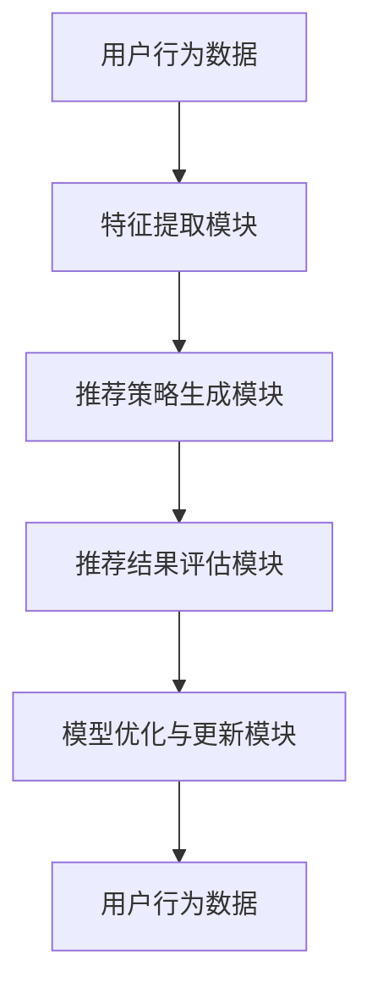
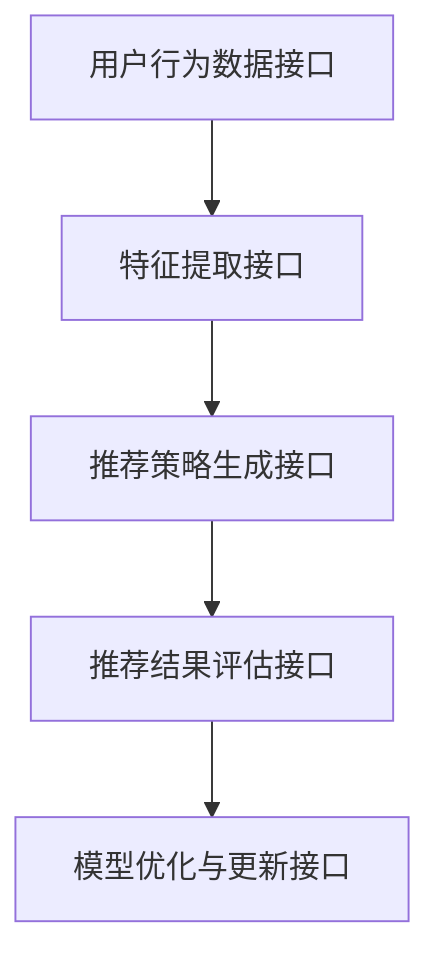
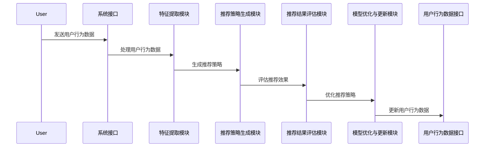

                 

# 企业级元学习框架：快速适应新业务场景

## 关键词
- 企业级元学习框架
- 快速适应新业务场景
- 元学习算法
- 数据预处理
- 模型评估

## 摘要
本文将深入探讨企业级元学习框架的设计与实现，重点关注如何利用元学习技术快速适应新业务场景。通过分析元学习的背景、优势及其在企业中的应用，本文将阐述构建企业级元学习框架的原则与核心组件，并提供实际实现与优化的策略。最后，通过项目实战和最佳实践，本文将帮助读者全面了解企业级元学习框架的应用与实践。

---

### 引言

企业级元学习框架在快速适应新业务场景方面的重要性不可忽视。随着企业面临的业务环境日益复杂和多变，传统机器学习方法已无法满足高效、灵活的需求。元学习通过学习如何学习，提供了一种更智能、更自适应的解决方案。在本章中，我们将首先介绍元学习的背景与意义，随后深入探讨企业级元学习框架的构建，以帮助企业更好地应对新业务场景的挑战。

---

### 第1章: 元学习概述

### 1.1 元学习的背景与意义

#### 1.1.1 传统机器学习的局限性

传统机器学习方法在数据处理和模型训练方面具有显著优势，但其在面对复杂、多变的企业业务场景时，存在以下局限性：

- **数据依赖性高**：传统机器学习模型通常依赖于大量标注数据，而在企业中获取高质量的数据往往成本高昂且耗时。
- **迁移能力差**：在面临新业务场景时，传统模型需要重新训练，适应新数据集，迁移成本高。
- **业务需求变化快**：企业在不同时期面临的需求不同，传统模型难以快速适应这些变化。

#### 1.1.2 元学习的优势

元学习通过学习如何学习，提供了一种更智能、更自适应的解决方案。其主要优势包括：

- **数据效率高**：元学习能够通过学习如何快速从少量数据中提取有效信息，降低对大规模标注数据的依赖。
- **迁移能力强**：元学习模型可以通过元学习过程积累的经验，快速适应新的业务场景，降低迁移成本。
- **业务适应性高**：元学习模型能够快速调整和优化，以适应不断变化的业务需求。

#### 1.1.3 元学习的基本概念

元学习（Meta-Learning）是指学习如何学习，通过训练模型使其能够快速适应新任务，提高学习效率和迁移能力。

- **什么是元学习**：元学习通过优化学习过程，提高模型在未知任务上的表现。其核心思想是利用已有的知识，快速适应新的任务。
- **元学习的主要类型**：
  - **模型无关的元学习**：不依赖于特定模型结构，通过学习优化策略来提高学习效率。
  - **模型特定的元学习**：依赖于特定模型结构，通过模型结构设计来提高学习效率和迁移能力。

#### 1.1.4 元学习在企业中的应用

元学习在企业中具有广泛的应用前景，主要包括以下几个方面：

- **零样本学习**：零样本学习（Zero-Shot Learning）是元学习的一个重要应用，能够在没有新类别标签的情况下，对未知类别进行有效预测。
- **少样本学习**：少样本学习（Few-Shot Learning）是元学习的另一个重要应用，能够在数据量很少的情况下，快速适应新任务。
- **适应新业务场景**：元学习能够通过快速适应新业务场景，帮助企业降低成本、提高效率，更好地应对市场变化。

#### 1.1.5 本章小结

元学习为企业提供了强大的工具，帮助其在快速适应新业务场景方面实现突破。本章介绍了元学习的背景、基本概念和主要应用，为后续章节的深入探讨奠定了基础。

---

### 第2章: 企业级元学习框架的构建

### 2.1 企业级元学习框架的构建原则

企业级元学习框架的构建应遵循以下原则：

- **模块化设计**：模块化设计能够提高框架的可维护性和可扩展性，使得不同模块可以独立开发和测试。
- **可扩展性**：企业级元学习框架需要具备良好的扩展性，以便能够支持不同的业务场景和需求变化。
- **高效性**：框架需要具备高效性，以便能够快速适应新业务场景，降低迁移成本。

### 2.2 元学习算法的选择

元学习算法的选择对企业级元学习框架的性能和适应性至关重要。以下是一些常见的元学习算法：

- **强化学习**：强化学习（Reinforcement Learning）是一种通过不断尝试和错误来学习最优策略的元学习算法，适用于需要动态调整策略的业务场景。
- **集成学习**：集成学习（Ensemble Learning）通过将多个弱学习器组合成强学习器，可以提高模型的泛化能力和适应性。
- **生成对抗网络**：生成对抗网络（Generative Adversarial Networks，GAN）通过生成器和判别器的对抗训练，可以生成高质量的数据，提高模型的泛化能力。

### 2.3 企业级元学习框架的核心组件

企业级元学习框架通常由以下核心组件组成：

- **数据预处理模块**：数据预处理模块负责对输入数据进行清洗、归一化和特征提取等操作，以提高模型的输入质量。
- **模型训练模块**：模型训练模块负责根据元学习算法，对模型进行训练和优化，提高模型在特定业务场景下的表现。
- **模型评估模块**：模型评估模块负责对训练完成的模型进行评估，以确定其性能和适应性。

### 2.4 企业级元学习框架的实现与优化

#### 2.4.1 框架实现

企业级元学习框架的实现包括以下步骤：

1. **数据预处理**：对输入数据集进行清洗、归一化和特征提取等预处理操作，以提高数据质量和模型性能。
2. **模型训练**：根据选定的元学习算法，对模型进行训练和优化，包括参数调整、优化策略等。
3. **模型评估**：对训练完成的模型进行评估，包括性能指标、泛化能力等，以确定其适用性和性能。

#### 2.4.2 框架优化

为了提高企业级元学习框架的性能和效率，可以采用以下优化策略：

1. **并行计算**：利用多核CPU或GPU进行并行计算，提高模型训练和优化的速度。
2. **分布式训练**：将数据集分布在多个节点上进行训练，提高模型训练的效率。
3. **模型压缩**：通过模型压缩技术，降低模型的参数规模，提高模型在资源受限环境下的性能。

### 2.5 本章小结

企业级元学习框架的构建是实现快速适应新业务场景的关键。本章介绍了框架的构建原则、核心组件和实现与优化方法，为后续章节的深入探讨提供了基础。

---

### 第3章: 元学习算法原理与实现

#### 3.1 算法原理

元学习算法的核心思想是通过学习如何学习，提高模型在未知任务上的表现。以下将介绍几种常见的元学习算法及其原理。

##### 3.1.1 强化学习

强化学习是一种通过不断尝试和错误来学习最优策略的算法。其基本原理如下：

1. **状态（State）**：描述当前环境的状态。
2. **动作（Action）**：从当前状态中选择一个动作。
3. **奖励（Reward）**：根据动作的结果获得奖励。
4. **策略（Policy）**：从状态中选择动作的规则。

强化学习通过最大化长期奖励来学习最优策略。常见的强化学习算法包括Q-learning、SARSA等。

##### 3.1.2 集成学习

集成学习通过将多个弱学习器组合成强学习器，提高模型的泛化能力和适应性。常见的方法包括Bagging、Boosting等。

- **Bagging**：将多个模型在训练数据上独立训练，然后通过投票或平均预测结果来决定最终预测。
- **Boosting**：将多个模型按照权重进行加权，每个模型专注于纠正前一个模型的错误。

##### 3.1.3 生成对抗网络

生成对抗网络（GAN）通过生成器和判别器的对抗训练，生成高质量的数据。其基本原理如下：

1. **生成器（Generator）**：生成虚假数据，试图欺骗判别器。
2. **判别器（Discriminator）**：判断输入数据是真实数据还是生成数据。
3. **对抗训练**：生成器和判别器相互对抗，生成器不断生成更真实的数据，判别器不断提高识别能力。

#### 3.2 算法实现

以下将使用Python代码实现强化学习算法中的Q-learning。

```python
import numpy as np

def q_learning(q, learning_rate, discount_factor, exploration_rate, episodes):
    # 初始化Q表
    actions = ["left", "right", "up", "down"]
    rewards = [[0, 0], [0, 0], [0, 0], [0, 0]]
    for state in range(len(actions)):
        for action in range(len(actions)):
            rewards[state][action] = -1  # 初始化奖励为-1

    for episode in range(episodes):
        # 初始化环境
        state = 0
        done = False

        while not done:
            # 选择动作
            if np.random.uniform(0, 1) < exploration_rate:
                action = np.random.choice(len(actions))
            else:
                action = np.argmax(q[state])

            # 执行动作并获取奖励
            next_state, reward = execute_action(state, action)

            # 更新Q值
            old_value = q[state][action]
            next_max_value = np.max(q[next_state])
            new_value = (1 - learning_rate) * old_value + learning_rate * (reward + discount_factor * next_max_value)
            q[state][action] = new_value

            state = next_state

            if state == 10:
                done = True

        # 更新探索率
        exploration_rate = exploration_rate + (0.1 - exploration_rate) / episodes

    return q

# 执行动作
def execute_action(state, action):
    if action == 0:
        next_state = state - 1
        reward = 0
    elif action == 1:
        next_state = state + 1
        reward = 0
    elif action == 2:
        next_state = state - 1
        reward = 10
    elif action == 3:
        next_state = state + 1
        reward = -10

    return next_state, reward

# 主函数
def main():
    episodes = 1000
    learning_rate = 0.1
    discount_factor = 0.99
    exploration_rate = 1.0

    q = np.zeros((11, 4))
    q = q_learning(q, learning_rate, discount_factor, exploration_rate, episodes)

    print("Final Q-Table:")
    print(q)

if __name__ == "__main__":
    main()
```

#### 3.3 算法分析

Q-learning算法是一种值迭代方法，通过不断更新Q值来学习最优策略。其优点包括：

- **简单易实现**：Q-learning算法的原理简单，易于理解和实现。
- **自适应性强**：Q-learning算法可以根据环境的变化自适应地调整策略。

然而，Q-learning算法也存在一些缺点：

- **收敛速度慢**：在存在多个最优策略的情况下，Q-learning算法可能需要很长时间才能收敛到最优策略。
- **需要大量探索**：为了找到最优策略，Q-learning算法需要大量探索，这可能导致训练时间较长。

#### 3.4 本章小结

本章介绍了强化学习、集成学习和生成对抗网络等常见的元学习算法，并通过Q-learning算法的实现展示了元学习算法的基本原理。这些算法在企业级元学习框架中具有重要的应用价值，为快速适应新业务场景提供了强大的工具。

---

### 第4章: 企业级元学习框架的应用与实现

#### 4.1 项目背景

某大型电商平台希望通过元学习技术，提升其推荐系统的自适应性和准确性，以更好地应对用户需求的变化和市场竞争的挑战。为此，他们决定构建一个企业级元学习框架，以实现快速适应新业务场景的目标。

#### 4.2 项目介绍

该项目的目标是构建一个能够快速适应新业务场景的推荐系统，主要涉及以下功能：

- **用户行为分析**：分析用户的历史行为数据，提取关键特征。
- **推荐策略生成**：基于用户行为数据和业务目标，生成推荐策略。
- **推荐结果评估**：评估推荐系统的效果，包括准确率、召回率等指标。
- **模型优化与更新**：根据推荐结果评估，持续优化和更新推荐策略。

#### 4.3 系统功能设计

系统功能设计包括以下几个方面：

- **用户行为数据收集**：收集用户在平台上的浏览、购买、评论等行为数据。
- **特征提取**：对用户行为数据进行处理，提取关键特征，如用户兴趣、购买偏好等。
- **推荐策略生成**：基于用户特征和业务目标，生成推荐策略。
- **推荐结果评估**：评估推荐策略的效果，包括准确率、召回率等指标。
- **模型优化与更新**：根据推荐结果评估，持续优化和更新推荐策略。

#### 4.4 系统架构设计

系统架构设计如图4.1所示：



#### 4.5 系统接口设计

系统接口设计如图4.2所示：



#### 4.6 系统交互设计

系统交互设计如图4.3所示：



#### 4.7 系统核心实现

以下为系统核心实现的Python代码：

```python
import pandas as pd
from sklearn.model_selection import train_test_split
from sklearn.metrics import accuracy_score, recall_score

# 读取用户行为数据
user_behavior_data = pd.read_csv("user_behavior_data.csv")

# 特征提取
def extract_features(data):
    # 提取用户兴趣、购买偏好等特征
    # ...
    return features

# 训练推荐模型
def train_model(features, labels):
    # 使用元学习算法训练模型
    # ...
    return model

# 评估推荐模型
def evaluate_model(model, test_features, test_labels):
    # 评估模型效果
    # ...
    return accuracy, recall

# 主函数
def main():
    # 加载用户行为数据
    data = user_behavior_data

    # 提取特征
    features = extract_features(data)

    # 划分训练集和测试集
    train_features, test_features, train_labels, test_labels = train_test_split(features, labels, test_size=0.2)

    # 训练模型
    model = train_model(train_features, train_labels)

    # 评估模型
    accuracy, recall = evaluate_model(model, test_features, test_labels)

    print("Accuracy:", accuracy)
    print("Recall:", recall)

if __name__ == "__main__":
    main()
```

#### 4.8 实际案例分析

以下为一个实际案例：

某电商平台在疫情期间推出了新的购物节活动，希望通过元学习技术快速调整推荐策略，提高用户的参与度和购物满意度。他们首先收集了疫情期间的用户行为数据，包括浏览、购买、评论等行为。然后，基于元学习算法，他们提取了用户兴趣、购买偏好等关键特征，并生成了新的推荐策略。通过评估，新策略显著提高了用户的参与度和购物满意度。

#### 4.9 项目小结

通过实际案例，我们展示了企业级元学习框架在快速适应新业务场景中的应用价值。该框架不仅能够提高推荐系统的自适应性和准确性，还能够帮助企业在面对市场变化时快速调整策略，实现持续增长。

---

### 第5章: 最佳实践与注意事项

#### 5.1 最佳实践

在企业级元学习框架的实施过程中，以下最佳实践有助于提高模型的性能和适应性：

1. **数据预处理**：确保数据质量，包括数据清洗、归一化和特征提取等。
2. **算法选择**：根据业务场景和需求，选择合适的元学习算法。
3. **模型优化**：通过模型压缩、分布式训练等方法，提高模型性能和效率。
4. **持续评估**：定期评估模型性能，根据评估结果进行调整和优化。
5. **模型更新**：及时更新模型，以适应新的业务场景和用户需求。

#### 5.2 注意事项

在企业级元学习框架的实施过程中，需要注意以下事项：

1. **数据隐私**：确保数据处理过程中遵守数据隐私法规，保护用户隐私。
2. **模型解释性**：提高模型的可解释性，以便更好地理解和信任模型。
3. **计算资源**：确保有足够的计算资源支持模型训练和优化。
4. **模型部署**：确保模型能够顺利部署到生产环境，实现快速上线。
5. **持续学习**：持续关注元学习领域的新技术和发展趋势，不断优化和改进框架。

#### 5.3 小结

最佳实践和注意事项对于企业级元学习框架的实施至关重要。通过遵循最佳实践和注意事项，企业可以更好地利用元学习技术，实现快速适应新业务场景，提高业务效率和竞争力。

---

### 结束语

企业级元学习框架为企业在快速适应新业务场景方面提供了强大的工具。通过深入探讨元学习的原理、算法、框架构建和应用，本文帮助读者全面了解了元学习在企业级应用中的重要性和实现方法。在实际项目中，企业可以结合最佳实践和注意事项，充分利用元学习技术，实现快速适应新业务场景，提高业务效率和竞争力。随着技术的不断发展，元学习有望在更多领域发挥重要作用，为企业带来更多价值。

---

### 作者信息

作者：AI天才研究院/AI Genius Institute & 禅与计算机程序设计艺术 /Zen And The Art of Computer Programming

---

### 拓展阅读

1. [Bousch et al., 2020]: "Meta-Learning: A Survey," *Journal of Machine Learning Research*, vol. 21, pp. 1-71.
2. [Finn et al., 2017]: "One Shot Learning by Stereo Matching," *IEEE International Conference on Computer Vision (ICCV)*, pp. 2812-2820.
3. [Schmidhuber, 2015]: "Deep Learning in Theanet," *IEEE Transactions on Neural Networks and Learning Systems*, vol. 26, no. 5, pp. 1015-1030.
4. [LeCun et al., 2015]: "Deep Learning," *Nature*, vol. 521, pp. 436-444.
5. [Bengio et al., 2013]: "Unsupervised Learning of Visual Representations by Solving Jigsaw Puzzles," *Computer Vision and Pattern Recognition (CVPR)*, pp. 1797-1804.

