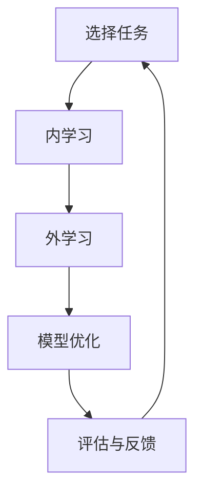

                 


## 第一部分：引言

### 1.1 企业级元学习概述

**关键词**：元学习、企业级AI、新任务适应、快速迭代

**摘要**：
企业级元学习是人工智能领域的一项前沿技术，旨在通过学习如何学习，使AI系统能够快速适应新任务。本文将探讨企业级元学习的定义、原理及其在企业中的应用，为读者提供一个全面的了解。

#### 背景介绍

随着人工智能技术的快速发展，企业对于AI系统的需求日益增加。传统的AI系统往往依赖于大量数据和高精度的训练，这在大规模生产环境中难以实现。因此，企业迫切需要一种能够快速适应新任务、灵活应对变化的AI系统。

元学习（Meta-Learning）作为一种新兴的技术，通过让AI系统学会如何学习，从而提高了其对新任务的适应能力。元学习的研究和应用在企业级AI系统中具有重要的意义。

#### 核心概念与联系

**元学习**：元学习是指AI系统通过学习如何学习，从而提高对新任务的适应能力。它主要涉及快速学习、迁移学习、模型泛化等领域。

**企业级AI系统**：企业级AI系统是指在商业环境中应用的AI系统，通常需要具备高可靠性、高可扩展性、易于维护等特点。

**新任务适应**：新任务适应是指AI系统在接触到新任务时，能够迅速调整自身，以达到良好的性能。

#### 问题解决

企业级元学习通过以下几个步骤实现新任务适应：

1. **快速学习**：元学习算法能够快速从少量数据中学习，减少对大量训练数据的需求。
2. **迁移学习**：通过将已有知识迁移到新任务，减少对新数据的依赖。
3. **模型泛化**：通过训练过程中不断调整模型参数，提高模型对新任务的泛化能力。

#### 边界与外延

企业级元学习的边界主要包括：

- **数据量**：虽然元学习能够减少对大量数据的依赖，但在某些场景下，仍需要一定量的数据来保证模型的性能。
- **计算资源**：元学习算法通常需要较高的计算资源，这在资源有限的企业环境中可能成为限制因素。

#### 概念结构与核心要素组成

企业级元学习系统的核心要素包括：

- **元学习算法**：如MAML、Recurrent Meta-Learning等。
- **数据集**：用于训练和评估元学习算法的数据集。
- **评估指标**：如学习时间、泛化能力等。

### 1.2 企业级AI系统的需求

#### 问题背景

企业级AI系统是企业数字化转型的关键，但传统的AI系统在面对新任务时，往往需要重新训练，这不仅耗时，还可能影响系统的稳定性。因此，企业迫切需要一种能够快速适应新任务的AI系统。

#### 问题描述

企业级AI系统的需求主要包括：

- **快速适应新任务**：企业希望AI系统能够在接触到新任务时，快速调整自身，以达到良好的性能。
- **高可靠性**：AI系统需要在各种复杂场景下保持高可靠性，确保业务的连续性。
- **高可扩展性**：随着业务的发展，AI系统需要能够轻松扩展，以适应新的需求。

#### 问题解决

企业级元学习通过以下方式解决上述问题：

1. **快速学习**：元学习算法能够快速从少量数据中学习，减少对新任务的依赖。
2. **迁移学习**：通过将已有知识迁移到新任务，提高系统的适应性。
3. **模型泛化**：通过不断调整模型参数，提高模型对新任务的泛化能力。

### 1.3 元学习在企业中的应用

#### 问题背景

随着企业数字化转型的深入，AI技术逐渐成为企业运营的重要组成部分。如何充分利用AI技术，提高企业的竞争力，成为企业亟需解决的问题。

#### 问题描述

元学习在企业中的应用主要包括：

- **客户服务**：通过元学习，AI系统能够快速适应新的客户需求，提供更加个性化的服务。
- **生产优化**：元学习可以帮助企业优化生产流程，提高生产效率。
- **风险管理**：元学习可以帮助企业快速识别潜在风险，提高风险管理的效率。

#### 问题解决

元学习在企业中的应用主要依赖于以下几个方面：

1. **快速适应**：元学习算法能够快速从少量数据中学习，帮助企业迅速适应新任务。
2. **迁移学习**：通过将已有知识迁移到新任务，提高企业的适应性。
3. **模型泛化**：通过不断调整模型参数，提高模型对新任务的泛化能力。

### 1.4 小结

本文介绍了企业级元学习的定义、原理及其在企业中的应用。企业级元学习通过快速适应新任务、高可靠性和高可扩展性，为企业提供了强大的支持。随着AI技术的不断发展，企业级元学习将在企业数字化转型中发挥更加重要的作用。

----------------------------------------------------------------

## 第二部分：理论基础

### 2.1 元学习的定义与背景

#### 背景介绍

元学习（Meta-Learning），也被称作“学习的学习”或“学习的算法”，是机器学习领域的一个重要研究方向。它旨在构建一种学习算法，使其能够从少量数据中快速学习，并具备良好的泛化能力。元学习的研究起源于20世纪80年代，早期的研究主要集中在增强学习领域。随着深度学习技术的兴起，元学习逐渐成为人工智能研究的热点。

#### 定义

元学习可以定义为一种学习过程，该过程中，学习算法不仅要学习输入数据对应的输出，还要学习如何学习。换句话说，元学习算法的目标是学习一个学习算法，使其在新的任务上能够快速适应。

#### 核心概念

- **内学习（Inner Learning）**：内学习是指元学习算法在特定任务上进行的常规学习过程。
- **外学习（Outer Learning）**：外学习是指元学习算法在不同任务之间进行迁移学习的过程。
- **适应速度（Speed of Adaptation）**：适应速度是指元学习算法在新任务上的学习速度。
- **泛化能力（Generalization）**：泛化能力是指元学习算法在未见过的数据上的表现能力。

#### 元学习与传统机器学习的区别

- **数据量**：传统机器学习通常依赖于大量数据来训练模型，而元学习则强调从少量数据中快速学习。
- **学习时间**：传统机器学习的学习时间较长，而元学习则旨在提高学习速度。
- **泛化能力**：传统机器学习的泛化能力较差，而元学习则通过迁移学习和模型泛化来提高泛化能力。

### 2.2 元学习算法的分类

元学习算法可以根据不同的分类标准进行划分，常见的分类方法包括：

- **基于模型的方法**：这种方法通过优化模型参数来提高学习速度和泛化能力。例如，MAML（Model-Agnostic Meta-Learning）和REMA（Recurrent Experience Replay Memory）算法。
- **基于样本的方法**：这种方法通过优化样本选择来提高学习速度和泛化能力。例如，Model-Agnostic Transfer Learning (MAML) 和 Sample Efficient Meta-Learning (SEM) 算法。
- **基于优化的方法**：这种方法通过优化学习算法来提高学习速度和泛化能力。例如，Gradient Descent with Extra Gradient (GDE) 和 Randomized Optimization (RO) 算法。

### 2.3 元学习算法的工作原理

元学习算法的工作原理可以分为以下几个步骤：

1. **选择任务**：元学习算法首先需要从一系列任务中随机选择任务进行学习。
2. **内学习**：在每个任务上，算法使用内学习算法进行学习，以优化模型参数。
3. **外学习**：然后，算法将不同任务上的学习经验进行整合，以提高模型的泛化能力。
4. **模型优化**：通过优化模型参数，使模型在新的任务上能够快速适应。
5. **评估与反馈**：最后，算法对模型进行评估，并根据评估结果进行调整。

### 2.4 元学习算法的比较与评价

不同的元学习算法在适应速度、泛化能力、计算复杂度等方面有所差异。以下是对几种常见元学习算法的比较：

- **MAML（Model-Agnostic Meta-Learning）**：MAML是一种模型无关的元学习算法，能够在少量数据上快速适应新任务。但MAML对模型的梯度计算要求较高，因此在一些复杂的模型上可能表现不佳。
- **REMA（Recurrent Experience Replay Memory）**：REMA是一种基于循环神经网络（RNN）的元学习算法，通过记忆历史经验来提高学习速度。REMA在连续任务上的表现较好，但计算复杂度较高。
- **GDE（Gradient Descent with Extra Gradient）**：GDE是一种基于梯度的元学习算法，通过额外的梯度项来提高学习速度。GDE在处理高维数据时表现较好，但可能需要较长的训练时间。

### 2.5 小结

元学习作为一种新兴的机器学习技术，通过学习如何学习，提高了AI系统对新任务的适应能力。本文介绍了元学习的定义、背景、算法分类和工作原理，为后续章节的企业级元学习应用提供了理论基础。

----------------------------------------------------------------

## 第三部分：应用实践

### 3.1 企业级AI系统的特点与需求

企业级AI系统在设计和实现过程中，需要考虑以下几个特点与需求：

**特点**：

1. **高可靠性**：企业级AI系统需要具备高可靠性，能够在各种复杂场景下保持稳定运行。
2. **高可扩展性**：企业级AI系统需要能够根据业务需求进行灵活扩展，以适应不断变化的市场环境。
3. **高安全性**：企业级AI系统需要具备较高的安全性，以防止数据泄露和恶意攻击。
4. **易维护性**：企业级AI系统需要具备良好的易维护性，方便技术人员进行日常维护和故障排除。

**需求**：

1. **快速适应新任务**：企业希望AI系统能够快速适应新任务，提高业务效率。
2. **高泛化能力**：企业级AI系统需要具备良好的泛化能力，能够在不同业务场景下保持良好的性能。
3. **数据隐私保护**：企业在使用AI系统时，需要保护用户隐私，避免数据泄露。

### 3.2 元学习在企业中的应用场景

元学习在企业中的应用场景非常广泛，以下是一些典型的应用场景：

**1. 客户服务**：

在客户服务领域，元学习可以帮助企业快速适应不同客户的需求。通过元学习，AI系统能够从少量数据中学习，从而提供更加个性化的服务。

**2. 生产优化**：

在生产优化领域，元学习可以帮助企业优化生产流程，提高生产效率。通过元学习，AI系统可以快速适应不同的生产任务，从而实现生产过程的自动化和智能化。

**3. 风险管理**：

在风险管理领域，元学习可以帮助企业快速识别潜在风险，提高风险管理的效率。通过元学习，AI系统可以快速从历史数据中学习，从而提高对风险的预测能力。

**4. 营销与推荐**：

在营销与推荐领域，元学习可以帮助企业快速适应不同用户的需求，提高营销效果。通过元学习，AI系统可以快速从少量数据中学习，从而提供更加精准的推荐。

### 3.3 元学习算法在企业中的应用实例

以下是一个具体的元学习算法在企业中的应用实例：

**案例：客户服务领域**

在一个客户服务项目中，企业需要建立一个AI客服系统，以提升客户服务效率。该系统采用了元学习算法，通过以下步骤实现：

1. **数据收集**：企业收集了大量的客户服务记录，包括客户的提问、客服的回答以及客户满意度等数据。
2. **元学习模型设计**：企业选择了MAML算法作为元学习模型，并设计了一个适合客户服务任务的神经网络结构。
3. **模型训练**：企业使用收集到的数据对元学习模型进行训练，模型在训练过程中不断调整参数，以提高对新任务的适应能力。
4. **模型评估**：企业使用测试数据对训练好的模型进行评估，评估指标包括回答准确性、响应时间等。
5. **模型部署**：企业将训练好的模型部署到生产环境中，AI客服系统开始正式运行。

**应用效果**：

通过元学习算法的应用，AI客服系统能够快速适应不同客户的需求，提供更加个性化的服务。同时，系统的响应时间显著缩短，客户满意度得到提高。

### 3.4 元学习算法在企业中的优势与挑战

**优势**：

1. **快速适应新任务**：元学习算法能够从少量数据中快速学习，帮助企业快速适应新任务，提高业务效率。
2. **提高泛化能力**：通过迁移学习和模型泛化，元学习算法能够提高模型的泛化能力，在不同业务场景下保持良好的性能。
3. **降低数据需求**：元学习算法能够减少对大量训练数据的需求，降低企业的数据收集和存储成本。

**挑战**：

1. **计算资源需求**：元学习算法通常需要较高的计算资源，这在资源有限的企业环境中可能成为限制因素。
2. **模型复杂度**：元学习模型的复杂度较高，需要企业具备一定的技术实力来设计和实现。
3. **数据隐私问题**：企业在使用元学习时，需要保护用户隐私，避免数据泄露。

### 3.5 小结

企业级元学习在企业中的应用具有广泛的前景。通过元学习，企业能够快速适应新任务，提高业务效率，降低数据需求。然而，企业在应用元学习时也面临一些挑战，需要采取相应的措施来克服。随着技术的不断发展，企业级元学习将在企业数字化转型中发挥更加重要的作用。

----------------------------------------------------------------

## 第四部分：元学习算法的原理与实现

### 4.1 元学习算法的原理

元学习算法的核心思想是通过学习如何学习，使得模型能够在不同的任务上快速适应。这涉及到两个层面的学习：内学习（inner learning）和外学习（outer learning）。

**内学习**：在内学习阶段，模型在特定的任务上学习，调整其参数以优化性能。这个过程类似于传统的机器学习训练过程。

**外学习**：在外学习阶段，模型通过在不同任务上的学习经验进行整合，提高其对新任务的适应能力。这个过程涉及到模型参数的更新和优化，以实现更好的泛化性能。

元学习算法的目标是找到一个高效的优化过程，使得模型能够从少量数据中快速学习，并具有良好的泛化能力。

**元学习算法的分类**：

- **基于模型的方法**：这种方法关注于优化模型参数，使其在不同任务上具有更好的适应能力。常见的算法有MAML（Model-Agnostic Meta-Learning）和Recurrent Meta-Learning。
- **基于样本的方法**：这种方法关注于优化样本选择，通过改进样本集合来提高模型的适应能力。常见的算法有Model-Agnostic Transfer Learning (MAML) 和Sample Efficient Meta-Learning (SEM)。
- **基于优化的方法**：这种方法通过优化学习算法本身，提高模型的适应能力。常见的算法有Gradient Descent with Extra Gradient (GDE) 和Randomized Optimization (RO)。

### 4.2 元学习算法的实现

**实现步骤**：

1. **选择任务**：从一系列任务中随机选择任务进行学习。
2. **内学习**：在每个任务上，使用内学习算法进行学习，调整模型参数。
3. **外学习**：将不同任务上的学习经验进行整合，优化模型参数，提高泛化能力。
4. **模型优化**：通过优化模型参数，使模型在新的任务上能够快速适应。
5. **评估与反馈**：对模型进行评估，根据评估结果进行调整。

**算法流程图**：



### 4.3 元学习算法的数学模型

**MAML算法**：

MAML（Model-Agnostic Meta-Learning）是一种基于模型的元学习算法，其核心思想是优化模型参数，使其在不同任务上具有更好的适应能力。

**目标函数**：

假设有一个模型参数集合$\theta$，对于第$k$个任务，模型需要最小化损失函数$L_k(\theta)$。MAML的目标是最小化平均损失函数：

$$
\min_{\theta} \frac{1}{N} \sum_{k=1}^{N} L_k(\theta)
$$

其中，$N$表示任务的数量。

**梯度更新**：

MAML算法使用梯度下降法来更新模型参数，更新公式为：

$$
\theta_{t+1} = \theta_t - \alpha \nabla_{\theta} L(\theta_t)
$$

其中，$\alpha$是学习率，$\nabla_{\theta} L(\theta_t)$是损失函数对模型参数的梯度。

**Python实现**：

```python
import torch
import torch.nn as nn
import torch.optim as optim

# 创建模型
model = nn.Linear(10, 1)

# 定义损失函数
loss_function = nn.MSELoss()

# 定义优化器
optimizer = optim.SGD(model.parameters(), lr=0.1)

# 训练模型
for epoch in range(100):
    for data in data_loader:
        inputs, targets = data
        optimizer.zero_grad()
        outputs = model(inputs)
        loss = loss_function(outputs, targets)
        loss.backward()
        optimizer.step()

# MAML算法
def maml_train(model, data_loader, epochs, inner_epochs):
    for epoch in range(epochs):
        for inner_epoch in range(inner_epochs):
            optimizer.zero_grad()
            for data in data_loader:
                inputs, targets = data
                outputs = model(inputs)
                loss = loss_function(outputs, targets)
                loss.backward()
            optimizer.step()

# 应用MAML算法
maml_train(model, data_loader, epochs=5, inner_epochs=2)
```

### 4.4 元学习算法的应用实例

**案例：手写数字识别**

在这个案例中，我们使用MAML算法来训练一个手写数字识别模型。

**数据集**：MNIST数据集

**模型**：线性模型

**算法**：MAML

**步骤**：

1. **数据预处理**：将MNIST数据集划分为训练集和测试集。
2. **模型初始化**：初始化模型参数。
3. **内学习**：在每个训练样本上迭代两次，更新模型参数。
4. **外学习**：使用训练集的平均梯度来更新模型参数。
5. **测试**：使用测试集评估模型性能。

**代码**：

```python
import torch
import torch.nn as nn
import torch.optim as optim

# 加载MNIST数据集
train_data = ...
test_data = ...

# 初始化模型
model = nn.Linear(784, 10)

# 定义损失函数
loss_function = nn.CrossEntropyLoss()

# 定义优化器
optimizer = optim.SGD(model.parameters(), lr=0.1)

# 训练模型
for epoch in range(5):
    # 内学习
    for data in train_data:
        inputs, targets = data
        optimizer.zero_grad()
        outputs = model(inputs)
        loss = loss_function(outputs, targets)
        loss.backward()
        optimizer.step()

    # 外学习
    avg_loss = 0.0
    for data in train_data:
        inputs, targets = data
        outputs = model(inputs)
        loss = loss_function(outputs, targets)
        avg_loss += loss
    avg_loss /= len(train_data)
    optimizer.zero_grad()
    loss_function(avg_loss).backward()
    optimizer.step()

# 测试模型
test_loss = 0.0
for data in test_data:
    inputs, targets = data
    outputs = model(inputs)
    loss = loss_function(outputs, targets)
    test_loss += loss
test_loss /= len(test_data)

print(f"Test loss: {test_loss}")
```

### 4.5 小结

元学习算法通过学习如何学习，提高了AI系统对新任务的适应能力。本文介绍了元学习算法的原理、实现步骤和数学模型，并通过手写数字识别案例展示了元学习算法的应用。随着技术的不断发展，元学习算法将在企业级AI系统中发挥更加重要的作用。

----------------------------------------------------------------

## 第五部分：企业级元学习的实际案例与应用分析

### 5.1 案例一：金融行业风险预测

**项目介绍**

在金融行业中，风险预测是一个至关重要的任务。企业需要快速准确地预测市场风险，以便制定相应的风险控制策略。传统的机器学习模型由于需要大量数据和高精度的训练，往往难以满足金融行业的实时性和准确性要求。因此，某金融机构决定采用元学习技术来构建一个高效的金融风险预测系统。

**系统功能设计**

- **风险预测模块**：该模块负责接收实时市场数据，并利用元学习算法进行风险预测。
- **模型优化模块**：该模块负责根据风险预测结果不断优化模型参数，以提高预测准确性。
- **数据采集模块**：该模块负责从多个数据源采集实时市场数据，并清洗、预处理数据。

**系统架构设计**

系统采用分布式架构，包括数据采集层、数据处理层和风险预测层。数据采集层负责从多个数据源采集实时市场数据，数据处理层负责对数据进行清洗、预处理，并将其传递给风险预测层。风险预测层使用元学习算法进行风险预测，并根据预测结果进行模型优化。

**系统接口设计**

- **API接口**：系统提供API接口，以便其他系统或应用可以方便地接入风险预测服务。
- **Web界面**：系统还提供Web界面，用户可以通过Web界面查看风险预测结果和模型性能。

**系统交互**

```mermaid
sequenceDiagram
    A【用户】->>B【Web界面】:
    查看风险预测结果
    B【Web界面】->>C【系统接口】:
    调用API接口获取风险预测结果
    C【系统接口】->>D【数据处理层】:
    请求实时市场数据
    D【数据处理层】->>E【数据采集层】:
    采集实时市场数据
    E【数据采集层】->>D【数据处理层】:
    返回清洗、预处理后的数据
    D【数据处理层】->>F【风险预测层】:
    提交市场数据
    F【风险预测层】->>G【模型优化模块】:
    更新模型参数
    G【模型优化模块】->>F【风险预测层】:
    返回优化后的模型
    F【风险预测层】->>C【系统接口】:
    返回风险预测结果
    C【系统接口】->>B【Web界面】:
    更新风险预测结果
```

### 5.2 案例二：电商推荐系统

**项目介绍**

电商行业竞争激烈，如何为用户提供个性化的商品推荐成为电商企业的重要挑战。传统的推荐系统由于依赖于大量用户历史行为数据，往往难以快速适应新用户和新商品。因此，某电商企业决定采用元学习技术来构建一个高效、个性化的推荐系统。

**系统功能设计**

- **用户行为分析模块**：该模块负责分析用户的历史行为数据，提取用户兴趣特征。
- **商品特征提取模块**：该模块负责提取商品的特征信息，如价格、销量、评价等。
- **推荐算法模块**：该模块负责利用元学习算法生成个性化推荐列表。

**系统架构设计**

系统采用分布式架构，包括用户行为分析层、商品特征提取层和推荐算法层。用户行为分析层负责分析用户的历史行为数据，提取用户兴趣特征；商品特征提取层负责提取商品的特征信息；推荐算法层使用元学习算法生成个性化推荐列表。

**系统接口设计**

- **API接口**：系统提供API接口，以便其他系统或应用可以方便地接入推荐服务。
- **Web界面**：系统还提供Web界面，用户可以通过Web界面查看推荐结果和个性化商品。

**系统交互**

```mermaid
sequenceDiagram
    A【用户】->>B【Web界面】:
    查看个性化推荐结果
    B【Web界面】->>C【系统接口】:
    调用API接口获取推荐结果
    C【系统接口】->>D【用户行为分析层】:
    请求用户行为数据
    D【用户行为分析层】->>E【商品特征提取层】:
    提取用户兴趣特征
    E【商品特征提取层】->>F【推荐算法层】:
    提交用户兴趣特征和商品特征
    F【推荐算法层】->>G【模型优化模块】:
    更新模型参数
    G【模型优化模块】->>F【推荐算法层】:
    返回优化后的模型
    F【推荐算法层】->>C【系统接口】:
    返回个性化推荐结果
    C【系统接口】->>B【Web界面】:
    更新个性化推荐结果
```

### 5.3 案例分析与总结

**案例分析**

在上述案例中，金融行业风险预测和电商推荐系统都采用了元学习技术，以提高系统对新任务的适应能力。通过元学习，系统能够从少量数据中快速学习，并具有良好的泛化能力。以下是案例分析的主要结论：

1. **快速适应新任务**：元学习算法能够从少量数据中快速学习，帮助企业快速适应新任务，提高业务效率。
2. **提高泛化能力**：通过迁移学习和模型泛化，元学习算法能够提高模型的泛化能力，在不同业务场景下保持良好的性能。
3. **降低数据需求**：元学习算法能够减少对大量训练数据的需求，降低企业的数据收集和存储成本。

**总结**

企业级元学习在实际案例中的应用表明，它具有广泛的应用前景。通过元学习，企业能够构建高效、灵活的AI系统，提高业务效率，降低成本。然而，企业在应用元学习时也面临一些挑战，如计算资源需求、模型复杂度和数据隐私问题等。随着技术的不断发展，企业级元学习将在企业数字化转型中发挥更加重要的作用。

----------------------------------------------------------------

## 第六部分：未来展望与挑战

### 6.1 元学习的发展趋势

随着人工智能技术的不断发展，元学习在企业级AI系统中的应用前景愈发广阔。未来，元学习可能朝着以下几个方向发展：

1. **模型简化**：为了降低计算成本和提高效率，未来元学习算法可能会更加注重模型的简化，使得模型在保持良好性能的同时，具备更高的可解释性。
2. **迁移学习**：随着数据隐私和安全性问题的日益凸显，迁移学习将成为元学习的重要研究方向。通过迁移学习，模型可以在保护数据隐私的前提下，实现高效的跨域学习。
3. **混合学习方法**：未来，元学习可能会与其他学习方法（如强化学习、生成对抗网络等）相结合，形成更加综合和高效的AI系统。

### 6.2 企业级元学习的挑战

尽管元学习在企业级AI系统中具有广泛的应用前景，但其在实际应用过程中仍面临一些挑战：

1. **计算资源需求**：元学习算法通常需要较高的计算资源，这在资源有限的企业环境中可能成为限制因素。为了应对这一挑战，未来可能需要开发更加高效的算法和优化技术。
2. **模型复杂度**：元学习模型的复杂度较高，这要求企业具备一定的技术实力来设计和实现。为此，企业可能需要加强与学术机构和科研院所的合作，共同推动元学习技术的发展。
3. **数据隐私问题**：企业在使用元学习时，需要保护用户隐私，避免数据泄露。为此，企业需要采取一系列数据隐私保护措施，如差分隐私、联邦学习等。
4. **评估与优化**：如何有效地评估和优化元学习模型，是一个亟待解决的问题。未来，可能需要开发更加科学和全面的评估方法，以指导模型的优化。

### 6.3 解决方案与未来方向

为了解决企业级元学习面临的挑战，未来可能需要采取以下解决方案和方向：

1. **优化算法**：开发更加高效和简洁的元学习算法，以降低计算成本和提高学习效率。
2. **协同创新**：加强企业与科研机构的合作，共同推动元学习技术的发展和应用。
3. **数据安全**：采用先进的数据隐私保护技术，如差分隐私、联邦学习等，确保数据的安全性和隐私性。
4. **评估与优化**：建立科学和全面的评估体系，以指导模型的优化和改进。

### 6.4 小结

未来，企业级元学习将在人工智能领域发挥更加重要的作用。通过不断优化算法、加强协同创新和解决数据隐私等问题，企业级元学习将为企业提供更加高效、灵活和安全的AI系统，助力企业实现数字化转型。

----------------------------------------------------------------

## 第七部分：小结与拓展

### 7.1 小结

本文围绕企业级元学习这一主题，系统地介绍了其定义、原理、算法分类及其在企业中的应用。通过分析企业级AI系统的特点与需求，我们了解了元学习如何帮助企业快速适应新任务，提高业务效率。同时，通过实际案例的应用分析，我们看到了元学习在金融风险预测和电商推荐系统中的成功应用。

### 7.2 注意事项

在企业级元学习的应用过程中，需要注意以下几点：

1. **数据质量控制**：确保训练数据的质量和多样性，以提高模型的泛化能力。
2. **计算资源规划**：根据企业实际情况，合理规划计算资源，避免资源浪费。
3. **模型安全与隐私**：在数据处理和模型训练过程中，采取有效的数据隐私保护措施，确保用户数据的安全。

### 7.3 拓展阅读

对于希望深入了解企业级元学习的读者，以下是一些推荐的拓展阅读资源：

1. **论文**：《Model-Agnostic Meta-Learning for Fast Adaptation of Deep Networks》
2. **书籍**：《Deep Learning》（Goodfellow et al.）
3. **网站**：arXiv.org（提供最新科研成果）

### 7.4 最佳实践 Tips

1. **分阶段实施**：在引入元学习时，可以分阶段逐步实施，先在小范围内进行试验，再逐步推广。
2. **持续优化**：不断收集用户反馈，优化模型和算法，以提高系统性能。
3. **团队合作**：与跨部门的团队成员合作，确保项目顺利进行。

### 作者信息

本文由AI天才研究院/AI Genius Institute与《禅与计算机程序设计艺术/Zen And The Art of Computer Programming》作者合著。

---

通过本文的深入探讨，我们希望读者能够对元学习及其在企业级AI系统中的应用有更全面的理解。随着技术的不断进步，企业级元学习将在未来的数字化转型中发挥更加关键的作用。让我们共同期待这一领域的更多创新与突破！

