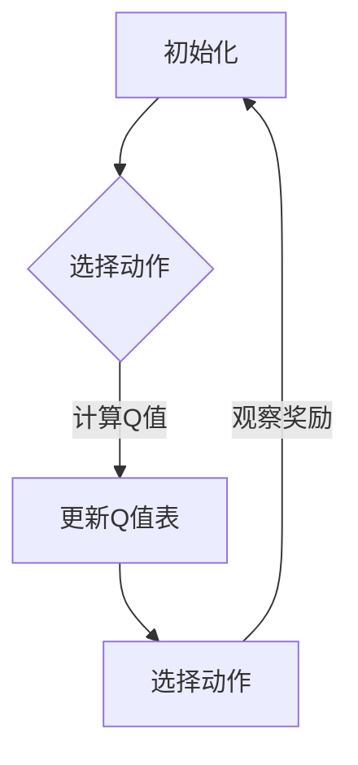

                 

### 第一部分：企业级元强化学习背景

#### 第1章：企业级元强化学习概述

**1.1 元强化学习的概念与意义**

**1.1.1 问题背景**

随着人工智能技术的飞速发展，强化学习（Reinforcement Learning，RL）已成为机器学习领域的重要分支之一。强化学习是一种使人工智能系统通过与环境交互，不断学习并优化决策策略的方法。在企业场景中，强化学习广泛应用于资源调度、供应链管理、风险控制等领域，极大地提高了企业的运营效率和决策质量。

然而，传统的强化学习方法在应对复杂、动态和不确定的企业环境时，存在一些局限性。首先，强化学习通常需要大量的数据和计算资源，这对于企业来说是一大挑战。其次，强化学习算法的收敛速度较慢，可能需要成千上万次的试错过程才能找到最优策略。最后，强化学习算法的性能往往依赖于特定的环境和参数设置，缺乏泛化能力。

为了解决这些问题，企业级元强化学习（Meta Reinforcement Learning）应运而生。元强化学习旨在通过自我学习和优化，快速适应新的环境和任务，从而提高强化学习算法的性能和适用范围。

**1.1.2 问题描述**

企业级元强化学习的核心问题是如何在企业场景中高效地训练和部署强化学习算法，以实现自适应决策和优化。具体来说，企业级元强化学习需要解决以下几个关键问题：

1. 数据高效利用：如何在有限的训练数据中，快速地训练出性能优异的强化学习模型？
2. 算法泛化能力：如何确保强化学习算法在不同环境和任务中具有较好的泛化能力？
3. 算法收敛速度：如何提高强化学习算法的收敛速度，减少试错次数？
4. 系统稳定性：如何在复杂、动态的企业环境中，保持强化学习系统的稳定性和鲁棒性？

**1.1.3 问题解决**

针对上述问题，企业级元强化学习提出了一系列解决方案：

1. **数据增强与迁移学习**：通过数据增强和迁移学习技术，提高训练数据的多样性和质量，从而提高模型的泛化能力。
2. **算法优化与自适应**：采用自适应优化算法，如元学习（Meta Learning）和强化学习算法的融合，提高算法的收敛速度和性能。
3. **分布式与并行计算**：利用分布式和并行计算技术，加速模型的训练和推断过程。
4. **鲁棒性与稳定性**：通过设计鲁棒性算法和引入稳定性机制，提高系统在复杂、动态环境中的适应能力。

**1.1.4 边界与外延**

企业级元强化学习不仅关注强化学习算法本身，还涉及到数据、计算、应用等多个方面。其边界包括：

- 数据边界：企业级元强化学习需要处理海量、多样化的数据，如时间序列数据、图像数据、文本数据等。
- 算法边界：企业级元强化学习需要结合不同类型的强化学习算法，如Q-learning、SARSA、DQN等。
- 计算边界：企业级元强化学习需要高效利用分布式和并行计算资源，以满足实时决策的需求。
- 应用边界：企业级元强化学习可以应用于多个领域，如金融、物流、制造、医疗等，实现自适应决策和优化。

#### 1.2 元强化学习的基本原理

**1.2.1 概念原理**

元强化学习（Meta Reinforcement Learning）是一种基于元学习的强化学习方法。其核心思想是：通过学习如何学习，提高强化学习算法的性能和适用范围。具体来说，元强化学习分为两个层次：

1. **元学习层次**：元学习层次负责学习如何快速适应新的环境和任务。它通过在多个任务上训练，提取出通用的学习策略，从而提高模型的泛化能力。
2. **强化学习层次**：强化学习层次负责在具体任务中，根据环境反馈调整决策策略，以实现最优决策。

**1.2.2 概念属性特征对比**

| 特征对比项目           | 强化学习               | 元强化学习               |
|----------------------|----------------------|----------------------|
| 学习对象               | 单个任务               | 多个任务               |
| 目标                 | 单任务最优策略             | 多任务通用策略           |
| 收敛速度               | 慢，需大量试错             | 快，适应新任务能力较强   |
| 泛化能力               | 较弱，依赖特定环境           | 较强，适应多种环境           |


**1.2.3 元强化学习的工作流程**

元强化学习的工作流程可以分为以下几个步骤：

1. **初始化**：选择一个初始模型，该模型可以是传统的强化学习模型，也可以是预训练的模型。
2. **元学习**：在多个任务上训练模型，通过元学习算法（如MAML、Reptile等），提取出通用的学习策略。
3. **任务适应**：将提取出的通用策略应用于新任务，通过强化学习算法，不断调整策略，以实现最优决策。
4. **评估与优化**：对模型在多个任务上的性能进行评估，根据评估结果，调整元学习算法和强化学习算法的参数，优化模型性能。


#### 1.3 元强化学习在企业的应用

**1.3.1 潜在应用领域**

元强化学习在企业管理、供应链优化、金融风险评估、智能制造等领域具有广泛的应用潜力：

1. **企业管理**：通过元强化学习，企业可以实现对员工工作效率、企业资源分配等问题的自适应优化，提高企业管理水平。
2. **供应链优化**：元强化学习可以应用于供应链管理，优化库存管理、运输调度等环节，提高供应链的整体效率。
3. **金融风险评估**：元强化学习可以用于金融市场的风险评估，预测股票价格、交易策略等，帮助投资者做出更明智的决策。
4. **智能制造**：元强化学习可以应用于生产线的自动化控制，优化生产流程，提高生产效率和质量。

**1.3.2 企业采用元强化学习的优势**

1. **提高决策质量**：元强化学习能够自适应地调整决策策略，提高决策的准确性和效率。
2. **节省时间和成本**：通过元强化学习，企业可以在短时间内适应新的环境和任务，节省大量的训练时间和成本。
3. **提升企业竞争力**：元强化学习能够帮助企业快速适应市场变化，提高企业在竞争中的地位。
4. **拓宽应用领域**：元强化学习具有较好的泛化能力，可以应用于多个领域，为企业带来更多可能性。

**1.3.3 挑战与机遇**

尽管元强化学习在企业管理等领域具有巨大的应用潜力，但也面临一些挑战：

1. **计算资源需求**：元强化学习通常需要大量的计算资源，这对于企业来说可能是一个挑战。
2. **算法稳定性**：在复杂、动态的企业环境中，元强化学习算法的稳定性和鲁棒性仍需进一步验证。
3. **数据隐私和安全**：企业级应用涉及大量敏感数据，如何保护数据隐私和安全是一个重要问题。

然而，随着计算能力的提升和算法的不断发展，这些挑战有望得到解决，为企业带来更多机遇。

### 第2章：元强化学习算法原理

**2.1 DQN算法详解**

**2.1.1 算法mermaid流程图**




**2.1.2 算法原理与数学模型**

深度Q网络（Deep Q-Network，DQN）是一种基于深度学习的强化学习算法。其核心思想是使用深度神经网络（DNN）来近似Q值函数，从而实现智能体的决策。

DQN的数学模型可以表示为：

$$ Q(s, a) = r + \gamma \max_{a'} Q(s', a') $$

其中，$Q(s, a)$ 表示在状态$s$下采取动作$a$的预期回报，$r$ 表示立即获得的奖励，$\gamma$ 表示折扣因子，$\max_{a'} Q(s', a')$ 表示在下一个状态$s'$下采取最优动作$a'$的预期回报。

**2.1.3 Python代码示例**

```python
import numpy as np
import random

# 初始化参数
epsilon = 0.1
gamma = 0.9
learning_rate = 0.1
memory = []
Q_values = {}

# 初始化环境
def init_environment():
    # 省略环境初始化代码
    pass

# 选择动作
def choose_action(state):
    if random.random() < epsilon:
        # 探索
        action = random.choice(list(state.keys()))
    else:
        # 利用
        action = max(state, key=state.get)
    return action

# 更新Q值表
def update_Q_values(state, action, reward, next_state):
    current_Q = Q_values[state][action]
    next_max_Q = max(Q_values[next_state].values())
    Q_values[state][action] = current_Q + learning_rate * (reward + gamma * next_max_Q - current_Q)

# 主循环
def main_loop():
    while True:
        state = init_environment()
        action = choose_action(state)
        reward = execute_action(action)
        next_state = get_next_state()
        update_Q_values(state, action, reward, next_state)
        state = next_state

# 运行主循环
main_loop()
```

通过上述代码示例，我们可以看到DQN算法的核心流程：初始化环境、选择动作、执行动作、更新Q值表，并在主循环中不断重复这个过程，从而实现智能体的学习与决策。

### 总结

本章主要介绍了企业级元强化学习的概念、原理和应用，并详细阐述了DQN算法的原理和实现过程。在接下来的章节中，我们将进一步探讨元强化学习在系统分析与设计、项目实践等方面的应用，帮助读者深入理解企业级元强化学习的核心技术和实践方法。

