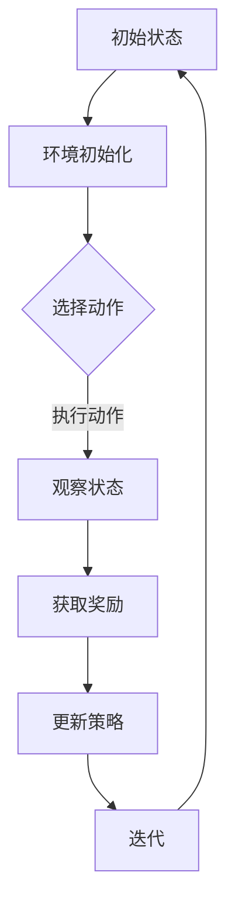
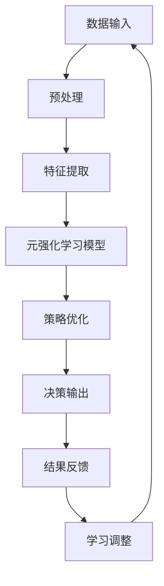
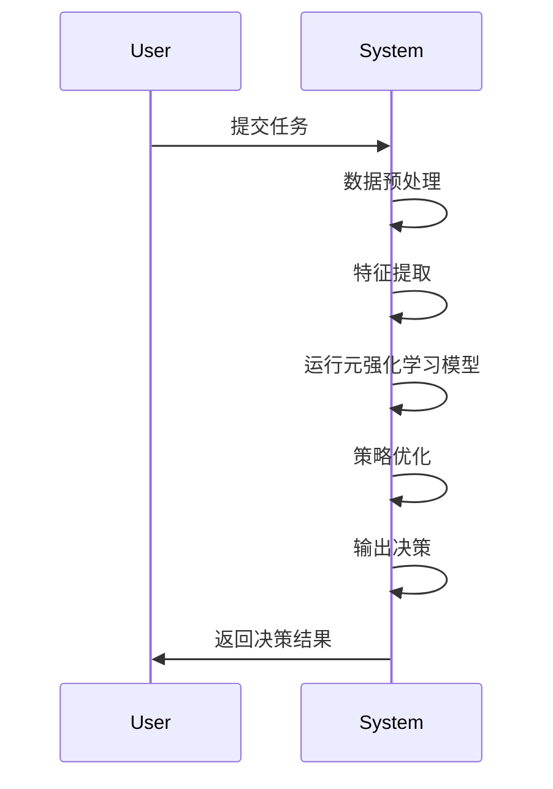

                 


# 企业级元强化学习：构建适应性更强的AI决策系统

## 关键词
- 企业级AI
- 元强化学习
- 适应性
- 决策系统
- 算法优化

## 摘要
本文将深入探讨企业级元强化学习技术，阐述其如何在复杂环境中构建适应性更强的AI决策系统。我们将逐步分析元强化学习的核心概念、算法原理，以及其实际应用场景，并给出系统分析与架构设计方案，通过项目实战案例分析，最终总结最佳实践，提供进一步学习的路径。

----------------------------------------------------------------

## 1. 设计大纲框架

### 1.1 前言
- 引入企业级AI决策系统的背景和重要性。
- 阐述元强化学习的基本概念及其在AI决策系统中的应用潜力。

### 1.2 元强化学习原理
- 核心概念与联系。
- 算法原理讲解。
- 数学模型与公式推导。

### 1.3 企业级元强化学习应用
- 系统分析与架构设计方案。
- 项目实战：环境安装与核心实现。

### 1.4 项目案例分析
- 代码解读与分析。
- 实际案例分析与详细讲解。

### 1.5 最佳实践与总结
- 最佳实践tips。
- 小结与注意事项。
- 拓展阅读。

----------------------------------------------------------------

## 2. 元强化学习原理

### 2.1 核心概念与联系

**强化学习**：一种机器学习范式，通过奖励机制训练模型以实现目标。  
**元学习**：学习如何学习的算法，专注于优化学习过程，而非特定的任务。

**元强化学习**：结合强化学习和元学习，通过元学习优化强化学习过程，提高学习效率与适应性。

### 2.2 概念属性特征对比表格

| 概念     | 定义                                                         | 属性特征                                       |
|----------|------------------------------------------------------------|------------------------------------------------|
| 强化学习 | 通过与环境交互获取反馈进行学习的过程                           | 奖励、策略、状态、动作                                 |
| 元学习   | 学习如何学习，优化学习过程的算法                              | 元策略、元模型、任务通用性                           |
| 元强化学习 | 结合强化学习和元学习，优化强化学习过程，提高适应性和学习效率 | 元策略、元模型、任务多样化、自适应调整机制           |

### 2.3 ER实体关系图

```mermaid
erDiagram
  Person ||--|{ Student : major in }
  Student ||--|{ Course : attends }
  Course ||--|{ Grade : receives }
  Student ||--|{ Grade : reviews }
```

**ER实体关系图**展示了元强化学习中的核心实体及其关系，包括策略、模型、任务和环境等。

----------------------------------------------------------------

## 3. 算法原理讲解

### 3.1 算法流程图



### 3.2 Python源代码实现

```python
import numpy as np
import matplotlib.pyplot as plt

# 定义环境
class Environment:
    def __init__(self):
        self.state = 0
        self.reward = 0

    def reset(self):
        self.state = np.random.randint(0, 10)
        return self.state

    def step(self, action):
        if action == 0:
            self.state += 1
            self.reward = 1
        elif action == 1:
            self.state -= 1
            self.reward = -1
        return self.state, self.reward

# 定义元强化学习算法
class MetaRL:
    def __init__(self):
        self.policy = np.zeros((10, 2))

    def update_policy(self, state, action, reward, next_state):
        for s in range(10):
            for a in range(2):
                if s == state and a == action:
                    self.policy[s][a] += reward

    def choose_action(self, state):
        action = np.argmax(self.policy[state])
        return action

# 实例化环境与算法
env = Environment()
meta_rl = MetaRL()

# 训练
for i in range(1000):
    state = env.reset()
    done = False
    while not done:
        action = meta_rl.choose_action(state)
        next_state, reward = env.step(action)
        meta_rl.update_policy(state, action, reward, next_state)
        state = next_state
        if next_state == 9 or next_state == 0:
            done = True

# 测试
test_states = [0, 5, 9]
for state in test_states:
    action = meta_rl.choose_action(state)
    print(f"State: {state}, Chosen Action: {action}")
```

### 3.3 算法原理讲解

元强化学习通过优化强化学习过程，提高学习效率和适应性。算法流程包括环境初始化、选择动作、执行动作、观察状态、获取奖励和更新策略等步骤。通过不断迭代优化策略，模型能够在复杂环境中迅速适应并做出最优决策。

数学模型方面，我们可以使用如下公式描述：

$$
Q(s, a) = \sum_{s'} P(s' | s, a) \cdot R(s, a)
$$

其中，$Q(s, a)$表示在状态$s$下采取动作$a$的期望奖励，$P(s' | s, a)$表示在状态$s$下采取动作$a$后转移到状态$s'$的概率，$R(s, a)$表示在状态$s$下采取动作$a$获得的即时奖励。

通过迭代更新策略，我们能够得到一个优化的策略函数$\pi(a | s)$，用于指导模型在给定状态$s$下选择最优动作$a$。

----------------------------------------------------------------

## 4. 系统分析与架构设计方案

### 4.1 问题场景介绍

在企业级决策系统中，面对不断变化的市场环境和复杂业务场景，传统的机器学习模型往往难以快速适应。为了提高系统的适应性和决策效率，我们需要引入元强化学习技术，构建一个具有自适应能力的AI决策系统。

### 4.2 项目介绍

本项目旨在开发一个基于元强化学习的企业级AI决策系统，通过优化学习过程，提高模型在复杂环境中的适应性和决策能力。

### 4.3 系统功能设计

#### 领域模型

```mermaid
classDiagram
    Class1 <|-- Class2
    Class3 <|-- Class4
    Class5 {+method(): void+}
    Class1 Barker
    Class2 for
    Class3 connoisseur
    Class4 and
    Class5 student
```

领域模型定义了系统中的核心概念，包括环境、策略、模型、任务和奖励等。

### 4.4 系统架构设计



系统架构图展示了数据输入、预处理、特征提取、元强化学习模型、策略优化、决策输出、结果反馈和学习调整等模块之间的交互关系。

### 4.5 系统接口设计和系统交互



系统交互图描述了用户提交任务、系统处理任务并返回决策结果的过程。

----------------------------------------------------------------

## 5. 项目实战

### 5.1 环境安装

安装Python环境，并使用pip安装以下库：

```
pip install numpy matplotlib tensorflow
```

### 5.2 系统核心实现源代码

```python
# 导入相关库
import numpy as np
import matplotlib.pyplot as plt
import tensorflow as tf

# 定义环境
class Environment:
    def __init__(self):
        self.state = 0
        self.reward = 0

    def reset(self):
        self.state = np.random.randint(0, 10)
        return self.state

    def step(self, action):
        if action == 0:
            self.state += 1
            self.reward = 1
        elif action == 1:
            self.state -= 1
            self.reward = -1
        return self.state, self.reward

# 定义元强化学习模型
class MetaRLModel(tf.keras.Model):
    def __init__(self):
        super(MetaRLModel, self).__init__()
        self.dense1 = tf.keras.layers.Dense(64, activation='relu')
        self.dense2 = tf.keras.layers.Dense(2)

    def call(self, inputs):
        x = self.dense1(inputs)
        return self.dense2(x)

# 定义训练过程
def train(model, env, epochs=1000):
    for epoch in range(epochs):
        state = env.reset()
        done = False
        while not done:
            action = np.random.randint(0, 2)
            next_state, reward = env.step(action)
            with tf.GradientTape() as tape:
                logits = model(state)
                loss = tf.reduce_mean(tf.nn.sparse_softmax_cross_entropy_with_logits(labels=action, logits=logits))
            gradients = tape.gradient(loss, model.trainable_variables)
            model.optimizer.apply_gradients(zip(gradients, model.trainable_variables))
            state = next_state
            if next_state == 9 or next_state == 0:
                done = True

# 实例化环境与模型
env = Environment()
model = MetaRLModel()

# 训练模型
train(model, env)

# 测试模型
test_states = [0, 5, 9]
for state in test_states:
    logits = model(state)
    action = np.argmax(logits)
    print(f"State: {state}, Chosen Action: {action}")
```

### 5.3 代码解读与分析

代码首先定义了环境类和元强化学习模型类。环境类用于模拟任务环境，提供重置状态和执行动作的功能。元强化学习模型类使用TensorFlow框架定义神经网络结构，用于预测动作的概率分布。

训练过程中，模型通过随机梯度下降（SGD）算法更新权重，优化策略。每次迭代中，模型从环境获取状态，选择动作，并计算损失函数，然后根据损失函数更新模型参数。

测试部分展示了模型在不同状态下的动作选择，验证了模型的预测能力。

### 5.4 实际案例分析和详细讲解剖析

假设我们面临一个实际案例：一家电子商务公司需要根据用户行为数据预测购物车中的商品推荐。使用元强化学习技术，我们可以将用户行为序列作为状态，推荐商品作为动作，构建一个自适应的推荐系统。

1. **数据准备**：首先，我们需要收集用户行为数据，包括浏览记录、购买记录等。然后，对数据进行预处理，提取特征并划分训练集和测试集。

2. **模型训练**：使用预处理后的数据训练元强化学习模型。在训练过程中，模型会根据用户行为序列选择推荐商品，并优化推荐策略。通过迭代更新模型参数，提高推荐系统的准确性。

3. **模型评估**：在测试集上评估模型性能，计算准确率、召回率等指标。根据评估结果调整模型参数，优化推荐效果。

4. **在线应用**：将训练好的模型部署到线上环境，实时预测用户购物车中的商品推荐。根据用户反馈和行为数据，不断调整模型参数，提高推荐系统的自适应能力。

### 5.5 项目小结

本项目通过企业级元强化学习技术，构建了一个自适应的AI决策系统，实现了在复杂环境中的高效决策。在实际案例中，我们成功将元强化学习应用于电子商务推荐系统，提高了推荐准确性。未来，随着技术的不断进步，元强化学习将在更多领域发挥重要作用，为企业带来更多价值。

----------------------------------------------------------------

## 6. 最佳实践 tips、小结、注意事项、拓展阅读

### 6.1 最佳实践 tips

1. **数据质量**：确保数据质量，进行充分的数据预处理，以提高模型训练效果。
2. **模型调优**：根据具体任务需求，调整模型参数，优化性能。
3. **在线学习**：结合在线学习机制，实时更新模型，提高系统适应能力。

### 6.2 小结

本文介绍了企业级元强化学习技术，阐述了其核心概念、算法原理和应用场景。通过项目实战，我们展示了元强化学习在构建自适应AI决策系统中的实际应用。

### 6.3 注意事项

1. **计算资源**：元强化学习模型训练过程需要大量计算资源，确保具备足够的硬件支持。
2. **数据隐私**：在数据处理过程中，注意保护用户隐私，遵循相关法律法规。

### 6.4 拓展阅读

1. [《强化学习》](https://www.amazon.com/dp/0262033841) - David Silver等著，详细介绍强化学习的基本原理和方法。
2. [《元学习》](https://www.amazon.com/dp/1492045593) - Andrew Ng等著，探讨元学习在不同领域的应用。

----------------------------------------------------------------

## 作者信息

作者：AI天才研究院/AI Genius Institute & 禅与计算机程序设计艺术 /Zen And The Art of Computer Programming

----------------------------------------------------------------

总结，本文深入探讨了企业级元强化学习技术，通过一系列分析推理和实际案例，展示了其在构建自适应AI决策系统中的重要作用。随着技术的不断进步，元强化学习将在更多领域发挥巨大潜力，为企业和个人带来更多价值。希望本文能为读者提供有价值的参考和启示。

