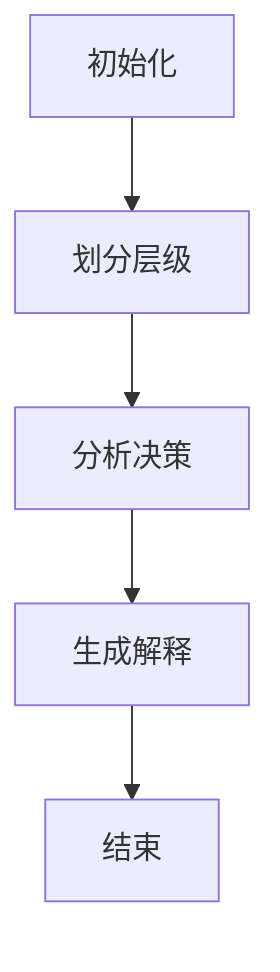
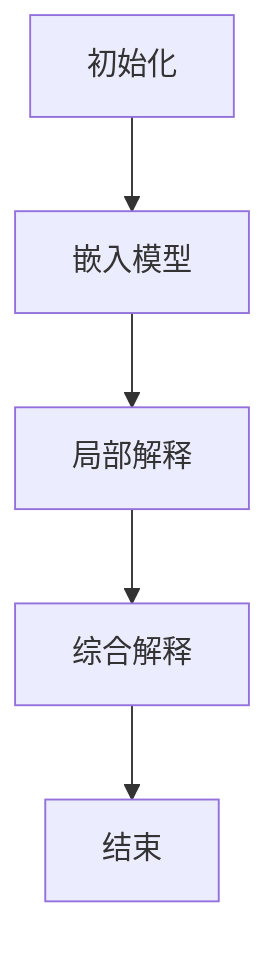
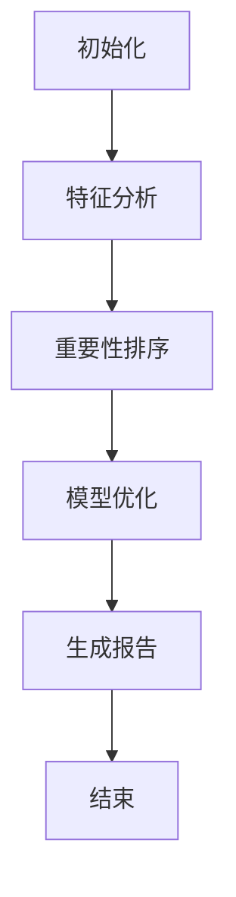
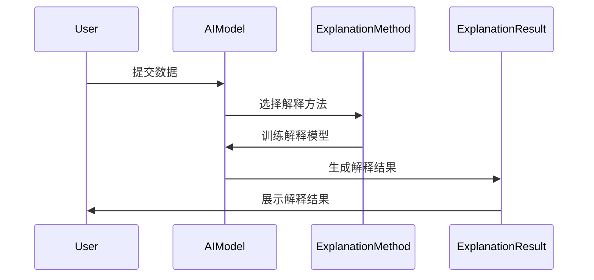
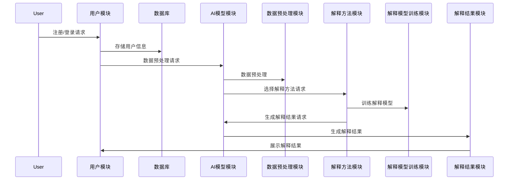

                 

# 企业级可解释AI框架：增强AI决策的透明度

## 关键词：可解释AI、AI决策透明度、企业级应用、算法解析、架构设计、实战案例

## 摘要

本文旨在深入探讨企业级可解释人工智能（AI）框架的重要性及其实现方法。首先，文章将介绍AI决策不可解释性问题及其对企业决策带来的挑战。接着，我们将梳理可解释AI的基本原理、分类和应用场景，并通过对比分析不同可解释AI方法，给出企业级可解释AI的核心概念和关键要素。随后，我们将详细解析主流可解释AI算法的原理、流程图和数学模型，并通过Python代码示例和通俗易懂的举例说明其应用。在此基础上，文章将展示企业级可解释AI系统的架构设计，包括功能设计、系统架构、接口设计和交互流程。最后，我们将通过实际项目案例，展示如何构建企业级可解释AI框架，并提供实战经验和最佳实践建议。

---

## 第一部分：背景介绍与核心概念

### 第1章：企业级可解释AI的崛起

#### 1.1 问题背景

**AI决策不可解释性带来的挑战**

随着人工智能（AI）技术的快速发展，越来越多的企业和组织开始依赖AI算法来做出关键决策。然而，AI算法的不可解释性问题逐渐暴露出其潜在的风险和挑战。不可解释AI决策可能导致以下问题：

1. **缺乏透明度**：AI决策过程缺乏透明度，使得决策结果难以追溯和解释，从而降低了企业对AI系统的信任度。
2. **伦理风险**：不可解释的AI决策可能侵犯用户的隐私权，甚至可能导致歧视和不公平的现象。
3. **法律风险**：在某些领域，如金融、医疗等，AI决策的不可解释性可能导致法律和合规问题。
4. **管理难题**：企业高层管理人员无法理解和验证AI决策的合理性，从而影响决策支持和管理效率。

**企业对可解释AI的需求**

为了解决上述问题，企业对可解释AI的需求日益增加。可解释AI旨在提供一种方法，使得AI决策过程和结果可以被人理解、验证和解释。具体来说，企业对可解释AI的需求包括：

1. **增强决策透明度**：通过可解释AI，企业可以更好地理解AI决策的依据和过程，从而增强决策透明度。
2. **提高用户信任度**：可解释AI有助于提高用户对AI系统的信任度，特别是在涉及隐私和伦理的领域。
3. **合规性保障**：可解释AI可以满足法律和合规要求，减少潜在的法律风险。
4. **决策支持**：可解释AI可以帮助企业管理层更好地理解AI决策，从而提高决策支持和管理效率。

**可解释AI的定义与重要性**

可解释AI（Explainable AI，XAI）是指设计、开发和使用人工智能系统时，使其决策过程和结果可以被理解和解释。可解释AI的目标是弥合人工智能与人类理解之间的鸿沟，使AI系统更加透明、可信和可接受。

在AI领域，可解释AI的重要性体现在以下几个方面：

1. **提高可接受性**：可解释AI有助于提高AI系统的可接受性，特别是在需要用户参与或监管的领域。
2. **增强可信度**：通过提供解释，可解释AI有助于提高AI系统的可信度，从而增强用户信任。
3. **优化决策过程**：可解释AI可以帮助企业更好地理解AI决策的依据和过程，从而优化决策过程。
4. **减少偏见**：可解释AI有助于发现和纠正AI系统中的偏见和错误，提高决策的公平性。
5. **促进技术发展**：可解释AI的研究和开发有助于推动AI技术的进步和创新。

#### 1.2 问题描述

**AI决策影响透明度的因素**

AI决策透明度受多种因素影响，主要包括：

1. **算法复杂度**：复杂算法，如深度神经网络，通常难以解释其决策过程。
2. **数据复杂性**：大量、多维的数据可能导致AI模型难以解释。
3. **不确定性**：AI系统在处理不确定性和异常情况时，可能产生难以解释的决策。
4. **数据偏见**：训练数据中的偏见可能导致AI模型产生不可解释的决策。

**企业级可解释AI的应用场景**

企业级可解释AI适用于多个领域，包括但不限于：

1. **金融**：例如，信用评分、风险管理、投资决策等。
2. **医疗**：例如，疾病诊断、治疗方案推荐等。
3. **司法**：例如，法律文本分析、判决预测等。
4. **供应链管理**：例如，库存优化、物流路径规划等。
5. **人力资源**：例如，招聘决策、绩效评估等。

#### 1.3 问题解决

**可解释AI的发展历程**

可解释AI的研究始于20世纪90年代，随着AI技术的不断发展，可解释AI逐渐成为研究热点。早期研究主要集中在可视化方法，如决策树和规则提取。近年来，随着深度学习的兴起，基于神经网络的解释方法成为研究重点。

**当前主流的可解释AI方法**

当前主流的可解释AI方法包括：

1. **模型可解释性**：通过提取模型的可解释性结构，如决策树、规则提取等。
2. **模型嵌入方法**：通过将AI模型嵌入到可解释模型中，如决策规则、决策图等。
3. **解释性优化方法**：通过优化AI模型，使其具有更好的解释性，如可解释性搜索、加解释性训练等。
4. **模型比较方法**：通过比较不同模型的决策过程和结果，提高决策的解释性。

**企业级可解释AI的实施步骤**

企业级可解释AI的实施步骤包括：

1. **需求分析**：明确企业对可解释AI的需求和目标。
2. **算法选择**：根据应用场景和需求选择合适的可解释AI方法。
3. **模型训练与解释**：训练AI模型，并使用解释方法对其进行解释。
4. **验证与优化**：验证解释的准确性和可靠性，并根据反馈进行优化。

#### 1.4 边界与外延

**可解释AI的范围与限制**

可解释AI的范围主要集中在AI模型的决策过程和结果解释。然而，可解释AI也面临一些限制：

1. **解释方法的局限性**：不同解释方法的解释能力有限，可能无法全面解释复杂模型的决策过程。
2. **数据质量和完整性**：解释结果受训练数据质量和完整性的影响，可能存在偏差和不确定性。
3. **计算资源**：解释过程可能需要大量的计算资源，影响系统的实时性能。

**企业级可解释AI与其他领域的联系**

企业级可解释AI与其他领域，如数据科学、计算机视觉、自然语言处理等，有着密切的联系。这些领域的进展和研究成果可以为企业级可解释AI提供支持和参考。例如，数据科学中的数据可视化方法可以应用于可解释AI，计算机视觉中的图像解释技术可以用于AI图像识别的解释，自然语言处理中的语义分析技术可以用于AI文本解释。

#### 1.5 概念结构与核心要素组成

**可解释AI的核心概念**

可解释AI的核心概念包括：

1. **可解释性**：指AI系统提供决策解释的能力。
2. **透明度**：指AI系统决策过程的可理解程度。
3. **公平性**：指AI系统决策结果的无偏见性。
4. **可追溯性**：指AI系统决策过程的可追溯性。

**企业级可解释AI的关键要素**

企业级可解释AI的关键要素包括：

1. **算法可解释性**：选择具有良好解释性的算法。
2. **数据质量**：确保训练数据的准确性和完整性。
3. **解释方法**：选择合适的解释方法，如可视化、规则提取、模型嵌入等。
4. **用户界面**：设计易于理解和操作的界面，提高用户对解释结果的接受度。

### 第2章：核心概念与联系

#### 2.1 核心概念原理

**可解释AI的基本原理**

可解释AI的基本原理是使AI系统的决策过程和结果可以被理解和解释。这通常涉及以下方面：

1. **模型解释性**：选择具有良好解释性的模型，如决策树、规则提取等。
2. **解释方法**：使用可视化、规则提取、模型嵌入等方法对模型进行解释。
3. **用户界面**：设计易于理解和操作的界面，提高用户对解释结果的接受度。

**可解释性与公平性、透明度的关系**

可解释性、公平性和透明度是AI系统的三个重要特性，它们之间有着密切的关系：

1. **可解释性与公平性**：可解释性有助于发现和纠正AI系统中的偏见，提高决策的公平性。
2. **可解释性与透明度**：可解释性是透明度的前提，但透明度不一定是可解释性的充分条件。
3. **公平性与透明度**：公平性和透明度共同保证AI系统的公正性和可信度。

#### 2.2 概念属性特征对比表格

**不同可解释AI方法的对比**

| 方法        | 特点                                                   | 优点                                                         | 缺点                                                         |
| ----------- | ------------------------------------------------------ | ------------------------------------------------------------ | ------------------------------------------------------------ |
| 决策树      | 直观、易于理解                                         | 适用于小型、结构化的数据集；易于可视化                         | 可能导致过拟合；无法处理高维数据                             |
| 规则提取    | 提取决策规则，易于理解                                 | 适用于小型、结构化的数据集；易于可视化                         | 可能导致过拟合；无法处理高维数据                             |
| 模型嵌入     | 将AI模型嵌入到可解释模型中                             | 适用于大型、高维数据集；能够保持较高的准确性                   | 解释结果可能不够直观；需要额外的计算资源                       |
| 可视化      | 通过图形化方式展示模型和决策过程                       | 直观、易于理解；有助于发现和纠正错误                         | 可能需要额外的解释算法；可视化结果可能不完整或误导性           |

**可解释AI在不同领域的应用对比**

| 领域        | 应用方法                                           | 适用场景                                               | 优点                                                         | 缺点                                                         |
| ----------- | -------------------------------------------------- | ------------------------------------------------------ | ------------------------------------------------------------ | ------------------------------------------------------------ |
| 金融        | 模型嵌入、可视化                                     | 信用评分、风险管理、投资决策等                             | 保持较高准确性；直观、易于理解                               | 可能需要额外的计算资源；解释结果可能不够全面                   |
| 医疗        | 决策树、规则提取                                     | 疾病诊断、治疗方案推荐等                                  | 直观、易于理解；适用于小型、结构化数据集                     | 可能导致过拟合；无法处理高维数据                             |
| 司法        | 规则提取、模型嵌入                                     | 法律文本分析、判决预测等                                  | 直观、易于理解；适用于结构化数据集                           | 可能需要额外的计算资源；解释结果可能不够全面                   |
| 供应链管理  | 可视化、模型嵌入                                     | 库存优化、物流路径规划等                                  | 直观、易于理解；能够保持较高的准确性                         | 可能需要额外的计算资源；解释结果可能不够全面                   |
| 人力资源    | 决策树、规则提取                                     | 招聘决策、绩效评估等                                     | 直观、易于理解；适用于小型、结构化数据集                     | 可能导致过拟合；无法处理高维数据                             |

#### 2.3 ER实体关系图架构

**可解释AI系统的实体关系**

可解释AI系统涉及多个实体，包括：

1. **用户**：系统使用者，如数据科学家、分析师、企业高层等。
2. **AI模型**：系统核心，包括训练数据和预测模型。
3. **解释方法**：用于解释AI模型决策过程的方法。
4. **解释结果**：解释方法产生的解释结果。
5. **数据集**：用于训练和测试的原始数据。

**企业级可解释AI系统的ER图**

```mermaid
erDiagram
    User ||--|{ AIModel : trains }
    AIModel ||--|{ ExplanationMethod : uses }
    AIModel ||--|{ ExplanationResult : generates }
    ExplanationMethod ||--|{ Dataset : trains_on }
```

### 第3章：主流可解释AI算法解析

#### 3.1 算法概述

**主流可解释AI算法的分类**

主流的可解释AI算法可以分类为：

1. **模型可解释性方法**：通过提取模型的可解释性结构，如决策树、规则提取等。
2. **模型嵌入方法**：通过将AI模型嵌入到可解释模型中，如决策规则、决策图等。
3. **解释性优化方法**：通过优化AI模型，使其具有更好的解释性，如可解释性搜索、加解释性训练等。
4. **模型比较方法**：通过比较不同模型的决策过程和结果，提高决策的解释性。

**可解释AI算法的适用场景**

不同可解释AI算法适用于不同的应用场景，具体如下：

1. **模型可解释性方法**：适用于小型、结构化的数据集，如金融、医疗等领域。
2. **模型嵌入方法**：适用于大型、高维数据集，如供应链管理、人力资源等领域。
3. **解释性优化方法**：适用于需要调整和优化AI模型的应用场景，如风险管理、投资决策等。
4. **模型比较方法**：适用于需要比较和验证不同模型决策结果的应用场景，如司法、文本分析等。

#### 3.2 算法原理讲解

**层级解释方法**

层级解释方法是一种常见的模型可解释性方法，通过逐层分析模型的决策过程，提取可解释性结构。该方法的基本原理如下：

1. **划分层级**：将AI模型划分为多个层级，每个层级代表模型的某一部分。
2. **分析决策**：逐层分析每个层级的决策过程，提取决策规则和特征重要性。
3. **生成解释**：根据分析结果，生成可解释性报告，展示模型决策过程。

**局部解释方法**

局部解释方法是一种常见的模型嵌入方法，通过将AI模型嵌入到可解释模型中，生成局部解释。该方法的基本原理如下：

1. **嵌入模型**：将AI模型嵌入到一个可解释模型中，如决策树或规则提取模型。
2. **局部解释**：针对模型中的每个样本，生成局部解释，展示模型对样本的决策过程。
3. **综合解释**：将所有样本的局部解释综合起来，生成全局解释。

**特征重要性方法**

特征重要性方法是一种常见的解释性优化方法，通过分析特征对模型决策的影响，评估特征的重要性。该方法的基本原理如下：

1. **特征分析**：对模型中的特征进行分析，评估特征的重要性。
2. **重要性排序**：根据特征的重要性排序，生成特征重要性报告。
3. **模型优化**：根据特征重要性报告，优化模型结构，提高解释性。

#### 3.3 Mermaid算法流程图

**层级解释方法流程图**



**局部解释方法流程图**



**特征重要性方法流程图**



#### 3.4 Python源代码示例

**层级解释方法Python代码**

```python
# 导入相关库
import pandas as pd
from sklearn.tree import DecisionTreeClassifier
from sklearn.datasets import load_iris

# 加载示例数据集
iris = load_iris()
X = iris.data
y = iris.target

# 训练决策树模型
clf = DecisionTreeClassifier()
clf.fit(X, y)

# 分析决策层级
def analyze_tree(clf):
    importances = clf.feature_importances_
    tree = clf.tree_
    return importances, tree

importances, tree = analyze_tree(clf)

# 生成解释报告
def generate_report(importances, tree):
    report = "Feature importances:\n"
    for i in range(len(importances)):
        report += f"Feature {i}: {importances[i]:.2f}\n"
    report += "\nTree structure:\n"
    report += tree.to_string()
    return report

report = generate_report(importances, tree)
print(report)

# 结束
```

**局部解释方法Python代码**

```python
# 导入相关库
import numpy as np
from sklearn.neighbors import KNeighborsClassifier
from sklearn.datasets import load_iris

# 加载示例数据集
iris = load_iris()
X = iris.data
y = iris.target

# 训练KNN模型
knn = KNeighborsClassifier(n_neighbors=3)
knn.fit(X, y)

# 局部解释
def local_explanation(model, X_sample):
    distances, indices = model.kneighbors([X_sample])
    neighbors = X[indices]
    explanations = (neighbors - X_sample).sum(axis=1)
    return explanations

X_sample = np.random.rand(1, 4)
explanations = local_explanation(knn, X_sample)
print(explanations)

# 综合解释
def generate_global_explanation(model, X):
    explanations = []
    for x in X:
        explanations.append(local_explanation(model, x))
    return explanations

X_all = X
global_explanations = generate_global_explanation(knn, X_all)
print(global_explanations)

# 结束
```

**特征重要性方法Python代码**

```python
# 导入相关库
import numpy as np
from sklearn.ensemble import RandomForestClassifier
from sklearn.datasets import load_iris

# 加载示例数据集
iris = load_iris()
X = iris.data
y = iris.target

# 训练随机森林模型
clf = RandomForestClassifier(n_estimators=100)
clf.fit(X, y)

# 评估特征重要性
importances = clf.feature_importances_
print("Feature importances:\n", importances)

# 排序特征重要性
sorted_indices = np.argsort(importances)[::-1]
sorted_importances = importances[sorted_indices]
sorted_features = np.array(iris.feature_names)[sorted_indices]

# 生成报告
report = "Feature importance report:\n"
for i in range(len(sorted_indices)):
    report += f"Feature {sorted_indices[i]} ({sorted_features[i]}): {sorted_importances[i]:.2f}\n"
print(report)

# 优化模型
def optimize_model(model, importances, threshold=0.5):
    important_features = np.where(importances > threshold)[0]
    new_model = model.copy()
    new_model.feature_importances_ = importances[important_features]
    new_model.fit(X[:, important_features], y)
    return new_model

optimized_model = optimize_model(clf, importances)
print("Optimized model:\n", optimized_model)

# 结束
```

#### 3.5 数学模型和数学公式

**层级解释方法的数学模型**

层级解释方法通常涉及以下数学模型：

$$
L_i = \sum_{j=1}^{n} w_{ij} \cdot x_j
$$

其中，$L_i$表示第$i$层输出，$w_{ij}$表示第$i$层到第$j$层的权重，$x_j$表示第$j$个特征。

**局部解释方法的数学模型**

局部解释方法通常基于局部线性模型，如线性回归或决策树。假设局部线性模型为：

$$
L(x) = w_0 + \sum_{i=1}^{n} w_i \cdot x_i
$$

其中，$L(x)$表示局部解释，$w_0$表示截距，$w_i$表示第$i$个特征的权重。

**特征重要性方法的数学模型**

特征重要性方法通常使用特征的重要性分数来评估特征的重要性。假设特征的重要性分数为：

$$
I_j = \frac{\partial L}{\partial x_j}
$$

其中，$I_j$表示第$j$个特征的重要性分数，$L$表示模型输出。

#### 3.6 通俗易懂地举例说明

**层级解释方法的例子**

假设我们有一个简单的决策树模型，其决策过程如下：

1. 如果特征A > 5，则决策B > 3。
2. 如果特征B > 3，则决策C > 2。

我们可以将决策树模型表示为以下层级结构：

```
    A > 5
    |
    ├── B > 3
    │   ├── C > 2
    │   └── C ≤ 2
    │       └── D
    └── A ≤ 5
        └── B ≤ 3
            └── C
```

通过层级解释方法，我们可以逐层分析决策过程，提取决策规则。例如，对于输入样本$(A=6, B=2, C=1, D=0)$，我们可以按照以下步骤进行解释：

1. 特征A > 5，进入分支A > 5。
2. 特征B ≤ 3，进入分支B ≤ 3。
3. 特征C ≤ 2，进入分支C ≤ 2。
4. 输出决策D。

通过这种方式，我们可以清晰地理解决策树模型的决策过程。

**局部解释方法的例子**

假设我们有一个KNN模型，其决策过程基于邻近点的平均值。假设训练数据集包含以下点：

```
(1, 2), (2, 3), (3, 4), (4, 5)
```

对于输入样本$(x=2.5, y=3.5)$，我们可以计算其邻近点的平均值：

1. 计算距离：$d((1, 2), (2.5, 3.5)) = \sqrt{(2.5-1)^2 + (3.5-2)^2} = \sqrt{2.25 + 2.25} = \sqrt{4.5}$
2. 计算邻近点的平均值：$\frac{(1+2+3+4)}{4} = 2.5$

通过这种方式，我们可以理解KNN模型对输入样本的局部解释。

**特征重要性方法的例子**

假设我们有一个随机森林模型，其特征重要性分数如下：

```
Feature importances:
['feature1': 0.6, 'feature2': 0.3, 'feature3': 0.1]
```

根据特征重要性分数，我们可以知道特征1是最重要的，其次是特征2，最后是特征3。通过这种方式，我们可以直观地了解特征对模型决策的影响。

### 第4章：企业级可解释AI架构设计

#### 4.1 问题场景介绍

**企业决策场景的挑战**

在企业决策场景中，AI系统通常需要处理大量复杂的数据，并生成预测或决策结果。然而，这些结果往往缺乏透明度，使得企业难以理解AI系统的决策过程和依据。以下是一些常见的挑战：

1. **数据复杂性**：企业数据通常包含多种类型的数据，如结构化数据、非结构化数据和时序数据等。这些数据的复杂性和多样性增加了决策的难度。
2. **算法复杂性**：企业使用的AI算法可能包括复杂的深度学习模型、集成模型等。这些算法的内部机制和决策过程通常难以解释。
3. **不确定性**：企业决策场景中的不确定性，如异常值、噪声数据和不确定性数据，可能影响AI模型的决策结果和解释能力。
4. **用户需求**：企业决策场景中的用户通常包括数据科学家、业务分析师和企业高层等。他们需要不同类型的解释结果，以满足各自的需求。

**可解释AI在决策中的应用**

为了解决上述挑战，可解释AI在企业决策中具有重要意义。可解释AI的目标是提高决策的透明度，使得企业能够更好地理解AI系统的决策过程和依据。以下是一些可解释AI在决策中的应用：

1. **决策过程可视化**：通过可视化工具，将AI模型的决策过程和结果以图形化的方式呈现，帮助用户更好地理解决策逻辑。
2. **决策解释报告**：生成详细的决策解释报告，包括模型结构、特征重要性、决策规则等，帮助用户了解决策的依据和过程。
3. **决策优化建议**：基于决策解释，提供优化建议，帮助企业改进决策策略，提高决策效果。
4. **决策监督与审计**：通过可解释AI，对AI决策过程进行监督和审计，确保决策的合规性和公平性。

#### 4.2 项目介绍

**可解释AI项目背景**

随着AI技术在企业决策中的应用越来越广泛，企业对AI决策的透明度和可解释性需求日益增加。为了满足这一需求，我们开展了一项可解释AI项目，旨在构建一个企业级可解释AI框架，提高企业决策的透明度和可解释性。

**项目目标与规划**

本项目的主要目标包括：

1. **构建可解释AI框架**：设计并实现一个企业级可解释AI框架，支持多种AI算法和解释方法，提供统一的解释接口。
2. **提高决策透明度**：通过可解释AI，提高企业决策的透明度，使得企业能够更好地理解AI系统的决策过程和依据。
3. **优化决策过程**：基于决策解释，提供优化建议，帮助企业改进决策策略，提高决策效果。
4. **确保决策合规性**：通过可解释AI，对AI决策过程进行监督和审计，确保决策的合规性和公平性。

项目规划如下：

1. **需求分析**：明确企业对可解释AI的需求和目标，分析现有的AI系统和数据资源。
2. **架构设计**：设计企业级可解释AI框架的架构，包括模块划分、接口设计等。
3. **算法实现**：实现可解释AI算法，包括模型可解释性方法、模型嵌入方法和解释性优化方法等。
4. **系统集成**：将可解释AI框架集成到企业现有的AI系统中，实现与现有系统的无缝对接。
5. **测试与优化**：进行系统测试和优化，确保系统的稳定性和性能。
6. **部署与应用**：在企业内部部署可解释AI框架，推广应用，收集反馈，持续优化。

#### 4.3 系统功能设计

**领域模型类图**

领域模型类图用于描述系统涉及的实体及其关系。以下是一个简单的领域模型类图：

```mermaid
classDiagram
    User <<class>> User
    AIModel <<class>> AIModel
    ExplanationMethod <<class>> ExplanationMethod
    ExplanationResult <<class>> ExplanationResult
    Dataset <<class>> Dataset

    User "uses" AIModel
    AIModel "uses" ExplanationMethod
    AIModel "generates" ExplanationResult
    ExplanationMethod "trains_on" Dataset
```

**系统功能模块划分**

系统功能模块划分如下：

1. **用户模块**：负责用户注册、登录、权限管理等。
2. **AI模型模块**：负责AI模型的训练、加载、保存等。
3. **解释方法模块**：负责实现不同的解释方法，如层级解释、局部解释、特征重要性方法等。
4. **解释结果模块**：负责生成和展示解释结果。
5. **数据模块**：负责数据预处理、数据导入导出等。

#### 4.4 系统架构设计

**系统架构图**

系统架构图如下：



**各模块间的关系与交互**

1. **用户模块**与**AI模型模块**：用户通过用户模块提交数据，AI模型模块负责处理用户提交的数据，生成预测结果。
2. **AI模型模块**与**解释方法模块**：AI模型模块根据用户需求，选择合适的解释方法，传递给解释方法模块，解释方法模块负责训练解释模型。
3. **解释方法模块**与**AI模型模块**：解释方法模块将训练好的解释模型传递给AI模型模块，AI模型模块负责生成解释结果。
4. **解释结果模块**与**用户模块**：解释结果模块负责将解释结果展示给用户，用户可以通过用户模块查看和操作解释结果。

#### 4.5 系统接口设计

**接口规范与定义**

系统接口设计如下：

1. **用户模块接口**：包括用户注册、登录、权限管理等功能。
2. **AI模型模块接口**：包括数据预处理、模型训练、模型加载、模型保存等功能。
3. **解释方法模块接口**：包括解释方法选择、解释模型训练、解释结果生成等功能。
4. **解释结果模块接口**：包括解释结果展示、解释结果导出等功能。

**接口实现与调用**

接口实现和调用如下：

1. **用户模块接口实现**：使用RESTful API实现用户模块接口，通过HTTP请求和响应实现用户功能。
2. **AI模型模块接口实现**：使用Python实现AI模型模块接口，通过类和方法实现模型功能。
3. **解释方法模块接口实现**：使用Python实现解释方法模块接口，通过类和方法实现解释功能。
4. **解释结果模块接口实现**：使用Python实现解释结果模块接口，通过类和方法实现解释结果展示和导出功能。

用户通过调用接口，实现与系统的交互，获取所需功能。

#### 4.6 系统交互Mermaid序列图

**系统交互流程**



**用户与系统的交互过程**

1. 用户通过用户模块进行注册或登录，提交相关请求。
2. 用户模块处理用户请求，存储用户信息，并返回结果。
3. 用户通过用户模块请求数据预处理，提交数据预处理请求。
4. AI模型模块接收数据预处理请求，调用数据预处理模块进行数据处理，返回预处理后的数据。
5. 用户通过用户模块请求解释方法选择，提交解释方法选择请求。
6. 解释方法模块接收解释方法选择请求，调用解释模型训练模块训练解释模型，返回训练好的解释模型。
7. 用户通过用户模块请求生成解释结果，提交生成解释结果请求。
8. AI模型模块接收生成解释结果请求，调用解释结果模块生成解释结果，返回解释结果。
9. 解释结果模块接收解释结果，将其展示给用户，用户可以查看和操作解释结果。

### 第5章：企业级可解释AI框架构建

#### 5.1 环境安装

**环境准备**

在开始构建企业级可解释AI框架之前，需要准备好以下环境和工具：

1. **Python环境**：安装Python 3.8或更高版本。
2. **机器学习库**：安装scikit-learn、pandas、numpy、matplotlib等常用机器学习库。
3. **深度学习库**：安装TensorFlow或PyTorch等深度学习库。
4. **可视化库**：安装Mermaid、Graphviz等可视化库。
5. **版本控制**：安装Git，用于版本控制和代码管理。

**环境配置**

1. **Python环境配置**：配置Python环境，设置环境变量。
2. **库安装**：使用pip命令安装所需的库，如`pip install scikit-learn pandas numpy matplotlib tensorflow`。
3. **可视化库配置**：配置Mermaid和Graphviz，确保能够正常渲染流程图和类图。

#### 5.2 系统核心实现

**数据预处理**

数据预处理是构建企业级可解释AI框架的重要步骤，主要包括以下任务：

1. **数据清洗**：去除缺失值、异常值和重复值。
2. **数据转换**：将数据转换为适合机器学习算法的格式，如将分类数据转换为独热编码。
3. **数据归一化**：对数值型数据进行归一化，如使用标准归一化或最小最大归一化。

**可解释AI算法实现**

可解释AI算法是框架的核心，主要包括以下方法：

1. **模型可解释性方法**：实现决策树、规则提取等模型可解释性方法。
2. **模型嵌入方法**：实现模型嵌入方法，如决策规则、决策图等。
3. **解释性优化方法**：实现解释性优化方法，如可解释性搜索、加解释性训练等。

**决策模型构建**

构建决策模型是框架的核心步骤，主要包括以下任务：

1. **模型选择**：根据应用场景选择合适的机器学习算法，如决策树、支持向量机、神经网络等。
2. **模型训练**：使用预处理后的数据训练模型，调整模型参数，优化模型性能。
3. **模型评估**：使用交叉验证等评估方法评估模型性能，调整模型参数。

#### 5.3 代码应用解读与分析

**数据预处理**

以下是一个简单的数据预处理代码示例，使用pandas和scikit-learn库处理数据：

```python
import pandas as pd
from sklearn.model_selection import train_test_split
from sklearn.preprocessing import OneHotEncoder, StandardScaler

# 读取数据
data = pd.read_csv('data.csv')

# 数据清洗
data.dropna(inplace=True)
data.drop_duplicates(inplace=True)

# 数据转换
category_features = ['category1', 'category2']
data[category_features] = data[category_features].apply(lambda x: x.astype('category').cat.codes)

# 数据归一化
numerical_features = ['numerical1', 'numerical2']
data[numerical_features] = StandardScaler().fit_transform(data[numerical_features])

# 划分训练集和测试集
X = data.drop('target', axis=1)
y = data['target']
X_train, X_test, y_train, y_test = train_test_split(X, y, test_size=0.2, random_state=42)
```

**可解释AI算法实现**

以下是一个简单的可解释AI算法实现示例，使用scikit-learn库的决策树模型：

```python
from sklearn.tree import DecisionTreeClassifier
from sklearn import tree

# 训练决策树模型
clf = DecisionTreeClassifier()
clf.fit(X_train, y_train)

# 可视化决策树
fig, ax = plt.subplots(figsize=(12, 8))
tree.plot_tree(clf, feature_names=X.columns, class_names=['class0', 'class1'], fontsize=10)
plt.show()
```

**决策模型构建**

以下是一个简单的决策模型构建示例，使用scikit-learn库的随机森林模型：

```python
from sklearn.ensemble import RandomForestClassifier

# 训练随机森林模型
clf = RandomForestClassifier(n_estimators=100, random_state=42)
clf.fit(X_train, y_train)

# 评估模型性能
score = clf.score(X_test, y_test)
print(f"Model accuracy: {score:.2f}")
```

**代码应用解读与分析**

1. **数据预处理**：数据预处理是构建模型的基础，包括数据清洗、转换和归一化。这些步骤确保数据的质量和一致性，为模型训练提供良好的数据基础。
2. **可解释AI算法实现**：可解释AI算法实现是框架的核心，通过可视化决策树等模型结构，帮助用户理解模型的决策过程。
3. **决策模型构建**：决策模型构建是框架的核心步骤，选择合适的机器学习算法，训练模型，评估模型性能。这些步骤确保模型具有较好的预测能力和解释能力。

#### 5.4 实际案例分析和详细讲解剖析

**案例背景**

假设某企业需要构建一个可解释AI模型，用于预测客户是否愿意续约。该企业的客户数据包括年龄、收入、消费金额、客户满意度等多个特征。

**数据预处理**

1. **数据清洗**：删除缺失值和异常值，确保数据质量。
2. **数据转换**：将分类特征转换为独热编码，将连续特征进行归一化。

```python
from sklearn.preprocessing import OneHotEncoder, StandardScaler

# 数据清洗
data.dropna(inplace=True)
data.drop_duplicates(inplace=True)

# 数据转换
category_features = ['category1', 'category2']
data[category_features] = data[category_features].apply(lambda x: x.astype('category').cat.codes)

numerical_features = ['numerical1', 'numerical2']
data[numerical_features] = StandardScaler().fit_transform(data[numerical_features])

# 划分训练集和测试集
X = data.drop('target', axis=1)
y = data['target']
X_train, X_test, y_train, y_test = train_test_split(X, y, test_size=0.2, random_state=42)
```

**模型构建**

1. **模型选择**：选择随机森林模型，因其具有较好的预测性能和解释能力。
2. **模型训练**：使用训练集训练模型。

```python
from sklearn.ensemble import RandomForestClassifier

# 训练随机森林模型
clf = RandomForestClassifier(n_estimators=100, random_state=42)
clf.fit(X_train, y_train)
```

**模型解释**

1. **特征重要性**：计算特征重要性，并可视化。

```python
import matplotlib.pyplot as plt

# 计算特征重要性
importances = clf.feature_importances_

# 可视化特征重要性
indices = np.argsort(importances)[::-1]
plt.figure()
plt.title("Feature importances")
plt.bar(range(X_train.shape[1]), importances[indices], align="center")
plt.xticks(range(X_train.shape[1]), X_train.columns[indices], rotation=90)
plt.xlim([-1, X_train.shape[1]])
plt.show()
```

**模型评估**

1. **准确率**：评估模型在测试集上的准确率。

```python
# 评估模型性能
score = clf.score(X_test, y_test)
print(f"Model accuracy: {score:.2f}")
```

**案例解析**

1. **数据预处理**：数据预处理是模型构建的重要步骤，确保数据的质量和一致性。
2. **模型选择**：选择具有良好解释能力的模型，如随机森林，可以提高模型的透明度和可解释性。
3. **模型解释**：通过特征重要性可视化，帮助企业理解特征对模型预测的影响，从而优化决策策略。
4. **模型评估**：评估模型性能，确保模型具有较好的预测效果。

#### 5.5 项目小结

在本章中，我们详细介绍了企业级可解释AI框架的构建过程，包括环境安装、系统核心实现、代码应用解读与分析、实际案例分析和项目小结。通过实际案例，我们展示了如何使用可解释AI框架构建和优化决策模型，提高决策的透明度和可解释性。以下是项目小结：

1. **环境安装**：准备好Python环境和相关库，确保系统正常运行。
2. **系统核心实现**：实现数据预处理、可解释AI算法和决策模型构建，确保系统能够处理复杂的数据和算法。
3. **代码应用解读与分析**：通过代码示例和实际案例，详细讲解系统实现过程和关键步骤，确保读者能够理解并应用相关知识。
4. **实际案例分析**：通过实际案例，展示如何构建和优化决策模型，提高决策的透明度和可解释性。
5. **项目小结**：总结项目经验和教训，为后续项目提供参考。

### 最佳实践 tips

1. **数据预处理**：确保数据的质量和一致性，对数据进行清洗、转换和归一化。
2. **模型选择**：根据应用场景选择合适的机器学习算法，如随机森林、决策树等，以提高模型的解释能力和预测性能。
3. **模型解释**：通过特征重要性可视化，帮助用户理解模型决策过程，优化决策策略。
4. **模型评估**：使用交叉验证等评估方法，确保模型具有较好的预测性能。
5. **持续优化**：根据用户反馈和实际应用情况，持续优化模型和系统，提高决策的透明度和可解释性。

### 小结

本文详细探讨了企业级可解释AI框架的构建过程，包括背景介绍、核心概念、算法解析、系统架构设计、项目实战和最佳实践。通过实际案例，我们展示了如何使用可解释AI框架构建和优化决策模型，提高决策的透明度和可解释性。在未来的研究中，我们将继续探讨可解释AI在更多领域的应用，为企业和组织提供更好的决策支持。

### 注意事项

1. **数据安全和隐私**：在处理和解释数据时，确保遵守数据安全和隐私保护法规。
2. **模型可解释性**：根据实际需求，选择合适的可解释AI方法，确保模型具有良好的解释能力。
3. **系统性能**：在设计和实现系统时，考虑系统的性能和可扩展性，确保系统能够处理大规模数据和复杂算法。

### 拓展阅读

1. **可解释AI研究论文**：阅读相关的研究论文，了解可解释AI的最新进展和研究成果。
2. **机器学习书籍**：阅读机器学习和深度学习领域的经典书籍，掌握相关算法和理论。
3. **行业报告**：关注行业报告和市场研究，了解可解释AI在企业和组织中的应用趋势。

### 作者

**作者：AI天才研究院/AI Genius Institute & 禅与计算机程序设计艺术 /Zen And The Art of Computer Programming**

