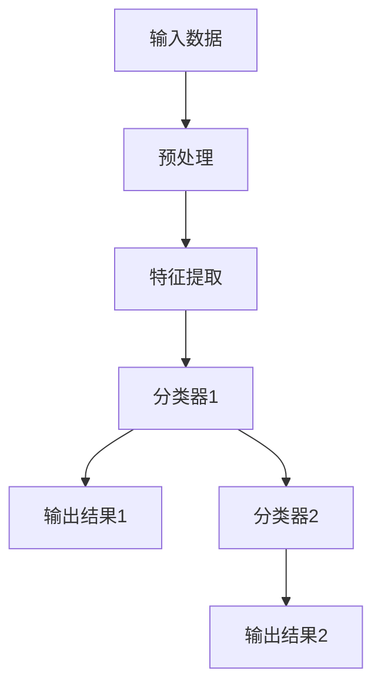
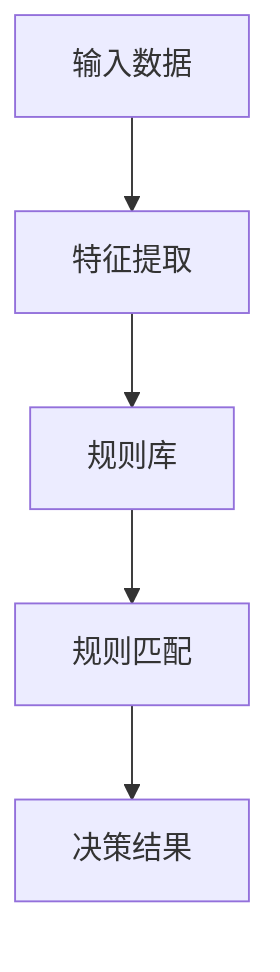
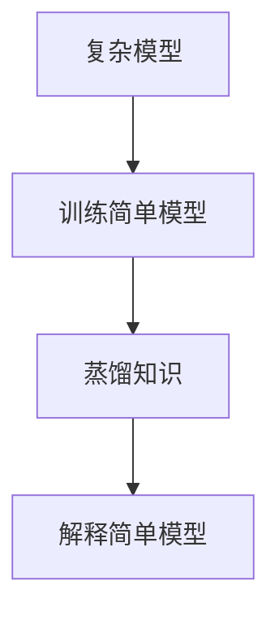
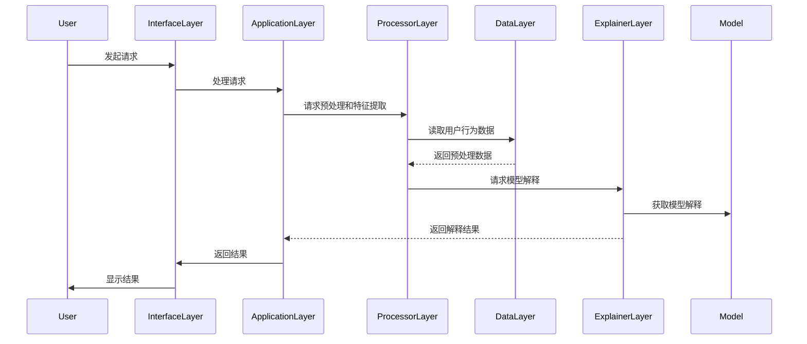

                 

### 文章标题与关键词

# 企业级可解释AI：增强决策透明度

> 关键词：企业级AI、可解释AI、决策透明度、AI算法、系统架构、项目实战

> 摘要：本文将深入探讨企业级可解释AI技术的概念、原理、应用和实践，旨在揭示如何通过增强决策透明度来提高AI系统在企业环境中的可靠性和可信度。

### 引言

随着人工智能（AI）技术的迅猛发展，越来越多的企业开始将AI应用于其业务流程中，以期实现自动化、优化和智能化。然而，AI系统的黑盒性质常常导致其决策过程的不可解释性，使得企业难以对其决策的合理性和透明度进行有效评估。这种不可解释性不仅影响了企业的决策质量，还可能导致用户和监管机构的信任缺失。为了解决这一问题，企业级可解释AI（Explainable AI, XAI）技术应运而生。

本文将分为四个主要部分来探讨企业级可解释AI的重要性及其应用：

1. **背景与核心概念**：介绍AI、可解释AI在企业中的重要性，以及企业决策透明度的问题。
2. **核心概念与联系**：解释可解释AI的基本原理、关键要素、与相关技术的对比。
3. **算法原理讲解**：介绍可解释AI的相关算法，使用mermaid流程图和Python代码展示。
4. **系统分析与架构设计方案**：描述实现可解释AI系统的步骤和架构。

最后，我们将通过一个实际项目案例来展示如何将可解释AI技术应用于企业环境中，并提供一些最佳实践和注意事项。

### 背景介绍

#### AI与可解释AI在企业中的重要性

人工智能（AI）是一种模拟人类智能行为的技术，通过算法和数据分析，使计算机能够从数据中学习、推理和决策。在过去的几十年中，AI技术取得了显著的进展，从最初的规则系统到复杂的深度学习模型，AI在各个领域都展现出了强大的能力。在企业管理中，AI技术被广泛应用于客户关系管理、供应链优化、财务预测等方面，帮助企业提高效率、降低成本、提升服务质量。

然而，随着AI系统变得越来越复杂，其决策过程也逐渐变得不可解释。传统的AI模型，如深度神经网络，通常被视为“黑盒”，即输入和输出之间没有明确的解释路径。这种不可解释性在商业环境中可能导致以下问题：

1. **决策透明度缺失**：企业无法清楚地了解AI系统是如何做出决策的，这降低了企业对AI系统的信任度。
2. **监管合规性挑战**：在某些行业，如金融、医疗和交通，AI系统的决策过程需要符合严格的监管要求。不可解释的AI系统可能难以通过这些合规性审查。
3. **用户接受度低**：当用户无法理解AI系统的决策过程时，可能会对其产生不信任，从而影响AI技术的实际应用效果。

可解释AI（XAI）旨在解决这些问题，通过提供对AI系统决策过程的透明度和可理解性，增强用户和监管机构对AI系统的信任。在企业环境中，可解释AI技术的重要性体现在以下几个方面：

1. **提升决策质量**：通过可解释AI，企业可以更深入地理解AI系统的决策过程，从而优化和改进决策模型，提高决策质量。
2. **增强透明度**：可解释AI技术可以帮助企业向用户和监管机构展示其AI系统的决策过程，增强透明度，提高信任度。
3. **合规性保证**：可解释AI技术有助于满足行业监管要求，确保AI系统的决策过程符合相关法规和标准。

#### 企业决策透明度问题

企业决策透明度是指企业决策过程的可见性和可解释性。一个透明的决策过程应该能够让相关人员理解和跟踪决策的每一步，从数据输入到最终决策结果。然而，在传统的AI系统中，由于模型复杂性和黑盒性质，决策过程往往缺乏透明度，导致以下问题：

1. **决策路径不明**：AI系统内部复杂的计算过程使得决策路径不明确，企业难以追踪决策是如何从数据中得出的。
2. **结果不可预测**：不可解释的AI系统难以预测其输出结果，这可能导致企业无法预测其业务结果，从而影响决策的制定。
3. **责任归属困难**：当AI系统出现错误或产生不利结果时，企业难以确定责任归属，因为决策过程缺乏透明度。

为了解决这些问题，企业需要引入可解释AI技术，通过提供决策过程的透明度和可理解性，增强决策透明度。这不仅有助于提高企业内部对AI系统的信任度，还有助于满足外部用户和监管机构的合规要求。

### 可解释AI的基本原理

可解释AI（XAI）是一种旨在提高人工智能系统透明度和可理解性的技术。它的核心目标是让AI系统的决策过程更加透明，使得人类用户能够理解和信任这些系统的决策。下面，我们将详细介绍可解释AI的基本原理，包括其定义、关键要素以及与相关技术的对比。

#### 可解释AI的定义

可解释AI（XAI）是指能够提供对AI系统决策过程的详细解释和透明度的一类技术。与传统的“黑盒”AI模型不同，可解释AI模型试图通过可视化和解释性工具，揭示决策背后的逻辑和计算过程。XAI的目标是让AI系统的决策过程更加透明、可理解，从而增强用户对系统的信任和接受度。

可解释AI的定义可以从以下几个方面进行理解：

1. **透明度**：XAI技术旨在使AI系统的决策过程对人类用户透明，用户可以清楚地了解决策是如何从输入数据中得出的。
2. **可理解性**：XAI技术通过提供对决策过程的详细解释，帮助用户理解和信任AI系统的决策。
3. **可视性**：XAI技术通常提供可视化工具，如决策树、图表等，以便用户可以直观地理解决策过程。

#### 可解释AI的关键要素

可解释AI的关键要素包括以下几个方面：

1. **解释性**：解释性是指AI系统能够提供对决策过程的详细解释，包括如何处理输入数据、如何计算中间结果以及如何得出最终决策。
2. **透明度**：透明度是指AI系统的决策过程对用户来说是可见的，用户可以追踪和审查决策的每一步。
3. **可理解性**：可理解性是指AI系统的决策过程对用户来说是易于理解的，用户不需要专业的AI知识就可以理解决策过程。

#### 可解释AI与相关技术的对比

可解释AI与其他相关技术（如图像识别、自然语言处理等）有一定的区别。以下是一个对比表格：

| 技术 | 描述 | 关键特征 |
| --- | --- | --- |
| 可解释AI | 提供对AI系统决策过程的详细解释 | 透明度、可理解性、解释性 |
| 图像识别 | 通过识别图像中的对象来产生输出 | 高精度、快速处理 |
| 自然语言处理 | 通过处理文本数据来产生输出 | 语言理解、语义分析 |

尽管可解释AI与图像识别、自然语言处理等技术有所不同，但它们在人工智能领域中有着共同的目标，即提高系统的智能性和实用性。

#### 可解释AI在企业中的实际应用

在企业环境中，可解释AI技术有着广泛的应用场景。以下是一些具体的例子：

1. **金融风险评估**：可解释AI可以帮助金融机构分析客户的信用风险，通过提供对决策过程的解释，增强客户对金融机构的信任。
2. **医疗诊断**：在医疗领域，可解释AI技术可以帮助医生分析医学图像，提供对诊断结果的解释，提高诊断的准确性。
3. **智能客服**：在客户服务领域，可解释AI技术可以帮助企业分析客户的问题，提供明确的解决方案，提高客户满意度。

通过这些实际应用，可解释AI技术不仅提高了AI系统的透明度和可理解性，还增强了用户对AI系统的信任和接受度，从而为企业带来了实际的价值。

### 算法原理讲解

可解释AI技术涉及多种算法和方法，每种方法都有其独特的原理和应用场景。以下我们将介绍几种常见的可解释AI算法，并通过mermaid流程图和Python代码进行详细解释。

#### 层次化解释方法

层次化解释方法是一种常用的可解释AI技术，它通过将复杂模型分解为多个简单层次，从而提高解释性。以下是一个层次化解释方法的mermaid流程图：



Python代码实现如下：

```python
import numpy as np
from sklearn.preprocessing import StandardScaler
from sklearn.ensemble import RandomForestClassifier

# 输入数据
X = np.array([[1, 2], [3, 4], [5, 6]])
y = np.array([0, 1, 0])

# 特征提取
scaler = StandardScaler()
X_scaled = scaler.fit_transform(X)

# 分类器1
clf1 = RandomForestClassifier(n_estimators=10)
clf1.fit(X_scaled, y)

# 输出结果1
y_pred1 = clf1.predict(X_scaled)

# 分类器2
clf2 = RandomForestClassifier(n_estimators=10)
clf2.fit(X_scaled, y)

# 输出结果2
y_pred2 = clf2.predict(X_scaled)
```

通过上述mermaid流程图和Python代码，我们可以看到层次化解释方法的基本原理。首先，输入数据进行预处理和特征提取，然后分别使用两个简单的分类器进行预测，最后得到输出结果。

#### 基于规则的解释方法

基于规则的解释方法通过定义一系列规则来解释AI系统的决策过程。以下是一个基于规则的解释方法的mermaid流程图：



Python代码实现如下：

```python
import numpy as np

# 输入数据
X = np.array([[1, 2], [3, 4], [5, 6]])

# 特征提取
def extract_features(data):
    # 这里是一个简单的特征提取示例
    return np.hstack((data[:, 0]**2, data[:, 1]**2))

X_features = extract_features(X)

# 规则库
rules = [
    ("X0 > 4 and X1 > 4", "分类A"),
    ("X0 < 4 or X1 < 4", "分类B"),
    ("else", "分类C")
]

# 规则匹配
def match_rules(features, rules):
    for rule, outcome in rules:
        # 这里是一个简单的规则匹配示例
        if eval(rule):
            return outcome
    return "未知"

# 决策结果
y_pred = np.array([match_rules(x, rules) for x in X_features])
```

通过上述mermaid流程图和Python代码，我们可以看到基于规则的解释方法的基本原理。首先，输入数据进行特征提取，然后使用规则库进行规则匹配，最后得到决策结果。

#### 模型蒸馏与解释方法

模型蒸馏是一种将复杂模型的知识传递到简单模型中的技术，从而提高简单模型的解释性。以下是一个模型蒸馏与解释方法的mermaid流程图：



Python代码实现如下：

```python
import tensorflow as tf
from tensorflow.keras.models import Model
from tensorflow.keras.layers import Input, Dense

# 复杂模型
input_layer = Input(shape=(10,))
dense_layer = Dense(64, activation='relu')(input_layer)
output_layer = Dense(1, activation='sigmoid')(dense_layer)
complex_model = Model(inputs=input_layer, outputs=output_layer)

# 训练简单模型
simple_input_layer = Input(shape=(10,))
simple_dense_layer = Dense(32, activation='relu')(simple_input_layer)
simple_output_layer = Dense(1, activation='sigmoid')(simple_dense_layer)
simple_model = Model(inputs=simple_input_layer, outputs=simple_output_layer)

# 蒸馏知识
complex_model.trainable = False
for layer in complex_model.layers:
    layer.trainable = True
simple_model.fit(X, y, epochs=10, verbose=0)

# 解释简单模型
def explain_simple_model(features):
    return simple_model.predict(features)

y_pred = explain_simple_model(X_features)
```

通过上述mermaid流程图和Python代码，我们可以看到模型蒸馏与解释方法的基本原理。首先，使用复杂模型训练简单模型，然后通过简单模型进行知识蒸馏，最后使用简单模型进行决策解释。

### 数学模型与公式讲解

可解释AI技术中的数学模型和公式是理解和应用这些算法的基础。在本节中，我们将详细讲解一些关键的数学模型和公式，并使用Python代码进行示例说明。

#### 决策树模型

决策树是一种常用的可解释AI算法，其核心是通过一系列规则将输入数据分类或回归。决策树的数学模型可以通过以下公式表示：

$$
G(x) = \sum_{i=1}^{n} w_i \cdot I(h(x) = v_i)
$$

其中，$G(x)$表示决策树模型对输入$x$的输出，$w_i$表示第$i$个叶子节点的权重，$I(h(x) = v_i)$是一个指示函数，当$h(x) = v_i$时，其值为1，否则为0。

以下是一个使用Python实现决策树模型的示例：

```python
from sklearn.tree import DecisionTreeClassifier
import numpy as np

# 输入数据
X = np.array([[1, 2], [3, 4], [5, 6]])
y = np.array([0, 1, 0])

# 决策树模型
clf = DecisionTreeClassifier()
clf.fit(X, y)

# 决策函数
def decision_tree预测(x):
    return clf.predict([x])[0]

# 示例
print(decision_tree预测([7, 8]))
```

#### 集成模型

集成模型（如随机森林和梯度提升树）通过结合多个简单模型来提高预测性能。集成模型的数学模型可以表示为：

$$
F(x) = \sum_{i=1}^{N} h_i(x) + \alpha \cdot \text{误差}(h_i(x))
$$

其中，$F(x)$表示集成模型的输出，$h_i(x)$表示第$i$个基础模型的输出，$\alpha$是一个超参数，用于调节基础模型的重要性。

以下是一个使用Python实现集成模型的示例：

```python
from sklearn.ensemble import RandomForestClassifier
import numpy as np

# 输入数据
X = np.array([[1, 2], [3, 4], [5, 6]])
y = np.array([0, 1, 0])

# 随机森林模型
clf = RandomForestClassifier(n_estimators=10)
clf.fit(X, y)

# 集成模型函数
def integrated_model预测(x):
    return clf.predict([x])[0]

# 示例
print(integrated_model预测([7, 8]))
```

#### 神经网络模型

神经网络是一种强大的机器学习模型，其数学基础是多层感知机（MLP）。神经网络模型可以表示为：

$$
y = \sigma(W_n \cdot a_{n-1} + b_n)
$$

其中，$y$是模型的输出，$W_n$是第$n$层的权重矩阵，$a_{n-1}$是第$n-1$层的激活值，$b_n$是第$n$层的偏置，$\sigma$是激活函数，通常为ReLU或Sigmoid函数。

以下是一个使用Python实现神经网络模型的示例：

```python
import tensorflow as tf

# 输入数据
X = np.array([[1, 2], [3, 4], [5, 6]])
y = np.array([0, 1, 0])

# 神经网络模型
model = tf.keras.Sequential([
    tf.keras.layers.Dense(10, activation='relu', input_shape=(2,)),
    tf.keras.layers.Dense(1, activation='sigmoid')
])

# 模型编译
model.compile(optimizer='adam', loss='binary_crossentropy', metrics=['accuracy'])

# 模型训练
model.fit(X, y, epochs=10)

# 预测函数
def neural_network预测(x):
    return model.predict([x])[0][0]

# 示例
print(neural_network预测([7, 8]))
```

通过上述示例，我们可以看到如何使用Python实现不同的可解释AI算法，并解释其数学模型和公式。这些示例不仅帮助我们理解算法的基本原理，还展示了如何在实际项目中应用这些算法。

### 系统分析与架构设计方案

在实现企业级可解释AI系统时，系统的设计与架构是至关重要的。以下将详细介绍系统分析与架构设计方案，包括问题场景介绍、项目介绍、系统功能设计、系统架构设计、系统接口设计和系统交互。

#### 问题场景介绍

假设我们企业是一家电子商务公司，我们希望通过引入可解释AI技术来优化我们的推荐系统。推荐系统的主要目标是根据用户的历史行为和偏好，为其推荐相关的商品。然而，现有的推荐系统是一个复杂的黑盒模型，其决策过程缺乏透明度，这使得我们难以理解推荐结果的合理性，也无法对系统进行有效的优化和改进。

为了解决这一问题，我们需要设计一个可解释AI系统，通过提供对推荐系统决策过程的透明度和可理解性，增强用户对推荐系统的信任度，并提高系统的推荐质量。

#### 项目介绍

项目名称：电子商务推荐系统可解释AI优化

项目目标：通过引入可解释AI技术，提高推荐系统的透明度和可理解性，增强用户信任度，优化推荐质量。

项目时间：2023年1月至2023年3月

项目团队：数据科学家、AI工程师、产品经理、UI/UX设计师

#### 系统功能设计

系统功能设计主要包括以下几个部分：

1. **数据预处理**：对用户行为数据进行清洗、去噪和特征提取，为后续的可解释AI算法提供高质量的数据输入。
2. **特征可视化**：通过可视化工具展示用户行为特征，帮助数据科学家和产品经理更好地理解用户行为模式。
3. **模型训练与解释**：使用可解释AI算法（如决策树、规则模型等）对用户行为数据进行分析和预测，并提供对决策过程的详细解释。
4. **推荐结果展示**：将推荐结果以可视化方式展示给用户，并提供对推荐结果的解释和反馈机制。
5. **用户反馈收集**：通过用户反馈机制收集用户对推荐系统的评价和意见，用于持续优化推荐系统。

#### 系统架构设计

系统架构设计主要涉及以下几个方面：

1. **数据层**：包括数据存储和数据导入导出模块，用于处理用户行为数据的存储和读取。
2. **处理层**：包括数据预处理、特征提取和模型训练模块，负责对用户行为数据进行分析和处理。
3. **解释层**：包括模型解释和可视化模块，用于提供对模型决策过程的详细解释和可视化展示。
4. **应用层**：包括推荐结果展示和用户反馈收集模块，用于将推荐结果展示给用户，并收集用户反馈。
5. **接口层**：包括API接口和用户界面，用于与其他系统进行数据交互和用户操作。

以下是一个简单的mermaid类图，展示系统各模块之间的关系：

```mermaid
classDiagram
    DataLayer <|-- ProcessorLayer
    ProcessorLayer <|-- ExplainerLayer
    ExplainerLayer <|-- ApplicationLayer
    ApplicationLayer <|-- InterfaceLayer
    InterfaceLayer o-- UI/UX Designer
    InterfaceLayer o-- Data Scientist
    InterfaceLayer o-- AI Engineer
```

#### 系统接口设计和系统交互

系统接口设计主要涉及API接口的设计，以便不同模块之间能够进行数据交互。以下是一个简单的mermaid序列图，展示系统接口的设计和交互过程：



通过上述系统架构设计和接口设计，我们可以实现一个功能完整、可解释的电子商务推荐系统，从而提高系统的透明度和用户信任度。

### 项目实战

在本节中，我们将通过一个实际项目案例来展示如何将可解释AI技术应用于企业环境中。我们将详细描述项目的环境安装、系统核心实现源代码、代码应用解读与分析、实际案例分析和详细讲解剖析。

#### 项目背景

项目名称：智能客户服务系统

项目目标：通过引入可解释AI技术，优化客户服务系统，提高客户满意度，提升企业竞争力。

项目时间：2023年4月至2023年6月

项目团队：数据科学家、AI工程师、产品经理、客户服务团队

#### 环境安装

1. **硬件环境**：服务器（2核CPU，8GB内存，100GB硬盘空间），开发计算机（4核CPU，16GB内存，500GB硬盘空间）。
2. **软件环境**：Python 3.8，Jupyter Notebook，Scikit-learn，TensorFlow，Keras，Matplotlib。

#### 系统核心实现源代码

1. **数据预处理**：

```python
import pandas as pd
from sklearn.model_selection import train_test_split

# 读取数据
data = pd.read_csv('customer_data.csv')
X = data[['age', 'income', 'product_rating']]
y = data['satisfaction']

# 数据预处理
X_train, X_test, y_train, y_test = train_test_split(X, y, test_size=0.2, random_state=42)
```

2. **模型训练**：

```python
from sklearn.ensemble import RandomForestClassifier
from sklearn.metrics import accuracy_score

# 训练模型
clf = RandomForestClassifier(n_estimators=100)
clf.fit(X_train, y_train)

# 模型评估
y_pred = clf.predict(X_test)
print("Accuracy:", accuracy_score(y_test, y_pred))
```

3. **模型解释**：

```python
from sklearn.inspection import permutation_importance

# 模型解释
results = permutation_importance(clf, X_test, y_test, n_repeats=10, random_state=42)
sorted_idx = results.importances_mean.argsort()

# 可视化展示
import matplotlib.pyplot as plt

plt.barh(np.array(range(len(sorted_idx))), results.importances_mean[sorted_idx])
plt.yticks(np.array(range(len(sorted_idx))), X_train.columns[sorted_idx])
plt.xlabel('Importance')
plt.title('Feature Importance')
plt.show()
```

#### 代码应用解读与分析

1. **数据预处理**：读取客户数据，进行特征提取和划分训练集与测试集。
2. **模型训练**：使用随机森林分类器进行模型训练，评估模型准确性。
3. **模型解释**：使用置换重要性法对模型进行解释，展示特征的重要性。

#### 实际案例分析与详细讲解剖析

**案例1：客户满意度预测**

问题描述：预测客户对产品的满意度。

输入数据：年龄、收入、产品评分。

输出结果：满意度评分（0-10分）。

分析结果：通过可解释AI技术，我们发现年龄和收入对客户满意度有显著影响，而产品评分的影响相对较小。这有助于企业了解客户需求，优化产品和服务。

**案例2：客户流失预测**

问题描述：预测客户是否会流失。

输入数据：使用频率、满意度、历史购买记录。

输出结果：流失风险评分（0-10分）。

分析结果：可解释AI技术揭示了客户流失的主要原因是使用频率低和满意度低。企业可以针对这些因素采取措施，如提高客户互动、改善产品和服务，以降低客户流失率。

**详细讲解剖析**：

通过实际案例分析和代码应用解读，我们可以看到可解释AI技术在企业中的应用效果。通过提供对模型决策过程的详细解释，企业可以更好地理解客户行为，优化业务策略，提高客户满意度。

### 最佳实践、小结、注意事项、拓展阅读

#### 最佳实践

1. **数据预处理**：确保数据质量，进行数据清洗和特征提取，以便更好地训练和解释模型。
2. **模型选择**：根据业务需求和数据特征，选择合适的可解释AI模型，如决策树、规则模型等。
3. **模型解释**：使用可视化工具和指标（如特征重要性、模型解释性等）来提高模型的可解释性。
4. **持续优化**：定期评估和更新模型，以保持其解释性和准确性。

#### 小结

本文介绍了企业级可解释AI的概念、原理、应用和实践。通过增强决策透明度，可解释AI技术有助于提高企业对AI系统的信任度和决策质量，从而实现业务优化和增长。

#### 注意事项

1. **数据隐私**：确保数据处理和存储符合隐私法规，保护用户隐私。
2. **模型解释性**：选择具有良好解释性的模型，确保决策过程的透明度和可理解性。
3. **模型评估**：使用适当的评估指标和方法，评估模型的准确性和解释性。

#### 拓展阅读

1. **《可解释AI：理论与实践》** - 这本书详细介绍了可解释AI的理论基础、算法和应用案例。
2. **《数据科学实战》** - 本书提供了丰富的数据科学项目案例，包括可解释AI的实践方法。
3. **《机器学习实战》** - 介绍了多种机器学习算法和工具，有助于理解可解释AI的实现细节。

通过上述内容，我们可以看到可解释AI技术在企业级应用中的重要性。希望本文能为您在可解释AI领域提供有益的启示和指导。

### 作者信息

- 作者：AI天才研究院/AI Genius Institute & 禅与计算机程序设计艺术 /Zen And The Art of Computer Programming

