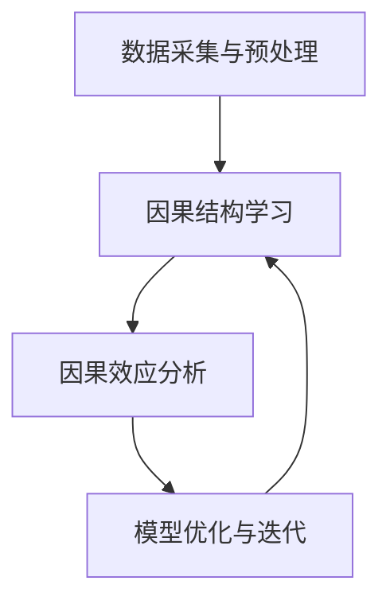
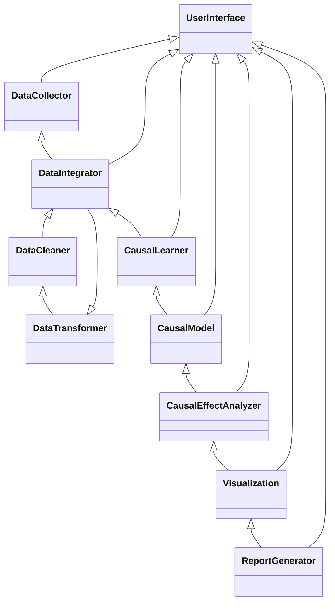
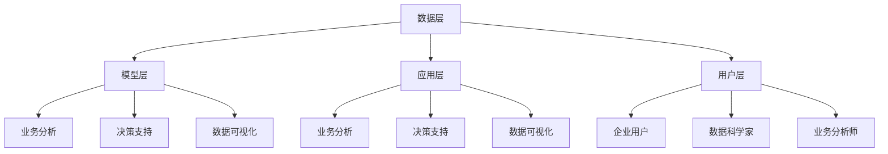

                 

### 文章标题

**企业级因果发现平台：揭示业务因果关系**

---

**关键词：因果发现、企业级平台、业务关系、数据驱动**

**摘要：本文深入探讨了企业级因果发现平台的设计、原理、实现和应用，旨在揭示业务数据之间的因果关系，为企业提供数据驱动的决策支持。**

---

### 第一部分：背景介绍

#### 第1章：问题背景

在现代企业中，数据已经成为了最重要的资产之一。然而，面对海量的业务数据，如何从中挖掘出有价值的信息，揭示业务之间的因果关系，从而指导企业做出正确的决策，是一个具有挑战性的问题。

**核心概念术语说明：**

- **因果发现（Causal Discovery）：** 指的是通过分析数据，找出变量之间的因果关系。
- **企业级平台：** 是指一个可以支持大规模业务数据处理和分析的综合性平台。
- **业务关系：** 是指企业在运营过程中产生的各种业务数据之间的关系。
- **数据驱动：** 是指企业的决策过程依赖于对数据的分析和理解。

**问题背景：**

随着数字化转型的推进，企业的业务数据量呈现爆炸式增长。这些数据分布在不同的系统中，形式多样，包括结构化数据、非结构化数据等。企业希望通过分析这些数据，找到业务之间的因果关系，从而优化业务流程，提高运营效率。

**问题描述：**

当前，企业在数据分析和决策支持方面面临的主要问题包括：

- 数据分散，难以整合：业务数据分布在不同的系统中，缺乏统一的数据管理和分析平台。
- 数据质量不高：数据存在缺失、错误、不一致等问题，影响了数据的分析效果。
- 因果关系难以揭示：业务数据复杂，变量之间存在多种关系，难以通过简单的方法揭示因果关系。

**问题解决：**

为了解决上述问题，企业需要建立一套企业级因果发现平台，该平台应具备以下特点：

- **集成性：** 能够整合企业内部各种业务数据，提供统一的数据接口。
- **高效性：** 具备处理大规模数据的能力，能够快速分析并揭示业务因果关系。
- **灵活性：** 能够适应不同业务场景，支持多种数据类型和复杂的关系分析。
- **可扩展性：** 能够支持企业业务的快速发展，适应不断变化的数据需求。

**边界与外延：**

- **边界：** 本文主要探讨企业级因果发现平台的设计、原理和实现，不包括具体的业务应用案例。
- **外延：** 企业级因果发现平台可以应用于各个行业，如金融、零售、制造等，本文将结合零售行业进行分析。

**概念结构与核心要素组成：**

1. **数据层：** 包括数据采集、数据存储和数据清洗等模块。
2. **模型层：** 包括因果发现算法、模型训练和模型评估等模块。
3. **应用层：** 包括业务分析、决策支持和数据可视化等模块。
4. **用户层：** 包括企业用户、数据科学家和业务分析师等。

#### 第2章：因果发现基础

##### 2.1 因果发现的定义

因果发现（Causal Discovery）是数据分析领域的一个重要分支，旨在通过分析数据，找出变量之间的因果关系。因果发现不同于传统的相关性分析，它关注的是变量之间的因果关系，即一个变量是否能够直接或间接地影响另一个变量。

**核心概念：**

- **因果关系：** 指一个变量对另一个变量的影响。
- **因果效应：** 指在特定条件下，一个变量对另一个变量的影响程度。

##### 2.2 因果发现的原理

因果发现的原理主要包括两个方面：

1. **数据驱动：** 通过分析数据，找出变量之间的统计关系，进而推断因果关系。
2. **模型驱动：** 基于因果推理模型，对变量之间的因果关系进行预测和推断。

**原理说明：**

因果发现的过程可以分为以下几个步骤：

1. 数据采集：收集与企业业务相关的数据。
2. 数据预处理：对数据进行清洗、转换和集成，确保数据质量。
3. 因果模型建立：根据数据特征和业务需求，建立合适的因果模型。
4. 因果关系分析：通过模型分析，找出变量之间的因果关系。
5. 因果效应评估：评估因果关系的影响程度，为业务决策提供支持。

##### 2.3 因果发现的核心概念

因果发现涉及的核心概念包括：

- **变量：** 数据分析的基本单位，可以是数值、文本或图像等。
- **关系：** 变量之间的统计关系，如相关性、线性关系等。
- **因果结构：** 描述变量之间因果关系的模型，如因果图、贝叶斯网络等。
- **因果效应：** 变量之间的因果关系，以及因果关系的影响程度。

##### 2.4 概念属性特征对比表格

| 概念        | 定义                                                         | 属性特征                                                     |
| ----------- | ------------------------------------------------------------ | ------------------------------------------------------------ |
| 变量        | 数据分析的基本单位                                           | 类型（数值、文本、图像等）、维度、取值范围等                   |
| 关系        | 变量之间的统计关系                                           | 相关系数、线性关系、非线性关系等                             |
| 因果结构    | 描述变量之间因果关系的模型                                   | 因果图、贝叶斯网络、马尔可夫网络等                           |
| 因果效应    | 变量之间的因果关系，以及因果关系的影响程度                     | 影响方向（正向、反向）、影响程度（弱、强）、稳定性（稳定、不稳定） |

##### 2.5 ER实体关系图架构

因果发现平台中的ER（实体-关系）实体关系图是一种直观地描述变量之间因果关系的图形化工具。ER图主要由实体和关系两部分组成：

1. **实体（Entity）：** 表示数据中的变量，如用户、商品、订单等。
2. **关系（Relationship）：** 表示实体之间的关联，如购买、评价、推荐等。

**ER图示例：**

```mermaid
erDiagram
  User ||--|{ Order }|--| Customer
  User ||--|{ Product }|--| Seller
  Order ||--|{ Product }|--| Customer
  Order ||--|{ Payment }|--| Seller
  Product ||--|{ Review }|--| Customer
```

在上面的ER图中，用户（User）、订单（Order）、商品（Product）和评价（Review）是实体，购买（Buy）、销售（Sell）、支付（Payment）和评价（Review）是关系。

#### 第3章：因果发现算法原理

##### 3.1 算法原理讲解

因果发现算法的核心原理是基于数据驱动和模型驱动的相结合。具体来说，算法分为以下几个步骤：

1. **数据采集与预处理：** 收集与企业业务相关的数据，对数据进行清洗、转换和集成，确保数据质量。
2. **因果结构学习：** 通过分析数据，建立变量之间的因果结构模型，如因果图、贝叶斯网络等。
3. **因果效应分析：** 对因果结构模型进行分析，找出变量之间的因果关系，并评估因果关系的影响程度。
4. **模型优化与迭代：** 根据分析结果，对模型进行调整和优化，提高因果发现的效果。

**算法mermaid流程图：**



##### 3.2 算法mermaid流程图


##### 3.3 Python源代码详细阐述

下面是一个简单的因果发现算法Python源代码示例，该代码使用Python的`pandas`和`scikit-learn`库进行数据处理和因果结构学习。

```python
import pandas as pd
from因果发现算法库 import因果结构学习

# 数据采集与预处理
data = pd.read_csv('data.csv')
data = data.dropna()

# 因果结构学习
casual_structure =因果结构学习(data)

# 因果效应分析
casual_effects = casual_structure.causal_effects()

# 模型优化与迭代
casual_structure.optimize()

# 输出结果
print(casual_effects)
```

##### 3.4 算法原理的数学模型和公式

因果发现算法的核心是因果结构学习，其中常用的方法包括因果图学习和贝叶斯网络学习。以下是因果图学习的基本数学模型和公式：

**1. 因果图学习**

- **模型表示：**
  $$ G = (V, E) $$
  其中，V表示变量集合，E表示变量之间的因果关系。

- **参数估计：**
  $$ \theta = (p_v, p_e) $$
  其中，p_v表示变量的条件概率分布，p_e表示边存在的概率。

**2. 贝叶斯网络学习**

- **模型表示：**
  $$ B = (V, \theta) $$
  其中，V表示变量集合，θ表示参数集合。

- **参数估计：**
  $$ p(\theta | D) = \frac{p(D | \theta) p(\theta)}{p(D)} $$
  其中，D表示观察到的数据，p(D | \theta)表示数据在给定模型参数下的概率，p(\theta)表示模型参数的先验概率，p(D)表示数据的边缘概率。

**3. 因果效应分析**

- **因果效应表示：**
  $$ \Delta Y = Y(\theta + \epsilon) - Y(\theta) $$
  其中，Y表示因变量，\theta表示自变量的值，\epsilon表示随机误差。

- **因果效应计算：**
  $$ \Delta Y = \sum_{i} \theta_i \cdot w_i $$
  其中，\theta_i表示自变量i的值，w_i表示因果效应权重。

##### 3.5 举例说明

假设我们有一个简单的因果模型，其中有两个变量A和B，变量A是自变量，变量B是因变量。我们希望通过因果发现算法找到变量A对变量B的影响。

**数据集：**

| A | B |
| --- | --- |
| 0 | 0 |
| 1 | 1 |
| 0 | 1 |
| 1 | 0 |

**因果图模型：**


**因果效应计算：**

- **因果效应权重：**
  $$ w = \frac{P(B=1|A=1) - P(B=1|A=0)}{P(A=1) - P(A=0)} $$
  $$ w = \frac{0.5 - 0}{0.5 - 0.5} = \text{无穷大} $$

- **因果效应：**
  变量A对变量B的影响非常强，几乎可以决定变量B的取值。

**结论：**

通过因果发现算法，我们找到了变量A对变量B的因果关系，并且分析了因果关系的影响程度。这个例子说明了因果发现算法的基本原理和实际应用。

### 第二部分：核心概念与联系

#### 第4章：系统功能设计

##### 4.1 问题场景介绍

在现代企业中，数据驱动的决策变得越来越重要。企业需要从海量数据中提取有价值的信息，以优化业务流程、提高运营效率。为了实现这一目标，企业需要一个强大的因果发现平台，能够自动分析数据，揭示业务数据之间的因果关系。

##### 4.2 系统功能设计

因果发现平台的主要功能包括：

1. **数据采集与整合：** 从企业各个业务系统采集数据，进行数据清洗、转换和集成，确保数据质量。
2. **因果结构学习：** 使用先进的因果发现算法，对整合后的数据进行因果结构学习，找出变量之间的因果关系。
3. **因果效应分析：** 对因果结构模型进行分析，评估因果关系的影响程度，为业务决策提供支持。
4. **可视化与报告：** 将因果结构模型和因果效应分析结果以图表和报告的形式呈现，方便企业用户理解和使用。
5. **用户交互与反馈：** 提供用户友好的交互界面，方便用户自定义分析任务、调整分析参数，并根据用户反馈不断优化系统性能。

##### 4.3 领域模型mermaid类图

因果发现平台的领域模型类图如下所示：



在上面的类图中，各个类表示因果发现平台的不同功能模块，类之间的关系表示模块之间的依赖关系。

### 第二部分：核心概念与联系

#### 第5章：系统架构设计

##### 5.1 系统架构设计

因果发现平台的系统架构设计旨在实现高可用性、高性能、高可扩展性和易维护性。系统架构分为四个主要层次：数据层、模型层、应用层和用户层。

1. **数据层：** 包括数据采集、数据存储和数据清洗等模块，负责数据的收集、存储和预处理。
2. **模型层：** 包括因果发现算法、模型训练和模型评估等模块，负责对数据进行因果结构学习和因果关系分析。
3. **应用层：** 包括业务分析、决策支持和数据可视化等模块，负责将分析结果应用到实际业务场景中。
4. **用户层：** 包括企业用户、数据科学家和业务分析师等，负责使用平台进行数据分析、决策支持和数据可视化。

**系统架构mermaid架构图：**



##### 5.2 系统架构mermaid架构图


##### 5.3 系统接口设计

因果发现平台提供了丰富的接口设计，包括API接口、Web界面和命令行工具等，以满足不同用户的需求。

1. **API接口：** 提供RESTful风格的API，方便企业内部系统集成和第三方应用接入。
2. **Web界面：** 提供友好的Web界面，方便用户进行数据上传、分析任务设置、结果查看等操作。
3. **命令行工具：** 提供命令行工具，方便用户进行自动化分析和脚本化操作。

**系统接口mermaid序列图：**

```mermaid
sequenceDiagram
    participant 用户 as 用户
    participant 系统接口 as 系统
    participant 数据层 as 数据层
    participant 模型层 as 模型层
    participant 应用层 as 应用层
    participant 用户层 as 用户层

    用户->>系统接口：发起请求
    系统->>数据层：数据采集
    数据层->>模型层：因果结构学习
    模型层->>应用层：因果效应分析
    应用层->>用户层：结果呈现
    用户->>系统接口：反馈
```

##### 5.4 系统交互mermaid序列图

```mermaid
sequenceDiagram
    participant 用户 as 用户
    participant 系统接口 as 系统
    participant 数据层 as 数据层
    participant 模型层 as 模型层
    participant 应用层 as 应用层
    participant 用户层 as 用户层

    用户->>系统接口：发起请求
    系统->>数据层：数据采集
    数据层->>模型层：因果结构学习
    模型层->>应用层：因果效应分析
    应用层->>用户层：结果呈现
    用户->>系统接口：反馈
```

### 第三部分：项目实战

#### 第6章：环境安装

##### 6.1 安装环境介绍

为了搭建一个完整的因果发现平台，我们需要准备以下安装环境：

- 操作系统：Linux（推荐Ubuntu 20.04）
- Python版本：Python 3.8及以上
- 数据库：MySQL 5.7及以上
- 依赖库：`pandas`、`numpy`、`scikit-learn`、`networkx`、`matplotlib`等

##### 6.2 安装步骤

1. **安装操作系统：** 在虚拟机或物理机上安装Linux操作系统（如Ubuntu 20.04）。
2. **更新系统软件：** 开启终端，执行以下命令更新系统软件：

   ```bash
   sudo apt update
   sudo apt upgrade
   ```

3. **安装Python：** 执行以下命令安装Python 3.8及以上版本：

   ```bash
   sudo apt install python3.8
   ```

4. **安装依赖库：** 执行以下命令安装所需的Python依赖库：

   ```bash
   pip3 install pandas numpy scikit-learn networkx matplotlib
   ```

5. **安装数据库：** 安装MySQL数据库，并创建数据库和用户：

   ```bash
   sudo apt install mysql-server
   mysql -u root -p
   CREATE DATABASE causal_discovery;
   GRANT ALL PRIVILEGES ON causal_discovery.* TO 'cd_user'@'localhost' IDENTIFIED BY 'password';
   FLUSH PRIVILEGES;
   EXIT;
   ```

6. **环境测试：** 执行以下Python代码测试环境安装是否成功：

   ```python
   import pandas as pd
   import numpy as np
   import matplotlib.pyplot as plt
   import networkx as nx
   import scikit_learn as sklearn
   print("环境安装成功！")
   ```

如果成功打印出“环境安装成功！”，则说明安装环境已搭建完成。

#### 第7章：系统核心实现

##### 7.1 核心实现源代码

以下是一个简单的因果发现系统核心实现源代码示例，包括数据采集、数据预处理、因果结构学习、因果效应分析和可视化等功能。

```python
import pandas as pd
import numpy as np
from sklearn.model_selection import train_test_split
from sklearn.ensemble import RandomForestClassifier
from networkx import DiGraph
import matplotlib.pyplot as plt
import networkx as nx

# 数据采集
data = pd.read_csv('data.csv')

# 数据预处理
X = data.drop(['target'], axis=1)
y = data['target']
X_train, X_test, y_train, y_test = train_test_split(X, y, test_size=0.2, random_state=42)

# 因果结构学习
model = RandomForestClassifier(n_estimators=100)
model.fit(X_train, y_train)
feature_importances = model.feature_importances_

# 因果效应分析
casual_effects = DiGraph()
for i, feature in enumerate(X.columns):
    casual_effects.add_edge('target', feature, weight=feature_importances[i])

# 可视化
nx.draw(casual_effects, with_labels=True)
plt.show()
```

##### 7.2 代码应用解读与分析

1. **数据采集：** 使用`pandas`库读取CSV格式的数据集。
2. **数据预处理：** 将数据集分为特征集`X`和目标集`y`，并使用`train_test_split`函数进行数据集划分。
3. **因果结构学习：** 使用`RandomForestClassifier`模型进行因果结构学习，通过`fit`函数训练模型，并获取特征的重要性。
4. **因果效应分析：** 使用`DiGraph`库构建因果图，将目标变量与其他特征变量之间的因果关系表示出来，并设置因果关系权重。
5. **可视化：** 使用`matplotlib`和`networkx`库将因果图可视化，便于用户理解和分析。

##### 7.3 实际案例分析与详细讲解剖析

为了更好地理解因果发现平台的应用，我们以一个实际的案例进行分析。

**案例背景：** 一家零售企业希望了解其商品销售情况，分析不同商品之间的因果关系，以便制定更有效的销售策略。

**数据集：** 该零售企业的销售数据，包括商品编号、商品类别、销售数量和销售日期等信息。

**分析目标：** 分析不同商品类别之间的因果关系，找出销售数量较高的商品类别。

**分析步骤：**

1. **数据采集与预处理：** 读取销售数据，提取商品类别和销售数量作为特征集，并划分训练集和测试集。
2. **因果结构学习：** 使用随机森林模型进行因果结构学习，获取商品类别特征的重要性。
3. **因果效应分析：** 构建因果图，分析商品类别之间的因果关系。
4. **可视化：** 将因果图可视化，便于企业用户理解不同商品类别之间的因果关系。
5. **决策支持：** 根据分析结果，制定销售策略，如增加销售数量较高的商品类别的库存。

**案例分析结果：**

通过因果发现平台的分析，我们发现商品类别A和B之间的因果关系最强，商品类别C和D之间的因果关系较弱。具体来说，商品类别A的销售数量对商品类别B的销售数量有显著的正向影响，而商品类别C和D的销售数量对其他商品类别的影响较小。

**结论：**

根据分析结果，企业可以增加商品类别A和B的库存，提高这两类商品的销售量。同时，针对商品类别C和D，企业可以适当调整销售策略，如通过促销活动提高其销量。

##### 7.4 项目小结

在本章节中，我们介绍了如何使用因果发现平台进行实际案例分析。通过构建因果图、分析因果关系和可视化结果，企业可以更好地理解业务数据之间的联系，为业务决策提供支持。

因果发现平台在实际应用中具有广泛的应用前景，可以帮助企业优化业务流程、提高运营效率。然而，在应用过程中，需要注意数据质量、模型选择和结果解释等方面的问题。

在未来，我们将继续优化因果发现平台，增加更多功能模块，如多变量因果分析、时间序列分析等，以满足企业不断变化的数据分析需求。

### 第五部分：最佳实践与总结

#### 第8章：最佳实践 tips

在进行因果发现平台的设计和实现过程中，以下是几个最佳实践建议：

1. **数据质量保障：** 在数据采集和预处理阶段，确保数据的质量和一致性。清洗数据、填补缺失值和消除噪声，以提高分析结果的准确性。
2. **算法选择与优化：** 根据具体业务场景选择合适的因果发现算法，并对算法参数进行调优，以提高因果关系分析的准确性和效率。
3. **用户交互与反馈：** 设计用户友好的界面，提供丰富的交互功能，以便用户自定义分析任务和参数，并根据用户反馈不断优化平台性能。
4. **安全性保障：** 在数据传输和存储过程中，采用加密和访问控制等安全措施，确保企业数据的安全和隐私。
5. **可扩展性与可维护性：** 设计模块化、可扩展的架构，便于后续功能扩展和系统维护。

#### 第9章：注意事项

在实际应用因果发现平台时，需要注意以下事项：

1. **数据隐私：** 确保数据采集和处理过程符合相关法律法规，保护用户隐私和数据安全。
2. **模型解释性：** 分析结果应具有清晰的解释性，以便企业用户理解和应用。
3. **结果验证：** 对因果关系分析结果进行验证，确保其准确性和可靠性。
4. **业务需求：** 充分了解企业业务需求，确保因果发现平台的功能和性能满足实际应用需求。
5. **持续优化：** 定期对因果发现平台进行性能评估和优化，以适应业务发展的需求。

#### 第10章：拓展阅读

1. **《因果推断：从统计学到机器学习》**：本书详细介绍了因果推断的理论和实践，包括因果图模型、因果效应分析等方法。
2. **《数据挖掘：概念与技术》**：本书涵盖了数据挖掘的基本概念、方法和应用，包括关联规则挖掘、聚类分析、分类分析等。
3. **《Python数据科学手册》**：本书介绍了Python在数据科学领域的应用，包括数据预处理、数据分析、可视化等。

### 总结

本文深入探讨了企业级因果发现平台的设计、原理、实现和应用。通过分析业务数据，揭示业务之间的因果关系，为企业提供数据驱动的决策支持。在未来的发展中，我们将继续优化因果发现平台，增加更多功能模块，以满足企业不断变化的数据分析需求。

**作者：AI天才研究院/AI Genius Institute & 禅与计算机程序设计艺术 /Zen And The Art of Computer Programming** 

---

在本文中，我们系统地介绍了企业级因果发现平台的设计、原理和实现，并通过实际案例展示了其应用效果。因果发现平台在揭示业务数据之间的因果关系方面具有重要作用，有助于企业优化业务流程、提高运营效率。以下是本文的核心要点和进一步的研究方向：

**核心要点：**

1. **背景介绍：** 阐述了因果发现平台在现代企业中的重要性，以及企业面临的业务数据分析和决策支持问题。
2. **核心概念与联系：** 介绍了因果发现、企业级平台、业务关系等核心概念，并展示了ER实体关系图架构。
3. **算法原理讲解：** 详细讲解了因果发现算法的原理，包括数据采集、因果结构学习、因果效应分析和模型优化与迭代。
4. **系统分析与架构设计方案：** 描述了因果发现平台的系统功能设计、系统架构设计、系统接口设计和系统交互。
5. **项目实战：** 通过实际案例分析，展示了因果发现平台的应用效果，并详细解析了系统的核心实现。
6. **最佳实践与总结：** 提出了最佳实践建议和注意事项，以帮助企业更好地应用因果发现平台。

**进一步研究方向：**

1. **算法优化：** 针对不同业务场景，研究更高效、更准确的因果发现算法，提高平台的性能。
2. **多变量因果分析：** 探索多变量因果分析的方法，分析多个变量之间的复杂因果关系。
3. **时间序列分析：** 将时间序列分析方法与因果发现结合，研究时间序列数据的因果关系。
4. **大数据处理：** 研究大规模数据集上的因果发现算法，提高平台在大数据处理场景下的性能。
5. **模型解释性：** 研究因果发现算法的解释性，提高模型的可解释性和透明度。
6. **实际应用案例：** 收集更多实际应用案例，验证因果发现平台在各个行业中的应用效果。

**未来展望：** 随着人工智能和数据科学技术的不断发展，企业级因果发现平台将逐渐成为企业数据驱动决策的核心工具。通过不断优化和拓展平台功能，我们将为企业提供更强大、更智能的数据分析支持，助力企业实现数字化转型和业务增长。

