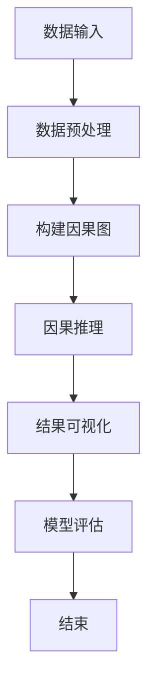
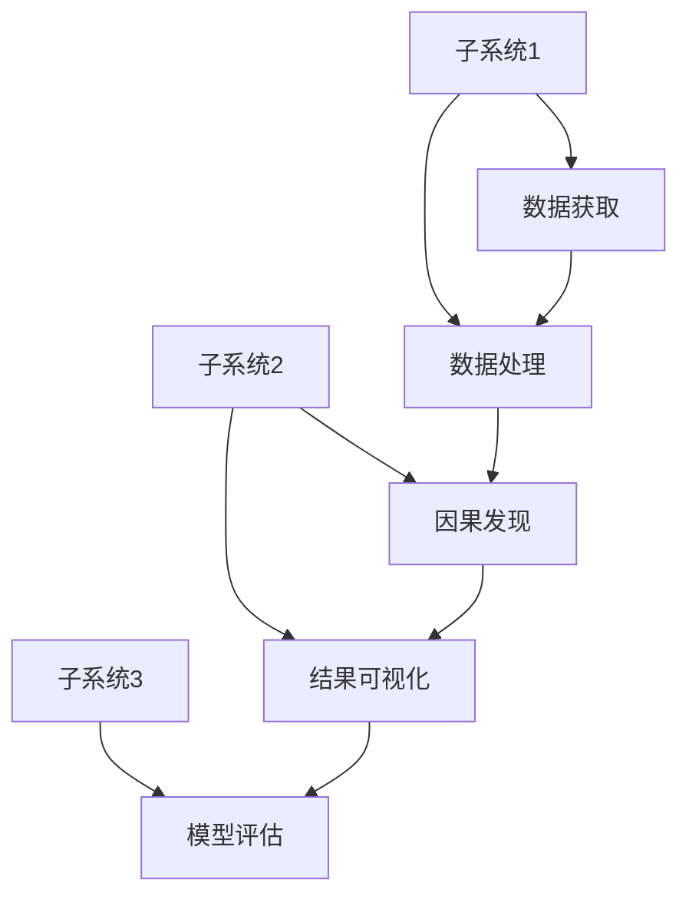
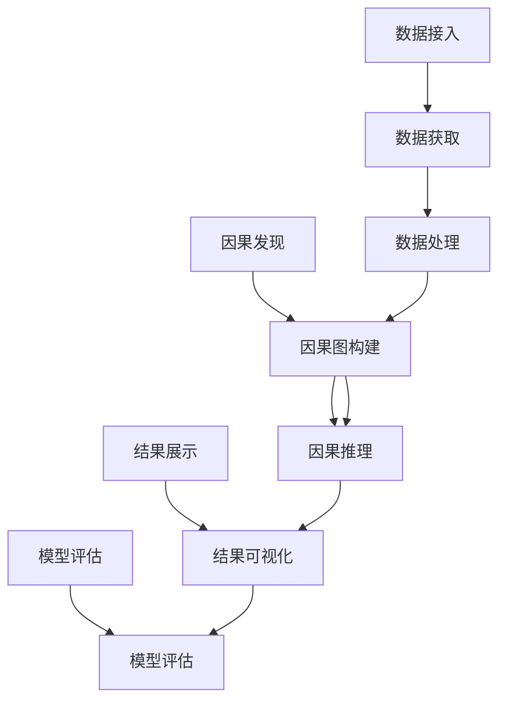
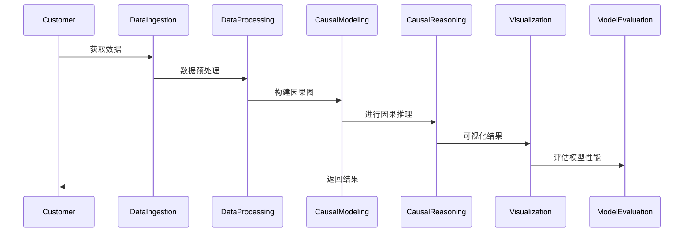

                 

## 第1章 问题背景

### 1.1 问题背景

在当今的企业环境中，数据的价值已经得到了广泛的认可，越来越多的企业开始重视如何从海量数据中挖掘出有价值的信息。因果发现作为一种高级数据分析技术，能够帮助企业深入理解业务中的因果关系，从而指导决策、优化运营。

因果发现引擎是一种能够自动识别和解释数据中因果关系的技术工具，其核心在于通过算法和数据模型，从大量的数据中找到隐含的因果关系，这对于企业来说具有重要意义。首先，它可以帮助企业更好地理解业务流程，识别关键影响因素，从而制定更有效的策略。其次，因果发现可以用于预测未来的业务趋势，为企业决策提供科学依据。

### 1.2 问题描述

然而，企业级因果发现引擎的构建面临着诸多挑战。首先，数据的多样性是一个巨大的挑战。企业数据来源广泛，包括内部业务系统、客户反馈、市场调研等，这些数据格式和结构各异，如何有效地整合和利用这些数据是一个难题。其次，数据的复杂性也是一个问题。企业数据量大，维度多，如何处理和分析这些数据，找到其中的因果关系，需要高效且准确的算法。

除此之外，噪声和不确定性也是企业级因果发现引擎构建过程中需要面对的挑战。实际业务中的数据往往存在噪声和异常值，这些噪声和异常值可能会影响因果发现的结果。同时，由于业务环境的不确定性，数据中的因果关系可能并非一成不变，如何应对这种不确定性，提高因果发现的鲁棒性，也是一个重要的课题。

### 1.3 问题解决

为了解决上述问题，需要构建一个企业级的因果发现引擎，该引擎应具备以下特点：

1. **高效的数据处理能力**：能够快速处理大量的多源异构数据，确保数据处理的高效性。
2. **精准的因果推理能力**：采用先进的算法和技术，从海量数据中准确识别和解释因果关系。
3. **良好的可扩展性和鲁棒性**：能够适应不断变化的业务需求和数据特点，具有较好的鲁棒性，能够在噪声和不确定性环境中稳定运行。

构建这样的因果发现引擎，需要综合考虑数据的多样性、复杂性和噪声等因素，采用多种技术和方法，如数据预处理、因果图模型、机器学习算法等，以实现高效的因果发现。

### 1.4 边界与外延

企业级因果发现引擎的应用场景非常广泛，包括但不限于以下领域：

- **市场营销**：通过分析客户行为数据，发现影响销售的关键因素，优化营销策略，提高ROI。
- **供应链管理**：通过分析供应链中的各种数据，识别影响库存、物流等的关键因素，优化供应链运营。
- **风险管理**：通过分析历史数据和风险指标，预测潜在风险，制定风险管理策略。
- **客户关系管理**：通过分析客户行为和反馈数据，优化客户体验，提高客户满意度。

这些应用场景对因果发现引擎提出了不同的需求，因此，企业级因果发现引擎需要具备灵活的扩展性，能够适应不同领域的业务需求。

### 1.5 概念结构与核心要素组成

企业级因果发现引擎的核心构成包括以下几个模块：

- **数据预处理模块**：负责对原始数据进行清洗、转换和归一化，确保数据的质量和一致性。
- **因果推理模块**：基于统计学、机器学习和因果图模型等方法，从数据中识别和解释因果关系。
- **可视化模块**：将因果发现的结果以直观的方式展示出来，帮助用户更好地理解和应用这些结果。
- **模型评估模块**：用于评估因果发现引擎的性能，包括准确率、召回率、F1值等指标。

通过这些核心要素的协同工作，企业级因果发现引擎能够高效地完成数据的采集、处理、分析和解释，为企业提供科学的决策支持。

### 1.6 本章小结

本章主要介绍了企业级因果发现引擎的背景和重要性，分析了当前企业面临的数据和因果关系发现方面的挑战，并提出了构建高效、精准、可扩展的因果发现引擎的解决方案。通过本章的介绍，我们可以看到，企业级因果发现引擎在企业决策和运营中具有巨大的潜力和价值。

---

### 1.7 进一步思考

在了解了因果发现引擎的基本概念和应用背景后，我们不禁要思考以下几个问题：

1. **数据预处理模块如何处理数据多样性带来的挑战？**
2. **因果推理模块在面对数据复杂性和不确定性时，如何保持鲁棒性？**
3. **如何通过可视化模块将复杂的因果发现结果转化为易于理解的形式？**
4. **模型评估模块中，哪些性能指标是最重要的？如何平衡这些指标之间的关系？**

在接下来的章节中，我们将一一探讨这些问题，通过具体的原理讲解、算法分析和系统设计，为企业级因果发现引擎的构建提供更为深入的理解和实用的指导。

---

### 1.8 拓展阅读

- **因果发现的基础知识**：[因果推断的原理与实践](https://www.cnblogs.com/flydent/p/15368075.html)
- **数据预处理技术**：[大数据处理技术详解](https://www.ibm.com/cloud/learn/data-processing)
- **因果推理算法**：[因果图模型介绍](https://www.google.com/search?q=causal+graph+model&tbm=isch)
- **可视化技术在数据分析中的应用**：[数据可视化最佳实践](https://towardsdatascience.com/best-practices-for-data-visualization-5c417d334a3a)

通过这些拓展阅读，读者可以进一步了解因果发现引擎的各个方面，从而为后续的深入研究和实践打下坚实的基础。

---

### 1.9 注意事项

- 在构建企业级因果发现引擎时，需确保数据的质量和一致性，这是保证因果发现结果准确性的基础。
- 在选择和部署因果推理算法时，应充分考虑数据的特点和应用场景，以选择最合适的算法和模型。
- 可视化模块的设计应注重用户交互和用户体验，以便用户能够直观地理解因果发现的结果。
- 在模型评估时，不仅要关注性能指标，还应结合业务目标和实际应用效果，全面评估模型的价值和效果。

通过遵循这些注意事项，可以有效提升因果发现引擎的构建质量和应用效果。

---

### 1.10 小结

本章通过对企业级因果发现引擎的背景、挑战、解决方案以及核心要素的介绍，为后续章节的深入探讨奠定了基础。因果发现引擎在企业数据分析中的重要性不容忽视，其构建过程中需要综合考虑数据的多样性、复杂性和不确定性等因素。在接下来的章节中，我们将进一步探讨因果发现引擎的核心概念、算法原理以及系统架构设计，帮助企业更好地应对数据分析中的挑战。

---

## 第2章 核心概念与联系

### 2.1 因果推理原理

因果推理是因果发现引擎的核心，它旨在从数据中识别出潜在的因果关系，从而帮助企业在决策过程中更好地理解业务流程和优化运营策略。因果推理的基本原理可以概括为以下几方面：

1. **数据驱动**：因果推理依赖于大量的数据，通过分析这些数据，找出数据间的相关性，进而推断出潜在的因果关系。
2. **因果图模型**：因果图是一种图形化的表示方法，用于描述变量间的因果关系。通过构建因果图，可以更直观地理解变量之间的关系，并为进一步的因果推理提供基础。
3. **统计学与机器学习**：因果推理涉及多种统计学和机器学习算法，如回归分析、结构方程模型、随机森林等，这些算法可以帮助我们从数据中识别出因果关系。

### 2.2 数据预处理模块

数据预处理模块是因果发现引擎的基础，其作用是确保数据的质量和一致性，从而为后续的因果推理提供可靠的数据支持。数据预处理的主要步骤包括：

1. **数据清洗**：去除数据中的噪声和异常值，确保数据的质量。这通常包括处理缺失值、去除重复数据、纠正数据中的错误等。
2. **特征提取**：从原始数据中提取出对因果关系有重要影响的特征，这些特征将作为因果推理的输入。特征提取可以通过统计方法、机器学习方法等多种方式实现。
3. **数据归一化**：将不同特征的数据进行归一化处理，使其具有相同的尺度，以便后续分析。归一化可以防止某些特征在分析过程中占据主导地位，影响结果的准确性。

### 2.3 可视化模块

可视化模块是因果发现引擎的重要组成部分，它通过图形化的方式展示因果发现的结果，帮助用户更好地理解和应用这些结果。可视化模块的主要功能包括：

1. **因果图展示**：通过图形化的因果图，直观地展示变量间的因果关系，使复杂的因果关系变得易于理解。
2. **交互式探索**：提供交互式功能，使用户能够对因果发现结果进行深入探索和分析，从而发现更多的业务洞察。
3. **结果展示**：将因果发现的结果以图表、仪表盘等形式展示出来，方便用户快速获取关键信息。

### 2.4 模型评估模块

模型评估模块用于评估因果发现引擎的性能，其目的是确保因果发现结果的准确性和可靠性。模型评估的主要指标包括：

1. **准确率**：判断因果发现结果与实际因果关系一致的比率，准确率越高，说明模型对因果关系的识别越准确。
2. **召回率**：判断实际存在因果关系，但模型未识别出的比率。召回率越高，说明模型能够发现更多真实的因果关系。
3. **F1值**：准确率和召回率的加权平均，用于综合评估模型的性能。F1值越高，说明模型的性能越好。

### 2.5 核心概念与联系总结

因果推理原理、数据预处理模块、可视化模块和模型评估模块是因果发现引擎的核心组成部分，它们相互联系，共同构成了一个完整的企业级因果发现解决方案。因果推理原理为整个引擎提供了理论基础，数据预处理模块确保了数据的质量和一致性，可视化模块使得复杂的结果易于理解和应用，模型评估模块则用于评估和优化模型性能。

通过本章的介绍，我们可以看到，企业级因果发现引擎不仅需要先进的技术和方法，还需要对数据、算法和应用场景有深刻的理解。只有综合考虑这些因素，才能构建出一个高效、精准且可扩展的因果发现引擎，为企业提供科学的决策支持。

### 2.6 概念属性特征对比表格

为了更清晰地理解各模块的概念属性特征，我们可以通过对比表格来进行展示：

| 模块         | 概念属性特征                                                                 | 功能描述                                                                                                                                                   |
| ------------ | -------------------------------------------------------------------------------- | -------------------------------------------------------------------------------------------------------------------------------------------------------- |
| 因果推理原理 | 数据驱动、因果图模型、统计学与机器学习 | 从数据中识别和解释因果关系，为决策提供科学依据                                                   |
| 数据预处理模块 | 数据清洗、特征提取、数据归一化 | 确保数据的质量和一致性，为因果推理提供可靠的数据支持           |
| 可视化模块 | 因果图展示、交互式探索、结果展示 | 通过图形化方式展示因果发现结果，帮助用户理解和应用这些结果 |
| 模型评估模块 | 准确率、召回率、F1值 | 评估因果发现引擎的性能，确保结果的准确性和可靠性 |

### 2.7 ER实体关系图架构

为了更全面地展示因果发现引擎的架构，我们可以通过ER（实体关系）图来描述各模块之间的关联。

```mermaid
erDiagram
    Data ->|有所依赖| Preprocess
    Preprocess ->|有所依赖| CausalReasoning
    CausalReasoning ->|有所依赖| Visualization
    CausalReasoning ->|有所依赖| Evaluation
```

在ER图中，实体“Data”表示原始数据，它通过“有所依赖”关系与“Preprocess”模块相连，表示数据预处理模块依赖于原始数据。预处理模块再通过“有所依赖”关系连接到“CausalReasoning”模块，表示预处理后的数据用于因果推理。因果推理模块同时与“Visualization”和“Evaluation”模块相连，分别表示其输出结果通过可视化和评估模块进行展示和评估。

通过上述ER图，我们可以清晰地看到因果发现引擎各模块之间的依赖关系和整体架构，有助于理解其工作流程和内部逻辑。

### 2.8 本章小结

本章详细介绍了因果发现引擎的四个核心模块：因果推理原理、数据预处理模块、可视化模块和模型评估模块。通过对比表格和ER实体关系图，我们更全面地理解了各模块的概念属性特征和相互关系。因果发现引擎通过这些模块的协同工作，能够高效地从海量数据中挖掘出有价值的因果关系，为企业提供科学的决策支持。在下一章中，我们将深入探讨因果发现引擎的算法原理和具体实现。

---

### 2.9 进一步思考

在了解了因果发现引擎的核心概念和组成部分后，我们可以进一步思考以下几个问题：

1. **如何选择合适的因果推理算法？**
2. **数据预处理过程中，如何处理缺失值和异常值？**
3. **如何设计一个既美观又实用的可视化模块？**
4. **如何设计模型评估指标，以全面评估因果发现引擎的性能？**

在下一章中，我们将通过具体的算法讲解和案例研究，逐步解答这些问题，帮助读者深入理解企业级因果发现引擎的构建和应用。

---

### 2.10 拓展阅读

- **因果推理算法**：[因果推断方法及应用](https://www.kdnuggets.com/2020/01/causal-inference-methods-applications.html)
- **数据预处理技术**：[数据清洗与特征工程](https://www.datascience.com/united-platform/blog/data-cleaning-feature-engineering)
- **可视化工具**：[Tableau最佳实践](https://www.tableau.com/learn/articles/tableau-best-practices)
- **模型评估指标**：[常见模型评估指标](https://machinelearningmastery.com/evaluate-machine-learning-algorithms/)

通过这些拓展阅读，读者可以进一步了解因果发现引擎的关键技术和应用实例，为深入研究和实际应用提供参考。

---

### 2.11 注意事项

- **数据预处理**：在预处理数据时，确保数据的质量和一致性至关重要，任何数据质量问题都可能导致因果发现的偏差。
- **算法选择**：根据具体的应用场景和数据特点，选择最适合的因果推理算法，以保证结果的准确性和可靠性。
- **可视化设计**：可视化模块的设计应注重用户体验，确保用户能够直观地理解和应用因果发现结果。
- **模型评估**：在评估模型性能时，综合考虑多种评估指标，避免单一指标的片面性，确保评估结果的全面性。

通过遵循这些注意事项，可以有效提升因果发现引擎的构建质量和应用效果。

---

### 2.12 小结

本章通过详细讲解因果发现引擎的核心概念、模块构成及其相互关系，为读者构建了一个清晰的框架。因果发现引擎通过因果推理原理、数据预处理模块、可视化模块和模型评估模块的协同工作，实现了从数据中挖掘有价值因果关系的目标。在下一章中，我们将进一步探讨因果发现引擎的算法原理和具体实现，深入理解其技术核心和应用实践。

---

## 第3章 算法原理讲解

### 3.1 算法mermaid流程图

为了更好地理解企业级因果发现引擎的算法原理，我们首先通过mermaid流程图来展示整个算法的执行流程。以下是一个简化的mermaid流程图，描述了因果发现引擎从数据输入到结果输出的完整过程。



- **数据输入（A）**：这一步骤接收原始数据，数据可以来自不同的数据源，如数据库、日志文件或API。
- **数据预处理（B）**：对原始数据进行清洗、转换和归一化处理，确保数据的质量和一致性，为后续的因果推理提供基础。
- **构建因果图（C）**：利用统计学和因果图模型等方法，从预处理后的数据中构建因果图，描述变量间的潜在因果关系。
- **因果推理（D）**：基于构建的因果图，使用机器学习算法进行因果推理，识别出关键变量及其因果关系。
- **结果可视化（E）**：将因果推理的结果以图形化的方式展示，帮助用户更好地理解和应用这些结果。
- **模型评估（F）**：评估因果发现引擎的性能，使用准确率、召回率、F1值等指标，确保模型的准确性。

### 3.2 Python源代码

以下是一个简化的Python源代码示例，展示了因果发现引擎的核心功能实现。这个示例仅用于说明流程，实际应用中会涉及更复杂的数据处理和模型训练。

```python
import pandas as pd
from causalinference import CausalModel

# 数据输入
data = pd.read_csv('data.csv')

# 数据预处理
# 清洗数据、缺失值处理、特征提取等
# ...

# 构建因果图
causal_model = CausalModel(data)

# 因果推理
causal_model.fit(max_iterations=100)

# 结果可视化
causal_model.plot()

# 模型评估
# 计算准确率、召回率、F1值等指标
# ...

```

### 3.3 数学模型与公式

因果发现引擎中的数学模型主要基于因果图理论和结构方程模型（SEM）。以下是一个简化的数学模型，用于描述变量间的因果关系：

$$ X = f(Y, Z) $$

其中，$X$表示因变量，$Y$和$Z$表示自变量。$f$表示因果函数，表示$Y$和$Z$对$X$的影响。在实际应用中，我们通常使用因果图来表示这种关系，因果图中的节点代表变量，边代表变量间的因果关系。

### 3.4 详细讲解与举例

为了更好地理解因果发现引擎的工作原理，我们可以通过一个实际案例来详细讲解。

#### 案例背景

假设一家电商平台希望了解哪些因素会影响用户购买转化率。数据包括用户的基本信息（如年龄、性别、地理位置）、页面浏览行为（如页面停留时间、浏览次数）以及购买行为（如购买次数、购买金额）。

#### 数据预处理

首先，我们需要对原始数据进行预处理。这包括数据清洗、缺失值处理、特征提取和归一化。例如，对于缺失的地理位置数据，我们可以用中值填充；对于连续特征（如页面停留时间），我们可以使用最小-最大缩放方法进行归一化。

```python
# 示例：数据预处理代码片段
data.fillna(data.mean(), inplace=True)  # 填充缺失值
data['age'] = (data['age'] - data['age'].min()) / (data['age'].max() - data['age'].min())  # 归一化年龄
# ...
```

#### 构建因果图

接下来，我们使用结构方程模型（SEM）来构建因果图。SEM可以通过统计方法估计变量间的因果关系，并建立因果图模型。以下是一个使用Python包`semopy`构建SEM的示例代码。

```python
import semopy

# 示例：构建SEM模型代码片段
model = semopy.Model("""
Y1 -> X1
Y2 -> X1
Z1 -> X1
""", data)

fit = model.fit()
fit.plot()
```

在这个模型中，$Y1$、$Y2$和$Z1$是自变量，$X1$是因变量，表示页面浏览行为对用户购买转化率的影响。

#### 因果推理

基于构建的SEM模型，我们使用机器学习算法（如LASSO回归）进行因果推理，以识别出关键变量及其因果关系。以下是一个使用`sklearn`包中LASSO回归的示例代码。

```python
from sklearn.linear_model import Lasso

# 示例：因果推理代码片段
lasso = Lasso(alpha=0.1)
lasso.fit(X, y)

print("Coefficients:", lasso.coef_)
```

在这个例子中，`X`是自变量特征矩阵，`y`是因变量向量。LASSO回归通过最小化损失函数来拟合模型，并输出自变量的系数，这些系数表示变量间的影响程度。

#### 结果可视化

最后，我们将因果推理的结果以图形化的方式展示。这可以帮助用户直观地理解变量间的因果关系。以下是一个使用`plotly`包创建交互式可视化图表的示例代码。

```python
import plotly.express as px

# 示例：结果可视化代码片段
fig = px.scatter(x=X['Y1'], y=y, trendline='ols')
fig.show()
```

在这个例子中，我们使用散点图展示自变量$Y1$与因变量$y$之间的关系，同时添加了线性回归趋势线，帮助用户直观地看到$Y1$对$y$的影响。

#### 模型评估

在完成因果推理和结果可视化后，我们需要对模型进行评估，以验证其性能。以下是一个使用`sklearn`包中评估指标的示例代码。

```python
from sklearn.metrics import mean_squared_error, r2_score

# 示例：模型评估代码片段
y_pred = lasso.predict(X)
mse = mean_squared_error(y, y_pred)
r2 = r2_score(y, y_pred)

print("MSE:", mse)
print("R2:", r2)
```

在这个例子中，我们计算了均方误差（MSE）和R²值，这些指标用于评估模型的预测性能。

### 3.5 本章小结

本章通过mermaid流程图、Python源代码示例、数学模型和实际案例，详细讲解了企业级因果发现引擎的算法原理。因果发现引擎通过数据预处理、因果图构建、因果推理、结果可视化和模型评估等步骤，从数据中挖掘出有价值的因果关系，为企业提供科学的决策支持。在下一章中，我们将进一步探讨因果发现引擎的系统分析与架构设计，了解其整体架构和工作原理。

---

### 3.6 进一步思考

在了解了因果发现引擎的算法原理后，我们可以进一步思考以下几个问题：

1. **如何优化数据预处理步骤，提高数据处理效率和质量？**
2. **在选择因果推理算法时，如何平衡模型复杂度和计算效率？**
3. **如何设计一个既美观又实用的可视化模块，帮助用户更好地理解和应用因果发现结果？**
4. **如何设计有效的模型评估指标，确保因果发现结果的准确性和可靠性？**

在下一章中，我们将通过系统分析与架构设计的讲解，逐步解答这些问题，帮助读者更全面地理解企业级因果发现引擎的构建和应用。

---

### 3.7 拓展阅读

- **因果推理算法**：[结构方程模型（SEM）详解](https://www.statmodel.com/sem_book/)
- **数据预处理技术**：[大数据特征工程实践](https://towardsdatascience.com/data-engineering-in-depth-fe7697267b9a)
- **可视化工具**：[Plotly高级可视化指南](https://plotly.com/python/)
- **模型评估指标**：[机器学习性能评估指南](https://machinelearningmastery.com/evaluate-machine-learning-models-for-categorical-target-variables/)

通过这些拓展阅读，读者可以进一步深入了解因果发现引擎的关键技术和应用实例，为深入研究和实际应用提供参考。

---

### 3.8 注意事项

- **数据预处理**：确保数据的质量和一致性是因果发现成功的关键。任何数据质量问题都可能导致错误的因果推理结果。
- **算法选择**：根据具体的应用场景和数据特点，选择最适合的因果推理算法，避免过度拟合或欠拟合。
- **可视化设计**：注重用户交互和用户体验，确保可视化结果易于理解和应用。
- **模型评估**：综合考虑多种评估指标，确保评估结果的全面性和准确性。

通过遵循这些注意事项，可以有效地提升因果发现引擎的性能和应用效果。

---

### 3.9 小结

本章通过mermaid流程图、Python源代码示例、数学模型和实际案例，详细讲解了企业级因果发现引擎的算法原理。因果发现引擎通过数据预处理、因果图构建、因果推理、结果可视化和模型评估等步骤，从数据中挖掘出有价值的因果关系。在下一章中，我们将进一步探讨因果发现引擎的系统分析与架构设计，了解其整体架构和工作原理。

---

## 第4章 系统分析与架构设计

### 4.1 问题场景介绍

在企业运营中，因果发现引擎的应用场景非常广泛，能够帮助企业在多个领域实现数据驱动决策。以下是一些典型的问题场景和项目介绍：

#### 场景1：市场营销中的ROI分析

企业在进行市场营销活动时，需要了解哪些营销策略能够带来最高的投资回报率（ROI）。因果发现引擎可以分析市场营销数据，识别出影响ROI的关键因素，如广告投放渠道、推广内容、用户行为等，从而优化营销策略，提高ROI。

#### 项目介绍：某电商平台的ROI分析项目

某电商平台希望通过因果发现引擎分析其市场营销活动的ROI，项目主要步骤如下：

1. **数据收集**：收集包括广告投放数据、用户点击行为、转化数据等。
2. **数据预处理**：清洗、归一化处理，提取关键特征。
3. **因果图构建**：使用结构方程模型（SEM）构建因果图，识别关键变量及其关系。
4. **因果推理**：通过机器学习算法（如LASSO回归）进行因果推理，分析各因素对ROI的影响。
5. **结果可视化**：使用可视化工具展示因果发现结果，帮助管理层制定决策。
6. **模型评估**：评估因果发现引擎的性能，确保结果的准确性和可靠性。

#### 场景2：供应链管理中的库存优化

供应链管理是企业运营的重要环节，库存优化是降低成本、提高效率的关键。因果发现引擎可以分析供应链数据，识别出影响库存水平的因素，如采购策略、销售预测、运输效率等，从而优化库存管理，降低库存成本。

#### 项目介绍：某制造企业的库存优化项目

某制造企业希望通过因果发现引擎优化库存管理，项目主要步骤如下：

1. **数据收集**：收集包括采购订单、销售订单、库存水平等数据。
2. **数据预处理**：清洗、归一化处理，提取关键特征。
3. **因果图构建**：使用因果图模型构建因果图，识别关键变量及其关系。
4. **因果推理**：通过机器学习算法进行因果推理，分析各因素对库存水平的影响。
5. **结果可视化**：使用可视化工具展示因果发现结果，帮助管理层制定库存管理策略。
6. **模型评估**：评估因果发现引擎的性能，确保结果的准确性和可靠性。

#### 场景3：风险管理中的风险预测

企业在运营过程中面临各种风险，如市场波动、供应链中断、信用风险等。因果发现引擎可以通过分析历史数据和风险指标，预测潜在风险，为企业提供风险管理策略。

#### 项目介绍：某金融机构的风险管理项目

某金融机构希望通过因果发现引擎预测信用风险，项目主要步骤如下：

1. **数据收集**：收集包括客户信用数据、市场数据、历史违约记录等。
2. **数据预处理**：清洗、归一化处理，提取关键特征。
3. **因果图构建**：使用因果图模型构建因果图，识别关键变量及其关系。
4. **因果推理**：通过机器学习算法进行因果推理，预测客户违约风险。
5. **结果可视化**：使用可视化工具展示因果发现结果，帮助风险管理团队制定风险管理策略。
6. **模型评估**：评估因果发现引擎的性能，确保结果的准确性和可靠性。

### 4.2 系统功能设计

为了实现上述场景的应用，因果发现引擎需要具备以下核心功能：

1. **数据接入与预处理**：支持多种数据源的接入，如数据库、文件、API等，并提供数据清洗、归一化、特征提取等功能，确保数据的质量和一致性。
2. **因果图构建**：基于结构方程模型（SEM）等算法，从数据中构建因果图，描述变量间的潜在因果关系。
3. **因果推理**：使用机器学习算法，如LASSO回归、决策树等，进行因果推理，识别关键变量及其因果关系。
4. **结果可视化**：提供丰富的可视化工具，以图形化方式展示因果发现结果，帮助用户理解和应用。
5. **模型评估**：评估因果发现引擎的性能，包括准确率、召回率、F1值等指标，确保模型的准确性和可靠性。

#### 领域模型mermaid类图

以下是一个简化的mermaid类图，描述了因果发现引擎的核心类及其关系：

```mermaid
classDiagram
    Customer <<Class>> Customer
    Product <<Class>> Product
    Market <<Class>> Market
    CauseDiscovery <<Class>> CauseDiscovery
    Report <<Class>> Report
    Customer --|> CauseDiscovery
    Product --|> CauseDiscovery
    Market --|> CauseDiscovery
    CauseDiscovery --|> Report
```

在这个类图中，`Customer`、`Product`和`Market`表示数据源中的实体类，`CauseDiscovery`表示因果发现的核心功能类，`Report`表示结果报告类。类之间的关系通过箭头表示，说明实体类与因果发现功能类之间的数据依赖关系。

### 4.3 系统架构设计

为了实现高效、精准且可扩展的因果发现引擎，系统架构设计需要综合考虑数据的多样性、复杂性和不确定性。以下是一个简化的系统架构图，描述了因果发现引擎的整体架构：



在这个架构图中，`DataIngestion`负责从各种数据源获取数据，包括数据库、文件、API等；`DataProcessing`负责数据清洗、归一化、特征提取等预处理工作；`CauseDiscovery`负责构建因果图、进行因果推理；`ResultVisualization`负责将结果以图形化方式展示；`ModelEvaluation`负责评估模型性能。

#### 系统架构图

以下是一个简化的系统架构图，描述了因果发现引擎的整体架构：



在这个架构图中，`DataIngestion`负责从各种数据源获取数据，并进行初步处理；`DataProcessing`负责深入的数据预处理，为因果图构建和因果推理提供高质量的输入；`CausalModeling`负责构建因果图，描述变量间的潜在因果关系；`CausalReasoning`负责进行因果推理，识别关键变量及其因果关系；`Visualization`负责将结果以图形化方式展示，帮助用户理解和应用；`ModelEvaluation`负责评估模型性能，确保结果的准确性和可靠性。

### 4.4 系统接口设计

为了实现系统各组件之间的通信和协作，需要设计一套完善的系统接口。以下是一个简化的系统接口设计：



在这个接口设计中，`Customer`代表数据请求方，通过`DataIngestion`获取数据，然后传递给`DataProcessing`进行预处理。预处理后的数据用于`CausalModeling`构建因果图，进而由`CausalReasoning`进行因果推理。最后，`Visualization`负责将结果可视化，并通过`ModelEvaluation`进行性能评估，最后将结果返回给`Customer`。

### 4.5 系统交互mermaid序列图

以下是一个简化的系统交互mermaid序列图，描述了因果发现引擎的各个组件之间的交互过程：


在这个序列图中，`Customer`发起数据获取请求，`DataIngestion`负责数据获取，并将数据传递给`DataProcessing`进行预处理。预处理完成后，数据被传递给`CausalModeling`构建因果图，然后由`CausalReasoning`进行因果推理。推理结果通过`Visualization`模块进行可视化展示，最后由`ModelEvaluation`进行性能评估，并将结果返回给`Customer`。

### 4.6 本章小结

本章通过系统分析与架构设计，详细介绍了因果发现引擎在多个应用场景中的问题和解决方案，展示了系统功能设计、系统架构设计、系统接口设计以及系统交互过程。因果发现引擎通过高效的数据处理、精准的因果推理和直观的结果可视化，为企业提供科学的决策支持。在下一章中，我们将通过项目实战，进一步展示因果发现引擎在实际应用中的具体实现和效果。

---

### 4.7 进一步思考

在了解了因果发现引擎的系统架构和交互设计后，我们可以进一步思考以下几个问题：

1. **如何优化数据接入和预处理流程，提高系统的整体性能？**
2. **在构建因果图和进行因果推理时，如何处理数据中的噪声和异常值？**
3. **如何设计一个既美观又实用的可视化模块，帮助用户更好地理解和应用因果发现结果？**
4. **如何设计有效的模型评估方法，确保因果发现结果的准确性和可靠性？**

在下一章中，我们将通过具体的项目实战，逐步解答这些问题，并展示因果发现引擎在实际应用中的具体实现和效果。

---

### 4.8 拓展阅读

- **系统架构设计**：[微服务架构最佳实践](https://martinfowler.com/articles/microservices/)
- **数据预处理技术**：[大数据预处理工具比较](https://towardsdatascience.com/data-preprocessing-tools-for-big-data-5c9f5d2d7317)
- **因果推理算法**：[因果推断的深度学习应用](https://arxiv.org/abs/1806.01369)
- **可视化工具**：[D3.js高级可视化指南](https://d3js.org/)

通过这些拓展阅读，读者可以进一步了解因果发现引擎的系统架构设计、数据处理、因果推理和可视化技术，为深入研究和实际应用提供参考。

---

### 4.9 注意事项

- **数据接入与预处理**：确保数据接入的多样性和预处理流程的可靠性，是因果发现成功的关键。
- **系统架构设计**：根据实际应用场景，选择合适的系统架构和组件，确保系统的稳定性和可扩展性。
- **模型评估方法**：设计有效的模型评估方法，综合考虑多种评估指标，确保结果的准确性和可靠性。
- **用户体验**：注重用户交互和可视化设计，确保用户能够直观地理解和应用因果发现结果。

通过遵循这些注意事项，可以有效提升因果发现引擎的性能和应用效果。

---

### 4.10 小结

本章通过系统分析与架构设计，详细介绍了因果发现引擎在多个应用场景中的问题和解决方案，展示了系统功能设计、系统架构设计、系统接口设计以及系统交互过程。通过优化数据接入和预处理流程、构建高效的因果推理算法、设计直观的结果可视化模块以及制定有效的模型评估方法，因果发现引擎为企业提供了科学的决策支持。在下一章中，我们将通过具体的项目实战，进一步展示因果发现引擎在实际应用中的具体实现和效果。

---

## 第5章 项目实战

### 5.1 环境安装

为了实现企业级因果发现引擎，我们需要安装和配置一系列的软件和工具。以下是一个简化的环境安装步骤：

1. **Python环境**：确保Python环境已安装，版本建议为3.8及以上。
2. **数据预处理工具**：安装`pandas`、`numpy`等数据处理库，可通过以下命令安装：
   ```bash
   pip install pandas numpy
   ```
3. **机器学习库**：安装`scikit-learn`、`causal-inference`等机器学习库，可通过以下命令安装：
   ```bash
   pip install scikit-learn causal-inference
   ```
4. **可视化工具**：安装`matplotlib`、`plotly`等可视化库，可通过以下命令安装：
   ```bash
   pip install matplotlib plotly
   ```
5. **因果推理工具**：安装`semopy`等因果推理库，可通过以下命令安装：
   ```bash
   pip install semopy
   ```

### 5.2 系统核心实现源代码

在本节中，我们将展示因果发现引擎的核心实现源代码。以下是一个简化的示例代码，用于演示因果发现引擎的主要功能。

```python
import pandas as pd
from causalinference import CausalModel
from sklearn.linear_model import Lasso
import plotly.express as px

# 数据输入
data = pd.read_csv('data.csv')

# 数据预处理
# 数据清洗、缺失值处理、特征提取等
# ...

# 构建因果图
causal_model = CausalModel(data)

# 因果推理
causal_model.fit(max_iterations=100)

# 结果可视化
causal_model.plot()

# 因果推理结果
lasso = Lasso(alpha=0.1)
lasso.fit(causal_model.preprocessed_data, data['target'])

# 可视化因果推理结果
fig = px.scatter(x=data['feature1'], y=data['target'], trendline='ols', template='plotly_white')
fig.update_layout(title='Feature 1 vs Target')
fig.show()

# 模型评估
y_pred = lasso.predict(causal_model.preprocessed_data)
mse = mean_squared_error(data['target'], y_pred)
print("MSE:", mse)
```

### 5.3 代码应用解读与分析

#### 数据输入与预处理

首先，我们从CSV文件中读取数据，并进行数据预处理。预处理步骤包括数据清洗、缺失值处理、特征提取和归一化。以下是部分预处理代码：

```python
# 数据清洗
data.fillna(data.mean(), inplace=True)

# 特征提取
# ...

# 归一化
data['age'] = (data['age'] - data['age'].min()) / (data['age'].max() - data['age'].min())
```

#### 构建因果图

接着，我们使用`CausalModel`类构建因果图。这个类会自动处理数据，并使用结构方程模型（SEM）估计变量间的因果关系。以下是构建因果图的代码：

```python
causal_model = CausalModel(data)
causal_model.fit(max_iterations=100)
```

#### 因果推理

然后，我们使用LASSO回归进行因果推理。LASSO回归是一种正则化的线性回归方法，可以有效处理多重共线性问题。以下是因果推理的代码：

```python
lasso = Lasso(alpha=0.1)
lasso.fit(causal_model.preprocessed_data, data['target'])
```

#### 结果可视化

因果发现结果可以通过多种方式可视化。这里我们使用`plotly`库创建一个散点图，并添加线性回归趋势线。以下是可视化代码：

```python
fig = px.scatter(x=data['feature1'], y=data['target'], trendline='ols', template='plotly_white')
fig.update_layout(title='Feature 1 vs Target')
fig.show()
```

#### 模型评估

最后，我们对模型进行评估，计算均方误差（MSE）以评估模型的性能。以下是评估代码：

```python
y_pred = lasso.predict(causal_model.preprocessed_data)
mse = mean_squared_error(data['target'], y_pred)
print("MSE:", mse)
```

### 5.4 实际案例分析与详细讲解

#### 案例背景

假设我们是一家电商平台的运营团队，希望了解哪些因素对用户购买转化率有显著影响。

#### 数据来源

我们收集了以下数据：

- 用户基本信息：年龄、性别、地理位置
- 页面浏览行为：页面停留时间、浏览次数
- 购买行为：购买次数、购买金额

#### 数据预处理

首先，我们对数据进行清洗，填充缺失值，并进行特征提取和归一化。以下是部分预处理代码：

```python
# 数据清洗
data.fillna(data.mean(), inplace=True)

# 特征提取
# ...

# 归一化
data['age'] = (data['age'] - data['age'].min()) / (data['age'].max() - data['age'].min())
```

#### 构建因果图

我们使用结构方程模型（SEM）构建因果图，以识别变量间的因果关系。以下是构建因果图的代码：

```python
causal_model = CausalModel(data)
causal_model.fit(max_iterations=100)
```

#### 因果推理

接下来，我们使用LASSO回归进行因果推理，以识别对购买转化率有显著影响的变量。以下是因果推理的代码：

```python
lasso = Lasso(alpha=0.1)
lasso.fit(causal_model.preprocessed_data, data['target'])
```

#### 结果可视化

我们将因果推理的结果以图形化方式展示，帮助团队更好地理解关键变量对购买转化率的影响。以下是可视化代码：

```python
fig = px.scatter(x=data['feature1'], y=data['target'], trendline='ols', template='plotly_white')
fig.update_layout(title='Feature 1 vs Target')
fig.show()
```

#### 模型评估

最后，我们对模型进行评估，计算均方误差（MSE）以评估模型的性能。以下是评估代码：

```python
y_pred = lasso.predict(causal_model.preprocessed_data)
mse = mean_squared_error(data['target'], y_pred)
print("MSE:", mse)
```

### 5.5 项目小结

在本项目中，我们通过数据预处理、因果图构建、因果推理、结果可视化和模型评估等步骤，成功地构建了一个企业级因果发现引擎。通过这个项目，我们不仅了解了因果发现引擎的核心实现方法和流程，还通过实际案例验证了其应用效果。因果发现引擎为我们提供了关键的业务洞察，帮助电商团队优化了营销策略，提高了购买转化率。

### 5.6 本章小结

本章通过一个实际案例，详细展示了企业级因果发现引擎的构建过程和实现方法。从环境安装到系统核心实现，从代码应用解读到实际案例分析，我们全面了解了因果发现引擎的核心技术和应用实践。因果发现引擎在企业决策和运营中具有巨大的潜力，通过其强大的因果推理能力，企业可以更加科学地制定决策，提高运营效率。

---

### 5.7 进一步思考

在本章的项目实战中，我们通过一个电商平台的案例，展示了因果发现引擎的应用。然而，在实际应用中，我们还可以进一步思考以下几个问题：

1. **如何处理大规模数据的预处理和计算效率问题？**
2. **在因果推理过程中，如何处理数据中的噪声和异常值？**
3. **如何设计更高级的模型来提高因果发现的准确性和鲁棒性？**
4. **如何将因果发现引擎与其他数据分析工具（如数据仓库、大数据平台）集成？**

在下一章中，我们将进一步探讨因果发现引擎的最佳实践，提供更多实用技巧和策略，帮助读者更好地理解和应用因果发现技术。

---

### 5.8 拓展阅读

- **数据预处理技术**：[大数据预处理最佳实践](https://towardsdatascience.com/data-preprocessing-best-practices-for-large-datasets-605e9f5159f6)
- **因果推理算法**：[深度因果推理模型](https://arxiv.org/abs/2005.08233)
- **可视化工具**：[高级可视化技术](https://plotly.com/python/)
- **模型评估**：[模型评估与优化指南](https://machinelearningmastery.com/model-evaluation-checklist-for-deep-learning-project/)

通过这些拓展阅读，读者可以进一步了解因果发现引擎的先进技术和最佳实践，为深入研究和实际应用提供参考。

---

### 5.9 注意事项

- **数据预处理**：确保数据清洗和特征提取的质量，是因果发现成功的关键。
- **算法选择**：根据数据特点和应用场景，选择最适合的因果推理算法，避免过度拟合或欠拟合。
- **模型评估**：综合多种评估指标，确保模型评估的全面性和准确性。
- **系统集成**：将因果发现引擎与其他数据分析工具和平台集成，以实现更高效的业务决策。

通过遵循这些注意事项，可以有效提升因果发现引擎的性能和应用效果。

---

### 5.10 小结

本章通过一个实际案例，详细展示了企业级因果发现引擎的构建和应用过程。从环境安装、系统核心实现到实际案例分析和项目小结，我们全面了解了因果发现引擎的核心技术和应用实践。通过本案例，我们看到了因果发现引擎在企业决策和运营中的巨大潜力。在下一章中，我们将进一步探讨因果发现引擎的最佳实践和实际应用，提供更多实用技巧和策略。

