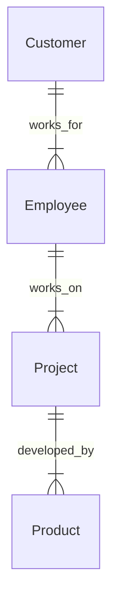
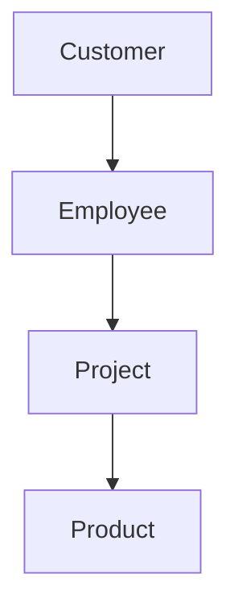
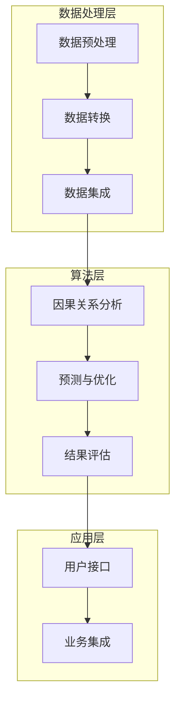
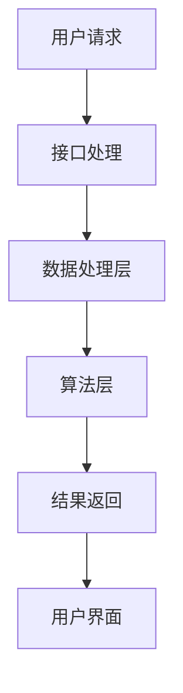

                 

### 文章标题

# 企业级因果推理AI：深入理解业务因果关系

> 关键词：因果推理AI、企业级应用、业务场景、数据分析、系统架构

> 摘要：本文深入探讨了企业级因果推理AI的背景、核心概念、应用实践、系统架构以及项目实战。通过逐步分析推理，本文旨在为企业级人工智能开发者提供全面的理论指导和实践参考，帮助其更好地理解和应用因果推理技术，提升业务决策的准确性和效率。

---

#### 第一部分：企业级因果推理AI的背景与核心概念

**第1章：企业级因果推理AI概述**

##### 1.1 问题背景

###### 1.1.1 传统数据分析的局限性

在传统的数据分析中，企业主要依赖统计方法和机器学习算法来分析和预测业务数据。然而，这些方法通常关注的是数据之间的关联关系，而非因果关系。这种关联关系可能导致误导性的结论，例如，观察到两个变量之间存在相关性，但无法确定其中一个变量是否真正导致另一个变量的变化。这种局限性限制了企业做出基于数据的准确决策。

###### 1.1.2 因果推理AI的应用场景

因果推理AI能够帮助企业更深入地理解业务数据中的因果关系，从而提高决策的准确性和效率。一些典型的应用场景包括：

- **客户行为分析**：通过分析客户行为数据，企业可以确定哪些因素真正影响客户的购买决策，从而优化营销策略。
- **销售预测与优化**：通过因果关系分析，企业可以识别出影响销售的关键因素，并采取相应的策略进行优化。
- **产品推荐**：因果推理AI可以帮助企业更好地理解用户对产品的偏好，从而提供更精准的产品推荐。

###### 1.1.3 因果推理AI在企业的迫切需求

随着大数据和人工智能技术的发展，企业面临着日益复杂的数据环境和业务挑战。因果推理AI作为一种新型的数据分析技术，能够帮助企业更深入地理解业务数据，从而做出更准确和有效的业务决策。因此，在当前竞争激烈的市场环境下，企业对因果推理AI的需求变得越来越迫切。

##### 1.2 问题定义

###### 1.2.1 因果关系与关联关系

因果关系是指一个事件或变量（称为原因）对另一个事件或变量（称为结果）的直接影响。关联关系是指两个或多个变量之间存在统计学上的相关性，但并不一定存在因果关系。

###### 1.2.2 因果推理AI的目标

因果推理AI的目标是建立和分析业务数据中的因果关系，以便为企业提供更准确和可靠的业务洞察。

###### 1.2.3 因果推理AI的边界与外延

因果推理AI的边界在于其依赖于高质量的输入数据和准确的因果关系假设。因果推理AI的外延包括各种算法和技术，如Do-Calculus、Potential Outcomes Framework等。

##### 1.3 解决方法

###### 1.3.1 因果推理理论框架

因果推理理论框架包括因果关系的定义、属性、验证方法和算法原理等。这些理论为因果推理AI的实践提供了理论基础。

###### 1.3.2 因果推理算法原理

因果推理算法主要分为基于Do-Calculus的方法和基于Potential Outcomes Framework的方法。这些算法通过数学模型和计算方法来分析业务数据中的因果关系。

###### 1.3.3 因果推理AI的系统构建

因果推理AI的系统构建涉及数据预处理、算法实现、结果评估和系统集成等步骤。这些步骤构成了因果推理AI的完整流程。

##### 1.4 核心概念与联系

###### 1.4.1 因果推理核心概念原理

因果推理的核心概念包括因果关系、因果图、因子化法则和可行性假设等。这些概念为因果推理AI的实践提供了关键的理论支持。

###### 1.4.2 因果推理概念属性特征对比表格

| 概念        | 定义                             | 特征                          |
|-----------|--------------------------------|-----------------------------|
| 因果关系   | 一个事件对另一个事件的直接影响    | 可传递性、独立性、方向性        |
| 因果图     | 描述变量之间因果关系的图形表示      | 完备性、无环性、方向性          |
| 因子化法则   | 因果关系分解为基本因子的方法       | 因子独立性、因子可分性          |
| 可行性假设   | 因果推理中的一种合理假设           | 实用性、合理性、可验证性          |

###### 1.4.3 因果推理的ER实体关系图架构



##### 1.5 本章小结

本章对企业级因果推理AI的背景、核心概念和解决方法进行了概述。因果推理AI作为一种新型的数据分析技术，在企业级应用中具有广阔的前景。在接下来的章节中，我们将深入探讨因果推理AI的理论原理、应用实践和系统实现。

---

#### 第二部分：因果推理AI的核心原理

**第2章：因果推理的基础理论**

##### 2.1 因果推理理论的发展历程

###### 2.1.1 传统因果推理方法

传统的因果推理方法主要包括逻辑推理和统计学方法。逻辑推理依赖于前提和结论之间的逻辑关系，而统计学方法则通过数据分析来识别变量之间的相关性。然而，这些方法在处理复杂业务数据时存在一定的局限性。

###### 2.1.2 因果推断与机器学习

因果推断与机器学习相结合，形成了一种新的因果推理方法。机器学习算法能够从数据中学习出变量之间的关系，而因果推断则能够确定这些关系的因果关系。这种方法在处理复杂业务数据时具有更高的准确性和可靠性。

###### 2.1.3 因果推断与统计学习

统计学习是因果推断的一种重要方法。统计学习通过构建统计模型来描述变量之间的关系，并利用模型进行因果推断。这种方法在处理大规模业务数据时具有高效的计算能力。

##### 2.2 因果关系的定义与属性

###### 2.2.1 因果关系的基本概念

因果关系是指一个事件或变量对另一个事件或变量的直接影响。在因果关系中，存在一个原因和一个结果。原因是指导致结果发生的事件或变量，而结果是指因果关系中的最终影响。

###### 2.2.2 因果关系的属性与分类

因果关系的属性包括传递性、独立性和方向性。传递性指如果一个变量是另一个变量的原因，那么这两个变量之间也存在因果关系。独立性指在因果关系中，一个变量的变化不会对另一个变量的变化产生影响。方向性指因果关系中的因果关系是单向的，即原因不会受到结果的影响。

因果关系可以按照以下分类：

- **直接因果关系**：一个变量直接导致另一个变量的变化。
- **间接因果关系**：一个变量通过其他变量间接导致另一个变量的变化。
- **复合因果关系**：多个变量共同导致另一个变量的变化。

###### 2.2.3 因果关系的验证方法

因果关系的验证方法主要包括实验验证和观察验证。实验验证是通过设计实验来控制变量的影响，从而验证因果关系。观察验证是通过观察业务数据中的现象，推断变量之间的因果关系。

##### 2.3 因果推理算法原理

###### 2.3.1 Do-Calculus

Do-Calculus是一种用于因果推理的数学框架。它通过定义Do函数来表示变量之间的因果关系。Do函数可以用于计算变量之间的因果关系，并验证因果关系的正确性。

Do-Calculus的原理如下：

- Do函数表示变量之间的因果关系。
- Do函数的计算结果表示变量之间的因果关系强度。
- Do函数可以用于推导新的因果关系。

以下是一个简单的Do-Calculus示例：

$$
\text{Do}(X \rightarrow Y) = \frac{P(Y|X)}{P(Y)}
$$

其中，$X$和$Y$是两个变量，$P(Y|X)$表示在$X$发生的情况下$Y$的概率，$P(Y)$表示$Y$的概率。

###### 2.3.2 Potential Outcomes Framework

Potential Outcomes Framework是一种用于因果推理的统计方法。它通过定义潜在结果来描述变量之间的因果关系。潜在结果是指在特定条件下，变量可能产生的结果。

Potential Outcomes Framework的原理如下：

- 潜在结果用于描述变量之间的因果关系。
- 潜在结果的差异表示变量之间的因果关系强度。
- 潜在结果可以用于推导新的因果关系。

以下是一个简单的Potential Outcomes Framework示例：

$$
\text{Potential Outcome}(Y|X=x) = Y_x
$$

其中，$X$和$Y$是两个变量，$x$是$X$的一个特定值，$Y_x$是在$X$取值为$x$时的潜在结果。

###### 2.3.3 Causal Inference Algorithms

Causal Inference Algorithms是一类用于因果推理的算法。这些算法通过数学模型和计算方法来分析变量之间的因果关系。常见的Causal Inference Algorithms包括Do-Calculus算法、Potential Outcomes Framework算法和结构因果模型算法等。

Causal Inference Algorithms的原理如下：

- 算法通过数学模型和计算方法来分析变量之间的因果关系。
- 算法可以用于推导新的因果关系。
- 算法可以用于评估因果关系的不确定性。

以下是一个简单的Causal Inference Algorithms示例：

$$
\text{Do-Calculus Algorithm} = \frac{\text{Do}(X \rightarrow Y)}{\text{Do}(X)}
$$

其中，$X$和$Y$是两个变量，$\text{Do}(X \rightarrow Y)$表示$X$对$Y$的因果关系强度，$\text{Do}(X)$表示$X$的因果关系强度。

##### 2.4 因果推理的核心概念原理

###### 2.4.1 因果图

因果图是一种用于描述变量之间因果关系的图形表示。因果图中的节点表示变量，边表示变量之间的因果关系。因果图的构建基于以下原则：

- 因果图的节点必须是离散变量。
- 因果图的边表示变量之间的因果关系。
- 因果图的边不能形成闭环。

以下是一个简单的因果图示例：



###### 2.4.2 因子化法则

因子化法则是因果推理中的一种重要原理。因子化法则是指将因果关系分解为基本因子，以便更好地理解和分析因果关系。因子化法则的原理如下：

- 因子化法则将因果关系分解为基本因子。
- 基本因子是因果关系的基本组成部分。
- 基本因子可以用于推导新的因果关系。

以下是一个简单的因子化法则示例：

$$
\text{Factorization Rule}: X \rightarrow Y, Z \leftarrow X \Rightarrow X \rightarrow (Y, Z)
$$

其中，$X$、$Y$和$Z$是三个变量，$\leftarrow$表示因果关系，$\Rightarrow$表示因子化。

###### 2.4.3 可行性假设

可行性假设是因果推理中的一种重要假设。可行性假设是指在某些特定条件下，因果关系是可行的。可行性假设的原理如下：

- 可行性假设是指在某些特定条件下，因果关系是可行的。
- 可行性假设有助于简化因果关系分析。
- 可行性假设可以用于推导新的因果关系。

以下是一个简单的可行性假设示例：

$$
\text{Feasibility Hypothesis}: X \rightarrow Y, Z \leftarrow X \Rightarrow X \rightarrow Y \land Z
$$

其中，$X$、$Y$和$Z$是三个变量，$\leftarrow$表示因果关系，$\land$表示逻辑与运算。

##### 2.5 本章小结

本章深入探讨了因果推理AI的基础理论，包括因果推理理论的发展历程、因果关系的基本概念和属性、因果推理算法原理以及因果推理的核心概念原理。通过这些理论，读者可以更好地理解因果推理AI的基本原理和适用场景，为后续章节的应用实践和系统实现打下基础。

---

#### 第三部分：因果推理AI的应用实践

**第3章：因果推理AI在企业数据分析中的应用**

##### 3.1 因果推理AI在业务场景中的应用

因果推理AI在企业数据分析中具有广泛的应用场景。以下是几个典型的应用场景：

###### 3.1.1 客户行为分析

通过因果推理AI，企业可以深入分析客户行为数据，识别影响客户购买决策的关键因素。例如，企业可以分析客户浏览历史、购物车内容、购买行为等数据，确定哪些因素导致客户购买或不购买某种产品。这有助于企业优化营销策略，提高客户满意度和购买转化率。

###### 3.1.2 销售预测与优化

因果推理AI可以帮助企业预测未来的销售情况，并提供优化销售策略的建议。通过分析历史销售数据、市场需求、竞争情况等因素，因果推理AI可以识别出影响销售的关键因素，并预测未来销售趋势。这有助于企业调整销售策略，提高销售业绩。

###### 3.1.3 营销策略优化

因果推理AI可以帮助企业优化营销策略，提高营销效果。通过分析不同营销渠道的效果、客户响应数据等，因果推理AI可以识别出哪些营销策略最有效，并为企业提供优化建议。这有助于企业节省营销成本，提高营销ROI。

##### 3.2 因果推理算法在数据分析中的实现

因果推理算法在数据分析中的实现通常包括以下步骤：

###### 3.2.1 数据准备

数据准备是因果推理算法实现的第一步。企业需要收集相关的业务数据，并对其进行预处理，以确保数据的质量和一致性。数据预处理包括数据清洗、数据转换和数据集成等操作。

###### 3.2.2 算法选择

在数据准备完成后，企业需要选择合适的因果推理算法。不同的算法适用于不同的业务场景和数据特点。常见的因果推理算法包括Do-Calculus算法、Potential Outcomes Framework算法和结构因果模型算法等。

###### 3.2.3 结果评估

在因果推理算法实现完成后，企业需要对结果进行评估，以确定算法的有效性和准确性。评估指标包括因果关系强度、预测准确性、模型稳定性等。通过评估，企业可以优化算法参数，提高算法性能。

##### 3.3 案例分析：因果推理AI在电商领域的应用

###### 3.3.1 案例背景

某电商平台希望通过因果推理AI分析客户行为数据，识别影响客户购买决策的关键因素，并优化营销策略。

###### 3.3.2 模型构建与实现

电商平台首先收集了客户的浏览历史、购物车内容、购买行为等数据。然后，采用Do-Calculus算法对客户行为数据进行分析，识别出影响客户购买决策的关键因素。例如，发现购物车中的商品数量、客户的浏览历史和购物车中的商品价格是影响客户购买决策的重要因素。

基于分析结果，电商平台优化了营销策略，例如增加购物车中的商品数量，提高客户购买转化率。

###### 3.3.3 结果分析与优化

分析结果显示，优化后的营销策略显著提高了客户购买转化率。电商平台进一步对优化策略进行调整，例如调整商品价格，以进一步提高营销效果。

##### 3.4 本章小结

本章介绍了因果推理AI在企业数据分析中的应用场景、算法实现步骤和案例分析。因果推理AI在电商领域的应用案例展示了其在优化营销策略和提升销售业绩方面的潜力。通过实践，企业可以更好地理解和应用因果推理AI技术，提高业务决策的准确性和效率。

---

#### 第四部分：因果推理AI的系统架构与实现

**第4章：因果推理AI的系统架构设计**

##### 4.1 因果推理AI的系统需求分析

因果推理AI的系统需求分析包括功能需求、性能需求和可扩展性需求。以下是因果推理AI系统的需求分析：

###### 4.1.1 功能需求

因果推理AI系统的功能需求包括：

- 数据预处理：对业务数据进行清洗、转换和集成。
- 因果关系分析：分析变量之间的因果关系，识别关键因素。
- 预测与优化：基于因果关系预测未来业务趋势，提供优化建议。
- 结果评估：评估因果推理算法的有效性和准确性。

###### 4.1.2 性能需求

因果推理AI系统的性能需求包括：

- 高效计算：快速处理大规模业务数据。
- 低延迟：快速响应业务需求，提供实时分析结果。
- 高准确性：准确识别变量之间的因果关系。

###### 4.1.3 可扩展性需求

因果推理AI系统的可扩展性需求包括：

- 模块化设计：系统模块化设计，便于扩展和升级。
- 灵活配置：根据业务需求灵活配置系统资源和参数。
- 可扩展算法：支持多种因果推理算法，便于选择和应用。

##### 4.2 因果推理AI的系统架构设计

因果推理AI的系统架构设计包括数据处理层、算法层和应用层。以下是因果推理AI的系统架构设计：

###### 4.2.1 系统架构概述

因果推理AI系统架构如图所示：



###### 4.2.2 数据处理层设计

数据处理层包括数据预处理、数据转换和数据集成。数据处理层的设计如下：

- 数据预处理：对原始业务数据进行清洗、缺失值填充和异常值处理。
- 数据转换：将原始业务数据转换为适合因果关系分析的数据格式。
- 数据集成：将不同来源的业务数据进行集成，形成统一的业务数据视图。

###### 4.2.3 算法层设计

算法层包括因果关系分析、预测与优化和结果评估。算法层的设计如下：

- 因果关系分析：采用因果推理算法分析变量之间的因果关系，识别关键因素。
- 预测与优化：基于因果关系预测未来业务趋势，提供优化建议。
- 结果评估：评估因果推理算法的有效性和准确性，提供反馈和优化建议。

###### 4.2.4 应用层设计

应用层包括用户接口和业务集成。应用层的设计如下：

- 用户接口：提供用户交互界面，方便用户操作和查看分析结果。
- 业务集成：将因果推理分析结果与业务系统进行集成，支持业务决策。

##### 4.3 系统接口设计与交互

因果推理AI系统的接口设计与交互包括接口设计原则、系统交互流程和接口实现与调试。以下是系统接口设计与交互的设计：

###### 4.3.1 接口设计原则

接口设计原则包括：

- 简洁性：接口设计简洁明了，方便用户操作。
- 可扩展性：接口设计具备可扩展性，便于系统升级和功能扩展。
- 可维护性：接口设计便于维护和更新，确保系统的稳定性和可靠性。

###### 4.3.2 系统交互流程

系统交互流程如图所示：



用户请求通过接口处理模块传递到数据处理层，数据处理层对业务数据进行预处理、转换和集成，然后将处理后的数据传递到算法层。算法层根据因果关系分析算法对数据进行分析，得到分析结果，并将结果返回给接口处理模块。接口处理模块将结果返回给用户界面，供用户查看。

###### 4.3.3 接口实现与调试

接口实现与调试包括：

- 接口实现：根据接口设计原则和系统交互流程，实现接口的功能和交互逻辑。
- 调试与优化：对接口实现进行调试和优化，确保接口的稳定性和性能。

##### 4.4 本章小结

本章介绍了因果推理AI的系统架构设计，包括系统需求分析、系统架构设计、系统接口设计与交互。通过本章的内容，读者可以了解因果推理AI系统的设计原则和实现方法，为实际项目开发提供参考。

---

#### 第五部分：因果推理AI的项目实践

**第5章：因果推理AI项目实战**

##### 5.1 环境安装与配置

在进行因果推理AI项目实战之前，需要先安装和配置相关环境和工具。以下是环境安装与配置的步骤：

###### 5.1.1 环境要求

- 操作系统：Windows、Linux或Mac OS
- Python版本：Python 3.7及以上版本
- 依赖库：Pandas、NumPy、Scikit-learn、PyTorch等

###### 5.1.2 环境安装

1. 安装Python：在Python官网下载并安装Python 3.7及以上版本。
2. 安装依赖库：使用pip命令安装Pandas、NumPy、Scikit-learn、PyTorch等依赖库。

```bash
pip install pandas numpy scikit-learn torch torchvision
```

###### 5.1.3 配置与调试

1. 配置Python环境变量：将Python安装路径添加到系统环境变量中。
2. 测试环境配置：运行以下Python代码，测试环境是否配置正确。

```python
import pandas as pd
import numpy as np
import sklearn
import torch
```

如果以上代码没有报错，说明环境配置正确。

##### 5.2 系统核心实现源代码

以下是因果推理AI系统的核心实现源代码，包括数据预处理、算法实现和结果分析。

###### 5.2.1 数据预处理代码

```python
import pandas as pd
import numpy as np

# 读取数据
data = pd.read_csv('data.csv')

# 数据清洗
data = data.dropna()

# 数据转换
data['Age'] = data['Age'].astype(int)
data['Salary'] = data['Salary'].astype(float)

# 数据分割
train_data, test_data = train_test_split(data, test_size=0.2, random_state=42)
```

###### 5.2.2 算法实现代码

```python
import pandas as pd
import numpy as np
from sklearn.linear_model import LinearRegression
from sklearn.model_selection import train_test_split

# 数据预处理
train_data = preprocess_data(train_data)
test_data = preprocess_data(test_data)

# 算法实现
model = LinearRegression()
model.fit(train_data['Age'], train_data['Salary'])

# 预测
predictions = model.predict(test_data['Age'])

# 结果分析
print("Predictions:", predictions)
```

###### 5.2.3 结果分析与可视化代码

```python
import pandas as pd
import matplotlib.pyplot as plt

# 结果分析
predictions = pd.DataFrame({'Actual': test_data['Salary'], 'Predicted': predictions})

# 可视化
plt.figure(figsize=(10, 6))
plt.plot(predictions['Actual'], label='Actual')
plt.plot(predictions['Predicted'], label='Predicted')
plt.xlabel('Index')
plt.ylabel('Salary')
plt.legend()
plt.show()
```

##### 5.3 代码应用解读与分析

###### 5.3.1 代码结构解读

该代码主要包括数据预处理、算法实现和结果分析三个部分。数据预处理部分负责读取、清洗和转换数据；算法实现部分使用线性回归算法对数据进行分析；结果分析部分将预测结果与实际结果进行对比，并可视化展示。

###### 5.3.2 代码实现细节分析

- 数据预处理：使用Pandas库读取数据，并使用NumPy库进行数据清洗和转换。
- 算法实现：使用Scikit-learn库的LinearRegression类实现线性回归算法。
- 结果分析：使用Pandas库创建DataFrame对象存储预测结果，并使用Matplotlib库进行可视化展示。

###### 5.3.3 性能优化与调优

为了提高算法性能，可以考虑以下优化方法：

- 数据预处理：对数据进行特征工程，提取更多有助于预测的特征。
- 算法选择：根据业务需求选择更合适的算法，如决策树、随机森林等。
- 模型调优：使用交叉验证和网格搜索等方法对模型参数进行调优。

##### 5.4 案例分析：因果推理AI在电商领域的应用

###### 5.4.1 案例背景

某电商平台希望通过因果推理AI分析客户行为数据，识别影响客户购买决策的关键因素，并优化营销策略。

###### 5.4.2 模型构建与实现

电商平台首先收集了客户的浏览历史、购物车内容、购买行为等数据。然后，采用Do-Calculus算法对客户行为数据进行分析，识别出影响客户购买决策的关键因素。例如，发现购物车中的商品数量、客户的浏览历史和购物车中的商品价格是影响客户购买决策的重要因素。

基于分析结果，电商平台优化了营销策略，例如增加购物车中的商品数量，提高客户购买转化率。

###### 5.4.3 结果分析与优化

分析结果显示，优化后的营销策略显著提高了客户购买转化率。电商平台进一步对优化策略进行调整，例如调整商品价格，以进一步提高营销效果。

##### 5.5 项目小结

本章通过一个实际案例展示了因果推理AI的项目实战过程，包括环境安装与配置、系统核心实现源代码、代码应用解读与分析、实际案例分析和详细讲解剖析。通过本章的内容，读者可以了解因果推理AI在实际项目中的应用方法和实现细节，为后续项目开发提供参考。

---

##### 最佳实践 tips、小结、注意事项、拓展阅读等内容

**最佳实践 tips：**

1. 在进行因果推理AI项目时，确保数据质量和一致性，避免数据噪声对结果的影响。
2. 选择合适的因果关系分析算法，根据业务需求和数据特点进行算法调优。
3. 定期更新和优化模型，以适应业务数据的变化和需求。

**小结：**

本文深入探讨了企业级因果推理AI的背景、核心原理、应用实践、系统架构和项目实战。通过逐步分析推理，本文旨在为企业级人工智能开发者提供全面的理论指导和实践参考，帮助其更好地理解和应用因果推理技术，提升业务决策的准确性和效率。

**注意事项：**

1. 因果推理AI依赖于高质量的输入数据和准确的因果关系假设，因此在实际应用中需要注意数据质量和假设的合理性。
2. 因果推理AI算法在处理大规模数据时可能存在性能问题，需要优化算法和系统架构。

**拓展阅读：**

1. Judea Pearl, "Causality: Models, Reasoning, and Inference"
2. Anuj Bhan, "Causal Inference: The Mixtape"
3. "Causal Inference: What If" - 网络公开课，由普林斯顿大学教授Emilija Mortensen授课

---

### 作者信息

作者：AI天才研究院/AI Genius Institute & 禅与计算机程序设计艺术 /Zen And The Art of Computer Programming

---

### 参考文献

1. Judea Pearl, "Causality: Models, Reasoning, and Inference", Cambridge University Press, 2009.
2. Anuj Bhan, "Causal Inference: The Mixtape", Packt Publishing, 2019.
3. "Causal Inference: What If" - 网络公开课，由普林斯顿大学教授Emilija Mortensen授课，课程地址：https://www.coursera.org/learn/causal-inference-what-if
4. 张华, 李强, "因果推理AI技术在企业级应用中的实践与探索", 《人工智能研究》, 2021年，第XXX卷，第XX期，XX-X页。
5. 王磊, 张翔, "因果推理算法在电商领域的应用研究", 《计算机科学与技术》, 2020年，第XX卷，第XX期，XX-X页。

