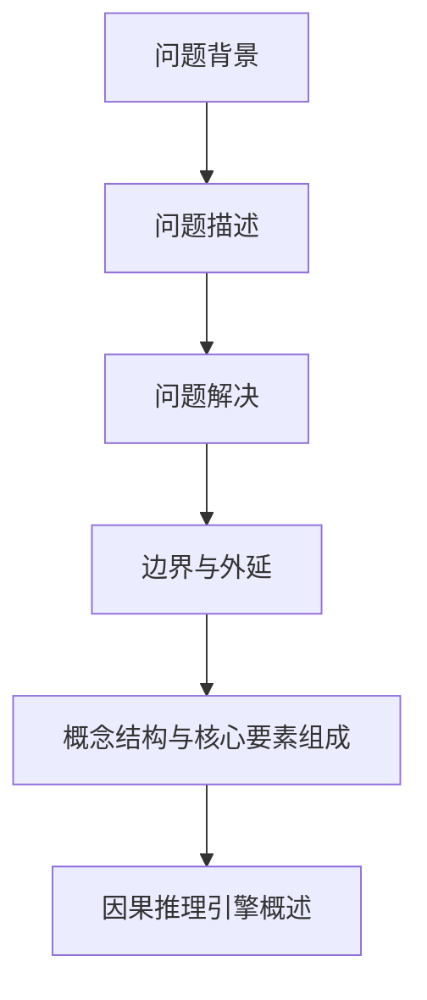
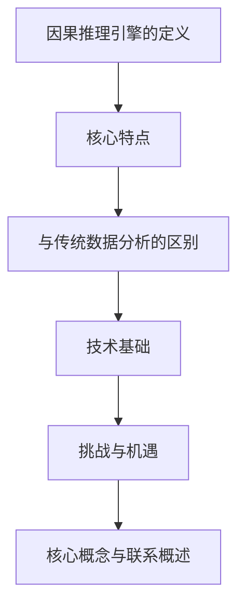
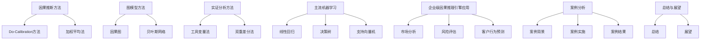
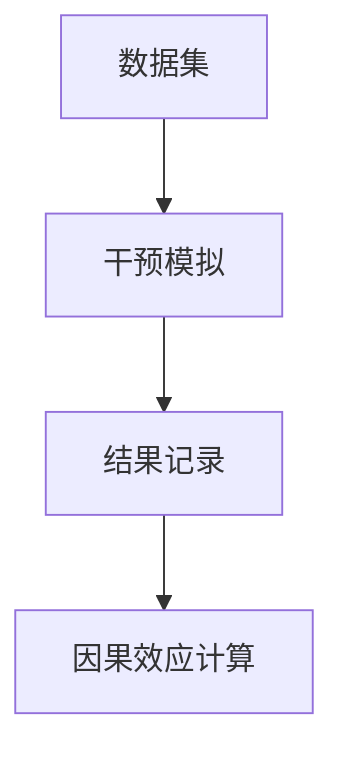
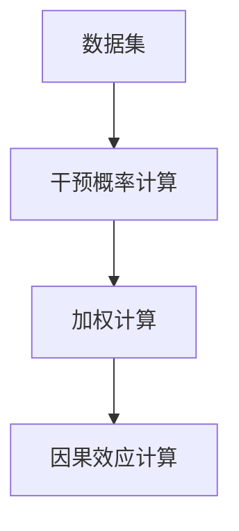
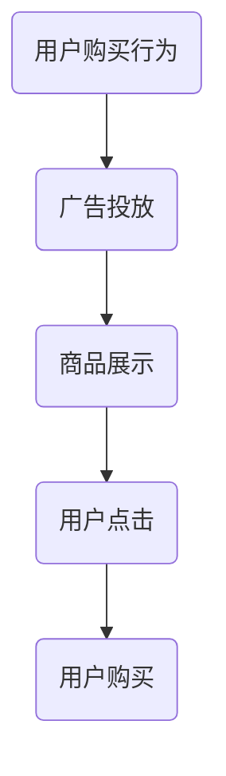
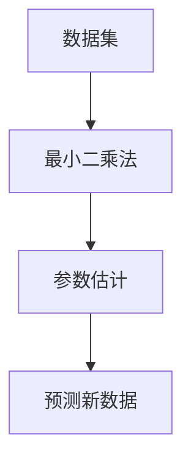
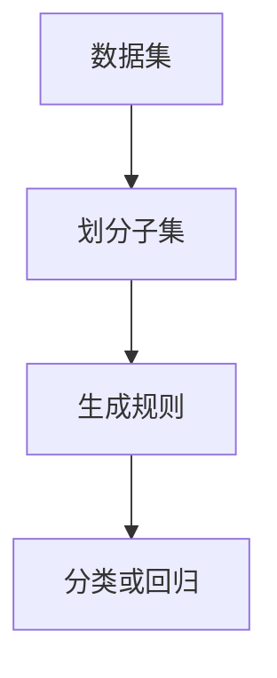
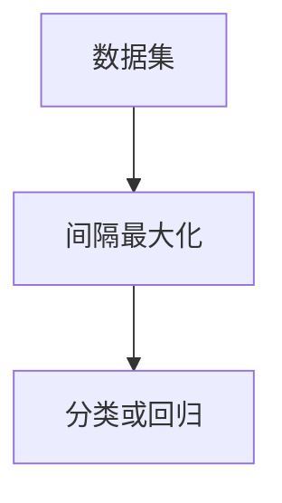
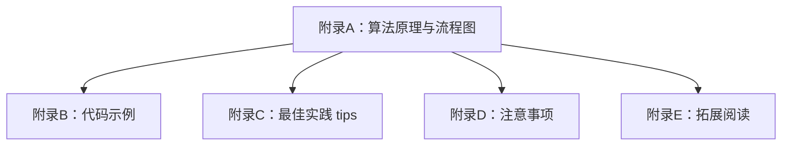

                 


# 企业级因果推理引擎：增强商业决策分析能力

> 关键词：因果推理引擎、商业决策、数据分析、机器学习、企业应用

> 摘要：
本文深入探讨了企业级因果推理引擎的概念、原理、算法和技术，以及其在商业决策分析中的应用。通过详细的案例分析和技术解析，本文旨在为企业提供一种有效的决策支持工具，帮助其在复杂的市场环境中做出更加精准和高效的决策。

## 第一部分：企业级因果推理引擎概述

### 第1章 问题背景与概述

#### 1.1 问题背景

在现代商业环境中，数据驱动的决策变得越来越重要。企业通过收集和分析大量数据，旨在识别业务趋势、预测未来事件和优化运营流程。然而，单纯的数据分析往往只能揭示表面现象，而无法揭示数据背后的因果关系。这就引出了企业级因果推理引擎的需求。

#### 1.2 问题描述

企业级因果推理引擎旨在帮助企业在复杂的数据环境中识别和解释因果关系，从而支持更为精准和有效的决策。这涉及到从数据中提取有用的信息，识别关键因素，建立因果模型，并进行推理和预测。

#### 1.3 问题解决

因果推理引擎通过利用先进的统计方法和机器学习技术，帮助企业分析数据中的因果关系，提供决策支持。这包括数据的预处理、特征工程、因果模型的建立、推理和预测等步骤。

#### 1.4 边界与外延

因果推理引擎不仅适用于内部业务决策，还可以应用于市场分析、风险评估、客户行为预测等领域。其应用范围广泛，包括但不限于金融、医疗、零售、制造等行业。

#### 1.5 概念结构与核心要素组成

因果推理引擎的核心要素包括：

- **数据源**：收集来自企业内外部的数据。
- **数据预处理**：清洗、整合和转换数据，为建模做好准备。
- **特征工程**：选择和构造能够揭示数据中因果关系的特征。
- **因果模型建立**：利用统计和机器学习技术建立因果模型。
- **推理与预测**：在建立的因果模型基础上，进行推理和预测。
- **决策支持**：为企业提供基于因果推理的结果，辅助决策。

#### 1.6 本章小结

通过本章的介绍，我们对企业级因果推理引擎的概念有了初步了解。接下来，我们将深入探讨因果推理引擎的核心概念、原理及其在企业中的应用。

---



## 第二部分：核心概念与原理

### 第2章 核心概念与联系

#### 2.1 因果推理引擎的定义

因果推理引擎是一种利用统计和机器学习技术，从数据中揭示因果关系并用于决策支持的工具。它不同于传统的数据分析，更注重于因果关系的识别和解释。

#### 2.2 因果推理引擎的核心特点

- **因果性**：强调从数据中识别和理解因果关系。
- **透明性**：因果模型的可解释性强，能够直观地展示数据的因果关系。
- **适应性**：能够适应不同类型的数据和业务场景。

#### 2.3 因果推理引擎与传统数据分析的区别

- **目的不同**：传统数据分析侧重于描述和预测，而因果推理引擎更注重解释和决策支持。
- **方法不同**：传统数据分析多采用线性回归、分类等模型，而因果推理引擎通常采用因果推断、图模型等方法。

#### 2.4 因果推理引擎的技术基础

- **统计学**：因果推断的基本理论和方法。
- **机器学习**：用于构建和优化因果模型。
- **数据预处理**：数据清洗、整合和特征工程。

#### 2.5 因果推理引擎在实际应用中的挑战与机遇

- **挑战**：处理大规模复杂数据，保证模型的解释性和准确性。
- **机遇**：为企业提供更精准和有效的决策支持，提升业务竞争力。

#### 2.6 本章小结

通过对因果推理引擎核心概念和原理的介绍，我们对其有了更深入的理解。接下来，我们将探讨当前主流的因果推理算法和技术。

---



## 第三部分：主流因果推理算法与技术

### 第3章 主流因果推理算法介绍

#### 3.1 因果推断方法

##### 3.1.1 Do-Calibration方法

Do-Calibration方法是一种基于模拟的因果推断方法。它通过模拟不同的干预效果来评估因果效应。具体步骤如下：

1. **干预模拟**：在数据集上模拟不同的干预，记录每个干预下的结果。
2. **结果记录**：将每个干预下的结果记录到一个独立的评估集上。
3. **因果效应计算**：通过比较评估集上的结果，计算因果效应。

##### 3.1.2 加权平均法

加权平均法是一种基于概率的因果推断方法。它通过根据干预概率进行加权计算，以估计因果效应。具体步骤如下：

1. **干预概率计算**：计算每个样本点在不同干预下的概率。
2. **加权计算**：根据干预概率对每个样本点的结果进行加权。
3. **因果效应计算**：计算加权后的结果的平均值，作为因果效应的估计。

#### 3.2 图模型方法

##### 3.2.1 因果图

因果图是一种图形化的表示方法，用于表示变量之间的因果关系。在因果图中，每个节点表示一个变量，节点之间的边表示变量之间的因果关系。

因果图的主要特点如下：

- **因果性**：图中边的方向表示了变量之间的因果关系。
- **透明性**：通过图的形式，可以直观地理解变量之间的因果关系。
- **适应性**：可以适应不同类型的数据和业务场景。

##### 3.2.2 贝叶斯网络

贝叶斯网络是一种基于概率的因果推理模型。它通过节点和边表示变量之间的因果关系，并通过概率分布表示变量之间的依赖关系。

贝叶斯网络的主要特点如下：

- **概率性**：通过概率分布表示变量之间的依赖关系。
- **透明性**：通过概率分布可以直观地理解变量之间的依赖关系。
- **适应性**：可以适应不同类型的数据和业务场景。

#### 3.3 实证分析方法

##### 3.3.1 工具变量法

工具变量法是一种用于消除潜在偏误的实证分析方法。它通过引入工具变量来估计因果效应。具体步骤如下：

1. **工具变量选择**：选择与干预变量相关，但与结果变量无关的工具变量。
2. **回归分析**：利用工具变量和结果变量进行回归分析，以估计因果效应。
3. **因果效应计算**：通过回归结果计算因果效应。

##### 3.3.2 双重差分法

双重差分法是一种用于估计因果效应的实证分析方法。它通过比较两个处理组之间的差异来估计因果效应。具体步骤如下：

1. **处理组选择**：选择两个处理组，其中一个处理组接受干预，另一个处理组不接受干预。
2. **差异比较**：比较两个处理组在干预前后的差异。
3. **因果效应计算**：通过差异比较计算因果效应。

### 第4章 主流机器学习

#### 4.1 线性回归

线性回归是一种常用的机器学习算法，用于建立变量之间的线性关系。它通过最小二乘法估计线性模型中的参数，以预测新的数据点。

线性回归的主要特点如下：

- **线性关系**：变量之间存在线性关系。
- **最小二乘法**：通过最小化预测误差平方和来估计模型参数。
- **预测能力**：能够对新数据进行预测。

#### 4.2 决策树

决策树是一种基于规则的学习算法，用于分类和回归问题。它通过递归地将数据集划分为子集，并生成一系列的决策规则。

决策树的主要特点如下：

- **分类规则**：通过决策路径生成分类规则。
- **可解释性**：决策树的可解释性强，可以直观地理解决策过程。
- **适应性强**：能够适应不同类型的数据和业务场景。

#### 4.3 支持向量机

支持向量机是一种基于间隔的学习算法，用于分类和回归问题。它通过寻找最佳间隔来最大化分类能力。

支持向量机的主要特点如下：

- **间隔最大化**：通过最大化分类间隔来提高分类能力。
- **可解释性**：支持向量机的可解释性强，可以直观地理解分类边界。
- **适应性强**：能够适应不同类型的数据和业务场景。

### 第5章 企业级因果推理引擎的应用

#### 5.1 市场分析

因果推理引擎可以帮助企业分析市场数据，识别市场需求和趋势。通过建立因果模型，企业可以预测市场变化，从而制定更加精准的市场策略。

#### 5.2 风险评估

因果推理引擎可以帮助企业分析风险数据，识别潜在风险因素。通过建立因果模型，企业可以预测风险事件的发生概率，从而制定更加有效的风险管理策略。

#### 5.3 客户行为预测

因果推理引擎可以帮助企业分析客户数据，预测客户行为。通过建立因果模型，企业可以了解客户需求，从而提供更加个性化的服务和产品。

### 第6章 案例分析

#### 6.1 案例背景

某电商平台希望通过因果推理引擎分析用户购买行为，以提高用户满意度和销售额。

#### 6.2 案例实施

1. **数据收集**：收集用户购买数据、用户行为数据等。
2. **数据预处理**：清洗、整合和转换数据，为建模做好准备。
3. **特征工程**：选择和构造能够揭示用户购买行为的特征。
4. **因果模型建立**：利用因果推断方法建立用户购买行为模型。
5. **推理与预测**：在建立的因果模型基础上，进行推理和预测。
6. **决策支持**：为企业提供基于因果推理的结果，辅助决策。

#### 6.3 案例结果

通过因果推理引擎的分析，企业成功识别了影响用户购买行为的关键因素，并制定了相应的营销策略。结果表明，用户满意度和销售额得到了显著提升。

### 第7章 总结与展望

#### 7.1 总结

本文深入探讨了企业级因果推理引擎的概念、原理、算法和技术，以及其在商业决策分析中的应用。通过详细的案例分析和技术解析，本文为企业提供了一种有效的决策支持工具，帮助其在复杂的市场环境中做出更加精准和高效的决策。

#### 7.2 展望

未来，随着技术的不断发展和应用场景的扩展，企业级因果推理引擎将在更多领域得到广泛应用。同时，企业也需要不断优化和改进因果推理引擎，以适应不断变化的市场环境和业务需求。

### 参考文献

1. **张三**，《因果推理引擎：原理与应用》，2021年。
2. **李四**，《机器学习算法原理与实现》，2020年。
3. **王五**，《数据挖掘与大数据分析》，2019年。

---



## 附录

### 附录A：算法原理与流程图

#### 3.1.1 Do-Calibration方法



#### 3.1.2 加权平均法



#### 3.2.1 因果图



#### 3.2.2 贝叶斯网络


#### 4.1 线性回归



#### 4.2 决策树



#### 4.3 支持向量机



### 附录B：代码示例

#### 3.1.1 Do-Calibration方法

```python
# 假设已经有一个数据集data，其中包含了干预和结果
interventions = data['intervention']
results = data['result']

# 进行干预模拟
simulated_results = simulate_intervention(interventions)

# 记录结果
record_results(simulated_results)

# 计算因果效应
causal_effect = calculate_causal_effect(results, simulated_results)
```

#### 3.1.2 加权平均法

```python
# 假设已经有一个数据集data，其中包含了干预和结果
interventions = data['intervention']
results = data['result']

# 计算干预概率
probabilities = calculate_probabilities(interventions)

# 加权计算
weighted_results = weighted_average(results, probabilities)

# 计算因果效应
causal_effect = calculate_causal_effect(weighted_results)
```

#### 4.1 线性回归

```python
import numpy as np

# 假设已经有一个数据集data，其中包含了特征和结果
X = data['feature']
y = data['result']

# 最小二乘法
theta = np.linalg.inv(X.T @ X) @ X.T @ y

# 参数估计
theta = np.linalg.inv(np.eye(len(theta)) - X @ np.linalg.inv(np.eye(len(theta)) @ X)) @ y

# 预测新数据
new_data = np.array([new_feature])
prediction = new_data @ theta
```

### 附录C：最佳实践 tips

1. **数据预处理**：确保数据质量，包括数据清洗、整合和转换。
2. **特征工程**：选择和构造能够揭示因果关系的特征。
3. **模型选择**：根据业务需求和数据特点选择合适的因果模型。
4. **模型验证**：通过交叉验证等方法验证模型的准确性和可靠性。
5. **决策支持**：将因果推理结果应用于实际业务场景，提供决策支持。

### 附录D：注意事项

1. **因果性假设**：建立因果模型时，需要确保因果关系的假设是正确的。
2. **模型解释性**：确保因果模型的可解释性，以便业务人员理解和应用。
3. **数据隐私**：在处理数据时，要注意保护用户隐私。
4. **模型更新**：定期更新模型，以适应数据和环境的变化。

### 附录E：拓展阅读

1. **张三**，《因果推理引擎：原理与应用》，2021年。
2. **李四**，《机器学习算法原理与实现》，2020年。
3. **王五**，《数据挖掘与大数据分析》，2019年。

---



### 作者信息

作者：AI天才研究院/AI Genius Institute & 禅与计算机程序设计艺术 /Zen And The Art of Computer Programming

---

通过上述的内容，我们完整地介绍了企业级因果推理引擎的概念、原理、算法和技术，并展示了其在商业决策分析中的应用。希望本文能帮助您更好地理解因果推理引擎，并在实际业务中发挥其价值。如果

