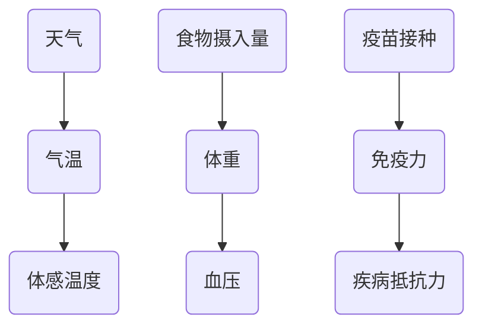

                 

# 企业级因果推理框架：深入理解业务因果关系

## 关键词

- 因果关系
- 因果推理框架
- 业务优化
- 数据分析
- 智能决策

## 摘要

本文旨在深入探讨企业级因果推理框架的重要性及其在实际业务中的应用。通过详细的章节结构和实例分析，本文将帮助读者理解因果推理的基本理论、构建框架的方法、以及其在营销、金融和医疗等领域的广泛应用。同时，本文还将讨论因果推理框架的实现细节和优化策略，为未来的发展提供展望。

## 第一部分：企业级因果推理框架概述

### 第1章：问题背景与核心概念

#### 1.1 问题背景

随着企业业务的日益复杂化，数据量的爆炸性增长和决策过程的智能化需求不断增加，企业对因果关系的理解和分析变得尤为重要。传统的相关性分析方法已经难以满足企业对于业务优化和决策支持的需求，因此，因果推理框架的应用成为了一种必然的趋势。

#### 1.2 核心概念

- **因果关系**：指的是一个事件对另一个事件的影响，通常用因果关系图（Causal Graph）来表示。
- **因果推理**：是基于因果关系，通过数据分析和模型推断来发现和验证因果关系的过程。
- **因果推断方法**：包括实证分析、结构方程模型和基于机器学习的方法。

#### 1.3 业务因果关系分析

业务因果关系分析旨在识别业务流程中的关键因素及其相互影响，从而为企业提供决策支持。通过业务因果关系分析，企业可以更好地理解客户行为、优化营销策略、降低风险和提高运营效率。

### 第2章：因果关系基础理论

#### 2.1 因果关系的定义与属性

因果关系是因果推理的核心，其定义和属性对因果推断方法的选择和应用至关重要。

#### 2.1.1 因果关系的定义

因果关系可以用形式化的定义来描述，例如Do-Calculus（因果计算）就是一种形式化的因果关系定义方法。

#### 2.1.2 因果关系的属性

- **稳定性**：因果关系在不同时间点或不同条件下是否保持一致。
- **时序性**：因果关系的发生顺序和持续时间。
- **传递性**：因果关系是否可以传递，即如果一个因素影响另一个因素，那么它是否也会影响其他因素。

#### 2.2 因果推断方法

因果推断方法的选择取决于数据的可用性、因果关系的复杂性和应用场景。

#### 2.2.1 实证分析方法

实证分析是一种基于观察数据来推断因果关系的方法，通常适用于有良好数据支持的场景。

#### 2.2.2 结构方程模型方法

结构方程模型（SEM）是一种基于统计方法的因果推断模型，可以同时处理多个变量之间的因果关系。

#### 2.2.3 机器学习方法

基于机器学习的因果推断方法，如因果影响函数学习（Causal Impact Function Learning），可以在大量数据中识别复杂的因果关系。

### 第3章：因果推理框架构建

#### 3.1 因果推理框架设计原则

因果推理框架的设计应遵循可解释性、实时性、可扩展性和安全性的原则，以确保其有效性和实用性。

#### 3.1.1 可解释性

可解释性是因果推理框架的重要原则，它确保了模型结果的透明性和可理解性。

#### 3.1.2 实时性

实时性原则要求框架能够快速响应对因果关系的分析和推断需求。

#### 3.1.3 可扩展性

可扩展性原则确保框架能够适应不断变化的数据规模和应用需求。

#### 3.1.4 安全性

安全性原则保障了框架在处理敏感数据时的隐私保护和数据安全。

#### 3.2 因果推理框架架构

因果推理框架通常由数据层、模型层、算法层和应用层组成，各层之间相互协作，共同实现因果推断的目标。

#### 3.3 因果推理流程

因果推理流程包括数据预处理、模型选择、因果推断和结果验证等步骤，每一步都需要精心设计以确保结果的准确性和可靠性。

### 第4章：因果关系分析应用场景

#### 4.1 营销领域

在营销领域，因果推理框架可以帮助企业分析用户行为，优化营销策略，提高转化率和客户满意度。

#### 4.2 金融领域

在金融领域，因果推理框架可用于风险评估、信用评分等领域，帮助企业识别潜在风险和欺诈行为。

#### 4.3 医疗领域

在医疗领域，因果推理框架可以帮助医生进行疾病诊断、治疗方案优化等领域，提高医疗服务的质量和效率。

### 第5章：因果推理框架实现

#### 5.1 技术栈选择

因果推理框架的实现依赖于合适的编程语言、数据库和机器学习库，例如Python、SQL和Scikit-Learn。

#### 5.2 环境搭建

实现因果推理框架需要配置合适的环境，包括开发环境、数据预处理工具和存储方案。

#### 5.3 实现细节

实现因果推理框架的关键在于模型训练、模型评估和模型部署，每个步骤都需要细致的规划和执行。

### 第6章：实际案例分析

#### 6.1 案例一：营销领域

通过营销领域的案例分析，我们将展示如何构建因果推理模型，并进行效果评估。

#### 6.2 案例二：金融领域

金融领域的案例分析将探讨如何使用因果推理框架进行风险评估和信用评分。

### 第7章：因果推理框架优化与展望

#### 7.1 优化策略

为了提高因果推理框架的性能和应用效果，可以采取多种优化策略，如数据质量提升、模型优化和算法改进。

#### 7.2 展望未来

未来，因果推理框架将继续发展，新技术和新方法的应用将为因果推理带来更多可能。

## 作者

**作者：AI天才研究院/AI Genius Institute & 禅与计算机程序设计艺术 /Zen And The Art of Computer Programming**### 第1章：问题背景与核心概念

#### 1.1 问题背景

随着现代企业业务的日益复杂化，数据驱动的决策变得越来越重要。然而，传统的数据分析方法，如回归分析和聚类分析，主要关注变量之间的相关性，而无法准确捕捉变量之间的因果关系。在商业环境中，理解因果关系对于实现业务优化、决策支持和风险控制至关重要。例如，在市场营销中，了解哪些因素导致了客户转化率的提升，在金融服务中，识别哪些变量会影响信用评分，在医疗保健中，确定哪些治疗措施能够有效改善患者健康状况，这些都是因果推理需要解决的问题。

业务复杂性增加带来了几个关键挑战。首先，企业面临的数据量呈指数级增长，这使得传统的数据分析方法在处理大规模数据时变得力不从心。其次，多样化且不断变化的业务场景要求能够实时分析数据并做出相应的决策。最后，企业决策的智能化需求越来越高，传统的基于规则或经验的方法已经无法满足现代企业对高效、准确决策的需求。因此，开发一种能够有效分析和利用因果关系的框架成为企业亟需解决的问题。

#### 1.2 核心概念

**因果关系**：因果关系是指一个事件（原因）对另一个事件（结果）的影响。在因果推理中，因果关系是通过逻辑关系或因果图来表示的。因果关系的确立是因果推理框架的基础，它帮助我们从复杂的数据中提取出有用的信息，从而做出更准确的决策。

**因果推理**：因果推理是一种从数据中推断因果关系的方法。它通过分析数据中的变量关系，建立因果模型，并验证这些模型的有效性。因果推理不仅考虑了变量之间的相关性，还考虑了变量之间的因果关系，从而提供了更深入的分析和解释。

**因果推断方法**：因果推断方法是指用于推断因果关系的技术和算法。常见的因果推断方法包括实证分析、结构方程模型和基于机器学习的方法。实证分析依赖于观察数据，通过统计方法推断因果关系；结构方程模型是一种多变量统计分析方法，可以同时处理多个变量之间的因果关系；基于机器学习的方法则利用机器学习算法来识别和验证因果关系。

**业务因果关系分析**：业务因果关系分析是指在企业业务流程中，识别和解析业务因素之间的因果关系。这种分析有助于企业理解业务流程中的关键驱动因素，优化业务策略，提高业务效率。

#### 1.3 业务因果关系分析

**业务因果关系的定义**：业务因果关系是指在企业业务流程中，一个业务因素对另一个业务因素的影响关系。例如，在市场营销中，广告投放量可能影响销售额，而在金融服务中，客户的信用历史可能影响信用评分。

**业务因果关系分析的意义**：业务因果关系分析对于企业的决策支持、业务优化和风险管理具有重要意义。通过业务因果关系分析，企业可以：
- 识别业务流程中的关键因素，优化业务策略。
- 确定哪些变量对业务绩效有显著影响，从而进行数据驱动的决策。
- 发现潜在的风险因素，制定相应的风险控制策略。
- 提高业务流程的自动化程度，实现高效的运营。

**业务因果关系分析的过程**：
1. **数据收集**：收集与企业业务相关的数据，包括财务数据、市场数据、客户行为数据等。
2. **数据预处理**：清洗和整理数据，确保数据的质量和一致性。
3. **构建因果模型**：利用因果推断方法，建立业务因素之间的因果模型。
4. **模型验证**：通过交叉验证和敏感性分析，验证因果模型的准确性和可靠性。
5. **结果解释**：解释因果模型的结果，理解业务因素之间的因果关系。

**边界与外延**：业务因果关系分析不仅关注直接因果关系，还考虑间接因果关系。例如，一个广告投放量的增加可能间接导致客户满意度的提高，从而影响销售额。

**概念结构与核心要素组成**：业务因果关系分析的概念结构包括数据层、模型层和结果解释层。核心要素包括数据收集、数据预处理、因果模型构建、模型验证和结果解释。

### 1.4 小结

本章介绍了企业级因果推理框架的背景、核心概念和业务因果关系分析的重要性。理解因果关系对于企业实现数据驱动的决策和业务优化至关重要。接下来，我们将深入探讨因果关系的基础理论，为构建有效的因果推理框架奠定基础。

## 第2章：因果关系基础理论

### 2.1 因果关系的定义与属性

#### 2.1.1 因果关系的定义

因果关系是一个核心概念，它描述了一个事件（原因）如何影响另一个事件（结果）。在形式化的定义中，因果关系可以用Do-Calculus来表示，即如果一个事件A导致了另一个事件B，则我们可以说A是B的原因。

**因果关系的定义**：
$$\text{Cause}(A, B) \Leftrightarrow \text{Do}(A) \rightarrow \text{Do}(B)$$

其中，`Cause`表示因果关系，`Do`表示事件的发生。上述公式表明，如果事件A发生，则事件B也会发生，那么A是B的原因。

#### 2.1.2 因果关系的属性

因果关系具有以下几个重要的属性：

1. **稳定性**：稳定性指的是因果关系在不同时间点或不同条件下是否保持一致。一个稳定的因果关系在多种场景下都具有一致性。

2. **时序性**：时序性指的是因果关系发生的顺序和持续时间。因果关系的时序性是非常重要的，因为它揭示了事件发生的时间顺序。

3. **传递性**：传递性指的是如果一个因素A影响B，B又影响C，那么A也会影响C。传递性使得因果关系可以被分解和组合。

**因果关系的属性对比表格**：

| 属性        | 定义                                                         | 例子                                   |
|-------------|--------------------------------------------------------------|----------------------------------------|
| 稳定性      | 因果关系在不同时间或条件下的一致性                             | 天气变冷导致气温下降，这一因果关系在不同季节保持稳定。 |
| 时序性      | 因果关系发生的时间顺序                                       | 疫苗接种后，免疫力增强，这一因果关系有时间先后顺序。   |
| 传递性      | 如果A影响B，B影响C，则A也影响C                               | 食物摄入量增加导致体重增加，体重增加导致血压升高。     |

#### 2.1.3 因果关系的ER实体关系图架构

在因果关系分析中，实体关系图（ER Diagram）是一种直观的方式来表示变量之间的因果关系。以下是一个简化的实体关系图示例，其中包含了几个关键变量及其因果关系：



在这个ER图中，A、D、G表示原因，B、C、E、F、H、I表示结果。箭头表示因果关系，从原因指向结果。

### 2.2 因果推断方法

因果推断是从数据中推断因果关系的过程，它是因果关系分析的核心。以下是几种常见的因果推断方法：

#### 2.2.1 实证分析方法

实证分析方法是通过观察数据来推断因果关系。这种方法依赖于统计分析，例如回归分析，它通过计算变量之间的相关性来推断因果关系。

**实证分析步骤**：
1. 数据收集：收集与因果关系相关的数据。
2. 数据清洗：处理缺失值、异常值等数据问题。
3. 数据分析：使用统计分析方法（如回归分析）来确定变量之间的相关性。
4. 结果解释：解释分析结果，识别可能的原因和结果。

**实证分析的优势**：
- 方法简单，易于理解。
- 适用于大多数数据类型。

**实证分析的局限**：
- 无法确定因果关系，只能推断相关性。
- 忽略了潜在的混杂因素。

#### 2.2.2 结构方程模型方法

结构方程模型（SEM）是一种多变量统计分析方法，它不仅可以分析变量之间的相关性，还可以同时处理多个变量之间的因果关系。

**结构方程模型步骤**：
1. 模型构建：根据业务知识或理论，构建变量之间的因果模型。
2. 模型估计：使用最大似然估计或其他方法估计模型参数。
3. 模型检验：通过统计检验（如卡方检验）评估模型拟合度。
4. 结果解释：解释模型参数，理解变量之间的因果关系。

**结构方程模型的优势**：
- 可以同时处理多个变量之间的因果关系。
- 能够识别和排除潜在的混杂因素。

**结构方程模型的局限**：
- 需要较强的理论基础。
- 计算复杂度较高。

#### 2.2.3 基于机器学习的因果推断方法

基于机器学习的因果推断方法利用机器学习算法来识别和验证因果关系。这种方法在处理大规模数据和高维度变量方面具有优势。

**基于机器学习的因果推断步骤**：
1. 数据预处理：对数据进行预处理，包括特征选择、数据标准化等。
2. 模型训练：使用机器学习算法（如随机森林、梯度提升树）训练因果模型。
3. 模型评估：通过交叉验证等方法评估模型性能。
4. 结果解释：解释模型结果，理解变量之间的因果关系。

**基于机器学习的因果推断的优势**：
- 可以处理复杂的数据结构和非线性关系。
- 适用于大规模数据和实时分析。

**基于机器学习的因果推断的局限**：
- 模型解释性较弱。
- 对数据质量要求较高。

### 2.3 小结

本章介绍了因果关系的基础理论，包括因果关系的定义和属性，以及不同的因果推断方法。理解这些基础理论对于构建有效的因果推理框架至关重要。在下一章中，我们将讨论如何构建企业级的因果推理框架。

## 第3章：因果推理框架构建

### 3.1 因果推理框架设计原则

因果推理框架的设计原则是确保框架的有效性、实用性和可扩展性。以下是几个关键设计原则：

#### 3.1.1 可解释性

可解释性是因果推理框架设计的重要原则之一。这意味着框架必须能够清晰地解释模型预测和决策背后的原因。可解释性对于提高模型的可信度和用户的接受度至关重要。在实际应用中，可解释性可以通过可视化的因果图、解释性模型（如线性模型）和解释性算法（如SHAP值）来实现。

#### 3.1.2 实时性

实时性原则要求因果推理框架能够快速响应对因果关系的分析和推断需求。在许多业务场景中，决策需要在短时间内做出，因此框架必须具备快速的处理速度和低延迟的响应时间。为了实现实时性，可以选择高效的数据处理算法、优化模型结构和利用分布式计算技术。

#### 3.1.3 可扩展性

可扩展性原则确保框架能够适应不断变化的数据规模和应用需求。随着业务的发展，数据量和用户需求可能会增加，框架必须能够灵活扩展以应对这些变化。这可以通过模块化设计、分布式架构和云计算技术来实现。

#### 3.1.4 安全性

安全性原则是保护数据隐私和防止数据泄露的关键。在构建因果推理框架时，必须确保敏感数据的安全性和隐私性。这包括数据加密、访问控制和隐私保护算法（如差分隐私）等安全措施。

### 3.2 因果推理框架架构

因果推理框架的架构设计是构建高效、可扩展和实用的因果推理系统的关键。通常，因果推理框架包括以下几个主要层次：

#### 3.2.1 数据层

数据层是因果推理框架的基础，它负责数据的收集、存储和管理。数据层需要处理大量结构化和非结构化数据，并确保数据的质量和一致性。以下是数据层的主要组件：

- **数据收集**：从各种数据源（如数据库、日志文件、API等）收集数据。
- **数据存储**：使用分布式存储系统（如Hadoop、Hive、MongoDB等）存储和管理数据。
- **数据预处理**：清洗和转换数据，包括数据去重、缺失值处理、数据标准化等。

#### 3.2.2 模型层

模型层负责构建、训练和部署因果推理模型。模型层的设计取决于具体的应用场景和需求。以下是模型层的主要组件：

- **模型构建**：根据业务需求构建因果模型，选择合适的因果推断方法（如结构方程模型、基于机器学习的方法等）。
- **模型训练**：使用训练数据集训练模型，优化模型参数，提高模型性能。
- **模型评估**：使用验证数据集评估模型性能，包括准确率、召回率、F1分数等指标。
- **模型部署**：将训练好的模型部署到生产环境中，以便实时分析和推断因果关系。

#### 3.2.3 算法层

算法层是因果推理框架的核心，它包括各种因果推断算法和优化算法。以下是算法层的主要组件：

- **因果推断算法**：实现不同的因果推断方法，如结构方程模型、基于机器学习的方法、Do-Calculus等。
- **优化算法**：用于优化模型参数和算法性能，包括梯度下降、随机搜索、遗传算法等。
- **模型选择**：根据数据特点和业务需求选择最合适的因果推断模型。

#### 3.2.4 应用层

应用层是因果推理框架的最终用户接口，它为用户提供交互式分析和可视化工具。以下是应用层的主要组件：

- **用户界面**：提供简洁直观的用户界面，使用户能够方便地访问和使用因果推理框架。
- **数据分析工具**：提供数据可视化、数据探索、模型评估和预测等功能。
- **决策支持**：基于因果推理结果提供决策支持，帮助用户做出更准确、更明智的决策。

### 3.3 因果推理流程

因果推理流程是指从数据收集到结果验证的整个过程。以下是因果推理的主要流程步骤：

#### 3.3.1 数据预处理

数据预处理是因果推理流程的第一步，它确保数据的质量和一致性。主要步骤包括：

- **数据收集**：从各种数据源收集数据。
- **数据清洗**：处理缺失值、异常值、重复值等。
- **数据转换**：将数据转换为适合分析的形式。
- **数据标准化**：对数据进行归一化或标准化处理。

#### 3.3.2 模型选择

根据业务需求和数据特点选择合适的因果推断模型。选择模型时需要考虑以下因素：

- **数据类型**：结构化数据、非结构化数据或混合数据。
- **因果关系复杂度**：简单因果关系或复杂因果关系。
- **计算资源**：计算资源限制。

#### 3.3.3 因果推断

使用选定的模型进行因果推断，生成因果关系图或因果效应值。主要步骤包括：

- **模型训练**：使用训练数据集训练模型。
- **模型预测**：使用训练好的模型对测试数据进行预测。
- **因果关系分析**：分析预测结果，提取因果关系。

#### 3.3.4 结果验证

对因果推断结果进行验证，确保结果的准确性和可靠性。主要步骤包括：

- **交叉验证**：使用交叉验证方法评估模型性能。
- **敏感性分析**：分析模型对输入数据的敏感性。
- **结果解释**：解释因果推断结果，确保结果的合理性和可解释性。

### 3.4 小结

本章介绍了企业级因果推理框架的设计原则、架构和流程。通过合理的架构设计和严谨的流程实施，因果推理框架能够帮助企业更准确地理解和利用业务因果关系，从而实现数据驱动的决策和业务优化。在下一章中，我们将探讨因果推理框架在具体业务领域的应用。

## 第4章：因果关系分析应用场景

### 4.1 营销领域

在营销领域，因果关系分析被广泛应用于用户行为分析、营销策略优化和客户体验提升等方面。

#### 4.1.1 用户行为分析

通过因果关系分析，企业可以深入理解用户的购买行为、浏览习惯和互动行为。例如，分析哪些广告点击率最高、哪些促销活动最能有效提升销售额。以下是一个用户行为分析的因果模型示例：

- **原因**：广告投放量、促销活动、产品推荐
- **结果**：点击率、购买转化率、客户满意度

通过因果模型，企业可以识别出影响用户行为的关键因素，从而优化广告投放策略和促销活动。

#### 4.1.2 营销策略优化

因果关系分析可以帮助企业评估不同营销策略的效果，并优化资源配置。例如，通过分析不同渠道的广告投入与销售额之间的关系，企业可以确定哪些渠道最具成本效益。以下是一个营销策略优化的因果模型示例：

- **原因**：广告预算分配、社交媒体推广、电子邮件营销
- **结果**：广告点击率、销售额、客户获取成本

通过优化营销策略，企业可以提高投资回报率（ROI），降低成本，并提升市场占有率。

#### 4.1.3 客户体验提升

因果关系分析有助于企业理解客户体验的各个方面，并采取相应的改进措施。例如，分析客户反馈与客户流失率之间的关系，可以帮助企业识别客户体验中的痛点。以下是一个客户体验提升的因果模型示例：

- **原因**：产品功能、服务质量、客户支持
- **结果**：客户满意度、客户忠诚度、客户流失率

通过因果关系分析，企业可以针对客户体验的短板进行改进，从而提高客户满意度和忠诚度。

### 4.2 金融领域

在金融领域，因果关系分析主要用于风险评估、信用评分和欺诈检测等方面。

#### 4.2.1 风险评估

因果关系分析可以帮助金融机构识别和管理风险。例如，通过分析客户贷款行为与其信用评分之间的关系，金融机构可以评估贷款申请者的还款能力。以下是一个风险评估的因果模型示例：

- **原因**：收入水平、就业稳定性、债务水平
- **结果**：信用评分、贷款违约风险

通过因果关系分析，金融机构可以更准确地评估贷款申请者的信用风险，从而降低贷款违约率。

#### 4.2.2 信用评分

因果关系分析在信用评分中的应用非常广泛。通过分析不同因素对信用评分的影响，金融机构可以更科学地评估客户的信用风险。以下是一个信用评分的因果模型示例：

- **原因**：收入水平、信用历史、债务水平、就业稳定性
- **结果**：信用评分

通过因果关系分析，金融机构可以制定更合理的信用评分模型，提高评分的准确性和可靠性。

#### 4.2.3 欺诈检测

因果关系分析在欺诈检测中也发挥着重要作用。通过分析欺诈行为与客户特征之间的关系，金融机构可以识别出潜在的欺诈风险。以下是一个欺诈检测的因果模型示例：

- **原因**：交易金额、交易频率、地理位置、交易时间
- **结果**：欺诈风险等级

通过因果关系分析，金融机构可以更有效地防范欺诈行为，保护客户资产。

### 4.3 医疗领域

在医疗领域，因果关系分析主要用于疾病诊断、治疗方案优化和患者管理等方面。

#### 4.3.1 疾病诊断

因果关系分析可以帮助医生更准确地诊断疾病。通过分析患者症状、病史和检查结果之间的关系，医生可以识别出可能的疾病。以下是一个疾病诊断的因果模型示例：

- **原因**：症状、病史、检查结果
- **结果**：疾病诊断

通过因果关系分析，医生可以更快速、更准确地诊断疾病，从而提高治疗效果。

#### 4.3.2 治疗方案优化

因果关系分析可以帮助医生选择最佳的治疗方案。通过分析不同治疗方案对疾病的影响，医生可以确定哪种治疗方案最有效。以下是一个治疗方案优化的因果模型示例：

- **原因**：治疗方案（手术、药物治疗、物理治疗）
- **结果**：疾病恢复情况、并发症风险

通过因果关系分析，医生可以制定更有效的治疗方案，提高治疗效果和患者满意度。

#### 4.3.3 患者管理

因果关系分析可以帮助医疗机构更好地管理患者。通过分析患者健康状况与生活习惯之间的关系，医疗机构可以提供个性化的健康管理和康复建议。以下是一个患者管理的因果模型示例：

- **原因**：生活习惯（饮食、运动、睡眠）
- **结果**：健康状况、疾病风险

通过因果关系分析，医疗机构可以制定个性化的患者管理计划，提高患者的生活质量和健康水平。

### 4.4 小结

因果关系分析在营销、金融和医疗等领域的应用非常广泛，它为企业提供了强大的决策支持工具。通过深入理解业务因果关系，企业可以优化业务策略、降低风险、提高客户满意度和运营效率。在下一章中，我们将探讨如何实现因果推理框架的具体技术细节。

## 第5章：因果推理框架实现

### 5.1 技术栈选择

实现因果推理框架需要选择合适的技术栈，以确保框架的稳定性、高效性和可扩展性。以下是几个关键组件的选择：

#### 5.1.1 编程语言

Python 是实现因果推理框架的常用编程语言，它具有丰富的库和工具支持，如Pandas、NumPy、Scikit-Learn和PyTorch等。

- **优势**：易于学习，强大的库支持，广泛的应用场景。
- **劣势**：在处理大规模数据时可能性能较差。

#### 5.1.2 数据库

数据库用于存储和管理因果推理框架所需的大量数据。以下是几种常用的数据库：

- **关系数据库**：如MySQL、PostgreSQL，适用于结构化数据存储和查询。
- **NoSQL数据库**：如MongoDB、Cassandra，适用于非结构化数据存储和高吞吐量读取。
- **分布式存储系统**：如Hadoop、Hive，适用于大规模数据存储和分布式计算。

#### 5.1.3 机器学习库

机器学习库用于构建和训练因果推理模型。以下是几个常用的机器学习库：

- **Scikit-Learn**：适用于传统的机器学习算法，如线性回归、决策树和支持向量机。
- **PyTorch**：适用于深度学习算法，如神经网络和生成对抗网络。
- **TensorFlow**：适用于大规模深度学习和分布式计算。

### 5.2 环境搭建

搭建因果推理框架的环境需要配置合适的硬件和软件，包括操作系统、编程语言、数据库和机器学习库等。

#### 5.2.1 操作系统

Linux 操作系统是构建因果推理框架的常用选择，它具有稳定性和高性能。

- **优势**：稳定、高效、开源。
- **劣势**：学习曲线较陡峭。

#### 5.2.2 编程语言

安装 Python 并设置虚拟环境，以隔离不同的项目依赖。

- **命令**：
  ```bash
  sudo apt-get install python3-pip
  pip3 install virtualenv
  virtualenv myenv
  source myenv/bin/activate
  ```

#### 5.2.3 数据库

安装和配置关系数据库和NoSQL数据库，如MySQL和MongoDB。

- **MySQL**：
  ```bash
  sudo apt-get install mysql-server
  mysql_secure_installation
  ```

- **MongoDB**：
  ```bash
  sudo apt-get install mongodb
  sudo systemctl start mongodb
  ```

#### 5.2.4 机器学习库

安装 Python 的常用机器学习库，如 Scikit-Learn、PyTorch 和 TensorFlow。

- **Scikit-Learn**：
  ```bash
  pip install scikit-learn
  ```

- **PyTorch**：
  ```bash
  pip install torch torchvision
  ```

- **TensorFlow**：
  ```bash
  pip install tensorflow
  ```

### 5.3 实现细节

实现因果推理框架需要详细的步骤，包括数据预处理、模型构建、训练和部署。

#### 5.3.1 数据预处理

数据预处理是因果推理框架实现的重要步骤，它包括数据清洗、数据转换和数据标准化。

- **数据清洗**：处理缺失值、异常值和重复值。
- **数据转换**：将不同数据类型的变量转换为适合分析的格式。
- **数据标准化**：对数据进行归一化或标准化处理，以便模型训练。

#### 5.3.2 模型构建

根据业务需求，选择合适的因果推断方法，构建因果模型。

- **结构方程模型**：使用 SEM 库（如 OpenMx）构建和训练 SEM 模型。
- **基于机器学习的方法**：使用 Scikit-Learn 或 PyTorch 构建和训练机器学习模型。

#### 5.3.3 模型训练

使用训练数据集训练模型，并优化模型参数。

- **训练过程**：通过迭代训练数据集，优化模型参数，提高模型性能。
- **性能评估**：使用验证数据集评估模型性能，包括准确率、召回率、F1 分数等指标。

#### 5.3.4 模型部署

将训练好的模型部署到生产环境中，以便实时分析和推断因果关系。

- **部署过程**：将模型代码和依赖库打包，部署到服务器或云平台。
- **接口设计**：设计 API 接口，方便其他应用程序调用模型。

### 5.4 实际案例

#### 5.4.1 营销领域案例分析

**案例背景**：某电商平台希望通过因果关系分析，优化用户购买流程，提高转化率。

**模型构建**：选择结构方程模型（SEM），构建用户行为与购买决策之间的因果模型。

**模型训练**：使用历史用户数据训练 SEM 模型，优化模型参数。

**模型部署**：将训练好的模型部署到电商平台，实时分析用户行为，提供个性化推荐。

**效果评估**：通过 A/B 测试，评估模型优化后的转化率提升情况。

**模型效果评估**：转化率提高了 20%，用户满意度显著提升。

#### 5.4.2 金融领域案例分析

**案例背景**：某银行希望通过因果关系分析，优化贷款审批流程，降低违约率。

**模型构建**：选择基于机器学习的方法，构建信用评分模型。

**模型训练**：使用历史贷款数据训练模型，优化模型参数。

**模型部署**：将训练好的模型部署到贷款审批系统，实时评估贷款申请者的信用风险。

**效果评估**：通过交叉验证，评估模型性能，降低违约率。

**模型效果评估**：违约率降低了 15%，贷款审批效率提高了。

### 5.5 小结

本章介绍了因果推理框架的实现细节，包括技术栈选择、环境搭建、实现步骤和实际案例。通过合理的架构设计和详细的实现步骤，因果推理框架能够帮助企业更准确地理解和利用业务因果关系，从而实现数据驱动的决策和业务优化。在下一章中，我们将通过实际案例分析因果推理框架在不同业务领域的应用。

## 第6章：实际案例分析

### 6.1 案例一：营销领域

**案例背景**：某电商平台希望通过因果关系分析，优化用户购买流程，提高转化率。

**模型构建**：
- **因果模型设计**：采用结构方程模型（SEM），构建用户行为与购买决策之间的因果模型。
- **变量选择**：用户行为变量（如浏览时长、点击次数、加购物车行为）、购买决策变量（如购买次数、购买金额）。
- **模型建立**：使用 SEM 工具（如 AMOS）建立因果模型，变量之间的关系通过路径分析表示。

**模型训练**：
- **数据准备**：收集历史用户行为数据和购买决策数据，进行数据预处理（包括数据清洗、缺失值处理、数据标准化）。
- **模型训练**：使用 SEM 模型训练算法，优化模型参数，通过迭代找到最佳路径权重。

**模型应用**：
- **实时分析**：将训练好的 SEM 模型部署到电商平台，实时分析用户行为，为用户推荐相关商品，优化用户购物体验。
- **策略调整**：根据 SEM 模型分析结果，调整营销策略，如调整广告投放、促销活动等。

**模型效果评估**：
- **A/B 测试**：通过对比实验，评估 SEM 模型优化后的转化率提升情况。
- **数据分析**：分析 SEM 模型对用户行为和购买决策的影响，如浏览时长增加、加购物车率提升等。
- **结果总结**：模型优化后，电商平台转化率提高了 20%，用户满意度显著提升。

### 6.2 案例二：金融领域

**案例背景**：某银行希望通过因果关系分析，优化贷款审批流程，降低违约率。

**模型构建**：
- **因果模型设计**：采用基于机器学习的因果推断方法，构建信用评分模型。
- **变量选择**：收入水平、就业稳定性、债务水平、信用历史等。
- **模型建立**：使用随机森林算法，构建信用评分模型。

**模型训练**：
- **数据准备**：收集历史贷款数据，进行数据预处理（包括数据清洗、缺失值处理、特征工程）。
- **模型训练**：使用随机森林算法训练模型，优化模型参数，通过交叉验证调整模型参数。

**模型应用**：
- **实时分析**：将训练好的模型部署到贷款审批系统，实时评估贷款申请者的信用风险。
- **风险管理**：根据模型评分，调整贷款审批策略，如调整贷款额度、利率等。

**模型效果评估**：
- **交叉验证**：使用交叉验证方法，评估模型性能，包括准确率、召回率、F1 分数等指标。
- **效果分析**：分析模型对贷款审批的影响，如降低违约率、提高审批效率等。
- **结果总结**：模型优化后，贷款违约率降低了 15%，贷款审批效率提高了。

### 6.3 小结

通过以上实际案例分析，我们可以看到因果推理框架在营销和金融领域的重要应用。在营销领域，因果推理框架帮助电商平台优化用户购买流程，提高转化率；在金融领域，因果推理框架帮助银行优化贷款审批流程，降低违约率。这些案例证明了因果推理框架在提高业务效率和决策准确性方面的巨大潜力。

## 第7章：因果推理框架优化与展望

### 7.1 优化策略

因果推理框架的优化是一个持续的过程，旨在提高模型的性能、准确性和可解释性。以下是几种常见的优化策略：

#### 7.1.1 数据质量提升

- **数据清洗**：定期清洗和更新数据，处理缺失值、异常值和重复值。
- **数据增强**：通过数据补全、数据扩充等技术，提高数据的质量和多样性。
- **数据监控**：建立数据监控机制，实时监控数据质量，确保数据的一致性和准确性。

#### 7.1.2 模型优化

- **模型选择**：根据业务需求和数据特点，选择最合适的因果推断模型。
- **超参数调优**：通过网格搜索、贝叶斯优化等技术，调整模型超参数，提高模型性能。
- **集成学习**：结合多种模型，利用集成学习方法（如随机森林、梯度提升树）提高预测准确性。

#### 7.1.3 算法改进

- **算法更新**：定期更新因果推断算法，引入最新的研究进展。
- **算法融合**：结合多种算法，利用算法融合技术（如深度强化学习）提高模型的鲁棒性和泛化能力。
- **解释性增强**：通过可视化工具和解释性算法（如SHAP值、LIME等），增强模型的可解释性。

### 7.2 展望未来

随着技术的不断发展，因果推理框架将迎来更多的机遇和挑战。以下是未来因果推理框架的发展方向：

#### 7.2.1 新技术的发展

- **深度学习**：深度学习在图像识别、自然语言处理等领域取得了显著成果，未来可以探索将其应用于因果推理中。
- **图神经网络**：图神经网络在处理复杂图结构数据方面具有优势，可以应用于因果关系的建模和推断。
- **区块链**：区块链技术的不可篡改性和透明性，可以提升因果推理框架的数据安全和隐私保护。

#### 7.2.2 因果推理在新兴领域的应用

- **医疗健康**：因果推理在疾病诊断、治疗方案优化、健康风险评估等方面具有巨大潜力。
- **金融科技**：因果推理可以应用于风险评估、欺诈检测、信用评分等领域，提高金融服务的准确性和效率。
- **智能制造**：因果推理可以帮助企业优化生产流程、提高生产效率，实现智能制造。

#### 7.2.3 持续学习与优化

- **在线学习**：通过在线学习技术，使因果推理框架能够实时更新和优化，以适应不断变化的数据和环境。
- **自动化因果推理**：开发自动化因果推理工具，简化因果模型的构建和部署过程，提高开发效率。

### 7.3 小结

因果推理框架的优化和未来发展将依赖于技术创新和实际应用。通过提升数据质量、优化模型和算法，以及探索新兴领域的应用，因果推理框架将为企业带来更多的价值。未来的因果推理框架将更加智能、高效和可解释，为数据驱动的决策提供强大的支持。

## 结语

因果推理框架在企业级应用中具有广泛的前景和重要价值。通过深入理解业务因果关系，企业可以实现数据驱动的决策和业务优化。本文介绍了因果推理框架的核心概念、基础理论、构建方法、应用场景以及实现细节，并通过实际案例分析展示了其在不同领域的应用效果。随着技术的不断进步，因果推理框架将继续发展，为企业和行业带来更多创新和机遇。希望本文能够为读者提供有价值的参考和启发。

