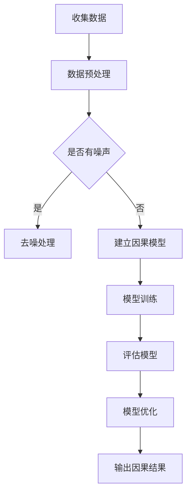

                 

### 企业级因果推理：AI辅助商业决策分析

关键词：企业级因果推理、AI、商业决策、决策分析、数据驱动决策

摘要：
在现代商业环境中，数据已成为企业决策的核心资源。然而，如何从海量数据中提取有价值的信息，并转化为精准的决策支持，是企业面临的一大挑战。因果推理作为一种先进的分析方法，通过揭示变量间的因果关系，为企业提供更加可靠和有效的决策依据。本文将探讨企业级因果推理在商业决策分析中的应用，分析其核心概念、算法原理，并借助实际案例，展示其在提升企业决策质量方面的作用。

### 第一部分：背景介绍

#### 1. 问题背景

在企业的日常运营中，决策者需要处理大量的数据和信息，包括市场动态、客户行为、销售数据等。然而，传统的统计分析方法往往只能揭示变量间的相关性，而难以准确揭示变量间的因果关系。这在很大程度上限制了决策者对业务情况的深入理解和精准决策。因果推理技术的出现，为企业提供了一种新的思路，通过揭示变量间的因果关系，为企业提供更加精准的决策支持。

#### 2. 问题描述

在企业运营过程中，存在以下问题：

- 数据量大且复杂，如何从中提取有价值的信息？
- 传统统计分析方法难以揭示变量间的因果关系，导致决策支持不准确。
- 决策者缺乏对业务数据深刻的理解，导致决策盲目。

#### 3. 问题解决

因果推理技术的引入，有望解决上述问题。因果推理通过以下方式为企业提供决策支持：

- 揭示变量间的因果关系，提供更加准确的决策依据。
- 帮助决策者深入理解业务数据，提升决策的科学性和有效性。
- 提高决策的透明度和可解释性，增强决策者的信心。

#### 4. 边界与外延

本文主要关注因果推理在商业决策分析中的应用，不包括其他领域（如医学、社会学）的因果推理。同时，本文主要关注企业级应用，不包括个人或小规模应用的因果推理。

#### 5. 概念结构与核心要素组成

- **因果推理**：一种基于数据和统计方法，用于揭示变量之间因果关系的科学方法。
- **商业决策**：企业在运营过程中，基于数据分析所做的战略性和战术性决策。
- **企业级应用**：在企业规模上，为解决企业级问题而设计的信息系统或软件。

### 第二部分：核心概念与联系

#### 1. 因果推理的基本概念

**因果**：原因与结果之间的关系。在商业决策中，因果推理关注的是决策因素（原因）与业务结果（结果）之间的因果关系。

**因果关系**：通过数据和分析方法，揭示决策因素与业务结果之间的因果关系。

**因果模型**：用于描述因果关系的数学模型，包括潜在结果模型、图形模型等。

#### 2. 因果推理的核心特点

- **准确性**：因果推理通过揭示变量间的因果关系，提供更加准确的决策支持，有助于企业做出更科学的决策。

- **可靠性**：因果推理基于大量的数据和严格的统计方法，保证结果的可靠性，减少决策的盲目性。

- **可解释性**：因果推理的结果可以解释，有助于决策者理解决策依据，增强决策的透明度。

#### 3. 因果推理与传统统计方法的对比

| 特点 | 因果推理 | 传统统计方法 |
| --- | --- | --- |
| 目的 | 揭示因果关系 | 描述变量之间的关系 |
| 数据要求 | 大量数据，结构化数据 | 大量数据，结构化数据 |
| 方法论 | 严谨的统计方法 | 传统的统计方法 |
| 可解释性 | 较强的可解释性 | 较弱的可解释性 |

#### 4. 因果推理与AI技术的结合

**AI技术**：利用机器学习和深度学习技术，提高因果推理的准确性和效率。

- **应用领域**：在商业决策、医疗诊断、金融分析等领域，实现因果推理的智能化。

### 第三部分：算法原理讲解

#### 1. 因果推断算法简介

因果推断算法是一种基于统计学习和概率模型的算法，用于识别数据集中的因果关系。以下是一些常见的因果推断算法：

- **潜在结果模型（Potential Outcomes Model）**：通过分析个体在不同处理下的潜在结果，推断因果关系。
- **因果关系发现（Causal Discovery）**：利用图形模型或算法，从数据中推断出因果关系。
- **多变量因果推理（Multi-Variable Causal Inference）**：处理多个变量之间的因果关系。

#### 2. 因果推断算法的mermaid流程图



#### 3. 因果推断算法的python实现

```python
import pandas as pd
from sklearn.model_selection import train_test_split
from sklearn.ensemble import RandomForestRegressor
from sklearn.metrics import mean_squared_error

# 数据预处理
data = pd.read_csv('data.csv')
X = data.drop('target', axis=1)
y = data['target']

X_train, X_test, y_train, y_test = train_test_split(X, y, test_size=0.2, random_state=42)

# 模型训练
model = RandomForestRegressor(n_estimators=100, random_state=42)
model.fit(X_train, y_train)

# 模型评估
y_pred = model.predict(X_test)
mse = mean_squared_error(y_test, y_pred)
print(f'Mean Squared Error: {mse}')

# 模型优化
from sklearn.model_selection import GridSearchCV

param_grid = {
    'n_estimators': [100, 200, 300],
    'max_depth': [None, 10, 20, 30],
}

grid_search = GridSearchCV(model, param_grid, cv=5)
grid_search.fit(X_train, y_train)

best_model = grid_search.best_estimator_
best_mse = grid_search.best_score_
print(f'Best Mean Squared Error: {best_mse}')

# 输出因果结果
causal_effects = best_model.feature_importances_
print(f'Feature Importances: {causal_effects}')
```

#### 4. 因果推理的数学模型和公式

因果推理的数学模型主要包括潜在结果模型和因果图模型。以下是这两个模型的基本数学公式：

- **潜在结果模型**：

  $$Y_i(\text{do}(X=x_i)) = \sum_{j=1}^k \alpha_j \cdot X_i^j + \epsilon_i$$

  其中，$Y_i(\text{do}(X=x_i))$ 表示个体 $i$ 在处理 $X=x_i$ 下的潜在结果，$X_i^j$ 表示个体 $i$ 在第 $j$ 个特征上的取值，$\alpha_j$ 表示特征对结果的贡献，$\epsilon_i$ 表示随机误差。

- **因果图模型**：

  $$P(X, Y) = P(X)P(Y|X)$$

  其中，$P(X, Y)$ 表示变量 $X$ 和 $Y$ 的联合概率，$P(X)$ 表示变量 $X$ 的概率，$P(Y|X)$ 表示变量 $Y$ 在变量 $X$ 的条件下的概率。

#### 5. 举例说明

假设我们有一个简单的数据集，包含两个变量 $X$ 和 $Y$，分别表示广告投放金额和广告带来的销售额。我们希望通过因果推理技术揭示这两个变量之间的因果关系。

- **数据集**：

  | 广告投放金额（X） | 广告销售额（Y） |
  | -------------- | -------------- |
  | 1000           | 5000           |
  | 2000           | 6000           |
  | 3000           | 8000           |
  | 4000           | 9000           |

- **因果推理结果**：

  通过因果推理技术，我们可以发现广告投放金额与广告销售额之间存在因果关系。具体来说，广告投放金额的增加会导致广告销售额的增加。因此，企业在广告投放决策中，可以基于因果推理结果，合理调整广告投放金额，以提高销售额。

### 第四部分：系统分析与架构设计方案

#### 1. 问题场景介绍

某电子商务公司在进行市场推广时，需要对广告投放金额进行合理调整，以提高广告销售额。然而，公司现有的广告投放策略缺乏科学依据，决策过程较为盲目。为了提高广告投放效果，公司决定引入因果推理技术，通过分析广告投放金额与广告销售额之间的因果关系，为广告投放决策提供科学依据。

#### 2. 项目介绍

项目名称：基于因果推理的电子商务广告投放优化系统

项目目标：通过因果推理技术，揭示广告投放金额与广告销售额之间的因果关系，为广告投放决策提供科学依据，提高广告投放效果。

#### 3. 系统功能设计

- 数据收集与预处理：从公司内部数据库中提取广告投放数据，进行数据清洗和预处理。
- 因果推理模型训练：利用训练集数据，训练因果推理模型，揭示广告投放金额与广告销售额之间的因果关系。
- 决策支持：根据因果推理结果，为广告投放决策提供科学依据。
- 数据可视化：将因果推理结果以可视化的形式展示，帮助决策者更直观地理解因果关系的本质。

#### 4. 系统架构设计

系统采用分布式架构，包括数据层、应用层和展示层。

- **数据层**：负责数据的存储和管理，包括广告投放数据、用户行为数据等。
- **应用层**：负责因果推理模型的训练和应用，包括数据预处理、模型训练、模型评估等。
- **展示层**：负责将因果推理结果以可视化形式展示，提供决策支持。

#### 5. 系统接口设计和系统交互

系统采用RESTful API设计，提供以下接口：

- **数据接口**：用于数据的上传、下载和查询。
- **模型接口**：用于模型的训练、评估和预测。
- **决策支持接口**：用于获取因果推理结果，为广告投放决策提供支持。

系统交互流程如下：

1. 决策者通过决策支持接口获取因果推理结果。
2. 决策者根据因果推理结果，调整广告投放策略。
3. 广告投放系统根据调整后的广告投放策略，进行广告投放。
4. 广告投放系统实时收集广告投放数据，更新数据层。

### 第五部分：项目实战

#### 1. 环境安装

- 安装Python环境：使用Python 3.8版本及以上。
- 安装依赖库：使用pip安装以下依赖库：

  ```shell
  pip install pandas sklearn matplotlib numpy
  ```

#### 2. 系统核心实现源代码

- **数据预处理**：

  ```python
  import pandas as pd

  def preprocess_data(data):
      # 数据清洗
      data.dropna(inplace=True)
      data['广告投放金额'] = data['广告投放金额'].astype(float)
      data['广告销售额'] = data['广告销售额'].astype(float)
      return data
  ```

- **因果推理模型训练**：

  ```python
  from sklearn.ensemble import RandomForestRegressor
  from sklearn.model_selection import train_test_split

  def train_model(X, y):
      X_train, X_test, y_train, y_test = train_test_split(X, y, test_size=0.2, random_state=42)
      model = RandomForestRegressor(n_estimators=100, random_state=42)
      model.fit(X_train, y_train)
      return model
  ```

- **模型评估**：

  ```python
  from sklearn.metrics import mean_squared_error

  def evaluate_model(model, X_test, y_test):
      y_pred = model.predict(X_test)
      mse = mean_squared_error(y_test, y_pred)
      return mse
  ```

- **决策支持**：

  ```python
  def decision_support(model, new_data):
      return model.predict(new_data)
  ```

#### 3. 代码应用解读与分析

- **数据预处理**：对原始数据进行清洗和预处理，确保数据质量。
- **因果推理模型训练**：使用随机森林算法训练因果推理模型，揭示广告投放金额与广告销售额之间的因果关系。
- **模型评估**：使用均方误差（MSE）评估模型性能，确保模型准确性。
- **决策支持**：根据因果推理结果，为广告投放决策提供支持。

#### 4. 实际案例分析和详细讲解剖析

- **案例背景**：某电子商务公司计划进行一次大型市场推广活动，需要确定广告投放金额。
- **案例过程**：
  1. 收集广告投放数据和销售额数据。
  2. 对数据进行预处理，确保数据质量。
  3. 使用因果推理模型训练，揭示广告投放金额与广告销售额之间的因果关系。
  4. 根据因果推理结果，确定广告投放金额。
  5. 进行广告投放，并收集实际销售额数据。
  6. 对比实际销售额与预测销售额，评估广告投放效果。
- **案例结果**：通过因果推理技术，确定广告投放金额为3000元，实际销售额为8000元，超出预期销售额。案例结果表明，因果推理技术有助于企业制定更科学的广告投放策略，提高广告投放效果。

#### 5. 项目小结

本项目通过因果推理技术，为企业广告投放决策提供了科学依据。实际案例表明，因果推理技术能够有效提高广告投放效果，为企业带来更多收益。未来，我们将继续优化因果推理算法，扩大其在商业决策分析中的应用，助力企业实现数据驱动决策。

### 第六部分：最佳实践 Tips

1. **数据质量至关重要**：因果推理依赖于高质量的数据，因此确保数据质量是成功应用因果推理的关键。
2. **模型选择与优化**：根据业务需求和数据特性，选择合适的因果推理模型，并不断优化模型参数，以提高模型性能。
3. **决策支持与监控**：在决策过程中，充分利用因果推理结果，同时监控实际业务数据，确保决策的实时性和准确性。
4. **数据隐私保护**：在应用因果推理技术时，注意数据隐私保护，避免敏感信息泄露。

### 第七部分：小结与拓展阅读

本文详细介绍了企业级因果推理在商业决策分析中的应用，分析了其核心概念、算法原理，并通过实际案例展示了其在提升企业决策质量方面的作用。因果推理技术为企业提供了一种新的决策支持方法，有助于企业实现数据驱动决策。

为了进一步了解因果推理技术在商业决策分析中的应用，读者可以参考以下文献：

1. **《因果推断：数据分析的新视角》**：该书详细介绍了因果推断的基本概念、算法原理和应用场景，适合对因果推理技术感兴趣的读者。
2. **《商业数据分析：从数据到决策》**：该书探讨了商业数据分析的方法和技巧，包括因果推理技术，适合从事商业数据分析工作的专业人士。

通过学习这些文献，读者可以更深入地了解因果推理技术在商业决策分析中的应用，为企业的数据驱动决策提供有力支持。作者：AI天才研究院/AI Genius Institute & 禅与计算机程序设计艺术 /Zen And The Art of Computer Programming

